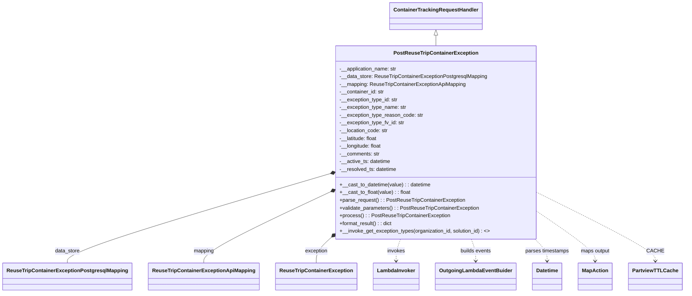

# Diagram: container_tracking_core/container_tracking_service/container_tracking_service/api/exception/handlers/PostReuseTripContainerException.py


> Auto-generated by Obscura crawlers

## Diagram 1



### SVG

<svg id="container" width="2034.53125" xmlns="http://www.w3.org/2000/svg" class="classDiagram" height="908" viewBox="0 0 2034.53125 908" role="graphics-document document" aria-roledescription="class"><style>#container{font-family:"trebuchet ms",verdana,arial,sans-serif;font-size:16px;fill:#333;}@keyframes edge-animation-frame{from{stroke-dashoffset:0;}}@keyframes dash{to{stroke-dashoffset:0;}}#container .edge-animation-slow{stroke-dasharray:9,5!important;stroke-dashoffset:900;animation:dash 50s linear infinite;stroke-linecap:round;}#container .edge-animation-fast{stroke-dasharray:9,5!important;stroke-dashoffset:900;animation:dash 20s linear infinite;stroke-linecap:round;}#container .error-icon{fill:#552222;}#container .error-text{fill:#552222;stroke:#552222;}#container .edge-thickness-normal{stroke-width:1px;}#container .edge-thickness-thick{stroke-width:3.5px;}#container .edge-pattern-solid{stroke-dasharray:0;}#container .edge-thickness-invisible{stroke-width:0;fill:none;}#container .edge-pattern-dashed{stroke-dasharray:3;}#container .edge-pattern-dotted{stroke-dasharray:2;}#container .marker{fill:#333333;stroke:#333333;}#container .marker.cross{stroke:#333333;}#container svg{font-family:"trebuchet ms",verdana,arial,sans-serif;font-size:16px;}#container p{margin:0;}#container g.classGroup text{fill:#9370DB;stroke:none;font-family:"trebuchet ms",verdana,arial,sans-serif;font-size:10px;}#container g.classGroup text .title{font-weight:bolder;}#container .nodeLabel,#container .edgeLabel{color:#131300;}#container .edgeLabel .label rect{fill:#ECECFF;}#container .label text{fill:#131300;}#container .labelBkg{background:#ECECFF;}#container .edgeLabel .label span{background:#ECECFF;}#container .classTitle{font-weight:bolder;}#container .node rect,#container .node circle,#container .node ellipse,#container .node polygon,#container .node path{fill:#ECECFF;stroke:#9370DB;stroke-width:1px;}#container .divider{stroke:#9370DB;stroke-width:1;}#container g.clickable{cursor:pointer;}#container g.classGroup rect{fill:#ECECFF;stroke:#9370DB;}#container g.classGroup line{stroke:#9370DB;stroke-width:1;}#container .classLabel .box{stroke:none;stroke-width:0;fill:#ECECFF;opacity:0.5;}#container .classLabel .label{fill:#9370DB;font-size:10px;}#container .relation{stroke:#333333;stroke-width:1;fill:none;}#container .dashed-line{stroke-dasharray:3;}#container .dotted-line{stroke-dasharray:1 2;}#container #compositionStart,#container .composition{fill:#333333!important;stroke:#333333!important;stroke-width:1;}#container #compositionEnd,#container .composition{fill:#333333!important;stroke:#333333!important;stroke-width:1;}#container #dependencyStart,#container .dependency{fill:#333333!important;stroke:#333333!important;stroke-width:1;}#container #dependencyStart,#container .dependency{fill:#333333!important;stroke:#333333!important;stroke-width:1;}#container #extensionStart,#container .extension{fill:transparent!important;stroke:#333333!important;stroke-width:1;}#container #extensionEnd,#container .extension{fill:transparent!important;stroke:#333333!important;stroke-width:1;}#container #aggregationStart,#container .aggregation{fill:transparent!important;stroke:#333333!important;stroke-width:1;}#container #aggregationEnd,#container .aggregation{fill:transparent!important;stroke:#333333!important;stroke-width:1;}#container #lollipopStart,#container .lollipop{fill:#ECECFF!important;stroke:#333333!important;stroke-width:1;}#container #lollipopEnd,#container .lollipop{fill:#ECECFF!important;stroke:#333333!important;stroke-width:1;}#container .edgeTerminals{font-size:11px;line-height:initial;}#container .classTitleText{text-anchor:middle;font-size:18px;fill:#333;}#container .label-icon{display:inline-block;height:1em;overflow:visible;vertical-align:-0.125em;}#container .node .label-icon path{fill:currentColor;stroke:revert;stroke-width:revert;}#container :root{--mermaid-font-family:"trebuchet ms",verdana,arial,sans-serif;}</style><g><defs><marker id="container_class-aggregationStart" class="marker aggregation class" refX="18" refY="7" markerWidth="190" markerHeight="240" orient="auto"><path d="M 18,7 L9,13 L1,7 L9,1 Z"></path></marker></defs><defs><marker id="container_class-aggregationEnd" class="marker aggregation class" refX="1" refY="7" markerWidth="20" markerHeight="28" orient="auto"><path d="M 18,7 L9,13 L1,7 L9,1 Z"></path></marker></defs><defs><marker id="container_class-extensionStart" class="marker extension class" refX="18" refY="7" markerWidth="190" markerHeight="240" orient="auto"><path d="M 1,7 L18,13 V 1 Z"></path></marker></defs><defs><marker id="container_class-extensionEnd" class="marker extension class" refX="1" refY="7" markerWidth="20" markerHeight="28" orient="auto"><path d="M 1,1 V 13 L18,7 Z"></path></marker></defs><defs><marker id="container_class-compositionStart" class="marker composition class" refX="18" refY="7" markerWidth="190" markerHeight="240" orient="auto"><path d="M 18,7 L9,13 L1,7 L9,1 Z"></path></marker></defs><defs><marker id="container_class-compositionEnd" class="marker composition class" refX="1" refY="7" markerWidth="20" markerHeight="28" orient="auto"><path d="M 18,7 L9,13 L1,7 L9,1 Z"></path></marker></defs><defs><marker id="container_class-dependencyStart" class="marker dependency class" refX="6" refY="7" markerWidth="190" markerHeight="240" orient="auto"><path d="M 5,7 L9,13 L1,7 L9,1 Z"></path></marker></defs><defs><marker id="container_class-dependencyEnd" class="marker dependency class" refX="13" refY="7" markerWidth="20" markerHeight="28" orient="auto"><path d="M 18,7 L9,13 L14,7 L9,1 Z"></path></marker></defs><defs><marker id="container_class-lollipopStart" class="marker lollipop class" refX="13" refY="7" markerWidth="190" markerHeight="240" orient="auto"><circle stroke="black" fill="transparent" cx="7" cy="7" r="6"></circle></marker></defs><defs><marker id="container_class-lollipopEnd" class="marker lollipop class" refX="1" refY="7" markerWidth="190" markerHeight="240" orient="auto"><circle stroke="black" fill="transparent" cx="7" cy="7" r="6"></circle></marker></defs><g class="root"><g class="clusters"></g><g class="edgePaths"><path d="M1291,109.25L1291,110.542C1291,111.833,1291,114.417,1291,119.875C1291,125.333,1291,133.667,1291,137.833L1291,142" id="id_ContainerTrackingRequestHandler_PostReuseTripContainerException_1" class="edge-thickness-normal edge-pattern-solid relation" style=";;;" data-edge="true" data-et="edge" data-id="id_ContainerTrackingRequestHandler_PostReuseTripContainerException_1" data-points="W3sieCI6MTI5MSwieSI6OTJ9LHsieCI6MTI5MSwieSI6MTE3fSx7IngiOjEyOTEsInkiOjE0Mn1d" marker-start="url(#container_class-extensionStart)"></path><path d="M965.891,542.25L837.927,581.708C709.964,621.166,454.037,700.083,326.073,745.708C198.109,791.333,198.109,803.667,198.109,809.833L198.109,816" id="id_PostReuseTripContainerException_ReuseTripContainerExceptionPostgresqlMapping_2" class="edge-thickness-normal edge-pattern-solid relation" style=";;;" data-edge="true" data-et="edge" data-id="id_PostReuseTripContainerException_ReuseTripContainerExceptionPostgresqlMapping_2" data-points="W3sieCI6OTgyLjM3NSwieSI6NTM3LjE2NjU0NTE0MjYxMn0seyJ4IjoxOTguMTA5Mzc1LCJ5Ijo3Nzl9LHsieCI6MTk4LjEwOTM3NSwieSI6ODE2fV0=" marker-start="url(#container_class-compositionStart)"></path><path d="M966.876,600.345L905.926,630.121C844.977,659.897,723.078,719.448,662.129,755.391C601.18,791.333,601.18,803.667,601.18,809.833L601.18,816" id="id_PostReuseTripContainerException_ReuseTripContainerExceptionApiMapping_3" class="edge-thickness-normal edge-pattern-solid relation" style=";;;" data-edge="true" data-et="edge" data-id="id_PostReuseTripContainerException_ReuseTripContainerExceptionApiMapping_3" data-points="W3sieCI6OTgyLjM3NSwieSI6NTkyLjc3MzUwMzA2MzUyNDJ9LHsieCI6NjAxLjE3OTY4NzUsInkiOjc3OX0seyJ4Ijo2MDEuMTc5Njg3NSwieSI6ODE2fV0=" marker-start="url(#container_class-compositionStart)"></path><path d="M969.829,745.053L963.832,750.71C957.836,756.368,945.844,767.684,939.848,779.509C933.852,791.333,933.852,803.667,933.852,809.833L933.852,816" id="id_PostReuseTripContainerException_ReuseTripContainerException_4" class="edge-thickness-normal edge-pattern-solid relation" style=";;;" data-edge="true" data-et="edge" data-id="id_PostReuseTripContainerException_ReuseTripContainerException_4" data-points="W3sieCI6OTgyLjM3NSwieSI6NzMzLjIxMzk5OTc4MTI1MzR9LHsieCI6OTMzLjg1MTU2MjUsInkiOjc3OX0seyJ4Ijo5MzMuODUxNTYyNSwieSI6ODE2fV0=" marker-start="url(#container_class-compositionStart)"></path><path d="M1185.295,742L1183.122,748.167C1180.949,754.333,1176.603,766.667,1174.431,778C1172.258,789.333,1172.258,799.667,1172.258,804.833L1172.258,810" id="id_PostReuseTripContainerException_LambdaInvoker_5" class="edge-thickness-normal edge-pattern-dashed relation" style=";;;" data-edge="true" data-et="edge" data-id="id_PostReuseTripContainerException_LambdaInvoker_5" data-points="W3sieCI6MTE4NS4yOTQ3ODg1NzU2Njc2LCJ5Ijo3NDJ9LHsieCI6MTE3Mi4yNTc4MTI1LCJ5Ijo3Nzl9LHsieCI6MTE3Mi4yNTc4MTI1LCJ5Ijo4MTZ9XQ==" marker-end="url(#container_class-dependencyEnd)"></path><path d="M1396.705,742L1398.878,748.167C1401.051,754.333,1405.397,766.667,1407.569,778C1409.742,789.333,1409.742,799.667,1409.742,804.833L1409.742,810" id="id_PostReuseTripContainerException_OutgoingLambdaEventBuider_6" class="edge-thickness-normal edge-pattern-dashed relation" style=";;;" data-edge="true" data-et="edge" data-id="id_PostReuseTripContainerException_OutgoingLambdaEventBuider_6" data-points="W3sieCI6MTM5Ni43MDUyMTE0MjQzMzI0LCJ5Ijo3NDJ9LHsieCI6MTQwOS43NDIxODc1LCJ5Ijo3Nzl9LHsieCI6MTQwOS43NDIxODc1LCJ5Ijo4MTZ9XQ==" marker-end="url(#container_class-dependencyEnd)"></path><path d="M1587.377,742L1593.469,748.167C1599.561,754.333,1611.745,766.667,1617.838,778C1623.93,789.333,1623.93,799.667,1623.93,804.833L1623.93,810" id="id_PostReuseTripContainerException_Datetime_7" class="edge-thickness-normal edge-pattern-dashed relation" style=";;;" data-edge="true" data-et="edge" data-id="id_PostReuseTripContainerException_Datetime_7" data-points="W3sieCI6MTU4Ny4zNzY1NzY0MDk0OTU2LCJ5Ijo3NDJ9LHsieCI6MTYyMy45Mjk2ODc1LCJ5Ijo3Nzl9LHsieCI6MTYyMy45Mjk2ODc1LCJ5Ijo4MTZ9XQ==" marker-end="url(#container_class-dependencyEnd)"></path><path d="M1599.625,659.151L1628.014,679.125C1656.404,699.1,1713.182,739.05,1741.572,764.192C1769.961,789.333,1769.961,799.667,1769.961,804.833L1769.961,810" id="id_PostReuseTripContainerException_MapAction_8" class="edge-thickness-normal edge-pattern-dashed relation" style=";;;" data-edge="true" data-et="edge" data-id="id_PostReuseTripContainerException_MapAction_8" data-points="W3sieCI6MTU5OS42MjUsInkiOjY1OS4xNTA1Mzc0NTkwMTc4fSx7IngiOjE3NjkuOTYwOTM3NSwieSI6Nzc5fSx7IngiOjE3NjkuOTYwOTM3NSwieSI6ODE2fV0=" marker-end="url(#container_class-dependencyEnd)"></path><path d="M1599.625,600.17L1657.781,629.975C1715.938,659.78,1832.25,719.39,1890.406,754.362C1948.563,789.333,1948.563,799.667,1948.563,804.833L1948.563,810" id="id_PostReuseTripContainerException_PartviewTTLCache_9" class="edge-thickness-normal edge-pattern-dashed relation" style=";;;" data-edge="true" data-et="edge" data-id="id_PostReuseTripContainerException_PartviewTTLCache_9" data-points="W3sieCI6MTU5OS42MjUsInkiOjYwMC4xNjk5NDU4MjI2NDA0fSx7IngiOjE5NDguNTYyNSwieSI6Nzc5fSx7IngiOjE5NDguNTYyNSwieSI6ODE2fV0=" marker-end="url(#container_class-dependencyEnd)"></path></g><g class="edgeLabels"><g class="edgeLabel"><g class="label" data-id="id_ContainerTrackingRequestHandler_PostReuseTripContainerException_1" transform="translate(0, 0)"><foreignObject width="0" height="0"><div xmlns="http://www.w3.org/1999/xhtml" class="labelBkg" style="display: table-cell; white-space: nowrap; line-height: 1.5; max-width: 200px; text-align: center;"><span class="edgeLabel"></span></div></foreignObject></g></g><g class="edgeLabel" transform="translate(198.109375, 779)"><g class="label" data-id="id_PostReuseTripContainerException_ReuseTripContainerExceptionPostgresqlMapping_2" transform="translate(-38.8671875, -12)"><foreignObject width="77.734375" height="24"><div xmlns="http://www.w3.org/1999/xhtml" class="labelBkg" style="display: table-cell; white-space: nowrap; line-height: 1.5; max-width: 200px; text-align: center;"><span class="edgeLabel"><p>data_store</p></span></div></foreignObject></g></g><g class="edgeLabel" transform="translate(601.1796875, 779)"><g class="label" data-id="id_PostReuseTripContainerException_ReuseTripContainerExceptionApiMapping_3" transform="translate(-31.8203125, -12)"><foreignObject width="63.640625" height="24"><div xmlns="http://www.w3.org/1999/xhtml" class="labelBkg" style="display: table-cell; white-space: nowrap; line-height: 1.5; max-width: 200px; text-align: center;"><span class="edgeLabel"><p>mapping</p></span></div></foreignObject></g></g><g class="edgeLabel" transform="translate(933.8515625, 779)"><g class="label" data-id="id_PostReuseTripContainerException_ReuseTripContainerException_4" transform="translate(-35.3828125, -12)"><foreignObject width="70.765625" height="24"><div xmlns="http://www.w3.org/1999/xhtml" class="labelBkg" style="display: table-cell; white-space: nowrap; line-height: 1.5; max-width: 200px; text-align: center;"><span class="edgeLabel"><p>exception</p></span></div></foreignObject></g></g><g class="edgeLabel" transform="translate(1172.2578125, 779)"><g class="label" data-id="id_PostReuseTripContainerException_LambdaInvoker_5" transform="translate(-27.5859375, -12)"><foreignObject width="55.171875" height="24"><div xmlns="http://www.w3.org/1999/xhtml" class="labelBkg" style="display: table-cell; white-space: nowrap; line-height: 1.5; max-width: 200px; text-align: center;"><span class="edgeLabel"><p>invokes</p></span></div></foreignObject></g></g><g class="edgeLabel" transform="translate(1409.7421875, 779)"><g class="label" data-id="id_PostReuseTripContainerException_OutgoingLambdaEventBuider_6" transform="translate(-48.515625, -12)"><foreignObject width="97.03125" height="24"><div xmlns="http://www.w3.org/1999/xhtml" class="labelBkg" style="display: table-cell; white-space: nowrap; line-height: 1.5; max-width: 200px; text-align: center;"><span class="edgeLabel"><p>builds events</p></span></div></foreignObject></g></g><g class="edgeLabel" transform="translate(1623.9296875, 779)"><g class="label" data-id="id_PostReuseTripContainerException_Datetime_7" transform="translate(-68.5703125, -12)"><foreignObject width="137.140625" height="24"><div xmlns="http://www.w3.org/1999/xhtml" class="labelBkg" style="display: table-cell; white-space: nowrap; line-height: 1.5; max-width: 200px; text-align: center;"><span class="edgeLabel"><p>parses timestamps</p></span></div></foreignObject></g></g><g class="edgeLabel" transform="translate(1769.9609375, 779)"><g class="label" data-id="id_PostReuseTripContainerException_MapAction_8" transform="translate(-46.328125, -12)"><foreignObject width="92.65625" height="24"><div xmlns="http://www.w3.org/1999/xhtml" class="labelBkg" style="display: table-cell; white-space: nowrap; line-height: 1.5; max-width: 200px; text-align: center;"><span class="edgeLabel"><p>maps output</p></span></div></foreignObject></g></g><g class="edgeLabel" transform="translate(1948.5625, 779)"><g class="label" data-id="id_PostReuseTripContainerException_PartviewTTLCache_9" transform="translate(-23.1875, -12)"><foreignObject width="46.375" height="24"><div xmlns="http://www.w3.org/1999/xhtml" class="labelBkg" style="display: table-cell; white-space: nowrap; line-height: 1.5; max-width: 200px; text-align: center;"><span class="edgeLabel"><p>CACHE</p></span></div></foreignObject></g></g></g><g class="nodes"><g class="node default" id="classId-ContainerTrackingRequestHandler-0" transform="translate(1291, 50)"><g class="basic label-container"><path d="M-137.5859375 -42 L137.5859375 -42 L137.5859375 42 L-137.5859375 42" stroke="none" stroke-width="0" fill="#ECECFF" style=""></path><path d="M-137.5859375 -42 C-58.07845058116882 -42, 21.429036337662353 -42, 137.5859375 -42 M-137.5859375 -42 C-80.61600523893742 -42, -23.64607297787485 -42, 137.5859375 -42 M137.5859375 -42 C137.5859375 -23.844525940101335, 137.5859375 -5.689051880202669, 137.5859375 42 M137.5859375 -42 C137.5859375 -21.03191704317624, 137.5859375 -0.06383408635247889, 137.5859375 42 M137.5859375 42 C31.617874916016476 42, -74.35018766796705 42, -137.5859375 42 M137.5859375 42 C61.49355691583702 42, -14.598823668325963 42, -137.5859375 42 M-137.5859375 42 C-137.5859375 17.948354036420717, -137.5859375 -6.1032919271585655, -137.5859375 -42 M-137.5859375 42 C-137.5859375 8.625962020218779, -137.5859375 -24.748075959562442, -137.5859375 -42" stroke="#9370DB" stroke-width="1.3" fill="none" stroke-dasharray="0 0" style=""></path></g><g class="annotation-group text" transform="translate(0, -18)"></g><g class="label-group text" transform="translate(-125.5859375, -18)"><g class="label" style="font-weight: bolder" transform="translate(0,-12)"><foreignObject width="251.171875" height="24"><div xmlns="http://www.w3.org/1999/xhtml" style="display: table-cell; white-space: nowrap; line-height: 1.5; max-width: 299px; text-align: center;"><span class="nodeLabel markdown-node-label" style=""><p>ContainerTrackingRequestHandler</p></span></div></foreignObject></g></g><g class="members-group text" transform="translate(-125.5859375, 30)"></g><g class="methods-group text" transform="translate(-125.5859375, 60)"></g><g class="divider" style=""><path d="M-137.5859375 6 C-50.590738534164984 6, 36.40446043167003 6, 137.5859375 6 M-137.5859375 6 C-28.17676093370278 6, 81.23241563259444 6, 137.5859375 6" stroke="#9370DB" stroke-width="1.3" fill="none" stroke-dasharray="0 0" style=""></path></g><g class="divider" style=""><path d="M-137.5859375 24 C-53.81114939751346 24, 29.96363870497308 24, 137.5859375 24 M-137.5859375 24 C-75.28665373851146 24, -12.987369977022922 24, 137.5859375 24" stroke="#9370DB" stroke-width="1.3" fill="none" stroke-dasharray="0 0" style=""></path></g></g><g class="node default" id="classId-PostReuseTripContainerException-1" transform="translate(1291, 442)"><g class="basic label-container"><path d="M-308.625 -300 L308.625 -300 L308.625 300 L-308.625 300" stroke="none" stroke-width="0" fill="#ECECFF" style=""></path><path d="M-308.625 -300 C-105.58371236118651 -300, 97.45757527762697 -300, 308.625 -300 M-308.625 -300 C-112.54797403923303 -300, 83.52905192153395 -300, 308.625 -300 M308.625 -300 C308.625 -151.58223919502043, 308.625 -3.1644783900408697, 308.625 300 M308.625 -300 C308.625 -111.11345580190931, 308.625 77.77308839618138, 308.625 300 M308.625 300 C96.04168678423957 300, -116.54162643152085 300, -308.625 300 M308.625 300 C64.6874613287545 300, -179.250077342491 300, -308.625 300 M-308.625 300 C-308.625 84.2941967662704, -308.625 -131.4116064674592, -308.625 -300 M-308.625 300 C-308.625 90.1302682835661, -308.625 -119.73946343286781, -308.625 -300" stroke="#9370DB" stroke-width="1.3" fill="none" stroke-dasharray="0 0" style=""></path></g><g class="annotation-group text" transform="translate(0, -276)"></g><g class="label-group text" transform="translate(-123.890625, -276)"><g class="label" style="font-weight: bolder" transform="translate(0,-12)"><foreignObject width="247.78125" height="24"><div xmlns="http://www.w3.org/1999/xhtml" style="display: table-cell; white-space: nowrap; line-height: 1.5; max-width: 294px; text-align: center;"><span class="nodeLabel markdown-node-label" style=""><p>PostReuseTripContainerException</p></span></div></foreignObject></g></g><g class="members-group text" transform="translate(-296.625, -228)"><g class="label" style="" transform="translate(0,-12)"><foreignObject width="179.78125" height="24"><div xmlns="http://www.w3.org/1999/xhtml" style="display: table-cell; white-space: nowrap; line-height: 1.5; max-width: 238px; text-align: center;"><span class="nodeLabel markdown-node-label" style=""><p>-__application_name: str</p></span></div></foreignObject></g><g class="label" style="" transform="translate(0,12)"><foreignObject width="458.046875" height="24"><div xmlns="http://www.w3.org/1999/xhtml" style="display: table-cell; white-space: nowrap; line-height: 1.5; max-width: 516px; text-align: center;"><span class="nodeLabel markdown-node-label" style=""><p>-__data_store: ReuseTripContainerExceptionPostgresqlMapping</p></span></div></foreignObject></g><g class="label" style="" transform="translate(0,36)"><foreignObject width="391.8125" height="24"><div xmlns="http://www.w3.org/1999/xhtml" style="display: table-cell; white-space: nowrap; line-height: 1.5; max-width: 450px; text-align: center;"><span class="nodeLabel markdown-node-label" style=""><p>-__mapping: ReuseTripContainerExceptionApiMapping</p></span></div></foreignObject></g><g class="label" style="" transform="translate(0,60)"><foreignObject width="139.15625" height="24"><div xmlns="http://www.w3.org/1999/xhtml" style="display: table-cell; white-space: nowrap; line-height: 1.5; max-width: 197px; text-align: center;"><span class="nodeLabel markdown-node-label" style=""><p>-__container_id: str</p></span></div></foreignObject></g><g class="label" style="" transform="translate(0,84)"><foreignObject width="181.46875" height="24"><div xmlns="http://www.w3.org/1999/xhtml" style="display: table-cell; white-space: nowrap; line-height: 1.5; max-width: 240px; text-align: center;"><span class="nodeLabel markdown-node-label" style=""><p>-__exception_type_id: str</p></span></div></foreignObject></g><g class="label" style="" transform="translate(0,108)"><foreignObject width="207.890625" height="24"><div xmlns="http://www.w3.org/1999/xhtml" style="display: table-cell; white-space: nowrap; line-height: 1.5; max-width: 266px; text-align: center;"><span class="nodeLabel markdown-node-label" style=""><p>-__exception_type_name: str</p></span></div></foreignObject></g><g class="label" style="" transform="translate(0,132)"><foreignObject width="259.34375" height="24"><div xmlns="http://www.w3.org/1999/xhtml" style="display: table-cell; white-space: nowrap; line-height: 1.5; max-width: 318px; text-align: center;"><span class="nodeLabel markdown-node-label" style=""><p>-__exception_type_reason_code: str</p></span></div></foreignObject></g><g class="label" style="" transform="translate(0,156)"><foreignObject width="202.21875" height="24"><div xmlns="http://www.w3.org/1999/xhtml" style="display: table-cell; white-space: nowrap; line-height: 1.5; max-width: 260px; text-align: center;"><span class="nodeLabel markdown-node-label" style=""><p>-__exception_type_fv_id: str</p></span></div></foreignObject></g><g class="label" style="" transform="translate(0,180)"><foreignObject width="151.109375" height="24"><div xmlns="http://www.w3.org/1999/xhtml" style="display: table-cell; white-space: nowrap; line-height: 1.5; max-width: 209px; text-align: center;"><span class="nodeLabel markdown-node-label" style=""><p>-__location_code: str</p></span></div></foreignObject></g><g class="label" style="" transform="translate(0,204)"><foreignObject width="119.609375" height="24"><div xmlns="http://www.w3.org/1999/xhtml" style="display: table-cell; white-space: nowrap; line-height: 1.5; max-width: 177px; text-align: center;"><span class="nodeLabel markdown-node-label" style=""><p>-__latitude: float</p></span></div></foreignObject></g><g class="label" style="" transform="translate(0,228)"><foreignObject width="132.171875" height="24"><div xmlns="http://www.w3.org/1999/xhtml" style="display: table-cell; white-space: nowrap; line-height: 1.5; max-width: 190px; text-align: center;"><span class="nodeLabel markdown-node-label" style=""><p>-__longitude: float</p></span></div></foreignObject></g><g class="label" style="" transform="translate(0,252)"><foreignObject width="124.28125" height="24"><div xmlns="http://www.w3.org/1999/xhtml" style="display: table-cell; white-space: nowrap; line-height: 1.5; max-width: 182px; text-align: center;"><span class="nodeLabel markdown-node-label" style=""><p>-__comments: str</p></span></div></foreignObject></g><g class="label" style="" transform="translate(0,276)"><foreignObject width="158.765625" height="24"><div xmlns="http://www.w3.org/1999/xhtml" style="display: table-cell; white-space: nowrap; line-height: 1.5; max-width: 216px; text-align: center;"><span class="nodeLabel markdown-node-label" style=""><p>-__active_ts: datetime</p></span></div></foreignObject></g><g class="label" style="" transform="translate(0,300)"><foreignObject width="178.09375" height="24"><div xmlns="http://www.w3.org/1999/xhtml" style="display: table-cell; white-space: nowrap; line-height: 1.5; max-width: 235px; text-align: center;"><span class="nodeLabel markdown-node-label" style=""><p>-__resolved_ts: datetime</p></span></div></foreignObject></g></g><g class="methods-group text" transform="translate(-296.625, 132)"><g class="label" style="" transform="translate(0,-12)"><foreignObject width="282.859375" height="24"><div xmlns="http://www.w3.org/1999/xhtml" style="display: table-cell; white-space: nowrap; line-height: 1.5; max-width: 340px; text-align: center;"><span class="nodeLabel markdown-node-label" style=""><p>+__cast_to_datetime(value) : : datetime</p></span></div></foreignObject></g><g class="label" style="" transform="translate(0,12)"><foreignObject width="218.46875" height="24"><div xmlns="http://www.w3.org/1999/xhtml" style="display: table-cell; white-space: nowrap; line-height: 1.5; max-width: 276px; text-align: center;"><span class="nodeLabel markdown-node-label" style=""><p>+__cast_to_float(value) : : float</p></span></div></foreignObject></g><g class="label" style="" transform="translate(0,36)"><foreignObject width="386.5" height="24"><div xmlns="http://www.w3.org/1999/xhtml" style="display: table-cell; white-space: nowrap; line-height: 1.5; max-width: 444px; text-align: center;"><span class="nodeLabel markdown-node-label" style=""><p>+parse_request() : : PostReuseTripContainerException</p></span></div></foreignObject></g><g class="label" style="" transform="translate(0,60)"><foreignObject width="431.25" height="24"><div xmlns="http://www.w3.org/1999/xhtml" style="display: table-cell; white-space: nowrap; line-height: 1.5; max-width: 489px; text-align: center;"><span class="nodeLabel markdown-node-label" style=""><p>+validate_parameters() : : PostReuseTripContainerException</p></span></div></foreignObject></g><g class="label" style="" transform="translate(0,84)"><foreignObject width="338.4375" height="24"><div xmlns="http://www.w3.org/1999/xhtml" style="display: table-cell; white-space: nowrap; line-height: 1.5; max-width: 396px; text-align: center;"><span class="nodeLabel markdown-node-label" style=""><p>+process() : : PostReuseTripContainerException</p></span></div></foreignObject></g><g class="label" style="" transform="translate(0,108)"><foreignObject width="164.921875" height="24"><div xmlns="http://www.w3.org/1999/xhtml" style="display: table-cell; white-space: nowrap; line-height: 1.5; max-width: 222px; text-align: center;"><span class="nodeLabel markdown-node-label" style=""><p>+format_result() : : dict</p></span></div></foreignObject></g><g class="label" style="" transform="translate(0,132)"><foreignObject width="469.359375" height="24"><div xmlns="http://www.w3.org/1999/xhtml" style="display: table-cell; white-space: nowrap; line-height: 1.5; max-width: 567px; text-align: center;"><span class="nodeLabel markdown-node-label" style=""><p>+__invoke_get_exception_types(organization_id, solution_id) : &lt;&gt;</p></span></div></foreignObject></g></g><g class="divider" style=""><path d="M-308.625 -252 C-179.86569367277949 -252, -51.10638734555897 -252, 308.625 -252 M-308.625 -252 C-99.01010353613424 -252, 110.60479292773152 -252, 308.625 -252" stroke="#9370DB" stroke-width="1.3" fill="none" stroke-dasharray="0 0" style=""></path></g><g class="divider" style=""><path d="M-308.625 108 C-114.49977715350144 108, 79.62544569299712 108, 308.625 108 M-308.625 108 C-135.40381437716238 108, 37.81737124567525 108, 308.625 108" stroke="#9370DB" stroke-width="1.3" fill="none" stroke-dasharray="0 0" style=""></path></g></g><g class="node default" id="classId-ReuseTripContainerExceptionPostgresqlMapping-2" transform="translate(198.109375, 858)"><g class="basic label-container"><path d="M-190.109375 -42 L190.109375 -42 L190.109375 42 L-190.109375 42" stroke="none" stroke-width="0" fill="#ECECFF" style=""></path><path d="M-190.109375 -42 C-64.12609523235632 -42, 61.85718453528736 -42, 190.109375 -42 M-190.109375 -42 C-46.345871115612425 -42, 97.41763276877515 -42, 190.109375 -42 M190.109375 -42 C190.109375 -8.949545117664698, 190.109375 24.100909764670604, 190.109375 42 M190.109375 -42 C190.109375 -14.559077770832708, 190.109375 12.881844458334584, 190.109375 42 M190.109375 42 C88.87620558019485 42, -12.356963839610302 42, -190.109375 42 M190.109375 42 C57.3500908055839 42, -75.4091933888322 42, -190.109375 42 M-190.109375 42 C-190.109375 10.027031739249399, -190.109375 -21.945936521501203, -190.109375 -42 M-190.109375 42 C-190.109375 10.295377170974206, -190.109375 -21.40924565805159, -190.109375 -42" stroke="#9370DB" stroke-width="1.3" fill="none" stroke-dasharray="0 0" style=""></path></g><g class="annotation-group text" transform="translate(0, -18)"></g><g class="label-group text" transform="translate(-178.109375, -18)"><g class="label" style="font-weight: bolder" transform="translate(0,-12)"><foreignObject width="356.21875" height="24"><div xmlns="http://www.w3.org/1999/xhtml" style="display: table-cell; white-space: nowrap; line-height: 1.5; max-width: 402px; text-align: center;"><span class="nodeLabel markdown-node-label" style=""><p>ReuseTripContainerExceptionPostgresqlMapping</p></span></div></foreignObject></g></g><g class="members-group text" transform="translate(-178.109375, 30)"></g><g class="methods-group text" transform="translate(-178.109375, 60)"></g><g class="divider" style=""><path d="M-190.109375 6 C-75.62663493803215 6, 38.85610512393569 6, 190.109375 6 M-190.109375 6 C-90.39349005703704 6, 9.322394885925917 6, 190.109375 6" stroke="#9370DB" stroke-width="1.3" fill="none" stroke-dasharray="0 0" style=""></path></g><g class="divider" style=""><path d="M-190.109375 24 C-57.91691796348994 24, 74.27553907302013 24, 190.109375 24 M-190.109375 24 C-81.28666703050327 24, 27.536040938993466 24, 190.109375 24" stroke="#9370DB" stroke-width="1.3" fill="none" stroke-dasharray="0 0" style=""></path></g></g><g class="node default" id="classId-ReuseTripContainerExceptionApiMapping-3" transform="translate(601.1796875, 858)"><g class="basic label-container"><path d="M-162.9609375 -42 L162.9609375 -42 L162.9609375 42 L-162.9609375 42" stroke="none" stroke-width="0" fill="#ECECFF" style=""></path><path d="M-162.9609375 -42 C-77.64234963814766 -42, 7.676238223704672 -42, 162.9609375 -42 M-162.9609375 -42 C-93.31705151099827 -42, -23.673165521996538 -42, 162.9609375 -42 M162.9609375 -42 C162.9609375 -14.134436484023006, 162.9609375 13.731127031953989, 162.9609375 42 M162.9609375 -42 C162.9609375 -8.944956268157433, 162.9609375 24.110087463685133, 162.9609375 42 M162.9609375 42 C69.75474261938997 42, -23.451452261220055 42, -162.9609375 42 M162.9609375 42 C88.44544847233966 42, 13.929959444679326 42, -162.9609375 42 M-162.9609375 42 C-162.9609375 12.985420745378136, -162.9609375 -16.02915850924373, -162.9609375 -42 M-162.9609375 42 C-162.9609375 11.000764710632485, -162.9609375 -19.99847057873503, -162.9609375 -42" stroke="#9370DB" stroke-width="1.3" fill="none" stroke-dasharray="0 0" style=""></path></g><g class="annotation-group text" transform="translate(0, -18)"></g><g class="label-group text" transform="translate(-150.9609375, -18)"><g class="label" style="font-weight: bolder" transform="translate(0,-12)"><foreignObject width="301.921875" height="24"><div xmlns="http://www.w3.org/1999/xhtml" style="display: table-cell; white-space: nowrap; line-height: 1.5; max-width: 349px; text-align: center;"><span class="nodeLabel markdown-node-label" style=""><p>ReuseTripContainerExceptionApiMapping</p></span></div></foreignObject></g></g><g class="members-group text" transform="translate(-150.9609375, 30)"></g><g class="methods-group text" transform="translate(-150.9609375, 60)"></g><g class="divider" style=""><path d="M-162.9609375 6 C-78.16189621953278 6, 6.637145060934444 6, 162.9609375 6 M-162.9609375 6 C-60.57772249600997 6, 41.80549250798006 6, 162.9609375 6" stroke="#9370DB" stroke-width="1.3" fill="none" stroke-dasharray="0 0" style=""></path></g><g class="divider" style=""><path d="M-162.9609375 24 C-85.66558336319194 24, -8.370229226383884 24, 162.9609375 24 M-162.9609375 24 C-51.6980258425599 24, 59.5648858148802 24, 162.9609375 24" stroke="#9370DB" stroke-width="1.3" fill="none" stroke-dasharray="0 0" style=""></path></g></g><g class="node default" id="classId-ReuseTripContainerException-4" transform="translate(933.8515625, 858)"><g class="basic label-container"><path d="M-119.7109375 -42 L119.7109375 -42 L119.7109375 42 L-119.7109375 42" stroke="none" stroke-width="0" fill="#ECECFF" style=""></path><path d="M-119.7109375 -42 C-33.54990433921911 -42, 52.61112882156178 -42, 119.7109375 -42 M-119.7109375 -42 C-33.29704138620234 -42, 53.116854727595324 -42, 119.7109375 -42 M119.7109375 -42 C119.7109375 -13.9083707221915, 119.7109375 14.183258555617002, 119.7109375 42 M119.7109375 -42 C119.7109375 -14.027471072611377, 119.7109375 13.945057854777247, 119.7109375 42 M119.7109375 42 C60.65963597247709 42, 1.6083344449541812 42, -119.7109375 42 M119.7109375 42 C54.46355142202542 42, -10.783834655949164 42, -119.7109375 42 M-119.7109375 42 C-119.7109375 15.34141202857317, -119.7109375 -11.317175942853659, -119.7109375 -42 M-119.7109375 42 C-119.7109375 15.100123647083432, -119.7109375 -11.799752705833136, -119.7109375 -42" stroke="#9370DB" stroke-width="1.3" fill="none" stroke-dasharray="0 0" style=""></path></g><g class="annotation-group text" transform="translate(0, -18)"></g><g class="label-group text" transform="translate(-107.7109375, -18)"><g class="label" style="font-weight: bolder" transform="translate(0,-12)"><foreignObject width="215.421875" height="24"><div xmlns="http://www.w3.org/1999/xhtml" style="display: table-cell; white-space: nowrap; line-height: 1.5; max-width: 263px; text-align: center;"><span class="nodeLabel markdown-node-label" style=""><p>ReuseTripContainerException</p></span></div></foreignObject></g></g><g class="members-group text" transform="translate(-107.7109375, 30)"></g><g class="methods-group text" transform="translate(-107.7109375, 60)"></g><g class="divider" style=""><path d="M-119.7109375 6 C-51.88935406452114 6, 15.932229370957714 6, 119.7109375 6 M-119.7109375 6 C-59.28464270418735 6, 1.1416520916253035 6, 119.7109375 6" stroke="#9370DB" stroke-width="1.3" fill="none" stroke-dasharray="0 0" style=""></path></g><g class="divider" style=""><path d="M-119.7109375 24 C-41.57563679049122 24, 36.55966391901757 24, 119.7109375 24 M-119.7109375 24 C-29.96347331834947 24, 59.78399086330106 24, 119.7109375 24" stroke="#9370DB" stroke-width="1.3" fill="none" stroke-dasharray="0 0" style=""></path></g></g><g class="node default" id="classId-LambdaInvoker-5" transform="translate(1172.2578125, 858)"><g class="basic label-container"><path d="M-68.6953125 -42 L68.6953125 -42 L68.6953125 42 L-68.6953125 42" stroke="none" stroke-width="0" fill="#ECECFF" style=""></path><path d="M-68.6953125 -42 C-40.6831234487992 -42, -12.670934397598401 -42, 68.6953125 -42 M-68.6953125 -42 C-20.7653904626629 -42, 27.1645315746742 -42, 68.6953125 -42 M68.6953125 -42 C68.6953125 -12.034866109045169, 68.6953125 17.930267781909663, 68.6953125 42 M68.6953125 -42 C68.6953125 -19.825779205851987, 68.6953125 2.3484415882960263, 68.6953125 42 M68.6953125 42 C33.328365328521215 42, -2.0385818429575693 42, -68.6953125 42 M68.6953125 42 C33.297051372007736 42, -2.1012097559845273 42, -68.6953125 42 M-68.6953125 42 C-68.6953125 10.36022041990842, -68.6953125 -21.27955916018316, -68.6953125 -42 M-68.6953125 42 C-68.6953125 20.28497373482443, -68.6953125 -1.4300525303511407, -68.6953125 -42" stroke="#9370DB" stroke-width="1.3" fill="none" stroke-dasharray="0 0" style=""></path></g><g class="annotation-group text" transform="translate(0, -18)"></g><g class="label-group text" transform="translate(-56.6953125, -18)"><g class="label" style="font-weight: bolder" transform="translate(0,-12)"><foreignObject width="113.390625" height="24"><div xmlns="http://www.w3.org/1999/xhtml" style="display: table-cell; white-space: nowrap; line-height: 1.5; max-width: 163px; text-align: center;"><span class="nodeLabel markdown-node-label" style=""><p>LambdaInvoker</p></span></div></foreignObject></g></g><g class="members-group text" transform="translate(-56.6953125, 30)"></g><g class="methods-group text" transform="translate(-56.6953125, 60)"></g><g class="divider" style=""><path d="M-68.6953125 6 C-18.578803462238092 6, 31.537705575523816 6, 68.6953125 6 M-68.6953125 6 C-30.46910489071236 6, 7.7571027185752826 6, 68.6953125 6" stroke="#9370DB" stroke-width="1.3" fill="none" stroke-dasharray="0 0" style=""></path></g><g class="divider" style=""><path d="M-68.6953125 24 C-31.607693317041623 24, 5.479925865916755 24, 68.6953125 24 M-68.6953125 24 C-26.675077467388874 24, 15.345157565222252 24, 68.6953125 24" stroke="#9370DB" stroke-width="1.3" fill="none" stroke-dasharray="0 0" style=""></path></g></g><g class="node default" id="classId-OutgoingLambdaEventBuider-6" transform="translate(1409.7421875, 858)"><g class="basic label-container"><path d="M-118.7890625 -42 L118.7890625 -42 L118.7890625 42 L-118.7890625 42" stroke="none" stroke-width="0" fill="#ECECFF" style=""></path><path d="M-118.7890625 -42 C-36.515490498109045 -42, 45.75808150378191 -42, 118.7890625 -42 M-118.7890625 -42 C-38.653991414825 -42, 41.48107967035 -42, 118.7890625 -42 M118.7890625 -42 C118.7890625 -9.793921230704122, 118.7890625 22.412157538591757, 118.7890625 42 M118.7890625 -42 C118.7890625 -16.703889828498202, 118.7890625 8.592220343003596, 118.7890625 42 M118.7890625 42 C32.64517876653511 42, -53.49870496692978 42, -118.7890625 42 M118.7890625 42 C56.691976162188176 42, -5.405110175623648 42, -118.7890625 42 M-118.7890625 42 C-118.7890625 19.33860288368237, -118.7890625 -3.3227942326352604, -118.7890625 -42 M-118.7890625 42 C-118.7890625 18.547733852834206, -118.7890625 -4.904532294331588, -118.7890625 -42" stroke="#9370DB" stroke-width="1.3" fill="none" stroke-dasharray="0 0" style=""></path></g><g class="annotation-group text" transform="translate(0, -18)"></g><g class="label-group text" transform="translate(-106.7890625, -18)"><g class="label" style="font-weight: bolder" transform="translate(0,-12)"><foreignObject width="213.578125" height="24"><div xmlns="http://www.w3.org/1999/xhtml" style="display: table-cell; white-space: nowrap; line-height: 1.5; max-width: 262px; text-align: center;"><span class="nodeLabel markdown-node-label" style=""><p>OutgoingLambdaEventBuider</p></span></div></foreignObject></g></g><g class="members-group text" transform="translate(-106.7890625, 30)"></g><g class="methods-group text" transform="translate(-106.7890625, 60)"></g><g class="divider" style=""><path d="M-118.7890625 6 C-24.040668851083353 6, 70.7077247978333 6, 118.7890625 6 M-118.7890625 6 C-37.73401740428207 6, 43.32102769143586 6, 118.7890625 6" stroke="#9370DB" stroke-width="1.3" fill="none" stroke-dasharray="0 0" style=""></path></g><g class="divider" style=""><path d="M-118.7890625 24 C-64.6699507203711 24, -10.550838940742224 24, 118.7890625 24 M-118.7890625 24 C-40.651579543384344 24, 37.48590341323131 24, 118.7890625 24" stroke="#9370DB" stroke-width="1.3" fill="none" stroke-dasharray="0 0" style=""></path></g></g><g class="node default" id="classId-Datetime-7" transform="translate(1623.9296875, 858)"><g class="basic label-container"><path d="M-45.3984375 -42 L45.3984375 -42 L45.3984375 42 L-45.3984375 42" stroke="none" stroke-width="0" fill="#ECECFF" style=""></path><path d="M-45.3984375 -42 C-14.379022216831235 -42, 16.64039306633753 -42, 45.3984375 -42 M-45.3984375 -42 C-9.72387589151375 -42, 25.9506857169725 -42, 45.3984375 -42 M45.3984375 -42 C45.3984375 -13.7642253174801, 45.3984375 14.471549365039799, 45.3984375 42 M45.3984375 -42 C45.3984375 -24.900758064281735, 45.3984375 -7.80151612856347, 45.3984375 42 M45.3984375 42 C24.683831413833435 42, 3.9692253276668694 42, -45.3984375 42 M45.3984375 42 C20.678686755273244 42, -4.041063989453512 42, -45.3984375 42 M-45.3984375 42 C-45.3984375 9.66012574330798, -45.3984375 -22.67974851338404, -45.3984375 -42 M-45.3984375 42 C-45.3984375 16.852710321409667, -45.3984375 -8.294579357180666, -45.3984375 -42" stroke="#9370DB" stroke-width="1.3" fill="none" stroke-dasharray="0 0" style=""></path></g><g class="annotation-group text" transform="translate(0, -18)"></g><g class="label-group text" transform="translate(-33.3984375, -18)"><g class="label" style="font-weight: bolder" transform="translate(0,-12)"><foreignObject width="66.796875" height="24"><div xmlns="http://www.w3.org/1999/xhtml" style="display: table-cell; white-space: nowrap; line-height: 1.5; max-width: 116px; text-align: center;"><span class="nodeLabel markdown-node-label" style=""><p>Datetime</p></span></div></foreignObject></g></g><g class="members-group text" transform="translate(-33.3984375, 30)"></g><g class="methods-group text" transform="translate(-33.3984375, 60)"></g><g class="divider" style=""><path d="M-45.3984375 6 C-17.458016390292855 6, 10.48240471941429 6, 45.3984375 6 M-45.3984375 6 C-18.270533535389944 6, 8.857370429220111 6, 45.3984375 6" stroke="#9370DB" stroke-width="1.3" fill="none" stroke-dasharray="0 0" style=""></path></g><g class="divider" style=""><path d="M-45.3984375 24 C-26.134654480229948 24, -6.870871460459895 24, 45.3984375 24 M-45.3984375 24 C-26.486210511642984 24, -7.573983523285968 24, 45.3984375 24" stroke="#9370DB" stroke-width="1.3" fill="none" stroke-dasharray="0 0" style=""></path></g></g><g class="node default" id="classId-MapAction-8" transform="translate(1769.9609375, 858)"><g class="basic label-container"><path d="M-50.6328125 -42 L50.6328125 -42 L50.6328125 42 L-50.6328125 42" stroke="none" stroke-width="0" fill="#ECECFF" style=""></path><path d="M-50.6328125 -42 C-28.39327584755854 -42, -6.153739195117083 -42, 50.6328125 -42 M-50.6328125 -42 C-18.383944653458826 -42, 13.864923193082348 -42, 50.6328125 -42 M50.6328125 -42 C50.6328125 -23.18715727401779, 50.6328125 -4.374314548035578, 50.6328125 42 M50.6328125 -42 C50.6328125 -12.962332638623487, 50.6328125 16.075334722753027, 50.6328125 42 M50.6328125 42 C19.87225519198493 42, -10.88830211603014 42, -50.6328125 42 M50.6328125 42 C22.88754348737937 42, -4.857725525241257 42, -50.6328125 42 M-50.6328125 42 C-50.6328125 12.81041240358256, -50.6328125 -16.37917519283488, -50.6328125 -42 M-50.6328125 42 C-50.6328125 11.297777315127103, -50.6328125 -19.404445369745794, -50.6328125 -42" stroke="#9370DB" stroke-width="1.3" fill="none" stroke-dasharray="0 0" style=""></path></g><g class="annotation-group text" transform="translate(0, -18)"></g><g class="label-group text" transform="translate(-38.6328125, -18)"><g class="label" style="font-weight: bolder" transform="translate(0,-12)"><foreignObject width="77.265625" height="24"><div xmlns="http://www.w3.org/1999/xhtml" style="display: table-cell; white-space: nowrap; line-height: 1.5; max-width: 126px; text-align: center;"><span class="nodeLabel markdown-node-label" style=""><p>MapAction</p></span></div></foreignObject></g></g><g class="members-group text" transform="translate(-38.6328125, 30)"></g><g class="methods-group text" transform="translate(-38.6328125, 60)"></g><g class="divider" style=""><path d="M-50.6328125 6 C-28.687350503433898 6, -6.741888506867795 6, 50.6328125 6 M-50.6328125 6 C-15.826097977805482 6, 18.980616544389036 6, 50.6328125 6" stroke="#9370DB" stroke-width="1.3" fill="none" stroke-dasharray="0 0" style=""></path></g><g class="divider" style=""><path d="M-50.6328125 24 C-21.311792440266654 24, 8.009227619466692 24, 50.6328125 24 M-50.6328125 24 C-18.33753065354489 24, 13.957751192910223 24, 50.6328125 24" stroke="#9370DB" stroke-width="1.3" fill="none" stroke-dasharray="0 0" style=""></path></g></g><g class="node default" id="classId-PartviewTTLCache-9" transform="translate(1948.5625, 858)"><g class="basic label-container"><path d="M-77.96875 -42 L77.96875 -42 L77.96875 42 L-77.96875 42" stroke="none" stroke-width="0" fill="#ECECFF" style=""></path><path d="M-77.96875 -42 C-36.328000821780925 -42, 5.312748356438149 -42, 77.96875 -42 M-77.96875 -42 C-17.318621737096848 -42, 43.331506525806304 -42, 77.96875 -42 M77.96875 -42 C77.96875 -12.478293934785356, 77.96875 17.04341213042929, 77.96875 42 M77.96875 -42 C77.96875 -10.255813411208322, 77.96875 21.488373177583355, 77.96875 42 M77.96875 42 C46.64616178779835 42, 15.323573575596704 42, -77.96875 42 M77.96875 42 C40.801108388515196 42, 3.6334667770303923 42, -77.96875 42 M-77.96875 42 C-77.96875 22.160465314369144, -77.96875 2.3209306287382887, -77.96875 -42 M-77.96875 42 C-77.96875 13.949710129029004, -77.96875 -14.100579741941992, -77.96875 -42" stroke="#9370DB" stroke-width="1.3" fill="none" stroke-dasharray="0 0" style=""></path></g><g class="annotation-group text" transform="translate(0, -18)"></g><g class="label-group text" transform="translate(-65.96875, -18)"><g class="label" style="font-weight: bolder" transform="translate(0,-12)"><foreignObject width="131.9375" height="24"><div xmlns="http://www.w3.org/1999/xhtml" style="display: table-cell; white-space: nowrap; line-height: 1.5; max-width: 179px; text-align: center;"><span class="nodeLabel markdown-node-label" style=""><p>PartviewTTLCache</p></span></div></foreignObject></g></g><g class="members-group text" transform="translate(-65.96875, 30)"></g><g class="methods-group text" transform="translate(-65.96875, 60)"></g><g class="divider" style=""><path d="M-77.96875 6 C-36.738895302478284 6, 4.490959395043433 6, 77.96875 6 M-77.96875 6 C-25.582910142743913 6, 26.802929714512175 6, 77.96875 6" stroke="#9370DB" stroke-width="1.3" fill="none" stroke-dasharray="0 0" style=""></path></g><g class="divider" style=""><path d="M-77.96875 24 C-28.96826959149258 24, 20.032210817014843 24, 77.96875 24 M-77.96875 24 C-44.53157606169559 24, -11.094402123391177 24, 77.96875 24" stroke="#9370DB" stroke-width="1.3" fill="none" stroke-dasharray="0 0" style=""></path></g></g></g></g></g></svg>

## Diagram 2

```mermaid
flowchart TD
Start([Start]) --> ParseRequest[/parse_request()/]
ParseRequest --> ValidateParameters[/validate_parameters()/]
ValidateParameters -->|invalid input| BadRequestError[(BadRequestError)]
ValidateParameters -->|valid input| CheckContainerExists["__check_if_container_exists()"]
CheckContainerExists -->|404| BadRequestError
CheckContainerExists -->|>=400| UnhandledException[(UnhandledException)]
CheckContainerExists -->|200| DetermineExceptionType{exceptionTypeId provided?}
DetermineExceptionType -->|no| SetExceptionType["__set_exception_type_id()"]
DetermineExceptionType -->|yes| CheckExceptionTypeId["__check_exception_type_id()"]
SetExceptionType --> Process[/process()/]
CheckExceptionTypeId --> Process
Process --> WriteDB["data_store.write(exception)"]
WriteDB -->|unique violation| ConflictError[(ConflictError)]
WriteDB -->|success| FormatResult[/format_result() -> (body, 201)/]
FormatResult --> End([End])
```

> SVG rendering failed for this diagram.
