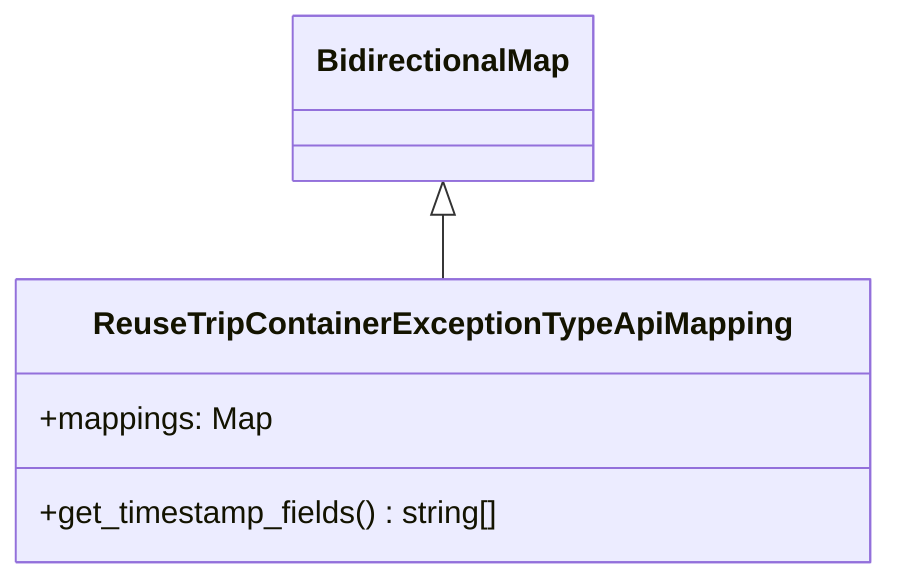
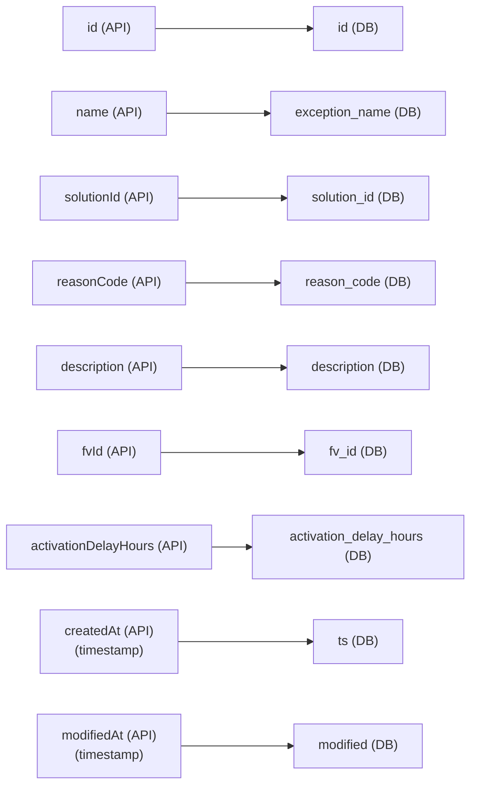

# Diagram: container_tracking_core/container_tracking_service/container_tracking_service/api/exception_type/ReuseTripContainerExceptionTypeApiMapping.py

> Auto-generated by Obscura crawlers

## Diagram 1

### SVG

<svg id="container" width="446.5" xmlns="http://www.w3.org/2000/svg" class="classDiagram" height="294" viewBox="0 0 446.5 294" role="graphics-document document" aria-roledescription="class"><g><defs><marker id="container_class-aggregationStart" class="marker aggregation class" refX="18" refY="7" markerWidth="190" markerHeight="240" orient="auto"><path d="M 18,7 L9,13 L1,7 L9,1 Z"></path></marker></defs><defs><marker id="container_class-aggregationEnd" class="marker aggregation class" refX="1" refY="7" markerWidth="20" markerHeight="28" orient="auto"><path d="M 18,7 L9,13 L1,7 L9,1 Z"></path></marker></defs><defs><marker id="container_class-extensionStart" class="marker extension class" refX="18" refY="7" markerWidth="190" markerHeight="240" orient="auto"><path d="M 1,7 L18,13 V 1 Z"></path></marker></defs><defs><marker id="container_class-extensionEnd" class="marker extension class" refX="1" refY="7" markerWidth="20" markerHeight="28" orient="auto"><path d="M 1,1 V 13 L18,7 Z"></path></marker></defs><defs><marker id="container_class-compositionStart" class="marker composition class" refX="18" refY="7" markerWidth="190" markerHeight="240" orient="auto"><path d="M 18,7 L9,13 L1,7 L9,1 Z"></path></marker></defs><defs><marker id="container_class-compositionEnd" class="marker composition class" refX="1" refY="7" markerWidth="20" markerHeight="28" orient="auto"><path d="M 18,7 L9,13 L1,7 L9,1 Z"></path></marker></defs><defs><marker id="container_class-dependencyStart" class="marker dependency class" refX="6" refY="7" markerWidth="190" markerHeight="240" orient="auto"><path d="M 5,7 L9,13 L1,7 L9,1 Z"></path></marker></defs><defs><marker id="container_class-dependencyEnd" class="marker dependency class" refX="13" refY="7" markerWidth="20" markerHeight="28" orient="auto"><path d="M 18,7 L9,13 L14,7 L9,1 Z"></path></marker></defs><defs><marker id="container_class-lollipopStart" class="marker lollipop class" refX="13" refY="7" markerWidth="190" markerHeight="240" orient="auto"><circle stroke="black" fill="transparent" cx="7" cy="7" r="6"></circle></marker></defs><defs><marker id="container_class-lollipopEnd" class="marker lollipop class" refX="1" refY="7" markerWidth="190" markerHeight="240" orient="auto"><circle stroke="black" fill="transparent" cx="7" cy="7" r="6"></circle></marker></defs><g class="root"><g class="clusters"></g><g class="edgePaths"><path d="M223.25,109.25L223.25,110.542C223.25,111.833,223.25,114.417,223.25,119.875C223.25,125.333,223.25,133.667,223.25,137.833L223.25,142" id="id_BidirectionalMap_ReuseTripContainerExceptionTypeApiMapping_1" class="edge-thickness-normal edge-pattern-solid relation" style=";;;" data-edge="true" data-et="edge" data-id="id_BidirectionalMap_ReuseTripContainerExceptionTypeApiMapping_1" data-points="W3sieCI6MjIzLjI1LCJ5Ijo5Mn0seyJ4IjoyMjMuMjUsInkiOjExN30seyJ4IjoyMjMuMjUsInkiOjE0Mn1d" marker-start="url(#container_class-extensionStart)"></path></g><g class="edgeLabels"><g class="edgeLabel"><g class="label" data-id="id_BidirectionalMap_ReuseTripContainerExceptionTypeApiMapping_1" transform="translate(0, 0)"><foreignObject width="0" height="0">

</foreignObject></g></g></g><g class="nodes"><g class="node default" id="classId-BidirectionalMap-0" transform="translate(223.25, 50)"><g class="basic label-container"><path d="M-74.2265625 -42 L74.2265625 -42 L74.2265625 42 L-74.2265625 42" stroke="none" stroke-width="0" fill="#ECECFF" style=""></path><path d="M-74.2265625 -42 C-36.56989463166312 -42, 1.0867732366737641 -42, 74.2265625 -42 M-74.2265625 -42 C-31.011237576987007 -42, 12.204087346025986 -42, 74.2265625 -42 M74.2265625 -42 C74.2265625 -11.963373700615339, 74.2265625 18.073252598769322, 74.2265625 42 M74.2265625 -42 C74.2265625 -16.462486482190744, 74.2265625 9.075027035618511, 74.2265625 42 M74.2265625 42 C33.12544496984217 42, -7.975672560315658 42, -74.2265625 42 M74.2265625 42 C43.351408849763835 42, 12.476255199527671 42, -74.2265625 42 M-74.2265625 42 C-74.2265625 10.73308474502766, -74.2265625 -20.53383050994468, -74.2265625 -42 M-74.2265625 42 C-74.2265625 21.950416060037693, -74.2265625 1.9008321200753855, -74.2265625 -42" stroke="#9370DB" stroke-width="1.3" fill="none" stroke-dasharray="0 0" style=""></path></g><g class="annotation-group text" transform="translate(0, -18)"></g><g class="label-group text" transform="translate(-62.2265625, -18)"><g class="label" style="font-weight: bolder" transform="translate(0,-12)"><foreignObject width="124.453125" height="24">

BidirectionalMap

</foreignObject></g></g><g class="members-group text" transform="translate(-62.2265625, 30)"></g><g class="methods-group text" transform="translate(-62.2265625, 60)"></g><g class="divider" style=""><path d="M-74.2265625 6 C-25.421819199397362 6, 23.382924101205276 6, 74.2265625 6 M-74.2265625 6 C-27.7792057020717 6, 18.6681510958566 6, 74.2265625 6" stroke="#9370DB" stroke-width="1.3" fill="none" stroke-dasharray="0 0" style=""></path></g><g class="divider" style=""><path d="M-74.2265625 24 C-28.75273049858447 24, 16.72110150283106 24, 74.2265625 24 M-74.2265625 24 C-40.440245948895196 24, -6.653929397790392 24, 74.2265625 24" stroke="#9370DB" stroke-width="1.3" fill="none" stroke-dasharray="0 0" style=""></path></g></g><g class="node default" id="classId-ReuseTripContainerExceptionTypeApiMapping-1" transform="translate(223.25, 214)"><g class="basic label-container"><path d="M-215.25 -72 L215.25 -72 L215.25 72 L-215.25 72" stroke="none" stroke-width="0" fill="#ECECFF" style=""></path><path d="M-215.25 -72 C-84.46709465503025 -72, 46.3158106899395 -72, 215.25 -72 M-215.25 -72 C-117.59208613588771 -72, -19.934172271775424 -72, 215.25 -72 M215.25 -72 C215.25 -27.60073904694339, 215.25 16.798521906113223, 215.25 72 M215.25 -72 C215.25 -31.648452789647436, 215.25 8.703094420705128, 215.25 72 M215.25 72 C62.21688612183718 72, -90.81622775632565 72, -215.25 72 M215.25 72 C126.52156985517317 72, 37.79313971034634 72, -215.25 72 M-215.25 72 C-215.25 21.54084633584428, -215.25 -28.918307328311442, -215.25 -72 M-215.25 72 C-215.25 19.97131516396341, -215.25 -32.05736967207318, -215.25 -72" stroke="#9370DB" stroke-width="1.3" fill="none" stroke-dasharray="0 0" style=""></path></g><g class="annotation-group text" transform="translate(0, -48)"></g><g class="label-group text" transform="translate(-168.296875, -48)"><g class="label" style="font-weight: bolder" transform="translate(0,-12)"><foreignObject width="336.59375" height="24">

ReuseTripContainerExceptionTypeApiMapping

</foreignObject></g></g><g class="members-group text" transform="translate(-203.25, 0)"><g class="label" style="" transform="translate(0,-12)"><foreignObject width="117.71875" height="24">

+mappings: Map

</foreignObject></g></g><g class="methods-group text" transform="translate(-203.25, 48)"><g class="label" style="" transform="translate(0,-12)"><foreignObject width="238.203125" height="24">

+get_timestamp_fields() : string[]

</foreignObject></g></g><g class="divider" style=""><path d="M-215.25 -24 C-83.10734246095544 -24, 49.03531507808913 -24, 215.25 -24 M-215.25 -24 C-96.14246142925303 -24, 22.965077141493936 -24, 215.25 -24" stroke="#9370DB" stroke-width="1.3" fill="none" stroke-dasharray="0 0" style=""></path></g><g class="divider" style=""><path d="M-215.25 24 C-46.924840754123124 24, 121.40031849175375 24, 215.25 24 M-215.25 24 C-114.76571611113934 24, -14.281432222278681 24, 215.25 24" stroke="#9370DB" stroke-width="1.3" fill="none" stroke-dasharray="0 0" style=""></path></g></g></g></g></g></svg>

## Diagram 2

### SVG

<svg id="container" width="586" xmlns="http://www.w3.org/2000/svg" class="flowchart" height="962" viewBox="0 0 586 962" role="graphics-document document" aria-roledescription="flowchart-v2"><g><marker id="container_flowchart-v2-pointEnd" class="marker flowchart-v2" viewBox="0 0 10 10" refX="5" refY="5" markerUnits="userSpaceOnUse" markerWidth="8" markerHeight="8" orient="auto"><path d="M 0 0 L 10 5 L 0 10 z" class="arrowMarkerPath" style="stroke-width: 1; stroke-dasharray: 1, 0;"></path></marker><marker id="container_flowchart-v2-pointStart" class="marker flowchart-v2" viewBox="0 0 10 10" refX="4.5" refY="5" markerUnits="userSpaceOnUse" markerWidth="8" markerHeight="8" orient="auto"><path d="M 0 5 L 10 10 L 10 0 z" class="arrowMarkerPath" style="stroke-width: 1; stroke-dasharray: 1, 0;"></path></marker><marker id="container_flowchart-v2-circleEnd" class="marker flowchart-v2" viewBox="0 0 10 10" refX="11" refY="5" markerUnits="userSpaceOnUse" markerWidth="11" markerHeight="11" orient="auto"><circle cx="5" cy="5" r="5" class="arrowMarkerPath" style="stroke-width: 1; stroke-dasharray: 1, 0;"></circle></marker><marker id="container_flowchart-v2-circleStart" class="marker flowchart-v2" viewBox="0 0 10 10" refX="-1" refY="5" markerUnits="userSpaceOnUse" markerWidth="11" markerHeight="11" orient="auto"><circle cx="5" cy="5" r="5" class="arrowMarkerPath" style="stroke-width: 1; stroke-dasharray: 1, 0;"></circle></marker><marker id="container_flowchart-v2-crossEnd" class="marker cross flowchart-v2" viewBox="0 0 11 11" refX="12" refY="5.2" markerUnits="userSpaceOnUse" markerWidth="11" markerHeight="11" orient="auto"><path d="M 1,1 l 9,9 M 10,1 l -9,9" class="arrowMarkerPath" style="stroke-width: 2; stroke-dasharray: 1, 0;"></path></marker><marker id="container_flowchart-v2-crossStart" class="marker cross flowchart-v2" viewBox="0 0 11 11" refX="-1" refY="5.2" markerUnits="userSpaceOnUse" markerWidth="11" markerHeight="11" orient="auto"><path d="M 1,1 l 9,9 M 10,1 l -9,9" class="arrowMarkerPath" style="stroke-width: 2; stroke-dasharray: 1, 0;"></path></marker><g class="root"><g class="clusters"></g><g class="edgePaths"><path d="M193.938,35L210.448,35C226.958,35,259.979,35,292.595,35C325.211,35,357.422,35,373.527,35L389.633,35" id="L_id_api_id_db_0" class="edge-thickness-normal edge-pattern-solid edge-thickness-normal edge-pattern-solid flowchart-link" style=";" data-edge="true" data-et="edge" data-id="L_id_api_id_db_0" data-points="W3sieCI6MTkzLjkzNzUsInkiOjM1fSx7IngiOjI5MywieSI6MzV9LHsieCI6MzkzLjYzMjgxMjUsInkiOjM1fV0=" marker-end="url(#container_flowchart-v2-pointEnd)"></path><path d="M207.156,139L221.464,139C235.771,139,264.385,139,286.007,139C307.628,139,322.255,139,329.569,139L336.883,139" id="L_name_api_exception_name_db_0" class="edge-thickness-normal edge-pattern-solid edge-thickness-normal edge-pattern-solid flowchart-link" style=";" data-edge="true" data-et="edge" data-id="L_name_api_exception_name_db_0" data-points="W3sieCI6MjA3LjE1NjI1LCJ5IjoxMzl9LHsieCI6MjkzLCJ5IjoxMzl9LHsieCI6MzQwLjg4MjgxMjUsInkiOjEzOX1d" marker-end="url(#container_flowchart-v2-pointEnd)"></path><path d="M223.953,243L235.461,243C246.969,243,269.984,243,291.919,243C313.854,243,334.708,243,345.135,243L355.563,243" id="L_solutionId_api_solution_id_db_0" class="edge-thickness-normal edge-pattern-solid edge-thickness-normal edge-pattern-solid flowchart-link" style=";" data-edge="true" data-et="edge" data-id="L_solutionId_api_solution_id_db_0" data-points="W3sieCI6MjIzLjk1MzEyNSwieSI6MjQzfSx7IngiOjI5MywieSI6MjQzfSx7IngiOjM1OS41NjI1LCJ5IjoyNDN9XQ==" marker-end="url(#container_flowchart-v2-pointEnd)"></path><path d="M229.531,347L240.109,347C250.688,347,271.844,347,292.039,347C312.234,347,331.469,347,341.086,347L350.703,347" id="L_reasonCode_api_reason_code_db_0" class="edge-thickness-normal edge-pattern-solid edge-thickness-normal edge-pattern-solid flowchart-link" style=";" data-edge="true" data-et="edge" data-id="L_reasonCode_api_reason_code_db_0" data-points="W3sieCI6MjI5LjUzMTI1LCJ5IjozNDd9LHsieCI6MjkzLCJ5IjozNDd9LHsieCI6MzU0LjcwMzEyNSwieSI6MzQ3fV0=" marker-end="url(#container_flowchart-v2-pointEnd)"></path><path d="M228.203,451L239.003,451C249.802,451,271.401,451,292.596,451C313.792,451,334.583,451,344.979,451L355.375,451" id="L_description_api_description_db_0" class="edge-thickness-normal edge-pattern-solid edge-thickness-normal edge-pattern-solid flowchart-link" style=";" data-edge="true" data-et="edge" data-id="L_description_api_description_db_0" data-points="W3sieCI6MjI4LjIwMzEyNSwieSI6NDUxfSx7IngiOjI5MywieSI6NDUxfSx7IngiOjM1OS4zNzUsInkiOjQ1MX1d" marker-end="url(#container_flowchart-v2-pointEnd)"></path><path d="M200.656,555L216.047,555C231.438,555,262.219,555,291.96,555C321.701,555,350.401,555,364.751,555L379.102,555" id="L_fvId_api_fv_id_db_0" class="edge-thickness-normal edge-pattern-solid edge-thickness-normal edge-pattern-solid flowchart-link" style=";" data-edge="true" data-et="edge" data-id="L_fvId_api_fv_id_db_0" data-points="W3sieCI6MjAwLjY1NjI1LCJ5Ijo1NTV9LHsieCI6MjkzLCJ5Ijo1NTV9LHsieCI6MzgzLjEwMTU2MjUsInkiOjU1NX1d" marker-end="url(#container_flowchart-v2-pointEnd)"></path><path d="M264.344,671L269.12,671C273.896,671,283.448,671,291.724,671C300,671,307,671,310.5,671L314,671" id="L_activationDelayHours_api_activation_delay_hours_db_0" class="edge-thickness-normal edge-pattern-solid edge-thickness-normal edge-pattern-solid flowchart-link" style=";" data-edge="true" data-et="edge" data-id="L_activationDelayHours_api_activation_delay_hours_db_0" data-points="W3sieCI6MjY0LjM0Mzc1LCJ5Ijo2NzF9LHsieCI6MjkzLCJ5Ijo2NzF9LHsieCI6MzE4LCJ5Ijo2NzF9XQ==" marker-end="url(#container_flowchart-v2-pointEnd)"></path><path d="M268,787L272.167,787C276.333,787,284.667,787,305.009,787C325.352,787,357.703,787,373.879,787L390.055,787" id="L_createdAt_api_ts_db_0" class="edge-thickness-normal edge-pattern-solid edge-thickness-normal edge-pattern-solid flowchart-link" style=";" data-edge="true" data-et="edge" data-id="L_createdAt_api_ts_db_0" data-points="W3sieCI6MjY4LCJ5Ijo3ODd9LHsieCI6MjkzLCJ5Ijo3ODd9LHsieCI6Mzk0LjA1NDY4NzUsInkiOjc4N31d" marker-end="url(#container_flowchart-v2-pointEnd)"></path><path d="M268,915L272.167,915C276.333,915,284.667,915,300.728,915C316.789,915,340.578,915,352.473,915L364.367,915" id="L_modifiedAt_api_modified_db_0" class="edge-thickness-normal edge-pattern-solid edge-thickness-normal edge-pattern-solid flowchart-link" style=";" data-edge="true" data-et="edge" data-id="L_modifiedAt_api_modified_db_0" data-points="W3sieCI6MjY4LCJ5Ijo5MTV9LHsieCI6MjkzLCJ5Ijo5MTV9LHsieCI6MzY4LjM2NzE4NzUsInkiOjkxNX1d" marker-end="url(#container_flowchart-v2-pointEnd)"></path></g><g class="edgeLabels"><g class="edgeLabel"><g class="label" data-id="L_id_api_id_db_0" transform="translate(0, 0)"><foreignObject width="0" height="0">

</foreignObject></g></g><g class="edgeLabel"><g class="label" data-id="L_name_api_exception_name_db_0" transform="translate(0, 0)"><foreignObject width="0" height="0">

</foreignObject></g></g><g class="edgeLabel"><g class="label" data-id="L_solutionId_api_solution_id_db_0" transform="translate(0, 0)"><foreignObject width="0" height="0">

</foreignObject></g></g><g class="edgeLabel"><g class="label" data-id="L_reasonCode_api_reason_code_db_0" transform="translate(0, 0)"><foreignObject width="0" height="0">

</foreignObject></g></g><g class="edgeLabel"><g class="label" data-id="L_description_api_description_db_0" transform="translate(0, 0)"><foreignObject width="0" height="0">

</foreignObject></g></g><g class="edgeLabel"><g class="label" data-id="L_fvId_api_fv_id_db_0" transform="translate(0, 0)"><foreignObject width="0" height="0">

</foreignObject></g></g><g class="edgeLabel"><g class="label" data-id="L_activationDelayHours_api_activation_delay_hours_db_0" transform="translate(0, 0)"><foreignObject width="0" height="0">

</foreignObject></g></g><g class="edgeLabel"><g class="label" data-id="L_createdAt_api_ts_db_0" transform="translate(0, 0)"><foreignObject width="0" height="0">

</foreignObject></g></g><g class="edgeLabel"><g class="label" data-id="L_modifiedAt_api_modified_db_0" transform="translate(0, 0)"><foreignObject width="0" height="0">

</foreignObject></g></g></g><g class="nodes"><g class="node default" id="flowchart-id_api-0" transform="translate(138, 35)"><rect class="basic label-container" style="" x="-55.9375" y="-27" width="111.875" height="54"></rect><g class="label" style="" transform="translate(-25.9375, -12)"><rect></rect><foreignObject width="51.875" height="24">

id (API)

</foreignObject></g></g><g class="node default" id="flowchart-id_db-1" transform="translate(448, 35)"><rect class="basic label-container" style="" x="-54.3671875" y="-27" width="108.734375" height="54"></rect><g class="label" style="" transform="translate(-24.3671875, -12)"><rect></rect><foreignObject width="48.734375" height="24">

id (DB)

</foreignObject></g></g><g class="node default" id="flowchart-name_api-2" transform="translate(138, 139)"><rect class="basic label-container" style="" x="-69.15625" y="-27" width="138.3125" height="54"></rect><g class="label" style="" transform="translate(-39.15625, -12)"><rect></rect><foreignObject width="78.3125" height="24">

name (API)

</foreignObject></g></g><g class="node default" id="flowchart-exception_name_db-3" transform="translate(448, 139)"><rect class="basic label-container" style="" x="-107.1171875" y="-27" width="214.234375" height="54"></rect><g class="label" style="" transform="translate(-77.1171875, -12)"><rect></rect><foreignObject width="154.234375" height="24">

exception_name (DB)

</foreignObject></g></g><g class="node default" id="flowchart-solutionId_api-4" transform="translate(138, 243)"><rect class="basic label-container" style="" x="-85.953125" y="-27" width="171.90625" height="54"></rect><g class="label" style="" transform="translate(-55.953125, -12)"><rect></rect><foreignObject width="111.90625" height="24">

solutionId (API)

</foreignObject></g></g><g class="node default" id="flowchart-solution_id_db-5" transform="translate(448, 243)"><rect class="basic label-container" style="" x="-88.4375" y="-27" width="176.875" height="54"></rect><g class="label" style="" transform="translate(-58.4375, -12)"><rect></rect><foreignObject width="116.875" height="24">

solution_id (DB)

</foreignObject></g></g><g class="node default" id="flowchart-reasonCode_api-6" transform="translate(138, 347)"><rect class="basic label-container" style="" x="-91.53125" y="-27" width="183.0625" height="54"></rect><g class="label" style="" transform="translate(-61.53125, -12)"><rect></rect><foreignObject width="123.0625" height="24">

reasonCode (API)

</foreignObject></g></g><g class="node default" id="flowchart-reason_code_db-7" transform="translate(448, 347)"><rect class="basic label-container" style="" x="-93.296875" y="-27" width="186.59375" height="54"></rect><g class="label" style="" transform="translate(-63.296875, -12)"><rect></rect><foreignObject width="126.59375" height="24">

reason_code (DB)

</foreignObject></g></g><g class="node default" id="flowchart-description_api-8" transform="translate(138, 451)"><rect class="basic label-container" style="" x="-90.203125" y="-27" width="180.40625" height="54"></rect><g class="label" style="" transform="translate(-60.203125, -12)"><rect></rect><foreignObject width="120.40625" height="24">

description (API)

</foreignObject></g></g><g class="node default" id="flowchart-description_db-9" transform="translate(448, 451)"><rect class="basic label-container" style="" x="-88.625" y="-27" width="177.25" height="54"></rect><g class="label" style="" transform="translate(-58.625, -12)"><rect></rect><foreignObject width="117.25" height="24">

description (DB)

</foreignObject></g></g><g class="node default" id="flowchart-fvId_api-10" transform="translate(138, 555)"><rect class="basic label-container" style="" x="-62.65625" y="-27" width="125.3125" height="54"></rect><g class="label" style="" transform="translate(-32.65625, -12)"><rect></rect><foreignObject width="65.3125" height="24">

fvId (API)

</foreignObject></g></g><g class="node default" id="flowchart-fv_id_db-11" transform="translate(448, 555)"><rect class="basic label-container" style="" x="-64.8984375" y="-27" width="129.796875" height="54"></rect><g class="label" style="" transform="translate(-34.8984375, -12)"><rect></rect><foreignObject width="69.796875" height="24">

fv_id (DB)

</foreignObject></g></g><g class="node default" id="flowchart-activationDelayHours_api-12" transform="translate(138, 671)"><rect class="basic label-container" style="" x="-126.34375" y="-27" width="252.6875" height="54"></rect><g class="label" style="" transform="translate(-96.34375, -12)"><rect></rect><foreignObject width="192.6875" height="24">

activationDelayHours (API)

</foreignObject></g></g><g class="node default" id="flowchart-activation_delay_hours_db-13" transform="translate(448, 671)"><rect class="basic label-container" style="" x="-130" y="-39" width="260" height="78"></rect><g class="label" style="" transform="translate(-100, -24)"><rect></rect><foreignObject width="200" height="48">

activation_delay_hours (DB)

</foreignObject></g></g><g class="node default" id="flowchart-createdAt_api-14" transform="translate(138, 787)"><rect class="basic label-container" style="" x="-130" y="-39" width="260" height="78"></rect><g class="label" style="" transform="translate(-100, -24)"><rect></rect><foreignObject width="200" height="48">

createdAt (API)\n(timestamp)

</foreignObject></g></g><g class="node default" id="flowchart-ts_db-15" transform="translate(448, 787)"><rect class="basic label-container" style="" x="-53.9453125" y="-27" width="107.890625" height="54"></rect><g class="label" style="" transform="translate(-23.9453125, -12)"><rect></rect><foreignObject width="47.890625" height="24">

ts (DB)

</foreignObject></g></g><g class="node default" id="flowchart-modifiedAt_api-16" transform="translate(138, 915)"><rect class="basic label-container" style="" x="-130" y="-39" width="260" height="78"></rect><g class="label" style="" transform="translate(-100, -24)"><rect></rect><foreignObject width="200" height="48">

modifiedAt (API)\n(timestamp)

</foreignObject></g></g><g class="node default" id="flowchart-modified_db-17" transform="translate(448, 915)"><rect class="basic label-container" style="" x="-79.6328125" y="-27" width="159.265625" height="54"></rect><g class="label" style="" transform="translate(-49.6328125, -12)"><rect></rect><foreignObject width="99.265625" height="24">

modified (DB)

</foreignObject></g></g></g></g></g></svg>
