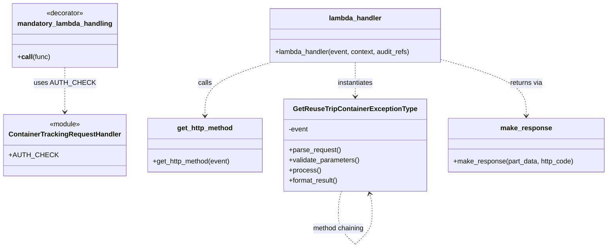

# Diagram: container_tracking_core/container_tracking_service/container_tracking_service/api/exception_type/exception_type.py


> Auto-generated by Obscura crawlers

## Diagram 1

```mermaid
flowchart TD
    Start([Start]) --> Decorator[mandatory_lambda_handling(auth_check=ContainerTrackingRequestHandler.AUTH_CHECK)]
    Decorator --> GetMethod[get_http_method(event)]
    GetMethod -->|GET| Instantiate[GetReuseTripContainerExceptionType(event)]
    GetMethod -->|other| NoHandler[No Handler]
    Instantiate --> Parse[parse_request()]
    Parse --> Validate[validate_parameters()]
    Validate --> Process[process()]
    Process --> Format[format_result()]
    Format --> MakeResponse[make_response(part_data, http_code)]
    MakeResponse --> End([Return response])
```

> SVG rendering failed for this diagram.

## Diagram 2



### SVG

<svg id="container" width="1406.859375" xmlns="http://www.w3.org/2000/svg" class="classDiagram" height="580.25" viewBox="0 0 1406.859375 580.25" role="graphics-document document" aria-roledescription="class"><style>#container{font-family:"trebuchet ms",verdana,arial,sans-serif;font-size:16px;fill:#333;}@keyframes edge-animation-frame{from{stroke-dashoffset:0;}}@keyframes dash{to{stroke-dashoffset:0;}}#container .edge-animation-slow{stroke-dasharray:9,5!important;stroke-dashoffset:900;animation:dash 50s linear infinite;stroke-linecap:round;}#container .edge-animation-fast{stroke-dasharray:9,5!important;stroke-dashoffset:900;animation:dash 20s linear infinite;stroke-linecap:round;}#container .error-icon{fill:#552222;}#container .error-text{fill:#552222;stroke:#552222;}#container .edge-thickness-normal{stroke-width:1px;}#container .edge-thickness-thick{stroke-width:3.5px;}#container .edge-pattern-solid{stroke-dasharray:0;}#container .edge-thickness-invisible{stroke-width:0;fill:none;}#container .edge-pattern-dashed{stroke-dasharray:3;}#container .edge-pattern-dotted{stroke-dasharray:2;}#container .marker{fill:#333333;stroke:#333333;}#container .marker.cross{stroke:#333333;}#container svg{font-family:"trebuchet ms",verdana,arial,sans-serif;font-size:16px;}#container p{margin:0;}#container g.classGroup text{fill:#9370DB;stroke:none;font-family:"trebuchet ms",verdana,arial,sans-serif;font-size:10px;}#container g.classGroup text .title{font-weight:bolder;}#container .nodeLabel,#container .edgeLabel{color:#131300;}#container .edgeLabel .label rect{fill:#ECECFF;}#container .label text{fill:#131300;}#container .labelBkg{background:#ECECFF;}#container .edgeLabel .label span{background:#ECECFF;}#container .classTitle{font-weight:bolder;}#container .node rect,#container .node circle,#container .node ellipse,#container .node polygon,#container .node path{fill:#ECECFF;stroke:#9370DB;stroke-width:1px;}#container .divider{stroke:#9370DB;stroke-width:1;}#container g.clickable{cursor:pointer;}#container g.classGroup rect{fill:#ECECFF;stroke:#9370DB;}#container g.classGroup line{stroke:#9370DB;stroke-width:1;}#container .classLabel .box{stroke:none;stroke-width:0;fill:#ECECFF;opacity:0.5;}#container .classLabel .label{fill:#9370DB;font-size:10px;}#container .relation{stroke:#333333;stroke-width:1;fill:none;}#container .dashed-line{stroke-dasharray:3;}#container .dotted-line{stroke-dasharray:1 2;}#container #compositionStart,#container .composition{fill:#333333!important;stroke:#333333!important;stroke-width:1;}#container #compositionEnd,#container .composition{fill:#333333!important;stroke:#333333!important;stroke-width:1;}#container #dependencyStart,#container .dependency{fill:#333333!important;stroke:#333333!important;stroke-width:1;}#container #dependencyStart,#container .dependency{fill:#333333!important;stroke:#333333!important;stroke-width:1;}#container #extensionStart,#container .extension{fill:transparent!important;stroke:#333333!important;stroke-width:1;}#container #extensionEnd,#container .extension{fill:transparent!important;stroke:#333333!important;stroke-width:1;}#container #aggregationStart,#container .aggregation{fill:transparent!important;stroke:#333333!important;stroke-width:1;}#container #aggregationEnd,#container .aggregation{fill:transparent!important;stroke:#333333!important;stroke-width:1;}#container #lollipopStart,#container .lollipop{fill:#ECECFF!important;stroke:#333333!important;stroke-width:1;}#container #lollipopEnd,#container .lollipop{fill:#ECECFF!important;stroke:#333333!important;stroke-width:1;}#container .edgeTerminals{font-size:11px;line-height:initial;}#container .classTitleText{text-anchor:middle;font-size:18px;fill:#333;}#container .label-icon{display:inline-block;height:1em;overflow:visible;vertical-align:-0.125em;}#container .node .label-icon path{fill:currentColor;stroke:revert;stroke-width:revert;}#container :root{--mermaid-font-family:"trebuchet ms",verdana,arial,sans-serif;}</style><g><defs><marker id="container_class-aggregationStart" class="marker aggregation class" refX="18" refY="7" markerWidth="190" markerHeight="240" orient="auto"><path d="M 18,7 L9,13 L1,7 L9,1 Z"></path></marker></defs><defs><marker id="container_class-aggregationEnd" class="marker aggregation class" refX="1" refY="7" markerWidth="20" markerHeight="28" orient="auto"><path d="M 18,7 L9,13 L1,7 L9,1 Z"></path></marker></defs><defs><marker id="container_class-extensionStart" class="marker extension class" refX="18" refY="7" markerWidth="190" markerHeight="240" orient="auto"><path d="M 1,7 L18,13 V 1 Z"></path></marker></defs><defs><marker id="container_class-extensionEnd" class="marker extension class" refX="1" refY="7" markerWidth="20" markerHeight="28" orient="auto"><path d="M 1,1 V 13 L18,7 Z"></path></marker></defs><defs><marker id="container_class-compositionStart" class="marker composition class" refX="18" refY="7" markerWidth="190" markerHeight="240" orient="auto"><path d="M 18,7 L9,13 L1,7 L9,1 Z"></path></marker></defs><defs><marker id="container_class-compositionEnd" class="marker composition class" refX="1" refY="7" markerWidth="20" markerHeight="28" orient="auto"><path d="M 18,7 L9,13 L1,7 L9,1 Z"></path></marker></defs><defs><marker id="container_class-dependencyStart" class="marker dependency class" refX="6" refY="7" markerWidth="190" markerHeight="240" orient="auto"><path d="M 5,7 L9,13 L1,7 L9,1 Z"></path></marker></defs><defs><marker id="container_class-dependencyEnd" class="marker dependency class" refX="13" refY="7" markerWidth="20" markerHeight="28" orient="auto"><path d="M 18,7 L9,13 L14,7 L9,1 Z"></path></marker></defs><defs><marker id="container_class-lollipopStart" class="marker lollipop class" refX="13" refY="7" markerWidth="190" markerHeight="240" orient="auto"><circle stroke="black" fill="transparent" cx="7" cy="7" r="6"></circle></marker></defs><defs><marker id="container_class-lollipopEnd" class="marker lollipop class" refX="1" refY="7" markerWidth="190" markerHeight="240" orient="auto"><circle stroke="black" fill="transparent" cx="7" cy="7" r="6"></circle></marker></defs><g class="root"><g class="clusters"></g><g class="edgePaths"><path d="M145.586,158L145.586,164.167C145.586,170.333,145.586,182.667,145.586,200C145.586,217.333,145.586,239.667,145.586,250.833L145.586,262" id="id_mandatory_lambda_handling_ContainerTrackingRequestHandler_1" class="edge-thickness-normal edge-pattern-dashed relation" style=";;;" data-edge="true" data-et="edge" data-id="id_mandatory_lambda_handling_ContainerTrackingRequestHandler_1" data-points="W3sieCI6MTQ1LjU4NTkzNzUsInkiOjE1OH0seyJ4IjoxNDUuNTg1OTM3NSwieSI6MTk1fSx7IngiOjE0NS41ODU5Mzc1LCJ5IjoyNjh9XQ==" marker-end="url(#container_class-dependencyEnd)"></path><path d="M622.583,146L597.042,154.167C571.5,162.333,520.416,178.667,494.874,199.5C469.332,220.333,469.332,245.667,469.332,258.333L469.332,271" id="id_lambda_handler_get_http_method_2" class="edge-thickness-normal edge-pattern-dashed relation" style=";;;" data-edge="true" data-et="edge" data-id="id_lambda_handler_get_http_method_2" data-points="W3sieCI6NjIyLjU4MzQ5NjA5Mzc1LCJ5IjoxNDZ9LHsieCI6NDY5LjMzMjAzMTI1LCJ5IjoxOTV9LHsieCI6NDY5LjMzMjAzMTI1LCJ5IjoyNzd9XQ==" marker-end="url(#container_class-dependencyEnd)"></path><path d="M819.621,146L819.621,154.167C819.621,162.333,819.621,178.667,819.621,192C819.621,205.333,819.621,215.667,819.621,220.833L819.621,226" id="id_lambda_handler_GetReuseTripContainerExceptionType_3" class="edge-thickness-normal edge-pattern-dashed relation" style=";;;" data-edge="true" data-et="edge" data-id="id_lambda_handler_GetReuseTripContainerExceptionType_3" data-points="W3sieCI6ODE5LjYyMTA5Mzc1LCJ5IjoxNDZ9LHsieCI6ODE5LjYyMTA5Mzc1LCJ5IjoxOTV9LHsieCI6ODE5LjYyMTA5Mzc1LCJ5IjoyMzJ9XQ==" marker-end="url(#container_class-dependencyEnd)"></path><path d="M786.62,448L785.346,452.167C784.073,456.333,781.527,464.667,780.254,473C778.98,481.333,778.98,489.667,778.98,493.833L778.98,498" id="GetReuseTripContainerExceptionType-cyclic-special-1" class="edge-thickness-normal edge-pattern-dashed relation" style=";;;" data-edge="true" data-et="edge" data-id="GetReuseTripContainerExceptionType-cyclic-special-1" data-points="W3sieCI6Nzg2LjYxOTY4Mzk3NTU2MzksInkiOjQ0OH0seyJ4Ijo3NzguOTgwNDY4NzUsInkiOjQ3M30seyJ4Ijo3NzguOTgwNDY4NzUsInkiOjQ5OH1d"></path><path d="M778.98,498.1L778.98,504.267C778.98,510.433,778.98,522.767,785.746,535.101C792.511,547.435,806.041,559.77,812.806,565.937L819.571,572.104" id="GetReuseTripContainerExceptionType-cyclic-special-mid" class="edge-thickness-normal edge-pattern-dashed relation" style=";;;" data-edge="true" data-et="edge" data-id="GetReuseTripContainerExceptionType-cyclic-special-mid" data-points="W3sieCI6Nzc4Ljk4MDQ2ODc1LCJ5Ijo0OTguMTAwMDAwMDAxNDkwMX0seyJ4Ijo3NzguOTgwNDY4NzUsInkiOjUzNS4xMDAwMDAwMDE0OTAxfSx7IngiOjgxOS41NzEwOTM3NDkyNTQ5LCJ5Ijo1NzIuMTA0NDE3NTMzMjczNn1d"></path><path d="M819.671,572.104L826.436,565.937C833.201,559.77,846.732,547.435,853.497,535.092C860.262,522.75,860.262,510.4,860.262,500.05C860.262,489.7,860.262,481.35,859.281,473.965C858.3,466.579,856.338,460.159,855.357,456.948L854.376,453.738" id="GetReuseTripContainerExceptionType-cyclic-special-2" class="edge-thickness-normal edge-pattern-dashed relation" style=";;;" data-edge="true" data-et="edge" data-id="GetReuseTripContainerExceptionType-cyclic-special-2" data-points="W3sieCI6ODE5LjY3MTA5Mzc1MDc0NTEsInkiOjU3Mi4xMDQ0MTc1MzMyNzM2fSx7IngiOjg2MC4yNjE3MTg3NSwieSI6NTM1LjEwMDAwMDAwMTQ5MDF9LHsieCI6ODYwLjI2MTcxODc1LCJ5Ijo0OTguMDUwMDAwMDAwNzQ1MDZ9LHsieCI6ODYwLjI2MTcxODc1LCJ5Ijo0NzN9LHsieCI6ODUyLjYyMjUwMzUyNDQzNjEsInkiOjQ0OH1d" marker-end="url(#container_class-dependencyEnd)"></path><path d="M1022.453,140.268L1054.762,149.39C1087.07,158.512,1151.688,176.756,1183.996,198.545C1216.305,220.333,1216.305,245.667,1216.305,258.333L1216.305,271" id="id_lambda_handler_make_response_5" class="edge-thickness-normal edge-pattern-dashed relation" style=";;;" data-edge="true" data-et="edge" data-id="id_lambda_handler_make_response_5" data-points="W3sieCI6MTAyMi40NTMxMjUsInkiOjE0MC4yNjc3NzY3ODIxMDk0OH0seyJ4IjoxMjE2LjMwNDY4NzUsInkiOjE5NX0seyJ4IjoxMjE2LjMwNDY4NzUsInkiOjI3N31d" marker-end="url(#container_class-dependencyEnd)"></path></g><g class="edgeLabels"><g class="edgeLabel" transform="translate(145.5859375, 195)"><g class="label" data-id="id_mandatory_lambda_handling_ContainerTrackingRequestHandler_1" transform="translate(-65.125, -12)"><foreignObject width="130.25" height="24"><div xmlns="http://www.w3.org/1999/xhtml" class="labelBkg" style="display: table-cell; white-space: nowrap; line-height: 1.5; max-width: 200px; text-align: center;"><span class="edgeLabel"><p>uses AUTH_CHECK</p></span></div></foreignObject></g></g><g class="edgeLabel" transform="translate(469.33203125, 195)"><g class="label" data-id="id_lambda_handler_get_http_method_2" transform="translate(-16.4453125, -12)"><foreignObject width="32.890625" height="24"><div xmlns="http://www.w3.org/1999/xhtml" class="labelBkg" style="display: table-cell; white-space: nowrap; line-height: 1.5; max-width: 200px; text-align: center;"><span class="edgeLabel"><p>calls</p></span></div></foreignObject></g></g><g class="edgeLabel" transform="translate(819.62109375, 195)"><g class="label" data-id="id_lambda_handler_GetReuseTripContainerExceptionType_3" transform="translate(-42.9140625, -12)"><foreignObject width="85.828125" height="24"><div xmlns="http://www.w3.org/1999/xhtml" class="labelBkg" style="display: table-cell; white-space: nowrap; line-height: 1.5; max-width: 200px; text-align: center;"><span class="edgeLabel"><p>instantiates</p></span></div></foreignObject></g></g><g class="edgeLabel"><g class="label" data-id="GetReuseTripContainerExceptionType-cyclic-special-1" transform="translate(0, 0)"><foreignObject width="0" height="0"><div xmlns="http://www.w3.org/1999/xhtml" class="labelBkg" style="display: table-cell; white-space: nowrap; line-height: 1.5; max-width: 200px; text-align: center;"><span class="edgeLabel"></span></div></foreignObject></g></g><g class="edgeLabel" transform="translate(778.98046875, 535.1000000014901)"><g class="label" data-id="GetReuseTripContainerExceptionType-cyclic-special-mid" transform="translate(-61.28125, -12)"><foreignObject width="122.5625" height="24"><div xmlns="http://www.w3.org/1999/xhtml" class="labelBkg" style="display: table-cell; white-space: nowrap; line-height: 1.5; max-width: 200px; text-align: center;"><span class="edgeLabel"><p>method chaining</p></span></div></foreignObject></g></g><g class="edgeLabel"><g class="label" data-id="GetReuseTripContainerExceptionType-cyclic-special-2" transform="translate(0, 0)"><foreignObject width="0" height="0"><div xmlns="http://www.w3.org/1999/xhtml" class="labelBkg" style="display: table-cell; white-space: nowrap; line-height: 1.5; max-width: 200px; text-align: center;"><span class="edgeLabel"></span></div></foreignObject></g></g><g class="edgeLabel" transform="translate(1216.3046875, 195)"><g class="label" data-id="id_lambda_handler_make_response_5" transform="translate(-38.9296875, -12)"><foreignObject width="77.859375" height="24"><div xmlns="http://www.w3.org/1999/xhtml" class="labelBkg" style="display: table-cell; white-space: nowrap; line-height: 1.5; max-width: 200px; text-align: center;"><span class="edgeLabel"><p>returns via</p></span></div></foreignObject></g></g></g><g class="nodes"><g class="node default" id="classId-ContainerTrackingRequestHandler-0" transform="translate(145.5859375, 340)"><g class="basic label-container"><path d="M-137.5859375 -72 L137.5859375 -72 L137.5859375 72 L-137.5859375 72" stroke="none" stroke-width="0" fill="#ECECFF" style=""></path><path d="M-137.5859375 -72 C-28.93784651130578 -72, 79.71024447738844 -72, 137.5859375 -72 M-137.5859375 -72 C-41.07662091723674 -72, 55.43269566552652 -72, 137.5859375 -72 M137.5859375 -72 C137.5859375 -20.24624752832267, 137.5859375 31.50750494335466, 137.5859375 72 M137.5859375 -72 C137.5859375 -24.631639869676548, 137.5859375 22.736720260646905, 137.5859375 72 M137.5859375 72 C57.444096451616616 72, -22.697744596766768 72, -137.5859375 72 M137.5859375 72 C44.14088938731365 72, -49.3041587253727 72, -137.5859375 72 M-137.5859375 72 C-137.5859375 35.77766222900554, -137.5859375 -0.44467554198891435, -137.5859375 -72 M-137.5859375 72 C-137.5859375 41.04725478726355, -137.5859375 10.094509574527095, -137.5859375 -72" stroke="#9370DB" stroke-width="1.3" fill="none" stroke-dasharray="0 0" style=""></path></g><g class="annotation-group text" transform="translate(-36.6015625, -48)"><g class="label" style="" transform="translate(0,-12)"><foreignObject width="73.203125" height="24"><div xmlns="http://www.w3.org/1999/xhtml" style="display: table-cell; white-space: nowrap; line-height: 1.5; max-width: 123px; text-align: center;"><span class="nodeLabel markdown-node-label" style=""><p>«module»</p></span></div></foreignObject></g></g><g class="label-group text" transform="translate(-125.5859375, -24)"><g class="label" style="font-weight: bolder" transform="translate(0,-12)"><foreignObject width="251.171875" height="24"><div xmlns="http://www.w3.org/1999/xhtml" style="display: table-cell; white-space: nowrap; line-height: 1.5; max-width: 299px; text-align: center;"><span class="nodeLabel markdown-node-label" style=""><p>ContainerTrackingRequestHandler</p></span></div></foreignObject></g></g><g class="members-group text" transform="translate(-125.5859375, 24)"><g class="label" style="" transform="translate(0,-12)"><foreignObject width="100.859375" height="24"><div xmlns="http://www.w3.org/1999/xhtml" style="display: table-cell; white-space: nowrap; line-height: 1.5; max-width: 159px; text-align: center;"><span class="nodeLabel markdown-node-label" style=""><p>+AUTH_CHECK</p></span></div></foreignObject></g></g><g class="methods-group text" transform="translate(-125.5859375, 72)"></g><g class="divider" style=""><path d="M-137.5859375 0 C-70.89408058335144 0, -4.202223666702878 0, 137.5859375 0 M-137.5859375 0 C-78.19368502894775 0, -18.80143255789551 0, 137.5859375 0" stroke="#9370DB" stroke-width="1.3" fill="none" stroke-dasharray="0 0" style=""></path></g><g class="divider" style=""><path d="M-137.5859375 48 C-37.44482106449435 48, 62.6962953710113 48, 137.5859375 48 M-137.5859375 48 C-46.37248271191446 48, 44.840972076171084 48, 137.5859375 48" stroke="#9370DB" stroke-width="1.3" fill="none" stroke-dasharray="0 0" style=""></path></g></g><g class="node default" id="classId-mandatory_lambda_handling-1" transform="translate(145.5859375, 83)"><g class="basic label-container"><path d="M-119.4296875 -75 L119.4296875 -75 L119.4296875 75 L-119.4296875 75" stroke="none" stroke-width="0" fill="#ECECFF" style=""></path><path d="M-119.4296875 -75 C-57.127716525045784 -75, 5.174254449908432 -75, 119.4296875 -75 M-119.4296875 -75 C-42.75045170975726 -75, 33.928784080485485 -75, 119.4296875 -75 M119.4296875 -75 C119.4296875 -39.48570203003001, 119.4296875 -3.971404060060024, 119.4296875 75 M119.4296875 -75 C119.4296875 -31.728622818579105, 119.4296875 11.54275436284179, 119.4296875 75 M119.4296875 75 C24.32681588389839 75, -70.77605573220322 75, -119.4296875 75 M119.4296875 75 C61.52106098537498 75, 3.6124344707499603 75, -119.4296875 75 M-119.4296875 75 C-119.4296875 28.016005316178678, -119.4296875 -18.967989367642645, -119.4296875 -75 M-119.4296875 75 C-119.4296875 30.65828110709011, -119.4296875 -13.683437785819777, -119.4296875 -75" stroke="#9370DB" stroke-width="1.3" fill="none" stroke-dasharray="0 0" style=""></path></g><g class="annotation-group text" transform="translate(-44.0625, -51)"><g class="label" style="" transform="translate(0,-12)"><foreignObject width="88.125" height="24"><div xmlns="http://www.w3.org/1999/xhtml" style="display: table-cell; white-space: nowrap; line-height: 1.5; max-width: 138px; text-align: center;"><span class="nodeLabel markdown-node-label" style=""><p>«decorator»</p></span></div></foreignObject></g></g><g class="label-group text" transform="translate(-107.4296875, -27)"><g class="label" style="font-weight: bolder" transform="translate(0,-12)"><foreignObject width="214.859375" height="24"><div xmlns="http://www.w3.org/1999/xhtml" style="display: table-cell; white-space: nowrap; line-height: 1.5; max-width: 264px; text-align: center;"><span class="nodeLabel markdown-node-label" style=""><p>mandatory_lambda_handling</p></span></div></foreignObject></g></g><g class="members-group text" transform="translate(-107.4296875, 21)"></g><g class="methods-group text" transform="translate(-107.4296875, 51)"><g class="label" style="" transform="translate(0,-12)"><foreignObject width="75.6875" height="24"><div xmlns="http://www.w3.org/1999/xhtml" style="display: table-cell; white-space: nowrap; line-height: 1.5; max-width: 164px; text-align: center;"><span class="nodeLabel markdown-node-label" style=""><p>+<strong>call</strong>(func)</p></span></div></foreignObject></g></g><g class="divider" style=""><path d="M-119.4296875 -3 C-62.537410729824636 -3, -5.645133959649272 -3, 119.4296875 -3 M-119.4296875 -3 C-29.460040874883916 -3, 60.50960575023217 -3, 119.4296875 -3" stroke="#9370DB" stroke-width="1.3" fill="none" stroke-dasharray="0 0" style=""></path></g><g class="divider" style=""><path d="M-119.4296875 21 C-29.047620848731228 21, 61.334445802537545 21, 119.4296875 21 M-119.4296875 21 C-59.02758807455356 21, 1.374511350892874 21, 119.4296875 21" stroke="#9370DB" stroke-width="1.3" fill="none" stroke-dasharray="0 0" style=""></path></g></g><g class="node default" id="classId-lambda_handler-2" transform="translate(819.62109375, 83)"><g class="basic label-container"><path d="M-202.83203125 -63 L202.83203125 -63 L202.83203125 63 L-202.83203125 63" stroke="none" stroke-width="0" fill="#ECECFF" style=""></path><path d="M-202.83203125 -63 C-111.88886027084119 -63, -20.945689291682385 -63, 202.83203125 -63 M-202.83203125 -63 C-74.13653253050595 -63, 54.55896618898811 -63, 202.83203125 -63 M202.83203125 -63 C202.83203125 -25.853647673002534, 202.83203125 11.292704653994932, 202.83203125 63 M202.83203125 -63 C202.83203125 -37.59794342819844, 202.83203125 -12.195886856396882, 202.83203125 63 M202.83203125 63 C59.36911701272129 63, -84.09379722455742 63, -202.83203125 63 M202.83203125 63 C65.95283826652363 63, -70.92635471695274 63, -202.83203125 63 M-202.83203125 63 C-202.83203125 26.56818243401237, -202.83203125 -9.863635131975258, -202.83203125 -63 M-202.83203125 63 C-202.83203125 16.599750770749672, -202.83203125 -29.800498458500655, -202.83203125 -63" stroke="#9370DB" stroke-width="1.3" fill="none" stroke-dasharray="0 0" style=""></path></g><g class="annotation-group text" transform="translate(0, -39)"></g><g class="label-group text" transform="translate(-59.9765625, -39)"><g class="label" style="font-weight: bolder" transform="translate(0,-12)"><foreignObject width="119.953125" height="24"><div xmlns="http://www.w3.org/1999/xhtml" style="display: table-cell; white-space: nowrap; line-height: 1.5; max-width: 170px; text-align: center;"><span class="nodeLabel markdown-node-label" style=""><p>lambda_handler</p></span></div></foreignObject></g></g><g class="members-group text" transform="translate(-190.83203125, 9)"></g><g class="methods-group text" transform="translate(-190.83203125, 39)"><g class="label" style="" transform="translate(0,-12)"><foreignObject width="321.6875" height="24"><div xmlns="http://www.w3.org/1999/xhtml" style="display: table-cell; white-space: nowrap; line-height: 1.5; max-width: 379px; text-align: center;"><span class="nodeLabel markdown-node-label" style=""><p>+lambda_handler(event, context, audit_refs)</p></span></div></foreignObject></g></g><g class="divider" style=""><path d="M-202.83203125 -15 C-70.9534028513817 -15, 60.92522554723661 -15, 202.83203125 -15 M-202.83203125 -15 C-75.06518242754035 -15, 52.7016663949193 -15, 202.83203125 -15" stroke="#9370DB" stroke-width="1.3" fill="none" stroke-dasharray="0 0" style=""></path></g><g class="divider" style=""><path d="M-202.83203125 9 C-64.6498186233568 9, 73.53239400328641 9, 202.83203125 9 M-202.83203125 9 C-83.61395591524604 9, 35.604119419507924 9, 202.83203125 9" stroke="#9370DB" stroke-width="1.3" fill="none" stroke-dasharray="0 0" style=""></path></g></g><g class="node default" id="classId-get_http_method-3" transform="translate(469.33203125, 340)"><g class="basic label-container"><path d="M-136.16015625 -63 L136.16015625 -63 L136.16015625 63 L-136.16015625 63" stroke="none" stroke-width="0" fill="#ECECFF" style=""></path><path d="M-136.16015625 -63 C-68.89021321360225 -63, -1.6202701772045032 -63, 136.16015625 -63 M-136.16015625 -63 C-57.60085189611817 -63, 20.958452457763656 -63, 136.16015625 -63 M136.16015625 -63 C136.16015625 -25.25834580375944, 136.16015625 12.48330839248112, 136.16015625 63 M136.16015625 -63 C136.16015625 -16.44479156935656, 136.16015625 30.11041686128688, 136.16015625 63 M136.16015625 63 C70.97214740463114 63, 5.7841385592622885 63, -136.16015625 63 M136.16015625 63 C60.91386282708875 63, -14.332430595822501 63, -136.16015625 63 M-136.16015625 63 C-136.16015625 12.62920823882196, -136.16015625 -37.74158352235608, -136.16015625 -63 M-136.16015625 63 C-136.16015625 16.570883867000717, -136.16015625 -29.858232265998566, -136.16015625 -63" stroke="#9370DB" stroke-width="1.3" fill="none" stroke-dasharray="0 0" style=""></path></g><g class="annotation-group text" transform="translate(0, -39)"></g><g class="label-group text" transform="translate(-63.8203125, -39)"><g class="label" style="font-weight: bolder" transform="translate(0,-12)"><foreignObject width="127.640625" height="24"><div xmlns="http://www.w3.org/1999/xhtml" style="display: table-cell; white-space: nowrap; line-height: 1.5; max-width: 176px; text-align: center;"><span class="nodeLabel markdown-node-label" style=""><p>get_http_method</p></span></div></foreignObject></g></g><g class="members-group text" transform="translate(-124.16015625, 9)"></g><g class="methods-group text" transform="translate(-124.16015625, 39)"><g class="label" style="" transform="translate(0,-12)"><foreignObject width="184.5" height="24"><div xmlns="http://www.w3.org/1999/xhtml" style="display: table-cell; white-space: nowrap; line-height: 1.5; max-width: 242px; text-align: center;"><span class="nodeLabel markdown-node-label" style=""><p>+get_http_method(event)</p></span></div></foreignObject></g></g><g class="divider" style=""><path d="M-136.16015625 -15 C-28.916714073936262 -15, 78.32672810212748 -15, 136.16015625 -15 M-136.16015625 -15 C-51.22226615400129 -15, 33.71562394199742 -15, 136.16015625 -15" stroke="#9370DB" stroke-width="1.3" fill="none" stroke-dasharray="0 0" style=""></path></g><g class="divider" style=""><path d="M-136.16015625 9 C-30.167106515038796 9, 75.82594321992241 9, 136.16015625 9 M-136.16015625 9 C-27.766251417503426 9, 80.62765341499315 9, 136.16015625 9" stroke="#9370DB" stroke-width="1.3" fill="none" stroke-dasharray="0 0" style=""></path></g></g><g class="node default" id="classId-GetReuseTripContainerExceptionType-4" transform="translate(819.62109375, 340)"><g class="basic label-container"><path d="M-164.12890625 -108 L164.12890625 -108 L164.12890625 108 L-164.12890625 108" stroke="none" stroke-width="0" fill="#ECECFF" style=""></path><path d="M-164.12890625 -108 C-41.43061820552445 -108, 81.2676698389511 -108, 164.12890625 -108 M-164.12890625 -108 C-62.1105000405353 -108, 39.9079061689294 -108, 164.12890625 -108 M164.12890625 -108 C164.12890625 -47.01939965625919, 164.12890625 13.961200687481622, 164.12890625 108 M164.12890625 -108 C164.12890625 -59.87250502784891, 164.12890625 -11.745010055697819, 164.12890625 108 M164.12890625 108 C74.19430060886985 108, -15.740305032260295 108, -164.12890625 108 M164.12890625 108 C81.18950579261954 108, -1.749894664760916 108, -164.12890625 108 M-164.12890625 108 C-164.12890625 50.324641195494436, -164.12890625 -7.350717609011127, -164.12890625 -108 M-164.12890625 108 C-164.12890625 38.30549084612554, -164.12890625 -31.389018307748927, -164.12890625 -108" stroke="#9370DB" stroke-width="1.3" fill="none" stroke-dasharray="0 0" style=""></path></g><g class="annotation-group text" transform="translate(0, -84)"></g><g class="label-group text" transform="translate(-137.7109375, -84)"><g class="label" style="font-weight: bolder" transform="translate(0,-12)"><foreignObject width="275.421875" height="24"><div xmlns="http://www.w3.org/1999/xhtml" style="display: table-cell; white-space: nowrap; line-height: 1.5; max-width: 321px; text-align: center;"><span class="nodeLabel markdown-node-label" style=""><p>GetReuseTripContainerExceptionType</p></span></div></foreignObject></g></g><g class="members-group text" transform="translate(-152.12890625, -36)"><g class="label" style="" transform="translate(0,-12)"><foreignObject width="46.796875" height="24"><div xmlns="http://www.w3.org/1999/xhtml" style="display: table-cell; white-space: nowrap; line-height: 1.5; max-width: 104px; text-align: center;"><span class="nodeLabel markdown-node-label" style=""><p>-event</p></span></div></foreignObject></g></g><g class="methods-group text" transform="translate(-152.12890625, 12)"><g class="label" style="" transform="translate(0,-12)"><foreignObject width="121.796875" height="24"><div xmlns="http://www.w3.org/1999/xhtml" style="display: table-cell; white-space: nowrap; line-height: 1.5; max-width: 179px; text-align: center;"><span class="nodeLabel markdown-node-label" style=""><p>+parse_request()</p></span></div></foreignObject></g><g class="label" style="" transform="translate(0,12)"><foreignObject width="166.546875" height="24"><div xmlns="http://www.w3.org/1999/xhtml" style="display: table-cell; white-space: nowrap; line-height: 1.5; max-width: 224px; text-align: center;"><span class="nodeLabel markdown-node-label" style=""><p>+validate_parameters()</p></span></div></foreignObject></g><g class="label" style="" transform="translate(0,36)"><foreignObject width="73.734375" height="24"><div xmlns="http://www.w3.org/1999/xhtml" style="display: table-cell; white-space: nowrap; line-height: 1.5; max-width: 131px; text-align: center;"><span class="nodeLabel markdown-node-label" style=""><p>+process()</p></span></div></foreignObject></g><g class="label" style="" transform="translate(0,60)"><foreignObject width="117.015625" height="24"><div xmlns="http://www.w3.org/1999/xhtml" style="display: table-cell; white-space: nowrap; line-height: 1.5; max-width: 174px; text-align: center;"><span class="nodeLabel markdown-node-label" style=""><p>+format_result()</p></span></div></foreignObject></g></g><g class="divider" style=""><path d="M-164.12890625 -60 C-71.80253861275246 -60, 20.523829024495086 -60, 164.12890625 -60 M-164.12890625 -60 C-82.71942054879376 -60, -1.3099348475875274 -60, 164.12890625 -60" stroke="#9370DB" stroke-width="1.3" fill="none" stroke-dasharray="0 0" style=""></path></g><g class="divider" style=""><path d="M-164.12890625 -12 C-41.316280718054685 -12, 81.49634481389063 -12, 164.12890625 -12 M-164.12890625 -12 C-36.904812211536054 -12, 90.31928182692789 -12, 164.12890625 -12" stroke="#9370DB" stroke-width="1.3" fill="none" stroke-dasharray="0 0" style=""></path></g></g><g class="node default" id="classId-make_response-5" transform="translate(1216.3046875, 340)"><g class="basic label-container"><path d="M-182.5546875 -63 L182.5546875 -63 L182.5546875 63 L-182.5546875 63" stroke="none" stroke-width="0" fill="#ECECFF" style=""></path><path d="M-182.5546875 -63 C-76.43896158842563 -63, 29.676764323148745 -63, 182.5546875 -63 M-182.5546875 -63 C-39.040036375098566 -63, 104.47461474980287 -63, 182.5546875 -63 M182.5546875 -63 C182.5546875 -30.155933004183886, 182.5546875 2.6881339916322275, 182.5546875 63 M182.5546875 -63 C182.5546875 -17.811457715980673, 182.5546875 27.377084568038654, 182.5546875 63 M182.5546875 63 C60.46351542016366 63, -61.62765665967268 63, -182.5546875 63 M182.5546875 63 C107.64846724579503 63, 32.742246991590065 63, -182.5546875 63 M-182.5546875 63 C-182.5546875 23.139919382691104, -182.5546875 -16.72016123461779, -182.5546875 -63 M-182.5546875 63 C-182.5546875 34.434283361644745, -182.5546875 5.868566723289497, -182.5546875 -63" stroke="#9370DB" stroke-width="1.3" fill="none" stroke-dasharray="0 0" style=""></path></g><g class="annotation-group text" transform="translate(0, -39)"></g><g class="label-group text" transform="translate(-57.46875, -39)"><g class="label" style="font-weight: bolder" transform="translate(0,-12)"><foreignObject width="114.9375" height="24"><div xmlns="http://www.w3.org/1999/xhtml" style="display: table-cell; white-space: nowrap; line-height: 1.5; max-width: 164px; text-align: center;"><span class="nodeLabel markdown-node-label" style=""><p>make_response</p></span></div></foreignObject></g></g><g class="members-group text" transform="translate(-170.5546875, 9)"></g><g class="methods-group text" transform="translate(-170.5546875, 39)"><g class="label" style="" transform="translate(0,-12)"><foreignObject width="283.640625" height="24"><div xmlns="http://www.w3.org/1999/xhtml" style="display: table-cell; white-space: nowrap; line-height: 1.5; max-width: 341px; text-align: center;"><span class="nodeLabel markdown-node-label" style=""><p>+make_response(part_data, http_code)</p></span></div></foreignObject></g></g><g class="divider" style=""><path d="M-182.5546875 -15 C-66.5664282114522 -15, 49.42183107709559 -15, 182.5546875 -15 M-182.5546875 -15 C-87.55565029098209 -15, 7.443386918035827 -15, 182.5546875 -15" stroke="#9370DB" stroke-width="1.3" fill="none" stroke-dasharray="0 0" style=""></path></g><g class="divider" style=""><path d="M-182.5546875 9 C-37.41439851954567 9, 107.72589046090866 9, 182.5546875 9 M-182.5546875 9 C-51.24910782832251 9, 80.05647184335498 9, 182.5546875 9" stroke="#9370DB" stroke-width="1.3" fill="none" stroke-dasharray="0 0" style=""></path></g></g><g class="label edgeLabel" id="GetReuseTripContainerExceptionType---GetReuseTripContainerExceptionType---1" transform="translate(778.98046875, 498.05000000074506)"><rect width="0.1" height="0.1"></rect><g class="label" style="" transform="translate(0, 0)"><rect></rect><foreignObject width="0" height="0"><div xmlns="http://www.w3.org/1999/xhtml" style="display: table-cell; white-space: nowrap; line-height: 1.5; max-width: 10px; text-align: center;"><span class="nodeLabel"></span></div></foreignObject></g></g><g class="label edgeLabel" id="GetReuseTripContainerExceptionType---GetReuseTripContainerExceptionType---2" transform="translate(819.62109375, 572.1500000022352)"><rect width="0.1" height="0.1"></rect><g class="label" style="" transform="translate(0, 0)"><rect></rect><foreignObject width="0" height="0"><div xmlns="http://www.w3.org/1999/xhtml" style="display: table-cell; white-space: nowrap; line-height: 1.5; max-width: 10px; text-align: center;"><span class="nodeLabel"></span></div></foreignObject></g></g></g></g></g></svg>
