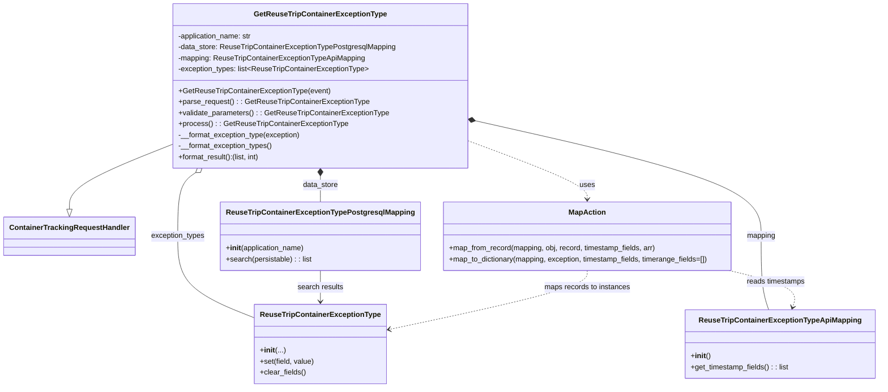

# Diagram: container_tracking_core/container_tracking_service/container_tracking_service/api/exception_type/handlers/GetReuseTripContainerExceptionType.py

> Auto-generated by Obscura crawlers

## Mermaid

### SVG

<svg id="container" width="1896.875" xmlns="http://www.w3.org/2000/svg" class="classDiagram" height="848" viewBox="0 0 1896.875 848" role="graphics-document document" aria-roledescription="class"><g><defs><marker id="container_class-aggregationStart" class="marker aggregation class" refX="18" refY="7" markerWidth="190" markerHeight="240" orient="auto"><path d="M 18,7 L9,13 L1,7 L9,1 Z"></path></marker></defs><defs><marker id="container_class-aggregationEnd" class="marker aggregation class" refX="1" refY="7" markerWidth="20" markerHeight="28" orient="auto"><path d="M 18,7 L9,13 L1,7 L9,1 Z"></path></marker></defs><defs><marker id="container_class-extensionStart" class="marker extension class" refX="18" refY="7" markerWidth="190" markerHeight="240" orient="auto"><path d="M 1,7 L18,13 V 1 Z"></path></marker></defs><defs><marker id="container_class-extensionEnd" class="marker extension class" refX="1" refY="7" markerWidth="20" markerHeight="28" orient="auto"><path d="M 1,1 V 13 L18,7 Z"></path></marker></defs><defs><marker id="container_class-compositionStart" class="marker composition class" refX="18" refY="7" markerWidth="190" markerHeight="240" orient="auto"><path d="M 18,7 L9,13 L1,7 L9,1 Z"></path></marker></defs><defs><marker id="container_class-compositionEnd" class="marker composition class" refX="1" refY="7" markerWidth="20" markerHeight="28" orient="auto"><path d="M 18,7 L9,13 L1,7 L9,1 Z"></path></marker></defs><defs><marker id="container_class-dependencyStart" class="marker dependency class" refX="6" refY="7" markerWidth="190" markerHeight="240" orient="auto"><path d="M 5,7 L9,13 L1,7 L9,1 Z"></path></marker></defs><defs><marker id="container_class-dependencyEnd" class="marker dependency class" refX="13" refY="7" markerWidth="20" markerHeight="28" orient="auto"><path d="M 18,7 L9,13 L14,7 L9,1 Z"></path></marker></defs><defs><marker id="container_class-lollipopStart" class="marker lollipop class" refX="13" refY="7" markerWidth="190" markerHeight="240" orient="auto"><circle stroke="black" fill="transparent" cx="7" cy="7" r="6"></circle></marker></defs><defs><marker id="container_class-lollipopEnd" class="marker lollipop class" refX="1" refY="7" markerWidth="190" markerHeight="240" orient="auto"><circle stroke="black" fill="transparent" cx="7" cy="7" r="6"></circle></marker></defs><g class="root"><g class="clusters"></g><g class="edgePaths"><path d="M359.348,317.982L323.721,332.485C288.094,346.988,216.84,375.994,181.213,399.289C145.586,422.583,145.586,440.167,145.586,448.958L145.586,457.75" id="id_GetReuseTripContainerExceptionType_ContainerTrackingRequestHandler_1" class="edge-thickness-normal edge-pattern-solid relation" style=";;;" data-edge="true" data-et="edge" data-id="id_GetReuseTripContainerExceptionType_ContainerTrackingRequestHandler_1" data-points="W3sieCI6MzU5LjM0NzY1NjI1LCJ5IjozMTcuOTgxNTExNjA3NDU2OX0seyJ4IjoxNDUuNTg1OTM3NSwieSI6NDA1fSx7IngiOjE0NS41ODU5Mzc1LCJ5Ijo0NzV9XQ==" marker-end="url(#container_class-extensionEnd)"></path><path d="M678.648,385.25L678.648,388.542C678.648,391.833,678.648,398.417,678.648,407.875C678.648,417.333,678.648,429.667,678.648,435.833L678.648,442" id="id_GetReuseTripContainerExceptionType_ReuseTripContainerExceptionTypePostgresqlMapping_2" class="edge-thickness-normal edge-pattern-solid relation" style=";;;" data-edge="true" data-et="edge" data-id="id_GetReuseTripContainerExceptionType_ReuseTripContainerExceptionTypePostgresqlMapping_2" data-points="W3sieCI6Njc4LjY0ODQzNzUsInkiOjM2OH0seyJ4Ijo2NzguNjQ4NDM3NSwieSI6NDA1fSx7IngiOjY3OC42NDg0Mzc1LCJ5Ijo0NDJ9XQ==" marker-start="url(#container_class-compositionStart)"></path><path d="M1014.778,263.719L1119.307,287.265C1223.836,310.812,1432.895,357.906,1537.424,400.12C1641.953,442.333,1641.953,479.667,1641.953,517C1641.953,554.333,1641.953,591.667,1644.744,618.5C1647.535,645.333,1653.116,661.667,1655.907,669.833L1658.698,678" id="id_GetReuseTripContainerExceptionType_ReuseTripContainerExceptionTypeApiMapping_3" class="edge-thickness-normal edge-pattern-solid relation" style=";;;" data-edge="true" data-et="edge" data-id="id_GetReuseTripContainerExceptionType_ReuseTripContainerExceptionTypeApiMapping_3" data-points="W3sieCI6OTk3Ljk0OTIxODc1LCJ5IjoyNTkuOTI3Njc4MTU4NjgyM30seyJ4IjoxNjQxLjk1MzEyNSwieSI6NDA1fSx7IngiOjE2NDEuOTUzMTI1LCJ5Ijo1MTd9LHsieCI6MTY0MS45NTMxMjUsInkiOjYyOX0seyJ4IjoxNjU4LjY5ODA4NDY3NzQxOTMsInkiOjY3OH1d" marker-start="url(#container_class-compositionStart)"></path><path d="M414.589,378.078L408.355,382.565C402.122,387.052,389.655,396.026,383.421,419.18C377.188,442.333,377.188,479.667,377.188,517C377.188,554.333,377.188,591.667,404.59,621.605C431.992,651.543,486.797,674.086,514.199,685.357L541.602,696.628" id="id_GetReuseTripContainerExceptionType_ReuseTripContainerExceptionType_4" class="edge-thickness-normal edge-pattern-solid relation" style=";;;" data-edge="true" data-et="edge" data-id="id_GetReuseTripContainerExceptionType_ReuseTripContainerExceptionType_4" data-points="W3sieCI6NDI4LjU4ODY3MzY3NTExNTIsInkiOjM2OH0seyJ4IjozNzcuMTg3NSwieSI6NDA1fSx7IngiOjM3Ny4xODc1LCJ5Ijo1MTd9LHsieCI6Mzc3LjE4NzUsInkiOjYyOX0seyJ4Ijo1NDEuNjAxNTYyNSwieSI6Njk2LjYyODQ3NTkxMTU3NjR9XQ==" marker-start="url(#container_class-aggregationStart)"></path><path d="M997.949,308.091L1040.893,324.242C1083.837,340.394,1169.725,372.697,1212.669,394.015C1255.613,415.333,1255.613,425.667,1255.613,430.833L1255.613,436" id="id_GetReuseTripContainerExceptionType_MapAction_5" class="edge-thickness-normal edge-pattern-dashed relation" style=";;;" data-edge="true" data-et="edge" data-id="id_GetReuseTripContainerExceptionType_MapAction_5" data-points="W3sieCI6OTk3Ljk0OTIxODc1LCJ5IjozMDguMDkwOTczMTAxNDI2NX0seyJ4IjoxMjU1LjYxMzI4MTI1LCJ5Ijo0MDV9LHsieCI6MTI1NS42MTMyODEyNSwieSI6NDQyfV0=" marker-end="url(#container_class-dependencyEnd)"></path><path d="M678.648,592L678.648,598.167C678.648,604.333,678.648,616.667,678.648,628C678.648,639.333,678.648,649.667,678.648,654.833L678.648,660" id="id_ReuseTripContainerExceptionTypePostgresqlMapping_ReuseTripContainerExceptionType_6" class="edge-thickness-normal edge-pattern-solid relation" style=";;;" data-edge="true" data-et="edge" data-id="id_ReuseTripContainerExceptionTypePostgresqlMapping_ReuseTripContainerExceptionType_6" data-points="W3sieCI6Njc4LjY0ODQzNzUsInkiOjU5Mn0seyJ4Ijo2NzguNjQ4NDM3NSwieSI6NjI5fSx7IngiOjY3OC42NDg0Mzc1LCJ5Ijo2NjZ9XQ==" marker-end="url(#container_class-dependencyEnd)"></path><path d="M1571.075,592L1597.013,598.167C1622.951,604.333,1674.827,616.667,1698.298,630.054C1721.768,643.441,1716.833,657.882,1714.366,665.102L1711.898,672.322" id="id_MapAction_ReuseTripContainerExceptionTypeApiMapping_7" class="edge-thickness-normal edge-pattern-dashed relation" style=";;;" data-edge="true" data-et="edge" data-id="id_MapAction_ReuseTripContainerExceptionTypeApiMapping_7" data-points="W3sieCI6MTU3MS4wNzUyMzAxODk3MzIsInkiOjU5Mn0seyJ4IjoxNzI2LjcwMzEyNSwieSI6NjI5fSx7IngiOjE3MDkuOTU4MTY1MzIyNTgwNywieSI6Njc4fV0=" marker-end="url(#container_class-dependencyEnd)"></path><path d="M1255.613,592L1255.613,598.167C1255.613,604.333,1255.613,616.667,1183.271,638.381C1110.929,660.095,966.245,691.19,893.903,706.738L821.561,722.285" id="id_MapAction_ReuseTripContainerExceptionType_8" class="edge-thickness-normal edge-pattern-dashed relation" style=";;;" data-edge="true" data-et="edge" data-id="id_MapAction_ReuseTripContainerExceptionType_8" data-points="W3sieCI6MTI1NS42MTMyODEyNSwieSI6NTkyfSx7IngiOjEyNTUuNjEzMjgxMjUsInkiOjYyOX0seyJ4Ijo4MTUuNjk1MzEyNSwieSI6NzIzLjU0NjE5MDY2NjQwNDl9XQ==" marker-end="url(#container_class-dependencyEnd)"></path></g><g class="edgeLabels"><g class="edgeLabel"><g class="label" data-id="id_GetReuseTripContainerExceptionType_ContainerTrackingRequestHandler_1" transform="translate(0, 0)"><foreignObject width="0" height="0">

</foreignObject></g></g><g class="edgeLabel" transform="translate(678.6484375, 405)"><g class="label" data-id="id_GetReuseTripContainerExceptionType_ReuseTripContainerExceptionTypePostgresqlMapping_2" transform="translate(-38.8671875, -12)"><foreignObject width="77.734375" height="24">

data_store

</foreignObject></g></g><g class="edgeLabel" transform="translate(1641.953125, 517)"><g class="label" data-id="id_GetReuseTripContainerExceptionType_ReuseTripContainerExceptionTypeApiMapping_3" transform="translate(-31.8203125, -12)"><foreignObject width="63.640625" height="24">

mapping

</foreignObject></g></g><g class="edgeLabel" transform="translate(377.1875, 517)"><g class="label" data-id="id_GetReuseTripContainerExceptionType_ReuseTripContainerExceptionType_4" transform="translate(-59.015625, -12)"><foreignObject width="118.03125" height="24">

exception_types

</foreignObject></g></g><g class="edgeLabel" transform="translate(1255.61328125, 405)"><g class="label" data-id="id_GetReuseTripContainerExceptionType_MapAction_5" transform="translate(-16.4921875, -12)"><foreignObject width="32.984375" height="24">

uses

</foreignObject></g></g><g class="edgeLabel" transform="translate(678.6484375, 629)"><g class="label" data-id="id_ReuseTripContainerExceptionTypePostgresqlMapping_ReuseTripContainerExceptionType_6" transform="translate(-50.421875, -12)"><foreignObject width="100.84375" height="24">

search results

</foreignObject></g></g><g class="edgeLabel" transform="translate(1674.07817, 616.4886)"><g class="label" data-id="id_MapAction_ReuseTripContainerExceptionTypeApiMapping_7" transform="translate(-64.75, -12)"><foreignObject width="129.5" height="24">

reads timestamps

</foreignObject></g></g><g class="edgeLabel" transform="translate(1255.61328125, 629)"><g class="label" data-id="id_MapAction_ReuseTripContainerExceptionType_8" transform="translate(-94.7265625, -12)"><foreignObject width="189.453125" height="24">

maps records to instances

</foreignObject></g></g></g><g class="nodes"><g class="node default" id="classId-GetReuseTripContainerExceptionType-0" transform="translate(678.6484375, 188)"><g class="basic label-container"><path d="M-319.30078125 -180 L319.30078125 -180 L319.30078125 180 L-319.30078125 180" stroke="none" stroke-width="0" fill="#ECECFF" style=""></path><path d="M-319.30078125 -180 C-79.43533286353536 -180, 160.43011552292927 -180, 319.30078125 -180 M-319.30078125 -180 C-158.8020459554687 -180, 1.6966893390625728 -180, 319.30078125 -180 M319.30078125 -180 C319.30078125 -56.7441432376616, 319.30078125 66.5117135246768, 319.30078125 180 M319.30078125 -180 C319.30078125 -72.98064350595581, 319.30078125 34.03871298808838, 319.30078125 180 M319.30078125 180 C145.71967942282316 180, -27.861422404353675 180, -319.30078125 180 M319.30078125 180 C89.12070098153305 180, -141.0593792869339 180, -319.30078125 180 M-319.30078125 180 C-319.30078125 54.5080000757722, -319.30078125 -70.9839998484556, -319.30078125 -180 M-319.30078125 180 C-319.30078125 53.30741901224209, -319.30078125 -73.38516197551581, -319.30078125 -180" stroke="#9370DB" stroke-width="1.3" fill="none" stroke-dasharray="0 0" style=""></path></g><g class="annotation-group text" transform="translate(0, -156)"></g><g class="label-group text" transform="translate(-137.7109375, -156)"><g class="label" style="font-weight: bolder" transform="translate(0,-12)"><foreignObject width="275.421875" height="24">

GetReuseTripContainerExceptionType

</foreignObject></g></g><g class="members-group text" transform="translate(-307.30078125, -108)"><g class="label" style="" transform="translate(0,-12)"><foreignObject width="164.671875" height="24">

-application_name: str

</foreignObject></g><g class="label" style="" transform="translate(0,12)"><foreignObject width="476.890625" height="24">

-data_store: ReuseTripContainerExceptionTypePostgresqlMapping

</foreignObject></g><g class="label" style="" transform="translate(0,36)"><foreignObject width="410.34375" height="24">

-mapping: ReuseTripContainerExceptionTypeApiMapping

</foreignObject></g><g class="label" style="" transform="translate(0,60)"><foreignObject width="417.625" height="24">

-exception_types: list&lt;ReuseTripContainerExceptionType&gt;

</foreignObject></g></g><g class="methods-group text" transform="translate(-307.30078125, 12)"><g class="label" style="" transform="translate(0,-12)"><foreignObject width="329.90625" height="24">

+GetReuseTripContainerExceptionType(event)

</foreignObject></g><g class="label" style="" transform="translate(0,12)"><foreignObject width="413.421875" height="24">

+parse_request() : : GetReuseTripContainerExceptionType

</foreignObject></g><g class="label" style="" transform="translate(0,36)"><foreignObject width="458.171875" height="24">

+validate_parameters() : : GetReuseTripContainerExceptionType

</foreignObject></g><g class="label" style="" transform="translate(0,60)"><foreignObject width="365.359375" height="24">

+process() : : GetReuseTripContainerExceptionType

</foreignObject></g><g class="label" style="" transform="translate(0,84)"><foreignObject width="269.90625" height="24">

-__format_exception_type(exception)

</foreignObject></g><g class="label" style="" transform="translate(0,108)"><foreignObject width="206.625" height="24">

-__format_exception_types()

</foreignObject></g><g class="label" style="" transform="translate(0,132)"><foreignObject width="181.484375" height="24">

+format_result():(list, int)

</foreignObject></g></g><g class="divider" style=""><path d="M-319.30078125 -132 C-121.35460367286387 -132, 76.59157390427225 -132, 319.30078125 -132 M-319.30078125 -132 C-94.43839931486139 -132, 130.42398262027723 -132, 319.30078125 -132" stroke="#9370DB" stroke-width="1.3" fill="none" stroke-dasharray="0 0" style=""></path></g><g class="divider" style=""><path d="M-319.30078125 -12 C-178.20987498786963 -12, -37.11896872573925 -12, 319.30078125 -12 M-319.30078125 -12 C-128.42726291209496 -12, 62.44625542581008 -12, 319.30078125 -12" stroke="#9370DB" stroke-width="1.3" fill="none" stroke-dasharray="0 0" style=""></path></g></g><g class="node default" id="classId-ContainerTrackingRequestHandler-1" transform="translate(145.5859375, 517)"><g class="basic label-container"><path d="M-137.5859375 -42 L137.5859375 -42 L137.5859375 42 L-137.5859375 42" stroke="none" stroke-width="0" fill="#ECECFF" style=""></path><path d="M-137.5859375 -42 C-56.95027914151645 -42, 23.685379216967107 -42, 137.5859375 -42 M-137.5859375 -42 C-41.46503624405058 -42, 54.65586501189884 -42, 137.5859375 -42 M137.5859375 -42 C137.5859375 -13.735282725500834, 137.5859375 14.529434548998331, 137.5859375 42 M137.5859375 -42 C137.5859375 -12.29999749389199, 137.5859375 17.40000501221602, 137.5859375 42 M137.5859375 42 C69.5406145939515 42, 1.4952916879030056 42, -137.5859375 42 M137.5859375 42 C40.151942575506155 42, -57.28205234898769 42, -137.5859375 42 M-137.5859375 42 C-137.5859375 18.84759746924308, -137.5859375 -4.304805061513839, -137.5859375 -42 M-137.5859375 42 C-137.5859375 21.960423457379427, -137.5859375 1.9208469147588545, -137.5859375 -42" stroke="#9370DB" stroke-width="1.3" fill="none" stroke-dasharray="0 0" style=""></path></g><g class="annotation-group text" transform="translate(0, -18)"></g><g class="label-group text" transform="translate(-125.5859375, -18)"><g class="label" style="font-weight: bolder" transform="translate(0,-12)"><foreignObject width="251.171875" height="24">

ContainerTrackingRequestHandler

</foreignObject></g></g><g class="members-group text" transform="translate(-125.5859375, 30)"></g><g class="methods-group text" transform="translate(-125.5859375, 60)"></g><g class="divider" style=""><path d="M-137.5859375 6 C-56.36640708324647 6, 24.853123333507057 6, 137.5859375 6 M-137.5859375 6 C-64.19383118571993 6, 9.198275128560141 6, 137.5859375 6" stroke="#9370DB" stroke-width="1.3" fill="none" stroke-dasharray="0 0" style=""></path></g><g class="divider" style=""><path d="M-137.5859375 24 C-32.132907918435265 24, 73.32012166312947 24, 137.5859375 24 M-137.5859375 24 C-66.23717371264375 24, 5.111590074712495 24, 137.5859375 24" stroke="#9370DB" stroke-width="1.3" fill="none" stroke-dasharray="0 0" style=""></path></g></g><g class="node default" id="classId-ReuseTripContainerExceptionType-2" transform="translate(678.6484375, 753)"><g class="basic label-container"><path d="M-137.046875 -87 L137.046875 -87 L137.046875 87 L-137.046875 87" stroke="none" stroke-width="0" fill="#ECECFF" style=""></path><path d="M-137.046875 -87 C-28.252394058609624 -87, 80.54208688278075 -87, 137.046875 -87 M-137.046875 -87 C-45.609151396203686 -87, 45.82857220759263 -87, 137.046875 -87 M137.046875 -87 C137.046875 -51.26323914127956, 137.046875 -15.526478282559125, 137.046875 87 M137.046875 -87 C137.046875 -46.362118464725896, 137.046875 -5.724236929451791, 137.046875 87 M137.046875 87 C64.64505466892241 87, -7.756765662155175 87, -137.046875 87 M137.046875 87 C35.17210738559548 87, -66.70266022880904 87, -137.046875 87 M-137.046875 87 C-137.046875 30.809795802713317, -137.046875 -25.380408394573365, -137.046875 -87 M-137.046875 87 C-137.046875 23.45440916567435, -137.046875 -40.0911816686513, -137.046875 -87" stroke="#9370DB" stroke-width="1.3" fill="none" stroke-dasharray="0 0" style=""></path></g><g class="annotation-group text" transform="translate(0, -63)"></g><g class="label-group text" transform="translate(-125.046875, -63)"><g class="label" style="font-weight: bolder" transform="translate(0,-12)"><foreignObject width="250.09375" height="24">

ReuseTripContainerExceptionType

</foreignObject></g></g><g class="members-group text" transform="translate(-125.046875, -15)"></g><g class="methods-group text" transform="translate(-125.046875, 15)"><g class="label" style="" transform="translate(0,-12)"><foreignObject width="54.3125" height="24">

+<strong>init</strong>(...)

</foreignObject></g><g class="label" style="" transform="translate(0,12)"><foreignObject width="119.390625" height="24">

+set(field, value)

</foreignObject></g><g class="label" style="" transform="translate(0,36)"><foreignObject width="100.34375" height="24">

+clear_fields()

</foreignObject></g></g><g class="divider" style=""><path d="M-137.046875 -39 C-31.02570363625098 -39, 74.99546772749804 -39, 137.046875 -39 M-137.046875 -39 C-29.527520771274794 -39, 77.99183345745041 -39, 137.046875 -39" stroke="#9370DB" stroke-width="1.3" fill="none" stroke-dasharray="0 0" style=""></path></g><g class="divider" style=""><path d="M-137.046875 -15 C-54.22247665158321 -15, 28.601921696833585 -15, 137.046875 -15 M-137.046875 -15 C-34.65018507291586 -15, 67.74650485416828 -15, 137.046875 -15" stroke="#9370DB" stroke-width="1.3" fill="none" stroke-dasharray="0 0" style=""></path></g></g><g class="node default" id="classId-ReuseTripContainerExceptionTypePostgresqlMapping-3" transform="translate(678.6484375, 517)"><g class="basic label-container"><path d="M-207.4453125 -75 L207.4453125 -75 L207.4453125 75 L-207.4453125 75" stroke="none" stroke-width="0" fill="#ECECFF" style=""></path><path d="M-207.4453125 -75 C-55.78715845040213 -75, 95.87099559919574 -75, 207.4453125 -75 M-207.4453125 -75 C-57.85273260027412 -75, 91.73984729945175 -75, 207.4453125 -75 M207.4453125 -75 C207.4453125 -32.374513328953135, 207.4453125 10.25097334209373, 207.4453125 75 M207.4453125 -75 C207.4453125 -31.326125237167133, 207.4453125 12.347749525665733, 207.4453125 75 M207.4453125 75 C56.63461722583915 75, -94.1760780483217 75, -207.4453125 75 M207.4453125 75 C46.4164279758555 75, -114.612456548289 75, -207.4453125 75 M-207.4453125 75 C-207.4453125 40.19347417977021, -207.4453125 5.386948359540426, -207.4453125 -75 M-207.4453125 75 C-207.4453125 30.044185746323137, -207.4453125 -14.911628507353726, -207.4453125 -75" stroke="#9370DB" stroke-width="1.3" fill="none" stroke-dasharray="0 0" style=""></path></g><g class="annotation-group text" transform="translate(0, -51)"></g><g class="label-group text" transform="translate(-195.4453125, -51)"><g class="label" style="font-weight: bolder" transform="translate(0,-12)"><foreignObject width="390.890625" height="24">

ReuseTripContainerExceptionTypePostgresqlMapping

</foreignObject></g></g><g class="members-group text" transform="translate(-195.4453125, -3)"></g><g class="methods-group text" transform="translate(-195.4453125, 27)"><g class="label" style="" transform="translate(0,-12)"><foreignObject width="173.734375" height="24">

+<strong>init</strong>(application_name)

</foreignObject></g><g class="label" style="" transform="translate(0,12)"><foreignObject width="189.484375" height="24">

+search(persistable) : : list

</foreignObject></g></g><g class="divider" style=""><path d="M-207.4453125 -27 C-73.4239327942336 -27, 60.59744691153281 -27, 207.4453125 -27 M-207.4453125 -27 C-97.56766113729329 -27, 12.30999022541343 -27, 207.4453125 -27" stroke="#9370DB" stroke-width="1.3" fill="none" stroke-dasharray="0 0" style=""></path></g><g class="divider" style=""><path d="M-207.4453125 -3 C-106.30282688334952 -3, -5.160341266699049 -3, 207.4453125 -3 M-207.4453125 -3 C-67.69508926662056 -3, 72.05513396675889 -3, 207.4453125 -3" stroke="#9370DB" stroke-width="1.3" fill="none" stroke-dasharray="0 0" style=""></path></g></g><g class="node default" id="classId-ReuseTripContainerExceptionTypeApiMapping-4" transform="translate(1684.328125, 753)"><g class="basic label-container"><path d="M-204.546875 -75 L204.546875 -75 L204.546875 75 L-204.546875 75" stroke="none" stroke-width="0" fill="#ECECFF" style=""></path><path d="M-204.546875 -75 C-88.96675877624669 -75, 26.613357447506615 -75, 204.546875 -75 M-204.546875 -75 C-58.58233527007857 -75, 87.38220445984285 -75, 204.546875 -75 M204.546875 -75 C204.546875 -15.211475616549826, 204.546875 44.57704876690035, 204.546875 75 M204.546875 -75 C204.546875 -33.485922030583914, 204.546875 8.028155938832171, 204.546875 75 M204.546875 75 C49.31134200858281 75, -105.92419098283438 75, -204.546875 75 M204.546875 75 C46.841274831832294 75, -110.86432533633541 75, -204.546875 75 M-204.546875 75 C-204.546875 43.14179275478526, -204.546875 11.283585509570521, -204.546875 -75 M-204.546875 75 C-204.546875 17.692176047582834, -204.546875 -39.61564790483433, -204.546875 -75" stroke="#9370DB" stroke-width="1.3" fill="none" stroke-dasharray="0 0" style=""></path></g><g class="annotation-group text" transform="translate(0, -51)"></g><g class="label-group text" transform="translate(-168.296875, -51)"><g class="label" style="font-weight: bolder" transform="translate(0,-12)"><foreignObject width="336.59375" height="24">

ReuseTripContainerExceptionTypeApiMapping

</foreignObject></g></g><g class="members-group text" transform="translate(-192.546875, -3)"></g><g class="methods-group text" transform="translate(-192.546875, 27)"><g class="label" style="" transform="translate(0,-12)"><foreignObject width="42.796875" height="24">

+<strong>init</strong>()

</foreignObject></g><g class="label" style="" transform="translate(0,12)"><foreignObject width="216.796875" height="24">

+get_timestamp_fields() : : list

</foreignObject></g></g><g class="divider" style=""><path d="M-204.546875 -27 C-112.30618975115723 -27, -20.065504502314468 -27, 204.546875 -27 M-204.546875 -27 C-69.87618359501985 -27, 64.7945078099603 -27, 204.546875 -27" stroke="#9370DB" stroke-width="1.3" fill="none" stroke-dasharray="0 0" style=""></path></g><g class="divider" style=""><path d="M-204.546875 -3 C-74.41745381182113 -3, 55.711967376357734 -3, 204.546875 -3 M-204.546875 -3 C-95.47447099243568 -3, 13.597933015128632 -3, 204.546875 -3" stroke="#9370DB" stroke-width="1.3" fill="none" stroke-dasharray="0 0" style=""></path></g></g><g class="node default" id="classId-MapAction-5" transform="translate(1255.61328125, 517)"><g class="basic label-container"><path d="M-319.51953125 -75 L319.51953125 -75 L319.51953125 75 L-319.51953125 75" stroke="none" stroke-width="0" fill="#ECECFF" style=""></path><path d="M-319.51953125 -75 C-93.66563582110328 -75, 132.18825960779344 -75, 319.51953125 -75 M-319.51953125 -75 C-96.5109412515798 -75, 126.49764874684041 -75, 319.51953125 -75 M319.51953125 -75 C319.51953125 -24.67882039728176, 319.51953125 25.642359205436478, 319.51953125 75 M319.51953125 -75 C319.51953125 -24.210113618741808, 319.51953125 26.579772762516384, 319.51953125 75 M319.51953125 75 C141.61681166433706 75, -36.28590792132587 75, -319.51953125 75 M319.51953125 75 C125.54004918048807 75, -68.43943288902386 75, -319.51953125 75 M-319.51953125 75 C-319.51953125 22.093948699069678, -319.51953125 -30.812102601860644, -319.51953125 -75 M-319.51953125 75 C-319.51953125 38.86675127674567, -319.51953125 2.733502553491334, -319.51953125 -75" stroke="#9370DB" stroke-width="1.3" fill="none" stroke-dasharray="0 0" style=""></path></g><g class="annotation-group text" transform="translate(0, -51)"></g><g class="label-group text" transform="translate(-38.6328125, -51)"><g class="label" style="font-weight: bolder" transform="translate(0,-12)"><foreignObject width="77.265625" height="24">

MapAction

</foreignObject></g></g><g class="members-group text" transform="translate(-307.51953125, -3)"></g><g class="methods-group text" transform="translate(-307.51953125, 27)"><g class="label" style="" transform="translate(0,-12)"><foreignObject width="458.453125" height="24">

+map_from_record(mapping, obj, record, timestamp_fields, arr)

</foreignObject></g><g class="label" style="" transform="translate(0,12)"><foreignObject width="576.40625" height="24">

+map_to_dictionary(mapping, exception, timestamp_fields, timerange_fields=[])

</foreignObject></g></g><g class="divider" style=""><path d="M-319.51953125 -27 C-170.20316023438167 -27, -20.88678921876334 -27, 319.51953125 -27 M-319.51953125 -27 C-166.52908241788984 -27, -13.538633585779678 -27, 319.51953125 -27" stroke="#9370DB" stroke-width="1.3" fill="none" stroke-dasharray="0 0" style=""></path></g><g class="divider" style=""><path d="M-319.51953125 -3 C-115.56144853438596 -3, 88.39663418122808 -3, 319.51953125 -3 M-319.51953125 -3 C-128.87046353849655 -3, 61.7786041730069 -3, 319.51953125 -3" stroke="#9370DB" stroke-width="1.3" fill="none" stroke-dasharray="0 0" style=""></path></g></g></g></g></g></svg>
