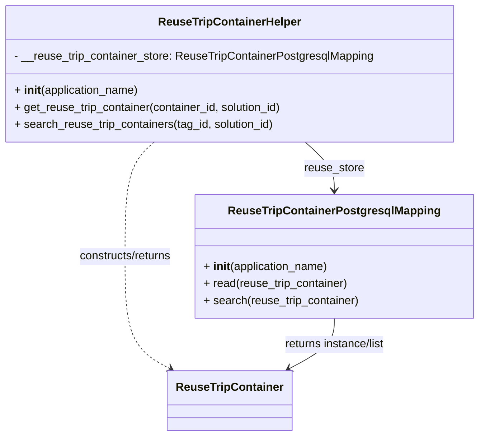

# Diagram: container_tracking_core/container_tracking_service/container_tracking_service/api/helpers/reuse_trip_container_helper.py


> Auto-generated by Obscura crawlers

## Diagram 1



### SVG

<svg id="container" width="672.802734375" xmlns="http://www.w3.org/2000/svg" class="classDiagram" height="614" viewBox="0 0 672.802734375 614" role="graphics-document document" aria-roledescription="class"><style>#container{font-family:"trebuchet ms",verdana,arial,sans-serif;font-size:16px;fill:#333;}@keyframes edge-animation-frame{from{stroke-dashoffset:0;}}@keyframes dash{to{stroke-dashoffset:0;}}#container .edge-animation-slow{stroke-dasharray:9,5!important;stroke-dashoffset:900;animation:dash 50s linear infinite;stroke-linecap:round;}#container .edge-animation-fast{stroke-dasharray:9,5!important;stroke-dashoffset:900;animation:dash 20s linear infinite;stroke-linecap:round;}#container .error-icon{fill:#552222;}#container .error-text{fill:#552222;stroke:#552222;}#container .edge-thickness-normal{stroke-width:1px;}#container .edge-thickness-thick{stroke-width:3.5px;}#container .edge-pattern-solid{stroke-dasharray:0;}#container .edge-thickness-invisible{stroke-width:0;fill:none;}#container .edge-pattern-dashed{stroke-dasharray:3;}#container .edge-pattern-dotted{stroke-dasharray:2;}#container .marker{fill:#333333;stroke:#333333;}#container .marker.cross{stroke:#333333;}#container svg{font-family:"trebuchet ms",verdana,arial,sans-serif;font-size:16px;}#container p{margin:0;}#container g.classGroup text{fill:#9370DB;stroke:none;font-family:"trebuchet ms",verdana,arial,sans-serif;font-size:10px;}#container g.classGroup text .title{font-weight:bolder;}#container .nodeLabel,#container .edgeLabel{color:#131300;}#container .edgeLabel .label rect{fill:#ECECFF;}#container .label text{fill:#131300;}#container .labelBkg{background:#ECECFF;}#container .edgeLabel .label span{background:#ECECFF;}#container .classTitle{font-weight:bolder;}#container .node rect,#container .node circle,#container .node ellipse,#container .node polygon,#container .node path{fill:#ECECFF;stroke:#9370DB;stroke-width:1px;}#container .divider{stroke:#9370DB;stroke-width:1;}#container g.clickable{cursor:pointer;}#container g.classGroup rect{fill:#ECECFF;stroke:#9370DB;}#container g.classGroup line{stroke:#9370DB;stroke-width:1;}#container .classLabel .box{stroke:none;stroke-width:0;fill:#ECECFF;opacity:0.5;}#container .classLabel .label{fill:#9370DB;font-size:10px;}#container .relation{stroke:#333333;stroke-width:1;fill:none;}#container .dashed-line{stroke-dasharray:3;}#container .dotted-line{stroke-dasharray:1 2;}#container #compositionStart,#container .composition{fill:#333333!important;stroke:#333333!important;stroke-width:1;}#container #compositionEnd,#container .composition{fill:#333333!important;stroke:#333333!important;stroke-width:1;}#container #dependencyStart,#container .dependency{fill:#333333!important;stroke:#333333!important;stroke-width:1;}#container #dependencyStart,#container .dependency{fill:#333333!important;stroke:#333333!important;stroke-width:1;}#container #extensionStart,#container .extension{fill:transparent!important;stroke:#333333!important;stroke-width:1;}#container #extensionEnd,#container .extension{fill:transparent!important;stroke:#333333!important;stroke-width:1;}#container #aggregationStart,#container .aggregation{fill:transparent!important;stroke:#333333!important;stroke-width:1;}#container #aggregationEnd,#container .aggregation{fill:transparent!important;stroke:#333333!important;stroke-width:1;}#container #lollipopStart,#container .lollipop{fill:#ECECFF!important;stroke:#333333!important;stroke-width:1;}#container #lollipopEnd,#container .lollipop{fill:#ECECFF!important;stroke:#333333!important;stroke-width:1;}#container .edgeTerminals{font-size:11px;line-height:initial;}#container .classTitleText{text-anchor:middle;font-size:18px;fill:#333;}#container .label-icon{display:inline-block;height:1em;overflow:visible;vertical-align:-0.125em;}#container .node .label-icon path{fill:currentColor;stroke:revert;stroke-width:revert;}#container :root{--mermaid-font-family:"trebuchet ms",verdana,arial,sans-serif;}</style><g><defs><marker id="container_class-aggregationStart" class="marker aggregation class" refX="18" refY="7" markerWidth="190" markerHeight="240" orient="auto"><path d="M 18,7 L9,13 L1,7 L9,1 Z"></path></marker></defs><defs><marker id="container_class-aggregationEnd" class="marker aggregation class" refX="1" refY="7" markerWidth="20" markerHeight="28" orient="auto"><path d="M 18,7 L9,13 L1,7 L9,1 Z"></path></marker></defs><defs><marker id="container_class-extensionStart" class="marker extension class" refX="18" refY="7" markerWidth="190" markerHeight="240" orient="auto"><path d="M 1,7 L18,13 V 1 Z"></path></marker></defs><defs><marker id="container_class-extensionEnd" class="marker extension class" refX="1" refY="7" markerWidth="20" markerHeight="28" orient="auto"><path d="M 1,1 V 13 L18,7 Z"></path></marker></defs><defs><marker id="container_class-compositionStart" class="marker composition class" refX="18" refY="7" markerWidth="190" markerHeight="240" orient="auto"><path d="M 18,7 L9,13 L1,7 L9,1 Z"></path></marker></defs><defs><marker id="container_class-compositionEnd" class="marker composition class" refX="1" refY="7" markerWidth="20" markerHeight="28" orient="auto"><path d="M 18,7 L9,13 L1,7 L9,1 Z"></path></marker></defs><defs><marker id="container_class-dependencyStart" class="marker dependency class" refX="6" refY="7" markerWidth="190" markerHeight="240" orient="auto"><path d="M 5,7 L9,13 L1,7 L9,1 Z"></path></marker></defs><defs><marker id="container_class-dependencyEnd" class="marker dependency class" refX="13" refY="7" markerWidth="20" markerHeight="28" orient="auto"><path d="M 18,7 L9,13 L14,7 L9,1 Z"></path></marker></defs><defs><marker id="container_class-lollipopStart" class="marker lollipop class" refX="13" refY="7" markerWidth="190" markerHeight="240" orient="auto"><circle stroke="black" fill="transparent" cx="7" cy="7" r="6"></circle></marker></defs><defs><marker id="container_class-lollipopEnd" class="marker lollipop class" refX="1" refY="7" markerWidth="190" markerHeight="240" orient="auto"><circle stroke="black" fill="transparent" cx="7" cy="7" r="6"></circle></marker></defs><g class="root"><g class="clusters"></g><g class="edgePaths"><path d="M430.105,200L436.978,206.167C443.852,212.333,457.599,224.667,464.472,236C471.346,247.333,471.346,257.667,471.346,262.833L471.346,268" id="id_ReuseTripContainerHelper_ReuseTripContainerPostgresqlMapping_1" class="edge-thickness-normal edge-pattern-solid relation" style=";;;" data-edge="true" data-et="edge" data-id="id_ReuseTripContainerHelper_ReuseTripContainerPostgresqlMapping_1" data-points="W3sieCI6NDMwLjEwNDg1MTk3MzY4NDIsInkiOjIwMH0seyJ4Ijo0NzEuMzQ1NzAzMTI1LCJ5IjoyMzd9LHsieCI6NDcxLjM0NTcwMzEyNSwieSI6Mjc0fV0=" marker-end="url(#container_class-dependencyEnd)"></path><path d="M216.098,200L209.225,206.167C202.351,212.333,188.604,224.667,181.731,251.5C174.857,278.333,174.857,319.667,174.857,361C174.857,402.333,174.857,443.667,185.547,470.03C196.236,496.393,217.615,507.785,228.304,513.482L238.993,519.178" id="id_ReuseTripContainerHelper_ReuseTripContainer_2" class="edge-thickness-normal edge-pattern-dashed relation" style=";;;" data-edge="true" data-et="edge" data-id="id_ReuseTripContainerHelper_ReuseTripContainer_2" data-points="W3sieCI6MjE2LjA5ODI3MzAyNjMxNTc4LCJ5IjoyMDB9LHsieCI6MTc0Ljg1NzQyMTg3NSwieSI6MjM3fSx7IngiOjE3NC44NTc0MjE4NzUsInkiOjM2MX0seyJ4IjoxNzQuODU3NDIxODc1LCJ5Ijo0ODV9LHsieCI6MjQ0LjI4ODIyMTkxNDU1Njk3LCJ5Ijo1MjJ9XQ==" marker-end="url(#container_class-dependencyEnd)"></path><path d="M471.346,448L471.346,454.167C471.346,460.333,471.346,472.667,460.656,484.53C449.967,496.393,428.589,507.785,417.899,513.482L407.21,519.178" id="id_ReuseTripContainerPostgresqlMapping_ReuseTripContainer_3" class="edge-thickness-normal edge-pattern-solid relation" style=";;;" data-edge="true" data-et="edge" data-id="id_ReuseTripContainerPostgresqlMapping_ReuseTripContainer_3" data-points="W3sieCI6NDcxLjM0NTcwMzEyNSwieSI6NDQ4fSx7IngiOjQ3MS4zNDU3MDMxMjUsInkiOjQ4NX0seyJ4Ijo0MDEuOTE0OTAzMDg1NDQzMDMsInkiOjUyMn1d" marker-end="url(#container_class-dependencyEnd)"></path></g><g class="edgeLabels"><g class="edgeLabel" transform="translate(471.345703125, 237)"><g class="label" data-id="id_ReuseTripContainerHelper_ReuseTripContainerPostgresqlMapping_1" transform="translate(-42.3515625, -12)"><foreignObject width="84.703125" height="24"><div xmlns="http://www.w3.org/1999/xhtml" class="labelBkg" style="display: table-cell; white-space: nowrap; line-height: 1.5; max-width: 200px; text-align: center;"><span class="edgeLabel"><p>reuse_store</p></span></div></foreignObject></g></g><g class="edgeLabel" transform="translate(174.857421875, 361)"><g class="label" data-id="id_ReuseTripContainerHelper_ReuseTripContainer_2" transform="translate(-68.03125, -12)"><foreignObject width="136.0625" height="24"><div xmlns="http://www.w3.org/1999/xhtml" class="labelBkg" style="display: table-cell; white-space: nowrap; line-height: 1.5; max-width: 200px; text-align: center;"><span class="edgeLabel"><p>constructs/returns</p></span></div></foreignObject></g></g><g class="edgeLabel" transform="translate(471.345703125, 485)"><g class="label" data-id="id_ReuseTripContainerPostgresqlMapping_ReuseTripContainer_3" transform="translate(-74.3515625, -12)"><foreignObject width="148.703125" height="24"><div xmlns="http://www.w3.org/1999/xhtml" class="labelBkg" style="display: table-cell; white-space: nowrap; line-height: 1.5; max-width: 200px; text-align: center;"><span class="edgeLabel"><p>returns instance/list</p></span></div></foreignObject></g></g></g><g class="nodes"><g class="node default" id="classId-ReuseTripContainerHelper-0" transform="translate(323.1015625, 104)"><g class="basic label-container"><path d="M-315.1015625 -96 L315.1015625 -96 L315.1015625 96 L-315.1015625 96" stroke="none" stroke-width="0" fill="#ECECFF" style=""></path><path d="M-315.1015625 -96 C-124.91389351180115 -96, 65.2737754763977 -96, 315.1015625 -96 M-315.1015625 -96 C-90.16329566901527 -96, 134.77497116196946 -96, 315.1015625 -96 M315.1015625 -96 C315.1015625 -31.947988997680383, 315.1015625 32.10402200463923, 315.1015625 96 M315.1015625 -96 C315.1015625 -32.6617691144084, 315.1015625 30.6764617711832, 315.1015625 96 M315.1015625 96 C133.54188158839014 96, -48.01779932321972 96, -315.1015625 96 M315.1015625 96 C164.5771932906393 96, 14.052824081278573 96, -315.1015625 96 M-315.1015625 96 C-315.1015625 36.32849565840148, -315.1015625 -23.34300868319704, -315.1015625 -96 M-315.1015625 96 C-315.1015625 54.55987067662124, -315.1015625 13.119741353242475, -315.1015625 -96" stroke="#9370DB" stroke-width="1.3" fill="none" stroke-dasharray="0 0" style=""></path></g><g class="annotation-group text" transform="translate(0, -72)"></g><g class="label-group text" transform="translate(-96.53125, -72)"><g class="label" style="font-weight: bolder" transform="translate(0,-12)"><foreignObject width="193.0625" height="24"><div xmlns="http://www.w3.org/1999/xhtml" style="display: table-cell; white-space: nowrap; line-height: 1.5; max-width: 242px; text-align: center;"><span class="nodeLabel markdown-node-label" style=""><p>ReuseTripContainerHelper</p></span></div></foreignObject></g></g><g class="members-group text" transform="translate(-303.1015625, -24)"><g class="label" style="" transform="translate(0,-12)"><foreignObject width="509.671875" height="24"><div xmlns="http://www.w3.org/1999/xhtml" style="display: table-cell; white-space: nowrap; line-height: 1.5; max-width: 568px; text-align: center;"><span class="nodeLabel markdown-node-label" style=""><p>- __reuse_trip_container_store: ReuseTripContainerPostgresqlMapping</p></span></div></foreignObject></g></g><g class="methods-group text" transform="translate(-303.1015625, 24)"><g class="label" style="" transform="translate(0,-12)"><foreignObject width="177.984375" height="24"><div xmlns="http://www.w3.org/1999/xhtml" style="display: table-cell; white-space: nowrap; line-height: 1.5; max-width: 268px; text-align: center;"><span class="nodeLabel markdown-node-label" style=""><p>+ <strong>init</strong>(application_name)</p></span></div></foreignObject></g><g class="label" style="" transform="translate(0,12)"><foreignObject width="384.546875" height="24"><div xmlns="http://www.w3.org/1999/xhtml" style="display: table-cell; white-space: nowrap; line-height: 1.5; max-width: 442px; text-align: center;"><span class="nodeLabel markdown-node-label" style=""><p>+ get_reuse_trip_container(container_id, solution_id)</p></span></div></foreignObject></g><g class="label" style="" transform="translate(0,36)"><foreignObject width="371.359375" height="24"><div xmlns="http://www.w3.org/1999/xhtml" style="display: table-cell; white-space: nowrap; line-height: 1.5; max-width: 429px; text-align: center;"><span class="nodeLabel markdown-node-label" style=""><p>+ search_reuse_trip_containers(tag_id, solution_id)</p></span></div></foreignObject></g></g><g class="divider" style=""><path d="M-315.1015625 -48 C-156.82247482650294 -48, 1.456612846994119 -48, 315.1015625 -48 M-315.1015625 -48 C-138.8226773910889 -48, 37.456207717822224 -48, 315.1015625 -48" stroke="#9370DB" stroke-width="1.3" fill="none" stroke-dasharray="0 0" style=""></path></g><g class="divider" style=""><path d="M-315.1015625 0 C-69.50770158359873 0, 176.08615933280254 0, 315.1015625 0 M-315.1015625 0 C-164.49298297357012 0, -13.884403447140244 0, 315.1015625 0" stroke="#9370DB" stroke-width="1.3" fill="none" stroke-dasharray="0 0" style=""></path></g></g><g class="node default" id="classId-ReuseTripContainer-1" transform="translate(323.1015625, 564)"><g class="basic label-container"><path d="M-84.015625 -42 L84.015625 -42 L84.015625 42 L-84.015625 42" stroke="none" stroke-width="0" fill="#ECECFF" style=""></path><path d="M-84.015625 -42 C-20.242317573473827 -42, 43.53098985305235 -42, 84.015625 -42 M-84.015625 -42 C-45.8501108407589 -42, -7.684596681517803 -42, 84.015625 -42 M84.015625 -42 C84.015625 -10.270301239013637, 84.015625 21.459397521972726, 84.015625 42 M84.015625 -42 C84.015625 -10.341984418784712, 84.015625 21.316031162430576, 84.015625 42 M84.015625 42 C35.92617450628284 42, -12.163275987434318 42, -84.015625 42 M84.015625 42 C19.040303282640238 42, -45.935018434719524 42, -84.015625 42 M-84.015625 42 C-84.015625 24.05562999196505, -84.015625 6.111259983930097, -84.015625 -42 M-84.015625 42 C-84.015625 24.625395351776465, -84.015625 7.25079070355293, -84.015625 -42" stroke="#9370DB" stroke-width="1.3" fill="none" stroke-dasharray="0 0" style=""></path></g><g class="annotation-group text" transform="translate(0, -18)"></g><g class="label-group text" transform="translate(-72.015625, -18)"><g class="label" style="font-weight: bolder" transform="translate(0,-12)"><foreignObject width="144.03125" height="24"><div xmlns="http://www.w3.org/1999/xhtml" style="display: table-cell; white-space: nowrap; line-height: 1.5; max-width: 193px; text-align: center;"><span class="nodeLabel markdown-node-label" style=""><p>ReuseTripContainer</p></span></div></foreignObject></g></g><g class="members-group text" transform="translate(-72.015625, 30)"></g><g class="methods-group text" transform="translate(-72.015625, 60)"></g><g class="divider" style=""><path d="M-84.015625 6 C-45.230012073495246 6, -6.4443991469904915 6, 84.015625 6 M-84.015625 6 C-36.31465744721768 6, 11.386310105564647 6, 84.015625 6" stroke="#9370DB" stroke-width="1.3" fill="none" stroke-dasharray="0 0" style=""></path></g><g class="divider" style=""><path d="M-84.015625 24 C-27.14626770308457 24, 29.723089593830863 24, 84.015625 24 M-84.015625 24 C-47.52629908396708 24, -11.036973167934164 24, 84.015625 24" stroke="#9370DB" stroke-width="1.3" fill="none" stroke-dasharray="0 0" style=""></path></g></g><g class="node default" id="classId-ReuseTripContainerPostgresqlMapping-2" transform="translate(471.345703125, 361)"><g class="basic label-container"><path d="M-193.45703125 -87 L193.45703125 -87 L193.45703125 87 L-193.45703125 87" stroke="none" stroke-width="0" fill="#ECECFF" style=""></path><path d="M-193.45703125 -87 C-46.95462317157191 -87, 99.54778490685618 -87, 193.45703125 -87 M-193.45703125 -87 C-101.72257700456213 -87, -9.988122759124252 -87, 193.45703125 -87 M193.45703125 -87 C193.45703125 -19.55848494732969, 193.45703125 47.88303010534062, 193.45703125 87 M193.45703125 -87 C193.45703125 -20.17525771612921, 193.45703125 46.64948456774158, 193.45703125 87 M193.45703125 87 C110.16960920727905 87, 26.882187164558104 87, -193.45703125 87 M193.45703125 87 C94.35643163689157 87, -4.744167976216858 87, -193.45703125 87 M-193.45703125 87 C-193.45703125 24.2707585847078, -193.45703125 -38.4584828305844, -193.45703125 -87 M-193.45703125 87 C-193.45703125 47.00728038477336, -193.45703125 7.014560769546719, -193.45703125 -87" stroke="#9370DB" stroke-width="1.3" fill="none" stroke-dasharray="0 0" style=""></path></g><g class="annotation-group text" transform="translate(0, -63)"></g><g class="label-group text" transform="translate(-142.4140625, -63)"><g class="label" style="font-weight: bolder" transform="translate(0,-12)"><foreignObject width="284.828125" height="24"><div xmlns="http://www.w3.org/1999/xhtml" style="display: table-cell; white-space: nowrap; line-height: 1.5; max-width: 331px; text-align: center;"><span class="nodeLabel markdown-node-label" style=""><p>ReuseTripContainerPostgresqlMapping</p></span></div></foreignObject></g></g><g class="members-group text" transform="translate(-181.45703125, -15)"></g><g class="methods-group text" transform="translate(-181.45703125, 15)"><g class="label" style="" transform="translate(0,-12)"><foreignObject width="177.984375" height="24"><div xmlns="http://www.w3.org/1999/xhtml" style="display: table-cell; white-space: nowrap; line-height: 1.5; max-width: 268px; text-align: center;"><span class="nodeLabel markdown-node-label" style=""><p>+ <strong>init</strong>(application_name)</p></span></div></foreignObject></g><g class="label" style="" transform="translate(0,12)"><foreignObject width="205.578125" height="24"><div xmlns="http://www.w3.org/1999/xhtml" style="display: table-cell; white-space: nowrap; line-height: 1.5; max-width: 263px; text-align: center;"><span class="nodeLabel markdown-node-label" style=""><p>+ read(reuse_trip_container)</p></span></div></foreignObject></g><g class="label" style="" transform="translate(0,36)"><foreignObject width="220.5" height="24"><div xmlns="http://www.w3.org/1999/xhtml" style="display: table-cell; white-space: nowrap; line-height: 1.5; max-width: 278px; text-align: center;"><span class="nodeLabel markdown-node-label" style=""><p>+ search(reuse_trip_container)</p></span></div></foreignObject></g></g><g class="divider" style=""><path d="M-193.45703125 -39 C-62.1973611624359 -39, 69.0623089251282 -39, 193.45703125 -39 M-193.45703125 -39 C-51.048582675114545 -39, 91.35986589977091 -39, 193.45703125 -39" stroke="#9370DB" stroke-width="1.3" fill="none" stroke-dasharray="0 0" style=""></path></g><g class="divider" style=""><path d="M-193.45703125 -15 C-43.74293601533364 -15, 105.97115921933272 -15, 193.45703125 -15 M-193.45703125 -15 C-98.17664898214588 -15, -2.8962667142917553 -15, 193.45703125 -15" stroke="#9370DB" stroke-width="1.3" fill="none" stroke-dasharray="0 0" style=""></path></g></g></g></g></g></svg>

## Diagram 2

```mermaid
flowchart TD
    subgraph GetReuseTripContainer
        G1[Input: container_id, solution_id] --> Create1[Create ReuseTripContainer]
        Create1 --> SetIDs1[Set id and solution_id]
        SetIDs1 --> ReadStore1[Call store.read(reuse_trip_container)]
        ReadStore1 --> Return1[Return reuse_trip_container]
    end

    subgraph SearchReuseTripContainers
        G2[Input: tag_id, solution_id] --> CheckParams{tag_id and solution_id?}
        CheckParams -- No --> ReturnNone[Return None]
        CheckParams -- Yes --> Create2[Create ReuseTripContainer]
        Create2 --> SetFields2[Set tag_identifier and solution_id]
        SetFields2 --> SearchStore2[container_list = store.search(reuse_trip_container)]
        SearchStore2 --> CheckList{len(container_list) == 1?}
        CheckList -- Yes --> ReturnItem[Return container_list[0]]
        CheckList -- No --> ReturnNone
    end
```

> SVG rendering failed for this diagram.
