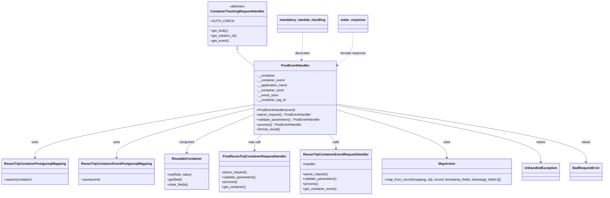
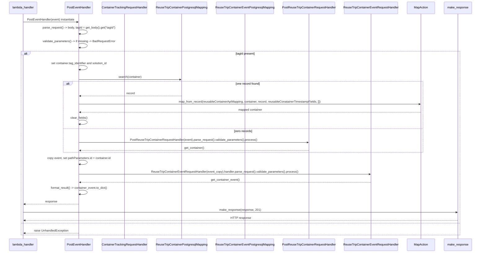

# Diagram: container_tracking_core/container_tracking_service/container_tracking_service/api/public/postEventHandler.py

> Auto-generated by Obscura crawlers

## Diagram 1

### SVG

<svg id="container" width="2878.53125" xmlns="http://www.w3.org/2000/svg" class="classDiagram" height="956" viewBox="0 0 2878.53125 956" role="graphics-document document" aria-roledescription="class"><g><defs><marker id="container_class-aggregationStart" class="marker aggregation class" refX="18" refY="7" markerWidth="190" markerHeight="240" orient="auto"><path d="M 18,7 L9,13 L1,7 L9,1 Z"></path></marker></defs><defs><marker id="container_class-aggregationEnd" class="marker aggregation class" refX="1" refY="7" markerWidth="20" markerHeight="28" orient="auto"><path d="M 18,7 L9,13 L1,7 L9,1 Z"></path></marker></defs><defs><marker id="container_class-extensionStart" class="marker extension class" refX="18" refY="7" markerWidth="190" markerHeight="240" orient="auto"><path d="M 1,7 L18,13 V 1 Z"></path></marker></defs><defs><marker id="container_class-extensionEnd" class="marker extension class" refX="1" refY="7" markerWidth="20" markerHeight="28" orient="auto"><path d="M 1,1 V 13 L18,7 Z"></path></marker></defs><defs><marker id="container_class-compositionStart" class="marker composition class" refX="18" refY="7" markerWidth="190" markerHeight="240" orient="auto"><path d="M 18,7 L9,13 L1,7 L9,1 Z"></path></marker></defs><defs><marker id="container_class-compositionEnd" class="marker composition class" refX="1" refY="7" markerWidth="20" markerHeight="28" orient="auto"><path d="M 18,7 L9,13 L1,7 L9,1 Z"></path></marker></defs><defs><marker id="container_class-dependencyStart" class="marker dependency class" refX="6" refY="7" markerWidth="190" markerHeight="240" orient="auto"><path d="M 5,7 L9,13 L1,7 L9,1 Z"></path></marker></defs><defs><marker id="container_class-dependencyEnd" class="marker dependency class" refX="13" refY="7" markerWidth="20" markerHeight="28" orient="auto"><path d="M 18,7 L9,13 L14,7 L9,1 Z"></path></marker></defs><defs><marker id="container_class-lollipopStart" class="marker lollipop class" refX="13" refY="7" markerWidth="190" markerHeight="240" orient="auto"><circle stroke="black" fill="transparent" cx="7" cy="7" r="6"></circle></marker></defs><defs><marker id="container_class-lollipopEnd" class="marker lollipop class" refX="1" refY="7" markerWidth="190" markerHeight="240" orient="auto"><circle stroke="black" fill="transparent" cx="7" cy="7" r="6"></circle></marker></defs><g class="root"><g class="clusters"></g><g class="edgePaths"><path d="M1117.945,241.25L1117.945,244.542C1117.945,247.833,1117.945,254.417,1130.54,267.667C1143.135,280.918,1168.324,300.836,1180.919,310.796L1193.514,320.755" id="id_ContainerTrackingRequestHandler_PostEventHandler_1" class="edge-thickness-normal edge-pattern-solid relation" style=";;;" data-edge="true" data-et="edge" data-id="id_ContainerTrackingRequestHandler_PostEventHandler_1" data-points="W3sieCI6MTExNy45NDUzMTI1LCJ5IjoyMjR9LHsieCI6MTExNy45NDUzMTI1LCJ5IjoyNjF9LHsieCI6MTE5My41MTM2NzE4NzUsInkiOjMyMC43NTQ2NTI3OTMwOTkyNH1d" marker-start="url(#container_class-extensionStart)"></path><path d="M1193.514,513.084L1021.664,543.404C849.814,573.723,506.114,634.361,334.264,677.347C162.414,720.333,162.414,745.667,162.414,758.333L162.414,771" id="id_PostEventHandler_ReuseTripContainerPostgresqlMapping_2" class="edge-thickness-normal edge-pattern-solid relation" style=";;;" data-edge="true" data-et="edge" data-id="id_PostEventHandler_ReuseTripContainerPostgresqlMapping_2" data-points="W3sieCI6MTE5My41MTM2NzE4NzUsInkiOjUxMy4wODQ0OTA1NTg3ODd9LHsieCI6MTYyLjQxNDA2MjUsInkiOjY5NX0seyJ4IjoxNjIuNDE0MDYyNSwieSI6Nzc3fV0=" marker-end="url(#container_class-dependencyEnd)"></path><path d="M1193.514,528.712L1084.836,556.427C976.158,584.142,758.801,639.571,650.123,679.952C541.445,720.333,541.445,745.667,541.445,758.333L541.445,771" id="id_PostEventHandler_ReuseTripContainerEventPostgresqlMapping_3" class="edge-thickness-normal edge-pattern-solid relation" style=";;;" data-edge="true" data-et="edge" data-id="id_PostEventHandler_ReuseTripContainerEventPostgresqlMapping_3" data-points="W3sieCI6MTE5My41MTM2NzE4NzUsInkiOjUyOC43MTIyNzg2NDgwNzQ5fSx7IngiOjU0MS40NDUzMTI1LCJ5Ijo2OTV9LHsieCI6NTQxLjQ0NTMxMjUsInkiOjc3N31d" marker-end="url(#container_class-dependencyEnd)"></path><path d="M1193.514,560.976L1139.98,583.313C1086.447,605.651,979.38,650.325,925.846,681.329C872.313,712.333,872.313,729.667,872.313,738.333L872.313,747" id="id_PostEventHandler_ReusableContainer_4" class="edge-thickness-normal edge-pattern-solid relation" style=";;;" data-edge="true" data-et="edge" data-id="id_PostEventHandler_ReusableContainer_4" data-points="W3sieCI6MTE5My41MTM2NzE4NzUsInkiOjU2MC45NzU4ODU0NzAwNjYzfSx7IngiOjg3Mi4zMTI1LCJ5Ijo2OTV9LHsieCI6ODcyLjMxMjUsInkiOjc1M31d" marker-end="url(#container_class-dependencyEnd)"></path><path d="M1230.698,658L1225.159,664.167C1219.62,670.333,1208.543,682.667,1203.004,695.5C1197.465,708.333,1197.465,721.667,1197.465,728.333L1197.465,735" id="id_PostEventHandler_PostReuseTripContainerRequestHandler_5" class="edge-thickness-normal edge-pattern-solid relation" style=";;;" data-edge="true" data-et="edge" data-id="id_PostEventHandler_PostReuseTripContainerRequestHandler_5" data-points="W3sieCI6MTIzMC42OTgwMzk2NzQ1MzkxLCJ5Ijo2NTh9LHsieCI6MTE5Ny40NjQ4NDM3NSwieSI6Njk1fSx7IngiOjExOTcuNDY0ODQzNzUsInkiOjc0MX1d" marker-end="url(#container_class-dependencyEnd)"></path><path d="M1554.048,658L1559.587,664.167C1565.126,670.333,1576.204,682.667,1581.742,694C1587.281,705.333,1587.281,715.667,1587.281,720.833L1587.281,726" id="id_PostEventHandler_ReuseTripContainerEventRequestHandler_6" class="edge-thickness-normal edge-pattern-solid relation" style=";;;" data-edge="true" data-et="edge" data-id="id_PostEventHandler_ReuseTripContainerEventRequestHandler_6" data-points="W3sieCI6MTU1NC4wNDgwNTQwNzU0NjA5LCJ5Ijo2NTh9LHsieCI6MTU4Ny4yODEyNSwieSI6Njk1fSx7IngiOjE1ODcuMjgxMjUsInkiOjczMn1d" marker-end="url(#container_class-dependencyEnd)"></path><path d="M1591.232,536.694L1680.625,563.078C1770.018,589.462,1948.804,642.231,2038.197,681.282C2127.59,720.333,2127.59,745.667,2127.59,758.333L2127.59,771" id="id_PostEventHandler_MapAction_7" class="edge-thickness-normal edge-pattern-solid relation" style=";;;" data-edge="true" data-et="edge" data-id="id_PostEventHandler_MapAction_7" data-points="W3sieCI6MTU5MS4yMzI0MjE4NzUsInkiOjUzNi42OTM1NTA3NDM2OTU0fSx7IngiOjIxMjcuNTg5ODQzNzUsInkiOjY5NX0seyJ4IjoyMTI3LjU4OTg0Mzc1LCJ5Ijo3Nzd9XQ==" marker-end="url(#container_class-dependencyEnd)"></path><path d="M1591.232,514.199L1756.773,544.332C1922.314,574.466,2253.395,634.733,2418.936,681.033C2584.477,727.333,2584.477,759.667,2584.477,775.833L2584.477,792" id="id_PostEventHandler_UnhandledException_8" class="edge-thickness-normal edge-pattern-solid relation" style=";;;" data-edge="true" data-et="edge" data-id="id_PostEventHandler_UnhandledException_8" data-points="W3sieCI6MTU5MS4yMzI0MjE4NzUsInkiOjUxNC4xOTg2MDUwNzg2Njd9LHsieCI6MjU4NC40NzY1NjI1LCJ5Ijo2OTV9LHsieCI6MjU4NC40NzY1NjI1LCJ5Ijo3OTh9XQ==" marker-end="url(#container_class-dependencyEnd)"></path><path d="M1591.232,508.738L1792.069,539.782C1992.905,570.825,2394.577,632.913,2595.414,680.123C2796.25,727.333,2796.25,759.667,2796.25,775.833L2796.25,792" id="id_PostEventHandler_BadRequestError_9" class="edge-thickness-normal edge-pattern-solid relation" style=";;;" data-edge="true" data-et="edge" data-id="id_PostEventHandler_BadRequestError_9" data-points="W3sieCI6MTU5MS4yMzI0MjE4NzUsInkiOjUwOC43MzgwODE2MjM4NTE0fSx7IngiOjI3OTYuMjUsInkiOjY5NX0seyJ4IjoyNzk2LjI1LCJ5Ijo3OTh9XQ==" marker-end="url(#container_class-dependencyEnd)"></path><path d="M1427.902,158L1427.902,175.167C1427.902,192.333,1427.902,226.667,1427.054,249.013C1426.206,271.36,1424.51,281.719,1423.662,286.899L1422.814,292.079" id="id_mandatory_lambda_handling_PostEventHandler_10" class="edge-thickness-normal edge-pattern-dashed relation" style=";;;" data-edge="true" data-et="edge" data-id="id_mandatory_lambda_handling_PostEventHandler_10" data-points="W3sieCI6MTQyNy45MDIzNDM3NSwieSI6MTU4fSx7IngiOjE0MjcuOTAyMzQzNzUsInkiOjI2MX0seyJ4IjoxNDIxLjg0NDM1MzAzODU5NDQsInkiOjI5OH1d" marker-end="url(#container_class-dependencyEnd)"></path><path d="M1666.801,158L1666.801,175.167C1666.801,192.333,1666.801,226.667,1654.99,253.172C1643.18,279.678,1619.559,298.355,1607.749,307.694L1595.939,317.033" id="id_make_response_PostEventHandler_11" class="edge-thickness-normal edge-pattern-dashed relation" style=";;;" data-edge="true" data-et="edge" data-id="id_make_response_PostEventHandler_11" data-points="W3sieCI6MTY2Ni44MDA3ODEyNSwieSI6MTU4fSx7IngiOjE2NjYuODAwNzgxMjUsInkiOjI2MX0seyJ4IjoxNTkxLjIzMjQyMTg3NSwieSI6MzIwLjc1NDY1Mjc5MzA5OTI0fV0=" marker-end="url(#container_class-dependencyEnd)"></path></g><g class="edgeLabels"><g class="edgeLabel"><g class="label" data-id="id_ContainerTrackingRequestHandler_PostEventHandler_1" transform="translate(0, 0)"><foreignObject width="0" height="0">

</foreignObject></g></g><g class="edgeLabel" transform="translate(162.4140625, 695)"><g class="label" data-id="id_PostEventHandler_ReuseTripContainerPostgresqlMapping_2" transform="translate(-16.4921875, -12)"><foreignObject width="32.984375" height="24">

uses

</foreignObject></g></g><g class="edgeLabel" transform="translate(541.4453125, 695)"><g class="label" data-id="id_PostEventHandler_ReuseTripContainerEventPostgresqlMapping_3" transform="translate(-16.4921875, -12)"><foreignObject width="32.984375" height="24">

uses

</foreignObject></g></g><g class="edgeLabel" transform="translate(872.3125, 695)"><g class="label" data-id="id_PostEventHandler_ReusableContainer_4" transform="translate(-36.453125, -12)"><foreignObject width="72.90625" height="24">

composes

</foreignObject></g></g><g class="edgeLabel" transform="translate(1197.46484375, 695)"><g class="label" data-id="id_PostEventHandler_PostReuseTripContainerRequestHandler_5" transform="translate(-29.8515625, -12)"><foreignObject width="59.703125" height="24">

may call

</foreignObject></g></g><g class="edgeLabel" transform="translate(1587.28125, 695)"><g class="label" data-id="id_PostEventHandler_ReuseTripContainerEventRequestHandler_6" transform="translate(-16.4453125, -12)"><foreignObject width="32.890625" height="24">

calls

</foreignObject></g></g><g class="edgeLabel" transform="translate(2127.58984375, 695)"><g class="label" data-id="id_PostEventHandler_MapAction_7" transform="translate(-16.4921875, -12)"><foreignObject width="32.984375" height="24">

uses

</foreignObject></g></g><g class="edgeLabel" transform="translate(2584.4765625, 695)"><g class="label" data-id="id_PostEventHandler_UnhandledException_8" transform="translate(-21.25, -12)"><foreignObject width="42.5" height="24">

raises

</foreignObject></g></g><g class="edgeLabel" transform="translate(2796.25, 695)"><g class="label" data-id="id_PostEventHandler_BadRequestError_9" transform="translate(-21.25, -12)"><foreignObject width="42.5" height="24">

raises

</foreignObject></g></g><g class="edgeLabel" transform="translate(1427.90234375, 261)"><g class="label" data-id="id_mandatory_lambda_handling_PostEventHandler_10" transform="translate(-35.5078125, -12)"><foreignObject width="71.015625" height="24">

decorates

</foreignObject></g></g><g class="edgeLabel" transform="translate(1666.80078125, 261)"><g class="label" data-id="id_make_response_PostEventHandler_11" transform="translate(-63.46875, -12)"><foreignObject width="126.9375" height="24">

formats response

</foreignObject></g></g></g><g class="nodes"><g class="node default" id="classId-ContainerTrackingRequestHandler-0" transform="translate(1117.9453125, 116)"><g class="basic label-container"><path d="M-140.52734375 -108 L140.52734375 -108 L140.52734375 108 L-140.52734375 108" stroke="none" stroke-width="0" fill="#ECECFF" style=""></path><path d="M-140.52734375 -108 C-54.508062381254874 -108, 31.511218987490253 -108, 140.52734375 -108 M-140.52734375 -108 C-64.9988205204931 -108, 10.529702709013804 -108, 140.52734375 -108 M140.52734375 -108 C140.52734375 -27.5507277787478, 140.52734375 52.8985444425044, 140.52734375 108 M140.52734375 -108 C140.52734375 -59.38812528283094, 140.52734375 -10.776250565661883, 140.52734375 108 M140.52734375 108 C34.15516639860286 108, -72.21701095279428 108, -140.52734375 108 M140.52734375 108 C66.82062307295487 108, -6.886097604090253 108, -140.52734375 108 M-140.52734375 108 C-140.52734375 60.5046167612094, -140.52734375 13.009233522418796, -140.52734375 -108 M-140.52734375 108 C-140.52734375 40.54226319882166, -140.52734375 -26.915473602356684, -140.52734375 -108" stroke="#9370DB" stroke-width="1.3" fill="none" stroke-dasharray="0 0" style=""></path></g><g class="annotation-group text" transform="translate(-38.609375, -84)"><g class="label" style="" transform="translate(0,-12)"><foreignObject width="77.21875" height="24">

«abstract»

</foreignObject></g></g><g class="label-group text" transform="translate(-125.5859375, -60)"><g class="label" style="font-weight: bolder" transform="translate(0,-12)"><foreignObject width="251.171875" height="24">

ContainerTrackingRequestHandler

</foreignObject></g></g><g class="members-group text" transform="translate(-128.52734375, -12)"><g class="label" style="" transform="translate(0,-12)"><foreignObject width="100.859375" height="24">

+AUTH_CHECK

</foreignObject></g></g><g class="methods-group text" transform="translate(-128.52734375, 36)"><g class="label" style="" transform="translate(0,-12)"><foreignObject width="85.53125" height="24">

+get_body()

</foreignObject></g><g class="label" style="" transform="translate(0,12)"><foreignObject width="131.46875" height="24">

+get_solution_id()

</foreignObject></g><g class="label" style="" transform="translate(0,36)"><foreignObject width="89.25" height="24">

+get_event()

</foreignObject></g></g><g class="divider" style=""><path d="M-140.52734375 -36 C-66.51513227952962 -36, 7.497079190940752 -36, 140.52734375 -36 M-140.52734375 -36 C-70.94296707458797 -36, -1.358590399175938 -36, 140.52734375 -36" stroke="#9370DB" stroke-width="1.3" fill="none" stroke-dasharray="0 0" style=""></path></g><g class="divider" style=""><path d="M-140.52734375 12 C-68.66570730929033 12, 3.195929131419348 12, 140.52734375 12 M-140.52734375 12 C-75.32913073565554 12, -10.130917721311079 12, 140.52734375 12" stroke="#9370DB" stroke-width="1.3" fill="none" stroke-dasharray="0 0" style=""></path></g></g><g class="node default" id="classId-PostEventHandler-1" transform="translate(1392.373046875, 478)"><g class="basic label-container"><path d="M-198.859375 -180 L198.859375 -180 L198.859375 180 L-198.859375 180" stroke="none" stroke-width="0" fill="#ECECFF" style=""></path><path d="M-198.859375 -180 C-46.32733811529715 -180, 106.2046987694057 -180, 198.859375 -180 M-198.859375 -180 C-47.69372037058267 -180, 103.47193425883466 -180, 198.859375 -180 M198.859375 -180 C198.859375 -37.34121857113092, 198.859375 105.31756285773815, 198.859375 180 M198.859375 -180 C198.859375 -62.766518690176326, 198.859375 54.46696261964735, 198.859375 180 M198.859375 180 C101.76723880483036 180, 4.675102609660712 180, -198.859375 180 M198.859375 180 C96.2719233335302 180, -6.315528332939607 180, -198.859375 180 M-198.859375 180 C-198.859375 55.04625809504505, -198.859375 -69.9074838099099, -198.859375 -180 M-198.859375 180 C-198.859375 62.10175955952684, -198.859375 -55.79648088094632, -198.859375 -180" stroke="#9370DB" stroke-width="1.3" fill="none" stroke-dasharray="0 0" style=""></path></g><g class="annotation-group text" transform="translate(0, -156)"></g><g class="label-group text" transform="translate(-65.484375, -156)"><g class="label" style="font-weight: bolder" transform="translate(0,-12)"><foreignObject width="130.96875" height="24">

PostEventHandler

</foreignObject></g></g><g class="members-group text" transform="translate(-186.859375, -108)"><g class="label" style="" transform="translate(0,-12)"><foreignObject width="90.53125" height="24">

-__container

</foreignObject></g><g class="label" style="" transform="translate(0,12)"><foreignObject width="137.59375" height="24">

-__container_event

</foreignObject></g><g class="label" style="" transform="translate(0,36)"><foreignObject width="152.28125" height="24">

-__application_name

</foreignObject></g><g class="label" style="" transform="translate(0,60)"><foreignObject width="134.34375" height="24">

-__container_store

</foreignObject></g><g class="label" style="" transform="translate(0,84)"><foreignObject width="106.765625" height="24">

-__event_store

</foreignObject></g><g class="label" style="" transform="translate(0,108)"><foreignObject width="142.25" height="24">

-__container_tag_id

</foreignObject></g></g><g class="methods-group text" transform="translate(-186.859375, 60)"><g class="label" style="" transform="translate(0,-12)"><foreignObject width="188.0625" height="24">

+PostEventHandler(event)

</foreignObject></g><g class="label" style="" transform="translate(0,12)"><foreignObject width="263.484375" height="24">

+parse_request() : PostEventHandler

</foreignObject></g><g class="label" style="" transform="translate(0,36)"><foreignObject width="308.234375" height="24">

+validate_parameters() : PostEventHandler

</foreignObject></g><g class="label" style="" transform="translate(0,60)"><foreignObject width="215.421875" height="24">

+process() : PostEventHandler

</foreignObject></g><g class="label" style="" transform="translate(0,84)"><foreignObject width="117.015625" height="24">

+format_result()

</foreignObject></g></g><g class="divider" style=""><path d="M-198.859375 -132 C-70.36548331549673 -132, 58.128408369006536 -132, 198.859375 -132 M-198.859375 -132 C-58.50658913627362 -132, 81.84619672745276 -132, 198.859375 -132" stroke="#9370DB" stroke-width="1.3" fill="none" stroke-dasharray="0 0" style=""></path></g><g class="divider" style=""><path d="M-198.859375 36 C-48.08616888318775 36, 102.6870372336245 36, 198.859375 36 M-198.859375 36 C-71.13697691342497 36, 56.58542117315005 36, 198.859375 36" stroke="#9370DB" stroke-width="1.3" fill="none" stroke-dasharray="0 0" style=""></path></g></g><g class="node default" id="classId-ReusableContainer-2" transform="translate(872.3125, 840)"><g class="basic label-container"><path d="M-106.25 -87 L106.25 -87 L106.25 87 L-106.25 87" stroke="none" stroke-width="0" fill="#ECECFF" style=""></path><path d="M-106.25 -87 C-35.53630684850212 -87, 35.17738630299576 -87, 106.25 -87 M-106.25 -87 C-47.09442792889546 -87, 12.061144142209073 -87, 106.25 -87 M106.25 -87 C106.25 -41.56149671937876, 106.25 3.8770065612424816, 106.25 87 M106.25 -87 C106.25 -41.04465891522734, 106.25 4.910682169545325, 106.25 87 M106.25 87 C44.57268579306939 87, -17.10462841386122 87, -106.25 87 M106.25 87 C39.45085736016479 87, -27.34828527967042 87, -106.25 87 M-106.25 87 C-106.25 23.735800313081832, -106.25 -39.528399373836336, -106.25 -87 M-106.25 87 C-106.25 52.02161021215675, -106.25 17.043220424313503, -106.25 -87" stroke="#9370DB" stroke-width="1.3" fill="none" stroke-dasharray="0 0" style=""></path></g><g class="annotation-group text" transform="translate(0, -63)"></g><g class="label-group text" transform="translate(-69.109375, -63)"><g class="label" style="font-weight: bolder" transform="translate(0,-12)"><foreignObject width="138.21875" height="24">

ReusableContainer

</foreignObject></g></g><g class="members-group text" transform="translate(-94.25, -15)"></g><g class="methods-group text" transform="translate(-94.25, 15)"><g class="label" style="" transform="translate(0,-12)"><foreignObject width="119.390625" height="24">

+set(field, value)

</foreignObject></g><g class="label" style="" transform="translate(0,12)"><foreignObject width="73.015625" height="24">

+get(field)

</foreignObject></g><g class="label" style="" transform="translate(0,36)"><foreignObject width="100.34375" height="24">

+clear_fields()

</foreignObject></g></g><g class="divider" style=""><path d="M-106.25 -39 C-37.30032563854448 -39, 31.649348722911043 -39, 106.25 -39 M-106.25 -39 C-48.213317801022676 -39, 9.823364397954649 -39, 106.25 -39" stroke="#9370DB" stroke-width="1.3" fill="none" stroke-dasharray="0 0" style=""></path></g><g class="divider" style=""><path d="M-106.25 -15 C-61.59063697432409 -15, -16.931273948648183 -15, 106.25 -15 M-106.25 -15 C-21.49885272092517 -15, 63.25229455814966 -15, 106.25 -15" stroke="#9370DB" stroke-width="1.3" fill="none" stroke-dasharray="0 0" style=""></path></g></g><g class="node default" id="classId-ReuseTripContainerPostgresqlMapping-3" transform="translate(162.4140625, 840)"><g class="basic label-container"><path d="M-154.4140625 -63 L154.4140625 -63 L154.4140625 63 L-154.4140625 63" stroke="none" stroke-width="0" fill="#ECECFF" style=""></path><path d="M-154.4140625 -63 C-49.36692662361692 -63, 55.68020925276616 -63, 154.4140625 -63 M-154.4140625 -63 C-41.45491921712011 -63, 71.50422406575979 -63, 154.4140625 -63 M154.4140625 -63 C154.4140625 -36.67756867602527, 154.4140625 -10.355137352050534, 154.4140625 63 M154.4140625 -63 C154.4140625 -16.293098968124802, 154.4140625 30.413802063750396, 154.4140625 63 M154.4140625 63 C44.842280719599785 63, -64.72950106080043 63, -154.4140625 63 M154.4140625 63 C60.72015913462397 63, -32.97374423075206 63, -154.4140625 63 M-154.4140625 63 C-154.4140625 36.558987473665596, -154.4140625 10.117974947331192, -154.4140625 -63 M-154.4140625 63 C-154.4140625 22.33706789067903, -154.4140625 -18.32586421864194, -154.4140625 -63" stroke="#9370DB" stroke-width="1.3" fill="none" stroke-dasharray="0 0" style=""></path></g><g class="annotation-group text" transform="translate(0, -39)"></g><g class="label-group text" transform="translate(-142.4140625, -39)"><g class="label" style="font-weight: bolder" transform="translate(0,-12)"><foreignObject width="284.828125" height="24">

ReuseTripContainerPostgresqlMapping

</foreignObject></g></g><g class="members-group text" transform="translate(-142.4140625, 9)"></g><g class="methods-group text" transform="translate(-142.4140625, 39)"><g class="label" style="" transform="translate(0,-12)"><foreignObject width="135.015625" height="24">

+search(container)

</foreignObject></g></g><g class="divider" style=""><path d="M-154.4140625 -15 C-90.65247715030128 -15, -26.890891800602574 -15, 154.4140625 -15 M-154.4140625 -15 C-31.66622818351712 -15, 91.08160613296576 -15, 154.4140625 -15" stroke="#9370DB" stroke-width="1.3" fill="none" stroke-dasharray="0 0" style=""></path></g><g class="divider" style=""><path d="M-154.4140625 9 C-51.3726150234572 9, 51.6688324530856 9, 154.4140625 9 M-154.4140625 9 C-64.22240096980912 9, 25.96926056038177 9, 154.4140625 9" stroke="#9370DB" stroke-width="1.3" fill="none" stroke-dasharray="0 0" style=""></path></g></g><g class="node default" id="classId-ReuseTripContainerEventPostgresqlMapping-4" transform="translate(541.4453125, 840)"><g class="basic label-container"><path d="M-174.6171875 -63 L174.6171875 -63 L174.6171875 63 L-174.6171875 63" stroke="none" stroke-width="0" fill="#ECECFF" style=""></path><path d="M-174.6171875 -63 C-40.88757456779206 -63, 92.84203836441588 -63, 174.6171875 -63 M-174.6171875 -63 C-99.06338815842805 -63, -23.50958881685611 -63, 174.6171875 -63 M174.6171875 -63 C174.6171875 -17.239917472310708, 174.6171875 28.520165055378584, 174.6171875 63 M174.6171875 -63 C174.6171875 -17.371837516278177, 174.6171875 28.256324967443646, 174.6171875 63 M174.6171875 63 C98.76173067667021 63, 22.906273853340423 63, -174.6171875 63 M174.6171875 63 C55.73050091818118 63, -63.15618566363764 63, -174.6171875 63 M-174.6171875 63 C-174.6171875 31.189722067016938, -174.6171875 -0.620555865966125, -174.6171875 -63 M-174.6171875 63 C-174.6171875 18.217455417939554, -174.6171875 -26.56508916412089, -174.6171875 -63" stroke="#9370DB" stroke-width="1.3" fill="none" stroke-dasharray="0 0" style=""></path></g><g class="annotation-group text" transform="translate(0, -39)"></g><g class="label-group text" transform="translate(-162.6171875, -39)"><g class="label" style="font-weight: bolder" transform="translate(0,-12)"><foreignObject width="325.234375" height="24">

ReuseTripContainerEventPostgresqlMapping

</foreignObject></g></g><g class="members-group text" transform="translate(-162.6171875, 9)"></g><g class="methods-group text" transform="translate(-162.6171875, 39)"><g class="label" style="" transform="translate(0,-12)"><foreignObject width="91" height="24">

+save(event)

</foreignObject></g></g><g class="divider" style=""><path d="M-174.6171875 -15 C-91.26099162068056 -15, -7.904795741361113 -15, 174.6171875 -15 M-174.6171875 -15 C-76.26896725502169 -15, 22.079252989956615 -15, 174.6171875 -15" stroke="#9370DB" stroke-width="1.3" fill="none" stroke-dasharray="0 0" style=""></path></g><g class="divider" style=""><path d="M-174.6171875 9 C-79.48855002613966 9, 15.640087447720674 9, 174.6171875 9 M-174.6171875 9 C-40.418819284768716 9, 93.77954893046257 9, 174.6171875 9" stroke="#9370DB" stroke-width="1.3" fill="none" stroke-dasharray="0 0" style=""></path></g></g><g class="node default" id="classId-PostReuseTripContainerRequestHandler-5" transform="translate(1197.46484375, 840)"><g class="basic label-container"><path d="M-168.90234375 -99 L168.90234375 -99 L168.90234375 99 L-168.90234375 99" stroke="none" stroke-width="0" fill="#ECECFF" style=""></path><path d="M-168.90234375 -99 C-51.09979468239591 -99, 66.70275438520818 -99, 168.90234375 -99 M-168.90234375 -99 C-67.60359760888457 -99, 33.69514853223086 -99, 168.90234375 -99 M168.90234375 -99 C168.90234375 -32.43165504019011, 168.90234375 34.13668991961978, 168.90234375 99 M168.90234375 -99 C168.90234375 -45.74071829942818, 168.90234375 7.518563401143638, 168.90234375 99 M168.90234375 99 C42.20143291861423 99, -84.49947791277154 99, -168.90234375 99 M168.90234375 99 C35.49341345431927 99, -97.91551684136147 99, -168.90234375 99 M-168.90234375 99 C-168.90234375 46.49530225785421, -168.90234375 -6.0093954842915736, -168.90234375 -99 M-168.90234375 99 C-168.90234375 22.650589077972597, -168.90234375 -53.698821844054805, -168.90234375 -99" stroke="#9370DB" stroke-width="1.3" fill="none" stroke-dasharray="0 0" style=""></path></g><g class="annotation-group text" transform="translate(0, -75)"></g><g class="label-group text" transform="translate(-147.2578125, -75)"><g class="label" style="font-weight: bolder" transform="translate(0,-12)"><foreignObject width="294.515625" height="24">

PostReuseTripContainerRequestHandler

</foreignObject></g></g><g class="members-group text" transform="translate(-156.90234375, -27)"></g><g class="methods-group text" transform="translate(-156.90234375, 3)"><g class="label" style="" transform="translate(0,-12)"><foreignObject width="121.796875" height="24">

+parse_request()

</foreignObject></g><g class="label" style="" transform="translate(0,12)"><foreignObject width="166.546875" height="24">

+validate_parameters()

</foreignObject></g><g class="label" style="" transform="translate(0,36)"><foreignObject width="73.734375" height="24">

+process()

</foreignObject></g><g class="label" style="" transform="translate(0,60)"><foreignObject width="118.125" height="24">

+get_container()

</foreignObject></g></g><g class="divider" style=""><path d="M-168.90234375 -51 C-93.67848569872088 -51, -18.454627647441754 -51, 168.90234375 -51 M-168.90234375 -51 C-76.16771146840925 -51, 16.566920813181497 -51, 168.90234375 -51" stroke="#9370DB" stroke-width="1.3" fill="none" stroke-dasharray="0 0" style=""></path></g><g class="divider" style=""><path d="M-168.90234375 -27 C-100.59409436547499 -27, -32.285844980949975 -27, 168.90234375 -27 M-168.90234375 -27 C-56.70797159036039 -27, 55.486400569279226 -27, 168.90234375 -27" stroke="#9370DB" stroke-width="1.3" fill="none" stroke-dasharray="0 0" style=""></path></g></g><g class="node default" id="classId-ReuseTripContainerEventRequestHandler-6" transform="translate(1587.28125, 840)"><g class="basic label-container"><path d="M-170.9140625 -108 L170.9140625 -108 L170.9140625 108 L-170.9140625 108" stroke="none" stroke-width="0" fill="#ECECFF" style=""></path><path d="M-170.9140625 -108 C-51.233746852324884 -108, 68.44656879535023 -108, 170.9140625 -108 M-170.9140625 -108 C-36.81286031382791 -108, 97.28834187234418 -108, 170.9140625 -108 M170.9140625 -108 C170.9140625 -25.4369867901315, 170.9140625 57.126026419737, 170.9140625 108 M170.9140625 -108 C170.9140625 -49.00171136241801, 170.9140625 9.996577275163986, 170.9140625 108 M170.9140625 108 C70.59051387364688 108, -29.73303475270623 108, -170.9140625 108 M170.9140625 108 C50.94973616612596 108, -69.01459016774808 108, -170.9140625 108 M-170.9140625 108 C-170.9140625 57.78828952707424, -170.9140625 7.576579054148482, -170.9140625 -108 M-170.9140625 108 C-170.9140625 26.642194043626148, -170.9140625 -54.715611912747704, -170.9140625 -108" stroke="#9370DB" stroke-width="1.3" fill="none" stroke-dasharray="0 0" style=""></path></g><g class="annotation-group text" transform="translate(0, -84)"></g><g class="label-group text" transform="translate(-151.28125, -84)"><g class="label" style="font-weight: bolder" transform="translate(0,-12)"><foreignObject width="302.5625" height="24">

ReuseTripContainerEventRequestHandler

</foreignObject></g></g><g class="members-group text" transform="translate(-158.9140625, -36)"><g class="label" style="" transform="translate(0,-12)"><foreignObject width="64.515625" height="24">

+handler

</foreignObject></g></g><g class="methods-group text" transform="translate(-158.9140625, 12)"><g class="label" style="" transform="translate(0,-12)"><foreignObject width="121.796875" height="24">

+parse_request()

</foreignObject></g><g class="label" style="" transform="translate(0,12)"><foreignObject width="166.546875" height="24">

+validate_parameters()

</foreignObject></g><g class="label" style="" transform="translate(0,36)"><foreignObject width="73.734375" height="24">

+process()

</foreignObject></g><g class="label" style="" transform="translate(0,60)"><foreignObject width="165.171875" height="24">

+get_container_event()

</foreignObject></g></g><g class="divider" style=""><path d="M-170.9140625 -60 C-38.38803129506218 -60, 94.13799990987565 -60, 170.9140625 -60 M-170.9140625 -60 C-98.59727090560338 -60, -26.28047931120676 -60, 170.9140625 -60" stroke="#9370DB" stroke-width="1.3" fill="none" stroke-dasharray="0 0" style=""></path></g><g class="divider" style=""><path d="M-170.9140625 -12 C-92.48630478675334 -12, -14.058547073506674 -12, 170.9140625 -12 M-170.9140625 -12 C-59.685415628189574 -12, 51.54323124362085 -12, 170.9140625 -12" stroke="#9370DB" stroke-width="1.3" fill="none" stroke-dasharray="0 0" style=""></path></g></g><g class="node default" id="classId-MapAction-7" transform="translate(2127.58984375, 840)"><g class="basic label-container"><path d="M-319.39453125 -63 L319.39453125 -63 L319.39453125 63 L-319.39453125 63" stroke="none" stroke-width="0" fill="#ECECFF" style=""></path><path d="M-319.39453125 -63 C-161.51130005373793 -63, -3.628068857475853 -63, 319.39453125 -63 M-319.39453125 -63 C-168.0031220059717 -63, -16.61171276194341 -63, 319.39453125 -63 M319.39453125 -63 C319.39453125 -15.75546548149498, 319.39453125 31.48906903701004, 319.39453125 63 M319.39453125 -63 C319.39453125 -16.472788630783946, 319.39453125 30.05442273843211, 319.39453125 63 M319.39453125 63 C68.92499631082288 63, -181.54453862835425 63, -319.39453125 63 M319.39453125 63 C97.36134883170703 63, -124.67183358658593 63, -319.39453125 63 M-319.39453125 63 C-319.39453125 19.560426417451545, -319.39453125 -23.87914716509691, -319.39453125 -63 M-319.39453125 63 C-319.39453125 34.93765995276206, -319.39453125 6.87531990552413, -319.39453125 -63" stroke="#9370DB" stroke-width="1.3" fill="none" stroke-dasharray="0 0" style=""></path></g><g class="annotation-group text" transform="translate(0, -39)"></g><g class="label-group text" transform="translate(-38.6328125, -39)"><g class="label" style="font-weight: bolder" transform="translate(0,-12)"><foreignObject width="77.265625" height="24">

MapAction

</foreignObject></g></g><g class="members-group text" transform="translate(-307.39453125, 9)"></g><g class="methods-group text" transform="translate(-307.39453125, 39)"><g class="label" style="" transform="translate(0,-12)"><foreignObject width="576.15625" height="24">

+map_from_record(mapping, obj, record, timestamp_fields, timerange_fields=[])

</foreignObject></g></g><g class="divider" style=""><path d="M-319.39453125 -15 C-160.3910580566609 -15, -1.3875848633218197 -15, 319.39453125 -15 M-319.39453125 -15 C-107.56717666261454 -15, 104.26017792477091 -15, 319.39453125 -15" stroke="#9370DB" stroke-width="1.3" fill="none" stroke-dasharray="0 0" style=""></path></g><g class="divider" style=""><path d="M-319.39453125 9 C-106.03038654311612 9, 107.33375816376775 9, 319.39453125 9 M-319.39453125 9 C-68.24526602238242 9, 182.90399920523515 9, 319.39453125 9" stroke="#9370DB" stroke-width="1.3" fill="none" stroke-dasharray="0 0" style=""></path></g></g><g class="node default" id="classId-UnhandledException-8" transform="translate(2584.4765625, 840)"><g class="basic label-container"><path d="M-87.4921875 -42 L87.4921875 -42 L87.4921875 42 L-87.4921875 42" stroke="none" stroke-width="0" fill="#ECECFF" style=""></path><path d="M-87.4921875 -42 C-26.682317845493465 -42, 34.12755180901307 -42, 87.4921875 -42 M-87.4921875 -42 C-32.920845560721126 -42, 21.650496378557747 -42, 87.4921875 -42 M87.4921875 -42 C87.4921875 -24.22184940484691, 87.4921875 -6.443698809693821, 87.4921875 42 M87.4921875 -42 C87.4921875 -23.553840466971174, 87.4921875 -5.107680933942348, 87.4921875 42 M87.4921875 42 C47.016559834441054 42, 6.540932168882108 42, -87.4921875 42 M87.4921875 42 C46.04052603857268 42, 4.588864577145358 42, -87.4921875 42 M-87.4921875 42 C-87.4921875 15.399193803313196, -87.4921875 -11.201612393373608, -87.4921875 -42 M-87.4921875 42 C-87.4921875 24.089652417645375, -87.4921875 6.1793048352907505, -87.4921875 -42" stroke="#9370DB" stroke-width="1.3" fill="none" stroke-dasharray="0 0" style=""></path></g><g class="annotation-group text" transform="translate(0, -18)"></g><g class="label-group text" transform="translate(-75.4921875, -18)"><g class="label" style="font-weight: bolder" transform="translate(0,-12)"><foreignObject width="150.984375" height="24">

UnhandledException

</foreignObject></g></g><g class="members-group text" transform="translate(-75.4921875, 30)"></g><g class="methods-group text" transform="translate(-75.4921875, 60)"></g><g class="divider" style=""><path d="M-87.4921875 6 C-33.89594694836823 6, 19.700293603263546 6, 87.4921875 6 M-87.4921875 6 C-27.534995416645565 6, 32.42219666670887 6, 87.4921875 6" stroke="#9370DB" stroke-width="1.3" fill="none" stroke-dasharray="0 0" style=""></path></g><g class="divider" style=""><path d="M-87.4921875 24 C-42.07924439979522 24, 3.333698700409556 24, 87.4921875 24 M-87.4921875 24 C-43.38218752520172 24, 0.7278124495965557 24, 87.4921875 24" stroke="#9370DB" stroke-width="1.3" fill="none" stroke-dasharray="0 0" style=""></path></g></g><g class="node default" id="classId-BadRequestError-9" transform="translate(2796.25, 840)"><g class="basic label-container"><path d="M-74.28125 -42 L74.28125 -42 L74.28125 42 L-74.28125 42" stroke="none" stroke-width="0" fill="#ECECFF" style=""></path><path d="M-74.28125 -42 C-21.315144570697107 -42, 31.650960858605785 -42, 74.28125 -42 M-74.28125 -42 C-39.821155850461146 -42, -5.361061700922292 -42, 74.28125 -42 M74.28125 -42 C74.28125 -17.78305615103136, 74.28125 6.43388769793728, 74.28125 42 M74.28125 -42 C74.28125 -10.114119692677995, 74.28125 21.77176061464401, 74.28125 42 M74.28125 42 C43.52707634867289 42, 12.772902697345792 42, -74.28125 42 M74.28125 42 C14.961754450440253 42, -44.357741099119494 42, -74.28125 42 M-74.28125 42 C-74.28125 19.72076062072654, -74.28125 -2.5584787585469186, -74.28125 -42 M-74.28125 42 C-74.28125 23.353773961564396, -74.28125 4.707547923128793, -74.28125 -42" stroke="#9370DB" stroke-width="1.3" fill="none" stroke-dasharray="0 0" style=""></path></g><g class="annotation-group text" transform="translate(0, -18)"></g><g class="label-group text" transform="translate(-62.28125, -18)"><g class="label" style="font-weight: bolder" transform="translate(0,-12)"><foreignObject width="124.5625" height="24">

BadRequestError

</foreignObject></g></g><g class="members-group text" transform="translate(-62.28125, 30)"></g><g class="methods-group text" transform="translate(-62.28125, 60)"></g><g class="divider" style=""><path d="M-74.28125 6 C-41.7975529909752 6, -9.313855981950397 6, 74.28125 6 M-74.28125 6 C-28.048965700960963 6, 18.183318598078074 6, 74.28125 6" stroke="#9370DB" stroke-width="1.3" fill="none" stroke-dasharray="0 0" style=""></path></g><g class="divider" style=""><path d="M-74.28125 24 C-30.860368169840008 24, 12.560513660319984 24, 74.28125 24 M-74.28125 24 C-33.99462868070095 24, 6.291992638598103 24, 74.28125 24" stroke="#9370DB" stroke-width="1.3" fill="none" stroke-dasharray="0 0" style=""></path></g></g><g class="node default" id="classId-make_response-10" transform="translate(1666.80078125, 116)"><g class="basic label-container"><path d="M-69.46875 -42 L69.46875 -42 L69.46875 42 L-69.46875 42" stroke="none" stroke-width="0" fill="#ECECFF" style=""></path><path d="M-69.46875 -42 C-13.925791173285006 -42, 41.61716765342999 -42, 69.46875 -42 M-69.46875 -42 C-29.39696370741708 -42, 10.674822585165842 -42, 69.46875 -42 M69.46875 -42 C69.46875 -10.30162142263244, 69.46875 21.39675715473512, 69.46875 42 M69.46875 -42 C69.46875 -16.908242171668434, 69.46875 8.183515656663133, 69.46875 42 M69.46875 42 C30.207193461475107 42, -9.054363077049786 42, -69.46875 42 M69.46875 42 C24.96004570995447 42, -19.548658580091058 42, -69.46875 42 M-69.46875 42 C-69.46875 18.067018166797965, -69.46875 -5.86596366640407, -69.46875 -42 M-69.46875 42 C-69.46875 13.842169276807724, -69.46875 -14.315661446384553, -69.46875 -42" stroke="#9370DB" stroke-width="1.3" fill="none" stroke-dasharray="0 0" style=""></path></g><g class="annotation-group text" transform="translate(0, -18)"></g><g class="label-group text" transform="translate(-57.46875, -18)"><g class="label" style="font-weight: bolder" transform="translate(0,-12)"><foreignObject width="114.9375" height="24">

make_response

</foreignObject></g></g><g class="members-group text" transform="translate(-57.46875, 30)"></g><g class="methods-group text" transform="translate(-57.46875, 60)"></g><g class="divider" style=""><path d="M-69.46875 6 C-33.570687914162754 6, 2.3273741716744922 6, 69.46875 6 M-69.46875 6 C-19.267145139204167 6, 30.934459721591665 6, 69.46875 6" stroke="#9370DB" stroke-width="1.3" fill="none" stroke-dasharray="0 0" style=""></path></g><g class="divider" style=""><path d="M-69.46875 24 C-20.450389957683925 24, 28.56797008463215 24, 69.46875 24 M-69.46875 24 C-27.177451073466848 24, 15.113847853066304 24, 69.46875 24" stroke="#9370DB" stroke-width="1.3" fill="none" stroke-dasharray="0 0" style=""></path></g></g><g class="node default" id="classId-mandatory_lambda_handling-11" transform="translate(1427.90234375, 116)"><g class="basic label-container"><path d="M-119.4296875 -42 L119.4296875 -42 L119.4296875 42 L-119.4296875 42" stroke="none" stroke-width="0" fill="#ECECFF" style=""></path><path d="M-119.4296875 -42 C-65.25360248124205 -42, -11.07751746248411 -42, 119.4296875 -42 M-119.4296875 -42 C-30.538488928693397 -42, 58.352709642613206 -42, 119.4296875 -42 M119.4296875 -42 C119.4296875 -25.191035597110634, 119.4296875 -8.382071194221268, 119.4296875 42 M119.4296875 -42 C119.4296875 -21.040575320671717, 119.4296875 -0.08115064134343442, 119.4296875 42 M119.4296875 42 C44.320515819518235 42, -30.78865586096353 42, -119.4296875 42 M119.4296875 42 C28.70466773915659 42, -62.02035202168682 42, -119.4296875 42 M-119.4296875 42 C-119.4296875 9.788612966794936, -119.4296875 -22.422774066410128, -119.4296875 -42 M-119.4296875 42 C-119.4296875 18.234865636372287, -119.4296875 -5.530268727255425, -119.4296875 -42" stroke="#9370DB" stroke-width="1.3" fill="none" stroke-dasharray="0 0" style=""></path></g><g class="annotation-group text" transform="translate(0, -18)"></g><g class="label-group text" transform="translate(-107.4296875, -18)"><g class="label" style="font-weight: bolder" transform="translate(0,-12)"><foreignObject width="214.859375" height="24">

mandatory_lambda_handling

</foreignObject></g></g><g class="members-group text" transform="translate(-107.4296875, 30)"></g><g class="methods-group text" transform="translate(-107.4296875, 60)"></g><g class="divider" style=""><path d="M-119.4296875 6 C-56.125269021238985 6, 7.17914945752203 6, 119.4296875 6 M-119.4296875 6 C-57.36671235202224 6, 4.696262795955519 6, 119.4296875 6" stroke="#9370DB" stroke-width="1.3" fill="none" stroke-dasharray="0 0" style=""></path></g><g class="divider" style=""><path d="M-119.4296875 24 C-37.06746608596609 24, 45.29475532806782 24, 119.4296875 24 M-119.4296875 24 C-65.09302663248835 24, -10.756365764976692 24, 119.4296875 24" stroke="#9370DB" stroke-width="1.3" fill="none" stroke-dasharray="0 0" style=""></path></g></g></g></g></g></svg>

## Diagram 2

### SVG

<svg id="container" width="2775" xmlns="http://www.w3.org/2000/svg" height="1443" viewBox="-50 -10 2775 1443" role="graphics-document document" aria-roledescription="sequence"><g><rect x="2525" y="1357" fill="#eaeaea" stroke="#666" width="150" height="65" name="RESP" rx="3" ry="3" class="actor actor-bottom"></rect><text x="2600" y="1389.5" dominant-baseline="central" alignment-baseline="central" class="actor actor-box" style="text-anchor: middle; font-size: 16px; font-weight: 400;"><tspan x="2600" dy="0">make_response</tspan></text></g><g><rect x="2325" y="1357" fill="#eaeaea" stroke="#666" width="150" height="65" name="MAP" rx="3" ry="3" class="actor actor-bottom"></rect><text x="2400" y="1389.5" dominant-baseline="central" alignment-baseline="central" class="actor actor-box" style="text-anchor: middle; font-size: 16px; font-weight: 400;"><tspan x="2400" dy="0">MapAction</tspan></text></g><g><rect x="1955" y="1357" fill="#eaeaea" stroke="#666" width="320" height="65" name="ER" rx="3" ry="3" class="actor actor-bottom"></rect><text x="2115" y="1389.5" dominant-baseline="central" alignment-baseline="central" class="actor actor-box" style="text-anchor: middle; font-size: 16px; font-weight: 400;"><tspan x="2115" dy="0">ReuseTripContainerEventRequestHandler</tspan></text></g><g><rect x="1594" y="1357" fill="#eaeaea" stroke="#666" width="311" height="65" name="PR" rx="3" ry="3" class="actor actor-bottom"></rect><text x="1749.5" y="1389.5" dominant-baseline="central" alignment-baseline="central" class="actor actor-box" style="text-anchor: middle; font-size: 16px; font-weight: 400;"><tspan x="1749.5" dy="0">PostReuseTripContainerRequestHandler</tspan></text></g><g><rect x="1203" y="1357" fill="#eaeaea" stroke="#666" width="341" height="65" name="ES" rx="3" ry="3" class="actor actor-bottom"></rect><text x="1373.5" y="1389.5" dominant-baseline="central" alignment-baseline="central" class="actor actor-box" style="text-anchor: middle; font-size: 16px; font-weight: 400;"><tspan x="1373.5" dy="0">ReuseTripContainerEventPostgresqlMapping</tspan></text></g><g><rect x="852" y="1357" fill="#eaeaea" stroke="#666" width="301" height="65" name="CS" rx="3" ry="3" class="actor actor-bottom"></rect><text x="1002.5" y="1389.5" dominant-baseline="central" alignment-baseline="central" class="actor actor-box" style="text-anchor: middle; font-size: 16px; font-weight: 400;"><tspan x="1002.5" dy="0">ReuseTripContainerPostgresqlMapping</tspan></text></g><g><rect x="533" y="1357" fill="#eaeaea" stroke="#666" width="269" height="65" name="CT" rx="3" ry="3" class="actor actor-bottom"></rect><text x="667.5" y="1389.5" dominant-baseline="central" alignment-baseline="central" class="actor actor-box" style="text-anchor: middle; font-size: 16px; font-weight: 400;"><tspan x="667.5" dy="0">ContainerTrackingRequestHandler</tspan></text></g><g><rect x="333" y="1357" fill="#eaeaea" stroke="#666" width="150" height="65" name="P" rx="3" ry="3" class="actor actor-bottom"></rect><text x="408" y="1389.5" dominant-baseline="central" alignment-baseline="central" class="actor actor-box" style="text-anchor: middle; font-size: 16px; font-weight: 400;"><tspan x="408" dy="0">PostEventHandler</tspan></text></g><g><rect x="0" y="1357" fill="#eaeaea" stroke="#666" width="150" height="65" name="Lambda" rx="3" ry="3" class="actor actor-bottom"></rect><text x="75" y="1389.5" dominant-baseline="central" alignment-baseline="central" class="actor actor-box" style="text-anchor: middle; font-size: 16px; font-weight: 400;"><tspan x="75" dy="0">lambda_handler</tspan></text></g><g><line id="actor8" x1="2600" y1="65" x2="2600" y2="1357" class="actor-line 200" stroke-width="0.5px" stroke="#999" name="RESP"></line><g id="root-8"><rect x="2525" y="0" fill="#eaeaea" stroke="#666" width="150" height="65" name="RESP" rx="3" ry="3" class="actor actor-top"></rect><text x="2600" y="32.5" dominant-baseline="central" alignment-baseline="central" class="actor actor-box" style="text-anchor: middle; font-size: 16px; font-weight: 400;"><tspan x="2600" dy="0">make_response</tspan></text></g></g><g><line id="actor7" x1="2400" y1="65" x2="2400" y2="1357" class="actor-line 200" stroke-width="0.5px" stroke="#999" name="MAP"></line><g id="root-7"><rect x="2325" y="0" fill="#eaeaea" stroke="#666" width="150" height="65" name="MAP" rx="3" ry="3" class="actor actor-top"></rect><text x="2400" y="32.5" dominant-baseline="central" alignment-baseline="central" class="actor actor-box" style="text-anchor: middle; font-size: 16px; font-weight: 400;"><tspan x="2400" dy="0">MapAction</tspan></text></g></g><g><line id="actor6" x1="2115" y1="65" x2="2115" y2="1357" class="actor-line 200" stroke-width="0.5px" stroke="#999" name="ER"></line><g id="root-6"><rect x="1955" y="0" fill="#eaeaea" stroke="#666" width="320" height="65" name="ER" rx="3" ry="3" class="actor actor-top"></rect><text x="2115" y="32.5" dominant-baseline="central" alignment-baseline="central" class="actor actor-box" style="text-anchor: middle; font-size: 16px; font-weight: 400;"><tspan x="2115" dy="0">ReuseTripContainerEventRequestHandler</tspan></text></g></g><g><line id="actor5" x1="1749.5" y1="65" x2="1749.5" y2="1357" class="actor-line 200" stroke-width="0.5px" stroke="#999" name="PR"></line><g id="root-5"><rect x="1594" y="0" fill="#eaeaea" stroke="#666" width="311" height="65" name="PR" rx="3" ry="3" class="actor actor-top"></rect><text x="1749.5" y="32.5" dominant-baseline="central" alignment-baseline="central" class="actor actor-box" style="text-anchor: middle; font-size: 16px; font-weight: 400;"><tspan x="1749.5" dy="0">PostReuseTripContainerRequestHandler</tspan></text></g></g><g><line id="actor4" x1="1373.5" y1="65" x2="1373.5" y2="1357" class="actor-line 200" stroke-width="0.5px" stroke="#999" name="ES"></line><g id="root-4"><rect x="1203" y="0" fill="#eaeaea" stroke="#666" width="341" height="65" name="ES" rx="3" ry="3" class="actor actor-top"></rect><text x="1373.5" y="32.5" dominant-baseline="central" alignment-baseline="central" class="actor actor-box" style="text-anchor: middle; font-size: 16px; font-weight: 400;"><tspan x="1373.5" dy="0">ReuseTripContainerEventPostgresqlMapping</tspan></text></g></g><g><line id="actor3" x1="1002.5" y1="65" x2="1002.5" y2="1357" class="actor-line 200" stroke-width="0.5px" stroke="#999" name="CS"></line><g id="root-3"><rect x="852" y="0" fill="#eaeaea" stroke="#666" width="301" height="65" name="CS" rx="3" ry="3" class="actor actor-top"></rect><text x="1002.5" y="32.5" dominant-baseline="central" alignment-baseline="central" class="actor actor-box" style="text-anchor: middle; font-size: 16px; font-weight: 400;"><tspan x="1002.5" dy="0">ReuseTripContainerPostgresqlMapping</tspan></text></g></g><g><line id="actor2" x1="667.5" y1="65" x2="667.5" y2="1357" class="actor-line 200" stroke-width="0.5px" stroke="#999" name="CT"></line><g id="root-2"><rect x="533" y="0" fill="#eaeaea" stroke="#666" width="269" height="65" name="CT" rx="3" ry="3" class="actor actor-top"></rect><text x="667.5" y="32.5" dominant-baseline="central" alignment-baseline="central" class="actor actor-box" style="text-anchor: middle; font-size: 16px; font-weight: 400;"><tspan x="667.5" dy="0">ContainerTrackingRequestHandler</tspan></text></g></g><g><line id="actor1" x1="408" y1="65" x2="408" y2="1357" class="actor-line 200" stroke-width="0.5px" stroke="#999" name="P"></line><g id="root-1"><rect x="333" y="0" fill="#eaeaea" stroke="#666" width="150" height="65" name="P" rx="3" ry="3" class="actor actor-top"></rect><text x="408" y="32.5" dominant-baseline="central" alignment-baseline="central" class="actor actor-box" style="text-anchor: middle; font-size: 16px; font-weight: 400;"><tspan x="408" dy="0">PostEventHandler</tspan></text></g></g><g><line id="actor0" x1="75" y1="65" x2="75" y2="1357" class="actor-line 200" stroke-width="0.5px" stroke="#999" name="Lambda"></line><g id="root-0"><rect x="0" y="0" fill="#eaeaea" stroke="#666" width="150" height="65" name="Lambda" rx="3" ry="3" class="actor actor-top"></rect><text x="75" y="32.5" dominant-baseline="central" alignment-baseline="central" class="actor actor-box" style="text-anchor: middle; font-size: 16px; font-weight: 400;"><tspan x="75" dy="0">lambda_handler</tspan></text></g></g><g></g><defs><symbol id="computer" width="24" height="24"><path transform="scale(.5)" d="M2 2v13h20v-13h-20zm18 11h-16v-9h16v9zm-10.228 6l.466-1h3.524l.467 1h-4.457zm14.228 3h-24l2-6h2.104l-1.33 4h18.45l-1.297-4h2.073l2 6zm-5-10h-14v-7h14v7z"></path></symbol></defs><defs><symbol id="database" fill-rule="evenodd" clip-rule="evenodd"><path transform="scale(.5)" d="M12.258.001l.256.004.255.005.253.008.251.01.249.012.247.015.246.016.242.019.241.02.239.023.236.024.233.027.231.028.229.031.225.032.223.034.22.036.217.038.214.04.211.041.208.043.205.045.201.046.198.048.194.05.191.051.187.053.183.054.18.056.175.057.172.059.168.06.163.061.16.063.155.064.15.066.074.033.073.033.071.034.07.034.069.035.068.035.067.035.066.035.064.036.064.036.062.036.06.036.06.037.058.037.058.037.055.038.055.038.053.038.052.038.051.039.05.039.048.039.047.039.045.04.044.04.043.04.041.04.04.041.039.041.037.041.036.041.034.041.033.042.032.042.03.042.029.042.027.042.026.043.024.043.023.043.021.043.02.043.018.044.017.043.015.044.013.044.012.044.011.045.009.044.007.045.006.045.004.045.002.045.001.045v17l-.001.045-.002.045-.004.045-.006.045-.007.045-.009.044-.011.045-.012.044-.013.044-.015.044-.017.043-.018.044-.02.043-.021.043-.023.043-.024.043-.026.043-.027.042-.029.042-.03.042-.032.042-.033.042-.034.041-.036.041-.037.041-.039.041-.04.041-.041.04-.043.04-.044.04-.045.04-.047.039-.048.039-.05.039-.051.039-.052.038-.053.038-.055.038-.055.038-.058.037-.058.037-.06.037-.06.036-.062.036-.064.036-.064.036-.066.035-.067.035-.068.035-.069.035-.07.034-.071.034-.073.033-.074.033-.15.066-.155.064-.16.063-.163.061-.168.06-.172.059-.175.057-.18.056-.183.054-.187.053-.191.051-.194.05-.198.048-.201.046-.205.045-.208.043-.211.041-.214.04-.217.038-.22.036-.223.034-.225.032-.229.031-.231.028-.233.027-.236.024-.239.023-.241.02-.242.019-.246.016-.247.015-.249.012-.251.01-.253.008-.255.005-.256.004-.258.001-.258-.001-.256-.004-.255-.005-.253-.008-.251-.01-.249-.012-.247-.015-.245-.016-.243-.019-.241-.02-.238-.023-.236-.024-.234-.027-.231-.028-.228-.031-.226-.032-.223-.034-.22-.036-.217-.038-.214-.04-.211-.041-.208-.043-.204-.045-.201-.046-.198-.048-.195-.05-.19-.051-.187-.053-.184-.054-.179-.056-.176-.057-.172-.059-.167-.06-.164-.061-.159-.063-.155-.064-.151-.066-.074-.033-.072-.033-.072-.034-.07-.034-.069-.035-.068-.035-.067-.035-.066-.035-.064-.036-.063-.036-.062-.036-.061-.036-.06-.037-.058-.037-.057-.037-.056-.038-.055-.038-.053-.038-.052-.038-.051-.039-.049-.039-.049-.039-.046-.039-.046-.04-.044-.04-.043-.04-.041-.04-.04-.041-.039-.041-.037-.041-.036-.041-.034-.041-.033-.042-.032-.042-.03-.042-.029-.042-.027-.042-.026-.043-.024-.043-.023-.043-.021-.043-.02-.043-.018-.044-.017-.043-.015-.044-.013-.044-.012-.044-.011-.045-.009-.044-.007-.045-.006-.045-.004-.045-.002-.045-.001-.045v-17l.001-.045.002-.045.004-.045.006-.045.007-.045.009-.044.011-.045.012-.044.013-.044.015-.044.017-.043.018-.044.02-.043.021-.043.023-.043.024-.043.026-.043.027-.042.029-.042.03-.042.032-.042.033-.042.034-.041.036-.041.037-.041.039-.041.04-.041.041-.04.043-.04.044-.04.046-.04.046-.039.049-.039.049-.039.051-.039.052-.038.053-.038.055-.038.056-.038.057-.037.058-.037.06-.037.061-.036.062-.036.063-.036.064-.036.066-.035.067-.035.068-.035.069-.035.07-.034.072-.034.072-.033.074-.033.151-.066.155-.064.159-.063.164-.061.167-.06.172-.059.176-.057.179-.056.184-.054.187-.053.19-.051.195-.05.198-.048.201-.046.204-.045.208-.043.211-.041.214-.04.217-.038.22-.036.223-.034.226-.032.228-.031.231-.028.234-.027.236-.024.238-.023.241-.02.243-.019.245-.016.247-.015.249-.012.251-.01.253-.008.255-.005.256-.004.258-.001.258.001zm-9.258 20.499v.01l.001.021.003.021.004.022.005.021.006.022.007.022.009.023.01.022.011.023.012.023.013.023.015.023.016.024.017.023.018.024.019.024.021.024.022.025.023.024.024.025.052.049.056.05.061.051.066.051.07.051.075.051.079.052.084.052.088.052.092.052.097.052.102.051.105.052.11.052.114.051.119.051.123.051.127.05.131.05.135.05.139.048.144.049.147.047.152.047.155.047.16.045.163.045.167.043.171.043.176.041.178.041.183.039.187.039.19.037.194.035.197.035.202.033.204.031.209.03.212.029.216.027.219.025.222.024.226.021.23.02.233.018.236.016.24.015.243.012.246.01.249.008.253.005.256.004.259.001.26-.001.257-.004.254-.005.25-.008.247-.011.244-.012.241-.014.237-.016.233-.018.231-.021.226-.021.224-.024.22-.026.216-.027.212-.028.21-.031.205-.031.202-.034.198-.034.194-.036.191-.037.187-.039.183-.04.179-.04.175-.042.172-.043.168-.044.163-.045.16-.046.155-.046.152-.047.148-.048.143-.049.139-.049.136-.05.131-.05.126-.05.123-.051.118-.052.114-.051.11-.052.106-.052.101-.052.096-.052.092-.052.088-.053.083-.051.079-.052.074-.052.07-.051.065-.051.06-.051.056-.05.051-.05.023-.024.023-.025.021-.024.02-.024.019-.024.018-.024.017-.024.015-.023.014-.024.013-.023.012-.023.01-.023.01-.022.008-.022.006-.022.006-.022.004-.022.004-.021.001-.021.001-.021v-4.127l-.077.055-.08.053-.083.054-.085.053-.087.052-.09.052-.093.051-.095.05-.097.05-.1.049-.102.049-.105.048-.106.047-.109.047-.111.046-.114.045-.115.045-.118.044-.12.043-.122.042-.124.042-.126.041-.128.04-.13.04-.132.038-.134.038-.135.037-.138.037-.139.035-.142.035-.143.034-.144.033-.147.032-.148.031-.15.03-.151.03-.153.029-.154.027-.156.027-.158.026-.159.025-.161.024-.162.023-.163.022-.165.021-.166.02-.167.019-.169.018-.169.017-.171.016-.173.015-.173.014-.175.013-.175.012-.177.011-.178.01-.179.008-.179.008-.181.006-.182.005-.182.004-.184.003-.184.002h-.37l-.184-.002-.184-.003-.182-.004-.182-.005-.181-.006-.179-.008-.179-.008-.178-.01-.176-.011-.176-.012-.175-.013-.173-.014-.172-.015-.171-.016-.17-.017-.169-.018-.167-.019-.166-.02-.165-.021-.163-.022-.162-.023-.161-.024-.159-.025-.157-.026-.156-.027-.155-.027-.153-.029-.151-.03-.15-.03-.148-.031-.146-.032-.145-.033-.143-.034-.141-.035-.14-.035-.137-.037-.136-.037-.134-.038-.132-.038-.13-.04-.128-.04-.126-.041-.124-.042-.122-.042-.12-.044-.117-.043-.116-.045-.113-.045-.112-.046-.109-.047-.106-.047-.105-.048-.102-.049-.1-.049-.097-.05-.095-.05-.093-.052-.09-.051-.087-.052-.085-.053-.083-.054-.08-.054-.077-.054v4.127zm0-5.654v.011l.001.021.003.021.004.021.005.022.006.022.007.022.009.022.01.022.011.023.012.023.013.023.015.024.016.023.017.024.018.024.019.024.021.024.022.024.023.025.024.024.052.05.056.05.061.05.066.051.07.051.075.052.079.051.084.052.088.052.092.052.097.052.102.052.105.052.11.051.114.051.119.052.123.05.127.051.131.05.135.049.139.049.144.048.147.048.152.047.155.046.16.045.163.045.167.044.171.042.176.042.178.04.183.04.187.038.19.037.194.036.197.034.202.033.204.032.209.03.212.028.216.027.219.025.222.024.226.022.23.02.233.018.236.016.24.014.243.012.246.01.249.008.253.006.256.003.259.001.26-.001.257-.003.254-.006.25-.008.247-.01.244-.012.241-.015.237-.016.233-.018.231-.02.226-.022.224-.024.22-.025.216-.027.212-.029.21-.03.205-.032.202-.033.198-.035.194-.036.191-.037.187-.039.183-.039.179-.041.175-.042.172-.043.168-.044.163-.045.16-.045.155-.047.152-.047.148-.048.143-.048.139-.05.136-.049.131-.05.126-.051.123-.051.118-.051.114-.052.11-.052.106-.052.101-.052.096-.052.092-.052.088-.052.083-.052.079-.052.074-.051.07-.052.065-.051.06-.05.056-.051.051-.049.023-.025.023-.024.021-.025.02-.024.019-.024.018-.024.017-.024.015-.023.014-.023.013-.024.012-.022.01-.023.01-.023.008-.022.006-.022.006-.022.004-.021.004-.022.001-.021.001-.021v-4.139l-.077.054-.08.054-.083.054-.085.052-.087.053-.09.051-.093.051-.095.051-.097.05-.1.049-.102.049-.105.048-.106.047-.109.047-.111.046-.114.045-.115.044-.118.044-.12.044-.122.042-.124.042-.126.041-.128.04-.13.039-.132.039-.134.038-.135.037-.138.036-.139.036-.142.035-.143.033-.144.033-.147.033-.148.031-.15.03-.151.03-.153.028-.154.028-.156.027-.158.026-.159.025-.161.024-.162.023-.163.022-.165.021-.166.02-.167.019-.169.018-.169.017-.171.016-.173.015-.173.014-.175.013-.175.012-.177.011-.178.009-.179.009-.179.007-.181.007-.182.005-.182.004-.184.003-.184.002h-.37l-.184-.002-.184-.003-.182-.004-.182-.005-.181-.007-.179-.007-.179-.009-.178-.009-.176-.011-.176-.012-.175-.013-.173-.014-.172-.015-.171-.016-.17-.017-.169-.018-.167-.019-.166-.02-.165-.021-.163-.022-.162-.023-.161-.024-.159-.025-.157-.026-.156-.027-.155-.028-.153-.028-.151-.03-.15-.03-.148-.031-.146-.033-.145-.033-.143-.033-.141-.035-.14-.036-.137-.036-.136-.037-.134-.038-.132-.039-.13-.039-.128-.04-.126-.041-.124-.042-.122-.043-.12-.043-.117-.044-.116-.044-.113-.046-.112-.046-.109-.046-.106-.047-.105-.048-.102-.049-.1-.049-.097-.05-.095-.051-.093-.051-.09-.051-.087-.053-.085-.052-.083-.054-.08-.054-.077-.054v4.139zm0-5.666v.011l.001.02.003.022.004.021.005.022.006.021.007.022.009.023.01.022.011.023.012.023.013.023.015.023.016.024.017.024.018.023.019.024.021.025.022.024.023.024.024.025.052.05.056.05.061.05.066.051.07.051.075.052.079.051.084.052.088.052.092.052.097.052.102.052.105.051.11.052.114.051.119.051.123.051.127.05.131.05.135.05.139.049.144.048.147.048.152.047.155.046.16.045.163.045.167.043.171.043.176.042.178.04.183.04.187.038.19.037.194.036.197.034.202.033.204.032.209.03.212.028.216.027.219.025.222.024.226.021.23.02.233.018.236.017.24.014.243.012.246.01.249.008.253.006.256.003.259.001.26-.001.257-.003.254-.006.25-.008.247-.01.244-.013.241-.014.237-.016.233-.018.231-.02.226-.022.224-.024.22-.025.216-.027.212-.029.21-.03.205-.032.202-.033.198-.035.194-.036.191-.037.187-.039.183-.039.179-.041.175-.042.172-.043.168-.044.163-.045.16-.045.155-.047.152-.047.148-.048.143-.049.139-.049.136-.049.131-.051.126-.05.123-.051.118-.052.114-.051.11-.052.106-.052.101-.052.096-.052.092-.052.088-.052.083-.052.079-.052.074-.052.07-.051.065-.051.06-.051.056-.05.051-.049.023-.025.023-.025.021-.024.02-.024.019-.024.018-.024.017-.024.015-.023.014-.024.013-.023.012-.023.01-.022.01-.023.008-.022.006-.022.006-.022.004-.022.004-.021.001-.021.001-.021v-4.153l-.077.054-.08.054-.083.053-.085.053-.087.053-.09.051-.093.051-.095.051-.097.05-.1.049-.102.048-.105.048-.106.048-.109.046-.111.046-.114.046-.115.044-.118.044-.12.043-.122.043-.124.042-.126.041-.128.04-.13.039-.132.039-.134.038-.135.037-.138.036-.139.036-.142.034-.143.034-.144.033-.147.032-.148.032-.15.03-.151.03-.153.028-.154.028-.156.027-.158.026-.159.024-.161.024-.162.023-.163.023-.165.021-.166.02-.167.019-.169.018-.169.017-.171.016-.173.015-.173.014-.175.013-.175.012-.177.01-.178.01-.179.009-.179.007-.181.006-.182.006-.182.004-.184.003-.184.001-.185.001-.185-.001-.184-.001-.184-.003-.182-.004-.182-.006-.181-.006-.179-.007-.179-.009-.178-.01-.176-.01-.176-.012-.175-.013-.173-.014-.172-.015-.171-.016-.17-.017-.169-.018-.167-.019-.166-.02-.165-.021-.163-.023-.162-.023-.161-.024-.159-.024-.157-.026-.156-.027-.155-.028-.153-.028-.151-.03-.15-.03-.148-.032-.146-.032-.145-.033-.143-.034-.141-.034-.14-.036-.137-.036-.136-.037-.134-.038-.132-.039-.13-.039-.128-.041-.126-.041-.124-.041-.122-.043-.12-.043-.117-.044-.116-.044-.113-.046-.112-.046-.109-.046-.106-.048-.105-.048-.102-.048-.1-.05-.097-.049-.095-.051-.093-.051-.09-.052-.087-.052-.085-.053-.083-.053-.08-.054-.077-.054v4.153zm8.74-8.179l-.257.004-.254.005-.25.008-.247.011-.244.012-.241.014-.237.016-.233.018-.231.021-.226.022-.224.023-.22.026-.216.027-.212.028-.21.031-.205.032-.202.033-.198.034-.194.036-.191.038-.187.038-.183.04-.179.041-.175.042-.172.043-.168.043-.163.045-.16.046-.155.046-.152.048-.148.048-.143.048-.139.049-.136.05-.131.05-.126.051-.123.051-.118.051-.114.052-.11.052-.106.052-.101.052-.096.052-.092.052-.088.052-.083.052-.079.052-.074.051-.07.052-.065.051-.06.05-.056.05-.051.05-.023.025-.023.024-.021.024-.02.025-.019.024-.018.024-.017.023-.015.024-.014.023-.013.023-.012.023-.01.023-.01.022-.008.022-.006.023-.006.021-.004.022-.004.021-.001.021-.001.021.001.021.001.021.004.021.004.022.006.021.006.023.008.022.01.022.01.023.012.023.013.023.014.023.015.024.017.023.018.024.019.024.02.025.021.024.023.024.023.025.051.05.056.05.06.05.065.051.07.052.074.051.079.052.083.052.088.052.092.052.096.052.101.052.106.052.11.052.114.052.118.051.123.051.126.051.131.05.136.05.139.049.143.048.148.048.152.048.155.046.16.046.163.045.168.043.172.043.175.042.179.041.183.04.187.038.191.038.194.036.198.034.202.033.205.032.21.031.212.028.216.027.22.026.224.023.226.022.231.021.233.018.237.016.241.014.244.012.247.011.25.008.254.005.257.004.26.001.26-.001.257-.004.254-.005.25-.008.247-.011.244-.012.241-.014.237-.016.233-.018.231-.021.226-.022.224-.023.22-.026.216-.027.212-.028.21-.031.205-.032.202-.033.198-.034.194-.036.191-.038.187-.038.183-.04.179-.041.175-.042.172-.043.168-.043.163-.045.16-.046.155-.046.152-.048.148-.048.143-.048.139-.049.136-.05.131-.05.126-.051.123-.051.118-.051.114-.052.11-.052.106-.052.101-.052.096-.052.092-.052.088-.052.083-.052.079-.052.074-.051.07-.052.065-.051.06-.05.056-.05.051-.05.023-.025.023-.024.021-.024.02-.025.019-.024.018-.024.017-.023.015-.024.014-.023.013-.023.012-.023.01-.023.01-.022.008-.022.006-.023.006-.021.004-.022.004-.021.001-.021.001-.021-.001-.021-.001-.021-.004-.021-.004-.022-.006-.021-.006-.023-.008-.022-.01-.022-.01-.023-.012-.023-.013-.023-.014-.023-.015-.024-.017-.023-.018-.024-.019-.024-.02-.025-.021-.024-.023-.024-.023-.025-.051-.05-.056-.05-.06-.05-.065-.051-.07-.052-.074-.051-.079-.052-.083-.052-.088-.052-.092-.052-.096-.052-.101-.052-.106-.052-.11-.052-.114-.052-.118-.051-.123-.051-.126-.051-.131-.05-.136-.05-.139-.049-.143-.048-.148-.048-.152-.048-.155-.046-.16-.046-.163-.045-.168-.043-.172-.043-.175-.042-.179-.041-.183-.04-.187-.038-.191-.038-.194-.036-.198-.034-.202-.033-.205-.032-.21-.031-.212-.028-.216-.027-.22-.026-.224-.023-.226-.022-.231-.021-.233-.018-.237-.016-.241-.014-.244-.012-.247-.011-.25-.008-.254-.005-.257-.004-.26-.001-.26.001z"></path></symbol></defs><defs><symbol id="clock" width="24" height="24"><path transform="scale(.5)" d="M12 2c5.514 0 10 4.486 10 10s-4.486 10-10 10-10-4.486-10-10 4.486-10 10-10zm0-2c-6.627 0-12 5.373-12 12s5.373 12 12 12 12-5.373 12-12-5.373-12-12-12zm5.848 12.459c.202.038.202.333.001.372-1.907.361-6.045 1.111-6.547 1.111-.719 0-1.301-.582-1.301-1.301 0-.512.77-5.447 1.125-7.445.034-.192.312-.181.343.014l.985 6.238 5.394 1.011z"></path></symbol></defs><defs><marker id="arrowhead" refX="7.9" refY="5" markerUnits="userSpaceOnUse" markerWidth="12" markerHeight="12" orient="auto-start-reverse"><path d="M -1 0 L 10 5 L 0 10 z"></path></marker></defs><defs><marker id="crosshead" markerWidth="15" markerHeight="8" orient="auto" refX="4" refY="4.5"><path fill="none" stroke="#000000" stroke-width="1pt" d="M 1,2 L 6,7 M 6,2 L 1,7" style="stroke-dasharray: 0, 0;"></path></marker></defs><defs><marker id="filled-head" refX="15.5" refY="7" markerWidth="20" markerHeight="28" orient="auto"><path d="M 18,7 L9,13 L14,7 L9,1 Z"></path></marker></defs><defs><marker id="sequencenumber" refX="15" refY="15" markerWidth="60" markerHeight="40" orient="auto"><circle cx="15" cy="15" r="6"></circle></marker></defs><g><line x1="324" y1="450" x2="2411" y2="450" class="loopLine"></line><line x1="2411" y1="450" x2="2411" y2="858" class="loopLine"></line><line x1="324" y1="858" x2="2411" y2="858" class="loopLine"></line><line x1="324" y1="450" x2="324" y2="858" class="loopLine"></line><line x1="324" y1="722" x2="2411" y2="722" class="loopLine" style="stroke-dasharray: 3, 3;"></line><polygon points="324,450 374,450 374,463 365.6,470 324,470" class="labelBox"></polygon><text x="349" y="463" text-anchor="middle" dominant-baseline="middle" alignment-baseline="middle" class="labelText" style="font-size: 16px; font-weight: 400;">alt</text><text x="1392.5" y="468" text-anchor="middle" class="loopText" style="font-size: 16px; font-weight: 400;"><tspan x="1392.5">[one record found]</tspan></text><text x="1367.5" y="740" text-anchor="middle" class="loopText" style="font-size: 16px; font-weight: 400;">[zero records]</text></g><g><line x1="64" y1="279" x2="2611" y2="279" class="loopLine"></line><line x1="2611" y1="279" x2="2611" y2="1337" class="loopLine"></line><line x1="64" y1="1337" x2="2611" y2="1337" class="loopLine"></line><line x1="64" y1="279" x2="64" y2="1337" class="loopLine"></line><line x1="64" y1="1269" x2="2611" y2="1269" class="loopLine" style="stroke-dasharray: 3, 3;"></line><polygon points="64,279 114,279 114,292 105.6,299 64,299" class="labelBox"></polygon><text x="89" y="292" text-anchor="middle" dominant-baseline="middle" alignment-baseline="middle" class="labelText" style="font-size: 16px; font-weight: 400;">alt</text><text x="1362.5" y="297" text-anchor="middle" class="loopText" style="font-size: 16px; font-weight: 400;"><tspan x="1362.5">[tagId present]</tspan></text></g><text x="240" y="80" text-anchor="middle" dominant-baseline="middle" alignment-baseline="middle" class="messageText" dy="1em" style="font-size: 16px; font-weight: 400;">PostEventHandler(event) instantiate</text><line x1="76" y1="113" x2="404" y2="113" class="messageLine0" stroke-width="2" stroke="none" marker-end="url(#arrowhead)" style="fill: none;"></line><text x="409" y="128" text-anchor="middle" dominant-baseline="middle" alignment-baseline="middle" class="messageText" dy="1em" style="font-size: 16px; font-weight: 400;">parse_request() -&gt; body, tagId = get_body().get("tagId")</text><path d="M 409,161 C 469,151 469,191 409,181" class="messageLine0" stroke-width="2" stroke="none" marker-end="url(#arrowhead)" style="fill: none;"></path><text x="409" y="206" text-anchor="middle" dominant-baseline="middle" alignment-baseline="middle" class="messageText" dy="1em" style="font-size: 16px; font-weight: 400;">validate_parameters() -&gt; if missing -&gt; BadRequestError</text><path d="M 409,239 C 469,229 469,269 409,259" class="messageLine0" stroke-width="2" stroke="none" marker-end="url(#arrowhead)" style="fill: none;"></path><text x="409" y="329" text-anchor="middle" dominant-baseline="middle" alignment-baseline="middle" class="messageText" dy="1em" style="font-size: 16px; font-weight: 400;">set container.tag_identifier and solution_id</text><path d="M 409,362 C 469,352 469,392 409,382" class="messageLine0" stroke-width="2" stroke="none" marker-end="url(#arrowhead)" style="fill: none;"></path><text x="704" y="407" text-anchor="middle" dominant-baseline="middle" alignment-baseline="middle" class="messageText" dy="1em" style="font-size: 16px; font-weight: 400;">search(container)</text><line x1="409" y1="440" x2="998.5" y2="440" class="messageLine0" stroke-width="2" stroke="none" marker-end="url(#arrowhead)" style="fill: none;"></line><text x="707" y="500" text-anchor="middle" dominant-baseline="middle" alignment-baseline="middle" class="messageText" dy="1em" style="font-size: 16px; font-weight: 400;">record</text><line x1="1001.5" y1="533" x2="412" y2="533" class="messageLine1" stroke-width="2" stroke="none" marker-end="url(#arrowhead)" style="stroke-dasharray: 3, 3; fill: none;"></line><text x="1403" y="548" text-anchor="middle" dominant-baseline="middle" alignment-baseline="middle" class="messageText" dy="1em" style="font-size: 16px; font-weight: 400;">map_from_record(reusableContainerApiMapping, container, record, reusableConatainerTimestampFields, [])</text><line x1="409" y1="581" x2="2396" y2="581" class="messageLine0" stroke-width="2" stroke="none" marker-end="url(#arrowhead)" style="fill: none;"></line><text x="1406" y="596" text-anchor="middle" dominant-baseline="middle" alignment-baseline="middle" class="messageText" dy="1em" style="font-size: 16px; font-weight: 400;">mapped container</text><line x1="2399" y1="629" x2="412" y2="629" class="messageLine1" stroke-width="2" stroke="none" marker-end="url(#arrowhead)" style="stroke-dasharray: 3, 3; fill: none;"></line><text x="409" y="644" text-anchor="middle" dominant-baseline="middle" alignment-baseline="middle" class="messageText" dy="1em" style="font-size: 16px; font-weight: 400;">clear_fields()</text><path d="M 409,677 C 469,667 469,707 409,697" class="messageLine0" stroke-width="2" stroke="none" marker-end="url(#arrowhead)" style="fill: none;"></path><text x="1077" y="767" text-anchor="middle" dominant-baseline="middle" alignment-baseline="middle" class="messageText" dy="1em" style="font-size: 16px; font-weight: 400;">PostReuseTripContainerRequestHandler(event).parse_request().validate_parameters().process()</text><line x1="409" y1="800" x2="1745.5" y2="800" class="messageLine0" stroke-width="2" stroke="none" marker-end="url(#arrowhead)" style="fill: none;"></line><text x="1080" y="815" text-anchor="middle" dominant-baseline="middle" alignment-baseline="middle" class="messageText" dy="1em" style="font-size: 16px; font-weight: 400;">get_container()</text><line x1="1748.5" y1="848" x2="412" y2="848" class="messageLine1" stroke-width="2" stroke="none" marker-end="url(#arrowhead)" style="stroke-dasharray: 3, 3; fill: none;"></line><text x="409" y="873" text-anchor="middle" dominant-baseline="middle" alignment-baseline="middle" class="messageText" dy="1em" style="font-size: 16px; font-weight: 400;">copy event, set pathParameters.id = container.id</text><path d="M 409,906 C 469,896 469,936 409,926" class="messageLine0" stroke-width="2" stroke="none" marker-end="url(#arrowhead)" style="fill: none;"></path><text x="1260" y="951" text-anchor="middle" dominant-baseline="middle" alignment-baseline="middle" class="messageText" dy="1em" style="font-size: 16px; font-weight: 400;">ReuseTripContainerEventRequestHandler(event_copy).handler.parse_request().validate_parameters().process()</text><line x1="409" y1="984" x2="2111" y2="984" class="messageLine0" stroke-width="2" stroke="none" marker-end="url(#arrowhead)" style="fill: none;"></line><text x="1263" y="999" text-anchor="middle" dominant-baseline="middle" alignment-baseline="middle" class="messageText" dy="1em" style="font-size: 16px; font-weight: 400;">get_container_event()</text><line x1="2114" y1="1032" x2="412" y2="1032" class="messageLine1" stroke-width="2" stroke="none" marker-end="url(#arrowhead)" style="stroke-dasharray: 3, 3; fill: none;"></line><text x="409" y="1047" text-anchor="middle" dominant-baseline="middle" alignment-baseline="middle" class="messageText" dy="1em" style="font-size: 16px; font-weight: 400;">format_result() -&gt; container_event.to_dict()</text><path d="M 409,1080 C 469,1070 469,1110 409,1100" class="messageLine0" stroke-width="2" stroke="none" marker-end="url(#arrowhead)" style="fill: none;"></path><text x="243" y="1125" text-anchor="middle" dominant-baseline="middle" alignment-baseline="middle" class="messageText" dy="1em" style="font-size: 16px; font-weight: 400;">response</text><line x1="407" y1="1158" x2="79" y2="1158" class="messageLine1" stroke-width="2" stroke="none" marker-end="url(#arrowhead)" style="stroke-dasharray: 3, 3; fill: none;"></line><text x="1336" y="1173" text-anchor="middle" dominant-baseline="middle" alignment-baseline="middle" class="messageText" dy="1em" style="font-size: 16px; font-weight: 400;">make_response(response, 201)</text><line x1="76" y1="1206" x2="2596" y2="1206" class="messageLine0" stroke-width="2" stroke="none" marker-end="url(#arrowhead)" style="fill: none;"></line><text x="1339" y="1221" text-anchor="middle" dominant-baseline="middle" alignment-baseline="middle" class="messageText" dy="1em" style="font-size: 16px; font-weight: 400;">HTTP response</text><line x1="2599" y1="1254" x2="79" y2="1254" class="messageLine1" stroke-width="2" stroke="none" marker-end="url(#arrowhead)" style="stroke-dasharray: 3, 3; fill: none;"></line><text x="243" y="1294" text-anchor="middle" dominant-baseline="middle" alignment-baseline="middle" class="messageText" dy="1em" style="font-size: 16px; font-weight: 400;">raise UnhandledException</text><line x1="407" y1="1327" x2="79" y2="1327" class="messageLine1" stroke-width="2" stroke="none" marker-end="url(#arrowhead)" style="stroke-dasharray: 3, 3; fill: none;"></line></svg>
