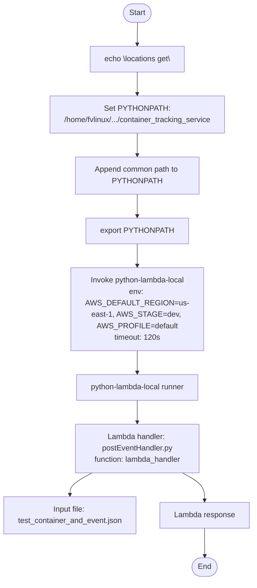
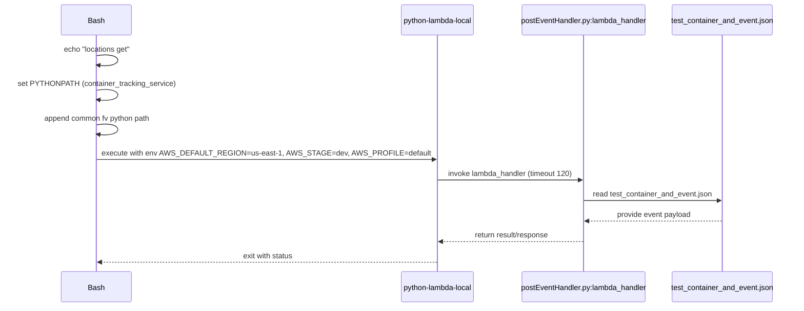

# Diagram: container_tracking_core/container_tracking_service/container_tracking_service/api/public/test_container_and_event.sh

> Auto-generated by Obscura crawlers

## Diagram 1

### SVG

<svg id="container" width="549.5234375" xmlns="http://www.w3.org/2000/svg" class="flowchart" height="1240" viewBox="0 0 549.5234375 1240" role="graphics-document document" aria-roledescription="flowchart-v2"><g><marker id="container_flowchart-v2-pointEnd" class="marker flowchart-v2" viewBox="0 0 10 10" refX="5" refY="5" markerUnits="userSpaceOnUse" markerWidth="8" markerHeight="8" orient="auto"><path d="M 0 0 L 10 5 L 0 10 z" class="arrowMarkerPath" style="stroke-width: 1; stroke-dasharray: 1, 0;"></path></marker><marker id="container_flowchart-v2-pointStart" class="marker flowchart-v2" viewBox="0 0 10 10" refX="4.5" refY="5" markerUnits="userSpaceOnUse" markerWidth="8" markerHeight="8" orient="auto"><path d="M 0 5 L 10 10 L 10 0 z" class="arrowMarkerPath" style="stroke-width: 1; stroke-dasharray: 1, 0;"></path></marker><marker id="container_flowchart-v2-circleEnd" class="marker flowchart-v2" viewBox="0 0 10 10" refX="11" refY="5" markerUnits="userSpaceOnUse" markerWidth="11" markerHeight="11" orient="auto"><circle cx="5" cy="5" r="5" class="arrowMarkerPath" style="stroke-width: 1; stroke-dasharray: 1, 0;"></circle></marker><marker id="container_flowchart-v2-circleStart" class="marker flowchart-v2" viewBox="0 0 10 10" refX="-1" refY="5" markerUnits="userSpaceOnUse" markerWidth="11" markerHeight="11" orient="auto"><circle cx="5" cy="5" r="5" class="arrowMarkerPath" style="stroke-width: 1; stroke-dasharray: 1, 0;"></circle></marker><marker id="container_flowchart-v2-crossEnd" class="marker cross flowchart-v2" viewBox="0 0 11 11" refX="12" refY="5.2" markerUnits="userSpaceOnUse" markerWidth="11" markerHeight="11" orient="auto"><path d="M 1,1 l 9,9 M 10,1 l -9,9" class="arrowMarkerPath" style="stroke-width: 2; stroke-dasharray: 1, 0;"></path></marker><marker id="container_flowchart-v2-crossStart" class="marker cross flowchart-v2" viewBox="0 0 11 11" refX="-1" refY="5.2" markerUnits="userSpaceOnUse" markerWidth="11" markerHeight="11" orient="auto"><path d="M 1,1 l 9,9 M 10,1 l -9,9" class="arrowMarkerPath" style="stroke-width: 2; stroke-dasharray: 1, 0;"></path></marker><g class="root"><g class="clusters"></g><g class="edgePaths"><path d="M292.125,47.5L292.042,51.583C291.958,55.667,291.792,63.833,291.708,71.417C291.625,79,291.625,86,291.625,89.5L291.625,93" id="L_Start_Echo_0" class="edge-thickness-normal edge-pattern-solid edge-thickness-normal edge-pattern-solid flowchart-link" style=";" data-edge="true" data-et="edge" data-id="L_Start_Echo_0" data-points="W3sieCI6MjkyLjEyNSwieSI6NDcuNX0seyJ4IjoyOTEuNjI1LCJ5Ijo3Mn0seyJ4IjoyOTEuNjI1LCJ5Ijo5N31d" marker-end="url(#container_flowchart-v2-pointEnd)"></path><path d="M291.625,151L291.625,155.167C291.625,159.333,291.625,167.667,291.625,175.333C291.625,183,291.625,190,291.625,193.5L291.625,197" id="L_Echo_SetPY_0" class="edge-thickness-normal edge-pattern-solid edge-thickness-normal edge-pattern-solid flowchart-link" style=";" data-edge="true" data-et="edge" data-id="L_Echo_SetPY_0" data-points="W3sieCI6MjkxLjYyNSwieSI6MTUxfSx7IngiOjI5MS42MjUsInkiOjE3Nn0seyJ4IjoyOTEuNjI1LCJ5IjoyMDF9XQ==" marker-end="url(#container_flowchart-v2-pointEnd)"></path><path d="M291.625,279L291.625,283.167C291.625,287.333,291.625,295.667,291.625,303.333C291.625,311,291.625,318,291.625,321.5L291.625,325" id="L_SetPY_AppendPY_0" class="edge-thickness-normal edge-pattern-solid edge-thickness-normal edge-pattern-solid flowchart-link" style=";" data-edge="true" data-et="edge" data-id="L_SetPY_AppendPY_0" data-points="W3sieCI6MjkxLjYyNSwieSI6Mjc5fSx7IngiOjI5MS42MjUsInkiOjMwNH0seyJ4IjoyOTEuNjI1LCJ5IjozMjl9XQ==" marker-end="url(#container_flowchart-v2-pointEnd)"></path><path d="M291.625,407L291.625,411.167C291.625,415.333,291.625,423.667,291.625,431.333C291.625,439,291.625,446,291.625,449.5L291.625,453" id="L_AppendPY_Export_0" class="edge-thickness-normal edge-pattern-solid edge-thickness-normal edge-pattern-solid flowchart-link" style=";" data-edge="true" data-et="edge" data-id="L_AppendPY_Export_0" data-points="W3sieCI6MjkxLjYyNSwieSI6NDA3fSx7IngiOjI5MS42MjUsInkiOjQzMn0seyJ4IjoyOTEuNjI1LCJ5Ijo0NTd9XQ==" marker-end="url(#container_flowchart-v2-pointEnd)"></path><path d="M291.625,511L291.625,515.167C291.625,519.333,291.625,527.667,291.625,535.333C291.625,543,291.625,550,291.625,553.5L291.625,557" id="L_Export_Run_0" class="edge-thickness-normal edge-pattern-solid edge-thickness-normal edge-pattern-solid flowchart-link" style=";" data-edge="true" data-et="edge" data-id="L_Export_Run_0" data-points="W3sieCI6MjkxLjYyNSwieSI6NTExfSx7IngiOjI5MS42MjUsInkiOjUzNn0seyJ4IjoyOTEuNjI1LCJ5Ijo1NjF9XQ==" marker-end="url(#container_flowchart-v2-pointEnd)"></path><path d="M291.625,735L291.625,739.167C291.625,743.333,291.625,751.667,291.625,759.333C291.625,767,291.625,774,291.625,777.5L291.625,781" id="L_Run_Runner_0" class="edge-thickness-normal edge-pattern-solid edge-thickness-normal edge-pattern-solid flowchart-link" style=";" data-edge="true" data-et="edge" data-id="L_Run_Runner_0" data-points="W3sieCI6MjkxLjYyNSwieSI6NzM1fSx7IngiOjI5MS42MjUsInkiOjc2MH0seyJ4IjoyOTEuNjI1LCJ5Ijo3ODV9XQ==" marker-end="url(#container_flowchart-v2-pointEnd)"></path><path d="M291.625,863L291.625,867.167C291.625,871.333,291.625,879.667,291.625,887.333C291.625,895,291.625,902,291.625,905.5L291.625,909" id="L_Runner_Handler_0" class="edge-thickness-normal edge-pattern-solid edge-thickness-normal edge-pattern-solid flowchart-link" style=";" data-edge="true" data-et="edge" data-id="L_Runner_Handler_0" data-points="W3sieCI6MjkxLjYyNSwieSI6ODYzfSx7IngiOjI5MS42MjUsInkiOjg4OH0seyJ4IjoyOTEuNjI1LCJ5Ijo5MTN9XQ==" marker-end="url(#container_flowchart-v2-pointEnd)"></path><path d="M195.911,1015L188.091,1019.167C180.271,1023.333,164.632,1031.667,156.812,1039.333C148.992,1047,148.992,1054,148.992,1057.5L148.992,1061" id="L_Handler_TestJSON_0" class="edge-thickness-normal edge-pattern-solid edge-thickness-normal edge-pattern-solid flowchart-link" style=";" data-edge="true" data-et="edge" data-id="L_Handler_TestJSON_0" data-points="W3sieCI6MTk1LjkxMDg3NTgyMjM2ODQ0LCJ5IjoxMDE1fSx7IngiOjE0OC45OTIxODc1LCJ5IjoxMDQwfSx7IngiOjE0OC45OTIxODc1LCJ5IjoxMDY1fV0=" marker-end="url(#container_flowchart-v2-pointEnd)"></path><path d="M387.339,1015L395.159,1019.167C402.979,1023.333,418.618,1031.667,426.438,1041.333C434.258,1051,434.258,1062,434.258,1067.5L434.258,1073" id="L_Handler_Response_0" class="edge-thickness-normal edge-pattern-solid edge-thickness-normal edge-pattern-solid flowchart-link" style=";" data-edge="true" data-et="edge" data-id="L_Handler_Response_0" data-points="W3sieCI6Mzg3LjMzOTEyNDE3NzYzMTU2LCJ5IjoxMDE1fSx7IngiOjQzNC4yNTc4MTI1LCJ5IjoxMDQwfSx7IngiOjQzNC4yNTc4MTI1LCJ5IjoxMDc3fV0=" marker-end="url(#container_flowchart-v2-pointEnd)"></path><path d="M434.258,1131L434.258,1137.167C434.258,1143.333,434.258,1155.667,434.328,1165.417C434.398,1175.167,434.539,1182.334,434.609,1185.917L434.679,1189.501" id="L_Response_End_0" class="edge-thickness-normal edge-pattern-solid edge-thickness-normal edge-pattern-solid flowchart-link" style=";" data-edge="true" data-et="edge" data-id="L_Response_End_0" data-points="W3sieCI6NDM0LjI1NzgxMjUsInkiOjExMzF9LHsieCI6NDM0LjI1NzgxMjUsInkiOjExNjh9LHsieCI6NDM0Ljc1NzgxMjUsInkiOjExOTMuNX1d" marker-end="url(#container_flowchart-v2-pointEnd)"></path></g><g class="edgeLabels"><g class="edgeLabel"><g class="label" data-id="L_Start_Echo_0" transform="translate(0, 0)"><foreignObject width="0" height="0">

</foreignObject></g></g><g class="edgeLabel"><g class="label" data-id="L_Echo_SetPY_0" transform="translate(0, 0)"><foreignObject width="0" height="0">

</foreignObject></g></g><g class="edgeLabel"><g class="label" data-id="L_SetPY_AppendPY_0" transform="translate(0, 0)"><foreignObject width="0" height="0">

</foreignObject></g></g><g class="edgeLabel"><g class="label" data-id="L_AppendPY_Export_0" transform="translate(0, 0)"><foreignObject width="0" height="0">

</foreignObject></g></g><g class="edgeLabel"><g class="label" data-id="L_Export_Run_0" transform="translate(0, 0)"><foreignObject width="0" height="0">

</foreignObject></g></g><g class="edgeLabel"><g class="label" data-id="L_Run_Runner_0" transform="translate(0, 0)"><foreignObject width="0" height="0">

</foreignObject></g></g><g class="edgeLabel"><g class="label" data-id="L_Runner_Handler_0" transform="translate(0, 0)"><foreignObject width="0" height="0">

</foreignObject></g></g><g class="edgeLabel"><g class="label" data-id="L_Handler_TestJSON_0" transform="translate(0, 0)"><foreignObject width="0" height="0">

</foreignObject></g></g><g class="edgeLabel"><g class="label" data-id="L_Handler_Response_0" transform="translate(0, 0)"><foreignObject width="0" height="0">

</foreignObject></g></g><g class="edgeLabel"><g class="label" data-id="L_Response_End_0" transform="translate(0, 0)"><foreignObject width="0" height="0">

</foreignObject></g></g></g><g class="nodes"><g class="node default" id="flowchart-Start-0" transform="translate(291.625, 27.5)"><g class="basic label-container outer-path"><path d="M-10.3984375 -19.5 C-2.382981565440213 -19.5, 5.632474369119574 -19.5, 10.3984375 -19.5 C10.3984375 -19.5, 10.398437499999998 -19.5, 10.398437499999998 -19.5 C10.698983201691808 -19.490362084323465, 10.999528903383617 -19.480724168646926, 11.6478067896239 -19.45993515863156 C12.04325869403504 -19.421786389013512, 12.438710598446184 -19.38363761939547, 12.892042152847864 -19.3399052695533 C13.18610894765275 -19.2923628306913, 13.480175742457636 -19.2448203918293, 14.126030759676757 -19.140403561325776 C14.485259288977177 -19.058411993698183, 14.8444878182776 -18.976420426070593, 15.34470188623539 -18.862249829261074 C15.74299468014912 -18.744038618709016, 16.14128747406285 -18.62582740815696, 16.543047751460602 -18.50658706670804 C16.816073264263835 -18.406111154176276, 17.089098777067065 -18.305635241644513, 17.716144095147794 -18.074876768247425 C17.973015331450792 -17.96116749175058, 18.229886567753795 -17.847458215253734, 18.85917041279238 -17.568892924097174 C19.130842058662854 -17.42716200046054, 19.402513704533327 -17.28543107682391, 19.967429764076783 -16.990714730406097 C20.20078855137502 -16.849251262177454, 20.434147338673252 -16.707787793948807, 21.036368073605697 -16.342718045390892 C21.439459743258958 -16.06153874619792, 21.842551412912215 -15.78035944700495, 22.061592844578712 -15.627565626425154 C22.434060079494802 -15.330532918348961, 22.806527314410893 -15.033500210272768, 23.03889120850187 -14.848196188198123 C23.260625948744543 -14.646822563889463, 23.482360688987217 -14.445448939580805, 23.964247236767985 -14.007812326905688 C24.166632054851462 -13.798833386131918, 24.369016872934935 -13.589854445358146, 24.833858442968648 -13.10986736009568 C25.107231932761486 -12.788747303592782, 25.38060542255432 -12.467627247089883, 25.644151408126582 -12.158051136245305 C25.925499016437932 -11.781070972402496, 26.206846624749282 -11.404090808559687, 26.391796464640635 -11.156274872382312 C26.614973399521347 -10.813415169007339, 26.838150334402055 -10.470555465632366, 27.073721378604247 -10.108655082055241 C27.273585940048328 -9.753775314729847, 27.473450501492405 -9.398895547404452, 27.6871239742735 -9.019496659696287 C27.84326358706611 -8.695269412879911, 27.999403199858723 -8.371042166063535, 28.22948364880834 -7.893275190886684 C28.40210914419332 -7.466886879798877, 28.574734639578303 -7.04049856871107, 28.698571729970325 -6.734618561215508 C28.816687774696266 -6.378871853736998, 28.934803819422207 -6.023125146258488, 29.09246063421488 -5.548287939305138 C29.179442119910508 -5.216589836333339, 29.26642360560614 -4.884891733361541, 29.40953178754556 -4.339158212148133 C29.499810566989545 -3.8755957601300612, 29.59008934643353 -3.4120333081119893, 29.648482276581777 -3.1121979531509023 C29.695678611814472 -2.746152497056686, 29.742874947047163 -2.3801070409624696, 29.808330202509367 -1.872449005199798 C29.82942655981506 -1.543856211490503, 29.850522917120752 -1.215263417781208, 29.888418715913414 -0.6250057626472757 C29.888418715913414 -0.3733941747838452, 29.888418715913414 -0.12178258692041466, 29.888418715913414 0.625005762647271 C29.85668141442633 1.1193398511972599, 29.82494411293925 1.6136739397472486, 29.808330202509367 1.8724490051997846 C29.768199240028057 2.1836968254499225, 29.72806827754675 2.49494464570006, 29.648482276581777 3.1121979531508885 C29.566615328497075 3.532567428980225, 29.484748380412377 3.952936904809561, 29.40953178754556 4.339158212148129 C29.332826193052185 4.63166988836632, 29.25612059855881 4.9241815645845115, 29.092460634214884 5.548287939305125 C28.93974867000755 6.008232044150383, 28.787036705800215 6.468176148995641, 28.69857172997033 6.734618561215495 C28.51941568794698 7.1771374487595985, 28.340259645923634 7.619656336303702, 28.229483648808344 7.893275190886679 C28.108651611602646 8.14418550153574, 27.987819574396944 8.395095812184799, 27.687123974273504 9.019496659696284 C27.503274419804665 9.345940160441833, 27.319424865335826 9.672383661187382, 27.07372137860425 10.108655082055236 C26.8697895574464 10.42194912271527, 26.665857736288547 10.735243163375303, 26.39179646464064 11.156274872382301 C26.20403552350291 11.407857428133237, 26.016274582365174 11.659439983884171, 25.644151408126582 12.158051136245302 C25.413649667360254 12.42881159687004, 25.183147926593925 12.699572057494775, 24.83385844296866 13.10986736009567 C24.61070090282756 13.340295841866135, 24.38754336268646 13.5707243236366, 23.96424723676799 14.007812326905684 C23.72561126292711 14.224535204386097, 23.48697528908623 14.441258081866511, 23.038891208501887 14.848196188198111 C22.755430350450148 15.074248679284146, 22.471969492398408 15.30030117037018, 22.061592844578715 15.627565626425152 C21.674818065062993 15.897362969404968, 21.288043285547275 16.167160312384784, 21.036368073605708 16.34271804539089 C20.627239827262052 16.590733992628863, 20.218111580918393 16.838749939866837, 19.967429764076787 16.990714730406093 C19.599828788204494 17.182491924059004, 19.232227812332205 17.374269117711915, 18.859170412792388 17.56889292409717 C18.60940853097612 17.67945510025425, 18.35964664915985 17.790017276411326, 17.716144095147804 18.07487676824742 C17.31007930020564 18.224312366407954, 16.90401450526348 18.373747964568487, 16.543047751460616 18.506587066708033 C16.22774276418133 18.600167931862874, 15.912437776902044 18.693748797017715, 15.344701886235413 18.86224982926107 C14.897988468327421 18.96420925182109, 14.451275050419431 19.066168674381107, 14.126030759676766 19.140403561325773 C13.719104244471797 19.206192284541856, 13.312177729266828 19.27198100775794, 12.892042152847878 19.3399052695533 C12.491659391731991 19.37852971298743, 12.091276630616104 19.417154156421557, 11.6478067896239 19.45993515863156 C11.304696132489205 19.470938049581488, 10.96158547535451 19.48194094053142, 10.398437500000004 19.5 C10.398437500000002 19.5, 10.398437500000002 19.5, 10.3984375 19.5 C2.7286269524715703 19.5, -4.9411835950568594 19.5, -10.398437499999996 19.5 C-10.891929642026664 19.484174667529388, -11.385421784053332 19.468349335058775, -11.647806789623893 19.45993515863156 C-12.0405342321715 19.422049214572844, -12.433261674719109 19.38416327051413, -12.892042152847871 19.3399052695533 C-13.165281858241457 19.295729992990825, -13.438521563635042 19.251554716428352, -14.126030759676759 19.140403561325773 C-14.57951229610144 19.03689935988042, -15.03299383252612 18.93339515843507, -15.344701886235388 18.862249829261074 C-15.604698272621427 18.78508426653058, -15.864694659007466 18.707918703800086, -16.54304775146059 18.506587066708043 C-16.912206225709497 18.370733335720917, -17.281364699958402 18.23487960473379, -17.716144095147797 18.074876768247425 C-18.144036185169707 17.885461632962592, -18.57192827519162 17.69604649767776, -18.85917041279238 17.568892924097174 C-19.26578480845076 17.356762454331147, -19.67239920410914 17.14463198456512, -19.96742976407678 16.990714730406097 C-20.22050074667872 16.83730161354263, -20.473571729280664 16.68388849667916, -21.036368073605686 16.3427180453909 C-21.445319614079118 16.057451153983497, -21.854271154552553 15.772184262576092, -22.061592844578712 15.627565626425156 C-22.37304196244247 15.379193242937909, -22.684491080306227 15.130820859450662, -23.03889120850187 14.848196188198125 C-23.30825462990011 14.603567455849829, -23.577618051298348 14.358938723501533, -23.964247236767974 14.007812326905697 C-24.27870947586374 13.683104247209345, -24.593171714959507 13.358396167512991, -24.833858442968655 13.109867360095677 C-25.08820968356731 12.811091919892903, -25.34256092416597 12.512316479690128, -25.64415140812658 12.158051136245307 C-25.803260664291052 11.944859228136345, -25.962369920455522 11.731667320027382, -26.391796464640635 11.156274872382316 C-26.588162828162897 10.854603406260374, -26.78452919168516 10.552931940138432, -27.073721378604244 10.108655082055249 C-27.28167351704357 9.739415002818822, -27.489625655482893 9.370174923582395, -27.6871239742735 9.019496659696289 C-27.897347277378167 8.58296347274134, -28.107570580482832 8.146430285786392, -28.22948364880834 7.893275190886686 C-28.3337569089505 7.635718222349213, -28.43803016909266 7.37816125381174, -28.698571729970325 6.73461856121551 C-28.795320734854435 6.443225973365121, -28.89206973973854 6.151833385514733, -29.09246063421488 5.5482879393051325 C-29.174464623852103 5.2355711860644805, -29.25646861348932 4.922854432823828, -29.409531787545557 4.339158212148136 C-29.483805801708126 3.957776847241809, -29.55807981587069 3.576395482335483, -29.648482276581777 3.112197953150904 C-29.700693233197082 2.707260083862147, -29.752904189812387 2.3023222145733895, -29.808330202509364 1.872449005199809 C-29.826083980288615 1.595919585696503, -29.843837758067863 1.3193901661931968, -29.888418715913414 0.6250057626472781 C-29.888418715913414 0.37217600475740353, -29.888418715913414 0.11934624686752893, -29.888418715913414 -0.6250057626472687 C-29.869923417674535 -0.9130849618538426, -29.851428119435656 -1.2011641610604165, -29.808330202509367 -1.8724490051997822 C-29.77559156458223 -2.1263634159873845, -29.742852926655086 -2.3802778267749867, -29.648482276581777 -3.112197953150895 C-29.57637609877843 -3.482447936525012, -29.50426992097508 -3.8526979198991285, -29.40953178754556 -4.339158212148126 C-29.29079352918773 -4.791958652753236, -29.1720552708299 -5.244759093358345, -29.092460634214884 -5.548287939305123 C-28.962561022869036 -5.939524871986413, -28.83266141152319 -6.330761804667704, -28.698571729970332 -6.734618561215485 C-28.572115132135504 -7.046968802739503, -28.44565853430068 -7.359319044263521, -28.229483648808344 -7.893275190886676 C-28.08950128931009 -8.183951555527484, -27.949518929811834 -8.47462792016829, -27.687123974273504 -9.019496659696282 C-27.524750647734635 -9.307806943048273, -27.36237732119577 -9.596117226400263, -27.073721378604247 -10.108655082055243 C-26.876651491690506 -10.41140734902898, -26.679581604776764 -10.71415961600272, -26.39179646464064 -11.156274872382308 C-26.16237127421433 -11.463683726488743, -25.932946083788018 -11.771092580595178, -25.644151408126586 -12.158051136245302 C-25.39930566502549 -12.44566087820931, -25.154459921924396 -12.733270620173318, -24.833858442968662 -13.10986736009567 C-24.50205581553323 -13.45248081442509, -24.170253188097792 -13.79509426875451, -23.964247236767996 -14.007812326905677 C-23.619306925465686 -14.32107799100992, -23.27436661416338 -14.634343655114163, -23.038891208501887 -14.848196188198107 C-22.780580692032007 -15.054191951151306, -22.52227017556213 -15.260187714104505, -22.06159284457872 -15.627565626425149 C-21.688485052508746 -15.887829470597161, -21.315377260438773 -16.148093314769174, -21.03636807360571 -16.342718045390885 C-20.805022996679703 -16.48296079055801, -20.573677919753692 -16.623203535725136, -19.96742976407679 -16.99071473040609 C-19.70629028214373 -17.126951030862745, -19.44515080021067 -17.263187331319404, -18.859170412792388 -17.56889292409717 C-18.4834254359094 -17.735224079284553, -18.10768045902641 -17.90155523447193, -17.716144095147804 -18.07487676824742 C-17.43238942256826 -18.179301110756132, -17.148634749988716 -18.283725453264847, -16.54304775146062 -18.506587066708033 C-16.07441319955302 -18.645675341801248, -15.605778647645424 -18.784763616894463, -15.344701886235413 -18.862249829261067 C-15.097194983685542 -18.918741664634595, -14.84968808113567 -18.975233500008123, -14.126030759676768 -19.140403561325773 C-13.854841132429188 -19.18424739715219, -13.583651505181608 -19.228091232978613, -12.89204215284788 -19.3399052695533 C-12.549025789572983 -19.372995645580893, -12.206009426298086 -19.40608602160849, -11.647806789623903 -19.45993515863156 C-11.176782978683867 -19.475039975456177, -10.705759167743834 -19.490144792280795, -10.398437500000005 -19.5 C-10.398437500000004 -19.5, -10.398437500000002 -19.5, -10.3984375 -19.5" stroke="none" stroke-width="0" fill="#ECECFF" style=""></path><path d="M-10.3984375 -19.5 C-3.17448870904267 -19.5, 4.04946008191466 -19.5, 10.3984375 -19.5 M-10.3984375 -19.5 C-5.308098026677863 -19.5, -0.21775855335572558 -19.5, 10.3984375 -19.5 M10.3984375 -19.5 C10.3984375 -19.5, 10.398437499999998 -19.5, 10.398437499999998 -19.5 M10.3984375 -19.5 C10.3984375 -19.5, 10.3984375 -19.5, 10.398437499999998 -19.5 M10.398437499999998 -19.5 C10.680563970093559 -19.490952753229962, 10.96269044018712 -19.48190550645992, 11.6478067896239 -19.45993515863156 M10.398437499999998 -19.5 C10.855317320858873 -19.485348753407678, 11.31219714171775 -19.47069750681536, 11.6478067896239 -19.45993515863156 M11.6478067896239 -19.45993515863156 C12.012341103394524 -19.424768971798763, 12.376875417165149 -19.389602784965962, 12.892042152847864 -19.3399052695533 M11.6478067896239 -19.45993515863156 C11.906181969326564 -19.43501001578726, 12.16455714902923 -19.41008487294296, 12.892042152847864 -19.3399052695533 M12.892042152847864 -19.3399052695533 C13.260887372739877 -19.28027323483856, 13.62973259263189 -19.220641200123822, 14.126030759676757 -19.140403561325776 M12.892042152847864 -19.3399052695533 C13.18665065711847 -19.292275251305902, 13.481259161389076 -19.244645233058502, 14.126030759676757 -19.140403561325776 M14.126030759676757 -19.140403561325776 C14.417625565124025 -19.073848949816373, 14.709220370571291 -19.007294338306966, 15.34470188623539 -18.862249829261074 M14.126030759676757 -19.140403561325776 C14.457410319097768 -19.064768339341647, 14.788789878518777 -18.989133117357518, 15.34470188623539 -18.862249829261074 M15.34470188623539 -18.862249829261074 C15.616762282019977 -18.78150373186637, 15.888822677804564 -18.700757634471664, 16.543047751460602 -18.50658706670804 M15.34470188623539 -18.862249829261074 C15.617208544455876 -18.781371283517874, 15.889715202676364 -18.70049273777467, 16.543047751460602 -18.50658706670804 M16.543047751460602 -18.50658706670804 C16.938228893396072 -18.361156753461355, 17.333410035331543 -18.21572644021467, 17.716144095147794 -18.074876768247425 M16.543047751460602 -18.50658706670804 C16.997788141517304 -18.339238399593086, 17.452528531574007 -18.171889732478135, 17.716144095147794 -18.074876768247425 M17.716144095147794 -18.074876768247425 C18.160524176035615 -17.878162888505127, 18.604904256923433 -17.68144900876283, 18.85917041279238 -17.568892924097174 M17.716144095147794 -18.074876768247425 C18.06766577271301 -17.91926854910938, 18.419187450278226 -17.76366032997133, 18.85917041279238 -17.568892924097174 M18.85917041279238 -17.568892924097174 C19.09300732185478 -17.446900358419008, 19.326844230917185 -17.32490779274084, 19.967429764076783 -16.990714730406097 M18.85917041279238 -17.568892924097174 C19.12018866206256 -17.43271987064309, 19.381206911332736 -17.296546817189007, 19.967429764076783 -16.990714730406097 M19.967429764076783 -16.990714730406097 C20.351421626589914 -16.757936606763973, 20.735413489103045 -16.525158483121853, 21.036368073605697 -16.342718045390892 M19.967429764076783 -16.990714730406097 C20.29299034141931 -16.79335799521474, 20.618550918761837 -16.596001260023385, 21.036368073605697 -16.342718045390892 M21.036368073605697 -16.342718045390892 C21.314524763653736 -16.148687979622423, 21.592681453701775 -15.954657913853953, 22.061592844578712 -15.627565626425154 M21.036368073605697 -16.342718045390892 C21.413020066718786 -16.079981919997195, 21.789672059831872 -15.817245794603496, 22.061592844578712 -15.627565626425154 M22.061592844578712 -15.627565626425154 C22.272628395373534 -15.459270390558142, 22.483663946168356 -15.29097515469113, 23.03889120850187 -14.848196188198123 M22.061592844578712 -15.627565626425154 C22.396380118228617 -15.360581684752864, 22.731167391878518 -15.093597743080574, 23.03889120850187 -14.848196188198123 M23.03889120850187 -14.848196188198123 C23.395303639131082 -14.52451184885683, 23.751716069760295 -14.20082750951554, 23.964247236767985 -14.007812326905688 M23.03889120850187 -14.848196188198123 C23.38824874677802 -14.530918915429657, 23.737606285054177 -14.21364164266119, 23.964247236767985 -14.007812326905688 M23.964247236767985 -14.007812326905688 C24.25869854315811 -13.703767178156035, 24.553149849548237 -13.399722029406382, 24.833858442968648 -13.10986736009568 M23.964247236767985 -14.007812326905688 C24.246929568427714 -13.715919610815964, 24.529611900087446 -13.424026894726241, 24.833858442968648 -13.10986736009568 M24.833858442968648 -13.10986736009568 C25.08051767943706 -12.820127385631727, 25.327176915905472 -12.530387411167773, 25.644151408126582 -12.158051136245305 M24.833858442968648 -13.10986736009568 C25.05955979201754 -12.844745712732271, 25.285261141066435 -12.579624065368863, 25.644151408126582 -12.158051136245305 M25.644151408126582 -12.158051136245305 C25.82956005334736 -11.90962044272452, 26.014968698568143 -11.661189749203734, 26.391796464640635 -11.156274872382312 M25.644151408126582 -12.158051136245305 C25.893351004491873 -11.824146379666077, 26.142550600857163 -11.49024162308685, 26.391796464640635 -11.156274872382312 M26.391796464640635 -11.156274872382312 C26.542103805872806 -10.925362433077202, 26.692411147104973 -10.694449993772093, 27.073721378604247 -10.108655082055241 M26.391796464640635 -11.156274872382312 C26.536843103549373 -10.933444284542361, 26.681889742458115 -10.71061369670241, 27.073721378604247 -10.108655082055241 M27.073721378604247 -10.108655082055241 C27.24099222762114 -9.811648751615595, 27.40826307663803 -9.514642421175948, 27.6871239742735 -9.019496659696287 M27.073721378604247 -10.108655082055241 C27.282778957514523 -9.737452181324656, 27.491836536424795 -9.36624928059407, 27.6871239742735 -9.019496659696287 M27.6871239742735 -9.019496659696287 C27.870819175145314 -8.638049644638311, 28.05451437601713 -8.256602629580334, 28.22948364880834 -7.893275190886684 M27.6871239742735 -9.019496659696287 C27.85828826772834 -8.664070342008127, 28.029452561183177 -8.30864402431997, 28.22948364880834 -7.893275190886684 M28.22948364880834 -7.893275190886684 C28.330567654696257 -7.643595742017232, 28.431651660584173 -7.393916293147779, 28.698571729970325 -6.734618561215508 M28.22948364880834 -7.893275190886684 C28.403381879702703 -7.46374319848404, 28.577280110597062 -7.0342112060813955, 28.698571729970325 -6.734618561215508 M28.698571729970325 -6.734618561215508 C28.821144430355325 -6.365449116963558, 28.94371713074033 -5.9962796727116086, 29.09246063421488 -5.548287939305138 M28.698571729970325 -6.734618561215508 C28.82999837644088 -6.33878244203861, 28.96142502291143 -5.942946322861712, 29.09246063421488 -5.548287939305138 M29.09246063421488 -5.548287939305138 C29.173641736624372 -5.238709211705404, 29.25482283903386 -4.929130484105671, 29.40953178754556 -4.339158212148133 M29.09246063421488 -5.548287939305138 C29.18274437706954 -5.203996898578657, 29.273028119924195 -4.859705857852177, 29.40953178754556 -4.339158212148133 M29.40953178754556 -4.339158212148133 C29.471632183609334 -4.0202858032840085, 29.53373257967311 -3.701413394419885, 29.648482276581777 -3.1121979531509023 M29.40953178754556 -4.339158212148133 C29.476299555872867 -3.996319833160245, 29.543067324200173 -3.653481454172357, 29.648482276581777 -3.1121979531509023 M29.648482276581777 -3.1121979531509023 C29.69276083045395 -2.768782233107797, 29.73703938432612 -2.425366513064691, 29.808330202509367 -1.872449005199798 M29.648482276581777 -3.1121979531509023 C29.70200451938159 -2.6970900071578687, 29.755526762181397 -2.281982061164835, 29.808330202509367 -1.872449005199798 M29.808330202509367 -1.872449005199798 C29.83944388327637 -1.3878283127426356, 29.870557564043374 -0.9032076202854735, 29.888418715913414 -0.6250057626472757 M29.808330202509367 -1.872449005199798 C29.82564897182806 -1.6026951936022118, 29.842967741146747 -1.3329413820046259, 29.888418715913414 -0.6250057626472757 M29.888418715913414 -0.6250057626472757 C29.888418715913414 -0.16261330489949172, 29.888418715913414 0.29977915284829226, 29.888418715913414 0.625005762647271 M29.888418715913414 -0.6250057626472757 C29.888418715913414 -0.2733049663548245, 29.888418715913414 0.07839582993762673, 29.888418715913414 0.625005762647271 M29.888418715913414 0.625005762647271 C29.87032388317862 0.906847388377756, 29.852229050443828 1.188689014108241, 29.808330202509367 1.8724490051997846 M29.888418715913414 0.625005762647271 C29.861393395895686 1.045946936369055, 29.83436807587796 1.466888110090839, 29.808330202509367 1.8724490051997846 M29.808330202509367 1.8724490051997846 C29.766780742733516 2.1946984103524168, 29.725231282957665 2.5169478155050484, 29.648482276581777 3.1121979531508885 M29.808330202509367 1.8724490051997846 C29.76856997528222 2.1808214760286058, 29.72880974805507 2.489193946857427, 29.648482276581777 3.1121979531508885 M29.648482276581777 3.1121979531508885 C29.592972399364367 3.3972294406455847, 29.537462522146956 3.6822609281402814, 29.40953178754556 4.339158212148129 M29.648482276581777 3.1121979531508885 C29.593979227317664 3.3920595918985694, 29.53947617805355 3.6719212306462503, 29.40953178754556 4.339158212148129 M29.40953178754556 4.339158212148129 C29.285854950469048 4.810791593801133, 29.162178113392535 5.282424975454137, 29.092460634214884 5.548287939305125 M29.40953178754556 4.339158212148129 C29.303518776015462 4.743431771442236, 29.197505764485363 5.147705330736342, 29.092460634214884 5.548287939305125 M29.092460634214884 5.548287939305125 C28.97319608827697 5.907493749445277, 28.85393154233906 6.266699559585429, 28.69857172997033 6.734618561215495 M29.092460634214884 5.548287939305125 C28.954775022768846 5.962975063757546, 28.817089411322804 6.377662188209967, 28.69857172997033 6.734618561215495 M28.69857172997033 6.734618561215495 C28.558600936972766 7.080349126070659, 28.418630143975204 7.426079690925824, 28.229483648808344 7.893275190886679 M28.69857172997033 6.734618561215495 C28.580966916606606 7.0251047239582745, 28.463362103242886 7.315590886701054, 28.229483648808344 7.893275190886679 M28.229483648808344 7.893275190886679 C28.029666564563662 8.308199641721458, 27.82984948031898 8.723124092556239, 27.687123974273504 9.019496659696284 M28.229483648808344 7.893275190886679 C28.112483015728838 8.136229508888784, 27.99548238264933 8.379183826890888, 27.687123974273504 9.019496659696284 M27.687123974273504 9.019496659696284 C27.490341184436364 9.368904429470344, 27.293558394599224 9.718312199244403, 27.07372137860425 10.108655082055236 M27.687123974273504 9.019496659696284 C27.464881897695697 9.414109971110735, 27.242639821117887 9.808723282525184, 27.07372137860425 10.108655082055236 M27.07372137860425 10.108655082055236 C26.906654299587146 10.365314979217747, 26.739587220570044 10.621974876380257, 26.39179646464064 11.156274872382301 M27.07372137860425 10.108655082055236 C26.82737647697575 10.487107003824972, 26.581031575347254 10.865558925594707, 26.39179646464064 11.156274872382301 M26.39179646464064 11.156274872382301 C26.222396577078293 11.383255289068615, 26.05299668951594 11.61023570575493, 25.644151408126582 12.158051136245302 M26.39179646464064 11.156274872382301 C26.18766042703125 11.429798565603281, 25.983524389421856 11.703322258824262, 25.644151408126582 12.158051136245302 M25.644151408126582 12.158051136245302 C25.432840705912852 12.40626871098513, 25.22153000369912 12.654486285724957, 24.83385844296866 13.10986736009567 M25.644151408126582 12.158051136245302 C25.458302682967577 12.376359623909108, 25.272453957808576 12.594668111572913, 24.83385844296866 13.10986736009567 M24.83385844296866 13.10986736009567 C24.6064101023467 13.344726445643895, 24.378961761724742 13.57958553119212, 23.96424723676799 14.007812326905684 M24.83385844296866 13.10986736009567 C24.63746897375006 13.312655610939158, 24.441079504531462 13.515443861782648, 23.96424723676799 14.007812326905684 M23.96424723676799 14.007812326905684 C23.7250515617666 14.225043510171194, 23.485855886765204 14.442274693436705, 23.038891208501887 14.848196188198111 M23.96424723676799 14.007812326905684 C23.757911567292847 14.195200922580357, 23.551575897817703 14.382589518255031, 23.038891208501887 14.848196188198111 M23.038891208501887 14.848196188198111 C22.747784172595896 15.080346302649573, 22.456677136689905 15.312496417101036, 22.061592844578715 15.627565626425152 M23.038891208501887 14.848196188198111 C22.807753537369017 15.032522330094828, 22.576615866236146 15.216848471991543, 22.061592844578715 15.627565626425152 M22.061592844578715 15.627565626425152 C21.760034626590112 15.837919585049145, 21.458476408601506 16.048273543673137, 21.036368073605708 16.34271804539089 M22.061592844578715 15.627565626425152 C21.838300981912575 15.78332436367211, 21.61500911924643 15.939083100919067, 21.036368073605708 16.34271804539089 M21.036368073605708 16.34271804539089 C20.64474842736684 16.580120176353386, 20.253128781127973 16.81752230731588, 19.967429764076787 16.990714730406093 M21.036368073605708 16.34271804539089 C20.742751866425085 16.520709915664142, 20.449135659244458 16.698701785937395, 19.967429764076787 16.990714730406093 M19.967429764076787 16.990714730406093 C19.70556450295774 17.127329669399195, 19.443699241838694 17.263944608392297, 18.859170412792388 17.56889292409717 M19.967429764076787 16.990714730406093 C19.734620851105188 17.11217099118215, 19.501811938133585 17.23362725195821, 18.859170412792388 17.56889292409717 M18.859170412792388 17.56889292409717 C18.59897813800857 17.684072325814366, 18.338785863224754 17.799251727531566, 17.716144095147804 18.07487676824742 M18.859170412792388 17.56889292409717 C18.41010024503746 17.767682966169055, 17.961030077282526 17.96647300824094, 17.716144095147804 18.07487676824742 M17.716144095147804 18.07487676824742 C17.366503101944133 18.203547885792283, 17.01686210874046 18.332219003337144, 16.543047751460616 18.506587066708033 M17.716144095147804 18.07487676824742 C17.402323747355386 18.190365557158525, 17.088503399562967 18.30585434606963, 16.543047751460616 18.506587066708033 M16.543047751460616 18.506587066708033 C16.194393288382418 18.61006588122502, 15.84573882530422 18.71354469574201, 15.344701886235413 18.86224982926107 M16.543047751460616 18.506587066708033 C16.260714619729725 18.59038205820891, 15.978381487998837 18.67417704970979, 15.344701886235413 18.86224982926107 M15.344701886235413 18.86224982926107 C14.929706099101894 18.9569699095737, 14.514710311968374 19.051689989886327, 14.126030759676766 19.140403561325773 M15.344701886235413 18.86224982926107 C14.990759788655025 18.943034803345757, 14.636817691074636 19.02381977743044, 14.126030759676766 19.140403561325773 M14.126030759676766 19.140403561325773 C13.669104385772975 19.214275873941585, 13.212178011869185 19.2881481865574, 12.892042152847878 19.3399052695533 M14.126030759676766 19.140403561325773 C13.653041874545538 19.216872736190204, 13.180052989414309 19.293341911054632, 12.892042152847878 19.3399052695533 M12.892042152847878 19.3399052695533 C12.606043251373391 19.36749523961454, 12.320044349898904 19.39508520967578, 11.6478067896239 19.45993515863156 M12.892042152847878 19.3399052695533 C12.57271364701349 19.370710506462427, 12.2533851411791 19.401515743371554, 11.6478067896239 19.45993515863156 M11.6478067896239 19.45993515863156 C11.25706449160934 19.472465503595142, 10.866322193594781 19.484995848558725, 10.398437500000004 19.5 M11.6478067896239 19.45993515863156 C11.378369071655312 19.46857550181811, 11.108931353686723 19.477215845004658, 10.398437500000004 19.5 M10.398437500000004 19.5 C10.398437500000002 19.5, 10.398437500000002 19.5, 10.3984375 19.5 M10.398437500000004 19.5 C10.398437500000004 19.5, 10.398437500000002 19.5, 10.3984375 19.5 M10.3984375 19.5 C3.8347821421027737 19.5, -2.7288732157944526 19.5, -10.398437499999996 19.5 M10.3984375 19.5 C5.251750512886994 19.5, 0.10506352577398737 19.5, -10.398437499999996 19.5 M-10.398437499999996 19.5 C-10.71259111619429 19.489925704991567, -11.02674473238858 19.479851409983137, -11.647806789623893 19.45993515863156 M-10.398437499999996 19.5 C-10.78228713832161 19.487690689217022, -11.166136776643222 19.475381378434044, -11.647806789623893 19.45993515863156 M-11.647806789623893 19.45993515863156 C-12.05944491437343 19.42022492380425, -12.471083039122965 19.380514688976934, -12.892042152847871 19.3399052695533 M-11.647806789623893 19.45993515863156 C-12.141117384667963 19.41234607882045, -12.634427979712035 19.36475699900934, -12.892042152847871 19.3399052695533 M-12.892042152847871 19.3399052695533 C-13.200487538648007 19.290038211606824, -13.508932924448143 19.24017115366035, -14.126030759676759 19.140403561325773 M-12.892042152847871 19.3399052695533 C-13.179569443520297 19.293420087004822, -13.467096734192724 19.246934904456346, -14.126030759676759 19.140403561325773 M-14.126030759676759 19.140403561325773 C-14.395343277842336 19.0789347364829, -14.664655796007915 19.01746591164003, -15.344701886235388 18.862249829261074 M-14.126030759676759 19.140403561325773 C-14.4226954579184 19.072691779870194, -14.719360156160041 19.00497999841462, -15.344701886235388 18.862249829261074 M-15.344701886235388 18.862249829261074 C-15.613570789516722 18.782450950088847, -15.882439692798055 18.70265207091662, -16.54304775146059 18.506587066708043 M-15.344701886235388 18.862249829261074 C-15.767422004113213 18.736788717178115, -16.190142121991038 18.611327605095155, -16.54304775146059 18.506587066708043 M-16.54304775146059 18.506587066708043 C-16.999880550982294 18.33846837356795, -17.456713350503996 18.170349680427858, -17.716144095147797 18.074876768247425 M-16.54304775146059 18.506587066708043 C-16.83476643697446 18.39923189382097, -17.126485122488326 18.2918767209339, -17.716144095147797 18.074876768247425 M-17.716144095147797 18.074876768247425 C-18.166742013161013 17.8754104364553, -18.617339931174225 17.675944104663174, -18.85917041279238 17.568892924097174 M-17.716144095147797 18.074876768247425 C-17.96171587362074 17.966169426545438, -18.20728765209368 17.85746208484345, -18.85917041279238 17.568892924097174 M-18.85917041279238 17.568892924097174 C-19.27004747862327 17.35453862203252, -19.680924544454154 17.14018431996787, -19.96742976407678 16.990714730406097 M-18.85917041279238 17.568892924097174 C-19.093212887920117 17.446793114734394, -19.327255363047854 17.324693305371614, -19.96742976407678 16.990714730406097 M-19.96742976407678 16.990714730406097 C-20.303382716285633 16.7870580764984, -20.639335668494482 16.583401422590708, -21.036368073605686 16.3427180453909 M-19.96742976407678 16.990714730406097 C-20.29267962045775 16.793546356087635, -20.617929476838725 16.596377981769173, -21.036368073605686 16.3427180453909 M-21.036368073605686 16.3427180453909 C-21.355582618953445 16.120047797131257, -21.674797164301207 15.89737754887161, -22.061592844578712 15.627565626425156 M-21.036368073605686 16.3427180453909 C-21.366746363188746 16.11226045242341, -21.697124652771805 15.88180285945592, -22.061592844578712 15.627565626425156 M-22.061592844578712 15.627565626425156 C-22.420328685659193 15.341483339525126, -22.77906452673967 15.055401052625097, -23.03889120850187 14.848196188198125 M-22.061592844578712 15.627565626425156 C-22.446262400917757 15.320801891731566, -22.830931957256805 15.014038157037975, -23.03889120850187 14.848196188198125 M-23.03889120850187 14.848196188198125 C-23.317606916770625 14.595073956361976, -23.59632262503938 14.341951724525826, -23.964247236767974 14.007812326905697 M-23.03889120850187 14.848196188198125 C-23.34354302389758 14.571519470101064, -23.648194839293296 14.294842752004003, -23.964247236767974 14.007812326905697 M-23.964247236767974 14.007812326905697 C-24.220704513379626 13.742999133270176, -24.477161789991282 13.478185939634656, -24.833858442968655 13.109867360095677 M-23.964247236767974 14.007812326905697 C-24.187906698585525 13.776865569795762, -24.411566160403076 13.545918812685825, -24.833858442968655 13.109867360095677 M-24.833858442968655 13.109867360095677 C-25.114988697694322 12.779635766130246, -25.396118952419986 12.449404172164817, -25.64415140812658 12.158051136245307 M-24.833858442968655 13.109867360095677 C-25.117420243418188 12.776779534164122, -25.40098204386772 12.443691708232567, -25.64415140812658 12.158051136245307 M-25.64415140812658 12.158051136245307 C-25.85820477812329 11.871239121112886, -26.072258148120003 11.584427105980467, -26.391796464640635 11.156274872382316 M-25.64415140812658 12.158051136245307 C-25.799430249836444 11.949991634547581, -25.95470909154631 11.741932132849856, -26.391796464640635 11.156274872382316 M-26.391796464640635 11.156274872382316 C-26.581485163892154 10.864862091784163, -26.771173863143677 10.573449311186009, -27.073721378604244 10.108655082055249 M-26.391796464640635 11.156274872382316 C-26.58495929282378 10.859524896810946, -26.778122121006923 10.562774921239575, -27.073721378604244 10.108655082055249 M-27.073721378604244 10.108655082055249 C-27.211656224445527 9.863737795846337, -27.349591070286806 9.618820509637425, -27.6871239742735 9.019496659696289 M-27.073721378604244 10.108655082055249 C-27.289256394412092 9.725950836201413, -27.504791410219937 9.34324659034758, -27.6871239742735 9.019496659696289 M-27.6871239742735 9.019496659696289 C-27.858086526299985 8.664489262400686, -28.029049078326466 8.309481865105083, -28.22948364880834 7.893275190886686 M-27.6871239742735 9.019496659696289 C-27.80053917115948 8.78398757666609, -27.913954368045456 8.548478493635894, -28.22948364880834 7.893275190886686 M-28.22948364880834 7.893275190886686 C-28.37391730189411 7.536521275330118, -28.518350954979883 7.1797673597735505, -28.698571729970325 6.73461856121551 M-28.22948364880834 7.893275190886686 C-28.353785916382975 7.586246186756488, -28.47808818395761 7.279217182626288, -28.698571729970325 6.73461856121551 M-28.698571729970325 6.73461856121551 C-28.820913661403424 6.366144156278649, -28.943255592836522 5.997669751341787, -29.09246063421488 5.5482879393051325 M-28.698571729970325 6.73461856121551 C-28.803970297225572 6.417174869623863, -28.90936886448082 6.099731178032216, -29.09246063421488 5.5482879393051325 M-29.09246063421488 5.5482879393051325 C-29.177163588197164 5.225278865278211, -29.261866542179447 4.902269791251291, -29.409531787545557 4.339158212148136 M-29.09246063421488 5.5482879393051325 C-29.19812345979482 5.145349790810526, -29.303786285374763 4.742411642315919, -29.409531787545557 4.339158212148136 M-29.409531787545557 4.339158212148136 C-29.489194447892725 3.9301072879746695, -29.56885710823989 3.521056363801203, -29.648482276581777 3.112197953150904 M-29.409531787545557 4.339158212148136 C-29.489810698645226 3.9269429706052206, -29.57008960974489 3.5147277290623054, -29.648482276581777 3.112197953150904 M-29.648482276581777 3.112197953150904 C-29.684354680002098 2.833978676030182, -29.72022708342242 2.5557593989094607, -29.808330202509364 1.872449005199809 M-29.648482276581777 3.112197953150904 C-29.699231707549362 2.718595388174967, -29.74998113851695 2.32499282319903, -29.808330202509364 1.872449005199809 M-29.808330202509364 1.872449005199809 C-29.825411475696814 1.6063943875497377, -29.84249274888426 1.3403397698996664, -29.888418715913414 0.6250057626472781 M-29.808330202509364 1.872449005199809 C-29.825493397782946 1.6051183849318924, -29.842656593056528 1.3377877646639758, -29.888418715913414 0.6250057626472781 M-29.888418715913414 0.6250057626472781 C-29.888418715913414 0.273337041368281, -29.888418715913414 -0.0783316799107161, -29.888418715913414 -0.6250057626472687 M-29.888418715913414 0.6250057626472781 C-29.888418715913414 0.29484747032210606, -29.888418715913414 -0.03531082200306601, -29.888418715913414 -0.6250057626472687 M-29.888418715913414 -0.6250057626472687 C-29.870252122123063 -0.9079651247425718, -29.85208552833271 -1.190924486837875, -29.808330202509367 -1.8724490051997822 M-29.888418715913414 -0.6250057626472687 C-29.858968627996898 -1.0837146536301367, -29.82951854008038 -1.5424235446130048, -29.808330202509367 -1.8724490051997822 M-29.808330202509367 -1.8724490051997822 C-29.773262054548013 -2.144430635798961, -29.73819390658666 -2.4164122663981393, -29.648482276581777 -3.112197953150895 M-29.808330202509367 -1.8724490051997822 C-29.775308269052527 -2.1285606001727153, -29.742286335595686 -2.3846721951456487, -29.648482276581777 -3.112197953150895 M-29.648482276581777 -3.112197953150895 C-29.563198549366156 -3.5501118676809815, -29.477914822150534 -3.988025782211068, -29.40953178754556 -4.339158212148126 M-29.648482276581777 -3.112197953150895 C-29.57568765104988 -3.4859829701076417, -29.50289302551798 -3.8597679870643886, -29.40953178754556 -4.339158212148126 M-29.40953178754556 -4.339158212148126 C-29.345759081464042 -4.582351179702609, -29.281986375382523 -4.825544147257093, -29.092460634214884 -5.548287939305123 M-29.40953178754556 -4.339158212148126 C-29.290660433184506 -4.792466205497709, -29.171789078823448 -5.2457741988472915, -29.092460634214884 -5.548287939305123 M-29.092460634214884 -5.548287939305123 C-28.940507133577043 -6.005947672723831, -28.788553632939198 -6.46360740614254, -28.698571729970332 -6.734618561215485 M-29.092460634214884 -5.548287939305123 C-28.970440481015416 -5.915793199470686, -28.848420327815948 -6.2832984596362484, -28.698571729970332 -6.734618561215485 M-28.698571729970332 -6.734618561215485 C-28.525036596225302 -7.163253696639277, -28.35150146248027 -7.591888832063068, -28.229483648808344 -7.893275190886676 M-28.698571729970332 -6.734618561215485 C-28.589252784053084 -7.004638471169124, -28.479933838135835 -7.274658381122763, -28.229483648808344 -7.893275190886676 M-28.229483648808344 -7.893275190886676 C-28.115101118036765 -8.130792963427954, -28.000718587265187 -8.368310735969231, -27.687123974273504 -9.019496659696282 M-28.229483648808344 -7.893275190886676 C-28.07332964651391 -8.217532317811477, -27.917175644219476 -8.541789444736276, -27.687123974273504 -9.019496659696282 M-27.687123974273504 -9.019496659696282 C-27.44661560804029 -9.446543618056303, -27.20610724180708 -9.873590576416325, -27.073721378604247 -10.108655082055243 M-27.687123974273504 -9.019496659696282 C-27.533100079488626 -9.29298168149742, -27.379076184703745 -9.566466703298559, -27.073721378604247 -10.108655082055243 M-27.073721378604247 -10.108655082055243 C-26.861638607892136 -10.434471170067043, -26.649555837180024 -10.760287258078842, -26.39179646464064 -11.156274872382308 M-27.073721378604247 -10.108655082055243 C-26.90649625558031 -10.365557777253006, -26.73927113255638 -10.622460472450769, -26.39179646464064 -11.156274872382308 M-26.39179646464064 -11.156274872382308 C-26.227908312716515 -11.375870065442847, -26.064020160792392 -11.595465258503385, -25.644151408126586 -12.158051136245302 M-26.39179646464064 -11.156274872382308 C-26.23237717604722 -11.36988219570153, -26.072957887453796 -11.583489519020754, -25.644151408126586 -12.158051136245302 M-25.644151408126586 -12.158051136245302 C-25.32258100047097 -12.53578603495214, -25.001010592815355 -12.913520933658978, -24.833858442968662 -13.10986736009567 M-25.644151408126586 -12.158051136245302 C-25.32338547934039 -12.534841048295972, -25.0026195505542 -12.911630960346642, -24.833858442968662 -13.10986736009567 M-24.833858442968662 -13.10986736009567 C-24.619542154807323 -13.331166523316744, -24.40522586664599 -13.552465686537817, -23.964247236767996 -14.007812326905677 M-24.833858442968662 -13.10986736009567 C-24.588072547716045 -13.363661476341283, -24.34228665246343 -13.617455592586895, -23.964247236767996 -14.007812326905677 M-23.964247236767996 -14.007812326905677 C-23.677129606915067 -14.268564961621907, -23.39001197706214 -14.529317596338139, -23.038891208501887 -14.848196188198107 M-23.964247236767996 -14.007812326905677 C-23.62629225422191 -14.31473410025519, -23.28833727167582 -14.621655873604702, -23.038891208501887 -14.848196188198107 M-23.038891208501887 -14.848196188198107 C-22.673038332777168 -15.139954120834673, -22.307185457052448 -15.43171205347124, -22.06159284457872 -15.627565626425149 M-23.038891208501887 -14.848196188198107 C-22.82494099851572 -15.01881578720788, -22.610990788529552 -15.18943538621765, -22.06159284457872 -15.627565626425149 M-22.06159284457872 -15.627565626425149 C-21.798579401518655 -15.811032418635405, -21.53556595845859 -15.99449921084566, -21.03636807360571 -16.342718045390885 M-22.06159284457872 -15.627565626425149 C-21.844545931341443 -15.778968157290032, -21.62749901810417 -15.930370688154914, -21.03636807360571 -16.342718045390885 M-21.03636807360571 -16.342718045390885 C-20.677889334144698 -16.56002996390706, -20.319410594683685 -16.777341882423233, -19.96742976407679 -16.99071473040609 M-21.03636807360571 -16.342718045390885 C-20.696939498216796 -16.548481642495364, -20.357510922827878 -16.754245239599843, -19.96742976407679 -16.99071473040609 M-19.96742976407679 -16.99071473040609 C-19.53079946965617 -17.218504475330278, -19.09416917523555 -17.446294220254465, -18.859170412792388 -17.56889292409717 M-19.96742976407679 -16.99071473040609 C-19.58212501672272 -17.19172797030124, -19.19682026936865 -17.392741210196387, -18.859170412792388 -17.56889292409717 M-18.859170412792388 -17.56889292409717 C-18.502936211514513 -17.72658723769076, -18.146702010236638 -17.884281551284353, -17.716144095147804 -18.07487676824742 M-18.859170412792388 -17.56889292409717 C-18.518104570860878 -17.71987265496152, -18.177038728929368 -17.870852385825867, -17.716144095147804 -18.07487676824742 M-17.716144095147804 -18.07487676824742 C-17.408235526796414 -18.188189967676337, -17.10032695844502 -18.301503167105253, -16.54304775146062 -18.506587066708033 M-17.716144095147804 -18.07487676824742 C-17.306300883064925 -18.225702858843043, -16.896457670982045 -18.376528949438665, -16.54304775146062 -18.506587066708033 M-16.54304775146062 -18.506587066708033 C-16.149823230897614 -18.623294040333505, -15.75659871033461 -18.740001013958974, -15.344701886235413 -18.862249829261067 M-16.54304775146062 -18.506587066708033 C-16.193947813395326 -18.61019809586284, -15.844847875330032 -18.713809125017654, -15.344701886235413 -18.862249829261067 M-15.344701886235413 -18.862249829261067 C-15.038388033724118 -18.932163967212077, -14.732074181212822 -19.00207810516309, -14.126030759676768 -19.140403561325773 M-15.344701886235413 -18.862249829261067 C-15.097930944174884 -18.918573686455492, -14.851160002114355 -18.97489754364992, -14.126030759676768 -19.140403561325773 M-14.126030759676768 -19.140403561325773 C-13.77177970413305 -19.197676124728115, -13.417528648589332 -19.254948688130458, -12.89204215284788 -19.3399052695533 M-14.126030759676768 -19.140403561325773 C-13.833413789943668 -19.18771160371373, -13.540796820210568 -19.235019646101684, -12.89204215284788 -19.3399052695533 M-12.89204215284788 -19.3399052695533 C-12.415490214619712 -19.38587766189661, -11.938938276391546 -19.431850054239924, -11.647806789623903 -19.45993515863156 M-12.89204215284788 -19.3399052695533 C-12.468782759043323 -19.380736594229727, -12.045523365238765 -19.421567918906156, -11.647806789623903 -19.45993515863156 M-11.647806789623903 -19.45993515863156 C-11.312202175128547 -19.47069734540367, -10.97659756063319 -19.481459532175784, -10.398437500000005 -19.5 M-11.647806789623903 -19.45993515863156 C-11.339973641706544 -19.469806768524396, -11.032140493789186 -19.47967837841723, -10.398437500000005 -19.5 M-10.398437500000005 -19.5 C-10.398437500000004 -19.5, -10.398437500000002 -19.5, -10.3984375 -19.5 M-10.398437500000005 -19.5 C-10.398437500000004 -19.5, -10.398437500000002 -19.5, -10.3984375 -19.5" stroke="#9370DB" stroke-width="1.3" fill="none" stroke-dasharray="0 0" style=""></path></g><g class="label" style="" transform="translate(-17.5234375, -12)"><rect></rect><foreignObject width="35.046875" height="24">

Start

</foreignObject></g></g><g class="node default" id="flowchart-Echo-1" transform="translate(291.625, 124)"><rect class="basic label-container" style="" x="-104.3828125" y="-27" width="208.765625" height="54"></rect><g class="label" style="" transform="translate(-74.3828125, -12)"><rect></rect><foreignObject width="148.765625" height="24">

echo \locations get\

</foreignObject></g></g><g class="node default" id="flowchart-SetPY-3" transform="translate(291.625, 240)"><rect class="basic label-container" style="" x="-249.8984375" y="-39" width="499.796875" height="78"></rect><g class="label" style="" transform="translate(-219.8984375, -24)"><rect></rect><foreignObject width="439.796875" height="48">

Set PYTHONPATH:\n/home/fvlinux/.../container_tracking_service

</foreignObject></g></g><g class="node default" id="flowchart-AppendPY-5" transform="translate(291.625, 368)"><rect class="basic label-container" style="" x="-130" y="-39" width="260" height="78"></rect><g class="label" style="" transform="translate(-100, -24)"><rect></rect><foreignObject width="200" height="48">

Append common path to PYTHONPATH

</foreignObject></g></g><g class="node default" id="flowchart-Export-7" transform="translate(291.625, 484)"><rect class="basic label-container" style="" x="-102.9453125" y="-27" width="205.890625" height="54"></rect><g class="label" style="" transform="translate(-72.9453125, -12)"><rect></rect><foreignObject width="145.890625" height="24">

export PYTHONPATH

</foreignObject></g></g><g class="node default" id="flowchart-Run-9" transform="translate(291.625, 648)"><rect class="basic label-container" style="" x="-149.9609375" y="-87" width="299.921875" height="174"></rect><g class="label" style="" transform="translate(-119.9609375, -72)"><rect></rect><foreignObject width="239.921875" height="144">

Invoke python-lambda-local\nenv: AWS_DEFAULT_REGION=us-east-1, AWS_STAGE=dev, AWS_PROFILE=default\ntimeout: 120s

</foreignObject></g></g><g class="node default" id="flowchart-Runner-11" transform="translate(291.625, 824)"><rect class="basic label-container" style="" x="-130" y="-39" width="260" height="78"></rect><g class="label" style="" transform="translate(-100, -24)"><rect></rect><foreignObject width="200" height="48">

python-lambda-local runner

</foreignObject></g></g><g class="node default" id="flowchart-Handler-13" transform="translate(291.625, 964)"><rect class="basic label-container" style="" x="-148.0390625" y="-51" width="296.078125" height="102"></rect><g class="label" style="" transform="translate(-118.0390625, -36)"><rect></rect><foreignObject width="236.078125" height="72">

Lambda handler: postEventHandler.py\nfunction: lambda_handler

</foreignObject></g></g><g class="node default" id="flowchart-TestJSON-15" transform="translate(148.9921875, 1104)"><rect class="basic label-container" style="" x="-140.9921875" y="-39" width="281.984375" height="78"></rect><g class="label" style="" transform="translate(-110.9921875, -24)"><rect></rect><foreignObject width="221.984375" height="48">

Input file: test_container_and_event.json

</foreignObject></g></g><g class="node default" id="flowchart-Response-17" transform="translate(434.2578125, 1104)"><rect class="basic label-container" style="" x="-94.2734375" y="-27" width="188.546875" height="54"></rect><g class="label" style="" transform="translate(-64.2734375, -12)"><rect></rect><foreignObject width="128.546875" height="24">

Lambda response

</foreignObject></g></g><g class="node default" id="flowchart-End-19" transform="translate(434.2578125, 1212.5)"><g class="basic label-container outer-path"><path d="M-6.5546875 -19.5 C-3.671240505456113 -19.5, -0.787793510912226 -19.5, 6.5546875 -19.5 C6.5546875 -19.5, 6.554687499999999 -19.5, 6.554687499999999 -19.5 C6.818804266365095 -19.49153028937477, 7.082921032730193 -19.48306057874954, 7.8040567896239 -19.45993515863156 C8.069751995878843 -19.43430386162938, 8.335447202133787 -19.408672564627203, 9.048292152847864 -19.3399052695533 C9.491223442165964 -19.2682955736798, 9.934154731484062 -19.1966858778063, 10.282280759676757 -19.140403561325776 C10.638633535301407 -19.059068365708633, 10.994986310926055 -18.97773317009149, 11.50095188623539 -18.862249829261074 C11.946758408400637 -18.729936793568616, 12.392564930565884 -18.59762375787616, 12.699297751460602 -18.50658706670804 C13.147583962485347 -18.341613597138625, 13.595870173510095 -18.176640127569208, 13.872394095147794 -18.074876768247425 C14.270979219038145 -17.898434957508773, 14.669564342928494 -17.721993146770124, 15.015420412792382 -17.568892924097174 C15.322993024275917 -17.408432489695876, 15.63056563575945 -17.247972055294575, 16.123679764076783 -16.990714730406097 C16.483917691512733 -16.77233638180138, 16.844155618948683 -16.55395803319666, 17.192618073605697 -16.342718045390892 C17.453070613147148 -16.161037628615496, 17.7135231526886 -15.979357211840098, 18.217842844578712 -15.627565626425154 C18.45957720953138 -15.434788903197013, 18.70131157448405 -15.242012179968874, 19.19514120850187 -14.848196188198123 C19.470106972518856 -14.598479556513343, 19.745072736535842 -14.348762924828565, 20.120497236767985 -14.007812326905688 C20.376276938214986 -13.743698785257624, 20.632056639661986 -13.479585243609563, 20.990108442968648 -13.10986736009568 C21.27281692862988 -12.777781886269452, 21.555525414291115 -12.445696412443223, 21.800401408126582 -12.158051136245305 C22.096721648229376 -11.76100900983678, 22.393041888332167 -11.363966883428256, 22.548046464640635 -11.156274872382312 C22.74367710921272 -10.855733668136043, 22.939307753784806 -10.555192463889775, 23.229971378604247 -10.108655082055241 C23.375553590368987 -9.850159123269458, 23.521135802133728 -9.591663164483675, 23.8433739742735 -9.019496659696287 C24.053176306826355 -8.583837627099497, 24.262978639379213 -8.148178594502706, 24.38573364880834 -7.893275190886684 C24.486059132958786 -7.645469305373805, 24.58638461710923 -7.397663419860926, 24.854821729970325 -6.734618561215508 C24.953924254899928 -6.4361375459705945, 25.053026779829526 -6.13765653072568, 25.24871063421488 -5.548287939305138 C25.341615340841013 -5.194002027785141, 25.434520047467146 -4.839716116265143, 25.56578178754556 -4.339158212148133 C25.640748485168412 -3.9542200640719374, 25.715715182791268 -3.569281915995741, 25.804732276581777 -3.1121979531509023 C25.86855943009901 -2.6171671545683486, 25.93238658361624 -2.1221363559857944, 25.964580202509367 -1.872449005199798 C25.982877310485886 -1.5874567793057517, 26.00117441846241 -1.3024645534117054, 26.044668715913414 -0.6250057626472757 C26.044668715913414 -0.33474996200550877, 26.044668715913414 -0.044494161363741846, 26.044668715913414 0.625005762647271 C26.016256830940396 1.0675438047628052, 25.987844945967378 1.5100818468783392, 25.964580202509367 1.8724490051997846 C25.930840860321613 2.134124680621313, 25.897101518133855 2.3958003560428414, 25.804732276581777 3.1121979531508885 C25.713146339886016 3.5824723813890427, 25.62156040319026 4.052746809627197, 25.56578178754556 4.339158212148129 C25.44738528936527 4.790655373076492, 25.328988791184972 5.242152534004855, 25.248710634214884 5.548287939305125 C25.166855298033873 5.794823170005634, 25.084999961852862 6.041358400706143, 24.85482172997033 6.734618561215495 C24.671511498993414 7.187398375790687, 24.488201268016503 7.64017819036588, 24.385733648808344 7.893275190886679 C24.27502007049395 8.123174305147606, 24.164306492179556 8.353073419408531, 23.843373974273504 9.019496659696284 C23.719424928732266 9.23958074125662, 23.595475883191025 9.459664822816958, 23.22997137860425 10.108655082055236 C23.082311250625015 10.335500690927548, 22.934651122645782 10.562346299799858, 22.54804646464064 11.156274872382301 C22.296909501215932 11.49277552432338, 22.045772537791223 11.829276176264457, 21.800401408126582 12.158051136245302 C21.550652434350315 12.451420491962097, 21.300903460574048 12.744789847678891, 20.99010844296866 13.10986736009567 C20.7422777823818 13.36577286442724, 20.494447121794945 13.621678368758813, 20.12049723676799 14.007812326905684 C19.913328624115916 14.195957379535177, 19.706160011463844 14.38410243216467, 19.195141208501887 14.848196188198111 C18.879205204826267 15.100146743719272, 18.563269201150646 15.352097299240432, 18.217842844578715 15.627565626425152 C17.944316300524367 15.818365902784214, 17.67078975647002 16.009166179143275, 17.192618073605708 16.34271804539089 C16.900748790831454 16.519650919822933, 16.608879508057196 16.69658379425498, 16.123679764076787 16.990714730406093 C15.725471275910518 17.198459843617727, 15.327262787744248 17.40620495682936, 15.015420412792386 17.56889292409717 C14.786790541878808 17.67010058588646, 14.55816067096523 17.771308247675744, 13.872394095147804 18.07487676824742 C13.492648825891576 18.2146265376605, 13.112903556635347 18.35437630707358, 12.699297751460616 18.506587066708033 C12.263952535862332 18.635795241523937, 11.828607320264048 18.76500341633984, 11.500951886235413 18.86224982926107 C11.032453430899977 18.96918154445325, 10.56395497556454 19.076113259645425, 10.282280759676766 19.140403561325773 C9.835851489301675 19.21257878364932, 9.389422218926581 19.284754005972868, 9.048292152847878 19.3399052695533 C8.738875372331878 19.369754334241556, 8.429458591815877 19.39960339892981, 7.804056789623901 19.45993515863156 C7.55050274011232 19.46806614348638, 7.296948690600739 19.476197128341195, 6.5546875000000036 19.5 C6.554687500000003 19.5, 6.554687500000002 19.5, 6.5546875 19.5 C1.6996366110971062 19.5, -3.1554142778057876 19.5, -6.5546874999999964 19.5 C-6.817335613415087 19.491577386216317, -7.079983726830177 19.483154772432634, -7.8040567896238935 19.45993515863156 C-8.278555369109087 19.414160851336657, -8.75305394859428 19.36838654404175, -9.048292152847871 19.3399052695533 C-9.328239819752289 19.294645501794772, -9.608187486656709 19.24938573403625, -10.282280759676759 19.140403561325773 C-10.589610221962516 19.070257617071213, -10.896939684248276 19.000111672816658, -11.500951886235388 18.862249829261074 C-11.74833223313037 18.788828640828584, -11.995712580025351 18.715407452396093, -12.699297751460593 18.506587066708043 C-12.988061972371701 18.400319164105557, -13.27682619328281 18.294051261503075, -13.872394095147797 18.074876768247425 C-14.201487718639594 17.929196783343095, -14.530581342131391 17.783516798438765, -15.01542041279238 17.568892924097174 C-15.425694518310605 17.35485318604142, -15.835968623828832 17.14081344798567, -16.12367976407678 16.990714730406097 C-16.54203495716982 16.73710535382509, -16.96039015026286 16.48349597724408, -17.192618073605686 16.3427180453909 C-17.48178496782667 16.14100773781544, -17.770951862047657 15.939297430239982, -18.217842844578712 15.627565626425156 C-18.602032415752106 15.32118466712823, -18.9862219869255 15.014803707831307, -19.19514120850187 14.848196188198125 C-19.50893508845366 14.563216888957005, -19.822728968405457 14.278237589715884, -20.120497236767974 14.007812326905697 C-20.3631334939763 13.75727047053091, -20.60576975118462 13.506728614156124, -20.990108442968655 13.109867360095677 C-21.197349222388304 12.866430548254945, -21.404590001807954 12.622993736414212, -21.80040140812658 12.158051136245307 C-21.993116943066617 11.899829876172067, -22.185832478006652 11.641608616098827, -22.548046464640635 11.156274872382316 C-22.747495398492003 10.849867750448833, -22.94694433234337 10.543460628515353, -23.229971378604244 10.108655082055249 C-23.39109120974489 9.822570506712973, -23.55221104088554 9.536485931370697, -23.8433739742735 9.019496659696289 C-24.019229759412056 8.65432835914505, -24.195085544550615 8.28916005859381, -24.38573364880834 7.893275190886686 C-24.558576060949314 7.466351091217779, -24.731418473090287 7.03942699154887, -24.854821729970325 6.73461856121551 C-24.93815165659683 6.483642099037254, -25.021481583223338 6.2326656368589965, -25.24871063421488 5.5482879393051325 C-25.364557571917523 5.106513357464561, -25.48040450962016 4.664738775623989, -25.565781787545557 4.339158212148136 C-25.63140497300756 4.002197024265916, -25.697028158469564 3.6652358363836965, -25.804732276581777 3.112197953150904 C-25.865054744131882 2.6443488068508465, -25.925377211681987 2.1764996605507885, -25.964580202509364 1.872449005199809 C-25.994951140671127 1.3993971283503237, -26.02532207883289 0.9263452515008385, -26.044668715913414 0.6250057626472781 C-26.044668715913414 0.22894496141891452, -26.044668715913414 -0.1671158398094491, -26.044668715913414 -0.6250057626472687 C-26.01343531396082 -1.1114912092072453, -25.98220191200822 -1.597976655767222, -25.964580202509367 -1.8724490051997822 C-25.92722942703213 -2.1621342440563636, -25.88987865155489 -2.4518194829129447, -25.804732276581777 -3.112197953150895 C-25.737250050284587 -3.458704922813384, -25.6697678239874 -3.8052118924758727, -25.56578178754556 -4.339158212148126 C-25.45349548844307 -4.767354535815797, -25.341209189340578 -5.195550859483468, -25.248710634214884 -5.548287939305123 C-25.12103682999984 -5.932821095542639, -24.9933630257848 -6.317354251780156, -24.854821729970332 -6.734618561215485 C-24.685939575279807 -7.151760748415421, -24.517057420589282 -7.568902935615355, -24.385733648808344 -7.893275190886676 C-24.17162040593702 -8.337885920998474, -23.957507163065692 -8.78249665111027, -23.843373974273504 -9.019496659696282 C-23.71806274387033 -9.241999438415156, -23.592751513467157 -9.464502217134033, -23.229971378604247 -10.108655082055243 C-22.97516797997321 -10.500101526645354, -22.720364581342174 -10.891547971235465, -22.54804646464064 -11.156274872382308 C-22.26184270902257 -11.539761831212001, -21.9756389534045 -11.923248790041693, -21.800401408126586 -12.158051136245302 C-21.53655957083317 -12.467974771355992, -21.272717733539753 -12.777898406466681, -20.990108442968662 -13.10986736009567 C-20.770942671128132 -13.336174013365525, -20.5517768992876 -13.56248066663538, -20.120497236767996 -14.007812326905677 C-19.816916867309587 -14.283515986151382, -19.51333649785118 -14.55921964539709, -19.195141208501887 -14.848196188198107 C-18.839059011780186 -15.132162264338453, -18.48297681505849 -15.4161283404788, -18.21784284457872 -15.627565626425149 C-17.960521338559904 -15.807061969755413, -17.703199832541085 -15.986558313085679, -17.19261807360571 -16.342718045390885 C-16.873272682436305 -16.536307098199607, -16.5539272912669 -16.729896151008326, -16.12367976407679 -16.99071473040609 C-15.68678665831022 -17.21864158384112, -15.24989355254365 -17.446568437276152, -15.01542041279239 -17.56889292409717 C-14.74901018010115 -17.686824831330817, -14.48259994740991 -17.80475673856446, -13.872394095147806 -18.07487676824742 C-13.412678905940504 -18.244056207436333, -12.952963716733203 -18.413235646625242, -12.699297751460618 -18.506587066708033 C-12.353352693051756 -18.609261744141115, -12.007407634642895 -18.711936421574197, -11.500951886235413 -18.862249829261067 C-11.097898494867382 -18.95424413567164, -10.694845103499352 -19.046238442082213, -10.282280759676768 -19.140403561325773 C-9.810508786502776 -19.21667599530225, -9.338736813328786 -19.292948429278727, -9.04829215284788 -19.3399052695533 C-8.572872722582416 -19.38576841021549, -8.097453292316949 -19.431631550877682, -7.804056789623903 -19.45993515863156 C-7.3818216579942195 -19.4734754174721, -6.959586526364537 -19.487015676312634, -6.554687500000006 -19.5 C-6.5546875000000036 -19.5, -6.554687500000002 -19.5, -6.5546875 -19.5" stroke="none" stroke-width="0" fill="#ECECFF" style=""></path><path d="M-6.5546875 -19.5 C-2.872031395535657 -19.5, 0.8106247089286862 -19.5, 6.5546875 -19.5 M-6.5546875 -19.5 C-3.3418983865747074 -19.5, -0.12910927314941478 -19.5, 6.5546875 -19.5 M6.5546875 -19.5 C6.5546875 -19.5, 6.554687499999999 -19.5, 6.554687499999999 -19.5 M6.5546875 -19.5 C6.5546875 -19.5, 6.554687499999999 -19.5, 6.554687499999999 -19.5 M6.554687499999999 -19.5 C6.993066501966895 -19.485942038659886, 7.431445503933792 -19.47188407731977, 7.8040567896239 -19.45993515863156 M6.554687499999999 -19.5 C7.054289642529228 -19.483978731705665, 7.553891785058457 -19.46795746341133, 7.8040567896239 -19.45993515863156 M7.8040567896239 -19.45993515863156 C8.070528139834593 -19.434228987955418, 8.336999490045285 -19.40852281727928, 9.048292152847864 -19.3399052695533 M7.8040567896239 -19.45993515863156 C8.292877033920304 -19.41277925755664, 8.78169727821671 -19.36562335648172, 9.048292152847864 -19.3399052695533 M9.048292152847864 -19.3399052695533 C9.309124640911026 -19.2977358956694, 9.569957128974188 -19.255566521785507, 10.282280759676757 -19.140403561325776 M9.048292152847864 -19.3399052695533 C9.33599054404938 -19.293392424798185, 9.623688935250895 -19.24687958004307, 10.282280759676757 -19.140403561325776 M10.282280759676757 -19.140403561325776 C10.555461357026973 -19.078051872650587, 10.828641954377186 -19.015700183975397, 11.50095188623539 -18.862249829261074 M10.282280759676757 -19.140403561325776 C10.757599041329394 -19.031915265280222, 11.232917322982033 -18.92342696923467, 11.50095188623539 -18.862249829261074 M11.50095188623539 -18.862249829261074 C11.895258594428098 -18.745221668027625, 12.289565302620804 -18.62819350679418, 12.699297751460602 -18.50658706670804 M11.50095188623539 -18.862249829261074 C11.779558187991622 -18.779560941334147, 12.058164489747856 -18.696872053407215, 12.699297751460602 -18.50658706670804 M12.699297751460602 -18.50658706670804 C13.152162573075362 -18.33992862611729, 13.605027394690124 -18.173270185526533, 13.872394095147794 -18.074876768247425 M12.699297751460602 -18.50658706670804 C12.972604655326812 -18.40600759966395, 13.245911559193024 -18.30542813261986, 13.872394095147794 -18.074876768247425 M13.872394095147794 -18.074876768247425 C14.279551420039406 -17.894640298410824, 14.686708744931018 -17.714403828574223, 15.015420412792382 -17.568892924097174 M13.872394095147794 -18.074876768247425 C14.107741302058567 -17.97069554107487, 14.34308850896934 -17.866514313902318, 15.015420412792382 -17.568892924097174 M15.015420412792382 -17.568892924097174 C15.304393305771534 -17.418135950925922, 15.593366198750685 -17.26737897775467, 16.123679764076783 -16.990714730406097 M15.015420412792382 -17.568892924097174 C15.456561683712243 -17.338749805622754, 15.897702954632104 -17.10860668714833, 16.123679764076783 -16.990714730406097 M16.123679764076783 -16.990714730406097 C16.441779686686598 -16.797880687957385, 16.759879609296412 -16.605046645508676, 17.192618073605697 -16.342718045390892 M16.123679764076783 -16.990714730406097 C16.438357451970727 -16.79995526675343, 16.75303513986467 -16.60919580310076, 17.192618073605697 -16.342718045390892 M17.192618073605697 -16.342718045390892 C17.474575109666993 -16.146037022757902, 17.75653214572829 -15.949356000124912, 18.217842844578712 -15.627565626425154 M17.192618073605697 -16.342718045390892 C17.41287175282641 -16.189078613394628, 17.633125432047116 -16.035439181398363, 18.217842844578712 -15.627565626425154 M18.217842844578712 -15.627565626425154 C18.42268981964838 -15.464205615014036, 18.62753679471805 -15.300845603602916, 19.19514120850187 -14.848196188198123 M18.217842844578712 -15.627565626425154 C18.48529170819022 -15.414282274808135, 18.75274057180173 -15.200998923191118, 19.19514120850187 -14.848196188198123 M19.19514120850187 -14.848196188198123 C19.55457432544253 -14.521768541471754, 19.91400744238319 -14.195340894745385, 20.120497236767985 -14.007812326905688 M19.19514120850187 -14.848196188198123 C19.526540414974612 -14.547228197222092, 19.857939621447358 -14.246260206246058, 20.120497236767985 -14.007812326905688 M20.120497236767985 -14.007812326905688 C20.398553529214798 -13.720696376108183, 20.676609821661614 -13.433580425310678, 20.990108442968648 -13.10986736009568 M20.120497236767985 -14.007812326905688 C20.425066569094636 -13.693319485671196, 20.729635901421286 -13.378826644436703, 20.990108442968648 -13.10986736009568 M20.990108442968648 -13.10986736009568 C21.190477782512 -12.874502132529653, 21.390847122055355 -12.639136904963623, 21.800401408126582 -12.158051136245305 M20.990108442968648 -13.10986736009568 C21.21963418155518 -12.840253367167431, 21.44915992014171 -12.570639374239184, 21.800401408126582 -12.158051136245305 M21.800401408126582 -12.158051136245305 C22.05715221444885 -11.81402844625311, 22.313903020771114 -11.470005756260914, 22.548046464640635 -11.156274872382312 M21.800401408126582 -12.158051136245305 C22.088783859974086 -11.77164492295148, 22.37716631182159 -11.385238709657658, 22.548046464640635 -11.156274872382312 M22.548046464640635 -11.156274872382312 C22.693348188582814 -10.933052405431077, 22.838649912524993 -10.70982993847984, 23.229971378604247 -10.108655082055241 M22.548046464640635 -11.156274872382312 C22.687355217321972 -10.94225921862584, 22.82666397000331 -10.728243564869368, 23.229971378604247 -10.108655082055241 M23.229971378604247 -10.108655082055241 C23.362963370432883 -9.872514333664025, 23.49595536226152 -9.636373585272807, 23.8433739742735 -9.019496659696287 M23.229971378604247 -10.108655082055241 C23.405702232286878 -9.796627156663208, 23.581433085969508 -9.484599231271174, 23.8433739742735 -9.019496659696287 M23.8433739742735 -9.019496659696287 C24.00422861877898 -8.685478548642623, 24.16508326328446 -8.351460437588958, 24.38573364880834 -7.893275190886684 M23.8433739742735 -9.019496659696287 C24.024603800521202 -8.643169047795848, 24.205833626768904 -8.266841435895406, 24.38573364880834 -7.893275190886684 M24.38573364880834 -7.893275190886684 C24.569542105349225 -7.439264749535955, 24.753350561890105 -6.985254308185224, 24.854821729970325 -6.734618561215508 M24.38573364880834 -7.893275190886684 C24.504840988765405 -7.599077758408974, 24.62394832872247 -7.304880325931263, 24.854821729970325 -6.734618561215508 M24.854821729970325 -6.734618561215508 C25.009236695604574 -6.269545287408818, 25.16365166123882 -5.804472013602128, 25.24871063421488 -5.548287939305138 M24.854821729970325 -6.734618561215508 C24.985328733243612 -6.341552260823534, 25.115835736516896 -5.948485960431561, 25.24871063421488 -5.548287939305138 M25.24871063421488 -5.548287939305138 C25.374980910269485 -5.066764650825106, 25.501251186324094 -4.585241362345073, 25.56578178754556 -4.339158212148133 M25.24871063421488 -5.548287939305138 C25.34922529847726 -5.164981961141617, 25.449739962739645 -4.781675982978097, 25.56578178754556 -4.339158212148133 M25.56578178754556 -4.339158212148133 C25.615651057998473 -4.083090048246464, 25.66552032845139 -3.827021884344794, 25.804732276581777 -3.1121979531509023 M25.56578178754556 -4.339158212148133 C25.66098525575297 -3.850308524163221, 25.756188723960378 -3.3614588361783087, 25.804732276581777 -3.1121979531509023 M25.804732276581777 -3.1121979531509023 C25.86731795499319 -2.6267957903320798, 25.929903633404603 -2.141393627513257, 25.964580202509367 -1.872449005199798 M25.804732276581777 -3.1121979531509023 C25.867916771877894 -2.6221514848240917, 25.931101267174007 -2.1321050164972806, 25.964580202509367 -1.872449005199798 M25.964580202509367 -1.872449005199798 C25.9816976350508 -1.6058311764241289, 25.998815067592233 -1.3392133476484598, 26.044668715913414 -0.6250057626472757 M25.964580202509367 -1.872449005199798 C25.987493885642625 -1.5155498948071853, 26.010407568775882 -1.1586507844145726, 26.044668715913414 -0.6250057626472757 M26.044668715913414 -0.6250057626472757 C26.044668715913414 -0.24887210931866072, 26.044668715913414 0.12726154400995426, 26.044668715913414 0.625005762647271 M26.044668715913414 -0.6250057626472757 C26.044668715913414 -0.20422497059892236, 26.044668715913414 0.21655582144943097, 26.044668715913414 0.625005762647271 M26.044668715913414 0.625005762647271 C26.015798254381213 1.0746865048283911, 25.986927792849016 1.524367247009511, 25.964580202509367 1.8724490051997846 M26.044668715913414 0.625005762647271 C26.0219814273309 0.9783785951696933, 25.999294138748382 1.3317514276921156, 25.964580202509367 1.8724490051997846 M25.964580202509367 1.8724490051997846 C25.904756825110308 2.3364273068448136, 25.844933447711252 2.8004056084898425, 25.804732276581777 3.1121979531508885 M25.964580202509367 1.8724490051997846 C25.923282335822005 2.1927471040407833, 25.88198446913464 2.5130452028817816, 25.804732276581777 3.1121979531508885 M25.804732276581777 3.1121979531508885 C25.740874673399038 3.44009324918505, 25.677017070216298 3.7679885452192114, 25.56578178754556 4.339158212148129 M25.804732276581777 3.1121979531508885 C25.709215847956763 3.602654626736001, 25.61369941933175 4.093111300321114, 25.56578178754556 4.339158212148129 M25.56578178754556 4.339158212148129 C25.498512675250364 4.595684491947404, 25.431243562955167 4.852210771746679, 25.248710634214884 5.548287939305125 M25.56578178754556 4.339158212148129 C25.44967526221356 4.7819227141254395, 25.33356873688156 5.224687216102749, 25.248710634214884 5.548287939305125 M25.248710634214884 5.548287939305125 C25.140550297440345 5.874049640660657, 25.032389960665807 6.199811342016189, 24.85482172997033 6.734618561215495 M25.248710634214884 5.548287939305125 C25.149255370959537 5.8478313461859655, 25.04980010770419 6.1473747530668055, 24.85482172997033 6.734618561215495 M24.85482172997033 6.734618561215495 C24.693797094242097 7.132352524663775, 24.532772458513865 7.530086488112055, 24.385733648808344 7.893275190886679 M24.85482172997033 6.734618561215495 C24.716151618725792 7.077136416993717, 24.577481507481252 7.41965427277194, 24.385733648808344 7.893275190886679 M24.385733648808344 7.893275190886679 C24.188296592983136 8.303257461783971, 23.990859537157927 8.713239732681263, 23.843373974273504 9.019496659696284 M24.385733648808344 7.893275190886679 C24.2475734813693 8.18016773472787, 24.109413313930254 8.467060278569063, 23.843373974273504 9.019496659696284 M23.843373974273504 9.019496659696284 C23.710147080508182 9.256054500262485, 23.57692018674286 9.492612340828687, 23.22997137860425 10.108655082055236 M23.843373974273504 9.019496659696284 C23.66039594612163 9.344392677214453, 23.477417917969753 9.669288694732622, 23.22997137860425 10.108655082055236 M23.22997137860425 10.108655082055236 C23.055349613034256 10.376921006480375, 22.88072784746426 10.645186930905513, 22.54804646464064 11.156274872382301 M23.22997137860425 10.108655082055236 C23.018176405499148 10.434029035658192, 22.806381432394044 10.75940298926115, 22.54804646464064 11.156274872382301 M22.54804646464064 11.156274872382301 C22.36586577488966 11.40038039964635, 22.183685085138677 11.644485926910399, 21.800401408126582 12.158051136245302 M22.54804646464064 11.156274872382301 C22.253962328756188 11.550320822851534, 21.959878192871734 11.944366773320768, 21.800401408126582 12.158051136245302 M21.800401408126582 12.158051136245302 C21.624540932908587 12.364626857180877, 21.448680457690593 12.571202578116454, 20.99010844296866 13.10986736009567 M21.800401408126582 12.158051136245302 C21.54622207186877 12.456624647827686, 21.29204273561096 12.75519815941007, 20.99010844296866 13.10986736009567 M20.99010844296866 13.10986736009567 C20.726519782673975 13.382044292881409, 20.462931122379292 13.654221225667147, 20.12049723676799 14.007812326905684 M20.99010844296866 13.10986736009567 C20.682566052188232 13.427430128276324, 20.375023661407806 13.744992896456978, 20.12049723676799 14.007812326905684 M20.12049723676799 14.007812326905684 C19.794742727086277 14.303653953606595, 19.46898821740457 14.599495580307504, 19.195141208501887 14.848196188198111 M20.12049723676799 14.007812326905684 C19.888265888589693 14.218718692816449, 19.656034540411397 14.429625058727215, 19.195141208501887 14.848196188198111 M19.195141208501887 14.848196188198111 C18.941497178508172 15.05047055236699, 18.687853148514456 15.25274491653587, 18.217842844578715 15.627565626425152 M19.195141208501887 14.848196188198111 C18.993482769681293 15.009013426801106, 18.7918243308607 15.1698306654041, 18.217842844578715 15.627565626425152 M18.217842844578715 15.627565626425152 C17.859896818896033 15.87725327870768, 17.501950793213346 16.12694093099021, 17.192618073605708 16.34271804539089 M18.217842844578715 15.627565626425152 C17.85493719543108 15.88071289733819, 17.492031546283446 16.13386016825123, 17.192618073605708 16.34271804539089 M17.192618073605708 16.34271804539089 C16.81491001320339 16.571686891265713, 16.43720195280108 16.800655737140538, 16.123679764076787 16.990714730406093 M17.192618073605708 16.34271804539089 C16.79023629639239 16.586644243395398, 16.38785451917907 16.830570441399907, 16.123679764076787 16.990714730406093 M16.123679764076787 16.990714730406093 C15.878215761963608 17.11877314308134, 15.632751759850429 17.24683155575659, 15.015420412792386 17.56889292409717 M16.123679764076787 16.990714730406093 C15.773806370085849 17.17324345594656, 15.42393297609491 17.35577218148703, 15.015420412792386 17.56889292409717 M15.015420412792386 17.56889292409717 C14.66477682668033 17.72411243819656, 14.314133240568275 17.87933195229595, 13.872394095147804 18.07487676824742 M15.015420412792386 17.56889292409717 C14.727988121818832 17.696130672935194, 14.44055583084528 17.823368421773218, 13.872394095147804 18.07487676824742 M13.872394095147804 18.07487676824742 C13.497416591608642 18.212871955803877, 13.12243908806948 18.350867143360333, 12.699297751460616 18.506587066708033 M13.872394095147804 18.07487676824742 C13.57628072421386 18.183849225993107, 13.280167353279914 18.292821683738794, 12.699297751460616 18.506587066708033 M12.699297751460616 18.506587066708033 C12.381044093351857 18.601043081887173, 12.0627904352431 18.69549909706631, 11.500951886235413 18.86224982926107 M12.699297751460616 18.506587066708033 C12.3279935732713 18.61678819777922, 11.956689395081986 18.726989328850408, 11.500951886235413 18.86224982926107 M11.500951886235413 18.86224982926107 C11.02312548998567 18.971310586096436, 10.545299093735927 19.0803713429318, 10.282280759676766 19.140403561325773 M11.500951886235413 18.86224982926107 C11.07037679992857 18.960525782945584, 10.639801713621726 19.058801736630095, 10.282280759676766 19.140403561325773 M10.282280759676766 19.140403561325773 C9.867217989313279 19.207507691178282, 9.452155218949793 19.274611821030796, 9.048292152847878 19.3399052695533 M10.282280759676766 19.140403561325773 C10.022540230439706 19.182396395774933, 9.762799701202647 19.22438923022409, 9.048292152847878 19.3399052695533 M9.048292152847878 19.3399052695533 C8.643893906132053 19.378917082053928, 8.239495659416226 19.417928894554553, 7.804056789623901 19.45993515863156 M9.048292152847878 19.3399052695533 C8.619142205966478 19.381304848800625, 8.189992259085077 19.42270442804795, 7.804056789623901 19.45993515863156 M7.804056789623901 19.45993515863156 C7.514916860421571 19.46920731338435, 7.225776931219241 19.478479468137134, 6.5546875000000036 19.5 M7.804056789623901 19.45993515863156 C7.320923565041575 19.47542830078214, 6.83779034045925 19.490921442932724, 6.5546875000000036 19.5 M6.5546875000000036 19.5 C6.554687500000003 19.5, 6.554687500000001 19.5, 6.5546875 19.5 M6.5546875000000036 19.5 C6.554687500000003 19.5, 6.554687500000001 19.5, 6.5546875 19.5 M6.5546875 19.5 C1.4041005167771106 19.5, -3.746486466445779 19.5, -6.5546874999999964 19.5 M6.5546875 19.5 C3.619086482316412 19.5, 0.6834854646328239 19.5, -6.5546874999999964 19.5 M-6.5546874999999964 19.5 C-6.809764690431818 19.491820170980482, -7.06484188086364 19.483640341960967, -7.8040567896238935 19.45993515863156 M-6.5546874999999964 19.5 C-7.0339253024083055 19.48463177645656, -7.513163104816614 19.46926355291312, -7.8040567896238935 19.45993515863156 M-7.8040567896238935 19.45993515863156 C-8.096853421070808 19.431689419735346, -8.389650052517721 19.40344368083913, -9.048292152847871 19.3399052695533 M-7.8040567896238935 19.45993515863156 C-8.275428466654619 19.414462499855787, -8.746800143685343 19.368989841080015, -9.048292152847871 19.3399052695533 M-9.048292152847871 19.3399052695533 C-9.439484170127757 19.27666037793889, -9.830676187407642 19.21341548632448, -10.282280759676759 19.140403561325773 M-9.048292152847871 19.3399052695533 C-9.460162407854147 19.273317280825413, -9.872032662860425 19.20672929209753, -10.282280759676759 19.140403561325773 M-10.282280759676759 19.140403561325773 C-10.554969142277223 19.078164217455214, -10.827657524877687 19.015924873584652, -11.500951886235388 18.862249829261074 M-10.282280759676759 19.140403561325773 C-10.616844748474955 19.064041514116646, -10.951408737273152 18.98767946690752, -11.500951886235388 18.862249829261074 M-11.500951886235388 18.862249829261074 C-11.806405786398264 18.771592715052975, -12.111859686561141 18.680935600844872, -12.699297751460593 18.506587066708043 M-11.500951886235388 18.862249829261074 C-11.94254968068939 18.73118592186125, -12.384147475143394 18.60012201446143, -12.699297751460593 18.506587066708043 M-12.699297751460593 18.506587066708043 C-13.0655735006362 18.37179420519551, -13.431849249811805 18.237001343682977, -13.872394095147797 18.074876768247425 M-12.699297751460593 18.506587066708043 C-13.038581029798879 18.38172768397931, -13.377864308137164 18.256868301250577, -13.872394095147797 18.074876768247425 M-13.872394095147797 18.074876768247425 C-14.25659911665226 17.904800602264423, -14.640804138156726 17.73472443628142, -15.01542041279238 17.568892924097174 M-13.872394095147797 18.074876768247425 C-14.297352407194728 17.886760329444684, -14.722310719241658 17.698643890641947, -15.01542041279238 17.568892924097174 M-15.01542041279238 17.568892924097174 C-15.281233031919983 17.43021865095941, -15.547045651047586 17.29154437782165, -16.12367976407678 16.990714730406097 M-15.01542041279238 17.568892924097174 C-15.326595790439518 17.406552928896005, -15.637771168086653 17.244212933694836, -16.12367976407678 16.990714730406097 M-16.12367976407678 16.990714730406097 C-16.464610220451956 16.784040684221715, -16.80554067682713 16.577366638037336, -17.192618073605686 16.3427180453909 M-16.12367976407678 16.990714730406097 C-16.393349419182943 16.82723940072594, -16.66301907428911 16.663764071045787, -17.192618073605686 16.3427180453909 M-17.192618073605686 16.3427180453909 C-17.48449637589223 16.13911637692387, -17.77637467817878 15.935514708456838, -18.217842844578712 15.627565626425156 M-17.192618073605686 16.3427180453909 C-17.574425542179302 16.076385683492873, -17.956233010752918 15.810053321594848, -18.217842844578712 15.627565626425156 M-18.217842844578712 15.627565626425156 C-18.595171781661993 15.326655840245955, -18.972500718745273 15.025746054066756, -19.19514120850187 14.848196188198125 M-18.217842844578712 15.627565626425156 C-18.450130603407374 15.442322320196165, -18.682418362236035 15.257079013967173, -19.19514120850187 14.848196188198125 M-19.19514120850187 14.848196188198125 C-19.555305284434667 14.52110470385521, -19.915469360367467 14.194013219512296, -20.120497236767974 14.007812326905697 M-19.19514120850187 14.848196188198125 C-19.40220382696416 14.660147396687341, -19.60926644542645 14.472098605176557, -20.120497236767974 14.007812326905697 M-20.120497236767974 14.007812326905697 C-20.39750847408936 13.72177548132582, -20.674519711410746 13.435738635745944, -20.990108442968655 13.109867360095677 M-20.120497236767974 14.007812326905697 C-20.445379007108397 13.672345225739813, -20.77026077744882 13.336878124573929, -20.990108442968655 13.109867360095677 M-20.990108442968655 13.109867360095677 C-21.2917641778079 12.755525369255935, -21.593419912647143 12.40118337841619, -21.80040140812658 12.158051136245307 M-20.990108442968655 13.109867360095677 C-21.16473010840477 12.904746815620172, -21.339351773840885 12.699626271144666, -21.80040140812658 12.158051136245307 M-21.80040140812658 12.158051136245307 C-21.95933496957412 11.945094643050915, -22.11826853102166 11.732138149856523, -22.548046464640635 11.156274872382316 M-21.80040140812658 12.158051136245307 C-22.021760864635013 11.861449630785355, -22.243120321143444 11.564848125325403, -22.548046464640635 11.156274872382316 M-22.548046464640635 11.156274872382316 C-22.774087937271922 10.809014469786366, -23.00012940990321 10.461754067190416, -23.229971378604244 10.108655082055249 M-22.548046464640635 11.156274872382316 C-22.70626217306809 10.91321305737131, -22.864477881495542 10.670151242360307, -23.229971378604244 10.108655082055249 M-23.229971378604244 10.108655082055249 C-23.385124304700096 9.833165350834658, -23.54027723079595 9.557675619614068, -23.8433739742735 9.019496659696289 M-23.229971378604244 10.108655082055249 C-23.39126195515412 9.822267330949039, -23.552552531704 9.535879579842828, -23.8433739742735 9.019496659696289 M-23.8433739742735 9.019496659696289 C-24.025103325591633 8.642131773298976, -24.206832676909766 8.264766886901665, -24.38573364880834 7.893275190886686 M-23.8433739742735 9.019496659696289 C-23.974853853381298 8.746475877510202, -24.106333732489098 8.473455095324116, -24.38573364880834 7.893275190886686 M-24.38573364880834 7.893275190886686 C-24.493782371921355 7.626392755817589, -24.60183109503437 7.359510320748491, -24.854821729970325 6.73461856121551 M-24.38573364880834 7.893275190886686 C-24.48501813834887 7.6480405821865585, -24.5843026278894 7.402805973486431, -24.854821729970325 6.73461856121551 M-24.854821729970325 6.73461856121551 C-24.935480604101183 6.491686883579722, -25.01613947823204 6.248755205943934, -25.24871063421488 5.5482879393051325 M-24.854821729970325 6.73461856121551 C-24.986312170222583 6.3385903053322705, -25.117802610474843 5.94256204944903, -25.24871063421488 5.5482879393051325 M-25.24871063421488 5.5482879393051325 C-25.349553483661076 5.163730448799368, -25.450396333107275 4.779172958293603, -25.565781787545557 4.339158212148136 M-25.24871063421488 5.5482879393051325 C-25.317890335204538 5.284475756759499, -25.387070036194196 5.020663574213866, -25.565781787545557 4.339158212148136 M-25.565781787545557 4.339158212148136 C-25.627376060328704 4.022884639360849, -25.68897033311185 3.706611066573562, -25.804732276581777 3.112197953150904 M-25.565781787545557 4.339158212148136 C-25.63031896156322 4.007773463504002, -25.69485613558088 3.6763887148598684, -25.804732276581777 3.112197953150904 M-25.804732276581777 3.112197953150904 C-25.85501333400677 2.722228000880499, -25.905294391431763 2.332258048610094, -25.964580202509364 1.872449005199809 M-25.804732276581777 3.112197953150904 C-25.86856504512659 2.6171236055232168, -25.932397813671404 2.12204925789553, -25.964580202509364 1.872449005199809 M-25.964580202509364 1.872449005199809 C-25.98936894082409 1.4863443968385208, -26.014157679138815 1.1002397884772326, -26.044668715913414 0.6250057626472781 M-25.964580202509364 1.872449005199809 C-25.983016998187292 1.5852810306024891, -26.001453793865217 1.2981130560051692, -26.044668715913414 0.6250057626472781 M-26.044668715913414 0.6250057626472781 C-26.044668715913414 0.2679273238925053, -26.044668715913414 -0.08915111486226757, -26.044668715913414 -0.6250057626472687 M-26.044668715913414 0.6250057626472781 C-26.044668715913414 0.30055943820915904, -26.044668715913414 -0.02388688622896007, -26.044668715913414 -0.6250057626472687 M-26.044668715913414 -0.6250057626472687 C-26.025206764761794 -0.9281413612379465, -26.00574481361018 -1.2312769598286244, -25.964580202509367 -1.8724490051997822 M-26.044668715913414 -0.6250057626472687 C-26.028229342499795 -0.8810622731877807, -26.011789969086173 -1.1371187837282928, -25.964580202509367 -1.8724490051997822 M-25.964580202509367 -1.8724490051997822 C-25.927724653115934 -2.1582933683438332, -25.8908691037225 -2.4441377314878845, -25.804732276581777 -3.112197953150895 M-25.964580202509367 -1.8724490051997822 C-25.921496918775038 -2.20659444608657, -25.87841363504071 -2.5407398869733573, -25.804732276581777 -3.112197953150895 M-25.804732276581777 -3.112197953150895 C-25.7198117973065 -3.5482466662797822, -25.634891318031226 -3.9842953794086693, -25.56578178754556 -4.339158212148126 M-25.804732276581777 -3.112197953150895 C-25.74500048478452 -3.4189080797111426, -25.685268692987265 -3.7256182062713896, -25.56578178754556 -4.339158212148126 M-25.56578178754556 -4.339158212148126 C-25.482998707782183 -4.654845973699608, -25.400215628018806 -4.97053373525109, -25.248710634214884 -5.548287939305123 M-25.56578178754556 -4.339158212148126 C-25.459358392003743 -4.744996743540476, -25.352934996461922 -5.150835274932825, -25.248710634214884 -5.548287939305123 M-25.248710634214884 -5.548287939305123 C-25.126342326066396 -5.916841786706171, -25.003974017917912 -6.285395634107219, -24.854821729970332 -6.734618561215485 M-25.248710634214884 -5.548287939305123 C-25.14123508332114 -5.871987174693523, -25.033759532427393 -6.1956864100819224, -24.854821729970332 -6.734618561215485 M-24.854821729970332 -6.734618561215485 C-24.68264269065031 -7.1599041171912035, -24.51046365133029 -7.585189673166923, -24.385733648808344 -7.893275190886676 M-24.854821729970332 -6.734618561215485 C-24.755797664456125 -6.97920991753564, -24.656773598941918 -7.223801273855796, -24.385733648808344 -7.893275190886676 M-24.385733648808344 -7.893275190886676 C-24.196589355958036 -8.286037362029887, -24.007445063107728 -8.678799533173098, -23.843373974273504 -9.019496659696282 M-24.385733648808344 -7.893275190886676 C-24.21284517481759 -8.252281806349217, -24.03995670082684 -8.611288421811755, -23.843373974273504 -9.019496659696282 M-23.843373974273504 -9.019496659696282 C-23.707001278328338 -9.261640190579808, -23.570628582383176 -9.503783721463334, -23.229971378604247 -10.108655082055243 M-23.843373974273504 -9.019496659696282 C-23.647363291779815 -9.3675334746977, -23.451352609286126 -9.715570289699118, -23.229971378604247 -10.108655082055243 M-23.229971378604247 -10.108655082055243 C-23.037353586681327 -10.404567735568179, -22.844735794758407 -10.700480389081116, -22.54804646464064 -11.156274872382308 M-23.229971378604247 -10.108655082055243 C-23.035718206048184 -10.40708011938188, -22.841465033492117 -10.705505156708515, -22.54804646464064 -11.156274872382308 M-22.54804646464064 -11.156274872382308 C-22.33811734340496 -11.437560769901738, -22.128188222169282 -11.718846667421168, -21.800401408126586 -12.158051136245302 M-22.54804646464064 -11.156274872382308 C-22.353790731938737 -11.416559857141548, -22.159534999236833 -11.676844841900788, -21.800401408126586 -12.158051136245302 M-21.800401408126586 -12.158051136245302 C-21.486892223081863 -12.526316864176826, -21.173383038037137 -12.894582592108348, -20.990108442968662 -13.10986736009567 M-21.800401408126586 -12.158051136245302 C-21.62929515941922 -12.359042272198339, -21.458188910711858 -12.560033408151375, -20.990108442968662 -13.10986736009567 M-20.990108442968662 -13.10986736009567 C-20.79767253306718 -13.308573236350982, -20.60523662316569 -13.507279112606295, -20.120497236767996 -14.007812326905677 M-20.990108442968662 -13.10986736009567 C-20.75482680696529 -13.352814966250714, -20.51954517096192 -13.595762572405759, -20.120497236767996 -14.007812326905677 M-20.120497236767996 -14.007812326905677 C-19.857001588288806 -14.247112103141657, -19.593505939809617 -14.486411879377636, -19.195141208501887 -14.848196188198107 M-20.120497236767996 -14.007812326905677 C-19.903923706037418 -14.20449867729357, -19.687350175306843 -14.401185027681462, -19.195141208501887 -14.848196188198107 M-19.195141208501887 -14.848196188198107 C-18.980821370699985 -15.019110555554718, -18.766501532898083 -15.190024922911329, -18.21784284457872 -15.627565626425149 M-19.195141208501887 -14.848196188198107 C-18.869916000796948 -15.10755463673655, -18.54469079309201 -15.366913085274993, -18.21784284457872 -15.627565626425149 M-18.21784284457872 -15.627565626425149 C-17.944787485229167 -15.8180372247314, -17.67173212587962 -16.00850882303765, -17.19261807360571 -16.342718045390885 M-18.21784284457872 -15.627565626425149 C-17.98068730651137 -15.792995063483152, -17.743531768444022 -15.958424500541154, -17.19261807360571 -16.342718045390885 M-17.19261807360571 -16.342718045390885 C-16.87246821359322 -16.536794771939867, -16.552318353580727 -16.730871498488852, -16.12367976407679 -16.99071473040609 M-17.19261807360571 -16.342718045390885 C-16.82732043289247 -16.56416362191847, -16.462022792179233 -16.785609198446057, -16.12367976407679 -16.99071473040609 M-16.12367976407679 -16.99071473040609 C-15.828775618668532 -17.14456603417046, -15.533871473260271 -17.29841733793483, -15.01542041279239 -17.56889292409717 M-16.12367976407679 -16.99071473040609 C-15.709941087609817 -17.20656193290664, -15.296202411142843 -17.42240913540719, -15.01542041279239 -17.56889292409717 M-15.01542041279239 -17.56889292409717 C-14.621316948348834 -17.74335083714243, -14.227213483905278 -17.91780875018769, -13.872394095147806 -18.07487676824742 M-15.01542041279239 -17.56889292409717 C-14.584018589309608 -17.759861714272585, -14.152616765826824 -17.950830504448, -13.872394095147806 -18.07487676824742 M-13.872394095147806 -18.07487676824742 C-13.470365596773968 -18.222826971959694, -13.06833709840013 -18.370777175671964, -12.699297751460618 -18.506587066708033 M-13.872394095147806 -18.07487676824742 C-13.5610872520141 -18.189440564209537, -13.249780408880396 -18.304004360171653, -12.699297751460618 -18.506587066708033 M-12.699297751460618 -18.506587066708033 C-12.31525853538992 -18.620567890174833, -11.931219319319226 -18.734548713641637, -11.500951886235413 -18.862249829261067 M-12.699297751460618 -18.506587066708033 C-12.254392981199755 -18.638632467168662, -11.809488210938893 -18.770677867629292, -11.500951886235413 -18.862249829261067 M-11.500951886235413 -18.862249829261067 C-11.1882484048316 -18.93362235831057, -10.875544923427789 -19.00499488736007, -10.282280759676768 -19.140403561325773 M-11.500951886235413 -18.862249829261067 C-11.248269136567396 -18.919923017963754, -10.99558638689938 -18.977596206666437, -10.282280759676768 -19.140403561325773 M-10.282280759676768 -19.140403561325773 C-9.99022791771269 -19.18762039991091, -9.698175075748615 -19.234837238496045, -9.04829215284788 -19.3399052695533 M-10.282280759676768 -19.140403561325773 C-9.824887771487962 -19.214351312520538, -9.367494783299154 -19.288299063715307, -9.04829215284788 -19.3399052695533 M-9.04829215284788 -19.3399052695533 C-8.701829857575351 -19.373328070496367, -8.355367562302822 -19.406750871439435, -7.804056789623903 -19.45993515863156 M-9.04829215284788 -19.3399052695533 C-8.693515256234516 -19.374130170087945, -8.338738359621154 -19.408355070622594, -7.804056789623903 -19.45993515863156 M-7.804056789623903 -19.45993515863156 C-7.42873069174591 -19.471971136062574, -7.053404593867918 -19.48400711349359, -6.554687500000006 -19.5 M-7.804056789623903 -19.45993515863156 C-7.355973613697271 -19.474304313942532, -6.9078904377706385 -19.48867346925351, -6.554687500000006 -19.5 M-6.554687500000006 -19.5 C-6.5546875000000036 -19.5, -6.554687500000002 -19.5, -6.5546875 -19.5 M-6.554687500000006 -19.5 C-6.5546875000000036 -19.5, -6.554687500000001 -19.5, -6.5546875 -19.5" stroke="#9370DB" stroke-width="1.3" fill="none" stroke-dasharray="0 0" style=""></path></g><g class="label" style="" transform="translate(-13.6796875, -12)"><rect></rect><foreignObject width="27.359375" height="24">

End

</foreignObject></g></g></g></g></g></svg>

## Diagram 2

### SVG

<svg id="container" width="1774.5" xmlns="http://www.w3.org/2000/svg" height="693" viewBox="-138.5 -10 1774.5 693" role="graphics-document document" aria-roledescription="sequence"><g><rect x="1344" y="607" fill="#eaeaea" stroke="#666" width="242" height="65" name="TestJSON" rx="3" ry="3" class="actor actor-bottom"></rect><text x="1465" y="639.5" dominant-baseline="central" alignment-baseline="central" class="actor actor-box" style="text-anchor: middle; font-size: 16px; font-weight: 400;"><tspan x="1465" dy="0">test_container_and_event.json</tspan></text></g><g><rect x="989" y="607" fill="#eaeaea" stroke="#666" width="294" height="65" name="Handler" rx="3" ry="3" class="actor actor-bottom"></rect><text x="1136" y="639.5" dominant-baseline="central" alignment-baseline="central" class="actor actor-box" style="text-anchor: middle; font-size: 16px; font-weight: 400;"><tspan x="1136" dy="0">postEventHandler.py:lambda_handler</tspan></text></g><g><rect x="708" y="607" fill="#eaeaea" stroke="#666" width="174" height="65" name="Runner" rx="3" ry="3" class="actor actor-bottom"></rect><text x="795" y="639.5" dominant-baseline="central" alignment-baseline="central" class="actor actor-box" style="text-anchor: middle; font-size: 16px; font-weight: 400;"><tspan x="795" dy="0">python-lambda-local</tspan></text></g><g><rect x="0" y="607" fill="#eaeaea" stroke="#666" width="150" height="65" name="Shell" rx="3" ry="3" class="actor actor-bottom"></rect><text x="75" y="639.5" dominant-baseline="central" alignment-baseline="central" class="actor actor-box" style="text-anchor: middle; font-size: 16px; font-weight: 400;"><tspan x="75" dy="0">Bash</tspan></text></g><g><line id="actor3" x1="1465" y1="65" x2="1465" y2="607" class="actor-line 200" stroke-width="0.5px" stroke="#999" name="TestJSON"></line><g id="root-3"><rect x="1344" y="0" fill="#eaeaea" stroke="#666" width="242" height="65" name="TestJSON" rx="3" ry="3" class="actor actor-top"></rect><text x="1465" y="32.5" dominant-baseline="central" alignment-baseline="central" class="actor actor-box" style="text-anchor: middle; font-size: 16px; font-weight: 400;"><tspan x="1465" dy="0">test_container_and_event.json</tspan></text></g></g><g><line id="actor2" x1="1136" y1="65" x2="1136" y2="607" class="actor-line 200" stroke-width="0.5px" stroke="#999" name="Handler"></line><g id="root-2"><rect x="989" y="0" fill="#eaeaea" stroke="#666" width="294" height="65" name="Handler" rx="3" ry="3" class="actor actor-top"></rect><text x="1136" y="32.5" dominant-baseline="central" alignment-baseline="central" class="actor actor-box" style="text-anchor: middle; font-size: 16px; font-weight: 400;"><tspan x="1136" dy="0">postEventHandler.py:lambda_handler</tspan></text></g></g><g><line id="actor1" x1="795" y1="65" x2="795" y2="607" class="actor-line 200" stroke-width="0.5px" stroke="#999" name="Runner"></line><g id="root-1"><rect x="708" y="0" fill="#eaeaea" stroke="#666" width="174" height="65" name="Runner" rx="3" ry="3" class="actor actor-top"></rect><text x="795" y="32.5" dominant-baseline="central" alignment-baseline="central" class="actor actor-box" style="text-anchor: middle; font-size: 16px; font-weight: 400;"><tspan x="795" dy="0">python-lambda-local</tspan></text></g></g><g><line id="actor0" x1="75" y1="65" x2="75" y2="607" class="actor-line 200" stroke-width="0.5px" stroke="#999" name="Shell"></line><g id="root-0"><rect x="0" y="0" fill="#eaeaea" stroke="#666" width="150" height="65" name="Shell" rx="3" ry="3" class="actor actor-top"></rect><text x="75" y="32.5" dominant-baseline="central" alignment-baseline="central" class="actor actor-box" style="text-anchor: middle; font-size: 16px; font-weight: 400;"><tspan x="75" dy="0">Bash</tspan></text></g></g><g></g><defs><symbol id="computer" width="24" height="24"><path transform="scale(.5)" d="M2 2v13h20v-13h-20zm18 11h-16v-9h16v9zm-10.228 6l.466-1h3.524l.467 1h-4.457zm14.228 3h-24l2-6h2.104l-1.33 4h18.45l-1.297-4h2.073l2 6zm-5-10h-14v-7h14v7z"></path></symbol></defs><defs><symbol id="database" fill-rule="evenodd" clip-rule="evenodd"><path transform="scale(.5)" d="M12.258.001l.256.004.255.005.253.008.251.01.249.012.247.015.246.016.242.019.241.02.239.023.236.024.233.027.231.028.229.031.225.032.223.034.22.036.217.038.214.04.211.041.208.043.205.045.201.046.198.048.194.05.191.051.187.053.183.054.18.056.175.057.172.059.168.06.163.061.16.063.155.064.15.066.074.033.073.033.071.034.07.034.069.035.068.035.067.035.066.035.064.036.064.036.062.036.06.036.06.037.058.037.058.037.055.038.055.038.053.038.052.038.051.039.05.039.048.039.047.039.045.04.044.04.043.04.041.04.04.041.039.041.037.041.036.041.034.041.033.042.032.042.03.042.029.042.027.042.026.043.024.043.023.043.021.043.02.043.018.044.017.043.015.044.013.044.012.044.011.045.009.044.007.045.006.045.004.045.002.045.001.045v17l-.001.045-.002.045-.004.045-.006.045-.007.045-.009.044-.011.045-.012.044-.013.044-.015.044-.017.043-.018.044-.02.043-.021.043-.023.043-.024.043-.026.043-.027.042-.029.042-.03.042-.032.042-.033.042-.034.041-.036.041-.037.041-.039.041-.04.041-.041.04-.043.04-.044.04-.045.04-.047.039-.048.039-.05.039-.051.039-.052.038-.053.038-.055.038-.055.038-.058.037-.058.037-.06.037-.06.036-.062.036-.064.036-.064.036-.066.035-.067.035-.068.035-.069.035-.07.034-.071.034-.073.033-.074.033-.15.066-.155.064-.16.063-.163.061-.168.06-.172.059-.175.057-.18.056-.183.054-.187.053-.191.051-.194.05-.198.048-.201.046-.205.045-.208.043-.211.041-.214.04-.217.038-.22.036-.223.034-.225.032-.229.031-.231.028-.233.027-.236.024-.239.023-.241.02-.242.019-.246.016-.247.015-.249.012-.251.01-.253.008-.255.005-.256.004-.258.001-.258-.001-.256-.004-.255-.005-.253-.008-.251-.01-.249-.012-.247-.015-.245-.016-.243-.019-.241-.02-.238-.023-.236-.024-.234-.027-.231-.028-.228-.031-.226-.032-.223-.034-.22-.036-.217-.038-.214-.04-.211-.041-.208-.043-.204-.045-.201-.046-.198-.048-.195-.05-.19-.051-.187-.053-.184-.054-.179-.056-.176-.057-.172-.059-.167-.06-.164-.061-.159-.063-.155-.064-.151-.066-.074-.033-.072-.033-.072-.034-.07-.034-.069-.035-.068-.035-.067-.035-.066-.035-.064-.036-.063-.036-.062-.036-.061-.036-.06-.037-.058-.037-.057-.037-.056-.038-.055-.038-.053-.038-.052-.038-.051-.039-.049-.039-.049-.039-.046-.039-.046-.04-.044-.04-.043-.04-.041-.04-.04-.041-.039-.041-.037-.041-.036-.041-.034-.041-.033-.042-.032-.042-.03-.042-.029-.042-.027-.042-.026-.043-.024-.043-.023-.043-.021-.043-.02-.043-.018-.044-.017-.043-.015-.044-.013-.044-.012-.044-.011-.045-.009-.044-.007-.045-.006-.045-.004-.045-.002-.045-.001-.045v-17l.001-.045.002-.045.004-.045.006-.045.007-.045.009-.044.011-.045.012-.044.013-.044.015-.044.017-.043.018-.044.02-.043.021-.043.023-.043.024-.043.026-.043.027-.042.029-.042.03-.042.032-.042.033-.042.034-.041.036-.041.037-.041.039-.041.04-.041.041-.04.043-.04.044-.04.046-.04.046-.039.049-.039.049-.039.051-.039.052-.038.053-.038.055-.038.056-.038.057-.037.058-.037.06-.037.061-.036.062-.036.063-.036.064-.036.066-.035.067-.035.068-.035.069-.035.07-.034.072-.034.072-.033.074-.033.151-.066.155-.064.159-.063.164-.061.167-.06.172-.059.176-.057.179-.056.184-.054.187-.053.19-.051.195-.05.198-.048.201-.046.204-.045.208-.043.211-.041.214-.04.217-.038.22-.036.223-.034.226-.032.228-.031.231-.028.234-.027.236-.024.238-.023.241-.02.243-.019.245-.016.247-.015.249-.012.251-.01.253-.008.255-.005.256-.004.258-.001.258.001zm-9.258 20.499v.01l.001.021.003.021.004.022.005.021.006.022.007.022.009.023.01.022.011.023.012.023.013.023.015.023.016.024.017.023.018.024.019.024.021.024.022.025.023.024.024.025.052.049.056.05.061.051.066.051.07.051.075.051.079.052.084.052.088.052.092.052.097.052.102.051.105.052.11.052.114.051.119.051.123.051.127.05.131.05.135.05.139.048.144.049.147.047.152.047.155.047.16.045.163.045.167.043.171.043.176.041.178.041.183.039.187.039.19.037.194.035.197.035.202.033.204.031.209.03.212.029.216.027.219.025.222.024.226.021.23.02.233.018.236.016.24.015.243.012.246.01.249.008.253.005.256.004.259.001.26-.001.257-.004.254-.005.25-.008.247-.011.244-.012.241-.014.237-.016.233-.018.231-.021.226-.021.224-.024.22-.026.216-.027.212-.028.21-.031.205-.031.202-.034.198-.034.194-.036.191-.037.187-.039.183-.04.179-.04.175-.042.172-.043.168-.044.163-.045.16-.046.155-.046.152-.047.148-.048.143-.049.139-.049.136-.05.131-.05.126-.05.123-.051.118-.052.114-.051.11-.052.106-.052.101-.052.096-.052.092-.052.088-.053.083-.051.079-.052.074-.052.07-.051.065-.051.06-.051.056-.05.051-.05.023-.024.023-.025.021-.024.02-.024.019-.024.018-.024.017-.024.015-.023.014-.024.013-.023.012-.023.01-.023.01-.022.008-.022.006-.022.006-.022.004-.022.004-.021.001-.021.001-.021v-4.127l-.077.055-.08.053-.083.054-.085.053-.087.052-.09.052-.093.051-.095.05-.097.05-.1.049-.102.049-.105.048-.106.047-.109.047-.111.046-.114.045-.115.045-.118.044-.12.043-.122.042-.124.042-.126.041-.128.04-.13.04-.132.038-.134.038-.135.037-.138.037-.139.035-.142.035-.143.034-.144.033-.147.032-.148.031-.15.03-.151.03-.153.029-.154.027-.156.027-.158.026-.159.025-.161.024-.162.023-.163.022-.165.021-.166.02-.167.019-.169.018-.169.017-.171.016-.173.015-.173.014-.175.013-.175.012-.177.011-.178.01-.179.008-.179.008-.181.006-.182.005-.182.004-.184.003-.184.002h-.37l-.184-.002-.184-.003-.182-.004-.182-.005-.181-.006-.179-.008-.179-.008-.178-.01-.176-.011-.176-.012-.175-.013-.173-.014-.172-.015-.171-.016-.17-.017-.169-.018-.167-.019-.166-.02-.165-.021-.163-.022-.162-.023-.161-.024-.159-.025-.157-.026-.156-.027-.155-.027-.153-.029-.151-.03-.15-.03-.148-.031-.146-.032-.145-.033-.143-.034-.141-.035-.14-.035-.137-.037-.136-.037-.134-.038-.132-.038-.13-.04-.128-.04-.126-.041-.124-.042-.122-.042-.12-.044-.117-.043-.116-.045-.113-.045-.112-.046-.109-.047-.106-.047-.105-.048-.102-.049-.1-.049-.097-.05-.095-.05-.093-.052-.09-.051-.087-.052-.085-.053-.083-.054-.08-.054-.077-.054v4.127zm0-5.654v.011l.001.021.003.021.004.021.005.022.006.022.007.022.009.022.01.022.011.023.012.023.013.023.015.024.016.023.017.024.018.024.019.024.021.024.022.024.023.025.024.024.052.05.056.05.061.05.066.051.07.051.075.052.079.051.084.052.088.052.092.052.097.052.102.052.105.052.11.051.114.051.119.052.123.05.127.051.131.05.135.049.139.049.144.048.147.048.152.047.155.046.16.045.163.045.167.044.171.042.176.042.178.04.183.04.187.038.19.037.194.036.197.034.202.033.204.032.209.03.212.028.216.027.219.025.222.024.226.022.23.02.233.018.236.016.24.014.243.012.246.01.249.008.253.006.256.003.259.001.26-.001.257-.003.254-.006.25-.008.247-.01.244-.012.241-.015.237-.016.233-.018.231-.02.226-.022.224-.024.22-.025.216-.027.212-.029.21-.03.205-.032.202-.033.198-.035.194-.036.191-.037.187-.039.183-.039.179-.041.175-.042.172-.043.168-.044.163-.045.16-.045.155-.047.152-.047.148-.048.143-.048.139-.05.136-.049.131-.05.126-.051.123-.051.118-.051.114-.052.11-.052.106-.052.101-.052.096-.052.092-.052.088-.052.083-.052.079-.052.074-.051.07-.052.065-.051.06-.05.056-.051.051-.049.023-.025.023-.024.021-.025.02-.024.019-.024.018-.024.017-.024.015-.023.014-.023.013-.024.012-.022.01-.023.01-.023.008-.022.006-.022.006-.022.004-.021.004-.022.001-.021.001-.021v-4.139l-.077.054-.08.054-.083.054-.085.052-.087.053-.09.051-.093.051-.095.051-.097.05-.1.049-.102.049-.105.048-.106.047-.109.047-.111.046-.114.045-.115.044-.118.044-.12.044-.122.042-.124.042-.126.041-.128.04-.13.039-.132.039-.134.038-.135.037-.138.036-.139.036-.142.035-.143.033-.144.033-.147.033-.148.031-.15.03-.151.03-.153.028-.154.028-.156.027-.158.026-.159.025-.161.024-.162.023-.163.022-.165.021-.166.02-.167.019-.169.018-.169.017-.171.016-.173.015-.173.014-.175.013-.175.012-.177.011-.178.009-.179.009-.179.007-.181.007-.182.005-.182.004-.184.003-.184.002h-.37l-.184-.002-.184-.003-.182-.004-.182-.005-.181-.007-.179-.007-.179-.009-.178-.009-.176-.011-.176-.012-.175-.013-.173-.014-.172-.015-.171-.016-.17-.017-.169-.018-.167-.019-.166-.02-.165-.021-.163-.022-.162-.023-.161-.024-.159-.025-.157-.026-.156-.027-.155-.028-.153-.028-.151-.03-.15-.03-.148-.031-.146-.033-.145-.033-.143-.033-.141-.035-.14-.036-.137-.036-.136-.037-.134-.038-.132-.039-.13-.039-.128-.04-.126-.041-.124-.042-.122-.043-.12-.043-.117-.044-.116-.044-.113-.046-.112-.046-.109-.046-.106-.047-.105-.048-.102-.049-.1-.049-.097-.05-.095-.051-.093-.051-.09-.051-.087-.053-.085-.052-.083-.054-.08-.054-.077-.054v4.139zm0-5.666v.011l.001.02.003.022.004.021.005.022.006.021.007.022.009.023.01.022.011.023.012.023.013.023.015.023.016.024.017.024.018.023.019.024.021.025.022.024.023.024.024.025.052.05.056.05.061.05.066.051.07.051.075.052.079.051.084.052.088.052.092.052.097.052.102.052.105.051.11.052.114.051.119.051.123.051.127.05.131.05.135.05.139.049.144.048.147.048.152.047.155.046.16.045.163.045.167.043.171.043.176.042.178.04.183.04.187.038.19.037.194.036.197.034.202.033.204.032.209.03.212.028.216.027.219.025.222.024.226.021.23.02.233.018.236.017.24.014.243.012.246.01.249.008.253.006.256.003.259.001.26-.001.257-.003.254-.006.25-.008.247-.01.244-.013.241-.014.237-.016.233-.018.231-.02.226-.022.224-.024.22-.025.216-.027.212-.029.21-.03.205-.032.202-.033.198-.035.194-.036.191-.037.187-.039.183-.039.179-.041.175-.042.172-.043.168-.044.163-.045.16-.045.155-.047.152-.047.148-.048.143-.049.139-.049.136-.049.131-.051.126-.05.123-.051.118-.052.114-.051.11-.052.106-.052.101-.052.096-.052.092-.052.088-.052.083-.052.079-.052.074-.052.07-.051.065-.051.06-.051.056-.05.051-.049.023-.025.023-.025.021-.024.02-.024.019-.024.018-.024.017-.024.015-.023.014-.024.013-.023.012-.023.01-.022.01-.023.008-.022.006-.022.006-.022.004-.022.004-.021.001-.021.001-.021v-4.153l-.077.054-.08.054-.083.053-.085.053-.087.053-.09.051-.093.051-.095.051-.097.05-.1.049-.102.048-.105.048-.106.048-.109.046-.111.046-.114.046-.115.044-.118.044-.12.043-.122.043-.124.042-.126.041-.128.04-.13.039-.132.039-.134.038-.135.037-.138.036-.139.036-.142.034-.143.034-.144.033-.147.032-.148.032-.15.03-.151.03-.153.028-.154.028-.156.027-.158.026-.159.024-.161.024-.162.023-.163.023-.165.021-.166.02-.167.019-.169.018-.169.017-.171.016-.173.015-.173.014-.175.013-.175.012-.177.01-.178.01-.179.009-.179.007-.181.006-.182.006-.182.004-.184.003-.184.001-.185.001-.185-.001-.184-.001-.184-.003-.182-.004-.182-.006-.181-.006-.179-.007-.179-.009-.178-.01-.176-.01-.176-.012-.175-.013-.173-.014-.172-.015-.171-.016-.17-.017-.169-.018-.167-.019-.166-.02-.165-.021-.163-.023-.162-.023-.161-.024-.159-.024-.157-.026-.156-.027-.155-.028-.153-.028-.151-.03-.15-.03-.148-.032-.146-.032-.145-.033-.143-.034-.141-.034-.14-.036-.137-.036-.136-.037-.134-.038-.132-.039-.13-.039-.128-.041-.126-.041-.124-.041-.122-.043-.12-.043-.117-.044-.116-.044-.113-.046-.112-.046-.109-.046-.106-.048-.105-.048-.102-.048-.1-.05-.097-.049-.095-.051-.093-.051-.09-.052-.087-.052-.085-.053-.083-.053-.08-.054-.077-.054v4.153zm8.74-8.179l-.257.004-.254.005-.25.008-.247.011-.244.012-.241.014-.237.016-.233.018-.231.021-.226.022-.224.023-.22.026-.216.027-.212.028-.21.031-.205.032-.202.033-.198.034-.194.036-.191.038-.187.038-.183.04-.179.041-.175.042-.172.043-.168.043-.163.045-.16.046-.155.046-.152.048-.148.048-.143.048-.139.049-.136.05-.131.05-.126.051-.123.051-.118.051-.114.052-.11.052-.106.052-.101.052-.096.052-.092.052-.088.052-.083.052-.079.052-.074.051-.07.052-.065.051-.06.05-.056.05-.051.05-.023.025-.023.024-.021.024-.02.025-.019.024-.018.024-.017.023-.015.024-.014.023-.013.023-.012.023-.01.023-.01.022-.008.022-.006.023-.006.021-.004.022-.004.021-.001.021-.001.021.001.021.001.021.004.021.004.022.006.021.006.023.008.022.01.022.01.023.012.023.013.023.014.023.015.024.017.023.018.024.019.024.02.025.021.024.023.024.023.025.051.05.056.05.06.05.065.051.07.052.074.051.079.052.083.052.088.052.092.052.096.052.101.052.106.052.11.052.114.052.118.051.123.051.126.051.131.05.136.05.139.049.143.048.148.048.152.048.155.046.16.046.163.045.168.043.172.043.175.042.179.041.183.04.187.038.191.038.194.036.198.034.202.033.205.032.21.031.212.028.216.027.22.026.224.023.226.022.231.021.233.018.237.016.241.014.244.012.247.011.25.008.254.005.257.004.26.001.26-.001.257-.004.254-.005.25-.008.247-.011.244-.012.241-.014.237-.016.233-.018.231-.021.226-.022.224-.023.22-.026.216-.027.212-.028.21-.031.205-.032.202-.033.198-.034.194-.036.191-.038.187-.038.183-.04.179-.041.175-.042.172-.043.168-.043.163-.045.16-.046.155-.046.152-.048.148-.048.143-.048.139-.049.136-.05.131-.05.126-.051.123-.051.118-.051.114-.052.11-.052.106-.052.101-.052.096-.052.092-.052.088-.052.083-.052.079-.052.074-.051.07-.052.065-.051.06-.05.056-.05.051-.05.023-.025.023-.024.021-.024.02-.025.019-.024.018-.024.017-.023.015-.024.014-.023.013-.023.012-.023.01-.023.01-.022.008-.022.006-.023.006-.021.004-.022.004-.021.001-.021.001-.021-.001-.021-.001-.021-.004-.021-.004-.022-.006-.021-.006-.023-.008-.022-.01-.022-.01-.023-.012-.023-.013-.023-.014-.023-.015-.024-.017-.023-.018-.024-.019-.024-.02-.025-.021-.024-.023-.024-.023-.025-.051-.05-.056-.05-.06-.05-.065-.051-.07-.052-.074-.051-.079-.052-.083-.052-.088-.052-.092-.052-.096-.052-.101-.052-.106-.052-.11-.052-.114-.052-.118-.051-.123-.051-.126-.051-.131-.05-.136-.05-.139-.049-.143-.048-.148-.048-.152-.048-.155-.046-.16-.046-.163-.045-.168-.043-.172-.043-.175-.042-.179-.041-.183-.04-.187-.038-.191-.038-.194-.036-.198-.034-.202-.033-.205-.032-.21-.031-.212-.028-.216-.027-.22-.026-.224-.023-.226-.022-.231-.021-.233-.018-.237-.016-.241-.014-.244-.012-.247-.011-.25-.008-.254-.005-.257-.004-.26-.001-.26.001z"></path></symbol></defs><defs><symbol id="clock" width="24" height="24"><path transform="scale(.5)" d="M12 2c5.514 0 10 4.486 10 10s-4.486 10-10 10-10-4.486-10-10 4.486-10 10-10zm0-2c-6.627 0-12 5.373-12 12s5.373 12 12 12 12-5.373 12-12-5.373-12-12-12zm5.848 12.459c.202.038.202.333.001.372-1.907.361-6.045 1.111-6.547 1.111-.719 0-1.301-.582-1.301-1.301 0-.512.77-5.447 1.125-7.445.034-.192.312-.181.343.014l.985 6.238 5.394 1.011z"></path></symbol></defs><defs><marker id="arrowhead" refX="7.9" refY="5" markerUnits="userSpaceOnUse" markerWidth="12" markerHeight="12" orient="auto-start-reverse"><path d="M -1 0 L 10 5 L 0 10 z"></path></marker></defs><defs><marker id="crosshead" markerWidth="15" markerHeight="8" orient="auto" refX="4" refY="4.5"><path fill="none" stroke="#000000" stroke-width="1pt" d="M 1,2 L 6,7 M 6,2 L 1,7" style="stroke-dasharray: 0, 0;"></path></marker></defs><defs><marker id="filled-head" refX="15.5" refY="7" markerWidth="20" markerHeight="28" orient="auto"><path d="M 18,7 L9,13 L14,7 L9,1 Z"></path></marker></defs><defs><marker id="sequencenumber" refX="15" refY="15" markerWidth="60" markerHeight="40" orient="auto"><circle cx="15" cy="15" r="6"></circle></marker></defs><text x="76" y="80" text-anchor="middle" dominant-baseline="middle" alignment-baseline="middle" class="messageText" dy="1em" style="font-size: 16px; font-weight: 400;">echo "locations get"</text><path d="M 76,113 C 136,103 136,143 76,133" class="messageLine0" stroke-width="2" stroke="none" marker-end="url(#arrowhead)" style="fill: none;"></path><text x="76" y="158" text-anchor="middle" dominant-baseline="middle" alignment-baseline="middle" class="messageText" dy="1em" style="font-size: 16px; font-weight: 400;">set PYTHONPATH (container_tracking_service)</text><path d="M 76,191 C 136,181 136,221 76,211" class="messageLine0" stroke-width="2" stroke="none" marker-end="url(#arrowhead)" style="fill: none;"></path><text x="76" y="236" text-anchor="middle" dominant-baseline="middle" alignment-baseline="middle" class="messageText" dy="1em" style="font-size: 16px; font-weight: 400;">append common fv python path</text><path d="M 76,269 C 136,259 136,299 76,289" class="messageLine0" stroke-width="2" stroke="none" marker-end="url(#arrowhead)" style="fill: none;"></path><text x="434" y="314" text-anchor="middle" dominant-baseline="middle" alignment-baseline="middle" class="messageText" dy="1em" style="font-size: 16px; font-weight: 400;">execute with env AWS_DEFAULT_REGION=us-east-1, AWS_STAGE=dev, AWS_PROFILE=default</text><line x1="76" y1="347" x2="791" y2="347" class="messageLine0" stroke-width="2" stroke="none" marker-end="url(#arrowhead)" style="fill: none;"></line><text x="964" y="362" text-anchor="middle" dominant-baseline="middle" alignment-baseline="middle" class="messageText" dy="1em" style="font-size: 16px; font-weight: 400;">invoke lambda_handler (timeout 120)</text><line x1="796" y1="395" x2="1132" y2="395" class="messageLine0" stroke-width="2" stroke="none" marker-end="url(#arrowhead)" style="fill: none;"></line><text x="1299" y="410" text-anchor="middle" dominant-baseline="middle" alignment-baseline="middle" class="messageText" dy="1em" style="font-size: 16px; font-weight: 400;">read test_container_and_event.json</text><line x1="1137" y1="443" x2="1461" y2="443" class="messageLine0" stroke-width="2" stroke="none" marker-end="url(#arrowhead)" style="fill: none;"></line><text x="1302" y="458" text-anchor="middle" dominant-baseline="middle" alignment-baseline="middle" class="messageText" dy="1em" style="font-size: 16px; font-weight: 400;">provide event payload</text><line x1="1464" y1="491" x2="1140" y2="491" class="messageLine1" stroke-width="2" stroke="none" marker-end="url(#arrowhead)" style="stroke-dasharray: 3, 3; fill: none;"></line><text x="967" y="506" text-anchor="middle" dominant-baseline="middle" alignment-baseline="middle" class="messageText" dy="1em" style="font-size: 16px; font-weight: 400;">return result/response</text><line x1="1135" y1="539" x2="799" y2="539" class="messageLine1" stroke-width="2" stroke="none" marker-end="url(#arrowhead)" style="stroke-dasharray: 3, 3; fill: none;"></line><text x="437" y="554" text-anchor="middle" dominant-baseline="middle" alignment-baseline="middle" class="messageText" dy="1em" style="font-size: 16px; font-weight: 400;">exit with status</text><line x1="794" y1="587" x2="79" y2="587" class="messageLine1" stroke-width="2" stroke="none" marker-end="url(#arrowhead)" style="stroke-dasharray: 3, 3; fill: none;"></line></svg>
