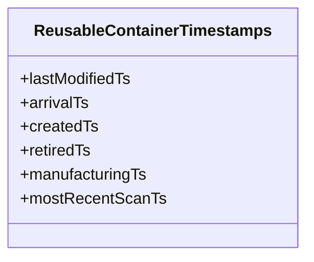

# Diagram: container_tracking_core/container_tracking_service/container_tracking_service/api/reuse_trip_container/ReusableContainerApiMapping.py

> Auto-generated by Obscura crawlers

## Diagram 1

```mermaid
graph LR
ui_id["id (api)"] <--> db_id["id (db)"]
ui_lifeCycleState["lifeCycleState (api)"] <--> db_lifecycle_state["lifecycle_state (db)"]
ui_status["status (api)"] <--> db_status["status (db)"]
ui_tagId["tagId (api)"] <--> db_tag_identifier["tag_identifier (db)"]
ui_containerId["containerId (api)"] <--> db_container_identifier["container_identifier (db)"]
ui_arrivalTs["arrivalTs (api)"] <--> db_arrival_ts["arrival_ts (db)"]
ui_mostRecentScanTs["mostRecentScanTs (api)"] <--> db_most_recent_scan_ts["most_recent_scan_ts (db)"]
ui_createdTs["createdTs (api)"] <--> db_created_ts["created_ts (db)"]
ui_lastModifiedTs["lastModifiedTs (api)"] <--> db_last_modified_ts["last_modified_ts (db)"]
ui_manufacturingTs["manufacturingTs (api)"] <--> db_manufacturing_ts["manufacturing_ts (db)"]
ui_retiredTs["retiredTs (api)"] <--> db_retired_ts["retired_ts (db)"]
ui_location["location (api)"] <--> db_location["location (db)"]
ui_batteryCharge["batteryCharge (api)"] <--> db_battery_charge["battery_charge (db)"]
ui_sensorType["sensorType (api)"] <--> db_sensor_type["sensor_type (db)"]
ui_sensorId["sensorId (api)"] <--> db_sensor_identifier["sensor_identifier (db)"]
ui_presenceStatus["presenceStatus (api)"] <--> db_presence_status["presence_status (db)"]
ui_supplierCode["supplierCode (api)"] <--> db_supplier_code["supplier_code (db)"]
ui_processType["processType (api)"] <--> db_process_type["process_type (db)"]
ui_rackCode["rackCode (api)"] <--> db_rack_code["rack_code (db)"]
ui_sequenceNumber["sequenceNumber (api)"] <--> db_sequence_number["sequence_number (db)"]
ui_gatewaySerialNumber["gatewaySerialNumber (api)"] <--> db_gateway_serial_number["gateway_serial_number (db)"]
ui_fleetType["fleetType (api)"] <--> db_fleet_type["fleet_type (db)"]
ui_programCode["programCode (api)"] <--> db_program_code["program_code (db)"]
ui_owner["owner (api)"] <--> db_owner["owner (db)"]
ui_ownership["ownership (api)"] <--> db_ownership["ownership (db)"]
ui_gpsAccuracy["gpsAccuracy (api)"] <--> db_gps_accuracy["gps_accuracy (db)"]
ui_gpsDeviceId["gpsDeviceId (api)"] <--> db_gps_device_id["gps_device_id (db)"]
ui_routeId["routeId (api)"] <--> db_route_number["route_number (db)"]
ui_classId["classId (api)"] <--> db_class_identifier["class_identifier (db)"]
ui_serialNumber["serialNumber (api)"] <--> db_serial_number["serial_number (db)"]
ui_type["type (api)"] <--> db_type["type (db)"]
ui_packagingMaterials["packagingMaterials (api)"] <--> db_packaging_materials["packaging_materials (db)"]
ui_generalUseMaterials["generalUseMaterials (api)"] <--> db_general_use_materials["general_use_materials (db)"]
ui_wasteMaterials["wasteMaterials (api)"] <--> db_waste_materials["waste_materials (db)"]
ui_primaryProcessMaterials["primaryProcessMaterials (api)"] <--> db_primary_process_materials["primary_process_materials (db)"]
ui_replacementHardware["replacementHardware (api)"] <--> db_replacement_hardware["replacement_hardware (db)"]
ui_depreciatedValue["depreciatedValue (api)"] <--> db_depreciated_value["depreciated_value (db)"]
ui_actualTripLegId["actualTripLegId (api)"] <--> db_actual_trip_leg_id["actual_trip_leg_id (db)"]
ui_latestReuseTripContainerEvent["latestReuseTripContainerEvent (api)"] <--> db_latest_reuse_trip_container_event["latest_reuse_trip_container_event (db)"]
ui_homeLocationCode["homeLocationCode (api)"] <--> db_home_location_code["home_location_code (db)"]
ui_latestSensorName["latestSensorName (api)"] <--> db_latest_sensor_name["latest_sensor_name (db)"]
```

> SVG rendering failed for this diagram.

## Diagram 2

### SVG

<svg id="container" width="296.390625" xmlns="http://www.w3.org/2000/svg" class="classDiagram" height="256" viewBox="0 0 296.390625 256" role="graphics-document document" aria-roledescription="class"><g><defs><marker id="container_class-aggregationStart" class="marker aggregation class" refX="18" refY="7" markerWidth="190" markerHeight="240" orient="auto"><path d="M 18,7 L9,13 L1,7 L9,1 Z"></path></marker></defs><defs><marker id="container_class-aggregationEnd" class="marker aggregation class" refX="1" refY="7" markerWidth="20" markerHeight="28" orient="auto"><path d="M 18,7 L9,13 L1,7 L9,1 Z"></path></marker></defs><defs><marker id="container_class-extensionStart" class="marker extension class" refX="18" refY="7" markerWidth="190" markerHeight="240" orient="auto"><path d="M 1,7 L18,13 V 1 Z"></path></marker></defs><defs><marker id="container_class-extensionEnd" class="marker extension class" refX="1" refY="7" markerWidth="20" markerHeight="28" orient="auto"><path d="M 1,1 V 13 L18,7 Z"></path></marker></defs><defs><marker id="container_class-compositionStart" class="marker composition class" refX="18" refY="7" markerWidth="190" markerHeight="240" orient="auto"><path d="M 18,7 L9,13 L1,7 L9,1 Z"></path></marker></defs><defs><marker id="container_class-compositionEnd" class="marker composition class" refX="1" refY="7" markerWidth="20" markerHeight="28" orient="auto"><path d="M 18,7 L9,13 L1,7 L9,1 Z"></path></marker></defs><defs><marker id="container_class-dependencyStart" class="marker dependency class" refX="6" refY="7" markerWidth="190" markerHeight="240" orient="auto"><path d="M 5,7 L9,13 L1,7 L9,1 Z"></path></marker></defs><defs><marker id="container_class-dependencyEnd" class="marker dependency class" refX="13" refY="7" markerWidth="20" markerHeight="28" orient="auto"><path d="M 18,7 L9,13 L14,7 L9,1 Z"></path></marker></defs><defs><marker id="container_class-lollipopStart" class="marker lollipop class" refX="13" refY="7" markerWidth="190" markerHeight="240" orient="auto"><circle stroke="black" fill="transparent" cx="7" cy="7" r="6"></circle></marker></defs><defs><marker id="container_class-lollipopEnd" class="marker lollipop class" refX="1" refY="7" markerWidth="190" markerHeight="240" orient="auto"><circle stroke="black" fill="transparent" cx="7" cy="7" r="6"></circle></marker></defs><g class="root"><g class="clusters"></g><g class="edgePaths"></g><g class="edgeLabels"></g><g class="nodes"><g class="node default" id="classId-ReusableContainerTimestamps-0" transform="translate(148.1953125, 128)"><g class="basic label-container"><path d="M-140.1953125 -120 L140.1953125 -120 L140.1953125 120 L-140.1953125 120" stroke="none" stroke-width="0" fill="#ECECFF" style=""></path><path d="M-140.1953125 -120 C-55.233149865024586 -120, 29.729012769950828 -120, 140.1953125 -120 M-140.1953125 -120 C-38.486053913479466 -120, 63.22320467304107 -120, 140.1953125 -120 M140.1953125 -120 C140.1953125 -33.99834605425434, 140.1953125 52.00330789149132, 140.1953125 120 M140.1953125 -120 C140.1953125 -48.677947362959515, 140.1953125 22.64410527408097, 140.1953125 120 M140.1953125 120 C45.852775049835714 120, -48.48976240032857 120, -140.1953125 120 M140.1953125 120 C53.021514293112645 120, -34.15228391377471 120, -140.1953125 120 M-140.1953125 120 C-140.1953125 51.662389507898894, -140.1953125 -16.675220984202213, -140.1953125 -120 M-140.1953125 120 C-140.1953125 55.46957812656669, -140.1953125 -9.060843746866624, -140.1953125 -120" stroke="#9370DB" stroke-width="1.3" fill="none" stroke-dasharray="0 0" style=""></path></g><g class="annotation-group text" transform="translate(0, -96)"></g><g class="label-group text" transform="translate(-113.5, -96)"><g class="label" style="font-weight: bolder" transform="translate(0,-12)"><foreignObject width="227" height="24">

ReusableContainerTimestamps

</foreignObject></g></g><g class="members-group text" transform="translate(-128.1953125, -48)"><g class="label" style="" transform="translate(0,-12)"><foreignObject width="112.703125" height="24">

+lastModifiedTs

</foreignObject></g><g class="label" style="" transform="translate(0,12)"><foreignObject width="69.109375" height="24">

+arrivalTs

</foreignObject></g><g class="label" style="" transform="translate(0,36)"><foreignObject width="77.375" height="24">

+createdTs

</foreignObject></g><g class="label" style="" transform="translate(0,60)"><foreignObject width="71.625" height="24">

+retiredTs

</foreignObject></g><g class="label" style="" transform="translate(0,84)"><foreignObject width="128.875" height="24">

+manufacturingTs

</foreignObject></g><g class="label" style="" transform="translate(0,108)"><foreignObject width="142.890625" height="24">

+mostRecentScanTs

</foreignObject></g></g><g class="methods-group text" transform="translate(-128.1953125, 120)"></g><g class="divider" style=""><path d="M-140.1953125 -72 C-39.26436624590343 -72, 61.66658000819314 -72, 140.1953125 -72 M-140.1953125 -72 C-51.30856120231323 -72, 37.57819009537354 -72, 140.1953125 -72" stroke="#9370DB" stroke-width="1.3" fill="none" stroke-dasharray="0 0" style=""></path></g><g class="divider" style=""><path d="M-140.1953125 96 C-47.66900361853463 96, 44.85730526293074 96, 140.1953125 96 M-140.1953125 96 C-78.59089533816609 96, -16.9864781763322 96, 140.1953125 96" stroke="#9370DB" stroke-width="1.3" fill="none" stroke-dasharray="0 0" style=""></path></g></g></g></g></g></svg>
