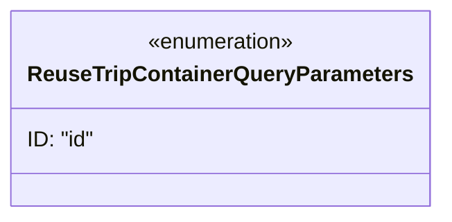

# Diagram: container_tracking_core/container_tracking_service/container_tracking_service/api/reuse_trip_container/ReuseTripContainerQueryParameters.py

> Auto-generated by Obscura crawlers

## Mermaid

### SVG

<svg id="container" width="310.9375" xmlns="http://www.w3.org/2000/svg" class="classDiagram" height="160" viewBox="0 0 310.9375 160" role="graphics-document document" aria-roledescription="class"><g><defs><marker id="container_class-aggregationStart" class="marker aggregation class" refX="18" refY="7" markerWidth="190" markerHeight="240" orient="auto"><path d="M 18,7 L9,13 L1,7 L9,1 Z"></path></marker></defs><defs><marker id="container_class-aggregationEnd" class="marker aggregation class" refX="1" refY="7" markerWidth="20" markerHeight="28" orient="auto"><path d="M 18,7 L9,13 L1,7 L9,1 Z"></path></marker></defs><defs><marker id="container_class-extensionStart" class="marker extension class" refX="18" refY="7" markerWidth="190" markerHeight="240" orient="auto"><path d="M 1,7 L18,13 V 1 Z"></path></marker></defs><defs><marker id="container_class-extensionEnd" class="marker extension class" refX="1" refY="7" markerWidth="20" markerHeight="28" orient="auto"><path d="M 1,1 V 13 L18,7 Z"></path></marker></defs><defs><marker id="container_class-compositionStart" class="marker composition class" refX="18" refY="7" markerWidth="190" markerHeight="240" orient="auto"><path d="M 18,7 L9,13 L1,7 L9,1 Z"></path></marker></defs><defs><marker id="container_class-compositionEnd" class="marker composition class" refX="1" refY="7" markerWidth="20" markerHeight="28" orient="auto"><path d="M 18,7 L9,13 L1,7 L9,1 Z"></path></marker></defs><defs><marker id="container_class-dependencyStart" class="marker dependency class" refX="6" refY="7" markerWidth="190" markerHeight="240" orient="auto"><path d="M 5,7 L9,13 L1,7 L9,1 Z"></path></marker></defs><defs><marker id="container_class-dependencyEnd" class="marker dependency class" refX="13" refY="7" markerWidth="20" markerHeight="28" orient="auto"><path d="M 18,7 L9,13 L14,7 L9,1 Z"></path></marker></defs><defs><marker id="container_class-lollipopStart" class="marker lollipop class" refX="13" refY="7" markerWidth="190" markerHeight="240" orient="auto"><circle stroke="black" fill="transparent" cx="7" cy="7" r="6"></circle></marker></defs><defs><marker id="container_class-lollipopEnd" class="marker lollipop class" refX="1" refY="7" markerWidth="190" markerHeight="240" orient="auto"><circle stroke="black" fill="transparent" cx="7" cy="7" r="6"></circle></marker></defs><g class="root"><g class="clusters"></g><g class="edgePaths"></g><g class="edgeLabels"></g><g class="nodes"><g class="node default" id="classId-ReuseTripContainerQueryParameters-0" transform="translate(155.46875, 80)"><g class="basic label-container"><path d="M-147.46875 -72 L147.46875 -72 L147.46875 72 L-147.46875 72" stroke="none" stroke-width="0" fill="#ECECFF" style=""></path><path d="M-147.46875 -72 C-77.02187991031981 -72, -6.575009820639622 -72, 147.46875 -72 M-147.46875 -72 C-38.75558743922883 -72, 69.95757512154233 -72, 147.46875 -72 M147.46875 -72 C147.46875 -39.455660284961134, 147.46875 -6.9113205699222675, 147.46875 72 M147.46875 -72 C147.46875 -41.16888121921632, 147.46875 -10.337762438432627, 147.46875 72 M147.46875 72 C30.159174989126328 72, -87.15040002174734 72, -147.46875 72 M147.46875 72 C79.26580142795947 72, 11.062852855918948 72, -147.46875 72 M-147.46875 72 C-147.46875 34.26722685457208, -147.46875 -3.4655462908558405, -147.46875 -72 M-147.46875 72 C-147.46875 15.891616813813116, -147.46875 -40.21676637237377, -147.46875 -72" stroke="#9370DB" stroke-width="1.3" fill="none" stroke-dasharray="0 0" style=""></path></g><g class="annotation-group text" transform="translate(-55.5546875, -48)"><g class="label" style="" transform="translate(0,-12)"><foreignObject width="111.109375" height="24">

«enumeration»

</foreignObject></g></g><g class="label-group text" transform="translate(-135.46875, -24)"><g class="label" style="font-weight: bolder" transform="translate(0,-12)"><foreignObject width="270.9375" height="24">

ReuseTripContainerQueryParameters

</foreignObject></g></g><g class="members-group text" transform="translate(-135.46875, 24)"><g class="label" style="" transform="translate(0,-12)"><foreignObject width="49.953125" height="24">

ID: "id"

</foreignObject></g></g><g class="methods-group text" transform="translate(-135.46875, 72)"></g><g class="divider" style=""><path d="M-147.46875 0 C-34.90736413771951 0, 77.65402172456098 0, 147.46875 0 M-147.46875 0 C-83.3303575624012 0, -19.191965124802408 0, 147.46875 0" stroke="#9370DB" stroke-width="1.3" fill="none" stroke-dasharray="0 0" style=""></path></g><g class="divider" style=""><path d="M-147.46875 48 C-57.51867096484392 48, 32.43140807031216 48, 147.46875 48 M-147.46875 48 C-71.58782851630689 48, 4.2930929673862295 48, 147.46875 48" stroke="#9370DB" stroke-width="1.3" fill="none" stroke-dasharray="0 0" style=""></path></g></g></g></g></g></svg>
