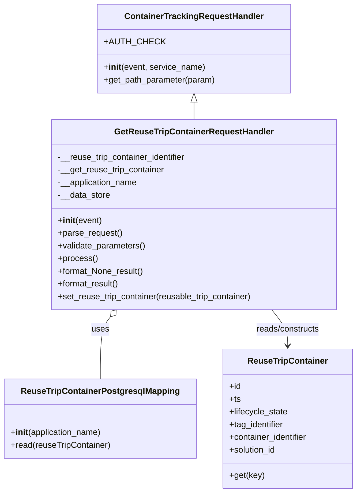

# Diagram: container_tracking_core/container_tracking_service/container_tracking_service/api/reuse_trip_container/get_reuse_trip_container.py


> Auto-generated by Obscura crawlers

## Diagram 1



> SVG rendering failed for this diagram.

## Diagram 2

```mermaid
flowchart TD
    L[lambda_handler(event, context, audit_refs)]
    A[auth.get_organization_id(event)]
    R[GetReuseTripContainerRequestHandler(event)]
    P[parse_request()]
    V[validate_parameters()]
    X[process()]
    C{reuse_trip_container_data != None}
    S_ok[make_response(format_result(), 200)]
    S_notfound[make_response(format_None_result(), 404)]

    L --> A
    A --> R
    R --> P
    P --> V
    V --> X
    X --> C
    C -- "yes" --> S_ok
    C -- "no" --> S_notfound
```

> SVG rendering failed for this diagram.
