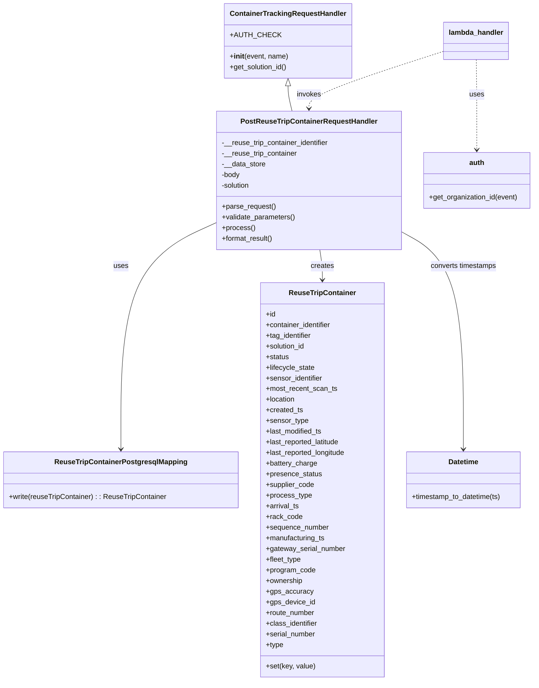

# Diagram: container_tracking_core/container_tracking_service/container_tracking_service/api/reuse_trip_container/reuse_trip_container_handler.py


> Auto-generated by Obscura crawlers

## Diagram 1



### SVG

<svg id="container" width="1199.728515625" xmlns="http://www.w3.org/2000/svg" class="classDiagram" height="1532" viewBox="0 0 1199.728515625 1532" role="graphics-document document" aria-roledescription="class"><style>#container{font-family:"trebuchet ms",verdana,arial,sans-serif;font-size:16px;fill:#333;}@keyframes edge-animation-frame{from{stroke-dashoffset:0;}}@keyframes dash{to{stroke-dashoffset:0;}}#container .edge-animation-slow{stroke-dasharray:9,5!important;stroke-dashoffset:900;animation:dash 50s linear infinite;stroke-linecap:round;}#container .edge-animation-fast{stroke-dasharray:9,5!important;stroke-dashoffset:900;animation:dash 20s linear infinite;stroke-linecap:round;}#container .error-icon{fill:#552222;}#container .error-text{fill:#552222;stroke:#552222;}#container .edge-thickness-normal{stroke-width:1px;}#container .edge-thickness-thick{stroke-width:3.5px;}#container .edge-pattern-solid{stroke-dasharray:0;}#container .edge-thickness-invisible{stroke-width:0;fill:none;}#container .edge-pattern-dashed{stroke-dasharray:3;}#container .edge-pattern-dotted{stroke-dasharray:2;}#container .marker{fill:#333333;stroke:#333333;}#container .marker.cross{stroke:#333333;}#container svg{font-family:"trebuchet ms",verdana,arial,sans-serif;font-size:16px;}#container p{margin:0;}#container g.classGroup text{fill:#9370DB;stroke:none;font-family:"trebuchet ms",verdana,arial,sans-serif;font-size:10px;}#container g.classGroup text .title{font-weight:bolder;}#container .nodeLabel,#container .edgeLabel{color:#131300;}#container .edgeLabel .label rect{fill:#ECECFF;}#container .label text{fill:#131300;}#container .labelBkg{background:#ECECFF;}#container .edgeLabel .label span{background:#ECECFF;}#container .classTitle{font-weight:bolder;}#container .node rect,#container .node circle,#container .node ellipse,#container .node polygon,#container .node path{fill:#ECECFF;stroke:#9370DB;stroke-width:1px;}#container .divider{stroke:#9370DB;stroke-width:1;}#container g.clickable{cursor:pointer;}#container g.classGroup rect{fill:#ECECFF;stroke:#9370DB;}#container g.classGroup line{stroke:#9370DB;stroke-width:1;}#container .classLabel .box{stroke:none;stroke-width:0;fill:#ECECFF;opacity:0.5;}#container .classLabel .label{fill:#9370DB;font-size:10px;}#container .relation{stroke:#333333;stroke-width:1;fill:none;}#container .dashed-line{stroke-dasharray:3;}#container .dotted-line{stroke-dasharray:1 2;}#container #compositionStart,#container .composition{fill:#333333!important;stroke:#333333!important;stroke-width:1;}#container #compositionEnd,#container .composition{fill:#333333!important;stroke:#333333!important;stroke-width:1;}#container #dependencyStart,#container .dependency{fill:#333333!important;stroke:#333333!important;stroke-width:1;}#container #dependencyStart,#container .dependency{fill:#333333!important;stroke:#333333!important;stroke-width:1;}#container #extensionStart,#container .extension{fill:transparent!important;stroke:#333333!important;stroke-width:1;}#container #extensionEnd,#container .extension{fill:transparent!important;stroke:#333333!important;stroke-width:1;}#container #aggregationStart,#container .aggregation{fill:transparent!important;stroke:#333333!important;stroke-width:1;}#container #aggregationEnd,#container .aggregation{fill:transparent!important;stroke:#333333!important;stroke-width:1;}#container #lollipopStart,#container .lollipop{fill:#ECECFF!important;stroke:#333333!important;stroke-width:1;}#container #lollipopEnd,#container .lollipop{fill:#ECECFF!important;stroke:#333333!important;stroke-width:1;}#container .edgeTerminals{font-size:11px;line-height:initial;}#container .classTitleText{text-anchor:middle;font-size:18px;fill:#333;}#container .label-icon{display:inline-block;height:1em;overflow:visible;vertical-align:-0.125em;}#container .node .label-icon path{fill:currentColor;stroke:revert;stroke-width:revert;}#container :root{--mermaid-font-family:"trebuchet ms",verdana,arial,sans-serif;}</style><g><defs><marker id="container_class-aggregationStart" class="marker aggregation class" refX="18" refY="7" markerWidth="190" markerHeight="240" orient="auto"><path d="M 18,7 L9,13 L1,7 L9,1 Z"></path></marker></defs><defs><marker id="container_class-aggregationEnd" class="marker aggregation class" refX="1" refY="7" markerWidth="20" markerHeight="28" orient="auto"><path d="M 18,7 L9,13 L1,7 L9,1 Z"></path></marker></defs><defs><marker id="container_class-extensionStart" class="marker extension class" refX="18" refY="7" markerWidth="190" markerHeight="240" orient="auto"><path d="M 1,7 L18,13 V 1 Z"></path></marker></defs><defs><marker id="container_class-extensionEnd" class="marker extension class" refX="1" refY="7" markerWidth="20" markerHeight="28" orient="auto"><path d="M 1,1 V 13 L18,7 Z"></path></marker></defs><defs><marker id="container_class-compositionStart" class="marker composition class" refX="18" refY="7" markerWidth="190" markerHeight="240" orient="auto"><path d="M 18,7 L9,13 L1,7 L9,1 Z"></path></marker></defs><defs><marker id="container_class-compositionEnd" class="marker composition class" refX="1" refY="7" markerWidth="20" markerHeight="28" orient="auto"><path d="M 18,7 L9,13 L1,7 L9,1 Z"></path></marker></defs><defs><marker id="container_class-dependencyStart" class="marker dependency class" refX="6" refY="7" markerWidth="190" markerHeight="240" orient="auto"><path d="M 5,7 L9,13 L1,7 L9,1 Z"></path></marker></defs><defs><marker id="container_class-dependencyEnd" class="marker dependency class" refX="13" refY="7" markerWidth="20" markerHeight="28" orient="auto"><path d="M 18,7 L9,13 L14,7 L9,1 Z"></path></marker></defs><defs><marker id="container_class-lollipopStart" class="marker lollipop class" refX="13" refY="7" markerWidth="190" markerHeight="240" orient="auto"><circle stroke="black" fill="transparent" cx="7" cy="7" r="6"></circle></marker></defs><defs><marker id="container_class-lollipopEnd" class="marker lollipop class" refX="1" refY="7" markerWidth="190" markerHeight="240" orient="auto"><circle stroke="black" fill="transparent" cx="7" cy="7" r="6"></circle></marker></defs><g class="root"><g class="clusters"></g><g class="edgePaths"><path d="M642.982,193.25L642.982,196.542C642.982,199.833,642.982,206.417,644.503,215.875C646.023,225.333,649.064,237.667,650.585,243.833L652.105,250" id="id_ContainerTrackingRequestHandler_PostReuseTripContainerRequestHandler_1" class="edge-thickness-normal edge-pattern-solid relation" style=";;;" data-edge="true" data-et="edge" data-id="id_ContainerTrackingRequestHandler_PostReuseTripContainerRequestHandler_1" data-points="W3sieCI6NjQyLjk4MjQyMTg3NSwieSI6MTc2fSx7IngiOjY0Mi45ODI0MjE4NzUsInkiOjIxM30seyJ4Ijo2NTIuMTA1MTE0NTU2MzQ3MiwieSI6MjUwfV0=" marker-start="url(#container_class-extensionStart)"></path><path d="M482.088,501.464L446.587,517.72C411.086,533.976,340.084,566.488,304.583,651.411C269.082,736.333,269.082,873.667,269.082,942.333L269.082,1011" id="id_PostReuseTripContainerRequestHandler_ReuseTripContainerPostgresqlMapping_2" class="edge-thickness-normal edge-pattern-solid relation" style=";;;" data-edge="true" data-et="edge" data-id="id_PostReuseTripContainerRequestHandler_ReuseTripContainerPostgresqlMapping_2" data-points="W3sieCI6NDgyLjA4Nzg5MDYyNSwieSI6NTAxLjQ2MzkwNDI0NTExNDd9LHsieCI6MjY5LjA4MjAzMTI1LCJ5Ijo1OTl9LHsieCI6MjY5LjA4MjAzMTI1LCJ5IjoxMDE3fV0=" marker-end="url(#container_class-dependencyEnd)"></path><path d="M714.364,562L715.305,568.167C716.245,574.333,718.127,586.667,719.067,598C720.008,609.333,720.008,619.667,720.008,624.833L720.008,630" id="id_PostReuseTripContainerRequestHandler_ReuseTripContainer_3" class="edge-thickness-normal edge-pattern-solid relation" style=";;;" data-edge="true" data-et="edge" data-id="id_PostReuseTripContainerRequestHandler_ReuseTripContainer_3" data-points="W3sieCI6NzE0LjM2Mzk3OTUxNzQ4NywieSI6NTYyfSx7IngiOjcyMC4wMDc4MTI1LCJ5Ijo1OTl9LHsieCI6NzIwLjAwNzgxMjUsInkiOjYzNn1d" marker-end="url(#container_class-dependencyEnd)"></path><path d="M899.049,520.837L922.699,533.864C946.349,546.891,993.649,572.946,1017.299,654.64C1040.949,736.333,1040.949,873.667,1040.949,942.333L1040.949,1011" id="id_PostReuseTripContainerRequestHandler_Datetime_4" class="edge-thickness-normal edge-pattern-solid relation" style=";;;" data-edge="true" data-et="edge" data-id="id_PostReuseTripContainerRequestHandler_Datetime_4" data-points="W3sieCI6ODk5LjA0ODgyODEyNSwieSI6NTIwLjgzNzEyNDc4MDUxMjN9LHsieCI6MTA0MC45NDkyMTg3NSwieSI6NTk5fSx7IngiOjEwNDAuOTQ5MjE4NzUsInkiOjEwMTd9XQ==" marker-end="url(#container_class-dependencyEnd)"></path><path d="M995.813,115.088L944.938,131.406C894.064,147.725,792.316,180.363,741.442,201.848C690.568,223.333,690.568,233.667,690.568,238.833L690.568,244" id="id_lambda_handler_PostReuseTripContainerRequestHandler_5" class="edge-thickness-normal edge-pattern-dashed relation" style=";;;" data-edge="true" data-et="edge" data-id="id_lambda_handler_PostReuseTripContainerRequestHandler_5" data-points="W3sieCI6OTk1LjgxMjUsInkiOjExNS4wODc3MTQ5MzgxMDA5M30seyJ4Ijo2OTAuNTY4MzU5Mzc1LCJ5IjoyMTN9LHsieCI6NjkwLjU2ODM1OTM3NSwieSI6MjUwfV0=" marker-end="url(#container_class-dependencyEnd)"></path><path d="M1068.691,134L1068.974,147.167C1069.257,160.333,1069.823,186.667,1070.106,220.5C1070.389,254.333,1070.389,295.667,1070.389,316.333L1070.389,337" id="id_lambda_handler_auth_6" class="edge-thickness-normal edge-pattern-dashed relation" style=";;;" data-edge="true" data-et="edge" data-id="id_lambda_handler_auth_6" data-points="W3sieCI6MTA2OC42OTE0MDYyNSwieSI6MTM0fSx7IngiOjEwNzAuMzg4NjcxODc1LCJ5IjoyMTN9LHsieCI6MTA3MC4zODg2NzE4NzUsInkiOjM0M31d" marker-end="url(#container_class-dependencyEnd)"></path></g><g class="edgeLabels"><g class="edgeLabel"><g class="label" data-id="id_ContainerTrackingRequestHandler_PostReuseTripContainerRequestHandler_1" transform="translate(0, 0)"><foreignObject width="0" height="0"><div xmlns="http://www.w3.org/1999/xhtml" class="labelBkg" style="display: table-cell; white-space: nowrap; line-height: 1.5; max-width: 200px; text-align: center;"><span class="edgeLabel"></span></div></foreignObject></g></g><g class="edgeLabel" transform="translate(269.08203125, 599)"><g class="label" data-id="id_PostReuseTripContainerRequestHandler_ReuseTripContainerPostgresqlMapping_2" transform="translate(-16.4921875, -12)"><foreignObject width="32.984375" height="24"><div xmlns="http://www.w3.org/1999/xhtml" class="labelBkg" style="display: table-cell; white-space: nowrap; line-height: 1.5; max-width: 200px; text-align: center;"><span class="edgeLabel"><p>uses</p></span></div></foreignObject></g></g><g class="edgeLabel" transform="translate(720.0078125, 599)"><g class="label" data-id="id_PostReuseTripContainerRequestHandler_ReuseTripContainer_3" transform="translate(-26.171875, -12)"><foreignObject width="52.34375" height="24"><div xmlns="http://www.w3.org/1999/xhtml" class="labelBkg" style="display: table-cell; white-space: nowrap; line-height: 1.5; max-width: 200px; text-align: center;"><span class="edgeLabel"><p>creates</p></span></div></foreignObject></g></g><g class="edgeLabel" transform="translate(1040.94921875, 599)"><g class="label" data-id="id_PostReuseTripContainerRequestHandler_Datetime_4" transform="translate(-75.6953125, -12)"><foreignObject width="151.390625" height="24"><div xmlns="http://www.w3.org/1999/xhtml" class="labelBkg" style="display: table-cell; white-space: nowrap; line-height: 1.5; max-width: 200px; text-align: center;"><span class="edgeLabel"><p>converts timestamps</p></span></div></foreignObject></g></g><g class="edgeLabel" transform="translate(690.568359375, 213)"><g class="label" data-id="id_lambda_handler_PostReuseTripContainerRequestHandler_5" transform="translate(-27.5859375, -12)"><foreignObject width="55.171875" height="24"><div xmlns="http://www.w3.org/1999/xhtml" class="labelBkg" style="display: table-cell; white-space: nowrap; line-height: 1.5; max-width: 200px; text-align: center;"><span class="edgeLabel"><p>invokes</p></span></div></foreignObject></g></g><g class="edgeLabel" transform="translate(1070.388671875, 213)"><g class="label" data-id="id_lambda_handler_auth_6" transform="translate(-16.4921875, -12)"><foreignObject width="32.984375" height="24"><div xmlns="http://www.w3.org/1999/xhtml" class="labelBkg" style="display: table-cell; white-space: nowrap; line-height: 1.5; max-width: 200px; text-align: center;"><span class="edgeLabel"><p>uses</p></span></div></foreignObject></g></g></g><g class="nodes"><g class="node default" id="classId-ContainerTrackingRequestHandler-0" transform="translate(642.982421875, 92)"><g class="basic label-container"><path d="M-140.69140625 -84 L140.69140625 -84 L140.69140625 84 L-140.69140625 84" stroke="none" stroke-width="0" fill="#ECECFF" style=""></path><path d="M-140.69140625 -84 C-70.31936284424707 -84, 0.05268056150586631 -84, 140.69140625 -84 M-140.69140625 -84 C-38.59897979628026 -84, 63.49344665743948 -84, 140.69140625 -84 M140.69140625 -84 C140.69140625 -26.41479438264426, 140.69140625 31.17041123471148, 140.69140625 84 M140.69140625 -84 C140.69140625 -40.27672842361458, 140.69140625 3.446543152770843, 140.69140625 84 M140.69140625 84 C36.94541301535703 84, -66.80058021928593 84, -140.69140625 84 M140.69140625 84 C58.003695975465575 84, -24.68401429906885 84, -140.69140625 84 M-140.69140625 84 C-140.69140625 31.27658257500464, -140.69140625 -21.446834849990722, -140.69140625 -84 M-140.69140625 84 C-140.69140625 38.29730737547587, -140.69140625 -7.4053852490482655, -140.69140625 -84" stroke="#9370DB" stroke-width="1.3" fill="none" stroke-dasharray="0 0" style=""></path></g><g class="annotation-group text" transform="translate(0, -60)"></g><g class="label-group text" transform="translate(-125.5859375, -60)"><g class="label" style="font-weight: bolder" transform="translate(0,-12)"><foreignObject width="251.171875" height="24"><div xmlns="http://www.w3.org/1999/xhtml" style="display: table-cell; white-space: nowrap; line-height: 1.5; max-width: 299px; text-align: center;"><span class="nodeLabel markdown-node-label" style=""><p>ContainerTrackingRequestHandler</p></span></div></foreignObject></g></g><g class="members-group text" transform="translate(-128.69140625, -12)"><g class="label" style="" transform="translate(0,-12)"><foreignObject width="100.859375" height="24"><div xmlns="http://www.w3.org/1999/xhtml" style="display: table-cell; white-space: nowrap; line-height: 1.5; max-width: 159px; text-align: center;"><span class="nodeLabel markdown-node-label" style=""><p>+AUTH_CHECK</p></span></div></foreignObject></g></g><g class="methods-group text" transform="translate(-128.69140625, 36)"><g class="label" style="" transform="translate(0,-12)"><foreignObject width="131.796875" height="24"><div xmlns="http://www.w3.org/1999/xhtml" style="display: table-cell; white-space: nowrap; line-height: 1.5; max-width: 221px; text-align: center;"><span class="nodeLabel markdown-node-label" style=""><p>+<strong>init</strong>(event, name)</p></span></div></foreignObject></g><g class="label" style="" transform="translate(0,12)"><foreignObject width="131.46875" height="24"><div xmlns="http://www.w3.org/1999/xhtml" style="display: table-cell; white-space: nowrap; line-height: 1.5; max-width: 189px; text-align: center;"><span class="nodeLabel markdown-node-label" style=""><p>+get_solution_id()</p></span></div></foreignObject></g></g><g class="divider" style=""><path d="M-140.69140625 -36 C-66.9776390027144 -36, 6.736128244571205 -36, 140.69140625 -36 M-140.69140625 -36 C-35.75747120075597 -36, 69.17646384848805 -36, 140.69140625 -36" stroke="#9370DB" stroke-width="1.3" fill="none" stroke-dasharray="0 0" style=""></path></g><g class="divider" style=""><path d="M-140.69140625 12 C-45.06078301915208 12, 50.56984021169583 12, 140.69140625 12 M-140.69140625 12 C-30.634207902931024 12, 79.42299044413795 12, 140.69140625 12" stroke="#9370DB" stroke-width="1.3" fill="none" stroke-dasharray="0 0" style=""></path></g></g><g class="node default" id="classId-PostReuseTripContainerRequestHandler-1" transform="translate(690.568359375, 406)"><g class="basic label-container"><path d="M-208.48046875 -156 L208.48046875 -156 L208.48046875 156 L-208.48046875 156" stroke="none" stroke-width="0" fill="#ECECFF" style=""></path><path d="M-208.48046875 -156 C-54.97405584454006 -156, 98.53235706091988 -156, 208.48046875 -156 M-208.48046875 -156 C-92.04596898039338 -156, 24.388530789213235 -156, 208.48046875 -156 M208.48046875 -156 C208.48046875 -69.78609958587002, 208.48046875 16.42780082825996, 208.48046875 156 M208.48046875 -156 C208.48046875 -92.37089092549164, 208.48046875 -28.74178185098326, 208.48046875 156 M208.48046875 156 C63.55633756579445 156, -81.3677936184111 156, -208.48046875 156 M208.48046875 156 C45.9796175899595 156, -116.521233570081 156, -208.48046875 156 M-208.48046875 156 C-208.48046875 34.81670975096411, -208.48046875 -86.36658049807178, -208.48046875 -156 M-208.48046875 156 C-208.48046875 53.67720696975371, -208.48046875 -48.645586060492576, -208.48046875 -156" stroke="#9370DB" stroke-width="1.3" fill="none" stroke-dasharray="0 0" style=""></path></g><g class="annotation-group text" transform="translate(0, -132)"></g><g class="label-group text" transform="translate(-147.2578125, -132)"><g class="label" style="font-weight: bolder" transform="translate(0,-12)"><foreignObject width="294.515625" height="24"><div xmlns="http://www.w3.org/1999/xhtml" style="display: table-cell; white-space: nowrap; line-height: 1.5; max-width: 341px; text-align: center;"><span class="nodeLabel markdown-node-label" style=""><p>PostReuseTripContainerRequestHandler</p></span></div></foreignObject></g></g><g class="members-group text" transform="translate(-196.48046875, -84)"><g class="label" style="" transform="translate(0,-12)"><foreignObject width="245.703125" height="24"><div xmlns="http://www.w3.org/1999/xhtml" style="display: table-cell; white-space: nowrap; line-height: 1.5; max-width: 304px; text-align: center;"><span class="nodeLabel markdown-node-label" style=""><p>-__reuse_trip_container_identifier</p></span></div></foreignObject></g><g class="label" style="" transform="translate(0,12)"><foreignObject width="172.109375" height="24"><div xmlns="http://www.w3.org/1999/xhtml" style="display: table-cell; white-space: nowrap; line-height: 1.5; max-width: 230px; text-align: center;"><span class="nodeLabel markdown-node-label" style=""><p>-__reuse_trip_container</p></span></div></foreignObject></g><g class="label" style="" transform="translate(0,36)"><foreignObject width="99.0625" height="24"><div xmlns="http://www.w3.org/1999/xhtml" style="display: table-cell; white-space: nowrap; line-height: 1.5; max-width: 156px; text-align: center;"><span class="nodeLabel markdown-node-label" style=""><p>-__data_store</p></span></div></foreignObject></g><g class="label" style="" transform="translate(0,60)"><foreignObject width="42.75" height="24"><div xmlns="http://www.w3.org/1999/xhtml" style="display: table-cell; white-space: nowrap; line-height: 1.5; max-width: 100px; text-align: center;"><span class="nodeLabel markdown-node-label" style=""><p>-body</p></span></div></foreignObject></g><g class="label" style="" transform="translate(0,84)"><foreignObject width="66.28125" height="24"><div xmlns="http://www.w3.org/1999/xhtml" style="display: table-cell; white-space: nowrap; line-height: 1.5; max-width: 124px; text-align: center;"><span class="nodeLabel markdown-node-label" style=""><p>-solution</p></span></div></foreignObject></g></g><g class="methods-group text" transform="translate(-196.48046875, 60)"><g class="label" style="" transform="translate(0,-12)"><foreignObject width="121.796875" height="24"><div xmlns="http://www.w3.org/1999/xhtml" style="display: table-cell; white-space: nowrap; line-height: 1.5; max-width: 179px; text-align: center;"><span class="nodeLabel markdown-node-label" style=""><p>+parse_request()</p></span></div></foreignObject></g><g class="label" style="" transform="translate(0,12)"><foreignObject width="166.546875" height="24"><div xmlns="http://www.w3.org/1999/xhtml" style="display: table-cell; white-space: nowrap; line-height: 1.5; max-width: 224px; text-align: center;"><span class="nodeLabel markdown-node-label" style=""><p>+validate_parameters()</p></span></div></foreignObject></g><g class="label" style="" transform="translate(0,36)"><foreignObject width="73.734375" height="24"><div xmlns="http://www.w3.org/1999/xhtml" style="display: table-cell; white-space: nowrap; line-height: 1.5; max-width: 131px; text-align: center;"><span class="nodeLabel markdown-node-label" style=""><p>+process()</p></span></div></foreignObject></g><g class="label" style="" transform="translate(0,60)"><foreignObject width="117.015625" height="24"><div xmlns="http://www.w3.org/1999/xhtml" style="display: table-cell; white-space: nowrap; line-height: 1.5; max-width: 174px; text-align: center;"><span class="nodeLabel markdown-node-label" style=""><p>+format_result()</p></span></div></foreignObject></g></g><g class="divider" style=""><path d="M-208.48046875 -108 C-46.57645607032637 -108, 115.32755660934725 -108, 208.48046875 -108 M-208.48046875 -108 C-108.58311705079514 -108, -8.685765351590277 -108, 208.48046875 -108" stroke="#9370DB" stroke-width="1.3" fill="none" stroke-dasharray="0 0" style=""></path></g><g class="divider" style=""><path d="M-208.48046875 36 C-119.01471245962806 36, -29.548956169256115 36, 208.48046875 36 M-208.48046875 36 C-90.93635260099936 36, 26.607763548001287 36, 208.48046875 36" stroke="#9370DB" stroke-width="1.3" fill="none" stroke-dasharray="0 0" style=""></path></g></g><g class="node default" id="classId-ReuseTripContainer-2" transform="translate(720.0078125, 1080)"><g class="basic label-container"><path d="M-139.84375 -444 L139.84375 -444 L139.84375 444 L-139.84375 444" stroke="none" stroke-width="0" fill="#ECECFF" style=""></path><path d="M-139.84375 -444 C-57.40024924156566 -444, 25.04325151686868 -444, 139.84375 -444 M-139.84375 -444 C-32.40688643667595 -444, 75.0299771266481 -444, 139.84375 -444 M139.84375 -444 C139.84375 -143.51397137549935, 139.84375 156.9720572490013, 139.84375 444 M139.84375 -444 C139.84375 -210.31564184307214, 139.84375 23.368716313855714, 139.84375 444 M139.84375 444 C40.70742899482961 444, -58.428892010340775 444, -139.84375 444 M139.84375 444 C73.76489418030006 444, 7.686038360600122 444, -139.84375 444 M-139.84375 444 C-139.84375 194.9126956369509, -139.84375 -54.1746087260982, -139.84375 -444 M-139.84375 444 C-139.84375 240.20956721790094, -139.84375 36.41913443580188, -139.84375 -444" stroke="#9370DB" stroke-width="1.3" fill="none" stroke-dasharray="0 0" style=""></path></g><g class="annotation-group text" transform="translate(0, -420)"></g><g class="label-group text" transform="translate(-72.015625, -420)"><g class="label" style="font-weight: bolder" transform="translate(0,-12)"><foreignObject width="144.03125" height="24"><div xmlns="http://www.w3.org/1999/xhtml" style="display: table-cell; white-space: nowrap; line-height: 1.5; max-width: 193px; text-align: center;"><span class="nodeLabel markdown-node-label" style=""><p>ReuseTripContainer</p></span></div></foreignObject></g></g><g class="members-group text" transform="translate(-127.84375, -372)"><g class="label" style="" transform="translate(0,-12)"><foreignObject width="22.078125" height="24"><div xmlns="http://www.w3.org/1999/xhtml" style="display: table-cell; white-space: nowrap; line-height: 1.5; max-width: 79px; text-align: center;"><span class="nodeLabel markdown-node-label" style=""><p>+id</p></span></div></foreignObject></g><g class="label" style="" transform="translate(0,12)"><foreignObject width="150.796875" height="24"><div xmlns="http://www.w3.org/1999/xhtml" style="display: table-cell; white-space: nowrap; line-height: 1.5; max-width: 209px; text-align: center;"><span class="nodeLabel markdown-node-label" style=""><p>+container_identifier</p></span></div></foreignObject></g><g class="label" style="" transform="translate(0,36)"><foreignObject width="105.390625" height="24"><div xmlns="http://www.w3.org/1999/xhtml" style="display: table-cell; white-space: nowrap; line-height: 1.5; max-width: 164px; text-align: center;"><span class="nodeLabel markdown-node-label" style=""><p>+tag_identifier</p></span></div></foreignObject></g><g class="label" style="" transform="translate(0,60)"><foreignObject width="90.21875" height="24"><div xmlns="http://www.w3.org/1999/xhtml" style="display: table-cell; white-space: nowrap; line-height: 1.5; max-width: 148px; text-align: center;"><span class="nodeLabel markdown-node-label" style=""><p>+solution_id</p></span></div></foreignObject></g><g class="label" style="" transform="translate(0,84)"><foreignObject width="52.390625" height="24"><div xmlns="http://www.w3.org/1999/xhtml" style="display: table-cell; white-space: nowrap; line-height: 1.5; max-width: 110px; text-align: center;"><span class="nodeLabel markdown-node-label" style=""><p>+status</p></span></div></foreignObject></g><g class="label" style="" transform="translate(0,108)"><foreignObject width="111.640625" height="24"><div xmlns="http://www.w3.org/1999/xhtml" style="display: table-cell; white-space: nowrap; line-height: 1.5; max-width: 169px; text-align: center;"><span class="nodeLabel markdown-node-label" style=""><p>+lifecycle_state</p></span></div></foreignObject></g><g class="label" style="" transform="translate(0,132)"><foreignObject width="130.15625" height="24"><div xmlns="http://www.w3.org/1999/xhtml" style="display: table-cell; white-space: nowrap; line-height: 1.5; max-width: 188px; text-align: center;"><span class="nodeLabel markdown-node-label" style=""><p>+sensor_identifier</p></span></div></foreignObject></g><g class="label" style="" transform="translate(0,156)"><foreignObject width="160.84375" height="24"><div xmlns="http://www.w3.org/1999/xhtml" style="display: table-cell; white-space: nowrap; line-height: 1.5; max-width: 218px; text-align: center;"><span class="nodeLabel markdown-node-label" style=""><p>+most_recent_scan_ts</p></span></div></foreignObject></g><g class="label" style="" transform="translate(0,180)"><foreignObject width="67.140625" height="24"><div xmlns="http://www.w3.org/1999/xhtml" style="display: table-cell; white-space: nowrap; line-height: 1.5; max-width: 125px; text-align: center;"><span class="nodeLabel markdown-node-label" style=""><p>+location</p></span></div></foreignObject></g><g class="label" style="" transform="translate(0,204)"><foreignObject width="83.671875" height="24"><div xmlns="http://www.w3.org/1999/xhtml" style="display: table-cell; white-space: nowrap; line-height: 1.5; max-width: 141px; text-align: center;"><span class="nodeLabel markdown-node-label" style=""><p>+created_ts</p></span></div></foreignObject></g><g class="label" style="" transform="translate(0,228)"><foreignObject width="95.0625" height="24"><div xmlns="http://www.w3.org/1999/xhtml" style="display: table-cell; white-space: nowrap; line-height: 1.5; max-width: 152px; text-align: center;"><span class="nodeLabel markdown-node-label" style=""><p>+sensor_type</p></span></div></foreignObject></g><g class="label" style="" transform="translate(0,252)"><foreignObject width="128.578125" height="24"><div xmlns="http://www.w3.org/1999/xhtml" style="display: table-cell; white-space: nowrap; line-height: 1.5; max-width: 186px; text-align: center;"><span class="nodeLabel markdown-node-label" style=""><p>+last_modified_ts</p></span></div></foreignObject></g><g class="label" style="" transform="translate(0,276)"><foreignObject width="171.109375" height="24"><div xmlns="http://www.w3.org/1999/xhtml" style="display: table-cell; white-space: nowrap; line-height: 1.5; max-width: 228px; text-align: center;"><span class="nodeLabel markdown-node-label" style=""><p>+last_reported_latitude</p></span></div></foreignObject></g><g class="label" style="" transform="translate(0,300)"><foreignObject width="183.671875" height="24"><div xmlns="http://www.w3.org/1999/xhtml" style="display: table-cell; white-space: nowrap; line-height: 1.5; max-width: 241px; text-align: center;"><span class="nodeLabel markdown-node-label" style=""><p>+last_reported_longitude</p></span></div></foreignObject></g><g class="label" style="" transform="translate(0,324)"><foreignObject width="116.09375" height="24"><div xmlns="http://www.w3.org/1999/xhtml" style="display: table-cell; white-space: nowrap; line-height: 1.5; max-width: 173px; text-align: center;"><span class="nodeLabel markdown-node-label" style=""><p>+battery_charge</p></span></div></foreignObject></g><g class="label" style="" transform="translate(0,348)"><foreignObject width="125.921875" height="24"><div xmlns="http://www.w3.org/1999/xhtml" style="display: table-cell; white-space: nowrap; line-height: 1.5; max-width: 183px; text-align: center;"><span class="nodeLabel markdown-node-label" style=""><p>+presence_status</p></span></div></foreignObject></g><g class="label" style="" transform="translate(0,372)"><foreignObject width="109.5625" height="24"><div xmlns="http://www.w3.org/1999/xhtml" style="display: table-cell; white-space: nowrap; line-height: 1.5; max-width: 167px; text-align: center;"><span class="nodeLabel markdown-node-label" style=""><p>+supplier_code</p></span></div></foreignObject></g><g class="label" style="" transform="translate(0,396)"><foreignObject width="102.84375" height="24"><div xmlns="http://www.w3.org/1999/xhtml" style="display: table-cell; white-space: nowrap; line-height: 1.5; max-width: 160px; text-align: center;"><span class="nodeLabel markdown-node-label" style=""><p>+process_type</p></span></div></foreignObject></g><g class="label" style="" transform="translate(0,420)"><foreignObject width="75.421875" height="24"><div xmlns="http://www.w3.org/1999/xhtml" style="display: table-cell; white-space: nowrap; line-height: 1.5; max-width: 133px; text-align: center;"><span class="nodeLabel markdown-node-label" style=""><p>+arrival_ts</p></span></div></foreignObject></g><g class="label" style="" transform="translate(0,444)"><foreignObject width="81.109375" height="24"><div xmlns="http://www.w3.org/1999/xhtml" style="display: table-cell; white-space: nowrap; line-height: 1.5; max-width: 138px; text-align: center;"><span class="nodeLabel markdown-node-label" style=""><p>+rack_code</p></span></div></foreignObject></g><g class="label" style="" transform="translate(0,468)"><foreignObject width="142.015625" height="24"><div xmlns="http://www.w3.org/1999/xhtml" style="display: table-cell; white-space: nowrap; line-height: 1.5; max-width: 200px; text-align: center;"><span class="nodeLabel markdown-node-label" style=""><p>+sequence_number</p></span></div></foreignObject></g><g class="label" style="" transform="translate(0,492)"><foreignObject width="135.234375" height="24"><div xmlns="http://www.w3.org/1999/xhtml" style="display: table-cell; white-space: nowrap; line-height: 1.5; max-width: 193px; text-align: center;"><span class="nodeLabel markdown-node-label" style=""><p>+manufacturing_ts</p></span></div></foreignObject></g><g class="label" style="" transform="translate(0,516)"><foreignObject width="179.65625" height="24"><div xmlns="http://www.w3.org/1999/xhtml" style="display: table-cell; white-space: nowrap; line-height: 1.5; max-width: 238px; text-align: center;"><span class="nodeLabel markdown-node-label" style=""><p>+gateway_serial_number</p></span></div></foreignObject></g><g class="label" style="" transform="translate(0,540)"><foreignObject width="80.15625" height="24"><div xmlns="http://www.w3.org/1999/xhtml" style="display: table-cell; white-space: nowrap; line-height: 1.5; max-width: 138px; text-align: center;"><span class="nodeLabel markdown-node-label" style=""><p>+fleet_type</p></span></div></foreignObject></g><g class="label" style="" transform="translate(0,564)"><foreignObject width="111.84375" height="24"><div xmlns="http://www.w3.org/1999/xhtml" style="display: table-cell; white-space: nowrap; line-height: 1.5; max-width: 169px; text-align: center;"><span class="nodeLabel markdown-node-label" style=""><p>+program_code</p></span></div></foreignObject></g><g class="label" style="" transform="translate(0,588)"><foreignObject width="83.703125" height="24"><div xmlns="http://www.w3.org/1999/xhtml" style="display: table-cell; white-space: nowrap; line-height: 1.5; max-width: 141px; text-align: center;"><span class="nodeLabel markdown-node-label" style=""><p>+ownership</p></span></div></foreignObject></g><g class="label" style="" transform="translate(0,612)"><foreignObject width="103.640625" height="24"><div xmlns="http://www.w3.org/1999/xhtml" style="display: table-cell; white-space: nowrap; line-height: 1.5; max-width: 161px; text-align: center;"><span class="nodeLabel markdown-node-label" style=""><p>+gps_accuracy</p></span></div></foreignObject></g><g class="label" style="" transform="translate(0,636)"><foreignObject width="109.703125" height="24"><div xmlns="http://www.w3.org/1999/xhtml" style="display: table-cell; white-space: nowrap; line-height: 1.5; max-width: 167px; text-align: center;"><span class="nodeLabel markdown-node-label" style=""><p>+gps_device_id</p></span></div></foreignObject></g><g class="label" style="" transform="translate(0,660)"><foreignObject width="111.40625" height="24"><div xmlns="http://www.w3.org/1999/xhtml" style="display: table-cell; white-space: nowrap; line-height: 1.5; max-width: 170px; text-align: center;"><span class="nodeLabel markdown-node-label" style=""><p>+route_number</p></span></div></foreignObject></g><g class="label" style="" transform="translate(0,684)"><foreignObject width="118.140625" height="24"><div xmlns="http://www.w3.org/1999/xhtml" style="display: table-cell; white-space: nowrap; line-height: 1.5; max-width: 176px; text-align: center;"><span class="nodeLabel markdown-node-label" style=""><p>+class_identifier</p></span></div></foreignObject></g><g class="label" style="" transform="translate(0,708)"><foreignObject width="113.21875" height="24"><div xmlns="http://www.w3.org/1999/xhtml" style="display: table-cell; white-space: nowrap; line-height: 1.5; max-width: 171px; text-align: center;"><span class="nodeLabel markdown-node-label" style=""><p>+serial_number</p></span></div></foreignObject></g><g class="label" style="" transform="translate(0,732)"><foreignObject width="39.703125" height="24"><div xmlns="http://www.w3.org/1999/xhtml" style="display: table-cell; white-space: nowrap; line-height: 1.5; max-width: 97px; text-align: center;"><span class="nodeLabel markdown-node-label" style=""><p>+type</p></span></div></foreignObject></g></g><g class="methods-group text" transform="translate(-127.84375, 420)"><g class="label" style="" transform="translate(0,-12)"><foreignObject width="111.21875" height="24"><div xmlns="http://www.w3.org/1999/xhtml" style="display: table-cell; white-space: nowrap; line-height: 1.5; max-width: 169px; text-align: center;"><span class="nodeLabel markdown-node-label" style=""><p>+set(key, value)</p></span></div></foreignObject></g></g><g class="divider" style=""><path d="M-139.84375 -396 C-57.544935124426615 -396, 24.75387975114677 -396, 139.84375 -396 M-139.84375 -396 C-34.28733282535475 -396, 71.2690843492905 -396, 139.84375 -396" stroke="#9370DB" stroke-width="1.3" fill="none" stroke-dasharray="0 0" style=""></path></g><g class="divider" style=""><path d="M-139.84375 396 C-61.46424100129859 396, 16.91526799740282 396, 139.84375 396 M-139.84375 396 C-74.11649796372706 396, -8.389245927454112 396, 139.84375 396" stroke="#9370DB" stroke-width="1.3" fill="none" stroke-dasharray="0 0" style=""></path></g></g><g class="node default" id="classId-ReuseTripContainerPostgresqlMapping-3" transform="translate(269.08203125, 1080)"><g class="basic label-container"><path d="M-261.08203125 -63 L261.08203125 -63 L261.08203125 63 L-261.08203125 63" stroke="none" stroke-width="0" fill="#ECECFF" style=""></path><path d="M-261.08203125 -63 C-53.619281627979376 -63, 153.84346799404125 -63, 261.08203125 -63 M-261.08203125 -63 C-128.86729889178918 -63, 3.3474334664216485 -63, 261.08203125 -63 M261.08203125 -63 C261.08203125 -31.121520188387816, 261.08203125 0.7569596232243683, 261.08203125 63 M261.08203125 -63 C261.08203125 -12.677254613106854, 261.08203125 37.64549077378629, 261.08203125 63 M261.08203125 63 C115.96559514105064 63, -29.150840967898716 63, -261.08203125 63 M261.08203125 63 C129.696297635928 63, -1.6894359781439903 63, -261.08203125 63 M-261.08203125 63 C-261.08203125 33.59210419125222, -261.08203125 4.184208382504444, -261.08203125 -63 M-261.08203125 63 C-261.08203125 32.45086327812269, -261.08203125 1.9017265562453787, -261.08203125 -63" stroke="#9370DB" stroke-width="1.3" fill="none" stroke-dasharray="0 0" style=""></path></g><g class="annotation-group text" transform="translate(0, -39)"></g><g class="label-group text" transform="translate(-142.4140625, -39)"><g class="label" style="font-weight: bolder" transform="translate(0,-12)"><foreignObject width="284.828125" height="24"><div xmlns="http://www.w3.org/1999/xhtml" style="display: table-cell; white-space: nowrap; line-height: 1.5; max-width: 331px; text-align: center;"><span class="nodeLabel markdown-node-label" style=""><p>ReuseTripContainerPostgresqlMapping</p></span></div></foreignObject></g></g><g class="members-group text" transform="translate(-249.08203125, 9)"></g><g class="methods-group text" transform="translate(-249.08203125, 39)"><g class="label" style="" transform="translate(0,-12)"><foreignObject width="355.75" height="24"><div xmlns="http://www.w3.org/1999/xhtml" style="display: table-cell; white-space: nowrap; line-height: 1.5; max-width: 414px; text-align: center;"><span class="nodeLabel markdown-node-label" style=""><p>+write(reuseTripContainer) : : ReuseTripContainer</p></span></div></foreignObject></g></g><g class="divider" style=""><path d="M-261.08203125 -15 C-130.10685503526207 -15, 0.8683211794758563 -15, 261.08203125 -15 M-261.08203125 -15 C-83.4897365492059 -15, 94.1025581515882 -15, 261.08203125 -15" stroke="#9370DB" stroke-width="1.3" fill="none" stroke-dasharray="0 0" style=""></path></g><g class="divider" style=""><path d="M-261.08203125 9 C-109.15287721556058 9, 42.77627681887884 9, 261.08203125 9 M-261.08203125 9 C-62.02514318410749 9, 137.03174488178502 9, 261.08203125 9" stroke="#9370DB" stroke-width="1.3" fill="none" stroke-dasharray="0 0" style=""></path></g></g><g class="node default" id="classId-Datetime-4" transform="translate(1040.94921875, 1080)"><g class="basic label-container"><path d="M-131.09765625 -63 L131.09765625 -63 L131.09765625 63 L-131.09765625 63" stroke="none" stroke-width="0" fill="#ECECFF" style=""></path><path d="M-131.09765625 -63 C-73.98106833284552 -63, -16.864480415691062 -63, 131.09765625 -63 M-131.09765625 -63 C-77.19197379356342 -63, -23.286291337126855 -63, 131.09765625 -63 M131.09765625 -63 C131.09765625 -33.62781152064194, 131.09765625 -4.255623041283883, 131.09765625 63 M131.09765625 -63 C131.09765625 -31.114480767145654, 131.09765625 0.771038465708692, 131.09765625 63 M131.09765625 63 C47.69489360144421 63, -35.707869047111586 63, -131.09765625 63 M131.09765625 63 C50.1020692287084 63, -30.893517792583197 63, -131.09765625 63 M-131.09765625 63 C-131.09765625 24.987703294553455, -131.09765625 -13.02459341089309, -131.09765625 -63 M-131.09765625 63 C-131.09765625 15.2814786010198, -131.09765625 -32.4370427979604, -131.09765625 -63" stroke="#9370DB" stroke-width="1.3" fill="none" stroke-dasharray="0 0" style=""></path></g><g class="annotation-group text" transform="translate(0, -39)"></g><g class="label-group text" transform="translate(-33.3984375, -39)"><g class="label" style="font-weight: bolder" transform="translate(0,-12)"><foreignObject width="66.796875" height="24"><div xmlns="http://www.w3.org/1999/xhtml" style="display: table-cell; white-space: nowrap; line-height: 1.5; max-width: 116px; text-align: center;"><span class="nodeLabel markdown-node-label" style=""><p>Datetime</p></span></div></foreignObject></g></g><g class="members-group text" transform="translate(-119.09765625, 9)"></g><g class="methods-group text" transform="translate(-119.09765625, 39)"><g class="label" style="" transform="translate(0,-12)"><foreignObject width="204.796875" height="24"><div xmlns="http://www.w3.org/1999/xhtml" style="display: table-cell; white-space: nowrap; line-height: 1.5; max-width: 262px; text-align: center;"><span class="nodeLabel markdown-node-label" style=""><p>+timestamp_to_datetime(ts)</p></span></div></foreignObject></g></g><g class="divider" style=""><path d="M-131.09765625 -15 C-30.05351724126848 -15, 70.99062176746304 -15, 131.09765625 -15 M-131.09765625 -15 C-27.002040460531546 -15, 77.09357532893691 -15, 131.09765625 -15" stroke="#9370DB" stroke-width="1.3" fill="none" stroke-dasharray="0 0" style=""></path></g><g class="divider" style=""><path d="M-131.09765625 9 C-72.02827792134495 9, -12.958899592689903 9, 131.09765625 9 M-131.09765625 9 C-45.13723475482867 9, 40.82318674034266 9, 131.09765625 9" stroke="#9370DB" stroke-width="1.3" fill="none" stroke-dasharray="0 0" style=""></path></g></g><g class="node default" id="classId-auth-5" transform="translate(1070.388671875, 406)"><g class="basic label-container"><path d="M-121.33984375 -63 L121.33984375 -63 L121.33984375 63 L-121.33984375 63" stroke="none" stroke-width="0" fill="#ECECFF" style=""></path><path d="M-121.33984375 -63 C-56.21602197942117 -63, 8.907799791157657 -63, 121.33984375 -63 M-121.33984375 -63 C-41.206824046924694 -63, 38.92619565615061 -63, 121.33984375 -63 M121.33984375 -63 C121.33984375 -19.088944082021378, 121.33984375 24.822111835957244, 121.33984375 63 M121.33984375 -63 C121.33984375 -17.91928983849435, 121.33984375 27.1614203230113, 121.33984375 63 M121.33984375 63 C41.9718469411292 63, -37.3961498677416 63, -121.33984375 63 M121.33984375 63 C28.5088266453554 63, -64.3221904592892 63, -121.33984375 63 M-121.33984375 63 C-121.33984375 34.26060668276781, -121.33984375 5.5212133655356155, -121.33984375 -63 M-121.33984375 63 C-121.33984375 17.622321103982408, -121.33984375 -27.755357792035184, -121.33984375 -63" stroke="#9370DB" stroke-width="1.3" fill="none" stroke-dasharray="0 0" style=""></path></g><g class="annotation-group text" transform="translate(0, -39)"></g><g class="label-group text" transform="translate(-16.6640625, -39)"><g class="label" style="font-weight: bolder" transform="translate(0,-12)"><foreignObject width="33.328125" height="24"><div xmlns="http://www.w3.org/1999/xhtml" style="display: table-cell; white-space: nowrap; line-height: 1.5; max-width: 83px; text-align: center;"><span class="nodeLabel markdown-node-label" style=""><p>auth</p></span></div></foreignObject></g></g><g class="members-group text" transform="translate(-109.33984375, 9)"></g><g class="methods-group text" transform="translate(-109.33984375, 39)"><g class="label" style="" transform="translate(0,-12)"><foreignObject width="202.015625" height="24"><div xmlns="http://www.w3.org/1999/xhtml" style="display: table-cell; white-space: nowrap; line-height: 1.5; max-width: 259px; text-align: center;"><span class="nodeLabel markdown-node-label" style=""><p>+get_organization_id(event)</p></span></div></foreignObject></g></g><g class="divider" style=""><path d="M-121.33984375 -15 C-62.12727108359713 -15, -2.914698417194259 -15, 121.33984375 -15 M-121.33984375 -15 C-29.188662787169378 -15, 62.962518175661245 -15, 121.33984375 -15" stroke="#9370DB" stroke-width="1.3" fill="none" stroke-dasharray="0 0" style=""></path></g><g class="divider" style=""><path d="M-121.33984375 9 C-41.22253511298756 9, 38.894773524024885 9, 121.33984375 9 M-121.33984375 9 C-52.71760670361614 9, 15.904630342767717 9, 121.33984375 9" stroke="#9370DB" stroke-width="1.3" fill="none" stroke-dasharray="0 0" style=""></path></g></g><g class="node default" id="classId-lambda_handler-6" transform="translate(1067.7890625, 92)"><g class="basic label-container"><path d="M-71.9765625 -42 L71.9765625 -42 L71.9765625 42 L-71.9765625 42" stroke="none" stroke-width="0" fill="#ECECFF" style=""></path><path d="M-71.9765625 -42 C-33.61185100311672 -42, 4.752860493766562 -42, 71.9765625 -42 M-71.9765625 -42 C-36.12776300289339 -42, -0.278963505786777 -42, 71.9765625 -42 M71.9765625 -42 C71.9765625 -24.056529195910095, 71.9765625 -6.113058391820189, 71.9765625 42 M71.9765625 -42 C71.9765625 -25.17061439736251, 71.9765625 -8.34122879472502, 71.9765625 42 M71.9765625 42 C20.214095580769694 42, -31.548371338460612 42, -71.9765625 42 M71.9765625 42 C32.882763123734385 42, -6.21103625253123 42, -71.9765625 42 M-71.9765625 42 C-71.9765625 21.989308853842576, -71.9765625 1.978617707685153, -71.9765625 -42 M-71.9765625 42 C-71.9765625 10.830977202455554, -71.9765625 -20.338045595088893, -71.9765625 -42" stroke="#9370DB" stroke-width="1.3" fill="none" stroke-dasharray="0 0" style=""></path></g><g class="annotation-group text" transform="translate(0, -18)"></g><g class="label-group text" transform="translate(-59.9765625, -18)"><g class="label" style="font-weight: bolder" transform="translate(0,-12)"><foreignObject width="119.953125" height="24"><div xmlns="http://www.w3.org/1999/xhtml" style="display: table-cell; white-space: nowrap; line-height: 1.5; max-width: 170px; text-align: center;"><span class="nodeLabel markdown-node-label" style=""><p>lambda_handler</p></span></div></foreignObject></g></g><g class="members-group text" transform="translate(-59.9765625, 30)"></g><g class="methods-group text" transform="translate(-59.9765625, 60)"></g><g class="divider" style=""><path d="M-71.9765625 6 C-43.07664421295583 6, -14.176725925911647 6, 71.9765625 6 M-71.9765625 6 C-19.377553580650762 6, 33.221455338698476 6, 71.9765625 6" stroke="#9370DB" stroke-width="1.3" fill="none" stroke-dasharray="0 0" style=""></path></g><g class="divider" style=""><path d="M-71.9765625 24 C-41.31621712553998 24, -10.655871751079964 24, 71.9765625 24 M-71.9765625 24 C-33.69055300200293 24, 4.595456495994142 24, 71.9765625 24" stroke="#9370DB" stroke-width="1.3" fill="none" stroke-dasharray="0 0" style=""></path></g></g></g></g></g></svg>

## Diagram 2

```mermaid
flowchart TD
    LH[lambda_handler(event, context, audit_refs)]
    A[auth.get_organization_id(event)]
    B[PostReuseTripContainerRequestHandler(event)]
    C[parse_request()]
    D[validate_parameters()]
    E[process()]
    F[Create ReuseTripContainer and set fields]
    G[Datetime.timestamp_to_datetime(...) for timestamps]
    H[ReuseTripContainerPostgresqlMapping.write(reuseTripContainer)]
    I[format_result()]
    J[make_response(result, HTTPStatus.OK)]
    LH --> A
    LH --> B
    B --> C
    C --> D
    D --> E
    E --> F
    F --> G
    F --> H
    H --> I
    I --> J
```

> SVG rendering failed for this diagram.
