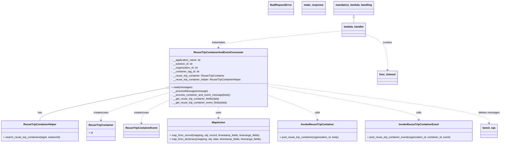

# Diagram: container_tracking_core/container_tracking_service/container_tracking_service/api/reuse_trip_container_and_event/reuse_trip_container_and_event_consumer.py


> Auto-generated by Obscura crawlers

## Diagram 1



### SVG

<svg id="container" width="3070.8125" xmlns="http://www.w3.org/2000/svg" class="classDiagram" height="892" viewBox="0 0 3070.8125 892" role="graphics-document document" aria-roledescription="class"><style>#container{font-family:"trebuchet ms",verdana,arial,sans-serif;font-size:16px;fill:#333;}@keyframes edge-animation-frame{from{stroke-dashoffset:0;}}@keyframes dash{to{stroke-dashoffset:0;}}#container .edge-animation-slow{stroke-dasharray:9,5!important;stroke-dashoffset:900;animation:dash 50s linear infinite;stroke-linecap:round;}#container .edge-animation-fast{stroke-dasharray:9,5!important;stroke-dashoffset:900;animation:dash 20s linear infinite;stroke-linecap:round;}#container .error-icon{fill:#552222;}#container .error-text{fill:#552222;stroke:#552222;}#container .edge-thickness-normal{stroke-width:1px;}#container .edge-thickness-thick{stroke-width:3.5px;}#container .edge-pattern-solid{stroke-dasharray:0;}#container .edge-thickness-invisible{stroke-width:0;fill:none;}#container .edge-pattern-dashed{stroke-dasharray:3;}#container .edge-pattern-dotted{stroke-dasharray:2;}#container .marker{fill:#333333;stroke:#333333;}#container .marker.cross{stroke:#333333;}#container svg{font-family:"trebuchet ms",verdana,arial,sans-serif;font-size:16px;}#container p{margin:0;}#container g.classGroup text{fill:#9370DB;stroke:none;font-family:"trebuchet ms",verdana,arial,sans-serif;font-size:10px;}#container g.classGroup text .title{font-weight:bolder;}#container .nodeLabel,#container .edgeLabel{color:#131300;}#container .edgeLabel .label rect{fill:#ECECFF;}#container .label text{fill:#131300;}#container .labelBkg{background:#ECECFF;}#container .edgeLabel .label span{background:#ECECFF;}#container .classTitle{font-weight:bolder;}#container .node rect,#container .node circle,#container .node ellipse,#container .node polygon,#container .node path{fill:#ECECFF;stroke:#9370DB;stroke-width:1px;}#container .divider{stroke:#9370DB;stroke-width:1;}#container g.clickable{cursor:pointer;}#container g.classGroup rect{fill:#ECECFF;stroke:#9370DB;}#container g.classGroup line{stroke:#9370DB;stroke-width:1;}#container .classLabel .box{stroke:none;stroke-width:0;fill:#ECECFF;opacity:0.5;}#container .classLabel .label{fill:#9370DB;font-size:10px;}#container .relation{stroke:#333333;stroke-width:1;fill:none;}#container .dashed-line{stroke-dasharray:3;}#container .dotted-line{stroke-dasharray:1 2;}#container #compositionStart,#container .composition{fill:#333333!important;stroke:#333333!important;stroke-width:1;}#container #compositionEnd,#container .composition{fill:#333333!important;stroke:#333333!important;stroke-width:1;}#container #dependencyStart,#container .dependency{fill:#333333!important;stroke:#333333!important;stroke-width:1;}#container #dependencyStart,#container .dependency{fill:#333333!important;stroke:#333333!important;stroke-width:1;}#container #extensionStart,#container .extension{fill:transparent!important;stroke:#333333!important;stroke-width:1;}#container #extensionEnd,#container .extension{fill:transparent!important;stroke:#333333!important;stroke-width:1;}#container #aggregationStart,#container .aggregation{fill:transparent!important;stroke:#333333!important;stroke-width:1;}#container #aggregationEnd,#container .aggregation{fill:transparent!important;stroke:#333333!important;stroke-width:1;}#container #lollipopStart,#container .lollipop{fill:#ECECFF!important;stroke:#333333!important;stroke-width:1;}#container #lollipopEnd,#container .lollipop{fill:#ECECFF!important;stroke:#333333!important;stroke-width:1;}#container .edgeTerminals{font-size:11px;line-height:initial;}#container .classTitleText{text-anchor:middle;font-size:18px;fill:#333;}#container .label-icon{display:inline-block;height:1em;overflow:visible;vertical-align:-0.125em;}#container .node .label-icon path{fill:currentColor;stroke:revert;stroke-width:revert;}#container :root{--mermaid-font-family:"trebuchet ms",verdana,arial,sans-serif;}</style><g><defs><marker id="container_class-aggregationStart" class="marker aggregation class" refX="18" refY="7" markerWidth="190" markerHeight="240" orient="auto"><path d="M 18,7 L9,13 L1,7 L9,1 Z"></path></marker></defs><defs><marker id="container_class-aggregationEnd" class="marker aggregation class" refX="1" refY="7" markerWidth="20" markerHeight="28" orient="auto"><path d="M 18,7 L9,13 L1,7 L9,1 Z"></path></marker></defs><defs><marker id="container_class-extensionStart" class="marker extension class" refX="18" refY="7" markerWidth="190" markerHeight="240" orient="auto"><path d="M 1,7 L18,13 V 1 Z"></path></marker></defs><defs><marker id="container_class-extensionEnd" class="marker extension class" refX="1" refY="7" markerWidth="20" markerHeight="28" orient="auto"><path d="M 1,1 V 13 L18,7 Z"></path></marker></defs><defs><marker id="container_class-compositionStart" class="marker composition class" refX="18" refY="7" markerWidth="190" markerHeight="240" orient="auto"><path d="M 18,7 L9,13 L1,7 L9,1 Z"></path></marker></defs><defs><marker id="container_class-compositionEnd" class="marker composition class" refX="1" refY="7" markerWidth="20" markerHeight="28" orient="auto"><path d="M 18,7 L9,13 L1,7 L9,1 Z"></path></marker></defs><defs><marker id="container_class-dependencyStart" class="marker dependency class" refX="6" refY="7" markerWidth="190" markerHeight="240" orient="auto"><path d="M 5,7 L9,13 L1,7 L9,1 Z"></path></marker></defs><defs><marker id="container_class-dependencyEnd" class="marker dependency class" refX="13" refY="7" markerWidth="20" markerHeight="28" orient="auto"><path d="M 18,7 L9,13 L14,7 L9,1 Z"></path></marker></defs><defs><marker id="container_class-lollipopStart" class="marker lollipop class" refX="13" refY="7" markerWidth="190" markerHeight="240" orient="auto"><circle stroke="black" fill="transparent" cx="7" cy="7" r="6"></circle></marker></defs><defs><marker id="container_class-lollipopEnd" class="marker lollipop class" refX="1" refY="7" markerWidth="190" markerHeight="240" orient="auto"><circle stroke="black" fill="transparent" cx="7" cy="7" r="6"></circle></marker></defs><g class="root"><g class="clusters"></g><g class="edgePaths"><path d="M1013.137,543.274L885.247,568.895C757.357,594.516,501.577,645.758,373.687,679.546C245.797,713.333,245.797,729.667,245.797,737.833L245.797,746" id="id_ReuseTripContainerAndEventConsumer_ReuseTripContainerHelper_1" class="edge-thickness-normal edge-pattern-solid relation" style=";;;" data-edge="true" data-et="edge" data-id="id_ReuseTripContainerAndEventConsumer_ReuseTripContainerHelper_1" data-points="W3sieCI6MTAzMC4wNTA3ODEyNSwieSI6NTM5Ljg4NTA2MDIwNzA3MzR9LHsieCI6MjQ1Ljc5Njg3NSwieSI6Njk3fSx7IngiOjI0NS43OTY4NzUsInkiOjc0Nn1d" marker-start="url(#container_class-aggregationStart)"></path><path d="M1030.051,571.186L961.311,592.155C892.57,613.124,755.09,655.062,686.35,683.698C617.609,712.333,617.609,727.667,617.609,735.333L617.609,743" id="id_ReuseTripContainerAndEventConsumer_ReuseTripContainer_2" class="edge-thickness-normal edge-pattern-dashed relation" style=";;;" data-edge="true" data-et="edge" data-id="id_ReuseTripContainerAndEventConsumer_ReuseTripContainer_2" data-points="W3sieCI6MTAzMC4wNTA3ODEyNSwieSI6NTcxLjE4NTU0MjcyNDQxMjJ9LHsieCI6NjE3LjYwOTM3NSwieSI6Njk3fSx7IngiOjYxNy42MDkzNzUsInkiOjc0OX1d" marker-end="url(#container_class-dependencyEnd)"></path><path d="M1030.051,617.1L1001.016,630.417C971.982,643.733,913.913,670.367,884.878,694.35C855.844,718.333,855.844,739.667,855.844,750.333L855.844,761" id="id_ReuseTripContainerAndEventConsumer_ReuseTripContainerEvent_3" class="edge-thickness-normal edge-pattern-dashed relation" style=";;;" data-edge="true" data-et="edge" data-id="id_ReuseTripContainerAndEventConsumer_ReuseTripContainerEvent_3" data-points="W3sieCI6MTAzMC4wNTA3ODEyNSwieSI6NjE3LjEwMDE1NjA0MjMwNDh9LHsieCI6ODU1Ljg0Mzc1LCJ5Ijo2OTd9LHsieCI6ODU1Ljg0Mzc1LCJ5Ijo3Njd9XQ==" marker-end="url(#container_class-dependencyEnd)"></path><path d="M1328.973,660L1328.973,666.167C1328.973,672.333,1328.973,684.667,1328.973,696C1328.973,707.333,1328.973,717.667,1328.973,722.833L1328.973,728" id="id_ReuseTripContainerAndEventConsumer_MapAction_4" class="edge-thickness-normal edge-pattern-dashed relation" style=";;;" data-edge="true" data-et="edge" data-id="id_ReuseTripContainerAndEventConsumer_MapAction_4" data-points="W3sieCI6MTMyOC45NzI2NTYyNSwieSI6NjYwfSx7IngiOjEzMjguOTcyNjU2MjUsInkiOjY5N30seyJ4IjoxMzI4Ljk3MjY1NjI1LCJ5Ijo3MzR9XQ==" marker-end="url(#container_class-dependencyEnd)"></path><path d="M1627.895,585.579L1680.471,604.149C1733.048,622.719,1838.202,659.86,1890.779,685.597C1943.355,711.333,1943.355,725.667,1943.355,732.833L1943.355,740" id="id_ReuseTripContainerAndEventConsumer_InvokeReuseTripContainer_5" class="edge-thickness-normal edge-pattern-dashed relation" style=";;;" data-edge="true" data-et="edge" data-id="id_ReuseTripContainerAndEventConsumer_InvokeReuseTripContainer_5" data-points="W3sieCI6MTYyNy44OTQ1MzEyNSwieSI6NTg1LjU3OTIwMTY4ODY4NjZ9LHsieCI6MTk0My4zNTU0Njg3NSwieSI6Njk3fSx7IngiOjE5NDMuMzU1NDY4NzUsInkiOjc0Nn1d" marker-end="url(#container_class-dependencyEnd)"></path><path d="M1627.895,532.303L1784.772,559.753C1941.65,587.202,2255.405,642.101,2412.283,676.717C2569.16,711.333,2569.16,725.667,2569.16,732.833L2569.16,740" id="id_ReuseTripContainerAndEventConsumer_InvokeReuseTripContainerEvent_6" class="edge-thickness-normal edge-pattern-dashed relation" style=";;;" data-edge="true" data-et="edge" data-id="id_ReuseTripContainerAndEventConsumer_InvokeReuseTripContainerEvent_6" data-points="W3sieCI6MTYyNy44OTQ1MzEyNSwieSI6NTMyLjMwMzQxOTM0MTgzMzR9LHsieCI6MjU2OS4xNjAxNTYyNSwieSI6Njk3fSx7IngiOjI1NjkuMTYwMTU2MjUsInkiOjc0Nn1d" marker-end="url(#container_class-dependencyEnd)"></path><path d="M1627.895,518.839L1856.426,548.533C2084.958,578.226,2542.022,637.613,2770.554,677.973C2999.086,718.333,2999.086,739.667,2999.086,750.333L2999.086,761" id="id_ReuseTripContainerAndEventConsumer_boto3_sqs_7" class="edge-thickness-normal edge-pattern-dashed relation" style=";;;" data-edge="true" data-et="edge" data-id="id_ReuseTripContainerAndEventConsumer_boto3_sqs_7" data-points="W3sieCI6MTYyNy44OTQ1MzEyNSwieSI6NTE4LjgzOTMwOTY0NjM3OTd9LHsieCI6Mjk5OS4wODU5Mzc1LCJ5Ijo2OTd9LHsieCI6Mjk5OS4wODU5Mzc1LCJ5Ijo3Njd9XQ==" marker-end="url(#container_class-dependencyEnd)"></path><path d="M2092.053,190.809L1964.873,202.841C1837.693,214.873,1583.333,238.936,1456.153,256.135C1328.973,273.333,1328.973,283.667,1328.973,288.833L1328.973,294" id="id_lambda_handler_ReuseTripContainerAndEventConsumer_8" class="edge-thickness-normal edge-pattern-dashed relation" style=";;;" data-edge="true" data-et="edge" data-id="id_lambda_handler_ReuseTripContainerAndEventConsumer_8" data-points="W3sieCI6MjA5Mi4wNTI3MzQzNzUsInkiOjE5MC44MDkyOTY3MTIxODk3fSx7IngiOjEzMjguOTcyNjU2MjUsInkiOjI2M30seyJ4IjoxMzI4Ljk3MjY1NjI1LCJ5IjozMDB9XQ==" marker-end="url(#container_class-dependencyEnd)"></path><path d="M2236.006,211.761L2258.148,220.3C2280.29,228.84,2324.574,245.92,2346.715,282.627C2368.857,319.333,2368.857,375.667,2368.857,403.833L2368.857,432" id="id_lambda_handler_func_timeout_9" class="edge-thickness-normal edge-pattern-dashed relation" style=";;;" data-edge="true" data-et="edge" data-id="id_lambda_handler_func_timeout_9" data-points="W3sieCI6MjIzNi4wMDU4NTkzNzUsInkiOjIxMS43NjA1ODQzMzEzNzUzOH0seyJ4IjoyMzY4Ljg1NzQyMTg3NSwieSI6MjYzfSx7IngiOjIzNjguODU3NDIxODc1LCJ5Ijo0Mzh9XQ==" marker-end="url(#container_class-dependencyEnd)"></path><path d="M2164.029,109.25L2164.029,110.542C2164.029,111.833,2164.029,114.417,2164.029,119.875C2164.029,125.333,2164.029,133.667,2164.029,137.833L2164.029,142" id="id_mandatory_lambda_handling_lambda_handler_10" class="edge-thickness-normal edge-pattern-solid relation" style=";;;" data-edge="true" data-et="edge" data-id="id_mandatory_lambda_handling_lambda_handler_10" data-points="W3sieCI6MjE2NC4wMjkyOTY4NzUsInkiOjkyfSx7IngiOjIxNjQuMDI5Mjk2ODc1LCJ5IjoxMTd9LHsieCI6MjE2NC4wMjkyOTY4NzUsInkiOjE0Mn1d" marker-start="url(#container_class-extensionStart)"></path></g><g class="edgeLabels"><g class="edgeLabel" transform="translate(245.796875, 697)"><g class="label" data-id="id_ReuseTripContainerAndEventConsumer_ReuseTripContainerHelper_1" transform="translate(-12.703125, -12)"><foreignObject width="25.40625" height="24"><div xmlns="http://www.w3.org/1999/xhtml" class="labelBkg" style="display: table-cell; white-space: nowrap; line-height: 1.5; max-width: 200px; text-align: center;"><span class="edgeLabel"><p>has</p></span></div></foreignObject></g></g><g class="edgeLabel" transform="translate(617.609375, 697)"><g class="label" data-id="id_ReuseTripContainerAndEventConsumer_ReuseTripContainer_2" transform="translate(-46.578125, -12)"><foreignObject width="93.15625" height="24"><div xmlns="http://www.w3.org/1999/xhtml" class="labelBkg" style="display: table-cell; white-space: nowrap; line-height: 1.5; max-width: 200px; text-align: center;"><span class="edgeLabel"><p>creates/uses</p></span></div></foreignObject></g></g><g class="edgeLabel" transform="translate(855.84375, 697)"><g class="label" data-id="id_ReuseTripContainerAndEventConsumer_ReuseTripContainerEvent_3" transform="translate(-46.578125, -12)"><foreignObject width="93.15625" height="24"><div xmlns="http://www.w3.org/1999/xhtml" class="labelBkg" style="display: table-cell; white-space: nowrap; line-height: 1.5; max-width: 200px; text-align: center;"><span class="edgeLabel"><p>creates/uses</p></span></div></foreignObject></g></g><g class="edgeLabel" transform="translate(1328.97265625, 697)"><g class="label" data-id="id_ReuseTripContainerAndEventConsumer_MapAction_4" transform="translate(-16.4921875, -12)"><foreignObject width="32.984375" height="24"><div xmlns="http://www.w3.org/1999/xhtml" class="labelBkg" style="display: table-cell; white-space: nowrap; line-height: 1.5; max-width: 200px; text-align: center;"><span class="edgeLabel"><p>uses</p></span></div></foreignObject></g></g><g class="edgeLabel" transform="translate(1943.35546875, 697)"><g class="label" data-id="id_ReuseTripContainerAndEventConsumer_InvokeReuseTripContainer_5" transform="translate(-16.4453125, -12)"><foreignObject width="32.890625" height="24"><div xmlns="http://www.w3.org/1999/xhtml" class="labelBkg" style="display: table-cell; white-space: nowrap; line-height: 1.5; max-width: 200px; text-align: center;"><span class="edgeLabel"><p>calls</p></span></div></foreignObject></g></g><g class="edgeLabel" transform="translate(2569.16015625, 697)"><g class="label" data-id="id_ReuseTripContainerAndEventConsumer_InvokeReuseTripContainerEvent_6" transform="translate(-16.4453125, -12)"><foreignObject width="32.890625" height="24"><div xmlns="http://www.w3.org/1999/xhtml" class="labelBkg" style="display: table-cell; white-space: nowrap; line-height: 1.5; max-width: 200px; text-align: center;"><span class="edgeLabel"><p>calls</p></span></div></foreignObject></g></g><g class="edgeLabel" transform="translate(2999.0859375, 697)"><g class="label" data-id="id_ReuseTripContainerAndEventConsumer_boto3_sqs_7" transform="translate(-63.7265625, -12)"><foreignObject width="127.453125" height="24"><div xmlns="http://www.w3.org/1999/xhtml" class="labelBkg" style="display: table-cell; white-space: nowrap; line-height: 1.5; max-width: 200px; text-align: center;"><span class="edgeLabel"><p>deletes messages</p></span></div></foreignObject></g></g><g class="edgeLabel" transform="translate(1328.97265625, 263)"><g class="label" data-id="id_lambda_handler_ReuseTripContainerAndEventConsumer_8" transform="translate(-42.9140625, -12)"><foreignObject width="85.828125" height="24"><div xmlns="http://www.w3.org/1999/xhtml" class="labelBkg" style="display: table-cell; white-space: nowrap; line-height: 1.5; max-width: 200px; text-align: center;"><span class="edgeLabel"><p>instantiates</p></span></div></foreignObject></g></g><g class="edgeLabel" transform="translate(2368.857421875, 263)"><g class="label" data-id="id_lambda_handler_func_timeout_9" transform="translate(-27.5859375, -12)"><foreignObject width="55.171875" height="24"><div xmlns="http://www.w3.org/1999/xhtml" class="labelBkg" style="display: table-cell; white-space: nowrap; line-height: 1.5; max-width: 200px; text-align: center;"><span class="edgeLabel"><p>invokes</p></span></div></foreignObject></g></g><g class="edgeLabel"><g class="label" data-id="id_mandatory_lambda_handling_lambda_handler_10" transform="translate(0, 0)"><foreignObject width="0" height="0"><div xmlns="http://www.w3.org/1999/xhtml" class="labelBkg" style="display: table-cell; white-space: nowrap; line-height: 1.5; max-width: 200px; text-align: center;"><span class="edgeLabel"></span></div></foreignObject></g></g></g><g class="nodes"><g class="node default" id="classId-ReuseTripContainerAndEventConsumer-0" transform="translate(1328.97265625, 480)"><g class="basic label-container"><path d="M-298.921875 -180 L298.921875 -180 L298.921875 180 L-298.921875 180" stroke="none" stroke-width="0" fill="#ECECFF" style=""></path><path d="M-298.921875 -180 C-68.20121935281432 -180, 162.51943629437136 -180, 298.921875 -180 M-298.921875 -180 C-82.22833617957218 -180, 134.46520264085564 -180, 298.921875 -180 M298.921875 -180 C298.921875 -105.94696878891804, 298.921875 -31.893937577836084, 298.921875 180 M298.921875 -180 C298.921875 -65.5933940324749, 298.921875 48.81321193505019, 298.921875 180 M298.921875 180 C122.8906849454722 180, -53.140505109055596 180, -298.921875 180 M298.921875 180 C64.04455820288251 180, -170.83275859423497 180, -298.921875 180 M-298.921875 180 C-298.921875 95.15994682998813, -298.921875 10.319893659976259, -298.921875 -180 M-298.921875 180 C-298.921875 66.3453142004068, -298.921875 -47.30937159918639, -298.921875 -180" stroke="#9370DB" stroke-width="1.3" fill="none" stroke-dasharray="0 0" style=""></path></g><g class="annotation-group text" transform="translate(0, -156)"></g><g class="label-group text" transform="translate(-142.90625, -156)"><g class="label" style="font-weight: bolder" transform="translate(0,-12)"><foreignObject width="285.8125" height="24"><div xmlns="http://www.w3.org/1999/xhtml" style="display: table-cell; white-space: nowrap; line-height: 1.5; max-width: 334px; text-align: center;"><span class="nodeLabel markdown-node-label" style=""><p>ReuseTripContainerAndEventConsumer</p></span></div></foreignObject></g></g><g class="members-group text" transform="translate(-286.921875, -108)"><g class="label" style="" transform="translate(0,-12)"><foreignObject width="185.296875" height="24"><div xmlns="http://www.w3.org/1999/xhtml" style="display: table-cell; white-space: nowrap; line-height: 1.5; max-width: 243px; text-align: center;"><span class="nodeLabel markdown-node-label" style=""><p>- __application_name: str</p></span></div></foreignObject></g><g class="label" style="" transform="translate(0,12)"><foreignObject width="136.90625" height="24"><div xmlns="http://www.w3.org/1999/xhtml" style="display: table-cell; white-space: nowrap; line-height: 1.5; max-width: 195px; text-align: center;"><span class="nodeLabel markdown-node-label" style=""><p>- __solution_id: str</p></span></div></foreignObject></g><g class="label" style="" transform="translate(0,36)"><foreignObject width="167.109375" height="24"><div xmlns="http://www.w3.org/1999/xhtml" style="display: table-cell; white-space: nowrap; line-height: 1.5; max-width: 225px; text-align: center;"><span class="nodeLabel markdown-node-label" style=""><p>- __organization_id: str</p></span></div></foreignObject></g><g class="label" style="" transform="translate(0,60)"><foreignObject width="175.265625" height="24"><div xmlns="http://www.w3.org/1999/xhtml" style="display: table-cell; white-space: nowrap; line-height: 1.5; max-width: 233px; text-align: center;"><span class="nodeLabel markdown-node-label" style=""><p>- __container_tag_id: str</p></span></div></foreignObject></g><g class="label" style="" transform="translate(0,84)"><foreignObject width="328.03125" height="24"><div xmlns="http://www.w3.org/1999/xhtml" style="display: table-cell; white-space: nowrap; line-height: 1.5; max-width: 386px; text-align: center;"><span class="nodeLabel markdown-node-label" style=""><p>- __reuse_trip_container: ReuseTripContainer</p></span></div></foreignObject></g><g class="label" style="" transform="translate(0,108)"><foreignObject width="430.9375" height="24"><div xmlns="http://www.w3.org/1999/xhtml" style="display: table-cell; white-space: nowrap; line-height: 1.5; max-width: 489px; text-align: center;"><span class="nodeLabel markdown-node-label" style=""><p>- __reuse_trip_container_helper: ReuseTripContainerHelper</p></span></div></foreignObject></g></g><g class="methods-group text" transform="translate(-286.921875, 60)"><g class="label" style="" transform="translate(0,-12)"><foreignObject width="124.984375" height="24"><div xmlns="http://www.w3.org/1999/xhtml" style="display: table-cell; white-space: nowrap; line-height: 1.5; max-width: 182px; text-align: center;"><span class="nodeLabel markdown-node-label" style=""><p>+ read(messages)</p></span></div></foreignObject></g><g class="label" style="" transform="translate(0,12)"><foreignObject width="216.421875" height="24"><div xmlns="http://www.w3.org/1999/xhtml" style="display: table-cell; white-space: nowrap; line-height: 1.5; max-width: 274px; text-align: center;"><span class="nodeLabel markdown-node-label" style=""><p>- __processMessage(message)</p></span></div></foreignObject></g><g class="label" style="" transform="translate(0,36)"><foreignObject width="359.5" height="24"><div xmlns="http://www.w3.org/1999/xhtml" style="display: table-cell; white-space: nowrap; line-height: 1.5; max-width: 417px; text-align: center;"><span class="nodeLabel markdown-node-label" style=""><p>- __process_container_and_event_message(body)</p></span></div></foreignObject></g><g class="label" style="" transform="translate(0,60)"><foreignObject width="297.9375" height="24"><div xmlns="http://www.w3.org/1999/xhtml" style="display: table-cell; white-space: nowrap; line-height: 1.5; max-width: 355px; text-align: center;"><span class="nodeLabel markdown-node-label" style=""><p>- __get_reuse_trip_container_fields(data)</p></span></div></foreignObject></g><g class="label" style="" transform="translate(0,84)"><foreignObject width="346.28125" height="24"><div xmlns="http://www.w3.org/1999/xhtml" style="display: table-cell; white-space: nowrap; line-height: 1.5; max-width: 404px; text-align: center;"><span class="nodeLabel markdown-node-label" style=""><p>- __get_reuse_trip_container_event_fields(data)</p></span></div></foreignObject></g></g><g class="divider" style=""><path d="M-298.921875 -132 C-132.43673621337604 -132, 34.04840257324793 -132, 298.921875 -132 M-298.921875 -132 C-126.8631667557618 -132, 45.19554148847641 -132, 298.921875 -132" stroke="#9370DB" stroke-width="1.3" fill="none" stroke-dasharray="0 0" style=""></path></g><g class="divider" style=""><path d="M-298.921875 36 C-106.44338749121033 36, 86.03510001757934 36, 298.921875 36 M-298.921875 36 C-76.7338613373309 36, 145.4541523253382 36, 298.921875 36" stroke="#9370DB" stroke-width="1.3" fill="none" stroke-dasharray="0 0" style=""></path></g></g><g class="node default" id="classId-ReuseTripContainer-1" transform="translate(617.609375, 809)"><g class="basic label-container"><path d="M-84.015625 -60 L84.015625 -60 L84.015625 60 L-84.015625 60" stroke="none" stroke-width="0" fill="#ECECFF" style=""></path><path d="M-84.015625 -60 C-19.381410967444552 -60, 45.252803065110896 -60, 84.015625 -60 M-84.015625 -60 C-19.379004950255435 -60, 45.25761509948913 -60, 84.015625 -60 M84.015625 -60 C84.015625 -34.50869537563955, 84.015625 -9.017390751279095, 84.015625 60 M84.015625 -60 C84.015625 -21.208713315918132, 84.015625 17.582573368163736, 84.015625 60 M84.015625 60 C46.31374753493416 60, 8.611870069868317 60, -84.015625 60 M84.015625 60 C41.19931167128334 60, -1.6170016574333204 60, -84.015625 60 M-84.015625 60 C-84.015625 26.259451273968097, -84.015625 -7.481097452063807, -84.015625 -60 M-84.015625 60 C-84.015625 35.61849073054256, -84.015625 11.236981461085122, -84.015625 -60" stroke="#9370DB" stroke-width="1.3" fill="none" stroke-dasharray="0 0" style=""></path></g><g class="annotation-group text" transform="translate(0, -36)"></g><g class="label-group text" transform="translate(-72.015625, -36)"><g class="label" style="font-weight: bolder" transform="translate(0,-12)"><foreignObject width="144.03125" height="24"><div xmlns="http://www.w3.org/1999/xhtml" style="display: table-cell; white-space: nowrap; line-height: 1.5; max-width: 193px; text-align: center;"><span class="nodeLabel markdown-node-label" style=""><p>ReuseTripContainer</p></span></div></foreignObject></g></g><g class="members-group text" transform="translate(-72.015625, 12)"><g class="label" style="" transform="translate(0,-12)"><foreignObject width="26.3125" height="24"><div xmlns="http://www.w3.org/1999/xhtml" style="display: table-cell; white-space: nowrap; line-height: 1.5; max-width: 84px; text-align: center;"><span class="nodeLabel markdown-node-label" style=""><p>+ id</p></span></div></foreignObject></g></g><g class="methods-group text" transform="translate(-72.015625, 60)"></g><g class="divider" style=""><path d="M-84.015625 -12 C-38.481585339186864 -12, 7.052454321626271 -12, 84.015625 -12 M-84.015625 -12 C-38.725709090434236 -12, 6.5642068191315275 -12, 84.015625 -12" stroke="#9370DB" stroke-width="1.3" fill="none" stroke-dasharray="0 0" style=""></path></g><g class="divider" style=""><path d="M-84.015625 36 C-47.128530651302626 36, -10.241436302605251 36, 84.015625 36 M-84.015625 36 C-48.152428827666164 36, -12.289232655332327 36, 84.015625 36" stroke="#9370DB" stroke-width="1.3" fill="none" stroke-dasharray="0 0" style=""></path></g></g><g class="node default" id="classId-ReuseTripContainerEvent-2" transform="translate(855.84375, 809)"><g class="basic label-container"><path d="M-104.21875 -42 L104.21875 -42 L104.21875 42 L-104.21875 42" stroke="none" stroke-width="0" fill="#ECECFF" style=""></path><path d="M-104.21875 -42 C-37.141519676879966 -42, 29.935710646240068 -42, 104.21875 -42 M-104.21875 -42 C-45.239046717700326 -42, 13.740656564599348 -42, 104.21875 -42 M104.21875 -42 C104.21875 -24.934375106051615, 104.21875 -7.86875021210323, 104.21875 42 M104.21875 -42 C104.21875 -10.005220379272327, 104.21875 21.989559241455346, 104.21875 42 M104.21875 42 C33.05105015936928 42, -38.116649681261435 42, -104.21875 42 M104.21875 42 C28.53245671834253 42, -47.15383656331494 42, -104.21875 42 M-104.21875 42 C-104.21875 10.76324467075095, -104.21875 -20.4735106584981, -104.21875 -42 M-104.21875 42 C-104.21875 9.452328194710368, -104.21875 -23.095343610579263, -104.21875 -42" stroke="#9370DB" stroke-width="1.3" fill="none" stroke-dasharray="0 0" style=""></path></g><g class="annotation-group text" transform="translate(0, -18)"></g><g class="label-group text" transform="translate(-92.21875, -18)"><g class="label" style="font-weight: bolder" transform="translate(0,-12)"><foreignObject width="184.4375" height="24"><div xmlns="http://www.w3.org/1999/xhtml" style="display: table-cell; white-space: nowrap; line-height: 1.5; max-width: 232px; text-align: center;"><span class="nodeLabel markdown-node-label" style=""><p>ReuseTripContainerEvent</p></span></div></foreignObject></g></g><g class="members-group text" transform="translate(-92.21875, 30)"></g><g class="methods-group text" transform="translate(-92.21875, 60)"></g><g class="divider" style=""><path d="M-104.21875 6 C-40.426327846379586 6, 23.36609430724083 6, 104.21875 6 M-104.21875 6 C-27.10225946602459 6, 50.01423106795082 6, 104.21875 6" stroke="#9370DB" stroke-width="1.3" fill="none" stroke-dasharray="0 0" style=""></path></g><g class="divider" style=""><path d="M-104.21875 24 C-21.619876355234496 24, 60.97899728953101 24, 104.21875 24 M-104.21875 24 C-26.920162074105576 24, 50.37842585178885 24, 104.21875 24" stroke="#9370DB" stroke-width="1.3" fill="none" stroke-dasharray="0 0" style=""></path></g></g><g class="node default" id="classId-ReuseTripContainerHelper-3" transform="translate(245.796875, 809)"><g class="basic label-container"><path d="M-237.796875 -63 L237.796875 -63 L237.796875 63 L-237.796875 63" stroke="none" stroke-width="0" fill="#ECECFF" style=""></path><path d="M-237.796875 -63 C-141.1764538937192 -63, -44.556032787438426 -63, 237.796875 -63 M-237.796875 -63 C-142.5244735166932 -63, -47.25207203338644 -63, 237.796875 -63 M237.796875 -63 C237.796875 -22.64891112118449, 237.796875 17.70217775763102, 237.796875 63 M237.796875 -63 C237.796875 -34.92781503555189, 237.796875 -6.855630071103775, 237.796875 63 M237.796875 63 C133.6987488087247 63, 29.600622617449375 63, -237.796875 63 M237.796875 63 C96.39471240613778 63, -45.00745018772443 63, -237.796875 63 M-237.796875 63 C-237.796875 34.229948358967796, -237.796875 5.459896717935592, -237.796875 -63 M-237.796875 63 C-237.796875 14.181210570338592, -237.796875 -34.637578859322815, -237.796875 -63" stroke="#9370DB" stroke-width="1.3" fill="none" stroke-dasharray="0 0" style=""></path></g><g class="annotation-group text" transform="translate(0, -39)"></g><g class="label-group text" transform="translate(-96.53125, -39)"><g class="label" style="font-weight: bolder" transform="translate(0,-12)"><foreignObject width="193.0625" height="24"><div xmlns="http://www.w3.org/1999/xhtml" style="display: table-cell; white-space: nowrap; line-height: 1.5; max-width: 242px; text-align: center;"><span class="nodeLabel markdown-node-label" style=""><p>ReuseTripContainerHelper</p></span></div></foreignObject></g></g><g class="members-group text" transform="translate(-225.796875, 9)"></g><g class="methods-group text" transform="translate(-225.796875, 39)"><g class="label" style="" transform="translate(0,-12)"><foreignObject width="355.0625" height="24"><div xmlns="http://www.w3.org/1999/xhtml" style="display: table-cell; white-space: nowrap; line-height: 1.5; max-width: 412px; text-align: center;"><span class="nodeLabel markdown-node-label" style=""><p>+ search_reuse_trip_containers(tagId, solutionId)</p></span></div></foreignObject></g></g><g class="divider" style=""><path d="M-237.796875 -15 C-106.0446484389974 -15, 25.707578122005202 -15, 237.796875 -15 M-237.796875 -15 C-59.3794097301201 -15, 119.0380555397598 -15, 237.796875 -15" stroke="#9370DB" stroke-width="1.3" fill="none" stroke-dasharray="0 0" style=""></path></g><g class="divider" style=""><path d="M-237.796875 9 C-121.88066672948011 9, -5.964458458960223 9, 237.796875 9 M-237.796875 9 C-115.51603584295543 9, 6.764803314089136 9, 237.796875 9" stroke="#9370DB" stroke-width="1.3" fill="none" stroke-dasharray="0 0" style=""></path></g></g><g class="node default" id="classId-InvokeReuseTripContainer-4" transform="translate(1943.35546875, 809)"><g class="basic label-container"><path d="M-245.47265625 -63 L245.47265625 -63 L245.47265625 63 L-245.47265625 63" stroke="none" stroke-width="0" fill="#ECECFF" style=""></path><path d="M-245.47265625 -63 C-131.5135660636479 -63, -17.5544758772958 -63, 245.47265625 -63 M-245.47265625 -63 C-119.67791575534567 -63, 6.116824739308669 -63, 245.47265625 -63 M245.47265625 -63 C245.47265625 -28.06514272612732, 245.47265625 6.86971454774536, 245.47265625 63 M245.47265625 -63 C245.47265625 -33.00912401587068, 245.47265625 -3.018248031741358, 245.47265625 63 M245.47265625 63 C138.20412737808533 63, 30.935598506170635 63, -245.47265625 63 M245.47265625 63 C56.56580416407968 63, -132.34104792184064 63, -245.47265625 63 M-245.47265625 63 C-245.47265625 15.351383572023991, -245.47265625 -32.29723285595202, -245.47265625 -63 M-245.47265625 63 C-245.47265625 16.20233767693987, -245.47265625 -30.59532464612026, -245.47265625 -63" stroke="#9370DB" stroke-width="1.3" fill="none" stroke-dasharray="0 0" style=""></path></g><g class="annotation-group text" transform="translate(0, -39)"></g><g class="label-group text" transform="translate(-96.3671875, -39)"><g class="label" style="font-weight: bolder" transform="translate(0,-12)"><foreignObject width="192.734375" height="24"><div xmlns="http://www.w3.org/1999/xhtml" style="display: table-cell; white-space: nowrap; line-height: 1.5; max-width: 241px; text-align: center;"><span class="nodeLabel markdown-node-label" style=""><p>InvokeReuseTripContainer</p></span></div></foreignObject></g></g><g class="members-group text" transform="translate(-233.47265625, 9)"></g><g class="methods-group text" transform="translate(-233.47265625, 39)"><g class="label" style="" transform="translate(0,-12)"><foreignObject width="370.578125" height="24"><div xmlns="http://www.w3.org/1999/xhtml" style="display: table-cell; white-space: nowrap; line-height: 1.5; max-width: 428px; text-align: center;"><span class="nodeLabel markdown-node-label" style=""><p>+ post_reuse_trip_container(organization_id, body)</p></span></div></foreignObject></g></g><g class="divider" style=""><path d="M-245.47265625 -15 C-134.57048890450557 -15, -23.668321559011105 -15, 245.47265625 -15 M-245.47265625 -15 C-124.48710616699861 -15, -3.5015560839972295 -15, 245.47265625 -15" stroke="#9370DB" stroke-width="1.3" fill="none" stroke-dasharray="0 0" style=""></path></g><g class="divider" style=""><path d="M-245.47265625 9 C-126.74311570864283 9, -8.013575167285666 9, 245.47265625 9 M-245.47265625 9 C-138.86679503363112 9, -32.26093381726224 9, 245.47265625 9" stroke="#9370DB" stroke-width="1.3" fill="none" stroke-dasharray="0 0" style=""></path></g></g><g class="node default" id="classId-InvokeReuseTripContainerEvent-5" transform="translate(2569.16015625, 809)"><g class="basic label-container"><path d="M-330.33203125 -63 L330.33203125 -63 L330.33203125 63 L-330.33203125 63" stroke="none" stroke-width="0" fill="#ECECFF" style=""></path><path d="M-330.33203125 -63 C-173.37824870734497 -63, -16.42446616468993 -63, 330.33203125 -63 M-330.33203125 -63 C-102.21964504239591 -63, 125.89274116520818 -63, 330.33203125 -63 M330.33203125 -63 C330.33203125 -22.718655006432513, 330.33203125 17.562689987134974, 330.33203125 63 M330.33203125 -63 C330.33203125 -19.88696029712513, 330.33203125 23.226079405749744, 330.33203125 63 M330.33203125 63 C143.2232396400208 63, -43.885551969958385 63, -330.33203125 63 M330.33203125 63 C183.14348955553015 63, 35.954947861060305 63, -330.33203125 63 M-330.33203125 63 C-330.33203125 36.15660541196328, -330.33203125 9.313210823926553, -330.33203125 -63 M-330.33203125 63 C-330.33203125 17.701554950282002, -330.33203125 -27.596890099435996, -330.33203125 -63" stroke="#9370DB" stroke-width="1.3" fill="none" stroke-dasharray="0 0" style=""></path></g><g class="annotation-group text" transform="translate(0, -39)"></g><g class="label-group text" transform="translate(-116.5703125, -39)"><g class="label" style="font-weight: bolder" transform="translate(0,-12)"><foreignObject width="233.140625" height="24"><div xmlns="http://www.w3.org/1999/xhtml" style="display: table-cell; white-space: nowrap; line-height: 1.5; max-width: 280px; text-align: center;"><span class="nodeLabel markdown-node-label" style=""><p>InvokeReuseTripContainerEvent</p></span></div></foreignObject></g></g><g class="members-group text" transform="translate(-318.33203125, 9)"></g><g class="methods-group text" transform="translate(-318.33203125, 39)"><g class="label" style="" transform="translate(0,-12)"><foreignObject width="520.09375" height="24"><div xmlns="http://www.w3.org/1999/xhtml" style="display: table-cell; white-space: nowrap; line-height: 1.5; max-width: 577px; text-align: center;"><span class="nodeLabel markdown-node-label" style=""><p>+ post_reuse_trip_container_event(organization_id, container_id, event)</p></span></div></foreignObject></g></g><g class="divider" style=""><path d="M-330.33203125 -15 C-101.13020376249926 -15, 128.07162372500147 -15, 330.33203125 -15 M-330.33203125 -15 C-73.0148428661359 -15, 184.3023455177282 -15, 330.33203125 -15" stroke="#9370DB" stroke-width="1.3" fill="none" stroke-dasharray="0 0" style=""></path></g><g class="divider" style=""><path d="M-330.33203125 9 C-138.88246258577195 9, 52.567106078456106 9, 330.33203125 9 M-330.33203125 9 C-90.41116928513321 9, 149.50969267973358 9, 330.33203125 9" stroke="#9370DB" stroke-width="1.3" fill="none" stroke-dasharray="0 0" style=""></path></g></g><g class="node default" id="classId-MapAction-6" transform="translate(1328.97265625, 809)"><g class="basic label-container"><path d="M-318.91015625 -75 L318.91015625 -75 L318.91015625 75 L-318.91015625 75" stroke="none" stroke-width="0" fill="#ECECFF" style=""></path><path d="M-318.91015625 -75 C-68.17818145813183 -75, 182.55379333373634 -75, 318.91015625 -75 M-318.91015625 -75 C-124.85186462112989 -75, 69.20642700774022 -75, 318.91015625 -75 M318.91015625 -75 C318.91015625 -31.407448349414835, 318.91015625 12.18510330117033, 318.91015625 75 M318.91015625 -75 C318.91015625 -31.118705875511033, 318.91015625 12.762588248977934, 318.91015625 75 M318.91015625 75 C111.73152181212598 75, -95.44711262574805 75, -318.91015625 75 M318.91015625 75 C91.86132105050899 75, -135.18751414898202 75, -318.91015625 75 M-318.91015625 75 C-318.91015625 31.05990406336317, -318.91015625 -12.88019187327366, -318.91015625 -75 M-318.91015625 75 C-318.91015625 20.62759693116277, -318.91015625 -33.74480613767446, -318.91015625 -75" stroke="#9370DB" stroke-width="1.3" fill="none" stroke-dasharray="0 0" style=""></path></g><g class="annotation-group text" transform="translate(0, -51)"></g><g class="label-group text" transform="translate(-38.6328125, -51)"><g class="label" style="font-weight: bolder" transform="translate(0,-12)"><foreignObject width="77.265625" height="24"><div xmlns="http://www.w3.org/1999/xhtml" style="display: table-cell; white-space: nowrap; line-height: 1.5; max-width: 126px; text-align: center;"><span class="nodeLabel markdown-node-label" style=""><p>MapAction</p></span></div></foreignObject></g></g><g class="members-group text" transform="translate(-306.91015625, -3)"></g><g class="methods-group text" transform="translate(-306.91015625, 27)"><g class="label" style="" transform="translate(0,-12)"><foreignObject width="562.09375" height="24"><div xmlns="http://www.w3.org/1999/xhtml" style="display: table-cell; white-space: nowrap; line-height: 1.5; max-width: 619px; text-align: center;"><span class="nodeLabel markdown-node-label" style=""><p>+ map_from_record(mapping, obj, record, timestamp_fields, timerange_fields)</p></span></div></foreignObject></g><g class="label" style="" transform="translate(0,12)"><foreignObject width="575.1875" height="24"><div xmlns="http://www.w3.org/1999/xhtml" style="display: table-cell; white-space: nowrap; line-height: 1.5; max-width: 633px; text-align: center;"><span class="nodeLabel markdown-node-label" style=""><p>+ map_from_dictionary(mapping, obj, data, timestamp_fields, timerange_fields)</p></span></div></foreignObject></g></g><g class="divider" style=""><path d="M-318.91015625 -27 C-128.65069657629343 -27, 61.608763097413146 -27, 318.91015625 -27 M-318.91015625 -27 C-179.31006557352958 -27, -39.70997489705917 -27, 318.91015625 -27" stroke="#9370DB" stroke-width="1.3" fill="none" stroke-dasharray="0 0" style=""></path></g><g class="divider" style=""><path d="M-318.91015625 -3 C-106.44126673656223 -3, 106.02762277687555 -3, 318.91015625 -3 M-318.91015625 -3 C-180.41627642707002 -3, -41.92239660414003 -3, 318.91015625 -3" stroke="#9370DB" stroke-width="1.3" fill="none" stroke-dasharray="0 0" style=""></path></g></g><g class="node default" id="classId-BadRequestError-7" transform="translate(1731.380859375, 50)"><g class="basic label-container"><path d="M-74.28125 -42 L74.28125 -42 L74.28125 42 L-74.28125 42" stroke="none" stroke-width="0" fill="#ECECFF" style=""></path><path d="M-74.28125 -42 C-39.03918678392713 -42, -3.797123567854257 -42, 74.28125 -42 M-74.28125 -42 C-15.011491561383203 -42, 44.258266877233595 -42, 74.28125 -42 M74.28125 -42 C74.28125 -15.006535701997699, 74.28125 11.986928596004603, 74.28125 42 M74.28125 -42 C74.28125 -23.004248982120046, 74.28125 -4.008497964240092, 74.28125 42 M74.28125 42 C19.04195474208433 42, -36.19734051583134 42, -74.28125 42 M74.28125 42 C20.73533101566452 42, -32.81058796867096 42, -74.28125 42 M-74.28125 42 C-74.28125 22.117705655512985, -74.28125 2.2354113110259703, -74.28125 -42 M-74.28125 42 C-74.28125 21.580960638751346, -74.28125 1.1619212775026924, -74.28125 -42" stroke="#9370DB" stroke-width="1.3" fill="none" stroke-dasharray="0 0" style=""></path></g><g class="annotation-group text" transform="translate(0, -18)"></g><g class="label-group text" transform="translate(-62.28125, -18)"><g class="label" style="font-weight: bolder" transform="translate(0,-12)"><foreignObject width="124.5625" height="24"><div xmlns="http://www.w3.org/1999/xhtml" style="display: table-cell; white-space: nowrap; line-height: 1.5; max-width: 174px; text-align: center;"><span class="nodeLabel markdown-node-label" style=""><p>BadRequestError</p></span></div></foreignObject></g></g><g class="members-group text" transform="translate(-62.28125, 30)"></g><g class="methods-group text" transform="translate(-62.28125, 60)"></g><g class="divider" style=""><path d="M-74.28125 6 C-42.509358495920175 6, -10.73746699184035 6, 74.28125 6 M-74.28125 6 C-14.938747570323173 6, 44.403754859353654 6, 74.28125 6" stroke="#9370DB" stroke-width="1.3" fill="none" stroke-dasharray="0 0" style=""></path></g><g class="divider" style=""><path d="M-74.28125 24 C-42.60805940183795 24, -10.934868803675897 24, 74.28125 24 M-74.28125 24 C-25.546182743255088 24, 23.188884513489825 24, 74.28125 24" stroke="#9370DB" stroke-width="1.3" fill="none" stroke-dasharray="0 0" style=""></path></g></g><g class="node default" id="classId-make_response-8" transform="translate(1925.130859375, 50)"><g class="basic label-container"><path d="M-69.46875 -42 L69.46875 -42 L69.46875 42 L-69.46875 42" stroke="none" stroke-width="0" fill="#ECECFF" style=""></path><path d="M-69.46875 -42 C-33.39442749855448 -42, 2.679895002891044 -42, 69.46875 -42 M-69.46875 -42 C-34.638262960015965 -42, 0.19222407996807078 -42, 69.46875 -42 M69.46875 -42 C69.46875 -9.878852693967126, 69.46875 22.24229461206575, 69.46875 42 M69.46875 -42 C69.46875 -19.359576583852565, 69.46875 3.28084683229487, 69.46875 42 M69.46875 42 C16.6578028185897 42, -36.1531443628206 42, -69.46875 42 M69.46875 42 C27.493453853501386 42, -14.481842292997229 42, -69.46875 42 M-69.46875 42 C-69.46875 13.235762372633495, -69.46875 -15.52847525473301, -69.46875 -42 M-69.46875 42 C-69.46875 15.893552823054197, -69.46875 -10.212894353891606, -69.46875 -42" stroke="#9370DB" stroke-width="1.3" fill="none" stroke-dasharray="0 0" style=""></path></g><g class="annotation-group text" transform="translate(0, -18)"></g><g class="label-group text" transform="translate(-57.46875, -18)"><g class="label" style="font-weight: bolder" transform="translate(0,-12)"><foreignObject width="114.9375" height="24"><div xmlns="http://www.w3.org/1999/xhtml" style="display: table-cell; white-space: nowrap; line-height: 1.5; max-width: 164px; text-align: center;"><span class="nodeLabel markdown-node-label" style=""><p>make_response</p></span></div></foreignObject></g></g><g class="members-group text" transform="translate(-57.46875, 30)"></g><g class="methods-group text" transform="translate(-57.46875, 60)"></g><g class="divider" style=""><path d="M-69.46875 6 C-31.526397951210186 6, 6.415954097579629 6, 69.46875 6 M-69.46875 6 C-31.863654234208525 6, 5.74144153158295 6, 69.46875 6" stroke="#9370DB" stroke-width="1.3" fill="none" stroke-dasharray="0 0" style=""></path></g><g class="divider" style=""><path d="M-69.46875 24 C-28.062744797022553 24, 13.343260405954894 24, 69.46875 24 M-69.46875 24 C-37.26596030788364 24, -5.063170615767277 24, 69.46875 24" stroke="#9370DB" stroke-width="1.3" fill="none" stroke-dasharray="0 0" style=""></path></g></g><g class="node default" id="classId-mandatory_lambda_handling-9" transform="translate(2164.029296875, 50)"><g class="basic label-container"><path d="M-119.4296875 -42 L119.4296875 -42 L119.4296875 42 L-119.4296875 42" stroke="none" stroke-width="0" fill="#ECECFF" style=""></path><path d="M-119.4296875 -42 C-29.86918965098424 -42, 59.69130819803152 -42, 119.4296875 -42 M-119.4296875 -42 C-46.33895681590667 -42, 26.75177386818666 -42, 119.4296875 -42 M119.4296875 -42 C119.4296875 -16.12624780757424, 119.4296875 9.747504384851517, 119.4296875 42 M119.4296875 -42 C119.4296875 -22.036601166807845, 119.4296875 -2.07320233361569, 119.4296875 42 M119.4296875 42 C58.951989859268984 42, -1.5257077814620317 42, -119.4296875 42 M119.4296875 42 C59.65158621029354 42, -0.1265150794129255 42, -119.4296875 42 M-119.4296875 42 C-119.4296875 23.84965854329007, -119.4296875 5.6993170865801375, -119.4296875 -42 M-119.4296875 42 C-119.4296875 24.10494913870774, -119.4296875 6.209898277415483, -119.4296875 -42" stroke="#9370DB" stroke-width="1.3" fill="none" stroke-dasharray="0 0" style=""></path></g><g class="annotation-group text" transform="translate(0, -18)"></g><g class="label-group text" transform="translate(-107.4296875, -18)"><g class="label" style="font-weight: bolder" transform="translate(0,-12)"><foreignObject width="214.859375" height="24"><div xmlns="http://www.w3.org/1999/xhtml" style="display: table-cell; white-space: nowrap; line-height: 1.5; max-width: 264px; text-align: center;"><span class="nodeLabel markdown-node-label" style=""><p>mandatory_lambda_handling</p></span></div></foreignObject></g></g><g class="members-group text" transform="translate(-107.4296875, 30)"></g><g class="methods-group text" transform="translate(-107.4296875, 60)"></g><g class="divider" style=""><path d="M-119.4296875 6 C-40.682231691713454 6, 38.06522411657309 6, 119.4296875 6 M-119.4296875 6 C-65.97445857780575 6, -12.519229655611497 6, 119.4296875 6" stroke="#9370DB" stroke-width="1.3" fill="none" stroke-dasharray="0 0" style=""></path></g><g class="divider" style=""><path d="M-119.4296875 24 C-56.62445914198082 24, 6.180769216038357 24, 119.4296875 24 M-119.4296875 24 C-59.86800183179907 24, -0.3063161635981402 24, 119.4296875 24" stroke="#9370DB" stroke-width="1.3" fill="none" stroke-dasharray="0 0" style=""></path></g></g><g class="node default" id="classId-func_timeout-10" transform="translate(2368.857421875, 480)"><g class="basic label-container"><path d="M-60.734375 -42 L60.734375 -42 L60.734375 42 L-60.734375 42" stroke="none" stroke-width="0" fill="#ECECFF" style=""></path><path d="M-60.734375 -42 C-26.32618058835265 -42, 8.082013823294702 -42, 60.734375 -42 M-60.734375 -42 C-16.73251355356191 -42, 27.269347892876183 -42, 60.734375 -42 M60.734375 -42 C60.734375 -10.313482723470315, 60.734375 21.37303455305937, 60.734375 42 M60.734375 -42 C60.734375 -23.5734975538333, 60.734375 -5.146995107666598, 60.734375 42 M60.734375 42 C25.80635671031621 42, -9.121661579367583 42, -60.734375 42 M60.734375 42 C25.591963320797497 42, -9.550448358405006 42, -60.734375 42 M-60.734375 42 C-60.734375 9.08061126105676, -60.734375 -23.83877747788648, -60.734375 -42 M-60.734375 42 C-60.734375 17.247040206423204, -60.734375 -7.505919587153592, -60.734375 -42" stroke="#9370DB" stroke-width="1.3" fill="none" stroke-dasharray="0 0" style=""></path></g><g class="annotation-group text" transform="translate(0, -18)"></g><g class="label-group text" transform="translate(-48.734375, -18)"><g class="label" style="font-weight: bolder" transform="translate(0,-12)"><foreignObject width="97.46875" height="24"><div xmlns="http://www.w3.org/1999/xhtml" style="display: table-cell; white-space: nowrap; line-height: 1.5; max-width: 147px; text-align: center;"><span class="nodeLabel markdown-node-label" style=""><p>func_timeout</p></span></div></foreignObject></g></g><g class="members-group text" transform="translate(-48.734375, 30)"></g><g class="methods-group text" transform="translate(-48.734375, 60)"></g><g class="divider" style=""><path d="M-60.734375 6 C-13.926557774485651 6, 32.8812594510287 6, 60.734375 6 M-60.734375 6 C-23.97322593382202 6, 12.787923132355957 6, 60.734375 6" stroke="#9370DB" stroke-width="1.3" fill="none" stroke-dasharray="0 0" style=""></path></g><g class="divider" style=""><path d="M-60.734375 24 C-15.015464611394663 24, 30.703445777210675 24, 60.734375 24 M-60.734375 24 C-17.163021253681706 24, 26.40833249263659 24, 60.734375 24" stroke="#9370DB" stroke-width="1.3" fill="none" stroke-dasharray="0 0" style=""></path></g></g><g class="node default" id="classId-boto3_sqs-11" transform="translate(2999.0859375, 809)"><g class="basic label-container"><path d="M-49.59375 -42 L49.59375 -42 L49.59375 42 L-49.59375 42" stroke="none" stroke-width="0" fill="#ECECFF" style=""></path><path d="M-49.59375 -42 C-15.143781266967466 -42, 19.30618746606507 -42, 49.59375 -42 M-49.59375 -42 C-14.209192274065806 -42, 21.175365451868387 -42, 49.59375 -42 M49.59375 -42 C49.59375 -17.910824565130202, 49.59375 6.178350869739596, 49.59375 42 M49.59375 -42 C49.59375 -18.74122781736089, 49.59375 4.517544365278219, 49.59375 42 M49.59375 42 C22.182519435700186 42, -5.2287111285996275 42, -49.59375 42 M49.59375 42 C24.148395226922677 42, -1.2969595461546461 42, -49.59375 42 M-49.59375 42 C-49.59375 9.3917169479489, -49.59375 -23.2165661041022, -49.59375 -42 M-49.59375 42 C-49.59375 14.019559469169174, -49.59375 -13.960881061661652, -49.59375 -42" stroke="#9370DB" stroke-width="1.3" fill="none" stroke-dasharray="0 0" style=""></path></g><g class="annotation-group text" transform="translate(0, -18)"></g><g class="label-group text" transform="translate(-37.59375, -18)"><g class="label" style="font-weight: bolder" transform="translate(0,-12)"><foreignObject width="75.1875" height="24"><div xmlns="http://www.w3.org/1999/xhtml" style="display: table-cell; white-space: nowrap; line-height: 1.5; max-width: 124px; text-align: center;"><span class="nodeLabel markdown-node-label" style=""><p>boto3_sqs</p></span></div></foreignObject></g></g><g class="members-group text" transform="translate(-37.59375, 30)"></g><g class="methods-group text" transform="translate(-37.59375, 60)"></g><g class="divider" style=""><path d="M-49.59375 6 C-17.171834756519097 6, 15.250080486961807 6, 49.59375 6 M-49.59375 6 C-10.013191276393947 6, 29.567367447212106 6, 49.59375 6" stroke="#9370DB" stroke-width="1.3" fill="none" stroke-dasharray="0 0" style=""></path></g><g class="divider" style=""><path d="M-49.59375 24 C-20.206374727461863 24, 9.181000545076273 24, 49.59375 24 M-49.59375 24 C-15.78587899337392 24, 18.02199201325216 24, 49.59375 24" stroke="#9370DB" stroke-width="1.3" fill="none" stroke-dasharray="0 0" style=""></path></g></g><g class="node default" id="classId-lambda_handler-12" transform="translate(2164.029296875, 184)"><g class="basic label-container"><path d="M-71.9765625 -42 L71.9765625 -42 L71.9765625 42 L-71.9765625 42" stroke="none" stroke-width="0" fill="#ECECFF" style=""></path><path d="M-71.9765625 -42 C-42.86438339685006 -42, -13.75220429370011 -42, 71.9765625 -42 M-71.9765625 -42 C-42.98999969679987 -42, -14.003436893599734 -42, 71.9765625 -42 M71.9765625 -42 C71.9765625 -16.76902366627666, 71.9765625 8.461952667446681, 71.9765625 42 M71.9765625 -42 C71.9765625 -13.679076704229097, 71.9765625 14.641846591541807, 71.9765625 42 M71.9765625 42 C31.974544833531837 42, -8.027472832936326 42, -71.9765625 42 M71.9765625 42 C14.790477307786318 42, -42.39560788442736 42, -71.9765625 42 M-71.9765625 42 C-71.9765625 12.333634879224295, -71.9765625 -17.33273024155141, -71.9765625 -42 M-71.9765625 42 C-71.9765625 9.83266459619928, -71.9765625 -22.33467080760144, -71.9765625 -42" stroke="#9370DB" stroke-width="1.3" fill="none" stroke-dasharray="0 0" style=""></path></g><g class="annotation-group text" transform="translate(0, -18)"></g><g class="label-group text" transform="translate(-59.9765625, -18)"><g class="label" style="font-weight: bolder" transform="translate(0,-12)"><foreignObject width="119.953125" height="24"><div xmlns="http://www.w3.org/1999/xhtml" style="display: table-cell; white-space: nowrap; line-height: 1.5; max-width: 170px; text-align: center;"><span class="nodeLabel markdown-node-label" style=""><p>lambda_handler</p></span></div></foreignObject></g></g><g class="members-group text" transform="translate(-59.9765625, 30)"></g><g class="methods-group text" transform="translate(-59.9765625, 60)"></g><g class="divider" style=""><path d="M-71.9765625 6 C-31.054726420714204 6, 9.867109658571593 6, 71.9765625 6 M-71.9765625 6 C-19.402751002789522 6, 33.171060494420956 6, 71.9765625 6" stroke="#9370DB" stroke-width="1.3" fill="none" stroke-dasharray="0 0" style=""></path></g><g class="divider" style=""><path d="M-71.9765625 24 C-31.4986299430812 24, 8.979302613837604 24, 71.9765625 24 M-71.9765625 24 C-26.31930976887279 24, 19.337942962254417 24, 71.9765625 24" stroke="#9370DB" stroke-width="1.3" fill="none" stroke-dasharray="0 0" style=""></path></g></g></g></g></g></svg>

## Diagram 2

```mermaid
sequenceDiagram
participant Event
participant Lambda as lambda_handler
participant Processor as ReuseTripContainerAndEventConsumer
participant Helper as ReuseTripContainerHelper
participant InvContainer as InvokeReuseTripContainer
participant InvEvent as InvokeReuseTripContainerEvent
participant Map as MapAction
participant SQS as boto3.sqs
participant Response as make_response

Event->>Lambda: invoke(event, context, audit_refs)
Lambda->>Processor: instantiate processor
alt parse Records
Lambda->>Processor: func_timeout(1800, processor.read, [records])
Processor->>Processor: iterate messages
Processor->>Processor: parse message body (json)
alt body present
Processor->>Processor: __process_container_and_event_message(body)
Processor->>Helper: search_reuse_trip_containers(tagId, solutionId)
alt container found
Helper-->>Processor: container
Processor->>Map: map_from_record(reusableContainerApiMapping,...)
else container not found
Processor->>Map: __get_reuse_trip_container_fields(data)
Processor->>InvContainer: post_reuse_trip_container(organization_id, body)
InvContainer-->>Processor: status_code, response
alt post success
Processor->>Map: map_from_dictionary(reusableContainerApiMapping, response,...)
else post fail
Processor-->>Processor: raise BadRequestError
end
end
Processor->>Map: map_from_dictionary(reusableContainerEventMapping, reuse_trip_container_event,...)
Processor->>InvEvent: post_reuse_trip_container_event(organization_id, reuse_trip_container.id, reuse_trip_container_event)
InvEvent-->>Processor: status_code, data
alt post success
Processor->>SQS: delete_message(QueueUrl, ReceiptHandle)
else post fail
Processor-->>Processor: raise BadRequestError
end
else body missing
Processor-->>Processor: raise BadRequestError
end
Lambda->>Response: make_response({}, 200)
Response-->>Event: return HTTP 200
```

> SVG rendering failed for this diagram.
