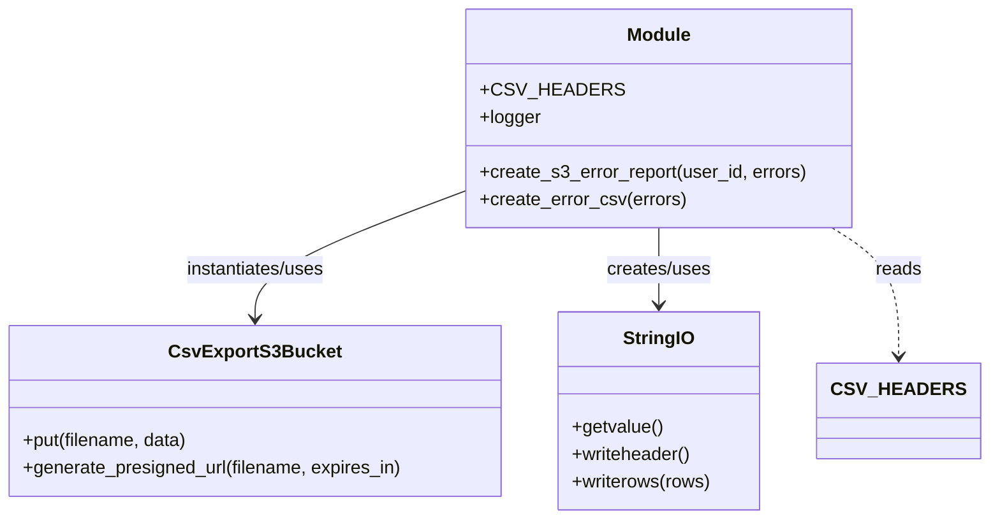

# Diagram: container_tracking_core/container_tracking_service/container_tracking_service/api/reuse_trip_container_bucket/batch_upload/manage_s3.py


> Auto-generated by Obscura crawlers

## Diagram 1



### SVG

<svg id="container" width="846.796875" xmlns="http://www.w3.org/2000/svg" class="classDiagram" height="456" viewBox="0 0 846.796875 456" role="graphics-document document" aria-roledescription="class"><style>#container{font-family:"trebuchet ms",verdana,arial,sans-serif;font-size:16px;fill:#333;}@keyframes edge-animation-frame{from{stroke-dashoffset:0;}}@keyframes dash{to{stroke-dashoffset:0;}}#container .edge-animation-slow{stroke-dasharray:9,5!important;stroke-dashoffset:900;animation:dash 50s linear infinite;stroke-linecap:round;}#container .edge-animation-fast{stroke-dasharray:9,5!important;stroke-dashoffset:900;animation:dash 20s linear infinite;stroke-linecap:round;}#container .error-icon{fill:#552222;}#container .error-text{fill:#552222;stroke:#552222;}#container .edge-thickness-normal{stroke-width:1px;}#container .edge-thickness-thick{stroke-width:3.5px;}#container .edge-pattern-solid{stroke-dasharray:0;}#container .edge-thickness-invisible{stroke-width:0;fill:none;}#container .edge-pattern-dashed{stroke-dasharray:3;}#container .edge-pattern-dotted{stroke-dasharray:2;}#container .marker{fill:#333333;stroke:#333333;}#container .marker.cross{stroke:#333333;}#container svg{font-family:"trebuchet ms",verdana,arial,sans-serif;font-size:16px;}#container p{margin:0;}#container g.classGroup text{fill:#9370DB;stroke:none;font-family:"trebuchet ms",verdana,arial,sans-serif;font-size:10px;}#container g.classGroup text .title{font-weight:bolder;}#container .nodeLabel,#container .edgeLabel{color:#131300;}#container .edgeLabel .label rect{fill:#ECECFF;}#container .label text{fill:#131300;}#container .labelBkg{background:#ECECFF;}#container .edgeLabel .label span{background:#ECECFF;}#container .classTitle{font-weight:bolder;}#container .node rect,#container .node circle,#container .node ellipse,#container .node polygon,#container .node path{fill:#ECECFF;stroke:#9370DB;stroke-width:1px;}#container .divider{stroke:#9370DB;stroke-width:1;}#container g.clickable{cursor:pointer;}#container g.classGroup rect{fill:#ECECFF;stroke:#9370DB;}#container g.classGroup line{stroke:#9370DB;stroke-width:1;}#container .classLabel .box{stroke:none;stroke-width:0;fill:#ECECFF;opacity:0.5;}#container .classLabel .label{fill:#9370DB;font-size:10px;}#container .relation{stroke:#333333;stroke-width:1;fill:none;}#container .dashed-line{stroke-dasharray:3;}#container .dotted-line{stroke-dasharray:1 2;}#container #compositionStart,#container .composition{fill:#333333!important;stroke:#333333!important;stroke-width:1;}#container #compositionEnd,#container .composition{fill:#333333!important;stroke:#333333!important;stroke-width:1;}#container #dependencyStart,#container .dependency{fill:#333333!important;stroke:#333333!important;stroke-width:1;}#container #dependencyStart,#container .dependency{fill:#333333!important;stroke:#333333!important;stroke-width:1;}#container #extensionStart,#container .extension{fill:transparent!important;stroke:#333333!important;stroke-width:1;}#container #extensionEnd,#container .extension{fill:transparent!important;stroke:#333333!important;stroke-width:1;}#container #aggregationStart,#container .aggregation{fill:transparent!important;stroke:#333333!important;stroke-width:1;}#container #aggregationEnd,#container .aggregation{fill:transparent!important;stroke:#333333!important;stroke-width:1;}#container #lollipopStart,#container .lollipop{fill:#ECECFF!important;stroke:#333333!important;stroke-width:1;}#container #lollipopEnd,#container .lollipop{fill:#ECECFF!important;stroke:#333333!important;stroke-width:1;}#container .edgeTerminals{font-size:11px;line-height:initial;}#container .classTitleText{text-anchor:middle;font-size:18px;fill:#333;}#container .label-icon{display:inline-block;height:1em;overflow:visible;vertical-align:-0.125em;}#container .node .label-icon path{fill:currentColor;stroke:revert;stroke-width:revert;}#container :root{--mermaid-font-family:"trebuchet ms",verdana,arial,sans-serif;}</style><g><defs><marker id="container_class-aggregationStart" class="marker aggregation class" refX="18" refY="7" markerWidth="190" markerHeight="240" orient="auto"><path d="M 18,7 L9,13 L1,7 L9,1 Z"></path></marker></defs><defs><marker id="container_class-aggregationEnd" class="marker aggregation class" refX="1" refY="7" markerWidth="20" markerHeight="28" orient="auto"><path d="M 18,7 L9,13 L1,7 L9,1 Z"></path></marker></defs><defs><marker id="container_class-extensionStart" class="marker extension class" refX="18" refY="7" markerWidth="190" markerHeight="240" orient="auto"><path d="M 1,7 L18,13 V 1 Z"></path></marker></defs><defs><marker id="container_class-extensionEnd" class="marker extension class" refX="1" refY="7" markerWidth="20" markerHeight="28" orient="auto"><path d="M 1,1 V 13 L18,7 Z"></path></marker></defs><defs><marker id="container_class-compositionStart" class="marker composition class" refX="18" refY="7" markerWidth="190" markerHeight="240" orient="auto"><path d="M 18,7 L9,13 L1,7 L9,1 Z"></path></marker></defs><defs><marker id="container_class-compositionEnd" class="marker composition class" refX="1" refY="7" markerWidth="20" markerHeight="28" orient="auto"><path d="M 18,7 L9,13 L1,7 L9,1 Z"></path></marker></defs><defs><marker id="container_class-dependencyStart" class="marker dependency class" refX="6" refY="7" markerWidth="190" markerHeight="240" orient="auto"><path d="M 5,7 L9,13 L1,7 L9,1 Z"></path></marker></defs><defs><marker id="container_class-dependencyEnd" class="marker dependency class" refX="13" refY="7" markerWidth="20" markerHeight="28" orient="auto"><path d="M 18,7 L9,13 L14,7 L9,1 Z"></path></marker></defs><defs><marker id="container_class-lollipopStart" class="marker lollipop class" refX="13" refY="7" markerWidth="190" markerHeight="240" orient="auto"><circle stroke="black" fill="transparent" cx="7" cy="7" r="6"></circle></marker></defs><defs><marker id="container_class-lollipopEnd" class="marker lollipop class" refX="1" refY="7" markerWidth="190" markerHeight="240" orient="auto"><circle stroke="black" fill="transparent" cx="7" cy="7" r="6"></circle></marker></defs><g class="root"><g class="clusters"></g><g class="edgePaths"><path d="M406.633,167.679L375.966,179.232C345.299,190.786,283.966,213.893,253.299,232.613C222.633,251.333,222.633,265.667,222.633,272.833L222.633,280" id="id_Module_CsvExportS3Bucket_1" class="edge-thickness-normal edge-pattern-solid relation" style=";;;" data-edge="true" data-et="edge" data-id="id_Module_CsvExportS3Bucket_1" data-points="W3sieCI6NDA2LjYzMjgxMjUsInkiOjE2Ny42Nzg4MjM1NTU0NDczN30seyJ4IjoyMjIuNjMyODEyNSwieSI6MjM3fSx7IngiOjIyMi42MzI4MTI1LCJ5IjoyODZ9XQ==" marker-end="url(#container_class-dependencyEnd)"></path><path d="M575.656,200L575.656,206.167C575.656,212.333,575.656,224.667,575.656,236C575.656,247.333,575.656,257.667,575.656,262.833L575.656,268" id="id_Module_StringIO_2" class="edge-thickness-normal edge-pattern-solid relation" style=";;;" data-edge="true" data-et="edge" data-id="id_Module_StringIO_2" data-points="W3sieCI6NTc1LjY1NjI1LCJ5IjoyMDB9LHsieCI6NTc1LjY1NjI1LCJ5IjoyMzd9LHsieCI6NTc1LjY1NjI1LCJ5IjoyNzR9XQ==" marker-end="url(#container_class-dependencyEnd)"></path><path d="M720.57,200L729.878,206.167C739.187,212.333,757.805,224.667,767.113,243.5C776.422,262.333,776.422,287.667,776.422,300.333L776.422,313" id="id_Module_CSV_HEADERS_3" class="edge-thickness-normal edge-pattern-dashed relation" style=";;;" data-edge="true" data-et="edge" data-id="id_Module_CSV_HEADERS_3" data-points="W3sieCI6NzIwLjU2OTc4MzgzNDU4NjUsInkiOjIwMH0seyJ4Ijo3NzYuNDIxODc1LCJ5IjoyMzd9LHsieCI6Nzc2LjQyMTg3NSwieSI6MzE5fV0=" marker-end="url(#container_class-dependencyEnd)"></path></g><g class="edgeLabels"><g class="edgeLabel" transform="translate(222.6328125, 237)"><g class="label" data-id="id_Module_CsvExportS3Bucket_1" transform="translate(-63.3203125, -12)"><foreignObject width="126.640625" height="24"><div xmlns="http://www.w3.org/1999/xhtml" class="labelBkg" style="display: table-cell; white-space: nowrap; line-height: 1.5; max-width: 200px; text-align: center;"><span class="edgeLabel"><p>instantiates/uses</p></span></div></foreignObject></g></g><g class="edgeLabel" transform="translate(575.65625, 237)"><g class="label" data-id="id_Module_StringIO_2" transform="translate(-46.578125, -12)"><foreignObject width="93.15625" height="24"><div xmlns="http://www.w3.org/1999/xhtml" class="labelBkg" style="display: table-cell; white-space: nowrap; line-height: 1.5; max-width: 200px; text-align: center;"><span class="edgeLabel"><p>creates/uses</p></span></div></foreignObject></g></g><g class="edgeLabel" transform="translate(776.421875, 237)"><g class="label" data-id="id_Module_CSV_HEADERS_3" transform="translate(-20.0078125, -12)"><foreignObject width="40.015625" height="24"><div xmlns="http://www.w3.org/1999/xhtml" class="labelBkg" style="display: table-cell; white-space: nowrap; line-height: 1.5; max-width: 200px; text-align: center;"><span class="edgeLabel"><p>reads</p></span></div></foreignObject></g></g></g><g class="nodes"><g class="node default" id="classId-Module-0" transform="translate(575.65625, 104)"><g class="basic label-container"><path d="M-169.0234375 -96 L169.0234375 -96 L169.0234375 96 L-169.0234375 96" stroke="none" stroke-width="0" fill="#ECECFF" style=""></path><path d="M-169.0234375 -96 C-57.81572815787476 -96, 53.39198118425048 -96, 169.0234375 -96 M-169.0234375 -96 C-76.3057850323 -96, 16.411867435400012 -96, 169.0234375 -96 M169.0234375 -96 C169.0234375 -50.06833240590052, 169.0234375 -4.13666481180104, 169.0234375 96 M169.0234375 -96 C169.0234375 -47.632575642866755, 169.0234375 0.7348487142664908, 169.0234375 96 M169.0234375 96 C38.253278316881875 96, -92.51688086623625 96, -169.0234375 96 M169.0234375 96 C57.32703080430757 96, -54.36937589138486 96, -169.0234375 96 M-169.0234375 96 C-169.0234375 20.252111093145032, -169.0234375 -55.495777813709935, -169.0234375 -96 M-169.0234375 96 C-169.0234375 35.98230232830993, -169.0234375 -24.035395343380145, -169.0234375 -96" stroke="#9370DB" stroke-width="1.3" fill="none" stroke-dasharray="0 0" style=""></path></g><g class="annotation-group text" transform="translate(0, -72)"></g><g class="label-group text" transform="translate(-27.09375, -72)"><g class="label" style="font-weight: bolder" transform="translate(0,-12)"><foreignObject width="54.1875" height="24"><div xmlns="http://www.w3.org/1999/xhtml" style="display: table-cell; white-space: nowrap; line-height: 1.5; max-width: 104px; text-align: center;"><span class="nodeLabel markdown-node-label" style=""><p>Module</p></span></div></foreignObject></g></g><g class="members-group text" transform="translate(-157.0234375, -24)"><g class="label" style="" transform="translate(0,-12)"><foreignObject width="107.375" height="24"><div xmlns="http://www.w3.org/1999/xhtml" style="display: table-cell; white-space: nowrap; line-height: 1.5; max-width: 165px; text-align: center;"><span class="nodeLabel markdown-node-label" style=""><p>+CSV_HEADERS</p></span></div></foreignObject></g><g class="label" style="" transform="translate(0,12)"><foreignObject width="53.21875" height="24"><div xmlns="http://www.w3.org/1999/xhtml" style="display: table-cell; white-space: nowrap; line-height: 1.5; max-width: 111px; text-align: center;"><span class="nodeLabel markdown-node-label" style=""><p>+logger</p></span></div></foreignObject></g></g><g class="methods-group text" transform="translate(-157.0234375, 48)"><g class="label" style="" transform="translate(0,-12)"><foreignObject width="286.953125" height="24"><div xmlns="http://www.w3.org/1999/xhtml" style="display: table-cell; white-space: nowrap; line-height: 1.5; max-width: 344px; text-align: center;"><span class="nodeLabel markdown-node-label" style=""><p>+create_s3_error_report(user_id, errors)</p></span></div></foreignObject></g><g class="label" style="" transform="translate(0,12)"><foreignObject width="179.796875" height="24"><div xmlns="http://www.w3.org/1999/xhtml" style="display: table-cell; white-space: nowrap; line-height: 1.5; max-width: 237px; text-align: center;"><span class="nodeLabel markdown-node-label" style=""><p>+create_error_csv(errors)</p></span></div></foreignObject></g></g><g class="divider" style=""><path d="M-169.0234375 -48 C-93.95678576482126 -48, -18.890134029642525 -48, 169.0234375 -48 M-169.0234375 -48 C-82.72823128776855 -48, 3.5669749244628974 -48, 169.0234375 -48" stroke="#9370DB" stroke-width="1.3" fill="none" stroke-dasharray="0 0" style=""></path></g><g class="divider" style=""><path d="M-169.0234375 24 C-99.07432044513688 24, -29.125203390273754 24, 169.0234375 24 M-169.0234375 24 C-54.03103980535768 24, 60.96135788928464 24, 169.0234375 24" stroke="#9370DB" stroke-width="1.3" fill="none" stroke-dasharray="0 0" style=""></path></g></g><g class="node default" id="classId-CsvExportS3Bucket-1" transform="translate(222.6328125, 361)"><g class="basic label-container"><path d="M-214.6328125 -75 L214.6328125 -75 L214.6328125 75 L-214.6328125 75" stroke="none" stroke-width="0" fill="#ECECFF" style=""></path><path d="M-214.6328125 -75 C-112.87749057378359 -75, -11.122168647567179 -75, 214.6328125 -75 M-214.6328125 -75 C-110.8064838042359 -75, -6.980155108471791 -75, 214.6328125 -75 M214.6328125 -75 C214.6328125 -34.471775143329396, 214.6328125 6.056449713341209, 214.6328125 75 M214.6328125 -75 C214.6328125 -36.131266994756814, 214.6328125 2.737466010486372, 214.6328125 75 M214.6328125 75 C65.11742591133827 75, -84.39796067732345 75, -214.6328125 75 M214.6328125 75 C78.01540426716869 75, -58.60200396566262 75, -214.6328125 75 M-214.6328125 75 C-214.6328125 30.449542458454253, -214.6328125 -14.100915083091493, -214.6328125 -75 M-214.6328125 75 C-214.6328125 28.170262636419025, -214.6328125 -18.65947472716195, -214.6328125 -75" stroke="#9370DB" stroke-width="1.3" fill="none" stroke-dasharray="0 0" style=""></path></g><g class="annotation-group text" transform="translate(0, -51)"></g><g class="label-group text" transform="translate(-70.296875, -51)"><g class="label" style="font-weight: bolder" transform="translate(0,-12)"><foreignObject width="140.59375" height="24"><div xmlns="http://www.w3.org/1999/xhtml" style="display: table-cell; white-space: nowrap; line-height: 1.5; max-width: 187px; text-align: center;"><span class="nodeLabel markdown-node-label" style=""><p>CsvExportS3Bucket</p></span></div></foreignObject></g></g><g class="members-group text" transform="translate(-202.6328125, -3)"></g><g class="methods-group text" transform="translate(-202.6328125, 27)"><g class="label" style="" transform="translate(0,-12)"><foreignObject width="146.546875" height="24"><div xmlns="http://www.w3.org/1999/xhtml" style="display: table-cell; white-space: nowrap; line-height: 1.5; max-width: 204px; text-align: center;"><span class="nodeLabel markdown-node-label" style=""><p>+put(filename, data)</p></span></div></foreignObject></g><g class="label" style="" transform="translate(0,12)"><foreignObject width="334.96875" height="24"><div xmlns="http://www.w3.org/1999/xhtml" style="display: table-cell; white-space: nowrap; line-height: 1.5; max-width: 392px; text-align: center;"><span class="nodeLabel markdown-node-label" style=""><p>+generate_presigned_url(filename, expires_in)</p></span></div></foreignObject></g></g><g class="divider" style=""><path d="M-214.6328125 -27 C-56.2555023963842 -27, 102.1218077072316 -27, 214.6328125 -27 M-214.6328125 -27 C-60.45367921249985 -27, 93.7254540750003 -27, 214.6328125 -27" stroke="#9370DB" stroke-width="1.3" fill="none" stroke-dasharray="0 0" style=""></path></g><g class="divider" style=""><path d="M-214.6328125 -3 C-49.73711030873736 -3, 115.15859188252529 -3, 214.6328125 -3 M-214.6328125 -3 C-69.48733650854379 -3, 75.65813948291242 -3, 214.6328125 -3" stroke="#9370DB" stroke-width="1.3" fill="none" stroke-dasharray="0 0" style=""></path></g></g><g class="node default" id="classId-StringIO-2" transform="translate(575.65625, 361)"><g class="basic label-container"><path d="M-88.390625 -87 L88.390625 -87 L88.390625 87 L-88.390625 87" stroke="none" stroke-width="0" fill="#ECECFF" style=""></path><path d="M-88.390625 -87 C-28.645853629641607 -87, 31.098917740716786 -87, 88.390625 -87 M-88.390625 -87 C-49.56450152849833 -87, -10.738378056996666 -87, 88.390625 -87 M88.390625 -87 C88.390625 -44.38804562030867, 88.390625 -1.7760912406173333, 88.390625 87 M88.390625 -87 C88.390625 -28.29321145631353, 88.390625 30.413577087372943, 88.390625 87 M88.390625 87 C20.852851263756094 87, -46.68492247248781 87, -88.390625 87 M88.390625 87 C32.86705287919539 87, -22.656519241609217 87, -88.390625 87 M-88.390625 87 C-88.390625 48.18405637534581, -88.390625 9.368112750691623, -88.390625 -87 M-88.390625 87 C-88.390625 32.72465891674138, -88.390625 -21.550682166517234, -88.390625 -87" stroke="#9370DB" stroke-width="1.3" fill="none" stroke-dasharray="0 0" style=""></path></g><g class="annotation-group text" transform="translate(0, -63)"></g><g class="label-group text" transform="translate(-30.03125, -63)"><g class="label" style="font-weight: bolder" transform="translate(0,-12)"><foreignObject width="60.0625" height="24"><div xmlns="http://www.w3.org/1999/xhtml" style="display: table-cell; white-space: nowrap; line-height: 1.5; max-width: 109px; text-align: center;"><span class="nodeLabel markdown-node-label" style=""><p>StringIO</p></span></div></foreignObject></g></g><g class="members-group text" transform="translate(-76.390625, -15)"></g><g class="methods-group text" transform="translate(-76.390625, 15)"><g class="label" style="" transform="translate(0,-12)"><foreignObject width="79.71875" height="24"><div xmlns="http://www.w3.org/1999/xhtml" style="display: table-cell; white-space: nowrap; line-height: 1.5; max-width: 137px; text-align: center;"><span class="nodeLabel markdown-node-label" style=""><p>+getvalue()</p></span></div></foreignObject></g><g class="label" style="" transform="translate(0,12)"><foreignObject width="105.875" height="24"><div xmlns="http://www.w3.org/1999/xhtml" style="display: table-cell; white-space: nowrap; line-height: 1.5; max-width: 163px; text-align: center;"><span class="nodeLabel markdown-node-label" style=""><p>+writeheader()</p></span></div></foreignObject></g><g class="label" style="" transform="translate(0,36)"><foreignObject width="122.75" height="24"><div xmlns="http://www.w3.org/1999/xhtml" style="display: table-cell; white-space: nowrap; line-height: 1.5; max-width: 180px; text-align: center;"><span class="nodeLabel markdown-node-label" style=""><p>+writerows(rows)</p></span></div></foreignObject></g></g><g class="divider" style=""><path d="M-88.390625 -39 C-47.43288309919884 -39, -6.475141198397679 -39, 88.390625 -39 M-88.390625 -39 C-23.166303171488508 -39, 42.058018657022984 -39, 88.390625 -39" stroke="#9370DB" stroke-width="1.3" fill="none" stroke-dasharray="0 0" style=""></path></g><g class="divider" style=""><path d="M-88.390625 -15 C-52.04378623154201 -15, -15.696947463084015 -15, 88.390625 -15 M-88.390625 -15 C-32.8644806450816 -15, 22.6616637098368 -15, 88.390625 -15" stroke="#9370DB" stroke-width="1.3" fill="none" stroke-dasharray="0 0" style=""></path></g></g><g class="node default" id="classId-CSV_HEADERS-3" transform="translate(776.421875, 361)"><g class="basic label-container"><path d="M-62.375 -42 L62.375 -42 L62.375 42 L-62.375 42" stroke="none" stroke-width="0" fill="#ECECFF" style=""></path><path d="M-62.375 -42 C-35.32028962390007 -42, -8.265579247800133 -42, 62.375 -42 M-62.375 -42 C-24.16812710874911 -42, 14.038745782501778 -42, 62.375 -42 M62.375 -42 C62.375 -13.717791047697844, 62.375 14.564417904604312, 62.375 42 M62.375 -42 C62.375 -14.836662845678653, 62.375 12.326674308642694, 62.375 42 M62.375 42 C32.635015363495334 42, 2.8950307269906688 42, -62.375 42 M62.375 42 C31.409286122014255 42, 0.44357224402850903 42, -62.375 42 M-62.375 42 C-62.375 21.549360591471885, -62.375 1.0987211829437697, -62.375 -42 M-62.375 42 C-62.375 22.680692083422148, -62.375 3.361384166844296, -62.375 -42" stroke="#9370DB" stroke-width="1.3" fill="none" stroke-dasharray="0 0" style=""></path></g><g class="annotation-group text" transform="translate(0, -18)"></g><g class="label-group text" transform="translate(-50.375, -18)"><g class="label" style="font-weight: bolder" transform="translate(0,-12)"><foreignObject width="100.75" height="24"><div xmlns="http://www.w3.org/1999/xhtml" style="display: table-cell; white-space: nowrap; line-height: 1.5; max-width: 150px; text-align: center;"><span class="nodeLabel markdown-node-label" style=""><p>CSV_HEADERS</p></span></div></foreignObject></g></g><g class="members-group text" transform="translate(-50.375, 30)"></g><g class="methods-group text" transform="translate(-50.375, 60)"></g><g class="divider" style=""><path d="M-62.375 6 C-18.37517251144684 6, 25.624654977106317 6, 62.375 6 M-62.375 6 C-21.404199559009804 6, 19.566600881980392 6, 62.375 6" stroke="#9370DB" stroke-width="1.3" fill="none" stroke-dasharray="0 0" style=""></path></g><g class="divider" style=""><path d="M-62.375 24 C-34.6681463629373 24, -6.9612927258746 24, 62.375 24 M-62.375 24 C-23.809931954235886 24, 14.755136091528229 24, 62.375 24" stroke="#9370DB" stroke-width="1.3" fill="none" stroke-dasharray="0 0" style=""></path></g></g></g></g></g></svg>

## Diagram 2

```mermaid
flowchart TD
A[create_s3_error_report(user_id, errors)] --> B[create_error_csv(errors)]
B --> C[csv_data (String)]
C --> D[logger.info("CSV DATA ...")]
D --> E[generate uuid -> s3_key & s3_filename]
E --> F[CsvExportS3Bucket() instantiation]
F --> G[put(s3_filename, csv_data)]
G --> H[generate_presigned_url(s3_filename, expires_in=3600)]
H --> I[logger.info("PRESIGNED URL ...")]
I --> J[return presigned_url]
```

> SVG rendering failed for this diagram.
