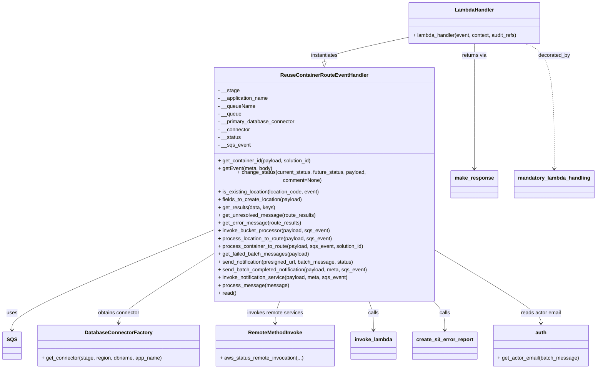

# Diagram: container_tracking_core/container_tracking_service/container_tracking_service/api/reuse_trip_container_bucket/batch_upload/reuse_trip_container_batch_receiver.py


> Auto-generated by Obscura crawlers

## Diagram 1



### SVG

<svg id="container" width="1808.705078125" xmlns="http://www.w3.org/2000/svg" class="classDiagram" height="1112" viewBox="0 0 1808.705078125 1112" role="graphics-document document" aria-roledescription="class"><style>#container{font-family:"trebuchet ms",verdana,arial,sans-serif;font-size:16px;fill:#333;}@keyframes edge-animation-frame{from{stroke-dashoffset:0;}}@keyframes dash{to{stroke-dashoffset:0;}}#container .edge-animation-slow{stroke-dasharray:9,5!important;stroke-dashoffset:900;animation:dash 50s linear infinite;stroke-linecap:round;}#container .edge-animation-fast{stroke-dasharray:9,5!important;stroke-dashoffset:900;animation:dash 20s linear infinite;stroke-linecap:round;}#container .error-icon{fill:#552222;}#container .error-text{fill:#552222;stroke:#552222;}#container .edge-thickness-normal{stroke-width:1px;}#container .edge-thickness-thick{stroke-width:3.5px;}#container .edge-pattern-solid{stroke-dasharray:0;}#container .edge-thickness-invisible{stroke-width:0;fill:none;}#container .edge-pattern-dashed{stroke-dasharray:3;}#container .edge-pattern-dotted{stroke-dasharray:2;}#container .marker{fill:#333333;stroke:#333333;}#container .marker.cross{stroke:#333333;}#container svg{font-family:"trebuchet ms",verdana,arial,sans-serif;font-size:16px;}#container p{margin:0;}#container g.classGroup text{fill:#9370DB;stroke:none;font-family:"trebuchet ms",verdana,arial,sans-serif;font-size:10px;}#container g.classGroup text .title{font-weight:bolder;}#container .nodeLabel,#container .edgeLabel{color:#131300;}#container .edgeLabel .label rect{fill:#ECECFF;}#container .label text{fill:#131300;}#container .labelBkg{background:#ECECFF;}#container .edgeLabel .label span{background:#ECECFF;}#container .classTitle{font-weight:bolder;}#container .node rect,#container .node circle,#container .node ellipse,#container .node polygon,#container .node path{fill:#ECECFF;stroke:#9370DB;stroke-width:1px;}#container .divider{stroke:#9370DB;stroke-width:1;}#container g.clickable{cursor:pointer;}#container g.classGroup rect{fill:#ECECFF;stroke:#9370DB;}#container g.classGroup line{stroke:#9370DB;stroke-width:1;}#container .classLabel .box{stroke:none;stroke-width:0;fill:#ECECFF;opacity:0.5;}#container .classLabel .label{fill:#9370DB;font-size:10px;}#container .relation{stroke:#333333;stroke-width:1;fill:none;}#container .dashed-line{stroke-dasharray:3;}#container .dotted-line{stroke-dasharray:1 2;}#container #compositionStart,#container .composition{fill:#333333!important;stroke:#333333!important;stroke-width:1;}#container #compositionEnd,#container .composition{fill:#333333!important;stroke:#333333!important;stroke-width:1;}#container #dependencyStart,#container .dependency{fill:#333333!important;stroke:#333333!important;stroke-width:1;}#container #dependencyStart,#container .dependency{fill:#333333!important;stroke:#333333!important;stroke-width:1;}#container #extensionStart,#container .extension{fill:transparent!important;stroke:#333333!important;stroke-width:1;}#container #extensionEnd,#container .extension{fill:transparent!important;stroke:#333333!important;stroke-width:1;}#container #aggregationStart,#container .aggregation{fill:transparent!important;stroke:#333333!important;stroke-width:1;}#container #aggregationEnd,#container .aggregation{fill:transparent!important;stroke:#333333!important;stroke-width:1;}#container #lollipopStart,#container .lollipop{fill:#ECECFF!important;stroke:#333333!important;stroke-width:1;}#container #lollipopEnd,#container .lollipop{fill:#ECECFF!important;stroke:#333333!important;stroke-width:1;}#container .edgeTerminals{font-size:11px;line-height:initial;}#container .classTitleText{text-anchor:middle;font-size:18px;fill:#333;}#container .label-icon{display:inline-block;height:1em;overflow:visible;vertical-align:-0.125em;}#container .node .label-icon path{fill:currentColor;stroke:revert;stroke-width:revert;}#container :root{--mermaid-font-family:"trebuchet ms",verdana,arial,sans-serif;}</style><g><defs><marker id="container_class-aggregationStart" class="marker aggregation class" refX="18" refY="7" markerWidth="190" markerHeight="240" orient="auto"><path d="M 18,7 L9,13 L1,7 L9,1 Z"></path></marker></defs><defs><marker id="container_class-aggregationEnd" class="marker aggregation class" refX="1" refY="7" markerWidth="20" markerHeight="28" orient="auto"><path d="M 18,7 L9,13 L1,7 L9,1 Z"></path></marker></defs><defs><marker id="container_class-extensionStart" class="marker extension class" refX="18" refY="7" markerWidth="190" markerHeight="240" orient="auto"><path d="M 1,7 L18,13 V 1 Z"></path></marker></defs><defs><marker id="container_class-extensionEnd" class="marker extension class" refX="1" refY="7" markerWidth="20" markerHeight="28" orient="auto"><path d="M 1,1 V 13 L18,7 Z"></path></marker></defs><defs><marker id="container_class-compositionStart" class="marker composition class" refX="18" refY="7" markerWidth="190" markerHeight="240" orient="auto"><path d="M 18,7 L9,13 L1,7 L9,1 Z"></path></marker></defs><defs><marker id="container_class-compositionEnd" class="marker composition class" refX="1" refY="7" markerWidth="20" markerHeight="28" orient="auto"><path d="M 18,7 L9,13 L1,7 L9,1 Z"></path></marker></defs><defs><marker id="container_class-dependencyStart" class="marker dependency class" refX="6" refY="7" markerWidth="190" markerHeight="240" orient="auto"><path d="M 5,7 L9,13 L1,7 L9,1 Z"></path></marker></defs><defs><marker id="container_class-dependencyEnd" class="marker dependency class" refX="13" refY="7" markerWidth="20" markerHeight="28" orient="auto"><path d="M 18,7 L9,13 L14,7 L9,1 Z"></path></marker></defs><defs><marker id="container_class-lollipopStart" class="marker lollipop class" refX="13" refY="7" markerWidth="190" markerHeight="240" orient="auto"><circle stroke="black" fill="transparent" cx="7" cy="7" r="6"></circle></marker></defs><defs><marker id="container_class-lollipopEnd" class="marker lollipop class" refX="1" refY="7" markerWidth="190" markerHeight="240" orient="auto"><circle stroke="black" fill="transparent" cx="7" cy="7" r="6"></circle></marker></defs><g class="root"><g class="clusters"></g><g class="edgePaths"><path d="M645.447,693.348L543.653,734.623C441.858,775.898,238.269,858.449,136.474,908.391C34.68,958.333,34.68,975.667,34.68,984.333L34.68,993" id="id_ReuseContainerRouteEventHandler_SQS_1" class="edge-thickness-normal edge-pattern-solid relation" style=";;;" data-edge="true" data-et="edge" data-id="id_ReuseContainerRouteEventHandler_SQS_1" data-points="W3sieCI6NjQ1LjQ0NzI2NTYyNSwieSI6NjkzLjM0NzU1MDAwMDcxOTl9LHsieCI6MzQuNjc5Njg3NSwieSI6OTQxfSx7IngiOjM0LjY3OTY4NzUsInkiOjk5OX1d" marker-end="url(#container_class-dependencyEnd)"></path><path d="M645.447,764.112L597.463,793.594C549.478,823.075,453.508,882.037,405.524,916.685C357.539,951.333,357.539,961.667,357.539,966.833L357.539,972" id="id_ReuseContainerRouteEventHandler_DatabaseConnectorFactory_2" class="edge-thickness-normal edge-pattern-solid relation" style=";;;" data-edge="true" data-et="edge" data-id="id_ReuseContainerRouteEventHandler_DatabaseConnectorFactory_2" data-points="W3sieCI6NjQ1LjQ0NzI2NTYyNSwieSI6NzY0LjExMjMyNDI0OTg1NzV9LHsieCI6MzU3LjUzOTA2MjUsInkiOjk0MX0seyJ4IjozNTcuNTM5MDYyNSwieSI6OTc4fV0=" marker-end="url(#container_class-dependencyEnd)"></path><path d="M849.171,904L846.778,910.167C844.386,916.333,839.601,928.667,837.209,940C834.816,951.333,834.816,961.667,834.816,966.833L834.816,972" id="id_ReuseContainerRouteEventHandler_RemoteMethodInvoke_3" class="edge-thickness-normal edge-pattern-solid relation" style=";;;" data-edge="true" data-et="edge" data-id="id_ReuseContainerRouteEventHandler_RemoteMethodInvoke_3" data-points="W3sieCI6ODQ5LjE3MDYxMTgxMDA2NDksInkiOjkwNH0seyJ4Ijo4MzQuODE2NDA2MjUsInkiOjk0MX0seyJ4Ijo4MzQuODE2NDA2MjUsInkiOjk3OH1d" marker-end="url(#container_class-dependencyEnd)"></path><path d="M1119.185,904L1121.577,910.167C1123.97,916.333,1128.754,928.667,1131.147,943.5C1133.539,958.333,1133.539,975.667,1133.539,984.333L1133.539,993" id="id_ReuseContainerRouteEventHandler_invoke_lambda_4" class="edge-thickness-normal edge-pattern-solid relation" style=";;;" data-edge="true" data-et="edge" data-id="id_ReuseContainerRouteEventHandler_invoke_lambda_4" data-points="W3sieCI6MTExOS4xODQ4NTY5Mzk5MzUxLCJ5Ijo5MDR9LHsieCI6MTEzMy41MzkwNjI1LCJ5Ijo5NDF9LHsieCI6MTEzMy41MzkwNjI1LCJ5Ijo5OTl9XQ==" marker-end="url(#container_class-dependencyEnd)"></path><path d="M1312.16,904L1317.972,910.167C1323.783,916.333,1335.407,928.667,1341.219,943.5C1347.031,958.333,1347.031,975.667,1347.031,984.333L1347.031,993" id="id_ReuseContainerRouteEventHandler_create_s3_error_report_5" class="edge-thickness-normal edge-pattern-solid relation" style=";;;" data-edge="true" data-et="edge" data-id="id_ReuseContainerRouteEventHandler_create_s3_error_report_5" data-points="W3sieCI6MTMxMi4xNTk2MTM0MzM0NDE2LCJ5Ijo5MDR9LHsieCI6MTM0Ny4wMzEyNSwieSI6OTQxfSx7IngiOjEzNDcuMDMxMjUsInkiOjk5OX1d" marker-end="url(#container_class-dependencyEnd)"></path><path d="M1322.908,755.552L1375.373,786.46C1427.839,817.368,1532.769,879.184,1585.234,915.259C1637.699,951.333,1637.699,961.667,1637.699,966.833L1637.699,972" id="id_ReuseContainerRouteEventHandler_auth_6" class="edge-thickness-normal edge-pattern-solid relation" style=";;;" data-edge="true" data-et="edge" data-id="id_ReuseContainerRouteEventHandler_auth_6" data-points="W3sieCI6MTMyMi45MDgyMDMxMjUsInkiOjc1NS41NTE1NTgxMTUxMzk0fSx7IngiOjE2MzcuNjk5MjE4NzUsInkiOjk0MX0seyJ4IjoxNjM3LjY5OTIxODc1LCJ5Ijo5Nzh9XQ==" marker-end="url(#container_class-dependencyEnd)"></path><path d="M1238.307,115.537L1195.952,124.781C1153.597,134.025,1068.887,152.512,1026.533,165.048C984.178,177.583,984.178,184.167,984.178,187.458L984.178,190.75" id="id_LambdaHandler_ReuseContainerRouteEventHandler_7" class="edge-thickness-normal edge-pattern-solid relation" style=";;;" data-edge="true" data-et="edge" data-id="id_LambdaHandler_ReuseContainerRouteEventHandler_7" data-points="W3sieCI6MTIzOC4zMDY2NDA2MjUsInkiOjExNS41Mzc0NjQwODc1MDI4OH0seyJ4Ijo5ODQuMTc3NzM0Mzc1LCJ5IjoxNzF9LHsieCI6OTg0LjE3NzczNDM3NSwieSI6MjA4fV0=" marker-end="url(#container_class-extensionEnd)"></path><path d="M1592.883,134L1607.615,140.167C1622.347,146.333,1651.811,158.667,1666.543,221C1681.275,283.333,1681.275,395.667,1681.275,451.833L1681.275,508" id="id_LambdaHandler_mandatory_lambda_handling_8" class="edge-thickness-normal edge-pattern-dashed relation" style=";;;" data-edge="true" data-et="edge" data-id="id_LambdaHandler_mandatory_lambda_handling_8" data-points="W3sieCI6MTU5Mi44ODI5Njg3NSwieSI6MTM0fSx7IngiOjE2ODEuMjc1MzkwNjI1LCJ5IjoxNzF9LHsieCI6MTY4MS4yNzUzOTA2MjUsInkiOjUxNH1d" marker-end="url(#container_class-dependencyEnd)"></path><path d="M1442.377,134L1442.377,140.167C1442.377,146.333,1442.377,158.667,1442.377,221C1442.377,283.333,1442.377,395.667,1442.377,451.833L1442.377,508" id="id_LambdaHandler_make_response_9" class="edge-thickness-normal edge-pattern-solid relation" style=";;;" data-edge="true" data-et="edge" data-id="id_LambdaHandler_make_response_9" data-points="W3sieCI6MTQ0Mi4zNzY5NTMxMjUsInkiOjEzNH0seyJ4IjoxNDQyLjM3Njk1MzEyNSwieSI6MTcxfSx7IngiOjE0NDIuMzc2OTUzMTI1LCJ5Ijo1MTR9XQ==" marker-end="url(#container_class-dependencyEnd)"></path></g><g class="edgeLabels"><g class="edgeLabel" transform="translate(34.6796875, 941)"><g class="label" data-id="id_ReuseContainerRouteEventHandler_SQS_1" transform="translate(-16.4921875, -12)"><foreignObject width="32.984375" height="24"><div xmlns="http://www.w3.org/1999/xhtml" class="labelBkg" style="display: table-cell; white-space: nowrap; line-height: 1.5; max-width: 200px; text-align: center;"><span class="edgeLabel"><p>uses</p></span></div></foreignObject></g></g><g class="edgeLabel" transform="translate(357.5390625, 941)"><g class="label" data-id="id_ReuseContainerRouteEventHandler_DatabaseConnectorFactory_2" transform="translate(-65.8359375, -12)"><foreignObject width="131.671875" height="24"><div xmlns="http://www.w3.org/1999/xhtml" class="labelBkg" style="display: table-cell; white-space: nowrap; line-height: 1.5; max-width: 200px; text-align: center;"><span class="edgeLabel"><p>obtains connector</p></span></div></foreignObject></g></g><g class="edgeLabel" transform="translate(834.81640625, 941)"><g class="label" data-id="id_ReuseContainerRouteEventHandler_RemoteMethodInvoke_3" transform="translate(-86.828125, -12)"><foreignObject width="173.65625" height="24"><div xmlns="http://www.w3.org/1999/xhtml" class="labelBkg" style="display: table-cell; white-space: nowrap; line-height: 1.5; max-width: 200px; text-align: center;"><span class="edgeLabel"><p>invokes remote services</p></span></div></foreignObject></g></g><g class="edgeLabel" transform="translate(1133.5390625, 941)"><g class="label" data-id="id_ReuseContainerRouteEventHandler_invoke_lambda_4" transform="translate(-16.4453125, -12)"><foreignObject width="32.890625" height="24"><div xmlns="http://www.w3.org/1999/xhtml" class="labelBkg" style="display: table-cell; white-space: nowrap; line-height: 1.5; max-width: 200px; text-align: center;"><span class="edgeLabel"><p>calls</p></span></div></foreignObject></g></g><g class="edgeLabel" transform="translate(1347.03125, 941)"><g class="label" data-id="id_ReuseContainerRouteEventHandler_create_s3_error_report_5" transform="translate(-16.4453125, -12)"><foreignObject width="32.890625" height="24"><div xmlns="http://www.w3.org/1999/xhtml" class="labelBkg" style="display: table-cell; white-space: nowrap; line-height: 1.5; max-width: 200px; text-align: center;"><span class="edgeLabel"><p>calls</p></span></div></foreignObject></g></g><g class="edgeLabel" transform="translate(1637.69921875, 941)"><g class="label" data-id="id_ReuseContainerRouteEventHandler_auth_6" transform="translate(-63.1171875, -12)"><foreignObject width="126.234375" height="24"><div xmlns="http://www.w3.org/1999/xhtml" class="labelBkg" style="display: table-cell; white-space: nowrap; line-height: 1.5; max-width: 200px; text-align: center;"><span class="edgeLabel"><p>reads actor email</p></span></div></foreignObject></g></g><g class="edgeLabel" transform="translate(984.177734375, 171)"><g class="label" data-id="id_LambdaHandler_ReuseContainerRouteEventHandler_7" transform="translate(-42.9140625, -12)"><foreignObject width="85.828125" height="24"><div xmlns="http://www.w3.org/1999/xhtml" class="labelBkg" style="display: table-cell; white-space: nowrap; line-height: 1.5; max-width: 200px; text-align: center;"><span class="edgeLabel"><p>instantiates</p></span></div></foreignObject></g></g><g class="edgeLabel" transform="translate(1681.275390625, 171)"><g class="label" data-id="id_LambdaHandler_mandatory_lambda_handling_8" transform="translate(-49.375, -12)"><foreignObject width="98.75" height="24"><div xmlns="http://www.w3.org/1999/xhtml" class="labelBkg" style="display: table-cell; white-space: nowrap; line-height: 1.5; max-width: 200px; text-align: center;"><span class="edgeLabel"><p>decorated_by</p></span></div></foreignObject></g></g><g class="edgeLabel" transform="translate(1442.376953125, 171)"><g class="label" data-id="id_LambdaHandler_make_response_9" transform="translate(-38.9296875, -12)"><foreignObject width="77.859375" height="24"><div xmlns="http://www.w3.org/1999/xhtml" class="labelBkg" style="display: table-cell; white-space: nowrap; line-height: 1.5; max-width: 200px; text-align: center;"><span class="edgeLabel"><p>returns via</p></span></div></foreignObject></g></g></g><g class="nodes"><g class="node default" id="classId-ReuseContainerRouteEventHandler-0" transform="translate(984.177734375, 556)"><g class="basic label-container"><path d="M-338.73046875 -348 L338.73046875 -348 L338.73046875 348 L-338.73046875 348" stroke="none" stroke-width="0" fill="#ECECFF" style=""></path><path d="M-338.73046875 -348 C-153.53931868717035 -348, 31.6518313756593 -348, 338.73046875 -348 M-338.73046875 -348 C-167.7699618805171 -348, 3.1905449889658257 -348, 338.73046875 -348 M338.73046875 -348 C338.73046875 -173.36301980084414, 338.73046875 1.273960398311715, 338.73046875 348 M338.73046875 -348 C338.73046875 -208.77925374408073, 338.73046875 -69.55850748816147, 338.73046875 348 M338.73046875 348 C111.08583787109842 348, -116.55879300780316 348, -338.73046875 348 M338.73046875 348 C143.05123386152775 348, -52.6280010269445 348, -338.73046875 348 M-338.73046875 348 C-338.73046875 87.10199460862952, -338.73046875 -173.79601078274095, -338.73046875 -348 M-338.73046875 348 C-338.73046875 176.82039204983914, -338.73046875 5.640784099678285, -338.73046875 -348" stroke="#9370DB" stroke-width="1.3" fill="none" stroke-dasharray="0 0" style=""></path></g><g class="annotation-group text" transform="translate(0, -324)"></g><g class="label-group text" transform="translate(-128.4140625, -324)"><g class="label" style="font-weight: bolder" transform="translate(0,-12)"><foreignObject width="256.828125" height="24"><div xmlns="http://www.w3.org/1999/xhtml" style="display: table-cell; white-space: nowrap; line-height: 1.5; max-width: 305px; text-align: center;"><span class="nodeLabel markdown-node-label" style=""><p>ReuseContainerRouteEventHandler</p></span></div></foreignObject></g></g><g class="members-group text" transform="translate(-326.73046875, -276)"><g class="label" style="" transform="translate(0,-12)"><foreignObject width="65.640625" height="24"><div xmlns="http://www.w3.org/1999/xhtml" style="display: table-cell; white-space: nowrap; line-height: 1.5; max-width: 123px; text-align: center;"><span class="nodeLabel markdown-node-label" style=""><p>- __stage</p></span></div></foreignObject></g><g class="label" style="" transform="translate(0,12)"><foreignObject width="157.796875" height="24"><div xmlns="http://www.w3.org/1999/xhtml" style="display: table-cell; white-space: nowrap; line-height: 1.5; max-width: 215px; text-align: center;"><span class="nodeLabel markdown-node-label" style=""><p>- __application_name</p></span></div></foreignObject></g><g class="label" style="" transform="translate(0,36)"><foreignObject width="114.546875" height="24"><div xmlns="http://www.w3.org/1999/xhtml" style="display: table-cell; white-space: nowrap; line-height: 1.5; max-width: 172px; text-align: center;"><span class="nodeLabel markdown-node-label" style=""><p>- __queueName</p></span></div></foreignObject></g><g class="label" style="" transform="translate(0,60)"><foreignObject width="72.484375" height="24"><div xmlns="http://www.w3.org/1999/xhtml" style="display: table-cell; white-space: nowrap; line-height: 1.5; max-width: 130px; text-align: center;"><span class="nodeLabel markdown-node-label" style=""><p>- __queue</p></span></div></foreignObject></g><g class="label" style="" transform="translate(0,84)"><foreignObject width="238.59375" height="24"><div xmlns="http://www.w3.org/1999/xhtml" style="display: table-cell; white-space: nowrap; line-height: 1.5; max-width: 297px; text-align: center;"><span class="nodeLabel markdown-node-label" style=""><p>- __primary_database_connector</p></span></div></foreignObject></g><g class="label" style="" transform="translate(0,108)"><foreignObject width="99.703125" height="24"><div xmlns="http://www.w3.org/1999/xhtml" style="display: table-cell; white-space: nowrap; line-height: 1.5; max-width: 158px; text-align: center;"><span class="nodeLabel markdown-node-label" style=""><p>- __connector</p></span></div></foreignObject></g><g class="label" style="" transform="translate(0,132)"><foreignObject width="71.578125" height="24"><div xmlns="http://www.w3.org/1999/xhtml" style="display: table-cell; white-space: nowrap; line-height: 1.5; max-width: 129px; text-align: center;"><span class="nodeLabel markdown-node-label" style=""><p>- __status</p></span></div></foreignObject></g><g class="label" style="" transform="translate(0,156)"><foreignObject width="99.703125" height="24"><div xmlns="http://www.w3.org/1999/xhtml" style="display: table-cell; white-space: nowrap; line-height: 1.5; max-width: 157px; text-align: center;"><span class="nodeLabel markdown-node-label" style=""><p>- __sqs_event</p></span></div></foreignObject></g></g><g class="methods-group text" transform="translate(-326.73046875, -60)"><g class="label" style="" transform="translate(0,-12)"><foreignObject width="291.53125" height="24"><div xmlns="http://www.w3.org/1999/xhtml" style="display: table-cell; white-space: nowrap; line-height: 1.5; max-width: 349px; text-align: center;"><span class="nodeLabel markdown-node-label" style=""><p>+ get_container_id(payload, solution_id)</p></span></div></foreignObject></g><g class="label" style="" transform="translate(0,12)"><foreignObject width="166.25" height="24"><div xmlns="http://www.w3.org/1999/xhtml" style="display: table-cell; white-space: nowrap; line-height: 1.5; max-width: 224px; text-align: center;"><span class="nodeLabel markdown-node-label" style=""><p>+ getEvent(meta, body)</p></span></div></foreignObject></g><g class="label" style="" transform="translate(0,36)"><foreignObject width="525.046875" height="24"><div xmlns="http://www.w3.org/1999/xhtml" style="display: table-cell; white-space: nowrap; line-height: 1.5; max-width: 582px; text-align: center;"><span class="nodeLabel markdown-node-label" style=""><p>+ change_status(current_status, future_status, payload, comment=None)</p></span></div></foreignObject></g><g class="label" style="" transform="translate(0,60)"><foreignObject width="316.3125" height="24"><div xmlns="http://www.w3.org/1999/xhtml" style="display: table-cell; white-space: nowrap; line-height: 1.5; max-width: 374px; text-align: center;"><span class="nodeLabel markdown-node-label" style=""><p>+ is_existing_location(location_code, event)</p></span></div></foreignObject></g><g class="label" style="" transform="translate(0,84)"><foreignObject width="262.015625" height="24"><div xmlns="http://www.w3.org/1999/xhtml" style="display: table-cell; white-space: nowrap; line-height: 1.5; max-width: 319px; text-align: center;"><span class="nodeLabel markdown-node-label" style=""><p>+ fields_to_create_location(payload)</p></span></div></foreignObject></g><g class="label" style="" transform="translate(0,108)"><foreignObject width="175.265625" height="24"><div xmlns="http://www.w3.org/1999/xhtml" style="display: table-cell; white-space: nowrap; line-height: 1.5; max-width: 233px; text-align: center;"><span class="nodeLabel markdown-node-label" style=""><p>+ get_results(data, keys)</p></span></div></foreignObject></g><g class="label" style="" transform="translate(0,132)"><foreignObject width="300.15625" height="24"><div xmlns="http://www.w3.org/1999/xhtml" style="display: table-cell; white-space: nowrap; line-height: 1.5; max-width: 358px; text-align: center;"><span class="nodeLabel markdown-node-label" style=""><p>+ get_unresolved_message(route_results)</p></span></div></foreignObject></g><g class="label" style="" transform="translate(0,156)"><foreignObject width="254.4375" height="24"><div xmlns="http://www.w3.org/1999/xhtml" style="display: table-cell; white-space: nowrap; line-height: 1.5; max-width: 312px; text-align: center;"><span class="nodeLabel markdown-node-label" style=""><p>+ get_error_message(route_results)</p></span></div></foreignObject></g><g class="label" style="" transform="translate(0,180)"><foreignObject width="344.875" height="24"><div xmlns="http://www.w3.org/1999/xhtml" style="display: table-cell; white-space: nowrap; line-height: 1.5; max-width: 402px; text-align: center;"><span class="nodeLabel markdown-node-label" style=""><p>+ invoke_bucket_processor(payload, sqs_event)</p></span></div></foreignObject></g><g class="label" style="" transform="translate(0,204)"><foreignObject width="352.8125" height="24"><div xmlns="http://www.w3.org/1999/xhtml" style="display: table-cell; white-space: nowrap; line-height: 1.5; max-width: 410px; text-align: center;"><span class="nodeLabel markdown-node-label" style=""><p>+ process_location_to_route(payload, sqs_event)</p></span></div></foreignObject></g><g class="label" style="" transform="translate(0,228)"><foreignObject width="451.78125" height="24"><div xmlns="http://www.w3.org/1999/xhtml" style="display: table-cell; white-space: nowrap; line-height: 1.5; max-width: 509px; text-align: center;"><span class="nodeLabel markdown-node-label" style=""><p>+ process_container_to_route(payload, sqs_event, solution_id)</p></span></div></foreignObject></g><g class="label" style="" transform="translate(0,252)"><foreignObject width="279.125" height="24"><div xmlns="http://www.w3.org/1999/xhtml" style="display: table-cell; white-space: nowrap; line-height: 1.5; max-width: 336px; text-align: center;"><span class="nodeLabel markdown-node-label" style=""><p>+ get_failed_batch_messages(payload)</p></span></div></foreignObject></g><g class="label" style="" transform="translate(0,276)"><foreignObject width="421.296875" height="24"><div xmlns="http://www.w3.org/1999/xhtml" style="display: table-cell; white-space: nowrap; line-height: 1.5; max-width: 479px; text-align: center;"><span class="nodeLabel markdown-node-label" style=""><p>+ send_notification(presigned_url, batch_message, status)</p></span></div></foreignObject></g><g class="label" style="" transform="translate(0,300)"><foreignObject width="466.671875" height="24"><div xmlns="http://www.w3.org/1999/xhtml" style="display: table-cell; white-space: nowrap; line-height: 1.5; max-width: 524px; text-align: center;"><span class="nodeLabel markdown-node-label" style=""><p>+ send_batch_completed_notification(payload, meta, sqs_event)</p></span></div></foreignObject></g><g class="label" style="" transform="translate(0,324)"><foreignObject width="404.0625" height="24"><div xmlns="http://www.w3.org/1999/xhtml" style="display: table-cell; white-space: nowrap; line-height: 1.5; max-width: 461px; text-align: center;"><span class="nodeLabel markdown-node-label" style=""><p>+ invoke_notification_service(payload, meta, sqs_event)</p></span></div></foreignObject></g><g class="label" style="" transform="translate(0,348)"><foreignObject width="210.75" height="24"><div xmlns="http://www.w3.org/1999/xhtml" style="display: table-cell; white-space: nowrap; line-height: 1.5; max-width: 268px; text-align: center;"><span class="nodeLabel markdown-node-label" style=""><p>+ process_message(message)</p></span></div></foreignObject></g><g class="label" style="" transform="translate(0,372)"><foreignObject width="55.125" height="24"><div xmlns="http://www.w3.org/1999/xhtml" style="display: table-cell; white-space: nowrap; line-height: 1.5; max-width: 112px; text-align: center;"><span class="nodeLabel markdown-node-label" style=""><p>+ read()</p></span></div></foreignObject></g></g><g class="divider" style=""><path d="M-338.73046875 -300 C-195.72317228462495 -300, -52.7158758192499 -300, 338.73046875 -300 M-338.73046875 -300 C-130.36829017463364 -300, 77.99388840073271 -300, 338.73046875 -300" stroke="#9370DB" stroke-width="1.3" fill="none" stroke-dasharray="0 0" style=""></path></g><g class="divider" style=""><path d="M-338.73046875 -84 C-151.95422616367824 -84, 34.822016422643514 -84, 338.73046875 -84 M-338.73046875 -84 C-103.21028523193198 -84, 132.30989828613605 -84, 338.73046875 -84" stroke="#9370DB" stroke-width="1.3" fill="none" stroke-dasharray="0 0" style=""></path></g></g><g class="node default" id="classId-LambdaHandler-1" transform="translate(1442.376953125, 71)"><g class="basic label-container"><path d="M-204.0703125 -63 L204.0703125 -63 L204.0703125 63 L-204.0703125 63" stroke="none" stroke-width="0" fill="#ECECFF" style=""></path><path d="M-204.0703125 -63 C-79.91624368430877 -63, 44.237825131382465 -63, 204.0703125 -63 M-204.0703125 -63 C-98.94649831593185 -63, 6.177315868136304 -63, 204.0703125 -63 M204.0703125 -63 C204.0703125 -15.709107490517951, 204.0703125 31.581785018964098, 204.0703125 63 M204.0703125 -63 C204.0703125 -16.144570091335318, 204.0703125 30.710859817329364, 204.0703125 63 M204.0703125 63 C68.28146745804275 63, -67.50737758391449 63, -204.0703125 63 M204.0703125 63 C90.60863814868281 63, -22.85303620263437 63, -204.0703125 63 M-204.0703125 63 C-204.0703125 13.95573590547518, -204.0703125 -35.08852818904964, -204.0703125 -63 M-204.0703125 63 C-204.0703125 35.478632643805675, -204.0703125 7.957265287611349, -204.0703125 -63" stroke="#9370DB" stroke-width="1.3" fill="none" stroke-dasharray="0 0" style=""></path></g><g class="annotation-group text" transform="translate(0, -39)"></g><g class="label-group text" transform="translate(-58.21875, -39)"><g class="label" style="font-weight: bolder" transform="translate(0,-12)"><foreignObject width="116.4375" height="24"><div xmlns="http://www.w3.org/1999/xhtml" style="display: table-cell; white-space: nowrap; line-height: 1.5; max-width: 167px; text-align: center;"><span class="nodeLabel markdown-node-label" style=""><p>LambdaHandler</p></span></div></foreignObject></g></g><g class="members-group text" transform="translate(-192.0703125, 9)"></g><g class="methods-group text" transform="translate(-192.0703125, 39)"><g class="label" style="" transform="translate(0,-12)"><foreignObject width="325.921875" height="24"><div xmlns="http://www.w3.org/1999/xhtml" style="display: table-cell; white-space: nowrap; line-height: 1.5; max-width: 383px; text-align: center;"><span class="nodeLabel markdown-node-label" style=""><p>+ lambda_handler(event, context, audit_refs)</p></span></div></foreignObject></g></g><g class="divider" style=""><path d="M-204.0703125 -15 C-94.64532951450443 -15, 14.77965347099115 -15, 204.0703125 -15 M-204.0703125 -15 C-108.15174812634933 -15, -12.233183752698665 -15, 204.0703125 -15" stroke="#9370DB" stroke-width="1.3" fill="none" stroke-dasharray="0 0" style=""></path></g><g class="divider" style=""><path d="M-204.0703125 9 C-49.33595154987415 9, 105.3984094002517 9, 204.0703125 9 M-204.0703125 9 C-107.28856712465762 9, -10.506821749315236 9, 204.0703125 9" stroke="#9370DB" stroke-width="1.3" fill="none" stroke-dasharray="0 0" style=""></path></g></g><g class="node default" id="classId-SQS-2" transform="translate(34.6796875, 1041)"><g class="basic label-container"><path d="M-26.6796875 -42 L26.6796875 -42 L26.6796875 42 L-26.6796875 42" stroke="none" stroke-width="0" fill="#ECECFF" style=""></path><path d="M-26.6796875 -42 C-9.577096573585699 -42, 7.525494352828602 -42, 26.6796875 -42 M-26.6796875 -42 C-11.506569905773379 -42, 3.6665476884532424 -42, 26.6796875 -42 M26.6796875 -42 C26.6796875 -23.036041195268854, 26.6796875 -4.072082390537709, 26.6796875 42 M26.6796875 -42 C26.6796875 -23.120987577899893, 26.6796875 -4.241975155799786, 26.6796875 42 M26.6796875 42 C12.246150379002618 42, -2.1873867419947643 42, -26.6796875 42 M26.6796875 42 C14.382476225122685 42, 2.085264950245371 42, -26.6796875 42 M-26.6796875 42 C-26.6796875 13.134849569878895, -26.6796875 -15.73030086024221, -26.6796875 -42 M-26.6796875 42 C-26.6796875 9.58829357406512, -26.6796875 -22.82341285186976, -26.6796875 -42" stroke="#9370DB" stroke-width="1.3" fill="none" stroke-dasharray="0 0" style=""></path></g><g class="annotation-group text" transform="translate(0, -18)"></g><g class="label-group text" transform="translate(-14.6796875, -18)"><g class="label" style="font-weight: bolder" transform="translate(0,-12)"><foreignObject width="29.359375" height="24"><div xmlns="http://www.w3.org/1999/xhtml" style="display: table-cell; white-space: nowrap; line-height: 1.5; max-width: 79px; text-align: center;"><span class="nodeLabel markdown-node-label" style=""><p>SQS</p></span></div></foreignObject></g></g><g class="members-group text" transform="translate(-14.6796875, 30)"></g><g class="methods-group text" transform="translate(-14.6796875, 60)"></g><g class="divider" style=""><path d="M-26.6796875 6 C-9.932706907694904 6, 6.814273684610193 6, 26.6796875 6 M-26.6796875 6 C-9.894641252870041 6, 6.890404994259917 6, 26.6796875 6" stroke="#9370DB" stroke-width="1.3" fill="none" stroke-dasharray="0 0" style=""></path></g><g class="divider" style=""><path d="M-26.6796875 24 C-15.447261355006162 24, -4.214835210012325 24, 26.6796875 24 M-26.6796875 24 C-15.36735160716388 24, -4.055015714327759 24, 26.6796875 24" stroke="#9370DB" stroke-width="1.3" fill="none" stroke-dasharray="0 0" style=""></path></g></g><g class="node default" id="classId-DatabaseConnectorFactory-3" transform="translate(357.5390625, 1041)"><g class="basic label-container"><path d="M-246.1796875 -63 L246.1796875 -63 L246.1796875 63 L-246.1796875 63" stroke="none" stroke-width="0" fill="#ECECFF" style=""></path><path d="M-246.1796875 -63 C-138.89840174930183 -63, -31.61711599860365 -63, 246.1796875 -63 M-246.1796875 -63 C-96.32704057562947 -63, 53.525606348741064 -63, 246.1796875 -63 M246.1796875 -63 C246.1796875 -18.68864187447216, 246.1796875 25.622716251055678, 246.1796875 63 M246.1796875 -63 C246.1796875 -12.780571412849284, 246.1796875 37.43885717430143, 246.1796875 63 M246.1796875 63 C125.66295004606921 63, 5.146212592138426 63, -246.1796875 63 M246.1796875 63 C87.29214896821463 63, -71.59538956357073 63, -246.1796875 63 M-246.1796875 63 C-246.1796875 20.076276739704007, -246.1796875 -22.847446520591987, -246.1796875 -63 M-246.1796875 63 C-246.1796875 23.862518691732603, -246.1796875 -15.274962616534793, -246.1796875 -63" stroke="#9370DB" stroke-width="1.3" fill="none" stroke-dasharray="0 0" style=""></path></g><g class="annotation-group text" transform="translate(0, -39)"></g><g class="label-group text" transform="translate(-98.1875, -39)"><g class="label" style="font-weight: bolder" transform="translate(0,-12)"><foreignObject width="196.375" height="24"><div xmlns="http://www.w3.org/1999/xhtml" style="display: table-cell; white-space: nowrap; line-height: 1.5; max-width: 244px; text-align: center;"><span class="nodeLabel markdown-node-label" style=""><p>DatabaseConnectorFactory</p></span></div></foreignObject></g></g><g class="members-group text" transform="translate(-234.1796875, 9)"></g><g class="methods-group text" transform="translate(-234.1796875, 39)"><g class="label" style="" transform="translate(0,-12)"><foreignObject width="370.171875" height="24"><div xmlns="http://www.w3.org/1999/xhtml" style="display: table-cell; white-space: nowrap; line-height: 1.5; max-width: 428px; text-align: center;"><span class="nodeLabel markdown-node-label" style=""><p>+ get_connector(stage, region, dbname, app_name)</p></span></div></foreignObject></g></g><g class="divider" style=""><path d="M-246.1796875 -15 C-119.61204004195736 -15, 6.955607416085286 -15, 246.1796875 -15 M-246.1796875 -15 C-93.31924947414737 -15, 59.54118855170526 -15, 246.1796875 -15" stroke="#9370DB" stroke-width="1.3" fill="none" stroke-dasharray="0 0" style=""></path></g><g class="divider" style=""><path d="M-246.1796875 9 C-81.92119862673994 9, 82.33729024652013 9, 246.1796875 9 M-246.1796875 9 C-90.5043769017843 9, 65.1709336964314 9, 246.1796875 9" stroke="#9370DB" stroke-width="1.3" fill="none" stroke-dasharray="0 0" style=""></path></g></g><g class="node default" id="classId-RemoteMethodInvoke-4" transform="translate(834.81640625, 1041)"><g class="basic label-container"><path d="M-181.09765625 -63 L181.09765625 -63 L181.09765625 63 L-181.09765625 63" stroke="none" stroke-width="0" fill="#ECECFF" style=""></path><path d="M-181.09765625 -63 C-99.75121848319904 -63, -18.40478071639808 -63, 181.09765625 -63 M-181.09765625 -63 C-55.51167349039234 -63, 70.07430926921532 -63, 181.09765625 -63 M181.09765625 -63 C181.09765625 -25.83129622346975, 181.09765625 11.337407553060501, 181.09765625 63 M181.09765625 -63 C181.09765625 -16.613165169236638, 181.09765625 29.773669661526725, 181.09765625 63 M181.09765625 63 C83.9868897322461 63, -13.123876785507804 63, -181.09765625 63 M181.09765625 63 C46.77469820879779 63, -87.54825983240443 63, -181.09765625 63 M-181.09765625 63 C-181.09765625 16.73211296988115, -181.09765625 -29.5357740602377, -181.09765625 -63 M-181.09765625 63 C-181.09765625 26.250684060483373, -181.09765625 -10.498631879033255, -181.09765625 -63" stroke="#9370DB" stroke-width="1.3" fill="none" stroke-dasharray="0 0" style=""></path></g><g class="annotation-group text" transform="translate(0, -39)"></g><g class="label-group text" transform="translate(-80.2578125, -39)"><g class="label" style="font-weight: bolder" transform="translate(0,-12)"><foreignObject width="160.515625" height="24"><div xmlns="http://www.w3.org/1999/xhtml" style="display: table-cell; white-space: nowrap; line-height: 1.5; max-width: 209px; text-align: center;"><span class="nodeLabel markdown-node-label" style=""><p>RemoteMethodInvoke</p></span></div></foreignObject></g></g><g class="members-group text" transform="translate(-169.09765625, 9)"></g><g class="methods-group text" transform="translate(-169.09765625, 39)"><g class="label" style="" transform="translate(0,-12)"><foreignObject width="257.9375" height="24"><div xmlns="http://www.w3.org/1999/xhtml" style="display: table-cell; white-space: nowrap; line-height: 1.5; max-width: 315px; text-align: center;"><span class="nodeLabel markdown-node-label" style=""><p>+ aws_status_remote_invocation(...)</p></span></div></foreignObject></g></g><g class="divider" style=""><path d="M-181.09765625 -15 C-46.68508535242873 -15, 87.72748554514254 -15, 181.09765625 -15 M-181.09765625 -15 C-60.14432516000977 -15, 60.80900592998046 -15, 181.09765625 -15" stroke="#9370DB" stroke-width="1.3" fill="none" stroke-dasharray="0 0" style=""></path></g><g class="divider" style=""><path d="M-181.09765625 9 C-65.16230992713795 9, 50.77303639572409 9, 181.09765625 9 M-181.09765625 9 C-54.83674678759719 9, 71.42416267480561 9, 181.09765625 9" stroke="#9370DB" stroke-width="1.3" fill="none" stroke-dasharray="0 0" style=""></path></g></g><g class="node default" id="classId-invoke_lambda-5" transform="translate(1133.5390625, 1041)"><g class="basic label-container"><path d="M-67.625 -42 L67.625 -42 L67.625 42 L-67.625 42" stroke="none" stroke-width="0" fill="#ECECFF" style=""></path><path d="M-67.625 -42 C-25.17601942653669 -42, 17.27296114692662 -42, 67.625 -42 M-67.625 -42 C-14.512437235330083 -42, 38.600125529339834 -42, 67.625 -42 M67.625 -42 C67.625 -13.882882542960004, 67.625 14.234234914079991, 67.625 42 M67.625 -42 C67.625 -16.808462280029605, 67.625 8.38307543994079, 67.625 42 M67.625 42 C16.81641946062637 42, -33.99216107874726 42, -67.625 42 M67.625 42 C21.563114912360085 42, -24.49877017527983 42, -67.625 42 M-67.625 42 C-67.625 24.01954915509809, -67.625 6.039098310196181, -67.625 -42 M-67.625 42 C-67.625 11.147134454171312, -67.625 -19.705731091657377, -67.625 -42" stroke="#9370DB" stroke-width="1.3" fill="none" stroke-dasharray="0 0" style=""></path></g><g class="annotation-group text" transform="translate(0, -18)"></g><g class="label-group text" transform="translate(-55.625, -18)"><g class="label" style="font-weight: bolder" transform="translate(0,-12)"><foreignObject width="111.25" height="24"><div xmlns="http://www.w3.org/1999/xhtml" style="display: table-cell; white-space: nowrap; line-height: 1.5; max-width: 160px; text-align: center;"><span class="nodeLabel markdown-node-label" style=""><p>invoke_lambda</p></span></div></foreignObject></g></g><g class="members-group text" transform="translate(-55.625, 30)"></g><g class="methods-group text" transform="translate(-55.625, 60)"></g><g class="divider" style=""><path d="M-67.625 6 C-33.84640353662071 6, -0.06780707324142554 6, 67.625 6 M-67.625 6 C-32.178855401535195 6, 3.2672891969296103 6, 67.625 6" stroke="#9370DB" stroke-width="1.3" fill="none" stroke-dasharray="0 0" style=""></path></g><g class="divider" style=""><path d="M-67.625 24 C-39.931545518862904 24, -12.238091037725809 24, 67.625 24 M-67.625 24 C-36.04008798104027 24, -4.455175962080546 24, 67.625 24" stroke="#9370DB" stroke-width="1.3" fill="none" stroke-dasharray="0 0" style=""></path></g></g><g class="node default" id="classId-create_s3_error_report-6" transform="translate(1347.03125, 1041)"><g class="basic label-container"><path d="M-95.8671875 -42 L95.8671875 -42 L95.8671875 42 L-95.8671875 42" stroke="none" stroke-width="0" fill="#ECECFF" style=""></path><path d="M-95.8671875 -42 C-52.67670744730919 -42, -9.486227394618382 -42, 95.8671875 -42 M-95.8671875 -42 C-50.94879914441606 -42, -6.030410788832114 -42, 95.8671875 -42 M95.8671875 -42 C95.8671875 -11.324843400232474, 95.8671875 19.35031319953505, 95.8671875 42 M95.8671875 -42 C95.8671875 -10.050537361196092, 95.8671875 21.898925277607816, 95.8671875 42 M95.8671875 42 C40.7740929443697 42, -14.319001611260603 42, -95.8671875 42 M95.8671875 42 C55.60126630752876 42, 15.335345115057521 42, -95.8671875 42 M-95.8671875 42 C-95.8671875 20.18566765671596, -95.8671875 -1.6286646865680794, -95.8671875 -42 M-95.8671875 42 C-95.8671875 24.177683497245475, -95.8671875 6.35536699449095, -95.8671875 -42" stroke="#9370DB" stroke-width="1.3" fill="none" stroke-dasharray="0 0" style=""></path></g><g class="annotation-group text" transform="translate(0, -18)"></g><g class="label-group text" transform="translate(-83.8671875, -18)"><g class="label" style="font-weight: bolder" transform="translate(0,-12)"><foreignObject width="167.734375" height="24"><div xmlns="http://www.w3.org/1999/xhtml" style="display: table-cell; white-space: nowrap; line-height: 1.5; max-width: 215px; text-align: center;"><span class="nodeLabel markdown-node-label" style=""><p>create_s3_error_report</p></span></div></foreignObject></g></g><g class="members-group text" transform="translate(-83.8671875, 30)"></g><g class="methods-group text" transform="translate(-83.8671875, 60)"></g><g class="divider" style=""><path d="M-95.8671875 6 C-22.57475481968075 6, 50.7176778606385 6, 95.8671875 6 M-95.8671875 6 C-25.466670429779484 6, 44.93384664044103 6, 95.8671875 6" stroke="#9370DB" stroke-width="1.3" fill="none" stroke-dasharray="0 0" style=""></path></g><g class="divider" style=""><path d="M-95.8671875 24 C-55.71391710223346 24, -15.560646704466919 24, 95.8671875 24 M-95.8671875 24 C-28.392822402207543 24, 39.081542695584915 24, 95.8671875 24" stroke="#9370DB" stroke-width="1.3" fill="none" stroke-dasharray="0 0" style=""></path></g></g><g class="node default" id="classId-auth-7" transform="translate(1637.69921875, 1041)"><g class="basic label-container"><path d="M-144.80078125 -63 L144.80078125 -63 L144.80078125 63 L-144.80078125 63" stroke="none" stroke-width="0" fill="#ECECFF" style=""></path><path d="M-144.80078125 -63 C-80.61903029715974 -63, -16.437279344319478 -63, 144.80078125 -63 M-144.80078125 -63 C-58.82921641676265 -63, 27.142348416474704 -63, 144.80078125 -63 M144.80078125 -63 C144.80078125 -34.58708682624231, 144.80078125 -6.174173652484619, 144.80078125 63 M144.80078125 -63 C144.80078125 -29.763599340954755, 144.80078125 3.4728013180904895, 144.80078125 63 M144.80078125 63 C76.48457836974404 63, 8.168375489488085 63, -144.80078125 63 M144.80078125 63 C75.91219507444295 63, 7.023608898885897 63, -144.80078125 63 M-144.80078125 63 C-144.80078125 13.497523556758068, -144.80078125 -36.00495288648386, -144.80078125 -63 M-144.80078125 63 C-144.80078125 17.333156696228777, -144.80078125 -28.333686607542447, -144.80078125 -63" stroke="#9370DB" stroke-width="1.3" fill="none" stroke-dasharray="0 0" style=""></path></g><g class="annotation-group text" transform="translate(0, -39)"></g><g class="label-group text" transform="translate(-16.6640625, -39)"><g class="label" style="font-weight: bolder" transform="translate(0,-12)"><foreignObject width="33.328125" height="24"><div xmlns="http://www.w3.org/1999/xhtml" style="display: table-cell; white-space: nowrap; line-height: 1.5; max-width: 83px; text-align: center;"><span class="nodeLabel markdown-node-label" style=""><p>auth</p></span></div></foreignObject></g></g><g class="members-group text" transform="translate(-132.80078125, 9)"></g><g class="methods-group text" transform="translate(-132.80078125, 39)"><g class="label" style="" transform="translate(0,-12)"><foreignObject width="248.9375" height="24"><div xmlns="http://www.w3.org/1999/xhtml" style="display: table-cell; white-space: nowrap; line-height: 1.5; max-width: 306px; text-align: center;"><span class="nodeLabel markdown-node-label" style=""><p>+ get_actor_email(batch_message)</p></span></div></foreignObject></g></g><g class="divider" style=""><path d="M-144.80078125 -15 C-85.16530345046976 -15, -25.52982565093953 -15, 144.80078125 -15 M-144.80078125 -15 C-68.90252321337545 -15, 6.995734823249109 -15, 144.80078125 -15" stroke="#9370DB" stroke-width="1.3" fill="none" stroke-dasharray="0 0" style=""></path></g><g class="divider" style=""><path d="M-144.80078125 9 C-77.84531342181683 9, -10.889845593633652 9, 144.80078125 9 M-144.80078125 9 C-54.72778423353623 9, 35.34521278292755 9, 144.80078125 9" stroke="#9370DB" stroke-width="1.3" fill="none" stroke-dasharray="0 0" style=""></path></g></g><g class="node default" id="classId-make_response-8" transform="translate(1442.376953125, 556)"><g class="basic label-container"><path d="M-69.46875 -42 L69.46875 -42 L69.46875 42 L-69.46875 42" stroke="none" stroke-width="0" fill="#ECECFF" style=""></path><path d="M-69.46875 -42 C-16.17039182409806 -42, 37.12796635180388 -42, 69.46875 -42 M-69.46875 -42 C-34.79806202563543 -42, -0.12737405127086276 -42, 69.46875 -42 M69.46875 -42 C69.46875 -20.673668530952817, 69.46875 0.652662938094366, 69.46875 42 M69.46875 -42 C69.46875 -21.338560855870167, 69.46875 -0.6771217117403339, 69.46875 42 M69.46875 42 C24.90720243710554 42, -19.65434512578892 42, -69.46875 42 M69.46875 42 C17.989080721571007 42, -33.490588556857986 42, -69.46875 42 M-69.46875 42 C-69.46875 14.336539835828304, -69.46875 -13.326920328343391, -69.46875 -42 M-69.46875 42 C-69.46875 11.503220389180896, -69.46875 -18.993559221638208, -69.46875 -42" stroke="#9370DB" stroke-width="1.3" fill="none" stroke-dasharray="0 0" style=""></path></g><g class="annotation-group text" transform="translate(0, -18)"></g><g class="label-group text" transform="translate(-57.46875, -18)"><g class="label" style="font-weight: bolder" transform="translate(0,-12)"><foreignObject width="114.9375" height="24"><div xmlns="http://www.w3.org/1999/xhtml" style="display: table-cell; white-space: nowrap; line-height: 1.5; max-width: 164px; text-align: center;"><span class="nodeLabel markdown-node-label" style=""><p>make_response</p></span></div></foreignObject></g></g><g class="members-group text" transform="translate(-57.46875, 30)"></g><g class="methods-group text" transform="translate(-57.46875, 60)"></g><g class="divider" style=""><path d="M-69.46875 6 C-24.216605943377672 6, 21.035538113244655 6, 69.46875 6 M-69.46875 6 C-28.594088440684416 6, 12.280573118631168 6, 69.46875 6" stroke="#9370DB" stroke-width="1.3" fill="none" stroke-dasharray="0 0" style=""></path></g><g class="divider" style=""><path d="M-69.46875 24 C-13.966436125054386 24, 41.53587774989123 24, 69.46875 24 M-69.46875 24 C-37.33848288400555 24, -5.208215768011101 24, 69.46875 24" stroke="#9370DB" stroke-width="1.3" fill="none" stroke-dasharray="0 0" style=""></path></g></g><g class="node default" id="classId-mandatory_lambda_handling-9" transform="translate(1681.275390625, 556)"><g class="basic label-container"><path d="M-119.4296875 -42 L119.4296875 -42 L119.4296875 42 L-119.4296875 42" stroke="none" stroke-width="0" fill="#ECECFF" style=""></path><path d="M-119.4296875 -42 C-60.96137201502674 -42, -2.4930565300534795 -42, 119.4296875 -42 M-119.4296875 -42 C-42.55426971993742 -42, 34.321148060125154 -42, 119.4296875 -42 M119.4296875 -42 C119.4296875 -8.670713699220713, 119.4296875 24.658572601558575, 119.4296875 42 M119.4296875 -42 C119.4296875 -11.608289826663519, 119.4296875 18.783420346672962, 119.4296875 42 M119.4296875 42 C34.9942322829058 42, -49.4412229341884 42, -119.4296875 42 M119.4296875 42 C38.7665159552992 42, -41.896655589401604 42, -119.4296875 42 M-119.4296875 42 C-119.4296875 23.20715879130854, -119.4296875 4.41431758261708, -119.4296875 -42 M-119.4296875 42 C-119.4296875 11.559803862375972, -119.4296875 -18.880392275248056, -119.4296875 -42" stroke="#9370DB" stroke-width="1.3" fill="none" stroke-dasharray="0 0" style=""></path></g><g class="annotation-group text" transform="translate(0, -18)"></g><g class="label-group text" transform="translate(-107.4296875, -18)"><g class="label" style="font-weight: bolder" transform="translate(0,-12)"><foreignObject width="214.859375" height="24"><div xmlns="http://www.w3.org/1999/xhtml" style="display: table-cell; white-space: nowrap; line-height: 1.5; max-width: 264px; text-align: center;"><span class="nodeLabel markdown-node-label" style=""><p>mandatory_lambda_handling</p></span></div></foreignObject></g></g><g class="members-group text" transform="translate(-107.4296875, 30)"></g><g class="methods-group text" transform="translate(-107.4296875, 60)"></g><g class="divider" style=""><path d="M-119.4296875 6 C-61.85956775715407 6, -4.289448014308135 6, 119.4296875 6 M-119.4296875 6 C-47.503376075571694 6, 24.422935348856612 6, 119.4296875 6" stroke="#9370DB" stroke-width="1.3" fill="none" stroke-dasharray="0 0" style=""></path></g><g class="divider" style=""><path d="M-119.4296875 24 C-47.41260310330789 24, 24.604481293384225 24, 119.4296875 24 M-119.4296875 24 C-71.52576832723439 24, -23.621849154468777 24, 119.4296875 24" stroke="#9370DB" stroke-width="1.3" fill="none" stroke-dasharray="0 0" style=""></path></g></g></g></g></g></svg>

## Diagram 2

```mermaid
flowchart TD
A[lambda_handler(event, context, audit_refs)] --> B[Instantiate ReuseContainerRouteEventHandler]
B --> C[read() - poll SQS]
C --> D{messages received?}
D -->|yes| E[for each message -> process_message(message)]
E --> F[parse event meta & payload -> getEvent(meta, payload)]
F --> G[change_status PENDING -> CLAIMED]
G --> H{action == ADD or DELETE?}
H -->|no| I[invoke_notification_service]
H -->|yes| J{identifier_key == bucket_name?}
J -->|yes| K[process_location_to_route]
J -->|no| L[process_container_to_route]
K --> M[is_existing_location(location_code)]
M -->|false & action DELETE| N[change_status CLAIMED -> FAILURE]
M -->|false & action ADD| O[fields_to_create_location -> missing?]
O -->|no| P[invoke_bucket_processor]
O -->|yes| Q[change_status CLAIMED -> FAILURE]
M -->|true| P
L --> R[get_container_id -> found?]
R -->|no| S[change_status CLAIMED -> FAILURE]
R -->|yes| P
P --> T[invoke_lambda(reuse-trip-container-bucket-handler)]
T --> U[parse results_body]
U -->|status 200| V[change_status CLAIMED -> SUCCESS]
U -->|status missing or failure| W[change_status CLAIMED -> FAILURE]
E --> X[invoke_notification_service(payload, meta, sqs_event)]
X --> Y[get_failed_batch_messages -> create_s3_error_report]
Y --> Z[send_notification -> invoke_lambda(create_notification)]
Z --> End([End])
D -->|no| End
```

> SVG rendering failed for this diagram.
