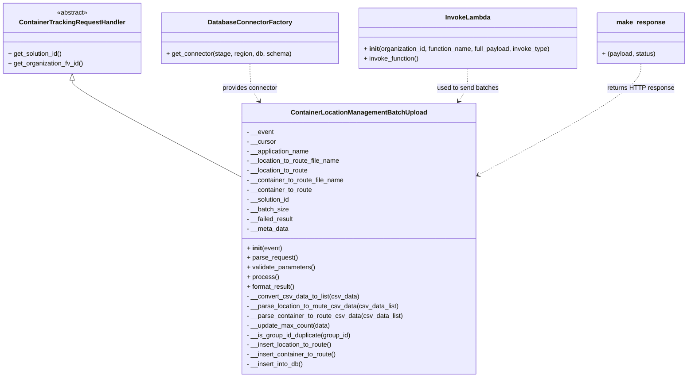
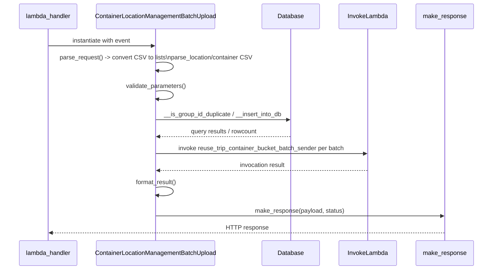
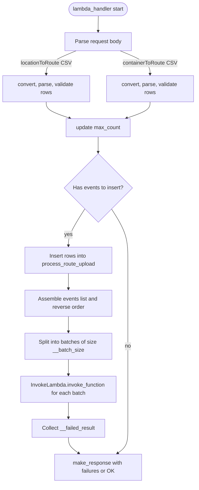

# Diagram: container_tracking_core/container_tracking_service/container_tracking_service/api/reuse_trip_container_bucket/batch_upload/reuse_trip_container_bucket_batch_upload.py

> Auto-generated by Obscura crawlers

## Diagram 1

### SVG

<svg id="container" width="1695.9921875" xmlns="http://www.w3.org/2000/svg" class="classDiagram" height="936" viewBox="0 0 1695.9921875 936" role="graphics-document document" aria-roledescription="class"><g><defs><marker id="container_class-aggregationStart" class="marker aggregation class" refX="18" refY="7" markerWidth="190" markerHeight="240" orient="auto"><path d="M 18,7 L9,13 L1,7 L9,1 Z"></path></marker></defs><defs><marker id="container_class-aggregationEnd" class="marker aggregation class" refX="1" refY="7" markerWidth="20" markerHeight="28" orient="auto"><path d="M 18,7 L9,13 L1,7 L9,1 Z"></path></marker></defs><defs><marker id="container_class-extensionStart" class="marker extension class" refX="18" refY="7" markerWidth="190" markerHeight="240" orient="auto"><path d="M 1,7 L18,13 V 1 Z"></path></marker></defs><defs><marker id="container_class-extensionEnd" class="marker extension class" refX="1" refY="7" markerWidth="20" markerHeight="28" orient="auto"><path d="M 1,1 V 13 L18,7 Z"></path></marker></defs><defs><marker id="container_class-compositionStart" class="marker composition class" refX="18" refY="7" markerWidth="190" markerHeight="240" orient="auto"><path d="M 18,7 L9,13 L1,7 L9,1 Z"></path></marker></defs><defs><marker id="container_class-compositionEnd" class="marker composition class" refX="1" refY="7" markerWidth="20" markerHeight="28" orient="auto"><path d="M 18,7 L9,13 L1,7 L9,1 Z"></path></marker></defs><defs><marker id="container_class-dependencyStart" class="marker dependency class" refX="6" refY="7" markerWidth="190" markerHeight="240" orient="auto"><path d="M 5,7 L9,13 L1,7 L9,1 Z"></path></marker></defs><defs><marker id="container_class-dependencyEnd" class="marker dependency class" refX="13" refY="7" markerWidth="20" markerHeight="28" orient="auto"><path d="M 18,7 L9,13 L14,7 L9,1 Z"></path></marker></defs><defs><marker id="container_class-lollipopStart" class="marker lollipop class" refX="13" refY="7" markerWidth="190" markerHeight="240" orient="auto"><circle stroke="black" fill="transparent" cx="7" cy="7" r="6"></circle></marker></defs><defs><marker id="container_class-lollipopEnd" class="marker lollipop class" refX="1" refY="7" markerWidth="190" markerHeight="240" orient="auto"><circle stroke="black" fill="transparent" cx="7" cy="7" r="6"></circle></marker></defs><g class="root"><g class="clusters"></g><g class="edgePaths"><path d="M176.129,199.25L176.129,202.542C176.129,205.833,176.129,212.417,245.753,252.618C315.378,292.819,454.626,366.637,524.251,403.547L593.875,440.456" id="id_ContainerTrackingRequestHandler_ContainerLocationManagementBatchUpload_1" class="edge-thickness-normal edge-pattern-solid relation" style=";;;" data-edge="true" data-et="edge" data-id="id_ContainerTrackingRequestHandler_ContainerLocationManagementBatchUpload_1" data-points="W3sieCI6MTc2LjEyODkwNjI1LCJ5IjoxODJ9LHsieCI6MTc2LjEyODkwNjI1LCJ5IjoyMTl9LHsieCI6NTkzLjg3NSwieSI6NDQwLjQ1NTg3MjMxMDg5NTJ9XQ==" marker-start="url(#container_class-extensionStart)"></path><path d="M609.883,158L609.883,168.167C609.883,178.333,609.883,198.667,613.758,214.19C617.633,229.713,625.384,240.426,629.259,245.782L633.135,251.139" id="id_DatabaseConnectorFactory_ContainerLocationManagementBatchUpload_2" class="edge-thickness-normal edge-pattern-dashed relation" style=";;;" data-edge="true" data-et="edge" data-id="id_DatabaseConnectorFactory_ContainerLocationManagementBatchUpload_2" data-points="W3sieCI6NjA5Ljg4MjgxMjUsInkiOjE1OH0seyJ4Ijo2MDkuODgyODEyNSwieSI6MjE5fSx7IngiOjYzNi42NTE3MDQ5MjYyNzM0LCJ5IjoyNTZ9XQ==" marker-end="url(#container_class-dependencyEnd)"></path><path d="M1149.602,170L1149.602,178.167C1149.602,186.333,1149.602,202.667,1145.726,216.19C1141.851,229.713,1134.1,240.426,1130.225,245.782L1126.35,251.139" id="id_InvokeLambda_ContainerLocationManagementBatchUpload_3" class="edge-thickness-normal edge-pattern-dashed relation" style=";;;" data-edge="true" data-et="edge" data-id="id_InvokeLambda_ContainerLocationManagementBatchUpload_3" data-points="W3sieCI6MTE0OS42MDE1NjI1LCJ5IjoxNzB9LHsieCI6MTE0OS42MDE1NjI1LCJ5IjoyMTl9LHsieCI6MTEyMi44MzI2NzAwNzM3MjY2LCJ5IjoyNTZ9XQ==" marker-end="url(#container_class-dependencyEnd)"></path><path d="M1580.844,158L1580.844,168.167C1580.844,178.333,1580.844,198.667,1512.521,245.182C1444.198,291.698,1307.552,364.397,1239.229,400.746L1170.906,437.095" id="id_make_response_ContainerLocationManagementBatchUpload_4" class="edge-thickness-normal edge-pattern-dashed relation" style=";;;" data-edge="true" data-et="edge" data-id="id_make_response_ContainerLocationManagementBatchUpload_4" data-points="W3sieCI6MTU4MC44NDM3NSwieSI6MTU4fSx7IngiOjE1ODAuODQzNzUsInkiOjIxOX0seyJ4IjoxMTY1LjYwOTM3NSwieSI6NDM5LjkxMjk2MDYzMTE0OTY0fV0=" marker-end="url(#container_class-dependencyEnd)"></path></g><g class="edgeLabels"><g class="edgeLabel"><g class="label" data-id="id_ContainerTrackingRequestHandler_ContainerLocationManagementBatchUpload_1" transform="translate(0, 0)"><foreignObject width="0" height="0">

</foreignObject></g></g><g class="edgeLabel" transform="translate(609.8828125, 219)"><g class="label" data-id="id_DatabaseConnectorFactory_ContainerLocationManagementBatchUpload_2" transform="translate(-69.859375, -12)"><foreignObject width="139.71875" height="24">

provides connector

</foreignObject></g></g><g class="edgeLabel" transform="translate(1149.6015625, 219)"><g class="label" data-id="id_InvokeLambda_ContainerLocationManagementBatchUpload_3" transform="translate(-77.3046875, -12)"><foreignObject width="154.609375" height="24">

used to send batches

</foreignObject></g></g><g class="edgeLabel" transform="translate(1580.84375, 219)"><g class="label" data-id="id_make_response_ContainerLocationManagementBatchUpload_4" transform="translate(-82.0234375, -12)"><foreignObject width="164.046875" height="24">

returns HTTP response

</foreignObject></g></g></g><g class="nodes"><g class="node default" id="classId-ContainerLocationManagementBatchUpload-0" transform="translate(879.7421875, 592)"><g class="basic label-container"><path d="M-285.8671875 -336 L285.8671875 -336 L285.8671875 336 L-285.8671875 336" stroke="none" stroke-width="0" fill="#ECECFF" style=""></path><path d="M-285.8671875 -336 C-140.75801208533093 -336, 4.351163329338135 -336, 285.8671875 -336 M-285.8671875 -336 C-97.92557992600871 -336, 90.01602764798258 -336, 285.8671875 -336 M285.8671875 -336 C285.8671875 -159.45250979331783, 285.8671875 17.09498041336434, 285.8671875 336 M285.8671875 -336 C285.8671875 -91.31331652193896, 285.8671875 153.37336695612208, 285.8671875 336 M285.8671875 336 C91.54616027022348 336, -102.77486695955304 336, -285.8671875 336 M285.8671875 336 C105.75855217148566 336, -74.35008315702868 336, -285.8671875 336 M-285.8671875 336 C-285.8671875 134.39790378655127, -285.8671875 -67.20419242689746, -285.8671875 -336 M-285.8671875 336 C-285.8671875 113.2878262408575, -285.8671875 -109.424347518285, -285.8671875 -336" stroke="#9370DB" stroke-width="1.3" fill="none" stroke-dasharray="0 0" style=""></path></g><g class="annotation-group text" transform="translate(0, -312)"></g><g class="label-group text" transform="translate(-160.875, -312)"><g class="label" style="font-weight: bolder" transform="translate(0,-12)"><foreignObject width="321.75" height="24">

ContainerLocationManagementBatchUpload

</foreignObject></g></g><g class="members-group text" transform="translate(-273.8671875, -264)"><g class="label" style="" transform="translate(0,-12)"><foreignObject width="67.1875" height="24">

- __event

</foreignObject></g><g class="label" style="" transform="translate(0,12)"><foreignObject width="72.578125" height="24">

- __cursor

</foreignObject></g><g class="label" style="" transform="translate(0,36)"><foreignObject width="157.796875" height="24">

- __application_name

</foreignObject></g><g class="label" style="" transform="translate(0,60)"><foreignObject width="234.375" height="24">

- __location_to_route_file_name

</foreignObject></g><g class="label" style="" transform="translate(0,84)"><foreignObject width="155.65625" height="24">

- __location_to_route

</foreignObject></g><g class="label" style="" transform="translate(0,108)"><foreignObject width="242.984375" height="24">

- __container_to_route_file_name

</foreignObject></g><g class="label" style="" transform="translate(0,132)"><foreignObject width="164.265625" height="24">

- __container_to_route

</foreignObject></g><g class="label" style="" transform="translate(0,156)"><foreignObject width="109.40625" height="24">

- __solution_id

</foreignObject></g><g class="label" style="" transform="translate(0,180)"><foreignObject width="103.6875" height="24">

- __batch_size

</foreignObject></g><g class="label" style="" transform="translate(0,204)"><foreignObject width="117.953125" height="24">

- __failed_result

</foreignObject></g><g class="label" style="" transform="translate(0,228)"><foreignObject width="104.609375" height="24">

- __meta_data

</foreignObject></g></g><g class="methods-group text" transform="translate(-273.8671875, 24)"><g class="label" style="" transform="translate(0,-12)"><foreignObject width="87.390625" height="24">

+ <strong>init</strong>(event)

</foreignObject></g><g class="label" style="" transform="translate(0,12)"><foreignObject width="126.046875" height="24">

+ parse_request()

</foreignObject></g><g class="label" style="" transform="translate(0,36)"><foreignObject width="170.953125" height="24">

+ validate_parameters()

</foreignObject></g><g class="label" style="" transform="translate(0,60)"><foreignObject width="77.96875" height="24">

+ process()

</foreignObject></g><g class="label" style="" transform="translate(0,84)"><foreignObject width="121.5" height="24">

+ format_result()

</foreignObject></g><g class="label" style="" transform="translate(0,108)"><foreignObject width="278.5625" height="24">

- __convert_csv_data_to_list(csv_data)

</foreignObject></g><g class="label" style="" transform="translate(0,132)"><foreignObject width="378.25" height="24">

- __parse_location_to_route_csv_data(csv_data_list)

</foreignObject></g><g class="label" style="" transform="translate(0,156)"><foreignObject width="386.859375" height="24">

- __parse_container_to_route_csv_data(csv_data_list)

</foreignObject></g><g class="label" style="" transform="translate(0,180)"><foreignObject width="208.515625" height="24">

- __update_max_count(data)

</foreignObject></g><g class="label" style="" transform="translate(0,204)"><foreignObject width="262.21875" height="24">

- __is_group_id_duplicate(group_id)

</foreignObject></g><g class="label" style="" transform="translate(0,228)"><foreignObject width="216.375" height="24">

- __insert_location_to_route()

</foreignObject></g><g class="label" style="" transform="translate(0,252)"><foreignObject width="224.984375" height="24">

- __insert_container_to_route()

</foreignObject></g><g class="label" style="" transform="translate(0,276)"><foreignObject width="143.421875" height="24">

- __insert_into_db()

</foreignObject></g></g><g class="divider" style=""><path d="M-285.8671875 -288 C-124.33575520224682 -288, 37.19567709550637 -288, 285.8671875 -288 M-285.8671875 -288 C-134.81890706945578 -288, 16.22937336108845 -288, 285.8671875 -288" stroke="#9370DB" stroke-width="1.3" fill="none" stroke-dasharray="0 0" style=""></path></g><g class="divider" style=""><path d="M-285.8671875 0 C-127.85071716248703 0, 30.16575317502594 0, 285.8671875 0 M-285.8671875 0 C-156.4367491855925 0, -27.006310871185008 0, 285.8671875 0" stroke="#9370DB" stroke-width="1.3" fill="none" stroke-dasharray="0 0" style=""></path></g></g><g class="node default" id="classId-ContainerTrackingRequestHandler-1" transform="translate(176.12890625, 95)"><g class="basic label-container"><path d="M-168.12890625 -87 L168.12890625 -87 L168.12890625 87 L-168.12890625 87" stroke="none" stroke-width="0" fill="#ECECFF" style=""></path><path d="M-168.12890625 -87 C-94.83502211203404 -87, -21.54113797406808 -87, 168.12890625 -87 M-168.12890625 -87 C-69.42218582578982 -87, 29.28453459842035 -87, 168.12890625 -87 M168.12890625 -87 C168.12890625 -39.59427684725317, 168.12890625 7.811446305493661, 168.12890625 87 M168.12890625 -87 C168.12890625 -46.33027687974431, 168.12890625 -5.6605537594886215, 168.12890625 87 M168.12890625 87 C45.39529026512642 87, -77.33832571974716 87, -168.12890625 87 M168.12890625 87 C78.97791373895456 87, -10.17307877209089 87, -168.12890625 87 M-168.12890625 87 C-168.12890625 38.49545376662818, -168.12890625 -10.009092466743638, -168.12890625 -87 M-168.12890625 87 C-168.12890625 51.94476921954371, -168.12890625 16.889538439087417, -168.12890625 -87" stroke="#9370DB" stroke-width="1.3" fill="none" stroke-dasharray="0 0" style=""></path></g><g class="annotation-group text" transform="translate(-38.609375, -63)"><g class="label" style="" transform="translate(0,-12)"><foreignObject width="77.21875" height="24">

«abstract»

</foreignObject></g></g><g class="label-group text" transform="translate(-125.5859375, -39)"><g class="label" style="font-weight: bolder" transform="translate(0,-12)"><foreignObject width="251.171875" height="24">

ContainerTrackingRequestHandler

</foreignObject></g></g><g class="members-group text" transform="translate(-156.12890625, 9)"></g><g class="methods-group text" transform="translate(-156.12890625, 39)"><g class="label" style="" transform="translate(0,-12)"><foreignObject width="135.703125" height="24">

+ get_solution_id()

</foreignObject></g><g class="label" style="" transform="translate(0,12)"><foreignObject width="186.671875" height="24">

+ get_organization_fv_id()

</foreignObject></g></g><g class="divider" style=""><path d="M-168.12890625 -15 C-47.51970802295298 -15, 73.08949020409403 -15, 168.12890625 -15 M-168.12890625 -15 C-39.982958359166076 -15, 88.16298953166785 -15, 168.12890625 -15" stroke="#9370DB" stroke-width="1.3" fill="none" stroke-dasharray="0 0" style=""></path></g><g class="divider" style=""><path d="M-168.12890625 9 C-97.89676130259296 9, -27.664616355185927 9, 168.12890625 9 M-168.12890625 9 C-42.63144036436243 9, 82.86602552127513 9, 168.12890625 9" stroke="#9370DB" stroke-width="1.3" fill="none" stroke-dasharray="0 0" style=""></path></g></g><g class="node default" id="classId-DatabaseConnectorFactory-2" transform="translate(609.8828125, 95)"><g class="basic label-container"><path d="M-215.625 -63 L215.625 -63 L215.625 63 L-215.625 63" stroke="none" stroke-width="0" fill="#ECECFF" style=""></path><path d="M-215.625 -63 C-110.93744949206953 -63, -6.249898984139065 -63, 215.625 -63 M-215.625 -63 C-57.0464954745575 -63, 101.532009050885 -63, 215.625 -63 M215.625 -63 C215.625 -24.652769727236084, 215.625 13.694460545527832, 215.625 63 M215.625 -63 C215.625 -31.96708446861303, 215.625 -0.9341689372260618, 215.625 63 M215.625 63 C106.92530270899238 63, -1.7743945820152476 63, -215.625 63 M215.625 63 C73.88855959667086 63, -67.84788080665828 63, -215.625 63 M-215.625 63 C-215.625 21.066767062538368, -215.625 -20.866465874923264, -215.625 -63 M-215.625 63 C-215.625 37.781574467934945, -215.625 12.563148935869883, -215.625 -63" stroke="#9370DB" stroke-width="1.3" fill="none" stroke-dasharray="0 0" style=""></path></g><g class="annotation-group text" transform="translate(0, -39)"></g><g class="label-group text" transform="translate(-98.1875, -39)"><g class="label" style="font-weight: bolder" transform="translate(0,-12)"><foreignObject width="196.375" height="24">

DatabaseConnectorFactory

</foreignObject></g></g><g class="members-group text" transform="translate(-203.625, 9)"></g><g class="methods-group text" transform="translate(-203.625, 39)"><g class="label" style="" transform="translate(0,-12)"><foreignObject width="309.0625" height="24">

+ get_connector(stage, region, db, schema)

</foreignObject></g></g><g class="divider" style=""><path d="M-215.625 -15 C-58.75465769315704 -15, 98.11568461368591 -15, 215.625 -15 M-215.625 -15 C-96.96147257771565 -15, 21.702054844568693 -15, 215.625 -15" stroke="#9370DB" stroke-width="1.3" fill="none" stroke-dasharray="0 0" style=""></path></g><g class="divider" style=""><path d="M-215.625 9 C-99.0655322364431 9, 17.49393552711379 9, 215.625 9 M-215.625 9 C-45.386795284406304 9, 124.85140943118739 9, 215.625 9" stroke="#9370DB" stroke-width="1.3" fill="none" stroke-dasharray="0 0" style=""></path></g></g><g class="node default" id="classId-InvokeLambda-3" transform="translate(1149.6015625, 95)"><g class="basic label-container"><path d="M-274.09375 -75 L274.09375 -75 L274.09375 75 L-274.09375 75" stroke="none" stroke-width="0" fill="#ECECFF" style=""></path><path d="M-274.09375 -75 C-100.64385891140958 -75, 72.80603217718084 -75, 274.09375 -75 M-274.09375 -75 C-119.6809972120924 -75, 34.731755575815214 -75, 274.09375 -75 M274.09375 -75 C274.09375 -30.618232033543272, 274.09375 13.763535932913456, 274.09375 75 M274.09375 -75 C274.09375 -33.47865216947089, 274.09375 8.042695661058218, 274.09375 75 M274.09375 75 C100.52232536122551 75, -73.04909927754898 75, -274.09375 75 M274.09375 75 C145.3423345301622 75, 16.59091906032438 75, -274.09375 75 M-274.09375 75 C-274.09375 29.47514077786486, -274.09375 -16.049718444270283, -274.09375 -75 M-274.09375 75 C-274.09375 20.575109406665582, -274.09375 -33.849781186668835, -274.09375 -75" stroke="#9370DB" stroke-width="1.3" fill="none" stroke-dasharray="0 0" style=""></path></g><g class="annotation-group text" transform="translate(0, -51)"></g><g class="label-group text" transform="translate(-53.484375, -51)"><g class="label" style="font-weight: bolder" transform="translate(0,-12)"><foreignObject width="106.96875" height="24">

InvokeLambda

</foreignObject></g></g><g class="members-group text" transform="translate(-262.09375, -3)"></g><g class="methods-group text" transform="translate(-262.09375, 27)"><g class="label" style="" transform="translate(0,-12)"><foreignObject width="470.703125" height="24">

+ <strong>init</strong>(organization_id, function_name, full_payload, invoke_type)

</foreignObject></g><g class="label" style="" transform="translate(0,12)"><foreignObject width="138.6875" height="24">

+ invoke_function()

</foreignObject></g></g><g class="divider" style=""><path d="M-274.09375 -27 C-76.0408888066732 -27, 122.01197238665361 -27, 274.09375 -27 M-274.09375 -27 C-147.38890147012995 -27, -20.68405294025993 -27, 274.09375 -27" stroke="#9370DB" stroke-width="1.3" fill="none" stroke-dasharray="0 0" style=""></path></g><g class="divider" style=""><path d="M-274.09375 -3 C-154.96713876144076 -3, -35.84052752288153 -3, 274.09375 -3 M-274.09375 -3 C-157.3030617844442 -3, -40.51237356888839 -3, 274.09375 -3" stroke="#9370DB" stroke-width="1.3" fill="none" stroke-dasharray="0 0" style=""></path></g></g><g class="node default" id="classId-make_response-4" transform="translate(1580.84375, 95)"><g class="basic label-container"><path d="M-107.1484375 -63 L107.1484375 -63 L107.1484375 63 L-107.1484375 63" stroke="none" stroke-width="0" fill="#ECECFF" style=""></path><path d="M-107.1484375 -63 C-27.76706482163867 -63, 51.61430785672266 -63, 107.1484375 -63 M-107.1484375 -63 C-27.66641989381627 -63, 51.81559771236746 -63, 107.1484375 -63 M107.1484375 -63 C107.1484375 -13.90702292166521, 107.1484375 35.18595415666958, 107.1484375 63 M107.1484375 -63 C107.1484375 -35.81175341617621, 107.1484375 -8.623506832352419, 107.1484375 63 M107.1484375 63 C57.35891481399411 63, 7.569392127988223 63, -107.1484375 63 M107.1484375 63 C25.817606583560448 63, -55.513224332879105 63, -107.1484375 63 M-107.1484375 63 C-107.1484375 16.23889009424559, -107.1484375 -30.52221981150882, -107.1484375 -63 M-107.1484375 63 C-107.1484375 15.830314919975429, -107.1484375 -31.339370160049143, -107.1484375 -63" stroke="#9370DB" stroke-width="1.3" fill="none" stroke-dasharray="0 0" style=""></path></g><g class="annotation-group text" transform="translate(0, -39)"></g><g class="label-group text" transform="translate(-57.46875, -39)"><g class="label" style="font-weight: bolder" transform="translate(0,-12)"><foreignObject width="114.9375" height="24">

make_response

</foreignObject></g></g><g class="members-group text" transform="translate(-95.1484375, 9)"></g><g class="methods-group text" transform="translate(-95.1484375, 39)"><g class="label" style="" transform="translate(0,-12)"><foreignObject width="132.828125" height="24">

+ (payload, status)

</foreignObject></g></g><g class="divider" style=""><path d="M-107.1484375 -15 C-41.87143597105633 -15, 23.405565557887343 -15, 107.1484375 -15 M-107.1484375 -15 C-41.180652780168785 -15, 24.78713193966243 -15, 107.1484375 -15" stroke="#9370DB" stroke-width="1.3" fill="none" stroke-dasharray="0 0" style=""></path></g><g class="divider" style=""><path d="M-107.1484375 9 C-54.62536305488927 9, -2.1022886097785403 9, 107.1484375 9 M-107.1484375 9 C-29.11855619034364 9, 48.91132511931272 9, 107.1484375 9" stroke="#9370DB" stroke-width="1.3" fill="none" stroke-dasharray="0 0" style=""></path></g></g></g></g></g></svg>

## Diagram 2

> SVG rendering failed for this diagram.

## Diagram 3

> SVG rendering failed for this diagram.
