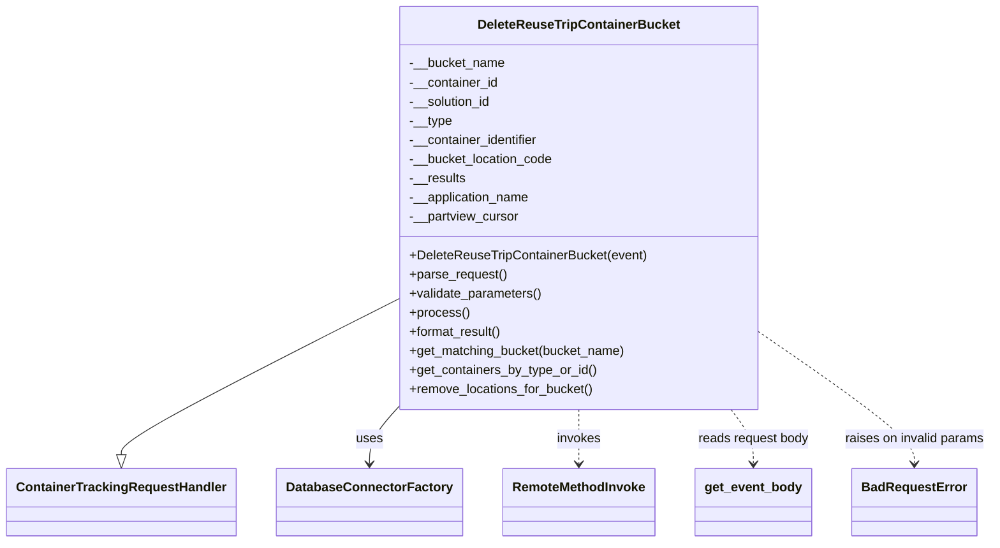
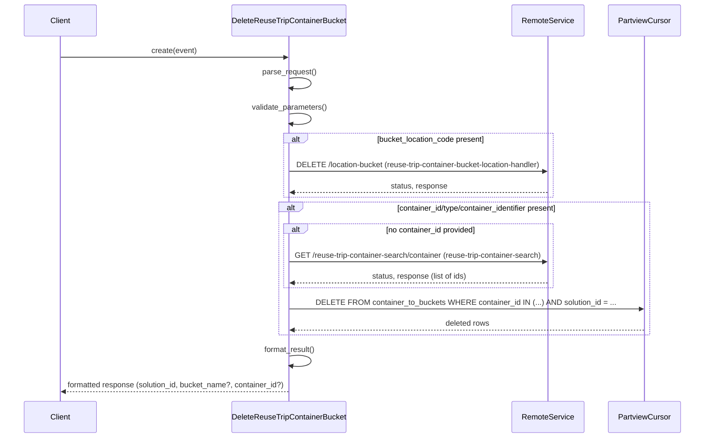

# Diagram: container_tracking_core/container_tracking_service/container_tracking_service/api/reuse_trip_container_bucket/bucket_management/handlers/delete_reuse_trip_container_bucket_to_container.py

> Auto-generated by Obscura crawlers

## Diagram 1

> SVG rendering failed for this diagram.

## Diagram 2

> SVG rendering failed for this diagram.
