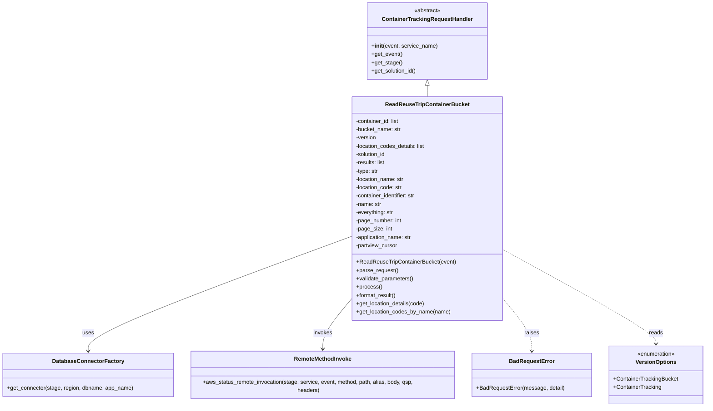

# Diagram: container_tracking_core/container_tracking_service/container_tracking_service/api/reuse_trip_container_bucket/bucket_management/handlers/get_reuse_trip_container_bucket.py


> Auto-generated by Obscura crawlers

## Diagram 1



### SVG

<svg id="container" width="2045.71875" xmlns="http://www.w3.org/2000/svg" class="classDiagram" height="1178" viewBox="0 0 2045.71875 1178" role="graphics-document document" aria-roledescription="class"><style>#container{font-family:"trebuchet ms",verdana,arial,sans-serif;font-size:16px;fill:#333;}@keyframes edge-animation-frame{from{stroke-dashoffset:0;}}@keyframes dash{to{stroke-dashoffset:0;}}#container .edge-animation-slow{stroke-dasharray:9,5!important;stroke-dashoffset:900;animation:dash 50s linear infinite;stroke-linecap:round;}#container .edge-animation-fast{stroke-dasharray:9,5!important;stroke-dashoffset:900;animation:dash 20s linear infinite;stroke-linecap:round;}#container .error-icon{fill:#552222;}#container .error-text{fill:#552222;stroke:#552222;}#container .edge-thickness-normal{stroke-width:1px;}#container .edge-thickness-thick{stroke-width:3.5px;}#container .edge-pattern-solid{stroke-dasharray:0;}#container .edge-thickness-invisible{stroke-width:0;fill:none;}#container .edge-pattern-dashed{stroke-dasharray:3;}#container .edge-pattern-dotted{stroke-dasharray:2;}#container .marker{fill:#333333;stroke:#333333;}#container .marker.cross{stroke:#333333;}#container svg{font-family:"trebuchet ms",verdana,arial,sans-serif;font-size:16px;}#container p{margin:0;}#container g.classGroup text{fill:#9370DB;stroke:none;font-family:"trebuchet ms",verdana,arial,sans-serif;font-size:10px;}#container g.classGroup text .title{font-weight:bolder;}#container .nodeLabel,#container .edgeLabel{color:#131300;}#container .edgeLabel .label rect{fill:#ECECFF;}#container .label text{fill:#131300;}#container .labelBkg{background:#ECECFF;}#container .edgeLabel .label span{background:#ECECFF;}#container .classTitle{font-weight:bolder;}#container .node rect,#container .node circle,#container .node ellipse,#container .node polygon,#container .node path{fill:#ECECFF;stroke:#9370DB;stroke-width:1px;}#container .divider{stroke:#9370DB;stroke-width:1;}#container g.clickable{cursor:pointer;}#container g.classGroup rect{fill:#ECECFF;stroke:#9370DB;}#container g.classGroup line{stroke:#9370DB;stroke-width:1;}#container .classLabel .box{stroke:none;stroke-width:0;fill:#ECECFF;opacity:0.5;}#container .classLabel .label{fill:#9370DB;font-size:10px;}#container .relation{stroke:#333333;stroke-width:1;fill:none;}#container .dashed-line{stroke-dasharray:3;}#container .dotted-line{stroke-dasharray:1 2;}#container #compositionStart,#container .composition{fill:#333333!important;stroke:#333333!important;stroke-width:1;}#container #compositionEnd,#container .composition{fill:#333333!important;stroke:#333333!important;stroke-width:1;}#container #dependencyStart,#container .dependency{fill:#333333!important;stroke:#333333!important;stroke-width:1;}#container #dependencyStart,#container .dependency{fill:#333333!important;stroke:#333333!important;stroke-width:1;}#container #extensionStart,#container .extension{fill:transparent!important;stroke:#333333!important;stroke-width:1;}#container #extensionEnd,#container .extension{fill:transparent!important;stroke:#333333!important;stroke-width:1;}#container #aggregationStart,#container .aggregation{fill:transparent!important;stroke:#333333!important;stroke-width:1;}#container #aggregationEnd,#container .aggregation{fill:transparent!important;stroke:#333333!important;stroke-width:1;}#container #lollipopStart,#container .lollipop{fill:#ECECFF!important;stroke:#333333!important;stroke-width:1;}#container #lollipopEnd,#container .lollipop{fill:#ECECFF!important;stroke:#333333!important;stroke-width:1;}#container .edgeTerminals{font-size:11px;line-height:initial;}#container .classTitleText{text-anchor:middle;font-size:18px;fill:#333;}#container .label-icon{display:inline-block;height:1em;overflow:visible;vertical-align:-0.125em;}#container .node .label-icon path{fill:currentColor;stroke:revert;stroke-width:revert;}#container :root{--mermaid-font-family:"trebuchet ms",verdana,arial,sans-serif;}</style><g><defs><marker id="container_class-aggregationStart" class="marker aggregation class" refX="18" refY="7" markerWidth="190" markerHeight="240" orient="auto"><path d="M 18,7 L9,13 L1,7 L9,1 Z"></path></marker></defs><defs><marker id="container_class-aggregationEnd" class="marker aggregation class" refX="1" refY="7" markerWidth="20" markerHeight="28" orient="auto"><path d="M 18,7 L9,13 L1,7 L9,1 Z"></path></marker></defs><defs><marker id="container_class-extensionStart" class="marker extension class" refX="18" refY="7" markerWidth="190" markerHeight="240" orient="auto"><path d="M 1,7 L18,13 V 1 Z"></path></marker></defs><defs><marker id="container_class-extensionEnd" class="marker extension class" refX="1" refY="7" markerWidth="20" markerHeight="28" orient="auto"><path d="M 1,1 V 13 L18,7 Z"></path></marker></defs><defs><marker id="container_class-compositionStart" class="marker composition class" refX="18" refY="7" markerWidth="190" markerHeight="240" orient="auto"><path d="M 18,7 L9,13 L1,7 L9,1 Z"></path></marker></defs><defs><marker id="container_class-compositionEnd" class="marker composition class" refX="1" refY="7" markerWidth="20" markerHeight="28" orient="auto"><path d="M 18,7 L9,13 L1,7 L9,1 Z"></path></marker></defs><defs><marker id="container_class-dependencyStart" class="marker dependency class" refX="6" refY="7" markerWidth="190" markerHeight="240" orient="auto"><path d="M 5,7 L9,13 L1,7 L9,1 Z"></path></marker></defs><defs><marker id="container_class-dependencyEnd" class="marker dependency class" refX="13" refY="7" markerWidth="20" markerHeight="28" orient="auto"><path d="M 18,7 L9,13 L14,7 L9,1 Z"></path></marker></defs><defs><marker id="container_class-lollipopStart" class="marker lollipop class" refX="13" refY="7" markerWidth="190" markerHeight="240" orient="auto"><circle stroke="black" fill="transparent" cx="7" cy="7" r="6"></circle></marker></defs><defs><marker id="container_class-lollipopEnd" class="marker lollipop class" refX="1" refY="7" markerWidth="190" markerHeight="240" orient="auto"><circle stroke="black" fill="transparent" cx="7" cy="7" r="6"></circle></marker></defs><g class="root"><g class="clusters"></g><g class="edgePaths"><path d="M1244.018,247.25L1244.018,248.542C1244.018,249.833,1244.018,252.417,1244.018,257.875C1244.018,263.333,1244.018,271.667,1244.018,275.833L1244.018,280" id="id_ContainerTrackingRequestHandler_ReadReuseTripContainerBucket_1" class="edge-thickness-normal edge-pattern-solid relation" style=";;;" data-edge="true" data-et="edge" data-id="id_ContainerTrackingRequestHandler_ReadReuseTripContainerBucket_1" data-points="W3sieCI6MTI0NC4wMTc1NzgxMjUsInkiOjIzMH0seyJ4IjoxMjQ0LjAxNzU3ODEyNSwieSI6MjU1fSx7IngiOjEyNDQuMDE3NTc4MTI1LCJ5IjoyODB9XQ==" marker-start="url(#container_class-extensionStart)"></path><path d="M1031.084,681.492L901.246,728.743C771.408,775.995,511.731,870.497,381.893,926.415C252.055,982.333,252.055,999.667,252.055,1008.333L252.055,1017" id="id_ReadReuseTripContainerBucket_DatabaseConnectorFactory_2" class="edge-thickness-normal edge-pattern-solid relation" style=";;;" data-edge="true" data-et="edge" data-id="id_ReadReuseTripContainerBucket_DatabaseConnectorFactory_2" data-points="W3sieCI6MTAzMS4wODM5ODQzNzUsInkiOjY4MS40OTE4Mzc3MTkxNjg4fSx7IngiOjI1Mi4wNTQ2ODc1LCJ5Ijo5NjV9LHsieCI6MjUyLjA1NDY4NzUsInkiOjEwMjN9XQ==" marker-end="url(#container_class-dependencyEnd)"></path><path d="M1031.084,855.285L1015.589,873.57C1000.094,891.856,969.104,928.428,953.608,955.381C938.113,982.333,938.113,999.667,938.113,1008.333L938.113,1017" id="id_ReadReuseTripContainerBucket_RemoteMethodInvoke_3" class="edge-thickness-normal edge-pattern-solid relation" style=";;;" data-edge="true" data-et="edge" data-id="id_ReadReuseTripContainerBucket_RemoteMethodInvoke_3" data-points="W3sieCI6MTAzMS4wODM5ODQzNzUsInkiOjg1NS4yODQ1NjIyOTI4OTQ0fSx7IngiOjkzOC4xMTMyODEyNSwieSI6OTY1fSx7IngiOjkzOC4xMTMyODEyNSwieSI6MTAyM31d" marker-end="url(#container_class-dependencyEnd)"></path><path d="M1456.951,855.285L1472.446,873.57C1487.941,891.856,1518.932,928.428,1534.427,955.381C1549.922,982.333,1549.922,999.667,1549.922,1008.333L1549.922,1017" id="id_ReadReuseTripContainerBucket_BadRequestError_4" class="edge-thickness-normal edge-pattern-dashed relation" style=";;;" data-edge="true" data-et="edge" data-id="id_ReadReuseTripContainerBucket_BadRequestError_4" data-points="W3sieCI6MTQ1Ni45NTExNzE4NzUsInkiOjg1NS4yODQ1NjIyOTI4OTQ0fSx7IngiOjE1NDkuOTIxODc1LCJ5Ijo5NjV9LHsieCI6MTU0OS45MjE4NzUsInkiOjEwMjN9XQ==" marker-end="url(#container_class-dependencyEnd)"></path><path d="M1456.951,720.52L1531.413,761.267C1605.875,802.014,1754.799,883.507,1829.261,929.42C1903.723,975.333,1903.723,985.667,1903.723,990.833L1903.723,996" id="id_ReadReuseTripContainerBucket_VersionOptions_5" class="edge-thickness-normal edge-pattern-dashed relation" style=";;;" data-edge="true" data-et="edge" data-id="id_ReadReuseTripContainerBucket_VersionOptions_5" data-points="W3sieCI6MTQ1Ni45NTExNzE4NzUsInkiOjcyMC41MjAyOTA0OTQzOTExfSx7IngiOjE5MDMuNzIyNjU2MjUsInkiOjk2NX0seyJ4IjoxOTAzLjcyMjY1NjI1LCJ5IjoxMDAyfV0=" marker-end="url(#container_class-dependencyEnd)"></path></g><g class="edgeLabels"><g class="edgeLabel"><g class="label" data-id="id_ContainerTrackingRequestHandler_ReadReuseTripContainerBucket_1" transform="translate(0, 0)"><foreignObject width="0" height="0"><div xmlns="http://www.w3.org/1999/xhtml" class="labelBkg" style="display: table-cell; white-space: nowrap; line-height: 1.5; max-width: 200px; text-align: center;"><span class="edgeLabel"></span></div></foreignObject></g></g><g class="edgeLabel" transform="translate(252.0546875, 965)"><g class="label" data-id="id_ReadReuseTripContainerBucket_DatabaseConnectorFactory_2" transform="translate(-16.4921875, -12)"><foreignObject width="32.984375" height="24"><div xmlns="http://www.w3.org/1999/xhtml" class="labelBkg" style="display: table-cell; white-space: nowrap; line-height: 1.5; max-width: 200px; text-align: center;"><span class="edgeLabel"><p>uses</p></span></div></foreignObject></g></g><g class="edgeLabel" transform="translate(938.11328125, 965)"><g class="label" data-id="id_ReadReuseTripContainerBucket_RemoteMethodInvoke_3" transform="translate(-27.5859375, -12)"><foreignObject width="55.171875" height="24"><div xmlns="http://www.w3.org/1999/xhtml" class="labelBkg" style="display: table-cell; white-space: nowrap; line-height: 1.5; max-width: 200px; text-align: center;"><span class="edgeLabel"><p>invokes</p></span></div></foreignObject></g></g><g class="edgeLabel" transform="translate(1549.921875, 965)"><g class="label" data-id="id_ReadReuseTripContainerBucket_BadRequestError_4" transform="translate(-21.25, -12)"><foreignObject width="42.5" height="24"><div xmlns="http://www.w3.org/1999/xhtml" class="labelBkg" style="display: table-cell; white-space: nowrap; line-height: 1.5; max-width: 200px; text-align: center;"><span class="edgeLabel"><p>raises</p></span></div></foreignObject></g></g><g class="edgeLabel" transform="translate(1903.72265625, 965)"><g class="label" data-id="id_ReadReuseTripContainerBucket_VersionOptions_5" transform="translate(-20.0078125, -12)"><foreignObject width="40.015625" height="24"><div xmlns="http://www.w3.org/1999/xhtml" class="labelBkg" style="display: table-cell; white-space: nowrap; line-height: 1.5; max-width: 200px; text-align: center;"><span class="edgeLabel"><p>reads</p></span></div></foreignObject></g></g></g><g class="nodes"><g class="node default" id="classId-ContainerTrackingRequestHandler-0" transform="translate(1244.017578125, 119)"><g class="basic label-container"><path d="M-170.08984375 -111 L170.08984375 -111 L170.08984375 111 L-170.08984375 111" stroke="none" stroke-width="0" fill="#ECECFF" style=""></path><path d="M-170.08984375 -111 C-72.73915169405552 -111, 24.611540361888956 -111, 170.08984375 -111 M-170.08984375 -111 C-95.85499029126075 -111, -21.620136832521496 -111, 170.08984375 -111 M170.08984375 -111 C170.08984375 -26.12622552820237, 170.08984375 58.74754894359526, 170.08984375 111 M170.08984375 -111 C170.08984375 -43.50990746209925, 170.08984375 23.9801850758015, 170.08984375 111 M170.08984375 111 C64.0795245206031 111, -41.9307947087938 111, -170.08984375 111 M170.08984375 111 C70.32848084089484 111, -29.43288206821032 111, -170.08984375 111 M-170.08984375 111 C-170.08984375 51.950659999311966, -170.08984375 -7.098680001376067, -170.08984375 -111 M-170.08984375 111 C-170.08984375 61.38659289212748, -170.08984375 11.773185784254963, -170.08984375 -111" stroke="#9370DB" stroke-width="1.3" fill="none" stroke-dasharray="0 0" style=""></path></g><g class="annotation-group text" transform="translate(-38.609375, -87)"><g class="label" style="" transform="translate(0,-12)"><foreignObject width="77.21875" height="24"><div xmlns="http://www.w3.org/1999/xhtml" style="display: table-cell; white-space: nowrap; line-height: 1.5; max-width: 127px; text-align: center;"><span class="nodeLabel markdown-node-label" style=""><p>«abstract»</p></span></div></foreignObject></g></g><g class="label-group text" transform="translate(-125.5859375, -63)"><g class="label" style="font-weight: bolder" transform="translate(0,-12)"><foreignObject width="251.171875" height="24"><div xmlns="http://www.w3.org/1999/xhtml" style="display: table-cell; white-space: nowrap; line-height: 1.5; max-width: 299px; text-align: center;"><span class="nodeLabel markdown-node-label" style=""><p>ContainerTrackingRequestHandler</p></span></div></foreignObject></g></g><g class="members-group text" transform="translate(-158.08984375, -15)"></g><g class="methods-group text" transform="translate(-158.08984375, 15)"><g class="label" style="" transform="translate(0,-12)"><foreignObject width="190.59375" height="24"><div xmlns="http://www.w3.org/1999/xhtml" style="display: table-cell; white-space: nowrap; line-height: 1.5; max-width: 279px; text-align: center;"><span class="nodeLabel markdown-node-label" style=""><p>+<strong>init</strong>(event, service_name)</p></span></div></foreignObject></g><g class="label" style="" transform="translate(0,12)"><foreignObject width="89.25" height="24"><div xmlns="http://www.w3.org/1999/xhtml" style="display: table-cell; white-space: nowrap; line-height: 1.5; max-width: 147px; text-align: center;"><span class="nodeLabel markdown-node-label" style=""><p>+get_event()</p></span></div></foreignObject></g><g class="label" style="" transform="translate(0,36)"><foreignObject width="87.703125" height="24"><div xmlns="http://www.w3.org/1999/xhtml" style="display: table-cell; white-space: nowrap; line-height: 1.5; max-width: 145px; text-align: center;"><span class="nodeLabel markdown-node-label" style=""><p>+get_stage()</p></span></div></foreignObject></g><g class="label" style="" transform="translate(0,60)"><foreignObject width="131.46875" height="24"><div xmlns="http://www.w3.org/1999/xhtml" style="display: table-cell; white-space: nowrap; line-height: 1.5; max-width: 189px; text-align: center;"><span class="nodeLabel markdown-node-label" style=""><p>+get_solution_id()</p></span></div></foreignObject></g></g><g class="divider" style=""><path d="M-170.08984375 -39 C-83.5502197714693 -39, 2.9894042070613978 -39, 170.08984375 -39 M-170.08984375 -39 C-81.25218682231672 -39, 7.585470105366568 -39, 170.08984375 -39" stroke="#9370DB" stroke-width="1.3" fill="none" stroke-dasharray="0 0" style=""></path></g><g class="divider" style=""><path d="M-170.08984375 -15 C-75.94360323453311 -15, 18.20263728093377 -15, 170.08984375 -15 M-170.08984375 -15 C-78.59696039696979 -15, 12.895922956060417 -15, 170.08984375 -15" stroke="#9370DB" stroke-width="1.3" fill="none" stroke-dasharray="0 0" style=""></path></g></g><g class="node default" id="classId-ReadReuseTripContainerBucket-1" transform="translate(1244.017578125, 604)"><g class="basic label-container"><path d="M-212.93359375 -324 L212.93359375 -324 L212.93359375 324 L-212.93359375 324" stroke="none" stroke-width="0" fill="#ECECFF" style=""></path><path d="M-212.93359375 -324 C-63.813389195767996 -324, 85.30681535846401 -324, 212.93359375 -324 M-212.93359375 -324 C-117.97891136765432 -324, -23.02422898530864 -324, 212.93359375 -324 M212.93359375 -324 C212.93359375 -120.85096437007999, 212.93359375 82.29807125984001, 212.93359375 324 M212.93359375 -324 C212.93359375 -98.62647142650715, 212.93359375 126.7470571469857, 212.93359375 324 M212.93359375 324 C83.58392368574363 324, -45.765746378512745 324, -212.93359375 324 M212.93359375 324 C50.91627465709297 324, -111.10104443581406 324, -212.93359375 324 M-212.93359375 324 C-212.93359375 177.71885728039257, -212.93359375 31.43771456078514, -212.93359375 -324 M-212.93359375 324 C-212.93359375 92.92994654984608, -212.93359375 -138.14010690030784, -212.93359375 -324" stroke="#9370DB" stroke-width="1.3" fill="none" stroke-dasharray="0 0" style=""></path></g><g class="annotation-group text" transform="translate(0, -300)"></g><g class="label-group text" transform="translate(-115.5078125, -300)"><g class="label" style="font-weight: bolder" transform="translate(0,-12)"><foreignObject width="231.015625" height="24"><div xmlns="http://www.w3.org/1999/xhtml" style="display: table-cell; white-space: nowrap; line-height: 1.5; max-width: 278px; text-align: center;"><span class="nodeLabel markdown-node-label" style=""><p>ReadReuseTripContainerBucket</p></span></div></foreignObject></g></g><g class="members-group text" transform="translate(-200.93359375, -252)"><g class="label" style="" transform="translate(0,-12)"><foreignObject width="127.296875" height="24"><div xmlns="http://www.w3.org/1999/xhtml" style="display: table-cell; white-space: nowrap; line-height: 1.5; max-width: 185px; text-align: center;"><span class="nodeLabel markdown-node-label" style=""><p>-container_id: list</p></span></div></foreignObject></g><g class="label" style="" transform="translate(0,12)"><foreignObject width="131.796875" height="24"><div xmlns="http://www.w3.org/1999/xhtml" style="display: table-cell; white-space: nowrap; line-height: 1.5; max-width: 190px; text-align: center;"><span class="nodeLabel markdown-node-label" style=""><p>-bucket_name: str</p></span></div></foreignObject></g><g class="label" style="" transform="translate(0,36)"><foreignObject width="59.46875" height="24"><div xmlns="http://www.w3.org/1999/xhtml" style="display: table-cell; white-space: nowrap; line-height: 1.5; max-width: 117px; text-align: center;"><span class="nodeLabel markdown-node-label" style=""><p>-version</p></span></div></foreignObject></g><g class="label" style="" transform="translate(0,60)"><foreignObject width="203.578125" height="24"><div xmlns="http://www.w3.org/1999/xhtml" style="display: table-cell; white-space: nowrap; line-height: 1.5; max-width: 261px; text-align: center;"><span class="nodeLabel markdown-node-label" style=""><p>-location_codes_details: list</p></span></div></foreignObject></g><g class="label" style="" transform="translate(0,84)"><foreignObject width="88.6875" height="24"><div xmlns="http://www.w3.org/1999/xhtml" style="display: table-cell; white-space: nowrap; line-height: 1.5; max-width: 146px; text-align: center;"><span class="nodeLabel markdown-node-label" style=""><p>-solution_id</p></span></div></foreignObject></g><g class="label" style="" transform="translate(0,108)"><foreignObject width="86.125" height="24"><div xmlns="http://www.w3.org/1999/xhtml" style="display: table-cell; white-space: nowrap; line-height: 1.5; max-width: 144px; text-align: center;"><span class="nodeLabel markdown-node-label" style=""><p>-results: list</p></span></div></foreignObject></g><g class="label" style="" transform="translate(0,132)"><foreignObject width="65.671875" height="24"><div xmlns="http://www.w3.org/1999/xhtml" style="display: table-cell; white-space: nowrap; line-height: 1.5; max-width: 124px; text-align: center;"><span class="nodeLabel markdown-node-label" style=""><p>-type: str</p></span></div></foreignObject></g><g class="label" style="" transform="translate(0,156)"><foreignObject width="141.9375" height="24"><div xmlns="http://www.w3.org/1999/xhtml" style="display: table-cell; white-space: nowrap; line-height: 1.5; max-width: 200px; text-align: center;"><span class="nodeLabel markdown-node-label" style=""><p>-location_name: str</p></span></div></foreignObject></g><g class="label" style="" transform="translate(0,180)"><foreignObject width="136.078125" height="24"><div xmlns="http://www.w3.org/1999/xhtml" style="display: table-cell; white-space: nowrap; line-height: 1.5; max-width: 194px; text-align: center;"><span class="nodeLabel markdown-node-label" style=""><p>-location_code: str</p></span></div></foreignObject></g><g class="label" style="" transform="translate(0,204)"><foreignObject width="176.921875" height="24"><div xmlns="http://www.w3.org/1999/xhtml" style="display: table-cell; white-space: nowrap; line-height: 1.5; max-width: 235px; text-align: center;"><span class="nodeLabel markdown-node-label" style=""><p>-container_identifier: str</p></span></div></foreignObject></g><g class="label" style="" transform="translate(0,228)"><foreignObject width="74.46875" height="24"><div xmlns="http://www.w3.org/1999/xhtml" style="display: table-cell; white-space: nowrap; line-height: 1.5; max-width: 133px; text-align: center;"><span class="nodeLabel markdown-node-label" style=""><p>-name: str</p></span></div></foreignObject></g><g class="label" style="" transform="translate(0,252)"><foreignObject width="110.546875" height="24"><div xmlns="http://www.w3.org/1999/xhtml" style="display: table-cell; white-space: nowrap; line-height: 1.5; max-width: 169px; text-align: center;"><span class="nodeLabel markdown-node-label" style=""><p>-everything: str</p></span></div></foreignObject></g><g class="label" style="" transform="translate(0,276)"><foreignObject width="133.828125" height="24"><div xmlns="http://www.w3.org/1999/xhtml" style="display: table-cell; white-space: nowrap; line-height: 1.5; max-width: 191px; text-align: center;"><span class="nodeLabel markdown-node-label" style=""><p>-page_number: int</p></span></div></foreignObject></g><g class="label" style="" transform="translate(0,300)"><foreignObject width="104.453125" height="24"><div xmlns="http://www.w3.org/1999/xhtml" style="display: table-cell; white-space: nowrap; line-height: 1.5; max-width: 162px; text-align: center;"><span class="nodeLabel markdown-node-label" style=""><p>-page_size: int</p></span></div></foreignObject></g><g class="label" style="" transform="translate(0,324)"><foreignObject width="164.671875" height="24"><div xmlns="http://www.w3.org/1999/xhtml" style="display: table-cell; white-space: nowrap; line-height: 1.5; max-width: 223px; text-align: center;"><span class="nodeLabel markdown-node-label" style=""><p>-application_name: str</p></span></div></foreignObject></g><g class="label" style="" transform="translate(0,348)"><foreignObject width="122.359375" height="24"><div xmlns="http://www.w3.org/1999/xhtml" style="display: table-cell; white-space: nowrap; line-height: 1.5; max-width: 181px; text-align: center;"><span class="nodeLabel markdown-node-label" style=""><p>-partview_cursor</p></span></div></foreignObject></g></g><g class="methods-group text" transform="translate(-200.93359375, 156)"><g class="label" style="" transform="translate(0,-12)"><foreignObject width="286.359375" height="24"><div xmlns="http://www.w3.org/1999/xhtml" style="display: table-cell; white-space: nowrap; line-height: 1.5; max-width: 344px; text-align: center;"><span class="nodeLabel markdown-node-label" style=""><p>+ReadReuseTripContainerBucket(event)</p></span></div></foreignObject></g><g class="label" style="" transform="translate(0,12)"><foreignObject width="121.796875" height="24"><div xmlns="http://www.w3.org/1999/xhtml" style="display: table-cell; white-space: nowrap; line-height: 1.5; max-width: 179px; text-align: center;"><span class="nodeLabel markdown-node-label" style=""><p>+parse_request()</p></span></div></foreignObject></g><g class="label" style="" transform="translate(0,36)"><foreignObject width="166.546875" height="24"><div xmlns="http://www.w3.org/1999/xhtml" style="display: table-cell; white-space: nowrap; line-height: 1.5; max-width: 224px; text-align: center;"><span class="nodeLabel markdown-node-label" style=""><p>+validate_parameters()</p></span></div></foreignObject></g><g class="label" style="" transform="translate(0,60)"><foreignObject width="73.734375" height="24"><div xmlns="http://www.w3.org/1999/xhtml" style="display: table-cell; white-space: nowrap; line-height: 1.5; max-width: 131px; text-align: center;"><span class="nodeLabel markdown-node-label" style=""><p>+process()</p></span></div></foreignObject></g><g class="label" style="" transform="translate(0,84)"><foreignObject width="117.015625" height="24"><div xmlns="http://www.w3.org/1999/xhtml" style="display: table-cell; white-space: nowrap; line-height: 1.5; max-width: 174px; text-align: center;"><span class="nodeLabel markdown-node-label" style=""><p>+format_result()</p></span></div></foreignObject></g><g class="label" style="" transform="translate(0,108)"><foreignObject width="200.515625" height="24"><div xmlns="http://www.w3.org/1999/xhtml" style="display: table-cell; white-space: nowrap; line-height: 1.5; max-width: 258px; text-align: center;"><span class="nodeLabel markdown-node-label" style=""><p>+get_location_details(code)</p></span></div></foreignObject></g><g class="label" style="" transform="translate(0,132)"><foreignObject width="272.84375" height="24"><div xmlns="http://www.w3.org/1999/xhtml" style="display: table-cell; white-space: nowrap; line-height: 1.5; max-width: 330px; text-align: center;"><span class="nodeLabel markdown-node-label" style=""><p>+get_location_codes_by_name(name)</p></span></div></foreignObject></g></g><g class="divider" style=""><path d="M-212.93359375 -276 C-84.09176054478519 -276, 44.75007266042962 -276, 212.93359375 -276 M-212.93359375 -276 C-62.96949989563214 -276, 86.99459395873572 -276, 212.93359375 -276" stroke="#9370DB" stroke-width="1.3" fill="none" stroke-dasharray="0 0" style=""></path></g><g class="divider" style=""><path d="M-212.93359375 132 C-44.64898201687231 132, 123.63562971625538 132, 212.93359375 132 M-212.93359375 132 C-105.82698457306458 132, 1.2796246038708432 132, 212.93359375 132" stroke="#9370DB" stroke-width="1.3" fill="none" stroke-dasharray="0 0" style=""></path></g></g><g class="node default" id="classId-DatabaseConnectorFactory-2" transform="translate(252.0546875, 1086)"><g class="basic label-container"><path d="M-244.0546875 -63 L244.0546875 -63 L244.0546875 63 L-244.0546875 63" stroke="none" stroke-width="0" fill="#ECECFF" style=""></path><path d="M-244.0546875 -63 C-62.91032789081251 -63, 118.23403171837498 -63, 244.0546875 -63 M-244.0546875 -63 C-104.48667426097978 -63, 35.081338978040435 -63, 244.0546875 -63 M244.0546875 -63 C244.0546875 -28.954486001783522, 244.0546875 5.091027996432956, 244.0546875 63 M244.0546875 -63 C244.0546875 -36.30062122834684, 244.0546875 -9.601242456693683, 244.0546875 63 M244.0546875 63 C112.48468773487562 63, -19.085312030248758 63, -244.0546875 63 M244.0546875 63 C58.63719958219846 63, -126.78028833560307 63, -244.0546875 63 M-244.0546875 63 C-244.0546875 13.703389814875145, -244.0546875 -35.59322037024971, -244.0546875 -63 M-244.0546875 63 C-244.0546875 21.528204989421198, -244.0546875 -19.943590021157604, -244.0546875 -63" stroke="#9370DB" stroke-width="1.3" fill="none" stroke-dasharray="0 0" style=""></path></g><g class="annotation-group text" transform="translate(0, -39)"></g><g class="label-group text" transform="translate(-98.1875, -39)"><g class="label" style="font-weight: bolder" transform="translate(0,-12)"><foreignObject width="196.375" height="24"><div xmlns="http://www.w3.org/1999/xhtml" style="display: table-cell; white-space: nowrap; line-height: 1.5; max-width: 244px; text-align: center;"><span class="nodeLabel markdown-node-label" style=""><p>DatabaseConnectorFactory</p></span></div></foreignObject></g></g><g class="members-group text" transform="translate(-232.0546875, 9)"></g><g class="methods-group text" transform="translate(-232.0546875, 39)"><g class="label" style="" transform="translate(0,-12)"><foreignObject width="365.921875" height="24"><div xmlns="http://www.w3.org/1999/xhtml" style="display: table-cell; white-space: nowrap; line-height: 1.5; max-width: 423px; text-align: center;"><span class="nodeLabel markdown-node-label" style=""><p>+get_connector(stage, region, dbname, app_name)</p></span></div></foreignObject></g></g><g class="divider" style=""><path d="M-244.0546875 -15 C-119.82257890334698 -15, 4.409529693306041 -15, 244.0546875 -15 M-244.0546875 -15 C-76.98435905959971 -15, 90.08596938080058 -15, 244.0546875 -15" stroke="#9370DB" stroke-width="1.3" fill="none" stroke-dasharray="0 0" style=""></path></g><g class="divider" style=""><path d="M-244.0546875 9 C-132.59101717521497 9, -21.127346850429916 9, 244.0546875 9 M-244.0546875 9 C-137.63599586736484 9, -31.217304234729653 9, 244.0546875 9" stroke="#9370DB" stroke-width="1.3" fill="none" stroke-dasharray="0 0" style=""></path></g></g><g class="node default" id="classId-RemoteMethodInvoke-3" transform="translate(938.11328125, 1086)"><g class="basic label-container"><path d="M-392.00390625 -63 L392.00390625 -63 L392.00390625 63 L-392.00390625 63" stroke="none" stroke-width="0" fill="#ECECFF" style=""></path><path d="M-392.00390625 -63 C-124.87916003498884 -63, 142.24558618002231 -63, 392.00390625 -63 M-392.00390625 -63 C-157.7058109115491 -63, 76.59228442690181 -63, 392.00390625 -63 M392.00390625 -63 C392.00390625 -19.208248233950627, 392.00390625 24.583503532098746, 392.00390625 63 M392.00390625 -63 C392.00390625 -29.422476589883217, 392.00390625 4.155046820233565, 392.00390625 63 M392.00390625 63 C167.1049546618686 63, -57.79399692626282 63, -392.00390625 63 M392.00390625 63 C170.80877710141135 63, -50.3863520471773 63, -392.00390625 63 M-392.00390625 63 C-392.00390625 13.458944179942804, -392.00390625 -36.08211164011439, -392.00390625 -63 M-392.00390625 63 C-392.00390625 15.306175586286052, -392.00390625 -32.387648827427896, -392.00390625 -63" stroke="#9370DB" stroke-width="1.3" fill="none" stroke-dasharray="0 0" style=""></path></g><g class="annotation-group text" transform="translate(0, -39)"></g><g class="label-group text" transform="translate(-80.2578125, -39)"><g class="label" style="font-weight: bolder" transform="translate(0,-12)"><foreignObject width="160.515625" height="24"><div xmlns="http://www.w3.org/1999/xhtml" style="display: table-cell; white-space: nowrap; line-height: 1.5; max-width: 209px; text-align: center;"><span class="nodeLabel markdown-node-label" style=""><p>RemoteMethodInvoke</p></span></div></foreignObject></g></g><g class="members-group text" transform="translate(-380.00390625, 9)"></g><g class="methods-group text" transform="translate(-380.00390625, 39)"><g class="label" style="" transform="translate(0,-12)"><foreignObject width="679.75" height="24"><div xmlns="http://www.w3.org/1999/xhtml" style="display: table-cell; white-space: nowrap; line-height: 1.5; max-width: 737px; text-align: center;"><span class="nodeLabel markdown-node-label" style=""><p>+aws_status_remote_invocation(stage, service, event, method, path, alias, body, qsp, headers)</p></span></div></foreignObject></g></g><g class="divider" style=""><path d="M-392.00390625 -15 C-159.1411817045655 -15, 73.721542840869 -15, 392.00390625 -15 M-392.00390625 -15 C-207.04245536436477 -15, -22.08100447872954 -15, 392.00390625 -15" stroke="#9370DB" stroke-width="1.3" fill="none" stroke-dasharray="0 0" style=""></path></g><g class="divider" style=""><path d="M-392.00390625 9 C-151.18243129926114 9, 89.63904365147772 9, 392.00390625 9 M-392.00390625 9 C-123.37430698988197 9, 145.25529227023605 9, 392.00390625 9" stroke="#9370DB" stroke-width="1.3" fill="none" stroke-dasharray="0 0" style=""></path></g></g><g class="node default" id="classId-BadRequestError-4" transform="translate(1549.921875, 1086)"><g class="basic label-container"><path d="M-169.8046875 -63 L169.8046875 -63 L169.8046875 63 L-169.8046875 63" stroke="none" stroke-width="0" fill="#ECECFF" style=""></path><path d="M-169.8046875 -63 C-45.15184178779869 -63, 79.50100392440262 -63, 169.8046875 -63 M-169.8046875 -63 C-92.46375874286713 -63, -15.122829985734256 -63, 169.8046875 -63 M169.8046875 -63 C169.8046875 -28.22383529556754, 169.8046875 6.552329408864921, 169.8046875 63 M169.8046875 -63 C169.8046875 -20.773410532702584, 169.8046875 21.45317893459483, 169.8046875 63 M169.8046875 63 C40.12195786078962 63, -89.56077177842076 63, -169.8046875 63 M169.8046875 63 C49.319349235026635 63, -71.16598902994673 63, -169.8046875 63 M-169.8046875 63 C-169.8046875 21.660963690114862, -169.8046875 -19.678072619770276, -169.8046875 -63 M-169.8046875 63 C-169.8046875 18.11208179436794, -169.8046875 -26.775836411264123, -169.8046875 -63" stroke="#9370DB" stroke-width="1.3" fill="none" stroke-dasharray="0 0" style=""></path></g><g class="annotation-group text" transform="translate(0, -39)"></g><g class="label-group text" transform="translate(-62.28125, -39)"><g class="label" style="font-weight: bolder" transform="translate(0,-12)"><foreignObject width="124.5625" height="24"><div xmlns="http://www.w3.org/1999/xhtml" style="display: table-cell; white-space: nowrap; line-height: 1.5; max-width: 174px; text-align: center;"><span class="nodeLabel markdown-node-label" style=""><p>BadRequestError</p></span></div></foreignObject></g></g><g class="members-group text" transform="translate(-157.8046875, 9)"></g><g class="methods-group text" transform="translate(-157.8046875, 39)"><g class="label" style="" transform="translate(0,-12)"><foreignObject width="253.328125" height="24"><div xmlns="http://www.w3.org/1999/xhtml" style="display: table-cell; white-space: nowrap; line-height: 1.5; max-width: 311px; text-align: center;"><span class="nodeLabel markdown-node-label" style=""><p>+BadRequestError(message, detail)</p></span></div></foreignObject></g></g><g class="divider" style=""><path d="M-169.8046875 -15 C-80.34556557775348 -15, 9.113556344493048 -15, 169.8046875 -15 M-169.8046875 -15 C-83.13176536256606 -15, 3.5411567748678863 -15, 169.8046875 -15" stroke="#9370DB" stroke-width="1.3" fill="none" stroke-dasharray="0 0" style=""></path></g><g class="divider" style=""><path d="M-169.8046875 9 C-54.233494453416725 9, 61.33769859316655 9, 169.8046875 9 M-169.8046875 9 C-87.41060012692644 9, -5.016512753852879 9, 169.8046875 9" stroke="#9370DB" stroke-width="1.3" fill="none" stroke-dasharray="0 0" style=""></path></g></g><g class="node default" id="classId-VersionOptions-5" transform="translate(1903.72265625, 1086)"><g class="basic label-container"><path d="M-133.99609375 -84 L133.99609375 -84 L133.99609375 84 L-133.99609375 84" stroke="none" stroke-width="0" fill="#ECECFF" style=""></path><path d="M-133.99609375 -84 C-59.06763165619708 -84, 15.860830437605841 -84, 133.99609375 -84 M-133.99609375 -84 C-75.73892997803182 -84, -17.481766206063625 -84, 133.99609375 -84 M133.99609375 -84 C133.99609375 -38.16223626345862, 133.99609375 7.6755274730827665, 133.99609375 84 M133.99609375 -84 C133.99609375 -48.516789937147394, 133.99609375 -13.033579874294787, 133.99609375 84 M133.99609375 84 C52.135085201502406 84, -29.725923346995188 84, -133.99609375 84 M133.99609375 84 C68.81779613823734 84, 3.639498526474682 84, -133.99609375 84 M-133.99609375 84 C-133.99609375 32.31887998797856, -133.99609375 -19.362240024042876, -133.99609375 -84 M-133.99609375 84 C-133.99609375 48.0869394732722, -133.99609375 12.173878946544406, -133.99609375 -84" stroke="#9370DB" stroke-width="1.3" fill="none" stroke-dasharray="0 0" style=""></path></g><g class="annotation-group text" transform="translate(-55.5546875, -60)"><g class="label" style="" transform="translate(0,-12)"><foreignObject width="111.109375" height="24"><div xmlns="http://www.w3.org/1999/xhtml" style="display: table-cell; white-space: nowrap; line-height: 1.5; max-width: 161px; text-align: center;"><span class="nodeLabel markdown-node-label" style=""><p>«enumeration»</p></span></div></foreignObject></g></g><g class="label-group text" transform="translate(-56.1015625, -36)"><g class="label" style="font-weight: bolder" transform="translate(0,-12)"><foreignObject width="112.203125" height="24"><div xmlns="http://www.w3.org/1999/xhtml" style="display: table-cell; white-space: nowrap; line-height: 1.5; max-width: 161px; text-align: center;"><span class="nodeLabel markdown-node-label" style=""><p>VersionOptions</p></span></div></foreignObject></g></g><g class="members-group text" transform="translate(-121.99609375, 12)"><g class="label" style="" transform="translate(0,-12)"><foreignObject width="187.890625" height="24"><div xmlns="http://www.w3.org/1999/xhtml" style="display: table-cell; white-space: nowrap; line-height: 1.5; max-width: 245px; text-align: center;"><span class="nodeLabel markdown-node-label" style=""><p>+ContainerTrackingBucket</p></span></div></foreignObject></g><g class="label" style="" transform="translate(0,12)"><foreignObject width="138.671875" height="24"><div xmlns="http://www.w3.org/1999/xhtml" style="display: table-cell; white-space: nowrap; line-height: 1.5; max-width: 197px; text-align: center;"><span class="nodeLabel markdown-node-label" style=""><p>+ContainerTracking</p></span></div></foreignObject></g></g><g class="methods-group text" transform="translate(-121.99609375, 84)"></g><g class="divider" style=""><path d="M-133.99609375 -12 C-54.01292688999628 -12, 25.97023997000744 -12, 133.99609375 -12 M-133.99609375 -12 C-64.42109452606078 -12, 5.153904697878431 -12, 133.99609375 -12" stroke="#9370DB" stroke-width="1.3" fill="none" stroke-dasharray="0 0" style=""></path></g><g class="divider" style=""><path d="M-133.99609375 60 C-65.46858292492159 60, 3.0589279001568173 60, 133.99609375 60 M-133.99609375 60 C-61.17630860417481 60, 11.643476541650386 60, 133.99609375 60" stroke="#9370DB" stroke-width="1.3" fill="none" stroke-dasharray="0 0" style=""></path></g></g></g></g></g></svg>

## Diagram 2

```mermaid
sequenceDiagram
participant Client
participant Handler as ReadReuseTripContainerBucket
participant DB as PartviewCursor
participant Remote as RemoteMethodInvoke
participant Response
Client->>Handler: HTTP event (path/query/headers)
Handler->>Handler: parse_request()
Handler->>Handler: validate_parameters()
alt validation fails
Handler-->>Response: raise BadRequestError
else validation passes
Handler->>DB: build SQL (mogrify) and execute(query, args)
DB-->>Handler: results
alt version == ALL and results present
Handler->>Remote: aws_status_remote_invocation("/location/locations", qsp={"code" or "name_search"})
Remote-->>Handler: status, locations
end
Handler->>Handler: format_result()
Handler-->>Response: formatted result (data, meta)
```

> SVG rendering failed for this diagram.
