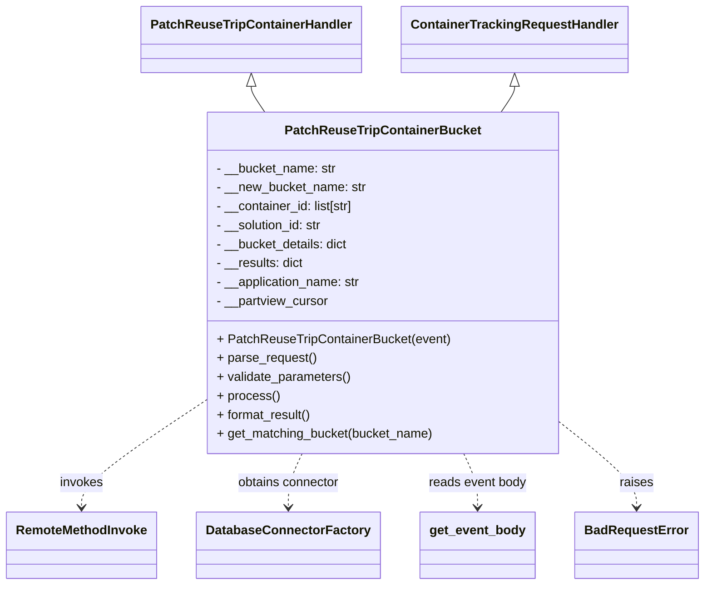

# Diagram: container_tracking_core/container_tracking_service/container_tracking_service/api/reuse_trip_container_bucket/bucket_management/handlers/patch_reuse_trip_container_bucket.py


> Auto-generated by Obscura crawlers

## Diagram 1



### SVG

<svg id="container" width="861.0625" xmlns="http://www.w3.org/2000/svg" class="classDiagram" height="740" viewBox="0 0 861.0625 740" role="graphics-document document" aria-roledescription="class"><style>#container{font-family:"trebuchet ms",verdana,arial,sans-serif;font-size:16px;fill:#333;}@keyframes edge-animation-frame{from{stroke-dashoffset:0;}}@keyframes dash{to{stroke-dashoffset:0;}}#container .edge-animation-slow{stroke-dasharray:9,5!important;stroke-dashoffset:900;animation:dash 50s linear infinite;stroke-linecap:round;}#container .edge-animation-fast{stroke-dasharray:9,5!important;stroke-dashoffset:900;animation:dash 20s linear infinite;stroke-linecap:round;}#container .error-icon{fill:#552222;}#container .error-text{fill:#552222;stroke:#552222;}#container .edge-thickness-normal{stroke-width:1px;}#container .edge-thickness-thick{stroke-width:3.5px;}#container .edge-pattern-solid{stroke-dasharray:0;}#container .edge-thickness-invisible{stroke-width:0;fill:none;}#container .edge-pattern-dashed{stroke-dasharray:3;}#container .edge-pattern-dotted{stroke-dasharray:2;}#container .marker{fill:#333333;stroke:#333333;}#container .marker.cross{stroke:#333333;}#container svg{font-family:"trebuchet ms",verdana,arial,sans-serif;font-size:16px;}#container p{margin:0;}#container g.classGroup text{fill:#9370DB;stroke:none;font-family:"trebuchet ms",verdana,arial,sans-serif;font-size:10px;}#container g.classGroup text .title{font-weight:bolder;}#container .nodeLabel,#container .edgeLabel{color:#131300;}#container .edgeLabel .label rect{fill:#ECECFF;}#container .label text{fill:#131300;}#container .labelBkg{background:#ECECFF;}#container .edgeLabel .label span{background:#ECECFF;}#container .classTitle{font-weight:bolder;}#container .node rect,#container .node circle,#container .node ellipse,#container .node polygon,#container .node path{fill:#ECECFF;stroke:#9370DB;stroke-width:1px;}#container .divider{stroke:#9370DB;stroke-width:1;}#container g.clickable{cursor:pointer;}#container g.classGroup rect{fill:#ECECFF;stroke:#9370DB;}#container g.classGroup line{stroke:#9370DB;stroke-width:1;}#container .classLabel .box{stroke:none;stroke-width:0;fill:#ECECFF;opacity:0.5;}#container .classLabel .label{fill:#9370DB;font-size:10px;}#container .relation{stroke:#333333;stroke-width:1;fill:none;}#container .dashed-line{stroke-dasharray:3;}#container .dotted-line{stroke-dasharray:1 2;}#container #compositionStart,#container .composition{fill:#333333!important;stroke:#333333!important;stroke-width:1;}#container #compositionEnd,#container .composition{fill:#333333!important;stroke:#333333!important;stroke-width:1;}#container #dependencyStart,#container .dependency{fill:#333333!important;stroke:#333333!important;stroke-width:1;}#container #dependencyStart,#container .dependency{fill:#333333!important;stroke:#333333!important;stroke-width:1;}#container #extensionStart,#container .extension{fill:transparent!important;stroke:#333333!important;stroke-width:1;}#container #extensionEnd,#container .extension{fill:transparent!important;stroke:#333333!important;stroke-width:1;}#container #aggregationStart,#container .aggregation{fill:transparent!important;stroke:#333333!important;stroke-width:1;}#container #aggregationEnd,#container .aggregation{fill:transparent!important;stroke:#333333!important;stroke-width:1;}#container #lollipopStart,#container .lollipop{fill:#ECECFF!important;stroke:#333333!important;stroke-width:1;}#container #lollipopEnd,#container .lollipop{fill:#ECECFF!important;stroke:#333333!important;stroke-width:1;}#container .edgeTerminals{font-size:11px;line-height:initial;}#container .classTitleText{text-anchor:middle;font-size:18px;fill:#333;}#container .label-icon{display:inline-block;height:1em;overflow:visible;vertical-align:-0.125em;}#container .node .label-icon path{fill:currentColor;stroke:revert;stroke-width:revert;}#container :root{--mermaid-font-family:"trebuchet ms",verdana,arial,sans-serif;}</style><g><defs><marker id="container_class-aggregationStart" class="marker aggregation class" refX="18" refY="7" markerWidth="190" markerHeight="240" orient="auto"><path d="M 18,7 L9,13 L1,7 L9,1 Z"></path></marker></defs><defs><marker id="container_class-aggregationEnd" class="marker aggregation class" refX="1" refY="7" markerWidth="20" markerHeight="28" orient="auto"><path d="M 18,7 L9,13 L1,7 L9,1 Z"></path></marker></defs><defs><marker id="container_class-extensionStart" class="marker extension class" refX="18" refY="7" markerWidth="190" markerHeight="240" orient="auto"><path d="M 1,7 L18,13 V 1 Z"></path></marker></defs><defs><marker id="container_class-extensionEnd" class="marker extension class" refX="1" refY="7" markerWidth="20" markerHeight="28" orient="auto"><path d="M 1,1 V 13 L18,7 Z"></path></marker></defs><defs><marker id="container_class-compositionStart" class="marker composition class" refX="18" refY="7" markerWidth="190" markerHeight="240" orient="auto"><path d="M 18,7 L9,13 L1,7 L9,1 Z"></path></marker></defs><defs><marker id="container_class-compositionEnd" class="marker composition class" refX="1" refY="7" markerWidth="20" markerHeight="28" orient="auto"><path d="M 18,7 L9,13 L1,7 L9,1 Z"></path></marker></defs><defs><marker id="container_class-dependencyStart" class="marker dependency class" refX="6" refY="7" markerWidth="190" markerHeight="240" orient="auto"><path d="M 5,7 L9,13 L1,7 L9,1 Z"></path></marker></defs><defs><marker id="container_class-dependencyEnd" class="marker dependency class" refX="13" refY="7" markerWidth="20" markerHeight="28" orient="auto"><path d="M 18,7 L9,13 L14,7 L9,1 Z"></path></marker></defs><defs><marker id="container_class-lollipopStart" class="marker lollipop class" refX="13" refY="7" markerWidth="190" markerHeight="240" orient="auto"><circle stroke="black" fill="transparent" cx="7" cy="7" r="6"></circle></marker></defs><defs><marker id="container_class-lollipopEnd" class="marker lollipop class" refX="1" refY="7" markerWidth="190" markerHeight="240" orient="auto"><circle stroke="black" fill="transparent" cx="7" cy="7" r="6"></circle></marker></defs><g class="root"><g class="clusters"></g><g class="edgePaths"><path d="M307.777,109.25L307.777,110.542C307.777,111.833,307.777,114.417,310.551,119.875C313.324,125.333,318.872,133.667,321.645,137.833L324.419,142" id="id_PatchReuseTripContainerHandler_PatchReuseTripContainerBucket_1" class="edge-thickness-normal edge-pattern-solid relation" style=";;;" data-edge="true" data-et="edge" data-id="id_PatchReuseTripContainerHandler_PatchReuseTripContainerBucket_1" data-points="W3sieCI6MzA3Ljc3NzM0Mzc1LCJ5Ijo5Mn0seyJ4IjozMDcuNzc3MzQzNzUsInkiOjExN30seyJ4IjozMjQuNDE4NjE3MDkwMjQ5LCJ5IjoxNDJ9XQ==" marker-start="url(#container_class-extensionStart)"></path><path d="M628.621,109.25L628.621,110.542C628.621,111.833,628.621,114.417,625.848,119.875C623.074,125.333,617.527,133.667,614.753,137.833L611.98,142" id="id_ContainerTrackingRequestHandler_PatchReuseTripContainerBucket_2" class="edge-thickness-normal edge-pattern-solid relation" style=";;;" data-edge="true" data-et="edge" data-id="id_ContainerTrackingRequestHandler_PatchReuseTripContainerBucket_2" data-points="W3sieCI6NjI4LjYyMTA5Mzc1LCJ5Ijo5Mn0seyJ4Ijo2MjguNjIxMDkzNzUsInkiOjExN30seyJ4Ijo2MTEuOTc5ODIwNDA5NzUxLCJ5IjoxNDJ9XQ==" marker-start="url(#container_class-extensionStart)"></path><path d="M250.523,507.676L225.479,524.897C200.435,542.117,150.346,576.559,125.302,598.946C100.258,621.333,100.258,631.667,100.258,636.833L100.258,642" id="id_PatchReuseTripContainerBucket_RemoteMethodInvoke_3" class="edge-thickness-normal edge-pattern-dashed relation" style=";;;" data-edge="true" data-et="edge" data-id="id_PatchReuseTripContainerBucket_RemoteMethodInvoke_3" data-points="W3sieCI6MjUwLjUyMzQzNzUsInkiOjUwNy42NzU5MzEzMzI0NzY5fSx7IngiOjEwMC4yNTc4MTI1LCJ5Ijo2MTF9LHsieCI6MTAwLjI1NzgxMjUsInkiOjY0OH1d" marker-end="url(#container_class-dependencyEnd)"></path><path d="M369.594,574L366.779,580.167C363.964,586.333,358.333,598.667,355.518,610C352.703,621.333,352.703,631.667,352.703,636.833L352.703,642" id="id_PatchReuseTripContainerBucket_DatabaseConnectorFactory_4" class="edge-thickness-normal edge-pattern-dashed relation" style=";;;" data-edge="true" data-et="edge" data-id="id_PatchReuseTripContainerBucket_DatabaseConnectorFactory_4" data-points="W3sieCI6MzY5LjU5Mzg1ODA3ODA2MzI1LCJ5Ijo1NzR9LHsieCI6MzUyLjcwMzEyNSwieSI6NjExfSx7IngiOjM1Mi43MDMxMjUsInkiOjY0OH1d" marker-end="url(#container_class-dependencyEnd)"></path><path d="M566.805,574L569.62,580.167C572.435,586.333,578.065,598.667,580.88,610C583.695,621.333,583.695,631.667,583.695,636.833L583.695,642" id="id_PatchReuseTripContainerBucket_get_event_body_5" class="edge-thickness-normal edge-pattern-dashed relation" style=";;;" data-edge="true" data-et="edge" data-id="id_PatchReuseTripContainerBucket_get_event_body_5" data-points="W3sieCI6NTY2LjgwNDU3OTQyMTkzNjgsInkiOjU3NH0seyJ4Ijo1ODMuNjk1MzEyNSwieSI6NjExfSx7IngiOjU4My42OTUzMTI1LCJ5Ijo2NDh9XQ==" marker-end="url(#container_class-dependencyEnd)"></path><path d="M685.875,535.319L701.359,547.932C716.844,560.546,747.813,585.773,763.297,603.553C778.781,621.333,778.781,631.667,778.781,636.833L778.781,642" id="id_PatchReuseTripContainerBucket_BadRequestError_6" class="edge-thickness-normal edge-pattern-dashed relation" style=";;;" data-edge="true" data-et="edge" data-id="id_PatchReuseTripContainerBucket_BadRequestError_6" data-points="W3sieCI6Njg1Ljg3NSwieSI6NTM1LjMxODYwNTQ0MDg5MzV9LHsieCI6Nzc4Ljc4MTI1LCJ5Ijo2MTF9LHsieCI6Nzc4Ljc4MTI1LCJ5Ijo2NDh9XQ==" marker-end="url(#container_class-dependencyEnd)"></path></g><g class="edgeLabels"><g class="edgeLabel"><g class="label" data-id="id_PatchReuseTripContainerHandler_PatchReuseTripContainerBucket_1" transform="translate(0, 0)"><foreignObject width="0" height="0"><div xmlns="http://www.w3.org/1999/xhtml" class="labelBkg" style="display: table-cell; white-space: nowrap; line-height: 1.5; max-width: 200px; text-align: center;"><span class="edgeLabel"></span></div></foreignObject></g></g><g class="edgeLabel"><g class="label" data-id="id_ContainerTrackingRequestHandler_PatchReuseTripContainerBucket_2" transform="translate(0, 0)"><foreignObject width="0" height="0"><div xmlns="http://www.w3.org/1999/xhtml" class="labelBkg" style="display: table-cell; white-space: nowrap; line-height: 1.5; max-width: 200px; text-align: center;"><span class="edgeLabel"></span></div></foreignObject></g></g><g class="edgeLabel" transform="translate(100.2578125, 611)"><g class="label" data-id="id_PatchReuseTripContainerBucket_RemoteMethodInvoke_3" transform="translate(-27.5859375, -12)"><foreignObject width="55.171875" height="24"><div xmlns="http://www.w3.org/1999/xhtml" class="labelBkg" style="display: table-cell; white-space: nowrap; line-height: 1.5; max-width: 200px; text-align: center;"><span class="edgeLabel"><p>invokes</p></span></div></foreignObject></g></g><g class="edgeLabel" transform="translate(352.703125, 611)"><g class="label" data-id="id_PatchReuseTripContainerBucket_DatabaseConnectorFactory_4" transform="translate(-65.8359375, -12)"><foreignObject width="131.671875" height="24"><div xmlns="http://www.w3.org/1999/xhtml" class="labelBkg" style="display: table-cell; white-space: nowrap; line-height: 1.5; max-width: 200px; text-align: center;"><span class="edgeLabel"><p>obtains connector</p></span></div></foreignObject></g></g><g class="edgeLabel" transform="translate(583.6953125, 611)"><g class="label" data-id="id_PatchReuseTripContainerBucket_get_event_body_5" transform="translate(-62.5546875, -12)"><foreignObject width="125.109375" height="24"><div xmlns="http://www.w3.org/1999/xhtml" class="labelBkg" style="display: table-cell; white-space: nowrap; line-height: 1.5; max-width: 200px; text-align: center;"><span class="edgeLabel"><p>reads event body</p></span></div></foreignObject></g></g><g class="edgeLabel" transform="translate(778.78125, 611)"><g class="label" data-id="id_PatchReuseTripContainerBucket_BadRequestError_6" transform="translate(-21.25, -12)"><foreignObject width="42.5" height="24"><div xmlns="http://www.w3.org/1999/xhtml" class="labelBkg" style="display: table-cell; white-space: nowrap; line-height: 1.5; max-width: 200px; text-align: center;"><span class="edgeLabel"><p>raises</p></span></div></foreignObject></g></g></g><g class="nodes"><g class="node default" id="classId-PatchReuseTripContainerBucket-0" transform="translate(468.19921875, 358)"><g class="basic label-container"><path d="M-217.67578125 -216 L217.67578125 -216 L217.67578125 216 L-217.67578125 216" stroke="none" stroke-width="0" fill="#ECECFF" style=""></path><path d="M-217.67578125 -216 C-56.62300856058167 -216, 104.42976412883667 -216, 217.67578125 -216 M-217.67578125 -216 C-122.71865115710274 -216, -27.761521064205482 -216, 217.67578125 -216 M217.67578125 -216 C217.67578125 -72.22525499424748, 217.67578125 71.54949001150504, 217.67578125 216 M217.67578125 -216 C217.67578125 -126.07961760348553, 217.67578125 -36.15923520697106, 217.67578125 216 M217.67578125 216 C51.573024975733915 216, -114.52973129853217 216, -217.67578125 216 M217.67578125 216 C99.15038443364327 216, -19.375012382713464 216, -217.67578125 216 M-217.67578125 216 C-217.67578125 52.22857579513959, -217.67578125 -111.54284840972082, -217.67578125 -216 M-217.67578125 216 C-217.67578125 84.3175790656696, -217.67578125 -47.36484186866079, -217.67578125 -216" stroke="#9370DB" stroke-width="1.3" fill="none" stroke-dasharray="0 0" style=""></path></g><g class="annotation-group text" transform="translate(0, -192)"></g><g class="label-group text" transform="translate(-117.3359375, -192)"><g class="label" style="font-weight: bolder" transform="translate(0,-12)"><foreignObject width="234.671875" height="24"><div xmlns="http://www.w3.org/1999/xhtml" style="display: table-cell; white-space: nowrap; line-height: 1.5; max-width: 281px; text-align: center;"><span class="nodeLabel markdown-node-label" style=""><p>PatchReuseTripContainerBucket</p></span></div></foreignObject></g></g><g class="members-group text" transform="translate(-205.67578125, -144)"><g class="label" style="" transform="translate(0,-12)"><foreignObject width="152.515625" height="24"><div xmlns="http://www.w3.org/1999/xhtml" style="display: table-cell; white-space: nowrap; line-height: 1.5; max-width: 211px; text-align: center;"><span class="nodeLabel markdown-node-label" style=""><p>- __bucket_name: str</p></span></div></foreignObject></g><g class="label" style="" transform="translate(0,12)"><foreignObject width="190.09375" height="24"><div xmlns="http://www.w3.org/1999/xhtml" style="display: table-cell; white-space: nowrap; line-height: 1.5; max-width: 248px; text-align: center;"><span class="nodeLabel markdown-node-label" style=""><p>- __new_bucket_name: str</p></span></div></foreignObject></g><g class="label" style="" transform="translate(0,36)"><foreignObject width="177.4375" height="24"><div xmlns="http://www.w3.org/1999/xhtml" style="display: table-cell; white-space: nowrap; line-height: 1.5; max-width: 235px; text-align: center;"><span class="nodeLabel markdown-node-label" style=""><p>- __container_id: list[str]</p></span></div></foreignObject></g><g class="label" style="" transform="translate(0,60)"><foreignObject width="136.90625" height="24"><div xmlns="http://www.w3.org/1999/xhtml" style="display: table-cell; white-space: nowrap; line-height: 1.5; max-width: 195px; text-align: center;"><span class="nodeLabel markdown-node-label" style=""><p>- __solution_id: str</p></span></div></foreignObject></g><g class="label" style="" transform="translate(0,84)"><foreignObject width="169.09375" height="24"><div xmlns="http://www.w3.org/1999/xhtml" style="display: table-cell; white-space: nowrap; line-height: 1.5; max-width: 227px; text-align: center;"><span class="nodeLabel markdown-node-label" style=""><p>- __bucket_details: dict</p></span></div></foreignObject></g><g class="label" style="" transform="translate(0,108)"><foreignObject width="111.890625" height="24"><div xmlns="http://www.w3.org/1999/xhtml" style="display: table-cell; white-space: nowrap; line-height: 1.5; max-width: 169px; text-align: center;"><span class="nodeLabel markdown-node-label" style=""><p>- __results: dict</p></span></div></foreignObject></g><g class="label" style="" transform="translate(0,132)"><foreignObject width="185.296875" height="24"><div xmlns="http://www.w3.org/1999/xhtml" style="display: table-cell; white-space: nowrap; line-height: 1.5; max-width: 243px; text-align: center;"><span class="nodeLabel markdown-node-label" style=""><p>- __application_name: str</p></span></div></foreignObject></g><g class="label" style="" transform="translate(0,156)"><foreignObject width="143.078125" height="24"><div xmlns="http://www.w3.org/1999/xhtml" style="display: table-cell; white-space: nowrap; line-height: 1.5; max-width: 201px; text-align: center;"><span class="nodeLabel markdown-node-label" style=""><p>- __partview_cursor</p></span></div></foreignObject></g></g><g class="methods-group text" transform="translate(-205.67578125, 72)"><g class="label" style="" transform="translate(0,-12)"><foreignObject width="294.015625" height="24"><div xmlns="http://www.w3.org/1999/xhtml" style="display: table-cell; white-space: nowrap; line-height: 1.5; max-width: 351px; text-align: center;"><span class="nodeLabel markdown-node-label" style=""><p>+ PatchReuseTripContainerBucket(event)</p></span></div></foreignObject></g><g class="label" style="" transform="translate(0,12)"><foreignObject width="126.046875" height="24"><div xmlns="http://www.w3.org/1999/xhtml" style="display: table-cell; white-space: nowrap; line-height: 1.5; max-width: 183px; text-align: center;"><span class="nodeLabel markdown-node-label" style=""><p>+ parse_request()</p></span></div></foreignObject></g><g class="label" style="" transform="translate(0,36)"><foreignObject width="170.953125" height="24"><div xmlns="http://www.w3.org/1999/xhtml" style="display: table-cell; white-space: nowrap; line-height: 1.5; max-width: 228px; text-align: center;"><span class="nodeLabel markdown-node-label" style=""><p>+ validate_parameters()</p></span></div></foreignObject></g><g class="label" style="" transform="translate(0,60)"><foreignObject width="77.96875" height="24"><div xmlns="http://www.w3.org/1999/xhtml" style="display: table-cell; white-space: nowrap; line-height: 1.5; max-width: 135px; text-align: center;"><span class="nodeLabel markdown-node-label" style=""><p>+ process()</p></span></div></foreignObject></g><g class="label" style="" transform="translate(0,84)"><foreignObject width="121.5" height="24"><div xmlns="http://www.w3.org/1999/xhtml" style="display: table-cell; white-space: nowrap; line-height: 1.5; max-width: 179px; text-align: center;"><span class="nodeLabel markdown-node-label" style=""><p>+ format_result()</p></span></div></foreignObject></g><g class="label" style="" transform="translate(0,108)"><foreignObject width="275.890625" height="24"><div xmlns="http://www.w3.org/1999/xhtml" style="display: table-cell; white-space: nowrap; line-height: 1.5; max-width: 333px; text-align: center;"><span class="nodeLabel markdown-node-label" style=""><p>+ get_matching_bucket(bucket_name)</p></span></div></foreignObject></g></g><g class="divider" style=""><path d="M-217.67578125 -168 C-64.30065362008793 -168, 89.07447400982414 -168, 217.67578125 -168 M-217.67578125 -168 C-79.5518091826971 -168, 58.5721628846058 -168, 217.67578125 -168" stroke="#9370DB" stroke-width="1.3" fill="none" stroke-dasharray="0 0" style=""></path></g><g class="divider" style=""><path d="M-217.67578125 48 C-117.91614258579429 48, -18.15650392158858 48, 217.67578125 48 M-217.67578125 48 C-61.84157119855223 48, 93.99263885289554 48, 217.67578125 48" stroke="#9370DB" stroke-width="1.3" fill="none" stroke-dasharray="0 0" style=""></path></g></g><g class="node default" id="classId-ContainerTrackingRequestHandler-1" transform="translate(628.62109375, 50)"><g class="basic label-container"><path d="M-137.5859375 -42 L137.5859375 -42 L137.5859375 42 L-137.5859375 42" stroke="none" stroke-width="0" fill="#ECECFF" style=""></path><path d="M-137.5859375 -42 C-67.59196022869885 -42, 2.4020170426022958 -42, 137.5859375 -42 M-137.5859375 -42 C-77.96872449972096 -42, -18.35151149944194 -42, 137.5859375 -42 M137.5859375 -42 C137.5859375 -11.12421302811791, 137.5859375 19.75157394376418, 137.5859375 42 M137.5859375 -42 C137.5859375 -16.219317598358895, 137.5859375 9.56136480328221, 137.5859375 42 M137.5859375 42 C69.31127817194236 42, 1.0366188438847246 42, -137.5859375 42 M137.5859375 42 C39.89465326821579 42, -57.79663096356842 42, -137.5859375 42 M-137.5859375 42 C-137.5859375 17.273679876697194, -137.5859375 -7.452640246605611, -137.5859375 -42 M-137.5859375 42 C-137.5859375 18.10281723536946, -137.5859375 -5.7943655292610785, -137.5859375 -42" stroke="#9370DB" stroke-width="1.3" fill="none" stroke-dasharray="0 0" style=""></path></g><g class="annotation-group text" transform="translate(0, -18)"></g><g class="label-group text" transform="translate(-125.5859375, -18)"><g class="label" style="font-weight: bolder" transform="translate(0,-12)"><foreignObject width="251.171875" height="24"><div xmlns="http://www.w3.org/1999/xhtml" style="display: table-cell; white-space: nowrap; line-height: 1.5; max-width: 299px; text-align: center;"><span class="nodeLabel markdown-node-label" style=""><p>ContainerTrackingRequestHandler</p></span></div></foreignObject></g></g><g class="members-group text" transform="translate(-125.5859375, 30)"></g><g class="methods-group text" transform="translate(-125.5859375, 60)"></g><g class="divider" style=""><path d="M-137.5859375 6 C-42.391657409445145 6, 52.80262268110971 6, 137.5859375 6 M-137.5859375 6 C-79.77248031269667 6, -21.959023125393358 6, 137.5859375 6" stroke="#9370DB" stroke-width="1.3" fill="none" stroke-dasharray="0 0" style=""></path></g><g class="divider" style=""><path d="M-137.5859375 24 C-28.23626417948867 24, 81.11340914102266 24, 137.5859375 24 M-137.5859375 24 C-75.79328513307664 24, -14.00063276615326 24, 137.5859375 24" stroke="#9370DB" stroke-width="1.3" fill="none" stroke-dasharray="0 0" style=""></path></g></g><g class="node default" id="classId-RemoteMethodInvoke-2" transform="translate(100.2578125, 690)"><g class="basic label-container"><path d="M-92.2578125 -42 L92.2578125 -42 L92.2578125 42 L-92.2578125 42" stroke="none" stroke-width="0" fill="#ECECFF" style=""></path><path d="M-92.2578125 -42 C-20.503377148827866 -42, 51.25105820234427 -42, 92.2578125 -42 M-92.2578125 -42 C-51.67221805299637 -42, -11.086623605992742 -42, 92.2578125 -42 M92.2578125 -42 C92.2578125 -20.839333397284655, 92.2578125 0.3213332054306903, 92.2578125 42 M92.2578125 -42 C92.2578125 -9.32104867637402, 92.2578125 23.35790264725196, 92.2578125 42 M92.2578125 42 C32.06037552305594 42, -28.137061453888123 42, -92.2578125 42 M92.2578125 42 C30.607616687110976 42, -31.042579125778047 42, -92.2578125 42 M-92.2578125 42 C-92.2578125 9.315516664039727, -92.2578125 -23.368966671920546, -92.2578125 -42 M-92.2578125 42 C-92.2578125 15.436842841016894, -92.2578125 -11.126314317966212, -92.2578125 -42" stroke="#9370DB" stroke-width="1.3" fill="none" stroke-dasharray="0 0" style=""></path></g><g class="annotation-group text" transform="translate(0, -18)"></g><g class="label-group text" transform="translate(-80.2578125, -18)"><g class="label" style="font-weight: bolder" transform="translate(0,-12)"><foreignObject width="160.515625" height="24"><div xmlns="http://www.w3.org/1999/xhtml" style="display: table-cell; white-space: nowrap; line-height: 1.5; max-width: 209px; text-align: center;"><span class="nodeLabel markdown-node-label" style=""><p>RemoteMethodInvoke</p></span></div></foreignObject></g></g><g class="members-group text" transform="translate(-80.2578125, 30)"></g><g class="methods-group text" transform="translate(-80.2578125, 60)"></g><g class="divider" style=""><path d="M-92.2578125 6 C-37.356083064196305 6, 17.54564637160739 6, 92.2578125 6 M-92.2578125 6 C-36.77288172401126 6, 18.712049051977473 6, 92.2578125 6" stroke="#9370DB" stroke-width="1.3" fill="none" stroke-dasharray="0 0" style=""></path></g><g class="divider" style=""><path d="M-92.2578125 24 C-40.981486602564175 24, 10.29483929487165 24, 92.2578125 24 M-92.2578125 24 C-22.90279414366468 24, 46.45222421267064 24, 92.2578125 24" stroke="#9370DB" stroke-width="1.3" fill="none" stroke-dasharray="0 0" style=""></path></g></g><g class="node default" id="classId-DatabaseConnectorFactory-3" transform="translate(352.703125, 690)"><g class="basic label-container"><path d="M-110.1875 -42 L110.1875 -42 L110.1875 42 L-110.1875 42" stroke="none" stroke-width="0" fill="#ECECFF" style=""></path><path d="M-110.1875 -42 C-28.554608338632647 -42, 53.078283322734706 -42, 110.1875 -42 M-110.1875 -42 C-62.91140488284014 -42, -15.635309765680276 -42, 110.1875 -42 M110.1875 -42 C110.1875 -22.650960617654174, 110.1875 -3.301921235308349, 110.1875 42 M110.1875 -42 C110.1875 -9.09972858273094, 110.1875 23.80054283453812, 110.1875 42 M110.1875 42 C47.89732887778225 42, -14.3928422444355 42, -110.1875 42 M110.1875 42 C37.15257563001157 42, -35.88234873997686 42, -110.1875 42 M-110.1875 42 C-110.1875 23.059120496339563, -110.1875 4.118240992679127, -110.1875 -42 M-110.1875 42 C-110.1875 18.35673978410524, -110.1875 -5.286520431789519, -110.1875 -42" stroke="#9370DB" stroke-width="1.3" fill="none" stroke-dasharray="0 0" style=""></path></g><g class="annotation-group text" transform="translate(0, -18)"></g><g class="label-group text" transform="translate(-98.1875, -18)"><g class="label" style="font-weight: bolder" transform="translate(0,-12)"><foreignObject width="196.375" height="24"><div xmlns="http://www.w3.org/1999/xhtml" style="display: table-cell; white-space: nowrap; line-height: 1.5; max-width: 244px; text-align: center;"><span class="nodeLabel markdown-node-label" style=""><p>DatabaseConnectorFactory</p></span></div></foreignObject></g></g><g class="members-group text" transform="translate(-98.1875, 30)"></g><g class="methods-group text" transform="translate(-98.1875, 60)"></g><g class="divider" style=""><path d="M-110.1875 6 C-50.9479088219275 6, 8.291682356145003 6, 110.1875 6 M-110.1875 6 C-58.99809758099477 6, -7.808695161989533 6, 110.1875 6" stroke="#9370DB" stroke-width="1.3" fill="none" stroke-dasharray="0 0" style=""></path></g><g class="divider" style=""><path d="M-110.1875 24 C-43.40714967830813 24, 23.37320064338374 24, 110.1875 24 M-110.1875 24 C-22.403985362165685 24, 65.37952927566863 24, 110.1875 24" stroke="#9370DB" stroke-width="1.3" fill="none" stroke-dasharray="0 0" style=""></path></g></g><g class="node default" id="classId-BadRequestError-4" transform="translate(778.78125, 690)"><g class="basic label-container"><path d="M-74.28125 -42 L74.28125 -42 L74.28125 42 L-74.28125 42" stroke="none" stroke-width="0" fill="#ECECFF" style=""></path><path d="M-74.28125 -42 C-21.525056800954538 -42, 31.231136398090925 -42, 74.28125 -42 M-74.28125 -42 C-16.499247512865075 -42, 41.28275497426985 -42, 74.28125 -42 M74.28125 -42 C74.28125 -21.53048125499064, 74.28125 -1.0609625099812803, 74.28125 42 M74.28125 -42 C74.28125 -17.964353663957326, 74.28125 6.071292672085349, 74.28125 42 M74.28125 42 C17.732090011804985 42, -38.81706997639003 42, -74.28125 42 M74.28125 42 C15.944944808409069 42, -42.39136038318186 42, -74.28125 42 M-74.28125 42 C-74.28125 18.825266838961156, -74.28125 -4.349466322077689, -74.28125 -42 M-74.28125 42 C-74.28125 16.09369197124966, -74.28125 -9.812616057500676, -74.28125 -42" stroke="#9370DB" stroke-width="1.3" fill="none" stroke-dasharray="0 0" style=""></path></g><g class="annotation-group text" transform="translate(0, -18)"></g><g class="label-group text" transform="translate(-62.28125, -18)"><g class="label" style="font-weight: bolder" transform="translate(0,-12)"><foreignObject width="124.5625" height="24"><div xmlns="http://www.w3.org/1999/xhtml" style="display: table-cell; white-space: nowrap; line-height: 1.5; max-width: 174px; text-align: center;"><span class="nodeLabel markdown-node-label" style=""><p>BadRequestError</p></span></div></foreignObject></g></g><g class="members-group text" transform="translate(-62.28125, 30)"></g><g class="methods-group text" transform="translate(-62.28125, 60)"></g><g class="divider" style=""><path d="M-74.28125 6 C-16.951429747930682 6, 40.378390504138636 6, 74.28125 6 M-74.28125 6 C-15.026844033696086 6, 44.22756193260783 6, 74.28125 6" stroke="#9370DB" stroke-width="1.3" fill="none" stroke-dasharray="0 0" style=""></path></g><g class="divider" style=""><path d="M-74.28125 24 C-33.0306565004748 24, 8.219936999050404 24, 74.28125 24 M-74.28125 24 C-32.631388012160606 24, 9.018473975678788 24, 74.28125 24" stroke="#9370DB" stroke-width="1.3" fill="none" stroke-dasharray="0 0" style=""></path></g></g><g class="node default" id="classId-get_event_body-5" transform="translate(583.6953125, 690)"><g class="basic label-container"><path d="M-70.8046875 -42 L70.8046875 -42 L70.8046875 42 L-70.8046875 42" stroke="none" stroke-width="0" fill="#ECECFF" style=""></path><path d="M-70.8046875 -42 C-31.735442759872782 -42, 7.333801980254435 -42, 70.8046875 -42 M-70.8046875 -42 C-22.44816279872704 -42, 25.90836190254592 -42, 70.8046875 -42 M70.8046875 -42 C70.8046875 -9.767275741488035, 70.8046875 22.46544851702393, 70.8046875 42 M70.8046875 -42 C70.8046875 -16.08590833405582, 70.8046875 9.828183331888361, 70.8046875 42 M70.8046875 42 C17.930889520195777 42, -34.94290845960845 42, -70.8046875 42 M70.8046875 42 C14.16871036841684 42, -42.46726676316632 42, -70.8046875 42 M-70.8046875 42 C-70.8046875 19.54074980226081, -70.8046875 -2.9185003954783824, -70.8046875 -42 M-70.8046875 42 C-70.8046875 15.276803658038048, -70.8046875 -11.446392683923904, -70.8046875 -42" stroke="#9370DB" stroke-width="1.3" fill="none" stroke-dasharray="0 0" style=""></path></g><g class="annotation-group text" transform="translate(0, -18)"></g><g class="label-group text" transform="translate(-58.8046875, -18)"><g class="label" style="font-weight: bolder" transform="translate(0,-12)"><foreignObject width="117.609375" height="24"><div xmlns="http://www.w3.org/1999/xhtml" style="display: table-cell; white-space: nowrap; line-height: 1.5; max-width: 166px; text-align: center;"><span class="nodeLabel markdown-node-label" style=""><p>get_event_body</p></span></div></foreignObject></g></g><g class="members-group text" transform="translate(-58.8046875, 30)"></g><g class="methods-group text" transform="translate(-58.8046875, 60)"></g><g class="divider" style=""><path d="M-70.8046875 6 C-30.717537470440178 6, 9.369612559119645 6, 70.8046875 6 M-70.8046875 6 C-26.66868172117423 6, 17.46732405765154 6, 70.8046875 6" stroke="#9370DB" stroke-width="1.3" fill="none" stroke-dasharray="0 0" style=""></path></g><g class="divider" style=""><path d="M-70.8046875 24 C-31.065088783856027 24, 8.674509932287947 24, 70.8046875 24 M-70.8046875 24 C-40.285027568618005 24, -9.765367637236004 24, 70.8046875 24" stroke="#9370DB" stroke-width="1.3" fill="none" stroke-dasharray="0 0" style=""></path></g></g><g class="node default" id="classId-PatchReuseTripContainerHandler-6" transform="translate(307.77734375, 50)"><g class="basic label-container"><path d="M-133.2578125 -42 L133.2578125 -42 L133.2578125 42 L-133.2578125 42" stroke="none" stroke-width="0" fill="#ECECFF" style=""></path><path d="M-133.2578125 -42 C-56.538178380058085 -42, 20.18145573988383 -42, 133.2578125 -42 M-133.2578125 -42 C-47.4227683855365 -42, 38.412275728927 -42, 133.2578125 -42 M133.2578125 -42 C133.2578125 -23.489242392366215, 133.2578125 -4.97848478473243, 133.2578125 42 M133.2578125 -42 C133.2578125 -19.386609340434063, 133.2578125 3.2267813191318737, 133.2578125 42 M133.2578125 42 C48.59919946228314 42, -36.05941357543372 42, -133.2578125 42 M133.2578125 42 C43.9924496517331 42, -45.27291319653381 42, -133.2578125 42 M-133.2578125 42 C-133.2578125 13.020776854349663, -133.2578125 -15.958446291300675, -133.2578125 -42 M-133.2578125 42 C-133.2578125 18.704442116872343, -133.2578125 -4.591115766255314, -133.2578125 -42" stroke="#9370DB" stroke-width="1.3" fill="none" stroke-dasharray="0 0" style=""></path></g><g class="annotation-group text" transform="translate(0, -18)"></g><g class="label-group text" transform="translate(-121.2578125, -18)"><g class="label" style="font-weight: bolder" transform="translate(0,-12)"><foreignObject width="242.515625" height="24"><div xmlns="http://www.w3.org/1999/xhtml" style="display: table-cell; white-space: nowrap; line-height: 1.5; max-width: 291px; text-align: center;"><span class="nodeLabel markdown-node-label" style=""><p>PatchReuseTripContainerHandler</p></span></div></foreignObject></g></g><g class="members-group text" transform="translate(-121.2578125, 30)"></g><g class="methods-group text" transform="translate(-121.2578125, 60)"></g><g class="divider" style=""><path d="M-133.2578125 6 C-45.53622117567272 6, 42.185370148654556 6, 133.2578125 6 M-133.2578125 6 C-58.61143838444917 6, 16.034935731101655 6, 133.2578125 6" stroke="#9370DB" stroke-width="1.3" fill="none" stroke-dasharray="0 0" style=""></path></g><g class="divider" style=""><path d="M-133.2578125 24 C-42.76660469391845 24, 47.724603112163095 24, 133.2578125 24 M-133.2578125 24 C-71.71531940280181 24, -10.172826305603607 24, 133.2578125 24" stroke="#9370DB" stroke-width="1.3" fill="none" stroke-dasharray="0 0" style=""></path></g></g></g></g></g></svg>

## Diagram 2

```mermaid
sequenceDiagram
participant Client
participant Handler as PatchReuseTripContainerBucket
participant EventBody as get_event_body
participant Validator as BadRequestError
participant DB as partview_cursor
participant Remote as reuse-trip-container-bucket-handler
Client->>Handler: POST event
Handler->>EventBody: get_event_body(event) -> bucket_name, new_bucket_name, container_id
Handler->>Handler: get_solution_id()
Handler->>Handler: parse_request() returns self
Client->>Handler: validate_parameters()
alt invalid parameters
Handler-->>Client: raise BadRequestError(message)
else parameters valid
Handler->>Remote: aws_remote_invocation(GET /api/bucket, qsp={"bucket_name":...})
Remote-->>Handler: response (bucket id/name) or []
alt no matching bucket
Handler-->>Client: raise BadRequestError("given bucket does not exist")
else bucket found
opt container_id provided
Handler->>DB: mogrify UPDATE public.container_to_buckets ...; execute; fetchone()
DB-->>Handler: results
end
opt new_bucket_name provided
Handler->>Remote: aws_remote_invocation(GET /api/bucket, qsp={"bucket_name": new_bucket_name})
Remote-->>Handler: response (exists?) or []
alt new name exists
Handler-->>Client: raise BadRequestError("route name exists")
else rename allowed
Handler->>DB: mogrify UPDATE public.buckets SET bucket_name=... RETURNING *; execute(); fetchone()
DB-->>Handler: results
end
Handler->>Handler: format_result() -> retval
Handler-->>Client: return retval
```

> SVG rendering failed for this diagram.
