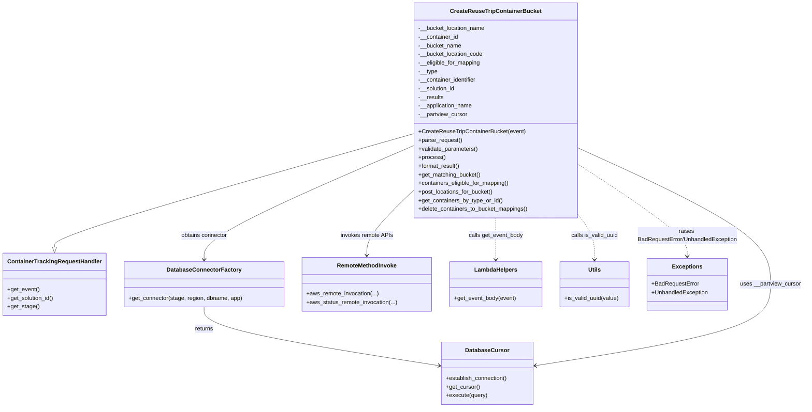

# Diagram: container_tracking_core/container_tracking_service/container_tracking_service/api/reuse_trip_container_bucket/bucket_management/handlers/post_reuse_trip_container_bucket.py

> Auto-generated by Obscura crawlers

## Mermaid

### SVG

<svg id="container" width="2219.96875" xmlns="http://www.w3.org/2000/svg" class="classDiagram" height="1136" viewBox="0 0 2219.96875 1136" role="graphics-document document" aria-roledescription="class"><g><defs><marker id="container_class-aggregationStart" class="marker aggregation class" refX="18" refY="7" markerWidth="190" markerHeight="240" orient="auto"><path d="M 18,7 L9,13 L1,7 L9,1 Z"></path></marker></defs><defs><marker id="container_class-aggregationEnd" class="marker aggregation class" refX="1" refY="7" markerWidth="20" markerHeight="28" orient="auto"><path d="M 18,7 L9,13 L1,7 L9,1 Z"></path></marker></defs><defs><marker id="container_class-extensionStart" class="marker extension class" refX="18" refY="7" markerWidth="190" markerHeight="240" orient="auto"><path d="M 1,7 L18,13 V 1 Z"></path></marker></defs><defs><marker id="container_class-extensionEnd" class="marker extension class" refX="1" refY="7" markerWidth="20" markerHeight="28" orient="auto"><path d="M 1,1 V 13 L18,7 Z"></path></marker></defs><defs><marker id="container_class-compositionStart" class="marker composition class" refX="18" refY="7" markerWidth="190" markerHeight="240" orient="auto"><path d="M 18,7 L9,13 L1,7 L9,1 Z"></path></marker></defs><defs><marker id="container_class-compositionEnd" class="marker composition class" refX="1" refY="7" markerWidth="20" markerHeight="28" orient="auto"><path d="M 18,7 L9,13 L1,7 L9,1 Z"></path></marker></defs><defs><marker id="container_class-dependencyStart" class="marker dependency class" refX="6" refY="7" markerWidth="190" markerHeight="240" orient="auto"><path d="M 5,7 L9,13 L1,7 L9,1 Z"></path></marker></defs><defs><marker id="container_class-dependencyEnd" class="marker dependency class" refX="13" refY="7" markerWidth="20" markerHeight="28" orient="auto"><path d="M 18,7 L9,13 L14,7 L9,1 Z"></path></marker></defs><defs><marker id="container_class-lollipopStart" class="marker lollipop class" refX="13" refY="7" markerWidth="190" markerHeight="240" orient="auto"><circle stroke="black" fill="transparent" cx="7" cy="7" r="6"></circle></marker></defs><defs><marker id="container_class-lollipopEnd" class="marker lollipop class" refX="1" refY="7" markerWidth="190" markerHeight="240" orient="auto"><circle stroke="black" fill="transparent" cx="7" cy="7" r="6"></circle></marker></defs><g class="root"><g class="clusters"></g><g class="edgePaths"><path d="M1138.23,372.873L973.28,420.227C808.329,467.582,478.428,562.291,313.478,614.937C148.527,667.583,148.527,678.167,148.527,683.458L148.527,688.75" id="id_CreateReuseTripContainerBucket_ContainerTrackingRequestHandler_1" class="edge-thickness-normal edge-pattern-solid relation" style=";;;" data-edge="true" data-et="edge" data-id="id_CreateReuseTripContainerBucket_ContainerTrackingRequestHandler_1" data-points="W3sieCI6MTEzOC4yMzA0Njg3NSwieSI6MzcyLjg3MjkzNTg5OTIwNzN9LHsieCI6MTQ4LjUyNzM0Mzc1LCJ5Ijo2NTd9LHsieCI6MTQ4LjUyNzM0Mzc1LCJ5Ijo3MDZ9XQ==" marker-end="url(#container_class-extensionEnd)"></path><path d="M1138.23,405.926L1041.669,447.772C945.107,489.618,751.983,573.309,655.421,626.321C558.859,679.333,558.859,701.667,558.859,712.833L558.859,724" id="id_CreateReuseTripContainerBucket_DatabaseConnectorFactory_2" class="edge-thickness-normal edge-pattern-solid relation" style=";;;" data-edge="true" data-et="edge" data-id="id_CreateReuseTripContainerBucket_DatabaseConnectorFactory_2" data-points="W3sieCI6MTEzOC4yMzA0Njg3NSwieSI6NDA1LjkyNjQ1MzE4MzgxMTI1fSx7IngiOjU1OC44NTkzNzUsInkiOjY1N30seyJ4Ijo1NTguODU5Mzc1LCJ5Ijo3MzB9XQ==" marker-end="url(#container_class-dependencyEnd)"></path><path d="M558.859,856L558.859,866.167C558.859,876.333,558.859,896.667,667.285,923.979C775.711,951.291,992.562,985.583,1100.988,1002.728L1209.413,1019.874" id="id_DatabaseConnectorFactory_DatabaseCursor_3" class="edge-thickness-normal edge-pattern-solid relation" style=";;;" data-edge="true" data-et="edge" data-id="id_DatabaseConnectorFactory_DatabaseCursor_3" data-points="W3sieCI6NTU4Ljg1OTM3NSwieSI6ODU2fSx7IngiOjU1OC44NTkzNzUsInkiOjkxN30seyJ4IjoxMjE1LjMzOTg0Mzc1LCJ5IjoxMDIwLjgxMDkyMjQyMzE5Nzh9XQ==" marker-end="url(#container_class-dependencyEnd)"></path><path d="M1590.176,411.366L1679.674,452.305C1769.172,493.244,1948.168,575.122,2037.666,638.728C2127.164,702.333,2127.164,747.667,2127.164,791C2127.164,834.333,2127.164,875.667,2018.738,913.479C1910.313,951.291,1693.461,985.583,1585.036,1002.728L1476.61,1019.874" id="id_CreateReuseTripContainerBucket_DatabaseCursor_4" class="edge-thickness-normal edge-pattern-solid relation" style=";;;" data-edge="true" data-et="edge" data-id="id_CreateReuseTripContainerBucket_DatabaseCursor_4" data-points="W3sieCI6MTU5MC4xNzU3ODEyNSwieSI6NDExLjM2NjMxMDMyNDcwMTI2fSx7IngiOjIxMjcuMTY0MDYyNSwieSI6NjU3fSx7IngiOjIxMjcuMTY0MDYyNSwieSI6NzkzfSx7IngiOjIxMjcuMTY0MDYyNSwieSI6OTE3fSx7IngiOjE0NzAuNjgzNTkzNzUsInkiOjEwMjAuODEwOTIyNDIzMTk3OH1d" marker-end="url(#container_class-dependencyEnd)"></path><path d="M1138.23,529.11L1116.447,550.425C1094.663,571.74,1051.095,614.37,1029.311,644.852C1007.527,675.333,1007.527,693.667,1007.527,702.833L1007.527,712" id="id_CreateReuseTripContainerBucket_RemoteMethodInvoke_5" class="edge-thickness-normal edge-pattern-solid relation" style=";;;" data-edge="true" data-et="edge" data-id="id_CreateReuseTripContainerBucket_RemoteMethodInvoke_5" data-points="W3sieCI6MTEzOC4yMzA0Njg3NSwieSI6NTI5LjEwOTY0OTY1MTE4NDR9LHsieCI6MTAwNy41MjczNDM3NSwieSI6NjU3fSx7IngiOjEwMDcuNTI3MzQzNzUsInkiOjcxOH1d" marker-end="url(#container_class-dependencyEnd)"></path><path d="M1364.203,608L1364.203,616.167C1364.203,624.333,1364.203,640.667,1364.203,660C1364.203,679.333,1364.203,701.667,1364.203,712.833L1364.203,724" id="id_CreateReuseTripContainerBucket_LambdaHelpers_6" class="edge-thickness-normal edge-pattern-dashed relation" style=";;;" data-edge="true" data-et="edge" data-id="id_CreateReuseTripContainerBucket_LambdaHelpers_6" data-points="W3sieCI6MTM2NC4yMDMxMjUsInkiOjYwOH0seyJ4IjoxMzY0LjIwMzEyNSwieSI6NjU3fSx7IngiOjEzNjQuMjAzMTI1LCJ5Ijo3MzB9XQ==" marker-end="url(#container_class-dependencyEnd)"></path><path d="M1590.176,595.409L1598.247,605.674C1606.318,615.939,1622.46,636.47,1630.531,657.901C1638.602,679.333,1638.602,701.667,1638.602,712.833L1638.602,724" id="id_CreateReuseTripContainerBucket_Utils_7" class="edge-thickness-normal edge-pattern-dashed relation" style=";;;" data-edge="true" data-et="edge" data-id="id_CreateReuseTripContainerBucket_Utils_7" data-points="W3sieCI6MTU5MC4xNzU3ODEyNSwieSI6NTk1LjQwODU0OTk1MzAyMjJ9LHsieCI6MTYzOC42MDE1NjI1LCJ5Ijo2NTd9LHsieCI6MTYzOC42MDE1NjI1LCJ5Ijo3MzB9XQ==" marker-end="url(#container_class-dependencyEnd)"></path><path d="M1590.176,456.222L1641.192,489.685C1692.208,523.148,1794.241,590.074,1845.257,633.204C1896.273,676.333,1896.273,695.667,1896.273,705.333L1896.273,715" id="id_CreateReuseTripContainerBucket_Exceptions_8" class="edge-thickness-normal edge-pattern-dashed relation" style=";;;" data-edge="true" data-et="edge" data-id="id_CreateReuseTripContainerBucket_Exceptions_8" data-points="W3sieCI6MTU5MC4xNzU3ODEyNSwieSI6NDU2LjIyMTg3MDY0MDkyMjEzfSx7IngiOjE4OTYuMjczNDM3NSwieSI6NjU3fSx7IngiOjE4OTYuMjczNDM3NSwieSI6NzIxfV0=" marker-end="url(#container_class-dependencyEnd)"></path></g><g class="edgeLabels"><g class="edgeLabel"><g class="label" data-id="id_CreateReuseTripContainerBucket_ContainerTrackingRequestHandler_1" transform="translate(0, 0)"><foreignObject width="0" height="0">

</foreignObject></g></g><g class="edgeLabel" transform="translate(558.859375, 657)"><g class="label" data-id="id_CreateReuseTripContainerBucket_DatabaseConnectorFactory_2" transform="translate(-65.8359375, -12)"><foreignObject width="131.671875" height="24">

obtains connector

</foreignObject></g></g><g class="edgeLabel" transform="translate(558.859375, 917)"><g class="label" data-id="id_DatabaseConnectorFactory_DatabaseCursor_3" transform="translate(-26.265625, -12)"><foreignObject width="52.53125" height="24">

returns

</foreignObject></g></g><g class="edgeLabel" transform="translate(2127.1640625, 793)"><g class="label" data-id="id_CreateReuseTripContainerBucket_DatabaseCursor_4" transform="translate(-84.8046875, -12)"><foreignObject width="169.609375" height="24">

uses __partview_cursor

</foreignObject></g></g><g class="edgeLabel" transform="translate(1007.52734375, 657)"><g class="label" data-id="id_CreateReuseTripContainerBucket_RemoteMethodInvoke_5" transform="translate(-73.0234375, -12)"><foreignObject width="146.046875" height="24">

invokes remote APIs

</foreignObject></g></g><g class="edgeLabel" transform="translate(1364.203125, 657)"><g class="label" data-id="id_CreateReuseTripContainerBucket_LambdaHelpers_6" transform="translate(-76.3125, -12)"><foreignObject width="152.625" height="24">

calls get_event_body

</foreignObject></g></g><g class="edgeLabel" transform="translate(1638.6015625, 657)"><g class="label" data-id="id_CreateReuseTripContainerBucket_Utils_7" transform="translate(-66.1328125, -12)"><foreignObject width="132.265625" height="24">

calls is_valid_uuid

</foreignObject></g></g><g class="edgeLabel" transform="translate(1896.2734375, 657)"><g class="label" data-id="id_CreateReuseTripContainerBucket_Exceptions_8" transform="translate(-140.390625, -24)"><foreignObject width="280.78125" height="48">

raises BadRequestError/UnhandledException

</foreignObject></g></g></g><g class="nodes"><g class="node default" id="classId-CreateReuseTripContainerBucket-0" transform="translate(1364.203125, 308)"><g class="basic label-container"><path d="M-225.97265625 -300 L225.97265625 -300 L225.97265625 300 L-225.97265625 300" stroke="none" stroke-width="0" fill="#ECECFF" style=""></path><path d="M-225.97265625 -300 C-58.87290759528736 -300, 108.22684105942528 -300, 225.97265625 -300 M-225.97265625 -300 C-80.02164098948654 -300, 65.92937427102692 -300, 225.97265625 -300 M225.97265625 -300 C225.97265625 -72.21262522684557, 225.97265625 155.57474954630885, 225.97265625 300 M225.97265625 -300 C225.97265625 -165.14120486908575, 225.97265625 -30.28240973817151, 225.97265625 300 M225.97265625 300 C91.64225446351955 300, -42.6881473229609 300, -225.97265625 300 M225.97265625 300 C45.314274491069995 300, -135.34410726786 300, -225.97265625 300 M-225.97265625 300 C-225.97265625 111.72130384552094, -225.97265625 -76.55739230895813, -225.97265625 -300 M-225.97265625 300 C-225.97265625 123.39344657686956, -225.97265625 -53.21310684626087, -225.97265625 -300" stroke="#9370DB" stroke-width="1.3" fill="none" stroke-dasharray="0 0" style=""></path></g><g class="annotation-group text" transform="translate(0, -276)"></g><g class="label-group text" transform="translate(-120.7265625, -276)"><g class="label" style="font-weight: bolder" transform="translate(0,-12)"><foreignObject width="241.453125" height="24">

CreateReuseTripContainerBucket

</foreignObject></g></g><g class="members-group text" transform="translate(-213.97265625, -228)"><g class="label" style="" transform="translate(0,-12)"><foreignObject width="186.8125" height="24">

-__bucket_location_name

</foreignObject></g><g class="label" style="" transform="translate(0,12)"><foreignObject width="111.65625" height="24">

-__container_id

</foreignObject></g><g class="label" style="" transform="translate(0,36)"><foreignObject width="119.5" height="24">

-__bucket_name

</foreignObject></g><g class="label" style="" transform="translate(0,60)"><foreignObject width="180.9375" height="24">

-__bucket_location_code

</foreignObject></g><g class="label" style="" transform="translate(0,84)"><foreignObject width="173.984375" height="24">

-__eligible_for_mapping

</foreignObject></g><g class="label" style="" transform="translate(0,108)"><foreignObject width="53.125" height="24">

-__type

</foreignObject></g><g class="label" style="" transform="translate(0,132)"><foreignObject width="164.140625" height="24">

-__container_identifier

</foreignObject></g><g class="label" style="" transform="translate(0,156)"><foreignObject width="103.875" height="24">

-__solution_id

</foreignObject></g><g class="label" style="" transform="translate(0,180)"><foreignObject width="70.796875" height="24">

-__results

</foreignObject></g><g class="label" style="" transform="translate(0,204)"><foreignObject width="152.28125" height="24">

-__application_name

</foreignObject></g><g class="label" style="" transform="translate(0,228)"><foreignObject width="137.5625" height="24">

-__partview_cursor

</foreignObject></g></g><g class="methods-group text" transform="translate(-213.97265625, 60)"><g class="label" style="" transform="translate(0,-12)"><foreignObject width="296.03125" height="24">

+CreateReuseTripContainerBucket(event)

</foreignObject></g><g class="label" style="" transform="translate(0,12)"><foreignObject width="121.796875" height="24">

+parse_request()

</foreignObject></g><g class="label" style="" transform="translate(0,36)"><foreignObject width="166.546875" height="24">

+validate_parameters()

</foreignObject></g><g class="label" style="" transform="translate(0,60)"><foreignObject width="73.734375" height="24">

+process()

</foreignObject></g><g class="label" style="" transform="translate(0,84)"><foreignObject width="117.015625" height="24">

+format_result()

</foreignObject></g><g class="label" style="" transform="translate(0,108)"><foreignObject width="173.8125" height="24">

+get_matching_bucket()

</foreignObject></g><g class="label" style="" transform="translate(0,132)"><foreignObject width="255.125" height="24">

+containers_eligible_for_mapping()

</foreignObject></g><g class="label" style="" transform="translate(0,156)"><foreignObject width="209.6875" height="24">

+post_locations_for_bucket()

</foreignObject></g><g class="label" style="" transform="translate(0,180)"><foreignObject width="234.296875" height="24">

+get_containers_by_type_or_id()

</foreignObject></g><g class="label" style="" transform="translate(0,204)"><foreignObject width="307.21875" height="24">

+delete_containers_to_bucket_mappings()

</foreignObject></g></g><g class="divider" style=""><path d="M-225.97265625 -252 C-103.27735711993247 -252, 19.41794201013505 -252, 225.97265625 -252 M-225.97265625 -252 C-45.434862193082296 -252, 135.1029318638354 -252, 225.97265625 -252" stroke="#9370DB" stroke-width="1.3" fill="none" stroke-dasharray="0 0" style=""></path></g><g class="divider" style=""><path d="M-225.97265625 36 C-82.8997484911923 36, 60.173159267615404 36, 225.97265625 36 M-225.97265625 36 C-118.11478695554108 36, -10.256917661082156 36, 225.97265625 36" stroke="#9370DB" stroke-width="1.3" fill="none" stroke-dasharray="0 0" style=""></path></g></g><g class="node default" id="classId-ContainerTrackingRequestHandler-1" transform="translate(148.52734375, 793)"><g class="basic label-container"><path d="M-140.52734375 -87 L140.52734375 -87 L140.52734375 87 L-140.52734375 87" stroke="none" stroke-width="0" fill="#ECECFF" style=""></path><path d="M-140.52734375 -87 C-40.69825689960652 -87, 59.13082995078696 -87, 140.52734375 -87 M-140.52734375 -87 C-82.47188952971246 -87, -24.416435309424912 -87, 140.52734375 -87 M140.52734375 -87 C140.52734375 -52.07684855928171, 140.52734375 -17.153697118563414, 140.52734375 87 M140.52734375 -87 C140.52734375 -47.45976522388276, 140.52734375 -7.919530447765524, 140.52734375 87 M140.52734375 87 C47.22665939036793 87, -46.074024969264144 87, -140.52734375 87 M140.52734375 87 C31.13341470641201 87, -78.26051433717598 87, -140.52734375 87 M-140.52734375 87 C-140.52734375 31.345768505398517, -140.52734375 -24.308462989202965, -140.52734375 -87 M-140.52734375 87 C-140.52734375 30.693122631652592, -140.52734375 -25.613754736694816, -140.52734375 -87" stroke="#9370DB" stroke-width="1.3" fill="none" stroke-dasharray="0 0" style=""></path></g><g class="annotation-group text" transform="translate(0, -63)"></g><g class="label-group text" transform="translate(-125.5859375, -63)"><g class="label" style="font-weight: bolder" transform="translate(0,-12)"><foreignObject width="251.171875" height="24">

ContainerTrackingRequestHandler

</foreignObject></g></g><g class="members-group text" transform="translate(-128.52734375, -15)"></g><g class="methods-group text" transform="translate(-128.52734375, 15)"><g class="label" style="" transform="translate(0,-12)"><foreignObject width="89.25" height="24">

+get_event()

</foreignObject></g><g class="label" style="" transform="translate(0,12)"><foreignObject width="131.46875" height="24">

+get_solution_id()

</foreignObject></g><g class="label" style="" transform="translate(0,36)"><foreignObject width="87.703125" height="24">

+get_stage()

</foreignObject></g></g><g class="divider" style=""><path d="M-140.52734375 -39 C-38.90960580139253 -39, 62.70813214721494 -39, 140.52734375 -39 M-140.52734375 -39 C-52.35266950137968 -39, 35.82200474724064 -39, 140.52734375 -39" stroke="#9370DB" stroke-width="1.3" fill="none" stroke-dasharray="0 0" style=""></path></g><g class="divider" style=""><path d="M-140.52734375 -15 C-66.66841286929203 -15, 7.190518011415946 -15, 140.52734375 -15 M-140.52734375 -15 C-34.40922586061775 -15, 71.7088920287645 -15, 140.52734375 -15" stroke="#9370DB" stroke-width="1.3" fill="none" stroke-dasharray="0 0" style=""></path></g></g><g class="node default" id="classId-DatabaseConnectorFactory-2" transform="translate(558.859375, 793)"><g class="basic label-container"><path d="M-219.8046875 -63 L219.8046875 -63 L219.8046875 63 L-219.8046875 63" stroke="none" stroke-width="0" fill="#ECECFF" style=""></path><path d="M-219.8046875 -63 C-49.59100609329843 -63, 120.62267531340314 -63, 219.8046875 -63 M-219.8046875 -63 C-66.3445031400772 -63, 87.11568121984561 -63, 219.8046875 -63 M219.8046875 -63 C219.8046875 -19.366780476371993, 219.8046875 24.266439047256014, 219.8046875 63 M219.8046875 -63 C219.8046875 -31.3438047898381, 219.8046875 0.31239042032380127, 219.8046875 63 M219.8046875 63 C96.96572975874369 63, -25.873227982512617 63, -219.8046875 63 M219.8046875 63 C60.69922169897862 63, -98.40624410204276 63, -219.8046875 63 M-219.8046875 63 C-219.8046875 23.419976135689993, -219.8046875 -16.160047728620015, -219.8046875 -63 M-219.8046875 63 C-219.8046875 21.12686842603405, -219.8046875 -20.7462631479319, -219.8046875 -63" stroke="#9370DB" stroke-width="1.3" fill="none" stroke-dasharray="0 0" style=""></path></g><g class="annotation-group text" transform="translate(0, -39)"></g><g class="label-group text" transform="translate(-98.1875, -39)"><g class="label" style="font-weight: bolder" transform="translate(0,-12)"><foreignObject width="196.375" height="24">

DatabaseConnectorFactory

</foreignObject></g></g><g class="members-group text" transform="translate(-207.8046875, 9)"></g><g class="methods-group text" transform="translate(-207.8046875, 39)"><g class="label" style="" transform="translate(0,-12)"><foreignObject width="317.421875" height="24">

+get_connector(stage, region, dbname, app)

</foreignObject></g></g><g class="divider" style=""><path d="M-219.8046875 -15 C-58.985165699663014 -15, 101.83435610067397 -15, 219.8046875 -15 M-219.8046875 -15 C-112.11891878327529 -15, -4.433150066550581 -15, 219.8046875 -15" stroke="#9370DB" stroke-width="1.3" fill="none" stroke-dasharray="0 0" style=""></path></g><g class="divider" style=""><path d="M-219.8046875 9 C-110.41310158869345 9, -1.0215156773869012 9, 219.8046875 9 M-219.8046875 9 C-69.43797916954821 9, 80.92872916090357 9, 219.8046875 9" stroke="#9370DB" stroke-width="1.3" fill="none" stroke-dasharray="0 0" style=""></path></g></g><g class="node default" id="classId-DatabaseCursor-3" transform="translate(1343.01171875, 1041)"><g class="basic label-container"><path d="M-127.671875 -87 L127.671875 -87 L127.671875 87 L-127.671875 87" stroke="none" stroke-width="0" fill="#ECECFF" style=""></path><path d="M-127.671875 -87 C-52.98902914088205 -87, 21.693816718235894 -87, 127.671875 -87 M-127.671875 -87 C-32.28255319578331 -87, 63.106768608433384 -87, 127.671875 -87 M127.671875 -87 C127.671875 -30.973770583743253, 127.671875 25.052458832513494, 127.671875 87 M127.671875 -87 C127.671875 -34.07649910465964, 127.671875 18.84700179068072, 127.671875 87 M127.671875 87 C32.54438032732536 87, -62.58311434534929 87, -127.671875 87 M127.671875 87 C60.67342576240476 87, -6.325023475190477 87, -127.671875 87 M-127.671875 87 C-127.671875 44.704424911144294, -127.671875 2.4088498222885875, -127.671875 -87 M-127.671875 87 C-127.671875 18.86480323318007, -127.671875 -49.27039353363986, -127.671875 -87" stroke="#9370DB" stroke-width="1.3" fill="none" stroke-dasharray="0 0" style=""></path></g><g class="annotation-group text" transform="translate(0, -63)"></g><g class="label-group text" transform="translate(-58.078125, -63)"><g class="label" style="font-weight: bolder" transform="translate(0,-12)"><foreignObject width="116.15625" height="24">

DatabaseCursor

</foreignObject></g></g><g class="members-group text" transform="translate(-115.671875, -15)"></g><g class="methods-group text" transform="translate(-115.671875, 15)"><g class="label" style="" transform="translate(0,-12)"><foreignObject width="173.265625" height="24">

+establish_connection()

</foreignObject></g><g class="label" style="" transform="translate(0,12)"><foreignObject width="94.640625" height="24">

+get_cursor()

</foreignObject></g><g class="label" style="" transform="translate(0,36)"><foreignObject width="115.96875" height="24">

+execute(query)

</foreignObject></g></g><g class="divider" style=""><path d="M-127.671875 -39 C-70.95088213502659 -39, -14.229889270053178 -39, 127.671875 -39 M-127.671875 -39 C-29.31775738884683 -39, 69.03636022230634 -39, 127.671875 -39" stroke="#9370DB" stroke-width="1.3" fill="none" stroke-dasharray="0 0" style=""></path></g><g class="divider" style=""><path d="M-127.671875 -15 C-53.081894798377505 -15, 21.50808540324499 -15, 127.671875 -15 M-127.671875 -15 C-59.82115893085317 -15, 8.029557138293654 -15, 127.671875 -15" stroke="#9370DB" stroke-width="1.3" fill="none" stroke-dasharray="0 0" style=""></path></g></g><g class="node default" id="classId-RemoteMethodInvoke-4" transform="translate(1007.52734375, 793)"><g class="basic label-container"><path d="M-178.86328125 -75 L178.86328125 -75 L178.86328125 75 L-178.86328125 75" stroke="none" stroke-width="0" fill="#ECECFF" style=""></path><path d="M-178.86328125 -75 C-38.71367217985639 -75, 101.43593689028722 -75, 178.86328125 -75 M-178.86328125 -75 C-37.03082253424964 -75, 104.80163618150073 -75, 178.86328125 -75 M178.86328125 -75 C178.86328125 -16.171148565607325, 178.86328125 42.65770286878535, 178.86328125 75 M178.86328125 -75 C178.86328125 -40.861069605559734, 178.86328125 -6.722139211119469, 178.86328125 75 M178.86328125 75 C104.59596619530522 75, 30.328651140610447 75, -178.86328125 75 M178.86328125 75 C54.51060076623128 75, -69.84207971753744 75, -178.86328125 75 M-178.86328125 75 C-178.86328125 19.814230413174833, -178.86328125 -35.37153917365033, -178.86328125 -75 M-178.86328125 75 C-178.86328125 24.883202810290356, -178.86328125 -25.233594379419287, -178.86328125 -75" stroke="#9370DB" stroke-width="1.3" fill="none" stroke-dasharray="0 0" style=""></path></g><g class="annotation-group text" transform="translate(0, -51)"></g><g class="label-group text" transform="translate(-80.2578125, -51)"><g class="label" style="font-weight: bolder" transform="translate(0,-12)"><foreignObject width="160.515625" height="24">

RemoteMethodInvoke

</foreignObject></g></g><g class="members-group text" transform="translate(-166.86328125, -3)"></g><g class="methods-group text" transform="translate(-166.86328125, 27)"><g class="label" style="" transform="translate(0,-12)"><foreignObject width="201.0625" height="24">

+aws_remote_invocation(...)

</foreignObject></g><g class="label" style="" transform="translate(0,12)"><foreignObject width="253.46875" height="24">

+aws_status_remote_invocation(...)

</foreignObject></g></g><g class="divider" style=""><path d="M-178.86328125 -27 C-78.95815783811621 -27, 20.946965573767585 -27, 178.86328125 -27 M-178.86328125 -27 C-49.252571728648604 -27, 80.35813779270279 -27, 178.86328125 -27" stroke="#9370DB" stroke-width="1.3" fill="none" stroke-dasharray="0 0" style=""></path></g><g class="divider" style=""><path d="M-178.86328125 -3 C-89.91839127230851 -3, -0.973501294617023 -3, 178.86328125 -3 M-178.86328125 -3 C-86.39369943242481 -3, 6.075882385150379 -3, 178.86328125 -3" stroke="#9370DB" stroke-width="1.3" fill="none" stroke-dasharray="0 0" style=""></path></g></g><g class="node default" id="classId-LambdaHelpers-5" transform="translate(1364.203125, 793)"><g class="basic label-container"><path d="M-127.8125 -63 L127.8125 -63 L127.8125 63 L-127.8125 63" stroke="none" stroke-width="0" fill="#ECECFF" style=""></path><path d="M-127.8125 -63 C-28.413052024422143 -63, 70.98639595115571 -63, 127.8125 -63 M-127.8125 -63 C-26.13583184438795 -63, 75.5408363112241 -63, 127.8125 -63 M127.8125 -63 C127.8125 -22.72444645716685, 127.8125 17.551107085666303, 127.8125 63 M127.8125 -63 C127.8125 -34.94050140595467, 127.8125 -6.88100281190934, 127.8125 63 M127.8125 63 C50.40728877124258 63, -26.997922457514846 63, -127.8125 63 M127.8125 63 C44.601382442712435 63, -38.60973511457513 63, -127.8125 63 M-127.8125 63 C-127.8125 26.804434771199624, -127.8125 -9.391130457600752, -127.8125 -63 M-127.8125 63 C-127.8125 24.63528822436458, -127.8125 -13.729423551270841, -127.8125 -63" stroke="#9370DB" stroke-width="1.3" fill="none" stroke-dasharray="0 0" style=""></path></g><g class="annotation-group text" transform="translate(0, -39)"></g><g class="label-group text" transform="translate(-57.421875, -39)"><g class="label" style="font-weight: bolder" transform="translate(0,-12)"><foreignObject width="114.84375" height="24">

LambdaHelpers

</foreignObject></g></g><g class="members-group text" transform="translate(-115.8125, 9)"></g><g class="methods-group text" transform="translate(-115.8125, 39)"><g class="label" style="" transform="translate(0,-12)"><foreignObject width="174.203125" height="24">

+get_event_body(event)

</foreignObject></g></g><g class="divider" style=""><path d="M-127.8125 -15 C-60.192358442609006 -15, 7.427783114781988 -15, 127.8125 -15 M-127.8125 -15 C-70.98127227703657 -15, -14.150044554073133 -15, 127.8125 -15" stroke="#9370DB" stroke-width="1.3" fill="none" stroke-dasharray="0 0" style=""></path></g><g class="divider" style=""><path d="M-127.8125 9 C-65.10456410026946 9, -2.3966282005389132 9, 127.8125 9 M-127.8125 9 C-65.2133536574052 9, -2.614207314810386 9, 127.8125 9" stroke="#9370DB" stroke-width="1.3" fill="none" stroke-dasharray="0 0" style=""></path></g></g><g class="node default" id="classId-Utils-6" transform="translate(1638.6015625, 793)"><g class="basic label-container"><path d="M-96.5859375 -63 L96.5859375 -63 L96.5859375 63 L-96.5859375 63" stroke="none" stroke-width="0" fill="#ECECFF" style=""></path><path d="M-96.5859375 -63 C-56.322806525326214 -63, -16.05967555065243 -63, 96.5859375 -63 M-96.5859375 -63 C-55.07836046679525 -63, -13.570783433590506 -63, 96.5859375 -63 M96.5859375 -63 C96.5859375 -34.319933149474835, 96.5859375 -5.639866298949663, 96.5859375 63 M96.5859375 -63 C96.5859375 -24.584024912978187, 96.5859375 13.831950174043627, 96.5859375 63 M96.5859375 63 C48.93547928240458 63, 1.2850210648091576 63, -96.5859375 63 M96.5859375 63 C35.81409196984398 63, -24.957753560312042 63, -96.5859375 63 M-96.5859375 63 C-96.5859375 14.702362350568848, -96.5859375 -33.595275298862305, -96.5859375 -63 M-96.5859375 63 C-96.5859375 28.947286292804385, -96.5859375 -5.1054274143912295, -96.5859375 -63" stroke="#9370DB" stroke-width="1.3" fill="none" stroke-dasharray="0 0" style=""></path></g><g class="annotation-group text" transform="translate(0, -39)"></g><g class="label-group text" transform="translate(-16.796875, -39)"><g class="label" style="font-weight: bolder" transform="translate(0,-12)"><foreignObject width="33.59375" height="24">

Utils

</foreignObject></g></g><g class="members-group text" transform="translate(-84.5859375, 9)"></g><g class="methods-group text" transform="translate(-84.5859375, 39)"><g class="label" style="" transform="translate(0,-12)"><foreignObject width="152.375" height="24">

+is_valid_uuid(value)

</foreignObject></g></g><g class="divider" style=""><path d="M-96.5859375 -15 C-42.96750484330301 -15, 10.650927813393977 -15, 96.5859375 -15 M-96.5859375 -15 C-44.75398204636887 -15, 7.077973407262263 -15, 96.5859375 -15" stroke="#9370DB" stroke-width="1.3" fill="none" stroke-dasharray="0 0" style=""></path></g><g class="divider" style=""><path d="M-96.5859375 9 C-55.64424530088862 9, -14.70255310177724 9, 96.5859375 9 M-96.5859375 9 C-53.771361664475045 9, -10.956785828950089 9, 96.5859375 9" stroke="#9370DB" stroke-width="1.3" fill="none" stroke-dasharray="0 0" style=""></path></g></g><g class="node default" id="classId-Exceptions-7" transform="translate(1896.2734375, 793)"><g class="basic label-container"><path d="M-111.0859375 -72 L111.0859375 -72 L111.0859375 72 L-111.0859375 72" stroke="none" stroke-width="0" fill="#ECECFF" style=""></path><path d="M-111.0859375 -72 C-45.39309390664744 -72, 20.299749686705127 -72, 111.0859375 -72 M-111.0859375 -72 C-37.398914057741635 -72, 36.28810938451673 -72, 111.0859375 -72 M111.0859375 -72 C111.0859375 -18.62739123651628, 111.0859375 34.74521752696744, 111.0859375 72 M111.0859375 -72 C111.0859375 -20.26154831521896, 111.0859375 31.47690336956208, 111.0859375 72 M111.0859375 72 C61.657928586156736 72, 12.229919672313471 72, -111.0859375 72 M111.0859375 72 C51.67310064585941 72, -7.739736208281187 72, -111.0859375 72 M-111.0859375 72 C-111.0859375 26.598292185511774, -111.0859375 -18.803415628976452, -111.0859375 -72 M-111.0859375 72 C-111.0859375 41.21556363757049, -111.0859375 10.43112727514098, -111.0859375 -72" stroke="#9370DB" stroke-width="1.3" fill="none" stroke-dasharray="0 0" style=""></path></g><g class="annotation-group text" transform="translate(0, -48)"></g><g class="label-group text" transform="translate(-39.5625, -48)"><g class="label" style="font-weight: bolder" transform="translate(0,-12)"><foreignObject width="79.125" height="24">

Exceptions

</foreignObject></g></g><g class="members-group text" transform="translate(-99.0859375, 0)"><g class="label" style="" transform="translate(0,-12)"><foreignObject width="130.796875" height="24">

+BadRequestError

</foreignObject></g><g class="label" style="" transform="translate(0,12)"><foreignObject width="158.609375" height="24">

+UnhandledException

</foreignObject></g></g><g class="methods-group text" transform="translate(-99.0859375, 72)"></g><g class="divider" style=""><path d="M-111.0859375 -24 C-43.21733967984372 -24, 24.651258140312564 -24, 111.0859375 -24 M-111.0859375 -24 C-49.3114785498892 -24, 12.462980400221596 -24, 111.0859375 -24" stroke="#9370DB" stroke-width="1.3" fill="none" stroke-dasharray="0 0" style=""></path></g><g class="divider" style=""><path d="M-111.0859375 48 C-23.830303367225994 48, 63.42533076554801 48, 111.0859375 48 M-111.0859375 48 C-33.0281126085323 48, 45.02971228293541 48, 111.0859375 48" stroke="#9370DB" stroke-width="1.3" fill="none" stroke-dasharray="0 0" style=""></path></g></g></g></g></g></svg>
