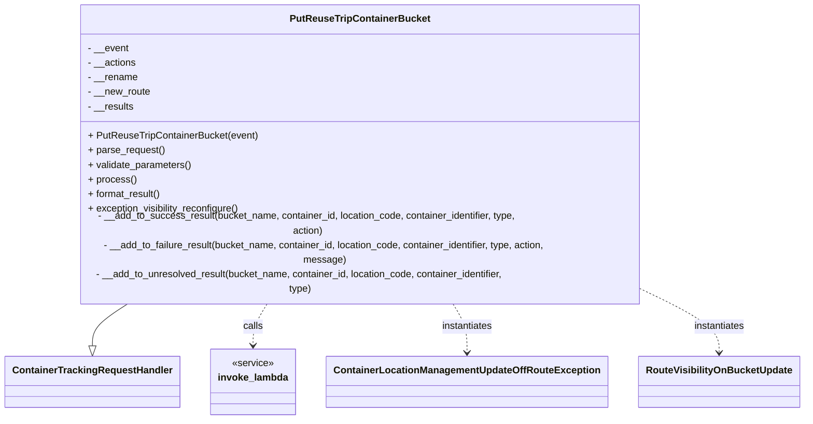

# Diagram: container_tracking_core/container_tracking_service/container_tracking_service/api/reuse_trip_container_bucket/bucket_management/handlers/put_reuse_trip_container_bucket.py


> Auto-generated by Obscura crawlers

## Diagram 1



> SVG rendering failed for this diagram.

## Diagram 2

```mermaid
flowchart TD
    Start([Start process()])
    CheckNew{__new_route?}
    NewRouteInvoke[Invoke GET reuse-trip-container-bucket-handler]
    NewRouteStatus{statusCode == 200?}
    NewRouteBody{results.body exists?}
    NewRouteFailStatus[_results.failure["_isNew"] = error message]
    NewRouteFailExists[_results.failure["_isNew"]="This route name exists..."]
    NewRouteSuccess[_results.success["_isNew"]=true]
    SetActionsNone[/__actions = None/]
    CheckRename{__rename?}
    RenameInvoke[Invoke PATCH reuse-trip-container-bucket-handler]
    RenameStatus{status_code == 200?}
    RenameSuccess[_results.success["_rename"] = results]
    RenameFail[_results.failure["_rename"] = results]
    CheckActions{__actions?}
    LoopItems([For each item in __actions])
    ItemAction{item.action == "ADD"?}
    AddInvoke[Invoke POST reuse-trip-container-bucket-handler]
    AddStatus{status_code == 200?}
    AddSuccess[__add_to_success_result(..., "ADD")]
    AddFail[__add_to_failure_result(..., "ADD")]
    ItemDelete{item.action == "DELETE"?}
    DelInvoke[Invoke DELETE reuse-trip-container-bucket-handler]
    DelStatus{status_code == 200?}
    DelSuccess[__add_to_success_result(..., "DELETE")]
    DelFail[__add_to_failure_result(..., "DELETE")]
    NoAction[__add_to_unresolved_result(...)]
    NextItem([Next item])
    EndLoop([Finished items])
    Format[format_result()]
    CheckResults{success & failure? / success only?}
    MultiStatus[status = 207 (MULTI_STATUS)]
    OKStatus[status = 200 (OK)]
    ErrorStatus[status = 500 (INTERNAL_SERVER_ERROR)]
    Reconfigure[exception_visibility_reconfigure()]
    End([Return response])

    Start --> CheckNew
    CheckNew -- yes --> NewRouteInvoke
    NewRouteInvoke --> NewRouteStatus
    NewRouteStatus -- no --> NewRouteFailStatus --> SetActionsNone
    NewRouteStatus -- yes --> NewRouteBody
    NewRouteBody -- yes --> NewRouteFailExists --> SetActionsNone
    NewRouteBody -- no --> NewRouteSuccess
    NewRouteSuccess --> CheckRename
    CheckNew -- no --> CheckRename

    CheckRename -- yes --> RenameInvoke --> RenameStatus
    RenameStatus -- yes --> RenameSuccess
    RenameStatus -- no --> RenameFail --> SetActionsNone
    RenameSuccess --> CheckActions
    CheckRename -- no --> CheckActions

    CheckActions -- no --> EndLoop
    CheckActions -- yes --> LoopItems
    LoopItems --> ItemAction
    ItemAction -- yes --> AddInvoke --> AddStatus
    AddStatus -- yes --> AddSuccess --> NextItem
    AddStatus -- no --> AddFail --> NextItem
    ItemAction -- no --> ItemDelete
    ItemDelete -- yes --> DelInvoke --> DelStatus
    DelStatus -- yes --> DelSuccess --> NextItem
    DelStatus -- no --> DelFail --> NextItem
    ItemDelete -- no --> NoAction --> NextItem
    NextItem --> LoopItems
    LoopItems --> EndLoop
    EndLoop --> Format

    Format --> CheckResults
    CheckResults -- both --> MultiStatus --> Reconfigure --> End
    CheckResults -- success_only --> OKStatus --> Reconfigure --> End
    CheckResults -- none_success --> ErrorStatus --> End
```

> SVG rendering failed for this diagram.
