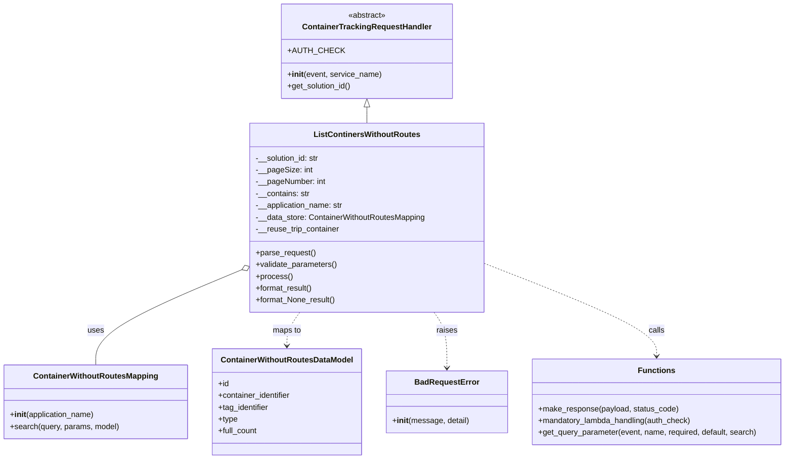

# Diagram: container_tracking_core/container_tracking_service/container_tracking_service/api/reuse_trip_container_bucket/containers_without_routes/containers_without_routes.py


> Auto-generated by Obscura crawlers

## Diagram 1



### SVG

<svg id="container" width="1586.3984375" xmlns="http://www.w3.org/2000/svg" class="classDiagram" height="932" viewBox="0 0 1586.3984375 932" role="graphics-document document" aria-roledescription="class"><style>#container{font-family:"trebuchet ms",verdana,arial,sans-serif;font-size:16px;fill:#333;}@keyframes edge-animation-frame{from{stroke-dashoffset:0;}}@keyframes dash{to{stroke-dashoffset:0;}}#container .edge-animation-slow{stroke-dasharray:9,5!important;stroke-dashoffset:900;animation:dash 50s linear infinite;stroke-linecap:round;}#container .edge-animation-fast{stroke-dasharray:9,5!important;stroke-dashoffset:900;animation:dash 20s linear infinite;stroke-linecap:round;}#container .error-icon{fill:#552222;}#container .error-text{fill:#552222;stroke:#552222;}#container .edge-thickness-normal{stroke-width:1px;}#container .edge-thickness-thick{stroke-width:3.5px;}#container .edge-pattern-solid{stroke-dasharray:0;}#container .edge-thickness-invisible{stroke-width:0;fill:none;}#container .edge-pattern-dashed{stroke-dasharray:3;}#container .edge-pattern-dotted{stroke-dasharray:2;}#container .marker{fill:#333333;stroke:#333333;}#container .marker.cross{stroke:#333333;}#container svg{font-family:"trebuchet ms",verdana,arial,sans-serif;font-size:16px;}#container p{margin:0;}#container g.classGroup text{fill:#9370DB;stroke:none;font-family:"trebuchet ms",verdana,arial,sans-serif;font-size:10px;}#container g.classGroup text .title{font-weight:bolder;}#container .nodeLabel,#container .edgeLabel{color:#131300;}#container .edgeLabel .label rect{fill:#ECECFF;}#container .label text{fill:#131300;}#container .labelBkg{background:#ECECFF;}#container .edgeLabel .label span{background:#ECECFF;}#container .classTitle{font-weight:bolder;}#container .node rect,#container .node circle,#container .node ellipse,#container .node polygon,#container .node path{fill:#ECECFF;stroke:#9370DB;stroke-width:1px;}#container .divider{stroke:#9370DB;stroke-width:1;}#container g.clickable{cursor:pointer;}#container g.classGroup rect{fill:#ECECFF;stroke:#9370DB;}#container g.classGroup line{stroke:#9370DB;stroke-width:1;}#container .classLabel .box{stroke:none;stroke-width:0;fill:#ECECFF;opacity:0.5;}#container .classLabel .label{fill:#9370DB;font-size:10px;}#container .relation{stroke:#333333;stroke-width:1;fill:none;}#container .dashed-line{stroke-dasharray:3;}#container .dotted-line{stroke-dasharray:1 2;}#container #compositionStart,#container .composition{fill:#333333!important;stroke:#333333!important;stroke-width:1;}#container #compositionEnd,#container .composition{fill:#333333!important;stroke:#333333!important;stroke-width:1;}#container #dependencyStart,#container .dependency{fill:#333333!important;stroke:#333333!important;stroke-width:1;}#container #dependencyStart,#container .dependency{fill:#333333!important;stroke:#333333!important;stroke-width:1;}#container #extensionStart,#container .extension{fill:transparent!important;stroke:#333333!important;stroke-width:1;}#container #extensionEnd,#container .extension{fill:transparent!important;stroke:#333333!important;stroke-width:1;}#container #aggregationStart,#container .aggregation{fill:transparent!important;stroke:#333333!important;stroke-width:1;}#container #aggregationEnd,#container .aggregation{fill:transparent!important;stroke:#333333!important;stroke-width:1;}#container #lollipopStart,#container .lollipop{fill:#ECECFF!important;stroke:#333333!important;stroke-width:1;}#container #lollipopEnd,#container .lollipop{fill:#ECECFF!important;stroke:#333333!important;stroke-width:1;}#container .edgeTerminals{font-size:11px;line-height:initial;}#container .classTitleText{text-anchor:middle;font-size:18px;fill:#333;}#container .label-icon{display:inline-block;height:1em;overflow:visible;vertical-align:-0.125em;}#container .node .label-icon path{fill:currentColor;stroke:revert;stroke-width:revert;}#container :root{--mermaid-font-family:"trebuchet ms",verdana,arial,sans-serif;}</style><g><defs><marker id="container_class-aggregationStart" class="marker aggregation class" refX="18" refY="7" markerWidth="190" markerHeight="240" orient="auto"><path d="M 18,7 L9,13 L1,7 L9,1 Z"></path></marker></defs><defs><marker id="container_class-aggregationEnd" class="marker aggregation class" refX="1" refY="7" markerWidth="20" markerHeight="28" orient="auto"><path d="M 18,7 L9,13 L1,7 L9,1 Z"></path></marker></defs><defs><marker id="container_class-extensionStart" class="marker extension class" refX="18" refY="7" markerWidth="190" markerHeight="240" orient="auto"><path d="M 1,7 L18,13 V 1 Z"></path></marker></defs><defs><marker id="container_class-extensionEnd" class="marker extension class" refX="1" refY="7" markerWidth="20" markerHeight="28" orient="auto"><path d="M 1,1 V 13 L18,7 Z"></path></marker></defs><defs><marker id="container_class-compositionStart" class="marker composition class" refX="18" refY="7" markerWidth="190" markerHeight="240" orient="auto"><path d="M 18,7 L9,13 L1,7 L9,1 Z"></path></marker></defs><defs><marker id="container_class-compositionEnd" class="marker composition class" refX="1" refY="7" markerWidth="20" markerHeight="28" orient="auto"><path d="M 18,7 L9,13 L1,7 L9,1 Z"></path></marker></defs><defs><marker id="container_class-dependencyStart" class="marker dependency class" refX="6" refY="7" markerWidth="190" markerHeight="240" orient="auto"><path d="M 5,7 L9,13 L1,7 L9,1 Z"></path></marker></defs><defs><marker id="container_class-dependencyEnd" class="marker dependency class" refX="13" refY="7" markerWidth="20" markerHeight="28" orient="auto"><path d="M 18,7 L9,13 L14,7 L9,1 Z"></path></marker></defs><defs><marker id="container_class-lollipopStart" class="marker lollipop class" refX="13" refY="7" markerWidth="190" markerHeight="240" orient="auto"><circle stroke="black" fill="transparent" cx="7" cy="7" r="6"></circle></marker></defs><defs><marker id="container_class-lollipopEnd" class="marker lollipop class" refX="1" refY="7" markerWidth="190" markerHeight="240" orient="auto"><circle stroke="black" fill="transparent" cx="7" cy="7" r="6"></circle></marker></defs><g class="root"><g class="clusters"></g><g class="edgePaths"><path d="M739.492,217.25L739.492,218.542C739.492,219.833,739.492,222.417,739.492,227.875C739.492,233.333,739.492,241.667,739.492,245.833L739.492,250" id="id_ContainerTrackingRequestHandler_ListContinersWithoutRoutes_1" class="edge-thickness-normal edge-pattern-solid relation" style=";;;" data-edge="true" data-et="edge" data-id="id_ContainerTrackingRequestHandler_ListContinersWithoutRoutes_1" data-points="W3sieCI6NzM5LjQ5MjE4NzUsInkiOjIwMH0seyJ4Ijo3MzkuNDkyMTg3NSwieSI6MjI1fSx7IngiOjczOS40OTIxODc1LCJ5IjoyNTB9XQ==" marker-start="url(#container_class-extensionStart)"></path><path d="M486.621,547.772L437.52,568.31C388.419,588.848,290.217,629.924,241.117,662.129C192.016,694.333,192.016,717.667,192.016,729.333L192.016,741" id="id_ListContinersWithoutRoutes_ContainerWithoutRoutesMapping_2" class="edge-thickness-normal edge-pattern-solid relation" style=";;;" data-edge="true" data-et="edge" data-id="id_ListContinersWithoutRoutes_ContainerWithoutRoutesMapping_2" data-points="W3sieCI6NTAyLjUzNTE1NjI1LCJ5Ijo1NDEuMTE1MDM3NzQ0MTk1N30seyJ4IjoxOTIuMDE1NjI1LCJ5Ijo2NzF9LHsieCI6MTkyLjAxNTYyNSwieSI6NzQxfV0=" marker-start="url(#container_class-aggregationStart)"></path><path d="M604.204,634L599.859,640.167C595.514,646.333,586.823,658.667,582.478,670C578.133,681.333,578.133,691.667,578.133,696.833L578.133,702" id="id_ListContinersWithoutRoutes_ContainerWithoutRoutesDataModel_3" class="edge-thickness-normal edge-pattern-dashed relation" style=";;;" data-edge="true" data-et="edge" data-id="id_ListContinersWithoutRoutes_ContainerWithoutRoutesDataModel_3" data-points="W3sieCI6NjA0LjIwMzk3Nzg5MzAxMzEsInkiOjYzNH0seyJ4Ijo1NzguMTMyODEyNSwieSI6NjcxfSx7IngiOjU3OC4xMzI4MTI1LCJ5Ijo3MDh9XQ==" marker-end="url(#container_class-dependencyEnd)"></path><path d="M874.78,634L879.126,640.167C883.471,646.333,892.161,658.667,896.506,677.5C900.852,696.333,900.852,721.667,900.852,734.333L900.852,747" id="id_ListContinersWithoutRoutes_BadRequestError_4" class="edge-thickness-normal edge-pattern-dashed relation" style=";;;" data-edge="true" data-et="edge" data-id="id_ListContinersWithoutRoutes_BadRequestError_4" data-points="W3sieCI6ODc0Ljc4MDM5NzEwNjk4NjksInkiOjYzNH0seyJ4Ijo5MDAuODUxNTYyNSwieSI6NjcxfSx7IngiOjkwMC44NTE1NjI1LCJ5Ijo3NTN9XQ==" marker-end="url(#container_class-dependencyEnd)"></path><path d="M976.449,534.688L1034.53,557.406C1092.611,580.125,1208.772,625.563,1266.853,656.948C1324.934,688.333,1324.934,705.667,1324.934,714.333L1324.934,723" id="id_ListContinersWithoutRoutes_Functions_5" class="edge-thickness-normal edge-pattern-dashed relation" style=";;;" data-edge="true" data-et="edge" data-id="id_ListContinersWithoutRoutes_Functions_5" data-points="W3sieCI6OTc2LjQ0OTIxODc1LCJ5Ijo1MzQuNjg3NjAyMTY5ODM3Mn0seyJ4IjoxMzI0LjkzMzU5Mzc1LCJ5Ijo2NzF9LHsieCI6MTMyNC45MzM1OTM3NSwieSI6NzI5fV0=" marker-end="url(#container_class-dependencyEnd)"></path></g><g class="edgeLabels"><g class="edgeLabel"><g class="label" data-id="id_ContainerTrackingRequestHandler_ListContinersWithoutRoutes_1" transform="translate(0, 0)"><foreignObject width="0" height="0"><div xmlns="http://www.w3.org/1999/xhtml" class="labelBkg" style="display: table-cell; white-space: nowrap; line-height: 1.5; max-width: 200px; text-align: center;"><span class="edgeLabel"></span></div></foreignObject></g></g><g class="edgeLabel" transform="translate(192.015625, 671)"><g class="label" data-id="id_ListContinersWithoutRoutes_ContainerWithoutRoutesMapping_2" transform="translate(-16.4921875, -12)"><foreignObject width="32.984375" height="24"><div xmlns="http://www.w3.org/1999/xhtml" class="labelBkg" style="display: table-cell; white-space: nowrap; line-height: 1.5; max-width: 200px; text-align: center;"><span class="edgeLabel"><p>uses</p></span></div></foreignObject></g></g><g class="edgeLabel" transform="translate(578.1328125, 671)"><g class="label" data-id="id_ListContinersWithoutRoutes_ContainerWithoutRoutesDataModel_3" transform="translate(-29.2578125, -12)"><foreignObject width="58.515625" height="24"><div xmlns="http://www.w3.org/1999/xhtml" class="labelBkg" style="display: table-cell; white-space: nowrap; line-height: 1.5; max-width: 200px; text-align: center;"><span class="edgeLabel"><p>maps to</p></span></div></foreignObject></g></g><g class="edgeLabel" transform="translate(900.8515625, 671)"><g class="label" data-id="id_ListContinersWithoutRoutes_BadRequestError_4" transform="translate(-21.25, -12)"><foreignObject width="42.5" height="24"><div xmlns="http://www.w3.org/1999/xhtml" class="labelBkg" style="display: table-cell; white-space: nowrap; line-height: 1.5; max-width: 200px; text-align: center;"><span class="edgeLabel"><p>raises</p></span></div></foreignObject></g></g><g class="edgeLabel" transform="translate(1324.93359375, 671)"><g class="label" data-id="id_ListContinersWithoutRoutes_Functions_5" transform="translate(-16.4453125, -12)"><foreignObject width="32.890625" height="24"><div xmlns="http://www.w3.org/1999/xhtml" class="labelBkg" style="display: table-cell; white-space: nowrap; line-height: 1.5; max-width: 200px; text-align: center;"><span class="edgeLabel"><p>calls</p></span></div></foreignObject></g></g></g><g class="nodes"><g class="node default" id="classId-ContainerTrackingRequestHandler-0" transform="translate(739.4921875, 104)"><g class="basic label-container"><path d="M-170.08984375 -96 L170.08984375 -96 L170.08984375 96 L-170.08984375 96" stroke="none" stroke-width="0" fill="#ECECFF" style=""></path><path d="M-170.08984375 -96 C-46.30252263518523 -96, 77.48479847962955 -96, 170.08984375 -96 M-170.08984375 -96 C-66.78555912330577 -96, 36.51872550338845 -96, 170.08984375 -96 M170.08984375 -96 C170.08984375 -55.17891464970631, 170.08984375 -14.357829299412614, 170.08984375 96 M170.08984375 -96 C170.08984375 -41.60229339849178, 170.08984375 12.795413203016437, 170.08984375 96 M170.08984375 96 C67.98764910850804 96, -34.114545532983925 96, -170.08984375 96 M170.08984375 96 C87.20634418586029 96, 4.322844621720577 96, -170.08984375 96 M-170.08984375 96 C-170.08984375 33.0510389887515, -170.08984375 -29.897922022497, -170.08984375 -96 M-170.08984375 96 C-170.08984375 56.88543536715649, -170.08984375 17.77087073431298, -170.08984375 -96" stroke="#9370DB" stroke-width="1.3" fill="none" stroke-dasharray="0 0" style=""></path></g><g class="annotation-group text" transform="translate(-38.609375, -72)"><g class="label" style="" transform="translate(0,-12)"><foreignObject width="77.21875" height="24"><div xmlns="http://www.w3.org/1999/xhtml" style="display: table-cell; white-space: nowrap; line-height: 1.5; max-width: 127px; text-align: center;"><span class="nodeLabel markdown-node-label" style=""><p>«abstract»</p></span></div></foreignObject></g></g><g class="label-group text" transform="translate(-125.5859375, -48)"><g class="label" style="font-weight: bolder" transform="translate(0,-12)"><foreignObject width="251.171875" height="24"><div xmlns="http://www.w3.org/1999/xhtml" style="display: table-cell; white-space: nowrap; line-height: 1.5; max-width: 299px; text-align: center;"><span class="nodeLabel markdown-node-label" style=""><p>ContainerTrackingRequestHandler</p></span></div></foreignObject></g></g><g class="members-group text" transform="translate(-158.08984375, 0)"><g class="label" style="" transform="translate(0,-12)"><foreignObject width="100.859375" height="24"><div xmlns="http://www.w3.org/1999/xhtml" style="display: table-cell; white-space: nowrap; line-height: 1.5; max-width: 159px; text-align: center;"><span class="nodeLabel markdown-node-label" style=""><p>+AUTH_CHECK</p></span></div></foreignObject></g></g><g class="methods-group text" transform="translate(-158.08984375, 48)"><g class="label" style="" transform="translate(0,-12)"><foreignObject width="190.59375" height="24"><div xmlns="http://www.w3.org/1999/xhtml" style="display: table-cell; white-space: nowrap; line-height: 1.5; max-width: 279px; text-align: center;"><span class="nodeLabel markdown-node-label" style=""><p>+<strong>init</strong>(event, service_name)</p></span></div></foreignObject></g><g class="label" style="" transform="translate(0,12)"><foreignObject width="131.46875" height="24"><div xmlns="http://www.w3.org/1999/xhtml" style="display: table-cell; white-space: nowrap; line-height: 1.5; max-width: 189px; text-align: center;"><span class="nodeLabel markdown-node-label" style=""><p>+get_solution_id()</p></span></div></foreignObject></g></g><g class="divider" style=""><path d="M-170.08984375 -24 C-96.31055357619036 -24, -22.531263402380716 -24, 170.08984375 -24 M-170.08984375 -24 C-101.47437865381633 -24, -32.85891355763266 -24, 170.08984375 -24" stroke="#9370DB" stroke-width="1.3" fill="none" stroke-dasharray="0 0" style=""></path></g><g class="divider" style=""><path d="M-170.08984375 24 C-80.29710900265563 24, 9.495625744688738 24, 170.08984375 24 M-170.08984375 24 C-90.98310230424308 24, -11.876360858486152 24, 170.08984375 24" stroke="#9370DB" stroke-width="1.3" fill="none" stroke-dasharray="0 0" style=""></path></g></g><g class="node default" id="classId-ListContinersWithoutRoutes-1" transform="translate(739.4921875, 442)"><g class="basic label-container"><path d="M-236.95703125 -192 L236.95703125 -192 L236.95703125 192 L-236.95703125 192" stroke="none" stroke-width="0" fill="#ECECFF" style=""></path><path d="M-236.95703125 -192 C-75.35448212151755 -192, 86.2480670069649 -192, 236.95703125 -192 M-236.95703125 -192 C-103.90499037341024 -192, 29.147050503179514 -192, 236.95703125 -192 M236.95703125 -192 C236.95703125 -61.34646808241277, 236.95703125 69.30706383517446, 236.95703125 192 M236.95703125 -192 C236.95703125 -88.3744689695714, 236.95703125 15.251062060857208, 236.95703125 192 M236.95703125 192 C95.70321676011255 192, -45.55059772977489 192, -236.95703125 192 M236.95703125 192 C108.30140682191853 192, -20.354217606162933 192, -236.95703125 192 M-236.95703125 192 C-236.95703125 90.20244395796132, -236.95703125 -11.595112084077357, -236.95703125 -192 M-236.95703125 192 C-236.95703125 110.88295022317457, -236.95703125 29.76590044634915, -236.95703125 -192" stroke="#9370DB" stroke-width="1.3" fill="none" stroke-dasharray="0 0" style=""></path></g><g class="annotation-group text" transform="translate(0, -168)"></g><g class="label-group text" transform="translate(-102.7578125, -168)"><g class="label" style="font-weight: bolder" transform="translate(0,-12)"><foreignObject width="205.515625" height="24"><div xmlns="http://www.w3.org/1999/xhtml" style="display: table-cell; white-space: nowrap; line-height: 1.5; max-width: 252px; text-align: center;"><span class="nodeLabel markdown-node-label" style=""><p>ListContinersWithoutRoutes</p></span></div></foreignObject></g></g><g class="members-group text" transform="translate(-224.95703125, -120)"><g class="label" style="" transform="translate(0,-12)"><foreignObject width="131.390625" height="24"><div xmlns="http://www.w3.org/1999/xhtml" style="display: table-cell; white-space: nowrap; line-height: 1.5; max-width: 190px; text-align: center;"><span class="nodeLabel markdown-node-label" style=""><p>-__solution_id: str</p></span></div></foreignObject></g><g class="label" style="" transform="translate(0,12)"><foreignObject width="112.90625" height="24"><div xmlns="http://www.w3.org/1999/xhtml" style="display: table-cell; white-space: nowrap; line-height: 1.5; max-width: 170px; text-align: center;"><span class="nodeLabel markdown-node-label" style=""><p>-__pageSize: int</p></span></div></foreignObject></g><g class="label" style="" transform="translate(0,36)"><foreignObject width="142.578125" height="24"><div xmlns="http://www.w3.org/1999/xhtml" style="display: table-cell; white-space: nowrap; line-height: 1.5; max-width: 200px; text-align: center;"><span class="nodeLabel markdown-node-label" style=""><p>-__pageNumber: int</p></span></div></foreignObject></g><g class="label" style="" transform="translate(0,60)"><foreignObject width="110.609375" height="24"><div xmlns="http://www.w3.org/1999/xhtml" style="display: table-cell; white-space: nowrap; line-height: 1.5; max-width: 169px; text-align: center;"><span class="nodeLabel markdown-node-label" style=""><p>-__contains: str</p></span></div></foreignObject></g><g class="label" style="" transform="translate(0,84)"><foreignObject width="179.78125" height="24"><div xmlns="http://www.w3.org/1999/xhtml" style="display: table-cell; white-space: nowrap; line-height: 1.5; max-width: 238px; text-align: center;"><span class="nodeLabel markdown-node-label" style=""><p>-__application_name: str</p></span></div></foreignObject></g><g class="label" style="" transform="translate(0,108)"><foreignObject width="347.15625" height="24"><div xmlns="http://www.w3.org/1999/xhtml" style="display: table-cell; white-space: nowrap; line-height: 1.5; max-width: 405px; text-align: center;"><span class="nodeLabel markdown-node-label" style=""><p>-__data_store: ContainerWithoutRoutesMapping</p></span></div></foreignObject></g><g class="label" style="" transform="translate(0,132)"><foreignObject width="172.109375" height="24"><div xmlns="http://www.w3.org/1999/xhtml" style="display: table-cell; white-space: nowrap; line-height: 1.5; max-width: 230px; text-align: center;"><span class="nodeLabel markdown-node-label" style=""><p>-__reuse_trip_container</p></span></div></foreignObject></g></g><g class="methods-group text" transform="translate(-224.95703125, 72)"><g class="label" style="" transform="translate(0,-12)"><foreignObject width="121.796875" height="24"><div xmlns="http://www.w3.org/1999/xhtml" style="display: table-cell; white-space: nowrap; line-height: 1.5; max-width: 179px; text-align: center;"><span class="nodeLabel markdown-node-label" style=""><p>+parse_request()</p></span></div></foreignObject></g><g class="label" style="" transform="translate(0,12)"><foreignObject width="166.546875" height="24"><div xmlns="http://www.w3.org/1999/xhtml" style="display: table-cell; white-space: nowrap; line-height: 1.5; max-width: 224px; text-align: center;"><span class="nodeLabel markdown-node-label" style=""><p>+validate_parameters()</p></span></div></foreignObject></g><g class="label" style="" transform="translate(0,36)"><foreignObject width="73.734375" height="24"><div xmlns="http://www.w3.org/1999/xhtml" style="display: table-cell; white-space: nowrap; line-height: 1.5; max-width: 131px; text-align: center;"><span class="nodeLabel markdown-node-label" style=""><p>+process()</p></span></div></foreignObject></g><g class="label" style="" transform="translate(0,60)"><foreignObject width="117.015625" height="24"><div xmlns="http://www.w3.org/1999/xhtml" style="display: table-cell; white-space: nowrap; line-height: 1.5; max-width: 174px; text-align: center;"><span class="nodeLabel markdown-node-label" style=""><p>+format_result()</p></span></div></foreignObject></g><g class="label" style="" transform="translate(0,84)"><foreignObject width="163.390625" height="24"><div xmlns="http://www.w3.org/1999/xhtml" style="display: table-cell; white-space: nowrap; line-height: 1.5; max-width: 221px; text-align: center;"><span class="nodeLabel markdown-node-label" style=""><p>+format_None_result()</p></span></div></foreignObject></g></g><g class="divider" style=""><path d="M-236.95703125 -144 C-55.54707055899155 -144, 125.8628901320169 -144, 236.95703125 -144 M-236.95703125 -144 C-48.304953471661264 -144, 140.34712430667747 -144, 236.95703125 -144" stroke="#9370DB" stroke-width="1.3" fill="none" stroke-dasharray="0 0" style=""></path></g><g class="divider" style=""><path d="M-236.95703125 48 C-125.84443866448238 48, -14.731846078964765 48, 236.95703125 48 M-236.95703125 48 C-125.91951607306761 48, -14.882000896135224 48, 236.95703125 48" stroke="#9370DB" stroke-width="1.3" fill="none" stroke-dasharray="0 0" style=""></path></g></g><g class="node default" id="classId-ContainerWithoutRoutesMapping-2" transform="translate(192.015625, 816)"><g class="basic label-container"><path d="M-184.015625 -75 L184.015625 -75 L184.015625 75 L-184.015625 75" stroke="none" stroke-width="0" fill="#ECECFF" style=""></path><path d="M-184.015625 -75 C-70.97443047642213 -75, 42.06676404715574 -75, 184.015625 -75 M-184.015625 -75 C-86.75009136303247 -75, 10.515442273935065 -75, 184.015625 -75 M184.015625 -75 C184.015625 -39.56961833959307, 184.015625 -4.139236679186141, 184.015625 75 M184.015625 -75 C184.015625 -25.910678411000504, 184.015625 23.178643177998993, 184.015625 75 M184.015625 75 C53.83509588496668 75, -76.34543323006665 75, -184.015625 75 M184.015625 75 C102.19908738633298 75, 20.382549772665953 75, -184.015625 75 M-184.015625 75 C-184.015625 21.831230580138225, -184.015625 -31.33753883972355, -184.015625 -75 M-184.015625 75 C-184.015625 17.99180461858301, -184.015625 -39.01639076283398, -184.015625 -75" stroke="#9370DB" stroke-width="1.3" fill="none" stroke-dasharray="0 0" style=""></path></g><g class="annotation-group text" transform="translate(0, -51)"></g><g class="label-group text" transform="translate(-121.46875, -51)"><g class="label" style="font-weight: bolder" transform="translate(0,-12)"><foreignObject width="242.9375" height="24"><div xmlns="http://www.w3.org/1999/xhtml" style="display: table-cell; white-space: nowrap; line-height: 1.5; max-width: 291px; text-align: center;"><span class="nodeLabel markdown-node-label" style=""><p>ContainerWithoutRoutesMapping</p></span></div></foreignObject></g></g><g class="members-group text" transform="translate(-172.015625, -3)"></g><g class="methods-group text" transform="translate(-172.015625, 27)"><g class="label" style="" transform="translate(0,-12)"><foreignObject width="173.734375" height="24"><div xmlns="http://www.w3.org/1999/xhtml" style="display: table-cell; white-space: nowrap; line-height: 1.5; max-width: 263px; text-align: center;"><span class="nodeLabel markdown-node-label" style=""><p>+<strong>init</strong>(application_name)</p></span></div></foreignObject></g><g class="label" style="" transform="translate(0,12)"><foreignObject width="222.5625" height="24"><div xmlns="http://www.w3.org/1999/xhtml" style="display: table-cell; white-space: nowrap; line-height: 1.5; max-width: 280px; text-align: center;"><span class="nodeLabel markdown-node-label" style=""><p>+search(query, params, model)</p></span></div></foreignObject></g></g><g class="divider" style=""><path d="M-184.015625 -27 C-39.89249976520594 -27, 104.23062546958812 -27, 184.015625 -27 M-184.015625 -27 C-44.81224907885675 -27, 94.3911268422865 -27, 184.015625 -27" stroke="#9370DB" stroke-width="1.3" fill="none" stroke-dasharray="0 0" style=""></path></g><g class="divider" style=""><path d="M-184.015625 -3 C-58.51729450974469 -3, 66.98103598051063 -3, 184.015625 -3 M-184.015625 -3 C-65.40186466186688 -3, 53.21189567626624 -3, 184.015625 -3" stroke="#9370DB" stroke-width="1.3" fill="none" stroke-dasharray="0 0" style=""></path></g></g><g class="node default" id="classId-ContainerWithoutRoutesDataModel-3" transform="translate(578.1328125, 816)"><g class="basic label-container"><path d="M-152.1015625 -108 L152.1015625 -108 L152.1015625 108 L-152.1015625 108" stroke="none" stroke-width="0" fill="#ECECFF" style=""></path><path d="M-152.1015625 -108 C-36.7076486602318 -108, 78.6862651795364 -108, 152.1015625 -108 M-152.1015625 -108 C-40.110617873553196 -108, 71.88032675289361 -108, 152.1015625 -108 M152.1015625 -108 C152.1015625 -58.73399183136295, 152.1015625 -9.4679836627259, 152.1015625 108 M152.1015625 -108 C152.1015625 -51.7660313521795, 152.1015625 4.4679372956409935, 152.1015625 108 M152.1015625 108 C43.012177854056105 108, -66.07720679188779 108, -152.1015625 108 M152.1015625 108 C35.58419674800935 108, -80.9331690039813 108, -152.1015625 108 M-152.1015625 108 C-152.1015625 23.487444429876916, -152.1015625 -61.02511114024617, -152.1015625 -108 M-152.1015625 108 C-152.1015625 29.462095684791663, -152.1015625 -49.075808630416674, -152.1015625 -108" stroke="#9370DB" stroke-width="1.3" fill="none" stroke-dasharray="0 0" style=""></path></g><g class="annotation-group text" transform="translate(0, -84)"></g><g class="label-group text" transform="translate(-129.40625, -84)"><g class="label" style="font-weight: bolder" transform="translate(0,-12)"><foreignObject width="258.8125" height="24"><div xmlns="http://www.w3.org/1999/xhtml" style="display: table-cell; white-space: nowrap; line-height: 1.5; max-width: 306px; text-align: center;"><span class="nodeLabel markdown-node-label" style=""><p>ContainerWithoutRoutesDataModel</p></span></div></foreignObject></g></g><g class="members-group text" transform="translate(-140.1015625, -36)"><g class="label" style="" transform="translate(0,-12)"><foreignObject width="22.078125" height="24"><div xmlns="http://www.w3.org/1999/xhtml" style="display: table-cell; white-space: nowrap; line-height: 1.5; max-width: 79px; text-align: center;"><span class="nodeLabel markdown-node-label" style=""><p>+id</p></span></div></foreignObject></g><g class="label" style="" transform="translate(0,12)"><foreignObject width="150.796875" height="24"><div xmlns="http://www.w3.org/1999/xhtml" style="display: table-cell; white-space: nowrap; line-height: 1.5; max-width: 209px; text-align: center;"><span class="nodeLabel markdown-node-label" style=""><p>+container_identifier</p></span></div></foreignObject></g><g class="label" style="" transform="translate(0,36)"><foreignObject width="105.390625" height="24"><div xmlns="http://www.w3.org/1999/xhtml" style="display: table-cell; white-space: nowrap; line-height: 1.5; max-width: 164px; text-align: center;"><span class="nodeLabel markdown-node-label" style=""><p>+tag_identifier</p></span></div></foreignObject></g><g class="label" style="" transform="translate(0,60)"><foreignObject width="39.703125" height="24"><div xmlns="http://www.w3.org/1999/xhtml" style="display: table-cell; white-space: nowrap; line-height: 1.5; max-width: 97px; text-align: center;"><span class="nodeLabel markdown-node-label" style=""><p>+type</p></span></div></foreignObject></g><g class="label" style="" transform="translate(0,84)"><foreignObject width="80.9375" height="24"><div xmlns="http://www.w3.org/1999/xhtml" style="display: table-cell; white-space: nowrap; line-height: 1.5; max-width: 139px; text-align: center;"><span class="nodeLabel markdown-node-label" style=""><p>+full_count</p></span></div></foreignObject></g></g><g class="methods-group text" transform="translate(-140.1015625, 108)"></g><g class="divider" style=""><path d="M-152.1015625 -60 C-71.15125832428573 -60, 9.79904585142853 -60, 152.1015625 -60 M-152.1015625 -60 C-42.383664025448695 -60, 67.33423444910261 -60, 152.1015625 -60" stroke="#9370DB" stroke-width="1.3" fill="none" stroke-dasharray="0 0" style=""></path></g><g class="divider" style=""><path d="M-152.1015625 84 C-72.79296675594354 84, 6.515628988112923 84, 152.1015625 84 M-152.1015625 84 C-43.190037923918865 84, 65.72148665216227 84, 152.1015625 84" stroke="#9370DB" stroke-width="1.3" fill="none" stroke-dasharray="0 0" style=""></path></g></g><g class="node default" id="classId-BadRequestError-4" transform="translate(900.8515625, 816)"><g class="basic label-container"><path d="M-120.6171875 -63 L120.6171875 -63 L120.6171875 63 L-120.6171875 63" stroke="none" stroke-width="0" fill="#ECECFF" style=""></path><path d="M-120.6171875 -63 C-45.34457611890646 -63, 29.92803526218708 -63, 120.6171875 -63 M-120.6171875 -63 C-54.05325127261433 -63, 12.510684954771335 -63, 120.6171875 -63 M120.6171875 -63 C120.6171875 -33.65392652431582, 120.6171875 -4.307853048631635, 120.6171875 63 M120.6171875 -63 C120.6171875 -30.528157260038178, 120.6171875 1.9436854799236443, 120.6171875 63 M120.6171875 63 C65.51083973575344 63, 10.404491971506872 63, -120.6171875 63 M120.6171875 63 C54.269686097275525 63, -12.07781530544895 63, -120.6171875 63 M-120.6171875 63 C-120.6171875 16.329369219849696, -120.6171875 -30.34126156030061, -120.6171875 -63 M-120.6171875 63 C-120.6171875 29.67228215765858, -120.6171875 -3.6554356846828426, -120.6171875 -63" stroke="#9370DB" stroke-width="1.3" fill="none" stroke-dasharray="0 0" style=""></path></g><g class="annotation-group text" transform="translate(0, -39)"></g><g class="label-group text" transform="translate(-62.28125, -39)"><g class="label" style="font-weight: bolder" transform="translate(0,-12)"><foreignObject width="124.5625" height="24"><div xmlns="http://www.w3.org/1999/xhtml" style="display: table-cell; white-space: nowrap; line-height: 1.5; max-width: 174px; text-align: center;"><span class="nodeLabel markdown-node-label" style=""><p>BadRequestError</p></span></div></foreignObject></g></g><g class="members-group text" transform="translate(-108.6171875, 9)"></g><g class="methods-group text" transform="translate(-108.6171875, 39)"><g class="label" style="" transform="translate(0,-12)"><foreignObject width="154.953125" height="24"><div xmlns="http://www.w3.org/1999/xhtml" style="display: table-cell; white-space: nowrap; line-height: 1.5; max-width: 244px; text-align: center;"><span class="nodeLabel markdown-node-label" style=""><p>+<strong>init</strong>(message, detail)</p></span></div></foreignObject></g></g><g class="divider" style=""><path d="M-120.6171875 -15 C-70.25238659111271 -15, -19.88758568222542 -15, 120.6171875 -15 M-120.6171875 -15 C-47.36406615800411 -15, 25.889055183991786 -15, 120.6171875 -15" stroke="#9370DB" stroke-width="1.3" fill="none" stroke-dasharray="0 0" style=""></path></g><g class="divider" style=""><path d="M-120.6171875 9 C-30.997641341538653 9, 58.621904816922694 9, 120.6171875 9 M-120.6171875 9 C-58.29997709590549 9, 4.01723330818902 9, 120.6171875 9" stroke="#9370DB" stroke-width="1.3" fill="none" stroke-dasharray="0 0" style=""></path></g></g><g class="node default" id="classId-Functions-5" transform="translate(1324.93359375, 816)"><g class="basic label-container"><path d="M-253.46484375 -87 L253.46484375 -87 L253.46484375 87 L-253.46484375 87" stroke="none" stroke-width="0" fill="#ECECFF" style=""></path><path d="M-253.46484375 -87 C-85.07309622232552 -87, 83.31865130534896 -87, 253.46484375 -87 M-253.46484375 -87 C-63.74007075360515 -87, 125.9847022427897 -87, 253.46484375 -87 M253.46484375 -87 C253.46484375 -40.17629676109258, 253.46484375 6.64740647781484, 253.46484375 87 M253.46484375 -87 C253.46484375 -36.1276719124331, 253.46484375 14.744656175133798, 253.46484375 87 M253.46484375 87 C67.62338567900662 87, -118.21807239198677 87, -253.46484375 87 M253.46484375 87 C92.61215724336483 87, -68.24052926327033 87, -253.46484375 87 M-253.46484375 87 C-253.46484375 38.96947836256175, -253.46484375 -9.061043274876496, -253.46484375 -87 M-253.46484375 87 C-253.46484375 47.01801889148926, -253.46484375 7.036037782978525, -253.46484375 -87" stroke="#9370DB" stroke-width="1.3" fill="none" stroke-dasharray="0 0" style=""></path></g><g class="annotation-group text" transform="translate(0, -63)"></g><g class="label-group text" transform="translate(-35.1328125, -63)"><g class="label" style="font-weight: bolder" transform="translate(0,-12)"><foreignObject width="70.265625" height="24"><div xmlns="http://www.w3.org/1999/xhtml" style="display: table-cell; white-space: nowrap; line-height: 1.5; max-width: 120px; text-align: center;"><span class="nodeLabel markdown-node-label" style=""><p>Functions</p></span></div></foreignObject></g></g><g class="members-group text" transform="translate(-241.46484375, -15)"></g><g class="methods-group text" transform="translate(-241.46484375, 15)"><g class="label" style="" transform="translate(0,-12)"><foreignObject width="284.71875" height="24"><div xmlns="http://www.w3.org/1999/xhtml" style="display: table-cell; white-space: nowrap; line-height: 1.5; max-width: 342px; text-align: center;"><span class="nodeLabel markdown-node-label" style=""><p>+make_response(payload, status_code)</p></span></div></foreignObject></g><g class="label" style="" transform="translate(0,12)"><foreignObject width="314.828125" height="24"><div xmlns="http://www.w3.org/1999/xhtml" style="display: table-cell; white-space: nowrap; line-height: 1.5; max-width: 372px; text-align: center;"><span class="nodeLabel markdown-node-label" style=""><p>+mandatory_lambda_handling(auth_check)</p></span></div></foreignObject></g><g class="label" style="" transform="translate(0,36)"><foreignObject width="447.796875" height="24"><div xmlns="http://www.w3.org/1999/xhtml" style="display: table-cell; white-space: nowrap; line-height: 1.5; max-width: 505px; text-align: center;"><span class="nodeLabel markdown-node-label" style=""><p>+get_query_parameter(event, name, required, default, search)</p></span></div></foreignObject></g></g><g class="divider" style=""><path d="M-253.46484375 -39 C-128.54022871227608 -39, -3.615613674552179 -39, 253.46484375 -39 M-253.46484375 -39 C-147.31277054348564 -39, -41.16069733697128 -39, 253.46484375 -39" stroke="#9370DB" stroke-width="1.3" fill="none" stroke-dasharray="0 0" style=""></path></g><g class="divider" style=""><path d="M-253.46484375 -15 C-129.37525392058467 -15, -5.285664091169309 -15, 253.46484375 -15 M-253.46484375 -15 C-106.05250840393074 -15, 41.35982694213851 -15, 253.46484375 -15" stroke="#9370DB" stroke-width="1.3" fill="none" stroke-dasharray="0 0" style=""></path></g></g></g></g></g></svg>

## Diagram 2

```mermaid
flowchart TD
    LAMBDA[lambda_handler(event, context, audit_refs)\n@mandatory_lambda_handling] --> CREATE[ListContinersWithoutRoutes constructor]
    CREATE --> PARSE[parse_request()\nextract solutionId, pageSize, pageNumber, contains]
    PARSE --> VALIDATE[validate_parameters()\ncheck types]
    VALIDATE -->|invalid| RAISE[BadRequestError thrown]
    VALIDATE -->|valid| PROCESS[process()\nbuild SQL query and call data_store.search(query)]
    PROCESS -->|exception| NONE_RESULT[process returned None]
    PROCESS -->|success| FORMAT[format_result()\ncompute meta and map results]
    FORMAT --> RESP_OK[make_response(data, 200)]
    NONE_RESULT --> FORMAT_NONE[format_None_result()]
    FORMAT_NONE --> RESP_NOT_FOUND[make_response(message, 404)]
    RESP_OK --> RETURN[return response]
    RESP_NOT_FOUND --> RETURN
    RAISE --> HANDLE[mandatory_lambda_handling catches and formats error]
    HANDLE --> RETURN
```

> SVG rendering failed for this diagram.
