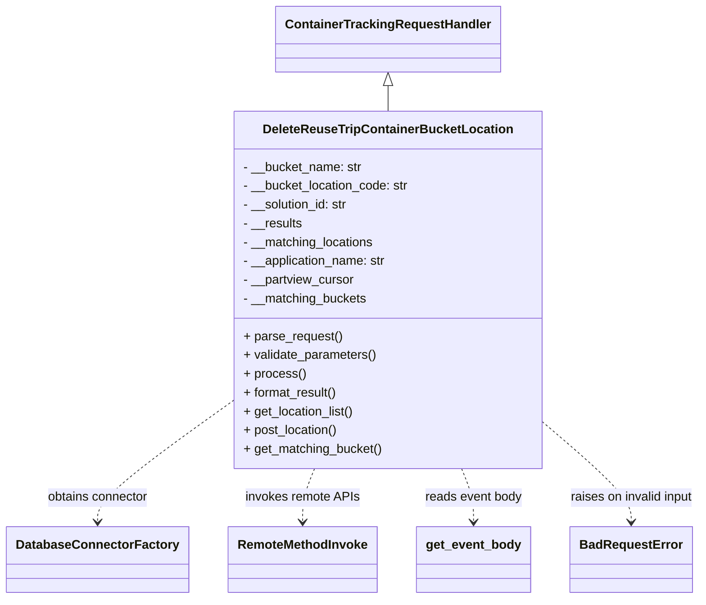

# Diagram: container_tracking_core/container_tracking_service/container_tracking_service/api/reuse_trip_container_bucket/location/handlers/delete_reuse_trip_container_bucket_location.py


> Auto-generated by Obscura crawlers

## Diagram 1



### SVG

<svg id="container" width="867.34375" xmlns="http://www.w3.org/2000/svg" class="classDiagram" height="764" viewBox="0 0 867.34375 764" role="graphics-document document" aria-roledescription="class"><style>#container{font-family:"trebuchet ms",verdana,arial,sans-serif;font-size:16px;fill:#333;}@keyframes edge-animation-frame{from{stroke-dashoffset:0;}}@keyframes dash{to{stroke-dashoffset:0;}}#container .edge-animation-slow{stroke-dasharray:9,5!important;stroke-dashoffset:900;animation:dash 50s linear infinite;stroke-linecap:round;}#container .edge-animation-fast{stroke-dasharray:9,5!important;stroke-dashoffset:900;animation:dash 20s linear infinite;stroke-linecap:round;}#container .error-icon{fill:#552222;}#container .error-text{fill:#552222;stroke:#552222;}#container .edge-thickness-normal{stroke-width:1px;}#container .edge-thickness-thick{stroke-width:3.5px;}#container .edge-pattern-solid{stroke-dasharray:0;}#container .edge-thickness-invisible{stroke-width:0;fill:none;}#container .edge-pattern-dashed{stroke-dasharray:3;}#container .edge-pattern-dotted{stroke-dasharray:2;}#container .marker{fill:#333333;stroke:#333333;}#container .marker.cross{stroke:#333333;}#container svg{font-family:"trebuchet ms",verdana,arial,sans-serif;font-size:16px;}#container p{margin:0;}#container g.classGroup text{fill:#9370DB;stroke:none;font-family:"trebuchet ms",verdana,arial,sans-serif;font-size:10px;}#container g.classGroup text .title{font-weight:bolder;}#container .nodeLabel,#container .edgeLabel{color:#131300;}#container .edgeLabel .label rect{fill:#ECECFF;}#container .label text{fill:#131300;}#container .labelBkg{background:#ECECFF;}#container .edgeLabel .label span{background:#ECECFF;}#container .classTitle{font-weight:bolder;}#container .node rect,#container .node circle,#container .node ellipse,#container .node polygon,#container .node path{fill:#ECECFF;stroke:#9370DB;stroke-width:1px;}#container .divider{stroke:#9370DB;stroke-width:1;}#container g.clickable{cursor:pointer;}#container g.classGroup rect{fill:#ECECFF;stroke:#9370DB;}#container g.classGroup line{stroke:#9370DB;stroke-width:1;}#container .classLabel .box{stroke:none;stroke-width:0;fill:#ECECFF;opacity:0.5;}#container .classLabel .label{fill:#9370DB;font-size:10px;}#container .relation{stroke:#333333;stroke-width:1;fill:none;}#container .dashed-line{stroke-dasharray:3;}#container .dotted-line{stroke-dasharray:1 2;}#container #compositionStart,#container .composition{fill:#333333!important;stroke:#333333!important;stroke-width:1;}#container #compositionEnd,#container .composition{fill:#333333!important;stroke:#333333!important;stroke-width:1;}#container #dependencyStart,#container .dependency{fill:#333333!important;stroke:#333333!important;stroke-width:1;}#container #dependencyStart,#container .dependency{fill:#333333!important;stroke:#333333!important;stroke-width:1;}#container #extensionStart,#container .extension{fill:transparent!important;stroke:#333333!important;stroke-width:1;}#container #extensionEnd,#container .extension{fill:transparent!important;stroke:#333333!important;stroke-width:1;}#container #aggregationStart,#container .aggregation{fill:transparent!important;stroke:#333333!important;stroke-width:1;}#container #aggregationEnd,#container .aggregation{fill:transparent!important;stroke:#333333!important;stroke-width:1;}#container #lollipopStart,#container .lollipop{fill:#ECECFF!important;stroke:#333333!important;stroke-width:1;}#container #lollipopEnd,#container .lollipop{fill:#ECECFF!important;stroke:#333333!important;stroke-width:1;}#container .edgeTerminals{font-size:11px;line-height:initial;}#container .classTitleText{text-anchor:middle;font-size:18px;fill:#333;}#container .label-icon{display:inline-block;height:1em;overflow:visible;vertical-align:-0.125em;}#container .node .label-icon path{fill:currentColor;stroke:revert;stroke-width:revert;}#container :root{--mermaid-font-family:"trebuchet ms",verdana,arial,sans-serif;}</style><g><defs><marker id="container_class-aggregationStart" class="marker aggregation class" refX="18" refY="7" markerWidth="190" markerHeight="240" orient="auto"><path d="M 18,7 L9,13 L1,7 L9,1 Z"></path></marker></defs><defs><marker id="container_class-aggregationEnd" class="marker aggregation class" refX="1" refY="7" markerWidth="20" markerHeight="28" orient="auto"><path d="M 18,7 L9,13 L1,7 L9,1 Z"></path></marker></defs><defs><marker id="container_class-extensionStart" class="marker extension class" refX="18" refY="7" markerWidth="190" markerHeight="240" orient="auto"><path d="M 1,7 L18,13 V 1 Z"></path></marker></defs><defs><marker id="container_class-extensionEnd" class="marker extension class" refX="1" refY="7" markerWidth="20" markerHeight="28" orient="auto"><path d="M 1,1 V 13 L18,7 Z"></path></marker></defs><defs><marker id="container_class-compositionStart" class="marker composition class" refX="18" refY="7" markerWidth="190" markerHeight="240" orient="auto"><path d="M 18,7 L9,13 L1,7 L9,1 Z"></path></marker></defs><defs><marker id="container_class-compositionEnd" class="marker composition class" refX="1" refY="7" markerWidth="20" markerHeight="28" orient="auto"><path d="M 18,7 L9,13 L1,7 L9,1 Z"></path></marker></defs><defs><marker id="container_class-dependencyStart" class="marker dependency class" refX="6" refY="7" markerWidth="190" markerHeight="240" orient="auto"><path d="M 5,7 L9,13 L1,7 L9,1 Z"></path></marker></defs><defs><marker id="container_class-dependencyEnd" class="marker dependency class" refX="13" refY="7" markerWidth="20" markerHeight="28" orient="auto"><path d="M 18,7 L9,13 L14,7 L9,1 Z"></path></marker></defs><defs><marker id="container_class-lollipopStart" class="marker lollipop class" refX="13" refY="7" markerWidth="190" markerHeight="240" orient="auto"><circle stroke="black" fill="transparent" cx="7" cy="7" r="6"></circle></marker></defs><defs><marker id="container_class-lollipopEnd" class="marker lollipop class" refX="1" refY="7" markerWidth="190" markerHeight="240" orient="auto"><circle stroke="black" fill="transparent" cx="7" cy="7" r="6"></circle></marker></defs><g class="root"><g class="clusters"></g><g class="edgePaths"><path d="M477.164,109.25L477.164,110.542C477.164,111.833,477.164,114.417,477.164,119.875C477.164,125.333,477.164,133.667,477.164,137.833L477.164,142" id="id_ContainerTrackingRequestHandler_DeleteReuseTripContainerBucketLocation_1" class="edge-thickness-normal edge-pattern-solid relation" style=";;;" data-edge="true" data-et="edge" data-id="id_ContainerTrackingRequestHandler_DeleteReuseTripContainerBucketLocation_1" data-points="W3sieCI6NDc3LjE2NDA2MjUsInkiOjkyfSx7IngiOjQ3Ny4xNjQwNjI1LCJ5IjoxMTd9LHsieCI6NDc3LjE2NDA2MjUsInkiOjE0Mn1d" marker-start="url(#container_class-extensionStart)"></path><path d="M282.063,514.026L254.75,534.188C227.438,554.351,172.813,594.675,145.5,620.004C118.188,645.333,118.188,655.667,118.188,660.833L118.188,666" id="id_DeleteReuseTripContainerBucketLocation_DatabaseConnectorFactory_2" class="edge-thickness-normal edge-pattern-dashed relation" style=";;;" data-edge="true" data-et="edge" data-id="id_DeleteReuseTripContainerBucketLocation_DatabaseConnectorFactory_2" data-points="W3sieCI6MjgyLjA2MjUsInkiOjUxNC4wMjU4NzY1MTUyNjY5fSx7IngiOjExOC4xODc1LCJ5Ijo2MzV9LHsieCI6MTE4LjE4NzUsInkiOjY3Mn1d" marker-end="url(#container_class-dependencyEnd)"></path><path d="M385.507,598L383.028,604.167C380.549,610.333,375.591,622.667,373.112,634C370.633,645.333,370.633,655.667,370.633,660.833L370.633,666" id="id_DeleteReuseTripContainerBucketLocation_RemoteMethodInvoke_3" class="edge-thickness-normal edge-pattern-dashed relation" style=";;;" data-edge="true" data-et="edge" data-id="id_DeleteReuseTripContainerBucketLocation_RemoteMethodInvoke_3" data-points="W3sieCI6Mzg1LjUwNjk4NzAyODMwMTg2LCJ5Ijo1OTh9LHsieCI6MzcwLjYzMjgxMjUsInkiOjYzNX0seyJ4IjozNzAuNjMyODEyNSwieSI6NjcyfV0=" marker-end="url(#container_class-dependencyEnd)"></path><path d="M568.821,598L571.3,604.167C573.779,610.333,578.737,622.667,581.216,634C583.695,645.333,583.695,655.667,583.695,660.833L583.695,666" id="id_DeleteReuseTripContainerBucketLocation_get_event_body_4" class="edge-thickness-normal edge-pattern-dashed relation" style=";;;" data-edge="true" data-et="edge" data-id="id_DeleteReuseTripContainerBucketLocation_get_event_body_4" data-points="W3sieCI6NTY4LjgyMTEzNzk3MTY5ODEsInkiOjU5OH0seyJ4Ijo1ODMuNjk1MzEyNSwieSI6NjM1fSx7IngiOjU4My42OTUzMTI1LCJ5Ijo2NzJ9XQ==" marker-end="url(#container_class-dependencyEnd)"></path><path d="M672.266,541.416L690.018,557.013C707.771,572.61,743.276,603.805,761.029,624.569C778.781,645.333,778.781,655.667,778.781,660.833L778.781,666" id="id_DeleteReuseTripContainerBucketLocation_BadRequestError_5" class="edge-thickness-normal edge-pattern-dashed relation" style=";;;" data-edge="true" data-et="edge" data-id="id_DeleteReuseTripContainerBucketLocation_BadRequestError_5" data-points="W3sieCI6NjcyLjI2NTYyNSwieSI6NTQxLjQxNTY3NTkxMzY5NDR9LHsieCI6Nzc4Ljc4MTI1LCJ5Ijo2MzV9LHsieCI6Nzc4Ljc4MTI1LCJ5Ijo2NzJ9XQ==" marker-end="url(#container_class-dependencyEnd)"></path></g><g class="edgeLabels"><g class="edgeLabel"><g class="label" data-id="id_ContainerTrackingRequestHandler_DeleteReuseTripContainerBucketLocation_1" transform="translate(0, 0)"><foreignObject width="0" height="0"><div xmlns="http://www.w3.org/1999/xhtml" class="labelBkg" style="display: table-cell; white-space: nowrap; line-height: 1.5; max-width: 200px; text-align: center;"><span class="edgeLabel"></span></div></foreignObject></g></g><g class="edgeLabel" transform="translate(118.1875, 635)"><g class="label" data-id="id_DeleteReuseTripContainerBucketLocation_DatabaseConnectorFactory_2" transform="translate(-65.8359375, -12)"><foreignObject width="131.671875" height="24"><div xmlns="http://www.w3.org/1999/xhtml" class="labelBkg" style="display: table-cell; white-space: nowrap; line-height: 1.5; max-width: 200px; text-align: center;"><span class="edgeLabel"><p>obtains connector</p></span></div></foreignObject></g></g><g class="edgeLabel" transform="translate(370.6328125, 635)"><g class="label" data-id="id_DeleteReuseTripContainerBucketLocation_RemoteMethodInvoke_3" transform="translate(-73.0234375, -12)"><foreignObject width="146.046875" height="24"><div xmlns="http://www.w3.org/1999/xhtml" class="labelBkg" style="display: table-cell; white-space: nowrap; line-height: 1.5; max-width: 200px; text-align: center;"><span class="edgeLabel"><p>invokes remote APIs</p></span></div></foreignObject></g></g><g class="edgeLabel" transform="translate(583.6953125, 635)"><g class="label" data-id="id_DeleteReuseTripContainerBucketLocation_get_event_body_4" transform="translate(-62.5546875, -12)"><foreignObject width="125.109375" height="24"><div xmlns="http://www.w3.org/1999/xhtml" class="labelBkg" style="display: table-cell; white-space: nowrap; line-height: 1.5; max-width: 200px; text-align: center;"><span class="edgeLabel"><p>reads event body</p></span></div></foreignObject></g></g><g class="edgeLabel" transform="translate(778.78125, 635)"><g class="label" data-id="id_DeleteReuseTripContainerBucketLocation_BadRequestError_5" transform="translate(-80.5625, -12)"><foreignObject width="161.125" height="24"><div xmlns="http://www.w3.org/1999/xhtml" class="labelBkg" style="display: table-cell; white-space: nowrap; line-height: 1.5; max-width: 200px; text-align: center;"><span class="edgeLabel"><p>raises on invalid input</p></span></div></foreignObject></g></g></g><g class="nodes"><g class="node default" id="classId-ContainerTrackingRequestHandler-0" transform="translate(477.1640625, 50)"><g class="basic label-container"><path d="M-137.5859375 -42 L137.5859375 -42 L137.5859375 42 L-137.5859375 42" stroke="none" stroke-width="0" fill="#ECECFF" style=""></path><path d="M-137.5859375 -42 C-69.23673040187391 -42, -0.8875233037478267 -42, 137.5859375 -42 M-137.5859375 -42 C-72.11662699731049 -42, -6.647316494620981 -42, 137.5859375 -42 M137.5859375 -42 C137.5859375 -15.63278294961728, 137.5859375 10.73443410076544, 137.5859375 42 M137.5859375 -42 C137.5859375 -19.44880071295736, 137.5859375 3.102398574085278, 137.5859375 42 M137.5859375 42 C52.92392130989023 42, -31.738094880219535 42, -137.5859375 42 M137.5859375 42 C77.04510839533245 42, 16.504279290664897 42, -137.5859375 42 M-137.5859375 42 C-137.5859375 19.95019359361799, -137.5859375 -2.099612812764022, -137.5859375 -42 M-137.5859375 42 C-137.5859375 21.590943830191357, -137.5859375 1.1818876603827135, -137.5859375 -42" stroke="#9370DB" stroke-width="1.3" fill="none" stroke-dasharray="0 0" style=""></path></g><g class="annotation-group text" transform="translate(0, -18)"></g><g class="label-group text" transform="translate(-125.5859375, -18)"><g class="label" style="font-weight: bolder" transform="translate(0,-12)"><foreignObject width="251.171875" height="24"><div xmlns="http://www.w3.org/1999/xhtml" style="display: table-cell; white-space: nowrap; line-height: 1.5; max-width: 299px; text-align: center;"><span class="nodeLabel markdown-node-label" style=""><p>ContainerTrackingRequestHandler</p></span></div></foreignObject></g></g><g class="members-group text" transform="translate(-125.5859375, 30)"></g><g class="methods-group text" transform="translate(-125.5859375, 60)"></g><g class="divider" style=""><path d="M-137.5859375 6 C-80.95091526272482 6, -24.31589302544964 6, 137.5859375 6 M-137.5859375 6 C-39.96799488064654 6, 57.64994773870691 6, 137.5859375 6" stroke="#9370DB" stroke-width="1.3" fill="none" stroke-dasharray="0 0" style=""></path></g><g class="divider" style=""><path d="M-137.5859375 24 C-44.54739525790073 24, 48.49114698419854 24, 137.5859375 24 M-137.5859375 24 C-39.86532059678186 24, 57.85529630643629 24, 137.5859375 24" stroke="#9370DB" stroke-width="1.3" fill="none" stroke-dasharray="0 0" style=""></path></g></g><g class="node default" id="classId-DeleteReuseTripContainerBucketLocation-1" transform="translate(477.1640625, 370)"><g class="basic label-container"><path d="M-195.1015625 -228 L195.1015625 -228 L195.1015625 228 L-195.1015625 228" stroke="none" stroke-width="0" fill="#ECECFF" style=""></path><path d="M-195.1015625 -228 C-96.18491669587901 -228, 2.7317291082419786 -228, 195.1015625 -228 M-195.1015625 -228 C-85.05039434817854 -228, 25.000773803642915 -228, 195.1015625 -228 M195.1015625 -228 C195.1015625 -56.16594735089129, 195.1015625 115.66810529821743, 195.1015625 228 M195.1015625 -228 C195.1015625 -72.12764571482961, 195.1015625 83.74470857034078, 195.1015625 228 M195.1015625 228 C50.06945342122549 228, -94.96265565754902 228, -195.1015625 228 M195.1015625 228 C60.078929328329366 228, -74.94370384334127 228, -195.1015625 228 M-195.1015625 228 C-195.1015625 104.3300414045067, -195.1015625 -19.339917190986597, -195.1015625 -228 M-195.1015625 228 C-195.1015625 58.7289427058397, -195.1015625 -110.5421145883206, -195.1015625 -228" stroke="#9370DB" stroke-width="1.3" fill="none" stroke-dasharray="0 0" style=""></path></g><g class="annotation-group text" transform="translate(0, -204)"></g><g class="label-group text" transform="translate(-152.25, -204)"><g class="label" style="font-weight: bolder" transform="translate(0,-12)"><foreignObject width="304.5" height="24"><div xmlns="http://www.w3.org/1999/xhtml" style="display: table-cell; white-space: nowrap; line-height: 1.5; max-width: 350px; text-align: center;"><span class="nodeLabel markdown-node-label" style=""><p>DeleteReuseTripContainerBucketLocation</p></span></div></foreignObject></g></g><g class="members-group text" transform="translate(-183.1015625, -156)"><g class="label" style="" transform="translate(0,-12)"><foreignObject width="152.515625" height="24"><div xmlns="http://www.w3.org/1999/xhtml" style="display: table-cell; white-space: nowrap; line-height: 1.5; max-width: 211px; text-align: center;"><span class="nodeLabel markdown-node-label" style=""><p>- __bucket_name: str</p></span></div></foreignObject></g><g class="label" style="" transform="translate(0,12)"><foreignObject width="213.953125" height="24"><div xmlns="http://www.w3.org/1999/xhtml" style="display: table-cell; white-space: nowrap; line-height: 1.5; max-width: 272px; text-align: center;"><span class="nodeLabel markdown-node-label" style=""><p>- __bucket_location_code: str</p></span></div></foreignObject></g><g class="label" style="" transform="translate(0,36)"><foreignObject width="136.90625" height="24"><div xmlns="http://www.w3.org/1999/xhtml" style="display: table-cell; white-space: nowrap; line-height: 1.5; max-width: 195px; text-align: center;"><span class="nodeLabel markdown-node-label" style=""><p>- __solution_id: str</p></span></div></foreignObject></g><g class="label" style="" transform="translate(0,60)"><foreignObject width="76.3125" height="24"><div xmlns="http://www.w3.org/1999/xhtml" style="display: table-cell; white-space: nowrap; line-height: 1.5; max-width: 134px; text-align: center;"><span class="nodeLabel markdown-node-label" style=""><p>- __results</p></span></div></foreignObject></g><g class="label" style="" transform="translate(0,84)"><foreignObject width="169.203125" height="24"><div xmlns="http://www.w3.org/1999/xhtml" style="display: table-cell; white-space: nowrap; line-height: 1.5; max-width: 227px; text-align: center;"><span class="nodeLabel markdown-node-label" style=""><p>- __matching_locations</p></span></div></foreignObject></g><g class="label" style="" transform="translate(0,108)"><foreignObject width="185.296875" height="24"><div xmlns="http://www.w3.org/1999/xhtml" style="display: table-cell; white-space: nowrap; line-height: 1.5; max-width: 243px; text-align: center;"><span class="nodeLabel markdown-node-label" style=""><p>- __application_name: str</p></span></div></foreignObject></g><g class="label" style="" transform="translate(0,132)"><foreignObject width="143.078125" height="24"><div xmlns="http://www.w3.org/1999/xhtml" style="display: table-cell; white-space: nowrap; line-height: 1.5; max-width: 201px; text-align: center;"><span class="nodeLabel markdown-node-label" style=""><p>- __partview_cursor</p></span></div></foreignObject></g><g class="label" style="" transform="translate(0,156)"><foreignObject width="159.21875" height="24"><div xmlns="http://www.w3.org/1999/xhtml" style="display: table-cell; white-space: nowrap; line-height: 1.5; max-width: 217px; text-align: center;"><span class="nodeLabel markdown-node-label" style=""><p>- __matching_buckets</p></span></div></foreignObject></g></g><g class="methods-group text" transform="translate(-183.1015625, 60)"><g class="label" style="" transform="translate(0,-12)"><foreignObject width="126.046875" height="24"><div xmlns="http://www.w3.org/1999/xhtml" style="display: table-cell; white-space: nowrap; line-height: 1.5; max-width: 183px; text-align: center;"><span class="nodeLabel markdown-node-label" style=""><p>+ parse_request()</p></span></div></foreignObject></g><g class="label" style="" transform="translate(0,12)"><foreignObject width="170.953125" height="24"><div xmlns="http://www.w3.org/1999/xhtml" style="display: table-cell; white-space: nowrap; line-height: 1.5; max-width: 228px; text-align: center;"><span class="nodeLabel markdown-node-label" style=""><p>+ validate_parameters()</p></span></div></foreignObject></g><g class="label" style="" transform="translate(0,36)"><foreignObject width="77.96875" height="24"><div xmlns="http://www.w3.org/1999/xhtml" style="display: table-cell; white-space: nowrap; line-height: 1.5; max-width: 135px; text-align: center;"><span class="nodeLabel markdown-node-label" style=""><p>+ process()</p></span></div></foreignObject></g><g class="label" style="" transform="translate(0,60)"><foreignObject width="121.5" height="24"><div xmlns="http://www.w3.org/1999/xhtml" style="display: table-cell; white-space: nowrap; line-height: 1.5; max-width: 179px; text-align: center;"><span class="nodeLabel markdown-node-label" style=""><p>+ format_result()</p></span></div></foreignObject></g><g class="label" style="" transform="translate(0,84)"><foreignObject width="143.078125" height="24"><div xmlns="http://www.w3.org/1999/xhtml" style="display: table-cell; white-space: nowrap; line-height: 1.5; max-width: 200px; text-align: center;"><span class="nodeLabel markdown-node-label" style=""><p>+ get_location_list()</p></span></div></foreignObject></g><g class="label" style="" transform="translate(0,108)"><foreignObject width="122.015625" height="24"><div xmlns="http://www.w3.org/1999/xhtml" style="display: table-cell; white-space: nowrap; line-height: 1.5; max-width: 179px; text-align: center;"><span class="nodeLabel markdown-node-label" style=""><p>+ post_location()</p></span></div></foreignObject></g><g class="label" style="" transform="translate(0,132)"><foreignObject width="178.0625" height="24"><div xmlns="http://www.w3.org/1999/xhtml" style="display: table-cell; white-space: nowrap; line-height: 1.5; max-width: 235px; text-align: center;"><span class="nodeLabel markdown-node-label" style=""><p>+ get_matching_bucket()</p></span></div></foreignObject></g></g><g class="divider" style=""><path d="M-195.1015625 -180 C-115.58377791050731 -180, -36.065993321014616 -180, 195.1015625 -180 M-195.1015625 -180 C-40.75792856012629 -180, 113.58570537974742 -180, 195.1015625 -180" stroke="#9370DB" stroke-width="1.3" fill="none" stroke-dasharray="0 0" style=""></path></g><g class="divider" style=""><path d="M-195.1015625 36 C-95.79403415263306 36, 3.5134941947338802 36, 195.1015625 36 M-195.1015625 36 C-69.58832821555725 36, 55.92490606888549 36, 195.1015625 36" stroke="#9370DB" stroke-width="1.3" fill="none" stroke-dasharray="0 0" style=""></path></g></g><g class="node default" id="classId-DatabaseConnectorFactory-2" transform="translate(118.1875, 714)"><g class="basic label-container"><path d="M-110.1875 -42 L110.1875 -42 L110.1875 42 L-110.1875 42" stroke="none" stroke-width="0" fill="#ECECFF" style=""></path><path d="M-110.1875 -42 C-27.063914127176034 -42, 56.05967174564793 -42, 110.1875 -42 M-110.1875 -42 C-60.189072460555664 -42, -10.190644921111328 -42, 110.1875 -42 M110.1875 -42 C110.1875 -16.185026474890236, 110.1875 9.629947050219528, 110.1875 42 M110.1875 -42 C110.1875 -21.6279802387199, 110.1875 -1.2559604774397997, 110.1875 42 M110.1875 42 C39.22832245399394 42, -31.73085509201212 42, -110.1875 42 M110.1875 42 C22.170670175623727 42, -65.84615964875255 42, -110.1875 42 M-110.1875 42 C-110.1875 19.247934269585027, -110.1875 -3.504131460829946, -110.1875 -42 M-110.1875 42 C-110.1875 9.615546280310276, -110.1875 -22.768907439379447, -110.1875 -42" stroke="#9370DB" stroke-width="1.3" fill="none" stroke-dasharray="0 0" style=""></path></g><g class="annotation-group text" transform="translate(0, -18)"></g><g class="label-group text" transform="translate(-98.1875, -18)"><g class="label" style="font-weight: bolder" transform="translate(0,-12)"><foreignObject width="196.375" height="24"><div xmlns="http://www.w3.org/1999/xhtml" style="display: table-cell; white-space: nowrap; line-height: 1.5; max-width: 244px; text-align: center;"><span class="nodeLabel markdown-node-label" style=""><p>DatabaseConnectorFactory</p></span></div></foreignObject></g></g><g class="members-group text" transform="translate(-98.1875, 30)"></g><g class="methods-group text" transform="translate(-98.1875, 60)"></g><g class="divider" style=""><path d="M-110.1875 6 C-40.2573951379469 6, 29.6727097241062 6, 110.1875 6 M-110.1875 6 C-61.364376875657015 6, -12.54125375131403 6, 110.1875 6" stroke="#9370DB" stroke-width="1.3" fill="none" stroke-dasharray="0 0" style=""></path></g><g class="divider" style=""><path d="M-110.1875 24 C-42.98860622574897 24, 24.210287548502066 24, 110.1875 24 M-110.1875 24 C-25.563246707331686 24, 59.06100658533663 24, 110.1875 24" stroke="#9370DB" stroke-width="1.3" fill="none" stroke-dasharray="0 0" style=""></path></g></g><g class="node default" id="classId-RemoteMethodInvoke-3" transform="translate(370.6328125, 714)"><g class="basic label-container"><path d="M-92.2578125 -42 L92.2578125 -42 L92.2578125 42 L-92.2578125 42" stroke="none" stroke-width="0" fill="#ECECFF" style=""></path><path d="M-92.2578125 -42 C-52.93531957320314 -42, -13.612826646406276 -42, 92.2578125 -42 M-92.2578125 -42 C-19.502781012655177 -42, 53.252250474689646 -42, 92.2578125 -42 M92.2578125 -42 C92.2578125 -9.851301798342718, 92.2578125 22.297396403314565, 92.2578125 42 M92.2578125 -42 C92.2578125 -10.205699056787473, 92.2578125 21.588601886425053, 92.2578125 42 M92.2578125 42 C29.467001966998346 42, -33.32380856600331 42, -92.2578125 42 M92.2578125 42 C51.406121666261065 42, 10.55443083252213 42, -92.2578125 42 M-92.2578125 42 C-92.2578125 10.5048987524668, -92.2578125 -20.9902024950664, -92.2578125 -42 M-92.2578125 42 C-92.2578125 21.549749300040844, -92.2578125 1.099498600081688, -92.2578125 -42" stroke="#9370DB" stroke-width="1.3" fill="none" stroke-dasharray="0 0" style=""></path></g><g class="annotation-group text" transform="translate(0, -18)"></g><g class="label-group text" transform="translate(-80.2578125, -18)"><g class="label" style="font-weight: bolder" transform="translate(0,-12)"><foreignObject width="160.515625" height="24"><div xmlns="http://www.w3.org/1999/xhtml" style="display: table-cell; white-space: nowrap; line-height: 1.5; max-width: 209px; text-align: center;"><span class="nodeLabel markdown-node-label" style=""><p>RemoteMethodInvoke</p></span></div></foreignObject></g></g><g class="members-group text" transform="translate(-80.2578125, 30)"></g><g class="methods-group text" transform="translate(-80.2578125, 60)"></g><g class="divider" style=""><path d="M-92.2578125 6 C-33.80201026769937 6, 24.653791964601254 6, 92.2578125 6 M-92.2578125 6 C-27.289619880823537 6, 37.678572738352926 6, 92.2578125 6" stroke="#9370DB" stroke-width="1.3" fill="none" stroke-dasharray="0 0" style=""></path></g><g class="divider" style=""><path d="M-92.2578125 24 C-36.524775408260155 24, 19.20826168347969 24, 92.2578125 24 M-92.2578125 24 C-32.00482698311977 24, 28.24815853376046 24, 92.2578125 24" stroke="#9370DB" stroke-width="1.3" fill="none" stroke-dasharray="0 0" style=""></path></g></g><g class="node default" id="classId-BadRequestError-4" transform="translate(778.78125, 714)"><g class="basic label-container"><path d="M-74.28125 -42 L74.28125 -42 L74.28125 42 L-74.28125 42" stroke="none" stroke-width="0" fill="#ECECFF" style=""></path><path d="M-74.28125 -42 C-28.09732561279057 -42, 18.08659877441886 -42, 74.28125 -42 M-74.28125 -42 C-41.95686668599202 -42, -9.632483371984037 -42, 74.28125 -42 M74.28125 -42 C74.28125 -9.132669848151437, 74.28125 23.734660303697126, 74.28125 42 M74.28125 -42 C74.28125 -14.038222019066545, 74.28125 13.92355596186691, 74.28125 42 M74.28125 42 C21.55602952703451 42, -31.16919094593098 42, -74.28125 42 M74.28125 42 C41.02147764496493 42, 7.761705289929864 42, -74.28125 42 M-74.28125 42 C-74.28125 20.98022640794624, -74.28125 -0.03954718410751923, -74.28125 -42 M-74.28125 42 C-74.28125 17.78486630782903, -74.28125 -6.4302673843419385, -74.28125 -42" stroke="#9370DB" stroke-width="1.3" fill="none" stroke-dasharray="0 0" style=""></path></g><g class="annotation-group text" transform="translate(0, -18)"></g><g class="label-group text" transform="translate(-62.28125, -18)"><g class="label" style="font-weight: bolder" transform="translate(0,-12)"><foreignObject width="124.5625" height="24"><div xmlns="http://www.w3.org/1999/xhtml" style="display: table-cell; white-space: nowrap; line-height: 1.5; max-width: 174px; text-align: center;"><span class="nodeLabel markdown-node-label" style=""><p>BadRequestError</p></span></div></foreignObject></g></g><g class="members-group text" transform="translate(-62.28125, 30)"></g><g class="methods-group text" transform="translate(-62.28125, 60)"></g><g class="divider" style=""><path d="M-74.28125 6 C-14.931862309088643 6, 44.41752538182271 6, 74.28125 6 M-74.28125 6 C-38.79592737487244 6, -3.3106047497448827 6, 74.28125 6" stroke="#9370DB" stroke-width="1.3" fill="none" stroke-dasharray="0 0" style=""></path></g><g class="divider" style=""><path d="M-74.28125 24 C-27.38068903648417 24, 19.51987192703166 24, 74.28125 24 M-74.28125 24 C-40.11807173356206 24, -5.954893467124123 24, 74.28125 24" stroke="#9370DB" stroke-width="1.3" fill="none" stroke-dasharray="0 0" style=""></path></g></g><g class="node default" id="classId-get_event_body-5" transform="translate(583.6953125, 714)"><g class="basic label-container"><path d="M-70.8046875 -42 L70.8046875 -42 L70.8046875 42 L-70.8046875 42" stroke="none" stroke-width="0" fill="#ECECFF" style=""></path><path d="M-70.8046875 -42 C-37.78369558053727 -42, -4.762703661074539 -42, 70.8046875 -42 M-70.8046875 -42 C-32.065603007617476 -42, 6.673481484765048 -42, 70.8046875 -42 M70.8046875 -42 C70.8046875 -16.549763907781802, 70.8046875 8.900472184436396, 70.8046875 42 M70.8046875 -42 C70.8046875 -19.899431017237852, 70.8046875 2.201137965524296, 70.8046875 42 M70.8046875 42 C30.27323594264903 42, -10.258215614701939 42, -70.8046875 42 M70.8046875 42 C24.06964419799666 42, -22.66539910400668 42, -70.8046875 42 M-70.8046875 42 C-70.8046875 23.02473213274774, -70.8046875 4.04946426549548, -70.8046875 -42 M-70.8046875 42 C-70.8046875 17.711715489952386, -70.8046875 -6.576569020095228, -70.8046875 -42" stroke="#9370DB" stroke-width="1.3" fill="none" stroke-dasharray="0 0" style=""></path></g><g class="annotation-group text" transform="translate(0, -18)"></g><g class="label-group text" transform="translate(-58.8046875, -18)"><g class="label" style="font-weight: bolder" transform="translate(0,-12)"><foreignObject width="117.609375" height="24"><div xmlns="http://www.w3.org/1999/xhtml" style="display: table-cell; white-space: nowrap; line-height: 1.5; max-width: 166px; text-align: center;"><span class="nodeLabel markdown-node-label" style=""><p>get_event_body</p></span></div></foreignObject></g></g><g class="members-group text" transform="translate(-58.8046875, 30)"></g><g class="methods-group text" transform="translate(-58.8046875, 60)"></g><g class="divider" style=""><path d="M-70.8046875 6 C-33.50356758441444 6, 3.7975523311711186 6, 70.8046875 6 M-70.8046875 6 C-19.372302927636845 6, 32.06008164472631 6, 70.8046875 6" stroke="#9370DB" stroke-width="1.3" fill="none" stroke-dasharray="0 0" style=""></path></g><g class="divider" style=""><path d="M-70.8046875 24 C-15.404117008768175 24, 39.99645348246365 24, 70.8046875 24 M-70.8046875 24 C-36.14102357039147 24, -1.477359640782936 24, 70.8046875 24" stroke="#9370DB" stroke-width="1.3" fill="none" stroke-dasharray="0 0" style=""></path></g></g></g></g></g></svg>

## Diagram 2

```mermaid
sequenceDiagram
participant Client
participant Handler as DeleteReuseTripContainerBucketLocation
participant Utils as get_event_body
participant Remote as RemoteMethodInvoke
participant DB as PartviewDB
Client->>Handler: invoke with event
Handler->>Utils: get_event_body(event)
Utils-->>Handler: returns bucket_name, location_code
Handler->>Handler: parse_request()
alt missing/invalid params
Handler-->>Client: raise BadRequestError
else params valid
Handler->>Remote: get_matching_bucket (GET /location-bucket)
Remote-->>Handler: bucket id/name
Handler->>DB: establish connection via DatabaseConnectorFactory
DB-->>Handler: cursor established
Handler->>DB: execute DELETE query (mogrify + execute)
DB-->>Handler: deletion result
Handler->>Remote: get_location_list / post_location (aws_remote_invocation)
Remote-->>Handler: locations response
Handler-->>Client: formatted result (bucket_name, location_code, solution_id, id?, bucket_id?)
```

> SVG rendering failed for this diagram.
