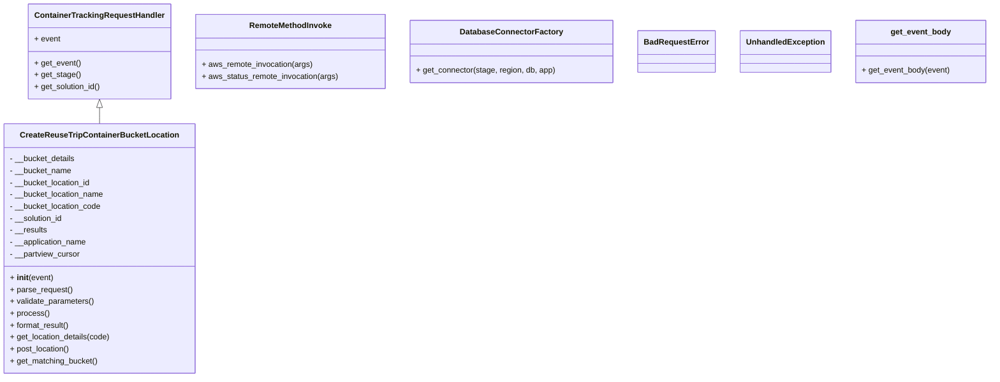
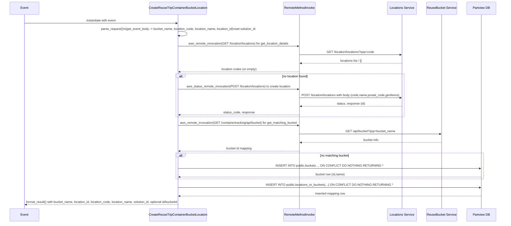

# Diagram: container_tracking_core/container_tracking_service/container_tracking_service/api/reuse_trip_container_bucket/location/handlers/post_reuse_trip_container_bucket_location.py

> Auto-generated by Obscura crawlers

## Diagram 1

### SVG

<svg id="container" width="1968.1875" xmlns="http://www.w3.org/2000/svg" class="classDiagram" height="762" viewBox="0 0 1968.1875 762" role="graphics-document document" aria-roledescription="class"><g><defs><marker id="container_class-aggregationStart" class="marker aggregation class" refX="18" refY="7" markerWidth="190" markerHeight="240" orient="auto"><path d="M 18,7 L9,13 L1,7 L9,1 Z"></path></marker></defs><defs><marker id="container_class-aggregationEnd" class="marker aggregation class" refX="1" refY="7" markerWidth="20" markerHeight="28" orient="auto"><path d="M 18,7 L9,13 L1,7 L9,1 Z"></path></marker></defs><defs><marker id="container_class-extensionStart" class="marker extension class" refX="18" refY="7" markerWidth="190" markerHeight="240" orient="auto"><path d="M 1,7 L18,13 V 1 Z"></path></marker></defs><defs><marker id="container_class-extensionEnd" class="marker extension class" refX="1" refY="7" markerWidth="20" markerHeight="28" orient="auto"><path d="M 1,1 V 13 L18,7 Z"></path></marker></defs><defs><marker id="container_class-compositionStart" class="marker composition class" refX="18" refY="7" markerWidth="190" markerHeight="240" orient="auto"><path d="M 18,7 L9,13 L1,7 L9,1 Z"></path></marker></defs><defs><marker id="container_class-compositionEnd" class="marker composition class" refX="1" refY="7" markerWidth="20" markerHeight="28" orient="auto"><path d="M 18,7 L9,13 L1,7 L9,1 Z"></path></marker></defs><defs><marker id="container_class-dependencyStart" class="marker dependency class" refX="6" refY="7" markerWidth="190" markerHeight="240" orient="auto"><path d="M 5,7 L9,13 L1,7 L9,1 Z"></path></marker></defs><defs><marker id="container_class-dependencyEnd" class="marker dependency class" refX="13" refY="7" markerWidth="20" markerHeight="28" orient="auto"><path d="M 18,7 L9,13 L14,7 L9,1 Z"></path></marker></defs><defs><marker id="container_class-lollipopStart" class="marker lollipop class" refX="13" refY="7" markerWidth="190" markerHeight="240" orient="auto"><circle stroke="black" fill="transparent" cx="7" cy="7" r="6"></circle></marker></defs><defs><marker id="container_class-lollipopEnd" class="marker lollipop class" refX="1" refY="7" markerWidth="190" markerHeight="240" orient="auto"><circle stroke="black" fill="transparent" cx="7" cy="7" r="6"></circle></marker></defs><g class="root"><g class="clusters"></g><g class="edgePaths"><path d="M198.418,217.25L198.418,218.542C198.418,219.833,198.418,222.417,198.418,227.875C198.418,233.333,198.418,241.667,198.418,245.833L198.418,250" id="id_ContainerTrackingRequestHandler_CreateReuseTripContainerBucketLocation_1" class="edge-thickness-normal edge-pattern-solid relation" style=";;;" data-edge="true" data-et="edge" data-id="id_ContainerTrackingRequestHandler_CreateReuseTripContainerBucketLocation_1" data-points="W3sieCI6MTk4LjQxNzk2ODc1LCJ5IjoyMDB9LHsieCI6MTk4LjQxNzk2ODc1LCJ5IjoyMjV9LHsieCI6MTk4LjQxNzk2ODc1LCJ5IjoyNTB9XQ==" marker-start="url(#container_class-extensionStart)"></path></g><g class="edgeLabels"><g class="edgeLabel"><g class="label" data-id="id_ContainerTrackingRequestHandler_CreateReuseTripContainerBucketLocation_1" transform="translate(0, 0)"><foreignObject width="0" height="0">

</foreignObject></g></g></g><g class="nodes"><g class="node default" id="classId-ContainerTrackingRequestHandler-0" transform="translate(198.41796875, 104)"><g class="basic label-container"><path d="M-142.64453125 -96 L142.64453125 -96 L142.64453125 96 L-142.64453125 96" stroke="none" stroke-width="0" fill="#ECECFF" style=""></path><path d="M-142.64453125 -96 C-77.49429866863522 -96, -12.344066087270448 -96, 142.64453125 -96 M-142.64453125 -96 C-40.36728842740436 -96, 61.90995439519128 -96, 142.64453125 -96 M142.64453125 -96 C142.64453125 -39.07005422656492, 142.64453125 17.85989154687016, 142.64453125 96 M142.64453125 -96 C142.64453125 -38.31920326335356, 142.64453125 19.361593473292885, 142.64453125 96 M142.64453125 96 C45.203190233182795 96, -52.23815078363441 96, -142.64453125 96 M142.64453125 96 C42.71622514542612 96, -57.212080959147755 96, -142.64453125 96 M-142.64453125 96 C-142.64453125 55.66713894921165, -142.64453125 15.334277898423295, -142.64453125 -96 M-142.64453125 96 C-142.64453125 42.139537764322704, -142.64453125 -11.720924471354593, -142.64453125 -96" stroke="#9370DB" stroke-width="1.3" fill="none" stroke-dasharray="0 0" style=""></path></g><g class="annotation-group text" transform="translate(0, -72)"></g><g class="label-group text" transform="translate(-125.5859375, -72)"><g class="label" style="font-weight: bolder" transform="translate(0,-12)"><foreignObject width="251.171875" height="24">

ContainerTrackingRequestHandler

</foreignObject></g></g><g class="members-group text" transform="translate(-130.64453125, -24)"><g class="label" style="" transform="translate(0,-12)"><foreignObject width="52.5625" height="24">

+ event

</foreignObject></g></g><g class="methods-group text" transform="translate(-130.64453125, 24)"><g class="label" style="" transform="translate(0,-12)"><foreignObject width="93.5" height="24">

+ get_event()

</foreignObject></g><g class="label" style="" transform="translate(0,12)"><foreignObject width="91.9375" height="24">

+ get_stage()

</foreignObject></g><g class="label" style="" transform="translate(0,36)"><foreignObject width="135.703125" height="24">

+ get_solution_id()

</foreignObject></g></g><g class="divider" style=""><path d="M-142.64453125 -48 C-29.69352758360465 -48, 83.2574760827907 -48, 142.64453125 -48 M-142.64453125 -48 C-66.35091924210641 -48, 9.942692765787172 -48, 142.64453125 -48" stroke="#9370DB" stroke-width="1.3" fill="none" stroke-dasharray="0 0" style=""></path></g><g class="divider" style=""><path d="M-142.64453125 0 C-68.8561863442351 0, 4.932158561529803 0, 142.64453125 0 M-142.64453125 0 C-50.93565914869171 0, 40.773212952616575 0, 142.64453125 0" stroke="#9370DB" stroke-width="1.3" fill="none" stroke-dasharray="0 0" style=""></path></g></g><g class="node default" id="classId-CreateReuseTripContainerBucketLocation-1" transform="translate(198.41796875, 502)"><g class="basic label-container"><path d="M-190.41796875 -252 L190.41796875 -252 L190.41796875 252 L-190.41796875 252" stroke="none" stroke-width="0" fill="#ECECFF" style=""></path><path d="M-190.41796875 -252 C-56.395098826870765 -252, 77.62777109625847 -252, 190.41796875 -252 M-190.41796875 -252 C-77.6472610748438 -252, 35.123446600312406 -252, 190.41796875 -252 M190.41796875 -252 C190.41796875 -132.5826032238942, 190.41796875 -13.165206447788421, 190.41796875 252 M190.41796875 -252 C190.41796875 -53.86664413173247, 190.41796875 144.26671173653506, 190.41796875 252 M190.41796875 252 C63.75558068891077 252, -62.90680737217846 252, -190.41796875 252 M190.41796875 252 C98.7278997760884 252, 7.0378308021768134 252, -190.41796875 252 M-190.41796875 252 C-190.41796875 77.24368650278586, -190.41796875 -97.51262699442827, -190.41796875 -252 M-190.41796875 252 C-190.41796875 147.2218504947971, -190.41796875 42.44370098959422, -190.41796875 -252" stroke="#9370DB" stroke-width="1.3" fill="none" stroke-dasharray="0 0" style=""></path></g><g class="annotation-group text" transform="translate(0, -228)"></g><g class="label-group text" transform="translate(-152.0703125, -228)"><g class="label" style="font-weight: bolder" transform="translate(0,-12)"><foreignObject width="304.140625" height="24">

CreateReuseTripContainerBucketLocation

</foreignObject></g></g><g class="members-group text" transform="translate(-178.41796875, -180)"><g class="label" style="" transform="translate(0,-12)"><foreignObject width="133.515625" height="24">

- __bucket_details

</foreignObject></g><g class="label" style="" transform="translate(0,12)"><foreignObject width="125.015625" height="24">

- __bucket_name

</foreignObject></g><g class="label" style="" transform="translate(0,36)"><foreignObject width="165.890625" height="24">

- __bucket_location_id

</foreignObject></g><g class="label" style="" transform="translate(0,60)"><foreignObject width="192.328125" height="24">

- __bucket_location_name

</foreignObject></g><g class="label" style="" transform="translate(0,84)"><foreignObject width="186.453125" height="24">

- __bucket_location_code

</foreignObject></g><g class="label" style="" transform="translate(0,108)"><foreignObject width="109.40625" height="24">

- __solution_id

</foreignObject></g><g class="label" style="" transform="translate(0,132)"><foreignObject width="76.3125" height="24">

- __results

</foreignObject></g><g class="label" style="" transform="translate(0,156)"><foreignObject width="157.796875" height="24">

- __application_name

</foreignObject></g><g class="label" style="" transform="translate(0,180)"><foreignObject width="143.078125" height="24">

- __partview_cursor

</foreignObject></g></g><g class="methods-group text" transform="translate(-178.41796875, 60)"><g class="label" style="" transform="translate(0,-12)"><foreignObject width="87.390625" height="24">

+ <strong>init</strong>(event)

</foreignObject></g><g class="label" style="" transform="translate(0,12)"><foreignObject width="126.046875" height="24">

+ parse_request()

</foreignObject></g><g class="label" style="" transform="translate(0,36)"><foreignObject width="170.953125" height="24">

+ validate_parameters()

</foreignObject></g><g class="label" style="" transform="translate(0,60)"><foreignObject width="77.96875" height="24">

+ process()

</foreignObject></g><g class="label" style="" transform="translate(0,84)"><foreignObject width="121.5" height="24">

+ format_result()

</foreignObject></g><g class="label" style="" transform="translate(0,108)"><foreignObject width="204.765625" height="24">

+ get_location_details(code)

</foreignObject></g><g class="label" style="" transform="translate(0,132)"><foreignObject width="122.015625" height="24">

+ post_location()

</foreignObject></g><g class="label" style="" transform="translate(0,156)"><foreignObject width="178.0625" height="24">

+ get_matching_bucket()

</foreignObject></g></g><g class="divider" style=""><path d="M-190.41796875 -204 C-53.888530245581876 -204, 82.64090825883625 -204, 190.41796875 -204 M-190.41796875 -204 C-49.82891206817763 -204, 90.76014461364474 -204, 190.41796875 -204" stroke="#9370DB" stroke-width="1.3" fill="none" stroke-dasharray="0 0" style=""></path></g><g class="divider" style=""><path d="M-190.41796875 36 C-42.888765244235145 36, 104.64043826152971 36, 190.41796875 36 M-190.41796875 36 C-112.74717144073897 36, -35.076374131477934 36, 190.41796875 36" stroke="#9370DB" stroke-width="1.3" fill="none" stroke-dasharray="0 0" style=""></path></g></g><g class="node default" id="classId-RemoteMethodInvoke-2" transform="translate(581.56640625, 104)"><g class="basic label-container"><path d="M-190.50390625 -75 L190.50390625 -75 L190.50390625 75 L-190.50390625 75" stroke="none" stroke-width="0" fill="#ECECFF" style=""></path><path d="M-190.50390625 -75 C-81.19108682363803 -75, 28.121732602723938 -75, 190.50390625 -75 M-190.50390625 -75 C-112.34992260085814 -75, -34.19593895171627 -75, 190.50390625 -75 M190.50390625 -75 C190.50390625 -34.71326409473216, 190.50390625 5.573471810535679, 190.50390625 75 M190.50390625 -75 C190.50390625 -36.553666483332066, 190.50390625 1.8926670333358686, 190.50390625 75 M190.50390625 75 C108.10270115192998 75, 25.701496053859955 75, -190.50390625 75 M190.50390625 75 C101.03658289929312 75, 11.569259548586246 75, -190.50390625 75 M-190.50390625 75 C-190.50390625 36.23383116080425, -190.50390625 -2.5323376783914995, -190.50390625 -75 M-190.50390625 75 C-190.50390625 36.12705855374131, -190.50390625 -2.745882892517386, -190.50390625 -75" stroke="#9370DB" stroke-width="1.3" fill="none" stroke-dasharray="0 0" style=""></path></g><g class="annotation-group text" transform="translate(0, -51)"></g><g class="label-group text" transform="translate(-80.2578125, -51)"><g class="label" style="font-weight: bolder" transform="translate(0,-12)"><foreignObject width="160.515625" height="24">

RemoteMethodInvoke

</foreignObject></g></g><g class="members-group text" transform="translate(-178.50390625, -3)"></g><g class="methods-group text" transform="translate(-178.50390625, 27)"><g class="label" style="" transform="translate(0,-12)"><foreignObject width="224.34375" height="24">

+ aws_remote_invocation(args)

</foreignObject></g><g class="label" style="" transform="translate(0,12)"><foreignObject width="276.75" height="24">

+ aws_status_remote_invocation(args)

</foreignObject></g></g><g class="divider" style=""><path d="M-190.50390625 -27 C-63.784136571843334 -27, 62.93563310631333 -27, 190.50390625 -27 M-190.50390625 -27 C-42.78704050425148 -27, 104.92982524149704 -27, 190.50390625 -27" stroke="#9370DB" stroke-width="1.3" fill="none" stroke-dasharray="0 0" style=""></path></g><g class="divider" style=""><path d="M-190.50390625 -3 C-76.19719441467639 -3, 38.10951742064722 -3, 190.50390625 -3 M-190.50390625 -3 C-55.253760304069374 -3, 79.99638564186125 -3, 190.50390625 -3" stroke="#9370DB" stroke-width="1.3" fill="none" stroke-dasharray="0 0" style=""></path></g></g><g class="node default" id="classId-DatabaseConnectorFactory-3" transform="translate(1023.734375, 104)"><g class="basic label-container"><path d="M-201.6640625 -63 L201.6640625 -63 L201.6640625 63 L-201.6640625 63" stroke="none" stroke-width="0" fill="#ECECFF" style=""></path><path d="M-201.6640625 -63 C-95.77506313441296 -63, 10.11393623117408 -63, 201.6640625 -63 M-201.6640625 -63 C-85.7302385054016 -63, 30.203585489196797 -63, 201.6640625 -63 M201.6640625 -63 C201.6640625 -34.5153052166233, 201.6640625 -6.0306104332465935, 201.6640625 63 M201.6640625 -63 C201.6640625 -13.950812077114037, 201.6640625 35.098375845771926, 201.6640625 63 M201.6640625 63 C119.98484640375358 63, 38.30563030750716 63, -201.6640625 63 M201.6640625 63 C61.924221055055455 63, -77.81562038988909 63, -201.6640625 63 M-201.6640625 63 C-201.6640625 20.0012485761753, -201.6640625 -22.9975028476494, -201.6640625 -63 M-201.6640625 63 C-201.6640625 32.47887173986945, -201.6640625 1.9577434797389017, -201.6640625 -63" stroke="#9370DB" stroke-width="1.3" fill="none" stroke-dasharray="0 0" style=""></path></g><g class="annotation-group text" transform="translate(0, -39)"></g><g class="label-group text" transform="translate(-98.1875, -39)"><g class="label" style="font-weight: bolder" transform="translate(0,-12)"><foreignObject width="196.375" height="24">

DatabaseConnectorFactory

</foreignObject></g></g><g class="members-group text" transform="translate(-189.6640625, 9)"></g><g class="methods-group text" transform="translate(-189.6640625, 39)"><g class="label" style="" transform="translate(0,-12)"><foreignObject width="281.140625" height="24">

+ get_connector(stage, region, db, app)

</foreignObject></g></g><g class="divider" style=""><path d="M-201.6640625 -15 C-66.64074082729275 -15, 68.38258084541451 -15, 201.6640625 -15 M-201.6640625 -15 C-51.639111775876756 -15, 98.38583894824649 -15, 201.6640625 -15" stroke="#9370DB" stroke-width="1.3" fill="none" stroke-dasharray="0 0" style=""></path></g><g class="divider" style=""><path d="M-201.6640625 9 C-48.95092663326889 9, 103.76220923346222 9, 201.6640625 9 M-201.6640625 9 C-86.70122198903697 9, 28.261618521926067 9, 201.6640625 9" stroke="#9370DB" stroke-width="1.3" fill="none" stroke-dasharray="0 0" style=""></path></g></g><g class="node default" id="classId-BadRequestError-4" transform="translate(1349.6796875, 104)"><g class="basic label-container"><path d="M-74.28125 -42 L74.28125 -42 L74.28125 42 L-74.28125 42" stroke="none" stroke-width="0" fill="#ECECFF" style=""></path><path d="M-74.28125 -42 C-24.78999654235014 -42, 24.701256915299723 -42, 74.28125 -42 M-74.28125 -42 C-44.416660840534945 -42, -14.552071681069883 -42, 74.28125 -42 M74.28125 -42 C74.28125 -24.11972474668798, 74.28125 -6.2394494933759574, 74.28125 42 M74.28125 -42 C74.28125 -21.53410026947161, 74.28125 -1.0682005389432234, 74.28125 42 M74.28125 42 C16.40816431634355 42, -41.4649213673129 42, -74.28125 42 M74.28125 42 C42.95273637845818 42, 11.624222756916353 42, -74.28125 42 M-74.28125 42 C-74.28125 19.83607685006882, -74.28125 -2.327846299862358, -74.28125 -42 M-74.28125 42 C-74.28125 10.554518037265836, -74.28125 -20.890963925468327, -74.28125 -42" stroke="#9370DB" stroke-width="1.3" fill="none" stroke-dasharray="0 0" style=""></path></g><g class="annotation-group text" transform="translate(0, -18)"></g><g class="label-group text" transform="translate(-62.28125, -18)"><g class="label" style="font-weight: bolder" transform="translate(0,-12)"><foreignObject width="124.5625" height="24">

BadRequestError

</foreignObject></g></g><g class="members-group text" transform="translate(-62.28125, 30)"></g><g class="methods-group text" transform="translate(-62.28125, 60)"></g><g class="divider" style=""><path d="M-74.28125 6 C-41.138995783127754 6, -7.996741566255508 6, 74.28125 6 M-74.28125 6 C-15.260186896479595 6, 43.76087620704081 6, 74.28125 6" stroke="#9370DB" stroke-width="1.3" fill="none" stroke-dasharray="0 0" style=""></path></g><g class="divider" style=""><path d="M-74.28125 24 C-20.45903371680047 24, 33.36318256639906 24, 74.28125 24 M-74.28125 24 C-16.32722339226094 24, 41.62680321547812 24, 74.28125 24" stroke="#9370DB" stroke-width="1.3" fill="none" stroke-dasharray="0 0" style=""></path></g></g><g class="node default" id="classId-UnhandledException-5" transform="translate(1561.453125, 104)"><g class="basic label-container"><path d="M-87.4921875 -42 L87.4921875 -42 L87.4921875 42 L-87.4921875 42" stroke="none" stroke-width="0" fill="#ECECFF" style=""></path><path d="M-87.4921875 -42 C-34.50825411296813 -42, 18.475679274063737 -42, 87.4921875 -42 M-87.4921875 -42 C-18.42203943764291 -42, 50.64810862471418 -42, 87.4921875 -42 M87.4921875 -42 C87.4921875 -9.0221561706743, 87.4921875 23.9556876586514, 87.4921875 42 M87.4921875 -42 C87.4921875 -15.025917418327872, 87.4921875 11.948165163344257, 87.4921875 42 M87.4921875 42 C25.93618443236197 42, -35.61981863527606 42, -87.4921875 42 M87.4921875 42 C27.44292549555712 42, -32.60633650888576 42, -87.4921875 42 M-87.4921875 42 C-87.4921875 9.368479072997843, -87.4921875 -23.263041854004314, -87.4921875 -42 M-87.4921875 42 C-87.4921875 10.112252123589165, -87.4921875 -21.77549575282167, -87.4921875 -42" stroke="#9370DB" stroke-width="1.3" fill="none" stroke-dasharray="0 0" style=""></path></g><g class="annotation-group text" transform="translate(0, -18)"></g><g class="label-group text" transform="translate(-75.4921875, -18)"><g class="label" style="font-weight: bolder" transform="translate(0,-12)"><foreignObject width="150.984375" height="24">

UnhandledException

</foreignObject></g></g><g class="members-group text" transform="translate(-75.4921875, 30)"></g><g class="methods-group text" transform="translate(-75.4921875, 60)"></g><g class="divider" style=""><path d="M-87.4921875 6 C-19.586562202047446 6, 48.31906309590511 6, 87.4921875 6 M-87.4921875 6 C-36.76121807019107 6, 13.96975135961786 6, 87.4921875 6" stroke="#9370DB" stroke-width="1.3" fill="none" stroke-dasharray="0 0" style=""></path></g><g class="divider" style=""><path d="M-87.4921875 24 C-29.460569001826407 24, 28.571049496347186 24, 87.4921875 24 M-87.4921875 24 C-21.454635117924923 24, 44.582917264150154 24, 87.4921875 24" stroke="#9370DB" stroke-width="1.3" fill="none" stroke-dasharray="0 0" style=""></path></g></g><g class="node default" id="classId-get_event_body-6" transform="translate(1829.56640625, 104)"><g class="basic label-container"><path d="M-130.62109375 -63 L130.62109375 -63 L130.62109375 63 L-130.62109375 63" stroke="none" stroke-width="0" fill="#ECECFF" style=""></path><path d="M-130.62109375 -63 C-45.91410854060939 -63, 38.79287666878122 -63, 130.62109375 -63 M-130.62109375 -63 C-76.42559792324526 -63, -22.230102096490526 -63, 130.62109375 -63 M130.62109375 -63 C130.62109375 -15.186712720174135, 130.62109375 32.62657455965173, 130.62109375 63 M130.62109375 -63 C130.62109375 -27.375331755292457, 130.62109375 8.249336489415086, 130.62109375 63 M130.62109375 63 C36.10606187285562 63, -58.40897000428876 63, -130.62109375 63 M130.62109375 63 C75.56782386128307 63, 20.514553972566162 63, -130.62109375 63 M-130.62109375 63 C-130.62109375 32.92684101083583, -130.62109375 2.8536820216716663, -130.62109375 -63 M-130.62109375 63 C-130.62109375 15.300448273666206, -130.62109375 -32.39910345266759, -130.62109375 -63" stroke="#9370DB" stroke-width="1.3" fill="none" stroke-dasharray="0 0" style=""></path></g><g class="annotation-group text" transform="translate(0, -39)"></g><g class="label-group text" transform="translate(-58.8046875, -39)"><g class="label" style="font-weight: bolder" transform="translate(0,-12)"><foreignObject width="117.609375" height="24">

get_event_body

</foreignObject></g></g><g class="members-group text" transform="translate(-118.62109375, 9)"></g><g class="methods-group text" transform="translate(-118.62109375, 39)"><g class="label" style="" transform="translate(0,-12)"><foreignObject width="178.4375" height="24">

+ get_event_body(event)

</foreignObject></g></g><g class="divider" style=""><path d="M-130.62109375 -15 C-28.946699389521328 -15, 72.72769497095734 -15, 130.62109375 -15 M-130.62109375 -15 C-37.91141412366922 -15, 54.798265502661565 -15, 130.62109375 -15" stroke="#9370DB" stroke-width="1.3" fill="none" stroke-dasharray="0 0" style=""></path></g><g class="divider" style=""><path d="M-130.62109375 9 C-31.497858266422142 9, 67.62537721715572 9, 130.62109375 9 M-130.62109375 9 C-30.068419785737092 9, 70.48425417852582 9, 130.62109375 9" stroke="#9370DB" stroke-width="1.3" fill="none" stroke-dasharray="0 0" style=""></path></g></g></g></g></g></svg>

## Diagram 2

> SVG rendering failed for this diagram.
