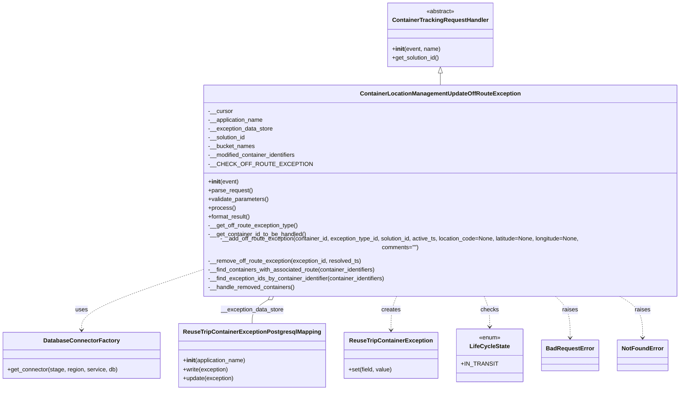

# Diagram: container_tracking_core/container_tracking_service/container_tracking_service/api/reuse_trip_container_bucket/update_off_route_exceptions/reuse_trip_container_update_off_route_exception.py

> Auto-generated by Obscura crawlers

## Mermaid

### SVG

<svg id="container" width="1840.74609375" xmlns="http://www.w3.org/2000/svg" class="classDiagram" height="1040" viewBox="0 0 1840.74609375 1040" role="graphics-document document" aria-roledescription="class"><g><defs><marker id="container_class-aggregationStart" class="marker aggregation class" refX="18" refY="7" markerWidth="190" markerHeight="240" orient="auto"><path d="M 18,7 L9,13 L1,7 L9,1 Z"></path></marker></defs><defs><marker id="container_class-aggregationEnd" class="marker aggregation class" refX="1" refY="7" markerWidth="20" markerHeight="28" orient="auto"><path d="M 18,7 L9,13 L1,7 L9,1 Z"></path></marker></defs><defs><marker id="container_class-extensionStart" class="marker extension class" refX="18" refY="7" markerWidth="190" markerHeight="240" orient="auto"><path d="M 1,7 L18,13 V 1 Z"></path></marker></defs><defs><marker id="container_class-extensionEnd" class="marker extension class" refX="1" refY="7" markerWidth="20" markerHeight="28" orient="auto"><path d="M 1,1 V 13 L18,7 Z"></path></marker></defs><defs><marker id="container_class-compositionStart" class="marker composition class" refX="18" refY="7" markerWidth="190" markerHeight="240" orient="auto"><path d="M 18,7 L9,13 L1,7 L9,1 Z"></path></marker></defs><defs><marker id="container_class-compositionEnd" class="marker composition class" refX="1" refY="7" markerWidth="20" markerHeight="28" orient="auto"><path d="M 18,7 L9,13 L1,7 L9,1 Z"></path></marker></defs><defs><marker id="container_class-dependencyStart" class="marker dependency class" refX="6" refY="7" markerWidth="190" markerHeight="240" orient="auto"><path d="M 5,7 L9,13 L1,7 L9,1 Z"></path></marker></defs><defs><marker id="container_class-dependencyEnd" class="marker dependency class" refX="13" refY="7" markerWidth="20" markerHeight="28" orient="auto"><path d="M 18,7 L9,13 L14,7 L9,1 Z"></path></marker></defs><defs><marker id="container_class-lollipopStart" class="marker lollipop class" refX="13" refY="7" markerWidth="190" markerHeight="240" orient="auto"><circle stroke="black" fill="transparent" cx="7" cy="7" r="6"></circle></marker></defs><defs><marker id="container_class-lollipopEnd" class="marker lollipop class" refX="1" refY="7" markerWidth="190" markerHeight="240" orient="auto"><circle stroke="black" fill="transparent" cx="7" cy="7" r="6"></circle></marker></defs><g class="root"><g class="clusters"></g><g class="edgePaths"><path d="M1165.395,199.25L1165.395,200.542C1165.395,201.833,1165.395,204.417,1165.395,209.875C1165.395,215.333,1165.395,223.667,1165.395,227.833L1165.395,232" id="id_ContainerTrackingRequestHandler_ContainerLocationManagementUpdateOffRouteException_1" class="edge-thickness-normal edge-pattern-solid relation" style=";;;" data-edge="true" data-et="edge" data-id="id_ContainerTrackingRequestHandler_ContainerLocationManagementUpdateOffRouteException_1" data-points="W3sieCI6MTE2NS4zOTQ1MzEyNSwieSI6MTgyfSx7IngiOjExNjUuMzk0NTMxMjUsInkiOjIwN30seyJ4IjoxMTY1LjM5NDUzMTI1LCJ5IjoyMzJ9XQ==" marker-start="url(#container_class-extensionStart)"></path><path d="M498.043,728.734L451.551,744.112C405.06,759.49,312.077,790.245,265.585,814.789C219.094,839.333,219.094,857.667,219.094,866.833L219.094,876" id="id_ContainerLocationManagementUpdateOffRouteException_DatabaseConnectorFactory_2" class="edge-thickness-normal edge-pattern-dashed relation" style=";;;" data-edge="true" data-et="edge" data-id="id_ContainerLocationManagementUpdateOffRouteException_DatabaseConnectorFactory_2" data-points="W3sieCI6NDk4LjA0Mjk2ODc1LCJ5Ijo3MjguNzM0Mjk4NDQwMDYwNn0seyJ4IjoyMTkuMDkzNzUsInkiOjgyMX0seyJ4IjoyMTkuMDkzNzUsInkiOjg4Mn1d" marker-end="url(#container_class-dependencyEnd)"></path><path d="M714.242,793.218L706.918,797.848C699.594,802.479,684.945,811.739,677.621,822.536C670.297,833.333,670.297,845.667,670.297,851.833L670.297,858" id="id_ContainerLocationManagementUpdateOffRouteException_ReuseTripContainerExceptionPostgresqlMapping_3" class="edge-thickness-normal edge-pattern-solid relation" style=";;;" data-edge="true" data-et="edge" data-id="id_ContainerLocationManagementUpdateOffRouteException_ReuseTripContainerExceptionPostgresqlMapping_3" data-points="W3sieCI6NzI4LjgyMjc5NjAyNjM1NzgsInkiOjc4NH0seyJ4Ijo2NzAuMjk2ODc1LCJ5Ijo4MjF9LHsieCI6NjcwLjI5Njg3NSwieSI6ODU4fV0=" marker-start="url(#container_class-aggregationStart)"></path><path d="M1051.258,784L1048.708,790.167C1046.158,796.333,1041.057,808.667,1038.507,824C1035.957,839.333,1035.957,857.667,1035.957,866.833L1035.957,876" id="id_ContainerLocationManagementUpdateOffRouteException_ReuseTripContainerException_4" class="edge-thickness-normal edge-pattern-dashed relation" style=";;;" data-edge="true" data-et="edge" data-id="id_ContainerLocationManagementUpdateOffRouteException_ReuseTripContainerException_4" data-points="W3sieCI6MTA1MS4yNTc5NDk3ODAzNTE1LCJ5Ijo3ODR9LHsieCI6MTAzNS45NTcwMzEyNSwieSI6ODIxfSx7IngiOjEwMzUuOTU3MDMxMjUsInkiOjg4Mn1d" marker-end="url(#container_class-dependencyEnd)"></path><path d="M1279.531,784L1282.081,790.167C1284.631,796.333,1289.732,808.667,1292.282,822.5C1294.832,836.333,1294.832,851.667,1294.832,859.333L1294.832,867" id="id_ContainerLocationManagementUpdateOffRouteException_LifeCycleState_5" class="edge-thickness-normal edge-pattern-dashed relation" style=";;;" data-edge="true" data-et="edge" data-id="id_ContainerLocationManagementUpdateOffRouteException_LifeCycleState_5" data-points="W3sieCI6MTI3OS41MzExMTI3MTk2NDg1LCJ5Ijo3ODR9LHsieCI6MTI5NC44MzIwMzEyNSwieSI6ODIxfSx7IngiOjEyOTQuODMyMDMxMjUsInkiOjg3M31d" marker-end="url(#container_class-dependencyEnd)"></path><path d="M1462.595,784L1469.236,790.167C1475.876,796.333,1489.157,808.667,1495.797,827.5C1502.438,846.333,1502.438,871.667,1502.438,884.333L1502.438,897" id="id_ContainerLocationManagementUpdateOffRouteException_BadRequestError_6" class="edge-thickness-normal edge-pattern-dashed relation" style=";;;" data-edge="true" data-et="edge" data-id="id_ContainerLocationManagementUpdateOffRouteException_BadRequestError_6" data-points="W3sieCI6MTQ2Mi41OTUzNTk5MjQxMjEzLCJ5Ijo3ODR9LHsieCI6MTUwMi40Mzc1LCJ5Ijo4MjF9LHsieCI6MTUwMi40Mzc1LCJ5Ijo5MDN9XQ==" marker-end="url(#container_class-dependencyEnd)"></path><path d="M1629.97,784L1640.35,790.167C1650.73,796.333,1671.49,808.667,1681.87,827.5C1692.25,846.333,1692.25,871.667,1692.25,884.333L1692.25,897" id="id_ContainerLocationManagementUpdateOffRouteException_NotFoundError_7" class="edge-thickness-normal edge-pattern-dashed relation" style=";;;" data-edge="true" data-et="edge" data-id="id_ContainerLocationManagementUpdateOffRouteException_NotFoundError_7" data-points="W3sieCI6MTYyOS45Njk5NjA1NjMwOTksInkiOjc4NH0seyJ4IjoxNjkyLjI1LCJ5Ijo4MjF9LHsieCI6MTY5Mi4yNSwieSI6OTAzfV0=" marker-end="url(#container_class-dependencyEnd)"></path></g><g class="edgeLabels"><g class="edgeLabel"><g class="label" data-id="id_ContainerTrackingRequestHandler_ContainerLocationManagementUpdateOffRouteException_1" transform="translate(0, 0)"><foreignObject width="0" height="0">

</foreignObject></g></g><g class="edgeLabel" transform="translate(219.09375, 821)"><g class="label" data-id="id_ContainerLocationManagementUpdateOffRouteException_DatabaseConnectorFactory_2" transform="translate(-16.4921875, -12)"><foreignObject width="32.984375" height="24">

uses

</foreignObject></g></g><g class="edgeLabel" transform="translate(670.296875, 821)"><g class="label" data-id="id_ContainerLocationManagementUpdateOffRouteException_ReuseTripContainerExceptionPostgresqlMapping_3" transform="translate(-86.3203125, -12)"><foreignObject width="172.640625" height="24">

__exception_data_store

</foreignObject></g></g><g class="edgeLabel" transform="translate(1035.95703125, 821)"><g class="label" data-id="id_ContainerLocationManagementUpdateOffRouteException_ReuseTripContainerException_4" transform="translate(-26.171875, -12)"><foreignObject width="52.34375" height="24">

creates

</foreignObject></g></g><g class="edgeLabel" transform="translate(1294.83203125, 821)"><g class="label" data-id="id_ContainerLocationManagementUpdateOffRouteException_LifeCycleState_5" transform="translate(-24.4921875, -12)"><foreignObject width="48.984375" height="24">

checks

</foreignObject></g></g><g class="edgeLabel" transform="translate(1502.4375, 821)"><g class="label" data-id="id_ContainerLocationManagementUpdateOffRouteException_BadRequestError_6" transform="translate(-21.25, -12)"><foreignObject width="42.5" height="24">

raises

</foreignObject></g></g><g class="edgeLabel" transform="translate(1692.25, 821)"><g class="label" data-id="id_ContainerLocationManagementUpdateOffRouteException_NotFoundError_7" transform="translate(-21.25, -12)"><foreignObject width="42.5" height="24">

raises

</foreignObject></g></g></g><g class="nodes"><g class="node default" id="classId-ContainerTrackingRequestHandler-0" transform="translate(1165.39453125, 95)"><g class="basic label-container"><path d="M-140.69140625 -87 L140.69140625 -87 L140.69140625 87 L-140.69140625 87" stroke="none" stroke-width="0" fill="#ECECFF" style=""></path><path d="M-140.69140625 -87 C-52.62803058940652 -87, 35.43534507118696 -87, 140.69140625 -87 M-140.69140625 -87 C-47.44813091834406 -87, 45.795144413311874 -87, 140.69140625 -87 M140.69140625 -87 C140.69140625 -28.927589308848766, 140.69140625 29.144821382302467, 140.69140625 87 M140.69140625 -87 C140.69140625 -22.892306054986307, 140.69140625 41.21538789002739, 140.69140625 87 M140.69140625 87 C44.20098042874932 87, -52.289445392501364 87, -140.69140625 87 M140.69140625 87 C46.739623722579665 87, -47.21215880484067 87, -140.69140625 87 M-140.69140625 87 C-140.69140625 39.42966809664935, -140.69140625 -8.140663806701298, -140.69140625 -87 M-140.69140625 87 C-140.69140625 44.867548122374224, -140.69140625 2.7350962447484477, -140.69140625 -87" stroke="#9370DB" stroke-width="1.3" fill="none" stroke-dasharray="0 0" style=""></path></g><g class="annotation-group text" transform="translate(-38.609375, -63)"><g class="label" style="" transform="translate(0,-12)"><foreignObject width="77.21875" height="24">

«abstract»

</foreignObject></g></g><g class="label-group text" transform="translate(-125.5859375, -39)"><g class="label" style="font-weight: bolder" transform="translate(0,-12)"><foreignObject width="251.171875" height="24">

ContainerTrackingRequestHandler

</foreignObject></g></g><g class="members-group text" transform="translate(-128.69140625, 9)"></g><g class="methods-group text" transform="translate(-128.69140625, 39)"><g class="label" style="" transform="translate(0,-12)"><foreignObject width="131.796875" height="24">

+<strong>init</strong>(event, name)

</foreignObject></g><g class="label" style="" transform="translate(0,12)"><foreignObject width="131.46875" height="24">

+get_solution_id()

</foreignObject></g></g><g class="divider" style=""><path d="M-140.69140625 -15 C-40.368172220073745 -15, 59.95506180985251 -15, 140.69140625 -15 M-140.69140625 -15 C-76.28245350777857 -15, -11.87350076555714 -15, 140.69140625 -15" stroke="#9370DB" stroke-width="1.3" fill="none" stroke-dasharray="0 0" style=""></path></g><g class="divider" style=""><path d="M-140.69140625 9 C-41.23584426144349 9, 58.21971772711302 9, 140.69140625 9 M-140.69140625 9 C-42.99462986413407 9, 54.70214652173186 9, 140.69140625 9" stroke="#9370DB" stroke-width="1.3" fill="none" stroke-dasharray="0 0" style=""></path></g></g><g class="node default" id="classId-ContainerLocationManagementUpdateOffRouteException-1" transform="translate(1165.39453125, 508)"><g class="basic label-container"><path d="M-667.3515625 -276 L667.3515625 -276 L667.3515625 276 L-667.3515625 276" stroke="none" stroke-width="0" fill="#ECECFF" style=""></path><path d="M-667.3515625 -276 C-261.9586294827276 -276, 143.43430353454482 -276, 667.3515625 -276 M-667.3515625 -276 C-353.9921043163362 -276, -40.63264613267245 -276, 667.3515625 -276 M667.3515625 -276 C667.3515625 -160.54953435248, 667.3515625 -45.09906870496002, 667.3515625 276 M667.3515625 -276 C667.3515625 -73.50793124096947, 667.3515625 128.98413751806106, 667.3515625 276 M667.3515625 276 C200.15178179551486 276, -267.04799890897027 276, -667.3515625 276 M667.3515625 276 C319.4018838753528 276, -28.54779474929444 276, -667.3515625 276 M-667.3515625 276 C-667.3515625 158.16681465173843, -667.3515625 40.33362930347687, -667.3515625 -276 M-667.3515625 276 C-667.3515625 120.0965853135458, -667.3515625 -35.806829372908396, -667.3515625 -276" stroke="#9370DB" stroke-width="1.3" fill="none" stroke-dasharray="0 0" style=""></path></g><g class="annotation-group text" transform="translate(0, -252)"></g><g class="label-group text" transform="translate(-208.9375, -252)"><g class="label" style="font-weight: bolder" transform="translate(0,-12)"><foreignObject width="417.875" height="24">

ContainerLocationManagementUpdateOffRouteException

</foreignObject></g></g><g class="members-group text" transform="translate(-655.3515625, -204)"><g class="label" style="" transform="translate(0,-12)"><foreignObject width="67.0625" height="24">

-__cursor

</foreignObject></g><g class="label" style="" transform="translate(0,12)"><foreignObject width="152.28125" height="24">

-__application_name

</foreignObject></g><g class="label" style="" transform="translate(0,36)"><foreignObject width="177.8125" height="24">

-__exception_data_store

</foreignObject></g><g class="label" style="" transform="translate(0,60)"><foreignObject width="103.875" height="24">

-__solution_id

</foreignObject></g><g class="label" style="" transform="translate(0,84)"><foreignObject width="126.96875" height="24">

-__bucket_names

</foreignObject></g><g class="label" style="" transform="translate(0,108)"><foreignObject width="244.3125" height="24">

-__modified_container_identifiers

</foreignObject></g><g class="label" style="" transform="translate(0,132)"><foreignObject width="243.53125" height="24">

-__CHECK_OFF_ROUTE_EXCEPTION

</foreignObject></g></g><g class="methods-group text" transform="translate(-655.3515625, -12)"><g class="label" style="" transform="translate(0,-12)"><foreignObject width="83.140625" height="24">

+<strong>init</strong>(event)

</foreignObject></g><g class="label" style="" transform="translate(0,12)"><foreignObject width="121.796875" height="24">

+parse_request()

</foreignObject></g><g class="label" style="" transform="translate(0,36)"><foreignObject width="166.546875" height="24">

+validate_parameters()

</foreignObject></g><g class="label" style="" transform="translate(0,60)"><foreignObject width="73.734375" height="24">

+process()

</foreignObject></g><g class="label" style="" transform="translate(0,84)"><foreignObject width="117.015625" height="24">

+format_result()

</foreignObject></g><g class="label" style="" transform="translate(0,108)"><foreignObject width="247.46875" height="24">

-__get_off_route_exception_type()

</foreignObject></g><g class="label" style="" transform="translate(0,132)"><foreignObject width="270.078125" height="24">

-__get_container_id_to_be_handled()

</foreignObject></g><g class="label" style="" transform="translate(0,156)"><foreignObject width="1101.765625" height="24">

-__add_off_route_exception(container_id, exception_type_id, solution_id, active_ts, location_code=None, latitude=None, longitude=None, comments="")

</foreignObject></g><g class="label" style="" transform="translate(0,180)"><foreignObject width="422.921875" height="24">

-__remove_off_route_exception(exception_id, resolved_ts)

</foreignObject></g><g class="label" style="" transform="translate(0,204)"><foreignObject width="465.421875" height="24">

-__find_containers_with_associated_route(container_identifiers)

</foreignObject></g><g class="label" style="" transform="translate(0,228)"><foreignObject width="494.140625" height="24">

-__find_exception_ids_by_container_identifier(container_identifiers)

</foreignObject></g><g class="label" style="" transform="translate(0,252)"><foreignObject width="238.3125" height="24">

-__handle_removed_containers()

</foreignObject></g></g><g class="divider" style=""><path d="M-667.3515625 -228 C-173.18716806771863 -228, 320.97722636456274 -228, 667.3515625 -228 M-667.3515625 -228 C-292.399989855876 -228, 82.55158278824797 -228, 667.3515625 -228" stroke="#9370DB" stroke-width="1.3" fill="none" stroke-dasharray="0 0" style=""></path></g><g class="divider" style=""><path d="M-667.3515625 -36 C-162.52490490285533 -36, 342.30175269428935 -36, 667.3515625 -36 M-667.3515625 -36 C-299.0597687671228 -36, 69.23202496575436 -36, 667.3515625 -36" stroke="#9370DB" stroke-width="1.3" fill="none" stroke-dasharray="0 0" style=""></path></g></g><g class="node default" id="classId-DatabaseConnectorFactory-2" transform="translate(219.09375, 945)"><g class="basic label-container"><path d="M-211.09375 -63 L211.09375 -63 L211.09375 63 L-211.09375 63" stroke="none" stroke-width="0" fill="#ECECFF" style=""></path><path d="M-211.09375 -63 C-120.84002167976988 -63, -30.586293359539752 -63, 211.09375 -63 M-211.09375 -63 C-50.004138991217985 -63, 111.08547201756403 -63, 211.09375 -63 M211.09375 -63 C211.09375 -20.256424469308023, 211.09375 22.487151061383955, 211.09375 63 M211.09375 -63 C211.09375 -29.918540199470755, 211.09375 3.1629196010584906, 211.09375 63 M211.09375 63 C84.37299380404586 63, -42.347762391908276 63, -211.09375 63 M211.09375 63 C53.29488930667489 63, -104.50397138665022 63, -211.09375 63 M-211.09375 63 C-211.09375 34.94595753175675, -211.09375 6.891915063513487, -211.09375 -63 M-211.09375 63 C-211.09375 28.14776494632291, -211.09375 -6.704470107354183, -211.09375 -63" stroke="#9370DB" stroke-width="1.3" fill="none" stroke-dasharray="0 0" style=""></path></g><g class="annotation-group text" transform="translate(0, -39)"></g><g class="label-group text" transform="translate(-98.1875, -39)"><g class="label" style="font-weight: bolder" transform="translate(0,-12)"><foreignObject width="196.375" height="24">

DatabaseConnectorFactory

</foreignObject></g></g><g class="members-group text" transform="translate(-199.09375, 9)"></g><g class="methods-group text" transform="translate(-199.09375, 39)"><g class="label" style="" transform="translate(0,-12)"><foreignObject width="300" height="24">

+get_connector(stage, region, service, db)

</foreignObject></g></g><g class="divider" style=""><path d="M-211.09375 -15 C-120.64878786719306 -15, -30.20382573438613 -15, 211.09375 -15 M-211.09375 -15 C-115.81579325728725 -15, -20.537836514574508 -15, 211.09375 -15" stroke="#9370DB" stroke-width="1.3" fill="none" stroke-dasharray="0 0" style=""></path></g><g class="divider" style=""><path d="M-211.09375 9 C-56.986253468784895 9, 97.12124306243021 9, 211.09375 9 M-211.09375 9 C-114.3435782408414 9, -17.59340648168279 9, 211.09375 9" stroke="#9370DB" stroke-width="1.3" fill="none" stroke-dasharray="0 0" style=""></path></g></g><g class="node default" id="classId-ReuseTripContainerExceptionPostgresqlMapping-3" transform="translate(670.296875, 945)"><g class="basic label-container"><path d="M-190.109375 -87 L190.109375 -87 L190.109375 87 L-190.109375 87" stroke="none" stroke-width="0" fill="#ECECFF" style=""></path><path d="M-190.109375 -87 C-46.7032186296297 -87, 96.7029377407406 -87, 190.109375 -87 M-190.109375 -87 C-94.07138918342352 -87, 1.9665966331529603 -87, 190.109375 -87 M190.109375 -87 C190.109375 -30.37556727793659, 190.109375 26.24886544412682, 190.109375 87 M190.109375 -87 C190.109375 -40.37842279188657, 190.109375 6.243154416226858, 190.109375 87 M190.109375 87 C107.36674953264291 87, 24.624124065285827 87, -190.109375 87 M190.109375 87 C42.182830693373205 87, -105.74371361325359 87, -190.109375 87 M-190.109375 87 C-190.109375 20.064762514976664, -190.109375 -46.87047497004667, -190.109375 -87 M-190.109375 87 C-190.109375 27.998296515749836, -190.109375 -31.00340696850033, -190.109375 -87" stroke="#9370DB" stroke-width="1.3" fill="none" stroke-dasharray="0 0" style=""></path></g><g class="annotation-group text" transform="translate(0, -63)"></g><g class="label-group text" transform="translate(-178.109375, -63)"><g class="label" style="font-weight: bolder" transform="translate(0,-12)"><foreignObject width="356.21875" height="24">

ReuseTripContainerExceptionPostgresqlMapping

</foreignObject></g></g><g class="members-group text" transform="translate(-178.109375, -15)"></g><g class="methods-group text" transform="translate(-178.109375, 15)"><g class="label" style="" transform="translate(0,-12)"><foreignObject width="173.734375" height="24">

+<strong>init</strong>(application_name)

</foreignObject></g><g class="label" style="" transform="translate(0,12)"><foreignObject width="125.53125" height="24">

+write(exception)

</foreignObject></g><g class="label" style="" transform="translate(0,36)"><foreignObject width="140.453125" height="24">

+update(exception)

</foreignObject></g></g><g class="divider" style=""><path d="M-190.109375 -39 C-44.128893255559916 -39, 101.85158848888017 -39, 190.109375 -39 M-190.109375 -39 C-86.04182352627001 -39, 18.025727947459984 -39, 190.109375 -39" stroke="#9370DB" stroke-width="1.3" fill="none" stroke-dasharray="0 0" style=""></path></g><g class="divider" style=""><path d="M-190.109375 -15 C-72.04363209721842 -15, 46.02211080556316 -15, 190.109375 -15 M-190.109375 -15 C-54.613056755658846 -15, 80.88326148868231 -15, 190.109375 -15" stroke="#9370DB" stroke-width="1.3" fill="none" stroke-dasharray="0 0" style=""></path></g></g><g class="node default" id="classId-ReuseTripContainerException-4" transform="translate(1035.95703125, 945)"><g class="basic label-container"><path d="M-125.55078125 -63 L125.55078125 -63 L125.55078125 63 L-125.55078125 63" stroke="none" stroke-width="0" fill="#ECECFF" style=""></path><path d="M-125.55078125 -63 C-30.492051607454655 -63, 64.56667803509069 -63, 125.55078125 -63 M-125.55078125 -63 C-33.956932153671744 -63, 57.63691694265651 -63, 125.55078125 -63 M125.55078125 -63 C125.55078125 -32.284728408707664, 125.55078125 -1.5694568174153218, 125.55078125 63 M125.55078125 -63 C125.55078125 -19.491601829434458, 125.55078125 24.016796341131084, 125.55078125 63 M125.55078125 63 C39.50587573327985 63, -46.5390297834403 63, -125.55078125 63 M125.55078125 63 C51.98191828572595 63, -21.586944678548093 63, -125.55078125 63 M-125.55078125 63 C-125.55078125 15.65580108839847, -125.55078125 -31.68839782320306, -125.55078125 -63 M-125.55078125 63 C-125.55078125 15.669867972569257, -125.55078125 -31.660264054861486, -125.55078125 -63" stroke="#9370DB" stroke-width="1.3" fill="none" stroke-dasharray="0 0" style=""></path></g><g class="annotation-group text" transform="translate(0, -39)"></g><g class="label-group text" transform="translate(-107.7109375, -39)"><g class="label" style="font-weight: bolder" transform="translate(0,-12)"><foreignObject width="215.421875" height="24">

ReuseTripContainerException

</foreignObject></g></g><g class="members-group text" transform="translate(-113.55078125, 9)"></g><g class="methods-group text" transform="translate(-113.55078125, 39)"><g class="label" style="" transform="translate(0,-12)"><foreignObject width="119.390625" height="24">

+set(field, value)

</foreignObject></g></g><g class="divider" style=""><path d="M-125.55078125 -15 C-70.92998448232805 -15, -16.30918771465612 -15, 125.55078125 -15 M-125.55078125 -15 C-32.69984061084804 -15, 60.151100028303915 -15, 125.55078125 -15" stroke="#9370DB" stroke-width="1.3" fill="none" stroke-dasharray="0 0" style=""></path></g><g class="divider" style=""><path d="M-125.55078125 9 C-60.08891054524136 9, 5.372960159517277 9, 125.55078125 9 M-125.55078125 9 C-47.565063229860655 9, 30.42065479027869 9, 125.55078125 9" stroke="#9370DB" stroke-width="1.3" fill="none" stroke-dasharray="0 0" style=""></path></g></g><g class="node default" id="classId-LifeCycleState-5" transform="translate(1294.83203125, 945)"><g class="basic label-container"><path d="M-83.32421875 -72 L83.32421875 -72 L83.32421875 72 L-83.32421875 72" stroke="none" stroke-width="0" fill="#ECECFF" style=""></path><path d="M-83.32421875 -72 C-35.03068414231317 -72, 13.26285046537366 -72, 83.32421875 -72 M-83.32421875 -72 C-36.54718437792233 -72, 10.229849994155344 -72, 83.32421875 -72 M83.32421875 -72 C83.32421875 -41.87377960315098, 83.32421875 -11.747559206301958, 83.32421875 72 M83.32421875 -72 C83.32421875 -40.365994658291136, 83.32421875 -8.731989316582272, 83.32421875 72 M83.32421875 72 C42.02756612340231 72, 0.730913496804618 72, -83.32421875 72 M83.32421875 72 C37.6833583290963 72, -7.957502091807399 72, -83.32421875 72 M-83.32421875 72 C-83.32421875 41.70702947420375, -83.32421875 11.4140589484075, -83.32421875 -72 M-83.32421875 72 C-83.32421875 23.002337445021745, -83.32421875 -25.99532510995651, -83.32421875 -72" stroke="#9370DB" stroke-width="1.3" fill="none" stroke-dasharray="0 0" style=""></path></g><g class="annotation-group text" transform="translate(-29.53125, -48)"><g class="label" style="" transform="translate(0,-12)"><foreignObject width="59.0625" height="24">

«enum»

</foreignObject></g></g><g class="label-group text" transform="translate(-51.7265625, -24)"><g class="label" style="font-weight: bolder" transform="translate(0,-12)"><foreignObject width="103.453125" height="24">

LifeCycleState

</foreignObject></g></g><g class="members-group text" transform="translate(-71.32421875, 24)"><g class="label" style="" transform="translate(0,-12)"><foreignObject width="90.921875" height="24">

+IN_TRANSIT

</foreignObject></g></g><g class="methods-group text" transform="translate(-71.32421875, 72)"></g><g class="divider" style=""><path d="M-83.32421875 0 C-19.034384482268223 0, 45.255449785463554 0, 83.32421875 0 M-83.32421875 0 C-21.11889911726663 0, 41.08642051546674 0, 83.32421875 0" stroke="#9370DB" stroke-width="1.3" fill="none" stroke-dasharray="0 0" style=""></path></g><g class="divider" style=""><path d="M-83.32421875 48 C-49.45297074729482 48, -15.58172274458964 48, 83.32421875 48 M-83.32421875 48 C-35.13580832454348 48, 13.052602100913035 48, 83.32421875 48" stroke="#9370DB" stroke-width="1.3" fill="none" stroke-dasharray="0 0" style=""></path></g></g><g class="node default" id="classId-BadRequestError-6" transform="translate(1502.4375, 945)"><g class="basic label-container"><path d="M-74.28125 -42 L74.28125 -42 L74.28125 42 L-74.28125 42" stroke="none" stroke-width="0" fill="#ECECFF" style=""></path><path d="M-74.28125 -42 C-24.469572189811153 -42, 25.342105620377694 -42, 74.28125 -42 M-74.28125 -42 C-44.257812219097524 -42, -14.234374438195047 -42, 74.28125 -42 M74.28125 -42 C74.28125 -20.449728138490652, 74.28125 1.1005437230186956, 74.28125 42 M74.28125 -42 C74.28125 -13.520460091825601, 74.28125 14.959079816348797, 74.28125 42 M74.28125 42 C40.674871388662474 42, 7.068492777324948 42, -74.28125 42 M74.28125 42 C21.43965763886458 42, -31.401934722270838 42, -74.28125 42 M-74.28125 42 C-74.28125 10.813257337366938, -74.28125 -20.373485325266124, -74.28125 -42 M-74.28125 42 C-74.28125 16.933094640806775, -74.28125 -8.13381071838645, -74.28125 -42" stroke="#9370DB" stroke-width="1.3" fill="none" stroke-dasharray="0 0" style=""></path></g><g class="annotation-group text" transform="translate(0, -18)"></g><g class="label-group text" transform="translate(-62.28125, -18)"><g class="label" style="font-weight: bolder" transform="translate(0,-12)"><foreignObject width="124.5625" height="24">

BadRequestError

</foreignObject></g></g><g class="members-group text" transform="translate(-62.28125, 30)"></g><g class="methods-group text" transform="translate(-62.28125, 60)"></g><g class="divider" style=""><path d="M-74.28125 6 C-20.64287982260187 6, 32.99549035479626 6, 74.28125 6 M-74.28125 6 C-26.404091418449596 6, 21.473067163100808 6, 74.28125 6" stroke="#9370DB" stroke-width="1.3" fill="none" stroke-dasharray="0 0" style=""></path></g><g class="divider" style=""><path d="M-74.28125 24 C-37.3740564842517 24, -0.46686296850340625 24, 74.28125 24 M-74.28125 24 C-35.01231927172303 24, 4.256611456553941 24, 74.28125 24" stroke="#9370DB" stroke-width="1.3" fill="none" stroke-dasharray="0 0" style=""></path></g></g><g class="node default" id="classId-NotFoundError-7" transform="translate(1692.25, 945)"><g class="basic label-container"><path d="M-65.53125 -42 L65.53125 -42 L65.53125 42 L-65.53125 42" stroke="none" stroke-width="0" fill="#ECECFF" style=""></path><path d="M-65.53125 -42 C-18.72527155301541 -42, 28.08070689396918 -42, 65.53125 -42 M-65.53125 -42 C-14.068166606905876 -42, 37.39491678618825 -42, 65.53125 -42 M65.53125 -42 C65.53125 -15.073060734073692, 65.53125 11.853878531852615, 65.53125 42 M65.53125 -42 C65.53125 -21.360021845770017, 65.53125 -0.7200436915400346, 65.53125 42 M65.53125 42 C19.791547283099305 42, -25.94815543380139 42, -65.53125 42 M65.53125 42 C17.488264226985976 42, -30.55472154602805 42, -65.53125 42 M-65.53125 42 C-65.53125 10.673497899929814, -65.53125 -20.653004200140373, -65.53125 -42 M-65.53125 42 C-65.53125 13.412976842677747, -65.53125 -15.174046314644507, -65.53125 -42" stroke="#9370DB" stroke-width="1.3" fill="none" stroke-dasharray="0 0" style=""></path></g><g class="annotation-group text" transform="translate(0, -18)"></g><g class="label-group text" transform="translate(-53.53125, -18)"><g class="label" style="font-weight: bolder" transform="translate(0,-12)"><foreignObject width="107.0625" height="24">

NotFoundError

</foreignObject></g></g><g class="members-group text" transform="translate(-53.53125, 30)"></g><g class="methods-group text" transform="translate(-53.53125, 60)"></g><g class="divider" style=""><path d="M-65.53125 6 C-25.465793939460063 6, 14.599662121079874 6, 65.53125 6 M-65.53125 6 C-19.272523707894905 6, 26.98620258421019 6, 65.53125 6" stroke="#9370DB" stroke-width="1.3" fill="none" stroke-dasharray="0 0" style=""></path></g><g class="divider" style=""><path d="M-65.53125 24 C-17.351504205459115 24, 30.82824158908177 24, 65.53125 24 M-65.53125 24 C-30.687655671884798 24, 4.155938656230404 24, 65.53125 24" stroke="#9370DB" stroke-width="1.3" fill="none" stroke-dasharray="0 0" style=""></path></g></g></g></g></g></svg>
