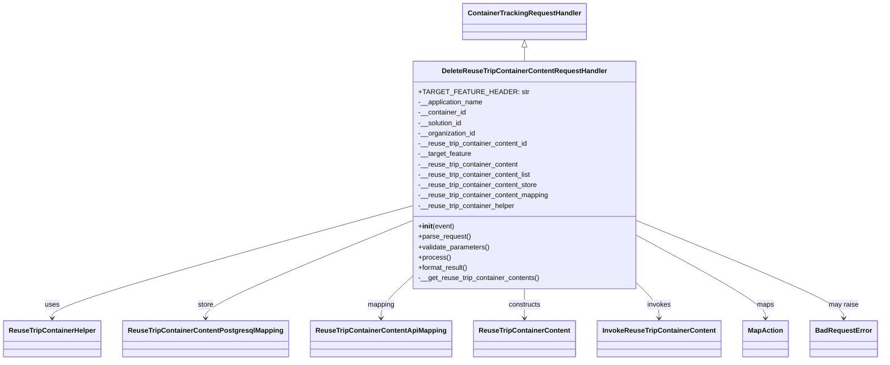

# Diagram: container_tracking_core/container_tracking_service/container_tracking_service/api/reuse_trip_container_content/handlers/delete_reuse_trip_container_content_handler.py


> Auto-generated by Obscura crawlers

## Diagram 1



> SVG rendering failed for this diagram.

## Diagram 2

```mermaid
flowchart TD
    PR[parse_request()] --> VP[validate_parameters()]
    VP --> P[process()]
    P --> RC[get reuse trip container via ReuseTripContainerHelper]
    RC --> RC_EXISTS{reuse_trip_container found?}
    RC_EXISTS -- No --> ERR1[raise BadRequestError: "Unable to find container id"]
    RC_EXISTS -- Yes --> SID{solution id matches?}
    SID -- No --> ERR2[raise BadRequestError: "Authenticated solution id does not match"]
    SID -- Yes --> CHECK_ID{reuse_trip_container_content_id provided?}
    CHECK_ID -- No --> GET_CONTENTS[call InvokeReuseTripContainerContent.get_reuse_trip_container_content]
    GET_CONTENTS --> HAS_CONTENTS{contents returned and non-empty?}
    HAS_CONTENTS -- No --> ERR3[raise BadRequestError: "Unable to find reuse trip container content"]
    HAS_CONTENTS -- Yes --> BUILD_LIST[create ReuseTripContainerContent objects list]
    BUILD_LIST --> DELETE_BATCH[call ReuseTripContainerContentPostgresqlMapping.delete_batch(list)]
    DELETE_BATCH --> FORMAT[format_result() -> map each via MapAction]
    CHECK_ID -- Yes --> BUILD_SINGLE[construct ReuseTripContainerContent(reuse_trip_container_content_id)]
    BUILD_SINGLE --> DELETE_SINGLE[call ReuseTripContainerContentPostgresqlMapping.delete(object)]
    DELETE_SINGLE --> FORMAT
    FORMAT --> RESP[return payload, HTTPStatus.OK]
```

> SVG rendering failed for this diagram.
