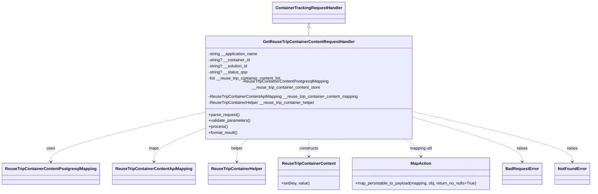

# Diagram: container_tracking_core/container_tracking_service/container_tracking_service/api/reuse_trip_container_content/handlers/get_reuse_trip_container_content_handler.py


> Auto-generated by Obscura crawlers

## Diagram 1



### SVG

<svg id="container" width="2276.03125" xmlns="http://www.w3.org/2000/svg" class="classDiagram" height="734" viewBox="0 0 2276.03125 734" role="graphics-document document" aria-roledescription="class"><style>#container{font-family:"trebuchet ms",verdana,arial,sans-serif;font-size:16px;fill:#333;}@keyframes edge-animation-frame{from{stroke-dashoffset:0;}}@keyframes dash{to{stroke-dashoffset:0;}}#container .edge-animation-slow{stroke-dasharray:9,5!important;stroke-dashoffset:900;animation:dash 50s linear infinite;stroke-linecap:round;}#container .edge-animation-fast{stroke-dasharray:9,5!important;stroke-dashoffset:900;animation:dash 20s linear infinite;stroke-linecap:round;}#container .error-icon{fill:#552222;}#container .error-text{fill:#552222;stroke:#552222;}#container .edge-thickness-normal{stroke-width:1px;}#container .edge-thickness-thick{stroke-width:3.5px;}#container .edge-pattern-solid{stroke-dasharray:0;}#container .edge-thickness-invisible{stroke-width:0;fill:none;}#container .edge-pattern-dashed{stroke-dasharray:3;}#container .edge-pattern-dotted{stroke-dasharray:2;}#container .marker{fill:#333333;stroke:#333333;}#container .marker.cross{stroke:#333333;}#container svg{font-family:"trebuchet ms",verdana,arial,sans-serif;font-size:16px;}#container p{margin:0;}#container g.classGroup text{fill:#9370DB;stroke:none;font-family:"trebuchet ms",verdana,arial,sans-serif;font-size:10px;}#container g.classGroup text .title{font-weight:bolder;}#container .nodeLabel,#container .edgeLabel{color:#131300;}#container .edgeLabel .label rect{fill:#ECECFF;}#container .label text{fill:#131300;}#container .labelBkg{background:#ECECFF;}#container .edgeLabel .label span{background:#ECECFF;}#container .classTitle{font-weight:bolder;}#container .node rect,#container .node circle,#container .node ellipse,#container .node polygon,#container .node path{fill:#ECECFF;stroke:#9370DB;stroke-width:1px;}#container .divider{stroke:#9370DB;stroke-width:1;}#container g.clickable{cursor:pointer;}#container g.classGroup rect{fill:#ECECFF;stroke:#9370DB;}#container g.classGroup line{stroke:#9370DB;stroke-width:1;}#container .classLabel .box{stroke:none;stroke-width:0;fill:#ECECFF;opacity:0.5;}#container .classLabel .label{fill:#9370DB;font-size:10px;}#container .relation{stroke:#333333;stroke-width:1;fill:none;}#container .dashed-line{stroke-dasharray:3;}#container .dotted-line{stroke-dasharray:1 2;}#container #compositionStart,#container .composition{fill:#333333!important;stroke:#333333!important;stroke-width:1;}#container #compositionEnd,#container .composition{fill:#333333!important;stroke:#333333!important;stroke-width:1;}#container #dependencyStart,#container .dependency{fill:#333333!important;stroke:#333333!important;stroke-width:1;}#container #dependencyStart,#container .dependency{fill:#333333!important;stroke:#333333!important;stroke-width:1;}#container #extensionStart,#container .extension{fill:transparent!important;stroke:#333333!important;stroke-width:1;}#container #extensionEnd,#container .extension{fill:transparent!important;stroke:#333333!important;stroke-width:1;}#container #aggregationStart,#container .aggregation{fill:transparent!important;stroke:#333333!important;stroke-width:1;}#container #aggregationEnd,#container .aggregation{fill:transparent!important;stroke:#333333!important;stroke-width:1;}#container #lollipopStart,#container .lollipop{fill:#ECECFF!important;stroke:#333333!important;stroke-width:1;}#container #lollipopEnd,#container .lollipop{fill:#ECECFF!important;stroke:#333333!important;stroke-width:1;}#container .edgeTerminals{font-size:11px;line-height:initial;}#container .classTitleText{text-anchor:middle;font-size:18px;fill:#333;}#container .label-icon{display:inline-block;height:1em;overflow:visible;vertical-align:-0.125em;}#container .node .label-icon path{fill:currentColor;stroke:revert;stroke-width:revert;}#container :root{--mermaid-font-family:"trebuchet ms",verdana,arial,sans-serif;}</style><g><defs><marker id="container_class-aggregationStart" class="marker aggregation class" refX="18" refY="7" markerWidth="190" markerHeight="240" orient="auto"><path d="M 18,7 L9,13 L1,7 L9,1 Z"></path></marker></defs><defs><marker id="container_class-aggregationEnd" class="marker aggregation class" refX="1" refY="7" markerWidth="20" markerHeight="28" orient="auto"><path d="M 18,7 L9,13 L1,7 L9,1 Z"></path></marker></defs><defs><marker id="container_class-extensionStart" class="marker extension class" refX="18" refY="7" markerWidth="190" markerHeight="240" orient="auto"><path d="M 1,7 L18,13 V 1 Z"></path></marker></defs><defs><marker id="container_class-extensionEnd" class="marker extension class" refX="1" refY="7" markerWidth="20" markerHeight="28" orient="auto"><path d="M 1,1 V 13 L18,7 Z"></path></marker></defs><defs><marker id="container_class-compositionStart" class="marker composition class" refX="18" refY="7" markerWidth="190" markerHeight="240" orient="auto"><path d="M 18,7 L9,13 L1,7 L9,1 Z"></path></marker></defs><defs><marker id="container_class-compositionEnd" class="marker composition class" refX="1" refY="7" markerWidth="20" markerHeight="28" orient="auto"><path d="M 18,7 L9,13 L1,7 L9,1 Z"></path></marker></defs><defs><marker id="container_class-dependencyStart" class="marker dependency class" refX="6" refY="7" markerWidth="190" markerHeight="240" orient="auto"><path d="M 5,7 L9,13 L1,7 L9,1 Z"></path></marker></defs><defs><marker id="container_class-dependencyEnd" class="marker dependency class" refX="13" refY="7" markerWidth="20" markerHeight="28" orient="auto"><path d="M 18,7 L9,13 L14,7 L9,1 Z"></path></marker></defs><defs><marker id="container_class-lollipopStart" class="marker lollipop class" refX="13" refY="7" markerWidth="190" markerHeight="240" orient="auto"><circle stroke="black" fill="transparent" cx="7" cy="7" r="6"></circle></marker></defs><defs><marker id="container_class-lollipopEnd" class="marker lollipop class" refX="1" refY="7" markerWidth="190" markerHeight="240" orient="auto"><circle stroke="black" fill="transparent" cx="7" cy="7" r="6"></circle></marker></defs><g class="root"><g class="clusters"></g><g class="edgePaths"><path d="M1171.605,109.25L1171.605,110.542C1171.605,111.833,1171.605,114.417,1171.605,119.875C1171.605,125.333,1171.605,133.667,1171.605,137.833L1171.605,142" id="id_ContainerTrackingRequestHandler_GetReuseTripContainerContentRequestHandler_1" class="edge-thickness-normal edge-pattern-solid relation" style=";;;" data-edge="true" data-et="edge" data-id="id_ContainerTrackingRequestHandler_GetReuseTripContainerContentRequestHandler_1" data-points="W3sieCI6MTE3MS42MDU0Njg3NSwieSI6OTJ9LHsieCI6MTE3MS42MDU0Njg3NSwieSI6MTE3fSx7IngiOjExNzEuNjA1NDY4NzUsInkiOjE0Mn1d" marker-start="url(#container_class-extensionStart)"></path><path d="M762.434,429.573L667.229,451.811C572.023,474.049,381.613,518.524,286.408,549.429C191.203,580.333,191.203,597.667,191.203,606.333L191.203,615" id="id_GetReuseTripContainerContentRequestHandler_ReuseTripContainerContentPostgresqlMapping_2" class="edge-thickness-normal edge-pattern-dashed relation" style=";;;" data-edge="true" data-et="edge" data-id="id_GetReuseTripContainerContentRequestHandler_ReuseTripContainerContentPostgresqlMapping_2" data-points="W3sieCI6NzYyLjQzMzU5Mzc1LCJ5Ijo0MjkuNTczMzczNDk1NDE2MDR9LHsieCI6MTkxLjIwMzEyNSwieSI6NTYzfSx7IngiOjE5MS4yMDMxMjUsInkiOjYyMX1d" marker-end="url(#container_class-dependencyEnd)"></path><path d="M762.434,492.509L732.106,504.257C701.779,516.006,641.124,539.503,610.796,559.918C580.469,580.333,580.469,597.667,580.469,606.333L580.469,615" id="id_GetReuseTripContainerContentRequestHandler_ReuseTripContainerContentApiMapping_3" class="edge-thickness-normal edge-pattern-dashed relation" style=";;;" data-edge="true" data-et="edge" data-id="id_GetReuseTripContainerContentRequestHandler_ReuseTripContainerContentApiMapping_3" data-points="W3sieCI6NzYyLjQzMzU5Mzc1LCJ5Ijo0OTIuNTA4Nzc4NzY5NzE2NzR9LHsieCI6NTgwLjQ2ODc1LCJ5Ijo1NjN9LHsieCI6NTgwLjQ2ODc1LCJ5Ijo2MjF9XQ==" marker-end="url(#container_class-dependencyEnd)"></path><path d="M939.744,526L932.297,532.167C924.85,538.333,909.956,550.667,902.509,565.5C895.063,580.333,895.063,597.667,895.063,606.333L895.063,615" id="id_GetReuseTripContainerContentRequestHandler_ReuseTripContainerHelper_4" class="edge-thickness-normal edge-pattern-dashed relation" style=";;;" data-edge="true" data-et="edge" data-id="id_GetReuseTripContainerContentRequestHandler_ReuseTripContainerHelper_4" data-points="W3sieCI6OTM5Ljc0NDExNTAzODIwOTcsInkiOjUyNn0seyJ4Ijo4OTUuMDYyNSwieSI6NTYzfSx7IngiOjg5NS4wNjI1LCJ5Ijo2MjF9XQ==" marker-end="url(#container_class-dependencyEnd)"></path><path d="M1171.605,526L1171.605,532.167C1171.605,538.333,1171.605,550.667,1171.605,562C1171.605,573.333,1171.605,583.667,1171.605,588.833L1171.605,594" id="id_GetReuseTripContainerContentRequestHandler_ReuseTripContainerContent_5" class="edge-thickness-normal edge-pattern-dashed relation" style=";;;" data-edge="true" data-et="edge" data-id="id_GetReuseTripContainerContentRequestHandler_ReuseTripContainerContent_5" data-points="W3sieCI6MTE3MS42MDU0Njg3NSwieSI6NTI2fSx7IngiOjExNzEuNjA1NDY4NzUsInkiOjU2M30seyJ4IjoxMTcxLjYwNTQ2ODc1LCJ5Ijo2MDB9XQ==" marker-end="url(#container_class-dependencyEnd)"></path><path d="M1542.531,526L1554.445,532.167C1566.358,538.333,1590.185,550.667,1602.098,562C1614.012,573.333,1614.012,583.667,1614.012,588.833L1614.012,594" id="id_GetReuseTripContainerContentRequestHandler_MapAction_6" class="edge-thickness-normal edge-pattern-dashed relation" style=";;;" data-edge="true" data-et="edge" data-id="id_GetReuseTripContainerContentRequestHandler_MapAction_6" data-points="W3sieCI6MTU0Mi41MzEyMzI5NDIxMzk3LCJ5Ijo1MjZ9LHsieCI6MTYxNC4wMTE3MTg3NSwieSI6NTYzfSx7IngiOjE2MTQuMDExNzE4NzUsInkiOjYwMH1d" marker-end="url(#container_class-dependencyEnd)"></path><path d="M1580.777,445.405L1652.762,465.004C1724.747,484.603,1868.717,523.802,1940.702,552.067C2012.688,580.333,2012.688,597.667,2012.688,606.333L2012.688,615" id="id_GetReuseTripContainerContentRequestHandler_BadRequestError_7" class="edge-thickness-normal edge-pattern-dashed relation" style=";;;" data-edge="true" data-et="edge" data-id="id_GetReuseTripContainerContentRequestHandler_BadRequestError_7" data-points="W3sieCI6MTU4MC43NzczNDM3NSwieSI6NDQ1LjQwNDU0MzA2OTA1NjMzfSx7IngiOjIwMTIuNjg3NSwieSI6NTYzfSx7IngiOjIwMTIuNjg3NSwieSI6NjIxfV0=" marker-end="url(#container_class-dependencyEnd)"></path><path d="M1580.777,424.892L1684.398,447.91C1788.018,470.928,1995.259,516.964,2098.88,548.649C2202.5,580.333,2202.5,597.667,2202.5,606.333L2202.5,615" id="id_GetReuseTripContainerContentRequestHandler_NotFoundError_8" class="edge-thickness-normal edge-pattern-dashed relation" style=";;;" data-edge="true" data-et="edge" data-id="id_GetReuseTripContainerContentRequestHandler_NotFoundError_8" data-points="W3sieCI6MTU4MC43NzczNDM3NSwieSI6NDI0Ljg5MjI4NDg0MDYwNzk0fSx7IngiOjIyMDIuNSwieSI6NTYzfSx7IngiOjIyMDIuNSwieSI6NjIxfV0=" marker-end="url(#container_class-dependencyEnd)"></path></g><g class="edgeLabels"><g class="edgeLabel"><g class="label" data-id="id_ContainerTrackingRequestHandler_GetReuseTripContainerContentRequestHandler_1" transform="translate(0, 0)"><foreignObject width="0" height="0"><div xmlns="http://www.w3.org/1999/xhtml" class="labelBkg" style="display: table-cell; white-space: nowrap; line-height: 1.5; max-width: 200px; text-align: center;"><span class="edgeLabel"></span></div></foreignObject></g></g><g class="edgeLabel" transform="translate(191.203125, 563)"><g class="label" data-id="id_GetReuseTripContainerContentRequestHandler_ReuseTripContainerContentPostgresqlMapping_2" transform="translate(-16.4921875, -12)"><foreignObject width="32.984375" height="24"><div xmlns="http://www.w3.org/1999/xhtml" class="labelBkg" style="display: table-cell; white-space: nowrap; line-height: 1.5; max-width: 200px; text-align: center;"><span class="edgeLabel"><p>uses</p></span></div></foreignObject></g></g><g class="edgeLabel" transform="translate(580.46875, 563)"><g class="label" data-id="id_GetReuseTripContainerContentRequestHandler_ReuseTripContainerContentApiMapping_3" transform="translate(-19.703125, -12)"><foreignObject width="39.40625" height="24"><div xmlns="http://www.w3.org/1999/xhtml" class="labelBkg" style="display: table-cell; white-space: nowrap; line-height: 1.5; max-width: 200px; text-align: center;"><span class="edgeLabel"><p>maps</p></span></div></foreignObject></g></g><g class="edgeLabel" transform="translate(895.0625, 563)"><g class="label" data-id="id_GetReuseTripContainerContentRequestHandler_ReuseTripContainerHelper_4" transform="translate(-23.59375, -12)"><foreignObject width="47.1875" height="24"><div xmlns="http://www.w3.org/1999/xhtml" class="labelBkg" style="display: table-cell; white-space: nowrap; line-height: 1.5; max-width: 200px; text-align: center;"><span class="edgeLabel"><p>helper</p></span></div></foreignObject></g></g><g class="edgeLabel" transform="translate(1171.60546875, 563)"><g class="label" data-id="id_GetReuseTripContainerContentRequestHandler_ReuseTripContainerContent_5" transform="translate(-37.84375, -12)"><foreignObject width="75.6875" height="24"><div xmlns="http://www.w3.org/1999/xhtml" class="labelBkg" style="display: table-cell; white-space: nowrap; line-height: 1.5; max-width: 200px; text-align: center;"><span class="edgeLabel"><p>constructs</p></span></div></foreignObject></g></g><g class="edgeLabel" transform="translate(1614.01171875, 563)"><g class="label" data-id="id_GetReuseTripContainerContentRequestHandler_MapAction_6" transform="translate(-46.0859375, -12)"><foreignObject width="92.171875" height="24"><div xmlns="http://www.w3.org/1999/xhtml" class="labelBkg" style="display: table-cell; white-space: nowrap; line-height: 1.5; max-width: 200px; text-align: center;"><span class="edgeLabel"><p>mapping util</p></span></div></foreignObject></g></g><g class="edgeLabel" transform="translate(2012.6875, 563)"><g class="label" data-id="id_GetReuseTripContainerContentRequestHandler_BadRequestError_7" transform="translate(-21.25, -12)"><foreignObject width="42.5" height="24"><div xmlns="http://www.w3.org/1999/xhtml" class="labelBkg" style="display: table-cell; white-space: nowrap; line-height: 1.5; max-width: 200px; text-align: center;"><span class="edgeLabel"><p>raises</p></span></div></foreignObject></g></g><g class="edgeLabel" transform="translate(2202.5, 563)"><g class="label" data-id="id_GetReuseTripContainerContentRequestHandler_NotFoundError_8" transform="translate(-21.25, -12)"><foreignObject width="42.5" height="24"><div xmlns="http://www.w3.org/1999/xhtml" class="labelBkg" style="display: table-cell; white-space: nowrap; line-height: 1.5; max-width: 200px; text-align: center;"><span class="edgeLabel"><p>raises</p></span></div></foreignObject></g></g></g><g class="nodes"><g class="node default" id="classId-ContainerTrackingRequestHandler-0" transform="translate(1171.60546875, 50)"><g class="basic label-container"><path d="M-137.5859375 -42 L137.5859375 -42 L137.5859375 42 L-137.5859375 42" stroke="none" stroke-width="0" fill="#ECECFF" style=""></path><path d="M-137.5859375 -42 C-49.376048932183366 -42, 38.83383963563327 -42, 137.5859375 -42 M-137.5859375 -42 C-69.33956360424352 -42, -1.0931897084870457 -42, 137.5859375 -42 M137.5859375 -42 C137.5859375 -16.117177476722766, 137.5859375 9.765645046554468, 137.5859375 42 M137.5859375 -42 C137.5859375 -17.0314165669288, 137.5859375 7.937166866142398, 137.5859375 42 M137.5859375 42 C81.11362048407216 42, 24.641303468144315 42, -137.5859375 42 M137.5859375 42 C49.248783936552556 42, -39.08836962689489 42, -137.5859375 42 M-137.5859375 42 C-137.5859375 16.039550094512148, -137.5859375 -9.920899810975705, -137.5859375 -42 M-137.5859375 42 C-137.5859375 15.979696677329432, -137.5859375 -10.040606645341136, -137.5859375 -42" stroke="#9370DB" stroke-width="1.3" fill="none" stroke-dasharray="0 0" style=""></path></g><g class="annotation-group text" transform="translate(0, -18)"></g><g class="label-group text" transform="translate(-125.5859375, -18)"><g class="label" style="font-weight: bolder" transform="translate(0,-12)"><foreignObject width="251.171875" height="24"><div xmlns="http://www.w3.org/1999/xhtml" style="display: table-cell; white-space: nowrap; line-height: 1.5; max-width: 299px; text-align: center;"><span class="nodeLabel markdown-node-label" style=""><p>ContainerTrackingRequestHandler</p></span></div></foreignObject></g></g><g class="members-group text" transform="translate(-125.5859375, 30)"></g><g class="methods-group text" transform="translate(-125.5859375, 60)"></g><g class="divider" style=""><path d="M-137.5859375 6 C-55.449723451469126 6, 26.68649059706175 6, 137.5859375 6 M-137.5859375 6 C-60.099975612858046 6, 17.38598627428391 6, 137.5859375 6" stroke="#9370DB" stroke-width="1.3" fill="none" stroke-dasharray="0 0" style=""></path></g><g class="divider" style=""><path d="M-137.5859375 24 C-29.24564930029301 24, 79.09463889941398 24, 137.5859375 24 M-137.5859375 24 C-82.46996488599697 24, -27.353992271993945 24, 137.5859375 24" stroke="#9370DB" stroke-width="1.3" fill="none" stroke-dasharray="0 0" style=""></path></g></g><g class="node default" id="classId-GetReuseTripContainerContentRequestHandler-1" transform="translate(1171.60546875, 334)"><g class="basic label-container"><path d="M-409.171875 -192 L409.171875 -192 L409.171875 192 L-409.171875 192" stroke="none" stroke-width="0" fill="#ECECFF" style=""></path><path d="M-409.171875 -192 C-192.86439411014277 -192, 23.443086779714463 -192, 409.171875 -192 M-409.171875 -192 C-168.846491378276 -192, 71.478892243448 -192, 409.171875 -192 M409.171875 -192 C409.171875 -74.26811826601656, 409.171875 43.463763467966885, 409.171875 192 M409.171875 -192 C409.171875 -62.10531499614501, 409.171875 67.78937000770998, 409.171875 192 M409.171875 192 C166.69621639709007 192, -75.77944220581986 192, -409.171875 192 M409.171875 192 C166.56645321168617 192, -76.03896857662767 192, -409.171875 192 M-409.171875 192 C-409.171875 103.12374500478911, -409.171875 14.247490009578229, -409.171875 -192 M-409.171875 192 C-409.171875 101.59264915860794, -409.171875 11.185298317215882, -409.171875 -192" stroke="#9370DB" stroke-width="1.3" fill="none" stroke-dasharray="0 0" style=""></path></g><g class="annotation-group text" transform="translate(0, -168)"></g><g class="label-group text" transform="translate(-172.53125, -168)"><g class="label" style="font-weight: bolder" transform="translate(0,-12)"><foreignObject width="345.0625" height="24"><div xmlns="http://www.w3.org/1999/xhtml" style="display: table-cell; white-space: nowrap; line-height: 1.5; max-width: 391px; text-align: center;"><span class="nodeLabel markdown-node-label" style=""><p>GetReuseTripContainerContentRequestHandler</p></span></div></foreignObject></g></g><g class="members-group text" transform="translate(-397.171875, -120)"><g class="label" style="" transform="translate(0,-12)"><foreignObject width="199.4375" height="24"><div xmlns="http://www.w3.org/1999/xhtml" style="display: table-cell; white-space: nowrap; line-height: 1.5; max-width: 257px; text-align: center;"><span class="nodeLabel markdown-node-label" style=""><p>-string __application_name</p></span></div></foreignObject></g><g class="label" style="" transform="translate(0,12)"><foreignObject width="165.828125" height="24"><div xmlns="http://www.w3.org/1999/xhtml" style="display: table-cell; white-space: nowrap; line-height: 1.5; max-width: 223px; text-align: center;"><span class="nodeLabel markdown-node-label" style=""><p>-string? __container_id</p></span></div></foreignObject></g><g class="label" style="" transform="translate(0,36)"><foreignObject width="158.0625" height="24"><div xmlns="http://www.w3.org/1999/xhtml" style="display: table-cell; white-space: nowrap; line-height: 1.5; max-width: 215px; text-align: center;"><span class="nodeLabel markdown-node-label" style=""><p>-string? __solution_id</p></span></div></foreignObject></g><g class="label" style="" transform="translate(0,60)"><foreignObject width="154.453125" height="24"><div xmlns="http://www.w3.org/1999/xhtml" style="display: table-cell; white-space: nowrap; line-height: 1.5; max-width: 212px; text-align: center;"><span class="nodeLabel markdown-node-label" style=""><p>-string? __status_qsp</p></span></div></foreignObject></g><g class="label" style="" transform="translate(0,84)"><foreignObject width="292.859375" height="24"><div xmlns="http://www.w3.org/1999/xhtml" style="display: table-cell; white-space: nowrap; line-height: 1.5; max-width: 350px; text-align: center;"><span class="nodeLabel markdown-node-label" style=""><p>-list __reuse_trip_container_content_list</p></span></div></foreignObject></g><g class="label" style="" transform="translate(0,108)"><foreignObject width="621.8125" height="24"><div xmlns="http://www.w3.org/1999/xhtml" style="display: table-cell; white-space: nowrap; line-height: 1.5; max-width: 679px; text-align: center;"><span class="nodeLabel markdown-node-label" style=""><p>-ReuseTripContainerContentPostgresqlMapping __reuse_trip_container_content_store</p></span></div></foreignObject></g><g class="label" style="" transform="translate(0,132)"><foreignObject width="596.234375" height="24"><div xmlns="http://www.w3.org/1999/xhtml" style="display: table-cell; white-space: nowrap; line-height: 1.5; max-width: 654px; text-align: center;"><span class="nodeLabel markdown-node-label" style=""><p>-ReuseTripContainerContentApiMapping __reuse_trip_container_content_mapping</p></span></div></foreignObject></g><g class="label" style="" transform="translate(0,156)"><foreignObject width="422.703125" height="24"><div xmlns="http://www.w3.org/1999/xhtml" style="display: table-cell; white-space: nowrap; line-height: 1.5; max-width: 481px; text-align: center;"><span class="nodeLabel markdown-node-label" style=""><p>-ReuseTripContainerHelper __reuse_trip_container_helper</p></span></div></foreignObject></g></g><g class="methods-group text" transform="translate(-397.171875, 96)"><g class="label" style="" transform="translate(0,-12)"><foreignObject width="121.796875" height="24"><div xmlns="http://www.w3.org/1999/xhtml" style="display: table-cell; white-space: nowrap; line-height: 1.5; max-width: 179px; text-align: center;"><span class="nodeLabel markdown-node-label" style=""><p>+parse_request()</p></span></div></foreignObject></g><g class="label" style="" transform="translate(0,12)"><foreignObject width="166.546875" height="24"><div xmlns="http://www.w3.org/1999/xhtml" style="display: table-cell; white-space: nowrap; line-height: 1.5; max-width: 224px; text-align: center;"><span class="nodeLabel markdown-node-label" style=""><p>+validate_parameters()</p></span></div></foreignObject></g><g class="label" style="" transform="translate(0,36)"><foreignObject width="73.734375" height="24"><div xmlns="http://www.w3.org/1999/xhtml" style="display: table-cell; white-space: nowrap; line-height: 1.5; max-width: 131px; text-align: center;"><span class="nodeLabel markdown-node-label" style=""><p>+process()</p></span></div></foreignObject></g><g class="label" style="" transform="translate(0,60)"><foreignObject width="117.015625" height="24"><div xmlns="http://www.w3.org/1999/xhtml" style="display: table-cell; white-space: nowrap; line-height: 1.5; max-width: 174px; text-align: center;"><span class="nodeLabel markdown-node-label" style=""><p>+format_result()</p></span></div></foreignObject></g></g><g class="divider" style=""><path d="M-409.171875 -144 C-175.46051492731638 -144, 58.25084514536724 -144, 409.171875 -144 M-409.171875 -144 C-231.65034603990372 -144, -54.12881707980745 -144, 409.171875 -144" stroke="#9370DB" stroke-width="1.3" fill="none" stroke-dasharray="0 0" style=""></path></g><g class="divider" style=""><path d="M-409.171875 72 C-193.4710863709088 72, 22.229702258182385 72, 409.171875 72 M-409.171875 72 C-85.82763272378173 72, 237.51660955243653 72, 409.171875 72" stroke="#9370DB" stroke-width="1.3" fill="none" stroke-dasharray="0 0" style=""></path></g></g><g class="node default" id="classId-ReuseTripContainerContentPostgresqlMapping-2" transform="translate(191.203125, 663)"><g class="basic label-container"><path d="M-183.203125 -42 L183.203125 -42 L183.203125 42 L-183.203125 42" stroke="none" stroke-width="0" fill="#ECECFF" style=""></path><path d="M-183.203125 -42 C-66.0176766234696 -42, 51.167771753060805 -42, 183.203125 -42 M-183.203125 -42 C-49.247135946007745 -42, 84.70885310798451 -42, 183.203125 -42 M183.203125 -42 C183.203125 -13.69467914649492, 183.203125 14.61064170701016, 183.203125 42 M183.203125 -42 C183.203125 -9.760088958094123, 183.203125 22.479822083811754, 183.203125 42 M183.203125 42 C79.43092640875064 42, -24.341272182498727 42, -183.203125 42 M183.203125 42 C108.86170618776626 42, 34.52028737553252 42, -183.203125 42 M-183.203125 42 C-183.203125 14.186740779221225, -183.203125 -13.62651844155755, -183.203125 -42 M-183.203125 42 C-183.203125 22.83636538366566, -183.203125 3.6727307673313234, -183.203125 -42" stroke="#9370DB" stroke-width="1.3" fill="none" stroke-dasharray="0 0" style=""></path></g><g class="annotation-group text" transform="translate(0, -18)"></g><g class="label-group text" transform="translate(-171.203125, -18)"><g class="label" style="font-weight: bolder" transform="translate(0,-12)"><foreignObject width="342.40625" height="24"><div xmlns="http://www.w3.org/1999/xhtml" style="display: table-cell; white-space: nowrap; line-height: 1.5; max-width: 388px; text-align: center;"><span class="nodeLabel markdown-node-label" style=""><p>ReuseTripContainerContentPostgresqlMapping</p></span></div></foreignObject></g></g><g class="members-group text" transform="translate(-171.203125, 30)"></g><g class="methods-group text" transform="translate(-171.203125, 60)"></g><g class="divider" style=""><path d="M-183.203125 6 C-100.25358735203206 6, -17.304049704064113 6, 183.203125 6 M-183.203125 6 C-54.40459746833923 6, 74.39393006332153 6, 183.203125 6" stroke="#9370DB" stroke-width="1.3" fill="none" stroke-dasharray="0 0" style=""></path></g><g class="divider" style=""><path d="M-183.203125 24 C-95.94957962927074 24, -8.696034258541488 24, 183.203125 24 M-183.203125 24 C-56.40974491393186 24, 70.38363517213628 24, 183.203125 24" stroke="#9370DB" stroke-width="1.3" fill="none" stroke-dasharray="0 0" style=""></path></g></g><g class="node default" id="classId-ReuseTripContainerContentApiMapping-3" transform="translate(580.46875, 663)"><g class="basic label-container"><path d="M-156.0625 -42 L156.0625 -42 L156.0625 42 L-156.0625 42" stroke="none" stroke-width="0" fill="#ECECFF" style=""></path><path d="M-156.0625 -42 C-63.53326309655603 -42, 28.995973806887946 -42, 156.0625 -42 M-156.0625 -42 C-47.95109051266307 -42, 60.16031897467386 -42, 156.0625 -42 M156.0625 -42 C156.0625 -14.44225339693968, 156.0625 13.11549320612064, 156.0625 42 M156.0625 -42 C156.0625 -22.27016514420771, 156.0625 -2.5403302884154186, 156.0625 42 M156.0625 42 C50.30551013303088 42, -55.45147973393824 42, -156.0625 42 M156.0625 42 C31.77383389885344 42, -92.51483220229312 42, -156.0625 42 M-156.0625 42 C-156.0625 22.156874790276234, -156.0625 2.313749580552468, -156.0625 -42 M-156.0625 42 C-156.0625 12.901830452158485, -156.0625 -16.19633909568303, -156.0625 -42" stroke="#9370DB" stroke-width="1.3" fill="none" stroke-dasharray="0 0" style=""></path></g><g class="annotation-group text" transform="translate(0, -18)"></g><g class="label-group text" transform="translate(-144.0625, -18)"><g class="label" style="font-weight: bolder" transform="translate(0,-12)"><foreignObject width="288.125" height="24"><div xmlns="http://www.w3.org/1999/xhtml" style="display: table-cell; white-space: nowrap; line-height: 1.5; max-width: 335px; text-align: center;"><span class="nodeLabel markdown-node-label" style=""><p>ReuseTripContainerContentApiMapping</p></span></div></foreignObject></g></g><g class="members-group text" transform="translate(-144.0625, 30)"></g><g class="methods-group text" transform="translate(-144.0625, 60)"></g><g class="divider" style=""><path d="M-156.0625 6 C-44.52944940601574 6, 67.00360118796851 6, 156.0625 6 M-156.0625 6 C-51.49055537119588 6, 53.08138925760824 6, 156.0625 6" stroke="#9370DB" stroke-width="1.3" fill="none" stroke-dasharray="0 0" style=""></path></g><g class="divider" style=""><path d="M-156.0625 24 C-87.5833470122018 24, -19.104194024403597 24, 156.0625 24 M-156.0625 24 C-82.69562840100289 24, -9.328756802005785 24, 156.0625 24" stroke="#9370DB" stroke-width="1.3" fill="none" stroke-dasharray="0 0" style=""></path></g></g><g class="node default" id="classId-ReuseTripContainerHelper-4" transform="translate(895.0625, 663)"><g class="basic label-container"><path d="M-108.53125 -42 L108.53125 -42 L108.53125 42 L-108.53125 42" stroke="none" stroke-width="0" fill="#ECECFF" style=""></path><path d="M-108.53125 -42 C-55.80916353451335 -42, -3.087077069026705 -42, 108.53125 -42 M-108.53125 -42 C-57.3337884229245 -42, -6.136326845848998 -42, 108.53125 -42 M108.53125 -42 C108.53125 -22.56979546098607, 108.53125 -3.139590921972143, 108.53125 42 M108.53125 -42 C108.53125 -11.340018740387496, 108.53125 19.319962519225008, 108.53125 42 M108.53125 42 C24.542823572090867 42, -59.445602855818265 42, -108.53125 42 M108.53125 42 C47.81072969078145 42, -12.9097906184371 42, -108.53125 42 M-108.53125 42 C-108.53125 17.591180485597295, -108.53125 -6.817639028805409, -108.53125 -42 M-108.53125 42 C-108.53125 11.59223255078859, -108.53125 -18.81553489842282, -108.53125 -42" stroke="#9370DB" stroke-width="1.3" fill="none" stroke-dasharray="0 0" style=""></path></g><g class="annotation-group text" transform="translate(0, -18)"></g><g class="label-group text" transform="translate(-96.53125, -18)"><g class="label" style="font-weight: bolder" transform="translate(0,-12)"><foreignObject width="193.0625" height="24"><div xmlns="http://www.w3.org/1999/xhtml" style="display: table-cell; white-space: nowrap; line-height: 1.5; max-width: 242px; text-align: center;"><span class="nodeLabel markdown-node-label" style=""><p>ReuseTripContainerHelper</p></span></div></foreignObject></g></g><g class="members-group text" transform="translate(-96.53125, 30)"></g><g class="methods-group text" transform="translate(-96.53125, 60)"></g><g class="divider" style=""><path d="M-108.53125 6 C-49.94557484567686 6, 8.640100308646282 6, 108.53125 6 M-108.53125 6 C-40.383205928929044 6, 27.76483814214191 6, 108.53125 6" stroke="#9370DB" stroke-width="1.3" fill="none" stroke-dasharray="0 0" style=""></path></g><g class="divider" style=""><path d="M-108.53125 24 C-50.578797242350674 24, 7.373655515298651 24, 108.53125 24 M-108.53125 24 C-44.72277025690234 24, 19.085709486195313 24, 108.53125 24" stroke="#9370DB" stroke-width="1.3" fill="none" stroke-dasharray="0 0" style=""></path></g></g><g class="node default" id="classId-ReuseTripContainerContent-5" transform="translate(1171.60546875, 663)"><g class="basic label-container"><path d="M-118.01171875 -63 L118.01171875 -63 L118.01171875 63 L-118.01171875 63" stroke="none" stroke-width="0" fill="#ECECFF" style=""></path><path d="M-118.01171875 -63 C-36.520666485394585 -63, 44.97038577921083 -63, 118.01171875 -63 M-118.01171875 -63 C-64.74747545209209 -63, -11.483232154184194 -63, 118.01171875 -63 M118.01171875 -63 C118.01171875 -29.034066444099317, 118.01171875 4.931867111801367, 118.01171875 63 M118.01171875 -63 C118.01171875 -20.704217380772157, 118.01171875 21.591565238455686, 118.01171875 63 M118.01171875 63 C52.51296367071511 63, -12.985791408569781 63, -118.01171875 63 M118.01171875 63 C44.60492573849555 63, -28.801867273008895 63, -118.01171875 63 M-118.01171875 63 C-118.01171875 16.1339314704393, -118.01171875 -30.7321370591214, -118.01171875 -63 M-118.01171875 63 C-118.01171875 23.317487898766558, -118.01171875 -16.365024202466884, -118.01171875 -63" stroke="#9370DB" stroke-width="1.3" fill="none" stroke-dasharray="0 0" style=""></path></g><g class="annotation-group text" transform="translate(0, -39)"></g><g class="label-group text" transform="translate(-100.8046875, -39)"><g class="label" style="font-weight: bolder" transform="translate(0,-12)"><foreignObject width="201.609375" height="24"><div xmlns="http://www.w3.org/1999/xhtml" style="display: table-cell; white-space: nowrap; line-height: 1.5; max-width: 249px; text-align: center;"><span class="nodeLabel markdown-node-label" style=""><p>ReuseTripContainerContent</p></span></div></foreignObject></g></g><g class="members-group text" transform="translate(-106.01171875, 9)"></g><g class="methods-group text" transform="translate(-106.01171875, 39)"><g class="label" style="" transform="translate(0,-12)"><foreignObject width="111.21875" height="24"><div xmlns="http://www.w3.org/1999/xhtml" style="display: table-cell; white-space: nowrap; line-height: 1.5; max-width: 169px; text-align: center;"><span class="nodeLabel markdown-node-label" style=""><p>+set(key, value)</p></span></div></foreignObject></g></g><g class="divider" style=""><path d="M-118.01171875 -15 C-58.9151065474308 -15, 0.18150565513839467 -15, 118.01171875 -15 M-118.01171875 -15 C-29.121195125258325 -15, 59.76932849948335 -15, 118.01171875 -15" stroke="#9370DB" stroke-width="1.3" fill="none" stroke-dasharray="0 0" style=""></path></g><g class="divider" style=""><path d="M-118.01171875 9 C-69.55215915700639 9, -21.092599564012772 9, 118.01171875 9 M-118.01171875 9 C-60.1577558250075 9, -2.3037929000149973 9, 118.01171875 9" stroke="#9370DB" stroke-width="1.3" fill="none" stroke-dasharray="0 0" style=""></path></g></g><g class="node default" id="classId-MapAction-6" transform="translate(1614.01171875, 663)"><g class="basic label-container"><path d="M-274.39453125 -63 L274.39453125 -63 L274.39453125 63 L-274.39453125 63" stroke="none" stroke-width="0" fill="#ECECFF" style=""></path><path d="M-274.39453125 -63 C-115.50931308589492 -63, 43.37590507821017 -63, 274.39453125 -63 M-274.39453125 -63 C-121.80441837910152 -63, 30.78569449179696 -63, 274.39453125 -63 M274.39453125 -63 C274.39453125 -26.910029240797776, 274.39453125 9.179941518404448, 274.39453125 63 M274.39453125 -63 C274.39453125 -28.184605389202922, 274.39453125 6.630789221594156, 274.39453125 63 M274.39453125 63 C156.56729528970644 63, 38.74005932941287 63, -274.39453125 63 M274.39453125 63 C133.09245233187698 63, -8.209626586246031 63, -274.39453125 63 M-274.39453125 63 C-274.39453125 37.779229698587784, -274.39453125 12.558459397175561, -274.39453125 -63 M-274.39453125 63 C-274.39453125 24.88629209505251, -274.39453125 -13.227415809894978, -274.39453125 -63" stroke="#9370DB" stroke-width="1.3" fill="none" stroke-dasharray="0 0" style=""></path></g><g class="annotation-group text" transform="translate(0, -39)"></g><g class="label-group text" transform="translate(-38.6328125, -39)"><g class="label" style="font-weight: bolder" transform="translate(0,-12)"><foreignObject width="77.265625" height="24"><div xmlns="http://www.w3.org/1999/xhtml" style="display: table-cell; white-space: nowrap; line-height: 1.5; max-width: 126px; text-align: center;"><span class="nodeLabel markdown-node-label" style=""><p>MapAction</p></span></div></foreignObject></g></g><g class="members-group text" transform="translate(-262.39453125, 9)"></g><g class="methods-group text" transform="translate(-262.39453125, 39)"><g class="label" style="" transform="translate(0,-12)"><foreignObject width="486.15625" height="24"><div xmlns="http://www.w3.org/1999/xhtml" style="display: table-cell; white-space: nowrap; line-height: 1.5; max-width: 544px; text-align: center;"><span class="nodeLabel markdown-node-label" style=""><p>+map_persistable_to_payload(mapping, obj, return_no_nulls=True)</p></span></div></foreignObject></g></g><g class="divider" style=""><path d="M-274.39453125 -15 C-163.2245065366268 -15, -52.05448182325361 -15, 274.39453125 -15 M-274.39453125 -15 C-130.01401866889938 -15, 14.366493912201236 -15, 274.39453125 -15" stroke="#9370DB" stroke-width="1.3" fill="none" stroke-dasharray="0 0" style=""></path></g><g class="divider" style=""><path d="M-274.39453125 9 C-130.49247417732735 9, 13.409582895345295 9, 274.39453125 9 M-274.39453125 9 C-88.85580620533338 9, 96.68291883933324 9, 274.39453125 9" stroke="#9370DB" stroke-width="1.3" fill="none" stroke-dasharray="0 0" style=""></path></g></g><g class="node default" id="classId-BadRequestError-7" transform="translate(2012.6875, 663)"><g class="basic label-container"><path d="M-74.28125 -42 L74.28125 -42 L74.28125 42 L-74.28125 42" stroke="none" stroke-width="0" fill="#ECECFF" style=""></path><path d="M-74.28125 -42 C-24.682405455644016 -42, 24.916439088711968 -42, 74.28125 -42 M-74.28125 -42 C-33.92285953871681 -42, 6.435530922566386 -42, 74.28125 -42 M74.28125 -42 C74.28125 -10.60231810154957, 74.28125 20.79536379690086, 74.28125 42 M74.28125 -42 C74.28125 -14.357734929619642, 74.28125 13.284530140760715, 74.28125 42 M74.28125 42 C24.950148600146818 42, -24.380952799706364 42, -74.28125 42 M74.28125 42 C16.594218532682802 42, -41.092812934634395 42, -74.28125 42 M-74.28125 42 C-74.28125 15.34099770419088, -74.28125 -11.31800459161824, -74.28125 -42 M-74.28125 42 C-74.28125 10.816633733886412, -74.28125 -20.366732532227175, -74.28125 -42" stroke="#9370DB" stroke-width="1.3" fill="none" stroke-dasharray="0 0" style=""></path></g><g class="annotation-group text" transform="translate(0, -18)"></g><g class="label-group text" transform="translate(-62.28125, -18)"><g class="label" style="font-weight: bolder" transform="translate(0,-12)"><foreignObject width="124.5625" height="24"><div xmlns="http://www.w3.org/1999/xhtml" style="display: table-cell; white-space: nowrap; line-height: 1.5; max-width: 174px; text-align: center;"><span class="nodeLabel markdown-node-label" style=""><p>BadRequestError</p></span></div></foreignObject></g></g><g class="members-group text" transform="translate(-62.28125, 30)"></g><g class="methods-group text" transform="translate(-62.28125, 60)"></g><g class="divider" style=""><path d="M-74.28125 6 C-23.12948254009042 6, 28.022284919819157 6, 74.28125 6 M-74.28125 6 C-16.18453986876328 6, 41.91217026247344 6, 74.28125 6" stroke="#9370DB" stroke-width="1.3" fill="none" stroke-dasharray="0 0" style=""></path></g><g class="divider" style=""><path d="M-74.28125 24 C-28.531835005005902 24, 17.217579989988195 24, 74.28125 24 M-74.28125 24 C-21.380541240124828 24, 31.520167519750345 24, 74.28125 24" stroke="#9370DB" stroke-width="1.3" fill="none" stroke-dasharray="0 0" style=""></path></g></g><g class="node default" id="classId-NotFoundError-8" transform="translate(2202.5, 663)"><g class="basic label-container"><path d="M-65.53125 -42 L65.53125 -42 L65.53125 42 L-65.53125 42" stroke="none" stroke-width="0" fill="#ECECFF" style=""></path><path d="M-65.53125 -42 C-29.605376227732656 -42, 6.320497544534689 -42, 65.53125 -42 M-65.53125 -42 C-33.48011021910879 -42, -1.4289704382175756 -42, 65.53125 -42 M65.53125 -42 C65.53125 -17.628334514066562, 65.53125 6.743330971866875, 65.53125 42 M65.53125 -42 C65.53125 -14.90549285166911, 65.53125 12.189014296661782, 65.53125 42 M65.53125 42 C28.727243402613887 42, -8.076763194772226 42, -65.53125 42 M65.53125 42 C39.20037749675714 42, 12.86950499351429 42, -65.53125 42 M-65.53125 42 C-65.53125 13.318205561450572, -65.53125 -15.363588877098856, -65.53125 -42 M-65.53125 42 C-65.53125 16.258591317903612, -65.53125 -9.482817364192776, -65.53125 -42" stroke="#9370DB" stroke-width="1.3" fill="none" stroke-dasharray="0 0" style=""></path></g><g class="annotation-group text" transform="translate(0, -18)"></g><g class="label-group text" transform="translate(-53.53125, -18)"><g class="label" style="font-weight: bolder" transform="translate(0,-12)"><foreignObject width="107.0625" height="24"><div xmlns="http://www.w3.org/1999/xhtml" style="display: table-cell; white-space: nowrap; line-height: 1.5; max-width: 158px; text-align: center;"><span class="nodeLabel markdown-node-label" style=""><p>NotFoundError</p></span></div></foreignObject></g></g><g class="members-group text" transform="translate(-53.53125, 30)"></g><g class="methods-group text" transform="translate(-53.53125, 60)"></g><g class="divider" style=""><path d="M-65.53125 6 C-30.833050110049015 6, 3.8651497799019694 6, 65.53125 6 M-65.53125 6 C-24.948518115210945 6, 15.63421376957811 6, 65.53125 6" stroke="#9370DB" stroke-width="1.3" fill="none" stroke-dasharray="0 0" style=""></path></g><g class="divider" style=""><path d="M-65.53125 24 C-27.54537274838909 24, 10.440504503221817 24, 65.53125 24 M-65.53125 24 C-38.29818098618429 24, -11.065111972368584 24, 65.53125 24" stroke="#9370DB" stroke-width="1.3" fill="none" stroke-dasharray="0 0" style=""></path></g></g></g></g></g></svg>

## Diagram 2

```mermaid
flowchart TD
    Event([Incoming Event]) --> Parse[parse_request()]
    Parse --> Validate[validate_parameters()]
    Validate --> Process[process()]
    Process --> GetContainer[get_reuse_trip_container(container_id, solution_id)]
    GetContainer -->|not found or missing id| BR1[BadRequestError: "Unable to find container id ..."]
    GetContainer -->|found| CheckSolution{solution_id == reuse_trip_container.solution_id?}
    CheckSolution -->|no| BR2[BadRequestError: "Authenticated solution id does not match ..."]
    CheckSolution -->|yes| SetStatus[set status_qsp = "ACTIVE" if empty]
    SetStatus --> Instantiate[create ReuseTripContainerContent and set fields]
    Instantiate --> Search[__reuse_trip_container_content_store.search(reuse_trip_container_content)]
    Search --> IsEmpty{len(list) <= 0?}
    IsEmpty -->|yes| NR[NotFoundError: "Unable to find container contents ..."]
    IsEmpty -->|no| MapLoop[for each reuse_trip_container_content: MapAction.map_persistable_to_payload(...)]
    MapLoop --> Build[build data: {"reuse_trip_container_contents": response}]
    Build --> Payload[create payload {"data": data}]
    Payload --> Return([return payload, HTTPStatus.OK])
```

> SVG rendering failed for this diagram.
