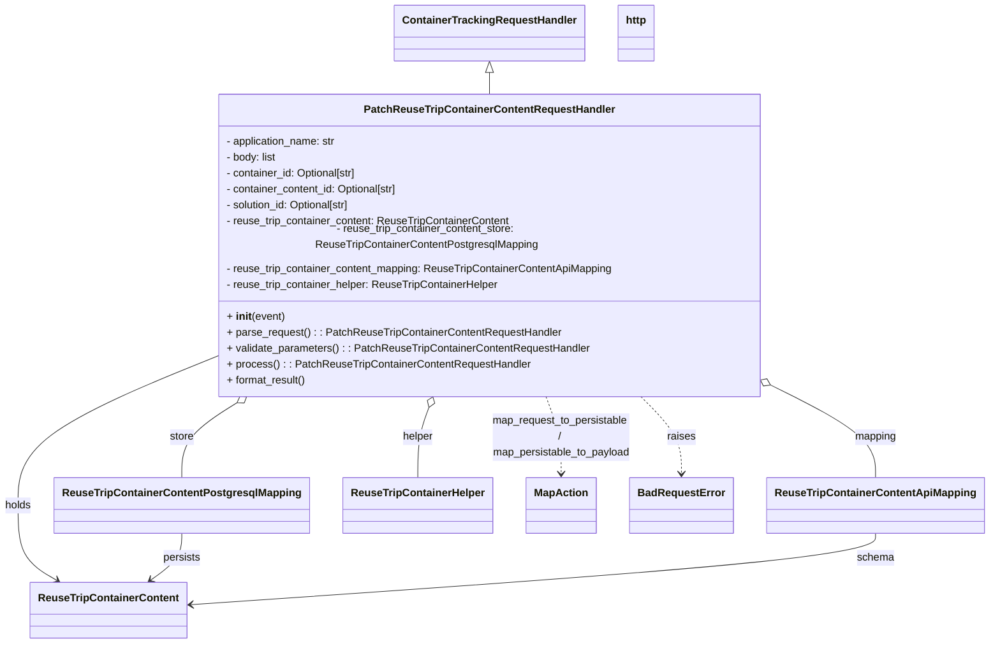
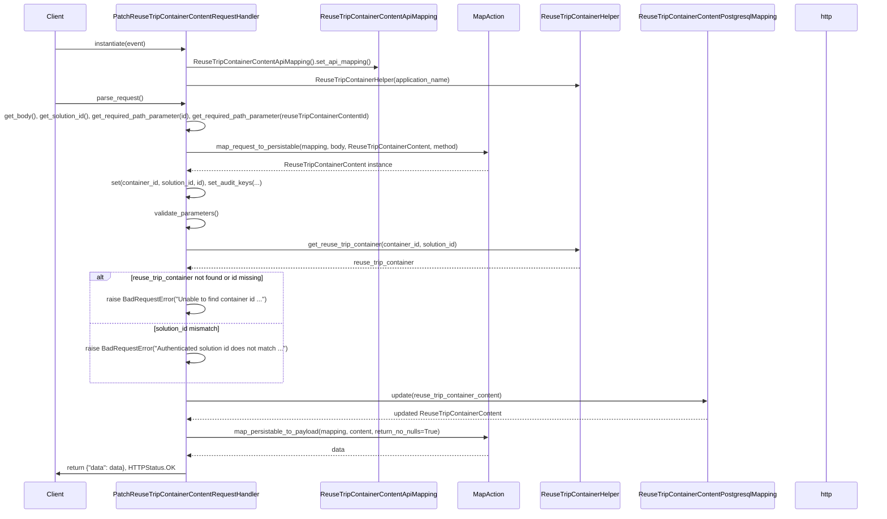

# Diagram: container_tracking_core/container_tracking_service/container_tracking_service/api/reuse_trip_container_content/handlers/patch_reuse_trip_container_content_handler.py

> Auto-generated by Obscura crawlers

## Diagram 1

> SVG rendering failed for this diagram.

## Diagram 2

> SVG rendering failed for this diagram.
