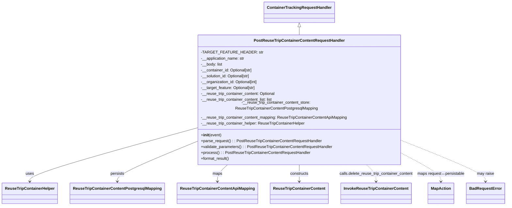

# Diagram: container_tracking_core/container_tracking_service/container_tracking_service/api/reuse_trip_container_content/handlers/post_reuse_trip_container_content_handler.py


> Auto-generated by Obscura crawlers

## Diagram 1



> SVG rendering failed for this diagram.

## Diagram 2

```mermaid
flowchart TD
Start([Start]) --> ParseRequest[Parse request: get_body, path id, headers]
ParseRequest --> ValidateParameters[Validate parameters: body must be dict or list; status/value checks]
ValidateParameters -->|invalid body or missing fields| BadRequest1([BadRequestError: invalid request body])
ValidateParameters -->|valid| GetContainer[Get reuse trip container via ReuseTripContainerHelper.get_reuse_trip_container]
GetContainer -->|not found or no id| BadRequest2([BadRequestError: container not found])
GetContainer -->|solution id mismatch| BadRequest3([BadRequestError: solution id mismatch])
GetContainer -->|found and ok| DeleteExisting[InvokeReuseTripContainerContent.delete_reuse_trip_container_content(container_id, organization_id, target_feature)]
DeleteExisting --> DecisionBody{Body type?}
DecisionBody -->|dict| DictFlow[MapAction.map_request_to_persistable -> set container_id/solution_id]
DecisionBody -->|list| ListFlow[For each item: MapAction.map_request_to_persistable -> set container_id/solution_id -> append list]
DictFlow -->|valid| WriteSingle[__reuse_trip_container_content_store.write(single)]
DictFlow -->|invalid| BadRequest4([BadRequestError: invalid content])
ListFlow -->|non-empty| WriteBatch[__reuse_trip_container_content_store.write_batch(list)]
WriteSingle --> FormatResult[MapAction.map_persistable_to_payload -> payload {'data': ...}]
WriteBatch --> FormatResult
FormatResult --> Return([Return payload, HTTP 200])
```

> SVG rendering failed for this diagram.
