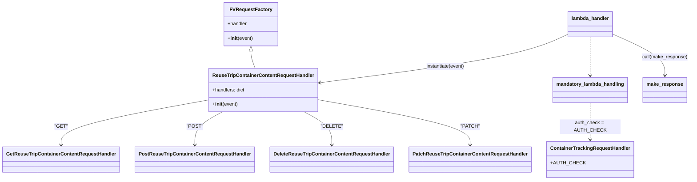
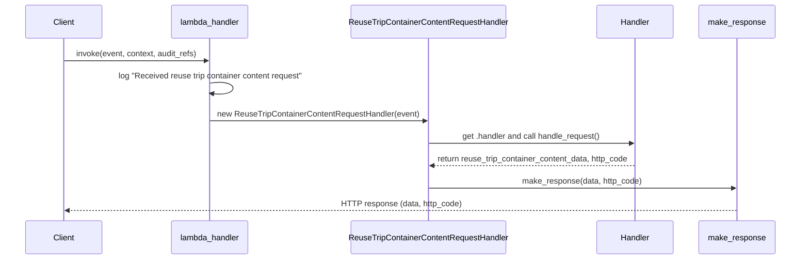

# Diagram: container_tracking_core/container_tracking_service/container_tracking_service/api/reuse_trip_container_content/reuse_trip_container_content_handler.py

> Auto-generated by Obscura crawlers

## Diagram 1

### SVG

<svg id="container" width="2187.5546875" xmlns="http://www.w3.org/2000/svg" class="classDiagram" height="572" viewBox="0 0 2187.5546875 572" role="graphics-document document" aria-roledescription="class"><g><defs><marker id="container_class-aggregationStart" class="marker aggregation class" refX="18" refY="7" markerWidth="190" markerHeight="240" orient="auto"><path d="M 18,7 L9,13 L1,7 L9,1 Z"></path></marker></defs><defs><marker id="container_class-aggregationEnd" class="marker aggregation class" refX="1" refY="7" markerWidth="20" markerHeight="28" orient="auto"><path d="M 18,7 L9,13 L1,7 L9,1 Z"></path></marker></defs><defs><marker id="container_class-extensionStart" class="marker extension class" refX="18" refY="7" markerWidth="190" markerHeight="240" orient="auto"><path d="M 1,7 L18,13 V 1 Z"></path></marker></defs><defs><marker id="container_class-extensionEnd" class="marker extension class" refX="1" refY="7" markerWidth="20" markerHeight="28" orient="auto"><path d="M 1,1 V 13 L18,7 Z"></path></marker></defs><defs><marker id="container_class-compositionStart" class="marker composition class" refX="18" refY="7" markerWidth="190" markerHeight="240" orient="auto"><path d="M 18,7 L9,13 L1,7 L9,1 Z"></path></marker></defs><defs><marker id="container_class-compositionEnd" class="marker composition class" refX="1" refY="7" markerWidth="20" markerHeight="28" orient="auto"><path d="M 18,7 L9,13 L1,7 L9,1 Z"></path></marker></defs><defs><marker id="container_class-dependencyStart" class="marker dependency class" refX="6" refY="7" markerWidth="190" markerHeight="240" orient="auto"><path d="M 5,7 L9,13 L1,7 L9,1 Z"></path></marker></defs><defs><marker id="container_class-dependencyEnd" class="marker dependency class" refX="13" refY="7" markerWidth="20" markerHeight="28" orient="auto"><path d="M 18,7 L9,13 L14,7 L9,1 Z"></path></marker></defs><defs><marker id="container_class-lollipopStart" class="marker lollipop class" refX="13" refY="7" markerWidth="190" markerHeight="240" orient="auto"><circle stroke="black" fill="transparent" cx="7" cy="7" r="6"></circle></marker></defs><defs><marker id="container_class-lollipopEnd" class="marker lollipop class" refX="1" refY="7" markerWidth="190" markerHeight="240" orient="auto"><circle stroke="black" fill="transparent" cx="7" cy="7" r="6"></circle></marker></defs><g class="root"><g class="clusters"></g><g class="edgePaths"><path d="M789.68,169.25L789.68,172.542C789.68,175.833,789.68,182.417,792.071,191.875C794.462,201.333,799.244,213.667,801.636,219.833L804.027,226" id="id_FVRequestFactory_ReuseTripContainerContentRequestHandler_1" class="edge-thickness-normal edge-pattern-solid relation" style=";;;" data-edge="true" data-et="edge" data-id="id_FVRequestFactory_ReuseTripContainerContentRequestHandler_1" data-points="W3sieCI6Nzg5LjY3OTY4NzUsInkiOjE1Mn0seyJ4Ijo3ODkuNjc5Njg3NSwieSI6MTg5fSx7IngiOjgwNC4wMjY3MzQ1MTgzNDg2LCJ5IjoyMjZ9XQ==" marker-start="url(#container_class-extensionStart)"></path><path d="M660.078,327.298L582.154,340.582C504.229,353.865,348.38,380.433,270.456,401.883C192.531,423.333,192.531,439.667,192.531,447.833L192.531,456" id="id_ReuseTripContainerContentRequestHandler_GetReuseTripContainerContentRequestHandler_2" class="edge-thickness-normal edge-pattern-solid relation" style=";;;" data-edge="true" data-et="edge" data-id="id_ReuseTripContainerContentRequestHandler_GetReuseTripContainerContentRequestHandler_2" data-points="W3sieCI6NjYwLjA3ODEyNSwieSI6MzI3LjI5Nzk1MzQ0ODU5MTg0fSx7IngiOjE5Mi41MzEyNSwieSI6NDA3fSx7IngiOjE5Mi41MzEyNSwieSI6NDYyfV0=" marker-end="url(#container_class-dependencyEnd)"></path><path d="M688.719,370L676.452,376.167C664.185,382.333,639.651,394.667,627.384,409C615.117,423.333,615.117,439.667,615.117,447.833L615.117,456" id="id_ReuseTripContainerContentRequestHandler_PostReuseTripContainerContentRequestHandler_3" class="edge-thickness-normal edge-pattern-solid relation" style=";;;" data-edge="true" data-et="edge" data-id="id_ReuseTripContainerContentRequestHandler_PostReuseTripContainerContentRequestHandler_3" data-points="W3sieCI6Njg4LjcxOTM5NTA2ODgwNzMsInkiOjM3MH0seyJ4Ijo2MTUuMTE3MTg3NSwieSI6NDA3fSx7IngiOjYxNS4xMTcxODc1LCJ5Ijo0NjJ9XQ==" marker-end="url(#container_class-dependencyEnd)"></path><path d="M975.171,370L987.438,376.167C999.705,382.333,1024.239,394.667,1036.506,409C1048.773,423.333,1048.773,439.667,1048.773,447.833L1048.773,456" id="id_ReuseTripContainerContentRequestHandler_DeleteReuseTripContainerContentRequestHandler_4" class="edge-thickness-normal edge-pattern-solid relation" style=";;;" data-edge="true" data-et="edge" data-id="id_ReuseTripContainerContentRequestHandler_DeleteReuseTripContainerContentRequestHandler_4" data-points="W3sieCI6OTc1LjE3MTIyOTkzMTE5MjcsInkiOjM3MH0seyJ4IjoxMDQ4Ljc3MzQzNzUsInkiOjQwN30seyJ4IjoxMDQ4Ljc3MzQzNzUsInkiOjQ2Mn1d" marker-end="url(#container_class-dependencyEnd)"></path><path d="M1003.813,326.624L1084.245,340.02C1164.677,353.416,1325.542,380.208,1405.974,401.771C1486.406,423.333,1486.406,439.667,1486.406,447.833L1486.406,456" id="id_ReuseTripContainerContentRequestHandler_PatchReuseTripContainerContentRequestHandler_5" class="edge-thickness-normal edge-pattern-solid relation" style=";;;" data-edge="true" data-et="edge" data-id="id_ReuseTripContainerContentRequestHandler_PatchReuseTripContainerContentRequestHandler_5" data-points="W3sieCI6MTAwMy44MTI1LCJ5IjozMjYuNjI0MzU2ODc3Njc4NDV9LHsieCI6MTQ4Ni40MDYyNSwieSI6NDA3fSx7IngiOjE0ODYuNDA2MjUsInkiOjQ2Mn1d" marker-end="url(#container_class-dependencyEnd)"></path><path d="M1866.023,122L1866.023,133.167C1866.023,144.333,1866.023,166.667,1866.023,188C1866.023,209.333,1866.023,229.667,1866.023,239.833L1866.023,250" id="id_lambda_handler_mandatory_lambda_handling_6" class="edge-thickness-normal edge-pattern-dashed relation" style=";;;" data-edge="true" data-et="edge" data-id="id_lambda_handler_mandatory_lambda_handling_6" data-points="W3sieCI6MTg2Ni4wMjM0Mzc1LCJ5IjoxMjJ9LHsieCI6MTg2Ni4wMjM0Mzc1LCJ5IjoxODl9LHsieCI6MTg2Ni4wMjM0Mzc1LCJ5IjoyNTZ9XQ==" marker-end="url(#container_class-dependencyEnd)"></path><path d="M1866.023,340L1866.023,351.167C1866.023,362.333,1866.023,384.667,1866.023,401C1866.023,417.333,1866.023,427.667,1866.023,432.833L1866.023,438" id="id_mandatory_lambda_handling_ContainerTrackingRequestHandler_7" class="edge-thickness-normal edge-pattern-dashed relation" style=";;;" data-edge="true" data-et="edge" data-id="id_mandatory_lambda_handling_ContainerTrackingRequestHandler_7" data-points="W3sieCI6MTg2Ni4wMjM0Mzc1LCJ5IjozNDB9LHsieCI6MTg2Ni4wMjM0Mzc1LCJ5Ijo0MDd9LHsieCI6MTg2Ni4wMjM0Mzc1LCJ5Ijo0NDR9XQ==" marker-end="url(#container_class-dependencyEnd)"></path><path d="M1794.047,113.806L1767.364,126.338C1740.681,138.871,1687.315,163.935,1556.6,190.607C1425.885,217.278,1217.822,245.556,1113.79,259.695L1009.758,273.834" id="id_lambda_handler_ReuseTripContainerContentRequestHandler_8" class="edge-thickness-normal edge-pattern-solid relation" style=";;;" data-edge="true" data-et="edge" data-id="id_lambda_handler_ReuseTripContainerContentRequestHandler_8" data-points="W3sieCI6MTc5NC4wNDY4NzUsInkiOjExMy44MDU3NTk4NzYxMTcyMX0seyJ4IjoxNjMzLjk0OTIxODc1LCJ5IjoxODl9LHsieCI6MTAwMy44MTI1LCJ5IjoyNzQuNjQxNjA1NzQzNDI1OX1d" marker-end="url(#container_class-dependencyEnd)"></path><path d="M1938,112.84L1965.82,125.533C1993.641,138.227,2049.281,163.613,2077.102,186.473C2104.922,209.333,2104.922,229.667,2104.922,239.833L2104.922,250" id="id_lambda_handler_make_response_9" class="edge-thickness-normal edge-pattern-solid relation" style=";;;" data-edge="true" data-et="edge" data-id="id_lambda_handler_make_response_9" data-points="W3sieCI6MTkzOCwieSI6MTEyLjg0MDA4NjMzMzc1ODQ2fSx7IngiOjIxMDQuOTIxODc1LCJ5IjoxODl9LHsieCI6MjEwNC45MjE4NzUsInkiOjI1Nn1d" marker-end="url(#container_class-dependencyEnd)"></path></g><g class="edgeLabels"><g class="edgeLabel"><g class="label" data-id="id_FVRequestFactory_ReuseTripContainerContentRequestHandler_1" transform="translate(0, 0)"><foreignObject width="0" height="0">

</foreignObject></g></g><g class="edgeLabel" transform="translate(192.53125, 407)"><g class="label" data-id="id_ReuseTripContainerContentRequestHandler_GetReuseTripContainerContentRequestHandler_2" transform="translate(-19.9296875, -12)"><foreignObject width="39.859375" height="24">

"GET"

</foreignObject></g></g><g class="edgeLabel" transform="translate(615.1171875, 407)"><g class="label" data-id="id_ReuseTripContainerContentRequestHandler_PostReuseTripContainerContentRequestHandler_3" transform="translate(-24.96875, -12)"><foreignObject width="49.9375" height="24">

"POST"

</foreignObject></g></g><g class="edgeLabel" transform="translate(1048.7734375, 407)"><g class="label" data-id="id_ReuseTripContainerContentRequestHandler_DeleteReuseTripContainerContentRequestHandler_4" transform="translate(-32.5, -12)"><foreignObject width="65" height="24">

"DELETE"

</foreignObject></g></g><g class="edgeLabel" transform="translate(1486.40625, 407)"><g class="label" data-id="id_ReuseTripContainerContentRequestHandler_PatchReuseTripContainerContentRequestHandler_5" transform="translate(-28.515625, -12)"><foreignObject width="57.03125" height="24">

"PATCH"

</foreignObject></g></g><g class="edgeLabel"><g class="label" data-id="id_lambda_handler_mandatory_lambda_handling_6" transform="translate(0, 0)"><foreignObject width="0" height="0">

</foreignObject></g></g><g class="edgeLabel" transform="translate(1866.0234375, 407)"><g class="label" data-id="id_mandatory_lambda_handling_ContainerTrackingRequestHandler_7" transform="translate(-96.1328125, -12)"><foreignObject width="192.265625" height="24">

auth_check = AUTH_CHECK

</foreignObject></g></g><g class="edgeLabel" transform="translate(1406.51366, 219.91067)"><g class="label" data-id="id_lambda_handler_ReuseTripContainerContentRequestHandler_8" transform="translate(-64.53125, -12)"><foreignObject width="129.0625" height="24">

instantiate(event)

</foreignObject></g></g><g class="edgeLabel" transform="translate(2104.921875, 189)"><g class="label" data-id="id_lambda_handler_make_response_9" transform="translate(-74.6328125, -12)"><foreignObject width="149.265625" height="24">

call(make_response)

</foreignObject></g></g></g><g class="nodes"><g class="node default" id="classId-FVRequestFactory-0" transform="translate(789.6796875, 80)"><g class="basic label-container"><path d="M-86.08984375 -72 L86.08984375 -72 L86.08984375 72 L-86.08984375 72" stroke="none" stroke-width="0" fill="#ECECFF" style=""></path><path d="M-86.08984375 -72 C-48.328328037681565 -72, -10.56681232536313 -72, 86.08984375 -72 M-86.08984375 -72 C-43.469813665500276 -72, -0.8497835810005512 -72, 86.08984375 -72 M86.08984375 -72 C86.08984375 -40.28123568095842, 86.08984375 -8.562471361916828, 86.08984375 72 M86.08984375 -72 C86.08984375 -40.41193812961257, 86.08984375 -8.823876259225145, 86.08984375 72 M86.08984375 72 C31.735789824259925 72, -22.61826410148015 72, -86.08984375 72 M86.08984375 72 C43.83159790928137 72, 1.5733520685627411 72, -86.08984375 72 M-86.08984375 72 C-86.08984375 40.92286499687397, -86.08984375 9.845729993747938, -86.08984375 -72 M-86.08984375 72 C-86.08984375 39.030696586542504, -86.08984375 6.061393173085008, -86.08984375 -72" stroke="#9370DB" stroke-width="1.3" fill="none" stroke-dasharray="0 0" style=""></path></g><g class="annotation-group text" transform="translate(0, -48)"></g><g class="label-group text" transform="translate(-65.0390625, -48)"><g class="label" style="font-weight: bolder" transform="translate(0,-12)"><foreignObject width="130.078125" height="24">

FVRequestFactory

</foreignObject></g></g><g class="members-group text" transform="translate(-74.08984375, 0)"><g class="label" style="" transform="translate(0,-12)"><foreignObject width="64.515625" height="24">

+handler

</foreignObject></g></g><g class="methods-group text" transform="translate(-74.08984375, 48)"><g class="label" style="" transform="translate(0,-12)"><foreignObject width="83.140625" height="24">

+<strong>init</strong>(event)

</foreignObject></g></g><g class="divider" style=""><path d="M-86.08984375 -24 C-48.35653430579987 -24, -10.623224861599738 -24, 86.08984375 -24 M-86.08984375 -24 C-33.2525392752491 -24, 19.584765199501803 -24, 86.08984375 -24" stroke="#9370DB" stroke-width="1.3" fill="none" stroke-dasharray="0 0" style=""></path></g><g class="divider" style=""><path d="M-86.08984375 24 C-34.45659267188994 24, 17.176658406220113 24, 86.08984375 24 M-86.08984375 24 C-19.800543190183234 24, 46.48875736963353 24, 86.08984375 24" stroke="#9370DB" stroke-width="1.3" fill="none" stroke-dasharray="0 0" style=""></path></g></g><g class="node default" id="classId-ReuseTripContainerContentRequestHandler-1" transform="translate(831.9453125, 298)"><g class="basic label-container"><path d="M-171.8671875 -72 L171.8671875 -72 L171.8671875 72 L-171.8671875 72" stroke="none" stroke-width="0" fill="#ECECFF" style=""></path><path d="M-171.8671875 -72 C-56.3190798168834 -72, 59.229027866233196 -72, 171.8671875 -72 M-171.8671875 -72 C-68.4995806973746 -72, 34.868026105250806 -72, 171.8671875 -72 M171.8671875 -72 C171.8671875 -35.713724813343, 171.8671875 0.5725503733140016, 171.8671875 72 M171.8671875 -72 C171.8671875 -28.663049730250798, 171.8671875 14.673900539498405, 171.8671875 72 M171.8671875 72 C61.98168230197277 72, -47.903822896054464 72, -171.8671875 72 M171.8671875 72 C65.07910506440504 72, -41.70897737118992 72, -171.8671875 72 M-171.8671875 72 C-171.8671875 29.79781579124903, -171.8671875 -12.404368417501942, -171.8671875 -72 M-171.8671875 72 C-171.8671875 29.78600207980596, -171.8671875 -12.427995840388078, -171.8671875 -72" stroke="#9370DB" stroke-width="1.3" fill="none" stroke-dasharray="0 0" style=""></path></g><g class="annotation-group text" transform="translate(0, -48)"></g><g class="label-group text" transform="translate(-159.8671875, -48)"><g class="label" style="font-weight: bolder" transform="translate(0,-12)"><foreignObject width="319.734375" height="24">

ReuseTripContainerContentRequestHandler

</foreignObject></g></g><g class="members-group text" transform="translate(-159.8671875, 0)"><g class="label" style="" transform="translate(0,-12)"><foreignObject width="107.34375" height="24">

+handlers: dict

</foreignObject></g></g><g class="methods-group text" transform="translate(-159.8671875, 48)"><g class="label" style="" transform="translate(0,-12)"><foreignObject width="83.140625" height="24">

+<strong>init</strong>(event)

</foreignObject></g></g><g class="divider" style=""><path d="M-171.8671875 -24 C-47.676268290949295 -24, 76.51465091810141 -24, 171.8671875 -24 M-171.8671875 -24 C-52.00865739656345 -24, 67.8498727068731 -24, 171.8671875 -24" stroke="#9370DB" stroke-width="1.3" fill="none" stroke-dasharray="0 0" style=""></path></g><g class="divider" style=""><path d="M-171.8671875 24 C-36.07312379523452 24, 99.72093990953095 24, 171.8671875 24 M-171.8671875 24 C-51.63948703014823 24, 68.58821343970354 24, 171.8671875 24" stroke="#9370DB" stroke-width="1.3" fill="none" stroke-dasharray="0 0" style=""></path></g></g><g class="node default" id="classId-GetReuseTripContainerContentRequestHandler-2" transform="translate(192.53125, 504)"><g class="basic label-container"><path d="M-184.53125 -42 L184.53125 -42 L184.53125 42 L-184.53125 42" stroke="none" stroke-width="0" fill="#ECECFF" style=""></path><path d="M-184.53125 -42 C-107.03107611161974 -42, -29.53090222323948 -42, 184.53125 -42 M-184.53125 -42 C-82.89875977985426 -42, 18.73373044029148 -42, 184.53125 -42 M184.53125 -42 C184.53125 -17.210899687154303, 184.53125 7.5782006256913945, 184.53125 42 M184.53125 -42 C184.53125 -21.900939279067284, 184.53125 -1.8018785581345682, 184.53125 42 M184.53125 42 C109.03128380184789 42, 33.53131760369578 42, -184.53125 42 M184.53125 42 C44.22761515610691 42, -96.07601968778619 42, -184.53125 42 M-184.53125 42 C-184.53125 24.773869224160077, -184.53125 7.547738448320153, -184.53125 -42 M-184.53125 42 C-184.53125 22.942648640248287, -184.53125 3.885297280496573, -184.53125 -42" stroke="#9370DB" stroke-width="1.3" fill="none" stroke-dasharray="0 0" style=""></path></g><g class="annotation-group text" transform="translate(0, -18)"></g><g class="label-group text" transform="translate(-172.53125, -18)"><g class="label" style="font-weight: bolder" transform="translate(0,-12)"><foreignObject width="345.0625" height="24">

GetReuseTripContainerContentRequestHandler

</foreignObject></g></g><g class="members-group text" transform="translate(-172.53125, 30)"></g><g class="methods-group text" transform="translate(-172.53125, 60)"></g><g class="divider" style=""><path d="M-184.53125 6 C-96.73555463257351 6, -8.939859265147021 6, 184.53125 6 M-184.53125 6 C-90.41800284166257 6, 3.6952443166748594 6, 184.53125 6" stroke="#9370DB" stroke-width="1.3" fill="none" stroke-dasharray="0 0" style=""></path></g><g class="divider" style=""><path d="M-184.53125 24 C-83.80708426279934 24, 16.91708147440133 24, 184.53125 24 M-184.53125 24 C-45.58210270253721 24, 93.36704459492557 24, 184.53125 24" stroke="#9370DB" stroke-width="1.3" fill="none" stroke-dasharray="0 0" style=""></path></g></g><g class="node default" id="classId-PostReuseTripContainerContentRequestHandler-3" transform="translate(615.1171875, 504)"><g class="basic label-container"><path d="M-188.0546875 -42 L188.0546875 -42 L188.0546875 42 L-188.0546875 42" stroke="none" stroke-width="0" fill="#ECECFF" style=""></path><path d="M-188.0546875 -42 C-75.21175252534067 -42, 37.63118244931866 -42, 188.0546875 -42 M-188.0546875 -42 C-66.27973127621479 -42, 55.49522494757042 -42, 188.0546875 -42 M188.0546875 -42 C188.0546875 -8.618820846024995, 188.0546875 24.76235830795001, 188.0546875 42 M188.0546875 -42 C188.0546875 -20.016185271808027, 188.0546875 1.9676294563839463, 188.0546875 42 M188.0546875 42 C40.71330308057685 42, -106.6280813388463 42, -188.0546875 42 M188.0546875 42 C64.87591784297054 42, -58.302851814058926 42, -188.0546875 42 M-188.0546875 42 C-188.0546875 21.35056872110599, -188.0546875 0.70113744221198, -188.0546875 -42 M-188.0546875 42 C-188.0546875 12.302564724712006, -188.0546875 -17.394870550575988, -188.0546875 -42" stroke="#9370DB" stroke-width="1.3" fill="none" stroke-dasharray="0 0" style=""></path></g><g class="annotation-group text" transform="translate(0, -18)"></g><g class="label-group text" transform="translate(-176.0546875, -18)"><g class="label" style="font-weight: bolder" transform="translate(0,-12)"><foreignObject width="352.109375" height="24">

PostReuseTripContainerContentRequestHandler

</foreignObject></g></g><g class="members-group text" transform="translate(-176.0546875, 30)"></g><g class="methods-group text" transform="translate(-176.0546875, 60)"></g><g class="divider" style=""><path d="M-188.0546875 6 C-91.59190331034524 6, 4.87088087930951 6, 188.0546875 6 M-188.0546875 6 C-98.28771792654994 6, -8.52074835309989 6, 188.0546875 6" stroke="#9370DB" stroke-width="1.3" fill="none" stroke-dasharray="0 0" style=""></path></g><g class="divider" style=""><path d="M-188.0546875 24 C-52.530237068122915 24, 82.99421336375417 24, 188.0546875 24 M-188.0546875 24 C-60.84054002927685 24, 66.3736074414463 24, 188.0546875 24" stroke="#9370DB" stroke-width="1.3" fill="none" stroke-dasharray="0 0" style=""></path></g></g><g class="node default" id="classId-DeleteReuseTripContainerContentRequestHandler-4" transform="translate(1048.7734375, 504)"><g class="basic label-container"><path d="M-195.6015625 -42 L195.6015625 -42 L195.6015625 42 L-195.6015625 42" stroke="none" stroke-width="0" fill="#ECECFF" style=""></path><path d="M-195.6015625 -42 C-72.57446246492455 -42, 50.4526375701509 -42, 195.6015625 -42 M-195.6015625 -42 C-77.39914675391807 -42, 40.80326899216385 -42, 195.6015625 -42 M195.6015625 -42 C195.6015625 -14.317006828718856, 195.6015625 13.365986342562287, 195.6015625 42 M195.6015625 -42 C195.6015625 -15.69082850223949, 195.6015625 10.618342995521019, 195.6015625 42 M195.6015625 42 C102.81089584929204 42, 10.020229198584076 42, -195.6015625 42 M195.6015625 42 C45.225277263364234 42, -105.15100797327153 42, -195.6015625 42 M-195.6015625 42 C-195.6015625 8.5806496906092, -195.6015625 -24.8387006187816, -195.6015625 -42 M-195.6015625 42 C-195.6015625 11.522538787287402, -195.6015625 -18.954922425425195, -195.6015625 -42" stroke="#9370DB" stroke-width="1.3" fill="none" stroke-dasharray="0 0" style=""></path></g><g class="annotation-group text" transform="translate(0, -18)"></g><g class="label-group text" transform="translate(-183.6015625, -18)"><g class="label" style="font-weight: bolder" transform="translate(0,-12)"><foreignObject width="367.203125" height="24">

DeleteReuseTripContainerContentRequestHandler

</foreignObject></g></g><g class="members-group text" transform="translate(-183.6015625, 30)"></g><g class="methods-group text" transform="translate(-183.6015625, 60)"></g><g class="divider" style=""><path d="M-195.6015625 6 C-63.045112950476835 6, 69.51133659904633 6, 195.6015625 6 M-195.6015625 6 C-82.87688250328947 6, 29.84779749342107 6, 195.6015625 6" stroke="#9370DB" stroke-width="1.3" fill="none" stroke-dasharray="0 0" style=""></path></g><g class="divider" style=""><path d="M-195.6015625 24 C-80.52925966664782 24, 34.543043166704365 24, 195.6015625 24 M-195.6015625 24 C-55.47286136382567 24, 84.65583977234866 24, 195.6015625 24" stroke="#9370DB" stroke-width="1.3" fill="none" stroke-dasharray="0 0" style=""></path></g></g><g class="node default" id="classId-PatchReuseTripContainerContentRequestHandler-5" transform="translate(1486.40625, 504)"><g class="basic label-container"><path d="M-192.03125 -42 L192.03125 -42 L192.03125 42 L-192.03125 42" stroke="none" stroke-width="0" fill="#ECECFF" style=""></path><path d="M-192.03125 -42 C-75.44939429628803 -42, 41.13246140742393 -42, 192.03125 -42 M-192.03125 -42 C-67.29441925516498 -42, 57.442411489670036 -42, 192.03125 -42 M192.03125 -42 C192.03125 -14.201581616523622, 192.03125 13.596836766952755, 192.03125 42 M192.03125 -42 C192.03125 -18.411504590538893, 192.03125 5.176990818922214, 192.03125 42 M192.03125 42 C73.71361620278563 42, -44.60401759442874 42, -192.03125 42 M192.03125 42 C56.64896405379449 42, -78.73332189241103 42, -192.03125 42 M-192.03125 42 C-192.03125 14.78441468638701, -192.03125 -12.431170627225981, -192.03125 -42 M-192.03125 42 C-192.03125 14.06440841524514, -192.03125 -13.87118316950972, -192.03125 -42" stroke="#9370DB" stroke-width="1.3" fill="none" stroke-dasharray="0 0" style=""></path></g><g class="annotation-group text" transform="translate(0, -18)"></g><g class="label-group text" transform="translate(-180.03125, -18)"><g class="label" style="font-weight: bolder" transform="translate(0,-12)"><foreignObject width="360.0625" height="24">

PatchReuseTripContainerContentRequestHandler

</foreignObject></g></g><g class="members-group text" transform="translate(-180.03125, 30)"></g><g class="methods-group text" transform="translate(-180.03125, 60)"></g><g class="divider" style=""><path d="M-192.03125 6 C-75.39029149648151 6, 41.25066700703698 6, 192.03125 6 M-192.03125 6 C-97.85031622918484 6, -3.6693824583696824 6, 192.03125 6" stroke="#9370DB" stroke-width="1.3" fill="none" stroke-dasharray="0 0" style=""></path></g><g class="divider" style=""><path d="M-192.03125 24 C-63.71901310394986 24, 64.59322379210028 24, 192.03125 24 M-192.03125 24 C-104.9749103755098 24, -17.918570751019587 24, 192.03125 24" stroke="#9370DB" stroke-width="1.3" fill="none" stroke-dasharray="0 0" style=""></path></g></g><g class="node default" id="classId-ContainerTrackingRequestHandler-6" transform="translate(1866.0234375, 504)"><g class="basic label-container"><path d="M-137.5859375 -60 L137.5859375 -60 L137.5859375 60 L-137.5859375 60" stroke="none" stroke-width="0" fill="#ECECFF" style=""></path><path d="M-137.5859375 -60 C-64.1521103053321 -60, 9.281716889335797 -60, 137.5859375 -60 M-137.5859375 -60 C-70.36546443798946 -60, -3.1449913759789183 -60, 137.5859375 -60 M137.5859375 -60 C137.5859375 -16.034536422123495, 137.5859375 27.93092715575301, 137.5859375 60 M137.5859375 -60 C137.5859375 -24.80016786417208, 137.5859375 10.399664271655837, 137.5859375 60 M137.5859375 60 C44.74031933545072 60, -48.10529882909856 60, -137.5859375 60 M137.5859375 60 C28.658006869123824 60, -80.26992376175235 60, -137.5859375 60 M-137.5859375 60 C-137.5859375 26.01512032127829, -137.5859375 -7.969759357443422, -137.5859375 -60 M-137.5859375 60 C-137.5859375 22.56419277663185, -137.5859375 -14.871614446736302, -137.5859375 -60" stroke="#9370DB" stroke-width="1.3" fill="none" stroke-dasharray="0 0" style=""></path></g><g class="annotation-group text" transform="translate(0, -36)"></g><g class="label-group text" transform="translate(-125.5859375, -36)"><g class="label" style="font-weight: bolder" transform="translate(0,-12)"><foreignObject width="251.171875" height="24">

ContainerTrackingRequestHandler

</foreignObject></g></g><g class="members-group text" transform="translate(-125.5859375, 12)"><g class="label" style="" transform="translate(0,-12)"><foreignObject width="100.859375" height="24">

+AUTH_CHECK

</foreignObject></g></g><g class="methods-group text" transform="translate(-125.5859375, 60)"></g><g class="divider" style=""><path d="M-137.5859375 -12 C-57.26273245826464 -12, 23.060472583470727 -12, 137.5859375 -12 M-137.5859375 -12 C-34.13643197514642 -12, 69.31307354970716 -12, 137.5859375 -12" stroke="#9370DB" stroke-width="1.3" fill="none" stroke-dasharray="0 0" style=""></path></g><g class="divider" style=""><path d="M-137.5859375 36 C-69.76070144281258 36, -1.9354653856251502 36, 137.5859375 36 M-137.5859375 36 C-44.97752224698726 36, 47.630893006025474 36, 137.5859375 36" stroke="#9370DB" stroke-width="1.3" fill="none" stroke-dasharray="0 0" style=""></path></g></g><g class="node default" id="classId-mandatory_lambda_handling-7" transform="translate(1866.0234375, 298)"><g class="basic label-container"><path d="M-119.4296875 -42 L119.4296875 -42 L119.4296875 42 L-119.4296875 42" stroke="none" stroke-width="0" fill="#ECECFF" style=""></path><path d="M-119.4296875 -42 C-31.81388140856326 -42, 55.80192468287348 -42, 119.4296875 -42 M-119.4296875 -42 C-40.7155499048239 -42, 37.998587690352196 -42, 119.4296875 -42 M119.4296875 -42 C119.4296875 -22.077695262317672, 119.4296875 -2.1553905246353438, 119.4296875 42 M119.4296875 -42 C119.4296875 -19.177073395987218, 119.4296875 3.6458532080255637, 119.4296875 42 M119.4296875 42 C46.30567665579402 42, -26.818334188411967 42, -119.4296875 42 M119.4296875 42 C65.38361289748538 42, 11.337538294970756 42, -119.4296875 42 M-119.4296875 42 C-119.4296875 22.850044079245553, -119.4296875 3.7000881584911056, -119.4296875 -42 M-119.4296875 42 C-119.4296875 13.706768742173878, -119.4296875 -14.586462515652244, -119.4296875 -42" stroke="#9370DB" stroke-width="1.3" fill="none" stroke-dasharray="0 0" style=""></path></g><g class="annotation-group text" transform="translate(0, -18)"></g><g class="label-group text" transform="translate(-107.4296875, -18)"><g class="label" style="font-weight: bolder" transform="translate(0,-12)"><foreignObject width="214.859375" height="24">

mandatory_lambda_handling

</foreignObject></g></g><g class="members-group text" transform="translate(-107.4296875, 30)"></g><g class="methods-group text" transform="translate(-107.4296875, 60)"></g><g class="divider" style=""><path d="M-119.4296875 6 C-37.116089902373375 6, 45.19750769525325 6, 119.4296875 6 M-119.4296875 6 C-30.576414452597334 6, 58.27685859480533 6, 119.4296875 6" stroke="#9370DB" stroke-width="1.3" fill="none" stroke-dasharray="0 0" style=""></path></g><g class="divider" style=""><path d="M-119.4296875 24 C-67.9290356418276 24, -16.42838378365518 24, 119.4296875 24 M-119.4296875 24 C-47.52046931748805 24, 24.3887488650239 24, 119.4296875 24" stroke="#9370DB" stroke-width="1.3" fill="none" stroke-dasharray="0 0" style=""></path></g></g><g class="node default" id="classId-make_response-8" transform="translate(2104.921875, 298)"><g class="basic label-container"><path d="M-69.46875 -42 L69.46875 -42 L69.46875 42 L-69.46875 42" stroke="none" stroke-width="0" fill="#ECECFF" style=""></path><path d="M-69.46875 -42 C-16.505701610213222 -42, 36.457346779573555 -42, 69.46875 -42 M-69.46875 -42 C-34.885116695984536 -42, -0.3014833919690716 -42, 69.46875 -42 M69.46875 -42 C69.46875 -12.126001221199417, 69.46875 17.747997557601167, 69.46875 42 M69.46875 -42 C69.46875 -20.529377712963715, 69.46875 0.9412445740725701, 69.46875 42 M69.46875 42 C37.09241628176531 42, 4.71608256353062 42, -69.46875 42 M69.46875 42 C38.21022566272707 42, 6.951701325454145 42, -69.46875 42 M-69.46875 42 C-69.46875 20.513498866877697, -69.46875 -0.9730022662446061, -69.46875 -42 M-69.46875 42 C-69.46875 16.896120985019074, -69.46875 -8.207758029961852, -69.46875 -42" stroke="#9370DB" stroke-width="1.3" fill="none" stroke-dasharray="0 0" style=""></path></g><g class="annotation-group text" transform="translate(0, -18)"></g><g class="label-group text" transform="translate(-57.46875, -18)"><g class="label" style="font-weight: bolder" transform="translate(0,-12)"><foreignObject width="114.9375" height="24">

make_response

</foreignObject></g></g><g class="members-group text" transform="translate(-57.46875, 30)"></g><g class="methods-group text" transform="translate(-57.46875, 60)"></g><g class="divider" style=""><path d="M-69.46875 6 C-38.39815837349222 6, -7.327566746984445 6, 69.46875 6 M-69.46875 6 C-17.640405852122157 6, 34.187938295755686 6, 69.46875 6" stroke="#9370DB" stroke-width="1.3" fill="none" stroke-dasharray="0 0" style=""></path></g><g class="divider" style=""><path d="M-69.46875 24 C-39.39270639950678 24, -9.316662799013564 24, 69.46875 24 M-69.46875 24 C-37.87721635554852 24, -6.285682711097039 24, 69.46875 24" stroke="#9370DB" stroke-width="1.3" fill="none" stroke-dasharray="0 0" style=""></path></g></g><g class="node default" id="classId-lambda_handler-9" transform="translate(1866.0234375, 80)"><g class="basic label-container"><path d="M-71.9765625 -42 L71.9765625 -42 L71.9765625 42 L-71.9765625 42" stroke="none" stroke-width="0" fill="#ECECFF" style=""></path><path d="M-71.9765625 -42 C-24.988387941425827 -42, 21.999786617148345 -42, 71.9765625 -42 M-71.9765625 -42 C-31.34055798655212 -42, 9.29544652689576 -42, 71.9765625 -42 M71.9765625 -42 C71.9765625 -12.964677847460937, 71.9765625 16.070644305078126, 71.9765625 42 M71.9765625 -42 C71.9765625 -23.234190251822138, 71.9765625 -4.468380503644276, 71.9765625 42 M71.9765625 42 C31.991078123647306 42, -7.994406252705389 42, -71.9765625 42 M71.9765625 42 C25.099842059841663 42, -21.776878380316674 42, -71.9765625 42 M-71.9765625 42 C-71.9765625 15.6701706888539, -71.9765625 -10.659658622292199, -71.9765625 -42 M-71.9765625 42 C-71.9765625 16.963200609864245, -71.9765625 -8.07359878027151, -71.9765625 -42" stroke="#9370DB" stroke-width="1.3" fill="none" stroke-dasharray="0 0" style=""></path></g><g class="annotation-group text" transform="translate(0, -18)"></g><g class="label-group text" transform="translate(-59.9765625, -18)"><g class="label" style="font-weight: bolder" transform="translate(0,-12)"><foreignObject width="119.953125" height="24">

lambda_handler

</foreignObject></g></g><g class="members-group text" transform="translate(-59.9765625, 30)"></g><g class="methods-group text" transform="translate(-59.9765625, 60)"></g><g class="divider" style=""><path d="M-71.9765625 6 C-31.0431606465932 6, 9.890241206813599 6, 71.9765625 6 M-71.9765625 6 C-23.404760945031484 6, 25.167040609937033 6, 71.9765625 6" stroke="#9370DB" stroke-width="1.3" fill="none" stroke-dasharray="0 0" style=""></path></g><g class="divider" style=""><path d="M-71.9765625 24 C-39.65920860048996 24, -7.341854700979923 24, 71.9765625 24 M-71.9765625 24 C-20.99249677037357 24, 29.99156895925286 24, 71.9765625 24" stroke="#9370DB" stroke-width="1.3" fill="none" stroke-dasharray="0 0" style=""></path></g></g></g></g></g></svg>

## Diagram 2

### SVG

<svg id="container" width="1686" xmlns="http://www.w3.org/2000/svg" height="537" viewBox="-50 -10 1686 537" role="graphics-document document" aria-roledescription="sequence"><g><rect x="1436" y="451" fill="#eaeaea" stroke="#666" width="150" height="65" name="MakeResponse" rx="3" ry="3" class="actor actor-bottom"></rect><text x="1511" y="483.5" dominant-baseline="central" alignment-baseline="central" class="actor actor-box" style="text-anchor: middle; font-size: 16px; font-weight: 400;"><tspan x="1511" dy="0">make_response</tspan></text></g><g><rect x="1236" y="451" fill="#eaeaea" stroke="#666" width="150" height="65" name="RequestHandler" rx="3" ry="3" class="actor actor-bottom"></rect><text x="1311" y="483.5" dominant-baseline="central" alignment-baseline="central" class="actor actor-box" style="text-anchor: middle; font-size: 16px; font-weight: 400;"><tspan x="1311" dy="0">Handler</tspan></text></g><g><rect x="688.5" y="451" fill="#eaeaea" stroke="#666" width="337" height="65" name="Reuse" rx="3" ry="3" class="actor actor-bottom"></rect><text x="857" y="483.5" dominant-baseline="central" alignment-baseline="central" class="actor actor-box" style="text-anchor: middle; font-size: 16px; font-weight: 400;"><tspan x="857" dy="0">ReuseTripContainerContentRequestHandler</tspan></text></g><g><rect x="312" y="451" fill="#eaeaea" stroke="#666" width="150" height="65" name="Lambda" rx="3" ry="3" class="actor actor-bottom"></rect><text x="387" y="483.5" dominant-baseline="central" alignment-baseline="central" class="actor actor-box" style="text-anchor: middle; font-size: 16px; font-weight: 400;"><tspan x="387" dy="0">lambda_handler</tspan></text></g><g><rect x="0" y="451" fill="#eaeaea" stroke="#666" width="150" height="65" name="Client" rx="3" ry="3" class="actor actor-bottom"></rect><text x="75" y="483.5" dominant-baseline="central" alignment-baseline="central" class="actor actor-box" style="text-anchor: middle; font-size: 16px; font-weight: 400;"><tspan x="75" dy="0">Client</tspan></text></g><g><line id="actor4" x1="1511" y1="65" x2="1511" y2="451" class="actor-line 200" stroke-width="0.5px" stroke="#999" name="MakeResponse"></line><g id="root-4"><rect x="1436" y="0" fill="#eaeaea" stroke="#666" width="150" height="65" name="MakeResponse" rx="3" ry="3" class="actor actor-top"></rect><text x="1511" y="32.5" dominant-baseline="central" alignment-baseline="central" class="actor actor-box" style="text-anchor: middle; font-size: 16px; font-weight: 400;"><tspan x="1511" dy="0">make_response</tspan></text></g></g><g><line id="actor3" x1="1311" y1="65" x2="1311" y2="451" class="actor-line 200" stroke-width="0.5px" stroke="#999" name="RequestHandler"></line><g id="root-3"><rect x="1236" y="0" fill="#eaeaea" stroke="#666" width="150" height="65" name="RequestHandler" rx="3" ry="3" class="actor actor-top"></rect><text x="1311" y="32.5" dominant-baseline="central" alignment-baseline="central" class="actor actor-box" style="text-anchor: middle; font-size: 16px; font-weight: 400;"><tspan x="1311" dy="0">Handler</tspan></text></g></g><g><line id="actor2" x1="857" y1="65" x2="857" y2="451" class="actor-line 200" stroke-width="0.5px" stroke="#999" name="Reuse"></line><g id="root-2"><rect x="688.5" y="0" fill="#eaeaea" stroke="#666" width="337" height="65" name="Reuse" rx="3" ry="3" class="actor actor-top"></rect><text x="857" y="32.5" dominant-baseline="central" alignment-baseline="central" class="actor actor-box" style="text-anchor: middle; font-size: 16px; font-weight: 400;"><tspan x="857" dy="0">ReuseTripContainerContentRequestHandler</tspan></text></g></g><g><line id="actor1" x1="387" y1="65" x2="387" y2="451" class="actor-line 200" stroke-width="0.5px" stroke="#999" name="Lambda"></line><g id="root-1"><rect x="312" y="0" fill="#eaeaea" stroke="#666" width="150" height="65" name="Lambda" rx="3" ry="3" class="actor actor-top"></rect><text x="387" y="32.5" dominant-baseline="central" alignment-baseline="central" class="actor actor-box" style="text-anchor: middle; font-size: 16px; font-weight: 400;"><tspan x="387" dy="0">lambda_handler</tspan></text></g></g><g><line id="actor0" x1="75" y1="65" x2="75" y2="451" class="actor-line 200" stroke-width="0.5px" stroke="#999" name="Client"></line><g id="root-0"><rect x="0" y="0" fill="#eaeaea" stroke="#666" width="150" height="65" name="Client" rx="3" ry="3" class="actor actor-top"></rect><text x="75" y="32.5" dominant-baseline="central" alignment-baseline="central" class="actor actor-box" style="text-anchor: middle; font-size: 16px; font-weight: 400;"><tspan x="75" dy="0">Client</tspan></text></g></g><g></g><defs><symbol id="computer" width="24" height="24"><path transform="scale(.5)" d="M2 2v13h20v-13h-20zm18 11h-16v-9h16v9zm-10.228 6l.466-1h3.524l.467 1h-4.457zm14.228 3h-24l2-6h2.104l-1.33 4h18.45l-1.297-4h2.073l2 6zm-5-10h-14v-7h14v7z"></path></symbol></defs><defs><symbol id="database" fill-rule="evenodd" clip-rule="evenodd"><path transform="scale(.5)" d="M12.258.001l.256.004.255.005.253.008.251.01.249.012.247.015.246.016.242.019.241.02.239.023.236.024.233.027.231.028.229.031.225.032.223.034.22.036.217.038.214.04.211.041.208.043.205.045.201.046.198.048.194.05.191.051.187.053.183.054.18.056.175.057.172.059.168.06.163.061.16.063.155.064.15.066.074.033.073.033.071.034.07.034.069.035.068.035.067.035.066.035.064.036.064.036.062.036.06.036.06.037.058.037.058.037.055.038.055.038.053.038.052.038.051.039.05.039.048.039.047.039.045.04.044.04.043.04.041.04.04.041.039.041.037.041.036.041.034.041.033.042.032.042.03.042.029.042.027.042.026.043.024.043.023.043.021.043.02.043.018.044.017.043.015.044.013.044.012.044.011.045.009.044.007.045.006.045.004.045.002.045.001.045v17l-.001.045-.002.045-.004.045-.006.045-.007.045-.009.044-.011.045-.012.044-.013.044-.015.044-.017.043-.018.044-.02.043-.021.043-.023.043-.024.043-.026.043-.027.042-.029.042-.03.042-.032.042-.033.042-.034.041-.036.041-.037.041-.039.041-.04.041-.041.04-.043.04-.044.04-.045.04-.047.039-.048.039-.05.039-.051.039-.052.038-.053.038-.055.038-.055.038-.058.037-.058.037-.06.037-.06.036-.062.036-.064.036-.064.036-.066.035-.067.035-.068.035-.069.035-.07.034-.071.034-.073.033-.074.033-.15.066-.155.064-.16.063-.163.061-.168.06-.172.059-.175.057-.18.056-.183.054-.187.053-.191.051-.194.05-.198.048-.201.046-.205.045-.208.043-.211.041-.214.04-.217.038-.22.036-.223.034-.225.032-.229.031-.231.028-.233.027-.236.024-.239.023-.241.02-.242.019-.246.016-.247.015-.249.012-.251.01-.253.008-.255.005-.256.004-.258.001-.258-.001-.256-.004-.255-.005-.253-.008-.251-.01-.249-.012-.247-.015-.245-.016-.243-.019-.241-.02-.238-.023-.236-.024-.234-.027-.231-.028-.228-.031-.226-.032-.223-.034-.22-.036-.217-.038-.214-.04-.211-.041-.208-.043-.204-.045-.201-.046-.198-.048-.195-.05-.19-.051-.187-.053-.184-.054-.179-.056-.176-.057-.172-.059-.167-.06-.164-.061-.159-.063-.155-.064-.151-.066-.074-.033-.072-.033-.072-.034-.07-.034-.069-.035-.068-.035-.067-.035-.066-.035-.064-.036-.063-.036-.062-.036-.061-.036-.06-.037-.058-.037-.057-.037-.056-.038-.055-.038-.053-.038-.052-.038-.051-.039-.049-.039-.049-.039-.046-.039-.046-.04-.044-.04-.043-.04-.041-.04-.04-.041-.039-.041-.037-.041-.036-.041-.034-.041-.033-.042-.032-.042-.03-.042-.029-.042-.027-.042-.026-.043-.024-.043-.023-.043-.021-.043-.02-.043-.018-.044-.017-.043-.015-.044-.013-.044-.012-.044-.011-.045-.009-.044-.007-.045-.006-.045-.004-.045-.002-.045-.001-.045v-17l.001-.045.002-.045.004-.045.006-.045.007-.045.009-.044.011-.045.012-.044.013-.044.015-.044.017-.043.018-.044.02-.043.021-.043.023-.043.024-.043.026-.043.027-.042.029-.042.03-.042.032-.042.033-.042.034-.041.036-.041.037-.041.039-.041.04-.041.041-.04.043-.04.044-.04.046-.04.046-.039.049-.039.049-.039.051-.039.052-.038.053-.038.055-.038.056-.038.057-.037.058-.037.06-.037.061-.036.062-.036.063-.036.064-.036.066-.035.067-.035.068-.035.069-.035.07-.034.072-.034.072-.033.074-.033.151-.066.155-.064.159-.063.164-.061.167-.06.172-.059.176-.057.179-.056.184-.054.187-.053.19-.051.195-.05.198-.048.201-.046.204-.045.208-.043.211-.041.214-.04.217-.038.22-.036.223-.034.226-.032.228-.031.231-.028.234-.027.236-.024.238-.023.241-.02.243-.019.245-.016.247-.015.249-.012.251-.01.253-.008.255-.005.256-.004.258-.001.258.001zm-9.258 20.499v.01l.001.021.003.021.004.022.005.021.006.022.007.022.009.023.01.022.011.023.012.023.013.023.015.023.016.024.017.023.018.024.019.024.021.024.022.025.023.024.024.025.052.049.056.05.061.051.066.051.07.051.075.051.079.052.084.052.088.052.092.052.097.052.102.051.105.052.11.052.114.051.119.051.123.051.127.05.131.05.135.05.139.048.144.049.147.047.152.047.155.047.16.045.163.045.167.043.171.043.176.041.178.041.183.039.187.039.19.037.194.035.197.035.202.033.204.031.209.03.212.029.216.027.219.025.222.024.226.021.23.02.233.018.236.016.24.015.243.012.246.01.249.008.253.005.256.004.259.001.26-.001.257-.004.254-.005.25-.008.247-.011.244-.012.241-.014.237-.016.233-.018.231-.021.226-.021.224-.024.22-.026.216-.027.212-.028.21-.031.205-.031.202-.034.198-.034.194-.036.191-.037.187-.039.183-.04.179-.04.175-.042.172-.043.168-.044.163-.045.16-.046.155-.046.152-.047.148-.048.143-.049.139-.049.136-.05.131-.05.126-.05.123-.051.118-.052.114-.051.11-.052.106-.052.101-.052.096-.052.092-.052.088-.053.083-.051.079-.052.074-.052.07-.051.065-.051.06-.051.056-.05.051-.05.023-.024.023-.025.021-.024.02-.024.019-.024.018-.024.017-.024.015-.023.014-.024.013-.023.012-.023.01-.023.01-.022.008-.022.006-.022.006-.022.004-.022.004-.021.001-.021.001-.021v-4.127l-.077.055-.08.053-.083.054-.085.053-.087.052-.09.052-.093.051-.095.05-.097.05-.1.049-.102.049-.105.048-.106.047-.109.047-.111.046-.114.045-.115.045-.118.044-.12.043-.122.042-.124.042-.126.041-.128.04-.13.04-.132.038-.134.038-.135.037-.138.037-.139.035-.142.035-.143.034-.144.033-.147.032-.148.031-.15.03-.151.03-.153.029-.154.027-.156.027-.158.026-.159.025-.161.024-.162.023-.163.022-.165.021-.166.02-.167.019-.169.018-.169.017-.171.016-.173.015-.173.014-.175.013-.175.012-.177.011-.178.01-.179.008-.179.008-.181.006-.182.005-.182.004-.184.003-.184.002h-.37l-.184-.002-.184-.003-.182-.004-.182-.005-.181-.006-.179-.008-.179-.008-.178-.01-.176-.011-.176-.012-.175-.013-.173-.014-.172-.015-.171-.016-.17-.017-.169-.018-.167-.019-.166-.02-.165-.021-.163-.022-.162-.023-.161-.024-.159-.025-.157-.026-.156-.027-.155-.027-.153-.029-.151-.03-.15-.03-.148-.031-.146-.032-.145-.033-.143-.034-.141-.035-.14-.035-.137-.037-.136-.037-.134-.038-.132-.038-.13-.04-.128-.04-.126-.041-.124-.042-.122-.042-.12-.044-.117-.043-.116-.045-.113-.045-.112-.046-.109-.047-.106-.047-.105-.048-.102-.049-.1-.049-.097-.05-.095-.05-.093-.052-.09-.051-.087-.052-.085-.053-.083-.054-.08-.054-.077-.054v4.127zm0-5.654v.011l.001.021.003.021.004.021.005.022.006.022.007.022.009.022.01.022.011.023.012.023.013.023.015.024.016.023.017.024.018.024.019.024.021.024.022.024.023.025.024.024.052.05.056.05.061.05.066.051.07.051.075.052.079.051.084.052.088.052.092.052.097.052.102.052.105.052.11.051.114.051.119.052.123.05.127.051.131.05.135.049.139.049.144.048.147.048.152.047.155.046.16.045.163.045.167.044.171.042.176.042.178.04.183.04.187.038.19.037.194.036.197.034.202.033.204.032.209.03.212.028.216.027.219.025.222.024.226.022.23.02.233.018.236.016.24.014.243.012.246.01.249.008.253.006.256.003.259.001.26-.001.257-.003.254-.006.25-.008.247-.01.244-.012.241-.015.237-.016.233-.018.231-.02.226-.022.224-.024.22-.025.216-.027.212-.029.21-.03.205-.032.202-.033.198-.035.194-.036.191-.037.187-.039.183-.039.179-.041.175-.042.172-.043.168-.044.163-.045.16-.045.155-.047.152-.047.148-.048.143-.048.139-.05.136-.049.131-.05.126-.051.123-.051.118-.051.114-.052.11-.052.106-.052.101-.052.096-.052.092-.052.088-.052.083-.052.079-.052.074-.051.07-.052.065-.051.06-.05.056-.051.051-.049.023-.025.023-.024.021-.025.02-.024.019-.024.018-.024.017-.024.015-.023.014-.023.013-.024.012-.022.01-.023.01-.023.008-.022.006-.022.006-.022.004-.021.004-.022.001-.021.001-.021v-4.139l-.077.054-.08.054-.083.054-.085.052-.087.053-.09.051-.093.051-.095.051-.097.05-.1.049-.102.049-.105.048-.106.047-.109.047-.111.046-.114.045-.115.044-.118.044-.12.044-.122.042-.124.042-.126.041-.128.04-.13.039-.132.039-.134.038-.135.037-.138.036-.139.036-.142.035-.143.033-.144.033-.147.033-.148.031-.15.03-.151.03-.153.028-.154.028-.156.027-.158.026-.159.025-.161.024-.162.023-.163.022-.165.021-.166.02-.167.019-.169.018-.169.017-.171.016-.173.015-.173.014-.175.013-.175.012-.177.011-.178.009-.179.009-.179.007-.181.007-.182.005-.182.004-.184.003-.184.002h-.37l-.184-.002-.184-.003-.182-.004-.182-.005-.181-.007-.179-.007-.179-.009-.178-.009-.176-.011-.176-.012-.175-.013-.173-.014-.172-.015-.171-.016-.17-.017-.169-.018-.167-.019-.166-.02-.165-.021-.163-.022-.162-.023-.161-.024-.159-.025-.157-.026-.156-.027-.155-.028-.153-.028-.151-.03-.15-.03-.148-.031-.146-.033-.145-.033-.143-.033-.141-.035-.14-.036-.137-.036-.136-.037-.134-.038-.132-.039-.13-.039-.128-.04-.126-.041-.124-.042-.122-.043-.12-.043-.117-.044-.116-.044-.113-.046-.112-.046-.109-.046-.106-.047-.105-.048-.102-.049-.1-.049-.097-.05-.095-.051-.093-.051-.09-.051-.087-.053-.085-.052-.083-.054-.08-.054-.077-.054v4.139zm0-5.666v.011l.001.02.003.022.004.021.005.022.006.021.007.022.009.023.01.022.011.023.012.023.013.023.015.023.016.024.017.024.018.023.019.024.021.025.022.024.023.024.024.025.052.05.056.05.061.05.066.051.07.051.075.052.079.051.084.052.088.052.092.052.097.052.102.052.105.051.11.052.114.051.119.051.123.051.127.05.131.05.135.05.139.049.144.048.147.048.152.047.155.046.16.045.163.045.167.043.171.043.176.042.178.04.183.04.187.038.19.037.194.036.197.034.202.033.204.032.209.03.212.028.216.027.219.025.222.024.226.021.23.02.233.018.236.017.24.014.243.012.246.01.249.008.253.006.256.003.259.001.26-.001.257-.003.254-.006.25-.008.247-.01.244-.013.241-.014.237-.016.233-.018.231-.02.226-.022.224-.024.22-.025.216-.027.212-.029.21-.03.205-.032.202-.033.198-.035.194-.036.191-.037.187-.039.183-.039.179-.041.175-.042.172-.043.168-.044.163-.045.16-.045.155-.047.152-.047.148-.048.143-.049.139-.049.136-.049.131-.051.126-.05.123-.051.118-.052.114-.051.11-.052.106-.052.101-.052.096-.052.092-.052.088-.052.083-.052.079-.052.074-.052.07-.051.065-.051.06-.051.056-.05.051-.049.023-.025.023-.025.021-.024.02-.024.019-.024.018-.024.017-.024.015-.023.014-.024.013-.023.012-.023.01-.022.01-.023.008-.022.006-.022.006-.022.004-.022.004-.021.001-.021.001-.021v-4.153l-.077.054-.08.054-.083.053-.085.053-.087.053-.09.051-.093.051-.095.051-.097.05-.1.049-.102.048-.105.048-.106.048-.109.046-.111.046-.114.046-.115.044-.118.044-.12.043-.122.043-.124.042-.126.041-.128.04-.13.039-.132.039-.134.038-.135.037-.138.036-.139.036-.142.034-.143.034-.144.033-.147.032-.148.032-.15.03-.151.03-.153.028-.154.028-.156.027-.158.026-.159.024-.161.024-.162.023-.163.023-.165.021-.166.02-.167.019-.169.018-.169.017-.171.016-.173.015-.173.014-.175.013-.175.012-.177.01-.178.01-.179.009-.179.007-.181.006-.182.006-.182.004-.184.003-.184.001-.185.001-.185-.001-.184-.001-.184-.003-.182-.004-.182-.006-.181-.006-.179-.007-.179-.009-.178-.01-.176-.01-.176-.012-.175-.013-.173-.014-.172-.015-.171-.016-.17-.017-.169-.018-.167-.019-.166-.02-.165-.021-.163-.023-.162-.023-.161-.024-.159-.024-.157-.026-.156-.027-.155-.028-.153-.028-.151-.03-.15-.03-.148-.032-.146-.032-.145-.033-.143-.034-.141-.034-.14-.036-.137-.036-.136-.037-.134-.038-.132-.039-.13-.039-.128-.041-.126-.041-.124-.041-.122-.043-.12-.043-.117-.044-.116-.044-.113-.046-.112-.046-.109-.046-.106-.048-.105-.048-.102-.048-.1-.05-.097-.049-.095-.051-.093-.051-.09-.052-.087-.052-.085-.053-.083-.053-.08-.054-.077-.054v4.153zm8.74-8.179l-.257.004-.254.005-.25.008-.247.011-.244.012-.241.014-.237.016-.233.018-.231.021-.226.022-.224.023-.22.026-.216.027-.212.028-.21.031-.205.032-.202.033-.198.034-.194.036-.191.038-.187.038-.183.04-.179.041-.175.042-.172.043-.168.043-.163.045-.16.046-.155.046-.152.048-.148.048-.143.048-.139.049-.136.05-.131.05-.126.051-.123.051-.118.051-.114.052-.11.052-.106.052-.101.052-.096.052-.092.052-.088.052-.083.052-.079.052-.074.051-.07.052-.065.051-.06.05-.056.05-.051.05-.023.025-.023.024-.021.024-.02.025-.019.024-.018.024-.017.023-.015.024-.014.023-.013.023-.012.023-.01.023-.01.022-.008.022-.006.023-.006.021-.004.022-.004.021-.001.021-.001.021.001.021.001.021.004.021.004.022.006.021.006.023.008.022.01.022.01.023.012.023.013.023.014.023.015.024.017.023.018.024.019.024.02.025.021.024.023.024.023.025.051.05.056.05.06.05.065.051.07.052.074.051.079.052.083.052.088.052.092.052.096.052.101.052.106.052.11.052.114.052.118.051.123.051.126.051.131.05.136.05.139.049.143.048.148.048.152.048.155.046.16.046.163.045.168.043.172.043.175.042.179.041.183.04.187.038.191.038.194.036.198.034.202.033.205.032.21.031.212.028.216.027.22.026.224.023.226.022.231.021.233.018.237.016.241.014.244.012.247.011.25.008.254.005.257.004.26.001.26-.001.257-.004.254-.005.25-.008.247-.011.244-.012.241-.014.237-.016.233-.018.231-.021.226-.022.224-.023.22-.026.216-.027.212-.028.21-.031.205-.032.202-.033.198-.034.194-.036.191-.038.187-.038.183-.04.179-.041.175-.042.172-.043.168-.043.163-.045.16-.046.155-.046.152-.048.148-.048.143-.048.139-.049.136-.05.131-.05.126-.051.123-.051.118-.051.114-.052.11-.052.106-.052.101-.052.096-.052.092-.052.088-.052.083-.052.079-.052.074-.051.07-.052.065-.051.06-.05.056-.05.051-.05.023-.025.023-.024.021-.024.02-.025.019-.024.018-.024.017-.023.015-.024.014-.023.013-.023.012-.023.01-.023.01-.022.008-.022.006-.023.006-.021.004-.022.004-.021.001-.021.001-.021-.001-.021-.001-.021-.004-.021-.004-.022-.006-.021-.006-.023-.008-.022-.01-.022-.01-.023-.012-.023-.013-.023-.014-.023-.015-.024-.017-.023-.018-.024-.019-.024-.02-.025-.021-.024-.023-.024-.023-.025-.051-.05-.056-.05-.06-.05-.065-.051-.07-.052-.074-.051-.079-.052-.083-.052-.088-.052-.092-.052-.096-.052-.101-.052-.106-.052-.11-.052-.114-.052-.118-.051-.123-.051-.126-.051-.131-.05-.136-.05-.139-.049-.143-.048-.148-.048-.152-.048-.155-.046-.16-.046-.163-.045-.168-.043-.172-.043-.175-.042-.179-.041-.183-.04-.187-.038-.191-.038-.194-.036-.198-.034-.202-.033-.205-.032-.21-.031-.212-.028-.216-.027-.22-.026-.224-.023-.226-.022-.231-.021-.233-.018-.237-.016-.241-.014-.244-.012-.247-.011-.25-.008-.254-.005-.257-.004-.26-.001-.26.001z"></path></symbol></defs><defs><symbol id="clock" width="24" height="24"><path transform="scale(.5)" d="M12 2c5.514 0 10 4.486 10 10s-4.486 10-10 10-10-4.486-10-10 4.486-10 10-10zm0-2c-6.627 0-12 5.373-12 12s5.373 12 12 12 12-5.373 12-12-5.373-12-12-12zm5.848 12.459c.202.038.202.333.001.372-1.907.361-6.045 1.111-6.547 1.111-.719 0-1.301-.582-1.301-1.301 0-.512.77-5.447 1.125-7.445.034-.192.312-.181.343.014l.985 6.238 5.394 1.011z"></path></symbol></defs><defs><marker id="arrowhead" refX="7.9" refY="5" markerUnits="userSpaceOnUse" markerWidth="12" markerHeight="12" orient="auto-start-reverse"><path d="M -1 0 L 10 5 L 0 10 z"></path></marker></defs><defs><marker id="crosshead" markerWidth="15" markerHeight="8" orient="auto" refX="4" refY="4.5"><path fill="none" stroke="#000000" stroke-width="1pt" d="M 1,2 L 6,7 M 6,2 L 1,7" style="stroke-dasharray: 0, 0;"></path></marker></defs><defs><marker id="filled-head" refX="15.5" refY="7" markerWidth="20" markerHeight="28" orient="auto"><path d="M 18,7 L9,13 L14,7 L9,1 Z"></path></marker></defs><defs><marker id="sequencenumber" refX="15" refY="15" markerWidth="60" markerHeight="40" orient="auto"><circle cx="15" cy="15" r="6"></circle></marker></defs><text x="230" y="80" text-anchor="middle" dominant-baseline="middle" alignment-baseline="middle" class="messageText" dy="1em" style="font-size: 16px; font-weight: 400;">invoke(event, context, audit_refs)</text><line x1="76" y1="113" x2="383" y2="113" class="messageLine0" stroke-width="2" stroke="none" marker-end="url(#arrowhead)" style="fill: none;"></line><text x="388" y="128" text-anchor="middle" dominant-baseline="middle" alignment-baseline="middle" class="messageText" dy="1em" style="font-size: 16px; font-weight: 400;">log "Received reuse trip container content request"</text><path d="M 388,161 C 448,151 448,191 388,181" class="messageLine0" stroke-width="2" stroke="none" marker-end="url(#arrowhead)" style="fill: none;"></path><text x="621" y="206" text-anchor="middle" dominant-baseline="middle" alignment-baseline="middle" class="messageText" dy="1em" style="font-size: 16px; font-weight: 400;">new ReuseTripContainerContentRequestHandler(event)</text><line x1="388" y1="239" x2="853" y2="239" class="messageLine0" stroke-width="2" stroke="none" marker-end="url(#arrowhead)" style="fill: none;"></line><text x="1083" y="254" text-anchor="middle" dominant-baseline="middle" alignment-baseline="middle" class="messageText" dy="1em" style="font-size: 16px; font-weight: 400;">get .handler and call handle_request()</text><line x1="858" y1="287" x2="1307" y2="287" class="messageLine0" stroke-width="2" stroke="none" marker-end="url(#arrowhead)" style="fill: none;"></line><text x="1086" y="302" text-anchor="middle" dominant-baseline="middle" alignment-baseline="middle" class="messageText" dy="1em" style="font-size: 16px; font-weight: 400;">return reuse_trip_container_content_data, http_code</text><line x1="1310" y1="335" x2="861" y2="335" class="messageLine1" stroke-width="2" stroke="none" marker-end="url(#arrowhead)" style="stroke-dasharray: 3, 3; fill: none;"></line><text x="1183" y="350" text-anchor="middle" dominant-baseline="middle" alignment-baseline="middle" class="messageText" dy="1em" style="font-size: 16px; font-weight: 400;">make_response(data, http_code)</text><line x1="858" y1="383" x2="1507" y2="383" class="messageLine0" stroke-width="2" stroke="none" marker-end="url(#arrowhead)" style="fill: none;"></line><text x="795" y="398" text-anchor="middle" dominant-baseline="middle" alignment-baseline="middle" class="messageText" dy="1em" style="font-size: 16px; font-weight: 400;">HTTP response (data, http_code)</text><line x1="1510" y1="431" x2="79" y2="431" class="messageLine1" stroke-width="2" stroke="none" marker-end="url(#arrowhead)" style="stroke-dasharray: 3, 3; fill: none;"></line></svg>
