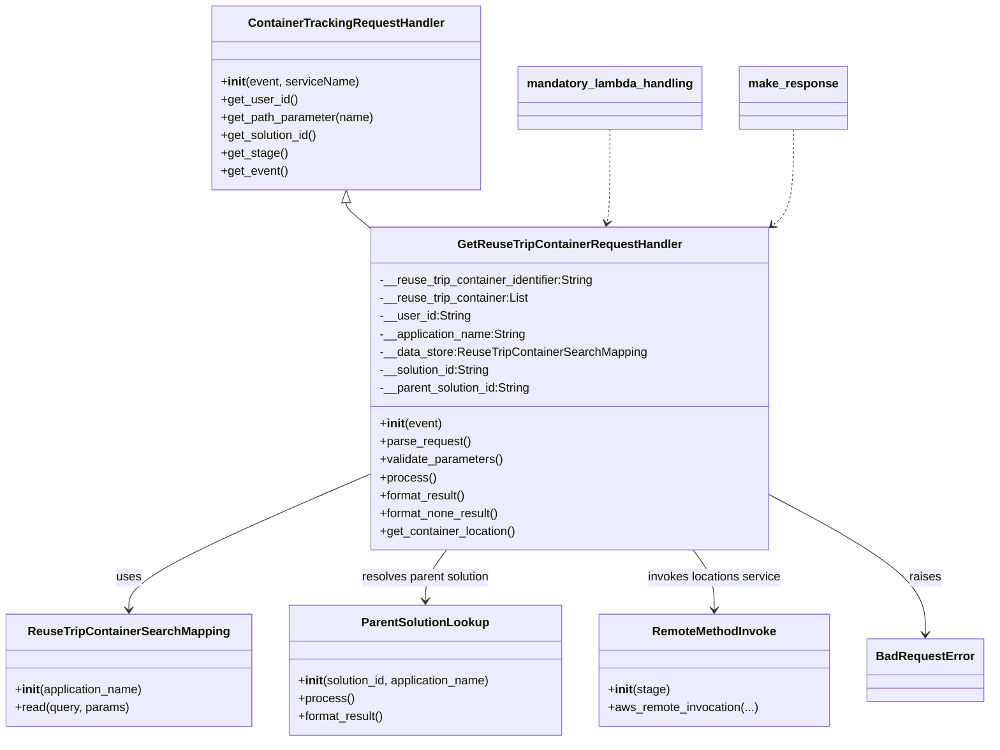
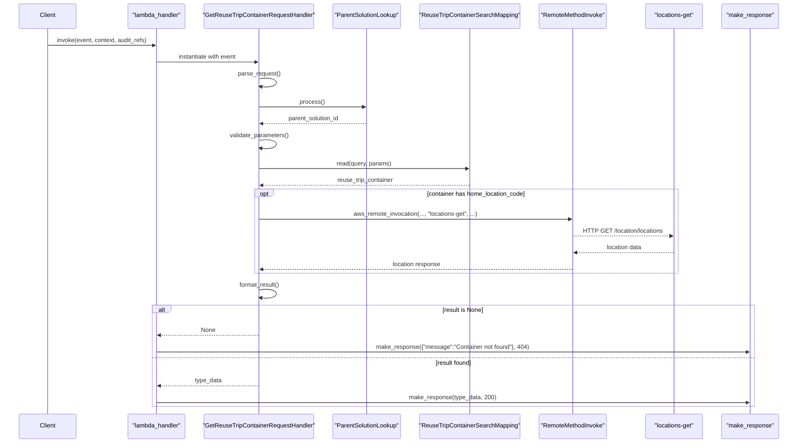

# Diagram: container_tracking_core/container_tracking_service/container_tracking_service/api/reuse_trip_container_details/get_reuse_trip_container_handler.py

> Auto-generated by Obscura crawlers

## Diagram 1

### SVG

<svg id="container" width="1315.5234375" xmlns="http://www.w3.org/2000/svg" class="classDiagram" height="992" viewBox="0 0 1315.5234375 992" role="graphics-document document" aria-roledescription="class"><g><defs><marker id="container_class-aggregationStart" class="marker aggregation class" refX="18" refY="7" markerWidth="190" markerHeight="240" orient="auto"><path d="M 18,7 L9,13 L1,7 L9,1 Z"></path></marker></defs><defs><marker id="container_class-aggregationEnd" class="marker aggregation class" refX="1" refY="7" markerWidth="20" markerHeight="28" orient="auto"><path d="M 18,7 L9,13 L1,7 L9,1 Z"></path></marker></defs><defs><marker id="container_class-extensionStart" class="marker extension class" refX="18" refY="7" markerWidth="190" markerHeight="240" orient="auto"><path d="M 1,7 L18,13 V 1 Z"></path></marker></defs><defs><marker id="container_class-extensionEnd" class="marker extension class" refX="1" refY="7" markerWidth="20" markerHeight="28" orient="auto"><path d="M 1,1 V 13 L18,7 Z"></path></marker></defs><defs><marker id="container_class-compositionStart" class="marker composition class" refX="18" refY="7" markerWidth="190" markerHeight="240" orient="auto"><path d="M 18,7 L9,13 L1,7 L9,1 Z"></path></marker></defs><defs><marker id="container_class-compositionEnd" class="marker composition class" refX="1" refY="7" markerWidth="20" markerHeight="28" orient="auto"><path d="M 18,7 L9,13 L1,7 L9,1 Z"></path></marker></defs><defs><marker id="container_class-dependencyStart" class="marker dependency class" refX="6" refY="7" markerWidth="190" markerHeight="240" orient="auto"><path d="M 5,7 L9,13 L1,7 L9,1 Z"></path></marker></defs><defs><marker id="container_class-dependencyEnd" class="marker dependency class" refX="13" refY="7" markerWidth="20" markerHeight="28" orient="auto"><path d="M 18,7 L9,13 L14,7 L9,1 Z"></path></marker></defs><defs><marker id="container_class-lollipopStart" class="marker lollipop class" refX="13" refY="7" markerWidth="190" markerHeight="240" orient="auto"><circle stroke="black" fill="transparent" cx="7" cy="7" r="6"></circle></marker></defs><defs><marker id="container_class-lollipopEnd" class="marker lollipop class" refX="1" refY="7" markerWidth="190" markerHeight="240" orient="auto"><circle stroke="black" fill="transparent" cx="7" cy="7" r="6"></circle></marker></defs><g class="root"><g class="clusters"></g><g class="edgePaths"><path d="M469.365,271.25L469.365,272.542C469.365,273.833,469.365,276.417,474.573,281.989C479.78,287.561,490.195,296.122,495.402,300.402L500.609,304.683" id="id_ContainerTrackingRequestHandler_GetReuseTripContainerRequestHandler_1" class="edge-thickness-normal edge-pattern-solid relation" style=";;;" data-edge="true" data-et="edge" data-id="id_ContainerTrackingRequestHandler_GetReuseTripContainerRequestHandler_1" data-points="W3sieCI6NDY5LjM2NTIzNDM3NSwieSI6MjU0fSx7IngiOjQ2OS4zNjUyMzQzNzUsInkiOjI3OX0seyJ4Ijo1MDAuNjA5Mzc1LCJ5IjozMDQuNjgyODQxMzY0MDU3MjV9XQ==" marker-start="url(#container_class-extensionStart)"></path><path d="M500.609,632.026L445.671,655.522C390.733,679.017,280.857,726.009,225.919,756.671C170.98,787.333,170.98,801.667,170.98,808.833L170.98,816" id="id_GetReuseTripContainerRequestHandler_ReuseTripContainerSearchMapping_2" class="edge-thickness-normal edge-pattern-solid relation" style=";;;" data-edge="true" data-et="edge" data-id="id_GetReuseTripContainerRequestHandler_ReuseTripContainerSearchMapping_2" data-points="W3sieCI6NTAwLjYwOTM3NSwieSI6NjMyLjAyNTg2NDY4NzQ3MTF9LHsieCI6MTcwLjk4MDQ2ODc1LCJ5Ijo3NzN9LHsieCI6MTcwLjk4MDQ2ODc1LCJ5Ijo4MjJ9XQ==" marker-end="url(#container_class-dependencyEnd)"></path><path d="M597.136,736L592.413,742.167C587.691,748.333,578.246,760.667,573.523,772C568.801,783.333,568.801,793.667,568.801,798.833L568.801,804" id="id_GetReuseTripContainerRequestHandler_ParentSolutionLookup_3" class="edge-thickness-normal edge-pattern-solid relation" style=";;;" data-edge="true" data-et="edge" data-id="id_GetReuseTripContainerRequestHandler_ParentSolutionLookup_3" data-points="W3sieCI6NTk3LjEzNTc2MTQ4NzE1NDEsInkiOjczNn0seyJ4Ijo1NjguODAwNzgxMjUsInkiOjc3M30seyJ4Ijo1NjguODAwNzgxMjUsInkiOjgxMH1d" marker-end="url(#container_class-dependencyEnd)"></path><path d="M927.966,736L932.688,742.167C937.411,748.333,946.856,760.667,951.578,774C956.301,787.333,956.301,801.667,956.301,808.833L956.301,816" id="id_GetReuseTripContainerRequestHandler_RemoteMethodInvoke_4" class="edge-thickness-normal edge-pattern-solid relation" style=";;;" data-edge="true" data-et="edge" data-id="id_GetReuseTripContainerRequestHandler_RemoteMethodInvoke_4" data-points="W3sieCI6OTI3Ljk2NTgwMTAxMjg0NTksInkiOjczNn0seyJ4Ijo5NTYuMzAwNzgxMjUsInkiOjc3M30seyJ4Ijo5NTYuMzAwNzgxMjUsInkiOjgyMn1d" marker-end="url(#container_class-dependencyEnd)"></path><path d="M1024.492,660.795L1059.284,679.496C1094.076,698.197,1163.659,735.598,1198.451,766.966C1233.242,798.333,1233.242,823.667,1233.242,836.333L1233.242,849" id="id_GetReuseTripContainerRequestHandler_BadRequestError_5" class="edge-thickness-normal edge-pattern-solid relation" style=";;;" data-edge="true" data-et="edge" data-id="id_GetReuseTripContainerRequestHandler_BadRequestError_5" data-points="W3sieCI6MTAyNC40OTIxODc1LCJ5Ijo2NjAuNzk1MzgwNzk3ODYyMn0seyJ4IjoxMjMzLjI0MjE4NzUsInkiOjc3M30seyJ4IjoxMjMzLjI0MjE4NzUsInkiOjg1NX1d" marker-end="url(#container_class-dependencyEnd)"></path><path d="M816.838,173L816.838,190.667C816.838,208.333,816.838,243.667,816.119,264.524C815.4,285.382,813.963,291.764,813.244,294.956L812.525,298.147" id="id_mandatory_lambda_handling_GetReuseTripContainerRequestHandler_6" class="edge-thickness-normal edge-pattern-dashed relation" style=";;;" data-edge="true" data-et="edge" data-id="id_mandatory_lambda_handling_GetReuseTripContainerRequestHandler_6" data-points="W3sieCI6ODE2LjgzNzg5MDYyNSwieSI6MTczfSx7IngiOjgxNi44Mzc4OTA2MjUsInkiOjI3OX0seyJ4Ijo4MTEuMjA2NDQ3NzQzNzc1OSwieSI6MzA0fV0=" marker-end="url(#container_class-dependencyEnd)"></path><path d="M1055.736,173L1055.736,190.667C1055.736,208.333,1055.736,243.667,1051.301,264.979C1046.867,286.291,1037.997,293.582,1033.562,297.227L1029.127,300.873" id="id_make_response_GetReuseTripContainerRequestHandler_7" class="edge-thickness-normal edge-pattern-dashed relation" style=";;;" data-edge="true" data-et="edge" data-id="id_make_response_GetReuseTripContainerRequestHandler_7" data-points="W3sieCI6MTA1NS43MzYzMjgxMjUsInkiOjE3M30seyJ4IjoxMDU1LjczNjMyODEyNSwieSI6Mjc5fSx7IngiOjEwMjQuNDkyMTg3NSwieSI6MzA0LjY4Mjg0MTM2NDA1NzI1fV0=" marker-end="url(#container_class-dependencyEnd)"></path></g><g class="edgeLabels"><g class="edgeLabel"><g class="label" data-id="id_ContainerTrackingRequestHandler_GetReuseTripContainerRequestHandler_1" transform="translate(0, 0)"><foreignObject width="0" height="0">

</foreignObject></g></g><g class="edgeLabel" transform="translate(170.98046875, 773)"><g class="label" data-id="id_GetReuseTripContainerRequestHandler_ReuseTripContainerSearchMapping_2" transform="translate(-16.4921875, -12)"><foreignObject width="32.984375" height="24">

uses

</foreignObject></g></g><g class="edgeLabel" transform="translate(568.80078125, 773)"><g class="label" data-id="id_GetReuseTripContainerRequestHandler_ParentSolutionLookup_3" transform="translate(-87.84375, -12)"><foreignObject width="175.6875" height="24">

resolves parent solution

</foreignObject></g></g><g class="edgeLabel" transform="translate(956.30078125, 773)"><g class="label" data-id="id_GetReuseTripContainerRequestHandler_RemoteMethodInvoke_4" transform="translate(-90.5390625, -12)"><foreignObject width="181.078125" height="24">

invokes locations service

</foreignObject></g></g><g class="edgeLabel" transform="translate(1233.2421875, 773)"><g class="label" data-id="id_GetReuseTripContainerRequestHandler_BadRequestError_5" transform="translate(-21.25, -12)"><foreignObject width="42.5" height="24">

raises

</foreignObject></g></g><g class="edgeLabel"><g class="label" data-id="id_mandatory_lambda_handling_GetReuseTripContainerRequestHandler_6" transform="translate(0, 0)"><foreignObject width="0" height="0">

</foreignObject></g></g><g class="edgeLabel"><g class="label" data-id="id_make_response_GetReuseTripContainerRequestHandler_7" transform="translate(0, 0)"><foreignObject width="0" height="0">

</foreignObject></g></g></g><g class="nodes"><g class="node default" id="classId-ContainerTrackingRequestHandler-0" transform="translate(469.365234375, 131)"><g class="basic label-container"><path d="M-178.04296875 -123 L178.04296875 -123 L178.04296875 123 L-178.04296875 123" stroke="none" stroke-width="0" fill="#ECECFF" style=""></path><path d="M-178.04296875 -123 C-87.67247051661892 -123, 2.6980277167621693 -123, 178.04296875 -123 M-178.04296875 -123 C-95.19159167475642 -123, -12.340214599512848 -123, 178.04296875 -123 M178.04296875 -123 C178.04296875 -29.640519873649353, 178.04296875 63.718960252701294, 178.04296875 123 M178.04296875 -123 C178.04296875 -58.69051331270751, 178.04296875 5.618973374584982, 178.04296875 123 M178.04296875 123 C36.77977003432801 123, -104.48342868134398 123, -178.04296875 123 M178.04296875 123 C65.17965578583727 123, -47.68365717832546 123, -178.04296875 123 M-178.04296875 123 C-178.04296875 59.19603222154325, -178.04296875 -4.607935556913503, -178.04296875 -123 M-178.04296875 123 C-178.04296875 48.49857829925955, -178.04296875 -26.002843401480902, -178.04296875 -123" stroke="#9370DB" stroke-width="1.3" fill="none" stroke-dasharray="0 0" style=""></path></g><g class="annotation-group text" transform="translate(0, -99)"></g><g class="label-group text" transform="translate(-125.5859375, -99)"><g class="label" style="font-weight: bolder" transform="translate(0,-12)"><foreignObject width="251.171875" height="24">

ContainerTrackingRequestHandler

</foreignObject></g></g><g class="members-group text" transform="translate(-166.04296875, -51)"></g><g class="methods-group text" transform="translate(-166.04296875, -21)"><g class="label" style="" transform="translate(0,-12)"><foreignObject width="184.140625" height="24">

+<strong>init</strong>(event, serviceName)

</foreignObject></g><g class="label" style="" transform="translate(0,12)"><foreignObject width="101.71875" height="24">

+get_user_id()

</foreignObject></g><g class="label" style="" transform="translate(0,36)"><foreignObject width="206.5" height="24">

+get_path_parameter(name)

</foreignObject></g><g class="label" style="" transform="translate(0,60)"><foreignObject width="131.46875" height="24">

+get_solution_id()

</foreignObject></g><g class="label" style="" transform="translate(0,84)"><foreignObject width="87.703125" height="24">

+get_stage()

</foreignObject></g><g class="label" style="" transform="translate(0,108)"><foreignObject width="89.25" height="24">

+get_event()

</foreignObject></g></g><g class="divider" style=""><path d="M-178.04296875 -75 C-50.23560704512168 -75, 77.57175465975664 -75, 178.04296875 -75 M-178.04296875 -75 C-98.42683346986297 -75, -18.81069818972594 -75, 178.04296875 -75" stroke="#9370DB" stroke-width="1.3" fill="none" stroke-dasharray="0 0" style=""></path></g><g class="divider" style=""><path d="M-178.04296875 -51 C-50.68669940160481 -51, 76.66956994679038 -51, 178.04296875 -51 M-178.04296875 -51 C-102.67244042142615 -51, -27.30191209285229 -51, 178.04296875 -51" stroke="#9370DB" stroke-width="1.3" fill="none" stroke-dasharray="0 0" style=""></path></g></g><g class="node default" id="classId-GetReuseTripContainerRequestHandler-1" transform="translate(762.55078125, 520)"><g class="basic label-container"><path d="M-261.94140625 -216 L261.94140625 -216 L261.94140625 216 L-261.94140625 216" stroke="none" stroke-width="0" fill="#ECECFF" style=""></path><path d="M-261.94140625 -216 C-127.90442898724399 -216, 6.132548275512022 -216, 261.94140625 -216 M-261.94140625 -216 C-82.04613705141347 -216, 97.84913214717307 -216, 261.94140625 -216 M261.94140625 -216 C261.94140625 -98.79972806149418, 261.94140625 18.400543877011643, 261.94140625 216 M261.94140625 -216 C261.94140625 -94.5554408691419, 261.94140625 26.88911826171619, 261.94140625 216 M261.94140625 216 C84.81502436095141 216, -92.31135752809718 216, -261.94140625 216 M261.94140625 216 C98.76107198844781 216, -64.41926227310438 216, -261.94140625 216 M-261.94140625 216 C-261.94140625 107.29420675408721, -261.94140625 -1.4115864918255738, -261.94140625 -216 M-261.94140625 216 C-261.94140625 60.23101605395391, -261.94140625 -95.53796789209218, -261.94140625 -216" stroke="#9370DB" stroke-width="1.3" fill="none" stroke-dasharray="0 0" style=""></path></g><g class="annotation-group text" transform="translate(0, -192)"></g><g class="label-group text" transform="translate(-143.7421875, -192)"><g class="label" style="font-weight: bolder" transform="translate(0,-12)"><foreignObject width="287.484375" height="24">

GetReuseTripContainerRequestHandler

</foreignObject></g></g><g class="members-group text" transform="translate(-249.94140625, -144)"><g class="label" style="" transform="translate(0,-12)"><foreignObject width="292.578125" height="24">

-__reuse_trip_container_identifier:String

</foreignObject></g><g class="label" style="" transform="translate(0,12)"><foreignObject width="201.828125" height="24">

-__reuse_trip_container:List

</foreignObject></g><g class="label" style="" transform="translate(0,36)"><foreignObject width="120.859375" height="24">

-__user_id:String

</foreignObject></g><g class="label" style="" transform="translate(0,60)"><foreignObject width="199" height="24">

-__application_name:String

</foreignObject></g><g class="label" style="" transform="translate(0,84)"><foreignObject width="356.140625" height="24">

-__data_store:ReuseTripContainerSearchMapping

</foreignObject></g><g class="label" style="" transform="translate(0,108)"><foreignObject width="150.59375" height="24">

-__solution_id:String

</foreignObject></g><g class="label" style="" transform="translate(0,132)"><foreignObject width="206.53125" height="24">

-__parent_solution_id:String

</foreignObject></g></g><g class="methods-group text" transform="translate(-249.94140625, 48)"><g class="label" style="" transform="translate(0,-12)"><foreignObject width="83.140625" height="24">

+<strong>init</strong>(event)

</foreignObject></g><g class="label" style="" transform="translate(0,12)"><foreignObject width="121.796875" height="24">

+parse_request()

</foreignObject></g><g class="label" style="" transform="translate(0,36)"><foreignObject width="166.546875" height="24">

+validate_parameters()

</foreignObject></g><g class="label" style="" transform="translate(0,60)"><foreignObject width="73.734375" height="24">

+process()

</foreignObject></g><g class="label" style="" transform="translate(0,84)"><foreignObject width="117.015625" height="24">

+format_result()

</foreignObject></g><g class="label" style="" transform="translate(0,108)"><foreignObject width="161.828125" height="24">

+format_none_result()

</foreignObject></g><g class="label" style="" transform="translate(0,132)"><foreignObject width="184.15625" height="24">

+get_container_location()

</foreignObject></g></g><g class="divider" style=""><path d="M-261.94140625 -168 C-111.38043452561146 -168, 39.180537198777074 -168, 261.94140625 -168 M-261.94140625 -168 C-59.871324533000035 -168, 142.19875718399993 -168, 261.94140625 -168" stroke="#9370DB" stroke-width="1.3" fill="none" stroke-dasharray="0 0" style=""></path></g><g class="divider" style=""><path d="M-261.94140625 24 C-63.86381222652389 24, 134.21378179695222 24, 261.94140625 24 M-261.94140625 24 C-76.76992954099583 24, 108.40154716800834 24, 261.94140625 24" stroke="#9370DB" stroke-width="1.3" fill="none" stroke-dasharray="0 0" style=""></path></g></g><g class="node default" id="classId-ReuseTripContainerSearchMapping-2" transform="translate(170.98046875, 897)"><g class="basic label-container"><path d="M-162.98046875 -75 L162.98046875 -75 L162.98046875 75 L-162.98046875 75" stroke="none" stroke-width="0" fill="#ECECFF" style=""></path><path d="M-162.98046875 -75 C-47.27457707071159 -75, 68.43131460857683 -75, 162.98046875 -75 M-162.98046875 -75 C-39.140614881751375 -75, 84.69923898649725 -75, 162.98046875 -75 M162.98046875 -75 C162.98046875 -34.000594651140396, 162.98046875 6.9988106977192075, 162.98046875 75 M162.98046875 -75 C162.98046875 -38.24796072116464, 162.98046875 -1.4959214423292764, 162.98046875 75 M162.98046875 75 C35.175956732949146 75, -92.62855528410171 75, -162.98046875 75 M162.98046875 75 C91.23685646341336 75, 19.49324417682672 75, -162.98046875 75 M-162.98046875 75 C-162.98046875 30.425884071901464, -162.98046875 -14.148231856197071, -162.98046875 -75 M-162.98046875 75 C-162.98046875 34.68409671478103, -162.98046875 -5.631806570437945, -162.98046875 -75" stroke="#9370DB" stroke-width="1.3" fill="none" stroke-dasharray="0 0" style=""></path></g><g class="annotation-group text" transform="translate(0, -51)"></g><g class="label-group text" transform="translate(-128.2265625, -51)"><g class="label" style="font-weight: bolder" transform="translate(0,-12)"><foreignObject width="256.453125" height="24">

ReuseTripContainerSearchMapping

</foreignObject></g></g><g class="members-group text" transform="translate(-150.98046875, -3)"></g><g class="methods-group text" transform="translate(-150.98046875, 27)"><g class="label" style="" transform="translate(0,-12)"><foreignObject width="173.734375" height="24">

+<strong>init</strong>(application_name)

</foreignObject></g><g class="label" style="" transform="translate(0,12)"><foreignObject width="153.53125" height="24">

+read(query, params)

</foreignObject></g></g><g class="divider" style=""><path d="M-162.98046875 -27 C-90.9667663326658 -27, -18.953063915331597 -27, 162.98046875 -27 M-162.98046875 -27 C-44.5500755592287 -27, 73.8803176315426 -27, 162.98046875 -27" stroke="#9370DB" stroke-width="1.3" fill="none" stroke-dasharray="0 0" style=""></path></g><g class="divider" style=""><path d="M-162.98046875 -3 C-50.07807225905958 -3, 62.82432423188084 -3, 162.98046875 -3 M-162.98046875 -3 C-65.31429927011743 -3, 32.35187020976514 -3, 162.98046875 -3" stroke="#9370DB" stroke-width="1.3" fill="none" stroke-dasharray="0 0" style=""></path></g></g><g class="node default" id="classId-ParentSolutionLookup-3" transform="translate(568.80078125, 897)"><g class="basic label-container"><path d="M-184.83984375 -87 L184.83984375 -87 L184.83984375 87 L-184.83984375 87" stroke="none" stroke-width="0" fill="#ECECFF" style=""></path><path d="M-184.83984375 -87 C-67.60368358786125 -87, 49.63247657427749 -87, 184.83984375 -87 M-184.83984375 -87 C-46.30455716242753 -87, 92.23072942514494 -87, 184.83984375 -87 M184.83984375 -87 C184.83984375 -22.24293096892815, 184.83984375 42.5141380621437, 184.83984375 87 M184.83984375 -87 C184.83984375 -36.011782648469975, 184.83984375 14.97643470306005, 184.83984375 87 M184.83984375 87 C70.3654497887151 87, -44.10894417256981 87, -184.83984375 87 M184.83984375 87 C80.5468203906738 87, -23.746202968652398 87, -184.83984375 87 M-184.83984375 87 C-184.83984375 27.7989147337327, -184.83984375 -31.402170532534598, -184.83984375 -87 M-184.83984375 87 C-184.83984375 31.53869734889269, -184.83984375 -23.92260530221462, -184.83984375 -87" stroke="#9370DB" stroke-width="1.3" fill="none" stroke-dasharray="0 0" style=""></path></g><g class="annotation-group text" transform="translate(0, -63)"></g><g class="label-group text" transform="translate(-81.6328125, -63)"><g class="label" style="font-weight: bolder" transform="translate(0,-12)"><foreignObject width="163.265625" height="24">

ParentSolutionLookup

</foreignObject></g></g><g class="members-group text" transform="translate(-172.83984375, -15)"></g><g class="methods-group text" transform="translate(-172.83984375, 15)"><g class="label" style="" transform="translate(0,-12)"><foreignObject width="264.046875" height="24">

+<strong>init</strong>(solution_id, application_name)

</foreignObject></g><g class="label" style="" transform="translate(0,12)"><foreignObject width="73.734375" height="24">

+process()

</foreignObject></g><g class="label" style="" transform="translate(0,36)"><foreignObject width="117.015625" height="24">

+format_result()

</foreignObject></g></g><g class="divider" style=""><path d="M-184.83984375 -39 C-78.24491019702882 -39, 28.35002335594237 -39, 184.83984375 -39 M-184.83984375 -39 C-103.96702762277687 -39, -23.094211495553736 -39, 184.83984375 -39" stroke="#9370DB" stroke-width="1.3" fill="none" stroke-dasharray="0 0" style=""></path></g><g class="divider" style=""><path d="M-184.83984375 -15 C-48.980837230923015 -15, 86.87816928815397 -15, 184.83984375 -15 M-184.83984375 -15 C-97.43506941066344 -15, -10.03029507132689 -15, 184.83984375 -15" stroke="#9370DB" stroke-width="1.3" fill="none" stroke-dasharray="0 0" style=""></path></g></g><g class="node default" id="classId-RemoteMethodInvoke-4" transform="translate(956.30078125, 897)"><g class="basic label-container"><path d="M-152.66015625 -75 L152.66015625 -75 L152.66015625 75 L-152.66015625 75" stroke="none" stroke-width="0" fill="#ECECFF" style=""></path><path d="M-152.66015625 -75 C-39.870350510152704 -75, 72.91945522969459 -75, 152.66015625 -75 M-152.66015625 -75 C-32.45901665342146 -75, 87.74212294315709 -75, 152.66015625 -75 M152.66015625 -75 C152.66015625 -44.74171973598191, 152.66015625 -14.48343947196382, 152.66015625 75 M152.66015625 -75 C152.66015625 -17.20112912829891, 152.66015625 40.59774174340218, 152.66015625 75 M152.66015625 75 C35.413031281160656 75, -81.83409368767869 75, -152.66015625 75 M152.66015625 75 C38.80067362141085 75, -75.0588090071783 75, -152.66015625 75 M-152.66015625 75 C-152.66015625 28.871183002600844, -152.66015625 -17.25763399479831, -152.66015625 -75 M-152.66015625 75 C-152.66015625 17.894636581093195, -152.66015625 -39.21072683781361, -152.66015625 -75" stroke="#9370DB" stroke-width="1.3" fill="none" stroke-dasharray="0 0" style=""></path></g><g class="annotation-group text" transform="translate(0, -51)"></g><g class="label-group text" transform="translate(-80.2578125, -51)"><g class="label" style="font-weight: bolder" transform="translate(0,-12)"><foreignObject width="160.515625" height="24">

RemoteMethodInvoke

</foreignObject></g></g><g class="members-group text" transform="translate(-140.66015625, -3)"></g><g class="methods-group text" transform="translate(-140.66015625, 27)"><g class="label" style="" transform="translate(0,-12)"><foreignObject width="81.265625" height="24">

+<strong>init</strong>(stage)

</foreignObject></g><g class="label" style="" transform="translate(0,12)"><foreignObject width="201.0625" height="24">

+aws_remote_invocation(...)

</foreignObject></g></g><g class="divider" style=""><path d="M-152.66015625 -27 C-37.13122473061401 -27, 78.39770678877198 -27, 152.66015625 -27 M-152.66015625 -27 C-81.78540822024374 -27, -10.910660190487476 -27, 152.66015625 -27" stroke="#9370DB" stroke-width="1.3" fill="none" stroke-dasharray="0 0" style=""></path></g><g class="divider" style=""><path d="M-152.66015625 -3 C-32.406760179179145 -3, 87.84663589164171 -3, 152.66015625 -3 M-152.66015625 -3 C-61.542412490449266 -3, 29.57533126910147 -3, 152.66015625 -3" stroke="#9370DB" stroke-width="1.3" fill="none" stroke-dasharray="0 0" style=""></path></g></g><g class="node default" id="classId-BadRequestError-5" transform="translate(1233.2421875, 897)"><g class="basic label-container"><path d="M-74.28125 -42 L74.28125 -42 L74.28125 42 L-74.28125 42" stroke="none" stroke-width="0" fill="#ECECFF" style=""></path><path d="M-74.28125 -42 C-32.028663889901445 -42, 10.22392222019711 -42, 74.28125 -42 M-74.28125 -42 C-43.23455179977406 -42, -12.18785359954812 -42, 74.28125 -42 M74.28125 -42 C74.28125 -24.14345531323859, 74.28125 -6.28691062647718, 74.28125 42 M74.28125 -42 C74.28125 -21.180733742956708, 74.28125 -0.3614674859134155, 74.28125 42 M74.28125 42 C27.614069524713358 42, -19.053110950573284 42, -74.28125 42 M74.28125 42 C24.599111870955618 42, -25.083026258088765 42, -74.28125 42 M-74.28125 42 C-74.28125 11.923438709900047, -74.28125 -18.153122580199906, -74.28125 -42 M-74.28125 42 C-74.28125 21.242564070511847, -74.28125 0.4851281410236936, -74.28125 -42" stroke="#9370DB" stroke-width="1.3" fill="none" stroke-dasharray="0 0" style=""></path></g><g class="annotation-group text" transform="translate(0, -18)"></g><g class="label-group text" transform="translate(-62.28125, -18)"><g class="label" style="font-weight: bolder" transform="translate(0,-12)"><foreignObject width="124.5625" height="24">

BadRequestError

</foreignObject></g></g><g class="members-group text" transform="translate(-62.28125, 30)"></g><g class="methods-group text" transform="translate(-62.28125, 60)"></g><g class="divider" style=""><path d="M-74.28125 6 C-42.47942130751879 6, -10.677592615037575 6, 74.28125 6 M-74.28125 6 C-32.85424419669982 6, 8.572761606600366 6, 74.28125 6" stroke="#9370DB" stroke-width="1.3" fill="none" stroke-dasharray="0 0" style=""></path></g><g class="divider" style=""><path d="M-74.28125 24 C-29.836645162064485 24, 14.60795967587103 24, 74.28125 24 M-74.28125 24 C-20.35915190363123 24, 33.56294619273754 24, 74.28125 24" stroke="#9370DB" stroke-width="1.3" fill="none" stroke-dasharray="0 0" style=""></path></g></g><g class="node default" id="classId-make_response-6" transform="translate(1055.736328125, 131)"><g class="basic label-container"><path d="M-69.46875 -42 L69.46875 -42 L69.46875 42 L-69.46875 42" stroke="none" stroke-width="0" fill="#ECECFF" style=""></path><path d="M-69.46875 -42 C-16.939247242001663 -42, 35.590255515996674 -42, 69.46875 -42 M-69.46875 -42 C-19.7315861787053 -42, 30.0055776425894 -42, 69.46875 -42 M69.46875 -42 C69.46875 -19.611452417501056, 69.46875 2.7770951649978883, 69.46875 42 M69.46875 -42 C69.46875 -10.58223294781703, 69.46875 20.83553410436594, 69.46875 42 M69.46875 42 C28.712430660569822 42, -12.043888678860355 42, -69.46875 42 M69.46875 42 C22.626786498822156 42, -24.215177002355688 42, -69.46875 42 M-69.46875 42 C-69.46875 15.874710347801013, -69.46875 -10.250579304397974, -69.46875 -42 M-69.46875 42 C-69.46875 12.077812136183429, -69.46875 -17.844375727633143, -69.46875 -42" stroke="#9370DB" stroke-width="1.3" fill="none" stroke-dasharray="0 0" style=""></path></g><g class="annotation-group text" transform="translate(0, -18)"></g><g class="label-group text" transform="translate(-57.46875, -18)"><g class="label" style="font-weight: bolder" transform="translate(0,-12)"><foreignObject width="114.9375" height="24">

make_response

</foreignObject></g></g><g class="members-group text" transform="translate(-57.46875, 30)"></g><g class="methods-group text" transform="translate(-57.46875, 60)"></g><g class="divider" style=""><path d="M-69.46875 6 C-21.762455622436143 6, 25.943838755127715 6, 69.46875 6 M-69.46875 6 C-32.73044877101085 6, 4.007852457978302 6, 69.46875 6" stroke="#9370DB" stroke-width="1.3" fill="none" stroke-dasharray="0 0" style=""></path></g><g class="divider" style=""><path d="M-69.46875 24 C-28.598220574366046 24, 12.272308851267908 24, 69.46875 24 M-69.46875 24 C-29.86658906549539 24, 9.73557186900922 24, 69.46875 24" stroke="#9370DB" stroke-width="1.3" fill="none" stroke-dasharray="0 0" style=""></path></g></g><g class="node default" id="classId-mandatory_lambda_handling-7" transform="translate(816.837890625, 131)"><g class="basic label-container"><path d="M-119.4296875 -42 L119.4296875 -42 L119.4296875 42 L-119.4296875 42" stroke="none" stroke-width="0" fill="#ECECFF" style=""></path><path d="M-119.4296875 -42 C-68.6204888180315 -42, -17.811290136062993 -42, 119.4296875 -42 M-119.4296875 -42 C-26.408287961081285 -42, 66.61311157783743 -42, 119.4296875 -42 M119.4296875 -42 C119.4296875 -15.537414368160889, 119.4296875 10.925171263678223, 119.4296875 42 M119.4296875 -42 C119.4296875 -11.855542709995586, 119.4296875 18.28891458000883, 119.4296875 42 M119.4296875 42 C33.30371422967799 42, -52.82225904064401 42, -119.4296875 42 M119.4296875 42 C69.99843040751604 42, 20.56717331503208 42, -119.4296875 42 M-119.4296875 42 C-119.4296875 12.681609329535124, -119.4296875 -16.63678134092975, -119.4296875 -42 M-119.4296875 42 C-119.4296875 12.423501909753277, -119.4296875 -17.152996180493446, -119.4296875 -42" stroke="#9370DB" stroke-width="1.3" fill="none" stroke-dasharray="0 0" style=""></path></g><g class="annotation-group text" transform="translate(0, -18)"></g><g class="label-group text" transform="translate(-107.4296875, -18)"><g class="label" style="font-weight: bolder" transform="translate(0,-12)"><foreignObject width="214.859375" height="24">

mandatory_lambda_handling

</foreignObject></g></g><g class="members-group text" transform="translate(-107.4296875, 30)"></g><g class="methods-group text" transform="translate(-107.4296875, 60)"></g><g class="divider" style=""><path d="M-119.4296875 6 C-43.68963758281362 6, 32.050412334372766 6, 119.4296875 6 M-119.4296875 6 C-71.60571609336759 6, -23.781744686735166 6, 119.4296875 6" stroke="#9370DB" stroke-width="1.3" fill="none" stroke-dasharray="0 0" style=""></path></g><g class="divider" style=""><path d="M-119.4296875 24 C-44.30524418536001 24, 30.81919912927998 24, 119.4296875 24 M-119.4296875 24 C-51.16014932103212 24, 17.109388857935755 24, 119.4296875 24" stroke="#9370DB" stroke-width="1.3" fill="none" stroke-dasharray="0 0" style=""></path></g></g></g></g></g></svg>

## Diagram 2

> SVG rendering failed for this diagram.
