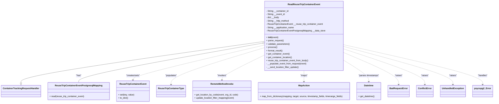
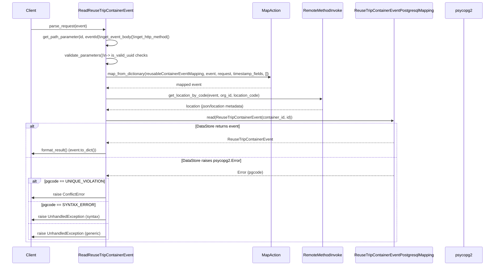

# Diagram: container_tracking_core/container_tracking_service/container_tracking_service/api/reuse_trip_container_event/handlers/get_reuse_trip_container_event.py

> Auto-generated by Obscura crawlers

## Diagram 1

### SVG

<svg id="container" width="3512.515625" xmlns="http://www.w3.org/2000/svg" class="classDiagram" height="744" viewBox="0 0 3512.515625 744" role="graphics-document document" aria-roledescription="class"><g><defs><marker id="container_class-aggregationStart" class="marker aggregation class" refX="18" refY="7" markerWidth="190" markerHeight="240" orient="auto"><path d="M 18,7 L9,13 L1,7 L9,1 Z"></path></marker></defs><defs><marker id="container_class-aggregationEnd" class="marker aggregation class" refX="1" refY="7" markerWidth="20" markerHeight="28" orient="auto"><path d="M 18,7 L9,13 L1,7 L9,1 Z"></path></marker></defs><defs><marker id="container_class-extensionStart" class="marker extension class" refX="18" refY="7" markerWidth="190" markerHeight="240" orient="auto"><path d="M 1,7 L18,13 V 1 Z"></path></marker></defs><defs><marker id="container_class-extensionEnd" class="marker extension class" refX="1" refY="7" markerWidth="20" markerHeight="28" orient="auto"><path d="M 1,1 V 13 L18,7 Z"></path></marker></defs><defs><marker id="container_class-compositionStart" class="marker composition class" refX="18" refY="7" markerWidth="190" markerHeight="240" orient="auto"><path d="M 18,7 L9,13 L1,7 L9,1 Z"></path></marker></defs><defs><marker id="container_class-compositionEnd" class="marker composition class" refX="1" refY="7" markerWidth="20" markerHeight="28" orient="auto"><path d="M 18,7 L9,13 L1,7 L9,1 Z"></path></marker></defs><defs><marker id="container_class-dependencyStart" class="marker dependency class" refX="6" refY="7" markerWidth="190" markerHeight="240" orient="auto"><path d="M 5,7 L9,13 L1,7 L9,1 Z"></path></marker></defs><defs><marker id="container_class-dependencyEnd" class="marker dependency class" refX="13" refY="7" markerWidth="20" markerHeight="28" orient="auto"><path d="M 18,7 L9,13 L14,7 L9,1 Z"></path></marker></defs><defs><marker id="container_class-lollipopStart" class="marker lollipop class" refX="13" refY="7" markerWidth="190" markerHeight="240" orient="auto"><circle stroke="black" fill="transparent" cx="7" cy="7" r="6"></circle></marker></defs><defs><marker id="container_class-lollipopEnd" class="marker lollipop class" refX="1" refY="7" markerWidth="190" markerHeight="240" orient="auto"><circle stroke="black" fill="transparent" cx="7" cy="7" r="6"></circle></marker></defs><g class="root"><g class="clusters"></g><g class="edgePaths"><path d="M1883.75,300.309L1594.056,341.758C1304.362,383.206,724.974,466.103,435.28,516.343C145.586,566.583,145.586,584.167,145.586,592.958L145.586,601.75" id="id_ReadReuseTripContainerEvent_ContainerTrackingRequestHandler_1" class="edge-thickness-normal edge-pattern-solid relation" style=";;;" data-edge="true" data-et="edge" data-id="id_ReadReuseTripContainerEvent_ContainerTrackingRequestHandler_1" data-points="W3sieCI6MTg4My43NSwieSI6MzAwLjMwOTA4NzUzMzU3NzE2fSx7IngiOjE0NS41ODU5Mzc1LCJ5Ijo1NDl9LHsieCI6MTQ1LjU4NTkzNzUsInkiOjYxOX1d" marker-end="url(#container_class-extensionEnd)"></path><path d="M1866.77,313.53L1647.774,352.775C1428.778,392.02,990.785,470.51,771.789,517.922C552.793,565.333,552.793,581.667,552.793,589.833L552.793,598" id="id_ReadReuseTripContainerEvent_ReuseTripContainerEventPostgresqlMapping_2" class="edge-thickness-normal edge-pattern-solid relation" style=";;;" data-edge="true" data-et="edge" data-id="id_ReadReuseTripContainerEvent_ReuseTripContainerEventPostgresqlMapping_2" data-points="W3sieCI6MTg4My43NSwieSI6MzEwLjQ4NzIxODA1NjA0fSx7IngiOjU1Mi43OTI5Njg3NSwieSI6NTQ5fSx7IngiOjU1Mi43OTI5Njg3NSwieSI6NTk4fV0=" marker-start="url(#container_class-aggregationStart)"></path><path d="M1883.75,326.345L1726.168,363.454C1568.586,400.563,1253.422,474.782,1095.84,517.058C938.258,559.333,938.258,569.667,938.258,574.833L938.258,580" id="id_ReadReuseTripContainerEvent_ReuseTripContainerEvent_3" class="edge-thickness-normal edge-pattern-dashed relation" style=";;;" data-edge="true" data-et="edge" data-id="id_ReadReuseTripContainerEvent_ReuseTripContainerEvent_3" data-points="W3sieCI6MTg4My43NSwieSI6MzI2LjM0NTAxNDk0NDE4NjF9LHsieCI6OTM4LjI1NzgxMjUsInkiOjU0OX0seyJ4Ijo5MzguMjU3ODEyNSwieSI6NTg2fV0=" marker-end="url(#container_class-dependencyEnd)"></path><path d="M1883.75,344.81L1770.701,378.842C1657.651,412.873,1431.552,480.937,1318.503,525.635C1205.453,570.333,1205.453,591.667,1205.453,602.333L1205.453,613" id="id_ReadReuseTripContainerEvent_ReuseTripContainerType_4" class="edge-thickness-normal edge-pattern-dashed relation" style=";;;" data-edge="true" data-et="edge" data-id="id_ReadReuseTripContainerEvent_ReuseTripContainerType_4" data-points="W3sieCI6MTg4My43NSwieSI6MzQ0LjgxMDE5NDIwODMzNTUzfSx7IngiOjEyMDUuNDUzMTI1LCJ5Ijo1NDl9LHsieCI6MTIwNS40NTMxMjUsInkiOjYxOX1d" marker-end="url(#container_class-dependencyEnd)"></path><path d="M1883.75,396.277L1831.128,421.731C1778.507,447.185,1673.263,498.092,1620.641,528.713C1568.02,559.333,1568.02,569.667,1568.02,574.833L1568.02,580" id="id_ReadReuseTripContainerEvent_RemoteMethodInvoke_5" class="edge-thickness-normal edge-pattern-dashed relation" style=";;;" data-edge="true" data-et="edge" data-id="id_ReadReuseTripContainerEvent_RemoteMethodInvoke_5" data-points="W3sieCI6MTg4My43NSwieSI6Mzk2LjI3Njg2ODI1NzYwMDU0fSx7IngiOjE1NjguMDE5NTMxMjUsInkiOjU0OX0seyJ4IjoxNTY4LjAxOTUzMTI1LCJ5Ijo1ODZ9XQ==" marker-end="url(#container_class-dependencyEnd)"></path><path d="M2165.48,512L2165.48,518.167C2165.48,524.333,2165.48,536.667,2165.48,550C2165.48,563.333,2165.48,577.667,2165.48,584.833L2165.48,592" id="id_ReadReuseTripContainerEvent_MapAction_6" class="edge-thickness-normal edge-pattern-dashed relation" style=";;;" data-edge="true" data-et="edge" data-id="id_ReadReuseTripContainerEvent_MapAction_6" data-points="W3sieCI6MjE2NS40ODA0Njg3NSwieSI6NTEyfSx7IngiOjIxNjUuNDgwNDY4NzUsInkiOjU0OX0seyJ4IjoyMTY1LjQ4MDQ2ODc1LCJ5Ijo1OTh9XQ==" marker-end="url(#container_class-dependencyEnd)"></path><path d="M2447.211,431.719L2479.281,451.265C2511.35,470.812,2575.49,509.906,2607.559,536.62C2639.629,563.333,2639.629,577.667,2639.629,584.833L2639.629,592" id="id_ReadReuseTripContainerEvent_Datetime_7" class="edge-thickness-normal edge-pattern-dashed relation" style=";;;" data-edge="true" data-et="edge" data-id="id_ReadReuseTripContainerEvent_Datetime_7" data-points="W3sieCI6MjQ0Ny4yMTA5Mzc1LCJ5Ijo0MzEuNzE4NTk5MTMzMzE0N30seyJ4IjoyNjM5LjYyODkwNjI1LCJ5Ijo1NDl9LHsieCI6MjYzOS42Mjg5MDYyNSwieSI6NTk4fV0=" marker-end="url(#container_class-dependencyEnd)"></path><path d="M2447.211,378.631L2514.645,407.026C2582.078,435.421,2716.945,492.21,2784.379,531.272C2851.813,570.333,2851.813,591.667,2851.813,602.333L2851.813,613" id="id_ReadReuseTripContainerEvent_BadRequestError_8" class="edge-thickness-normal edge-pattern-dashed relation" style=";;;" data-edge="true" data-et="edge" data-id="id_ReadReuseTripContainerEvent_BadRequestError_8" data-points="W3sieCI6MjQ0Ny4yMTA5Mzc1LCJ5IjozNzguNjMwNzgxODM5NjAyNX0seyJ4IjoyODUxLjgxMjUsInkiOjU0OX0seyJ4IjoyODUxLjgxMjUsInkiOjYxOX1d" marker-end="url(#container_class-dependencyEnd)"></path><path d="M2447.211,353.721L2545.048,386.267C2642.885,418.814,2838.56,483.907,2936.397,527.12C3034.234,570.333,3034.234,591.667,3034.234,602.333L3034.234,613" id="id_ReadReuseTripContainerEvent_ConflictError_9" class="edge-thickness-normal edge-pattern-dashed relation" style=";;;" data-edge="true" data-et="edge" data-id="id_ReadReuseTripContainerEvent_ConflictError_9" data-points="W3sieCI6MjQ0Ny4yMTA5Mzc1LCJ5IjozNTMuNzIwNTYzMzA2ODE5NjZ9LHsieCI6MzAzNC4yMzQzNzUsInkiOjU0OX0seyJ4IjozMDM0LjIzNDM3NSwieSI6NjE5fV0=" marker-end="url(#container_class-dependencyEnd)"></path><path d="M2447.211,336.495L2577.654,371.912C2708.096,407.33,2968.982,478.165,3099.424,524.249C3229.867,570.333,3229.867,591.667,3229.867,602.333L3229.867,613" id="id_ReadReuseTripContainerEvent_UnhandledException_10" class="edge-thickness-normal edge-pattern-dashed relation" style=";;;" data-edge="true" data-et="edge" data-id="id_ReadReuseTripContainerEvent_UnhandledException_10" data-points="W3sieCI6MjQ0Ny4yMTA5Mzc1LCJ5IjozMzYuNDk0ODUyODg5OTA1MX0seyJ4IjozMjI5Ljg2NzE4NzUsInkiOjU0OX0seyJ4IjozMjI5Ljg2NzE4NzUsInkiOjYxOX1d" marker-end="url(#container_class-dependencyEnd)"></path><path d="M2447.211,324.087L2611.999,361.573C2776.786,399.058,3106.362,474.029,3271.15,522.181C3435.938,570.333,3435.938,591.667,3435.938,602.333L3435.938,613" id="id_ReadReuseTripContainerEvent_psycopg2_Error_11" class="edge-thickness-normal edge-pattern-dashed relation" style=";;;" data-edge="true" data-et="edge" data-id="id_ReadReuseTripContainerEvent_psycopg2_Error_11" data-points="W3sieCI6MjQ0Ny4yMTA5Mzc1LCJ5IjozMjQuMDg3MjU2MzY5OTcwMn0seyJ4IjozNDM1LjkzNzUsInkiOjU0OX0seyJ4IjozNDM1LjkzNzUsInkiOjYxOX1d" marker-end="url(#container_class-dependencyEnd)"></path></g><g class="edgeLabels"><g class="edgeLabel"><g class="label" data-id="id_ReadReuseTripContainerEvent_ContainerTrackingRequestHandler_1" transform="translate(0, 0)"><foreignObject width="0" height="0">

</foreignObject></g></g><g class="edgeLabel" transform="translate(552.79296875, 549)"><g class="label" data-id="id_ReadReuseTripContainerEvent_ReuseTripContainerEventPostgresqlMapping_2" transform="translate(-18.9609375, -12)"><foreignObject width="37.921875" height="24">

"has"

</foreignObject></g></g><g class="edgeLabel" transform="translate(938.2578125, 549)"><g class="label" data-id="id_ReadReuseTripContainerEvent_ReuseTripContainerEvent_3" transform="translate(-50.9921875, -12)"><foreignObject width="101.984375" height="24">

"creates/sets"

</foreignObject></g></g><g class="edgeLabel" transform="translate(1205.453125, 549)"><g class="label" data-id="id_ReadReuseTripContainerEvent_ReuseTripContainerType_4" transform="translate(-42.6171875, -12)"><foreignObject width="85.234375" height="24">

"populates"

</foreignObject></g></g><g class="edgeLabel" transform="translate(1568.01953125, 549)"><g class="label" data-id="id_ReadReuseTripContainerEvent_RemoteMethodInvoke_5" transform="translate(-33.8515625, -12)"><foreignObject width="67.703125" height="24">

"invokes"

</foreignObject></g></g><g class="edgeLabel" transform="translate(2165.48046875, 549)"><g class="label" data-id="id_ReadReuseTripContainerEvent_MapAction_6" transform="translate(-25.9609375, -12)"><foreignObject width="51.921875" height="24">

"maps"

</foreignObject></g></g><g class="edgeLabel" transform="translate(2639.62890625, 549)"><g class="label" data-id="id_ReadReuseTripContainerEvent_Datetime_7" transform="translate(-74.8359375, -12)"><foreignObject width="149.671875" height="24">

"parses timestamps"

</foreignObject></g></g><g class="edgeLabel" transform="translate(2851.8125, 549)"><g class="label" data-id="id_ReadReuseTripContainerEvent_BadRequestError_8" transform="translate(-27.515625, -12)"><foreignObject width="55.03125" height="24">

"raises"

</foreignObject></g></g><g class="edgeLabel" transform="translate(3034.234375, 549)"><g class="label" data-id="id_ReadReuseTripContainerEvent_ConflictError_9" transform="translate(-27.515625, -12)"><foreignObject width="55.03125" height="24">

"raises"

</foreignObject></g></g><g class="edgeLabel" transform="translate(3229.8671875, 549)"><g class="label" data-id="id_ReadReuseTripContainerEvent_UnhandledException_10" transform="translate(-27.515625, -12)"><foreignObject width="55.03125" height="24">

"raises"

</foreignObject></g></g><g class="edgeLabel" transform="translate(3435.9375, 549)"><g class="label" data-id="id_ReadReuseTripContainerEvent_psycopg2_Error_11" transform="translate(-35.1796875, -12)"><foreignObject width="70.359375" height="24">

"handles"

</foreignObject></g></g></g><g class="nodes"><g class="node default" id="classId-ReadReuseTripContainerEvent-0" transform="translate(2165.48046875, 260)"><g class="basic label-container"><path d="M-281.73046875 -252 L281.73046875 -252 L281.73046875 252 L-281.73046875 252" stroke="none" stroke-width="0" fill="#ECECFF" style=""></path><path d="M-281.73046875 -252 C-66.75485568044425 -252, 148.2207573891115 -252, 281.73046875 -252 M-281.73046875 -252 C-132.80691710586825 -252, 16.116634538263497 -252, 281.73046875 -252 M281.73046875 -252 C281.73046875 -112.39928152988662, 281.73046875 27.201436940226756, 281.73046875 252 M281.73046875 -252 C281.73046875 -134.71629952865783, 281.73046875 -17.432599057315628, 281.73046875 252 M281.73046875 252 C96.7760081989382 252, -88.1784523521236 252, -281.73046875 252 M281.73046875 252 C139.58091819920895 252, -2.568632351582096 252, -281.73046875 252 M-281.73046875 252 C-281.73046875 88.0644026247615, -281.73046875 -75.871194750477, -281.73046875 -252 M-281.73046875 252 C-281.73046875 76.5440552334868, -281.73046875 -98.9118895330264, -281.73046875 -252" stroke="#9370DB" stroke-width="1.3" fill="none" stroke-dasharray="0 0" style=""></path></g><g class="annotation-group text" transform="translate(0, -228)"></g><g class="label-group text" transform="translate(-110.5546875, -228)"><g class="label" style="font-weight: bolder" transform="translate(0,-12)"><foreignObject width="221.109375" height="24">

ReadReuseTripContainerEvent

</foreignObject></g></g><g class="members-group text" transform="translate(-269.73046875, -180)"><g class="label" style="" transform="translate(0,-12)"><foreignObject width="164.296875" height="24">

- String __container_id

</foreignObject></g><g class="label" style="" transform="translate(0,12)"><foreignObject width="136.71875" height="24">

- String __event_id

</foreignObject></g><g class="label" style="" transform="translate(0,36)"><foreignObject width="95.203125" height="24">

- dict __body

</foreignObject></g><g class="label" style="" transform="translate(0,60)"><foreignObject width="169.21875" height="24">

- String __http_method

</foreignObject></g><g class="label" style="" transform="translate(0,84)"><foreignObject width="411" height="24">

- ReuseTripContainerEvent __reuse_trip_container_event

</foreignObject></g><g class="label" style="" transform="translate(0,108)"><foreignObject width="204.921875" height="24">

- String __application_name

</foreignObject></g><g class="label" style="" transform="translate(0,132)"><foreignObject width="428.90625" height="24">

- ReuseTripContainerEventPostgresqlMapping __data_store

</foreignObject></g></g><g class="methods-group text" transform="translate(-269.73046875, 12)"><g class="label" style="" transform="translate(0,-12)"><foreignObject width="87.390625" height="24">

+ <strong>init</strong>(event)

</foreignObject></g><g class="label" style="" transform="translate(0,12)"><foreignObject width="126.046875" height="24">

+ parse_request()

</foreignObject></g><g class="label" style="" transform="translate(0,36)"><foreignObject width="170.953125" height="24">

+ validate_parameters()

</foreignObject></g><g class="label" style="" transform="translate(0,60)"><foreignObject width="77.96875" height="24">

+ process()

</foreignObject></g><g class="label" style="" transform="translate(0,84)"><foreignObject width="121.5" height="24">

+ format_result()

</foreignObject></g><g class="label" style="" transform="translate(0,108)"><foreignObject width="169.421875" height="24">

+ get_container_event()

</foreignObject></g><g class="label" style="" transform="translate(0,132)"><foreignObject width="188.390625" height="24">

+ get_container_location()

</foreignObject></g><g class="label" style="" transform="translate(0,156)"><foreignObject width="306.828125" height="24">

+ reuse_trip_container_event_from_body()

</foreignObject></g><g class="label" style="" transform="translate(0,180)"><foreignObject width="296.828125" height="24">

- __populate_event_from_request(event)

</foreignObject></g><g class="label" style="" transform="translate(0,204)"><foreignObject width="240.375" height="24">

- __send_location_filter_update()

</foreignObject></g></g><g class="divider" style=""><path d="M-281.73046875 -204 C-149.37538636051343 -204, -17.020303971026863 -204, 281.73046875 -204 M-281.73046875 -204 C-134.20250455297526 -204, 13.325459644049488 -204, 281.73046875 -204" stroke="#9370DB" stroke-width="1.3" fill="none" stroke-dasharray="0 0" style=""></path></g><g class="divider" style=""><path d="M-281.73046875 -12 C-92.57152092823361 -12, 96.58742689353278 -12, 281.73046875 -12 M-281.73046875 -12 C-63.47109318700717 -12, 154.78828237598566 -12, 281.73046875 -12" stroke="#9370DB" stroke-width="1.3" fill="none" stroke-dasharray="0 0" style=""></path></g></g><g class="node default" id="classId-ContainerTrackingRequestHandler-1" transform="translate(145.5859375, 661)"><g class="basic label-container"><path d="M-137.5859375 -42 L137.5859375 -42 L137.5859375 42 L-137.5859375 42" stroke="none" stroke-width="0" fill="#ECECFF" style=""></path><path d="M-137.5859375 -42 C-76.2311920003566 -42, -14.876446500713186 -42, 137.5859375 -42 M-137.5859375 -42 C-57.118013159470465 -42, 23.34991118105907 -42, 137.5859375 -42 M137.5859375 -42 C137.5859375 -20.630998654241896, 137.5859375 0.7380026915162077, 137.5859375 42 M137.5859375 -42 C137.5859375 -12.130406985224042, 137.5859375 17.739186029551917, 137.5859375 42 M137.5859375 42 C49.97759901949003 42, -37.63073946101994 42, -137.5859375 42 M137.5859375 42 C56.0208408115231 42, -25.544255876953798 42, -137.5859375 42 M-137.5859375 42 C-137.5859375 13.307700749904676, -137.5859375 -15.384598500190648, -137.5859375 -42 M-137.5859375 42 C-137.5859375 18.866348842574915, -137.5859375 -4.26730231485017, -137.5859375 -42" stroke="#9370DB" stroke-width="1.3" fill="none" stroke-dasharray="0 0" style=""></path></g><g class="annotation-group text" transform="translate(0, -18)"></g><g class="label-group text" transform="translate(-125.5859375, -18)"><g class="label" style="font-weight: bolder" transform="translate(0,-12)"><foreignObject width="251.171875" height="24">

ContainerTrackingRequestHandler

</foreignObject></g></g><g class="members-group text" transform="translate(-125.5859375, 30)"></g><g class="methods-group text" transform="translate(-125.5859375, 60)"></g><g class="divider" style=""><path d="M-137.5859375 6 C-30.00143839515235 6, 77.5830607096953 6, 137.5859375 6 M-137.5859375 6 C-59.42805249897795 6, 18.729832502044104 6, 137.5859375 6" stroke="#9370DB" stroke-width="1.3" fill="none" stroke-dasharray="0 0" style=""></path></g><g class="divider" style=""><path d="M-137.5859375 24 C-46.2455423195329 24, 45.094852860934196 24, 137.5859375 24 M-137.5859375 24 C-50.154170910329285 24, 37.27759567934143 24, 137.5859375 24" stroke="#9370DB" stroke-width="1.3" fill="none" stroke-dasharray="0 0" style=""></path></g></g><g class="node default" id="classId-ReuseTripContainerEvent-2" transform="translate(938.2578125, 661)"><g class="basic label-container"><path d="M-115.84375 -75 L115.84375 -75 L115.84375 75 L-115.84375 75" stroke="none" stroke-width="0" fill="#ECECFF" style=""></path><path d="M-115.84375 -75 C-67.83120902269783 -75, -19.818668045395654 -75, 115.84375 -75 M-115.84375 -75 C-62.374874655748684 -75, -8.905999311497368 -75, 115.84375 -75 M115.84375 -75 C115.84375 -26.752571145774205, 115.84375 21.49485770845159, 115.84375 75 M115.84375 -75 C115.84375 -43.94414357271029, 115.84375 -12.888287145420584, 115.84375 75 M115.84375 75 C31.69974485023036 75, -52.44426029953928 75, -115.84375 75 M115.84375 75 C24.84601045230633 75, -66.15172909538734 75, -115.84375 75 M-115.84375 75 C-115.84375 19.6605290539244, -115.84375 -35.6789418921512, -115.84375 -75 M-115.84375 75 C-115.84375 32.19574839520128, -115.84375 -10.608503209597444, -115.84375 -75" stroke="#9370DB" stroke-width="1.3" fill="none" stroke-dasharray="0 0" style=""></path></g><g class="annotation-group text" transform="translate(0, -51)"></g><g class="label-group text" transform="translate(-92.21875, -51)"><g class="label" style="font-weight: bolder" transform="translate(0,-12)"><foreignObject width="184.4375" height="24">

ReuseTripContainerEvent

</foreignObject></g></g><g class="members-group text" transform="translate(-103.84375, -3)"></g><g class="methods-group text" transform="translate(-103.84375, 27)"><g class="label" style="" transform="translate(0,-12)"><foreignObject width="115.46875" height="24">

+ set(key, value)

</foreignObject></g><g class="label" style="" transform="translate(0,12)"><foreignObject width="72.65625" height="24">

+ to_dict()

</foreignObject></g></g><g class="divider" style=""><path d="M-115.84375 -27 C-31.731930100569244 -27, 52.37988979886151 -27, 115.84375 -27 M-115.84375 -27 C-55.911661125934806 -27, 4.020427748130388 -27, 115.84375 -27" stroke="#9370DB" stroke-width="1.3" fill="none" stroke-dasharray="0 0" style=""></path></g><g class="divider" style=""><path d="M-115.84375 -3 C-66.6552140762121 -3, -17.466678152424194 -3, 115.84375 -3 M-115.84375 -3 C-30.62090871422646 -3, 54.60193257154708 -3, 115.84375 -3" stroke="#9370DB" stroke-width="1.3" fill="none" stroke-dasharray="0 0" style=""></path></g></g><g class="node default" id="classId-ReuseTripContainerType-3" transform="translate(1205.453125, 661)"><g class="basic label-container"><path d="M-101.3515625 -42 L101.3515625 -42 L101.3515625 42 L-101.3515625 42" stroke="none" stroke-width="0" fill="#ECECFF" style=""></path><path d="M-101.3515625 -42 C-36.344238493281125 -42, 28.66308551343775 -42, 101.3515625 -42 M-101.3515625 -42 C-42.988928806679056 -42, 15.373704886641889 -42, 101.3515625 -42 M101.3515625 -42 C101.3515625 -24.9335328050722, 101.3515625 -7.867065610144401, 101.3515625 42 M101.3515625 -42 C101.3515625 -19.81952342732741, 101.3515625 2.360953145345178, 101.3515625 42 M101.3515625 42 C35.94606639598034 42, -29.459429708039323 42, -101.3515625 42 M101.3515625 42 C58.82258946178815 42, 16.293616423576296 42, -101.3515625 42 M-101.3515625 42 C-101.3515625 10.787112121335767, -101.3515625 -20.425775757328466, -101.3515625 -42 M-101.3515625 42 C-101.3515625 13.40911237004395, -101.3515625 -15.1817752599121, -101.3515625 -42" stroke="#9370DB" stroke-width="1.3" fill="none" stroke-dasharray="0 0" style=""></path></g><g class="annotation-group text" transform="translate(0, -18)"></g><g class="label-group text" transform="translate(-89.3515625, -18)"><g class="label" style="font-weight: bolder" transform="translate(0,-12)"><foreignObject width="178.703125" height="24">

ReuseTripContainerType

</foreignObject></g></g><g class="members-group text" transform="translate(-89.3515625, 30)"></g><g class="methods-group text" transform="translate(-89.3515625, 60)"></g><g class="divider" style=""><path d="M-101.3515625 6 C-29.383878746791638 6, 42.583805006416725 6, 101.3515625 6 M-101.3515625 6 C-51.58941232480894 6, -1.82726214961788 6, 101.3515625 6" stroke="#9370DB" stroke-width="1.3" fill="none" stroke-dasharray="0 0" style=""></path></g><g class="divider" style=""><path d="M-101.3515625 24 C-34.31224503931709 24, 32.72707242136582 24, 101.3515625 24 M-101.3515625 24 C-20.593468884729532 24, 60.164624730540936 24, 101.3515625 24" stroke="#9370DB" stroke-width="1.3" fill="none" stroke-dasharray="0 0" style=""></path></g></g><g class="node default" id="classId-ReuseTripContainerEventPostgresqlMapping-4" transform="translate(552.79296875, 661)"><g class="basic label-container"><path d="M-219.62109375 -63 L219.62109375 -63 L219.62109375 63 L-219.62109375 63" stroke="none" stroke-width="0" fill="#ECECFF" style=""></path><path d="M-219.62109375 -63 C-130.02916933736805 -63, -40.43724492473606 -63, 219.62109375 -63 M-219.62109375 -63 C-91.02968613104656 -63, 37.56172148790688 -63, 219.62109375 -63 M219.62109375 -63 C219.62109375 -27.649870352164726, 219.62109375 7.7002592956705485, 219.62109375 63 M219.62109375 -63 C219.62109375 -22.026882652109308, 219.62109375 18.946234695781385, 219.62109375 63 M219.62109375 63 C109.32123616591844 63, -0.9786214181631294 63, -219.62109375 63 M219.62109375 63 C58.823420735483126 63, -101.97425227903375 63, -219.62109375 63 M-219.62109375 63 C-219.62109375 35.08152889538375, -219.62109375 7.163057790767496, -219.62109375 -63 M-219.62109375 63 C-219.62109375 37.480733727707445, -219.62109375 11.961467455414898, -219.62109375 -63" stroke="#9370DB" stroke-width="1.3" fill="none" stroke-dasharray="0 0" style=""></path></g><g class="annotation-group text" transform="translate(0, -39)"></g><g class="label-group text" transform="translate(-162.6171875, -39)"><g class="label" style="font-weight: bolder" transform="translate(0,-12)"><foreignObject width="325.234375" height="24">

ReuseTripContainerEventPostgresqlMapping

</foreignObject></g></g><g class="members-group text" transform="translate(-207.62109375, 9)"></g><g class="methods-group text" transform="translate(-207.62109375, 39)"><g class="label" style="" transform="translate(0,-12)"><foreignObject width="252.625" height="24">

+ read(reuse_trip_container_event)

</foreignObject></g></g><g class="divider" style=""><path d="M-219.62109375 -15 C-88.6409037782891 -15, 42.3392861934218 -15, 219.62109375 -15 M-219.62109375 -15 C-86.34015793587838 -15, 46.94077787824324 -15, 219.62109375 -15" stroke="#9370DB" stroke-width="1.3" fill="none" stroke-dasharray="0 0" style=""></path></g><g class="divider" style=""><path d="M-219.62109375 9 C-48.24250384631256 9, 123.13608605737488 9, 219.62109375 9 M-219.62109375 9 C-69.76148989575071 9, 80.09811395849857 9, 219.62109375 9" stroke="#9370DB" stroke-width="1.3" fill="none" stroke-dasharray="0 0" style=""></path></g></g><g class="node default" id="classId-RemoteMethodInvoke-5" transform="translate(1568.01953125, 661)"><g class="basic label-container"><path d="M-211.21484375 -75 L211.21484375 -75 L211.21484375 75 L-211.21484375 75" stroke="none" stroke-width="0" fill="#ECECFF" style=""></path><path d="M-211.21484375 -75 C-63.13569157773034 -75, 84.94346059453932 -75, 211.21484375 -75 M-211.21484375 -75 C-81.44489686545043 -75, 48.32505001909914 -75, 211.21484375 -75 M211.21484375 -75 C211.21484375 -16.3309533756751, 211.21484375 42.3380932486498, 211.21484375 75 M211.21484375 -75 C211.21484375 -24.283971339229247, 211.21484375 26.432057321541507, 211.21484375 75 M211.21484375 75 C94.72490933809142 75, -21.765025073817156 75, -211.21484375 75 M211.21484375 75 C44.651807989607846 75, -121.91122777078431 75, -211.21484375 75 M-211.21484375 75 C-211.21484375 37.32234976358161, -211.21484375 -0.3553004728367739, -211.21484375 -75 M-211.21484375 75 C-211.21484375 43.71992816361971, -211.21484375 12.439856327239433, -211.21484375 -75" stroke="#9370DB" stroke-width="1.3" fill="none" stroke-dasharray="0 0" style=""></path></g><g class="annotation-group text" transform="translate(0, -51)"></g><g class="label-group text" transform="translate(-80.2578125, -51)"><g class="label" style="font-weight: bolder" transform="translate(0,-12)"><foreignObject width="160.515625" height="24">

RemoteMethodInvoke

</foreignObject></g></g><g class="members-group text" transform="translate(-199.21484375, -3)"></g><g class="methods-group text" transform="translate(-199.21484375, 27)"><g class="label" style="" transform="translate(0,-12)"><foreignObject width="318.171875" height="24">

+ get_location_by_code(event, org_id, code)

</foreignObject></g><g class="label" style="" transform="translate(0,12)"><foreignObject width="294.265625" height="24">

+ update_location_filter_mapping(event)

</foreignObject></g></g><g class="divider" style=""><path d="M-211.21484375 -27 C-89.73209957347376 -27, 31.75064460305248 -27, 211.21484375 -27 M-211.21484375 -27 C-88.57744556114203 -27, 34.059952627715944 -27, 211.21484375 -27" stroke="#9370DB" stroke-width="1.3" fill="none" stroke-dasharray="0 0" style=""></path></g><g class="divider" style=""><path d="M-211.21484375 -3 C-91.64844133502692 -3, 27.917961079946167 -3, 211.21484375 -3 M-211.21484375 -3 C-44.728731009908955 -3, 121.75738173018209 -3, 211.21484375 -3" stroke="#9370DB" stroke-width="1.3" fill="none" stroke-dasharray="0 0" style=""></path></g></g><g class="node default" id="classId-MapAction-6" transform="translate(2165.48046875, 661)"><g class="basic label-container"><path d="M-336.24609375 -63 L336.24609375 -63 L336.24609375 63 L-336.24609375 63" stroke="none" stroke-width="0" fill="#ECECFF" style=""></path><path d="M-336.24609375 -63 C-196.49837891595223 -63, -56.75066408190446 -63, 336.24609375 -63 M-336.24609375 -63 C-179.0287216724683 -63, -21.811349594936587 -63, 336.24609375 -63 M336.24609375 -63 C336.24609375 -20.686455806166798, 336.24609375 21.627088387666404, 336.24609375 63 M336.24609375 -63 C336.24609375 -13.626286288288739, 336.24609375 35.74742742342252, 336.24609375 63 M336.24609375 63 C157.75870234918688 63, -20.728689051626247 63, -336.24609375 63 M336.24609375 63 C70.82239527344672 63, -194.60130320310657 63, -336.24609375 63 M-336.24609375 63 C-336.24609375 35.938067393626476, -336.24609375 8.876134787252951, -336.24609375 -63 M-336.24609375 63 C-336.24609375 32.30973453609622, -336.24609375 1.6194690721924445, -336.24609375 -63" stroke="#9370DB" stroke-width="1.3" fill="none" stroke-dasharray="0 0" style=""></path></g><g class="annotation-group text" transform="translate(0, -39)"></g><g class="label-group text" transform="translate(-38.6328125, -39)"><g class="label" style="font-weight: bolder" transform="translate(0,-12)"><foreignObject width="77.265625" height="24">

MapAction

</foreignObject></g></g><g class="members-group text" transform="translate(-324.24609375, 9)"></g><g class="methods-group text" transform="translate(-324.24609375, 39)"><g class="label" style="" transform="translate(0,-12)"><foreignObject width="609.859375" height="24">

+ map_from_dictionary(mapping, target, source, timestamp_fields, timerange_fields)

</foreignObject></g></g><g class="divider" style=""><path d="M-336.24609375 -15 C-199.6817838244995 -15, -63.11747389899898 -15, 336.24609375 -15 M-336.24609375 -15 C-119.32854431314743 -15, 97.58900512370514 -15, 336.24609375 -15" stroke="#9370DB" stroke-width="1.3" fill="none" stroke-dasharray="0 0" style=""></path></g><g class="divider" style=""><path d="M-336.24609375 9 C-143.89917497853472 9, 48.44774379293057 9, 336.24609375 9 M-336.24609375 9 C-128.6001513543538 9, 79.04579104129238 9, 336.24609375 9" stroke="#9370DB" stroke-width="1.3" fill="none" stroke-dasharray="0 0" style=""></path></g></g><g class="node default" id="classId-Datetime-7" transform="translate(2639.62890625, 661)"><g class="basic label-container"><path d="M-87.90234375 -63 L87.90234375 -63 L87.90234375 63 L-87.90234375 63" stroke="none" stroke-width="0" fill="#ECECFF" style=""></path><path d="M-87.90234375 -63 C-22.451179738224823 -63, 42.99998427355035 -63, 87.90234375 -63 M-87.90234375 -63 C-18.437578258239938 -63, 51.027187233520124 -63, 87.90234375 -63 M87.90234375 -63 C87.90234375 -27.40539754268204, 87.90234375 8.189204914635923, 87.90234375 63 M87.90234375 -63 C87.90234375 -23.449244748686496, 87.90234375 16.101510502627008, 87.90234375 63 M87.90234375 63 C35.654350430415334 63, -16.59364288916933 63, -87.90234375 63 M87.90234375 63 C35.42586711189984 63, -17.05060952620032 63, -87.90234375 63 M-87.90234375 63 C-87.90234375 33.76337473970484, -87.90234375 4.526749479409673, -87.90234375 -63 M-87.90234375 63 C-87.90234375 24.346770534678704, -87.90234375 -14.306458930642592, -87.90234375 -63" stroke="#9370DB" stroke-width="1.3" fill="none" stroke-dasharray="0 0" style=""></path></g><g class="annotation-group text" transform="translate(0, -39)"></g><g class="label-group text" transform="translate(-33.3984375, -39)"><g class="label" style="font-weight: bolder" transform="translate(0,-12)"><foreignObject width="66.796875" height="24">

Datetime

</foreignObject></g></g><g class="members-group text" transform="translate(-75.90234375, 9)"></g><g class="methods-group text" transform="translate(-75.90234375, 39)"><g class="label" style="" transform="translate(0,-12)"><foreignObject width="118.40625" height="24">

+ get_datetime()

</foreignObject></g></g><g class="divider" style=""><path d="M-87.90234375 -15 C-36.89055291219821 -15, 14.12123792560358 -15, 87.90234375 -15 M-87.90234375 -15 C-38.75368856702618 -15, 10.394966615947638 -15, 87.90234375 -15" stroke="#9370DB" stroke-width="1.3" fill="none" stroke-dasharray="0 0" style=""></path></g><g class="divider" style=""><path d="M-87.90234375 9 C-52.6463006741401 9, -17.3902575982802 9, 87.90234375 9 M-87.90234375 9 C-40.846933559160796 9, 6.208476631678408 9, 87.90234375 9" stroke="#9370DB" stroke-width="1.3" fill="none" stroke-dasharray="0 0" style=""></path></g></g><g class="node default" id="classId-BadRequestError-8" transform="translate(2851.8125, 661)"><g class="basic label-container"><path d="M-74.28125 -42 L74.28125 -42 L74.28125 42 L-74.28125 42" stroke="none" stroke-width="0" fill="#ECECFF" style=""></path><path d="M-74.28125 -42 C-44.05276596224013 -42, -13.824281924480253 -42, 74.28125 -42 M-74.28125 -42 C-31.40343309657014 -42, 11.47438380685972 -42, 74.28125 -42 M74.28125 -42 C74.28125 -11.345155750523734, 74.28125 19.309688498952532, 74.28125 42 M74.28125 -42 C74.28125 -19.32558437755729, 74.28125 3.3488312448854174, 74.28125 42 M74.28125 42 C22.21755869749655 42, -29.8461326050069 42, -74.28125 42 M74.28125 42 C42.719352302126026 42, 11.157454604252052 42, -74.28125 42 M-74.28125 42 C-74.28125 15.719168623592914, -74.28125 -10.561662752814172, -74.28125 -42 M-74.28125 42 C-74.28125 21.101198800275696, -74.28125 0.202397600551393, -74.28125 -42" stroke="#9370DB" stroke-width="1.3" fill="none" stroke-dasharray="0 0" style=""></path></g><g class="annotation-group text" transform="translate(0, -18)"></g><g class="label-group text" transform="translate(-62.28125, -18)"><g class="label" style="font-weight: bolder" transform="translate(0,-12)"><foreignObject width="124.5625" height="24">

BadRequestError

</foreignObject></g></g><g class="members-group text" transform="translate(-62.28125, 30)"></g><g class="methods-group text" transform="translate(-62.28125, 60)"></g><g class="divider" style=""><path d="M-74.28125 6 C-19.871995270927215 6, 34.53725945814557 6, 74.28125 6 M-74.28125 6 C-40.862531355495015 6, -7.443812710990031 6, 74.28125 6" stroke="#9370DB" stroke-width="1.3" fill="none" stroke-dasharray="0 0" style=""></path></g><g class="divider" style=""><path d="M-74.28125 24 C-43.57720015463035 24, -12.873150309260687 24, 74.28125 24 M-74.28125 24 C-32.227664488246035 24, 9.82592102350793 24, 74.28125 24" stroke="#9370DB" stroke-width="1.3" fill="none" stroke-dasharray="0 0" style=""></path></g></g><g class="node default" id="classId-ConflictError-9" transform="translate(3034.234375, 661)"><g class="basic label-container"><path d="M-58.140625 -42 L58.140625 -42 L58.140625 42 L-58.140625 42" stroke="none" stroke-width="0" fill="#ECECFF" style=""></path><path d="M-58.140625 -42 C-29.936714409582226 -42, -1.7328038191644524 -42, 58.140625 -42 M-58.140625 -42 C-29.77690375434467 -42, -1.4131825086893386 -42, 58.140625 -42 M58.140625 -42 C58.140625 -23.45506896966315, 58.140625 -4.910137939326297, 58.140625 42 M58.140625 -42 C58.140625 -23.289183841076085, 58.140625 -4.5783676821521695, 58.140625 42 M58.140625 42 C20.105183501603854 42, -17.930257996792292 42, -58.140625 42 M58.140625 42 C30.53800349725811 42, 2.93538199451622 42, -58.140625 42 M-58.140625 42 C-58.140625 17.89245864682637, -58.140625 -6.2150827063472605, -58.140625 -42 M-58.140625 42 C-58.140625 18.656739699002106, -58.140625 -4.686520601995788, -58.140625 -42" stroke="#9370DB" stroke-width="1.3" fill="none" stroke-dasharray="0 0" style=""></path></g><g class="annotation-group text" transform="translate(0, -18)"></g><g class="label-group text" transform="translate(-46.140625, -18)"><g class="label" style="font-weight: bolder" transform="translate(0,-12)"><foreignObject width="92.28125" height="24">

ConflictError

</foreignObject></g></g><g class="members-group text" transform="translate(-46.140625, 30)"></g><g class="methods-group text" transform="translate(-46.140625, 60)"></g><g class="divider" style=""><path d="M-58.140625 6 C-28.88153189013299 6, 0.37756121973401946 6, 58.140625 6 M-58.140625 6 C-23.06284457259153 6, 12.01493585481694 6, 58.140625 6" stroke="#9370DB" stroke-width="1.3" fill="none" stroke-dasharray="0 0" style=""></path></g><g class="divider" style=""><path d="M-58.140625 24 C-23.654664708293915 24, 10.831295583412171 24, 58.140625 24 M-58.140625 24 C-33.74817599276465 24, -9.355726985529301 24, 58.140625 24" stroke="#9370DB" stroke-width="1.3" fill="none" stroke-dasharray="0 0" style=""></path></g></g><g class="node default" id="classId-UnhandledException-10" transform="translate(3229.8671875, 661)"><g class="basic label-container"><path d="M-87.4921875 -42 L87.4921875 -42 L87.4921875 42 L-87.4921875 42" stroke="none" stroke-width="0" fill="#ECECFF" style=""></path><path d="M-87.4921875 -42 C-50.03034916828572 -42, -12.568510836571434 -42, 87.4921875 -42 M-87.4921875 -42 C-35.49993898560711 -42, 16.492309528785782 -42, 87.4921875 -42 M87.4921875 -42 C87.4921875 -17.5676853407481, 87.4921875 6.864629318503802, 87.4921875 42 M87.4921875 -42 C87.4921875 -22.59710199030696, 87.4921875 -3.1942039806139206, 87.4921875 42 M87.4921875 42 C35.46964520867564 42, -16.552897082648727 42, -87.4921875 42 M87.4921875 42 C52.1258662875601 42, 16.7595450751202 42, -87.4921875 42 M-87.4921875 42 C-87.4921875 13.633530723252878, -87.4921875 -14.732938553494243, -87.4921875 -42 M-87.4921875 42 C-87.4921875 24.55879753609502, -87.4921875 7.117595072190042, -87.4921875 -42" stroke="#9370DB" stroke-width="1.3" fill="none" stroke-dasharray="0 0" style=""></path></g><g class="annotation-group text" transform="translate(0, -18)"></g><g class="label-group text" transform="translate(-75.4921875, -18)"><g class="label" style="font-weight: bolder" transform="translate(0,-12)"><foreignObject width="150.984375" height="24">

UnhandledException

</foreignObject></g></g><g class="members-group text" transform="translate(-75.4921875, 30)"></g><g class="methods-group text" transform="translate(-75.4921875, 60)"></g><g class="divider" style=""><path d="M-87.4921875 6 C-26.918104561751818 6, 33.655978376496364 6, 87.4921875 6 M-87.4921875 6 C-41.121806509472286 6, 5.248574481055428 6, 87.4921875 6" stroke="#9370DB" stroke-width="1.3" fill="none" stroke-dasharray="0 0" style=""></path></g><g class="divider" style=""><path d="M-87.4921875 24 C-18.420218505936177 24, 50.65175048812765 24, 87.4921875 24 M-87.4921875 24 C-47.00296160593751 24, -6.5137357118750145 24, 87.4921875 24" stroke="#9370DB" stroke-width="1.3" fill="none" stroke-dasharray="0 0" style=""></path></g></g><g class="node default" id="classId-psycopg2_Error-11" transform="translate(3435.9375, 661)"><g class="basic label-container"><path d="M-68.578125 -42 L68.578125 -42 L68.578125 42 L-68.578125 42" stroke="none" stroke-width="0" fill="#ECECFF" style=""></path><path d="M-68.578125 -42 C-18.42340667511968 -42, 31.73131164976064 -42, 68.578125 -42 M-68.578125 -42 C-16.4602823027438 -42, 35.6575603945124 -42, 68.578125 -42 M68.578125 -42 C68.578125 -16.74407337883045, 68.578125 8.5118532423391, 68.578125 42 M68.578125 -42 C68.578125 -13.670648169738541, 68.578125 14.658703660522917, 68.578125 42 M68.578125 42 C19.376994816940005 42, -29.82413536611999 42, -68.578125 42 M68.578125 42 C35.880756577277296 42, 3.183388154554592 42, -68.578125 42 M-68.578125 42 C-68.578125 9.387364784715082, -68.578125 -23.225270430569836, -68.578125 -42 M-68.578125 42 C-68.578125 24.046844037412846, -68.578125 6.0936880748256925, -68.578125 -42" stroke="#9370DB" stroke-width="1.3" fill="none" stroke-dasharray="0 0" style=""></path></g><g class="annotation-group text" transform="translate(0, -18)"></g><g class="label-group text" transform="translate(-56.578125, -18)"><g class="label" style="font-weight: bolder" transform="translate(0,-12)"><foreignObject width="113.15625" height="24">

psycopg2_Error

</foreignObject></g></g><g class="members-group text" transform="translate(-56.578125, 30)"></g><g class="methods-group text" transform="translate(-56.578125, 60)"></g><g class="divider" style=""><path d="M-68.578125 6 C-34.199738782092744 6, 0.17864743581451137 6, 68.578125 6 M-68.578125 6 C-16.08625830089676 6, 36.40560839820648 6, 68.578125 6" stroke="#9370DB" stroke-width="1.3" fill="none" stroke-dasharray="0 0" style=""></path></g><g class="divider" style=""><path d="M-68.578125 24 C-17.56733187703081 24, 33.44346124593838 24, 68.578125 24 M-68.578125 24 C-19.25948314525006 24, 30.059158709499883 24, 68.578125 24" stroke="#9370DB" stroke-width="1.3" fill="none" stroke-dasharray="0 0" style=""></path></g></g></g></g></g></svg>

## Diagram 2

### SVG

<svg id="container" width="2132" xmlns="http://www.w3.org/2000/svg" height="1128" viewBox="-50 -10 2132 1128" role="graphics-document document" aria-roledescription="sequence"><g><rect x="1882" y="1042" fill="#eaeaea" stroke="#666" width="150" height="65" name="DB" rx="3" ry="3" class="actor actor-bottom"></rect><text x="1957" y="1074.5" dominant-baseline="central" alignment-baseline="central" class="actor actor-box" style="text-anchor: middle; font-size: 16px; font-weight: 400;"><tspan x="1957" dy="0">psycopg2</tspan></text></g><g><rect x="1491" y="1042" fill="#eaeaea" stroke="#666" width="341" height="65" name="DataStore" rx="3" ry="3" class="actor actor-bottom"></rect><text x="1661.5" y="1074.5" dominant-baseline="central" alignment-baseline="central" class="actor actor-box" style="text-anchor: middle; font-size: 16px; font-weight: 400;"><tspan x="1661.5" dy="0">ReuseTripContainerEventPostgresqlMapping</tspan></text></g><g><rect x="1262" y="1042" fill="#eaeaea" stroke="#666" width="179" height="65" name="Remote" rx="3" ry="3" class="actor actor-bottom"></rect><text x="1351.5" y="1074.5" dominant-baseline="central" alignment-baseline="central" class="actor actor-box" style="text-anchor: middle; font-size: 16px; font-weight: 400;"><tspan x="1351.5" dy="0">RemoteMethodInvoke</tspan></text></g><g><rect x="1062" y="1042" fill="#eaeaea" stroke="#666" width="150" height="65" name="Map" rx="3" ry="3" class="actor actor-bottom"></rect><text x="1137" y="1074.5" dominant-baseline="central" alignment-baseline="central" class="actor actor-box" style="text-anchor: middle; font-size: 16px; font-weight: 400;"><tspan x="1137" dy="0">MapAction</tspan></text></g><g><rect x="283.5" y="1042" fill="#eaeaea" stroke="#666" width="239" height="65" name="Handler" rx="3" ry="3" class="actor actor-bottom"></rect><text x="403" y="1074.5" dominant-baseline="central" alignment-baseline="central" class="actor actor-box" style="text-anchor: middle; font-size: 16px; font-weight: 400;"><tspan x="403" dy="0">ReadReuseTripContainerEvent</tspan></text></g><g><rect x="0" y="1042" fill="#eaeaea" stroke="#666" width="150" height="65" name="Client" rx="3" ry="3" class="actor actor-bottom"></rect><text x="75" y="1074.5" dominant-baseline="central" alignment-baseline="central" class="actor actor-box" style="text-anchor: middle; font-size: 16px; font-weight: 400;"><tspan x="75" dy="0">Client</tspan></text></g><g><line id="actor5" x1="1957" y1="65" x2="1957" y2="1042" class="actor-line 200" stroke-width="0.5px" stroke="#999" name="DB"></line><g id="root-5"><rect x="1882" y="0" fill="#eaeaea" stroke="#666" width="150" height="65" name="DB" rx="3" ry="3" class="actor actor-top"></rect><text x="1957" y="32.5" dominant-baseline="central" alignment-baseline="central" class="actor actor-box" style="text-anchor: middle; font-size: 16px; font-weight: 400;"><tspan x="1957" dy="0">psycopg2</tspan></text></g></g><g><line id="actor4" x1="1661.5" y1="65" x2="1661.5" y2="1042" class="actor-line 200" stroke-width="0.5px" stroke="#999" name="DataStore"></line><g id="root-4"><rect x="1491" y="0" fill="#eaeaea" stroke="#666" width="341" height="65" name="DataStore" rx="3" ry="3" class="actor actor-top"></rect><text x="1661.5" y="32.5" dominant-baseline="central" alignment-baseline="central" class="actor actor-box" style="text-anchor: middle; font-size: 16px; font-weight: 400;"><tspan x="1661.5" dy="0">ReuseTripContainerEventPostgresqlMapping</tspan></text></g></g><g><line id="actor3" x1="1351.5" y1="65" x2="1351.5" y2="1042" class="actor-line 200" stroke-width="0.5px" stroke="#999" name="Remote"></line><g id="root-3"><rect x="1262" y="0" fill="#eaeaea" stroke="#666" width="179" height="65" name="Remote" rx="3" ry="3" class="actor actor-top"></rect><text x="1351.5" y="32.5" dominant-baseline="central" alignment-baseline="central" class="actor actor-box" style="text-anchor: middle; font-size: 16px; font-weight: 400;"><tspan x="1351.5" dy="0">RemoteMethodInvoke</tspan></text></g></g><g><line id="actor2" x1="1137" y1="65" x2="1137" y2="1042" class="actor-line 200" stroke-width="0.5px" stroke="#999" name="Map"></line><g id="root-2"><rect x="1062" y="0" fill="#eaeaea" stroke="#666" width="150" height="65" name="Map" rx="3" ry="3" class="actor actor-top"></rect><text x="1137" y="32.5" dominant-baseline="central" alignment-baseline="central" class="actor actor-box" style="text-anchor: middle; font-size: 16px; font-weight: 400;"><tspan x="1137" dy="0">MapAction</tspan></text></g></g><g><line id="actor1" x1="403" y1="65" x2="403" y2="1042" class="actor-line 200" stroke-width="0.5px" stroke="#999" name="Handler"></line><g id="root-1"><rect x="283.5" y="0" fill="#eaeaea" stroke="#666" width="239" height="65" name="Handler" rx="3" ry="3" class="actor actor-top"></rect><text x="403" y="32.5" dominant-baseline="central" alignment-baseline="central" class="actor actor-box" style="text-anchor: middle; font-size: 16px; font-weight: 400;"><tspan x="403" dy="0">ReadReuseTripContainerEvent</tspan></text></g></g><g><line id="actor0" x1="75" y1="65" x2="75" y2="1042" class="actor-line 200" stroke-width="0.5px" stroke="#999" name="Client"></line><g id="root-0"><rect x="0" y="0" fill="#eaeaea" stroke="#666" width="150" height="65" name="Client" rx="3" ry="3" class="actor actor-top"></rect><text x="75" y="32.5" dominant-baseline="central" alignment-baseline="central" class="actor actor-box" style="text-anchor: middle; font-size: 16px; font-weight: 400;"><tspan x="75" dy="0">Client</tspan></text></g></g><g></g><defs><symbol id="computer" width="24" height="24"><path transform="scale(.5)" d="M2 2v13h20v-13h-20zm18 11h-16v-9h16v9zm-10.228 6l.466-1h3.524l.467 1h-4.457zm14.228 3h-24l2-6h2.104l-1.33 4h18.45l-1.297-4h2.073l2 6zm-5-10h-14v-7h14v7z"></path></symbol></defs><defs><symbol id="database" fill-rule="evenodd" clip-rule="evenodd"><path transform="scale(.5)" d="M12.258.001l.256.004.255.005.253.008.251.01.249.012.247.015.246.016.242.019.241.02.239.023.236.024.233.027.231.028.229.031.225.032.223.034.22.036.217.038.214.04.211.041.208.043.205.045.201.046.198.048.194.05.191.051.187.053.183.054.18.056.175.057.172.059.168.06.163.061.16.063.155.064.15.066.074.033.073.033.071.034.07.034.069.035.068.035.067.035.066.035.064.036.064.036.062.036.06.036.06.037.058.037.058.037.055.038.055.038.053.038.052.038.051.039.05.039.048.039.047.039.045.04.044.04.043.04.041.04.04.041.039.041.037.041.036.041.034.041.033.042.032.042.03.042.029.042.027.042.026.043.024.043.023.043.021.043.02.043.018.044.017.043.015.044.013.044.012.044.011.045.009.044.007.045.006.045.004.045.002.045.001.045v17l-.001.045-.002.045-.004.045-.006.045-.007.045-.009.044-.011.045-.012.044-.013.044-.015.044-.017.043-.018.044-.02.043-.021.043-.023.043-.024.043-.026.043-.027.042-.029.042-.03.042-.032.042-.033.042-.034.041-.036.041-.037.041-.039.041-.04.041-.041.04-.043.04-.044.04-.045.04-.047.039-.048.039-.05.039-.051.039-.052.038-.053.038-.055.038-.055.038-.058.037-.058.037-.06.037-.06.036-.062.036-.064.036-.064.036-.066.035-.067.035-.068.035-.069.035-.07.034-.071.034-.073.033-.074.033-.15.066-.155.064-.16.063-.163.061-.168.06-.172.059-.175.057-.18.056-.183.054-.187.053-.191.051-.194.05-.198.048-.201.046-.205.045-.208.043-.211.041-.214.04-.217.038-.22.036-.223.034-.225.032-.229.031-.231.028-.233.027-.236.024-.239.023-.241.02-.242.019-.246.016-.247.015-.249.012-.251.01-.253.008-.255.005-.256.004-.258.001-.258-.001-.256-.004-.255-.005-.253-.008-.251-.01-.249-.012-.247-.015-.245-.016-.243-.019-.241-.02-.238-.023-.236-.024-.234-.027-.231-.028-.228-.031-.226-.032-.223-.034-.22-.036-.217-.038-.214-.04-.211-.041-.208-.043-.204-.045-.201-.046-.198-.048-.195-.05-.19-.051-.187-.053-.184-.054-.179-.056-.176-.057-.172-.059-.167-.06-.164-.061-.159-.063-.155-.064-.151-.066-.074-.033-.072-.033-.072-.034-.07-.034-.069-.035-.068-.035-.067-.035-.066-.035-.064-.036-.063-.036-.062-.036-.061-.036-.06-.037-.058-.037-.057-.037-.056-.038-.055-.038-.053-.038-.052-.038-.051-.039-.049-.039-.049-.039-.046-.039-.046-.04-.044-.04-.043-.04-.041-.04-.04-.041-.039-.041-.037-.041-.036-.041-.034-.041-.033-.042-.032-.042-.03-.042-.029-.042-.027-.042-.026-.043-.024-.043-.023-.043-.021-.043-.02-.043-.018-.044-.017-.043-.015-.044-.013-.044-.012-.044-.011-.045-.009-.044-.007-.045-.006-.045-.004-.045-.002-.045-.001-.045v-17l.001-.045.002-.045.004-.045.006-.045.007-.045.009-.044.011-.045.012-.044.013-.044.015-.044.017-.043.018-.044.02-.043.021-.043.023-.043.024-.043.026-.043.027-.042.029-.042.03-.042.032-.042.033-.042.034-.041.036-.041.037-.041.039-.041.04-.041.041-.04.043-.04.044-.04.046-.04.046-.039.049-.039.049-.039.051-.039.052-.038.053-.038.055-.038.056-.038.057-.037.058-.037.06-.037.061-.036.062-.036.063-.036.064-.036.066-.035.067-.035.068-.035.069-.035.07-.034.072-.034.072-.033.074-.033.151-.066.155-.064.159-.063.164-.061.167-.06.172-.059.176-.057.179-.056.184-.054.187-.053.19-.051.195-.05.198-.048.201-.046.204-.045.208-.043.211-.041.214-.04.217-.038.22-.036.223-.034.226-.032.228-.031.231-.028.234-.027.236-.024.238-.023.241-.02.243-.019.245-.016.247-.015.249-.012.251-.01.253-.008.255-.005.256-.004.258-.001.258.001zm-9.258 20.499v.01l.001.021.003.021.004.022.005.021.006.022.007.022.009.023.01.022.011.023.012.023.013.023.015.023.016.024.017.023.018.024.019.024.021.024.022.025.023.024.024.025.052.049.056.05.061.051.066.051.07.051.075.051.079.052.084.052.088.052.092.052.097.052.102.051.105.052.11.052.114.051.119.051.123.051.127.05.131.05.135.05.139.048.144.049.147.047.152.047.155.047.16.045.163.045.167.043.171.043.176.041.178.041.183.039.187.039.19.037.194.035.197.035.202.033.204.031.209.03.212.029.216.027.219.025.222.024.226.021.23.02.233.018.236.016.24.015.243.012.246.01.249.008.253.005.256.004.259.001.26-.001.257-.004.254-.005.25-.008.247-.011.244-.012.241-.014.237-.016.233-.018.231-.021.226-.021.224-.024.22-.026.216-.027.212-.028.21-.031.205-.031.202-.034.198-.034.194-.036.191-.037.187-.039.183-.04.179-.04.175-.042.172-.043.168-.044.163-.045.16-.046.155-.046.152-.047.148-.048.143-.049.139-.049.136-.05.131-.05.126-.05.123-.051.118-.052.114-.051.11-.052.106-.052.101-.052.096-.052.092-.052.088-.053.083-.051.079-.052.074-.052.07-.051.065-.051.06-.051.056-.05.051-.05.023-.024.023-.025.021-.024.02-.024.019-.024.018-.024.017-.024.015-.023.014-.024.013-.023.012-.023.01-.023.01-.022.008-.022.006-.022.006-.022.004-.022.004-.021.001-.021.001-.021v-4.127l-.077.055-.08.053-.083.054-.085.053-.087.052-.09.052-.093.051-.095.05-.097.05-.1.049-.102.049-.105.048-.106.047-.109.047-.111.046-.114.045-.115.045-.118.044-.12.043-.122.042-.124.042-.126.041-.128.04-.13.04-.132.038-.134.038-.135.037-.138.037-.139.035-.142.035-.143.034-.144.033-.147.032-.148.031-.15.03-.151.03-.153.029-.154.027-.156.027-.158.026-.159.025-.161.024-.162.023-.163.022-.165.021-.166.02-.167.019-.169.018-.169.017-.171.016-.173.015-.173.014-.175.013-.175.012-.177.011-.178.01-.179.008-.179.008-.181.006-.182.005-.182.004-.184.003-.184.002h-.37l-.184-.002-.184-.003-.182-.004-.182-.005-.181-.006-.179-.008-.179-.008-.178-.01-.176-.011-.176-.012-.175-.013-.173-.014-.172-.015-.171-.016-.17-.017-.169-.018-.167-.019-.166-.02-.165-.021-.163-.022-.162-.023-.161-.024-.159-.025-.157-.026-.156-.027-.155-.027-.153-.029-.151-.03-.15-.03-.148-.031-.146-.032-.145-.033-.143-.034-.141-.035-.14-.035-.137-.037-.136-.037-.134-.038-.132-.038-.13-.04-.128-.04-.126-.041-.124-.042-.122-.042-.12-.044-.117-.043-.116-.045-.113-.045-.112-.046-.109-.047-.106-.047-.105-.048-.102-.049-.1-.049-.097-.05-.095-.05-.093-.052-.09-.051-.087-.052-.085-.053-.083-.054-.08-.054-.077-.054v4.127zm0-5.654v.011l.001.021.003.021.004.021.005.022.006.022.007.022.009.022.01.022.011.023.012.023.013.023.015.024.016.023.017.024.018.024.019.024.021.024.022.024.023.025.024.024.052.05.056.05.061.05.066.051.07.051.075.052.079.051.084.052.088.052.092.052.097.052.102.052.105.052.11.051.114.051.119.052.123.05.127.051.131.05.135.049.139.049.144.048.147.048.152.047.155.046.16.045.163.045.167.044.171.042.176.042.178.04.183.04.187.038.19.037.194.036.197.034.202.033.204.032.209.03.212.028.216.027.219.025.222.024.226.022.23.02.233.018.236.016.24.014.243.012.246.01.249.008.253.006.256.003.259.001.26-.001.257-.003.254-.006.25-.008.247-.01.244-.012.241-.015.237-.016.233-.018.231-.02.226-.022.224-.024.22-.025.216-.027.212-.029.21-.03.205-.032.202-.033.198-.035.194-.036.191-.037.187-.039.183-.039.179-.041.175-.042.172-.043.168-.044.163-.045.16-.045.155-.047.152-.047.148-.048.143-.048.139-.05.136-.049.131-.05.126-.051.123-.051.118-.051.114-.052.11-.052.106-.052.101-.052.096-.052.092-.052.088-.052.083-.052.079-.052.074-.051.07-.052.065-.051.06-.05.056-.051.051-.049.023-.025.023-.024.021-.025.02-.024.019-.024.018-.024.017-.024.015-.023.014-.023.013-.024.012-.022.01-.023.01-.023.008-.022.006-.022.006-.022.004-.021.004-.022.001-.021.001-.021v-4.139l-.077.054-.08.054-.083.054-.085.052-.087.053-.09.051-.093.051-.095.051-.097.05-.1.049-.102.049-.105.048-.106.047-.109.047-.111.046-.114.045-.115.044-.118.044-.12.044-.122.042-.124.042-.126.041-.128.04-.13.039-.132.039-.134.038-.135.037-.138.036-.139.036-.142.035-.143.033-.144.033-.147.033-.148.031-.15.03-.151.03-.153.028-.154.028-.156.027-.158.026-.159.025-.161.024-.162.023-.163.022-.165.021-.166.02-.167.019-.169.018-.169.017-.171.016-.173.015-.173.014-.175.013-.175.012-.177.011-.178.009-.179.009-.179.007-.181.007-.182.005-.182.004-.184.003-.184.002h-.37l-.184-.002-.184-.003-.182-.004-.182-.005-.181-.007-.179-.007-.179-.009-.178-.009-.176-.011-.176-.012-.175-.013-.173-.014-.172-.015-.171-.016-.17-.017-.169-.018-.167-.019-.166-.02-.165-.021-.163-.022-.162-.023-.161-.024-.159-.025-.157-.026-.156-.027-.155-.028-.153-.028-.151-.03-.15-.03-.148-.031-.146-.033-.145-.033-.143-.033-.141-.035-.14-.036-.137-.036-.136-.037-.134-.038-.132-.039-.13-.039-.128-.04-.126-.041-.124-.042-.122-.043-.12-.043-.117-.044-.116-.044-.113-.046-.112-.046-.109-.046-.106-.047-.105-.048-.102-.049-.1-.049-.097-.05-.095-.051-.093-.051-.09-.051-.087-.053-.085-.052-.083-.054-.08-.054-.077-.054v4.139zm0-5.666v.011l.001.02.003.022.004.021.005.022.006.021.007.022.009.023.01.022.011.023.012.023.013.023.015.023.016.024.017.024.018.023.019.024.021.025.022.024.023.024.024.025.052.05.056.05.061.05.066.051.07.051.075.052.079.051.084.052.088.052.092.052.097.052.102.052.105.051.11.052.114.051.119.051.123.051.127.05.131.05.135.05.139.049.144.048.147.048.152.047.155.046.16.045.163.045.167.043.171.043.176.042.178.04.183.04.187.038.19.037.194.036.197.034.202.033.204.032.209.03.212.028.216.027.219.025.222.024.226.021.23.02.233.018.236.017.24.014.243.012.246.01.249.008.253.006.256.003.259.001.26-.001.257-.003.254-.006.25-.008.247-.01.244-.013.241-.014.237-.016.233-.018.231-.02.226-.022.224-.024.22-.025.216-.027.212-.029.21-.03.205-.032.202-.033.198-.035.194-.036.191-.037.187-.039.183-.039.179-.041.175-.042.172-.043.168-.044.163-.045.16-.045.155-.047.152-.047.148-.048.143-.049.139-.049.136-.049.131-.051.126-.05.123-.051.118-.052.114-.051.11-.052.106-.052.101-.052.096-.052.092-.052.088-.052.083-.052.079-.052.074-.052.07-.051.065-.051.06-.051.056-.05.051-.049.023-.025.023-.025.021-.024.02-.024.019-.024.018-.024.017-.024.015-.023.014-.024.013-.023.012-.023.01-.022.01-.023.008-.022.006-.022.006-.022.004-.022.004-.021.001-.021.001-.021v-4.153l-.077.054-.08.054-.083.053-.085.053-.087.053-.09.051-.093.051-.095.051-.097.05-.1.049-.102.048-.105.048-.106.048-.109.046-.111.046-.114.046-.115.044-.118.044-.12.043-.122.043-.124.042-.126.041-.128.04-.13.039-.132.039-.134.038-.135.037-.138.036-.139.036-.142.034-.143.034-.144.033-.147.032-.148.032-.15.03-.151.03-.153.028-.154.028-.156.027-.158.026-.159.024-.161.024-.162.023-.163.023-.165.021-.166.02-.167.019-.169.018-.169.017-.171.016-.173.015-.173.014-.175.013-.175.012-.177.01-.178.01-.179.009-.179.007-.181.006-.182.006-.182.004-.184.003-.184.001-.185.001-.185-.001-.184-.001-.184-.003-.182-.004-.182-.006-.181-.006-.179-.007-.179-.009-.178-.01-.176-.01-.176-.012-.175-.013-.173-.014-.172-.015-.171-.016-.17-.017-.169-.018-.167-.019-.166-.02-.165-.021-.163-.023-.162-.023-.161-.024-.159-.024-.157-.026-.156-.027-.155-.028-.153-.028-.151-.03-.15-.03-.148-.032-.146-.032-.145-.033-.143-.034-.141-.034-.14-.036-.137-.036-.136-.037-.134-.038-.132-.039-.13-.039-.128-.041-.126-.041-.124-.041-.122-.043-.12-.043-.117-.044-.116-.044-.113-.046-.112-.046-.109-.046-.106-.048-.105-.048-.102-.048-.1-.05-.097-.049-.095-.051-.093-.051-.09-.052-.087-.052-.085-.053-.083-.053-.08-.054-.077-.054v4.153zm8.74-8.179l-.257.004-.254.005-.25.008-.247.011-.244.012-.241.014-.237.016-.233.018-.231.021-.226.022-.224.023-.22.026-.216.027-.212.028-.21.031-.205.032-.202.033-.198.034-.194.036-.191.038-.187.038-.183.04-.179.041-.175.042-.172.043-.168.043-.163.045-.16.046-.155.046-.152.048-.148.048-.143.048-.139.049-.136.05-.131.05-.126.051-.123.051-.118.051-.114.052-.11.052-.106.052-.101.052-.096.052-.092.052-.088.052-.083.052-.079.052-.074.051-.07.052-.065.051-.06.05-.056.05-.051.05-.023.025-.023.024-.021.024-.02.025-.019.024-.018.024-.017.023-.015.024-.014.023-.013.023-.012.023-.01.023-.01.022-.008.022-.006.023-.006.021-.004.022-.004.021-.001.021-.001.021.001.021.001.021.004.021.004.022.006.021.006.023.008.022.01.022.01.023.012.023.013.023.014.023.015.024.017.023.018.024.019.024.02.025.021.024.023.024.023.025.051.05.056.05.06.05.065.051.07.052.074.051.079.052.083.052.088.052.092.052.096.052.101.052.106.052.11.052.114.052.118.051.123.051.126.051.131.05.136.05.139.049.143.048.148.048.152.048.155.046.16.046.163.045.168.043.172.043.175.042.179.041.183.04.187.038.191.038.194.036.198.034.202.033.205.032.21.031.212.028.216.027.22.026.224.023.226.022.231.021.233.018.237.016.241.014.244.012.247.011.25.008.254.005.257.004.26.001.26-.001.257-.004.254-.005.25-.008.247-.011.244-.012.241-.014.237-.016.233-.018.231-.021.226-.022.224-.023.22-.026.216-.027.212-.028.21-.031.205-.032.202-.033.198-.034.194-.036.191-.038.187-.038.183-.04.179-.041.175-.042.172-.043.168-.043.163-.045.16-.046.155-.046.152-.048.148-.048.143-.048.139-.049.136-.05.131-.05.126-.051.123-.051.118-.051.114-.052.11-.052.106-.052.101-.052.096-.052.092-.052.088-.052.083-.052.079-.052.074-.051.07-.052.065-.051.06-.05.056-.05.051-.05.023-.025.023-.024.021-.024.02-.025.019-.024.018-.024.017-.023.015-.024.014-.023.013-.023.012-.023.01-.023.01-.022.008-.022.006-.023.006-.021.004-.022.004-.021.001-.021.001-.021-.001-.021-.001-.021-.004-.021-.004-.022-.006-.021-.006-.023-.008-.022-.01-.022-.01-.023-.012-.023-.013-.023-.014-.023-.015-.024-.017-.023-.018-.024-.019-.024-.02-.025-.021-.024-.023-.024-.023-.025-.051-.05-.056-.05-.06-.05-.065-.051-.07-.052-.074-.051-.079-.052-.083-.052-.088-.052-.092-.052-.096-.052-.101-.052-.106-.052-.11-.052-.114-.052-.118-.051-.123-.051-.126-.051-.131-.05-.136-.05-.139-.049-.143-.048-.148-.048-.152-.048-.155-.046-.16-.046-.163-.045-.168-.043-.172-.043-.175-.042-.179-.041-.183-.04-.187-.038-.191-.038-.194-.036-.198-.034-.202-.033-.205-.032-.21-.031-.212-.028-.216-.027-.22-.026-.224-.023-.226-.022-.231-.021-.233-.018-.237-.016-.241-.014-.244-.012-.247-.011-.25-.008-.254-.005-.257-.004-.26-.001-.26.001z"></path></symbol></defs><defs><symbol id="clock" width="24" height="24"><path transform="scale(.5)" d="M12 2c5.514 0 10 4.486 10 10s-4.486 10-10 10-10-4.486-10-10 4.486-10 10-10zm0-2c-6.627 0-12 5.373-12 12s5.373 12 12 12 12-5.373 12-12-5.373-12-12-12zm5.848 12.459c.202.038.202.333.001.372-1.907.361-6.045 1.111-6.547 1.111-.719 0-1.301-.582-1.301-1.301 0-.512.77-5.447 1.125-7.445.034-.192.312-.181.343.014l.985 6.238 5.394 1.011z"></path></symbol></defs><defs><marker id="arrowhead" refX="7.9" refY="5" markerUnits="userSpaceOnUse" markerWidth="12" markerHeight="12" orient="auto-start-reverse"><path d="M -1 0 L 10 5 L 0 10 z"></path></marker></defs><defs><marker id="crosshead" markerWidth="15" markerHeight="8" orient="auto" refX="4" refY="4.5"><path fill="none" stroke="#000000" stroke-width="1pt" d="M 1,2 L 6,7 M 6,2 L 1,7" style="stroke-dasharray: 0, 0;"></path></marker></defs><defs><marker id="filled-head" refX="15.5" refY="7" markerWidth="20" markerHeight="28" orient="auto"><path d="M 18,7 L9,13 L14,7 L9,1 Z"></path></marker></defs><defs><marker id="sequencenumber" refX="15" refY="15" markerWidth="60" markerHeight="40" orient="auto"><circle cx="15" cy="15" r="6"></circle></marker></defs><g><line x1="64" y1="753" x2="414" y2="753" class="loopLine"></line><line x1="414" y1="753" x2="414" y2="1012" class="loopLine"></line><line x1="64" y1="1012" x2="414" y2="1012" class="loopLine"></line><line x1="64" y1="753" x2="64" y2="1012" class="loopLine"></line><line x1="64" y1="851" x2="414" y2="851" class="loopLine" style="stroke-dasharray: 3, 3;"></line><line x1="64" y1="944" x2="414" y2="944" class="loopLine" style="stroke-dasharray: 3, 3;"></line><polygon points="64,753 114,753 114,766 105.6,773 64,773" class="labelBox"></polygon><text x="89" y="766" text-anchor="middle" dominant-baseline="middle" alignment-baseline="middle" class="labelText" style="font-size: 16px; font-weight: 400;">alt</text><text x="264" y="771" text-anchor="middle" class="loopText" style="font-size: 16px; font-weight: 400;"><tspan x="264">[pgcode == UNIQUE_VIOLATION]</tspan></text><text x="239" y="869" text-anchor="middle" class="loopText" style="font-size: 16px; font-weight: 400;">[pgcode == SYNTAX_ERROR]</text></g><g><line x1="54" y1="519" x2="1672.5" y2="519" class="loopLine"></line><line x1="1672.5" y1="519" x2="1672.5" y2="1022" class="loopLine"></line><line x1="54" y1="1022" x2="1672.5" y2="1022" class="loopLine"></line><line x1="54" y1="519" x2="54" y2="1022" class="loopLine"></line><line x1="54" y1="665" x2="1672.5" y2="665" class="loopLine" style="stroke-dasharray: 3, 3;"></line><polygon points="54,519 104,519 104,532 95.6,539 54,539" class="labelBox"></polygon><text x="79" y="532" text-anchor="middle" dominant-baseline="middle" alignment-baseline="middle" class="labelText" style="font-size: 16px; font-weight: 400;">alt</text><text x="888.25" y="537" text-anchor="middle" class="loopText" style="font-size: 16px; font-weight: 400;"><tspan x="888.25">[DataStore returns event]</tspan></text><text x="863.25" y="683" text-anchor="middle" class="loopText" style="font-size: 16px; font-weight: 400;">[DataStore raises psycopg2.Error]</text></g><text x="238" y="80" text-anchor="middle" dominant-baseline="middle" alignment-baseline="middle" class="messageText" dy="1em" style="font-size: 16px; font-weight: 400;">parse_request(event)</text><line x1="76" y1="113" x2="399" y2="113" class="messageLine0" stroke-width="2" stroke="none" marker-end="url(#arrowhead)" style="fill: none;"></line><text x="404" y="128" text-anchor="middle" dominant-baseline="middle" alignment-baseline="middle" class="messageText" dy="1em" style="font-size: 16px; font-weight: 400;">get_path_parameter(id, eventId)\nget_event_body()\nget_http_method()</text><path d="M 404,161 C 464,151 464,191 404,181" class="messageLine0" stroke-width="2" stroke="none" marker-end="url(#arrowhead)" style="fill: none;"></path><text x="404" y="206" text-anchor="middle" dominant-baseline="middle" alignment-baseline="middle" class="messageText" dy="1em" style="font-size: 16px; font-weight: 400;">validate_parameters()\n-&gt; is_valid_uuid checks</text><path d="M 404,239 C 464,229 464,269 404,259" class="messageLine0" stroke-width="2" stroke="none" marker-end="url(#arrowhead)" style="fill: none;"></path><text x="769" y="284" text-anchor="middle" dominant-baseline="middle" alignment-baseline="middle" class="messageText" dy="1em" style="font-size: 16px; font-weight: 400;">map_from_dictionary(reusableContainerEventMapping, event, request, timestamp_fields, [])</text><line x1="404" y1="317" x2="1133" y2="317" class="messageLine0" stroke-width="2" stroke="none" marker-end="url(#arrowhead)" style="fill: none;"></line><text x="772" y="332" text-anchor="middle" dominant-baseline="middle" alignment-baseline="middle" class="messageText" dy="1em" style="font-size: 16px; font-weight: 400;">mapped event</text><line x1="1136" y1="365" x2="407" y2="365" class="messageLine1" stroke-width="2" stroke="none" marker-end="url(#arrowhead)" style="stroke-dasharray: 3, 3; fill: none;"></line><text x="876" y="380" text-anchor="middle" dominant-baseline="middle" alignment-baseline="middle" class="messageText" dy="1em" style="font-size: 16px; font-weight: 400;">get_location_by_code(event, org_id, location_code)</text><line x1="404" y1="413" x2="1347.5" y2="413" class="messageLine0" stroke-width="2" stroke="none" marker-end="url(#arrowhead)" style="fill: none;"></line><text x="879" y="428" text-anchor="middle" dominant-baseline="middle" alignment-baseline="middle" class="messageText" dy="1em" style="font-size: 16px; font-weight: 400;">location (json/location metadata)</text><line x1="1350.5" y1="461" x2="407" y2="461" class="messageLine1" stroke-width="2" stroke="none" marker-end="url(#arrowhead)" style="stroke-dasharray: 3, 3; fill: none;"></line><text x="1031" y="476" text-anchor="middle" dominant-baseline="middle" alignment-baseline="middle" class="messageText" dy="1em" style="font-size: 16px; font-weight: 400;">read(ReuseTripContainerEvent(container_id, id))</text><line x1="404" y1="509" x2="1657.5" y2="509" class="messageLine0" stroke-width="2" stroke="none" marker-end="url(#arrowhead)" style="fill: none;"></line><text x="1034" y="569" text-anchor="middle" dominant-baseline="middle" alignment-baseline="middle" class="messageText" dy="1em" style="font-size: 16px; font-weight: 400;">ReuseTripContainerEvent</text><line x1="1660.5" y1="602" x2="407" y2="602" class="messageLine1" stroke-width="2" stroke="none" marker-end="url(#arrowhead)" style="stroke-dasharray: 3, 3; fill: none;"></line><text x="241" y="617" text-anchor="middle" dominant-baseline="middle" alignment-baseline="middle" class="messageText" dy="1em" style="font-size: 16px; font-weight: 400;">format_result() (event.to_dict())</text><line x1="402" y1="650" x2="79" y2="650" class="messageLine0" stroke-width="2" stroke="none" marker-end="url(#arrowhead)" style="fill: none;"></line><text x="1034" y="710" text-anchor="middle" dominant-baseline="middle" alignment-baseline="middle" class="messageText" dy="1em" style="font-size: 16px; font-weight: 400;">Error (pgcode)</text><line x1="1660.5" y1="743" x2="407" y2="743" class="messageLine1" stroke-width="2" stroke="none" marker-end="url(#arrowhead)" style="stroke-dasharray: 3, 3; fill: none;"></line><text x="241" y="803" text-anchor="middle" dominant-baseline="middle" alignment-baseline="middle" class="messageText" dy="1em" style="font-size: 16px; font-weight: 400;">raise ConflictError</text><line x1="402" y1="836" x2="79" y2="836" class="messageLine0" stroke-width="2" stroke="none" marker-end="url(#arrowhead)" style="fill: none;"></line><text x="241" y="896" text-anchor="middle" dominant-baseline="middle" alignment-baseline="middle" class="messageText" dy="1em" style="font-size: 16px; font-weight: 400;">raise UnhandledException (syntax)</text><line x1="402" y1="929" x2="79" y2="929" class="messageLine0" stroke-width="2" stroke="none" marker-end="url(#arrowhead)" style="fill: none;"></line><text x="241" y="969" text-anchor="middle" dominant-baseline="middle" alignment-baseline="middle" class="messageText" dy="1em" style="font-size: 16px; font-weight: 400;">raise UnhandledException (generic)</text><line x1="402" y1="1002" x2="79" y2="1002" class="messageLine0" stroke-width="2" stroke="none" marker-end="url(#arrowhead)" style="fill: none;"></line></svg>
