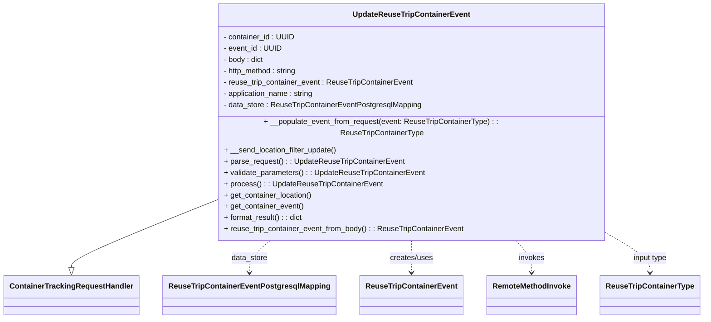

# Diagram: container_tracking_core/container_tracking_service/container_tracking_service/api/reuse_trip_container_event/handlers/patch_reuse_trip_container_event.py


> Auto-generated by Obscura crawlers

## Diagram 1



> SVG rendering failed for this diagram.

## Diagram 2

```mermaid
sequenceDiagram
actor Client
participant Handler as UpdateReuseTripContainerEvent
participant Remote as RemoteMethodInvoke
participant DB as ReuseTripContainerEventPostgresqlMapping
participant Event as ReuseTripContainerEvent
Client->>Handler: HTTP event (path id, eventId, body)
Handler->>Handler: parse_request() -> set ids, body, http_method
Handler->>Handler: validate_parameters() -> is_valid_uuid checks
Handler->>Handler: reuse_trip_container_event_from_body() -> build ReuseTripContainerEvent
Handler->>Remote: get_location_by_code(stage, event, org_id, location_code)
Remote-->>Handler: location (or null)
Handler->>DB: update(reuse_trip_container_event)
alt DB UNIQUE_VIOLATION
  DB-->>Handler: psycopg2.Error(UNIQUE_VIOLATION)
  Handler-->>Client: ConflictError
else DB SYNTAX_ERROR
  DB-->>Handler: psycopg2.Error(SYNTAX_ERROR)
  Handler-->>Client: UnhandledException
else success
  DB-->>Handler: updated_event
  Handler->>Handler: store updated event
  Handler->>Client: format_result() -> dict of event
```

> SVG rendering failed for this diagram.
