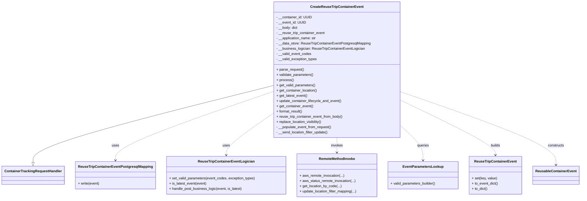
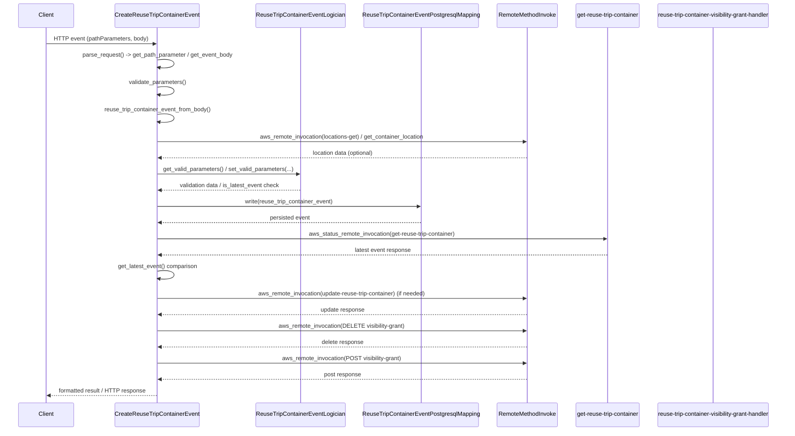

# Diagram: container_tracking_core/container_tracking_service/container_tracking_service/api/reuse_trip_container_event/handlers/post_reuse_trip_container_event.py

> Auto-generated by Obscura crawlers

## Diagram 1

### SVG

<svg id="container" width="2612.9609375" xmlns="http://www.w3.org/2000/svg" class="classDiagram" height="912" viewBox="0 0 2612.9609375 912" role="graphics-document document" aria-roledescription="class"><g><defs><marker id="container_class-aggregationStart" class="marker aggregation class" refX="18" refY="7" markerWidth="190" markerHeight="240" orient="auto"><path d="M 18,7 L9,13 L1,7 L9,1 Z"></path></marker></defs><defs><marker id="container_class-aggregationEnd" class="marker aggregation class" refX="1" refY="7" markerWidth="20" markerHeight="28" orient="auto"><path d="M 18,7 L9,13 L1,7 L9,1 Z"></path></marker></defs><defs><marker id="container_class-extensionStart" class="marker extension class" refX="18" refY="7" markerWidth="190" markerHeight="240" orient="auto"><path d="M 1,7 L18,13 V 1 Z"></path></marker></defs><defs><marker id="container_class-extensionEnd" class="marker extension class" refX="1" refY="7" markerWidth="20" markerHeight="28" orient="auto"><path d="M 1,1 V 13 L18,7 Z"></path></marker></defs><defs><marker id="container_class-compositionStart" class="marker composition class" refX="18" refY="7" markerWidth="190" markerHeight="240" orient="auto"><path d="M 18,7 L9,13 L1,7 L9,1 Z"></path></marker></defs><defs><marker id="container_class-compositionEnd" class="marker composition class" refX="1" refY="7" markerWidth="20" markerHeight="28" orient="auto"><path d="M 18,7 L9,13 L1,7 L9,1 Z"></path></marker></defs><defs><marker id="container_class-dependencyStart" class="marker dependency class" refX="6" refY="7" markerWidth="190" markerHeight="240" orient="auto"><path d="M 5,7 L9,13 L1,7 L9,1 Z"></path></marker></defs><defs><marker id="container_class-dependencyEnd" class="marker dependency class" refX="13" refY="7" markerWidth="20" markerHeight="28" orient="auto"><path d="M 18,7 L9,13 L14,7 L9,1 Z"></path></marker></defs><defs><marker id="container_class-lollipopStart" class="marker lollipop class" refX="13" refY="7" markerWidth="190" markerHeight="240" orient="auto"><circle stroke="black" fill="transparent" cx="7" cy="7" r="6"></circle></marker></defs><defs><marker id="container_class-lollipopEnd" class="marker lollipop class" refX="1" refY="7" markerWidth="190" markerHeight="240" orient="auto"><circle stroke="black" fill="transparent" cx="7" cy="7" r="6"></circle></marker></defs><g class="root"><g class="clusters"></g><g class="edgePaths"><path d="M1222.531,393.287L1043.04,439.239C863.549,485.191,504.568,577.096,325.077,635.839C145.586,694.583,145.586,720.167,145.586,732.958L145.586,745.75" id="id_CreateReuseTripContainerEvent_ContainerTrackingRequestHandler_1" class="edge-thickness-normal edge-pattern-solid relation" style=";;;" data-edge="true" data-et="edge" data-id="id_CreateReuseTripContainerEvent_ContainerTrackingRequestHandler_1" data-points="W3sieCI6MTIyMi41MzEyNSwieSI6MzkzLjI4Njk4OTgzNjEyMjg3fSx7IngiOjE0NS41ODU5Mzc1LCJ5Ijo2Njl9LHsieCI6MTQ1LjU4NTkzNzUsInkiOjc2M31d" marker-end="url(#container_class-extensionEnd)"></path><path d="M1222.531,419.805L1103.408,461.338C984.284,502.87,746.036,585.935,626.913,638.634C507.789,691.333,507.789,713.667,507.789,724.833L507.789,736" id="id_CreateReuseTripContainerEvent_ReuseTripContainerEventPostgresqlMapping_2" class="edge-thickness-normal edge-pattern-dashed relation" style=";;;" data-edge="true" data-et="edge" data-id="id_CreateReuseTripContainerEvent_ReuseTripContainerEventPostgresqlMapping_2" data-points="W3sieCI6MTIyMi41MzEyNSwieSI6NDE5LjgwNTE0NDgzNTA2Nzk1fSx7IngiOjUwNy43ODkwNjI1LCJ5Ijo2Njl9LHsieCI6NTA3Ljc4OTA2MjUsInkiOjc0Mn1d" marker-end="url(#container_class-dependencyEnd)"></path><path d="M1222.531,517.589L1185.971,542.824C1149.411,568.06,1076.292,618.53,1039.732,650.932C1003.172,683.333,1003.172,697.667,1003.172,704.833L1003.172,712" id="id_CreateReuseTripContainerEvent_ReuseTripContainerEventLogician_3" class="edge-thickness-normal edge-pattern-dashed relation" style=";;;" data-edge="true" data-et="edge" data-id="id_CreateReuseTripContainerEvent_ReuseTripContainerEventLogician_3" data-points="W3sieCI6MTIyMi41MzEyNSwieSI6NTE3LjU4OTM0MzI0Mjc2M30seyJ4IjoxMDAzLjE3MTg3NSwieSI6NjY5fSx7IngiOjEwMDMuMTcxODc1LCJ5Ijo3MTh9XQ==" marker-end="url(#container_class-dependencyEnd)"></path><path d="M1508.793,632L1508.793,638.167C1508.793,644.333,1508.793,656.667,1508.793,668C1508.793,679.333,1508.793,689.667,1508.793,694.833L1508.793,700" id="id_CreateReuseTripContainerEvent_RemoteMethodInvoke_4" class="edge-thickness-normal edge-pattern-dashed relation" style=";;;" data-edge="true" data-et="edge" data-id="id_CreateReuseTripContainerEvent_RemoteMethodInvoke_4" data-points="W3sieCI6MTUwOC43OTI5Njg3NSwieSI6NjMyfSx7IngiOjE1MDguNzkyOTY4NzUsInkiOjY2OX0seyJ4IjoxNTA4Ljc5Mjk2ODc1LCJ5Ijo3MDZ9XQ==" marker-end="url(#container_class-dependencyEnd)"></path><path d="M1795.055,572.548L1813.276,588.623C1831.497,604.699,1867.94,636.849,1886.161,664.091C1904.383,691.333,1904.383,713.667,1904.383,724.833L1904.383,736" id="id_CreateReuseTripContainerEvent_EventParametersLookup_5" class="edge-thickness-normal edge-pattern-dashed relation" style=";;;" data-edge="true" data-et="edge" data-id="id_CreateReuseTripContainerEvent_EventParametersLookup_5" data-points="W3sieCI6MTc5NS4wNTQ2ODc1LCJ5Ijo1NzIuNTQ3Nzg3NjE5MzU3OX0seyJ4IjoxOTA0LjM4MjgxMjUsInkiOjY2OX0seyJ4IjoxOTA0LjM4MjgxMjUsInkiOjc0Mn1d" marker-end="url(#container_class-dependencyEnd)"></path><path d="M1795.055,457.813L1868.167,493.011C1941.279,528.209,2087.503,598.604,2160.615,640.969C2233.727,683.333,2233.727,697.667,2233.727,704.833L2233.727,712" id="id_CreateReuseTripContainerEvent_ReuseTripContainerEvent_6" class="edge-thickness-normal edge-pattern-dashed relation" style=";;;" data-edge="true" data-et="edge" data-id="id_CreateReuseTripContainerEvent_ReuseTripContainerEvent_6" data-points="W3sieCI6MTc5NS4wNTQ2ODc1LCJ5Ijo0NTcuODEzMDkxNzE2Mzc0ODZ9LHsieCI6MjIzMy43MjY1NjI1LCJ5Ijo2Njl9LHsieCI6MjIzMy43MjY1NjI1LCJ5Ijo3MTh9XQ==" marker-end="url(#container_class-dependencyEnd)"></path><path d="M1795.055,420.422L1913.154,461.852C2031.253,503.281,2267.451,586.141,2385.549,642.237C2503.648,698.333,2503.648,727.667,2503.648,742.333L2503.648,757" id="id_CreateReuseTripContainerEvent_ReusableContainerEvent_7" class="edge-thickness-normal edge-pattern-dashed relation" style=";;;" data-edge="true" data-et="edge" data-id="id_CreateReuseTripContainerEvent_ReusableContainerEvent_7" data-points="W3sieCI6MTc5NS4wNTQ2ODc1LCJ5Ijo0MjAuNDIxOTYzNzc0NTc0N30seyJ4IjoyNTAzLjY0ODQzNzUsInkiOjY2OX0seyJ4IjoyNTAzLjY0ODQzNzUsInkiOjc2M31d" marker-end="url(#container_class-dependencyEnd)"></path></g><g class="edgeLabels"><g class="edgeLabel"><g class="label" data-id="id_CreateReuseTripContainerEvent_ContainerTrackingRequestHandler_1" transform="translate(0, 0)"><foreignObject width="0" height="0">

</foreignObject></g></g><g class="edgeLabel" transform="translate(507.7890625, 669)"><g class="label" data-id="id_CreateReuseTripContainerEvent_ReuseTripContainerEventPostgresqlMapping_2" transform="translate(-16.4921875, -12)"><foreignObject width="32.984375" height="24">

uses

</foreignObject></g></g><g class="edgeLabel" transform="translate(1003.171875, 669)"><g class="label" data-id="id_CreateReuseTripContainerEvent_ReuseTripContainerEventLogician_3" transform="translate(-16.4921875, -12)"><foreignObject width="32.984375" height="24">

uses

</foreignObject></g></g><g class="edgeLabel" transform="translate(1508.79296875, 669)"><g class="label" data-id="id_CreateReuseTripContainerEvent_RemoteMethodInvoke_4" transform="translate(-27.5859375, -12)"><foreignObject width="55.171875" height="24">

invokes

</foreignObject></g></g><g class="edgeLabel" transform="translate(1904.3828125, 669)"><g class="label" data-id="id_CreateReuseTripContainerEvent_EventParametersLookup_5" transform="translate(-27.2421875, -12)"><foreignObject width="54.484375" height="24">

queries

</foreignObject></g></g><g class="edgeLabel" transform="translate(2233.7265625, 669)"><g class="label" data-id="id_CreateReuseTripContainerEvent_ReuseTripContainerEvent_6" transform="translate(-22.4921875, -12)"><foreignObject width="44.984375" height="24">

builds

</foreignObject></g></g><g class="edgeLabel" transform="translate(2503.6484375, 669)"><g class="label" data-id="id_CreateReuseTripContainerEvent_ReusableContainerEvent_7" transform="translate(-37.84375, -12)"><foreignObject width="75.6875" height="24">

constructs

</foreignObject></g></g></g><g class="nodes"><g class="node default" id="classId-ContainerTrackingRequestHandler-0" transform="translate(145.5859375, 805)"><g class="basic label-container"><path d="M-137.5859375 -42 L137.5859375 -42 L137.5859375 42 L-137.5859375 42" stroke="none" stroke-width="0" fill="#ECECFF" style=""></path><path d="M-137.5859375 -42 C-65.3175064106125 -42, 6.95092467877501 -42, 137.5859375 -42 M-137.5859375 -42 C-66.92606070005857 -42, 3.7338160998828585 -42, 137.5859375 -42 M137.5859375 -42 C137.5859375 -13.588473508319243, 137.5859375 14.823052983361514, 137.5859375 42 M137.5859375 -42 C137.5859375 -12.510325329490978, 137.5859375 16.979349341018043, 137.5859375 42 M137.5859375 42 C52.7010392891292 42, -32.1838589217416 42, -137.5859375 42 M137.5859375 42 C46.71864789119611 42, -44.148641717607774 42, -137.5859375 42 M-137.5859375 42 C-137.5859375 16.325810029304368, -137.5859375 -9.348379941391265, -137.5859375 -42 M-137.5859375 42 C-137.5859375 23.12788841658546, -137.5859375 4.25577683317092, -137.5859375 -42" stroke="#9370DB" stroke-width="1.3" fill="none" stroke-dasharray="0 0" style=""></path></g><g class="annotation-group text" transform="translate(0, -18)"></g><g class="label-group text" transform="translate(-125.5859375, -18)"><g class="label" style="font-weight: bolder" transform="translate(0,-12)"><foreignObject width="251.171875" height="24">

ContainerTrackingRequestHandler

</foreignObject></g></g><g class="members-group text" transform="translate(-125.5859375, 30)"></g><g class="methods-group text" transform="translate(-125.5859375, 60)"></g><g class="divider" style=""><path d="M-137.5859375 6 C-46.97360637841534 6, 43.63872474316932 6, 137.5859375 6 M-137.5859375 6 C-38.14395109927281 6, 61.29803530145438 6, 137.5859375 6" stroke="#9370DB" stroke-width="1.3" fill="none" stroke-dasharray="0 0" style=""></path></g><g class="divider" style=""><path d="M-137.5859375 24 C-71.1995064793795 24, -4.813075458758988 24, 137.5859375 24 M-137.5859375 24 C-73.16918349168479 24, -8.752429483369582 24, 137.5859375 24" stroke="#9370DB" stroke-width="1.3" fill="none" stroke-dasharray="0 0" style=""></path></g></g><g class="node default" id="classId-CreateReuseTripContainerEvent-1" transform="translate(1508.79296875, 320)"><g class="basic label-container"><path d="M-286.26171875 -312 L286.26171875 -312 L286.26171875 312 L-286.26171875 312" stroke="none" stroke-width="0" fill="#ECECFF" style=""></path><path d="M-286.26171875 -312 C-160.5486729158843 -312, -34.83562708176859 -312, 286.26171875 -312 M-286.26171875 -312 C-67.0823387872891 -312, 152.0970411754218 -312, 286.26171875 -312 M286.26171875 -312 C286.26171875 -78.74043188339377, 286.26171875 154.51913623321246, 286.26171875 312 M286.26171875 -312 C286.26171875 -102.20969875071026, 286.26171875 107.58060249857948, 286.26171875 312 M286.26171875 312 C134.19512800260668 312, -17.87146274478664 312, -286.26171875 312 M286.26171875 312 C68.49653548533152 312, -149.26864777933696 312, -286.26171875 312 M-286.26171875 312 C-286.26171875 121.14630034318901, -286.26171875 -69.70739931362198, -286.26171875 -312 M-286.26171875 312 C-286.26171875 65.31691190736208, -286.26171875 -181.36617618527583, -286.26171875 -312" stroke="#9370DB" stroke-width="1.3" fill="none" stroke-dasharray="0 0" style=""></path></g><g class="annotation-group text" transform="translate(0, -288)"></g><g class="label-group text" transform="translate(-115.7734375, -288)"><g class="label" style="font-weight: bolder" transform="translate(0,-12)"><foreignObject width="231.546875" height="24">

CreateReuseTripContainerEvent

</foreignObject></g></g><g class="members-group text" transform="translate(-274.26171875, -240)"><g class="label" style="" transform="translate(0,-12)"><foreignObject width="161.46875" height="24">

- __container_id: UUID

</foreignObject></g><g class="label" style="" transform="translate(0,12)"><foreignObject width="133.875" height="24">

- __event_id: UUID

</foreignObject></g><g class="label" style="" transform="translate(0,36)"><foreignObject width="99.109375" height="24">

- __body: dict

</foreignObject></g><g class="label" style="" transform="translate(0,60)"><foreignObject width="224.6875" height="24">

- __reuse_trip_container_event

</foreignObject></g><g class="label" style="" transform="translate(0,84)"><foreignObject width="185.296875" height="24">

- __application_name: str

</foreignObject></g><g class="label" style="" transform="translate(0,108)"><foreignObject width="432.75" height="24">

- __data_store: ReuseTripContainerEventPostgresqlMapping

</foreignObject></g><g class="label" style="" transform="translate(0,132)"><foreignObject width="405.859375" height="24">

- __business_logician: ReuseTripContainerEventLogician

</foreignObject></g><g class="label" style="" transform="translate(0,156)"><foreignObject width="160.390625" height="24">

- __valid_event_codes

</foreignObject></g><g class="label" style="" transform="translate(0,180)"><foreignObject width="187.640625" height="24">

- __valid_exception_types

</foreignObject></g></g><g class="methods-group text" transform="translate(-274.26171875, 0)"><g class="label" style="" transform="translate(0,-12)"><foreignObject width="126.046875" height="24">

+ parse_request()

</foreignObject></g><g class="label" style="" transform="translate(0,12)"><foreignObject width="170.953125" height="24">

+ validate_parameters()

</foreignObject></g><g class="label" style="" transform="translate(0,36)"><foreignObject width="77.96875" height="24">

+ process()

</foreignObject></g><g class="label" style="" transform="translate(0,60)"><foreignObject width="178.71875" height="24">

+ get_valid_parameters()

</foreignObject></g><g class="label" style="" transform="translate(0,84)"><foreignObject width="188.390625" height="24">

+ get_container_location()

</foreignObject></g><g class="label" style="" transform="translate(0,108)"><foreignObject width="142.46875" height="24">

+ get_latest_event()

</foreignObject></g><g class="label" style="" transform="translate(0,132)"><foreignObject width="300.921875" height="24">

+ update_container_lifecycle_and_event()

</foreignObject></g><g class="label" style="" transform="translate(0,156)"><foreignObject width="169.421875" height="24">

+ get_container_event()

</foreignObject></g><g class="label" style="" transform="translate(0,180)"><foreignObject width="121.5" height="24">

+ format_result()

</foreignObject></g><g class="label" style="" transform="translate(0,204)"><foreignObject width="306.828125" height="24">

+ reuse_trip_container_event_from_body()

</foreignObject></g><g class="label" style="" transform="translate(0,228)"><foreignObject width="211.859375" height="24">

+ replace_location_visibility()

</foreignObject></g><g class="label" style="" transform="translate(0,252)"><foreignObject width="256.484375" height="24">

- __populate_event_from_request()

</foreignObject></g><g class="label" style="" transform="translate(0,276)"><foreignObject width="240.375" height="24">

- __send_location_filter_update()

</foreignObject></g></g><g class="divider" style=""><path d="M-286.26171875 -264 C-95.7384455731272 -264, 94.78482760374561 -264, 286.26171875 -264 M-286.26171875 -264 C-171.02848814007024 -264, -55.795257530140475 -264, 286.26171875 -264" stroke="#9370DB" stroke-width="1.3" fill="none" stroke-dasharray="0 0" style=""></path></g><g class="divider" style=""><path d="M-286.26171875 -24 C-158.4858645136473 -24, -30.710010277294572 -24, 286.26171875 -24 M-286.26171875 -24 C-145.52622345977755 -24, -4.790728169555109 -24, 286.26171875 -24" stroke="#9370DB" stroke-width="1.3" fill="none" stroke-dasharray="0 0" style=""></path></g></g><g class="node default" id="classId-ReuseTripContainerEventPostgresqlMapping-2" transform="translate(507.7890625, 805)"><g class="basic label-container"><path d="M-174.6171875 -63 L174.6171875 -63 L174.6171875 63 L-174.6171875 63" stroke="none" stroke-width="0" fill="#ECECFF" style=""></path><path d="M-174.6171875 -63 C-84.77618935731324 -63, 5.064808785373515 -63, 174.6171875 -63 M-174.6171875 -63 C-47.16032129827583 -63, 80.29654490344834 -63, 174.6171875 -63 M174.6171875 -63 C174.6171875 -31.36071342451938, 174.6171875 0.27857315096124324, 174.6171875 63 M174.6171875 -63 C174.6171875 -16.009618101713535, 174.6171875 30.98076379657293, 174.6171875 63 M174.6171875 63 C104.29890878051441 63, 33.98063006102882 63, -174.6171875 63 M174.6171875 63 C103.01056397517083 63, 31.40394045034165 63, -174.6171875 63 M-174.6171875 63 C-174.6171875 26.11396737271081, -174.6171875 -10.77206525457838, -174.6171875 -63 M-174.6171875 63 C-174.6171875 13.098262000337641, -174.6171875 -36.80347599932472, -174.6171875 -63" stroke="#9370DB" stroke-width="1.3" fill="none" stroke-dasharray="0 0" style=""></path></g><g class="annotation-group text" transform="translate(0, -39)"></g><g class="label-group text" transform="translate(-162.6171875, -39)"><g class="label" style="font-weight: bolder" transform="translate(0,-12)"><foreignObject width="325.234375" height="24">

ReuseTripContainerEventPostgresqlMapping

</foreignObject></g></g><g class="members-group text" transform="translate(-162.6171875, 9)"></g><g class="methods-group text" transform="translate(-162.6171875, 39)"><g class="label" style="" transform="translate(0,-12)"><foreignObject width="99.359375" height="24">

+ write(event)

</foreignObject></g></g><g class="divider" style=""><path d="M-174.6171875 -15 C-80.3111767543454 -15, 13.994833991309207 -15, 174.6171875 -15 M-174.6171875 -15 C-89.86975235246777 -15, -5.122317204935541 -15, 174.6171875 -15" stroke="#9370DB" stroke-width="1.3" fill="none" stroke-dasharray="0 0" style=""></path></g><g class="divider" style=""><path d="M-174.6171875 9 C-80.08484775193529 9, 14.447491996129429 9, 174.6171875 9 M-174.6171875 9 C-35.26003541323229 9, 104.09711667353542 9, 174.6171875 9" stroke="#9370DB" stroke-width="1.3" fill="none" stroke-dasharray="0 0" style=""></path></g></g><g class="node default" id="classId-ReuseTripContainerEventLogician-3" transform="translate(1003.171875, 805)"><g class="basic label-container"><path d="M-270.765625 -87 L270.765625 -87 L270.765625 87 L-270.765625 87" stroke="none" stroke-width="0" fill="#ECECFF" style=""></path><path d="M-270.765625 -87 C-99.56030376545488 -87, 71.64501746909025 -87, 270.765625 -87 M-270.765625 -87 C-105.05611150912034 -87, 60.653401981759316 -87, 270.765625 -87 M270.765625 -87 C270.765625 -18.49598269935977, 270.765625 50.00803460128046, 270.765625 87 M270.765625 -87 C270.765625 -36.60940592963188, 270.765625 13.781188140736234, 270.765625 87 M270.765625 87 C56.23193021290464 87, -158.3017645741907 87, -270.765625 87 M270.765625 87 C141.2776329795618 87, 11.789640959123574 87, -270.765625 87 M-270.765625 87 C-270.765625 41.84269419819309, -270.765625 -3.3146116036138267, -270.765625 -87 M-270.765625 87 C-270.765625 35.54492571157271, -270.765625 -15.910148576854581, -270.765625 -87" stroke="#9370DB" stroke-width="1.3" fill="none" stroke-dasharray="0 0" style=""></path></g><g class="annotation-group text" transform="translate(0, -63)"></g><g class="label-group text" transform="translate(-122.546875, -63)"><g class="label" style="font-weight: bolder" transform="translate(0,-12)"><foreignObject width="245.09375" height="24">

ReuseTripContainerEventLogician

</foreignObject></g></g><g class="members-group text" transform="translate(-258.765625, -15)"></g><g class="methods-group text" transform="translate(-258.765625, 15)"><g class="label" style="" transform="translate(0,-12)"><foreignObject width="394.984375" height="24">

+ set_valid_parameters(event_codes, exception_types)

</foreignObject></g><g class="label" style="" transform="translate(0,12)"><foreignObject width="171.90625" height="24">

+ is_latest_event(event)

</foreignObject></g><g class="label" style="" transform="translate(0,36)"><foreignObject width="336.4375" height="24">

+ handle_post_business_logic(event, is_latest)

</foreignObject></g></g><g class="divider" style=""><path d="M-270.765625 -39 C-131.78686547790133 -39, 7.1918940441973405 -39, 270.765625 -39 M-270.765625 -39 C-121.91681529017092 -39, 26.931994419658167 -39, 270.765625 -39" stroke="#9370DB" stroke-width="1.3" fill="none" stroke-dasharray="0 0" style=""></path></g><g class="divider" style=""><path d="M-270.765625 -15 C-112.84228763492843 -15, 45.08104973014315 -15, 270.765625 -15 M-270.765625 -15 C-60.56233750746517 -15, 149.64094998506965 -15, 270.765625 -15" stroke="#9370DB" stroke-width="1.3" fill="none" stroke-dasharray="0 0" style=""></path></g></g><g class="node default" id="classId-RemoteMethodInvoke-4" transform="translate(1508.79296875, 805)"><g class="basic label-container"><path d="M-184.85546875 -99 L184.85546875 -99 L184.85546875 99 L-184.85546875 99" stroke="none" stroke-width="0" fill="#ECECFF" style=""></path><path d="M-184.85546875 -99 C-108.32163058458943 -99, -31.787792419178857 -99, 184.85546875 -99 M-184.85546875 -99 C-74.6687946204476 -99, 35.5178795091048 -99, 184.85546875 -99 M184.85546875 -99 C184.85546875 -24.263955222127223, 184.85546875 50.472089555745555, 184.85546875 99 M184.85546875 -99 C184.85546875 -30.630108540081963, 184.85546875 37.739782919836074, 184.85546875 99 M184.85546875 99 C93.08627487866728 99, 1.317081007334565 99, -184.85546875 99 M184.85546875 99 C83.41165491879678 99, -18.03215891240643 99, -184.85546875 99 M-184.85546875 99 C-184.85546875 33.57604995575069, -184.85546875 -31.84790008849862, -184.85546875 -99 M-184.85546875 99 C-184.85546875 22.08485358974363, -184.85546875 -54.83029282051274, -184.85546875 -99" stroke="#9370DB" stroke-width="1.3" fill="none" stroke-dasharray="0 0" style=""></path></g><g class="annotation-group text" transform="translate(0, -75)"></g><g class="label-group text" transform="translate(-80.2578125, -75)"><g class="label" style="font-weight: bolder" transform="translate(0,-12)"><foreignObject width="160.515625" height="24">

RemoteMethodInvoke

</foreignObject></g></g><g class="members-group text" transform="translate(-172.85546875, -27)"></g><g class="methods-group text" transform="translate(-172.85546875, 3)"><g class="label" style="" transform="translate(0,-12)"><foreignObject width="205.546875" height="24">

+ aws_remote_invocation(...)

</foreignObject></g><g class="label" style="" transform="translate(0,12)"><foreignObject width="257.9375" height="24">

+ aws_status_remote_invocation(...)

</foreignObject></g><g class="label" style="" transform="translate(0,36)"><foreignObject width="192.109375" height="24">

+ get_location_by_code(...)

</foreignObject></g><g class="label" style="" transform="translate(0,60)"><foreignObject width="265.453125" height="24">

+ update_location_filter_mapping(...)

</foreignObject></g></g><g class="divider" style=""><path d="M-184.85546875 -51 C-76.00805752551832 -51, 32.83935369896335 -51, 184.85546875 -51 M-184.85546875 -51 C-50.73286876245572 -51, 83.38973122508855 -51, 184.85546875 -51" stroke="#9370DB" stroke-width="1.3" fill="none" stroke-dasharray="0 0" style=""></path></g><g class="divider" style=""><path d="M-184.85546875 -27 C-72.15143716249374 -27, 40.55259442501253 -27, 184.85546875 -27 M-184.85546875 -27 C-80.25940627873538 -27, 24.336656192529233 -27, 184.85546875 -27" stroke="#9370DB" stroke-width="1.3" fill="none" stroke-dasharray="0 0" style=""></path></g></g><g class="node default" id="classId-EventParametersLookup-5" transform="translate(1904.3828125, 805)"><g class="basic label-container"><path d="M-160.734375 -63 L160.734375 -63 L160.734375 63 L-160.734375 63" stroke="none" stroke-width="0" fill="#ECECFF" style=""></path><path d="M-160.734375 -63 C-76.87645579013925 -63, 6.981463419721507 -63, 160.734375 -63 M-160.734375 -63 C-57.04292204649373 -63, 46.64853090701254 -63, 160.734375 -63 M160.734375 -63 C160.734375 -22.495927782292803, 160.734375 18.008144435414394, 160.734375 63 M160.734375 -63 C160.734375 -25.11953786717678, 160.734375 12.760924265646437, 160.734375 63 M160.734375 63 C93.00083661666834 63, 25.267298233336675 63, -160.734375 63 M160.734375 63 C62.176563645832445 63, -36.38124770833511 63, -160.734375 63 M-160.734375 63 C-160.734375 26.22078697480194, -160.734375 -10.558426050396122, -160.734375 -63 M-160.734375 63 C-160.734375 15.0142799776485, -160.734375 -32.971440044703, -160.734375 -63" stroke="#9370DB" stroke-width="1.3" fill="none" stroke-dasharray="0 0" style=""></path></g><g class="annotation-group text" transform="translate(0, -39)"></g><g class="label-group text" transform="translate(-88.75, -39)"><g class="label" style="font-weight: bolder" transform="translate(0,-12)"><foreignObject width="177.5" height="24">

EventParametersLookup

</foreignObject></g></g><g class="members-group text" transform="translate(-148.734375, 9)"></g><g class="methods-group text" transform="translate(-148.734375, 39)"><g class="label" style="" transform="translate(0,-12)"><foreignObject width="208.71875" height="24">

+ valid_parameters_builder()

</foreignObject></g></g><g class="divider" style=""><path d="M-160.734375 -15 C-87.5684767710436 -15, -14.402578542087213 -15, 160.734375 -15 M-160.734375 -15 C-61.35069381407506 -15, 38.032987371849885 -15, 160.734375 -15" stroke="#9370DB" stroke-width="1.3" fill="none" stroke-dasharray="0 0" style=""></path></g><g class="divider" style=""><path d="M-160.734375 9 C-62.45916387651431 9, 35.81604724697138 9, 160.734375 9 M-160.734375 9 C-48.06874817724987 9, 64.59687864550025 9, 160.734375 9" stroke="#9370DB" stroke-width="1.3" fill="none" stroke-dasharray="0 0" style=""></path></g></g><g class="node default" id="classId-ReuseTripContainerEvent-6" transform="translate(2233.7265625, 805)"><g class="basic label-container"><path d="M-118.609375 -87 L118.609375 -87 L118.609375 87 L-118.609375 87" stroke="none" stroke-width="0" fill="#ECECFF" style=""></path><path d="M-118.609375 -87 C-34.87775786830832 -87, 48.853859263383356 -87, 118.609375 -87 M-118.609375 -87 C-58.2057701536866 -87, 2.197834692626799 -87, 118.609375 -87 M118.609375 -87 C118.609375 -49.05525029315966, 118.609375 -11.110500586319318, 118.609375 87 M118.609375 -87 C118.609375 -49.72657997058983, 118.609375 -12.453159941179663, 118.609375 87 M118.609375 87 C35.62884527989644 87, -47.35168444020712 87, -118.609375 87 M118.609375 87 C27.602375377152356 87, -63.40462424569529 87, -118.609375 87 M-118.609375 87 C-118.609375 51.27286700976418, -118.609375 15.545734019528354, -118.609375 -87 M-118.609375 87 C-118.609375 49.63712768921366, -118.609375 12.274255378427327, -118.609375 -87" stroke="#9370DB" stroke-width="1.3" fill="none" stroke-dasharray="0 0" style=""></path></g><g class="annotation-group text" transform="translate(0, -63)"></g><g class="label-group text" transform="translate(-92.21875, -63)"><g class="label" style="font-weight: bolder" transform="translate(0,-12)"><foreignObject width="184.4375" height="24">

ReuseTripContainerEvent

</foreignObject></g></g><g class="members-group text" transform="translate(-106.609375, -15)"></g><g class="methods-group text" transform="translate(-106.609375, 15)"><g class="label" style="" transform="translate(0,-12)"><foreignObject width="115.46875" height="24">

+ set(key, value)

</foreignObject></g><g class="label" style="" transform="translate(0,12)"><foreignObject width="121" height="24">

+ to_event_dict()

</foreignObject></g><g class="label" style="" transform="translate(0,36)"><foreignObject width="72.65625" height="24">

+ to_dict()

</foreignObject></g></g><g class="divider" style=""><path d="M-118.609375 -39 C-27.645255681389585 -39, 63.31886363722083 -39, 118.609375 -39 M-118.609375 -39 C-41.17105663180557 -39, 36.26726173638886 -39, 118.609375 -39" stroke="#9370DB" stroke-width="1.3" fill="none" stroke-dasharray="0 0" style=""></path></g><g class="divider" style=""><path d="M-118.609375 -15 C-44.61099109391907 -15, 29.387392812161863 -15, 118.609375 -15 M-118.609375 -15 C-57.553428189110946 -15, 3.5025186217781084 -15, 118.609375 -15" stroke="#9370DB" stroke-width="1.3" fill="none" stroke-dasharray="0 0" style=""></path></g></g><g class="node default" id="classId-ReusableContainerEvent-7" transform="translate(2503.6484375, 805)"><g class="basic label-container"><path d="M-101.3125 -42 L101.3125 -42 L101.3125 42 L-101.3125 42" stroke="none" stroke-width="0" fill="#ECECFF" style=""></path><path d="M-101.3125 -42 C-58.84722080292344 -42, -16.381941605846876 -42, 101.3125 -42 M-101.3125 -42 C-25.517394007591122 -42, 50.277711984817756 -42, 101.3125 -42 M101.3125 -42 C101.3125 -16.858007753456842, 101.3125 8.283984493086315, 101.3125 42 M101.3125 -42 C101.3125 -16.072142385904932, 101.3125 9.855715228190135, 101.3125 42 M101.3125 42 C56.93014459574273 42, 12.547789191485464 42, -101.3125 42 M101.3125 42 C26.030381815283334 42, -49.25173636943333 42, -101.3125 42 M-101.3125 42 C-101.3125 18.075988764378536, -101.3125 -5.848022471242928, -101.3125 -42 M-101.3125 42 C-101.3125 20.924804960647677, -101.3125 -0.15039007870464616, -101.3125 -42" stroke="#9370DB" stroke-width="1.3" fill="none" stroke-dasharray="0 0" style=""></path></g><g class="annotation-group text" transform="translate(0, -18)"></g><g class="label-group text" transform="translate(-89.3125, -18)"><g class="label" style="font-weight: bolder" transform="translate(0,-12)"><foreignObject width="178.625" height="24">

ReusableContainerEvent

</foreignObject></g></g><g class="members-group text" transform="translate(-89.3125, 30)"></g><g class="methods-group text" transform="translate(-89.3125, 60)"></g><g class="divider" style=""><path d="M-101.3125 6 C-37.2703190717411 6, 26.771861856517802 6, 101.3125 6 M-101.3125 6 C-45.198064969881685 6, 10.91637006023663 6, 101.3125 6" stroke="#9370DB" stroke-width="1.3" fill="none" stroke-dasharray="0 0" style=""></path></g><g class="divider" style=""><path d="M-101.3125 24 C-38.66738197892116 24, 23.977736042157673 24, 101.3125 24 M-101.3125 24 C-46.87613407566693 24, 7.560231848666135 24, 101.3125 24" stroke="#9370DB" stroke-width="1.3" fill="none" stroke-dasharray="0 0" style=""></path></g></g></g></g></g></svg>

## Diagram 2

### SVG

<svg id="container" width="2321" xmlns="http://www.w3.org/2000/svg" height="1251" viewBox="-50 -10 2321 1251" role="graphics-document document" aria-roledescription="sequence"><g><rect x="1879" y="1165" fill="#eaeaea" stroke="#666" width="342" height="65" name="Visibility" rx="3" ry="3" class="actor actor-bottom"></rect><text x="2050" y="1197.5" dominant-baseline="central" alignment-baseline="central" class="actor actor-box" style="text-anchor: middle; font-size: 16px; font-weight: 400;"><tspan x="2050" dy="0">reuse-trip-container-visibility-grant-handler</tspan></text></g><g><rect x="1632" y="1165" fill="#eaeaea" stroke="#666" width="197" height="65" name="ContainerService" rx="3" ry="3" class="actor actor-bottom"></rect><text x="1730.5" y="1197.5" dominant-baseline="central" alignment-baseline="central" class="actor actor-box" style="text-anchor: middle; font-size: 16px; font-weight: 400;"><tspan x="1730.5" dy="0">get-reuse-trip-container</tspan></text></g><g><rect x="1403" y="1165" fill="#eaeaea" stroke="#666" width="179" height="65" name="Remote" rx="3" ry="3" class="actor actor-bottom"></rect><text x="1492.5" y="1197.5" dominant-baseline="central" alignment-baseline="central" class="actor actor-box" style="text-anchor: middle; font-size: 16px; font-weight: 400;"><tspan x="1492.5" dy="0">RemoteMethodInvoke</tspan></text></g><g><rect x="1012" y="1165" fill="#eaeaea" stroke="#666" width="341" height="65" name="DataStore" rx="3" ry="3" class="actor actor-bottom"></rect><text x="1182.5" y="1197.5" dominant-baseline="central" alignment-baseline="central" class="actor actor-box" style="text-anchor: middle; font-size: 16px; font-weight: 400;"><tspan x="1182.5" dy="0">ReuseTripContainerEventPostgresqlMapping</tspan></text></g><g><rect x="700" y="1165" fill="#eaeaea" stroke="#666" width="262" height="65" name="Business" rx="3" ry="3" class="actor actor-bottom"></rect><text x="831" y="1197.5" dominant-baseline="central" alignment-baseline="central" class="actor actor-box" style="text-anchor: middle; font-size: 16px; font-weight: 400;"><tspan x="831" dy="0">ReuseTripContainerEventLogician</tspan></text></g><g><rect x="276" y="1165" fill="#eaeaea" stroke="#666" width="248" height="65" name="Handler" rx="3" ry="3" class="actor actor-bottom"></rect><text x="400" y="1197.5" dominant-baseline="central" alignment-baseline="central" class="actor actor-box" style="text-anchor: middle; font-size: 16px; font-weight: 400;"><tspan x="400" dy="0">CreateReuseTripContainerEvent</tspan></text></g><g><rect x="0" y="1165" fill="#eaeaea" stroke="#666" width="150" height="65" name="Client" rx="3" ry="3" class="actor actor-bottom"></rect><text x="75" y="1197.5" dominant-baseline="central" alignment-baseline="central" class="actor actor-box" style="text-anchor: middle; font-size: 16px; font-weight: 400;"><tspan x="75" dy="0">Client</tspan></text></g><g><line id="actor6" x1="2050" y1="65" x2="2050" y2="1165" class="actor-line 200" stroke-width="0.5px" stroke="#999" name="Visibility"></line><g id="root-6"><rect x="1879" y="0" fill="#eaeaea" stroke="#666" width="342" height="65" name="Visibility" rx="3" ry="3" class="actor actor-top"></rect><text x="2050" y="32.5" dominant-baseline="central" alignment-baseline="central" class="actor actor-box" style="text-anchor: middle; font-size: 16px; font-weight: 400;"><tspan x="2050" dy="0">reuse-trip-container-visibility-grant-handler</tspan></text></g></g><g><line id="actor5" x1="1730.5" y1="65" x2="1730.5" y2="1165" class="actor-line 200" stroke-width="0.5px" stroke="#999" name="ContainerService"></line><g id="root-5"><rect x="1632" y="0" fill="#eaeaea" stroke="#666" width="197" height="65" name="ContainerService" rx="3" ry="3" class="actor actor-top"></rect><text x="1730.5" y="32.5" dominant-baseline="central" alignment-baseline="central" class="actor actor-box" style="text-anchor: middle; font-size: 16px; font-weight: 400;"><tspan x="1730.5" dy="0">get-reuse-trip-container</tspan></text></g></g><g><line id="actor4" x1="1492.5" y1="65" x2="1492.5" y2="1165" class="actor-line 200" stroke-width="0.5px" stroke="#999" name="Remote"></line><g id="root-4"><rect x="1403" y="0" fill="#eaeaea" stroke="#666" width="179" height="65" name="Remote" rx="3" ry="3" class="actor actor-top"></rect><text x="1492.5" y="32.5" dominant-baseline="central" alignment-baseline="central" class="actor actor-box" style="text-anchor: middle; font-size: 16px; font-weight: 400;"><tspan x="1492.5" dy="0">RemoteMethodInvoke</tspan></text></g></g><g><line id="actor3" x1="1182.5" y1="65" x2="1182.5" y2="1165" class="actor-line 200" stroke-width="0.5px" stroke="#999" name="DataStore"></line><g id="root-3"><rect x="1012" y="0" fill="#eaeaea" stroke="#666" width="341" height="65" name="DataStore" rx="3" ry="3" class="actor actor-top"></rect><text x="1182.5" y="32.5" dominant-baseline="central" alignment-baseline="central" class="actor actor-box" style="text-anchor: middle; font-size: 16px; font-weight: 400;"><tspan x="1182.5" dy="0">ReuseTripContainerEventPostgresqlMapping</tspan></text></g></g><g><line id="actor2" x1="831" y1="65" x2="831" y2="1165" class="actor-line 200" stroke-width="0.5px" stroke="#999" name="Business"></line><g id="root-2"><rect x="700" y="0" fill="#eaeaea" stroke="#666" width="262" height="65" name="Business" rx="3" ry="3" class="actor actor-top"></rect><text x="831" y="32.5" dominant-baseline="central" alignment-baseline="central" class="actor actor-box" style="text-anchor: middle; font-size: 16px; font-weight: 400;"><tspan x="831" dy="0">ReuseTripContainerEventLogician</tspan></text></g></g><g><line id="actor1" x1="400" y1="65" x2="400" y2="1165" class="actor-line 200" stroke-width="0.5px" stroke="#999" name="Handler"></line><g id="root-1"><rect x="276" y="0" fill="#eaeaea" stroke="#666" width="248" height="65" name="Handler" rx="3" ry="3" class="actor actor-top"></rect><text x="400" y="32.5" dominant-baseline="central" alignment-baseline="central" class="actor actor-box" style="text-anchor: middle; font-size: 16px; font-weight: 400;"><tspan x="400" dy="0">CreateReuseTripContainerEvent</tspan></text></g></g><g><line id="actor0" x1="75" y1="65" x2="75" y2="1165" class="actor-line 200" stroke-width="0.5px" stroke="#999" name="Client"></line><g id="root-0"><rect x="0" y="0" fill="#eaeaea" stroke="#666" width="150" height="65" name="Client" rx="3" ry="3" class="actor actor-top"></rect><text x="75" y="32.5" dominant-baseline="central" alignment-baseline="central" class="actor actor-box" style="text-anchor: middle; font-size: 16px; font-weight: 400;"><tspan x="75" dy="0">Client</tspan></text></g></g><g></g><defs><symbol id="computer" width="24" height="24"><path transform="scale(.5)" d="M2 2v13h20v-13h-20zm18 11h-16v-9h16v9zm-10.228 6l.466-1h3.524l.467 1h-4.457zm14.228 3h-24l2-6h2.104l-1.33 4h18.45l-1.297-4h2.073l2 6zm-5-10h-14v-7h14v7z"></path></symbol></defs><defs><symbol id="database" fill-rule="evenodd" clip-rule="evenodd"><path transform="scale(.5)" d="M12.258.001l.256.004.255.005.253.008.251.01.249.012.247.015.246.016.242.019.241.02.239.023.236.024.233.027.231.028.229.031.225.032.223.034.22.036.217.038.214.04.211.041.208.043.205.045.201.046.198.048.194.05.191.051.187.053.183.054.18.056.175.057.172.059.168.06.163.061.16.063.155.064.15.066.074.033.073.033.071.034.07.034.069.035.068.035.067.035.066.035.064.036.064.036.062.036.06.036.06.037.058.037.058.037.055.038.055.038.053.038.052.038.051.039.05.039.048.039.047.039.045.04.044.04.043.04.041.04.04.041.039.041.037.041.036.041.034.041.033.042.032.042.03.042.029.042.027.042.026.043.024.043.023.043.021.043.02.043.018.044.017.043.015.044.013.044.012.044.011.045.009.044.007.045.006.045.004.045.002.045.001.045v17l-.001.045-.002.045-.004.045-.006.045-.007.045-.009.044-.011.045-.012.044-.013.044-.015.044-.017.043-.018.044-.02.043-.021.043-.023.043-.024.043-.026.043-.027.042-.029.042-.03.042-.032.042-.033.042-.034.041-.036.041-.037.041-.039.041-.04.041-.041.04-.043.04-.044.04-.045.04-.047.039-.048.039-.05.039-.051.039-.052.038-.053.038-.055.038-.055.038-.058.037-.058.037-.06.037-.06.036-.062.036-.064.036-.064.036-.066.035-.067.035-.068.035-.069.035-.07.034-.071.034-.073.033-.074.033-.15.066-.155.064-.16.063-.163.061-.168.06-.172.059-.175.057-.18.056-.183.054-.187.053-.191.051-.194.05-.198.048-.201.046-.205.045-.208.043-.211.041-.214.04-.217.038-.22.036-.223.034-.225.032-.229.031-.231.028-.233.027-.236.024-.239.023-.241.02-.242.019-.246.016-.247.015-.249.012-.251.01-.253.008-.255.005-.256.004-.258.001-.258-.001-.256-.004-.255-.005-.253-.008-.251-.01-.249-.012-.247-.015-.245-.016-.243-.019-.241-.02-.238-.023-.236-.024-.234-.027-.231-.028-.228-.031-.226-.032-.223-.034-.22-.036-.217-.038-.214-.04-.211-.041-.208-.043-.204-.045-.201-.046-.198-.048-.195-.05-.19-.051-.187-.053-.184-.054-.179-.056-.176-.057-.172-.059-.167-.06-.164-.061-.159-.063-.155-.064-.151-.066-.074-.033-.072-.033-.072-.034-.07-.034-.069-.035-.068-.035-.067-.035-.066-.035-.064-.036-.063-.036-.062-.036-.061-.036-.06-.037-.058-.037-.057-.037-.056-.038-.055-.038-.053-.038-.052-.038-.051-.039-.049-.039-.049-.039-.046-.039-.046-.04-.044-.04-.043-.04-.041-.04-.04-.041-.039-.041-.037-.041-.036-.041-.034-.041-.033-.042-.032-.042-.03-.042-.029-.042-.027-.042-.026-.043-.024-.043-.023-.043-.021-.043-.02-.043-.018-.044-.017-.043-.015-.044-.013-.044-.012-.044-.011-.045-.009-.044-.007-.045-.006-.045-.004-.045-.002-.045-.001-.045v-17l.001-.045.002-.045.004-.045.006-.045.007-.045.009-.044.011-.045.012-.044.013-.044.015-.044.017-.043.018-.044.02-.043.021-.043.023-.043.024-.043.026-.043.027-.042.029-.042.03-.042.032-.042.033-.042.034-.041.036-.041.037-.041.039-.041.04-.041.041-.04.043-.04.044-.04.046-.04.046-.039.049-.039.049-.039.051-.039.052-.038.053-.038.055-.038.056-.038.057-.037.058-.037.06-.037.061-.036.062-.036.063-.036.064-.036.066-.035.067-.035.068-.035.069-.035.07-.034.072-.034.072-.033.074-.033.151-.066.155-.064.159-.063.164-.061.167-.06.172-.059.176-.057.179-.056.184-.054.187-.053.19-.051.195-.05.198-.048.201-.046.204-.045.208-.043.211-.041.214-.04.217-.038.22-.036.223-.034.226-.032.228-.031.231-.028.234-.027.236-.024.238-.023.241-.02.243-.019.245-.016.247-.015.249-.012.251-.01.253-.008.255-.005.256-.004.258-.001.258.001zm-9.258 20.499v.01l.001.021.003.021.004.022.005.021.006.022.007.022.009.023.01.022.011.023.012.023.013.023.015.023.016.024.017.023.018.024.019.024.021.024.022.025.023.024.024.025.052.049.056.05.061.051.066.051.07.051.075.051.079.052.084.052.088.052.092.052.097.052.102.051.105.052.11.052.114.051.119.051.123.051.127.05.131.05.135.05.139.048.144.049.147.047.152.047.155.047.16.045.163.045.167.043.171.043.176.041.178.041.183.039.187.039.19.037.194.035.197.035.202.033.204.031.209.03.212.029.216.027.219.025.222.024.226.021.23.02.233.018.236.016.24.015.243.012.246.01.249.008.253.005.256.004.259.001.26-.001.257-.004.254-.005.25-.008.247-.011.244-.012.241-.014.237-.016.233-.018.231-.021.226-.021.224-.024.22-.026.216-.027.212-.028.21-.031.205-.031.202-.034.198-.034.194-.036.191-.037.187-.039.183-.04.179-.04.175-.042.172-.043.168-.044.163-.045.16-.046.155-.046.152-.047.148-.048.143-.049.139-.049.136-.05.131-.05.126-.05.123-.051.118-.052.114-.051.11-.052.106-.052.101-.052.096-.052.092-.052.088-.053.083-.051.079-.052.074-.052.07-.051.065-.051.06-.051.056-.05.051-.05.023-.024.023-.025.021-.024.02-.024.019-.024.018-.024.017-.024.015-.023.014-.024.013-.023.012-.023.01-.023.01-.022.008-.022.006-.022.006-.022.004-.022.004-.021.001-.021.001-.021v-4.127l-.077.055-.08.053-.083.054-.085.053-.087.052-.09.052-.093.051-.095.05-.097.05-.1.049-.102.049-.105.048-.106.047-.109.047-.111.046-.114.045-.115.045-.118.044-.12.043-.122.042-.124.042-.126.041-.128.04-.13.04-.132.038-.134.038-.135.037-.138.037-.139.035-.142.035-.143.034-.144.033-.147.032-.148.031-.15.03-.151.03-.153.029-.154.027-.156.027-.158.026-.159.025-.161.024-.162.023-.163.022-.165.021-.166.02-.167.019-.169.018-.169.017-.171.016-.173.015-.173.014-.175.013-.175.012-.177.011-.178.01-.179.008-.179.008-.181.006-.182.005-.182.004-.184.003-.184.002h-.37l-.184-.002-.184-.003-.182-.004-.182-.005-.181-.006-.179-.008-.179-.008-.178-.01-.176-.011-.176-.012-.175-.013-.173-.014-.172-.015-.171-.016-.17-.017-.169-.018-.167-.019-.166-.02-.165-.021-.163-.022-.162-.023-.161-.024-.159-.025-.157-.026-.156-.027-.155-.027-.153-.029-.151-.03-.15-.03-.148-.031-.146-.032-.145-.033-.143-.034-.141-.035-.14-.035-.137-.037-.136-.037-.134-.038-.132-.038-.13-.04-.128-.04-.126-.041-.124-.042-.122-.042-.12-.044-.117-.043-.116-.045-.113-.045-.112-.046-.109-.047-.106-.047-.105-.048-.102-.049-.1-.049-.097-.05-.095-.05-.093-.052-.09-.051-.087-.052-.085-.053-.083-.054-.08-.054-.077-.054v4.127zm0-5.654v.011l.001.021.003.021.004.021.005.022.006.022.007.022.009.022.01.022.011.023.012.023.013.023.015.024.016.023.017.024.018.024.019.024.021.024.022.024.023.025.024.024.052.05.056.05.061.05.066.051.07.051.075.052.079.051.084.052.088.052.092.052.097.052.102.052.105.052.11.051.114.051.119.052.123.05.127.051.131.05.135.049.139.049.144.048.147.048.152.047.155.046.16.045.163.045.167.044.171.042.176.042.178.04.183.04.187.038.19.037.194.036.197.034.202.033.204.032.209.03.212.028.216.027.219.025.222.024.226.022.23.02.233.018.236.016.24.014.243.012.246.01.249.008.253.006.256.003.259.001.26-.001.257-.003.254-.006.25-.008.247-.01.244-.012.241-.015.237-.016.233-.018.231-.02.226-.022.224-.024.22-.025.216-.027.212-.029.21-.03.205-.032.202-.033.198-.035.194-.036.191-.037.187-.039.183-.039.179-.041.175-.042.172-.043.168-.044.163-.045.16-.045.155-.047.152-.047.148-.048.143-.048.139-.05.136-.049.131-.05.126-.051.123-.051.118-.051.114-.052.11-.052.106-.052.101-.052.096-.052.092-.052.088-.052.083-.052.079-.052.074-.051.07-.052.065-.051.06-.05.056-.051.051-.049.023-.025.023-.024.021-.025.02-.024.019-.024.018-.024.017-.024.015-.023.014-.023.013-.024.012-.022.01-.023.01-.023.008-.022.006-.022.006-.022.004-.021.004-.022.001-.021.001-.021v-4.139l-.077.054-.08.054-.083.054-.085.052-.087.053-.09.051-.093.051-.095.051-.097.05-.1.049-.102.049-.105.048-.106.047-.109.047-.111.046-.114.045-.115.044-.118.044-.12.044-.122.042-.124.042-.126.041-.128.04-.13.039-.132.039-.134.038-.135.037-.138.036-.139.036-.142.035-.143.033-.144.033-.147.033-.148.031-.15.03-.151.03-.153.028-.154.028-.156.027-.158.026-.159.025-.161.024-.162.023-.163.022-.165.021-.166.02-.167.019-.169.018-.169.017-.171.016-.173.015-.173.014-.175.013-.175.012-.177.011-.178.009-.179.009-.179.007-.181.007-.182.005-.182.004-.184.003-.184.002h-.37l-.184-.002-.184-.003-.182-.004-.182-.005-.181-.007-.179-.007-.179-.009-.178-.009-.176-.011-.176-.012-.175-.013-.173-.014-.172-.015-.171-.016-.17-.017-.169-.018-.167-.019-.166-.02-.165-.021-.163-.022-.162-.023-.161-.024-.159-.025-.157-.026-.156-.027-.155-.028-.153-.028-.151-.03-.15-.03-.148-.031-.146-.033-.145-.033-.143-.033-.141-.035-.14-.036-.137-.036-.136-.037-.134-.038-.132-.039-.13-.039-.128-.04-.126-.041-.124-.042-.122-.043-.12-.043-.117-.044-.116-.044-.113-.046-.112-.046-.109-.046-.106-.047-.105-.048-.102-.049-.1-.049-.097-.05-.095-.051-.093-.051-.09-.051-.087-.053-.085-.052-.083-.054-.08-.054-.077-.054v4.139zm0-5.666v.011l.001.02.003.022.004.021.005.022.006.021.007.022.009.023.01.022.011.023.012.023.013.023.015.023.016.024.017.024.018.023.019.024.021.025.022.024.023.024.024.025.052.05.056.05.061.05.066.051.07.051.075.052.079.051.084.052.088.052.092.052.097.052.102.052.105.051.11.052.114.051.119.051.123.051.127.05.131.05.135.05.139.049.144.048.147.048.152.047.155.046.16.045.163.045.167.043.171.043.176.042.178.04.183.04.187.038.19.037.194.036.197.034.202.033.204.032.209.03.212.028.216.027.219.025.222.024.226.021.23.02.233.018.236.017.24.014.243.012.246.01.249.008.253.006.256.003.259.001.26-.001.257-.003.254-.006.25-.008.247-.01.244-.013.241-.014.237-.016.233-.018.231-.02.226-.022.224-.024.22-.025.216-.027.212-.029.21-.03.205-.032.202-.033.198-.035.194-.036.191-.037.187-.039.183-.039.179-.041.175-.042.172-.043.168-.044.163-.045.16-.045.155-.047.152-.047.148-.048.143-.049.139-.049.136-.049.131-.051.126-.05.123-.051.118-.052.114-.051.11-.052.106-.052.101-.052.096-.052.092-.052.088-.052.083-.052.079-.052.074-.052.07-.051.065-.051.06-.051.056-.05.051-.049.023-.025.023-.025.021-.024.02-.024.019-.024.018-.024.017-.024.015-.023.014-.024.013-.023.012-.023.01-.022.01-.023.008-.022.006-.022.006-.022.004-.022.004-.021.001-.021.001-.021v-4.153l-.077.054-.08.054-.083.053-.085.053-.087.053-.09.051-.093.051-.095.051-.097.05-.1.049-.102.048-.105.048-.106.048-.109.046-.111.046-.114.046-.115.044-.118.044-.12.043-.122.043-.124.042-.126.041-.128.04-.13.039-.132.039-.134.038-.135.037-.138.036-.139.036-.142.034-.143.034-.144.033-.147.032-.148.032-.15.03-.151.03-.153.028-.154.028-.156.027-.158.026-.159.024-.161.024-.162.023-.163.023-.165.021-.166.02-.167.019-.169.018-.169.017-.171.016-.173.015-.173.014-.175.013-.175.012-.177.01-.178.01-.179.009-.179.007-.181.006-.182.006-.182.004-.184.003-.184.001-.185.001-.185-.001-.184-.001-.184-.003-.182-.004-.182-.006-.181-.006-.179-.007-.179-.009-.178-.01-.176-.01-.176-.012-.175-.013-.173-.014-.172-.015-.171-.016-.17-.017-.169-.018-.167-.019-.166-.02-.165-.021-.163-.023-.162-.023-.161-.024-.159-.024-.157-.026-.156-.027-.155-.028-.153-.028-.151-.03-.15-.03-.148-.032-.146-.032-.145-.033-.143-.034-.141-.034-.14-.036-.137-.036-.136-.037-.134-.038-.132-.039-.13-.039-.128-.041-.126-.041-.124-.041-.122-.043-.12-.043-.117-.044-.116-.044-.113-.046-.112-.046-.109-.046-.106-.048-.105-.048-.102-.048-.1-.05-.097-.049-.095-.051-.093-.051-.09-.052-.087-.052-.085-.053-.083-.053-.08-.054-.077-.054v4.153zm8.74-8.179l-.257.004-.254.005-.25.008-.247.011-.244.012-.241.014-.237.016-.233.018-.231.021-.226.022-.224.023-.22.026-.216.027-.212.028-.21.031-.205.032-.202.033-.198.034-.194.036-.191.038-.187.038-.183.04-.179.041-.175.042-.172.043-.168.043-.163.045-.16.046-.155.046-.152.048-.148.048-.143.048-.139.049-.136.05-.131.05-.126.051-.123.051-.118.051-.114.052-.11.052-.106.052-.101.052-.096.052-.092.052-.088.052-.083.052-.079.052-.074.051-.07.052-.065.051-.06.05-.056.05-.051.05-.023.025-.023.024-.021.024-.02.025-.019.024-.018.024-.017.023-.015.024-.014.023-.013.023-.012.023-.01.023-.01.022-.008.022-.006.023-.006.021-.004.022-.004.021-.001.021-.001.021.001.021.001.021.004.021.004.022.006.021.006.023.008.022.01.022.01.023.012.023.013.023.014.023.015.024.017.023.018.024.019.024.02.025.021.024.023.024.023.025.051.05.056.05.06.05.065.051.07.052.074.051.079.052.083.052.088.052.092.052.096.052.101.052.106.052.11.052.114.052.118.051.123.051.126.051.131.05.136.05.139.049.143.048.148.048.152.048.155.046.16.046.163.045.168.043.172.043.175.042.179.041.183.04.187.038.191.038.194.036.198.034.202.033.205.032.21.031.212.028.216.027.22.026.224.023.226.022.231.021.233.018.237.016.241.014.244.012.247.011.25.008.254.005.257.004.26.001.26-.001.257-.004.254-.005.25-.008.247-.011.244-.012.241-.014.237-.016.233-.018.231-.021.226-.022.224-.023.22-.026.216-.027.212-.028.21-.031.205-.032.202-.033.198-.034.194-.036.191-.038.187-.038.183-.04.179-.041.175-.042.172-.043.168-.043.163-.045.16-.046.155-.046.152-.048.148-.048.143-.048.139-.049.136-.05.131-.05.126-.051.123-.051.118-.051.114-.052.11-.052.106-.052.101-.052.096-.052.092-.052.088-.052.083-.052.079-.052.074-.051.07-.052.065-.051.06-.05.056-.05.051-.05.023-.025.023-.024.021-.024.02-.025.019-.024.018-.024.017-.023.015-.024.014-.023.013-.023.012-.023.01-.023.01-.022.008-.022.006-.023.006-.021.004-.022.004-.021.001-.021.001-.021-.001-.021-.001-.021-.004-.021-.004-.022-.006-.021-.006-.023-.008-.022-.01-.022-.01-.023-.012-.023-.013-.023-.014-.023-.015-.024-.017-.023-.018-.024-.019-.024-.02-.025-.021-.024-.023-.024-.023-.025-.051-.05-.056-.05-.06-.05-.065-.051-.07-.052-.074-.051-.079-.052-.083-.052-.088-.052-.092-.052-.096-.052-.101-.052-.106-.052-.11-.052-.114-.052-.118-.051-.123-.051-.126-.051-.131-.05-.136-.05-.139-.049-.143-.048-.148-.048-.152-.048-.155-.046-.16-.046-.163-.045-.168-.043-.172-.043-.175-.042-.179-.041-.183-.04-.187-.038-.191-.038-.194-.036-.198-.034-.202-.033-.205-.032-.21-.031-.212-.028-.216-.027-.22-.026-.224-.023-.226-.022-.231-.021-.233-.018-.237-.016-.241-.014-.244-.012-.247-.011-.25-.008-.254-.005-.257-.004-.26-.001-.26.001z"></path></symbol></defs><defs><symbol id="clock" width="24" height="24"><path transform="scale(.5)" d="M12 2c5.514 0 10 4.486 10 10s-4.486 10-10 10-10-4.486-10-10 4.486-10 10-10zm0-2c-6.627 0-12 5.373-12 12s5.373 12 12 12 12-5.373 12-12-5.373-12-12-12zm5.848 12.459c.202.038.202.333.001.372-1.907.361-6.045 1.111-6.547 1.111-.719 0-1.301-.582-1.301-1.301 0-.512.77-5.447 1.125-7.445.034-.192.312-.181.343.014l.985 6.238 5.394 1.011z"></path></symbol></defs><defs><marker id="arrowhead" refX="7.9" refY="5" markerUnits="userSpaceOnUse" markerWidth="12" markerHeight="12" orient="auto-start-reverse"><path d="M -1 0 L 10 5 L 0 10 z"></path></marker></defs><defs><marker id="crosshead" markerWidth="15" markerHeight="8" orient="auto" refX="4" refY="4.5"><path fill="none" stroke="#000000" stroke-width="1pt" d="M 1,2 L 6,7 M 6,2 L 1,7" style="stroke-dasharray: 0, 0;"></path></marker></defs><defs><marker id="filled-head" refX="15.5" refY="7" markerWidth="20" markerHeight="28" orient="auto"><path d="M 18,7 L9,13 L14,7 L9,1 Z"></path></marker></defs><defs><marker id="sequencenumber" refX="15" refY="15" markerWidth="60" markerHeight="40" orient="auto"><circle cx="15" cy="15" r="6"></circle></marker></defs><text x="236" y="80" text-anchor="middle" dominant-baseline="middle" alignment-baseline="middle" class="messageText" dy="1em" style="font-size: 16px; font-weight: 400;">HTTP event (pathParameters, body)</text><line x1="76" y1="113" x2="396" y2="113" class="messageLine0" stroke-width="2" stroke="none" marker-end="url(#arrowhead)" style="fill: none;"></line><text x="401" y="128" text-anchor="middle" dominant-baseline="middle" alignment-baseline="middle" class="messageText" dy="1em" style="font-size: 16px; font-weight: 400;">parse_request() -&gt; get_path_parameter / get_event_body</text><path d="M 401,161 C 461,151 461,191 401,181" class="messageLine0" stroke-width="2" stroke="none" marker-end="url(#arrowhead)" style="fill: none;"></path><text x="401" y="206" text-anchor="middle" dominant-baseline="middle" alignment-baseline="middle" class="messageText" dy="1em" style="font-size: 16px; font-weight: 400;">validate_parameters()</text><path d="M 401,239 C 461,229 461,269 401,259" class="messageLine0" stroke-width="2" stroke="none" marker-end="url(#arrowhead)" style="fill: none;"></path><text x="401" y="284" text-anchor="middle" dominant-baseline="middle" alignment-baseline="middle" class="messageText" dy="1em" style="font-size: 16px; font-weight: 400;">reuse_trip_container_event_from_body()</text><path d="M 401,317 C 461,307 461,347 401,337" class="messageLine0" stroke-width="2" stroke="none" marker-end="url(#arrowhead)" style="fill: none;"></path><text x="945" y="362" text-anchor="middle" dominant-baseline="middle" alignment-baseline="middle" class="messageText" dy="1em" style="font-size: 16px; font-weight: 400;">aws_remote_invocation(locations-get) / get_container_location</text><line x1="401" y1="395" x2="1488.5" y2="395" class="messageLine0" stroke-width="2" stroke="none" marker-end="url(#arrowhead)" style="fill: none;"></line><text x="948" y="410" text-anchor="middle" dominant-baseline="middle" alignment-baseline="middle" class="messageText" dy="1em" style="font-size: 16px; font-weight: 400;">location data (optional)</text><line x1="1491.5" y1="443" x2="404" y2="443" class="messageLine1" stroke-width="2" stroke="none" marker-end="url(#arrowhead)" style="stroke-dasharray: 3, 3; fill: none;"></line><text x="614" y="458" text-anchor="middle" dominant-baseline="middle" alignment-baseline="middle" class="messageText" dy="1em" style="font-size: 16px; font-weight: 400;">get_valid_parameters() / set_valid_parameters(...)</text><line x1="401" y1="491" x2="827" y2="491" class="messageLine0" stroke-width="2" stroke="none" marker-end="url(#arrowhead)" style="fill: none;"></line><text x="617" y="506" text-anchor="middle" dominant-baseline="middle" alignment-baseline="middle" class="messageText" dy="1em" style="font-size: 16px; font-weight: 400;">validation data / is_latest_event check</text><line x1="830" y1="539" x2="404" y2="539" class="messageLine1" stroke-width="2" stroke="none" marker-end="url(#arrowhead)" style="stroke-dasharray: 3, 3; fill: none;"></line><text x="790" y="554" text-anchor="middle" dominant-baseline="middle" alignment-baseline="middle" class="messageText" dy="1em" style="font-size: 16px; font-weight: 400;">write(reuse_trip_container_event)</text><line x1="401" y1="587" x2="1178.5" y2="587" class="messageLine0" stroke-width="2" stroke="none" marker-end="url(#arrowhead)" style="fill: none;"></line><text x="793" y="602" text-anchor="middle" dominant-baseline="middle" alignment-baseline="middle" class="messageText" dy="1em" style="font-size: 16px; font-weight: 400;">persisted event</text><line x1="1181.5" y1="635" x2="404" y2="635" class="messageLine1" stroke-width="2" stroke="none" marker-end="url(#arrowhead)" style="stroke-dasharray: 3, 3; fill: none;"></line><text x="1064" y="650" text-anchor="middle" dominant-baseline="middle" alignment-baseline="middle" class="messageText" dy="1em" style="font-size: 16px; font-weight: 400;">aws_status_remote_invocation(get-reuse-trip-container)</text><line x1="401" y1="683" x2="1726.5" y2="683" class="messageLine0" stroke-width="2" stroke="none" marker-end="url(#arrowhead)" style="fill: none;"></line><text x="1067" y="698" text-anchor="middle" dominant-baseline="middle" alignment-baseline="middle" class="messageText" dy="1em" style="font-size: 16px; font-weight: 400;">latest event response</text><line x1="1729.5" y1="731" x2="404" y2="731" class="messageLine1" stroke-width="2" stroke="none" marker-end="url(#arrowhead)" style="stroke-dasharray: 3, 3; fill: none;"></line><text x="401" y="746" text-anchor="middle" dominant-baseline="middle" alignment-baseline="middle" class="messageText" dy="1em" style="font-size: 16px; font-weight: 400;">get_latest_event() comparison</text><path d="M 401,779 C 461,769 461,809 401,799" class="messageLine0" stroke-width="2" stroke="none" marker-end="url(#arrowhead)" style="fill: none;"></path><text x="945" y="824" text-anchor="middle" dominant-baseline="middle" alignment-baseline="middle" class="messageText" dy="1em" style="font-size: 16px; font-weight: 400;">aws_remote_invocation(update-reuse-trip-container) (if needed)</text><line x1="401" y1="857" x2="1488.5" y2="857" class="messageLine0" stroke-width="2" stroke="none" marker-end="url(#arrowhead)" style="fill: none;"></line><text x="948" y="872" text-anchor="middle" dominant-baseline="middle" alignment-baseline="middle" class="messageText" dy="1em" style="font-size: 16px; font-weight: 400;">update response</text><line x1="1491.5" y1="905" x2="404" y2="905" class="messageLine1" stroke-width="2" stroke="none" marker-end="url(#arrowhead)" style="stroke-dasharray: 3, 3; fill: none;"></line><text x="945" y="920" text-anchor="middle" dominant-baseline="middle" alignment-baseline="middle" class="messageText" dy="1em" style="font-size: 16px; font-weight: 400;">aws_remote_invocation(DELETE visibility-grant)</text><line x1="401" y1="953" x2="1488.5" y2="953" class="messageLine0" stroke-width="2" stroke="none" marker-end="url(#arrowhead)" style="fill: none;"></line><text x="948" y="968" text-anchor="middle" dominant-baseline="middle" alignment-baseline="middle" class="messageText" dy="1em" style="font-size: 16px; font-weight: 400;">delete response</text><line x1="1491.5" y1="1001" x2="404" y2="1001" class="messageLine1" stroke-width="2" stroke="none" marker-end="url(#arrowhead)" style="stroke-dasharray: 3, 3; fill: none;"></line><text x="945" y="1016" text-anchor="middle" dominant-baseline="middle" alignment-baseline="middle" class="messageText" dy="1em" style="font-size: 16px; font-weight: 400;">aws_remote_invocation(POST visibility-grant)</text><line x1="401" y1="1049" x2="1488.5" y2="1049" class="messageLine0" stroke-width="2" stroke="none" marker-end="url(#arrowhead)" style="fill: none;"></line><text x="948" y="1064" text-anchor="middle" dominant-baseline="middle" alignment-baseline="middle" class="messageText" dy="1em" style="font-size: 16px; font-weight: 400;">post response</text><line x1="1491.5" y1="1097" x2="404" y2="1097" class="messageLine1" stroke-width="2" stroke="none" marker-end="url(#arrowhead)" style="stroke-dasharray: 3, 3; fill: none;"></line><text x="239" y="1112" text-anchor="middle" dominant-baseline="middle" alignment-baseline="middle" class="messageText" dy="1em" style="font-size: 16px; font-weight: 400;">formatted result / HTTP response</text><line x1="399" y1="1145" x2="79" y2="1145" class="messageLine1" stroke-width="2" stroke="none" marker-end="url(#arrowhead)" style="stroke-dasharray: 3, 3; fill: none;"></line></svg>
