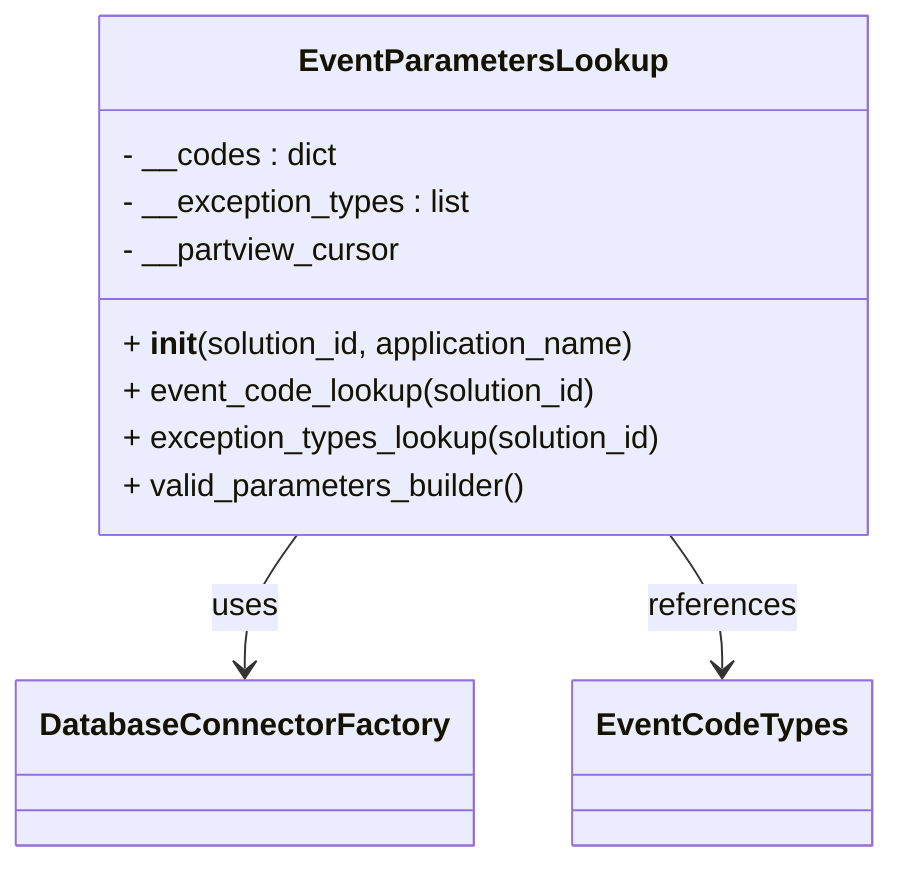

# Diagram: container_tracking_core/container_tracking_service/container_tracking_service/api/reuse_trip_container_event/reuse_trip_container_event_parameters_lookup.py


> Auto-generated by Obscura crawlers

## Diagram 1



> SVG rendering failed for this diagram.

## Diagram 2

```mermaid
flowchart TD
    A[__init__(solution_id, application_name)] --> B[initialize __codes and __exception_types]
    B --> C[DatabaseConnectorFactory.get_connector(os.environ[AWS_STAGE], "us-east-1", "partview", application_name)]
    C --> D[get_primary()]
    D --> E[establish_connection()]
    E --> F[get_cursor() -> __partview_cursor]
    F --> G[event_code_lookup(solution_id)]
    G --> G1[mogrify query & execute]
    G1 --> G2[fetchall() -> for each rec: __codes[rec.name] = rec.code]
    F --> H[exception_types_lookup(solution_id)]
    H --> H1[mogrify query & execute]
    H1 --> H2[fetchall() -> for each rec: __exception_types.append(rec.fv_id)]
    G2 --> I[valid_parameters_builder() returns (__codes, __exception_types)]
    H2 --> I
```

> SVG rendering failed for this diagram.
