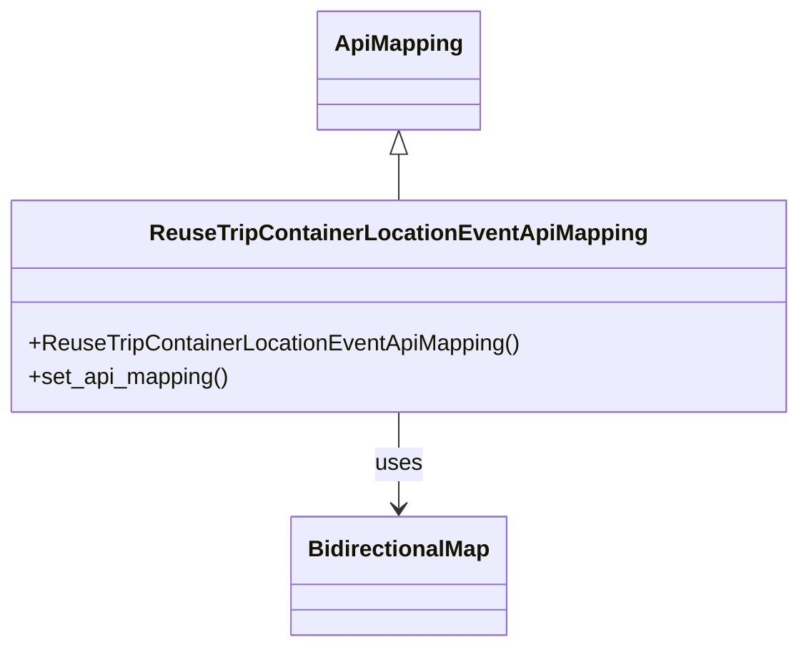

# Diagram: container_tracking_core/container_tracking_service/container_tracking_service/api/reuse_trip_container_location_event/handlers/mapping/reuse_trip_container_location_event_api_mapping.py


> Auto-generated by Obscura crawlers

## Diagram 1



### SVG

<svg id="container" width="554.9296875" xmlns="http://www.w3.org/2000/svg" class="classDiagram" height="458" viewBox="0 0 554.9296875 458" role="graphics-document document" aria-roledescription="class"><style>#container{font-family:"trebuchet ms",verdana,arial,sans-serif;font-size:16px;fill:#333;}@keyframes edge-animation-frame{from{stroke-dashoffset:0;}}@keyframes dash{to{stroke-dashoffset:0;}}#container .edge-animation-slow{stroke-dasharray:9,5!important;stroke-dashoffset:900;animation:dash 50s linear infinite;stroke-linecap:round;}#container .edge-animation-fast{stroke-dasharray:9,5!important;stroke-dashoffset:900;animation:dash 20s linear infinite;stroke-linecap:round;}#container .error-icon{fill:#552222;}#container .error-text{fill:#552222;stroke:#552222;}#container .edge-thickness-normal{stroke-width:1px;}#container .edge-thickness-thick{stroke-width:3.5px;}#container .edge-pattern-solid{stroke-dasharray:0;}#container .edge-thickness-invisible{stroke-width:0;fill:none;}#container .edge-pattern-dashed{stroke-dasharray:3;}#container .edge-pattern-dotted{stroke-dasharray:2;}#container .marker{fill:#333333;stroke:#333333;}#container .marker.cross{stroke:#333333;}#container svg{font-family:"trebuchet ms",verdana,arial,sans-serif;font-size:16px;}#container p{margin:0;}#container g.classGroup text{fill:#9370DB;stroke:none;font-family:"trebuchet ms",verdana,arial,sans-serif;font-size:10px;}#container g.classGroup text .title{font-weight:bolder;}#container .nodeLabel,#container .edgeLabel{color:#131300;}#container .edgeLabel .label rect{fill:#ECECFF;}#container .label text{fill:#131300;}#container .labelBkg{background:#ECECFF;}#container .edgeLabel .label span{background:#ECECFF;}#container .classTitle{font-weight:bolder;}#container .node rect,#container .node circle,#container .node ellipse,#container .node polygon,#container .node path{fill:#ECECFF;stroke:#9370DB;stroke-width:1px;}#container .divider{stroke:#9370DB;stroke-width:1;}#container g.clickable{cursor:pointer;}#container g.classGroup rect{fill:#ECECFF;stroke:#9370DB;}#container g.classGroup line{stroke:#9370DB;stroke-width:1;}#container .classLabel .box{stroke:none;stroke-width:0;fill:#ECECFF;opacity:0.5;}#container .classLabel .label{fill:#9370DB;font-size:10px;}#container .relation{stroke:#333333;stroke-width:1;fill:none;}#container .dashed-line{stroke-dasharray:3;}#container .dotted-line{stroke-dasharray:1 2;}#container #compositionStart,#container .composition{fill:#333333!important;stroke:#333333!important;stroke-width:1;}#container #compositionEnd,#container .composition{fill:#333333!important;stroke:#333333!important;stroke-width:1;}#container #dependencyStart,#container .dependency{fill:#333333!important;stroke:#333333!important;stroke-width:1;}#container #dependencyStart,#container .dependency{fill:#333333!important;stroke:#333333!important;stroke-width:1;}#container #extensionStart,#container .extension{fill:transparent!important;stroke:#333333!important;stroke-width:1;}#container #extensionEnd,#container .extension{fill:transparent!important;stroke:#333333!important;stroke-width:1;}#container #aggregationStart,#container .aggregation{fill:transparent!important;stroke:#333333!important;stroke-width:1;}#container #aggregationEnd,#container .aggregation{fill:transparent!important;stroke:#333333!important;stroke-width:1;}#container #lollipopStart,#container .lollipop{fill:#ECECFF!important;stroke:#333333!important;stroke-width:1;}#container #lollipopEnd,#container .lollipop{fill:#ECECFF!important;stroke:#333333!important;stroke-width:1;}#container .edgeTerminals{font-size:11px;line-height:initial;}#container .classTitleText{text-anchor:middle;font-size:18px;fill:#333;}#container .label-icon{display:inline-block;height:1em;overflow:visible;vertical-align:-0.125em;}#container .node .label-icon path{fill:currentColor;stroke:revert;stroke-width:revert;}#container :root{--mermaid-font-family:"trebuchet ms",verdana,arial,sans-serif;}</style><g><defs><marker id="container_class-aggregationStart" class="marker aggregation class" refX="18" refY="7" markerWidth="190" markerHeight="240" orient="auto"><path d="M 18,7 L9,13 L1,7 L9,1 Z"></path></marker></defs><defs><marker id="container_class-aggregationEnd" class="marker aggregation class" refX="1" refY="7" markerWidth="20" markerHeight="28" orient="auto"><path d="M 18,7 L9,13 L1,7 L9,1 Z"></path></marker></defs><defs><marker id="container_class-extensionStart" class="marker extension class" refX="18" refY="7" markerWidth="190" markerHeight="240" orient="auto"><path d="M 1,7 L18,13 V 1 Z"></path></marker></defs><defs><marker id="container_class-extensionEnd" class="marker extension class" refX="1" refY="7" markerWidth="20" markerHeight="28" orient="auto"><path d="M 1,1 V 13 L18,7 Z"></path></marker></defs><defs><marker id="container_class-compositionStart" class="marker composition class" refX="18" refY="7" markerWidth="190" markerHeight="240" orient="auto"><path d="M 18,7 L9,13 L1,7 L9,1 Z"></path></marker></defs><defs><marker id="container_class-compositionEnd" class="marker composition class" refX="1" refY="7" markerWidth="20" markerHeight="28" orient="auto"><path d="M 18,7 L9,13 L1,7 L9,1 Z"></path></marker></defs><defs><marker id="container_class-dependencyStart" class="marker dependency class" refX="6" refY="7" markerWidth="190" markerHeight="240" orient="auto"><path d="M 5,7 L9,13 L1,7 L9,1 Z"></path></marker></defs><defs><marker id="container_class-dependencyEnd" class="marker dependency class" refX="13" refY="7" markerWidth="20" markerHeight="28" orient="auto"><path d="M 18,7 L9,13 L14,7 L9,1 Z"></path></marker></defs><defs><marker id="container_class-lollipopStart" class="marker lollipop class" refX="13" refY="7" markerWidth="190" markerHeight="240" orient="auto"><circle stroke="black" fill="transparent" cx="7" cy="7" r="6"></circle></marker></defs><defs><marker id="container_class-lollipopEnd" class="marker lollipop class" refX="1" refY="7" markerWidth="190" markerHeight="240" orient="auto"><circle stroke="black" fill="transparent" cx="7" cy="7" r="6"></circle></marker></defs><g class="root"><g class="clusters"></g><g class="edgePaths"><path d="M277.465,109.25L277.465,110.542C277.465,111.833,277.465,114.417,277.465,119.875C277.465,125.333,277.465,133.667,277.465,137.833L277.465,142" id="id_ApiMapping_ReuseTripContainerLocationEventApiMapping_1" class="edge-thickness-normal edge-pattern-solid relation" style=";;;" data-edge="true" data-et="edge" data-id="id_ApiMapping_ReuseTripContainerLocationEventApiMapping_1" data-points="W3sieCI6Mjc3LjQ2NDg0Mzc1LCJ5Ijo5Mn0seyJ4IjoyNzcuNDY0ODQzNzUsInkiOjExN30seyJ4IjoyNzcuNDY0ODQzNzUsInkiOjE0Mn1d" marker-start="url(#container_class-extensionStart)"></path><path d="M277.465,292L277.465,298.167C277.465,304.333,277.465,316.667,277.465,328C277.465,339.333,277.465,349.667,277.465,354.833L277.465,360" id="id_ReuseTripContainerLocationEventApiMapping_BidirectionalMap_2" class="edge-thickness-normal edge-pattern-solid relation" style=";;;" data-edge="true" data-et="edge" data-id="id_ReuseTripContainerLocationEventApiMapping_BidirectionalMap_2" data-points="W3sieCI6Mjc3LjQ2NDg0Mzc1LCJ5IjoyOTJ9LHsieCI6Mjc3LjQ2NDg0Mzc1LCJ5IjozMjl9LHsieCI6Mjc3LjQ2NDg0Mzc1LCJ5IjozNjZ9XQ==" marker-end="url(#container_class-dependencyEnd)"></path></g><g class="edgeLabels"><g class="edgeLabel"><g class="label" data-id="id_ApiMapping_ReuseTripContainerLocationEventApiMapping_1" transform="translate(0, 0)"><foreignObject width="0" height="0"><div xmlns="http://www.w3.org/1999/xhtml" class="labelBkg" style="display: table-cell; white-space: nowrap; line-height: 1.5; max-width: 200px; text-align: center;"><span class="edgeLabel"></span></div></foreignObject></g></g><g class="edgeLabel" transform="translate(277.46484375, 329)"><g class="label" data-id="id_ReuseTripContainerLocationEventApiMapping_BidirectionalMap_2" transform="translate(-16.4921875, -12)"><foreignObject width="32.984375" height="24"><div xmlns="http://www.w3.org/1999/xhtml" class="labelBkg" style="display: table-cell; white-space: nowrap; line-height: 1.5; max-width: 200px; text-align: center;"><span class="edgeLabel"><p>uses</p></span></div></foreignObject></g></g></g><g class="nodes"><g class="node default" id="classId-ApiMapping-0" transform="translate(277.46484375, 50)"><g class="basic label-container"><path d="M-55.2578125 -42 L55.2578125 -42 L55.2578125 42 L-55.2578125 42" stroke="none" stroke-width="0" fill="#ECECFF" style=""></path><path d="M-55.2578125 -42 C-25.12373794623571 -42, 5.010336607528579 -42, 55.2578125 -42 M-55.2578125 -42 C-29.62292865055728 -42, -3.9880448011145617 -42, 55.2578125 -42 M55.2578125 -42 C55.2578125 -13.279751593730154, 55.2578125 15.440496812539692, 55.2578125 42 M55.2578125 -42 C55.2578125 -24.640652582499857, 55.2578125 -7.281305164999715, 55.2578125 42 M55.2578125 42 C30.855690557353235 42, 6.4535686147064695 42, -55.2578125 42 M55.2578125 42 C29.103688142495155 42, 2.9495637849903105 42, -55.2578125 42 M-55.2578125 42 C-55.2578125 21.677770503488716, -55.2578125 1.3555410069774325, -55.2578125 -42 M-55.2578125 42 C-55.2578125 21.891712940792054, -55.2578125 1.7834258815841082, -55.2578125 -42" stroke="#9370DB" stroke-width="1.3" fill="none" stroke-dasharray="0 0" style=""></path></g><g class="annotation-group text" transform="translate(0, -18)"></g><g class="label-group text" transform="translate(-43.2578125, -18)"><g class="label" style="font-weight: bolder" transform="translate(0,-12)"><foreignObject width="86.515625" height="24"><div xmlns="http://www.w3.org/1999/xhtml" style="display: table-cell; white-space: nowrap; line-height: 1.5; max-width: 136px; text-align: center;"><span class="nodeLabel markdown-node-label" style=""><p>ApiMapping</p></span></div></foreignObject></g></g><g class="members-group text" transform="translate(-43.2578125, 30)"></g><g class="methods-group text" transform="translate(-43.2578125, 60)"></g><g class="divider" style=""><path d="M-55.2578125 6 C-13.476976145554247 6, 28.303860208891507 6, 55.2578125 6 M-55.2578125 6 C-17.94285880794216 6, 19.372094884115683 6, 55.2578125 6" stroke="#9370DB" stroke-width="1.3" fill="none" stroke-dasharray="0 0" style=""></path></g><g class="divider" style=""><path d="M-55.2578125 24 C-20.728221740094376 24, 13.801369019811247 24, 55.2578125 24 M-55.2578125 24 C-27.070800574783537 24, 1.116211350432927 24, 55.2578125 24" stroke="#9370DB" stroke-width="1.3" fill="none" stroke-dasharray="0 0" style=""></path></g></g><g class="node default" id="classId-BidirectionalMap-1" transform="translate(277.46484375, 408)"><g class="basic label-container"><path d="M-74.2265625 -42 L74.2265625 -42 L74.2265625 42 L-74.2265625 42" stroke="none" stroke-width="0" fill="#ECECFF" style=""></path><path d="M-74.2265625 -42 C-18.79403037973149 -42, 36.63850174053702 -42, 74.2265625 -42 M-74.2265625 -42 C-21.283967614181748 -42, 31.658627271636504 -42, 74.2265625 -42 M74.2265625 -42 C74.2265625 -10.608607828316597, 74.2265625 20.782784343366806, 74.2265625 42 M74.2265625 -42 C74.2265625 -8.746396501844401, 74.2265625 24.507206996311197, 74.2265625 42 M74.2265625 42 C35.04151571700186 42, -4.143531065996285 42, -74.2265625 42 M74.2265625 42 C41.00912996405996 42, 7.791697428119917 42, -74.2265625 42 M-74.2265625 42 C-74.2265625 23.08213419735685, -74.2265625 4.164268394713702, -74.2265625 -42 M-74.2265625 42 C-74.2265625 14.18045725154158, -74.2265625 -13.639085496916842, -74.2265625 -42" stroke="#9370DB" stroke-width="1.3" fill="none" stroke-dasharray="0 0" style=""></path></g><g class="annotation-group text" transform="translate(0, -18)"></g><g class="label-group text" transform="translate(-62.2265625, -18)"><g class="label" style="font-weight: bolder" transform="translate(0,-12)"><foreignObject width="124.453125" height="24"><div xmlns="http://www.w3.org/1999/xhtml" style="display: table-cell; white-space: nowrap; line-height: 1.5; max-width: 173px; text-align: center;"><span class="nodeLabel markdown-node-label" style=""><p>BidirectionalMap</p></span></div></foreignObject></g></g><g class="members-group text" transform="translate(-62.2265625, 30)"></g><g class="methods-group text" transform="translate(-62.2265625, 60)"></g><g class="divider" style=""><path d="M-74.2265625 6 C-27.504743722327554 6, 19.217075055344893 6, 74.2265625 6 M-74.2265625 6 C-17.01812213300351 6, 40.19031823399298 6, 74.2265625 6" stroke="#9370DB" stroke-width="1.3" fill="none" stroke-dasharray="0 0" style=""></path></g><g class="divider" style=""><path d="M-74.2265625 24 C-33.6414082915356 24, 6.943745916928805 24, 74.2265625 24 M-74.2265625 24 C-37.48089592885641 24, -0.735229357712825 24, 74.2265625 24" stroke="#9370DB" stroke-width="1.3" fill="none" stroke-dasharray="0 0" style=""></path></g></g><g class="node default" id="classId-ReuseTripContainerLocationEventApiMapping-2" transform="translate(277.46484375, 217)"><g class="basic label-container"><path d="M-269.46484375 -75 L269.46484375 -75 L269.46484375 75 L-269.46484375 75" stroke="none" stroke-width="0" fill="#ECECFF" style=""></path><path d="M-269.46484375 -75 C-151.30975729316197 -75, -33.15467083632393 -75, 269.46484375 -75 M-269.46484375 -75 C-125.51063747474285 -75, 18.4435688005143 -75, 269.46484375 -75 M269.46484375 -75 C269.46484375 -33.159998909944576, 269.46484375 8.680002180110847, 269.46484375 75 M269.46484375 -75 C269.46484375 -24.86516816068805, 269.46484375 25.2696636786239, 269.46484375 75 M269.46484375 75 C87.52917571101821 75, -94.40649232796358 75, -269.46484375 75 M269.46484375 75 C86.47288167228237 75, -96.51908040543526 75, -269.46484375 75 M-269.46484375 75 C-269.46484375 29.688655661493847, -269.46484375 -15.622688677012306, -269.46484375 -75 M-269.46484375 75 C-269.46484375 20.920351683709995, -269.46484375 -33.15929663258001, -269.46484375 -75" stroke="#9370DB" stroke-width="1.3" fill="none" stroke-dasharray="0 0" style=""></path></g><g class="annotation-group text" transform="translate(0, -51)"></g><g class="label-group text" transform="translate(-166.8203125, -51)"><g class="label" style="font-weight: bolder" transform="translate(0,-12)"><foreignObject width="333.640625" height="24"><div xmlns="http://www.w3.org/1999/xhtml" style="display: table-cell; white-space: nowrap; line-height: 1.5; max-width: 380px; text-align: center;"><span class="nodeLabel markdown-node-label" style=""><p>ReuseTripContainerLocationEventApiMapping</p></span></div></foreignObject></g></g><g class="members-group text" transform="translate(-257.46484375, -3)"></g><g class="methods-group text" transform="translate(-257.46484375, 27)"><g class="label" style="" transform="translate(0,-12)"><foreignObject width="348.109375" height="24"><div xmlns="http://www.w3.org/1999/xhtml" style="display: table-cell; white-space: nowrap; line-height: 1.5; max-width: 405px; text-align: center;"><span class="nodeLabel markdown-node-label" style=""><p>+ReuseTripContainerLocationEventApiMapping()</p></span></div></foreignObject></g><g class="label" style="" transform="translate(0,12)"><foreignObject width="143" height="24"><div xmlns="http://www.w3.org/1999/xhtml" style="display: table-cell; white-space: nowrap; line-height: 1.5; max-width: 200px; text-align: center;"><span class="nodeLabel markdown-node-label" style=""><p>+set_api_mapping()</p></span></div></foreignObject></g></g><g class="divider" style=""><path d="M-269.46484375 -27 C-86.12614506555417 -27, 97.21255361889166 -27, 269.46484375 -27 M-269.46484375 -27 C-154.06683871305427 -27, -38.668833676108534 -27, 269.46484375 -27" stroke="#9370DB" stroke-width="1.3" fill="none" stroke-dasharray="0 0" style=""></path></g><g class="divider" style=""><path d="M-269.46484375 -3 C-123.35510029905942 -3, 22.75464315188117 -3, 269.46484375 -3 M-269.46484375 -3 C-58.966064321569235 -3, 151.53271510686153 -3, 269.46484375 -3" stroke="#9370DB" stroke-width="1.3" fill="none" stroke-dasharray="0 0" style=""></path></g></g></g></g></g></svg>

## Diagram 2

```mermaid
flowchart LR
subgraph set_api_mapping
A[set_api_name: reuse trip container location event]
B[set_internal_fields: solution_id]
C[set_timestamp_fields: event_ts]
D[set_json_fields: event_metadata]
E[set_bidirectional_map: BidirectionalMap.map_from_dict(...)]
end
A --> B --> C --> D --> E
subgraph mapping
ext_lat["external: latitude"] --> int_lat["internal: latitude"]
ext_lng["external: longitude"] --> int_lng["internal: longitude"]
ext_eventCode["external: eventCode"] --> int_event_code["internal: event_code"]
ext_eventType["external: eventType"] --> int_event_type["internal: event_type"]
ext_actorId["external: actorId"] --> int_actor_id["internal: actor_id"]
ext_actualCreatedTs["external: actualCreatedTs"] --> int_event_ts["internal: event_ts"]
ext_contents["external: contents"] --> int_contents["internal: contents"]
end
E --> mapping
```

> SVG rendering failed for this diagram.
