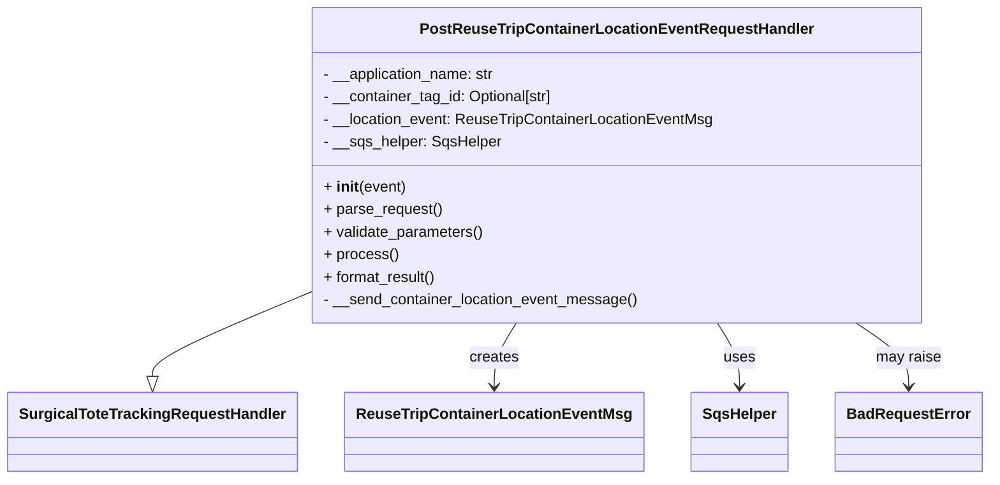

# Diagram: container_tracking_core/container_tracking_service/container_tracking_service/api/reuse_trip_container_location_event/handlers/post_reuse_trip_container_location_event_handler.py


> Auto-generated by Obscura crawlers

## Diagram 1



### SVG

<svg id="container" width="1008.859375" xmlns="http://www.w3.org/2000/svg" class="classDiagram" height="510" viewBox="0 0 1008.859375 510" role="graphics-document document" aria-roledescription="class"><style>#container{font-family:"trebuchet ms",verdana,arial,sans-serif;font-size:16px;fill:#333;}@keyframes edge-animation-frame{from{stroke-dashoffset:0;}}@keyframes dash{to{stroke-dashoffset:0;}}#container .edge-animation-slow{stroke-dasharray:9,5!important;stroke-dashoffset:900;animation:dash 50s linear infinite;stroke-linecap:round;}#container .edge-animation-fast{stroke-dasharray:9,5!important;stroke-dashoffset:900;animation:dash 20s linear infinite;stroke-linecap:round;}#container .error-icon{fill:#552222;}#container .error-text{fill:#552222;stroke:#552222;}#container .edge-thickness-normal{stroke-width:1px;}#container .edge-thickness-thick{stroke-width:3.5px;}#container .edge-pattern-solid{stroke-dasharray:0;}#container .edge-thickness-invisible{stroke-width:0;fill:none;}#container .edge-pattern-dashed{stroke-dasharray:3;}#container .edge-pattern-dotted{stroke-dasharray:2;}#container .marker{fill:#333333;stroke:#333333;}#container .marker.cross{stroke:#333333;}#container svg{font-family:"trebuchet ms",verdana,arial,sans-serif;font-size:16px;}#container p{margin:0;}#container g.classGroup text{fill:#9370DB;stroke:none;font-family:"trebuchet ms",verdana,arial,sans-serif;font-size:10px;}#container g.classGroup text .title{font-weight:bolder;}#container .nodeLabel,#container .edgeLabel{color:#131300;}#container .edgeLabel .label rect{fill:#ECECFF;}#container .label text{fill:#131300;}#container .labelBkg{background:#ECECFF;}#container .edgeLabel .label span{background:#ECECFF;}#container .classTitle{font-weight:bolder;}#container .node rect,#container .node circle,#container .node ellipse,#container .node polygon,#container .node path{fill:#ECECFF;stroke:#9370DB;stroke-width:1px;}#container .divider{stroke:#9370DB;stroke-width:1;}#container g.clickable{cursor:pointer;}#container g.classGroup rect{fill:#ECECFF;stroke:#9370DB;}#container g.classGroup line{stroke:#9370DB;stroke-width:1;}#container .classLabel .box{stroke:none;stroke-width:0;fill:#ECECFF;opacity:0.5;}#container .classLabel .label{fill:#9370DB;font-size:10px;}#container .relation{stroke:#333333;stroke-width:1;fill:none;}#container .dashed-line{stroke-dasharray:3;}#container .dotted-line{stroke-dasharray:1 2;}#container #compositionStart,#container .composition{fill:#333333!important;stroke:#333333!important;stroke-width:1;}#container #compositionEnd,#container .composition{fill:#333333!important;stroke:#333333!important;stroke-width:1;}#container #dependencyStart,#container .dependency{fill:#333333!important;stroke:#333333!important;stroke-width:1;}#container #dependencyStart,#container .dependency{fill:#333333!important;stroke:#333333!important;stroke-width:1;}#container #extensionStart,#container .extension{fill:transparent!important;stroke:#333333!important;stroke-width:1;}#container #extensionEnd,#container .extension{fill:transparent!important;stroke:#333333!important;stroke-width:1;}#container #aggregationStart,#container .aggregation{fill:transparent!important;stroke:#333333!important;stroke-width:1;}#container #aggregationEnd,#container .aggregation{fill:transparent!important;stroke:#333333!important;stroke-width:1;}#container #lollipopStart,#container .lollipop{fill:#ECECFF!important;stroke:#333333!important;stroke-width:1;}#container #lollipopEnd,#container .lollipop{fill:#ECECFF!important;stroke:#333333!important;stroke-width:1;}#container .edgeTerminals{font-size:11px;line-height:initial;}#container .classTitleText{text-anchor:middle;font-size:18px;fill:#333;}#container .label-icon{display:inline-block;height:1em;overflow:visible;vertical-align:-0.125em;}#container .node .label-icon path{fill:currentColor;stroke:revert;stroke-width:revert;}#container :root{--mermaid-font-family:"trebuchet ms",verdana,arial,sans-serif;}</style><g><defs><marker id="container_class-aggregationStart" class="marker aggregation class" refX="18" refY="7" markerWidth="190" markerHeight="240" orient="auto"><path d="M 18,7 L9,13 L1,7 L9,1 Z"></path></marker></defs><defs><marker id="container_class-aggregationEnd" class="marker aggregation class" refX="1" refY="7" markerWidth="20" markerHeight="28" orient="auto"><path d="M 18,7 L9,13 L1,7 L9,1 Z"></path></marker></defs><defs><marker id="container_class-extensionStart" class="marker extension class" refX="18" refY="7" markerWidth="190" markerHeight="240" orient="auto"><path d="M 1,7 L18,13 V 1 Z"></path></marker></defs><defs><marker id="container_class-extensionEnd" class="marker extension class" refX="1" refY="7" markerWidth="20" markerHeight="28" orient="auto"><path d="M 1,1 V 13 L18,7 Z"></path></marker></defs><defs><marker id="container_class-compositionStart" class="marker composition class" refX="18" refY="7" markerWidth="190" markerHeight="240" orient="auto"><path d="M 18,7 L9,13 L1,7 L9,1 Z"></path></marker></defs><defs><marker id="container_class-compositionEnd" class="marker composition class" refX="1" refY="7" markerWidth="20" markerHeight="28" orient="auto"><path d="M 18,7 L9,13 L1,7 L9,1 Z"></path></marker></defs><defs><marker id="container_class-dependencyStart" class="marker dependency class" refX="6" refY="7" markerWidth="190" markerHeight="240" orient="auto"><path d="M 5,7 L9,13 L1,7 L9,1 Z"></path></marker></defs><defs><marker id="container_class-dependencyEnd" class="marker dependency class" refX="13" refY="7" markerWidth="20" markerHeight="28" orient="auto"><path d="M 18,7 L9,13 L14,7 L9,1 Z"></path></marker></defs><defs><marker id="container_class-lollipopStart" class="marker lollipop class" refX="13" refY="7" markerWidth="190" markerHeight="240" orient="auto"><circle stroke="black" fill="transparent" cx="7" cy="7" r="6"></circle></marker></defs><defs><marker id="container_class-lollipopEnd" class="marker lollipop class" refX="1" refY="7" markerWidth="190" markerHeight="240" orient="auto"><circle stroke="black" fill="transparent" cx="7" cy="7" r="6"></circle></marker></defs><g class="root"><g class="clusters"></g><g class="edgePaths"><path d="M308.641,314.429L283.077,325.524C257.513,336.619,206.385,358.81,180.822,373.196C155.258,387.583,155.258,394.167,155.258,397.458L155.258,400.75" id="id_PostReuseTripContainerLocationEventRequestHandler_SurgicalToteTrackingRequestHandler_1" class="edge-thickness-normal edge-pattern-solid relation" style=";;;" data-edge="true" data-et="edge" data-id="id_PostReuseTripContainerLocationEventRequestHandler_SurgicalToteTrackingRequestHandler_1" data-points="W3sieCI6MzA4LjY0MDYyNSwieSI6MzE0LjQyODc0MzkyMTR9LHsieCI6MTU1LjI1NzgxMjUsInkiOjM4MX0seyJ4IjoxNTUuMjU3ODEyNSwieSI6NDE4fV0=" marker-end="url(#container_class-extensionEnd)"></path><path d="M525.192,344L521.433,350.167C517.675,356.333,510.158,368.667,506.399,380C502.641,391.333,502.641,401.667,502.641,406.833L502.641,412" id="id_PostReuseTripContainerLocationEventRequestHandler_ReuseTripContainerLocationEventMsg_2" class="edge-thickness-normal edge-pattern-solid relation" style=";;;" data-edge="true" data-et="edge" data-id="id_PostReuseTripContainerLocationEventRequestHandler_ReuseTripContainerLocationEventMsg_2" data-points="W3sieCI6NTI1LjE5MTczMDE4MjkyNjgsInkiOjM0NH0seyJ4Ijo1MDIuNjQwNjI1LCJ5IjozODF9LHsieCI6NTAyLjY0MDYyNSwieSI6NDE4fV0=" marker-end="url(#container_class-dependencyEnd)"></path><path d="M729.98,344L733.739,350.167C737.497,356.333,745.014,368.667,748.773,380C752.531,391.333,752.531,401.667,752.531,406.833L752.531,412" id="id_PostReuseTripContainerLocationEventRequestHandler_SqsHelper_3" class="edge-thickness-normal edge-pattern-solid relation" style=";;;" data-edge="true" data-et="edge" data-id="id_PostReuseTripContainerLocationEventRequestHandler_SqsHelper_3" data-points="W3sieCI6NzI5Ljk4MDE0NDgxNzA3MzIsInkiOjM0NH0seyJ4Ijo3NTIuNTMxMjUsInkiOjM4MX0seyJ4Ijo3NTIuNTMxMjUsInkiOjQxOH1d" marker-end="url(#container_class-dependencyEnd)"></path><path d="M872.614,344L881.608,350.167C890.602,356.333,908.59,368.667,917.584,380C926.578,391.333,926.578,401.667,926.578,406.833L926.578,412" id="id_PostReuseTripContainerLocationEventRequestHandler_BadRequestError_4" class="edge-thickness-normal edge-pattern-solid relation" style=";;;" data-edge="true" data-et="edge" data-id="id_PostReuseTripContainerLocationEventRequestHandler_BadRequestError_4" data-points="W3sieCI6ODcyLjYxMzY4MTQwMjQzOSwieSI6MzQ0fSx7IngiOjkyNi41NzgxMjUsInkiOjM4MX0seyJ4Ijo5MjYuNTc4MTI1LCJ5Ijo0MTh9XQ==" marker-end="url(#container_class-dependencyEnd)"></path></g><g class="edgeLabels"><g class="edgeLabel"><g class="label" data-id="id_PostReuseTripContainerLocationEventRequestHandler_SurgicalToteTrackingRequestHandler_1" transform="translate(0, 0)"><foreignObject width="0" height="0"><div xmlns="http://www.w3.org/1999/xhtml" class="labelBkg" style="display: table-cell; white-space: nowrap; line-height: 1.5; max-width: 200px; text-align: center;"><span class="edgeLabel"></span></div></foreignObject></g></g><g class="edgeLabel" transform="translate(502.640625, 381)"><g class="label" data-id="id_PostReuseTripContainerLocationEventRequestHandler_ReuseTripContainerLocationEventMsg_2" transform="translate(-26.171875, -12)"><foreignObject width="52.34375" height="24"><div xmlns="http://www.w3.org/1999/xhtml" class="labelBkg" style="display: table-cell; white-space: nowrap; line-height: 1.5; max-width: 200px; text-align: center;"><span class="edgeLabel"><p>creates</p></span></div></foreignObject></g></g><g class="edgeLabel" transform="translate(752.53125, 381)"><g class="label" data-id="id_PostReuseTripContainerLocationEventRequestHandler_SqsHelper_3" transform="translate(-16.4921875, -12)"><foreignObject width="32.984375" height="24"><div xmlns="http://www.w3.org/1999/xhtml" class="labelBkg" style="display: table-cell; white-space: nowrap; line-height: 1.5; max-width: 200px; text-align: center;"><span class="edgeLabel"><p>uses</p></span></div></foreignObject></g></g><g class="edgeLabel" transform="translate(926.578125, 381)"><g class="label" data-id="id_PostReuseTripContainerLocationEventRequestHandler_BadRequestError_4" transform="translate(-34.65625, -12)"><foreignObject width="69.3125" height="24"><div xmlns="http://www.w3.org/1999/xhtml" class="labelBkg" style="display: table-cell; white-space: nowrap; line-height: 1.5; max-width: 200px; text-align: center;"><span class="edgeLabel"><p>may raise</p></span></div></foreignObject></g></g></g><g class="nodes"><g class="node default" id="classId-SurgicalToteTrackingRequestHandler-0" transform="translate(155.2578125, 460)"><g class="basic label-container"><path d="M-147.2578125 -42 L147.2578125 -42 L147.2578125 42 L-147.2578125 42" stroke="none" stroke-width="0" fill="#ECECFF" style=""></path><path d="M-147.2578125 -42 C-73.33116787424049 -42, 0.5954767515190156 -42, 147.2578125 -42 M-147.2578125 -42 C-43.353044277033604 -42, 60.55172394593279 -42, 147.2578125 -42 M147.2578125 -42 C147.2578125 -19.366507124149564, 147.2578125 3.2669857517008722, 147.2578125 42 M147.2578125 -42 C147.2578125 -23.586888800082058, 147.2578125 -5.173777600164115, 147.2578125 42 M147.2578125 42 C57.8038627722257 42, -31.650086955548602 42, -147.2578125 42 M147.2578125 42 C31.22027256302907 42, -84.81726737394186 42, -147.2578125 42 M-147.2578125 42 C-147.2578125 14.365333015272892, -147.2578125 -13.269333969454216, -147.2578125 -42 M-147.2578125 42 C-147.2578125 23.448434322779768, -147.2578125 4.896868645559536, -147.2578125 -42" stroke="#9370DB" stroke-width="1.3" fill="none" stroke-dasharray="0 0" style=""></path></g><g class="annotation-group text" transform="translate(0, -18)"></g><g class="label-group text" transform="translate(-135.2578125, -18)"><g class="label" style="font-weight: bolder" transform="translate(0,-12)"><foreignObject width="270.515625" height="24"><div xmlns="http://www.w3.org/1999/xhtml" style="display: table-cell; white-space: nowrap; line-height: 1.5; max-width: 317px; text-align: center;"><span class="nodeLabel markdown-node-label" style=""><p>SurgicalToteTrackingRequestHandler</p></span></div></foreignObject></g></g><g class="members-group text" transform="translate(-135.2578125, 30)"></g><g class="methods-group text" transform="translate(-135.2578125, 60)"></g><g class="divider" style=""><path d="M-147.2578125 6 C-71.30844501243477 6, 4.640922475130452 6, 147.2578125 6 M-147.2578125 6 C-36.84222167156301 6, 73.57336915687398 6, 147.2578125 6" stroke="#9370DB" stroke-width="1.3" fill="none" stroke-dasharray="0 0" style=""></path></g><g class="divider" style=""><path d="M-147.2578125 24 C-51.098912760897804 24, 45.05998697820439 24, 147.2578125 24 M-147.2578125 24 C-78.92774305678346 24, -10.597673613566911 24, 147.2578125 24" stroke="#9370DB" stroke-width="1.3" fill="none" stroke-dasharray="0 0" style=""></path></g></g><g class="node default" id="classId-PostReuseTripContainerLocationEventRequestHandler-1" transform="translate(627.5859375, 176)"><g class="basic label-container"><path d="M-318.9453125 -168 L318.9453125 -168 L318.9453125 168 L-318.9453125 168" stroke="none" stroke-width="0" fill="#ECECFF" style=""></path><path d="M-318.9453125 -168 C-65.91689539488789 -168, 187.11152171022422 -168, 318.9453125 -168 M-318.9453125 -168 C-154.00951825118813 -168, 10.926275997623748 -168, 318.9453125 -168 M318.9453125 -168 C318.9453125 -89.07363673595476, 318.9453125 -10.147273471909529, 318.9453125 168 M318.9453125 -168 C318.9453125 -58.42559452611229, 318.9453125 51.14881094777542, 318.9453125 168 M318.9453125 168 C182.40509116578502 168, 45.86486983157005 168, -318.9453125 168 M318.9453125 168 C87.98572857536769 168, -142.97385534926462 168, -318.9453125 168 M-318.9453125 168 C-318.9453125 85.63293629701529, -318.9453125 3.265872594030583, -318.9453125 -168 M-318.9453125 168 C-318.9453125 59.62910176591626, -318.9453125 -48.74179646816748, -318.9453125 -168" stroke="#9370DB" stroke-width="1.3" fill="none" stroke-dasharray="0 0" style=""></path></g><g class="annotation-group text" transform="translate(0, -144)"></g><g class="label-group text" transform="translate(-198.8125, -144)"><g class="label" style="font-weight: bolder" transform="translate(0,-12)"><foreignObject width="397.625" height="24"><div xmlns="http://www.w3.org/1999/xhtml" style="display: table-cell; white-space: nowrap; line-height: 1.5; max-width: 443px; text-align: center;"><span class="nodeLabel markdown-node-label" style=""><p>PostReuseTripContainerLocationEventRequestHandler</p></span></div></foreignObject></g></g><g class="members-group text" transform="translate(-306.9453125, -96)"><g class="label" style="" transform="translate(0,-12)"><foreignObject width="185.296875" height="24"><div xmlns="http://www.w3.org/1999/xhtml" style="display: table-cell; white-space: nowrap; line-height: 1.5; max-width: 243px; text-align: center;"><span class="nodeLabel markdown-node-label" style=""><p>- __application_name: str</p></span></div></foreignObject></g><g class="label" style="" transform="translate(0,12)"><foreignObject width="248.390625" height="24"><div xmlns="http://www.w3.org/1999/xhtml" style="display: table-cell; white-space: nowrap; line-height: 1.5; max-width: 306px; text-align: center;"><span class="nodeLabel markdown-node-label" style=""><p>- __container_tag_id: Optional[str]</p></span></div></foreignObject></g><g class="label" style="" transform="translate(0,36)"><foreignObject width="415.078125" height="24"><div xmlns="http://www.w3.org/1999/xhtml" style="display: table-cell; white-space: nowrap; line-height: 1.5; max-width: 473px; text-align: center;"><span class="nodeLabel markdown-node-label" style=""><p>- __location_event: ReuseTripContainerLocationEventMsg</p></span></div></foreignObject></g><g class="label" style="" transform="translate(0,60)"><foreignObject width="189.5625" height="24"><div xmlns="http://www.w3.org/1999/xhtml" style="display: table-cell; white-space: nowrap; line-height: 1.5; max-width: 248px; text-align: center;"><span class="nodeLabel markdown-node-label" style=""><p>- __sqs_helper: SqsHelper</p></span></div></foreignObject></g></g><g class="methods-group text" transform="translate(-306.9453125, 24)"><g class="label" style="" transform="translate(0,-12)"><foreignObject width="87.390625" height="24"><div xmlns="http://www.w3.org/1999/xhtml" style="display: table-cell; white-space: nowrap; line-height: 1.5; max-width: 177px; text-align: center;"><span class="nodeLabel markdown-node-label" style=""><p>+ <strong>init</strong>(event)</p></span></div></foreignObject></g><g class="label" style="" transform="translate(0,12)"><foreignObject width="126.046875" height="24"><div xmlns="http://www.w3.org/1999/xhtml" style="display: table-cell; white-space: nowrap; line-height: 1.5; max-width: 183px; text-align: center;"><span class="nodeLabel markdown-node-label" style=""><p>+ parse_request()</p></span></div></foreignObject></g><g class="label" style="" transform="translate(0,36)"><foreignObject width="170.953125" height="24"><div xmlns="http://www.w3.org/1999/xhtml" style="display: table-cell; white-space: nowrap; line-height: 1.5; max-width: 228px; text-align: center;"><span class="nodeLabel markdown-node-label" style=""><p>+ validate_parameters()</p></span></div></foreignObject></g><g class="label" style="" transform="translate(0,60)"><foreignObject width="77.96875" height="24"><div xmlns="http://www.w3.org/1999/xhtml" style="display: table-cell; white-space: nowrap; line-height: 1.5; max-width: 135px; text-align: center;"><span class="nodeLabel markdown-node-label" style=""><p>+ process()</p></span></div></foreignObject></g><g class="label" style="" transform="translate(0,84)"><foreignObject width="121.5" height="24"><div xmlns="http://www.w3.org/1999/xhtml" style="display: table-cell; white-space: nowrap; line-height: 1.5; max-width: 179px; text-align: center;"><span class="nodeLabel markdown-node-label" style=""><p>+ format_result()</p></span></div></foreignObject></g><g class="label" style="" transform="translate(0,108)"><foreignObject width="334.953125" height="24"><div xmlns="http://www.w3.org/1999/xhtml" style="display: table-cell; white-space: nowrap; line-height: 1.5; max-width: 392px; text-align: center;"><span class="nodeLabel markdown-node-label" style=""><p>- __send_container_location_event_message()</p></span></div></foreignObject></g></g><g class="divider" style=""><path d="M-318.9453125 -120 C-99.75881577224533 -120, 119.42768095550935 -120, 318.9453125 -120 M-318.9453125 -120 C-67.19542519611491 -120, 184.55446210777018 -120, 318.9453125 -120" stroke="#9370DB" stroke-width="1.3" fill="none" stroke-dasharray="0 0" style=""></path></g><g class="divider" style=""><path d="M-318.9453125 0 C-135.5289781510778 0, 47.88735619784438 0, 318.9453125 0 M-318.9453125 0 C-161.07250239789903 0, -3.1996922957980587 0, 318.9453125 0" stroke="#9370DB" stroke-width="1.3" fill="none" stroke-dasharray="0 0" style=""></path></g></g><g class="node default" id="classId-ReuseTripContainerLocationEventMsg-2" transform="translate(502.640625, 460)"><g class="basic label-container"><path d="M-150.125 -42 L150.125 -42 L150.125 42 L-150.125 42" stroke="none" stroke-width="0" fill="#ECECFF" style=""></path><path d="M-150.125 -42 C-67.3915908884677 -42, 15.341818223064593 -42, 150.125 -42 M-150.125 -42 C-76.80870176531782 -42, -3.4924035306356416 -42, 150.125 -42 M150.125 -42 C150.125 -23.00475856204308, 150.125 -4.009517124086159, 150.125 42 M150.125 -42 C150.125 -9.716581777851871, 150.125 22.566836444296257, 150.125 42 M150.125 42 C75.93408674095845 42, 1.743173481916898 42, -150.125 42 M150.125 42 C85.88244868890465 42, 21.63989737780929 42, -150.125 42 M-150.125 42 C-150.125 24.80636656616743, -150.125 7.61273313233486, -150.125 -42 M-150.125 42 C-150.125 21.570601214044867, -150.125 1.1412024280897342, -150.125 -42" stroke="#9370DB" stroke-width="1.3" fill="none" stroke-dasharray="0 0" style=""></path></g><g class="annotation-group text" transform="translate(0, -18)"></g><g class="label-group text" transform="translate(-138.125, -18)"><g class="label" style="font-weight: bolder" transform="translate(0,-12)"><foreignObject width="276.25" height="24"><div xmlns="http://www.w3.org/1999/xhtml" style="display: table-cell; white-space: nowrap; line-height: 1.5; max-width: 323px; text-align: center;"><span class="nodeLabel markdown-node-label" style=""><p>ReuseTripContainerLocationEventMsg</p></span></div></foreignObject></g></g><g class="members-group text" transform="translate(-138.125, 30)"></g><g class="methods-group text" transform="translate(-138.125, 60)"></g><g class="divider" style=""><path d="M-150.125 6 C-41.64955700496549 6, 66.82588599006903 6, 150.125 6 M-150.125 6 C-43.75775998229119 6, 62.60948003541762 6, 150.125 6" stroke="#9370DB" stroke-width="1.3" fill="none" stroke-dasharray="0 0" style=""></path></g><g class="divider" style=""><path d="M-150.125 24 C-82.59347698746835 24, -15.0619539749367 24, 150.125 24 M-150.125 24 C-86.03331508476526 24, -21.941630169530526 24, 150.125 24" stroke="#9370DB" stroke-width="1.3" fill="none" stroke-dasharray="0 0" style=""></path></g></g><g class="node default" id="classId-SqsHelper-3" transform="translate(752.53125, 460)"><g class="basic label-container"><path d="M-49.765625 -42 L49.765625 -42 L49.765625 42 L-49.765625 42" stroke="none" stroke-width="0" fill="#ECECFF" style=""></path><path d="M-49.765625 -42 C-28.63402642341043 -42, -7.502427846820858 -42, 49.765625 -42 M-49.765625 -42 C-20.187007336440672 -42, 9.391610327118656 -42, 49.765625 -42 M49.765625 -42 C49.765625 -19.796309199204337, 49.765625 2.407381601591325, 49.765625 42 M49.765625 -42 C49.765625 -17.377029532062508, 49.765625 7.245940935874984, 49.765625 42 M49.765625 42 C13.969897792771327 42, -21.825829414457345 42, -49.765625 42 M49.765625 42 C27.972948997094797 42, 6.180272994189593 42, -49.765625 42 M-49.765625 42 C-49.765625 18.326129784734274, -49.765625 -5.347740430531452, -49.765625 -42 M-49.765625 42 C-49.765625 24.191148246345737, -49.765625 6.382296492691474, -49.765625 -42" stroke="#9370DB" stroke-width="1.3" fill="none" stroke-dasharray="0 0" style=""></path></g><g class="annotation-group text" transform="translate(0, -18)"></g><g class="label-group text" transform="translate(-37.765625, -18)"><g class="label" style="font-weight: bolder" transform="translate(0,-12)"><foreignObject width="75.53125" height="24"><div xmlns="http://www.w3.org/1999/xhtml" style="display: table-cell; white-space: nowrap; line-height: 1.5; max-width: 125px; text-align: center;"><span class="nodeLabel markdown-node-label" style=""><p>SqsHelper</p></span></div></foreignObject></g></g><g class="members-group text" transform="translate(-37.765625, 30)"></g><g class="methods-group text" transform="translate(-37.765625, 60)"></g><g class="divider" style=""><path d="M-49.765625 6 C-29.07155579412835 6, -8.377486588256701 6, 49.765625 6 M-49.765625 6 C-23.72011881767656 6, 2.325387364646879 6, 49.765625 6" stroke="#9370DB" stroke-width="1.3" fill="none" stroke-dasharray="0 0" style=""></path></g><g class="divider" style=""><path d="M-49.765625 24 C-23.035890609113576 24, 3.6938437817728484 24, 49.765625 24 M-49.765625 24 C-11.478631043831442 24, 26.808362912337117 24, 49.765625 24" stroke="#9370DB" stroke-width="1.3" fill="none" stroke-dasharray="0 0" style=""></path></g></g><g class="node default" id="classId-BadRequestError-4" transform="translate(926.578125, 460)"><g class="basic label-container"><path d="M-74.28125 -42 L74.28125 -42 L74.28125 42 L-74.28125 42" stroke="none" stroke-width="0" fill="#ECECFF" style=""></path><path d="M-74.28125 -42 C-31.650335288958146 -42, 10.980579422083707 -42, 74.28125 -42 M-74.28125 -42 C-36.88348027477645 -42, 0.5142894504470945 -42, 74.28125 -42 M74.28125 -42 C74.28125 -19.174742557521114, 74.28125 3.650514884957772, 74.28125 42 M74.28125 -42 C74.28125 -13.662394722338718, 74.28125 14.675210555322565, 74.28125 42 M74.28125 42 C36.98744374782826 42, -0.30636250434348256 42, -74.28125 42 M74.28125 42 C35.154867656645564 42, -3.971514686708872 42, -74.28125 42 M-74.28125 42 C-74.28125 20.561462677602535, -74.28125 -0.8770746447949307, -74.28125 -42 M-74.28125 42 C-74.28125 13.843082269374683, -74.28125 -14.313835461250633, -74.28125 -42" stroke="#9370DB" stroke-width="1.3" fill="none" stroke-dasharray="0 0" style=""></path></g><g class="annotation-group text" transform="translate(0, -18)"></g><g class="label-group text" transform="translate(-62.28125, -18)"><g class="label" style="font-weight: bolder" transform="translate(0,-12)"><foreignObject width="124.5625" height="24"><div xmlns="http://www.w3.org/1999/xhtml" style="display: table-cell; white-space: nowrap; line-height: 1.5; max-width: 174px; text-align: center;"><span class="nodeLabel markdown-node-label" style=""><p>BadRequestError</p></span></div></foreignObject></g></g><g class="members-group text" transform="translate(-62.28125, 30)"></g><g class="methods-group text" transform="translate(-62.28125, 60)"></g><g class="divider" style=""><path d="M-74.28125 6 C-15.98240731448832 6, 42.31643537102336 6, 74.28125 6 M-74.28125 6 C-36.35093032232591 6, 1.5793893553481837 6, 74.28125 6" stroke="#9370DB" stroke-width="1.3" fill="none" stroke-dasharray="0 0" style=""></path></g><g class="divider" style=""><path d="M-74.28125 24 C-38.313399932560216 24, -2.3455498651204323 24, 74.28125 24 M-74.28125 24 C-34.0503359523028 24, 6.180578095394395 24, 74.28125 24" stroke="#9370DB" stroke-width="1.3" fill="none" stroke-dasharray="0 0" style=""></path></g></g></g></g></g></svg>

## Diagram 2

```mermaid
flowchart TD
    A[Incoming HTTP Event] --> B[parse_request()]
    B --> C{body contains "contents"?}
    C -->|yes| D[Transform contents: json.loads -> {"contents": ...}]
    C -->|no| E[Leave contents unchanged]
    D --> F[Create ReuseTripContainerLocationEventMsg]
    E --> F
    F --> G[validate_parameters()]
    G --> H[process()]
    H --> I[__send_container_location_event_message()]
    I --> J[Generate message_id (uuid1)]
    J --> K[SqsHelper.send(message_json, message_id)]
    K --> L[Return HTTP 202 Accepted]
    K -->|exception| M[Raise BadRequestError with message]
```

> SVG rendering failed for this diagram.
