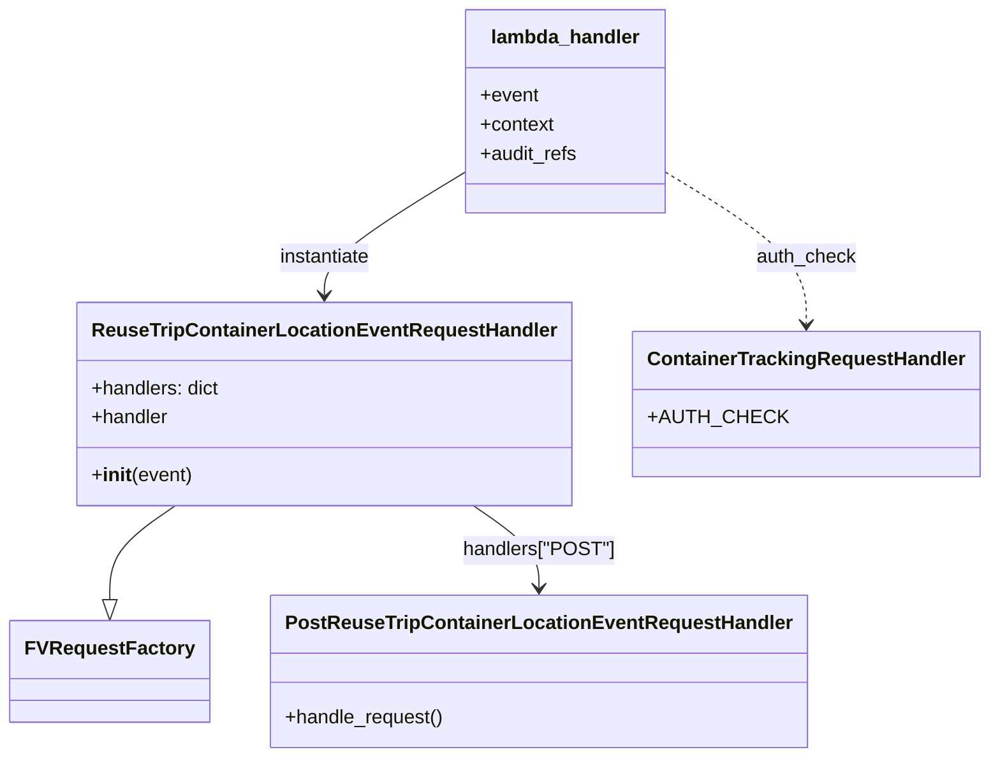

# Diagram: container_tracking_core/container_tracking_service/container_tracking_service/api/reuse_trip_container_location_event/reuse_trip_container_location_event_handler.py


> Auto-generated by Obscura crawlers

## Diagram 1



> SVG rendering failed for this diagram.

## Diagram 2

```mermaid
flowchart TD
    Event[API Event / Lambda Invocation] --> AuthCheck[Decorated by mandatory_lambda_handling\n(auth_check=ContainerTrackingRequestHandler.AUTH_CHECK)]
    AuthCheck --> Instantiate[Create ReuseTripContainerLocationEventRequestHandler(event)]
    Instantiate --> GetHandler[.handler property -> request_handler]
    GetHandler --> Handle[request_handler.handle_request()]
    Handle --> Result[reuse_trip_container_event_data, http_code]
    Result --> Respond[make_response(reuse_trip_container_event_data, http_code)]
    Respond --> Return[Return HTTP response]
```

> SVG rendering failed for this diagram.
