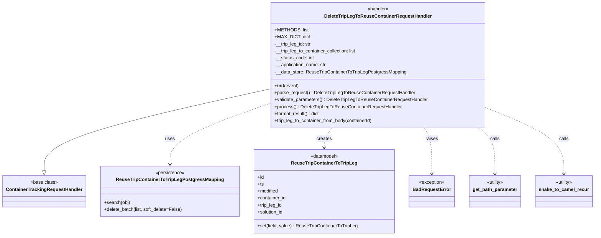
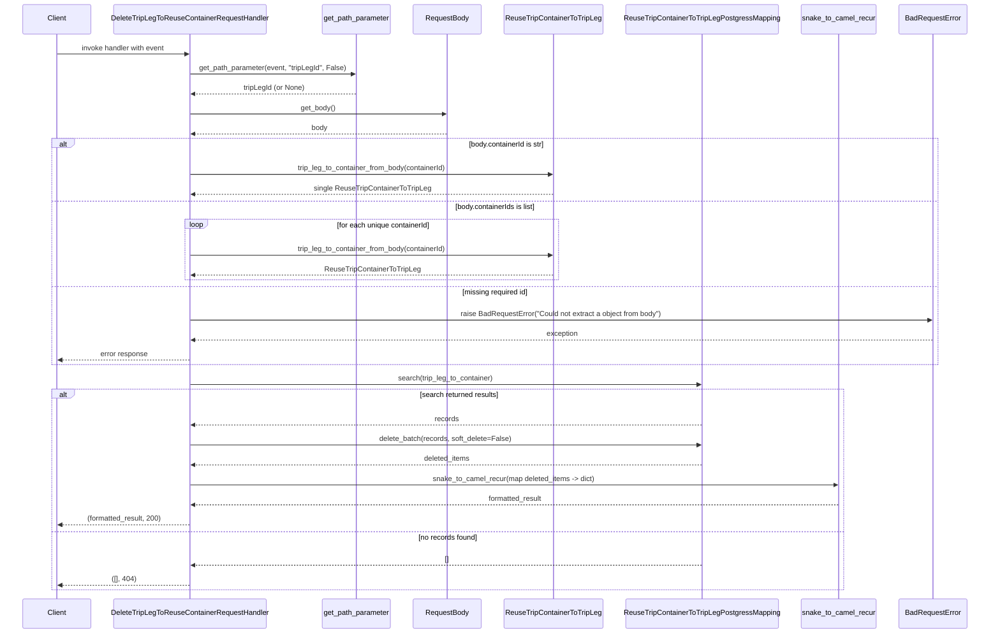

# Diagram: container_tracking_core/container_tracking_service/container_tracking_service/api/reuse_trip_container_to_trip_leg/handlers/delete_reuse_trip_container_to_trip_handler.py

> Auto-generated by Obscura crawlers

## Diagram 1

### SVG

<svg id="container" width="1994.015625" xmlns="http://www.w3.org/2000/svg" class="classDiagram" height="810" viewBox="0 0 1994.015625 810" role="graphics-document document" aria-roledescription="class"><g><defs><marker id="container_class-aggregationStart" class="marker aggregation class" refX="18" refY="7" markerWidth="190" markerHeight="240" orient="auto"><path d="M 18,7 L9,13 L1,7 L9,1 Z"></path></marker></defs><defs><marker id="container_class-aggregationEnd" class="marker aggregation class" refX="1" refY="7" markerWidth="20" markerHeight="28" orient="auto"><path d="M 18,7 L9,13 L1,7 L9,1 Z"></path></marker></defs><defs><marker id="container_class-extensionStart" class="marker extension class" refX="18" refY="7" markerWidth="190" markerHeight="240" orient="auto"><path d="M 1,7 L18,13 V 1 Z"></path></marker></defs><defs><marker id="container_class-extensionEnd" class="marker extension class" refX="1" refY="7" markerWidth="20" markerHeight="28" orient="auto"><path d="M 1,1 V 13 L18,7 Z"></path></marker></defs><defs><marker id="container_class-compositionStart" class="marker composition class" refX="18" refY="7" markerWidth="190" markerHeight="240" orient="auto"><path d="M 18,7 L9,13 L1,7 L9,1 Z"></path></marker></defs><defs><marker id="container_class-compositionEnd" class="marker composition class" refX="1" refY="7" markerWidth="20" markerHeight="28" orient="auto"><path d="M 18,7 L9,13 L1,7 L9,1 Z"></path></marker></defs><defs><marker id="container_class-dependencyStart" class="marker dependency class" refX="6" refY="7" markerWidth="190" markerHeight="240" orient="auto"><path d="M 5,7 L9,13 L1,7 L9,1 Z"></path></marker></defs><defs><marker id="container_class-dependencyEnd" class="marker dependency class" refX="13" refY="7" markerWidth="20" markerHeight="28" orient="auto"><path d="M 18,7 L9,13 L14,7 L9,1 Z"></path></marker></defs><defs><marker id="container_class-lollipopStart" class="marker lollipop class" refX="13" refY="7" markerWidth="190" markerHeight="240" orient="auto"><circle stroke="black" fill="transparent" cx="7" cy="7" r="6"></circle></marker></defs><defs><marker id="container_class-lollipopEnd" class="marker lollipop class" refX="1" refY="7" markerWidth="190" markerHeight="240" orient="auto"><circle stroke="black" fill="transparent" cx="7" cy="7" r="6"></circle></marker></defs><g class="root"><g class="clusters"></g><g class="edgePaths"><path d="M906.566,305.718L779.736,334.265C652.906,362.812,399.246,419.906,272.416,466.745C145.586,513.583,145.586,550.167,145.586,568.458L145.586,586.75" id="id_DeleteTripLegToReuseContainerRequestHandler_ContainerTrackingRequestHandler_1" class="edge-thickness-normal edge-pattern-solid relation" style=";;;" data-edge="true" data-et="edge" data-id="id_DeleteTripLegToReuseContainerRequestHandler_ContainerTrackingRequestHandler_1" data-points="W3sieCI6OTA2LjU2NjQwNjI1LCJ5IjozMDUuNzE4MjM5NDc0NTUzfSx7IngiOjE0NS41ODU5Mzc1LCJ5Ijo0Nzd9LHsieCI6MTQ1LjU4NTkzNzUsInkiOjYwNH1d" marker-end="url(#container_class-extensionEnd)"></path><path d="M906.566,354.783L850.019,375.152C793.471,395.522,680.376,436.261,623.829,471.297C567.281,506.333,567.281,535.667,567.281,550.333L567.281,565" id="id_DeleteTripLegToReuseContainerRequestHandler_ReuseTripContainerToTripLegPostgressMapping_2" class="edge-thickness-normal edge-pattern-dashed relation" style=";;;" data-edge="true" data-et="edge" data-id="id_DeleteTripLegToReuseContainerRequestHandler_ReuseTripContainerToTripLegPostgressMapping_2" data-points="W3sieCI6OTA2LjU2NjQwNjI1LCJ5IjozNTQuNzgyNTQyOTIyNDUzMTZ9LHsieCI6NTY3LjI4MTI1LCJ5Ijo0Nzd9LHsieCI6NTY3LjI4MTI1LCJ5Ijo1NzF9XQ==" marker-end="url(#container_class-dependencyEnd)"></path><path d="M1115.236,440L1110.828,446.167C1106.42,452.333,1097.605,464.667,1093.197,476C1088.789,487.333,1088.789,497.667,1088.789,502.833L1088.789,508" id="id_DeleteTripLegToReuseContainerRequestHandler_ReuseTripContainerToTripLeg_3" class="edge-thickness-normal edge-pattern-dashed relation" style=";;;" data-edge="true" data-et="edge" data-id="id_DeleteTripLegToReuseContainerRequestHandler_ReuseTripContainerToTripLeg_3" data-points="W3sieCI6MTExNS4yMzU5OTYxNzA5NDg1LCJ5Ijo0NDB9LHsieCI6MTA4OC43ODkwNjI1LCJ5Ijo0Nzd9LHsieCI6MTA4OC43ODkwNjI1LCJ5Ijo1MTR9XQ==" marker-end="url(#container_class-dependencyEnd)"></path><path d="M1424.022,440L1428.43,446.167C1432.837,452.333,1441.653,464.667,1446.061,491C1450.469,517.333,1450.469,557.667,1450.469,577.833L1450.469,598" id="id_DeleteTripLegToReuseContainerRequestHandler_BadRequestError_4" class="edge-thickness-normal edge-pattern-dashed relation" style=";;;" data-edge="true" data-et="edge" data-id="id_DeleteTripLegToReuseContainerRequestHandler_BadRequestError_4" data-points="W3sieCI6MTQyNC4wMjE4MTYzMjkwNTE1LCJ5Ijo0NDB9LHsieCI6MTQ1MC40Njg3NSwieSI6NDc3fSx7IngiOjE0NTAuNDY4NzUsInkiOjYwNH1d" marker-end="url(#container_class-dependencyEnd)"></path><path d="M1604.384,440L1613.941,446.167C1623.498,452.333,1642.612,464.667,1652.17,491C1661.727,517.333,1661.727,557.667,1661.727,577.833L1661.727,598" id="id_DeleteTripLegToReuseContainerRequestHandler_get_path_parameter_5" class="edge-thickness-normal edge-pattern-dashed relation" style=";;;" data-edge="true" data-et="edge" data-id="id_DeleteTripLegToReuseContainerRequestHandler_get_path_parameter_5" data-points="W3sieCI6MTYwNC4zODQyMTc1MTQ4MjIsInkiOjQ0MH0seyJ4IjoxNjYxLjcyNjU2MjUsInkiOjQ3N30seyJ4IjoxNjYxLjcyNjU2MjUsInkiOjYwNH1d" marker-end="url(#container_class-dependencyEnd)"></path><path d="M1632.691,371.503L1675.969,389.086C1719.247,406.669,1805.803,441.834,1849.081,479.584C1892.359,517.333,1892.359,557.667,1892.359,577.833L1892.359,598" id="id_DeleteTripLegToReuseContainerRequestHandler_snake_to_camel_recur_6" class="edge-thickness-normal edge-pattern-dashed relation" style=";;;" data-edge="true" data-et="edge" data-id="id_DeleteTripLegToReuseContainerRequestHandler_snake_to_camel_recur_6" data-points="W3sieCI6MTYzMi42OTE0MDYyNSwieSI6MzcxLjUwMzMyMTQzNTk2NDR9LHsieCI6MTg5Mi4zNTkzNzUsInkiOjQ3N30seyJ4IjoxODkyLjM1OTM3NSwieSI6NjA0fV0=" marker-end="url(#container_class-dependencyEnd)"></path></g><g class="edgeLabels"><g class="edgeLabel"><g class="label" data-id="id_DeleteTripLegToReuseContainerRequestHandler_ContainerTrackingRequestHandler_1" transform="translate(0, 0)"><foreignObject width="0" height="0">

</foreignObject></g></g><g class="edgeLabel" transform="translate(567.28125, 477)"><g class="label" data-id="id_DeleteTripLegToReuseContainerRequestHandler_ReuseTripContainerToTripLegPostgressMapping_2" transform="translate(-16.4921875, -12)"><foreignObject width="32.984375" height="24">

uses

</foreignObject></g></g><g class="edgeLabel" transform="translate(1088.7890625, 477)"><g class="label" data-id="id_DeleteTripLegToReuseContainerRequestHandler_ReuseTripContainerToTripLeg_3" transform="translate(-26.171875, -12)"><foreignObject width="52.34375" height="24">

creates

</foreignObject></g></g><g class="edgeLabel" transform="translate(1450.46875, 477)"><g class="label" data-id="id_DeleteTripLegToReuseContainerRequestHandler_BadRequestError_4" transform="translate(-21.25, -12)"><foreignObject width="42.5" height="24">

raises

</foreignObject></g></g><g class="edgeLabel" transform="translate(1661.7265625, 477)"><g class="label" data-id="id_DeleteTripLegToReuseContainerRequestHandler_get_path_parameter_5" transform="translate(-16.4453125, -12)"><foreignObject width="32.890625" height="24">

calls

</foreignObject></g></g><g class="edgeLabel" transform="translate(1892.359375, 477)"><g class="label" data-id="id_DeleteTripLegToReuseContainerRequestHandler_snake_to_camel_recur_6" transform="translate(-16.4453125, -12)"><foreignObject width="32.890625" height="24">

calls

</foreignObject></g></g></g><g class="nodes"><g class="node default" id="classId-DeleteTripLegToReuseContainerRequestHandler-0" transform="translate(1269.62890625, 224)"><g class="basic label-container"><path d="M-363.0625 -216 L363.0625 -216 L363.0625 216 L-363.0625 216" stroke="none" stroke-width="0" fill="#ECECFF" style=""></path><path d="M-363.0625 -216 C-195.559920610125 -216, -28.05734122025001 -216, 363.0625 -216 M-363.0625 -216 C-156.47444935739597 -216, 50.11360128520806 -216, 363.0625 -216 M363.0625 -216 C363.0625 -96.89269435151154, 363.0625 22.214611296976926, 363.0625 216 M363.0625 -216 C363.0625 -50.46806681887347, 363.0625 115.06386636225307, 363.0625 216 M363.0625 216 C137.2811212385578 216, -88.5002575228844 216, -363.0625 216 M363.0625 216 C103.74851246054033 216, -155.56547507891935 216, -363.0625 216 M-363.0625 216 C-363.0625 114.0518219100801, -363.0625 12.103643820160187, -363.0625 -216 M-363.0625 216 C-363.0625 123.76163644558157, -363.0625 31.523272891163145, -363.0625 -216" stroke="#9370DB" stroke-width="1.3" fill="none" stroke-dasharray="0 0" style=""></path></g><g class="annotation-group text" transform="translate(-37.3125, -192)"><g class="label" style="" transform="translate(0,-12)"><foreignObject width="74.625" height="24">

«handler»

</foreignObject></g></g><g class="label-group text" transform="translate(-176.09375, -168)"><g class="label" style="font-weight: bolder" transform="translate(0,-12)"><foreignObject width="352.1875" height="24">

DeleteTripLegToReuseContainerRequestHandler

</foreignObject></g></g><g class="members-group text" transform="translate(-351.0625, -120)"><g class="label" style="" transform="translate(0,-12)"><foreignObject width="108.78125" height="24">

+METHODS: list

</foreignObject></g><g class="label" style="" transform="translate(0,12)"><foreignObject width="113.609375" height="24">

+MAX_DICT: dict

</foreignObject></g><g class="label" style="" transform="translate(0,36)"><foreignObject width="126.765625" height="24">

-__trip_leg_id: str

</foreignObject></g><g class="label" style="" transform="translate(0,60)"><foreignObject width="285.203125" height="24">

-__trip_leg_to_container_collection: list

</foreignObject></g><g class="label" style="" transform="translate(0,84)"><foreignObject width="136.4375" height="24">

-__status_code: int

</foreignObject></g><g class="label" style="" transform="translate(0,108)"><foreignObject width="179.78125" height="24">

-__application_name: str

</foreignObject></g><g class="label" style="" transform="translate(0,132)"><foreignObject width="449.6875" height="24">

-__data_store: ReuseTripContainerToTripLegPostgressMapping

</foreignObject></g></g><g class="methods-group text" transform="translate(-351.0625, 72)"><g class="label" style="" transform="translate(0,-12)"><foreignObject width="83.140625" height="24">

+<strong>init</strong>(event)

</foreignObject></g><g class="label" style="" transform="translate(0,12)"><foreignObject width="481.265625" height="24">

+parse_request() : DeleteTripLegToReuseContainerRequestHandler

</foreignObject></g><g class="label" style="" transform="translate(0,36)"><foreignObject width="526.03125" height="24">

+validate_parameters() : DeleteTripLegToReuseContainerRequestHandler

</foreignObject></g><g class="label" style="" transform="translate(0,60)"><foreignObject width="433.203125" height="24">

+process() : DeleteTripLegToReuseContainerRequestHandler

</foreignObject></g><g class="label" style="" transform="translate(0,84)"><foreignObject width="156.84375" height="24">

+format_result() : dict

</foreignObject></g><g class="label" style="" transform="translate(0,108)"><foreignObject width="342.484375" height="24">

+trip_leg_to_container_from_body(containerId)

</foreignObject></g></g><g class="divider" style=""><path d="M-363.0625 -144 C-129.87822678817017 -144, 103.30604642365967 -144, 363.0625 -144 M-363.0625 -144 C-79.4694783780468 -144, 204.1235432439064 -144, 363.0625 -144" stroke="#9370DB" stroke-width="1.3" fill="none" stroke-dasharray="0 0" style=""></path></g><g class="divider" style=""><path d="M-363.0625 48 C-130.94820038198196 48, 101.16609923603608 48, 363.0625 48 M-363.0625 48 C-183.52686933203842 48, -3.991238664076832 48, 363.0625 48" stroke="#9370DB" stroke-width="1.3" fill="none" stroke-dasharray="0 0" style=""></path></g></g><g class="node default" id="classId-ContainerTrackingRequestHandler-1" transform="translate(145.5859375, 658)"><g class="basic label-container"><path d="M-137.5859375 -54 L137.5859375 -54 L137.5859375 54 L-137.5859375 54" stroke="none" stroke-width="0" fill="#ECECFF" style=""></path><path d="M-137.5859375 -54 C-70.26622472002168 -54, -2.946511940043365 -54, 137.5859375 -54 M-137.5859375 -54 C-39.30611762278109 -54, 58.973702254437825 -54, 137.5859375 -54 M137.5859375 -54 C137.5859375 -19.174366134164522, 137.5859375 15.651267731670956, 137.5859375 54 M137.5859375 -54 C137.5859375 -26.023583983366482, 137.5859375 1.9528320332670361, 137.5859375 54 M137.5859375 54 C36.890934376244815 54, -63.80406874751037 54, -137.5859375 54 M137.5859375 54 C42.317496158526694 54, -52.95094518294661 54, -137.5859375 54 M-137.5859375 54 C-137.5859375 22.440629162520608, -137.5859375 -9.118741674958784, -137.5859375 -54 M-137.5859375 54 C-137.5859375 17.824182236100327, -137.5859375 -18.351635527799345, -137.5859375 -54" stroke="#9370DB" stroke-width="1.3" fill="none" stroke-dasharray="0 0" style=""></path></g><g class="annotation-group text" transform="translate(-46.0859375, -30)"><g class="label" style="" transform="translate(0,-12)"><foreignObject width="92.171875" height="24">

«base class»

</foreignObject></g></g><g class="label-group text" transform="translate(-125.5859375, -6)"><g class="label" style="font-weight: bolder" transform="translate(0,-12)"><foreignObject width="251.171875" height="24">

ContainerTrackingRequestHandler

</foreignObject></g></g><g class="members-group text" transform="translate(-125.5859375, 42)"></g><g class="methods-group text" transform="translate(-125.5859375, 72)"></g><g class="divider" style=""><path d="M-137.5859375 18 C-77.35674897164971 18, -17.127560443299416 18, 137.5859375 18 M-137.5859375 18 C-42.65906307192506 18, 52.26781135614988 18, 137.5859375 18" stroke="#9370DB" stroke-width="1.3" fill="none" stroke-dasharray="0 0" style=""></path></g><g class="divider" style=""><path d="M-137.5859375 36 C-81.99105146405674 36, -26.39616542811349 36, 137.5859375 36 M-137.5859375 36 C-38.85606651737217 36, 59.87380446525566 36, 137.5859375 36" stroke="#9370DB" stroke-width="1.3" fill="none" stroke-dasharray="0 0" style=""></path></g></g><g class="node default" id="classId-ReuseTripContainerToTripLegPostgressMapping-2" transform="translate(567.28125, 658)"><g class="basic label-container"><path d="M-234.109375 -87 L234.109375 -87 L234.109375 87 L-234.109375 87" stroke="none" stroke-width="0" fill="#ECECFF" style=""></path><path d="M-234.109375 -87 C-121.69367662796063 -87, -9.277978255921255 -87, 234.109375 -87 M-234.109375 -87 C-86.13164472773218 -87, 61.84608554453564 -87, 234.109375 -87 M234.109375 -87 C234.109375 -50.8053574655295, 234.109375 -14.610714931058993, 234.109375 87 M234.109375 -87 C234.109375 -18.03400681878111, 234.109375 50.93198636243778, 234.109375 87 M234.109375 87 C121.72705994590312 87, 9.344744891806243 87, -234.109375 87 M234.109375 87 C96.98641808956575 87, -40.13653882086851 87, -234.109375 87 M-234.109375 87 C-234.109375 43.12890576733961, -234.109375 -0.7421884653207798, -234.109375 -87 M-234.109375 87 C-234.109375 34.044510580401585, -234.109375 -18.91097883919683, -234.109375 -87" stroke="#9370DB" stroke-width="1.3" fill="none" stroke-dasharray="0 0" style=""></path></g><g class="annotation-group text" transform="translate(-50.6171875, -63)"><g class="label" style="" transform="translate(0,-12)"><foreignObject width="101.234375" height="24">

«persistence»

</foreignObject></g></g><g class="label-group text" transform="translate(-174.640625, -39)"><g class="label" style="font-weight: bolder" transform="translate(0,-12)"><foreignObject width="349.28125" height="24">

ReuseTripContainerToTripLegPostgressMapping

</foreignObject></g></g><g class="members-group text" transform="translate(-222.109375, 9)"></g><g class="methods-group text" transform="translate(-222.109375, 39)"><g class="label" style="" transform="translate(0,-12)"><foreignObject width="89.140625" height="24">

+search(obj)

</foreignObject></g><g class="label" style="" transform="translate(0,12)"><foreignObject width="269.578125" height="24">

+delete_batch(list, soft_delete=False)

</foreignObject></g></g><g class="divider" style=""><path d="M-234.109375 -15 C-132.76582072381564 -15, -31.422266447631273 -15, 234.109375 -15 M-234.109375 -15 C-61.38487771941885 -15, 111.3396195611623 -15, 234.109375 -15" stroke="#9370DB" stroke-width="1.3" fill="none" stroke-dasharray="0 0" style=""></path></g><g class="divider" style=""><path d="M-234.109375 9 C-68.87968077339468 9, 96.35001345321064 9, 234.109375 9 M-234.109375 9 C-102.0657160007562 9, 29.977942998487606 9, 234.109375 9" stroke="#9370DB" stroke-width="1.3" fill="none" stroke-dasharray="0 0" style=""></path></g></g><g class="node default" id="classId-ReuseTripContainerToTripLeg-3" transform="translate(1088.7890625, 658)"><g class="basic label-container"><path d="M-237.3984375 -144 L237.3984375 -144 L237.3984375 144 L-237.3984375 144" stroke="none" stroke-width="0" fill="#ECECFF" style=""></path><path d="M-237.3984375 -144 C-136.58833363956302 -144, -35.77822977912601 -144, 237.3984375 -144 M-237.3984375 -144 C-134.7169552601186 -144, -32.03547302023716 -144, 237.3984375 -144 M237.3984375 -144 C237.3984375 -79.65056353160715, 237.3984375 -15.301127063214295, 237.3984375 144 M237.3984375 -144 C237.3984375 -44.366099566640244, 237.3984375 55.26780086671951, 237.3984375 144 M237.3984375 144 C63.19130534843708 144, -111.01582680312583 144, -237.3984375 144 M237.3984375 144 C120.27227513327507 144, 3.1461127665501465 144, -237.3984375 144 M-237.3984375 144 C-237.3984375 44.250105113622425, -237.3984375 -55.49978977275515, -237.3984375 -144 M-237.3984375 144 C-237.3984375 74.7322132463131, -237.3984375 5.464426492626188, -237.3984375 -144" stroke="#9370DB" stroke-width="1.3" fill="none" stroke-dasharray="0 0" style=""></path></g><g class="annotation-group text" transform="translate(-48.3046875, -120)"><g class="label" style="" transform="translate(0,-12)"><foreignObject width="96.609375" height="24">

«datamodel»

</foreignObject></g></g><g class="label-group text" transform="translate(-107.609375, -96)"><g class="label" style="font-weight: bolder" transform="translate(0,-12)"><foreignObject width="215.21875" height="24">

ReuseTripContainerToTripLeg

</foreignObject></g></g><g class="members-group text" transform="translate(-225.3984375, -48)"><g class="label" style="" transform="translate(0,-12)"><foreignObject width="22.078125" height="24">

+id

</foreignObject></g><g class="label" style="" transform="translate(0,12)"><foreignObject width="21.15625" height="24">

+ts

</foreignObject></g><g class="label" style="" transform="translate(0,36)"><foreignObject width="72.609375" height="24">

+modified

</foreignObject></g><g class="label" style="" transform="translate(0,60)"><foreignObject width="98.3125" height="24">

+container_id

</foreignObject></g><g class="label" style="" transform="translate(0,84)"><foreignObject width="85.828125" height="24">

+trip_leg_id

</foreignObject></g><g class="label" style="" transform="translate(0,108)"><foreignObject width="90.21875" height="24">

+solution_id

</foreignObject></g></g><g class="methods-group text" transform="translate(-225.3984375, 120)"><g class="label" style="" transform="translate(0,-12)"><foreignObject width="343.1875" height="24">

+set(field, value) : ReuseTripContainerToTripLeg

</foreignObject></g></g><g class="divider" style=""><path d="M-237.3984375 -72 C-88.47167324348948 -72, 60.45509101302105 -72, 237.3984375 -72 M-237.3984375 -72 C-132.1893492612637 -72, -26.980261022527372 -72, 237.3984375 -72" stroke="#9370DB" stroke-width="1.3" fill="none" stroke-dasharray="0 0" style=""></path></g><g class="divider" style=""><path d="M-237.3984375 96 C-104.1466001382278 96, 29.105237223544407 96, 237.3984375 96 M-237.3984375 96 C-101.07782681863605 96, 35.24278386272789 96, 237.3984375 96" stroke="#9370DB" stroke-width="1.3" fill="none" stroke-dasharray="0 0" style=""></path></g></g><g class="node default" id="classId-BadRequestError-4" transform="translate(1450.46875, 658)"><g class="basic label-container"><path d="M-74.28125 -54 L74.28125 -54 L74.28125 54 L-74.28125 54" stroke="none" stroke-width="0" fill="#ECECFF" style=""></path><path d="M-74.28125 -54 C-18.59247294837649 -54, 37.09630410324702 -54, 74.28125 -54 M-74.28125 -54 C-21.29031530980732 -54, 31.700619380385362 -54, 74.28125 -54 M74.28125 -54 C74.28125 -19.465827217150952, 74.28125 15.068345565698095, 74.28125 54 M74.28125 -54 C74.28125 -12.720563473470136, 74.28125 28.558873053059727, 74.28125 54 M74.28125 54 C39.560848922162 54, 4.840447844324004 54, -74.28125 54 M74.28125 54 C19.1872972229881 54, -35.9066555540238 54, -74.28125 54 M-74.28125 54 C-74.28125 29.87861644035071, -74.28125 5.757232880701423, -74.28125 -54 M-74.28125 54 C-74.28125 11.225371903558383, -74.28125 -31.549256192883234, -74.28125 -54" stroke="#9370DB" stroke-width="1.3" fill="none" stroke-dasharray="0 0" style=""></path></g><g class="annotation-group text" transform="translate(-44.3515625, -30)"><g class="label" style="" transform="translate(0,-12)"><foreignObject width="88.703125" height="24">

«exception»

</foreignObject></g></g><g class="label-group text" transform="translate(-62.28125, -6)"><g class="label" style="font-weight: bolder" transform="translate(0,-12)"><foreignObject width="124.5625" height="24">

BadRequestError

</foreignObject></g></g><g class="members-group text" transform="translate(-62.28125, 42)"></g><g class="methods-group text" transform="translate(-62.28125, 72)"></g><g class="divider" style=""><path d="M-74.28125 18 C-29.543972445392278 18, 15.193305109215444 18, 74.28125 18 M-74.28125 18 C-26.40720303289276 18, 21.46684393421448 18, 74.28125 18" stroke="#9370DB" stroke-width="1.3" fill="none" stroke-dasharray="0 0" style=""></path></g><g class="divider" style=""><path d="M-74.28125 36 C-25.158596897465678 36, 23.964056205068644 36, 74.28125 36 M-74.28125 36 C-31.90358072281503 36, 10.474088554369942 36, 74.28125 36" stroke="#9370DB" stroke-width="1.3" fill="none" stroke-dasharray="0 0" style=""></path></g></g><g class="node default" id="classId-get_path_parameter-5" transform="translate(1661.7265625, 658)"><g class="basic label-container"><path d="M-86.9765625 -54 L86.9765625 -54 L86.9765625 54 L-86.9765625 54" stroke="none" stroke-width="0" fill="#ECECFF" style=""></path><path d="M-86.9765625 -54 C-21.72275553941256 -54, 43.53105142117488 -54, 86.9765625 -54 M-86.9765625 -54 C-19.14167849176542 -54, 48.69320551646916 -54, 86.9765625 -54 M86.9765625 -54 C86.9765625 -17.181893238492023, 86.9765625 19.636213523015954, 86.9765625 54 M86.9765625 -54 C86.9765625 -14.993677297832448, 86.9765625 24.012645404335103, 86.9765625 54 M86.9765625 54 C32.812163542369376 54, -21.352235415261248 54, -86.9765625 54 M86.9765625 54 C29.73660309093014 54, -27.503356318139723 54, -86.9765625 54 M-86.9765625 54 C-86.9765625 17.873398155751858, -86.9765625 -18.253203688496285, -86.9765625 -54 M-86.9765625 54 C-86.9765625 30.34001726715604, -86.9765625 6.680034534312078, -86.9765625 -54" stroke="#9370DB" stroke-width="1.3" fill="none" stroke-dasharray="0 0" style=""></path></g><g class="annotation-group text" transform="translate(-30.3125, -30)"><g class="label" style="" transform="translate(0,-12)"><foreignObject width="60.625" height="24">

«utility»

</foreignObject></g></g><g class="label-group text" transform="translate(-74.9765625, -6)"><g class="label" style="font-weight: bolder" transform="translate(0,-12)"><foreignObject width="149.953125" height="24">

get_path_parameter

</foreignObject></g></g><g class="members-group text" transform="translate(-74.9765625, 42)"></g><g class="methods-group text" transform="translate(-74.9765625, 72)"></g><g class="divider" style=""><path d="M-86.9765625 18 C-18.382652859986592 18, 50.211256780026815 18, 86.9765625 18 M-86.9765625 18 C-41.24968504416229 18, 4.477192411675418 18, 86.9765625 18" stroke="#9370DB" stroke-width="1.3" fill="none" stroke-dasharray="0 0" style=""></path></g><g class="divider" style=""><path d="M-86.9765625 36 C-44.34029258845777 36, -1.7040226769155424 36, 86.9765625 36 M-86.9765625 36 C-50.16400667680698 36, -13.351450853613954 36, 86.9765625 36" stroke="#9370DB" stroke-width="1.3" fill="none" stroke-dasharray="0 0" style=""></path></g></g><g class="node default" id="classId-snake_to_camel_recur-6" transform="translate(1892.359375, 658)"><g class="basic label-container"><path d="M-93.65625 -54 L93.65625 -54 L93.65625 54 L-93.65625 54" stroke="none" stroke-width="0" fill="#ECECFF" style=""></path><path d="M-93.65625 -54 C-31.543261182076186 -54, 30.569727635847627 -54, 93.65625 -54 M-93.65625 -54 C-29.708576965589543 -54, 34.23909606882091 -54, 93.65625 -54 M93.65625 -54 C93.65625 -19.14215072459742, 93.65625 15.715698550805158, 93.65625 54 M93.65625 -54 C93.65625 -22.263047589879434, 93.65625 9.473904820241131, 93.65625 54 M93.65625 54 C26.780887206563477 54, -40.094475586873045 54, -93.65625 54 M93.65625 54 C36.36603697747479 54, -20.924176045050416 54, -93.65625 54 M-93.65625 54 C-93.65625 19.97131835468518, -93.65625 -14.057363290629638, -93.65625 -54 M-93.65625 54 C-93.65625 11.776357913919284, -93.65625 -30.44728417216143, -93.65625 -54" stroke="#9370DB" stroke-width="1.3" fill="none" stroke-dasharray="0 0" style=""></path></g><g class="annotation-group text" transform="translate(-30.3125, -30)"><g class="label" style="" transform="translate(0,-12)"><foreignObject width="60.625" height="24">

«utility»

</foreignObject></g></g><g class="label-group text" transform="translate(-81.65625, -6)"><g class="label" style="font-weight: bolder" transform="translate(0,-12)"><foreignObject width="163.3125" height="24">

snake_to_camel_recur

</foreignObject></g></g><g class="members-group text" transform="translate(-81.65625, 42)"></g><g class="methods-group text" transform="translate(-81.65625, 72)"></g><g class="divider" style=""><path d="M-93.65625 18 C-49.06494328761106 18, -4.473636575222116 18, 93.65625 18 M-93.65625 18 C-40.22816027693884 18, 13.199929446122326 18, 93.65625 18" stroke="#9370DB" stroke-width="1.3" fill="none" stroke-dasharray="0 0" style=""></path></g><g class="divider" style=""><path d="M-93.65625 36 C-55.24605757380368 36, -16.835865147607365 36, 93.65625 36 M-93.65625 36 C-27.77270872117768 36, 38.11083255764464 36, 93.65625 36" stroke="#9370DB" stroke-width="1.3" fill="none" stroke-dasharray="0 0" style=""></path></g></g></g></g></g></svg>

## Diagram 2

### SVG

<svg id="container" width="2292" xmlns="http://www.w3.org/2000/svg" height="1479" viewBox="-50 -10 2292 1479" role="graphics-document document" aria-roledescription="sequence"><g><rect x="2042" y="1393" fill="#eaeaea" stroke="#666" width="150" height="65" name="Error" rx="3" ry="3" class="actor actor-bottom"></rect><text x="2117" y="1425.5" dominant-baseline="central" alignment-baseline="central" class="actor actor-box" style="text-anchor: middle; font-size: 16px; font-weight: 400;"><tspan x="2117" dy="0">BadRequestError</tspan></text></g><g><rect x="1810" y="1393" fill="#eaeaea" stroke="#666" width="182" height="65" name="Util" rx="3" ry="3" class="actor actor-bottom"></rect><text x="1901" y="1425.5" dominant-baseline="central" alignment-baseline="central" class="actor actor-box" style="text-anchor: middle; font-size: 16px; font-weight: 400;"><tspan x="1901" dy="0">snake_to_camel_recur</tspan></text></g><g><rect x="1397" y="1393" fill="#eaeaea" stroke="#666" width="363" height="65" name="Store" rx="3" ry="3" class="actor actor-bottom"></rect><text x="1578.5" y="1425.5" dominant-baseline="central" alignment-baseline="central" class="actor actor-box" style="text-anchor: middle; font-size: 16px; font-weight: 400;"><tspan x="1578.5" dy="0">ReuseTripContainerToTripLegPostgressMapping</tspan></text></g><g><rect x="1115" y="1393" fill="#eaeaea" stroke="#666" width="232" height="65" name="Model" rx="3" ry="3" class="actor actor-bottom"></rect><text x="1231" y="1425.5" dominant-baseline="central" alignment-baseline="central" class="actor actor-box" style="text-anchor: middle; font-size: 16px; font-weight: 400;"><tspan x="1231" dy="0">ReuseTripContainerToTripLeg</tspan></text></g><g><rect x="915" y="1393" fill="#eaeaea" stroke="#666" width="150" height="65" name="Body" rx="3" ry="3" class="actor actor-bottom"></rect><text x="990" y="1425.5" dominant-baseline="central" alignment-baseline="central" class="actor actor-box" style="text-anchor: middle; font-size: 16px; font-weight: 400;"><tspan x="990" dy="0">RequestBody</tspan></text></g><g><rect x="697" y="1393" fill="#eaeaea" stroke="#666" width="168" height="65" name="GP" rx="3" ry="3" class="actor actor-bottom"></rect><text x="781" y="1425.5" dominant-baseline="central" alignment-baseline="central" class="actor actor-box" style="text-anchor: middle; font-size: 16px; font-weight: 400;"><tspan x="781" dy="0">get_path_parameter</tspan></text></g><g><rect x="200" y="1393" fill="#eaeaea" stroke="#666" width="368" height="65" name="Handler" rx="3" ry="3" class="actor actor-bottom"></rect><text x="384" y="1425.5" dominant-baseline="central" alignment-baseline="central" class="actor actor-box" style="text-anchor: middle; font-size: 16px; font-weight: 400;"><tspan x="384" dy="0">DeleteTripLegToReuseContainerRequestHandler</tspan></text></g><g><rect x="0" y="1393" fill="#eaeaea" stroke="#666" width="150" height="65" name="Client" rx="3" ry="3" class="actor actor-bottom"></rect><text x="75" y="1425.5" dominant-baseline="central" alignment-baseline="central" class="actor actor-box" style="text-anchor: middle; font-size: 16px; font-weight: 400;"><tspan x="75" dy="0">Client</tspan></text></g><g><line id="actor7" x1="2117" y1="65" x2="2117" y2="1393" class="actor-line 200" stroke-width="0.5px" stroke="#999" name="Error"></line><g id="root-7"><rect x="2042" y="0" fill="#eaeaea" stroke="#666" width="150" height="65" name="Error" rx="3" ry="3" class="actor actor-top"></rect><text x="2117" y="32.5" dominant-baseline="central" alignment-baseline="central" class="actor actor-box" style="text-anchor: middle; font-size: 16px; font-weight: 400;"><tspan x="2117" dy="0">BadRequestError</tspan></text></g></g><g><line id="actor6" x1="1901" y1="65" x2="1901" y2="1393" class="actor-line 200" stroke-width="0.5px" stroke="#999" name="Util"></line><g id="root-6"><rect x="1810" y="0" fill="#eaeaea" stroke="#666" width="182" height="65" name="Util" rx="3" ry="3" class="actor actor-top"></rect><text x="1901" y="32.5" dominant-baseline="central" alignment-baseline="central" class="actor actor-box" style="text-anchor: middle; font-size: 16px; font-weight: 400;"><tspan x="1901" dy="0">snake_to_camel_recur</tspan></text></g></g><g><line id="actor5" x1="1578.5" y1="65" x2="1578.5" y2="1393" class="actor-line 200" stroke-width="0.5px" stroke="#999" name="Store"></line><g id="root-5"><rect x="1397" y="0" fill="#eaeaea" stroke="#666" width="363" height="65" name="Store" rx="3" ry="3" class="actor actor-top"></rect><text x="1578.5" y="32.5" dominant-baseline="central" alignment-baseline="central" class="actor actor-box" style="text-anchor: middle; font-size: 16px; font-weight: 400;"><tspan x="1578.5" dy="0">ReuseTripContainerToTripLegPostgressMapping</tspan></text></g></g><g><line id="actor4" x1="1231" y1="65" x2="1231" y2="1393" class="actor-line 200" stroke-width="0.5px" stroke="#999" name="Model"></line><g id="root-4"><rect x="1115" y="0" fill="#eaeaea" stroke="#666" width="232" height="65" name="Model" rx="3" ry="3" class="actor actor-top"></rect><text x="1231" y="32.5" dominant-baseline="central" alignment-baseline="central" class="actor actor-box" style="text-anchor: middle; font-size: 16px; font-weight: 400;"><tspan x="1231" dy="0">ReuseTripContainerToTripLeg</tspan></text></g></g><g><line id="actor3" x1="990" y1="65" x2="990" y2="1393" class="actor-line 200" stroke-width="0.5px" stroke="#999" name="Body"></line><g id="root-3"><rect x="915" y="0" fill="#eaeaea" stroke="#666" width="150" height="65" name="Body" rx="3" ry="3" class="actor actor-top"></rect><text x="990" y="32.5" dominant-baseline="central" alignment-baseline="central" class="actor actor-box" style="text-anchor: middle; font-size: 16px; font-weight: 400;"><tspan x="990" dy="0">RequestBody</tspan></text></g></g><g><line id="actor2" x1="781" y1="65" x2="781" y2="1393" class="actor-line 200" stroke-width="0.5px" stroke="#999" name="GP"></line><g id="root-2"><rect x="697" y="0" fill="#eaeaea" stroke="#666" width="168" height="65" name="GP" rx="3" ry="3" class="actor actor-top"></rect><text x="781" y="32.5" dominant-baseline="central" alignment-baseline="central" class="actor actor-box" style="text-anchor: middle; font-size: 16px; font-weight: 400;"><tspan x="781" dy="0">get_path_parameter</tspan></text></g></g><g><line id="actor1" x1="384" y1="65" x2="384" y2="1393" class="actor-line 200" stroke-width="0.5px" stroke="#999" name="Handler"></line><g id="root-1"><rect x="200" y="0" fill="#eaeaea" stroke="#666" width="368" height="65" name="Handler" rx="3" ry="3" class="actor actor-top"></rect><text x="384" y="32.5" dominant-baseline="central" alignment-baseline="central" class="actor actor-box" style="text-anchor: middle; font-size: 16px; font-weight: 400;"><tspan x="384" dy="0">DeleteTripLegToReuseContainerRequestHandler</tspan></text></g></g><g><line id="actor0" x1="75" y1="65" x2="75" y2="1393" class="actor-line 200" stroke-width="0.5px" stroke="#999" name="Client"></line><g id="root-0"><rect x="0" y="0" fill="#eaeaea" stroke="#666" width="150" height="65" name="Client" rx="3" ry="3" class="actor actor-top"></rect><text x="75" y="32.5" dominant-baseline="central" alignment-baseline="central" class="actor actor-box" style="text-anchor: middle; font-size: 16px; font-weight: 400;"><tspan x="75" dy="0">Client</tspan></text></g></g><g></g><defs><symbol id="computer" width="24" height="24"><path transform="scale(.5)" d="M2 2v13h20v-13h-20zm18 11h-16v-9h16v9zm-10.228 6l.466-1h3.524l.467 1h-4.457zm14.228 3h-24l2-6h2.104l-1.33 4h18.45l-1.297-4h2.073l2 6zm-5-10h-14v-7h14v7z"></path></symbol></defs><defs><symbol id="database" fill-rule="evenodd" clip-rule="evenodd"><path transform="scale(.5)" d="M12.258.001l.256.004.255.005.253.008.251.01.249.012.247.015.246.016.242.019.241.02.239.023.236.024.233.027.231.028.229.031.225.032.223.034.22.036.217.038.214.04.211.041.208.043.205.045.201.046.198.048.194.05.191.051.187.053.183.054.18.056.175.057.172.059.168.06.163.061.16.063.155.064.15.066.074.033.073.033.071.034.07.034.069.035.068.035.067.035.066.035.064.036.064.036.062.036.06.036.06.037.058.037.058.037.055.038.055.038.053.038.052.038.051.039.05.039.048.039.047.039.045.04.044.04.043.04.041.04.04.041.039.041.037.041.036.041.034.041.033.042.032.042.03.042.029.042.027.042.026.043.024.043.023.043.021.043.02.043.018.044.017.043.015.044.013.044.012.044.011.045.009.044.007.045.006.045.004.045.002.045.001.045v17l-.001.045-.002.045-.004.045-.006.045-.007.045-.009.044-.011.045-.012.044-.013.044-.015.044-.017.043-.018.044-.02.043-.021.043-.023.043-.024.043-.026.043-.027.042-.029.042-.03.042-.032.042-.033.042-.034.041-.036.041-.037.041-.039.041-.04.041-.041.04-.043.04-.044.04-.045.04-.047.039-.048.039-.05.039-.051.039-.052.038-.053.038-.055.038-.055.038-.058.037-.058.037-.06.037-.06.036-.062.036-.064.036-.064.036-.066.035-.067.035-.068.035-.069.035-.07.034-.071.034-.073.033-.074.033-.15.066-.155.064-.16.063-.163.061-.168.06-.172.059-.175.057-.18.056-.183.054-.187.053-.191.051-.194.05-.198.048-.201.046-.205.045-.208.043-.211.041-.214.04-.217.038-.22.036-.223.034-.225.032-.229.031-.231.028-.233.027-.236.024-.239.023-.241.02-.242.019-.246.016-.247.015-.249.012-.251.01-.253.008-.255.005-.256.004-.258.001-.258-.001-.256-.004-.255-.005-.253-.008-.251-.01-.249-.012-.247-.015-.245-.016-.243-.019-.241-.02-.238-.023-.236-.024-.234-.027-.231-.028-.228-.031-.226-.032-.223-.034-.22-.036-.217-.038-.214-.04-.211-.041-.208-.043-.204-.045-.201-.046-.198-.048-.195-.05-.19-.051-.187-.053-.184-.054-.179-.056-.176-.057-.172-.059-.167-.06-.164-.061-.159-.063-.155-.064-.151-.066-.074-.033-.072-.033-.072-.034-.07-.034-.069-.035-.068-.035-.067-.035-.066-.035-.064-.036-.063-.036-.062-.036-.061-.036-.06-.037-.058-.037-.057-.037-.056-.038-.055-.038-.053-.038-.052-.038-.051-.039-.049-.039-.049-.039-.046-.039-.046-.04-.044-.04-.043-.04-.041-.04-.04-.041-.039-.041-.037-.041-.036-.041-.034-.041-.033-.042-.032-.042-.03-.042-.029-.042-.027-.042-.026-.043-.024-.043-.023-.043-.021-.043-.02-.043-.018-.044-.017-.043-.015-.044-.013-.044-.012-.044-.011-.045-.009-.044-.007-.045-.006-.045-.004-.045-.002-.045-.001-.045v-17l.001-.045.002-.045.004-.045.006-.045.007-.045.009-.044.011-.045.012-.044.013-.044.015-.044.017-.043.018-.044.02-.043.021-.043.023-.043.024-.043.026-.043.027-.042.029-.042.03-.042.032-.042.033-.042.034-.041.036-.041.037-.041.039-.041.04-.041.041-.04.043-.04.044-.04.046-.04.046-.039.049-.039.049-.039.051-.039.052-.038.053-.038.055-.038.056-.038.057-.037.058-.037.06-.037.061-.036.062-.036.063-.036.064-.036.066-.035.067-.035.068-.035.069-.035.07-.034.072-.034.072-.033.074-.033.151-.066.155-.064.159-.063.164-.061.167-.06.172-.059.176-.057.179-.056.184-.054.187-.053.19-.051.195-.05.198-.048.201-.046.204-.045.208-.043.211-.041.214-.04.217-.038.22-.036.223-.034.226-.032.228-.031.231-.028.234-.027.236-.024.238-.023.241-.02.243-.019.245-.016.247-.015.249-.012.251-.01.253-.008.255-.005.256-.004.258-.001.258.001zm-9.258 20.499v.01l.001.021.003.021.004.022.005.021.006.022.007.022.009.023.01.022.011.023.012.023.013.023.015.023.016.024.017.023.018.024.019.024.021.024.022.025.023.024.024.025.052.049.056.05.061.051.066.051.07.051.075.051.079.052.084.052.088.052.092.052.097.052.102.051.105.052.11.052.114.051.119.051.123.051.127.05.131.05.135.05.139.048.144.049.147.047.152.047.155.047.16.045.163.045.167.043.171.043.176.041.178.041.183.039.187.039.19.037.194.035.197.035.202.033.204.031.209.03.212.029.216.027.219.025.222.024.226.021.23.02.233.018.236.016.24.015.243.012.246.01.249.008.253.005.256.004.259.001.26-.001.257-.004.254-.005.25-.008.247-.011.244-.012.241-.014.237-.016.233-.018.231-.021.226-.021.224-.024.22-.026.216-.027.212-.028.21-.031.205-.031.202-.034.198-.034.194-.036.191-.037.187-.039.183-.04.179-.04.175-.042.172-.043.168-.044.163-.045.16-.046.155-.046.152-.047.148-.048.143-.049.139-.049.136-.05.131-.05.126-.05.123-.051.118-.052.114-.051.11-.052.106-.052.101-.052.096-.052.092-.052.088-.053.083-.051.079-.052.074-.052.07-.051.065-.051.06-.051.056-.05.051-.05.023-.024.023-.025.021-.024.02-.024.019-.024.018-.024.017-.024.015-.023.014-.024.013-.023.012-.023.01-.023.01-.022.008-.022.006-.022.006-.022.004-.022.004-.021.001-.021.001-.021v-4.127l-.077.055-.08.053-.083.054-.085.053-.087.052-.09.052-.093.051-.095.05-.097.05-.1.049-.102.049-.105.048-.106.047-.109.047-.111.046-.114.045-.115.045-.118.044-.12.043-.122.042-.124.042-.126.041-.128.04-.13.04-.132.038-.134.038-.135.037-.138.037-.139.035-.142.035-.143.034-.144.033-.147.032-.148.031-.15.03-.151.03-.153.029-.154.027-.156.027-.158.026-.159.025-.161.024-.162.023-.163.022-.165.021-.166.02-.167.019-.169.018-.169.017-.171.016-.173.015-.173.014-.175.013-.175.012-.177.011-.178.01-.179.008-.179.008-.181.006-.182.005-.182.004-.184.003-.184.002h-.37l-.184-.002-.184-.003-.182-.004-.182-.005-.181-.006-.179-.008-.179-.008-.178-.01-.176-.011-.176-.012-.175-.013-.173-.014-.172-.015-.171-.016-.17-.017-.169-.018-.167-.019-.166-.02-.165-.021-.163-.022-.162-.023-.161-.024-.159-.025-.157-.026-.156-.027-.155-.027-.153-.029-.151-.03-.15-.03-.148-.031-.146-.032-.145-.033-.143-.034-.141-.035-.14-.035-.137-.037-.136-.037-.134-.038-.132-.038-.13-.04-.128-.04-.126-.041-.124-.042-.122-.042-.12-.044-.117-.043-.116-.045-.113-.045-.112-.046-.109-.047-.106-.047-.105-.048-.102-.049-.1-.049-.097-.05-.095-.05-.093-.052-.09-.051-.087-.052-.085-.053-.083-.054-.08-.054-.077-.054v4.127zm0-5.654v.011l.001.021.003.021.004.021.005.022.006.022.007.022.009.022.01.022.011.023.012.023.013.023.015.024.016.023.017.024.018.024.019.024.021.024.022.024.023.025.024.024.052.05.056.05.061.05.066.051.07.051.075.052.079.051.084.052.088.052.092.052.097.052.102.052.105.052.11.051.114.051.119.052.123.05.127.051.131.05.135.049.139.049.144.048.147.048.152.047.155.046.16.045.163.045.167.044.171.042.176.042.178.04.183.04.187.038.19.037.194.036.197.034.202.033.204.032.209.03.212.028.216.027.219.025.222.024.226.022.23.02.233.018.236.016.24.014.243.012.246.01.249.008.253.006.256.003.259.001.26-.001.257-.003.254-.006.25-.008.247-.01.244-.012.241-.015.237-.016.233-.018.231-.02.226-.022.224-.024.22-.025.216-.027.212-.029.21-.03.205-.032.202-.033.198-.035.194-.036.191-.037.187-.039.183-.039.179-.041.175-.042.172-.043.168-.044.163-.045.16-.045.155-.047.152-.047.148-.048.143-.048.139-.05.136-.049.131-.05.126-.051.123-.051.118-.051.114-.052.11-.052.106-.052.101-.052.096-.052.092-.052.088-.052.083-.052.079-.052.074-.051.07-.052.065-.051.06-.05.056-.051.051-.049.023-.025.023-.024.021-.025.02-.024.019-.024.018-.024.017-.024.015-.023.014-.023.013-.024.012-.022.01-.023.01-.023.008-.022.006-.022.006-.022.004-.021.004-.022.001-.021.001-.021v-4.139l-.077.054-.08.054-.083.054-.085.052-.087.053-.09.051-.093.051-.095.051-.097.05-.1.049-.102.049-.105.048-.106.047-.109.047-.111.046-.114.045-.115.044-.118.044-.12.044-.122.042-.124.042-.126.041-.128.04-.13.039-.132.039-.134.038-.135.037-.138.036-.139.036-.142.035-.143.033-.144.033-.147.033-.148.031-.15.03-.151.03-.153.028-.154.028-.156.027-.158.026-.159.025-.161.024-.162.023-.163.022-.165.021-.166.02-.167.019-.169.018-.169.017-.171.016-.173.015-.173.014-.175.013-.175.012-.177.011-.178.009-.179.009-.179.007-.181.007-.182.005-.182.004-.184.003-.184.002h-.37l-.184-.002-.184-.003-.182-.004-.182-.005-.181-.007-.179-.007-.179-.009-.178-.009-.176-.011-.176-.012-.175-.013-.173-.014-.172-.015-.171-.016-.17-.017-.169-.018-.167-.019-.166-.02-.165-.021-.163-.022-.162-.023-.161-.024-.159-.025-.157-.026-.156-.027-.155-.028-.153-.028-.151-.03-.15-.03-.148-.031-.146-.033-.145-.033-.143-.033-.141-.035-.14-.036-.137-.036-.136-.037-.134-.038-.132-.039-.13-.039-.128-.04-.126-.041-.124-.042-.122-.043-.12-.043-.117-.044-.116-.044-.113-.046-.112-.046-.109-.046-.106-.047-.105-.048-.102-.049-.1-.049-.097-.05-.095-.051-.093-.051-.09-.051-.087-.053-.085-.052-.083-.054-.08-.054-.077-.054v4.139zm0-5.666v.011l.001.02.003.022.004.021.005.022.006.021.007.022.009.023.01.022.011.023.012.023.013.023.015.023.016.024.017.024.018.023.019.024.021.025.022.024.023.024.024.025.052.05.056.05.061.05.066.051.07.051.075.052.079.051.084.052.088.052.092.052.097.052.102.052.105.051.11.052.114.051.119.051.123.051.127.05.131.05.135.05.139.049.144.048.147.048.152.047.155.046.16.045.163.045.167.043.171.043.176.042.178.04.183.04.187.038.19.037.194.036.197.034.202.033.204.032.209.03.212.028.216.027.219.025.222.024.226.021.23.02.233.018.236.017.24.014.243.012.246.01.249.008.253.006.256.003.259.001.26-.001.257-.003.254-.006.25-.008.247-.01.244-.013.241-.014.237-.016.233-.018.231-.02.226-.022.224-.024.22-.025.216-.027.212-.029.21-.03.205-.032.202-.033.198-.035.194-.036.191-.037.187-.039.183-.039.179-.041.175-.042.172-.043.168-.044.163-.045.16-.045.155-.047.152-.047.148-.048.143-.049.139-.049.136-.049.131-.051.126-.05.123-.051.118-.052.114-.051.11-.052.106-.052.101-.052.096-.052.092-.052.088-.052.083-.052.079-.052.074-.052.07-.051.065-.051.06-.051.056-.05.051-.049.023-.025.023-.025.021-.024.02-.024.019-.024.018-.024.017-.024.015-.023.014-.024.013-.023.012-.023.01-.022.01-.023.008-.022.006-.022.006-.022.004-.022.004-.021.001-.021.001-.021v-4.153l-.077.054-.08.054-.083.053-.085.053-.087.053-.09.051-.093.051-.095.051-.097.05-.1.049-.102.048-.105.048-.106.048-.109.046-.111.046-.114.046-.115.044-.118.044-.12.043-.122.043-.124.042-.126.041-.128.04-.13.039-.132.039-.134.038-.135.037-.138.036-.139.036-.142.034-.143.034-.144.033-.147.032-.148.032-.15.03-.151.03-.153.028-.154.028-.156.027-.158.026-.159.024-.161.024-.162.023-.163.023-.165.021-.166.02-.167.019-.169.018-.169.017-.171.016-.173.015-.173.014-.175.013-.175.012-.177.01-.178.01-.179.009-.179.007-.181.006-.182.006-.182.004-.184.003-.184.001-.185.001-.185-.001-.184-.001-.184-.003-.182-.004-.182-.006-.181-.006-.179-.007-.179-.009-.178-.01-.176-.01-.176-.012-.175-.013-.173-.014-.172-.015-.171-.016-.17-.017-.169-.018-.167-.019-.166-.02-.165-.021-.163-.023-.162-.023-.161-.024-.159-.024-.157-.026-.156-.027-.155-.028-.153-.028-.151-.03-.15-.03-.148-.032-.146-.032-.145-.033-.143-.034-.141-.034-.14-.036-.137-.036-.136-.037-.134-.038-.132-.039-.13-.039-.128-.041-.126-.041-.124-.041-.122-.043-.12-.043-.117-.044-.116-.044-.113-.046-.112-.046-.109-.046-.106-.048-.105-.048-.102-.048-.1-.05-.097-.049-.095-.051-.093-.051-.09-.052-.087-.052-.085-.053-.083-.053-.08-.054-.077-.054v4.153zm8.74-8.179l-.257.004-.254.005-.25.008-.247.011-.244.012-.241.014-.237.016-.233.018-.231.021-.226.022-.224.023-.22.026-.216.027-.212.028-.21.031-.205.032-.202.033-.198.034-.194.036-.191.038-.187.038-.183.04-.179.041-.175.042-.172.043-.168.043-.163.045-.16.046-.155.046-.152.048-.148.048-.143.048-.139.049-.136.05-.131.05-.126.051-.123.051-.118.051-.114.052-.11.052-.106.052-.101.052-.096.052-.092.052-.088.052-.083.052-.079.052-.074.051-.07.052-.065.051-.06.05-.056.05-.051.05-.023.025-.023.024-.021.024-.02.025-.019.024-.018.024-.017.023-.015.024-.014.023-.013.023-.012.023-.01.023-.01.022-.008.022-.006.023-.006.021-.004.022-.004.021-.001.021-.001.021.001.021.001.021.004.021.004.022.006.021.006.023.008.022.01.022.01.023.012.023.013.023.014.023.015.024.017.023.018.024.019.024.02.025.021.024.023.024.023.025.051.05.056.05.06.05.065.051.07.052.074.051.079.052.083.052.088.052.092.052.096.052.101.052.106.052.11.052.114.052.118.051.123.051.126.051.131.05.136.05.139.049.143.048.148.048.152.048.155.046.16.046.163.045.168.043.172.043.175.042.179.041.183.04.187.038.191.038.194.036.198.034.202.033.205.032.21.031.212.028.216.027.22.026.224.023.226.022.231.021.233.018.237.016.241.014.244.012.247.011.25.008.254.005.257.004.26.001.26-.001.257-.004.254-.005.25-.008.247-.011.244-.012.241-.014.237-.016.233-.018.231-.021.226-.022.224-.023.22-.026.216-.027.212-.028.21-.031.205-.032.202-.033.198-.034.194-.036.191-.038.187-.038.183-.04.179-.041.175-.042.172-.043.168-.043.163-.045.16-.046.155-.046.152-.048.148-.048.143-.048.139-.049.136-.05.131-.05.126-.051.123-.051.118-.051.114-.052.11-.052.106-.052.101-.052.096-.052.092-.052.088-.052.083-.052.079-.052.074-.051.07-.052.065-.051.06-.05.056-.05.051-.05.023-.025.023-.024.021-.024.02-.025.019-.024.018-.024.017-.023.015-.024.014-.023.013-.023.012-.023.01-.023.01-.022.008-.022.006-.023.006-.021.004-.022.004-.021.001-.021.001-.021-.001-.021-.001-.021-.004-.021-.004-.022-.006-.021-.006-.023-.008-.022-.01-.022-.01-.023-.012-.023-.013-.023-.014-.023-.015-.024-.017-.023-.018-.024-.019-.024-.02-.025-.021-.024-.023-.024-.023-.025-.051-.05-.056-.05-.06-.05-.065-.051-.07-.052-.074-.051-.079-.052-.083-.052-.088-.052-.092-.052-.096-.052-.101-.052-.106-.052-.11-.052-.114-.052-.118-.051-.123-.051-.126-.051-.131-.05-.136-.05-.139-.049-.143-.048-.148-.048-.152-.048-.155-.046-.16-.046-.163-.045-.168-.043-.172-.043-.175-.042-.179-.041-.183-.04-.187-.038-.191-.038-.194-.036-.198-.034-.202-.033-.205-.032-.21-.031-.212-.028-.216-.027-.22-.026-.224-.023-.226-.022-.231-.021-.233-.018-.237-.016-.241-.014-.244-.012-.247-.011-.25-.008-.254-.005-.257-.004-.26-.001-.26.001z"></path></symbol></defs><defs><symbol id="clock" width="24" height="24"><path transform="scale(.5)" d="M12 2c5.514 0 10 4.486 10 10s-4.486 10-10 10-10-4.486-10-10 4.486-10 10-10zm0-2c-6.627 0-12 5.373-12 12s5.373 12 12 12 12-5.373 12-12-5.373-12-12-12zm5.848 12.459c.202.038.202.333.001.372-1.907.361-6.045 1.111-6.547 1.111-.719 0-1.301-.582-1.301-1.301 0-.512.77-5.447 1.125-7.445.034-.192.312-.181.343.014l.985 6.238 5.394 1.011z"></path></symbol></defs><defs><marker id="arrowhead" refX="7.9" refY="5" markerUnits="userSpaceOnUse" markerWidth="12" markerHeight="12" orient="auto-start-reverse"><path d="M -1 0 L 10 5 L 0 10 z"></path></marker></defs><defs><marker id="crosshead" markerWidth="15" markerHeight="8" orient="auto" refX="4" refY="4.5"><path fill="none" stroke="#000000" stroke-width="1pt" d="M 1,2 L 6,7 M 6,2 L 1,7" style="stroke-dasharray: 0, 0;"></path></marker></defs><defs><marker id="filled-head" refX="15.5" refY="7" markerWidth="20" markerHeight="28" orient="auto"><path d="M 18,7 L9,13 L14,7 L9,1 Z"></path></marker></defs><defs><marker id="sequencenumber" refX="15" refY="15" markerWidth="60" markerHeight="40" orient="auto"><circle cx="15" cy="15" r="6"></circle></marker></defs><g><line x1="373" y1="501" x2="1242" y2="501" class="loopLine"></line><line x1="1242" y1="501" x2="1242" y2="642" class="loopLine"></line><line x1="373" y1="642" x2="1242" y2="642" class="loopLine"></line><line x1="373" y1="501" x2="373" y2="642" class="loopLine"></line><polygon points="373,501 423,501 423,514 414.6,521 373,521" class="labelBox"></polygon><text x="398" y="514" text-anchor="middle" dominant-baseline="middle" alignment-baseline="middle" class="labelText" style="font-size: 16px; font-weight: 400;">loop</text><text x="832.5" y="519" text-anchor="middle" class="loopText" style="font-size: 16px; font-weight: 400;"><tspan x="832.5">[for each unique containerId]</tspan></text></g><g><line x1="64" y1="315" x2="2128" y2="315" class="loopLine"></line><line x1="2128" y1="315" x2="2128" y2="841" class="loopLine"></line><line x1="64" y1="841" x2="2128" y2="841" class="loopLine"></line><line x1="64" y1="315" x2="64" y2="841" class="loopLine"></line><line x1="64" y1="461" x2="2128" y2="461" class="loopLine" style="stroke-dasharray: 3, 3;"></line><line x1="64" y1="657" x2="2128" y2="657" class="loopLine" style="stroke-dasharray: 3, 3;"></line><polygon points="64,315 114,315 114,328 105.6,335 64,335" class="labelBox"></polygon><text x="89" y="328" text-anchor="middle" dominant-baseline="middle" alignment-baseline="middle" class="labelText" style="font-size: 16px; font-weight: 400;">alt</text><text x="1121" y="333" text-anchor="middle" class="loopText" style="font-size: 16px; font-weight: 400;"><tspan x="1121">[body.containerId is str]</tspan></text><text x="1096" y="479" text-anchor="middle" class="loopText" style="font-size: 16px; font-weight: 400;">[body.containerIds is list]</text><text x="1096" y="675" text-anchor="middle" class="loopText" style="font-size: 16px; font-weight: 400;">[missing required id]</text></g><g><line x1="64" y1="899" x2="1912" y2="899" class="loopLine"></line><line x1="1912" y1="899" x2="1912" y2="1373" class="loopLine"></line><line x1="64" y1="1373" x2="1912" y2="1373" class="loopLine"></line><line x1="64" y1="899" x2="64" y2="1373" class="loopLine"></line><line x1="64" y1="1237" x2="1912" y2="1237" class="loopLine" style="stroke-dasharray: 3, 3;"></line><polygon points="64,899 114,899 114,912 105.6,919 64,919" class="labelBox"></polygon><text x="89" y="912" text-anchor="middle" dominant-baseline="middle" alignment-baseline="middle" class="labelText" style="font-size: 16px; font-weight: 400;">alt</text><text x="1013" y="917" text-anchor="middle" class="loopText" style="font-size: 16px; font-weight: 400;"><tspan x="1013">[search returned results]</tspan></text><text x="988" y="1255" text-anchor="middle" class="loopText" style="font-size: 16px; font-weight: 400;">[no records found]</text></g><text x="228" y="80" text-anchor="middle" dominant-baseline="middle" alignment-baseline="middle" class="messageText" dy="1em" style="font-size: 16px; font-weight: 400;">invoke handler with event</text><line x1="76" y1="113" x2="380" y2="113" class="messageLine0" stroke-width="2" stroke="none" marker-end="url(#arrowhead)" style="fill: none;"></line><text x="581" y="128" text-anchor="middle" dominant-baseline="middle" alignment-baseline="middle" class="messageText" dy="1em" style="font-size: 16px; font-weight: 400;">get_path_parameter(event, "tripLegId", False)</text><line x1="385" y1="161" x2="777" y2="161" class="messageLine0" stroke-width="2" stroke="none" marker-end="url(#arrowhead)" style="fill: none;"></line><text x="584" y="176" text-anchor="middle" dominant-baseline="middle" alignment-baseline="middle" class="messageText" dy="1em" style="font-size: 16px; font-weight: 400;">tripLegId (or None)</text><line x1="780" y1="209" x2="388" y2="209" class="messageLine1" stroke-width="2" stroke="none" marker-end="url(#arrowhead)" style="stroke-dasharray: 3, 3; fill: none;"></line><text x="686" y="224" text-anchor="middle" dominant-baseline="middle" alignment-baseline="middle" class="messageText" dy="1em" style="font-size: 16px; font-weight: 400;">get_body()</text><line x1="385" y1="257" x2="986" y2="257" class="messageLine0" stroke-width="2" stroke="none" marker-end="url(#arrowhead)" style="fill: none;"></line><text x="689" y="272" text-anchor="middle" dominant-baseline="middle" alignment-baseline="middle" class="messageText" dy="1em" style="font-size: 16px; font-weight: 400;">body</text><line x1="989" y1="305" x2="388" y2="305" class="messageLine1" stroke-width="2" stroke="none" marker-end="url(#arrowhead)" style="stroke-dasharray: 3, 3; fill: none;"></line><text x="806" y="365" text-anchor="middle" dominant-baseline="middle" alignment-baseline="middle" class="messageText" dy="1em" style="font-size: 16px; font-weight: 400;">trip_leg_to_container_from_body(containerId)</text><line x1="385" y1="398" x2="1227" y2="398" class="messageLine0" stroke-width="2" stroke="none" marker-end="url(#arrowhead)" style="fill: none;"></line><text x="809" y="413" text-anchor="middle" dominant-baseline="middle" alignment-baseline="middle" class="messageText" dy="1em" style="font-size: 16px; font-weight: 400;">single ReuseTripContainerToTripLeg</text><line x1="1230" y1="446" x2="388" y2="446" class="messageLine1" stroke-width="2" stroke="none" marker-end="url(#arrowhead)" style="stroke-dasharray: 3, 3; fill: none;"></line><text x="806" y="551" text-anchor="middle" dominant-baseline="middle" alignment-baseline="middle" class="messageText" dy="1em" style="font-size: 16px; font-weight: 400;">trip_leg_to_container_from_body(containerId)</text><line x1="385" y1="584" x2="1227" y2="584" class="messageLine0" stroke-width="2" stroke="none" marker-end="url(#arrowhead)" style="fill: none;"></line><text x="809" y="599" text-anchor="middle" dominant-baseline="middle" alignment-baseline="middle" class="messageText" dy="1em" style="font-size: 16px; font-weight: 400;">ReuseTripContainerToTripLeg</text><line x1="1230" y1="632" x2="388" y2="632" class="messageLine1" stroke-width="2" stroke="none" marker-end="url(#arrowhead)" style="stroke-dasharray: 3, 3; fill: none;"></line><text x="1249" y="702" text-anchor="middle" dominant-baseline="middle" alignment-baseline="middle" class="messageText" dy="1em" style="font-size: 16px; font-weight: 400;">raise BadRequestError("Could not extract a object from body")</text><line x1="385" y1="735" x2="2113" y2="735" class="messageLine0" stroke-width="2" stroke="none" marker-end="url(#arrowhead)" style="fill: none;"></line><text x="1252" y="750" text-anchor="middle" dominant-baseline="middle" alignment-baseline="middle" class="messageText" dy="1em" style="font-size: 16px; font-weight: 400;">exception</text><line x1="2116" y1="783" x2="388" y2="783" class="messageLine1" stroke-width="2" stroke="none" marker-end="url(#arrowhead)" style="stroke-dasharray: 3, 3; fill: none;"></line><text x="231" y="798" text-anchor="middle" dominant-baseline="middle" alignment-baseline="middle" class="messageText" dy="1em" style="font-size: 16px; font-weight: 400;">error response</text><line x1="383" y1="831" x2="79" y2="831" class="messageLine1" stroke-width="2" stroke="none" marker-end="url(#arrowhead)" style="stroke-dasharray: 3, 3; fill: none;"></line><text x="980" y="856" text-anchor="middle" dominant-baseline="middle" alignment-baseline="middle" class="messageText" dy="1em" style="font-size: 16px; font-weight: 400;">search(trip_leg_to_container)</text><line x1="385" y1="889" x2="1574.5" y2="889" class="messageLine0" stroke-width="2" stroke="none" marker-end="url(#arrowhead)" style="fill: none;"></line><text x="983" y="949" text-anchor="middle" dominant-baseline="middle" alignment-baseline="middle" class="messageText" dy="1em" style="font-size: 16px; font-weight: 400;">records</text><line x1="1577.5" y1="982" x2="388" y2="982" class="messageLine1" stroke-width="2" stroke="none" marker-end="url(#arrowhead)" style="stroke-dasharray: 3, 3; fill: none;"></line><text x="980" y="997" text-anchor="middle" dominant-baseline="middle" alignment-baseline="middle" class="messageText" dy="1em" style="font-size: 16px; font-weight: 400;">delete_batch(records, soft_delete=False)</text><line x1="385" y1="1030" x2="1574.5" y2="1030" class="messageLine0" stroke-width="2" stroke="none" marker-end="url(#arrowhead)" style="fill: none;"></line><text x="983" y="1045" text-anchor="middle" dominant-baseline="middle" alignment-baseline="middle" class="messageText" dy="1em" style="font-size: 16px; font-weight: 400;">deleted_items</text><line x1="1577.5" y1="1078" x2="388" y2="1078" class="messageLine1" stroke-width="2" stroke="none" marker-end="url(#arrowhead)" style="stroke-dasharray: 3, 3; fill: none;"></line><text x="1141" y="1093" text-anchor="middle" dominant-baseline="middle" alignment-baseline="middle" class="messageText" dy="1em" style="font-size: 16px; font-weight: 400;">snake_to_camel_recur(map deleted_items -&gt; dict)</text><line x1="385" y1="1126" x2="1897" y2="1126" class="messageLine0" stroke-width="2" stroke="none" marker-end="url(#arrowhead)" style="fill: none;"></line><text x="1144" y="1141" text-anchor="middle" dominant-baseline="middle" alignment-baseline="middle" class="messageText" dy="1em" style="font-size: 16px; font-weight: 400;">formatted_result</text><line x1="1900" y1="1174" x2="388" y2="1174" class="messageLine1" stroke-width="2" stroke="none" marker-end="url(#arrowhead)" style="stroke-dasharray: 3, 3; fill: none;"></line><text x="231" y="1189" text-anchor="middle" dominant-baseline="middle" alignment-baseline="middle" class="messageText" dy="1em" style="font-size: 16px; font-weight: 400;">(formatted_result, 200)</text><line x1="383" y1="1222" x2="79" y2="1222" class="messageLine1" stroke-width="2" stroke="none" marker-end="url(#arrowhead)" style="stroke-dasharray: 3, 3; fill: none;"></line><text x="983" y="1282" text-anchor="middle" dominant-baseline="middle" alignment-baseline="middle" class="messageText" dy="1em" style="font-size: 16px; font-weight: 400;">[]</text><line x1="1577.5" y1="1315" x2="388" y2="1315" class="messageLine1" stroke-width="2" stroke="none" marker-end="url(#arrowhead)" style="stroke-dasharray: 3, 3; fill: none;"></line><text x="231" y="1330" text-anchor="middle" dominant-baseline="middle" alignment-baseline="middle" class="messageText" dy="1em" style="font-size: 16px; font-weight: 400;">([], 404)</text><line x1="383" y1="1363" x2="79" y2="1363" class="messageLine1" stroke-width="2" stroke="none" marker-end="url(#arrowhead)" style="stroke-dasharray: 3, 3; fill: none;"></line></svg>
