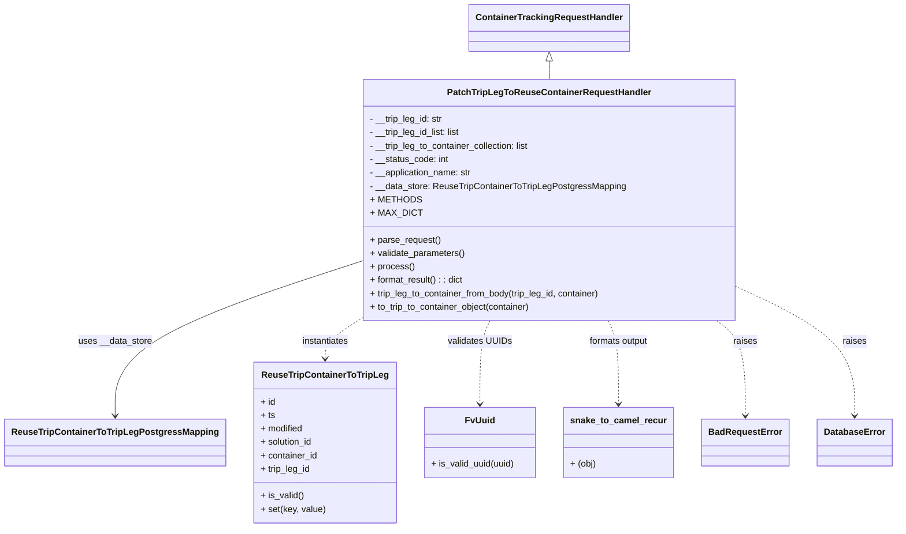
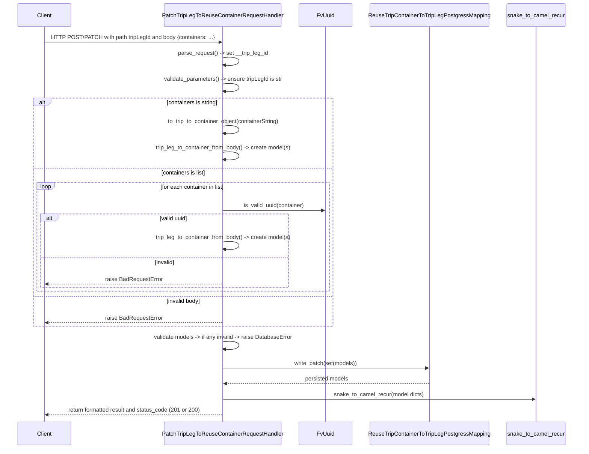

# Diagram: container_tracking_core/container_tracking_service/container_tracking_service/api/reuse_trip_container_to_trip_leg/handlers/patch_reuse_trip_container_to_trip_handler.py

> Auto-generated by Obscura crawlers

## Diagram 1

### SVG

<svg id="container" width="1549.953125" xmlns="http://www.w3.org/2000/svg" class="classDiagram" height="944" viewBox="0 0 1549.953125 944" role="graphics-document document" aria-roledescription="class"><g><defs><marker id="container_class-aggregationStart" class="marker aggregation class" refX="18" refY="7" markerWidth="190" markerHeight="240" orient="auto"><path d="M 18,7 L9,13 L1,7 L9,1 Z"></path></marker></defs><defs><marker id="container_class-aggregationEnd" class="marker aggregation class" refX="1" refY="7" markerWidth="20" markerHeight="28" orient="auto"><path d="M 18,7 L9,13 L1,7 L9,1 Z"></path></marker></defs><defs><marker id="container_class-extensionStart" class="marker extension class" refX="18" refY="7" markerWidth="190" markerHeight="240" orient="auto"><path d="M 1,7 L18,13 V 1 Z"></path></marker></defs><defs><marker id="container_class-extensionEnd" class="marker extension class" refX="1" refY="7" markerWidth="20" markerHeight="28" orient="auto"><path d="M 1,1 V 13 L18,7 Z"></path></marker></defs><defs><marker id="container_class-compositionStart" class="marker composition class" refX="18" refY="7" markerWidth="190" markerHeight="240" orient="auto"><path d="M 18,7 L9,13 L1,7 L9,1 Z"></path></marker></defs><defs><marker id="container_class-compositionEnd" class="marker composition class" refX="1" refY="7" markerWidth="20" markerHeight="28" orient="auto"><path d="M 18,7 L9,13 L1,7 L9,1 Z"></path></marker></defs><defs><marker id="container_class-dependencyStart" class="marker dependency class" refX="6" refY="7" markerWidth="190" markerHeight="240" orient="auto"><path d="M 5,7 L9,13 L1,7 L9,1 Z"></path></marker></defs><defs><marker id="container_class-dependencyEnd" class="marker dependency class" refX="13" refY="7" markerWidth="20" markerHeight="28" orient="auto"><path d="M 18,7 L9,13 L14,7 L9,1 Z"></path></marker></defs><defs><marker id="container_class-lollipopStart" class="marker lollipop class" refX="13" refY="7" markerWidth="190" markerHeight="240" orient="auto"><circle stroke="black" fill="transparent" cx="7" cy="7" r="6"></circle></marker></defs><defs><marker id="container_class-lollipopEnd" class="marker lollipop class" refX="1" refY="7" markerWidth="190" markerHeight="240" orient="auto"><circle stroke="black" fill="transparent" cx="7" cy="7" r="6"></circle></marker></defs><g class="root"><g class="clusters"></g><g class="edgePaths"><path d="M949.438,109.25L949.438,110.542C949.438,111.833,949.438,114.417,949.438,119.875C949.438,125.333,949.438,133.667,949.438,137.833L949.438,142" id="id_ContainerTrackingRequestHandler_PatchTripLegToReuseContainerRequestHandler_1" class="edge-thickness-normal edge-pattern-solid relation" style=";;;" data-edge="true" data-et="edge" data-id="id_ContainerTrackingRequestHandler_PatchTripLegToReuseContainerRequestHandler_1" data-points="W3sieCI6OTQ5LjQzNzUsInkiOjkyfSx7IngiOjk0OS40Mzc1LCJ5IjoxMTd9LHsieCI6OTQ5LjQzNzUsInkiOjE0Mn1d" marker-start="url(#container_class-extensionStart)"></path><path d="M623.578,467.225L552.089,491.187C480.599,515.15,337.62,563.075,266.13,609.204C194.641,655.333,194.641,699.667,194.641,721.833L194.641,744" id="id_PatchTripLegToReuseContainerRequestHandler_ReuseTripContainerToTripLegPostgressMapping_2" class="edge-thickness-normal edge-pattern-solid relation" style=";;;" data-edge="true" data-et="edge" data-id="id_PatchTripLegToReuseContainerRequestHandler_ReuseTripContainerToTripLegPostgressMapping_2" data-points="W3sieCI6NjIzLjU3ODEyNSwieSI6NDY3LjIyNDY0NjUzMTU1ODU2fSx7IngiOjE5NC42NDA2MjUsInkiOjYxMX0seyJ4IjoxOTQuNjQwNjI1LCJ5Ijo3NTB9XQ==" marker-end="url(#container_class-dependencyEnd)"></path><path d="M623.578,566.917L612.118,574.265C600.659,581.612,577.74,596.306,566.28,608.82C554.82,621.333,554.82,631.667,554.82,636.833L554.82,642" id="id_PatchTripLegToReuseContainerRequestHandler_ReuseTripContainerToTripLeg_3" class="edge-thickness-normal edge-pattern-dashed relation" style=";;;" data-edge="true" data-et="edge" data-id="id_PatchTripLegToReuseContainerRequestHandler_ReuseTripContainerToTripLeg_3" data-points="W3sieCI6NjIzLjU3ODEyNSwieSI6NTY2LjkxNzQ2MzUyMjc5N30seyJ4Ijo1NTQuODIwMzEyNSwieSI6NjExfSx7IngiOjU1NC44MjAzMTI1LCJ5Ijo2NDh9XQ==" marker-end="url(#container_class-dependencyEnd)"></path><path d="M845.64,574L842.676,580.167C839.713,586.333,833.786,598.667,830.823,623.5C827.859,648.333,827.859,685.667,827.859,704.333L827.859,723" id="id_PatchTripLegToReuseContainerRequestHandler_FvUuid_4" class="edge-thickness-normal edge-pattern-dashed relation" style=";;;" data-edge="true" data-et="edge" data-id="id_PatchTripLegToReuseContainerRequestHandler_FvUuid_4" data-points="W3sieCI6ODQ1LjYzOTU3NTA5ODgxNDIsInkiOjU3NH0seyJ4Ijo4MjcuODU5Mzc1LCJ5Ijo2MTF9LHsieCI6ODI3Ljg1OTM3NSwieSI6NzI5fV0=" marker-end="url(#container_class-dependencyEnd)"></path><path d="M1053.235,574L1056.199,580.167C1059.162,586.333,1065.089,598.667,1068.052,623.5C1071.016,648.333,1071.016,685.667,1071.016,704.333L1071.016,723" id="id_PatchTripLegToReuseContainerRequestHandler_snake_to_camel_recur_5" class="edge-thickness-normal edge-pattern-dashed relation" style=";;;" data-edge="true" data-et="edge" data-id="id_PatchTripLegToReuseContainerRequestHandler_snake_to_camel_recur_5" data-points="W3sieCI6MTA1My4yMzU0MjQ5MDExODU4LCJ5Ijo1NzR9LHsieCI6MTA3MS4wMTU2MjUsInkiOjYxMX0seyJ4IjoxMDcxLjAxNTYyNSwieSI6NzI5fV0=" marker-end="url(#container_class-dependencyEnd)"></path><path d="M1239.301,574L1247.576,580.167C1255.851,586.333,1272.402,598.667,1280.678,627C1288.953,655.333,1288.953,699.667,1288.953,721.833L1288.953,744" id="id_PatchTripLegToReuseContainerRequestHandler_BadRequestError_6" class="edge-thickness-normal edge-pattern-dashed relation" style=";;;" data-edge="true" data-et="edge" data-id="id_PatchTripLegToReuseContainerRequestHandler_BadRequestError_6" data-points="W3sieCI6MTIzOS4zMDA2NDIyOTI0OSwieSI6NTc0fSx7IngiOjEyODguOTUzMTI1LCJ5Ijo2MTF9LHsieCI6MTI4OC45NTMxMjUsInkiOjc1MH1d" marker-end="url(#container_class-dependencyEnd)"></path><path d="M1275.297,514.095L1309.013,530.246C1342.729,546.397,1410.161,578.698,1443.878,617.016C1477.594,655.333,1477.594,699.667,1477.594,721.833L1477.594,744" id="id_PatchTripLegToReuseContainerRequestHandler_DatabaseError_7" class="edge-thickness-normal edge-pattern-dashed relation" style=";;;" data-edge="true" data-et="edge" data-id="id_PatchTripLegToReuseContainerRequestHandler_DatabaseError_7" data-points="W3sieCI6MTI3NS4yOTY4NzUsInkiOjUxNC4wOTQ3NTc3MDY2NDQ2fSx7IngiOjE0NzcuNTkzNzUsInkiOjYxMX0seyJ4IjoxNDc3LjU5Mzc1LCJ5Ijo3NTB9XQ==" marker-end="url(#container_class-dependencyEnd)"></path></g><g class="edgeLabels"><g class="edgeLabel"><g class="label" data-id="id_ContainerTrackingRequestHandler_PatchTripLegToReuseContainerRequestHandler_1" transform="translate(0, 0)"><foreignObject width="0" height="0">

</foreignObject></g></g><g class="edgeLabel" transform="translate(194.640625, 611)"><g class="label" data-id="id_PatchTripLegToReuseContainerRequestHandler_ReuseTripContainerToTripLegPostgressMapping_2" transform="translate(-65.5546875, -12)"><foreignObject width="131.109375" height="24">

uses __data_store

</foreignObject></g></g><g class="edgeLabel" transform="translate(554.8203125, 611)"><g class="label" data-id="id_PatchTripLegToReuseContainerRequestHandler_ReuseTripContainerToTripLeg_3" transform="translate(-42.9140625, -12)"><foreignObject width="85.828125" height="24">

instantiates

</foreignObject></g></g><g class="edgeLabel" transform="translate(827.859375, 611)"><g class="label" data-id="id_PatchTripLegToReuseContainerRequestHandler_FvUuid_4" transform="translate(-56.640625, -12)"><foreignObject width="113.28125" height="24">

validates UUIDs

</foreignObject></g></g><g class="edgeLabel" transform="translate(1071.015625, 611)"><g class="label" data-id="id_PatchTripLegToReuseContainerRequestHandler_snake_to_camel_recur_5" transform="translate(-54.828125, -12)"><foreignObject width="109.65625" height="24">

formats output

</foreignObject></g></g><g class="edgeLabel" transform="translate(1288.953125, 611)"><g class="label" data-id="id_PatchTripLegToReuseContainerRequestHandler_BadRequestError_6" transform="translate(-21.25, -12)"><foreignObject width="42.5" height="24">

raises

</foreignObject></g></g><g class="edgeLabel" transform="translate(1477.59375, 611)"><g class="label" data-id="id_PatchTripLegToReuseContainerRequestHandler_DatabaseError_7" transform="translate(-21.25, -12)"><foreignObject width="42.5" height="24">

raises

</foreignObject></g></g></g><g class="nodes"><g class="node default" id="classId-ContainerTrackingRequestHandler-0" transform="translate(949.4375, 50)"><g class="basic label-container"><path d="M-137.5859375 -42 L137.5859375 -42 L137.5859375 42 L-137.5859375 42" stroke="none" stroke-width="0" fill="#ECECFF" style=""></path><path d="M-137.5859375 -42 C-48.078052293754865 -42, 41.42983291249027 -42, 137.5859375 -42 M-137.5859375 -42 C-62.327079840275076 -42, 12.931777819449849 -42, 137.5859375 -42 M137.5859375 -42 C137.5859375 -18.258489719122643, 137.5859375 5.483020561754714, 137.5859375 42 M137.5859375 -42 C137.5859375 -10.705979375821077, 137.5859375 20.588041248357847, 137.5859375 42 M137.5859375 42 C49.516786214302385 42, -38.55236507139523 42, -137.5859375 42 M137.5859375 42 C66.95483805524377 42, -3.6762613895124616 42, -137.5859375 42 M-137.5859375 42 C-137.5859375 14.177103851750132, -137.5859375 -13.645792296499735, -137.5859375 -42 M-137.5859375 42 C-137.5859375 24.546421994313217, -137.5859375 7.092843988626434, -137.5859375 -42" stroke="#9370DB" stroke-width="1.3" fill="none" stroke-dasharray="0 0" style=""></path></g><g class="annotation-group text" transform="translate(0, -18)"></g><g class="label-group text" transform="translate(-125.5859375, -18)"><g class="label" style="font-weight: bolder" transform="translate(0,-12)"><foreignObject width="251.171875" height="24">

ContainerTrackingRequestHandler

</foreignObject></g></g><g class="members-group text" transform="translate(-125.5859375, 30)"></g><g class="methods-group text" transform="translate(-125.5859375, 60)"></g><g class="divider" style=""><path d="M-137.5859375 6 C-72.81587067353578 6, -8.045803847071568 6, 137.5859375 6 M-137.5859375 6 C-77.15659950482714 6, -16.727261509654284 6, 137.5859375 6" stroke="#9370DB" stroke-width="1.3" fill="none" stroke-dasharray="0 0" style=""></path></g><g class="divider" style=""><path d="M-137.5859375 24 C-78.14004699056579 24, -18.6941564811316 24, 137.5859375 24 M-137.5859375 24 C-76.00416630427766 24, -14.422395108555321 24, 137.5859375 24" stroke="#9370DB" stroke-width="1.3" fill="none" stroke-dasharray="0 0" style=""></path></g></g><g class="node default" id="classId-PatchTripLegToReuseContainerRequestHandler-1" transform="translate(949.4375, 358)"><g class="basic label-container"><path d="M-325.859375 -216 L325.859375 -216 L325.859375 216 L-325.859375 216" stroke="none" stroke-width="0" fill="#ECECFF" style=""></path><path d="M-325.859375 -216 C-117.08471173207747 -216, 91.68995153584507 -216, 325.859375 -216 M-325.859375 -216 C-186.52248683884267 -216, -47.185598677685334 -216, 325.859375 -216 M325.859375 -216 C325.859375 -81.42574466766425, 325.859375 53.148510664671505, 325.859375 216 M325.859375 -216 C325.859375 -57.40823483646005, 325.859375 101.1835303270799, 325.859375 216 M325.859375 216 C65.8469421564161 216, -194.1654906871678 216, -325.859375 216 M325.859375 216 C66.91537609705068 216, -192.02862280589864 216, -325.859375 216 M-325.859375 216 C-325.859375 69.22075191092785, -325.859375 -77.55849617814431, -325.859375 -216 M-325.859375 216 C-325.859375 118.0333707229095, -325.859375 20.06674144581899, -325.859375 -216" stroke="#9370DB" stroke-width="1.3" fill="none" stroke-dasharray="0 0" style=""></path></g><g class="annotation-group text" transform="translate(0, -192)"></g><g class="label-group text" transform="translate(-172.515625, -192)"><g class="label" style="font-weight: bolder" transform="translate(0,-12)"><foreignObject width="345.03125" height="24">

PatchTripLegToReuseContainerRequestHandler

</foreignObject></g></g><g class="members-group text" transform="translate(-313.859375, -144)"><g class="label" style="" transform="translate(0,-12)"><foreignObject width="132.28125" height="24">

- __trip_leg_id: str

</foreignObject></g><g class="label" style="" transform="translate(0,12)"><foreignObject width="165.96875" height="24">

- __trip_leg_id_list: list

</foreignObject></g><g class="label" style="" transform="translate(0,36)"><foreignObject width="290.734375" height="24">

- __trip_leg_to_container_collection: list

</foreignObject></g><g class="label" style="" transform="translate(0,60)"><foreignObject width="141.953125" height="24">

- __status_code: int

</foreignObject></g><g class="label" style="" transform="translate(0,84)"><foreignObject width="185.296875" height="24">

- __application_name: str

</foreignObject></g><g class="label" style="" transform="translate(0,108)"><foreignObject width="455.203125" height="24">

- __data_store: ReuseTripContainerToTripLegPostgressMapping

</foreignObject></g><g class="label" style="" transform="translate(0,132)"><foreignObject width="82.484375" height="24">

+ METHODS

</foreignObject></g><g class="label" style="" transform="translate(0,156)"><foreignObject width="82.90625" height="24">

+ MAX_DICT

</foreignObject></g></g><g class="methods-group text" transform="translate(-313.859375, 72)"><g class="label" style="" transform="translate(0,-12)"><foreignObject width="126.046875" height="24">

+ parse_request()

</foreignObject></g><g class="label" style="" transform="translate(0,12)"><foreignObject width="170.953125" height="24">

+ validate_parameters()

</foreignObject></g><g class="label" style="" transform="translate(0,36)"><foreignObject width="77.96875" height="24">

+ process()

</foreignObject></g><g class="label" style="" transform="translate(0,60)"><foreignObject width="169.40625" height="24">

+ format_result() : : dict

</foreignObject></g><g class="label" style="" transform="translate(0,84)"><foreignObject width="418.515625" height="24">

+ trip_leg_to_container_from_body(trip_leg_id, container)

</foreignObject></g><g class="label" style="" transform="translate(0,108)"><foreignObject width="291.953125" height="24">

+ to_trip_to_container_object(container)

</foreignObject></g></g><g class="divider" style=""><path d="M-325.859375 -168 C-94.64091808030386 -168, 136.57753883939228 -168, 325.859375 -168 M-325.859375 -168 C-166.10633826780906 -168, -6.3533015356181295 -168, 325.859375 -168" stroke="#9370DB" stroke-width="1.3" fill="none" stroke-dasharray="0 0" style=""></path></g><g class="divider" style=""><path d="M-325.859375 48 C-140.41573935778126 48, 45.027896284437475 48, 325.859375 48 M-325.859375 48 C-160.16298059691013 48, 5.5334138061797375 48, 325.859375 48" stroke="#9370DB" stroke-width="1.3" fill="none" stroke-dasharray="0 0" style=""></path></g></g><g class="node default" id="classId-ReuseTripContainerToTripLegPostgressMapping-2" transform="translate(194.640625, 792)"><g class="basic label-container"><path d="M-186.640625 -42 L186.640625 -42 L186.640625 42 L-186.640625 42" stroke="none" stroke-width="0" fill="#ECECFF" style=""></path><path d="M-186.640625 -42 C-82.83752763771452 -42, 20.96556972457097 -42, 186.640625 -42 M-186.640625 -42 C-89.86581248789726 -42, 6.909000024205483 -42, 186.640625 -42 M186.640625 -42 C186.640625 -8.686652725422377, 186.640625 24.626694549155246, 186.640625 42 M186.640625 -42 C186.640625 -13.889789933557303, 186.640625 14.220420132885394, 186.640625 42 M186.640625 42 C108.10237040534642 42, 29.56411581069284 42, -186.640625 42 M186.640625 42 C102.21484177511459 42, 17.789058550229186 42, -186.640625 42 M-186.640625 42 C-186.640625 19.63581947391565, -186.640625 -2.728361052168701, -186.640625 -42 M-186.640625 42 C-186.640625 10.306413298821703, -186.640625 -21.387173402356595, -186.640625 -42" stroke="#9370DB" stroke-width="1.3" fill="none" stroke-dasharray="0 0" style=""></path></g><g class="annotation-group text" transform="translate(0, -18)"></g><g class="label-group text" transform="translate(-174.640625, -18)"><g class="label" style="font-weight: bolder" transform="translate(0,-12)"><foreignObject width="349.28125" height="24">

ReuseTripContainerToTripLegPostgressMapping

</foreignObject></g></g><g class="members-group text" transform="translate(-174.640625, 30)"></g><g class="methods-group text" transform="translate(-174.640625, 60)"></g><g class="divider" style=""><path d="M-186.640625 6 C-68.29657598434854 6, 50.04747303130293 6, 186.640625 6 M-186.640625 6 C-96.59311136233934 6, -6.545597724678686 6, 186.640625 6" stroke="#9370DB" stroke-width="1.3" fill="none" stroke-dasharray="0 0" style=""></path></g><g class="divider" style=""><path d="M-186.640625 24 C-68.6457811028607 24, 49.34906279427861 24, 186.640625 24 M-186.640625 24 C-62.73125755690407 24, 61.17810988619186 24, 186.640625 24" stroke="#9370DB" stroke-width="1.3" fill="none" stroke-dasharray="0 0" style=""></path></g></g><g class="node default" id="classId-ReuseTripContainerToTripLeg-3" transform="translate(554.8203125, 792)"><g class="basic label-container"><path d="M-123.5390625 -144 L123.5390625 -144 L123.5390625 144 L-123.5390625 144" stroke="none" stroke-width="0" fill="#ECECFF" style=""></path><path d="M-123.5390625 -144 C-30.844319147991087 -144, 61.85042420401783 -144, 123.5390625 -144 M-123.5390625 -144 C-54.84858533023862 -144, 13.84189183952276 -144, 123.5390625 -144 M123.5390625 -144 C123.5390625 -83.76586640127104, 123.5390625 -23.531732802542095, 123.5390625 144 M123.5390625 -144 C123.5390625 -69.02031167804142, 123.5390625 5.959376643917153, 123.5390625 144 M123.5390625 144 C38.62766785559053 144, -46.28372678881894 144, -123.5390625 144 M123.5390625 144 C49.383881486086835 144, -24.77129952782633 144, -123.5390625 144 M-123.5390625 144 C-123.5390625 29.17962594241682, -123.5390625 -85.64074811516636, -123.5390625 -144 M-123.5390625 144 C-123.5390625 32.47708604684212, -123.5390625 -79.04582790631576, -123.5390625 -144" stroke="#9370DB" stroke-width="1.3" fill="none" stroke-dasharray="0 0" style=""></path></g><g class="annotation-group text" transform="translate(0, -120)"></g><g class="label-group text" transform="translate(-107.609375, -120)"><g class="label" style="font-weight: bolder" transform="translate(0,-12)"><foreignObject width="215.21875" height="24">

ReuseTripContainerToTripLeg

</foreignObject></g></g><g class="members-group text" transform="translate(-111.5390625, -72)"><g class="label" style="" transform="translate(0,-12)"><foreignObject width="26.3125" height="24">

+ id

</foreignObject></g><g class="label" style="" transform="translate(0,12)"><foreignObject width="25.484375" height="24">

+ ts

</foreignObject></g><g class="label" style="" transform="translate(0,36)"><foreignObject width="76.859375" height="24">

+ modified

</foreignObject></g><g class="label" style="" transform="translate(0,60)"><foreignObject width="94.453125" height="24">

+ solution_id

</foreignObject></g><g class="label" style="" transform="translate(0,84)"><foreignObject width="102.546875" height="24">

+ container_id

</foreignObject></g><g class="label" style="" transform="translate(0,108)"><foreignObject width="90.15625" height="24">

+ trip_leg_id

</foreignObject></g></g><g class="methods-group text" transform="translate(-111.5390625, 96)"><g class="label" style="" transform="translate(0,-12)"><foreignObject width="77.03125" height="24">

+ is_valid()

</foreignObject></g><g class="label" style="" transform="translate(0,12)"><foreignObject width="115.46875" height="24">

+ set(key, value)

</foreignObject></g></g><g class="divider" style=""><path d="M-123.5390625 -96 C-62.3687306037652 -96, -1.1983987075304015 -96, 123.5390625 -96 M-123.5390625 -96 C-30.37592729438211 -96, 62.78720791123578 -96, 123.5390625 -96" stroke="#9370DB" stroke-width="1.3" fill="none" stroke-dasharray="0 0" style=""></path></g><g class="divider" style=""><path d="M-123.5390625 72 C-63.57327826730396 72, -3.6074940346079245 72, 123.5390625 72 M-123.5390625 72 C-60.66732869082952 72, 2.204405118340958 72, 123.5390625 72" stroke="#9370DB" stroke-width="1.3" fill="none" stroke-dasharray="0 0" style=""></path></g></g><g class="node default" id="classId-FvUuid-4" transform="translate(827.859375, 792)"><g class="basic label-container"><path d="M-99.5 -63 L99.5 -63 L99.5 63 L-99.5 63" stroke="none" stroke-width="0" fill="#ECECFF" style=""></path><path d="M-99.5 -63 C-40.68858792026892 -63, 18.122824159462155 -63, 99.5 -63 M-99.5 -63 C-37.24904183238543 -63, 25.00191633522914 -63, 99.5 -63 M99.5 -63 C99.5 -29.626536845869957, 99.5 3.746926308260086, 99.5 63 M99.5 -63 C99.5 -25.088992424002882, 99.5 12.822015151994236, 99.5 63 M99.5 63 C52.9121492935589 63, 6.324298587117795 63, -99.5 63 M99.5 63 C25.88435959074205 63, -47.7312808185159 63, -99.5 63 M-99.5 63 C-99.5 16.976832942808457, -99.5 -29.046334114383086, -99.5 -63 M-99.5 63 C-99.5 28.208225446474117, -99.5 -6.583549107051766, -99.5 -63" stroke="#9370DB" stroke-width="1.3" fill="none" stroke-dasharray="0 0" style=""></path></g><g class="annotation-group text" transform="translate(0, -39)"></g><g class="label-group text" transform="translate(-24.5625, -39)"><g class="label" style="font-weight: bolder" transform="translate(0,-12)"><foreignObject width="49.125" height="24">

FvUuid

</foreignObject></g></g><g class="members-group text" transform="translate(-87.5, 9)"></g><g class="methods-group text" transform="translate(-87.5, 39)"><g class="label" style="" transform="translate(0,-12)"><foreignObject width="150.4375" height="24">

+ is_valid_uuid(uuid)

</foreignObject></g></g><g class="divider" style=""><path d="M-99.5 -15 C-47.396603365658414 -15, 4.706793268683171 -15, 99.5 -15 M-99.5 -15 C-55.11497743600653 -15, -10.729954872013053 -15, 99.5 -15" stroke="#9370DB" stroke-width="1.3" fill="none" stroke-dasharray="0 0" style=""></path></g><g class="divider" style=""><path d="M-99.5 9 C-51.46290076024515 9, -3.425801520490296 9, 99.5 9 M-99.5 9 C-48.75637984157169 9, 1.9872403168566137 9, 99.5 9" stroke="#9370DB" stroke-width="1.3" fill="none" stroke-dasharray="0 0" style=""></path></g></g><g class="node default" id="classId-snake_to_camel_recur-5" transform="translate(1071.015625, 792)"><g class="basic label-container"><path d="M-93.65625 -63 L93.65625 -63 L93.65625 63 L-93.65625 63" stroke="none" stroke-width="0" fill="#ECECFF" style=""></path><path d="M-93.65625 -63 C-45.870798423926956 -63, 1.9146531521460872 -63, 93.65625 -63 M-93.65625 -63 C-36.26109152316781 -63, 21.134066953664373 -63, 93.65625 -63 M93.65625 -63 C93.65625 -35.51413982673324, 93.65625 -8.028279653466484, 93.65625 63 M93.65625 -63 C93.65625 -22.61263680934968, 93.65625 17.77472638130064, 93.65625 63 M93.65625 63 C49.56348719261991 63, 5.470724385239819 63, -93.65625 63 M93.65625 63 C28.778508395569077 63, -36.09923320886185 63, -93.65625 63 M-93.65625 63 C-93.65625 30.191444050670867, -93.65625 -2.6171118986582655, -93.65625 -63 M-93.65625 63 C-93.65625 18.24174036715828, -93.65625 -26.516519265683442, -93.65625 -63" stroke="#9370DB" stroke-width="1.3" fill="none" stroke-dasharray="0 0" style=""></path></g><g class="annotation-group text" transform="translate(0, -39)"></g><g class="label-group text" transform="translate(-81.65625, -39)"><g class="label" style="font-weight: bolder" transform="translate(0,-12)"><foreignObject width="163.3125" height="24">

snake_to_camel_recur

</foreignObject></g></g><g class="members-group text" transform="translate(-81.65625, 9)"></g><g class="methods-group text" transform="translate(-81.65625, 39)"><g class="label" style="" transform="translate(0,-12)"><foreignObject width="45.921875" height="24">

+ (obj)

</foreignObject></g></g><g class="divider" style=""><path d="M-93.65625 -15 C-27.622363366221478 -15, 38.411523267557044 -15, 93.65625 -15 M-93.65625 -15 C-28.623212067840328 -15, 36.409825864319345 -15, 93.65625 -15" stroke="#9370DB" stroke-width="1.3" fill="none" stroke-dasharray="0 0" style=""></path></g><g class="divider" style=""><path d="M-93.65625 9 C-41.59314173051427 9, 10.469966538971462 9, 93.65625 9 M-93.65625 9 C-23.84031020142504 9, 45.97562959714992 9, 93.65625 9" stroke="#9370DB" stroke-width="1.3" fill="none" stroke-dasharray="0 0" style=""></path></g></g><g class="node default" id="classId-BadRequestError-6" transform="translate(1288.953125, 792)"><g class="basic label-container"><path d="M-74.28125 -42 L74.28125 -42 L74.28125 42 L-74.28125 42" stroke="none" stroke-width="0" fill="#ECECFF" style=""></path><path d="M-74.28125 -42 C-20.190061718461784 -42, 33.90112656307643 -42, 74.28125 -42 M-74.28125 -42 C-41.53087069903212 -42, -8.780491398064243 -42, 74.28125 -42 M74.28125 -42 C74.28125 -8.753525282832534, 74.28125 24.492949434334932, 74.28125 42 M74.28125 -42 C74.28125 -19.495593081499614, 74.28125 3.0088138370007727, 74.28125 42 M74.28125 42 C33.454286965311255 42, -7.372676069377491 42, -74.28125 42 M74.28125 42 C35.693733991715355 42, -2.89378201656929 42, -74.28125 42 M-74.28125 42 C-74.28125 13.136516351510942, -74.28125 -15.726967296978117, -74.28125 -42 M-74.28125 42 C-74.28125 22.471891781866912, -74.28125 2.943783563733824, -74.28125 -42" stroke="#9370DB" stroke-width="1.3" fill="none" stroke-dasharray="0 0" style=""></path></g><g class="annotation-group text" transform="translate(0, -18)"></g><g class="label-group text" transform="translate(-62.28125, -18)"><g class="label" style="font-weight: bolder" transform="translate(0,-12)"><foreignObject width="124.5625" height="24">

BadRequestError

</foreignObject></g></g><g class="members-group text" transform="translate(-62.28125, 30)"></g><g class="methods-group text" transform="translate(-62.28125, 60)"></g><g class="divider" style=""><path d="M-74.28125 6 C-28.192487683937514 6, 17.89627463212497 6, 74.28125 6 M-74.28125 6 C-14.883774508599167 6, 44.513700982801666 6, 74.28125 6" stroke="#9370DB" stroke-width="1.3" fill="none" stroke-dasharray="0 0" style=""></path></g><g class="divider" style=""><path d="M-74.28125 24 C-21.575576144935184 24, 31.130097710129633 24, 74.28125 24 M-74.28125 24 C-36.006931816415985 24, 2.2673863671680294 24, 74.28125 24" stroke="#9370DB" stroke-width="1.3" fill="none" stroke-dasharray="0 0" style=""></path></g></g><g class="node default" id="classId-DatabaseError-7" transform="translate(1477.59375, 792)"><g class="basic label-container"><path d="M-64.359375 -42 L64.359375 -42 L64.359375 42 L-64.359375 42" stroke="none" stroke-width="0" fill="#ECECFF" style=""></path><path d="M-64.359375 -42 C-38.41595443183175 -42, -12.472533863663493 -42, 64.359375 -42 M-64.359375 -42 C-24.87003157033204 -42, 14.619311859335923 -42, 64.359375 -42 M64.359375 -42 C64.359375 -23.038345882930543, 64.359375 -4.076691765861085, 64.359375 42 M64.359375 -42 C64.359375 -9.060992406646946, 64.359375 23.878015186706108, 64.359375 42 M64.359375 42 C35.79219167854832 42, 7.225008357096648 42, -64.359375 42 M64.359375 42 C29.381002516141223 42, -5.597369967717555 42, -64.359375 42 M-64.359375 42 C-64.359375 18.840801429363307, -64.359375 -4.318397141273387, -64.359375 -42 M-64.359375 42 C-64.359375 16.360203277237805, -64.359375 -9.279593445524391, -64.359375 -42" stroke="#9370DB" stroke-width="1.3" fill="none" stroke-dasharray="0 0" style=""></path></g><g class="annotation-group text" transform="translate(0, -18)"></g><g class="label-group text" transform="translate(-52.359375, -18)"><g class="label" style="font-weight: bolder" transform="translate(0,-12)"><foreignObject width="104.71875" height="24">

DatabaseError

</foreignObject></g></g><g class="members-group text" transform="translate(-52.359375, 30)"></g><g class="methods-group text" transform="translate(-52.359375, 60)"></g><g class="divider" style=""><path d="M-64.359375 6 C-18.539609175219006 6, 27.280156649561988 6, 64.359375 6 M-64.359375 6 C-18.536279050257527 6, 27.286816899484947 6, 64.359375 6" stroke="#9370DB" stroke-width="1.3" fill="none" stroke-dasharray="0 0" style=""></path></g><g class="divider" style=""><path d="M-64.359375 24 C-19.544913098735314 24, 25.26954880252937 24, 64.359375 24 M-64.359375 24 C-16.229084458955462 24, 31.901206082089075 24, 64.359375 24" stroke="#9370DB" stroke-width="1.3" fill="none" stroke-dasharray="0 0" style=""></path></g></g></g></g></g></svg>

## Diagram 2

### SVG

<svg id="container" width="1725.5" xmlns="http://www.w3.org/2000/svg" height="1323" viewBox="-50 -10 1725.5 1323" role="graphics-document document" aria-roledescription="sequence"><g><rect x="1443.5" y="1237" fill="#eaeaea" stroke="#666" width="182" height="65" name="Formatter" rx="3" ry="3" class="actor actor-bottom"></rect><text x="1534.5" y="1269.5" dominant-baseline="central" alignment-baseline="central" class="actor actor-box" style="text-anchor: middle; font-size: 16px; font-weight: 400;"><tspan x="1534.5" dy="0">snake_to_camel_recur</tspan></text></g><g><rect x="1030.5" y="1237" fill="#eaeaea" stroke="#666" width="363" height="65" name="DataStore" rx="3" ry="3" class="actor actor-bottom"></rect><text x="1212" y="1269.5" dominant-baseline="central" alignment-baseline="central" class="actor actor-box" style="text-anchor: middle; font-size: 16px; font-weight: 400;"><tspan x="1212" dy="0">ReuseTripContainerToTripLegPostgressMapping</tspan></text></g><g><rect x="830.5" y="1237" fill="#eaeaea" stroke="#666" width="150" height="65" name="UUID" rx="3" ry="3" class="actor actor-bottom"></rect><text x="905.5" y="1269.5" dominant-baseline="central" alignment-baseline="central" class="actor actor-box" style="text-anchor: middle; font-size: 16px; font-weight: 400;"><tspan x="905.5" dy="0">FvUuid</tspan></text></g><g><rect x="419.5" y="1237" fill="#eaeaea" stroke="#666" width="361" height="65" name="Handler" rx="3" ry="3" class="actor actor-bottom"></rect><text x="600" y="1269.5" dominant-baseline="central" alignment-baseline="central" class="actor actor-box" style="text-anchor: middle; font-size: 16px; font-weight: 400;"><tspan x="600" dy="0">PatchTripLegToReuseContainerRequestHandler</tspan></text></g><g><rect x="0" y="1237" fill="#eaeaea" stroke="#666" width="150" height="65" name="Client" rx="3" ry="3" class="actor actor-bottom"></rect><text x="75" y="1269.5" dominant-baseline="central" alignment-baseline="central" class="actor actor-box" style="text-anchor: middle; font-size: 16px; font-weight: 400;"><tspan x="75" dy="0">Client</tspan></text></g><g><line id="actor4" x1="1534.5" y1="65" x2="1534.5" y2="1237" class="actor-line 200" stroke-width="0.5px" stroke="#999" name="Formatter"></line><g id="root-4"><rect x="1443.5" y="0" fill="#eaeaea" stroke="#666" width="182" height="65" name="Formatter" rx="3" ry="3" class="actor actor-top"></rect><text x="1534.5" y="32.5" dominant-baseline="central" alignment-baseline="central" class="actor actor-box" style="text-anchor: middle; font-size: 16px; font-weight: 400;"><tspan x="1534.5" dy="0">snake_to_camel_recur</tspan></text></g></g><g><line id="actor3" x1="1212" y1="65" x2="1212" y2="1237" class="actor-line 200" stroke-width="0.5px" stroke="#999" name="DataStore"></line><g id="root-3"><rect x="1030.5" y="0" fill="#eaeaea" stroke="#666" width="363" height="65" name="DataStore" rx="3" ry="3" class="actor actor-top"></rect><text x="1212" y="32.5" dominant-baseline="central" alignment-baseline="central" class="actor actor-box" style="text-anchor: middle; font-size: 16px; font-weight: 400;"><tspan x="1212" dy="0">ReuseTripContainerToTripLegPostgressMapping</tspan></text></g></g><g><line id="actor2" x1="905.5" y1="65" x2="905.5" y2="1237" class="actor-line 200" stroke-width="0.5px" stroke="#999" name="UUID"></line><g id="root-2"><rect x="830.5" y="0" fill="#eaeaea" stroke="#666" width="150" height="65" name="UUID" rx="3" ry="3" class="actor actor-top"></rect><text x="905.5" y="32.5" dominant-baseline="central" alignment-baseline="central" class="actor actor-box" style="text-anchor: middle; font-size: 16px; font-weight: 400;"><tspan x="905.5" dy="0">FvUuid</tspan></text></g></g><g><line id="actor1" x1="600" y1="65" x2="600" y2="1237" class="actor-line 200" stroke-width="0.5px" stroke="#999" name="Handler"></line><g id="root-1"><rect x="419.5" y="0" fill="#eaeaea" stroke="#666" width="361" height="65" name="Handler" rx="3" ry="3" class="actor actor-top"></rect><text x="600" y="32.5" dominant-baseline="central" alignment-baseline="central" class="actor actor-box" style="text-anchor: middle; font-size: 16px; font-weight: 400;"><tspan x="600" dy="0">PatchTripLegToReuseContainerRequestHandler</tspan></text></g></g><g><line id="actor0" x1="75" y1="65" x2="75" y2="1237" class="actor-line 200" stroke-width="0.5px" stroke="#999" name="Client"></line><g id="root-0"><rect x="0" y="0" fill="#eaeaea" stroke="#666" width="150" height="65" name="Client" rx="3" ry="3" class="actor actor-top"></rect><text x="75" y="32.5" dominant-baseline="central" alignment-baseline="central" class="actor actor-box" style="text-anchor: middle; font-size: 16px; font-weight: 400;"><tspan x="75" dy="0">Client</tspan></text></g></g><g></g><defs><symbol id="computer" width="24" height="24"><path transform="scale(.5)" d="M2 2v13h20v-13h-20zm18 11h-16v-9h16v9zm-10.228 6l.466-1h3.524l.467 1h-4.457zm14.228 3h-24l2-6h2.104l-1.33 4h18.45l-1.297-4h2.073l2 6zm-5-10h-14v-7h14v7z"></path></symbol></defs><defs><symbol id="database" fill-rule="evenodd" clip-rule="evenodd"><path transform="scale(.5)" d="M12.258.001l.256.004.255.005.253.008.251.01.249.012.247.015.246.016.242.019.241.02.239.023.236.024.233.027.231.028.229.031.225.032.223.034.22.036.217.038.214.04.211.041.208.043.205.045.201.046.198.048.194.05.191.051.187.053.183.054.18.056.175.057.172.059.168.06.163.061.16.063.155.064.15.066.074.033.073.033.071.034.07.034.069.035.068.035.067.035.066.035.064.036.064.036.062.036.06.036.06.037.058.037.058.037.055.038.055.038.053.038.052.038.051.039.05.039.048.039.047.039.045.04.044.04.043.04.041.04.04.041.039.041.037.041.036.041.034.041.033.042.032.042.03.042.029.042.027.042.026.043.024.043.023.043.021.043.02.043.018.044.017.043.015.044.013.044.012.044.011.045.009.044.007.045.006.045.004.045.002.045.001.045v17l-.001.045-.002.045-.004.045-.006.045-.007.045-.009.044-.011.045-.012.044-.013.044-.015.044-.017.043-.018.044-.02.043-.021.043-.023.043-.024.043-.026.043-.027.042-.029.042-.03.042-.032.042-.033.042-.034.041-.036.041-.037.041-.039.041-.04.041-.041.04-.043.04-.044.04-.045.04-.047.039-.048.039-.05.039-.051.039-.052.038-.053.038-.055.038-.055.038-.058.037-.058.037-.06.037-.06.036-.062.036-.064.036-.064.036-.066.035-.067.035-.068.035-.069.035-.07.034-.071.034-.073.033-.074.033-.15.066-.155.064-.16.063-.163.061-.168.06-.172.059-.175.057-.18.056-.183.054-.187.053-.191.051-.194.05-.198.048-.201.046-.205.045-.208.043-.211.041-.214.04-.217.038-.22.036-.223.034-.225.032-.229.031-.231.028-.233.027-.236.024-.239.023-.241.02-.242.019-.246.016-.247.015-.249.012-.251.01-.253.008-.255.005-.256.004-.258.001-.258-.001-.256-.004-.255-.005-.253-.008-.251-.01-.249-.012-.247-.015-.245-.016-.243-.019-.241-.02-.238-.023-.236-.024-.234-.027-.231-.028-.228-.031-.226-.032-.223-.034-.22-.036-.217-.038-.214-.04-.211-.041-.208-.043-.204-.045-.201-.046-.198-.048-.195-.05-.19-.051-.187-.053-.184-.054-.179-.056-.176-.057-.172-.059-.167-.06-.164-.061-.159-.063-.155-.064-.151-.066-.074-.033-.072-.033-.072-.034-.07-.034-.069-.035-.068-.035-.067-.035-.066-.035-.064-.036-.063-.036-.062-.036-.061-.036-.06-.037-.058-.037-.057-.037-.056-.038-.055-.038-.053-.038-.052-.038-.051-.039-.049-.039-.049-.039-.046-.039-.046-.04-.044-.04-.043-.04-.041-.04-.04-.041-.039-.041-.037-.041-.036-.041-.034-.041-.033-.042-.032-.042-.03-.042-.029-.042-.027-.042-.026-.043-.024-.043-.023-.043-.021-.043-.02-.043-.018-.044-.017-.043-.015-.044-.013-.044-.012-.044-.011-.045-.009-.044-.007-.045-.006-.045-.004-.045-.002-.045-.001-.045v-17l.001-.045.002-.045.004-.045.006-.045.007-.045.009-.044.011-.045.012-.044.013-.044.015-.044.017-.043.018-.044.02-.043.021-.043.023-.043.024-.043.026-.043.027-.042.029-.042.03-.042.032-.042.033-.042.034-.041.036-.041.037-.041.039-.041.04-.041.041-.04.043-.04.044-.04.046-.04.046-.039.049-.039.049-.039.051-.039.052-.038.053-.038.055-.038.056-.038.057-.037.058-.037.06-.037.061-.036.062-.036.063-.036.064-.036.066-.035.067-.035.068-.035.069-.035.07-.034.072-.034.072-.033.074-.033.151-.066.155-.064.159-.063.164-.061.167-.06.172-.059.176-.057.179-.056.184-.054.187-.053.19-.051.195-.05.198-.048.201-.046.204-.045.208-.043.211-.041.214-.04.217-.038.22-.036.223-.034.226-.032.228-.031.231-.028.234-.027.236-.024.238-.023.241-.02.243-.019.245-.016.247-.015.249-.012.251-.01.253-.008.255-.005.256-.004.258-.001.258.001zm-9.258 20.499v.01l.001.021.003.021.004.022.005.021.006.022.007.022.009.023.01.022.011.023.012.023.013.023.015.023.016.024.017.023.018.024.019.024.021.024.022.025.023.024.024.025.052.049.056.05.061.051.066.051.07.051.075.051.079.052.084.052.088.052.092.052.097.052.102.051.105.052.11.052.114.051.119.051.123.051.127.05.131.05.135.05.139.048.144.049.147.047.152.047.155.047.16.045.163.045.167.043.171.043.176.041.178.041.183.039.187.039.19.037.194.035.197.035.202.033.204.031.209.03.212.029.216.027.219.025.222.024.226.021.23.02.233.018.236.016.24.015.243.012.246.01.249.008.253.005.256.004.259.001.26-.001.257-.004.254-.005.25-.008.247-.011.244-.012.241-.014.237-.016.233-.018.231-.021.226-.021.224-.024.22-.026.216-.027.212-.028.21-.031.205-.031.202-.034.198-.034.194-.036.191-.037.187-.039.183-.04.179-.04.175-.042.172-.043.168-.044.163-.045.16-.046.155-.046.152-.047.148-.048.143-.049.139-.049.136-.05.131-.05.126-.05.123-.051.118-.052.114-.051.11-.052.106-.052.101-.052.096-.052.092-.052.088-.053.083-.051.079-.052.074-.052.07-.051.065-.051.06-.051.056-.05.051-.05.023-.024.023-.025.021-.024.02-.024.019-.024.018-.024.017-.024.015-.023.014-.024.013-.023.012-.023.01-.023.01-.022.008-.022.006-.022.006-.022.004-.022.004-.021.001-.021.001-.021v-4.127l-.077.055-.08.053-.083.054-.085.053-.087.052-.09.052-.093.051-.095.05-.097.05-.1.049-.102.049-.105.048-.106.047-.109.047-.111.046-.114.045-.115.045-.118.044-.12.043-.122.042-.124.042-.126.041-.128.04-.13.04-.132.038-.134.038-.135.037-.138.037-.139.035-.142.035-.143.034-.144.033-.147.032-.148.031-.15.03-.151.03-.153.029-.154.027-.156.027-.158.026-.159.025-.161.024-.162.023-.163.022-.165.021-.166.02-.167.019-.169.018-.169.017-.171.016-.173.015-.173.014-.175.013-.175.012-.177.011-.178.01-.179.008-.179.008-.181.006-.182.005-.182.004-.184.003-.184.002h-.37l-.184-.002-.184-.003-.182-.004-.182-.005-.181-.006-.179-.008-.179-.008-.178-.01-.176-.011-.176-.012-.175-.013-.173-.014-.172-.015-.171-.016-.17-.017-.169-.018-.167-.019-.166-.02-.165-.021-.163-.022-.162-.023-.161-.024-.159-.025-.157-.026-.156-.027-.155-.027-.153-.029-.151-.03-.15-.03-.148-.031-.146-.032-.145-.033-.143-.034-.141-.035-.14-.035-.137-.037-.136-.037-.134-.038-.132-.038-.13-.04-.128-.04-.126-.041-.124-.042-.122-.042-.12-.044-.117-.043-.116-.045-.113-.045-.112-.046-.109-.047-.106-.047-.105-.048-.102-.049-.1-.049-.097-.05-.095-.05-.093-.052-.09-.051-.087-.052-.085-.053-.083-.054-.08-.054-.077-.054v4.127zm0-5.654v.011l.001.021.003.021.004.021.005.022.006.022.007.022.009.022.01.022.011.023.012.023.013.023.015.024.016.023.017.024.018.024.019.024.021.024.022.024.023.025.024.024.052.05.056.05.061.05.066.051.07.051.075.052.079.051.084.052.088.052.092.052.097.052.102.052.105.052.11.051.114.051.119.052.123.05.127.051.131.05.135.049.139.049.144.048.147.048.152.047.155.046.16.045.163.045.167.044.171.042.176.042.178.04.183.04.187.038.19.037.194.036.197.034.202.033.204.032.209.03.212.028.216.027.219.025.222.024.226.022.23.02.233.018.236.016.24.014.243.012.246.01.249.008.253.006.256.003.259.001.26-.001.257-.003.254-.006.25-.008.247-.01.244-.012.241-.015.237-.016.233-.018.231-.02.226-.022.224-.024.22-.025.216-.027.212-.029.21-.03.205-.032.202-.033.198-.035.194-.036.191-.037.187-.039.183-.039.179-.041.175-.042.172-.043.168-.044.163-.045.16-.045.155-.047.152-.047.148-.048.143-.048.139-.05.136-.049.131-.05.126-.051.123-.051.118-.051.114-.052.11-.052.106-.052.101-.052.096-.052.092-.052.088-.052.083-.052.079-.052.074-.051.07-.052.065-.051.06-.05.056-.051.051-.049.023-.025.023-.024.021-.025.02-.024.019-.024.018-.024.017-.024.015-.023.014-.023.013-.024.012-.022.01-.023.01-.023.008-.022.006-.022.006-.022.004-.021.004-.022.001-.021.001-.021v-4.139l-.077.054-.08.054-.083.054-.085.052-.087.053-.09.051-.093.051-.095.051-.097.05-.1.049-.102.049-.105.048-.106.047-.109.047-.111.046-.114.045-.115.044-.118.044-.12.044-.122.042-.124.042-.126.041-.128.04-.13.039-.132.039-.134.038-.135.037-.138.036-.139.036-.142.035-.143.033-.144.033-.147.033-.148.031-.15.03-.151.03-.153.028-.154.028-.156.027-.158.026-.159.025-.161.024-.162.023-.163.022-.165.021-.166.02-.167.019-.169.018-.169.017-.171.016-.173.015-.173.014-.175.013-.175.012-.177.011-.178.009-.179.009-.179.007-.181.007-.182.005-.182.004-.184.003-.184.002h-.37l-.184-.002-.184-.003-.182-.004-.182-.005-.181-.007-.179-.007-.179-.009-.178-.009-.176-.011-.176-.012-.175-.013-.173-.014-.172-.015-.171-.016-.17-.017-.169-.018-.167-.019-.166-.02-.165-.021-.163-.022-.162-.023-.161-.024-.159-.025-.157-.026-.156-.027-.155-.028-.153-.028-.151-.03-.15-.03-.148-.031-.146-.033-.145-.033-.143-.033-.141-.035-.14-.036-.137-.036-.136-.037-.134-.038-.132-.039-.13-.039-.128-.04-.126-.041-.124-.042-.122-.043-.12-.043-.117-.044-.116-.044-.113-.046-.112-.046-.109-.046-.106-.047-.105-.048-.102-.049-.1-.049-.097-.05-.095-.051-.093-.051-.09-.051-.087-.053-.085-.052-.083-.054-.08-.054-.077-.054v4.139zm0-5.666v.011l.001.02.003.022.004.021.005.022.006.021.007.022.009.023.01.022.011.023.012.023.013.023.015.023.016.024.017.024.018.023.019.024.021.025.022.024.023.024.024.025.052.05.056.05.061.05.066.051.07.051.075.052.079.051.084.052.088.052.092.052.097.052.102.052.105.051.11.052.114.051.119.051.123.051.127.05.131.05.135.05.139.049.144.048.147.048.152.047.155.046.16.045.163.045.167.043.171.043.176.042.178.04.183.04.187.038.19.037.194.036.197.034.202.033.204.032.209.03.212.028.216.027.219.025.222.024.226.021.23.02.233.018.236.017.24.014.243.012.246.01.249.008.253.006.256.003.259.001.26-.001.257-.003.254-.006.25-.008.247-.01.244-.013.241-.014.237-.016.233-.018.231-.02.226-.022.224-.024.22-.025.216-.027.212-.029.21-.03.205-.032.202-.033.198-.035.194-.036.191-.037.187-.039.183-.039.179-.041.175-.042.172-.043.168-.044.163-.045.16-.045.155-.047.152-.047.148-.048.143-.049.139-.049.136-.049.131-.051.126-.05.123-.051.118-.052.114-.051.11-.052.106-.052.101-.052.096-.052.092-.052.088-.052.083-.052.079-.052.074-.052.07-.051.065-.051.06-.051.056-.05.051-.049.023-.025.023-.025.021-.024.02-.024.019-.024.018-.024.017-.024.015-.023.014-.024.013-.023.012-.023.01-.022.01-.023.008-.022.006-.022.006-.022.004-.022.004-.021.001-.021.001-.021v-4.153l-.077.054-.08.054-.083.053-.085.053-.087.053-.09.051-.093.051-.095.051-.097.05-.1.049-.102.048-.105.048-.106.048-.109.046-.111.046-.114.046-.115.044-.118.044-.12.043-.122.043-.124.042-.126.041-.128.04-.13.039-.132.039-.134.038-.135.037-.138.036-.139.036-.142.034-.143.034-.144.033-.147.032-.148.032-.15.03-.151.03-.153.028-.154.028-.156.027-.158.026-.159.024-.161.024-.162.023-.163.023-.165.021-.166.02-.167.019-.169.018-.169.017-.171.016-.173.015-.173.014-.175.013-.175.012-.177.01-.178.01-.179.009-.179.007-.181.006-.182.006-.182.004-.184.003-.184.001-.185.001-.185-.001-.184-.001-.184-.003-.182-.004-.182-.006-.181-.006-.179-.007-.179-.009-.178-.01-.176-.01-.176-.012-.175-.013-.173-.014-.172-.015-.171-.016-.17-.017-.169-.018-.167-.019-.166-.02-.165-.021-.163-.023-.162-.023-.161-.024-.159-.024-.157-.026-.156-.027-.155-.028-.153-.028-.151-.03-.15-.03-.148-.032-.146-.032-.145-.033-.143-.034-.141-.034-.14-.036-.137-.036-.136-.037-.134-.038-.132-.039-.13-.039-.128-.041-.126-.041-.124-.041-.122-.043-.12-.043-.117-.044-.116-.044-.113-.046-.112-.046-.109-.046-.106-.048-.105-.048-.102-.048-.1-.05-.097-.049-.095-.051-.093-.051-.09-.052-.087-.052-.085-.053-.083-.053-.08-.054-.077-.054v4.153zm8.74-8.179l-.257.004-.254.005-.25.008-.247.011-.244.012-.241.014-.237.016-.233.018-.231.021-.226.022-.224.023-.22.026-.216.027-.212.028-.21.031-.205.032-.202.033-.198.034-.194.036-.191.038-.187.038-.183.04-.179.041-.175.042-.172.043-.168.043-.163.045-.16.046-.155.046-.152.048-.148.048-.143.048-.139.049-.136.05-.131.05-.126.051-.123.051-.118.051-.114.052-.11.052-.106.052-.101.052-.096.052-.092.052-.088.052-.083.052-.079.052-.074.051-.07.052-.065.051-.06.05-.056.05-.051.05-.023.025-.023.024-.021.024-.02.025-.019.024-.018.024-.017.023-.015.024-.014.023-.013.023-.012.023-.01.023-.01.022-.008.022-.006.023-.006.021-.004.022-.004.021-.001.021-.001.021.001.021.001.021.004.021.004.022.006.021.006.023.008.022.01.022.01.023.012.023.013.023.014.023.015.024.017.023.018.024.019.024.02.025.021.024.023.024.023.025.051.05.056.05.06.05.065.051.07.052.074.051.079.052.083.052.088.052.092.052.096.052.101.052.106.052.11.052.114.052.118.051.123.051.126.051.131.05.136.05.139.049.143.048.148.048.152.048.155.046.16.046.163.045.168.043.172.043.175.042.179.041.183.04.187.038.191.038.194.036.198.034.202.033.205.032.21.031.212.028.216.027.22.026.224.023.226.022.231.021.233.018.237.016.241.014.244.012.247.011.25.008.254.005.257.004.26.001.26-.001.257-.004.254-.005.25-.008.247-.011.244-.012.241-.014.237-.016.233-.018.231-.021.226-.022.224-.023.22-.026.216-.027.212-.028.21-.031.205-.032.202-.033.198-.034.194-.036.191-.038.187-.038.183-.04.179-.041.175-.042.172-.043.168-.043.163-.045.16-.046.155-.046.152-.048.148-.048.143-.048.139-.049.136-.05.131-.05.126-.051.123-.051.118-.051.114-.052.11-.052.106-.052.101-.052.096-.052.092-.052.088-.052.083-.052.079-.052.074-.051.07-.052.065-.051.06-.05.056-.05.051-.05.023-.025.023-.024.021-.024.02-.025.019-.024.018-.024.017-.023.015-.024.014-.023.013-.023.012-.023.01-.023.01-.022.008-.022.006-.023.006-.021.004-.022.004-.021.001-.021.001-.021-.001-.021-.001-.021-.004-.021-.004-.022-.006-.021-.006-.023-.008-.022-.01-.022-.01-.023-.012-.023-.013-.023-.014-.023-.015-.024-.017-.023-.018-.024-.019-.024-.02-.025-.021-.024-.023-.024-.023-.025-.051-.05-.056-.05-.06-.05-.065-.051-.07-.052-.074-.051-.079-.052-.083-.052-.088-.052-.092-.052-.096-.052-.101-.052-.106-.052-.11-.052-.114-.052-.118-.051-.123-.051-.126-.051-.131-.05-.136-.05-.139-.049-.143-.048-.148-.048-.152-.048-.155-.046-.16-.046-.163-.045-.168-.043-.172-.043-.175-.042-.179-.041-.183-.04-.187-.038-.191-.038-.194-.036-.198-.034-.202-.033-.205-.032-.21-.031-.212-.028-.216-.027-.22-.026-.224-.023-.226-.022-.231-.021-.233-.018-.237-.016-.241-.014-.244-.012-.247-.011-.25-.008-.254-.005-.257-.004-.26-.001-.26.001z"></path></symbol></defs><defs><symbol id="clock" width="24" height="24"><path transform="scale(.5)" d="M12 2c5.514 0 10 4.486 10 10s-4.486 10-10 10-10-4.486-10-10 4.486-10 10-10zm0-2c-6.627 0-12 5.373-12 12s5.373 12 12 12 12-5.373 12-12-5.373-12-12-12zm5.848 12.459c.202.038.202.333.001.372-1.907.361-6.045 1.111-6.547 1.111-.719 0-1.301-.582-1.301-1.301 0-.512.77-5.447 1.125-7.445.034-.192.312-.181.343.014l.985 6.238 5.394 1.011z"></path></symbol></defs><defs><marker id="arrowhead" refX="7.9" refY="5" markerUnits="userSpaceOnUse" markerWidth="12" markerHeight="12" orient="auto-start-reverse"><path d="M -1 0 L 10 5 L 0 10 z"></path></marker></defs><defs><marker id="crosshead" markerWidth="15" markerHeight="8" orient="auto" refX="4" refY="4.5"><path fill="none" stroke="#000000" stroke-width="1pt" d="M 1,2 L 6,7 M 6,2 L 1,7" style="stroke-dasharray: 0, 0;"></path></marker></defs><defs><marker id="filled-head" refX="15.5" refY="7" markerWidth="20" markerHeight="28" orient="auto"><path d="M 18,7 L9,13 L14,7 L9,1 Z"></path></marker></defs><defs><marker id="sequencenumber" refX="15" refY="15" markerWidth="60" markerHeight="40" orient="auto"><circle cx="15" cy="15" r="6"></circle></marker></defs><g><line x1="64" y1="618" x2="804.5" y2="618" class="loopLine"></line><line x1="804.5" y1="618" x2="804.5" y2="834" class="loopLine"></line><line x1="64" y1="834" x2="804.5" y2="834" class="loopLine"></line><line x1="64" y1="618" x2="64" y2="834" class="loopLine"></line><line x1="64" y1="746" x2="804.5" y2="746" class="loopLine" style="stroke-dasharray: 3, 3;"></line><polygon points="64,618 114,618 114,631 105.6,638 64,638" class="labelBox"></polygon><text x="89" y="631" text-anchor="middle" dominant-baseline="middle" alignment-baseline="middle" class="labelText" style="font-size: 16px; font-weight: 400;">alt</text><text x="459.25" y="636" text-anchor="middle" class="loopText" style="font-size: 16px; font-weight: 400;"><tspan x="459.25">[valid uuid]</tspan></text><text x="434.25" y="764" text-anchor="middle" class="loopText" style="font-size: 16px; font-weight: 400;">[invalid]</text></g><g><line x1="54" y1="525" x2="916.5" y2="525" class="loopLine"></line><line x1="916.5" y1="525" x2="916.5" y2="844" class="loopLine"></line><line x1="54" y1="844" x2="916.5" y2="844" class="loopLine"></line><line x1="54" y1="525" x2="54" y2="844" class="loopLine"></line><polygon points="54,525 104,525 104,538 95.6,545 54,545" class="labelBox"></polygon><text x="79" y="538" text-anchor="middle" dominant-baseline="middle" alignment-baseline="middle" class="labelText" style="font-size: 16px; font-weight: 400;">loop</text><text x="510.25" y="543" text-anchor="middle" class="loopText" style="font-size: 16px; font-weight: 400;"><tspan x="510.25">[for each container in list]</tspan></text></g><g><line x1="44" y1="279" x2="926.5" y2="279" class="loopLine"></line><line x1="926.5" y1="279" x2="926.5" y2="947" class="loopLine"></line><line x1="44" y1="947" x2="926.5" y2="947" class="loopLine"></line><line x1="44" y1="279" x2="44" y2="947" class="loopLine"></line><line x1="44" y1="485" x2="926.5" y2="485" class="loopLine" style="stroke-dasharray: 3, 3;"></line><line x1="44" y1="859" x2="926.5" y2="859" class="loopLine" style="stroke-dasharray: 3, 3;"></line><polygon points="44,279 94,279 94,292 85.6,299 44,299" class="labelBox"></polygon><text x="69" y="292" text-anchor="middle" dominant-baseline="middle" alignment-baseline="middle" class="labelText" style="font-size: 16px; font-weight: 400;">alt</text><text x="510.25" y="297" text-anchor="middle" class="loopText" style="font-size: 16px; font-weight: 400;"><tspan x="510.25">[containers is string]</tspan></text><text x="485.25" y="503" text-anchor="middle" class="loopText" style="font-size: 16px; font-weight: 400;">[containers is list]</text><text x="485.25" y="877" text-anchor="middle" class="loopText" style="font-size: 16px; font-weight: 400;">[invalid body]</text></g><text x="336" y="80" text-anchor="middle" dominant-baseline="middle" alignment-baseline="middle" class="messageText" dy="1em" style="font-size: 16px; font-weight: 400;">HTTP POST/PATCH with path tripLegId and body {containers: ...}</text><line x1="76" y1="113" x2="596" y2="113" class="messageLine0" stroke-width="2" stroke="none" marker-end="url(#arrowhead)" style="fill: none;"></line><text x="601" y="128" text-anchor="middle" dominant-baseline="middle" alignment-baseline="middle" class="messageText" dy="1em" style="font-size: 16px; font-weight: 400;">parse_request() -&gt; set __trip_leg_id</text><path d="M 601,161 C 661,151 661,191 601,181" class="messageLine0" stroke-width="2" stroke="none" marker-end="url(#arrowhead)" style="fill: none;"></path><text x="601" y="206" text-anchor="middle" dominant-baseline="middle" alignment-baseline="middle" class="messageText" dy="1em" style="font-size: 16px; font-weight: 400;">validate_parameters() -&gt; ensure tripLegId is str</text><path d="M 601,239 C 661,229 661,269 601,259" class="messageLine0" stroke-width="2" stroke="none" marker-end="url(#arrowhead)" style="fill: none;"></path><text x="601" y="329" text-anchor="middle" dominant-baseline="middle" alignment-baseline="middle" class="messageText" dy="1em" style="font-size: 16px; font-weight: 400;">to_trip_to_container_object(containerString)</text><path d="M 601,362 C 661,352 661,392 601,382" class="messageLine0" stroke-width="2" stroke="none" marker-end="url(#arrowhead)" style="fill: none;"></path><text x="601" y="407" text-anchor="middle" dominant-baseline="middle" alignment-baseline="middle" class="messageText" dy="1em" style="font-size: 16px; font-weight: 400;">trip_leg_to_container_from_body() -&gt; create model(s)</text><path d="M 601,440 C 661,430 661,470 601,460" class="messageLine0" stroke-width="2" stroke="none" marker-end="url(#arrowhead)" style="fill: none;"></path><text x="751" y="575" text-anchor="middle" dominant-baseline="middle" alignment-baseline="middle" class="messageText" dy="1em" style="font-size: 16px; font-weight: 400;">is_valid_uuid(container)</text><line x1="601" y1="608" x2="901.5" y2="608" class="messageLine0" stroke-width="2" stroke="none" marker-end="url(#arrowhead)" style="fill: none;"></line><text x="601" y="668" text-anchor="middle" dominant-baseline="middle" alignment-baseline="middle" class="messageText" dy="1em" style="font-size: 16px; font-weight: 400;">trip_leg_to_container_from_body() -&gt; create model(s)</text><path d="M 601,701 C 661,691 661,731 601,721" class="messageLine0" stroke-width="2" stroke="none" marker-end="url(#arrowhead)" style="fill: none;"></path><text x="339" y="791" text-anchor="middle" dominant-baseline="middle" alignment-baseline="middle" class="messageText" dy="1em" style="font-size: 16px; font-weight: 400;">raise BadRequestError</text><line x1="599" y1="824" x2="79" y2="824" class="messageLine1" stroke-width="2" stroke="none" marker-end="url(#arrowhead)" style="stroke-dasharray: 3, 3; fill: none;"></line><text x="339" y="904" text-anchor="middle" dominant-baseline="middle" alignment-baseline="middle" class="messageText" dy="1em" style="font-size: 16px; font-weight: 400;">raise BadRequestError</text><line x1="599" y1="937" x2="79" y2="937" class="messageLine1" stroke-width="2" stroke="none" marker-end="url(#arrowhead)" style="stroke-dasharray: 3, 3; fill: none;"></line><text x="601" y="962" text-anchor="middle" dominant-baseline="middle" alignment-baseline="middle" class="messageText" dy="1em" style="font-size: 16px; font-weight: 400;">validate models -&gt; if any invalid -&gt; raise DatabaseError</text><path d="M 601,995 C 661,985 661,1025 601,1015" class="messageLine0" stroke-width="2" stroke="none" marker-end="url(#arrowhead)" style="fill: none;"></path><text x="905" y="1040" text-anchor="middle" dominant-baseline="middle" alignment-baseline="middle" class="messageText" dy="1em" style="font-size: 16px; font-weight: 400;">write_batch(set(models))</text><line x1="601" y1="1073" x2="1208" y2="1073" class="messageLine0" stroke-width="2" stroke="none" marker-end="url(#arrowhead)" style="fill: none;"></line><text x="908" y="1088" text-anchor="middle" dominant-baseline="middle" alignment-baseline="middle" class="messageText" dy="1em" style="font-size: 16px; font-weight: 400;">persisted models</text><line x1="1211" y1="1121" x2="604" y2="1121" class="messageLine1" stroke-width="2" stroke="none" marker-end="url(#arrowhead)" style="stroke-dasharray: 3, 3; fill: none;"></line><text x="1066" y="1136" text-anchor="middle" dominant-baseline="middle" alignment-baseline="middle" class="messageText" dy="1em" style="font-size: 16px; font-weight: 400;">snake_to_camel_recur(model dicts)</text><line x1="601" y1="1169" x2="1530.5" y2="1169" class="messageLine0" stroke-width="2" stroke="none" marker-end="url(#arrowhead)" style="fill: none;"></line><text x="339" y="1184" text-anchor="middle" dominant-baseline="middle" alignment-baseline="middle" class="messageText" dy="1em" style="font-size: 16px; font-weight: 400;">return formatted result and status_code (201 or 200)</text><line x1="599" y1="1217" x2="79" y2="1217" class="messageLine1" stroke-width="2" stroke="none" marker-end="url(#arrowhead)" style="stroke-dasharray: 3, 3; fill: none;"></line></svg>
