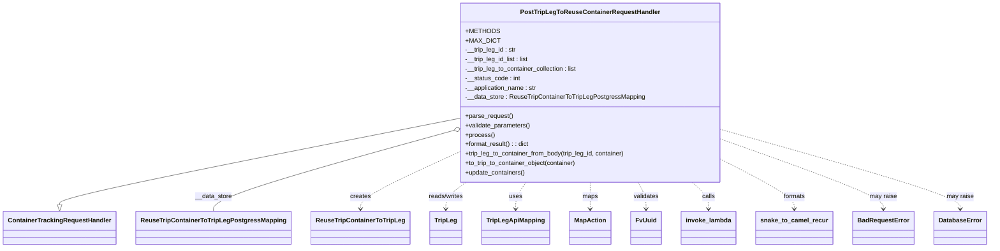
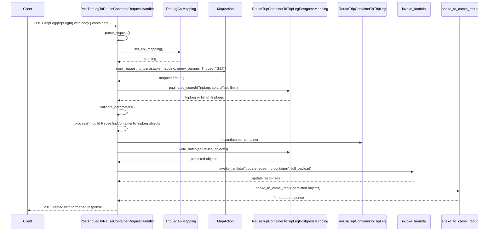

# Diagram: container_tracking_core/container_tracking_service/container_tracking_service/api/reuse_trip_container_to_trip_leg/handlers/post_reuse_trip_container_to_trip_handler.py

> Auto-generated by Obscura crawlers

## Diagram 1

### SVG

<svg id="container" width="2420.625" xmlns="http://www.w3.org/2000/svg" class="classDiagram" height="630" viewBox="0 0 2420.625 630" role="graphics-document document" aria-roledescription="class"><g><defs><marker id="container_class-aggregationStart" class="marker aggregation class" refX="18" refY="7" markerWidth="190" markerHeight="240" orient="auto"><path d="M 18,7 L9,13 L1,7 L9,1 Z"></path></marker></defs><defs><marker id="container_class-aggregationEnd" class="marker aggregation class" refX="1" refY="7" markerWidth="20" markerHeight="28" orient="auto"><path d="M 18,7 L9,13 L1,7 L9,1 Z"></path></marker></defs><defs><marker id="container_class-extensionStart" class="marker extension class" refX="18" refY="7" markerWidth="190" markerHeight="240" orient="auto"><path d="M 1,7 L18,13 V 1 Z"></path></marker></defs><defs><marker id="container_class-extensionEnd" class="marker extension class" refX="1" refY="7" markerWidth="20" markerHeight="28" orient="auto"><path d="M 1,1 V 13 L18,7 Z"></path></marker></defs><defs><marker id="container_class-compositionStart" class="marker composition class" refX="18" refY="7" markerWidth="190" markerHeight="240" orient="auto"><path d="M 18,7 L9,13 L1,7 L9,1 Z"></path></marker></defs><defs><marker id="container_class-compositionEnd" class="marker composition class" refX="1" refY="7" markerWidth="20" markerHeight="28" orient="auto"><path d="M 18,7 L9,13 L1,7 L9,1 Z"></path></marker></defs><defs><marker id="container_class-dependencyStart" class="marker dependency class" refX="6" refY="7" markerWidth="190" markerHeight="240" orient="auto"><path d="M 5,7 L9,13 L1,7 L9,1 Z"></path></marker></defs><defs><marker id="container_class-dependencyEnd" class="marker dependency class" refX="13" refY="7" markerWidth="20" markerHeight="28" orient="auto"><path d="M 18,7 L9,13 L14,7 L9,1 Z"></path></marker></defs><defs><marker id="container_class-lollipopStart" class="marker lollipop class" refX="13" refY="7" markerWidth="190" markerHeight="240" orient="auto"><circle stroke="black" fill="transparent" cx="7" cy="7" r="6"></circle></marker></defs><defs><marker id="container_class-lollipopEnd" class="marker lollipop class" refX="1" refY="7" markerWidth="190" markerHeight="240" orient="auto"><circle stroke="black" fill="transparent" cx="7" cy="7" r="6"></circle></marker></defs><g class="root"><g class="clusters"></g><g class="edgePaths"><path d="M1115.793,302.224L954.092,335.353C792.391,368.482,468.988,434.741,307.287,471.162C145.586,507.583,145.586,514.167,145.586,517.458L145.586,520.75" id="id_PostTripLegToReuseContainerRequestHandler_ContainerTrackingRequestHandler_1" class="edge-thickness-normal edge-pattern-solid relation" style=";;;" data-edge="true" data-et="edge" data-id="id_PostTripLegToReuseContainerRequestHandler_ContainerTrackingRequestHandler_1" data-points="W3sieCI6MTExNS43OTI5Njg3NSwieSI6MzAyLjIyMzU4OTYzNTE3NzZ9LHsieCI6MTQ1LjU4NTkzNzUsInkiOjUwMX0seyJ4IjoxNDUuNTg1OTM3NSwieSI6NTM4fV0=" marker-end="url(#container_class-extensionEnd)"></path><path d="M1099.218,333.963L1002.65,361.802C906.083,389.642,712.948,445.321,616.38,479.327C519.813,513.333,519.813,525.667,519.813,531.833L519.813,538" id="id_PostTripLegToReuseContainerRequestHandler_ReuseTripContainerToTripLegPostgressMapping_2" class="edge-thickness-normal edge-pattern-solid relation" style=";;;" data-edge="true" data-et="edge" data-id="id_PostTripLegToReuseContainerRequestHandler_ReuseTripContainerToTripLegPostgressMapping_2" data-points="W3sieCI6MTExNS43OTI5Njg3NSwieSI6MzI5LjE4NDM1MDUzODQyMDM1fSx7IngiOjUxOS44MTI1LCJ5Ijo1MDF9LHsieCI6NTE5LjgxMjUsInkiOjUzOH1d" marker-start="url(#container_class-aggregationStart)"></path><path d="M1115.793,388.153L1075.838,406.961C1035.883,425.769,955.973,463.384,916.018,487.359C876.063,511.333,876.063,521.667,876.063,526.833L876.063,532" id="id_PostTripLegToReuseContainerRequestHandler_ReuseTripContainerToTripLeg_3" class="edge-thickness-normal edge-pattern-dashed relation" style=";;;" data-edge="true" data-et="edge" data-id="id_PostTripLegToReuseContainerRequestHandler_ReuseTripContainerToTripLeg_3" data-points="W3sieCI6MTExNS43OTI5Njg3NSwieSI6Mzg4LjE1Mjc4NDUyMzc5M30seyJ4Ijo4NzYuMDYyNSwieSI6NTAxfSx7IngiOjg3Ni4wNjI1LCJ5Ijo1Mzh9XQ==" marker-end="url(#container_class-dependencyEnd)"></path><path d="M1134.194,464L1125.95,470.167C1117.705,476.333,1101.216,488.667,1092.971,500C1084.727,511.333,1084.727,521.667,1084.727,526.833L1084.727,532" id="id_PostTripLegToReuseContainerRequestHandler_TripLeg_4" class="edge-thickness-normal edge-pattern-dashed relation" style=";;;" data-edge="true" data-et="edge" data-id="id_PostTripLegToReuseContainerRequestHandler_TripLeg_4" data-points="W3sieCI6MTEzNC4xOTQ0MjgwNjYwMzc3LCJ5Ijo0NjR9LHsieCI6MTA4NC43MjY1NjI1LCJ5Ijo1MDF9LHsieCI6MTA4NC43MjY1NjI1LCJ5Ijo1Mzh9XQ==" marker-end="url(#container_class-dependencyEnd)"></path><path d="M1281.628,464L1277.371,470.167C1273.114,476.333,1264.6,488.667,1260.343,500C1256.086,511.333,1256.086,521.667,1256.086,526.833L1256.086,532" id="id_PostTripLegToReuseContainerRequestHandler_TripLegApiMapping_5" class="edge-thickness-normal edge-pattern-dashed relation" style=";;;" data-edge="true" data-et="edge" data-id="id_PostTripLegToReuseContainerRequestHandler_TripLegApiMapping_5" data-points="W3sieCI6MTI4MS42MjgxNTQ0ODExMzIsInkiOjQ2NH0seyJ4IjoxMjU2LjA4NTkzNzUsInkiOjUwMX0seyJ4IjoxMjU2LjA4NTkzNzUsInkiOjUzOH1d" marker-end="url(#container_class-dependencyEnd)"></path><path d="M1439.023,464L1439.023,470.167C1439.023,476.333,1439.023,488.667,1439.023,500C1439.023,511.333,1439.023,521.667,1439.023,526.833L1439.023,532" id="id_PostTripLegToReuseContainerRequestHandler_MapAction_6" class="edge-thickness-normal edge-pattern-dashed relation" style=";;;" data-edge="true" data-et="edge" data-id="id_PostTripLegToReuseContainerRequestHandler_MapAction_6" data-points="W3sieCI6MTQzOS4wMjM0Mzc1LCJ5Ijo0NjR9LHsieCI6MTQzOS4wMjM0Mzc1LCJ5Ijo1MDF9LHsieCI6MTQzOS4wMjM0Mzc1LCJ5Ijo1Mzh9XQ==" marker-end="url(#container_class-dependencyEnd)"></path><path d="M1557.063,464L1560.256,470.167C1563.448,476.333,1569.834,488.667,1573.026,500C1576.219,511.333,1576.219,521.667,1576.219,526.833L1576.219,532" id="id_PostTripLegToReuseContainerRequestHandler_FvUuid_7" class="edge-thickness-normal edge-pattern-dashed relation" style=";;;" data-edge="true" data-et="edge" data-id="id_PostTripLegToReuseContainerRequestHandler_FvUuid_7" data-points="W3sieCI6MTU1Ny4wNjMxNzgwNjYwMzc4LCJ5Ijo0NjR9LHsieCI6MTU3Ni4yMTg3NSwieSI6NTAxfSx7IngiOjE1NzYuMjE4NzUsInkiOjUzOH1d" marker-end="url(#container_class-dependencyEnd)"></path><path d="M1689.723,464L1696.503,470.167C1703.284,476.333,1716.845,488.667,1723.626,500C1730.406,511.333,1730.406,521.667,1730.406,526.833L1730.406,532" id="id_PostTripLegToReuseContainerRequestHandler_invoke_lambda_8" class="edge-thickness-normal edge-pattern-dashed relation" style=";;;" data-edge="true" data-et="edge" data-id="id_PostTripLegToReuseContainerRequestHandler_invoke_lambda_8" data-points="W3sieCI6MTY4OS43MjI2MTIwMjgzMDIsInkiOjQ2NH0seyJ4IjoxNzMwLjQwNjI1LCJ5Ijo1MDF9LHsieCI6MTczMC40MDYyNSwieSI6NTM4fV0=" marker-end="url(#container_class-dependencyEnd)"></path><path d="M1762.254,406.404L1792.16,422.17C1822.065,437.936,1881.876,469.468,1911.782,490.401C1941.688,511.333,1941.688,521.667,1941.688,526.833L1941.688,532" id="id_PostTripLegToReuseContainerRequestHandler_snake_to_camel_recur_9" class="edge-thickness-normal edge-pattern-dashed relation" style=";;;" data-edge="true" data-et="edge" data-id="id_PostTripLegToReuseContainerRequestHandler_snake_to_camel_recur_9" data-points="W3sieCI6MTc2Mi4yNTM5MDYyNSwieSI6NDA2LjQwNDIxMzQ4NzUxMTh9LHsieCI6MTk0MS42ODc1LCJ5Ijo1MDF9LHsieCI6MTk0MS42ODc1LCJ5Ijo1Mzh9XQ==" marker-end="url(#container_class-dependencyEnd)"></path><path d="M1762.254,354.867L1828.482,379.223C1894.711,403.578,2027.168,452.289,2093.396,481.811C2159.625,511.333,2159.625,521.667,2159.625,526.833L2159.625,532" id="id_PostTripLegToReuseContainerRequestHandler_BadRequestError_10" class="edge-thickness-normal edge-pattern-dashed relation" style=";;;" data-edge="true" data-et="edge" data-id="id_PostTripLegToReuseContainerRequestHandler_BadRequestError_10" data-points="W3sieCI6MTc2Mi4yNTM5MDYyNSwieSI6MzU0Ljg2NzQ1NTU3NjM5NTU3fSx7IngiOjIxNTkuNjI1LCJ5Ijo1MDF9LHsieCI6MjE1OS42MjUsInkiOjUzOH1d" marker-end="url(#container_class-dependencyEnd)"></path><path d="M1762.254,330.206L1859.923,358.672C1957.591,387.137,2152.928,444.069,2250.597,477.701C2348.266,511.333,2348.266,521.667,2348.266,526.833L2348.266,532" id="id_PostTripLegToReuseContainerRequestHandler_DatabaseError_11" class="edge-thickness-normal edge-pattern-dashed relation" style=";;;" data-edge="true" data-et="edge" data-id="id_PostTripLegToReuseContainerRequestHandler_DatabaseError_11" data-points="W3sieCI6MTc2Mi4yNTM5MDYyNSwieSI6MzMwLjIwNjAwNTE3MjU3Njc0fSx7IngiOjIzNDguMjY1NjI1LCJ5Ijo1MDF9LHsieCI6MjM0OC4yNjU2MjUsInkiOjUzOH1d" marker-end="url(#container_class-dependencyEnd)"></path></g><g class="edgeLabels"><g class="edgeLabel"><g class="label" data-id="id_PostTripLegToReuseContainerRequestHandler_ContainerTrackingRequestHandler_1" transform="translate(0, 0)"><foreignObject width="0" height="0">

</foreignObject></g></g><g class="edgeLabel" transform="translate(519.8125, 501)"><g class="label" data-id="id_PostTripLegToReuseContainerRequestHandler_ReuseTripContainerToTripLegPostgressMapping_2" transform="translate(-46.9453125, -12)"><foreignObject width="93.890625" height="24">

__data_store

</foreignObject></g></g><g class="edgeLabel" transform="translate(876.0625, 501)"><g class="label" data-id="id_PostTripLegToReuseContainerRequestHandler_ReuseTripContainerToTripLeg_3" transform="translate(-26.171875, -12)"><foreignObject width="52.34375" height="24">

creates

</foreignObject></g></g><g class="edgeLabel" transform="translate(1084.7265625, 501)"><g class="label" data-id="id_PostTripLegToReuseContainerRequestHandler_TripLeg_4" transform="translate(-45.9453125, -12)"><foreignObject width="91.890625" height="24">

reads/writes

</foreignObject></g></g><g class="edgeLabel" transform="translate(1256.0859375, 501)"><g class="label" data-id="id_PostTripLegToReuseContainerRequestHandler_TripLegApiMapping_5" transform="translate(-16.4921875, -12)"><foreignObject width="32.984375" height="24">

uses

</foreignObject></g></g><g class="edgeLabel" transform="translate(1439.0234375, 501)"><g class="label" data-id="id_PostTripLegToReuseContainerRequestHandler_MapAction_6" transform="translate(-19.703125, -12)"><foreignObject width="39.40625" height="24">

maps

</foreignObject></g></g><g class="edgeLabel" transform="translate(1576.21875, 501)"><g class="label" data-id="id_PostTripLegToReuseContainerRequestHandler_FvUuid_7" transform="translate(-32.6875, -12)"><foreignObject width="65.375" height="24">

validates

</foreignObject></g></g><g class="edgeLabel" transform="translate(1730.40625, 501)"><g class="label" data-id="id_PostTripLegToReuseContainerRequestHandler_invoke_lambda_8" transform="translate(-16.4453125, -12)"><foreignObject width="32.890625" height="24">

calls

</foreignObject></g></g><g class="edgeLabel" transform="translate(1941.6875, 501)"><g class="label" data-id="id_PostTripLegToReuseContainerRequestHandler_snake_to_camel_recur_9" transform="translate(-28.1953125, -12)"><foreignObject width="56.390625" height="24">

formats

</foreignObject></g></g><g class="edgeLabel" transform="translate(2159.625, 501)"><g class="label" data-id="id_PostTripLegToReuseContainerRequestHandler_BadRequestError_10" transform="translate(-34.65625, -12)"><foreignObject width="69.3125" height="24">

may raise

</foreignObject></g></g><g class="edgeLabel" transform="translate(2348.265625, 501)"><g class="label" data-id="id_PostTripLegToReuseContainerRequestHandler_DatabaseError_11" transform="translate(-34.65625, -12)"><foreignObject width="69.3125" height="24">

may raise

</foreignObject></g></g></g><g class="nodes"><g class="node default" id="classId-ContainerTrackingRequestHandler-0" transform="translate(145.5859375, 580)"><g class="basic label-container"><path d="M-137.5859375 -42 L137.5859375 -42 L137.5859375 42 L-137.5859375 42" stroke="none" stroke-width="0" fill="#ECECFF" style=""></path><path d="M-137.5859375 -42 C-58.0615348260456 -42, 21.462867847908797 -42, 137.5859375 -42 M-137.5859375 -42 C-76.27645477059501 -42, -14.966972041190019 -42, 137.5859375 -42 M137.5859375 -42 C137.5859375 -21.01122564875767, 137.5859375 -0.02245129751533881, 137.5859375 42 M137.5859375 -42 C137.5859375 -21.829006529709158, 137.5859375 -1.658013059418316, 137.5859375 42 M137.5859375 42 C58.08143857414703 42, -21.423060351705942 42, -137.5859375 42 M137.5859375 42 C54.84979628873835 42, -27.886344922523307 42, -137.5859375 42 M-137.5859375 42 C-137.5859375 8.933146772441745, -137.5859375 -24.13370645511651, -137.5859375 -42 M-137.5859375 42 C-137.5859375 15.118500659294082, -137.5859375 -11.762998681411837, -137.5859375 -42" stroke="#9370DB" stroke-width="1.3" fill="none" stroke-dasharray="0 0" style=""></path></g><g class="annotation-group text" transform="translate(0, -18)"></g><g class="label-group text" transform="translate(-125.5859375, -18)"><g class="label" style="font-weight: bolder" transform="translate(0,-12)"><foreignObject width="251.171875" height="24">

ContainerTrackingRequestHandler

</foreignObject></g></g><g class="members-group text" transform="translate(-125.5859375, 30)"></g><g class="methods-group text" transform="translate(-125.5859375, 60)"></g><g class="divider" style=""><path d="M-137.5859375 6 C-49.02293384178607 6, 39.54006981642786 6, 137.5859375 6 M-137.5859375 6 C-75.50334582483923 6, -13.420754149678459 6, 137.5859375 6" stroke="#9370DB" stroke-width="1.3" fill="none" stroke-dasharray="0 0" style=""></path></g><g class="divider" style=""><path d="M-137.5859375 24 C-36.803539603057644 24, 63.97885829388471 24, 137.5859375 24 M-137.5859375 24 C-72.92796891999537 24, -8.27000033999073 24, 137.5859375 24" stroke="#9370DB" stroke-width="1.3" fill="none" stroke-dasharray="0 0" style=""></path></g></g><g class="node default" id="classId-PostTripLegToReuseContainerRequestHandler-1" transform="translate(1439.0234375, 236)"><g class="basic label-container"><path d="M-323.23046875 -228 L323.23046875 -228 L323.23046875 228 L-323.23046875 228" stroke="none" stroke-width="0" fill="#ECECFF" style=""></path><path d="M-323.23046875 -228 C-180.36680057033223 -228, -37.50313239066446 -228, 323.23046875 -228 M-323.23046875 -228 C-119.99399357305876 -228, 83.24248160388248 -228, 323.23046875 -228 M323.23046875 -228 C323.23046875 -73.54639670811767, 323.23046875 80.90720658376466, 323.23046875 228 M323.23046875 -228 C323.23046875 -112.02498474618457, 323.23046875 3.9500305076308564, 323.23046875 228 M323.23046875 228 C180.07781923813678 228, 36.925169726273566 228, -323.23046875 228 M323.23046875 228 C148.05589697803447 228, -27.118674793931064 228, -323.23046875 228 M-323.23046875 228 C-323.23046875 135.09679197970644, -323.23046875 42.19358395941285, -323.23046875 -228 M-323.23046875 228 C-323.23046875 127.41601061277169, -323.23046875 26.83202122554337, -323.23046875 -228" stroke="#9370DB" stroke-width="1.3" fill="none" stroke-dasharray="0 0" style=""></path></g><g class="annotation-group text" transform="translate(0, -204)"></g><g class="label-group text" transform="translate(-168.5390625, -204)"><g class="label" style="font-weight: bolder" transform="translate(0,-12)"><foreignObject width="337.078125" height="24">

PostTripLegToReuseContainerRequestHandler

</foreignObject></g></g><g class="members-group text" transform="translate(-311.23046875, -156)"><g class="label" style="" transform="translate(0,-12)"><foreignObject width="78.25" height="24">

+METHODS

</foreignObject></g><g class="label" style="" transform="translate(0,12)"><foreignObject width="78.65625" height="24">

+MAX_DICT

</foreignObject></g><g class="label" style="" transform="translate(0,36)"><foreignObject width="131" height="24">

-__trip_leg_id : str

</foreignObject></g><g class="label" style="" transform="translate(0,60)"><foreignObject width="164.625" height="24">

-__trip_leg_id_list : list

</foreignObject></g><g class="label" style="" transform="translate(0,84)"><foreignObject width="289.453125" height="24">

-__trip_leg_to_container_collection : list

</foreignObject></g><g class="label" style="" transform="translate(0,108)"><foreignObject width="140.6875" height="24">

-__status_code : int

</foreignObject></g><g class="label" style="" transform="translate(0,132)"><foreignObject width="184.03125" height="24">

-__application_name : str

</foreignObject></g><g class="label" style="" transform="translate(0,156)"><foreignObject width="453.921875" height="24">

-__data_store : ReuseTripContainerToTripLegPostgressMapping

</foreignObject></g></g><g class="methods-group text" transform="translate(-311.23046875, 60)"><g class="label" style="" transform="translate(0,-12)"><foreignObject width="121.796875" height="24">

+parse_request()

</foreignObject></g><g class="label" style="" transform="translate(0,12)"><foreignObject width="166.546875" height="24">

+validate_parameters()

</foreignObject></g><g class="label" style="" transform="translate(0,36)"><foreignObject width="73.734375" height="24">

+process()

</foreignObject></g><g class="label" style="" transform="translate(0,60)"><foreignObject width="164.921875" height="24">

+format_result() : : dict

</foreignObject></g><g class="label" style="" transform="translate(0,84)"><foreignObject width="414.203125" height="24">

+trip_leg_to_container_from_body(trip_leg_id, container)

</foreignObject></g><g class="label" style="" transform="translate(0,108)"><foreignObject width="287.640625" height="24">

+to_trip_to_container_object(container)

</foreignObject></g><g class="label" style="" transform="translate(0,132)"><foreignObject width="153.8125" height="24">

+update_containers()

</foreignObject></g></g><g class="divider" style=""><path d="M-323.23046875 -180 C-100.85930714536022 -180, 121.51185445927956 -180, 323.23046875 -180 M-323.23046875 -180 C-169.5463349526733 -180, -15.862201155346611 -180, 323.23046875 -180" stroke="#9370DB" stroke-width="1.3" fill="none" stroke-dasharray="0 0" style=""></path></g><g class="divider" style=""><path d="M-323.23046875 36 C-143.43916755654374 36, 36.35213363691253 36, 323.23046875 36 M-323.23046875 36 C-80.25363791771682 36, 162.72319291456637 36, 323.23046875 36" stroke="#9370DB" stroke-width="1.3" fill="none" stroke-dasharray="0 0" style=""></path></g></g><g class="node default" id="classId-ReuseTripContainerToTripLegPostgressMapping-2" transform="translate(519.8125, 580)"><g class="basic label-container"><path d="M-186.640625 -42 L186.640625 -42 L186.640625 42 L-186.640625 42" stroke="none" stroke-width="0" fill="#ECECFF" style=""></path><path d="M-186.640625 -42 C-65.56831627652618 -42, 55.50399244694765 -42, 186.640625 -42 M-186.640625 -42 C-53.4837901876883 -42, 79.6730446246234 -42, 186.640625 -42 M186.640625 -42 C186.640625 -21.5027471962002, 186.640625 -1.0054943924004007, 186.640625 42 M186.640625 -42 C186.640625 -23.074485449699722, 186.640625 -4.148970899399444, 186.640625 42 M186.640625 42 C57.6287393819143 42, -71.3831462361714 42, -186.640625 42 M186.640625 42 C66.50003707503123 42, -53.64055084993754 42, -186.640625 42 M-186.640625 42 C-186.640625 12.180303622207834, -186.640625 -17.639392755584332, -186.640625 -42 M-186.640625 42 C-186.640625 19.989234830551617, -186.640625 -2.021530338896767, -186.640625 -42" stroke="#9370DB" stroke-width="1.3" fill="none" stroke-dasharray="0 0" style=""></path></g><g class="annotation-group text" transform="translate(0, -18)"></g><g class="label-group text" transform="translate(-174.640625, -18)"><g class="label" style="font-weight: bolder" transform="translate(0,-12)"><foreignObject width="349.28125" height="24">

ReuseTripContainerToTripLegPostgressMapping

</foreignObject></g></g><g class="members-group text" transform="translate(-174.640625, 30)"></g><g class="methods-group text" transform="translate(-174.640625, 60)"></g><g class="divider" style=""><path d="M-186.640625 6 C-48.49371820622926 6, 89.65318858754148 6, 186.640625 6 M-186.640625 6 C-50.12848112629507 6, 86.38366274740986 6, 186.640625 6" stroke="#9370DB" stroke-width="1.3" fill="none" stroke-dasharray="0 0" style=""></path></g><g class="divider" style=""><path d="M-186.640625 24 C-79.74252760280189 24, 27.15556979439623 24, 186.640625 24 M-186.640625 24 C-95.00539778313681 24, -3.3701705662736288 24, 186.640625 24" stroke="#9370DB" stroke-width="1.3" fill="none" stroke-dasharray="0 0" style=""></path></g></g><g class="node default" id="classId-ReuseTripContainerToTripLeg-3" transform="translate(876.0625, 580)"><g class="basic label-container"><path d="M-119.609375 -42 L119.609375 -42 L119.609375 42 L-119.609375 42" stroke="none" stroke-width="0" fill="#ECECFF" style=""></path><path d="M-119.609375 -42 C-53.88387383377801 -42, 11.841627332443977 -42, 119.609375 -42 M-119.609375 -42 C-33.13488360864905 -42, 53.339607782701904 -42, 119.609375 -42 M119.609375 -42 C119.609375 -20.156188695071222, 119.609375 1.6876226098575557, 119.609375 42 M119.609375 -42 C119.609375 -14.161674072860777, 119.609375 13.676651854278447, 119.609375 42 M119.609375 42 C62.538826608684595 42, 5.468278217369189 42, -119.609375 42 M119.609375 42 C42.73905687657887 42, -34.13126124684226 42, -119.609375 42 M-119.609375 42 C-119.609375 11.461476269306786, -119.609375 -19.077047461386428, -119.609375 -42 M-119.609375 42 C-119.609375 15.483885756365456, -119.609375 -11.032228487269087, -119.609375 -42" stroke="#9370DB" stroke-width="1.3" fill="none" stroke-dasharray="0 0" style=""></path></g><g class="annotation-group text" transform="translate(0, -18)"></g><g class="label-group text" transform="translate(-107.609375, -18)"><g class="label" style="font-weight: bolder" transform="translate(0,-12)"><foreignObject width="215.21875" height="24">

ReuseTripContainerToTripLeg

</foreignObject></g></g><g class="members-group text" transform="translate(-107.609375, 30)"></g><g class="methods-group text" transform="translate(-107.609375, 60)"></g><g class="divider" style=""><path d="M-119.609375 6 C-70.04959339706406 6, -20.4898117941281 6, 119.609375 6 M-119.609375 6 C-63.17462474588809 6, -6.7398744917761775 6, 119.609375 6" stroke="#9370DB" stroke-width="1.3" fill="none" stroke-dasharray="0 0" style=""></path></g><g class="divider" style=""><path d="M-119.609375 24 C-46.36740474861914 24, 26.874565502761726 24, 119.609375 24 M-119.609375 24 C-43.21631020216907 24, 33.17675459566186 24, 119.609375 24" stroke="#9370DB" stroke-width="1.3" fill="none" stroke-dasharray="0 0" style=""></path></g></g><g class="node default" id="classId-TripLeg-4" transform="translate(1084.7265625, 580)"><g class="basic label-container"><path d="M-39.0546875 -42 L39.0546875 -42 L39.0546875 42 L-39.0546875 42" stroke="none" stroke-width="0" fill="#ECECFF" style=""></path><path d="M-39.0546875 -42 C-20.70857700281611 -42, -2.36246650563222 -42, 39.0546875 -42 M-39.0546875 -42 C-12.436377648650108 -42, 14.181932202699784 -42, 39.0546875 -42 M39.0546875 -42 C39.0546875 -17.943648284229575, 39.0546875 6.112703431540851, 39.0546875 42 M39.0546875 -42 C39.0546875 -14.257619321649095, 39.0546875 13.48476135670181, 39.0546875 42 M39.0546875 42 C21.86714421029549 42, 4.679600920590978 42, -39.0546875 42 M39.0546875 42 C11.822862260476949 42, -15.408962979046102 42, -39.0546875 42 M-39.0546875 42 C-39.0546875 15.810002314499226, -39.0546875 -10.379995371001549, -39.0546875 -42 M-39.0546875 42 C-39.0546875 11.866947647802515, -39.0546875 -18.26610470439497, -39.0546875 -42" stroke="#9370DB" stroke-width="1.3" fill="none" stroke-dasharray="0 0" style=""></path></g><g class="annotation-group text" transform="translate(0, -18)"></g><g class="label-group text" transform="translate(-27.0546875, -18)"><g class="label" style="font-weight: bolder" transform="translate(0,-12)"><foreignObject width="54.109375" height="24">

TripLeg

</foreignObject></g></g><g class="members-group text" transform="translate(-27.0546875, 30)"></g><g class="methods-group text" transform="translate(-27.0546875, 60)"></g><g class="divider" style=""><path d="M-39.0546875 6 C-7.92871155945064 6, 23.19726438109872 6, 39.0546875 6 M-39.0546875 6 C-13.103752863390326 6, 12.847181773219347 6, 39.0546875 6" stroke="#9370DB" stroke-width="1.3" fill="none" stroke-dasharray="0 0" style=""></path></g><g class="divider" style=""><path d="M-39.0546875 24 C-23.097092726360223 24, -7.139497952720447 24, 39.0546875 24 M-39.0546875 24 C-22.43793134739298 24, -5.821175194785958 24, 39.0546875 24" stroke="#9370DB" stroke-width="1.3" fill="none" stroke-dasharray="0 0" style=""></path></g></g><g class="node default" id="classId-TripLegApiMapping-5" transform="translate(1256.0859375, 580)"><g class="basic label-container"><path d="M-82.3046875 -42 L82.3046875 -42 L82.3046875 42 L-82.3046875 42" stroke="none" stroke-width="0" fill="#ECECFF" style=""></path><path d="M-82.3046875 -42 C-48.88357157203858 -42, -15.462455644077167 -42, 82.3046875 -42 M-82.3046875 -42 C-40.632572098928186 -42, 1.0395433021436276 -42, 82.3046875 -42 M82.3046875 -42 C82.3046875 -16.297479414270015, 82.3046875 9.40504117145997, 82.3046875 42 M82.3046875 -42 C82.3046875 -21.660146435780064, 82.3046875 -1.3202928715601274, 82.3046875 42 M82.3046875 42 C25.677741631506514 42, -30.949204236986972 42, -82.3046875 42 M82.3046875 42 C40.5637984890162 42, -1.1770905219675996 42, -82.3046875 42 M-82.3046875 42 C-82.3046875 18.76050626950666, -82.3046875 -4.47898746098668, -82.3046875 -42 M-82.3046875 42 C-82.3046875 18.151334918907477, -82.3046875 -5.697330162185047, -82.3046875 -42" stroke="#9370DB" stroke-width="1.3" fill="none" stroke-dasharray="0 0" style=""></path></g><g class="annotation-group text" transform="translate(0, -18)"></g><g class="label-group text" transform="translate(-70.3046875, -18)"><g class="label" style="font-weight: bolder" transform="translate(0,-12)"><foreignObject width="140.609375" height="24">

TripLegApiMapping

</foreignObject></g></g><g class="members-group text" transform="translate(-70.3046875, 30)"></g><g class="methods-group text" transform="translate(-70.3046875, 60)"></g><g class="divider" style=""><path d="M-82.3046875 6 C-36.36940575597697 6, 9.56587598804606 6, 82.3046875 6 M-82.3046875 6 C-20.21259196882965 6, 41.8795035623407 6, 82.3046875 6" stroke="#9370DB" stroke-width="1.3" fill="none" stroke-dasharray="0 0" style=""></path></g><g class="divider" style=""><path d="M-82.3046875 24 C-38.40582136341287 24, 5.493044773174262 24, 82.3046875 24 M-82.3046875 24 C-30.926514403363 24, 20.451658693274 24, 82.3046875 24" stroke="#9370DB" stroke-width="1.3" fill="none" stroke-dasharray="0 0" style=""></path></g></g><g class="node default" id="classId-MapAction-6" transform="translate(1439.0234375, 580)"><g class="basic label-container"><path d="M-50.6328125 -42 L50.6328125 -42 L50.6328125 42 L-50.6328125 42" stroke="none" stroke-width="0" fill="#ECECFF" style=""></path><path d="M-50.6328125 -42 C-23.79790382431364 -42, 3.0370048513727212 -42, 50.6328125 -42 M-50.6328125 -42 C-14.930592199321666 -42, 20.77162810135667 -42, 50.6328125 -42 M50.6328125 -42 C50.6328125 -18.13025426870853, 50.6328125 5.73949146258294, 50.6328125 42 M50.6328125 -42 C50.6328125 -21.86858823424151, 50.6328125 -1.737176468483021, 50.6328125 42 M50.6328125 42 C19.053453074276398 42, -12.525906351447205 42, -50.6328125 42 M50.6328125 42 C20.45944344627149 42, -9.713925607457021 42, -50.6328125 42 M-50.6328125 42 C-50.6328125 8.455840897925043, -50.6328125 -25.088318204149914, -50.6328125 -42 M-50.6328125 42 C-50.6328125 17.478288042526618, -50.6328125 -7.043423914946764, -50.6328125 -42" stroke="#9370DB" stroke-width="1.3" fill="none" stroke-dasharray="0 0" style=""></path></g><g class="annotation-group text" transform="translate(0, -18)"></g><g class="label-group text" transform="translate(-38.6328125, -18)"><g class="label" style="font-weight: bolder" transform="translate(0,-12)"><foreignObject width="77.265625" height="24">

MapAction

</foreignObject></g></g><g class="members-group text" transform="translate(-38.6328125, 30)"></g><g class="methods-group text" transform="translate(-38.6328125, 60)"></g><g class="divider" style=""><path d="M-50.6328125 6 C-12.809433731379677 6, 25.013945037240646 6, 50.6328125 6 M-50.6328125 6 C-13.099571635834593 6, 24.433669228330814 6, 50.6328125 6" stroke="#9370DB" stroke-width="1.3" fill="none" stroke-dasharray="0 0" style=""></path></g><g class="divider" style=""><path d="M-50.6328125 24 C-19.958255505176414 24, 10.716301489647172 24, 50.6328125 24 M-50.6328125 24 C-13.057603690339796 24, 24.517605119320407 24, 50.6328125 24" stroke="#9370DB" stroke-width="1.3" fill="none" stroke-dasharray="0 0" style=""></path></g></g><g class="node default" id="classId-FvUuid-7" transform="translate(1576.21875, 580)"><g class="basic label-container"><path d="M-36.5625 -42 L36.5625 -42 L36.5625 42 L-36.5625 42" stroke="none" stroke-width="0" fill="#ECECFF" style=""></path><path d="M-36.5625 -42 C-20.067086013824824 -42, -3.5716720276496474 -42, 36.5625 -42 M-36.5625 -42 C-7.393376417172618 -42, 21.775747165654764 -42, 36.5625 -42 M36.5625 -42 C36.5625 -10.995503282230363, 36.5625 20.008993435539274, 36.5625 42 M36.5625 -42 C36.5625 -18.838559183615175, 36.5625 4.322881632769651, 36.5625 42 M36.5625 42 C21.935277295935165 42, 7.308054591870327 42, -36.5625 42 M36.5625 42 C15.520027670330673 42, -5.522444659338653 42, -36.5625 42 M-36.5625 42 C-36.5625 13.409647001419323, -36.5625 -15.180705997161354, -36.5625 -42 M-36.5625 42 C-36.5625 15.159949813838352, -36.5625 -11.680100372323295, -36.5625 -42" stroke="#9370DB" stroke-width="1.3" fill="none" stroke-dasharray="0 0" style=""></path></g><g class="annotation-group text" transform="translate(0, -18)"></g><g class="label-group text" transform="translate(-24.5625, -18)"><g class="label" style="font-weight: bolder" transform="translate(0,-12)"><foreignObject width="49.125" height="24">

FvUuid

</foreignObject></g></g><g class="members-group text" transform="translate(-24.5625, 30)"></g><g class="methods-group text" transform="translate(-24.5625, 60)"></g><g class="divider" style=""><path d="M-36.5625 6 C-21.918792336507998 6, -7.275084673015993 6, 36.5625 6 M-36.5625 6 C-8.780773263552451 6, 19.000953472895098 6, 36.5625 6" stroke="#9370DB" stroke-width="1.3" fill="none" stroke-dasharray="0 0" style=""></path></g><g class="divider" style=""><path d="M-36.5625 24 C-7.750765032733941 24, 21.060969934532118 24, 36.5625 24 M-36.5625 24 C-10.599499820188125 24, 15.36350035962375 24, 36.5625 24" stroke="#9370DB" stroke-width="1.3" fill="none" stroke-dasharray="0 0" style=""></path></g></g><g class="node default" id="classId-invoke_lambda-8" transform="translate(1730.40625, 580)"><g class="basic label-container"><path d="M-67.625 -42 L67.625 -42 L67.625 42 L-67.625 42" stroke="none" stroke-width="0" fill="#ECECFF" style=""></path><path d="M-67.625 -42 C-40.008777327397354 -42, -12.392554654794715 -42, 67.625 -42 M-67.625 -42 C-19.672878410088536 -42, 28.279243179822927 -42, 67.625 -42 M67.625 -42 C67.625 -19.58844567422565, 67.625 2.8231086515487007, 67.625 42 M67.625 -42 C67.625 -10.569941588399303, 67.625 20.860116823201395, 67.625 42 M67.625 42 C26.99152386457863 42, -13.641952270842737 42, -67.625 42 M67.625 42 C20.790125381539063 42, -26.044749236921874 42, -67.625 42 M-67.625 42 C-67.625 21.30973464687647, -67.625 0.6194692937529425, -67.625 -42 M-67.625 42 C-67.625 9.068986472465134, -67.625 -23.86202705506973, -67.625 -42" stroke="#9370DB" stroke-width="1.3" fill="none" stroke-dasharray="0 0" style=""></path></g><g class="annotation-group text" transform="translate(0, -18)"></g><g class="label-group text" transform="translate(-55.625, -18)"><g class="label" style="font-weight: bolder" transform="translate(0,-12)"><foreignObject width="111.25" height="24">

invoke_lambda

</foreignObject></g></g><g class="members-group text" transform="translate(-55.625, 30)"></g><g class="methods-group text" transform="translate(-55.625, 60)"></g><g class="divider" style=""><path d="M-67.625 6 C-23.683077042200978 6, 20.258845915598044 6, 67.625 6 M-67.625 6 C-14.54119480027223 6, 38.54261039945554 6, 67.625 6" stroke="#9370DB" stroke-width="1.3" fill="none" stroke-dasharray="0 0" style=""></path></g><g class="divider" style=""><path d="M-67.625 24 C-16.608456479973036 24, 34.40808704005393 24, 67.625 24 M-67.625 24 C-21.291631242855587 24, 25.041737514288826 24, 67.625 24" stroke="#9370DB" stroke-width="1.3" fill="none" stroke-dasharray="0 0" style=""></path></g></g><g class="node default" id="classId-snake_to_camel_recur-9" transform="translate(1941.6875, 580)"><g class="basic label-container"><path d="M-93.65625 -42 L93.65625 -42 L93.65625 42 L-93.65625 42" stroke="none" stroke-width="0" fill="#ECECFF" style=""></path><path d="M-93.65625 -42 C-21.585330602345593 -42, 50.485588795308814 -42, 93.65625 -42 M-93.65625 -42 C-39.51748897375765 -42, 14.621272052484699 -42, 93.65625 -42 M93.65625 -42 C93.65625 -17.081767739371053, 93.65625 7.836464521257895, 93.65625 42 M93.65625 -42 C93.65625 -16.058457614719412, 93.65625 9.883084770561176, 93.65625 42 M93.65625 42 C24.826913715512376 42, -44.00242256897525 42, -93.65625 42 M93.65625 42 C40.02360712235981 42, -13.609035755280374 42, -93.65625 42 M-93.65625 42 C-93.65625 8.450285668904904, -93.65625 -25.099428662190192, -93.65625 -42 M-93.65625 42 C-93.65625 22.78503294532249, -93.65625 3.570065890644983, -93.65625 -42" stroke="#9370DB" stroke-width="1.3" fill="none" stroke-dasharray="0 0" style=""></path></g><g class="annotation-group text" transform="translate(0, -18)"></g><g class="label-group text" transform="translate(-81.65625, -18)"><g class="label" style="font-weight: bolder" transform="translate(0,-12)"><foreignObject width="163.3125" height="24">

snake_to_camel_recur

</foreignObject></g></g><g class="members-group text" transform="translate(-81.65625, 30)"></g><g class="methods-group text" transform="translate(-81.65625, 60)"></g><g class="divider" style=""><path d="M-93.65625 6 C-18.928644748791584 6, 55.79896050241683 6, 93.65625 6 M-93.65625 6 C-40.49162601571023 6, 12.672997968579537 6, 93.65625 6" stroke="#9370DB" stroke-width="1.3" fill="none" stroke-dasharray="0 0" style=""></path></g><g class="divider" style=""><path d="M-93.65625 24 C-25.629055027059266 24, 42.39813994588147 24, 93.65625 24 M-93.65625 24 C-25.41317328433105 24, 42.8299034313379 24, 93.65625 24" stroke="#9370DB" stroke-width="1.3" fill="none" stroke-dasharray="0 0" style=""></path></g></g><g class="node default" id="classId-BadRequestError-10" transform="translate(2159.625, 580)"><g class="basic label-container"><path d="M-74.28125 -42 L74.28125 -42 L74.28125 42 L-74.28125 42" stroke="none" stroke-width="0" fill="#ECECFF" style=""></path><path d="M-74.28125 -42 C-31.72709120263601 -42, 10.827067594727978 -42, 74.28125 -42 M-74.28125 -42 C-19.532211753488873 -42, 35.21682649302225 -42, 74.28125 -42 M74.28125 -42 C74.28125 -21.203724468723866, 74.28125 -0.40744893744773236, 74.28125 42 M74.28125 -42 C74.28125 -19.632614967912218, 74.28125 2.7347700641755637, 74.28125 42 M74.28125 42 C22.90670607376949 42, -28.467837852461017 42, -74.28125 42 M74.28125 42 C35.370144698755034 42, -3.540960602489932 42, -74.28125 42 M-74.28125 42 C-74.28125 21.248225406049084, -74.28125 0.49645081209816766, -74.28125 -42 M-74.28125 42 C-74.28125 22.29683424602935, -74.28125 2.593668492058697, -74.28125 -42" stroke="#9370DB" stroke-width="1.3" fill="none" stroke-dasharray="0 0" style=""></path></g><g class="annotation-group text" transform="translate(0, -18)"></g><g class="label-group text" transform="translate(-62.28125, -18)"><g class="label" style="font-weight: bolder" transform="translate(0,-12)"><foreignObject width="124.5625" height="24">

BadRequestError

</foreignObject></g></g><g class="members-group text" transform="translate(-62.28125, 30)"></g><g class="methods-group text" transform="translate(-62.28125, 60)"></g><g class="divider" style=""><path d="M-74.28125 6 C-33.26310018257622 6, 7.755049634847566 6, 74.28125 6 M-74.28125 6 C-25.006074787505142 6, 24.269100424989716 6, 74.28125 6" stroke="#9370DB" stroke-width="1.3" fill="none" stroke-dasharray="0 0" style=""></path></g><g class="divider" style=""><path d="M-74.28125 24 C-44.29472615775619 24, -14.308202315512368 24, 74.28125 24 M-74.28125 24 C-27.729450367943976 24, 18.82234926411205 24, 74.28125 24" stroke="#9370DB" stroke-width="1.3" fill="none" stroke-dasharray="0 0" style=""></path></g></g><g class="node default" id="classId-DatabaseError-11" transform="translate(2348.265625, 580)"><g class="basic label-container"><path d="M-64.359375 -42 L64.359375 -42 L64.359375 42 L-64.359375 42" stroke="none" stroke-width="0" fill="#ECECFF" style=""></path><path d="M-64.359375 -42 C-31.72214316648214 -42, 0.9150886670357181 -42, 64.359375 -42 M-64.359375 -42 C-31.779031763839207 -42, 0.8013114723215864 -42, 64.359375 -42 M64.359375 -42 C64.359375 -16.18076271271308, 64.359375 9.638474574573841, 64.359375 42 M64.359375 -42 C64.359375 -11.27498475020435, 64.359375 19.4500304995913, 64.359375 42 M64.359375 42 C30.76099215620244 42, -2.837390687595118 42, -64.359375 42 M64.359375 42 C21.82177768453394 42, -20.715819630932117 42, -64.359375 42 M-64.359375 42 C-64.359375 11.100252136166098, -64.359375 -19.799495727667804, -64.359375 -42 M-64.359375 42 C-64.359375 21.91331935689618, -64.359375 1.826638713792363, -64.359375 -42" stroke="#9370DB" stroke-width="1.3" fill="none" stroke-dasharray="0 0" style=""></path></g><g class="annotation-group text" transform="translate(0, -18)"></g><g class="label-group text" transform="translate(-52.359375, -18)"><g class="label" style="font-weight: bolder" transform="translate(0,-12)"><foreignObject width="104.71875" height="24">

DatabaseError

</foreignObject></g></g><g class="members-group text" transform="translate(-52.359375, 30)"></g><g class="methods-group text" transform="translate(-52.359375, 60)"></g><g class="divider" style=""><path d="M-64.359375 6 C-36.79761782914836 6, -9.235860658296716 6, 64.359375 6 M-64.359375 6 C-13.471772826405555 6, 37.41582934718889 6, 64.359375 6" stroke="#9370DB" stroke-width="1.3" fill="none" stroke-dasharray="0 0" style=""></path></g><g class="divider" style=""><path d="M-64.359375 24 C-16.132258443497598 24, 32.094858113004804 24, 64.359375 24 M-64.359375 24 C-36.767033867956044 24, -9.174692735912082 24, 64.359375 24" stroke="#9370DB" stroke-width="1.3" fill="none" stroke-dasharray="0 0" style=""></path></g></g></g></g></g></svg>

## Diagram 2

### SVG

<svg id="container" width="2316.5" xmlns="http://www.w3.org/2000/svg" height="1125" viewBox="-50 -10 2316.5 1125" role="graphics-document document" aria-roledescription="sequence"><g><rect x="2034.5" y="1039" fill="#eaeaea" stroke="#666" width="182" height="65" name="Utils" rx="3" ry="3" class="actor actor-bottom"></rect><text x="2125.5" y="1071.5" dominant-baseline="central" alignment-baseline="central" class="actor actor-box" style="text-anchor: middle; font-size: 16px; font-weight: 400;"><tspan x="2125.5" dy="0">snake_to_camel_recur</tspan></text></g><g><rect x="1834.5" y="1039" fill="#eaeaea" stroke="#666" width="150" height="65" name="Lambda" rx="3" ry="3" class="actor actor-bottom"></rect><text x="1909.5" y="1071.5" dominant-baseline="central" alignment-baseline="central" class="actor actor-box" style="text-anchor: middle; font-size: 16px; font-weight: 400;"><tspan x="1909.5" dy="0">invoke_lambda</tspan></text></g><g><rect x="1552.5" y="1039" fill="#eaeaea" stroke="#666" width="232" height="65" name="ReuseModel" rx="3" ry="3" class="actor actor-bottom"></rect><text x="1668.5" y="1071.5" dominant-baseline="central" alignment-baseline="central" class="actor actor-box" style="text-anchor: middle; font-size: 16px; font-weight: 400;"><tspan x="1668.5" dy="0">ReuseTripContainerToTripLeg</tspan></text></g><g><rect x="1139.5" y="1039" fill="#eaeaea" stroke="#666" width="363" height="65" name="DataStore" rx="3" ry="3" class="actor actor-bottom"></rect><text x="1321" y="1071.5" dominant-baseline="central" alignment-baseline="central" class="actor actor-box" style="text-anchor: middle; font-size: 16px; font-weight: 400;"><tspan x="1321" dy="0">ReuseTripContainerToTripLegPostgressMapping</tspan></text></g><g><rect x="939.5" y="1039" fill="#eaeaea" stroke="#666" width="150" height="65" name="MapActionSvc" rx="3" ry="3" class="actor actor-bottom"></rect><text x="1014.5" y="1071.5" dominant-baseline="central" alignment-baseline="central" class="actor actor-box" style="text-anchor: middle; font-size: 16px; font-weight: 400;"><tspan x="1014.5" dy="0">MapAction</tspan></text></g><g><rect x="730.5" y="1039" fill="#eaeaea" stroke="#666" width="159" height="65" name="TripLegMapping" rx="3" ry="3" class="actor actor-bottom"></rect><text x="810" y="1071.5" dominant-baseline="central" alignment-baseline="central" class="actor actor-box" style="text-anchor: middle; font-size: 16px; font-weight: 400;"><tspan x="810" dy="0">TripLegApiMapping</tspan></text></g><g><rect x="327.5" y="1039" fill="#eaeaea" stroke="#666" width="353" height="65" name="Handler" rx="3" ry="3" class="actor actor-bottom"></rect><text x="504" y="1071.5" dominant-baseline="central" alignment-baseline="central" class="actor actor-box" style="text-anchor: middle; font-size: 16px; font-weight: 400;"><tspan x="504" dy="0">PostTripLegToReuseContainerRequestHandler</tspan></text></g><g><rect x="0" y="1039" fill="#eaeaea" stroke="#666" width="150" height="65" name="Client" rx="3" ry="3" class="actor actor-bottom"></rect><text x="75" y="1071.5" dominant-baseline="central" alignment-baseline="central" class="actor actor-box" style="text-anchor: middle; font-size: 16px; font-weight: 400;"><tspan x="75" dy="0">Client</tspan></text></g><g><line id="actor7" x1="2125.5" y1="65" x2="2125.5" y2="1039" class="actor-line 200" stroke-width="0.5px" stroke="#999" name="Utils"></line><g id="root-7"><rect x="2034.5" y="0" fill="#eaeaea" stroke="#666" width="182" height="65" name="Utils" rx="3" ry="3" class="actor actor-top"></rect><text x="2125.5" y="32.5" dominant-baseline="central" alignment-baseline="central" class="actor actor-box" style="text-anchor: middle; font-size: 16px; font-weight: 400;"><tspan x="2125.5" dy="0">snake_to_camel_recur</tspan></text></g></g><g><line id="actor6" x1="1909.5" y1="65" x2="1909.5" y2="1039" class="actor-line 200" stroke-width="0.5px" stroke="#999" name="Lambda"></line><g id="root-6"><rect x="1834.5" y="0" fill="#eaeaea" stroke="#666" width="150" height="65" name="Lambda" rx="3" ry="3" class="actor actor-top"></rect><text x="1909.5" y="32.5" dominant-baseline="central" alignment-baseline="central" class="actor actor-box" style="text-anchor: middle; font-size: 16px; font-weight: 400;"><tspan x="1909.5" dy="0">invoke_lambda</tspan></text></g></g><g><line id="actor5" x1="1668.5" y1="65" x2="1668.5" y2="1039" class="actor-line 200" stroke-width="0.5px" stroke="#999" name="ReuseModel"></line><g id="root-5"><rect x="1552.5" y="0" fill="#eaeaea" stroke="#666" width="232" height="65" name="ReuseModel" rx="3" ry="3" class="actor actor-top"></rect><text x="1668.5" y="32.5" dominant-baseline="central" alignment-baseline="central" class="actor actor-box" style="text-anchor: middle; font-size: 16px; font-weight: 400;"><tspan x="1668.5" dy="0">ReuseTripContainerToTripLeg</tspan></text></g></g><g><line id="actor4" x1="1321" y1="65" x2="1321" y2="1039" class="actor-line 200" stroke-width="0.5px" stroke="#999" name="DataStore"></line><g id="root-4"><rect x="1139.5" y="0" fill="#eaeaea" stroke="#666" width="363" height="65" name="DataStore" rx="3" ry="3" class="actor actor-top"></rect><text x="1321" y="32.5" dominant-baseline="central" alignment-baseline="central" class="actor actor-box" style="text-anchor: middle; font-size: 16px; font-weight: 400;"><tspan x="1321" dy="0">ReuseTripContainerToTripLegPostgressMapping</tspan></text></g></g><g><line id="actor3" x1="1014.5" y1="65" x2="1014.5" y2="1039" class="actor-line 200" stroke-width="0.5px" stroke="#999" name="MapActionSvc"></line><g id="root-3"><rect x="939.5" y="0" fill="#eaeaea" stroke="#666" width="150" height="65" name="MapActionSvc" rx="3" ry="3" class="actor actor-top"></rect><text x="1014.5" y="32.5" dominant-baseline="central" alignment-baseline="central" class="actor actor-box" style="text-anchor: middle; font-size: 16px; font-weight: 400;"><tspan x="1014.5" dy="0">MapAction</tspan></text></g></g><g><line id="actor2" x1="810" y1="65" x2="810" y2="1039" class="actor-line 200" stroke-width="0.5px" stroke="#999" name="TripLegMapping"></line><g id="root-2"><rect x="730.5" y="0" fill="#eaeaea" stroke="#666" width="159" height="65" name="TripLegMapping" rx="3" ry="3" class="actor actor-top"></rect><text x="810" y="32.5" dominant-baseline="central" alignment-baseline="central" class="actor actor-box" style="text-anchor: middle; font-size: 16px; font-weight: 400;"><tspan x="810" dy="0">TripLegApiMapping</tspan></text></g></g><g><line id="actor1" x1="504" y1="65" x2="504" y2="1039" class="actor-line 200" stroke-width="0.5px" stroke="#999" name="Handler"></line><g id="root-1"><rect x="327.5" y="0" fill="#eaeaea" stroke="#666" width="353" height="65" name="Handler" rx="3" ry="3" class="actor actor-top"></rect><text x="504" y="32.5" dominant-baseline="central" alignment-baseline="central" class="actor actor-box" style="text-anchor: middle; font-size: 16px; font-weight: 400;"><tspan x="504" dy="0">PostTripLegToReuseContainerRequestHandler</tspan></text></g></g><g><line id="actor0" x1="75" y1="65" x2="75" y2="1039" class="actor-line 200" stroke-width="0.5px" stroke="#999" name="Client"></line><g id="root-0"><rect x="0" y="0" fill="#eaeaea" stroke="#666" width="150" height="65" name="Client" rx="3" ry="3" class="actor actor-top"></rect><text x="75" y="32.5" dominant-baseline="central" alignment-baseline="central" class="actor actor-box" style="text-anchor: middle; font-size: 16px; font-weight: 400;"><tspan x="75" dy="0">Client</tspan></text></g></g><g></g><defs><symbol id="computer" width="24" height="24"><path transform="scale(.5)" d="M2 2v13h20v-13h-20zm18 11h-16v-9h16v9zm-10.228 6l.466-1h3.524l.467 1h-4.457zm14.228 3h-24l2-6h2.104l-1.33 4h18.45l-1.297-4h2.073l2 6zm-5-10h-14v-7h14v7z"></path></symbol></defs><defs><symbol id="database" fill-rule="evenodd" clip-rule="evenodd"><path transform="scale(.5)" d="M12.258.001l.256.004.255.005.253.008.251.01.249.012.247.015.246.016.242.019.241.02.239.023.236.024.233.027.231.028.229.031.225.032.223.034.22.036.217.038.214.04.211.041.208.043.205.045.201.046.198.048.194.05.191.051.187.053.183.054.18.056.175.057.172.059.168.06.163.061.16.063.155.064.15.066.074.033.073.033.071.034.07.034.069.035.068.035.067.035.066.035.064.036.064.036.062.036.06.036.06.037.058.037.058.037.055.038.055.038.053.038.052.038.051.039.05.039.048.039.047.039.045.04.044.04.043.04.041.04.04.041.039.041.037.041.036.041.034.041.033.042.032.042.03.042.029.042.027.042.026.043.024.043.023.043.021.043.02.043.018.044.017.043.015.044.013.044.012.044.011.045.009.044.007.045.006.045.004.045.002.045.001.045v17l-.001.045-.002.045-.004.045-.006.045-.007.045-.009.044-.011.045-.012.044-.013.044-.015.044-.017.043-.018.044-.02.043-.021.043-.023.043-.024.043-.026.043-.027.042-.029.042-.03.042-.032.042-.033.042-.034.041-.036.041-.037.041-.039.041-.04.041-.041.04-.043.04-.044.04-.045.04-.047.039-.048.039-.05.039-.051.039-.052.038-.053.038-.055.038-.055.038-.058.037-.058.037-.06.037-.06.036-.062.036-.064.036-.064.036-.066.035-.067.035-.068.035-.069.035-.07.034-.071.034-.073.033-.074.033-.15.066-.155.064-.16.063-.163.061-.168.06-.172.059-.175.057-.18.056-.183.054-.187.053-.191.051-.194.05-.198.048-.201.046-.205.045-.208.043-.211.041-.214.04-.217.038-.22.036-.223.034-.225.032-.229.031-.231.028-.233.027-.236.024-.239.023-.241.02-.242.019-.246.016-.247.015-.249.012-.251.01-.253.008-.255.005-.256.004-.258.001-.258-.001-.256-.004-.255-.005-.253-.008-.251-.01-.249-.012-.247-.015-.245-.016-.243-.019-.241-.02-.238-.023-.236-.024-.234-.027-.231-.028-.228-.031-.226-.032-.223-.034-.22-.036-.217-.038-.214-.04-.211-.041-.208-.043-.204-.045-.201-.046-.198-.048-.195-.05-.19-.051-.187-.053-.184-.054-.179-.056-.176-.057-.172-.059-.167-.06-.164-.061-.159-.063-.155-.064-.151-.066-.074-.033-.072-.033-.072-.034-.07-.034-.069-.035-.068-.035-.067-.035-.066-.035-.064-.036-.063-.036-.062-.036-.061-.036-.06-.037-.058-.037-.057-.037-.056-.038-.055-.038-.053-.038-.052-.038-.051-.039-.049-.039-.049-.039-.046-.039-.046-.04-.044-.04-.043-.04-.041-.04-.04-.041-.039-.041-.037-.041-.036-.041-.034-.041-.033-.042-.032-.042-.03-.042-.029-.042-.027-.042-.026-.043-.024-.043-.023-.043-.021-.043-.02-.043-.018-.044-.017-.043-.015-.044-.013-.044-.012-.044-.011-.045-.009-.044-.007-.045-.006-.045-.004-.045-.002-.045-.001-.045v-17l.001-.045.002-.045.004-.045.006-.045.007-.045.009-.044.011-.045.012-.044.013-.044.015-.044.017-.043.018-.044.02-.043.021-.043.023-.043.024-.043.026-.043.027-.042.029-.042.03-.042.032-.042.033-.042.034-.041.036-.041.037-.041.039-.041.04-.041.041-.04.043-.04.044-.04.046-.04.046-.039.049-.039.049-.039.051-.039.052-.038.053-.038.055-.038.056-.038.057-.037.058-.037.06-.037.061-.036.062-.036.063-.036.064-.036.066-.035.067-.035.068-.035.069-.035.07-.034.072-.034.072-.033.074-.033.151-.066.155-.064.159-.063.164-.061.167-.06.172-.059.176-.057.179-.056.184-.054.187-.053.19-.051.195-.05.198-.048.201-.046.204-.045.208-.043.211-.041.214-.04.217-.038.22-.036.223-.034.226-.032.228-.031.231-.028.234-.027.236-.024.238-.023.241-.02.243-.019.245-.016.247-.015.249-.012.251-.01.253-.008.255-.005.256-.004.258-.001.258.001zm-9.258 20.499v.01l.001.021.003.021.004.022.005.021.006.022.007.022.009.023.01.022.011.023.012.023.013.023.015.023.016.024.017.023.018.024.019.024.021.024.022.025.023.024.024.025.052.049.056.05.061.051.066.051.07.051.075.051.079.052.084.052.088.052.092.052.097.052.102.051.105.052.11.052.114.051.119.051.123.051.127.05.131.05.135.05.139.048.144.049.147.047.152.047.155.047.16.045.163.045.167.043.171.043.176.041.178.041.183.039.187.039.19.037.194.035.197.035.202.033.204.031.209.03.212.029.216.027.219.025.222.024.226.021.23.02.233.018.236.016.24.015.243.012.246.01.249.008.253.005.256.004.259.001.26-.001.257-.004.254-.005.25-.008.247-.011.244-.012.241-.014.237-.016.233-.018.231-.021.226-.021.224-.024.22-.026.216-.027.212-.028.21-.031.205-.031.202-.034.198-.034.194-.036.191-.037.187-.039.183-.04.179-.04.175-.042.172-.043.168-.044.163-.045.16-.046.155-.046.152-.047.148-.048.143-.049.139-.049.136-.05.131-.05.126-.05.123-.051.118-.052.114-.051.11-.052.106-.052.101-.052.096-.052.092-.052.088-.053.083-.051.079-.052.074-.052.07-.051.065-.051.06-.051.056-.05.051-.05.023-.024.023-.025.021-.024.02-.024.019-.024.018-.024.017-.024.015-.023.014-.024.013-.023.012-.023.01-.023.01-.022.008-.022.006-.022.006-.022.004-.022.004-.021.001-.021.001-.021v-4.127l-.077.055-.08.053-.083.054-.085.053-.087.052-.09.052-.093.051-.095.05-.097.05-.1.049-.102.049-.105.048-.106.047-.109.047-.111.046-.114.045-.115.045-.118.044-.12.043-.122.042-.124.042-.126.041-.128.04-.13.04-.132.038-.134.038-.135.037-.138.037-.139.035-.142.035-.143.034-.144.033-.147.032-.148.031-.15.03-.151.03-.153.029-.154.027-.156.027-.158.026-.159.025-.161.024-.162.023-.163.022-.165.021-.166.02-.167.019-.169.018-.169.017-.171.016-.173.015-.173.014-.175.013-.175.012-.177.011-.178.01-.179.008-.179.008-.181.006-.182.005-.182.004-.184.003-.184.002h-.37l-.184-.002-.184-.003-.182-.004-.182-.005-.181-.006-.179-.008-.179-.008-.178-.01-.176-.011-.176-.012-.175-.013-.173-.014-.172-.015-.171-.016-.17-.017-.169-.018-.167-.019-.166-.02-.165-.021-.163-.022-.162-.023-.161-.024-.159-.025-.157-.026-.156-.027-.155-.027-.153-.029-.151-.03-.15-.03-.148-.031-.146-.032-.145-.033-.143-.034-.141-.035-.14-.035-.137-.037-.136-.037-.134-.038-.132-.038-.13-.04-.128-.04-.126-.041-.124-.042-.122-.042-.12-.044-.117-.043-.116-.045-.113-.045-.112-.046-.109-.047-.106-.047-.105-.048-.102-.049-.1-.049-.097-.05-.095-.05-.093-.052-.09-.051-.087-.052-.085-.053-.083-.054-.08-.054-.077-.054v4.127zm0-5.654v.011l.001.021.003.021.004.021.005.022.006.022.007.022.009.022.01.022.011.023.012.023.013.023.015.024.016.023.017.024.018.024.019.024.021.024.022.024.023.025.024.024.052.05.056.05.061.05.066.051.07.051.075.052.079.051.084.052.088.052.092.052.097.052.102.052.105.052.11.051.114.051.119.052.123.05.127.051.131.05.135.049.139.049.144.048.147.048.152.047.155.046.16.045.163.045.167.044.171.042.176.042.178.04.183.04.187.038.19.037.194.036.197.034.202.033.204.032.209.03.212.028.216.027.219.025.222.024.226.022.23.02.233.018.236.016.24.014.243.012.246.01.249.008.253.006.256.003.259.001.26-.001.257-.003.254-.006.25-.008.247-.01.244-.012.241-.015.237-.016.233-.018.231-.02.226-.022.224-.024.22-.025.216-.027.212-.029.21-.03.205-.032.202-.033.198-.035.194-.036.191-.037.187-.039.183-.039.179-.041.175-.042.172-.043.168-.044.163-.045.16-.045.155-.047.152-.047.148-.048.143-.048.139-.05.136-.049.131-.05.126-.051.123-.051.118-.051.114-.052.11-.052.106-.052.101-.052.096-.052.092-.052.088-.052.083-.052.079-.052.074-.051.07-.052.065-.051.06-.05.056-.051.051-.049.023-.025.023-.024.021-.025.02-.024.019-.024.018-.024.017-.024.015-.023.014-.023.013-.024.012-.022.01-.023.01-.023.008-.022.006-.022.006-.022.004-.021.004-.022.001-.021.001-.021v-4.139l-.077.054-.08.054-.083.054-.085.052-.087.053-.09.051-.093.051-.095.051-.097.05-.1.049-.102.049-.105.048-.106.047-.109.047-.111.046-.114.045-.115.044-.118.044-.12.044-.122.042-.124.042-.126.041-.128.04-.13.039-.132.039-.134.038-.135.037-.138.036-.139.036-.142.035-.143.033-.144.033-.147.033-.148.031-.15.03-.151.03-.153.028-.154.028-.156.027-.158.026-.159.025-.161.024-.162.023-.163.022-.165.021-.166.02-.167.019-.169.018-.169.017-.171.016-.173.015-.173.014-.175.013-.175.012-.177.011-.178.009-.179.009-.179.007-.181.007-.182.005-.182.004-.184.003-.184.002h-.37l-.184-.002-.184-.003-.182-.004-.182-.005-.181-.007-.179-.007-.179-.009-.178-.009-.176-.011-.176-.012-.175-.013-.173-.014-.172-.015-.171-.016-.17-.017-.169-.018-.167-.019-.166-.02-.165-.021-.163-.022-.162-.023-.161-.024-.159-.025-.157-.026-.156-.027-.155-.028-.153-.028-.151-.03-.15-.03-.148-.031-.146-.033-.145-.033-.143-.033-.141-.035-.14-.036-.137-.036-.136-.037-.134-.038-.132-.039-.13-.039-.128-.04-.126-.041-.124-.042-.122-.043-.12-.043-.117-.044-.116-.044-.113-.046-.112-.046-.109-.046-.106-.047-.105-.048-.102-.049-.1-.049-.097-.05-.095-.051-.093-.051-.09-.051-.087-.053-.085-.052-.083-.054-.08-.054-.077-.054v4.139zm0-5.666v.011l.001.02.003.022.004.021.005.022.006.021.007.022.009.023.01.022.011.023.012.023.013.023.015.023.016.024.017.024.018.023.019.024.021.025.022.024.023.024.024.025.052.05.056.05.061.05.066.051.07.051.075.052.079.051.084.052.088.052.092.052.097.052.102.052.105.051.11.052.114.051.119.051.123.051.127.05.131.05.135.05.139.049.144.048.147.048.152.047.155.046.16.045.163.045.167.043.171.043.176.042.178.04.183.04.187.038.19.037.194.036.197.034.202.033.204.032.209.03.212.028.216.027.219.025.222.024.226.021.23.02.233.018.236.017.24.014.243.012.246.01.249.008.253.006.256.003.259.001.26-.001.257-.003.254-.006.25-.008.247-.01.244-.013.241-.014.237-.016.233-.018.231-.02.226-.022.224-.024.22-.025.216-.027.212-.029.21-.03.205-.032.202-.033.198-.035.194-.036.191-.037.187-.039.183-.039.179-.041.175-.042.172-.043.168-.044.163-.045.16-.045.155-.047.152-.047.148-.048.143-.049.139-.049.136-.049.131-.051.126-.05.123-.051.118-.052.114-.051.11-.052.106-.052.101-.052.096-.052.092-.052.088-.052.083-.052.079-.052.074-.052.07-.051.065-.051.06-.051.056-.05.051-.049.023-.025.023-.025.021-.024.02-.024.019-.024.018-.024.017-.024.015-.023.014-.024.013-.023.012-.023.01-.022.01-.023.008-.022.006-.022.006-.022.004-.022.004-.021.001-.021.001-.021v-4.153l-.077.054-.08.054-.083.053-.085.053-.087.053-.09.051-.093.051-.095.051-.097.05-.1.049-.102.048-.105.048-.106.048-.109.046-.111.046-.114.046-.115.044-.118.044-.12.043-.122.043-.124.042-.126.041-.128.04-.13.039-.132.039-.134.038-.135.037-.138.036-.139.036-.142.034-.143.034-.144.033-.147.032-.148.032-.15.03-.151.03-.153.028-.154.028-.156.027-.158.026-.159.024-.161.024-.162.023-.163.023-.165.021-.166.02-.167.019-.169.018-.169.017-.171.016-.173.015-.173.014-.175.013-.175.012-.177.01-.178.01-.179.009-.179.007-.181.006-.182.006-.182.004-.184.003-.184.001-.185.001-.185-.001-.184-.001-.184-.003-.182-.004-.182-.006-.181-.006-.179-.007-.179-.009-.178-.01-.176-.01-.176-.012-.175-.013-.173-.014-.172-.015-.171-.016-.17-.017-.169-.018-.167-.019-.166-.02-.165-.021-.163-.023-.162-.023-.161-.024-.159-.024-.157-.026-.156-.027-.155-.028-.153-.028-.151-.03-.15-.03-.148-.032-.146-.032-.145-.033-.143-.034-.141-.034-.14-.036-.137-.036-.136-.037-.134-.038-.132-.039-.13-.039-.128-.041-.126-.041-.124-.041-.122-.043-.12-.043-.117-.044-.116-.044-.113-.046-.112-.046-.109-.046-.106-.048-.105-.048-.102-.048-.1-.05-.097-.049-.095-.051-.093-.051-.09-.052-.087-.052-.085-.053-.083-.053-.08-.054-.077-.054v4.153zm8.74-8.179l-.257.004-.254.005-.25.008-.247.011-.244.012-.241.014-.237.016-.233.018-.231.021-.226.022-.224.023-.22.026-.216.027-.212.028-.21.031-.205.032-.202.033-.198.034-.194.036-.191.038-.187.038-.183.04-.179.041-.175.042-.172.043-.168.043-.163.045-.16.046-.155.046-.152.048-.148.048-.143.048-.139.049-.136.05-.131.05-.126.051-.123.051-.118.051-.114.052-.11.052-.106.052-.101.052-.096.052-.092.052-.088.052-.083.052-.079.052-.074.051-.07.052-.065.051-.06.05-.056.05-.051.05-.023.025-.023.024-.021.024-.02.025-.019.024-.018.024-.017.023-.015.024-.014.023-.013.023-.012.023-.01.023-.01.022-.008.022-.006.023-.006.021-.004.022-.004.021-.001.021-.001.021.001.021.001.021.004.021.004.022.006.021.006.023.008.022.01.022.01.023.012.023.013.023.014.023.015.024.017.023.018.024.019.024.02.025.021.024.023.024.023.025.051.05.056.05.06.05.065.051.07.052.074.051.079.052.083.052.088.052.092.052.096.052.101.052.106.052.11.052.114.052.118.051.123.051.126.051.131.05.136.05.139.049.143.048.148.048.152.048.155.046.16.046.163.045.168.043.172.043.175.042.179.041.183.04.187.038.191.038.194.036.198.034.202.033.205.032.21.031.212.028.216.027.22.026.224.023.226.022.231.021.233.018.237.016.241.014.244.012.247.011.25.008.254.005.257.004.26.001.26-.001.257-.004.254-.005.25-.008.247-.011.244-.012.241-.014.237-.016.233-.018.231-.021.226-.022.224-.023.22-.026.216-.027.212-.028.21-.031.205-.032.202-.033.198-.034.194-.036.191-.038.187-.038.183-.04.179-.041.175-.042.172-.043.168-.043.163-.045.16-.046.155-.046.152-.048.148-.048.143-.048.139-.049.136-.05.131-.05.126-.051.123-.051.118-.051.114-.052.11-.052.106-.052.101-.052.096-.052.092-.052.088-.052.083-.052.079-.052.074-.051.07-.052.065-.051.06-.05.056-.05.051-.05.023-.025.023-.024.021-.024.02-.025.019-.024.018-.024.017-.023.015-.024.014-.023.013-.023.012-.023.01-.023.01-.022.008-.022.006-.023.006-.021.004-.022.004-.021.001-.021.001-.021-.001-.021-.001-.021-.004-.021-.004-.022-.006-.021-.006-.023-.008-.022-.01-.022-.01-.023-.012-.023-.013-.023-.014-.023-.015-.024-.017-.023-.018-.024-.019-.024-.02-.025-.021-.024-.023-.024-.023-.025-.051-.05-.056-.05-.06-.05-.065-.051-.07-.052-.074-.051-.079-.052-.083-.052-.088-.052-.092-.052-.096-.052-.101-.052-.106-.052-.11-.052-.114-.052-.118-.051-.123-.051-.126-.051-.131-.05-.136-.05-.139-.049-.143-.048-.148-.048-.152-.048-.155-.046-.16-.046-.163-.045-.168-.043-.172-.043-.175-.042-.179-.041-.183-.04-.187-.038-.191-.038-.194-.036-.198-.034-.202-.033-.205-.032-.21-.031-.212-.028-.216-.027-.22-.026-.224-.023-.226-.022-.231-.021-.233-.018-.237-.016-.241-.014-.244-.012-.247-.011-.25-.008-.254-.005-.257-.004-.26-.001-.26.001z"></path></symbol></defs><defs><symbol id="clock" width="24" height="24"><path transform="scale(.5)" d="M12 2c5.514 0 10 4.486 10 10s-4.486 10-10 10-10-4.486-10-10 4.486-10 10-10zm0-2c-6.627 0-12 5.373-12 12s5.373 12 12 12 12-5.373 12-12-5.373-12-12-12zm5.848 12.459c.202.038.202.333.001.372-1.907.361-6.045 1.111-6.547 1.111-.719 0-1.301-.582-1.301-1.301 0-.512.77-5.447 1.125-7.445.034-.192.312-.181.343.014l.985 6.238 5.394 1.011z"></path></symbol></defs><defs><marker id="arrowhead" refX="7.9" refY="5" markerUnits="userSpaceOnUse" markerWidth="12" markerHeight="12" orient="auto-start-reverse"><path d="M -1 0 L 10 5 L 0 10 z"></path></marker></defs><defs><marker id="crosshead" markerWidth="15" markerHeight="8" orient="auto" refX="4" refY="4.5"><path fill="none" stroke="#000000" stroke-width="1pt" d="M 1,2 L 6,7 M 6,2 L 1,7" style="stroke-dasharray: 0, 0;"></path></marker></defs><defs><marker id="filled-head" refX="15.5" refY="7" markerWidth="20" markerHeight="28" orient="auto"><path d="M 18,7 L9,13 L14,7 L9,1 Z"></path></marker></defs><defs><marker id="sequencenumber" refX="15" refY="15" markerWidth="60" markerHeight="40" orient="auto"><circle cx="15" cy="15" r="6"></circle></marker></defs><text x="288" y="80" text-anchor="middle" dominant-baseline="middle" alignment-baseline="middle" class="messageText" dy="1em" style="font-size: 16px; font-weight: 400;">POST /tripLeg/{tripLegId} with body { containers }</text><line x1="76" y1="113" x2="500" y2="113" class="messageLine0" stroke-width="2" stroke="none" marker-end="url(#arrowhead)" style="fill: none;"></line><text x="505" y="128" text-anchor="middle" dominant-baseline="middle" alignment-baseline="middle" class="messageText" dy="1em" style="font-size: 16px; font-weight: 400;">parse_request()</text><path d="M 505,161 C 565,151 565,191 505,181" class="messageLine0" stroke-width="2" stroke="none" marker-end="url(#arrowhead)" style="fill: none;"></path><text x="656" y="206" text-anchor="middle" dominant-baseline="middle" alignment-baseline="middle" class="messageText" dy="1em" style="font-size: 16px; font-weight: 400;">set_api_mapping()</text><line x1="505" y1="239" x2="806" y2="239" class="messageLine0" stroke-width="2" stroke="none" marker-end="url(#arrowhead)" style="fill: none;"></line><text x="659" y="254" text-anchor="middle" dominant-baseline="middle" alignment-baseline="middle" class="messageText" dy="1em" style="font-size: 16px; font-weight: 400;">mapping</text><line x1="809" y1="287" x2="508" y2="287" class="messageLine1" stroke-width="2" stroke="none" marker-end="url(#arrowhead)" style="stroke-dasharray: 3, 3; fill: none;"></line><text x="758" y="302" text-anchor="middle" dominant-baseline="middle" alignment-baseline="middle" class="messageText" dy="1em" style="font-size: 16px; font-weight: 400;">map_request_to_persistable(mapping, query_params, TripLeg, "GET")</text><line x1="505" y1="335" x2="1010.5" y2="335" class="messageLine0" stroke-width="2" stroke="none" marker-end="url(#arrowhead)" style="fill: none;"></line><text x="761" y="350" text-anchor="middle" dominant-baseline="middle" alignment-baseline="middle" class="messageText" dy="1em" style="font-size: 16px; font-weight: 400;">mapped TripLeg</text><line x1="1013.5" y1="383" x2="508" y2="383" class="messageLine1" stroke-width="2" stroke="none" marker-end="url(#arrowhead)" style="stroke-dasharray: 3, 3; fill: none;"></line><text x="911" y="398" text-anchor="middle" dominant-baseline="middle" alignment-baseline="middle" class="messageText" dy="1em" style="font-size: 16px; font-weight: 400;">paginated_search(TripLeg, sort, offset, limit)</text><line x1="505" y1="431" x2="1317" y2="431" class="messageLine0" stroke-width="2" stroke="none" marker-end="url(#arrowhead)" style="fill: none;"></line><text x="914" y="446" text-anchor="middle" dominant-baseline="middle" alignment-baseline="middle" class="messageText" dy="1em" style="font-size: 16px; font-weight: 400;">TripLeg or list of TripLegs</text><line x1="1320" y1="479" x2="508" y2="479" class="messageLine1" stroke-width="2" stroke="none" marker-end="url(#arrowhead)" style="stroke-dasharray: 3, 3; fill: none;"></line><text x="505" y="494" text-anchor="middle" dominant-baseline="middle" alignment-baseline="middle" class="messageText" dy="1em" style="font-size: 16px; font-weight: 400;">validate_parameters()</text><path d="M 505,527 C 565,517 565,557 505,547" class="messageLine0" stroke-width="2" stroke="none" marker-end="url(#arrowhead)" style="fill: none;"></path><text x="505" y="572" text-anchor="middle" dominant-baseline="middle" alignment-baseline="middle" class="messageText" dy="1em" style="font-size: 16px; font-weight: 400;">process() - build ReuseTripContainerToTripLeg objects</text><path d="M 505,605 C 565,595 565,635 505,625" class="messageLine0" stroke-width="2" stroke="none" marker-end="url(#arrowhead)" style="fill: none;"></path><text x="1085" y="650" text-anchor="middle" dominant-baseline="middle" alignment-baseline="middle" class="messageText" dy="1em" style="font-size: 16px; font-weight: 400;">instantiate per container</text><line x1="505" y1="683" x2="1664.5" y2="683" class="messageLine0" stroke-width="2" stroke="none" marker-end="url(#arrowhead)" style="fill: none;"></line><text x="911" y="698" text-anchor="middle" dominant-baseline="middle" alignment-baseline="middle" class="messageText" dy="1em" style="font-size: 16px; font-weight: 400;">write_batch(set(reuse_objects))</text><line x1="505" y1="731" x2="1317" y2="731" class="messageLine0" stroke-width="2" stroke="none" marker-end="url(#arrowhead)" style="fill: none;"></line><text x="914" y="746" text-anchor="middle" dominant-baseline="middle" alignment-baseline="middle" class="messageText" dy="1em" style="font-size: 16px; font-weight: 400;">persisted objects</text><line x1="1320" y1="779" x2="508" y2="779" class="messageLine1" stroke-width="2" stroke="none" marker-end="url(#arrowhead)" style="stroke-dasharray: 3, 3; fill: none;"></line><text x="1205" y="794" text-anchor="middle" dominant-baseline="middle" alignment-baseline="middle" class="messageText" dy="1em" style="font-size: 16px; font-weight: 400;">invoke_lambda("update-reuse-trip-container", full_payload)</text><line x1="505" y1="827" x2="1905.5" y2="827" class="messageLine0" stroke-width="2" stroke="none" marker-end="url(#arrowhead)" style="fill: none;"></line><text x="1208" y="842" text-anchor="middle" dominant-baseline="middle" alignment-baseline="middle" class="messageText" dy="1em" style="font-size: 16px; font-weight: 400;">update responses</text><line x1="1908.5" y1="875" x2="508" y2="875" class="messageLine1" stroke-width="2" stroke="none" marker-end="url(#arrowhead)" style="stroke-dasharray: 3, 3; fill: none;"></line><text x="1313" y="890" text-anchor="middle" dominant-baseline="middle" alignment-baseline="middle" class="messageText" dy="1em" style="font-size: 16px; font-weight: 400;">snake_to_camel_recur(persisted objects)</text><line x1="505" y1="923" x2="2121.5" y2="923" class="messageLine0" stroke-width="2" stroke="none" marker-end="url(#arrowhead)" style="fill: none;"></line><text x="1316" y="938" text-anchor="middle" dominant-baseline="middle" alignment-baseline="middle" class="messageText" dy="1em" style="font-size: 16px; font-weight: 400;">formatted response</text><line x1="2124.5" y1="971" x2="508" y2="971" class="messageLine1" stroke-width="2" stroke="none" marker-end="url(#arrowhead)" style="stroke-dasharray: 3, 3; fill: none;"></line><text x="291" y="986" text-anchor="middle" dominant-baseline="middle" alignment-baseline="middle" class="messageText" dy="1em" style="font-size: 16px; font-weight: 400;">201 Created with formatted response</text><line x1="503" y1="1019" x2="79" y2="1019" class="messageLine1" stroke-width="2" stroke="none" marker-end="url(#arrowhead)" style="stroke-dasharray: 3, 3; fill: none;"></line></svg>
