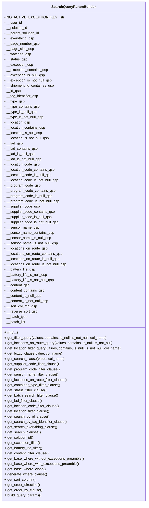

# Diagram: container_tracking_core/container_tracking_service/container_tracking_service/api/search/SearchQueryParamBuilder.py

> Auto-generated by Obscura crawlers

## Mermaid

### SVG

<svg id="container" width="678.7890625" xmlns="http://www.w3.org/2000/svg" class="classDiagram" height="2296" viewBox="0 0 678.7890625 2296" role="graphics-document document" aria-roledescription="class"><g><defs><marker id="container_class-aggregationStart" class="marker aggregation class" refX="18" refY="7" markerWidth="190" markerHeight="240" orient="auto"><path d="M 18,7 L9,13 L1,7 L9,1 Z"></path></marker></defs><defs><marker id="container_class-aggregationEnd" class="marker aggregation class" refX="1" refY="7" markerWidth="20" markerHeight="28" orient="auto"><path d="M 18,7 L9,13 L1,7 L9,1 Z"></path></marker></defs><defs><marker id="container_class-extensionStart" class="marker extension class" refX="18" refY="7" markerWidth="190" markerHeight="240" orient="auto"><path d="M 1,7 L18,13 V 1 Z"></path></marker></defs><defs><marker id="container_class-extensionEnd" class="marker extension class" refX="1" refY="7" markerWidth="20" markerHeight="28" orient="auto"><path d="M 1,1 V 13 L18,7 Z"></path></marker></defs><defs><marker id="container_class-compositionStart" class="marker composition class" refX="18" refY="7" markerWidth="190" markerHeight="240" orient="auto"><path d="M 18,7 L9,13 L1,7 L9,1 Z"></path></marker></defs><defs><marker id="container_class-compositionEnd" class="marker composition class" refX="1" refY="7" markerWidth="20" markerHeight="28" orient="auto"><path d="M 18,7 L9,13 L1,7 L9,1 Z"></path></marker></defs><defs><marker id="container_class-dependencyStart" class="marker dependency class" refX="6" refY="7" markerWidth="190" markerHeight="240" orient="auto"><path d="M 5,7 L9,13 L1,7 L9,1 Z"></path></marker></defs><defs><marker id="container_class-dependencyEnd" class="marker dependency class" refX="13" refY="7" markerWidth="20" markerHeight="28" orient="auto"><path d="M 18,7 L9,13 L14,7 L9,1 Z"></path></marker></defs><defs><marker id="container_class-lollipopStart" class="marker lollipop class" refX="13" refY="7" markerWidth="190" markerHeight="240" orient="auto"><circle stroke="black" fill="transparent" cx="7" cy="7" r="6"></circle></marker></defs><defs><marker id="container_class-lollipopEnd" class="marker lollipop class" refX="1" refY="7" markerWidth="190" markerHeight="240" orient="auto"><circle stroke="black" fill="transparent" cx="7" cy="7" r="6"></circle></marker></defs><g class="root"><g class="clusters"></g><g class="edgePaths"></g><g class="edgeLabels"></g><g class="nodes"><g class="node default" id="classId-SearchQueryParamBuilder-0" transform="translate(339.39453125, 1148)"><g class="basic label-container"><path d="M-331.39453125 -1140 L331.39453125 -1140 L331.39453125 1140 L-331.39453125 1140" stroke="none" stroke-width="0" fill="#ECECFF" style=""></path><path d="M-331.39453125 -1140 C-163.9836133776916 -1140, 3.4273044946168056 -1140, 331.39453125 -1140 M-331.39453125 -1140 C-175.70745121309727 -1140, -20.020371176194544 -1140, 331.39453125 -1140 M331.39453125 -1140 C331.39453125 -606.4314920665176, 331.39453125 -72.8629841330353, 331.39453125 1140 M331.39453125 -1140 C331.39453125 -452.91614273745904, 331.39453125 234.16771452508192, 331.39453125 1140 M331.39453125 1140 C71.44182118673785 1140, -188.5108888765243 1140, -331.39453125 1140 M331.39453125 1140 C67.0985659295223 1140, -197.1973993909554 1140, -331.39453125 1140 M-331.39453125 1140 C-331.39453125 316.3276616774283, -331.39453125 -507.3446766451434, -331.39453125 -1140 M-331.39453125 1140 C-331.39453125 263.97281266628374, -331.39453125 -612.0543746674325, -331.39453125 -1140" stroke="#9370DB" stroke-width="1.3" fill="none" stroke-dasharray="0 0" style=""></path></g><g class="annotation-group text" transform="translate(0, -1116)"></g><g class="label-group text" transform="translate(-95.9453125, -1116)"><g class="label" style="font-weight: bolder" transform="translate(0,-12)"><foreignObject width="191.890625" height="24">

SearchQueryParamBuilder

</foreignObject></g></g><g class="members-group text" transform="translate(-319.39453125, -1068)"><g class="label" style="" transform="translate(0,-12)"><foreignObject width="242.109375" height="24">

- NO_ACTIVE_EXCEPTION_KEY : str

</foreignObject></g><g class="label" style="" transform="translate(0,12)"><foreignObject width="79.65625" height="24">

- __user_id

</foreignObject></g><g class="label" style="" transform="translate(0,36)"><foreignObject width="109.40625" height="24">

- __solution_id

</foreignObject></g><g class="label" style="" transform="translate(0,60)"><foreignObject width="165.34375" height="24">

- __parent_solution_id

</foreignObject></g><g class="label" style="" transform="translate(0,84)"><foreignObject width="138.0625" height="24">

- __everything_qsp

</foreignObject></g><g class="label" style="" transform="translate(0,108)"><foreignObject width="159.90625" height="24">

- __page_number_qsp

</foreignObject></g><g class="label" style="" transform="translate(0,132)"><foreignObject width="131.65625" height="24">

- __page_size_qsp

</foreignObject></g><g class="label" style="" transform="translate(0,156)"><foreignObject width="122.234375" height="24">

- __watched_qsp

</foreignObject></g><g class="label" style="" transform="translate(0,180)"><foreignObject width="105.796875" height="24">

- __status_qsp

</foreignObject></g><g class="label" style="" transform="translate(0,204)"><foreignObject width="132.15625" height="24">

- __exception_qsp

</foreignObject></g><g class="label" style="" transform="translate(0,228)"><foreignObject width="201.609375" height="24">

- __exception_contains_qsp

</foreignObject></g><g class="label" style="" transform="translate(0,252)"><foreignObject width="188.515625" height="24">

- __exception_is_null_qsp

</foreignObject></g><g class="label" style="" transform="translate(0,276)"><foreignObject width="221.34375" height="24">

- __exception_is_not_null_qsp

</foreignObject></g><g class="label" style="" transform="translate(0,300)"><foreignObject width="230.75" height="24">

- __shipment_id_containes_qsp

</foreignObject></g><g class="label" style="" transform="translate(0,324)"><foreignObject width="75.796875" height="24">

- __id_qsp

</foreignObject></g><g class="label" style="" transform="translate(0,348)"><foreignObject width="157.59375" height="24">

- __tag_identifier_qsp

</foreignObject></g><g class="label" style="" transform="translate(0,372)"><foreignObject width="92.875" height="24">

- __type_qsp

</foreignObject></g><g class="label" style="" transform="translate(0,396)"><foreignObject width="162.328125" height="24">

- __type_contains_qsp

</foreignObject></g><g class="label" style="" transform="translate(0,420)"><foreignObject width="149.234375" height="24">

- __type_is_null_qsp

</foreignObject></g><g class="label" style="" transform="translate(0,444)"><foreignObject width="182.0625" height="24">

- __type_is_not_null_qsp

</foreignObject></g><g class="label" style="" transform="translate(0,468)"><foreignObject width="120.71875" height="24">

- __location_qsp

</foreignObject></g><g class="label" style="" transform="translate(0,492)"><foreignObject width="190.171875" height="24">

- __location_contains_qsp

</foreignObject></g><g class="label" style="" transform="translate(0,516)"><foreignObject width="177.078125" height="24">

- __location_is_null_qsp

</foreignObject></g><g class="label" style="" transform="translate(0,540)"><foreignObject width="209.890625" height="24">

- __location_is_not_null_qsp

</foreignObject></g><g class="label" style="" transform="translate(0,564)"><foreignObject width="84.4375" height="24">

- __lad_qsp

</foreignObject></g><g class="label" style="" transform="translate(0,588)"><foreignObject width="153.890625" height="24">

- __lad_contains_qsp

</foreignObject></g><g class="label" style="" transform="translate(0,612)"><foreignObject width="140.8125" height="24">

- __lad_is_null_qsp

</foreignObject></g><g class="label" style="" transform="translate(0,636)"><foreignObject width="173.625" height="24">

- __lad_is_not_null_qsp

</foreignObject></g><g class="label" style="" transform="translate(0,660)"><foreignObject width="163.359375" height="24">

- __location_code_qsp

</foreignObject></g><g class="label" style="" transform="translate(0,684)"><foreignObject width="232.8125" height="24">

- __location_code_contains_qsp

</foreignObject></g><g class="label" style="" transform="translate(0,708)"><foreignObject width="219.71875" height="24">

- __location_code_is_null_qsp

</foreignObject></g><g class="label" style="" transform="translate(0,732)"><foreignObject width="252.53125" height="24">

- __location_code_is_not_null_qsp

</foreignObject></g><g class="label" style="" transform="translate(0,756)"><foreignObject width="165.25" height="24">

- __program_code_qsp

</foreignObject></g><g class="label" style="" transform="translate(0,780)"><foreignObject width="234.71875" height="24">

- __program_code_contains_qsp

</foreignObject></g><g class="label" style="" transform="translate(0,804)"><foreignObject width="221.625" height="24">

- __program_code_is_null_qsp

</foreignObject></g><g class="label" style="" transform="translate(0,828)"><foreignObject width="254.4375" height="24">

- __program_code_is_not_null_qsp

</foreignObject></g><g class="label" style="" transform="translate(0,852)"><foreignObject width="162.96875" height="24">

- __supplier_code_qsp

</foreignObject></g><g class="label" style="" transform="translate(0,876)"><foreignObject width="232.421875" height="24">

- __supplier_code_contains_qsp

</foreignObject></g><g class="label" style="" transform="translate(0,900)"><foreignObject width="219.34375" height="24">

- __supplier_code_is_null_qsp

</foreignObject></g><g class="label" style="" transform="translate(0,924)"><foreignObject width="252.15625" height="24">

- __supplier_code_is_not_null_qsp

</foreignObject></g><g class="label" style="" transform="translate(0,948)"><foreignObject width="157.515625" height="24">

- __sensor_name_qsp

</foreignObject></g><g class="label" style="" transform="translate(0,972)"><foreignObject width="226.96875" height="24">

- __sensor_name_contains_qsp

</foreignObject></g><g class="label" style="" transform="translate(0,996)"><foreignObject width="213.875" height="24">

- __sensor_name_is_null_qsp

</foreignObject></g><g class="label" style="" transform="translate(0,1020)"><foreignObject width="246.703125" height="24">

- __sensor_name_is_not_null_qsp

</foreignObject></g><g class="label" style="" transform="translate(0,1044)"><foreignObject width="201.1875" height="24">

- __locations_on_route_qsp

</foreignObject></g><g class="label" style="" transform="translate(0,1068)"><foreignObject width="270.640625" height="24">

- __locations_on_route_contains_qsp

</foreignObject></g><g class="label" style="" transform="translate(0,1092)"><foreignObject width="257.5625" height="24">

- __locations_on_route_is_null_qsp

</foreignObject></g><g class="label" style="" transform="translate(0,1116)"><foreignObject width="290.375" height="24">

- __locations_on_route_is_not_null_qsp

</foreignObject></g><g class="label" style="" transform="translate(0,1140)"><foreignObject width="144.328125" height="24">

- __battery_life_qsp

</foreignObject></g><g class="label" style="" transform="translate(0,1164)"><foreignObject width="200.703125" height="24">

- __battery_life_is_null_qsp

</foreignObject></g><g class="label" style="" transform="translate(0,1188)"><foreignObject width="233.515625" height="24">

- __battery_life_is_not_null_qsp

</foreignObject></g><g class="label" style="" transform="translate(0,1212)"><foreignObject width="116.859375" height="24">

- __content_qsp

</foreignObject></g><g class="label" style="" transform="translate(0,1236)"><foreignObject width="186.3125" height="24">

- __content_contains_qsp

</foreignObject></g><g class="label" style="" transform="translate(0,1260)"><foreignObject width="173.21875" height="24">

- __content_is_null_qsp

</foreignObject></g><g class="label" style="" transform="translate(0,1284)"><foreignObject width="206.046875" height="24">

- __content_is_not_null_qsp

</foreignObject></g><g class="label" style="" transform="translate(0,1308)"><foreignObject width="152.25" height="24">

- __sort_column_qsp

</foreignObject></g><g class="label" style="" transform="translate(0,1332)"><foreignObject width="151.5" height="24">

- __reverse_sort_qsp

</foreignObject></g><g class="label" style="" transform="translate(0,1356)"><foreignObject width="107.578125" height="24">

- __batch_type

</foreignObject></g><g class="label" style="" transform="translate(0,1380)"><foreignObject width="98.390625" height="24">

- __batch_list

</foreignObject></g></g><g class="methods-group text" transform="translate(-319.39453125, 372)"><g class="label" style="" transform="translate(0,-12)"><foreignObject width="58.5625" height="24">

+ <strong>init</strong>(...)

</foreignObject></g><g class="label" style="" transform="translate(0,12)"><foreignObject width="475.53125" height="24">

+ get_filter_query(values, contains, is_null, is_not_null, col_name)

</foreignObject></g><g class="label" style="" transform="translate(0,36)"><foreignObject width="503.9375" height="24">

+ get_locations_on_route_query(values, contains, is_null, is_not_null)

</foreignObject></g><g class="label" style="" transform="translate(0,60)"><foreignObject width="542.84375" height="24">

+ get_location_filter_query(values, contains, is_null, is_not_null, col_name)

</foreignObject></g><g class="label" style="" transform="translate(0,84)"><foreignObject width="260.671875" height="24">

+ get_fuzzy_clause(value, col_name)

</foreignObject></g><g class="label" style="" transform="translate(0,108)"><foreignObject width="272.390625" height="24">

+ get_search_clause(value, col_name)

</foreignObject></g><g class="label" style="" transform="translate(0,132)"><foreignObject width="250.234375" height="24">

+ get_supplier_code_filter_clause()

</foreignObject></g><g class="label" style="" transform="translate(0,156)"><foreignObject width="252.515625" height="24">

+ get_program_code_filter_clause()

</foreignObject></g><g class="label" style="" transform="translate(0,180)"><foreignObject width="244.78125" height="24">

+ get_sensor_name_filter_clause()

</foreignObject></g><g class="label" style="" transform="translate(0,204)"><foreignObject width="288.453125" height="24">

+ get_locations_on_route_filter_clause()

</foreignObject></g><g class="label" style="" transform="translate(0,228)"><foreignObject width="256.0625" height="24">

+ get_container_type_filter_clause()

</foreignObject></g><g class="label" style="" transform="translate(0,252)"><foreignObject width="193.0625" height="24">

+ get_status_filter_clause()

</foreignObject></g><g class="label" style="" transform="translate(0,276)"><foreignObject width="245.375" height="24">

+ get_batch_search_filter_clause()

</foreignObject></g><g class="label" style="" transform="translate(0,300)"><foreignObject width="171.703125" height="24">

+ get_lad_filter_clause()

</foreignObject></g><g class="label" style="" transform="translate(0,324)"><foreignObject width="250.609375" height="24">

+ get_location_code_filter_clause()

</foreignObject></g><g class="label" style="" transform="translate(0,348)"><foreignObject width="207.96875" height="24">

+ get_location_filter_clause()

</foreignObject></g><g class="label" style="" transform="translate(0,372)"><foreignObject width="202.953125" height="24">

+ get_search_by_id_clause()

</foreignObject></g><g class="label" style="" transform="translate(0,396)"><foreignObject width="284.75" height="24">

+ get_search_by_tag_identifier_clause()

</foreignObject></g><g class="label" style="" transform="translate(0,420)"><foreignObject width="240.0625" height="24">

+ get_search_everything_clause()

</foreignObject></g><g class="label" style="" transform="translate(0,444)"><foreignObject width="162.875" height="24">

+ get_search_clauses()

</foreignObject></g><g class="label" style="" transform="translate(0,468)"><foreignObject width="135.703125" height="24">

+ get_solution_id()

</foreignObject></g><g class="label" style="" transform="translate(0,492)"><foreignObject width="166.234375" height="24">

+ get_exception_filter()

</foreignObject></g><g class="label" style="" transform="translate(0,516)"><foreignObject width="178.40625" height="24">

+ get_battery_life_filter()

</foreignObject></g><g class="label" style="" transform="translate(0,540)"><foreignObject width="204.125" height="24">

+ get_content_filter_clause()

</foreignObject></g><g class="label" style="" transform="translate(0,564)"><foreignObject width="365.703125" height="24">

+ get_base_where_without_exceptions_preamble()

</foreignObject></g><g class="label" style="" transform="translate(0,588)"><foreignObject width="341.265625" height="24">

+ get_base_where_with_exceptions_preamble()

</foreignObject></g><g class="label" style="" transform="translate(0,612)"><foreignObject width="184.703125" height="24">

+ get_base_where_close()

</foreignObject></g><g class="label" style="" transform="translate(0,636)"><foreignObject width="191.859375" height="24">

+ generate_where_clause()

</foreignObject></g><g class="label" style="" transform="translate(0,660)"><foreignObject width="144.015625" height="24">

+ get_sort_column()

</foreignObject></g><g class="label" style="" transform="translate(0,684)"><foreignObject width="164.53125" height="24">

+ get_order_direction()

</foreignObject></g><g class="label" style="" transform="translate(0,708)"><foreignObject width="171" height="24">

+ get_order_by_clause()

</foreignObject></g><g class="label" style="" transform="translate(0,732)"><foreignObject width="171.140625" height="24">

+ build_query_params()

</foreignObject></g></g><g class="divider" style=""><path d="M-331.39453125 -1092 C-131.41153739485074 -1092, 68.57145646029852 -1092, 331.39453125 -1092 M-331.39453125 -1092 C-189.32320120436955 -1092, -47.25187115873911 -1092, 331.39453125 -1092" stroke="#9370DB" stroke-width="1.3" fill="none" stroke-dasharray="0 0" style=""></path></g><g class="divider" style=""><path d="M-331.39453125 348 C-105.57729998175415 348, 120.2399312864917 348, 331.39453125 348 M-331.39453125 348 C-191.98871036287642 348, -52.582889475752836 348, 331.39453125 348" stroke="#9370DB" stroke-width="1.3" fill="none" stroke-dasharray="0 0" style=""></path></g></g></g></g></g></svg>
