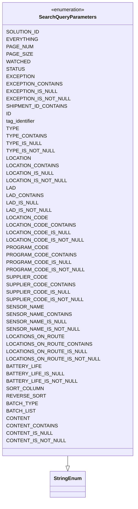

# Diagram: container_tracking_core/container_tracking_service/container_tracking_service/api/search/SearchQueryParameters.py

> Auto-generated by Obscura crawlers

## Diagram 1

> SVG rendering failed for this diagram.

## Diagram 2

```mermaid
graph LR
  SearchQueryParameters --> SOLUTION_ID["solution_id"]
  SearchQueryParameters --> EVERYTHING["everything"]
  SearchQueryParameters --> PAGE_NUM["pageNumber"]
  SearchQueryParameters --> PAGE_SIZE["pageSize"]
  SearchQueryParameters --> WATCHED["watched"]
  SearchQueryParameters --> STATUS["status"]
  SearchQueryParameters --> EXCEPTION["activeExceptions"]
  SearchQueryParameters --> EXCEPTION_CONTAINS["activeExceptions:contains"]
  SearchQueryParameters --> EXCEPTION_IS_NULL["activeExceptions:isNull"]
  SearchQueryParameters --> EXCEPTION_IS_NOT_NULL["activeExceptions:isNotNull"]
  SearchQueryParameters --> SHIPMENT_ID_CONTAINS["shipmentId:contains"]
  SearchQueryParameters --> ID["id"]
  SearchQueryParameters --> tag_identifier["tag-id"]
  SearchQueryParameters --> TYPE["type"]
  SearchQueryParameters --> TYPE_CONTAINS["type:contains"]
  SearchQueryParameters --> TYPE_IS_NULL["type:isNull"]
  SearchQueryParameters --> TYPE_IS_NOT_NULL["type:isNotNull"]
  SearchQueryParameters --> LOCATION["locations"]
  SearchQueryParameters --> LOCATION_CONTAINS["locations:contains"]
  SearchQueryParameters --> LOCATION_IS_NULL["locations:isNull"]
  SearchQueryParameters --> LOCATION_IS_NOT_NULL["locations:isNotNull"]
  SearchQueryParameters --> LAD["lad"]
  SearchQueryParameters --> LAD_CONTAINS["lad:contains"]
  SearchQueryParameters --> LAD_IS_NULL["lad:isNull"]
  SearchQueryParameters --> LAD_IS_NOT_NULL["lad:isNotNull"]
  SearchQueryParameters --> LOCATION_CODE["locationCode"]
  SearchQueryParameters --> LOCATION_CODE_CONTAINS["locationCode:contains"]
  SearchQueryParameters --> LOCATION_CODE_IS_NULL["locationCode:isNull"]
  SearchQueryParameters --> LOCATION_CODE_IS_NOT_NULL["locationCode:isNotNull"]
  SearchQueryParameters --> PROGRAM_CODE["programCode"]
  SearchQueryParameters --> PROGRAM_CODE_CONTAINS["programCode:contains"]
  SearchQueryParameters --> PROGRAM_CODE_IS_NULL["programCode:isNull"]
  SearchQueryParameters --> PROGRAM_CODE_IS_NOT_NULL["programCode:isNotNull"]
  SearchQueryParameters --> SUPPLIER_CODE["supplierCode"]
  SearchQueryParameters --> SUPPLIER_CODE_CONTAINS["supplierCode:contains"]
  SearchQueryParameters --> SUPPLIER_CODE_IS_NULL["supplierCode:isNull"]
  SearchQueryParameters --> SUPPLIER_CODE_IS_NOT_NULL["supplierCode:isNotNull"]
  SearchQueryParameters --> SENSOR_NAME["sensor"]
  SearchQueryParameters --> SENSOR_NAME_CONTAINS["sensor:contains"]
  SearchQueryParameters --> SENSOR_NAME_IS_NULL["sensor:isNull"]
  SearchQueryParameters --> SENSOR_NAME_IS_NOT_NULL["sensor:isNotNull"]
  SearchQueryParameters --> LOCATIONS_ON_ROUTE["locationsOnRoute"]
  SearchQueryParameters --> LOCATIONS_ON_ROUTE_CONTAINS["locationsOnRoute:contains"]
  SearchQueryParameters --> LOCATIONS_ON_ROUTE_IS_NULL["locationsOnRoute:isNull"]
  SearchQueryParameters --> LOCATIONS_ON_ROUTE_IS_NOT_NULL["locationsOnRoute:isNotNull"]
  SearchQueryParameters --> BATTERY_LIFE["batteryLife"]
  SearchQueryParameters --> BATTERY_LIFE_IS_NULL["batteryLife:isNull"]
  SearchQueryParameters --> BATTERY_LIFE_IS_NOT_NULL["batteryLife:isNotNull"]
  SearchQueryParameters --> SORT_COLUMN["sortColumn"]
  SearchQueryParameters --> REVERSE_SORT["reverseSort"]
  SearchQueryParameters --> BATCH_TYPE["batchType"]
  SearchQueryParameters --> BATCH_LIST["batch_list"]
  SearchQueryParameters --> CONTENT["contents"]
  SearchQueryParameters --> CONTENT_CONTAINS["contents:contains"]
  SearchQueryParameters --> CONTENT_IS_NULL["contents:isNull"]
  SearchQueryParameters --> CONTENT_IS_NOT_NULL["contents:isNotNull"]
```

### SVG

<svg id="container" width="560.3125" xmlns="http://www.w3.org/2000/svg" class="flowchart" height="5790" viewBox="0 0 560.3125 5790" role="graphics-document document" aria-roledescription="flowchart-v2"><g><marker id="container_flowchart-v2-pointEnd" class="marker flowchart-v2" viewBox="0 0 10 10" refX="5" refY="5" markerUnits="userSpaceOnUse" markerWidth="8" markerHeight="8" orient="auto"><path d="M 0 0 L 10 5 L 0 10 z" class="arrowMarkerPath" style="stroke-width: 1; stroke-dasharray: 1, 0;"></path></marker><marker id="container_flowchart-v2-pointStart" class="marker flowchart-v2" viewBox="0 0 10 10" refX="4.5" refY="5" markerUnits="userSpaceOnUse" markerWidth="8" markerHeight="8" orient="auto"><path d="M 0 5 L 10 10 L 10 0 z" class="arrowMarkerPath" style="stroke-width: 1; stroke-dasharray: 1, 0;"></path></marker><marker id="container_flowchart-v2-circleEnd" class="marker flowchart-v2" viewBox="0 0 10 10" refX="11" refY="5" markerUnits="userSpaceOnUse" markerWidth="11" markerHeight="11" orient="auto"><circle cx="5" cy="5" r="5" class="arrowMarkerPath" style="stroke-width: 1; stroke-dasharray: 1, 0;"></circle></marker><marker id="container_flowchart-v2-circleStart" class="marker flowchart-v2" viewBox="0 0 10 10" refX="-1" refY="5" markerUnits="userSpaceOnUse" markerWidth="11" markerHeight="11" orient="auto"><circle cx="5" cy="5" r="5" class="arrowMarkerPath" style="stroke-width: 1; stroke-dasharray: 1, 0;"></circle></marker><marker id="container_flowchart-v2-crossEnd" class="marker cross flowchart-v2" viewBox="0 0 11 11" refX="12" refY="5.2" markerUnits="userSpaceOnUse" markerWidth="11" markerHeight="11" orient="auto"><path d="M 1,1 l 9,9 M 10,1 l -9,9" class="arrowMarkerPath" style="stroke-width: 2; stroke-dasharray: 1, 0;"></path></marker><marker id="container_flowchart-v2-crossStart" class="marker cross flowchart-v2" viewBox="0 0 11 11" refX="-1" refY="5.2" markerUnits="userSpaceOnUse" markerWidth="11" markerHeight="11" orient="auto"><path d="M 1,1 l 9,9 M 10,1 l -9,9" class="arrowMarkerPath" style="stroke-width: 2; stroke-dasharray: 1, 0;"></path></marker><g class="root"><g class="clusters"></g><g class="edgePaths"><path d="M126.033,2868L149.426,2395.833C172.819,1923.667,219.605,979.333,256.388,507.167C293.172,35,319.953,35,333.344,35L346.734,35" id="L_SearchQueryParameters_SOLUTION_ID_0" class="edge-thickness-normal edge-pattern-solid edge-thickness-normal edge-pattern-solid flowchart-link" style=";" data-edge="true" data-et="edge" data-id="L_SearchQueryParameters_SOLUTION_ID_0" data-points="W3sieCI6MTI2LjAzMjk5NTUyMDEwNDg5LCJ5IjoyODY4fSx7IngiOjI2Ni4zOTA2MjUsInkiOjM1fSx7IngiOjM1MC43MzQzNzUsInkiOjM1fV0=" marker-end="url(#container_flowchart-v2-pointEnd)"></path><path d="M126.083,2868L149.468,2413.167C172.853,1958.333,219.622,1048.667,256.867,593.833C294.112,139,321.833,139,335.694,139L349.555,139" id="L_SearchQueryParameters_EVERYTHING_0" class="edge-thickness-normal edge-pattern-solid edge-thickness-normal edge-pattern-solid flowchart-link" style=";" data-edge="true" data-et="edge" data-id="L_SearchQueryParameters_EVERYTHING_0" data-points="W3sieCI6MTI2LjA4MzQ3NDEyNDYzNzE1LCJ5IjoyODY4fSx7IngiOjI2Ni4zOTA2MjUsInkiOjEzOX0seyJ4IjozNTMuNTU0Njg3NSwieSI6MTM5fV0=" marker-end="url(#container_flowchart-v2-pointEnd)"></path><path d="M126.138,2868L149.513,2430.5C172.889,1993,219.64,1118,255.506,680.5C291.372,243,316.354,243,328.845,243L341.336,243" id="L_SearchQueryParameters_PAGE_NUM_0" class="edge-thickness-normal edge-pattern-solid edge-thickness-normal edge-pattern-solid flowchart-link" style=";" data-edge="true" data-et="edge" data-id="L_SearchQueryParameters_PAGE_NUM_0" data-points="W3sieCI6MTI2LjEzNzkxMTgzNTQwNzI0LCJ5IjoyODY4fSx7IngiOjI2Ni4zOTA2MjUsInkiOjI0M30seyJ4IjozNDUuMzM1OTM3NSwieSI6MjQzfV0=" marker-end="url(#container_flowchart-v2-pointEnd)"></path><path d="M126.197,2868L149.562,2447.833C172.928,2027.667,219.659,1187.333,257.976,767.167C296.292,347,326.193,347,341.143,347L356.094,347" id="L_SearchQueryParameters_PAGE_SIZE_0" class="edge-thickness-normal edge-pattern-solid edge-thickness-normal edge-pattern-solid flowchart-link" style=";" data-edge="true" data-et="edge" data-id="L_SearchQueryParameters_PAGE_SIZE_0" data-points="W3sieCI6MTI2LjE5Njc5MzQ0MDkzNDA3LCJ5IjoyODY4fSx7IngiOjI2Ni4zOTA2MjUsInkiOjM0N30seyJ4IjozNjAuMDkzNzUsInkiOjM0N31d" marker-end="url(#container_flowchart-v2-pointEnd)"></path><path d="M126.261,2868L149.616,2465.167C172.971,2062.333,219.681,1256.667,258.209,853.833C296.737,451,327.083,451,342.257,451L357.43,451" id="L_SearchQueryParameters_WATCHED_0" class="edge-thickness-normal edge-pattern-solid edge-thickness-normal edge-pattern-solid flowchart-link" style=";" data-edge="true" data-et="edge" data-id="L_SearchQueryParameters_WATCHED_0" data-points="W3sieCI6MTI2LjI2MDY4NjI0NjkzMTI2LCJ5IjoyODY4fSx7IngiOjI2Ni4zOTA2MjUsInkiOjQ1MX0seyJ4IjozNjEuNDI5Njg3NSwieSI6NDUxfV0=" marker-end="url(#container_flowchart-v2-pointEnd)"></path><path d="M126.33,2868L149.674,2482.5C173.017,2097,219.704,1326,259.59,940.5C299.477,555,332.563,555,349.105,555L365.648,555" id="L_SearchQueryParameters_STATUS_0" class="edge-thickness-normal edge-pattern-solid edge-thickness-normal edge-pattern-solid flowchart-link" style=";" data-edge="true" data-et="edge" data-id="L_SearchQueryParameters_STATUS_0" data-points="W3sieCI6MTI2LjMzMDI1ODQxMzQ2MTU0LCJ5IjoyODY4fSx7IngiOjI2Ni4zOTA2MjUsInkiOjU1NX0seyJ4IjozNjkuNjQ4NDM3NSwieSI6NTU1fV0=" marker-end="url(#container_flowchart-v2-pointEnd)"></path><path d="M126.406,2868L149.737,2499.833C173.068,2131.667,219.729,1395.333,253.188,1027.167C286.646,659,306.901,659,317.029,659L327.156,659" id="L_SearchQueryParameters_EXCEPTION_0" class="edge-thickness-normal edge-pattern-solid edge-thickness-normal edge-pattern-solid flowchart-link" style=";" data-edge="true" data-et="edge" data-id="L_SearchQueryParameters_EXCEPTION_0" data-points="W3sieCI6MTI2LjQwNjMwMjQwOTQzNjQ5LCJ5IjoyODY4fSx7IngiOjI2Ni4zOTA2MjUsInkiOjY1OX0seyJ4IjozMzEuMTU2MjUsInkiOjY1OX1d" marker-end="url(#container_flowchart-v2-pointEnd)"></path><path d="M126.49,2868L149.807,2517.167C173.123,2166.333,219.757,1464.667,247.734,1113.833C275.711,763,285.031,763,289.691,763L294.352,763" id="L_SearchQueryParameters_EXCEPTION_CONTAINS_0" class="edge-thickness-normal edge-pattern-solid edge-thickness-normal edge-pattern-solid flowchart-link" style=";" data-edge="true" data-et="edge" data-id="L_SearchQueryParameters_EXCEPTION_CONTAINS_0" data-points="W3sieCI6MTI2LjQ4OTc2NTMzMTg0ODAzLCJ5IjoyODY4fSx7IngiOjI2Ni4zOTA2MjUsInkiOjc2M30seyJ4IjoyOTguMzUxNTYyNSwieSI6NzYzfV0=" marker-end="url(#container_flowchart-v2-pointEnd)"></path><path d="M126.582,2868L149.883,2534.5C173.185,2201,219.788,1534,249.43,1200.5C279.073,867,291.755,867,298.096,867L304.438,867" id="L_SearchQueryParameters_EXCEPTION_IS_NULL_0" class="edge-thickness-normal edge-pattern-solid edge-thickness-normal edge-pattern-solid flowchart-link" style=";" data-edge="true" data-et="edge" data-id="L_SearchQueryParameters_EXCEPTION_IS_NULL_0" data-points="W3sieCI6MTI2LjU4MTc4ODU1Mzk5NDA5LCJ5IjoyODY4fSx7IngiOjI2Ni4zOTA2MjUsInkiOjg2N30seyJ4IjozMDguNDM3NSwieSI6ODY3fV0=" marker-end="url(#container_flowchart-v2-pointEnd)"></path><path d="M126.684,2868L149.968,2551.833C173.253,2235.667,219.822,1603.333,247.277,1287.167C274.732,971,283.073,971,287.243,971L291.414,971" id="L_SearchQueryParameters_EXCEPTION_IS_NOT_NULL_0" class="edge-thickness-normal edge-pattern-solid edge-thickness-normal edge-pattern-solid flowchart-link" style=";" data-edge="true" data-et="edge" data-id="L_SearchQueryParameters_EXCEPTION_IS_NOT_NULL_0" data-points="W3sieCI6MTI2LjY4Mzc2MDIzMjU4ODM2LCJ5IjoyODY4fSx7IngiOjI2Ni4zOTA2MjUsInkiOjk3MX0seyJ4IjoyOTUuNDE0MDYyNSwieSI6OTcxfV0=" marker-end="url(#container_flowchart-v2-pointEnd)"></path><path d="M126.797,2868L150.063,2569.167C173.328,2270.333,219.86,1672.667,251.005,1373.833C282.151,1075,297.911,1075,305.792,1075L313.672,1075" id="L_SearchQueryParameters_SHIPMENT_ID_CONTAINS_0" class="edge-thickness-normal edge-pattern-solid edge-thickness-normal edge-pattern-solid flowchart-link" style=";" data-edge="true" data-et="edge" data-id="L_SearchQueryParameters_SHIPMENT_ID_CONTAINS_0" data-points="W3sieCI6MTI2Ljc5NzM4NTgxNzMwNzcsInkiOjI4Njh9LHsieCI6MjY2LjM5MDYyNSwieSI6MTA3NX0seyJ4IjozMTcuNjcxODc1LCJ5IjoxMDc1fV0=" marker-end="url(#container_flowchart-v2-pointEnd)"></path><path d="M126.925,2868L150.169,2586.5C173.413,2305,219.902,1742,262.215,1460.5C304.529,1179,342.667,1179,361.736,1179L380.805,1179" id="L_SearchQueryParameters_ID_0" class="edge-thickness-normal edge-pattern-solid edge-thickness-normal edge-pattern-solid flowchart-link" style=";" data-edge="true" data-et="edge" data-id="L_SearchQueryParameters_ID_0" data-points="W3sieCI6MTI2LjkyNDc4NDIwMDE3NDgzLCJ5IjoyODY4fSx7IngiOjI2Ni4zOTA2MjUsInkiOjExNzl9LHsieCI6Mzg0LjgwNDY4NzUsInkiOjExNzl9XQ==" marker-end="url(#container_flowchart-v2-pointEnd)"></path><path d="M127.069,2868L150.289,2603.833C173.509,2339.667,219.95,1811.333,259.838,1547.167C299.727,1283,333.063,1283,349.73,1283L366.398,1283" id="L_SearchQueryParameters_tag_identifier_0" class="edge-thickness-normal edge-pattern-solid edge-thickness-normal edge-pattern-solid flowchart-link" style=";" data-edge="true" data-et="edge" data-id="L_SearchQueryParameters_tag_identifier_0" data-points="W3sieCI6MTI3LjA2ODYyMTA4NDA1NzA3LCJ5IjoyODY4fSx7IngiOjI2Ni4zOTA2MjUsInkiOjEyODN9LHsieCI6MzcwLjM5ODQzNzUsInkiOjEyODN9XQ==" marker-end="url(#container_flowchart-v2-pointEnd)"></path><path d="M127.232,2868L150.425,2621.167C173.618,2374.333,220.005,1880.667,260.791,1633.833C301.578,1387,336.766,1387,354.359,1387L371.953,1387" id="L_SearchQueryParameters_TYPE_0" class="edge-thickness-normal edge-pattern-solid edge-thickness-normal edge-pattern-solid flowchart-link" style=";" data-edge="true" data-et="edge" data-id="L_SearchQueryParameters_TYPE_0" data-points="W3sieCI6MTI3LjIzMjI5NzUzODEyOTk3LCJ5IjoyODY4fSx7IngiOjI2Ni4zOTA2MjUsInkiOjEzODd9LHsieCI6Mzc1Ljk1MzEyNSwieSI6MTM4N31d" marker-end="url(#container_flowchart-v2-pointEnd)"></path><path d="M127.42,2868L150.582,2638.5C173.744,2409,220.067,1950,255.354,1720.5C290.641,1491,314.891,1491,327.016,1491L339.141,1491" id="L_SearchQueryParameters_TYPE_CONTAINS_0" class="edge-thickness-normal edge-pattern-solid edge-thickness-normal edge-pattern-solid flowchart-link" style=";" data-edge="true" data-et="edge" data-id="L_SearchQueryParameters_TYPE_CONTAINS_0" data-points="W3sieCI6MTI3LjQyMDIyMjM1NTc2OTIzLCJ5IjoyODY4fSx7IngiOjI2Ni4zOTA2MjUsInkiOjE0OTF9LHsieCI6MzQzLjE0MDYyNSwieSI6MTQ5MX1d" marker-end="url(#container_flowchart-v2-pointEnd)"></path><path d="M127.638,2868L150.764,2655.833C173.889,2443.667,220.14,2019.333,257.073,1807.167C294.005,1595,321.62,1595,335.427,1595L349.234,1595" id="L_SearchQueryParameters_TYPE_IS_NULL_0" class="edge-thickness-normal edge-pattern-solid edge-thickness-normal edge-pattern-solid flowchart-link" style=";" data-edge="true" data-et="edge" data-id="L_SearchQueryParameters_TYPE_IS_NULL_0" data-points="W3sieCI6MTI3LjYzODIxNTE0NDIzMDc3LCJ5IjoyODY4fSx7IngiOjI2Ni4zOTA2MjUsInkiOjE1OTV9LHsieCI6MzUzLjIzNDM3NSwieSI6MTU5NX1d" marker-end="url(#container_flowchart-v2-pointEnd)"></path><path d="M127.894,2868L150.977,2673.167C174.06,2478.333,220.225,2088.667,254.945,1893.833C289.664,1699,312.938,1699,324.574,1699L336.211,1699" id="L_SearchQueryParameters_TYPE_IS_NOT_NULL_0" class="edge-thickness-normal edge-pattern-solid edge-thickness-normal edge-pattern-solid flowchart-link" style=";" data-edge="true" data-et="edge" data-id="L_SearchQueryParameters_TYPE_IS_NOT_NULL_0" data-points="W3sieCI6MTI3Ljg5NDExOTcyMTk4OTk3LCJ5IjoyODY4fSx7IngiOjI2Ni4zOTA2MjUsInkiOjE2OTl9LHsieCI6MzQwLjIxMDkzNzUsInkiOjE2OTl9XQ==" marker-end="url(#container_flowchart-v2-pointEnd)"></path><path d="M128.199,2868L151.231,2690.5C174.263,2513,220.327,2158,258.05,1980.5C295.773,1803,325.156,1803,339.848,1803L354.539,1803" id="L_SearchQueryParameters_LOCATION_0" class="edge-thickness-normal edge-pattern-solid edge-thickness-normal edge-pattern-solid flowchart-link" style=";" data-edge="true" data-et="edge" data-id="L_SearchQueryParameters_LOCATION_0" data-points="W3sieCI6MTI4LjE5ODc2ODAyODg0NjE2LCJ5IjoyODY4fSx7IngiOjI2Ni4zOTA2MjUsInkiOjE4MDN9LHsieCI6MzU4LjUzOTA2MjUsInkiOjE4MDN9XQ==" marker-end="url(#container_flowchart-v2-pointEnd)"></path><path d="M128.568,2868L151.538,2707.833C174.509,2547.667,220.45,2227.333,252.643,2067.167C284.836,1907,303.281,1907,312.504,1907L321.727,1907" id="L_SearchQueryParameters_LOCATION_CONTAINS_0" class="edge-thickness-normal edge-pattern-solid edge-thickness-normal edge-pattern-solid flowchart-link" style=";" data-edge="true" data-et="edge" data-id="L_SearchQueryParameters_LOCATION_CONTAINS_0" data-points="W3sieCI6MTI4LjU2NzU1MjgyMTM1NjMsInkiOjI4Njh9LHsieCI6MjY2LjM5MDYyNSwieSI6MTkwN30seyJ4IjozMjUuNzI2NTYyNSwieSI6MTkwN31d" marker-end="url(#container_flowchart-v2-pointEnd)"></path><path d="M129.023,2868L151.918,2725.167C174.812,2582.333,220.601,2296.667,254.4,2153.833C288.198,2011,310.005,2011,320.909,2011L331.813,2011" id="L_SearchQueryParameters_LOCATION_IS_NULL_0" class="edge-thickness-normal edge-pattern-solid edge-thickness-normal edge-pattern-solid flowchart-link" style=";" data-edge="true" data-et="edge" data-id="L_SearchQueryParameters_LOCATION_IS_NULL_0" data-points="W3sieCI6MTI5LjAyMzExMDUwNjIyMTcsInkiOjI4Njh9LHsieCI6MjY2LjM5MDYyNSwieSI6MjAxMX0seyJ4IjozMzUuODEyNSwieSI6MjAxMX1d" marker-end="url(#container_flowchart-v2-pointEnd)"></path><path d="M129.6,2868L152.399,2742.5C175.197,2617,220.794,2366,252.325,2240.5C283.857,2115,301.323,2115,310.056,2115L318.789,2115" id="L_SearchQueryParameters_LOCATION_IS_NOT_NULL_0" class="edge-thickness-normal edge-pattern-solid edge-thickness-normal edge-pattern-solid flowchart-link" style=";" data-edge="true" data-et="edge" data-id="L_SearchQueryParameters_LOCATION_IS_NOT_NULL_0" data-points="W3sieCI6MTI5LjYwMDE1MDI0MDM4NDYsInkiOjI4Njh9LHsieCI6MjY2LjM5MDYyNSwieSI6MjExNX0seyJ4IjozMjIuNzg5MDYyNSwieSI6MjExNX1d" marker-end="url(#container_flowchart-v2-pointEnd)"></path><path d="M130.355,2868L153.027,2759.833C175.7,2651.667,221.045,2435.333,262.054,2327.167C303.063,2219,339.734,2219,358.07,2219L376.406,2219" id="L_SearchQueryParameters_LAD_0" class="edge-thickness-normal edge-pattern-solid edge-thickness-normal edge-pattern-solid flowchart-link" style=";" data-edge="true" data-et="edge" data-id="L_SearchQueryParameters_LAD_0" data-points="W3sieCI6MTMwLjM1NDc0MDY2MTk4MjI1LCJ5IjoyODY4fSx7IngiOjI2Ni4zOTA2MjUsInkiOjIyMTl9LHsieCI6MzgwLjQwNjI1LCJ5IjoyMjE5fV0=" marker-end="url(#container_flowchart-v2-pointEnd)"></path><path d="M131.384,2868L153.885,2777.167C176.386,2686.333,221.388,2504.667,256.758,2413.833C292.128,2323,317.865,2323,330.733,2323L343.602,2323" id="L_SearchQueryParameters_LAD_CONTAINS_0" class="edge-thickness-normal edge-pattern-solid edge-thickness-normal edge-pattern-solid flowchart-link" style=";" data-edge="true" data-et="edge" data-id="L_SearchQueryParameters_LAD_CONTAINS_0" data-points="W3sieCI6MTMxLjM4MzcyNzYwMDUyNDQ4LCJ5IjoyODY4fSx7IngiOjI2Ni4zOTA2MjUsInkiOjIzMjN9LHsieCI6MzQ3LjYwMTU2MjUsInkiOjIzMjN9XQ==" marker-end="url(#container_flowchart-v2-pointEnd)"></path><path d="M132.87,2868L155.123,2794.5C177.377,2721,221.884,2574,258.687,2500.5C295.49,2427,324.589,2427,339.138,2427L353.688,2427" id="L_SearchQueryParameters_LAD_IS_NULL_0" class="edge-thickness-normal edge-pattern-solid edge-thickness-normal edge-pattern-solid flowchart-link" style=";" data-edge="true" data-et="edge" data-id="L_SearchQueryParameters_LAD_IS_NULL_0" data-points="W3sieCI6MTMyLjg3MDA0MjA2NzMwNzY4LCJ5IjoyODY4fSx7IngiOjI2Ni4zOTA2MjUsInkiOjI0Mjd9LHsieCI6MzU3LjY4NzUsInkiOjI0Mjd9XQ==" marker-end="url(#container_flowchart-v2-pointEnd)"></path><path d="M135.206,2868L157.07,2811.833C178.934,2755.667,222.662,2643.333,256.905,2587.167C291.148,2531,315.906,2531,328.285,2531L340.664,2531" id="L_SearchQueryParameters_LAD_IS_NOT_NULL_0" class="edge-thickness-normal edge-pattern-solid edge-thickness-normal edge-pattern-solid flowchart-link" style=";" data-edge="true" data-et="edge" data-id="L_SearchQueryParameters_LAD_IS_NOT_NULL_0" data-points="W3sieCI6MTM1LjIwNTY3OTA4NjUzODQ1LCJ5IjoyODY4fSx7IngiOjI2Ni4zOTA2MjUsInkiOjI1MzF9LHsieCI6MzQ0LjY2NDA2MjUsInkiOjI1MzF9XQ==" marker-end="url(#container_flowchart-v2-pointEnd)"></path><path d="M139.41,2868L160.573,2829.167C181.737,2790.333,224.064,2712.667,257.518,2673.833C290.971,2635,315.552,2635,327.842,2635L340.133,2635" id="L_SearchQueryParameters_LOCATION_CODE_0" class="edge-thickness-normal edge-pattern-solid edge-thickness-normal edge-pattern-solid flowchart-link" style=";" data-edge="true" data-et="edge" data-id="L_SearchQueryParameters_LOCATION_CODE_0" data-points="W3sieCI6MTM5LjQwOTgyNTcyMTE1Mzg1LCJ5IjoyODY4fSx7IngiOjI2Ni4zOTA2MjUsInkiOjI2MzV9LHsieCI6MzQ0LjEzMjgxMjUsInkiOjI2MzV9XQ==" marker-end="url(#container_flowchart-v2-pointEnd)"></path><path d="M149.22,2868L168.748,2846.5C188.277,2825,227.334,2782,253.685,2760.5C280.036,2739,293.682,2739,300.505,2739L307.328,2739" id="L_SearchQueryParameters_LOCATION_CODE_CONTAINS_0" class="edge-thickness-normal edge-pattern-solid edge-thickness-normal edge-pattern-solid flowchart-link" style=";" data-edge="true" data-et="edge" data-id="L_SearchQueryParameters_LOCATION_CODE_CONTAINS_0" data-points="W3sieCI6MTQ5LjIxOTUwMTIwMTkyMzA3LCJ5IjoyODY4fSx7IngiOjI2Ni4zOTA2MjUsInkiOjI3Mzl9LHsieCI6MzExLjMyODEyNSwieSI6MjczOX1d" marker-end="url(#container_flowchart-v2-pointEnd)"></path><path d="M198.268,2868L209.622,2863.833C220.975,2859.667,243.683,2851.333,263.541,2847.167C283.398,2843,300.406,2843,308.91,2843L317.414,2843" id="L_SearchQueryParameters_LOCATION_CODE_IS_NULL_0" class="edge-thickness-normal edge-pattern-solid edge-thickness-normal edge-pattern-solid flowchart-link" style=";" data-edge="true" data-et="edge" data-id="L_SearchQueryParameters_LOCATION_CODE_IS_NULL_0" data-points="W3sieCI6MTk4LjI2Nzg3ODYwNTc2OTIzLCJ5IjoyODY4fSx7IngiOjI2Ni4zOTA2MjUsInkiOjI4NDN9LHsieCI6MzIxLjQxNDA2MjUsInkiOjI4NDN9XQ==" marker-end="url(#container_flowchart-v2-pointEnd)"></path><path d="M198.268,2922L209.622,2926.167C220.975,2930.333,243.683,2938.667,261.37,2942.833C279.057,2947,291.724,2947,298.057,2947L304.391,2947" id="L_SearchQueryParameters_LOCATION_CODE_IS_NOT_NULL_0" class="edge-thickness-normal edge-pattern-solid edge-thickness-normal edge-pattern-solid flowchart-link" style=";" data-edge="true" data-et="edge" data-id="L_SearchQueryParameters_LOCATION_CODE_IS_NOT_NULL_0" data-points="W3sieCI6MTk4LjI2Nzg3ODYwNTc2OTIzLCJ5IjoyOTIyfSx7IngiOjI2Ni4zOTA2MjUsInkiOjI5NDd9LHsieCI6MzA4LjM5MDYyNSwieSI6Mjk0N31d" marker-end="url(#container_flowchart-v2-pointEnd)"></path><path d="M149.22,2922L168.748,2943.5C188.277,2965,227.334,3008,259.008,3029.5C290.682,3051,314.974,3051,327.12,3051L339.266,3051" id="L_SearchQueryParameters_PROGRAM_CODE_0" class="edge-thickness-normal edge-pattern-solid edge-thickness-normal edge-pattern-solid flowchart-link" style=";" data-edge="true" data-et="edge" data-id="L_SearchQueryParameters_PROGRAM_CODE_0" data-points="W3sieCI6MTQ5LjIxOTUwMTIwMTkyMzA3LCJ5IjoyOTIyfSx7IngiOjI2Ni4zOTA2MjUsInkiOjMwNTF9LHsieCI6MzQzLjI2NTYyNSwieSI6MzA1MX1d" marker-end="url(#container_flowchart-v2-pointEnd)"></path><path d="M139.41,2922L160.573,2960.833C181.737,2999.667,224.064,3077.333,251.904,3116.167C279.745,3155,293.099,3155,299.776,3155L306.453,3155" id="L_SearchQueryParameters_PROGRAM_CODE_CONTAINS_0" class="edge-thickness-normal edge-pattern-solid edge-thickness-normal edge-pattern-solid flowchart-link" style=";" data-edge="true" data-et="edge" data-id="L_SearchQueryParameters_PROGRAM_CODE_CONTAINS_0" data-points="W3sieCI6MTM5LjQwOTgyNTcyMTE1Mzg1LCJ5IjoyOTIyfSx7IngiOjI2Ni4zOTA2MjUsInkiOjMxNTV9LHsieCI6MzEwLjQ1MzEyNSwieSI6MzE1NX1d" marker-end="url(#container_flowchart-v2-pointEnd)"></path><path d="M135.206,2922L157.07,2978.167C178.934,3034.333,222.662,3146.667,252.886,3202.833C283.109,3259,299.828,3259,308.188,3259L316.547,3259" id="L_SearchQueryParameters_PROGRAM_CODE_IS_NULL_0" class="edge-thickness-normal edge-pattern-solid edge-thickness-normal edge-pattern-solid flowchart-link" style=";" data-edge="true" data-et="edge" data-id="L_SearchQueryParameters_PROGRAM_CODE_IS_NULL_0" data-points="W3sieCI6MTM1LjIwNTY3OTA4NjUzODQ1LCJ5IjoyOTIyfSx7IngiOjI2Ni4zOTA2MjUsInkiOjMyNTl9LHsieCI6MzIwLjU0Njg3NSwieSI6MzI1OX1d" marker-end="url(#container_flowchart-v2-pointEnd)"></path><path d="M132.87,2922L155.123,2995.5C177.377,3069,221.884,3216,250.325,3289.5C278.766,3363,291.141,3363,297.328,3363L303.516,3363" id="L_SearchQueryParameters_PROGRAM_CODE_IS_NOT_NULL_0" class="edge-thickness-normal edge-pattern-solid edge-thickness-normal edge-pattern-solid flowchart-link" style=";" data-edge="true" data-et="edge" data-id="L_SearchQueryParameters_PROGRAM_CODE_IS_NOT_NULL_0" data-points="W3sieCI6MTMyLjg3MDA0MjA2NzMwNzY4LCJ5IjoyOTIyfSx7IngiOjI2Ni4zOTA2MjUsInkiOjMzNjN9LHsieCI6MzA3LjUxNTYyNSwieSI6MzM2M31d" marker-end="url(#container_flowchart-v2-pointEnd)"></path><path d="M131.384,2922L153.885,3012.833C176.386,3103.667,221.388,3285.333,256.119,3376.167C290.849,3467,315.307,3467,327.536,3467L339.766,3467" id="L_SearchQueryParameters_SUPPLIER_CODE_0" class="edge-thickness-normal edge-pattern-solid edge-thickness-normal edge-pattern-solid flowchart-link" style=";" data-edge="true" data-et="edge" data-id="L_SearchQueryParameters_SUPPLIER_CODE_0" data-points="W3sieCI6MTMxLjM4MzcyNzYwMDUyNDQ4LCJ5IjoyOTIyfSx7IngiOjI2Ni4zOTA2MjUsInkiOjM0Njd9LHsieCI6MzQzLjc2NTYyNSwieSI6MzQ2N31d" marker-end="url(#container_flowchart-v2-pointEnd)"></path><path d="M130.355,2922L153.027,3030.167C175.7,3138.333,221.045,3354.667,250.48,3462.833C279.914,3571,293.438,3571,300.199,3571L306.961,3571" id="L_SearchQueryParameters_SUPPLIER_CODE_CONTAINS_0" class="edge-thickness-normal edge-pattern-solid edge-thickness-normal edge-pattern-solid flowchart-link" style=";" data-edge="true" data-et="edge" data-id="L_SearchQueryParameters_SUPPLIER_CODE_CONTAINS_0" data-points="W3sieCI6MTMwLjM1NDc0MDY2MTk4MjI1LCJ5IjoyOTIyfSx7IngiOjI2Ni4zOTA2MjUsInkiOjM1NzF9LHsieCI6MzEwLjk2MDkzNzUsInkiOjM1NzF9XQ==" marker-end="url(#container_flowchart-v2-pointEnd)"></path><path d="M129.6,2922L152.399,3047.5C175.197,3173,220.794,3424,252.035,3549.5C283.276,3675,300.161,3675,308.604,3675L317.047,3675" id="L_SearchQueryParameters_SUPPLIER_CODE_IS_NULL_0" class="edge-thickness-normal edge-pattern-solid edge-thickness-normal edge-pattern-solid flowchart-link" style=";" data-edge="true" data-et="edge" data-id="L_SearchQueryParameters_SUPPLIER_CODE_IS_NULL_0" data-points="W3sieCI6MTI5LjYwMDE1MDI0MDM4NDYsInkiOjI5MjJ9LHsieCI6MjY2LjM5MDYyNSwieSI6MzY3NX0seyJ4IjozMjEuMDQ2ODc1LCJ5IjozNjc1fV0=" marker-end="url(#container_flowchart-v2-pointEnd)"></path><path d="M129.023,2922L151.918,3064.833C174.812,3207.667,220.601,3493.333,249.768,3636.167C278.935,3779,291.479,3779,297.751,3779L304.023,3779" id="L_SearchQueryParameters_SUPPLIER_CODE_IS_NOT_NULL_0" class="edge-thickness-normal edge-pattern-solid edge-thickness-normal edge-pattern-solid flowchart-link" style=";" data-edge="true" data-et="edge" data-id="L_SearchQueryParameters_SUPPLIER_CODE_IS_NOT_NULL_0" data-points="W3sieCI6MTI5LjAyMzExMDUwNjIyMTcsInkiOjI5MjJ9LHsieCI6MjY2LjM5MDYyNSwieSI6Mzc3OX0seyJ4IjozMDguMDIzNDM3NSwieSI6Mzc3OX1d" marker-end="url(#container_flowchart-v2-pointEnd)"></path><path d="M128.568,2922L151.538,3082.167C174.509,3242.333,220.45,3562.667,259.617,3722.833C298.784,3883,331.177,3883,347.374,3883L363.57,3883" id="L_SearchQueryParameters_SENSOR_NAME_0" class="edge-thickness-normal edge-pattern-solid edge-thickness-normal edge-pattern-solid flowchart-link" style=";" data-edge="true" data-et="edge" data-id="L_SearchQueryParameters_SENSOR_NAME_0" data-points="W3sieCI6MTI4LjU2NzU1MjgyMTM1NjMsInkiOjI5MjJ9LHsieCI6MjY2LjM5MDYyNSwieSI6Mzg4M30seyJ4IjozNjcuNTcwMzEyNSwieSI6Mzg4M31d" marker-end="url(#container_flowchart-v2-pointEnd)"></path><path d="M128.199,2922L151.231,3099.5C174.263,3277,220.327,3632,254.073,3809.5C287.82,3987,309.25,3987,319.965,3987L330.68,3987" id="L_SearchQueryParameters_SENSOR_NAME_CONTAINS_0" class="edge-thickness-normal edge-pattern-solid edge-thickness-normal edge-pattern-solid flowchart-link" style=";" data-edge="true" data-et="edge" data-id="L_SearchQueryParameters_SENSOR_NAME_CONTAINS_0" data-points="W3sieCI6MTI4LjE5ODc2ODAyODg0NjE2LCJ5IjoyOTIyfSx7IngiOjI2Ni4zOTA2MjUsInkiOjM5ODd9LHsieCI6MzM0LjY3OTY4NzUsInkiOjM5ODd9XQ==" marker-end="url(#container_flowchart-v2-pointEnd)"></path><path d="M127.894,2922L150.977,3116.833C174.06,3311.667,220.225,3701.333,255.704,3896.167C291.182,4091,315.974,4091,328.37,4091L340.766,4091" id="L_SearchQueryParameters_SENSOR_NAME_IS_NULL_0" class="edge-thickness-normal edge-pattern-solid edge-thickness-normal edge-pattern-solid flowchart-link" style=";" data-edge="true" data-et="edge" data-id="L_SearchQueryParameters_SENSOR_NAME_IS_NULL_0" data-points="W3sieCI6MTI3Ljg5NDExOTcyMTk4OTk3LCJ5IjoyOTIyfSx7IngiOjI2Ni4zOTA2MjUsInkiOjQwOTF9LHsieCI6MzQ0Ljc2NTYyNSwieSI6NDA5MX1d" marker-end="url(#container_flowchart-v2-pointEnd)"></path><path d="M127.638,2922L150.764,3134.167C173.889,3346.333,220.14,3770.667,253.49,3982.833C286.841,4195,307.292,4195,317.517,4195L327.742,4195" id="L_SearchQueryParameters_SENSOR_NAME_IS_NOT_NULL_0" class="edge-thickness-normal edge-pattern-solid edge-thickness-normal edge-pattern-solid flowchart-link" style=";" data-edge="true" data-et="edge" data-id="L_SearchQueryParameters_SENSOR_NAME_IS_NOT_NULL_0" data-points="W3sieCI6MTI3LjYzODIxNTE0NDIzMDc3LCJ5IjoyOTIyfSx7IngiOjI2Ni4zOTA2MjUsInkiOjQxOTV9LHsieCI6MzMxLjc0MjE4NzUsInkiOjQxOTV9XQ==" marker-end="url(#container_flowchart-v2-pointEnd)"></path><path d="M127.42,2922L150.582,3151.5C173.744,3381,220.067,3840,252.686,4069.5C285.305,4299,304.219,4299,313.676,4299L323.133,4299" id="L_SearchQueryParameters_LOCATIONS_ON_ROUTE_0" class="edge-thickness-normal edge-pattern-solid edge-thickness-normal edge-pattern-solid flowchart-link" style=";" data-edge="true" data-et="edge" data-id="L_SearchQueryParameters_LOCATIONS_ON_ROUTE_0" data-points="W3sieCI6MTI3LjQyMDIyMjM1NTc2OTIzLCJ5IjoyOTIyfSx7IngiOjI2Ni4zOTA2MjUsInkiOjQyOTl9LHsieCI6MzI3LjEzMjgxMjUsInkiOjQyOTl9XQ==" marker-end="url(#container_flowchart-v2-pointEnd)"></path><path d="M127.232,2922L150.425,3168.833C173.618,3415.667,220.005,3909.333,247.187,4156.167C274.37,4403,282.349,4403,286.339,4403L290.328,4403" id="L_SearchQueryParameters_LOCATIONS_ON_ROUTE_CONTAINS_0" class="edge-thickness-normal edge-pattern-solid edge-thickness-normal edge-pattern-solid flowchart-link" style=";" data-edge="true" data-et="edge" data-id="L_SearchQueryParameters_LOCATIONS_ON_ROUTE_CONTAINS_0" data-points="W3sieCI6MTI3LjIzMjI5NzUzODEyOTk3LCJ5IjoyOTIyfSx7IngiOjI2Ni4zOTA2MjUsInkiOjQ0MDN9LHsieCI6Mjk0LjMyODEyNSwieSI6NDQwM31d" marker-end="url(#container_flowchart-v2-pointEnd)"></path><path d="M127.069,2922L150.289,3186.167C173.509,3450.333,219.95,3978.667,248.841,4242.833C277.732,4507,289.073,4507,294.743,4507L300.414,4507" id="L_SearchQueryParameters_LOCATIONS_ON_ROUTE_IS_NULL_0" class="edge-thickness-normal edge-pattern-solid edge-thickness-normal edge-pattern-solid flowchart-link" style=";" data-edge="true" data-et="edge" data-id="L_SearchQueryParameters_LOCATIONS_ON_ROUTE_IS_NULL_0" data-points="W3sieCI6MTI3LjA2ODYyMTA4NDA1NzA3LCJ5IjoyOTIyfSx7IngiOjI2Ni4zOTA2MjUsInkiOjQ1MDd9LHsieCI6MzA0LjQxNDA2MjUsInkiOjQ1MDd9XQ==" marker-end="url(#container_flowchart-v2-pointEnd)"></path><path d="M126.925,2922L150.169,3203.5C173.413,3485,219.902,4048,246.646,4329.5C273.391,4611,280.391,4611,283.891,4611L287.391,4611" id="L_SearchQueryParameters_LOCATIONS_ON_ROUTE_IS_NOT_NULL_0" class="edge-thickness-normal edge-pattern-solid edge-thickness-normal edge-pattern-solid flowchart-link" style=";" data-edge="true" data-et="edge" data-id="L_SearchQueryParameters_LOCATIONS_ON_ROUTE_IS_NOT_NULL_0" data-points="W3sieCI6MTI2LjkyNDc4NDIwMDE3NDgzLCJ5IjoyOTIyfSx7IngiOjI2Ni4zOTA2MjUsInkiOjQ2MTF9LHsieCI6MjkxLjM5MDYyNSwieSI6NDYxMX1d" marker-end="url(#container_flowchart-v2-pointEnd)"></path><path d="M126.797,2922L150.063,3220.833C173.328,3519.667,219.86,4117.333,256.824,4416.167C293.789,4715,321.188,4715,334.887,4715L348.586,4715" id="L_SearchQueryParameters_BATTERY_LIFE_0" class="edge-thickness-normal edge-pattern-solid edge-thickness-normal edge-pattern-solid flowchart-link" style=";" data-edge="true" data-et="edge" data-id="L_SearchQueryParameters_BATTERY_LIFE_0" data-points="W3sieCI6MTI2Ljc5NzM4NTgxNzMwNzcsInkiOjI5MjJ9LHsieCI6MjY2LjM5MDYyNSwieSI6NDcxNX0seyJ4IjozNTIuNTg1OTM3NSwieSI6NDcxNX1d" marker-end="url(#container_flowchart-v2-pointEnd)"></path><path d="M126.684,2922L149.968,3238.167C173.253,3554.333,219.822,4186.667,253.019,4502.833C286.216,4819,306.042,4819,315.954,4819L325.867,4819" id="L_SearchQueryParameters_BATTERY_LIFE_IS_NULL_0" class="edge-thickness-normal edge-pattern-solid edge-thickness-normal edge-pattern-solid flowchart-link" style=";" data-edge="true" data-et="edge" data-id="L_SearchQueryParameters_BATTERY_LIFE_IS_NULL_0" data-points="W3sieCI6MTI2LjY4Mzc2MDIzMjU4ODM2LCJ5IjoyOTIyfSx7IngiOjI2Ni4zOTA2MjUsInkiOjQ4MTl9LHsieCI6MzI5Ljg2NzE4NzUsInkiOjQ4MTl9XQ==" marker-end="url(#container_flowchart-v2-pointEnd)"></path><path d="M126.582,2922L149.883,3255.5C173.185,3589,219.788,4256,250.83,4589.5C281.872,4923,297.354,4923,305.095,4923L312.836,4923" id="L_SearchQueryParameters_BATTERY_LIFE_IS_NOT_NULL_0" class="edge-thickness-normal edge-pattern-solid edge-thickness-normal edge-pattern-solid flowchart-link" style=";" data-edge="true" data-et="edge" data-id="L_SearchQueryParameters_BATTERY_LIFE_IS_NOT_NULL_0" data-points="W3sieCI6MTI2LjU4MTc4ODU1Mzk5NDA5LCJ5IjoyOTIyfSx7IngiOjI2Ni4zOTA2MjUsInkiOjQ5MjN9LHsieCI6MzE2LjgzNTkzNzUsInkiOjQ5MjN9XQ==" marker-end="url(#container_flowchart-v2-pointEnd)"></path><path d="M126.49,2922L149.807,3272.833C173.123,3623.667,219.757,4325.333,256.33,4676.167C292.904,5027,319.417,5027,332.673,5027L345.93,5027" id="L_SearchQueryParameters_SORT_COLUMN_0" class="edge-thickness-normal edge-pattern-solid edge-thickness-normal edge-pattern-solid flowchart-link" style=";" data-edge="true" data-et="edge" data-id="L_SearchQueryParameters_SORT_COLUMN_0" data-points="W3sieCI6MTI2LjQ4OTc2NTMzMTg0ODAzLCJ5IjoyOTIyfSx7IngiOjI2Ni4zOTA2MjUsInkiOjUwMjd9LHsieCI6MzQ5LjkyOTY4NzUsInkiOjUwMjd9XQ==" marker-end="url(#container_flowchart-v2-pointEnd)"></path><path d="M126.406,2922L149.737,3290.167C173.068,3658.333,219.729,4394.667,256.384,4762.833C293.039,5131,319.688,5131,333.012,5131L346.336,5131" id="L_SearchQueryParameters_REVERSE_SORT_0" class="edge-thickness-normal edge-pattern-solid edge-thickness-normal edge-pattern-solid flowchart-link" style=";" data-edge="true" data-et="edge" data-id="L_SearchQueryParameters_REVERSE_SORT_0" data-points="W3sieCI6MTI2LjQwNjMwMjQwOTQzNjQ5LCJ5IjoyOTIyfSx7IngiOjI2Ni4zOTA2MjUsInkiOjUxMzF9LHsieCI6MzUwLjMzNTkzNzUsInkiOjUxMzF9XQ==" marker-end="url(#container_flowchart-v2-pointEnd)"></path><path d="M126.33,2922L149.674,3307.5C173.017,3693,219.704,4464,257.095,4849.5C294.487,5235,322.583,5235,336.632,5235L350.68,5235" id="L_SearchQueryParameters_BATCH_TYPE_0" class="edge-thickness-normal edge-pattern-solid edge-thickness-normal edge-pattern-solid flowchart-link" style=";" data-edge="true" data-et="edge" data-id="L_SearchQueryParameters_BATCH_TYPE_0" data-points="W3sieCI6MTI2LjMzMDI1ODQxMzQ2MTU0LCJ5IjoyOTIyfSx7IngiOjI2Ni4zOTA2MjUsInkiOjUyMzV9LHsieCI6MzU0LjY3OTY4NzUsInkiOjUyMzV9XQ==" marker-end="url(#container_flowchart-v2-pointEnd)"></path><path d="M126.261,2922L149.616,3324.833C172.971,3727.667,219.681,4533.333,257.344,4936.167C295.008,5339,323.625,5339,337.934,5339L352.242,5339" id="L_SearchQueryParameters_BATCH_LIST_0" class="edge-thickness-normal edge-pattern-solid edge-thickness-normal edge-pattern-solid flowchart-link" style=";" data-edge="true" data-et="edge" data-id="L_SearchQueryParameters_BATCH_LIST_0" data-points="W3sieCI6MTI2LjI2MDY4NjI0NjkzMTI2LCJ5IjoyOTIyfSx7IngiOjI2Ni4zOTA2MjUsInkiOjUzMzl9LHsieCI6MzU2LjI0MjE4NzUsInkiOjUzMzl9XQ==" marker-end="url(#container_flowchart-v2-pointEnd)"></path><path d="M126.197,2922L149.562,3342.167C172.928,3762.333,219.659,4602.667,258.024,5022.833C296.388,5443,326.385,5443,341.384,5443L356.383,5443" id="L_SearchQueryParameters_CONTENT_0" class="edge-thickness-normal edge-pattern-solid edge-thickness-normal edge-pattern-solid flowchart-link" style=";" data-edge="true" data-et="edge" data-id="L_SearchQueryParameters_CONTENT_0" data-points="W3sieCI6MTI2LjE5Njc5MzQ0MDkzNDA3LCJ5IjoyOTIyfSx7IngiOjI2Ni4zOTA2MjUsInkiOjU0NDN9LHsieCI6MzYwLjM4MjgxMjUsInkiOjU0NDN9XQ==" marker-end="url(#container_flowchart-v2-pointEnd)"></path><path d="M126.138,2922L149.513,3359.5C172.889,3797,219.64,4672,252.546,5109.5C285.453,5547,304.516,5547,314.047,5547L323.578,5547" id="L_SearchQueryParameters_CONTENT_CONTAINS_0" class="edge-thickness-normal edge-pattern-solid edge-thickness-normal edge-pattern-solid flowchart-link" style=";" data-edge="true" data-et="edge" data-id="L_SearchQueryParameters_CONTENT_CONTAINS_0" data-points="W3sieCI6MTI2LjEzNzkxMTgzNTQwNzI0LCJ5IjoyOTIyfSx7IngiOjI2Ni4zOTA2MjUsInkiOjU1NDd9LHsieCI6MzI3LjU3ODEyNSwieSI6NTU0N31d" marker-end="url(#container_flowchart-v2-pointEnd)"></path><path d="M126.083,2922L149.468,3376.833C172.853,3831.667,219.622,4741.333,254.218,5196.167C288.815,5651,311.24,5651,322.452,5651L333.664,5651" id="L_SearchQueryParameters_CONTENT_IS_NULL_0" class="edge-thickness-normal edge-pattern-solid edge-thickness-normal edge-pattern-solid flowchart-link" style=";" data-edge="true" data-et="edge" data-id="L_SearchQueryParameters_CONTENT_IS_NULL_0" data-points="W3sieCI6MTI2LjA4MzQ3NDEyNDYzNzE1LCJ5IjoyOTIyfSx7IngiOjI2Ni4zOTA2MjUsInkiOjU2NTF9LHsieCI6MzM3LjY2NDA2MjUsInkiOjU2NTF9XQ==" marker-end="url(#container_flowchart-v2-pointEnd)"></path><path d="M126.033,2922L149.426,3394.167C172.819,3866.333,219.605,4810.667,252.039,5282.833C284.474,5755,302.557,5755,311.599,5755L320.641,5755" id="L_SearchQueryParameters_CONTENT_IS_NOT_NULL_0" class="edge-thickness-normal edge-pattern-solid edge-thickness-normal edge-pattern-solid flowchart-link" style=";" data-edge="true" data-et="edge" data-id="L_SearchQueryParameters_CONTENT_IS_NOT_NULL_0" data-points="W3sieCI6MTI2LjAzMjk5NTUyMDEwNDg5LCJ5IjoyOTIyfSx7IngiOjI2Ni4zOTA2MjUsInkiOjU3NTV9LHsieCI6MzI0LjY0MDYyNSwieSI6NTc1NX1d" marker-end="url(#container_flowchart-v2-pointEnd)"></path></g><g class="edgeLabels"><g class="edgeLabel"><g class="label" data-id="L_SearchQueryParameters_SOLUTION_ID_0" transform="translate(0, 0)"><foreignObject width="0" height="0">

</foreignObject></g></g><g class="edgeLabel"><g class="label" data-id="L_SearchQueryParameters_EVERYTHING_0" transform="translate(0, 0)"><foreignObject width="0" height="0">

</foreignObject></g></g><g class="edgeLabel"><g class="label" data-id="L_SearchQueryParameters_PAGE_NUM_0" transform="translate(0, 0)"><foreignObject width="0" height="0">

</foreignObject></g></g><g class="edgeLabel"><g class="label" data-id="L_SearchQueryParameters_PAGE_SIZE_0" transform="translate(0, 0)"><foreignObject width="0" height="0">

</foreignObject></g></g><g class="edgeLabel"><g class="label" data-id="L_SearchQueryParameters_WATCHED_0" transform="translate(0, 0)"><foreignObject width="0" height="0">

</foreignObject></g></g><g class="edgeLabel"><g class="label" data-id="L_SearchQueryParameters_STATUS_0" transform="translate(0, 0)"><foreignObject width="0" height="0">

</foreignObject></g></g><g class="edgeLabel"><g class="label" data-id="L_SearchQueryParameters_EXCEPTION_0" transform="translate(0, 0)"><foreignObject width="0" height="0">

</foreignObject></g></g><g class="edgeLabel"><g class="label" data-id="L_SearchQueryParameters_EXCEPTION_CONTAINS_0" transform="translate(0, 0)"><foreignObject width="0" height="0">

</foreignObject></g></g><g class="edgeLabel"><g class="label" data-id="L_SearchQueryParameters_EXCEPTION_IS_NULL_0" transform="translate(0, 0)"><foreignObject width="0" height="0">

</foreignObject></g></g><g class="edgeLabel"><g class="label" data-id="L_SearchQueryParameters_EXCEPTION_IS_NOT_NULL_0" transform="translate(0, 0)"><foreignObject width="0" height="0">

</foreignObject></g></g><g class="edgeLabel"><g class="label" data-id="L_SearchQueryParameters_SHIPMENT_ID_CONTAINS_0" transform="translate(0, 0)"><foreignObject width="0" height="0">

</foreignObject></g></g><g class="edgeLabel"><g class="label" data-id="L_SearchQueryParameters_ID_0" transform="translate(0, 0)"><foreignObject width="0" height="0">

</foreignObject></g></g><g class="edgeLabel"><g class="label" data-id="L_SearchQueryParameters_tag_identifier_0" transform="translate(0, 0)"><foreignObject width="0" height="0">

</foreignObject></g></g><g class="edgeLabel"><g class="label" data-id="L_SearchQueryParameters_TYPE_0" transform="translate(0, 0)"><foreignObject width="0" height="0">

</foreignObject></g></g><g class="edgeLabel"><g class="label" data-id="L_SearchQueryParameters_TYPE_CONTAINS_0" transform="translate(0, 0)"><foreignObject width="0" height="0">

</foreignObject></g></g><g class="edgeLabel"><g class="label" data-id="L_SearchQueryParameters_TYPE_IS_NULL_0" transform="translate(0, 0)"><foreignObject width="0" height="0">

</foreignObject></g></g><g class="edgeLabel"><g class="label" data-id="L_SearchQueryParameters_TYPE_IS_NOT_NULL_0" transform="translate(0, 0)"><foreignObject width="0" height="0">

</foreignObject></g></g><g class="edgeLabel"><g class="label" data-id="L_SearchQueryParameters_LOCATION_0" transform="translate(0, 0)"><foreignObject width="0" height="0">

</foreignObject></g></g><g class="edgeLabel"><g class="label" data-id="L_SearchQueryParameters_LOCATION_CONTAINS_0" transform="translate(0, 0)"><foreignObject width="0" height="0">

</foreignObject></g></g><g class="edgeLabel"><g class="label" data-id="L_SearchQueryParameters_LOCATION_IS_NULL_0" transform="translate(0, 0)"><foreignObject width="0" height="0">

</foreignObject></g></g><g class="edgeLabel"><g class="label" data-id="L_SearchQueryParameters_LOCATION_IS_NOT_NULL_0" transform="translate(0, 0)"><foreignObject width="0" height="0">

</foreignObject></g></g><g class="edgeLabel"><g class="label" data-id="L_SearchQueryParameters_LAD_0" transform="translate(0, 0)"><foreignObject width="0" height="0">

</foreignObject></g></g><g class="edgeLabel"><g class="label" data-id="L_SearchQueryParameters_LAD_CONTAINS_0" transform="translate(0, 0)"><foreignObject width="0" height="0">

</foreignObject></g></g><g class="edgeLabel"><g class="label" data-id="L_SearchQueryParameters_LAD_IS_NULL_0" transform="translate(0, 0)"><foreignObject width="0" height="0">

</foreignObject></g></g><g class="edgeLabel"><g class="label" data-id="L_SearchQueryParameters_LAD_IS_NOT_NULL_0" transform="translate(0, 0)"><foreignObject width="0" height="0">

</foreignObject></g></g><g class="edgeLabel"><g class="label" data-id="L_SearchQueryParameters_LOCATION_CODE_0" transform="translate(0, 0)"><foreignObject width="0" height="0">

</foreignObject></g></g><g class="edgeLabel"><g class="label" data-id="L_SearchQueryParameters_LOCATION_CODE_CONTAINS_0" transform="translate(0, 0)"><foreignObject width="0" height="0">

</foreignObject></g></g><g class="edgeLabel"><g class="label" data-id="L_SearchQueryParameters_LOCATION_CODE_IS_NULL_0" transform="translate(0, 0)"><foreignObject width="0" height="0">

</foreignObject></g></g><g class="edgeLabel"><g class="label" data-id="L_SearchQueryParameters_LOCATION_CODE_IS_NOT_NULL_0" transform="translate(0, 0)"><foreignObject width="0" height="0">

</foreignObject></g></g><g class="edgeLabel"><g class="label" data-id="L_SearchQueryParameters_PROGRAM_CODE_0" transform="translate(0, 0)"><foreignObject width="0" height="0">

</foreignObject></g></g><g class="edgeLabel"><g class="label" data-id="L_SearchQueryParameters_PROGRAM_CODE_CONTAINS_0" transform="translate(0, 0)"><foreignObject width="0" height="0">

</foreignObject></g></g><g class="edgeLabel"><g class="label" data-id="L_SearchQueryParameters_PROGRAM_CODE_IS_NULL_0" transform="translate(0, 0)"><foreignObject width="0" height="0">

</foreignObject></g></g><g class="edgeLabel"><g class="label" data-id="L_SearchQueryParameters_PROGRAM_CODE_IS_NOT_NULL_0" transform="translate(0, 0)"><foreignObject width="0" height="0">

</foreignObject></g></g><g class="edgeLabel"><g class="label" data-id="L_SearchQueryParameters_SUPPLIER_CODE_0" transform="translate(0, 0)"><foreignObject width="0" height="0">

</foreignObject></g></g><g class="edgeLabel"><g class="label" data-id="L_SearchQueryParameters_SUPPLIER_CODE_CONTAINS_0" transform="translate(0, 0)"><foreignObject width="0" height="0">

</foreignObject></g></g><g class="edgeLabel"><g class="label" data-id="L_SearchQueryParameters_SUPPLIER_CODE_IS_NULL_0" transform="translate(0, 0)"><foreignObject width="0" height="0">

</foreignObject></g></g><g class="edgeLabel"><g class="label" data-id="L_SearchQueryParameters_SUPPLIER_CODE_IS_NOT_NULL_0" transform="translate(0, 0)"><foreignObject width="0" height="0">

</foreignObject></g></g><g class="edgeLabel"><g class="label" data-id="L_SearchQueryParameters_SENSOR_NAME_0" transform="translate(0, 0)"><foreignObject width="0" height="0">

</foreignObject></g></g><g class="edgeLabel"><g class="label" data-id="L_SearchQueryParameters_SENSOR_NAME_CONTAINS_0" transform="translate(0, 0)"><foreignObject width="0" height="0">

</foreignObject></g></g><g class="edgeLabel"><g class="label" data-id="L_SearchQueryParameters_SENSOR_NAME_IS_NULL_0" transform="translate(0, 0)"><foreignObject width="0" height="0">

</foreignObject></g></g><g class="edgeLabel"><g class="label" data-id="L_SearchQueryParameters_SENSOR_NAME_IS_NOT_NULL_0" transform="translate(0, 0)"><foreignObject width="0" height="0">

</foreignObject></g></g><g class="edgeLabel"><g class="label" data-id="L_SearchQueryParameters_LOCATIONS_ON_ROUTE_0" transform="translate(0, 0)"><foreignObject width="0" height="0">

</foreignObject></g></g><g class="edgeLabel"><g class="label" data-id="L_SearchQueryParameters_LOCATIONS_ON_ROUTE_CONTAINS_0" transform="translate(0, 0)"><foreignObject width="0" height="0">

</foreignObject></g></g><g class="edgeLabel"><g class="label" data-id="L_SearchQueryParameters_LOCATIONS_ON_ROUTE_IS_NULL_0" transform="translate(0, 0)"><foreignObject width="0" height="0">

</foreignObject></g></g><g class="edgeLabel"><g class="label" data-id="L_SearchQueryParameters_LOCATIONS_ON_ROUTE_IS_NOT_NULL_0" transform="translate(0, 0)"><foreignObject width="0" height="0">

</foreignObject></g></g><g class="edgeLabel"><g class="label" data-id="L_SearchQueryParameters_BATTERY_LIFE_0" transform="translate(0, 0)"><foreignObject width="0" height="0">

</foreignObject></g></g><g class="edgeLabel"><g class="label" data-id="L_SearchQueryParameters_BATTERY_LIFE_IS_NULL_0" transform="translate(0, 0)"><foreignObject width="0" height="0">

</foreignObject></g></g><g class="edgeLabel"><g class="label" data-id="L_SearchQueryParameters_BATTERY_LIFE_IS_NOT_NULL_0" transform="translate(0, 0)"><foreignObject width="0" height="0">

</foreignObject></g></g><g class="edgeLabel"><g class="label" data-id="L_SearchQueryParameters_SORT_COLUMN_0" transform="translate(0, 0)"><foreignObject width="0" height="0">

</foreignObject></g></g><g class="edgeLabel"><g class="label" data-id="L_SearchQueryParameters_REVERSE_SORT_0" transform="translate(0, 0)"><foreignObject width="0" height="0">

</foreignObject></g></g><g class="edgeLabel"><g class="label" data-id="L_SearchQueryParameters_BATCH_TYPE_0" transform="translate(0, 0)"><foreignObject width="0" height="0">

</foreignObject></g></g><g class="edgeLabel"><g class="label" data-id="L_SearchQueryParameters_BATCH_LIST_0" transform="translate(0, 0)"><foreignObject width="0" height="0">

</foreignObject></g></g><g class="edgeLabel"><g class="label" data-id="L_SearchQueryParameters_CONTENT_0" transform="translate(0, 0)"><foreignObject width="0" height="0">

</foreignObject></g></g><g class="edgeLabel"><g class="label" data-id="L_SearchQueryParameters_CONTENT_CONTAINS_0" transform="translate(0, 0)"><foreignObject width="0" height="0">

</foreignObject></g></g><g class="edgeLabel"><g class="label" data-id="L_SearchQueryParameters_CONTENT_IS_NULL_0" transform="translate(0, 0)"><foreignObject width="0" height="0">

</foreignObject></g></g><g class="edgeLabel"><g class="label" data-id="L_SearchQueryParameters_CONTENT_IS_NOT_NULL_0" transform="translate(0, 0)"><foreignObject width="0" height="0">

</foreignObject></g></g></g><g class="nodes"><g class="node default" id="flowchart-SearchQueryParameters-0" transform="translate(124.6953125, 2895)"><rect class="basic label-container" style="" x="-116.6953125" y="-27" width="233.390625" height="54"></rect><g class="label" style="" transform="translate(-86.6953125, -12)"><rect></rect><foreignObject width="173.390625" height="24">

SearchQueryParameters

</foreignObject></g></g><g class="node default" id="flowchart-SOLUTION_ID-1" transform="translate(421.8515625, 35)"><rect class="basic label-container" style="" x="-71.1171875" y="-27" width="142.234375" height="54"></rect><g class="label" style="" transform="translate(-41.1171875, -12)"><rect></rect><foreignObject width="82.234375" height="24">

solution_id

</foreignObject></g></g><g class="node default" id="flowchart-EVERYTHING-3" transform="translate(421.8515625, 139)"><rect class="basic label-container" style="" x="-68.296875" y="-27" width="136.59375" height="54"></rect><g class="label" style="" transform="translate(-38.296875, -12)"><rect></rect><foreignObject width="76.59375" height="24">

everything

</foreignObject></g></g><g class="node default" id="flowchart-PAGE_NUM-5" transform="translate(421.8515625, 243)"><rect class="basic label-container" style="" x="-76.515625" y="-27" width="153.03125" height="54"></rect><g class="label" style="" transform="translate(-46.515625, -12)"><rect></rect><foreignObject width="93.03125" height="24">

pageNumber

</foreignObject></g></g><g class="node default" id="flowchart-PAGE_SIZE-7" transform="translate(421.8515625, 347)"><rect class="basic label-container" style="" x="-61.7578125" y="-27" width="123.515625" height="54"></rect><g class="label" style="" transform="translate(-31.7578125, -12)"><rect></rect><foreignObject width="63.515625" height="24">

pageSize

</foreignObject></g></g><g class="node default" id="flowchart-WATCHED-9" transform="translate(421.8515625, 451)"><rect class="basic label-container" style="" x="-60.421875" y="-27" width="120.84375" height="54"></rect><g class="label" style="" transform="translate(-30.421875, -12)"><rect></rect><foreignObject width="60.84375" height="24">

watched

</foreignObject></g></g><g class="node default" id="flowchart-STATUS-11" transform="translate(421.8515625, 555)"><rect class="basic label-container" style="" x="-52.203125" y="-27" width="104.40625" height="54"></rect><g class="label" style="" transform="translate(-22.203125, -12)"><rect></rect><foreignObject width="44.40625" height="24">

status

</foreignObject></g></g><g class="node default" id="flowchart-EXCEPTION-13" transform="translate(421.8515625, 659)"><rect class="basic label-container" style="" x="-90.6953125" y="-27" width="181.390625" height="54"></rect><g class="label" style="" transform="translate(-60.6953125, -12)"><rect></rect><foreignObject width="121.390625" height="24">

activeExceptions

</foreignObject></g></g><g class="node default" id="flowchart-EXCEPTION_CONTAINS-15" transform="translate(421.8515625, 763)"><rect class="basic label-container" style="" x="-123.5" y="-27" width="247" height="54"></rect><g class="label" style="" transform="translate(-93.5, -12)"><rect></rect><foreignObject width="187" height="24">

activeExceptions:contains

</foreignObject></g></g><g class="node default" id="flowchart-EXCEPTION_IS_NULL-17" transform="translate(421.8515625, 867)"><rect class="basic label-container" style="" x="-113.4140625" y="-27" width="226.828125" height="54"></rect><g class="label" style="" transform="translate(-83.4140625, -12)"><rect></rect><foreignObject width="166.828125" height="24">

activeExceptions:isNull

</foreignObject></g></g><g class="node default" id="flowchart-EXCEPTION_IS_NOT_NULL-19" transform="translate(421.8515625, 971)"><rect class="basic label-container" style="" x="-126.4375" y="-27" width="252.875" height="54"></rect><g class="label" style="" transform="translate(-96.4375, -12)"><rect></rect><foreignObject width="192.875" height="24">

activeExceptions:isNotNull

</foreignObject></g></g><g class="node default" id="flowchart-SHIPMENT_ID_CONTAINS-21" transform="translate(421.8515625, 1075)"><rect class="basic label-container" style="" x="-104.1796875" y="-27" width="208.359375" height="54"></rect><g class="label" style="" transform="translate(-74.1796875, -12)"><rect></rect><foreignObject width="148.359375" height="24">

shipmentId:contains

</foreignObject></g></g><g class="node default" id="flowchart-ID-23" transform="translate(421.8515625, 1179)"><rect class="basic label-container" style="" x="-37.046875" y="-27" width="74.09375" height="54"></rect><g class="label" style="" transform="translate(-7.046875, -12)"><rect></rect><foreignObject width="14.09375" height="24">

id

</foreignObject></g></g><g class="node default" id="flowchart-tag_identifier-25" transform="translate(421.8515625, 1283)"><rect class="basic label-container" style="" x="-51.453125" y="-27" width="102.90625" height="54"></rect><g class="label" style="" transform="translate(-21.453125, -12)"><rect></rect><foreignObject width="42.90625" height="24">

tag-id

</foreignObject></g></g><g class="node default" id="flowchart-TYPE-27" transform="translate(421.8515625, 1387)"><rect class="basic label-container" style="" x="-45.8984375" y="-27" width="91.796875" height="54"></rect><g class="label" style="" transform="translate(-15.8984375, -12)"><rect></rect><foreignObject width="31.796875" height="24">

type

</foreignObject></g></g><g class="node default" id="flowchart-TYPE_CONTAINS-29" transform="translate(421.8515625, 1491)"><rect class="basic label-container" style="" x="-78.7109375" y="-27" width="157.421875" height="54"></rect><g class="label" style="" transform="translate(-48.7109375, -12)"><rect></rect><foreignObject width="97.421875" height="24">

type:contains

</foreignObject></g></g><g class="node default" id="flowchart-TYPE_IS_NULL-31" transform="translate(421.8515625, 1595)"><rect class="basic label-container" style="" x="-68.6171875" y="-27" width="137.234375" height="54"></rect><g class="label" style="" transform="translate(-38.6171875, -12)"><rect></rect><foreignObject width="77.234375" height="24">

type:isNull

</foreignObject></g></g><g class="node default" id="flowchart-TYPE_IS_NOT_NULL-33" transform="translate(421.8515625, 1699)"><rect class="basic label-container" style="" x="-81.640625" y="-27" width="163.28125" height="54"></rect><g class="label" style="" transform="translate(-51.640625, -12)"><rect></rect><foreignObject width="103.28125" height="24">

type:isNotNull

</foreignObject></g></g><g class="node default" id="flowchart-LOCATION-35" transform="translate(421.8515625, 1803)"><rect class="basic label-container" style="" x="-63.3125" y="-27" width="126.625" height="54"></rect><g class="label" style="" transform="translate(-33.3125, -12)"><rect></rect><foreignObject width="66.625" height="24">

locations

</foreignObject></g></g><g class="node default" id="flowchart-LOCATION_CONTAINS-37" transform="translate(421.8515625, 1907)"><rect class="basic label-container" style="" x="-96.125" y="-27" width="192.25" height="54"></rect><g class="label" style="" transform="translate(-66.125, -12)"><rect></rect><foreignObject width="132.25" height="24">

locations:contains

</foreignObject></g></g><g class="node default" id="flowchart-LOCATION_IS_NULL-39" transform="translate(421.8515625, 2011)"><rect class="basic label-container" style="" x="-86.0390625" y="-27" width="172.078125" height="54"></rect><g class="label" style="" transform="translate(-56.0390625, -12)"><rect></rect><foreignObject width="112.078125" height="24">

locations:isNull

</foreignObject></g></g><g class="node default" id="flowchart-LOCATION_IS_NOT_NULL-41" transform="translate(421.8515625, 2115)"><rect class="basic label-container" style="" x="-99.0625" y="-27" width="198.125" height="54"></rect><g class="label" style="" transform="translate(-69.0625, -12)"><rect></rect><foreignObject width="138.125" height="24">

locations:isNotNull

</foreignObject></g></g><g class="node default" id="flowchart-LAD-43" transform="translate(421.8515625, 2219)"><rect class="basic label-container" style="" x="-41.4453125" y="-27" width="82.890625" height="54"></rect><g class="label" style="" transform="translate(-11.4453125, -12)"><rect></rect><foreignObject width="22.890625" height="24">

lad

</foreignObject></g></g><g class="node default" id="flowchart-LAD_CONTAINS-45" transform="translate(421.8515625, 2323)"><rect class="basic label-container" style="" x="-74.25" y="-27" width="148.5" height="54"></rect><g class="label" style="" transform="translate(-44.25, -12)"><rect></rect><foreignObject width="88.5" height="24">

lad:contains

</foreignObject></g></g><g class="node default" id="flowchart-LAD_IS_NULL-47" transform="translate(421.8515625, 2427)"><rect class="basic label-container" style="" x="-64.1640625" y="-27" width="128.328125" height="54"></rect><g class="label" style="" transform="translate(-34.1640625, -12)"><rect></rect><foreignObject width="68.328125" height="24">

lad:isNull

</foreignObject></g></g><g class="node default" id="flowchart-LAD_IS_NOT_NULL-49" transform="translate(421.8515625, 2531)"><rect class="basic label-container" style="" x="-77.1875" y="-27" width="154.375" height="54"></rect><g class="label" style="" transform="translate(-47.1875, -12)"><rect></rect><foreignObject width="94.375" height="24">

lad:isNotNull

</foreignObject></g></g><g class="node default" id="flowchart-LOCATION_CODE-51" transform="translate(421.8515625, 2635)"><rect class="basic label-container" style="" x="-77.71875" y="-27" width="155.4375" height="54"></rect><g class="label" style="" transform="translate(-47.71875, -12)"><rect></rect><foreignObject width="95.4375" height="24">

locationCode

</foreignObject></g></g><g class="node default" id="flowchart-LOCATION_CODE_CONTAINS-53" transform="translate(421.8515625, 2739)"><rect class="basic label-container" style="" x="-110.5234375" y="-27" width="221.046875" height="54"></rect><g class="label" style="" transform="translate(-80.5234375, -12)"><rect></rect><foreignObject width="161.046875" height="24">

locationCode:contains

</foreignObject></g></g><g class="node default" id="flowchart-LOCATION_CODE_IS_NULL-55" transform="translate(421.8515625, 2843)"><rect class="basic label-container" style="" x="-100.4375" y="-27" width="200.875" height="54"></rect><g class="label" style="" transform="translate(-70.4375, -12)"><rect></rect><foreignObject width="140.875" height="24">

locationCode:isNull

</foreignObject></g></g><g class="node default" id="flowchart-LOCATION_CODE_IS_NOT_NULL-57" transform="translate(421.8515625, 2947)"><rect class="basic label-container" style="" x="-113.4609375" y="-27" width="226.921875" height="54"></rect><g class="label" style="" transform="translate(-83.4609375, -12)"><rect></rect><foreignObject width="166.921875" height="24">

locationCode:isNotNull

</foreignObject></g></g><g class="node default" id="flowchart-PROGRAM_CODE-59" transform="translate(421.8515625, 3051)"><rect class="basic label-container" style="" x="-78.5859375" y="-27" width="157.171875" height="54"></rect><g class="label" style="" transform="translate(-48.5859375, -12)"><rect></rect><foreignObject width="97.171875" height="24">

programCode

</foreignObject></g></g><g class="node default" id="flowchart-PROGRAM_CODE_CONTAINS-61" transform="translate(421.8515625, 3155)"><rect class="basic label-container" style="" x="-111.3984375" y="-27" width="222.796875" height="54"></rect><g class="label" style="" transform="translate(-81.3984375, -12)"><rect></rect><foreignObject width="162.796875" height="24">

programCode:contains

</foreignObject></g></g><g class="node default" id="flowchart-PROGRAM_CODE_IS_NULL-63" transform="translate(421.8515625, 3259)"><rect class="basic label-container" style="" x="-101.3046875" y="-27" width="202.609375" height="54"></rect><g class="label" style="" transform="translate(-71.3046875, -12)"><rect></rect><foreignObject width="142.609375" height="24">

programCode:isNull

</foreignObject></g></g><g class="node default" id="flowchart-PROGRAM_CODE_IS_NOT_NULL-65" transform="translate(421.8515625, 3363)"><rect class="basic label-container" style="" x="-114.3359375" y="-27" width="228.671875" height="54"></rect><g class="label" style="" transform="translate(-84.3359375, -12)"><rect></rect><foreignObject width="168.671875" height="24">

programCode:isNotNull

</foreignObject></g></g><g class="node default" id="flowchart-SUPPLIER_CODE-67" transform="translate(421.8515625, 3467)"><rect class="basic label-container" style="" x="-78.0859375" y="-27" width="156.171875" height="54"></rect><g class="label" style="" transform="translate(-48.0859375, -12)"><rect></rect><foreignObject width="96.171875" height="24">

supplierCode

</foreignObject></g></g><g class="node default" id="flowchart-SUPPLIER_CODE_CONTAINS-69" transform="translate(421.8515625, 3571)"><rect class="basic label-container" style="" x="-110.890625" y="-27" width="221.78125" height="54"></rect><g class="label" style="" transform="translate(-80.890625, -12)"><rect></rect><foreignObject width="161.78125" height="24">

supplierCode:contains

</foreignObject></g></g><g class="node default" id="flowchart-SUPPLIER_CODE_IS_NULL-71" transform="translate(421.8515625, 3675)"><rect class="basic label-container" style="" x="-100.8046875" y="-27" width="201.609375" height="54"></rect><g class="label" style="" transform="translate(-70.8046875, -12)"><rect></rect><foreignObject width="141.609375" height="24">

supplierCode:isNull

</foreignObject></g></g><g class="node default" id="flowchart-SUPPLIER_CODE_IS_NOT_NULL-73" transform="translate(421.8515625, 3779)"><rect class="basic label-container" style="" x="-113.828125" y="-27" width="227.65625" height="54"></rect><g class="label" style="" transform="translate(-83.828125, -12)"><rect></rect><foreignObject width="167.65625" height="24">

supplierCode:isNotNull

</foreignObject></g></g><g class="node default" id="flowchart-SENSOR_NAME-75" transform="translate(421.8515625, 3883)"><rect class="basic label-container" style="" x="-54.28125" y="-27" width="108.5625" height="54"></rect><g class="label" style="" transform="translate(-24.28125, -12)"><rect></rect><foreignObject width="48.5625" height="24">

sensor

</foreignObject></g></g><g class="node default" id="flowchart-SENSOR_NAME_CONTAINS-77" transform="translate(421.8515625, 3987)"><rect class="basic label-container" style="" x="-87.171875" y="-27" width="174.34375" height="54"></rect><g class="label" style="" transform="translate(-57.171875, -12)"><rect></rect><foreignObject width="114.34375" height="24">

sensor:contains

</foreignObject></g></g><g class="node default" id="flowchart-SENSOR_NAME_IS_NULL-79" transform="translate(421.8515625, 4091)"><rect class="basic label-container" style="" x="-77.0859375" y="-27" width="154.171875" height="54"></rect><g class="label" style="" transform="translate(-47.0859375, -12)"><rect></rect><foreignObject width="94.171875" height="24">

sensor:isNull

</foreignObject></g></g><g class="node default" id="flowchart-SENSOR_NAME_IS_NOT_NULL-81" transform="translate(421.8515625, 4195)"><rect class="basic label-container" style="" x="-90.109375" y="-27" width="180.21875" height="54"></rect><g class="label" style="" transform="translate(-60.109375, -12)"><rect></rect><foreignObject width="120.21875" height="24">

sensor:isNotNull

</foreignObject></g></g><g class="node default" id="flowchart-LOCATIONS_ON_ROUTE-83" transform="translate(421.8515625, 4299)"><rect class="basic label-container" style="" x="-94.71875" y="-27" width="189.4375" height="54"></rect><g class="label" style="" transform="translate(-64.71875, -12)"><rect></rect><foreignObject width="129.4375" height="24">

locationsOnRoute

</foreignObject></g></g><g class="node default" id="flowchart-LOCATIONS_ON_ROUTE_CONTAINS-85" transform="translate(421.8515625, 4403)"><rect class="basic label-container" style="" x="-127.5234375" y="-27" width="255.046875" height="54"></rect><g class="label" style="" transform="translate(-97.5234375, -12)"><rect></rect><foreignObject width="195.046875" height="24">

locationsOnRoute:contains

</foreignObject></g></g><g class="node default" id="flowchart-LOCATIONS_ON_ROUTE_IS_NULL-87" transform="translate(421.8515625, 4507)"><rect class="basic label-container" style="" x="-117.4375" y="-27" width="234.875" height="54"></rect><g class="label" style="" transform="translate(-87.4375, -12)"><rect></rect><foreignObject width="174.875" height="24">

locationsOnRoute:isNull

</foreignObject></g></g><g class="node default" id="flowchart-LOCATIONS_ON_ROUTE_IS_NOT_NULL-89" transform="translate(421.8515625, 4611)"><rect class="basic label-container" style="" x="-130.4609375" y="-27" width="260.921875" height="54"></rect><g class="label" style="" transform="translate(-100.4609375, -12)"><rect></rect><foreignObject width="200.921875" height="24">

locationsOnRoute:isNotNull

</foreignObject></g></g><g class="node default" id="flowchart-BATTERY_LIFE-91" transform="translate(421.8515625, 4715)"><rect class="basic label-container" style="" x="-69.265625" y="-27" width="138.53125" height="54"></rect><g class="label" style="" transform="translate(-39.265625, -12)"><rect></rect><foreignObject width="78.53125" height="24">

batteryLife

</foreignObject></g></g><g class="node default" id="flowchart-BATTERY_LIFE_IS_NULL-93" transform="translate(421.8515625, 4819)"><rect class="basic label-container" style="" x="-91.984375" y="-27" width="183.96875" height="54"></rect><g class="label" style="" transform="translate(-61.984375, -12)"><rect></rect><foreignObject width="123.96875" height="24">

batteryLife:isNull

</foreignObject></g></g><g class="node default" id="flowchart-BATTERY_LIFE_IS_NOT_NULL-95" transform="translate(421.8515625, 4923)"><rect class="basic label-container" style="" x="-105.015625" y="-27" width="210.03125" height="54"></rect><g class="label" style="" transform="translate(-75.015625, -12)"><rect></rect><foreignObject width="150.03125" height="24">

batteryLife:isNotNull

</foreignObject></g></g><g class="node default" id="flowchart-SORT_COLUMN-97" transform="translate(421.8515625, 5027)"><rect class="basic label-container" style="" x="-71.921875" y="-27" width="143.84375" height="54"></rect><g class="label" style="" transform="translate(-41.921875, -12)"><rect></rect><foreignObject width="83.84375" height="24">

sortColumn

</foreignObject></g></g><g class="node default" id="flowchart-REVERSE_SORT-99" transform="translate(421.8515625, 5131)"><rect class="basic label-container" style="" x="-71.515625" y="-27" width="143.03125" height="54"></rect><g class="label" style="" transform="translate(-41.515625, -12)"><rect></rect><foreignObject width="83.03125" height="24">

reverseSort

</foreignObject></g></g><g class="node default" id="flowchart-BATCH_TYPE-101" transform="translate(421.8515625, 5235)"><rect class="basic label-container" style="" x="-67.171875" y="-27" width="134.34375" height="54"></rect><g class="label" style="" transform="translate(-37.171875, -12)"><rect></rect><foreignObject width="74.34375" height="24">

batchType

</foreignObject></g></g><g class="node default" id="flowchart-BATCH_LIST-103" transform="translate(421.8515625, 5339)"><rect class="basic label-container" style="" x="-65.609375" y="-27" width="131.21875" height="54"></rect><g class="label" style="" transform="translate(-35.609375, -12)"><rect></rect><foreignObject width="71.21875" height="24">

batch_list

</foreignObject></g></g><g class="node default" id="flowchart-CONTENT-105" transform="translate(421.8515625, 5443)"><rect class="basic label-container" style="" x="-61.46875" y="-27" width="122.9375" height="54"></rect><g class="label" style="" transform="translate(-31.46875, -12)"><rect></rect><foreignObject width="62.9375" height="24">

contents

</foreignObject></g></g><g class="node default" id="flowchart-CONTENT_CONTAINS-107" transform="translate(421.8515625, 5547)"><rect class="basic label-container" style="" x="-94.2734375" y="-27" width="188.546875" height="54"></rect><g class="label" style="" transform="translate(-64.2734375, -12)"><rect></rect><foreignObject width="128.546875" height="24">

contents:contains

</foreignObject></g></g><g class="node default" id="flowchart-CONTENT_IS_NULL-109" transform="translate(421.8515625, 5651)"><rect class="basic label-container" style="" x="-84.1875" y="-27" width="168.375" height="54"></rect><g class="label" style="" transform="translate(-54.1875, -12)"><rect></rect><foreignObject width="108.375" height="24">

contents:isNull

</foreignObject></g></g><g class="node default" id="flowchart-CONTENT_IS_NOT_NULL-111" transform="translate(421.8515625, 5755)"><rect class="basic label-container" style="" x="-97.2109375" y="-27" width="194.421875" height="54"></rect><g class="label" style="" transform="translate(-67.2109375, -12)"><rect></rect><foreignObject width="134.421875" height="24">

contents:isNotNull

</foreignObject></g></g></g></g></g></svg>
