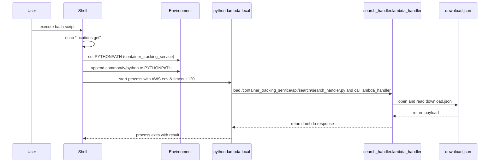

# Diagram: container_tracking_core/container_tracking_service/container_tracking_service/api/search/download.sh

> Auto-generated by Obscura crawlers

## Diagram 1

```mermaid
flowchart LR
    Start([Start: run script]) --> Echo["echo \"locations get\""]
    Echo --> SetPY["Set PYTHONPATH=/home/fvlinux/Desktop/DEV/FV-Platform-Main/platform/container_tracking_core/container_tracking_service"]
    SetPY --> ExportPY["Export PYTHONPATH += :/home/fvlinux/Desktop/DEV/FV-Platform-Main/platform/common/fv/python"]
    ExportPY --> EnvVars["Prepare env vars: AWS_DEFAULT_REGION=us-east-1<br>AWS_STAGE=dev<br>AWS_PROFILE=default"]
    EnvVars --> Run["Run: python-lambda-local -f lambda_handler -t 120<br>/.../search_handler.py /.../download.json"]
    Run --> Invoke["Invokes: search_handler.lambda_handler"]
    Invoke --> ReadFile["Reads: download.json"]
    ReadFile --> End([End])
```

### SVG

<svg id="container" width="2711.3818359375" xmlns="http://www.w3.org/2000/svg" class="flowchart" height="166" viewBox="0 0 2711.3818359375 166" role="graphics-document document" aria-roledescription="flowchart-v2"><g><marker id="container_flowchart-v2-pointEnd" class="marker flowchart-v2" viewBox="0 0 10 10" refX="5" refY="5" markerUnits="userSpaceOnUse" markerWidth="8" markerHeight="8" orient="auto"><path d="M 0 0 L 10 5 L 0 10 z" class="arrowMarkerPath" style="stroke-width: 1; stroke-dasharray: 1, 0;"></path></marker><marker id="container_flowchart-v2-pointStart" class="marker flowchart-v2" viewBox="0 0 10 10" refX="4.5" refY="5" markerUnits="userSpaceOnUse" markerWidth="8" markerHeight="8" orient="auto"><path d="M 0 5 L 10 10 L 10 0 z" class="arrowMarkerPath" style="stroke-width: 1; stroke-dasharray: 1, 0;"></path></marker><marker id="container_flowchart-v2-circleEnd" class="marker flowchart-v2" viewBox="0 0 10 10" refX="11" refY="5" markerUnits="userSpaceOnUse" markerWidth="11" markerHeight="11" orient="auto"><circle cx="5" cy="5" r="5" class="arrowMarkerPath" style="stroke-width: 1; stroke-dasharray: 1, 0;"></circle></marker><marker id="container_flowchart-v2-circleStart" class="marker flowchart-v2" viewBox="0 0 10 10" refX="-1" refY="5" markerUnits="userSpaceOnUse" markerWidth="11" markerHeight="11" orient="auto"><circle cx="5" cy="5" r="5" class="arrowMarkerPath" style="stroke-width: 1; stroke-dasharray: 1, 0;"></circle></marker><marker id="container_flowchart-v2-crossEnd" class="marker cross flowchart-v2" viewBox="0 0 11 11" refX="12" refY="5.2" markerUnits="userSpaceOnUse" markerWidth="11" markerHeight="11" orient="auto"><path d="M 1,1 l 9,9 M 10,1 l -9,9" class="arrowMarkerPath" style="stroke-width: 2; stroke-dasharray: 1, 0;"></path></marker><marker id="container_flowchart-v2-crossStart" class="marker cross flowchart-v2" viewBox="0 0 11 11" refX="-1" refY="5.2" markerUnits="userSpaceOnUse" markerWidth="11" markerHeight="11" orient="auto"><path d="M 1,1 l 9,9 M 10,1 l -9,9" class="arrowMarkerPath" style="stroke-width: 2; stroke-dasharray: 1, 0;"></path></marker><g class="root"><g class="clusters"></g><g class="edgePaths"><path d="M146.621,83.5L150.704,83.417C154.787,83.333,162.954,83.167,170.537,83.083C178.121,83,185.121,83,188.621,83L192.121,83" id="L_Start_Echo_0" class="edge-thickness-normal edge-pattern-solid edge-thickness-normal edge-pattern-solid flowchart-link" style=";" data-edge="true" data-et="edge" data-id="L_Start_Echo_0" data-points="W3sieCI6MTQ2LjYyMDU4NzQzMTgyNjk4LCJ5Ijo4My41fSx7IngiOjE3MS4xMjA1OTAyMDk5NjA5NCwieSI6ODN9LHsieCI6MTk2LjEyMDU5MDIwOTk2MDk0LCJ5Ijo4M31d" marker-end="url(#container_flowchart-v2-pointEnd)"></path><path d="M404.886,83L409.053,83C413.22,83,421.553,83,429.22,83C436.886,83,443.886,83,447.386,83L450.886,83" id="L_Echo_SetPY_0" class="edge-thickness-normal edge-pattern-solid edge-thickness-normal edge-pattern-solid flowchart-link" style=";" data-edge="true" data-et="edge" data-id="L_Echo_SetPY_0" data-points="W3sieCI6NDA0Ljg4NjIxNTIwOTk2MDk0LCJ5Ijo4M30seyJ4Ijo0MjkuODg2MjE1MjA5OTYwOTQsInkiOjgzfSx7IngiOjQ1NC44ODYyMTUyMDk5NjA5NCwieSI6ODN9XQ==" marker-end="url(#container_flowchart-v2-pointEnd)"></path><path d="M1002.292,83L1006.459,83C1010.626,83,1018.959,83,1026.626,83C1034.292,83,1041.292,83,1044.792,83L1048.292,83" id="L_SetPY_ExportPY_0" class="edge-thickness-normal edge-pattern-solid edge-thickness-normal edge-pattern-solid flowchart-link" style=";" data-edge="true" data-et="edge" data-id="L_SetPY_ExportPY_0" data-points="W3sieCI6MTAwMi4yOTI0NjUyMDk5NjA5LCJ5Ijo4M30seyJ4IjoxMDI3LjI5MjQ2NTIwOTk2MSwieSI6ODN9LHsieCI6MTA1Mi4yOTI0NjUyMDk5NjEsInkiOjgzfV0=" marker-end="url(#container_flowchart-v2-pointEnd)"></path><path d="M1368.621,83L1372.787,83C1376.954,83,1385.287,83,1392.954,83C1400.621,83,1407.621,83,1411.121,83L1414.621,83" id="L_ExportPY_EnvVars_0" class="edge-thickness-normal edge-pattern-solid edge-thickness-normal edge-pattern-solid flowchart-link" style=";" data-edge="true" data-et="edge" data-id="L_ExportPY_EnvVars_0" data-points="W3sieCI6MTM2OC42MjA1OTAyMDk5NjEsInkiOjgzfSx7IngiOjEzOTMuNjIwNTkwMjA5OTYxLCJ5Ijo4M30seyJ4IjoxNDE4LjYyMDU5MDIwOTk2MSwieSI6ODN9XQ==" marker-end="url(#container_flowchart-v2-pointEnd)"></path><path d="M1678.621,83L1682.787,83C1686.954,83,1695.287,83,1702.954,83C1710.621,83,1717.621,83,1721.121,83L1724.621,83" id="L_EnvVars_Run_0" class="edge-thickness-normal edge-pattern-solid edge-thickness-normal edge-pattern-solid flowchart-link" style=";" data-edge="true" data-et="edge" data-id="L_EnvVars_Run_0" data-points="W3sieCI6MTY3OC42MjA1OTAyMDk5NjEsInkiOjgzfSx7IngiOjE3MDMuNjIwNTkwMjA5OTYxLCJ5Ijo4M30seyJ4IjoxNzI4LjYyMDU5MDIwOTk2MSwieSI6ODN9XQ==" marker-end="url(#container_flowchart-v2-pointEnd)"></path><path d="M1988.621,83L1992.787,83C1996.954,83,2005.287,83,2012.954,83C2020.621,83,2027.621,83,2031.121,83L2034.621,83" id="L_Run_Invoke_0" class="edge-thickness-normal edge-pattern-solid edge-thickness-normal edge-pattern-solid flowchart-link" style=";" data-edge="true" data-et="edge" data-id="L_Run_Invoke_0" data-points="W3sieCI6MTk4OC42MjA1OTAyMDk5NjEsInkiOjgzfSx7IngiOjIwMTMuNjIwNTkwMjA5OTYxLCJ5Ijo4M30seyJ4IjoyMDM4LjYyMDU5MDIwOTk2MSwieSI6ODN9XQ==" marker-end="url(#container_flowchart-v2-pointEnd)"></path><path d="M2333.121,83L2337.287,83C2341.454,83,2349.787,83,2357.454,83C2365.121,83,2372.121,83,2375.621,83L2379.121,83" id="L_Invoke_ReadFile_0" class="edge-thickness-normal edge-pattern-solid edge-thickness-normal edge-pattern-solid flowchart-link" style=";" data-edge="true" data-et="edge" data-id="L_Invoke_ReadFile_0" data-points="W3sieCI6MjMzMy4xMjA1OTAyMDk5NjEsInkiOjgzfSx7IngiOjIzNTguMTIwNTkwMjA5OTYxLCJ5Ijo4M30seyJ4IjoyMzgzLjEyMDU5MDIwOTk2MSwieSI6ODN9XQ==" marker-end="url(#container_flowchart-v2-pointEnd)"></path><path d="M2601.292,83L2605.459,83C2609.626,83,2617.959,83,2625.709,83.07C2633.459,83.141,2640.626,83.281,2644.21,83.351L2647.793,83.422" id="L_ReadFile_End_0" class="edge-thickness-normal edge-pattern-solid edge-thickness-normal edge-pattern-solid flowchart-link" style=";" data-edge="true" data-et="edge" data-id="L_ReadFile_End_0" data-points="W3sieCI6MjYwMS4yOTI0NjUyMDk5NjEsInkiOjgzfSx7IngiOjI2MjYuMjkyNDY1MjA5OTYxLCJ5Ijo4M30seyJ4IjoyNjUxLjc5MjQ2NTIwOTk3NywieSI6ODMuNTAwMDAwMDAwMDAwMDF9XQ==" marker-end="url(#container_flowchart-v2-pointEnd)"></path></g><g class="edgeLabels"><g class="edgeLabel"><g class="label" data-id="L_Start_Echo_0" transform="translate(0, 0)"><foreignObject width="0" height="0">

</foreignObject></g></g><g class="edgeLabel"><g class="label" data-id="L_Echo_SetPY_0" transform="translate(0, 0)"><foreignObject width="0" height="0">

</foreignObject></g></g><g class="edgeLabel"><g class="label" data-id="L_SetPY_ExportPY_0" transform="translate(0, 0)"><foreignObject width="0" height="0">

</foreignObject></g></g><g class="edgeLabel"><g class="label" data-id="L_ExportPY_EnvVars_0" transform="translate(0, 0)"><foreignObject width="0" height="0">

</foreignObject></g></g><g class="edgeLabel"><g class="label" data-id="L_EnvVars_Run_0" transform="translate(0, 0)"><foreignObject width="0" height="0">

</foreignObject></g></g><g class="edgeLabel"><g class="label" data-id="L_Run_Invoke_0" transform="translate(0, 0)"><foreignObject width="0" height="0">

</foreignObject></g></g><g class="edgeLabel"><g class="label" data-id="L_Invoke_ReadFile_0" transform="translate(0, 0)"><foreignObject width="0" height="0">

</foreignObject></g></g><g class="edgeLabel"><g class="label" data-id="L_ReadFile_End_0" transform="translate(0, 0)"><foreignObject width="0" height="0">

</foreignObject></g></g></g><g class="nodes"><g class="node default" id="flowchart-Start-0" transform="translate(77.06029510498047, 83)"><g class="basic label-container outer-path"><path d="M-49.5703125 -19.5 C-28.82085207816523 -19.5, -8.071391656330462 -19.5, 49.5703125 -19.5 C49.5703125 -19.5, 49.5703125 -19.5, 49.5703125 -19.5 C50.019298268282675 -19.485601900308957, 50.46828403656536 -19.471203800617914, 50.8196817896239 -19.45993515863156 C51.08629525426322 -19.43421527834741, 51.35290871890254 -19.408495398063256, 52.063917152847864 -19.3399052695533 C52.4787738888808 -19.272834449733534, 52.89363062491373 -19.205763629913765, 53.29790575967676 -19.140403561325776 C53.74331758523217 -19.03874121872655, 54.18872941078758 -18.937078876127323, 54.51657688623539 -18.862249829261074 C54.8696309310961 -18.757465241964915, 55.222684975956795 -18.65268065466876, 55.714922751460605 -18.50658706670804 C56.08935777218449 -18.36879151784226, 56.46379279290838 -18.23099596897648, 56.8880190951478 -18.074876768247425 C57.163551342948914 -17.9529068155196, 57.43908359075004 -17.830936862791773, 58.03104541279238 -17.568892924097174 C58.27583389785069 -17.44118692823676, 58.520622382909 -17.313480932376347, 59.13930476407678 -16.990714730406097 C59.56499656530381 -16.73265785885957, 59.99068836653084 -16.474600987313043, 60.2082430736057 -16.342718045390892 C60.455320172925056 -16.170367756700955, 60.70239727224441 -15.998017468011016, 61.23346784457871 -15.627565626425154 C61.495535304738524 -15.418573800855706, 61.75760276489833 -15.209581975286255, 62.210766208501866 -14.848196188198123 C62.46588462588121 -14.616504391597639, 62.72100304326055 -14.384812594997152, 63.13612223676799 -14.007812326905688 C63.4645905088304 -13.668641868254582, 63.7930587808928 -13.329471409603478, 64.00573344296865 -13.10986736009568 C64.27590646689357 -12.792506752912887, 64.54607949081851 -12.475146145730095, 64.81602640812658 -12.158051136245305 C64.98878104430071 -11.92657566204309, 65.16153568047484 -11.695100187840875, 65.56367146464063 -11.156274872382312 C65.81018676974564 -10.777561165112914, 66.05670207485065 -10.398847457843518, 66.24559637860425 -10.108655082055241 C66.41120600319003 -9.814598423810246, 66.57681562777582 -9.520541765565248, 66.8589989742735 -9.019496659696287 C67.03839352718467 -8.646980032147736, 67.21778808009581 -8.274463404599185, 67.40135864880834 -7.893275190886684 C67.55502364900622 -7.513719669487265, 67.70868864920409 -7.134164148087845, 67.87044672997033 -6.734618561215508 C68.01540167952862 -6.298037348580727, 68.1603566290869 -5.861456135945946, 68.26433563421489 -5.548287939305138 C68.35973813493257 -5.184476856363247, 68.45514063565025 -4.820665773421355, 68.58140678754556 -4.339158212148133 C68.63065404403541 -4.086283958484077, 68.67990130052527 -3.83340970482002, 68.82035727658177 -3.1121979531509023 C68.87936209085925 -2.6545682654333604, 68.9383669051367 -2.1969385777158186, 68.98020520250937 -1.872449005199798 C69.00531169390419 -1.4813951361303026, 69.03041818529901 -1.0903412670608073, 69.06029371591342 -0.6250057626472757 C69.06029371591342 -0.1421098593633648, 69.06029371591342 0.3407860439205461, 69.06029371591342 0.625005762647271 C69.02919098675919 1.1094558748955017, 68.99808825760496 1.5939059871437324, 68.98020520250937 1.8724490051997846 C68.93715355418941 2.2063490880598273, 68.89410190586945 2.5402491709198696, 68.82035727658177 3.1121979531508885 C68.72509071705906 3.601371601705551, 68.62982415753635 4.090545250260213, 68.58140678754556 4.339158212148129 C68.51706879653769 4.584506856122865, 68.4527308055298 4.829855500097602, 68.26433563421489 5.548287939305125 C68.1417343673375 5.91754342128068, 68.01913310046011 6.2867989032562335, 67.87044672997033 6.734618561215495 C67.69854707922558 7.159214022008689, 67.52664742848083 7.5838094828018825, 67.40135864880834 7.893275190886679 C67.2332579159687 8.242339959407694, 67.06515718312905 8.591404727928708, 66.8589989742735 9.019496659696284 C66.64011876358796 9.408140637793167, 66.42123855290244 9.796784615890049, 66.24559637860425 10.108655082055236 C66.03013002425314 10.439669263155972, 65.81466366990202 10.770683444256708, 65.56367146464065 11.156274872382301 C65.28519941529362 11.529402049181734, 65.00672736594659 11.902529225981167, 64.81602640812659 12.158051136245302 C64.51623493009633 12.510203264957998, 64.21644345206606 12.862355393670695, 64.00573344296866 13.10986736009567 C63.67079361674479 13.455720229742965, 63.335853790520915 13.801573099390259, 63.13612223676799 14.007812326905684 C62.839410400461645 14.277278166074113, 62.54269856415531 14.546744005242543, 62.21076620850189 14.848196188198111 C61.972085542748 15.038537667577572, 61.733404876994115 15.228879146957032, 61.23346784457871 15.627565626425152 C61.00672130784592 15.785734194750573, 60.77997477111313 15.943902763075995, 60.20824307360571 16.34271804539089 C59.97966570235229 16.48128299111444, 59.751088331098885 16.619847936837992, 59.13930476407678 16.990714730406093 C58.87157382138818 17.130389791716883, 58.603842878699574 17.270064853027677, 58.03104541279239 17.56889292409717 C57.57668962803507 17.770022752023753, 57.12233384327776 17.971152579950335, 56.888019095147804 18.07487676824742 C56.44704610790923 18.237158903860827, 56.00607312067065 18.39944103947423, 55.71492275146062 18.506587066708033 C55.27423424484696 18.637381102249794, 54.8335457382333 18.768175137791552, 54.51657688623541 18.86224982926107 C54.077134315710374 18.962549728352645, 53.63769174518533 19.06284962744422, 53.297905759676766 19.140403561325773 C52.94590361927078 19.197312537569243, 52.593901478864794 19.254221513812716, 52.06391715284788 19.3399052695533 C51.79207015996287 19.366130022013074, 51.52022316707785 19.39235477447285, 50.8196817896239 19.45993515863156 C50.55713553299455 19.468354506066376, 50.2945892763652 19.476773853501193, 49.57031250000001 19.5 C49.57031250000001 19.5, 49.5703125 19.5, 49.5703125 19.5 C27.77216682205925 19.5, 5.9740211441185025 19.5, -49.57031249999999 19.5 C-49.87741824314588 19.490151716562377, -50.18452398629177 19.480303433124757, -50.81968178962389 19.45993515863156 C-51.175050171715654 19.425653198204177, -51.530418553807415 19.39137123777679, -52.06391715284787 19.3399052695533 C-52.37190495146974 19.290112190753167, -52.6798927500916 19.24031911195303, -53.29790575967676 19.140403561325773 C-53.64987980143455 19.06006778313983, -54.00185384319235 18.97973200495389, -54.516576886235384 18.862249829261074 C-54.93654737779247 18.73760479183703, -55.35651786934955 18.61295975441298, -55.71492275146059 18.506587066708043 C-56.03315702445328 18.38947391252136, -56.35139129744597 18.27236075833468, -56.8880190951478 18.074876768247425 C-57.128084478630846 17.96860694426606, -57.3681498621139 17.862337120284693, -58.03104541279238 17.568892924097174 C-58.46285055726807 17.343620456808605, -58.89465570174376 17.118347989520032, -59.13930476407678 16.990714730406097 C-59.53045045928371 16.753599911344406, -59.92159615449064 16.516485092282718, -60.208243073605686 16.3427180453909 C-60.560081146712264 16.09729103641646, -60.911919219818834 15.851864027442023, -61.23346784457871 15.627565626425156 C-61.51379161035704 15.404014882945637, -61.79411537613536 15.180464139466118, -62.210766208501866 14.848196188198125 C-62.495824396539454 14.589313884048744, -62.78088258457704 14.330431579899361, -63.136122236767974 14.007812326905697 C-63.46006585601388 13.673313943768536, -63.784009475259786 13.338815560631373, -64.00573344296865 13.109867360095677 C-64.27821824682714 12.789791204658933, -64.55070305068561 12.469715049222186, -64.81602640812658 12.158051136245307 C-65.08294838829848 11.80039999990761, -65.34987036847038 11.442748863569914, -65.56367146464063 11.156274872382316 C-65.74137594960976 10.883273063134048, -65.91908043457889 10.61027125388578, -66.24559637860425 10.108655082055249 C-66.49038913999608 9.674000746249034, -66.73518190138793 9.239346410442817, -66.8589989742735 9.019496659696289 C-66.99797275834905 8.730914623500778, -67.13694654242461 8.442332587305266, -67.40135864880834 7.893275190886686 C-67.56134278389182 7.498111284147665, -67.7213269189753 7.102947377408644, -67.87044672997033 6.73461856121551 C-67.95836277363034 6.469829445230861, -68.04627881729034 6.205040329246212, -68.26433563421489 5.5482879393051325 C-68.37860371273376 5.112534231814159, -68.49287179125264 4.676780524323187, -68.58140678754556 4.339158212148136 C-68.64945356693323 3.9897523816843248, -68.71750034632092 3.6403465512205133, -68.82035727658177 3.112197953150904 C-68.86492005960763 2.766577807919257, -68.90948284263348 2.4209576626876097, -68.98020520250937 1.872449005199809 C-69.01145953857385 1.3856374929496305, -69.04271387463831 0.8988259806994516, -69.06029371591342 0.6250057626472781 C-69.06029371591342 0.3537958189720224, -69.06029371591342 0.08258587529676664, -69.06029371591342 -0.6250057626472687 C-69.0314418340096 -1.074397112119155, -69.00258995210578 -1.523788461591041, -68.98020520250937 -1.8724490051997822 C-68.93345825232848 -2.2350091195733395, -68.88671130214759 -2.5975692339468965, -68.82035727658177 -3.112197953150895 C-68.74823046129809 -3.482553905624824, -68.6761036460144 -3.8529098580987524, -68.58140678754556 -4.339158212148126 C-68.46364317636518 -4.788241900650858, -68.3458795651848 -5.23732558915359, -68.26433563421489 -5.548287939305123 C-68.11464091790255 -5.999144574223797, -67.96494620159022 -6.450001209142471, -67.87044672997033 -6.734618561215485 C-67.73828497937403 -7.061060640361978, -67.60612322877772 -7.387502719508471, -67.40135864880834 -7.893275190886676 C-67.25470524239823 -8.197804127177493, -67.10805183598812 -8.502333063468312, -66.8589989742735 -9.019496659696282 C-66.6141615597445 -9.454230281669156, -66.3693241452155 -9.88896390364203, -66.24559637860425 -10.108655082055243 C-66.10394788631744 -10.326265204153772, -65.96229939403064 -10.543875326252302, -65.56367146464063 -11.156274872382308 C-65.32412797635337 -11.477241323826531, -65.0845844880661 -11.798207775270754, -64.81602640812659 -12.158051136245302 C-64.59752581513557 -12.414714365808498, -64.37902522214456 -12.671377595371695, -64.00573344296866 -13.10986736009567 C-63.8042174102516 -13.317949208650012, -63.602701377534544 -13.526031057204353, -63.136122236767996 -14.007812326905677 C-62.866372269208085 -14.25279211025055, -62.59662230164818 -14.497771893595422, -62.21076620850189 -14.848196188198107 C-61.88095923083718 -15.111208476353445, -61.551152253172475 -15.374220764508784, -61.23346784457872 -15.627565626425149 C-60.96380923261265 -15.815667800799512, -60.694150620646575 -16.003769975173874, -60.208243073605715 -16.342718045390885 C-59.812349823480375 -16.582710860143845, -59.41645657335503 -16.822703674896804, -59.13930476407679 -16.99071473040609 C-58.84003493262051 -17.146843609785357, -58.54076510116423 -17.30297248916462, -58.03104541279239 -17.56889292409717 C-57.71824734773724 -17.707359348672163, -57.40544928268209 -17.845825773247153, -56.888019095147804 -18.07487676824742 C-56.46821986073065 -18.22936676709452, -56.048420626313494 -18.383856765941616, -55.71492275146062 -18.506587066708033 C-55.39065250500696 -18.60282877372622, -55.066382258553304 -18.699070480744407, -54.51657688623541 -18.862249829261067 C-54.054790544753274 -18.967649548266866, -53.593004203271136 -19.07304926727267, -53.297905759676766 -19.140403561325773 C-52.80698198610553 -19.21977230986605, -52.31605821253429 -19.29914105840632, -52.06391715284788 -19.3399052695533 C-51.69743592327319 -19.375259273012205, -51.330954693698494 -19.41061327647111, -50.8196817896239 -19.45993515863156 C-50.36331897002228 -19.474569825999843, -49.906956150420655 -19.489204493368124, -49.57031250000001 -19.5 C-49.57031250000001 -19.5, -49.5703125 -19.5, -49.5703125 -19.5" stroke="none" stroke-width="0" fill="#ECECFF" style=""></path><path d="M-49.5703125 -19.5 C-28.500419421121872 -19.5, -7.430526342243745 -19.5, 49.5703125 -19.5 M-49.5703125 -19.5 C-27.23376720984204 -19.5, -4.897221919684078 -19.5, 49.5703125 -19.5 M49.5703125 -19.5 C49.5703125 -19.5, 49.5703125 -19.5, 49.5703125 -19.5 M49.5703125 -19.5 C49.5703125 -19.5, 49.5703125 -19.5, 49.5703125 -19.5 M49.5703125 -19.5 C50.054014725998435 -19.4844886110815, 50.53771695199687 -19.468977222162994, 50.8196817896239 -19.45993515863156 M49.5703125 -19.5 C50.032273887736416 -19.485185797448587, 50.49423527547283 -19.470371594897173, 50.8196817896239 -19.45993515863156 M50.8196817896239 -19.45993515863156 C51.080928345531774 -19.43473301757808, 51.34217490143965 -19.4095308765246, 52.063917152847864 -19.3399052695533 M50.8196817896239 -19.45993515863156 C51.28737583780898 -19.414817276287533, 51.755069885994054 -19.369699393943502, 52.063917152847864 -19.3399052695533 M52.063917152847864 -19.3399052695533 C52.556752783793854 -19.260227426739352, 53.049588414739844 -19.180549583925405, 53.29790575967676 -19.140403561325776 M52.063917152847864 -19.3399052695533 C52.53284433743185 -19.26409275893439, 53.00177152201583 -19.188280248315483, 53.29790575967676 -19.140403561325776 M53.29790575967676 -19.140403561325776 C53.72450486194889 -19.043035100051465, 54.15110396422102 -18.945666638777155, 54.51657688623539 -18.862249829261074 M53.29790575967676 -19.140403561325776 C53.67578652974006 -19.054154741461304, 54.05366729980335 -18.96790592159683, 54.51657688623539 -18.862249829261074 M54.51657688623539 -18.862249829261074 C54.99074817947916 -18.721518278402232, 55.464919472722926 -18.58078672754339, 55.714922751460605 -18.50658706670804 M54.51657688623539 -18.862249829261074 C54.82337007649136 -18.771195220783422, 55.13016326674733 -18.680140612305767, 55.714922751460605 -18.50658706670804 M55.714922751460605 -18.50658706670804 C56.05779978441857 -18.380405149058962, 56.40067681737653 -18.25422323140988, 56.8880190951478 -18.074876768247425 M55.714922751460605 -18.50658706670804 C56.12902592801443 -18.35419326980843, 56.54312910456825 -18.20179947290882, 56.8880190951478 -18.074876768247425 M56.8880190951478 -18.074876768247425 C57.2376253349074 -17.92011645660648, 57.58723157466701 -17.765356144965534, 58.03104541279238 -17.568892924097174 M56.8880190951478 -18.074876768247425 C57.30435269180747 -17.890578235103533, 57.72068628846715 -17.706279701959637, 58.03104541279238 -17.568892924097174 M58.03104541279238 -17.568892924097174 C58.36354148311161 -17.395429937185533, 58.696037553430834 -17.221966950273888, 59.13930476407678 -16.990714730406097 M58.03104541279238 -17.568892924097174 C58.430920533429855 -17.360278329792845, 58.83079565406733 -17.151663735488512, 59.13930476407678 -16.990714730406097 M59.13930476407678 -16.990714730406097 C59.35913893650885 -16.857449963188785, 59.578973108940914 -16.724185195971472, 60.2082430736057 -16.342718045390892 M59.13930476407678 -16.990714730406097 C59.384789502269584 -16.84190043948517, 59.63027424046239 -16.69308614856424, 60.2082430736057 -16.342718045390892 M60.2082430736057 -16.342718045390892 C60.60881548730167 -16.063296070096897, 61.00938790099763 -15.783874094802899, 61.23346784457871 -15.627565626425154 M60.2082430736057 -16.342718045390892 C60.44262341164085 -16.179224467738877, 60.677003749676 -16.015730890086864, 61.23346784457871 -15.627565626425154 M61.23346784457871 -15.627565626425154 C61.52509440792753 -15.395001202663241, 61.816720971276354 -15.162436778901327, 62.210766208501866 -14.848196188198123 M61.23346784457871 -15.627565626425154 C61.48549779438155 -15.42657844825602, 61.73752774418439 -15.225591270086888, 62.210766208501866 -14.848196188198123 M62.210766208501866 -14.848196188198123 C62.55709260858143 -14.53367171494028, 62.903419008661 -14.219147241682435, 63.13612223676799 -14.007812326905688 M62.210766208501866 -14.848196188198123 C62.49477330586141 -14.590268456792211, 62.77878040322094 -14.332340725386299, 63.13612223676799 -14.007812326905688 M63.13612223676799 -14.007812326905688 C63.42244195620986 -13.71216370929581, 63.708761675651736 -13.416515091685934, 64.00573344296865 -13.10986736009568 M63.13612223676799 -14.007812326905688 C63.43522441385941 -13.698964772313362, 63.73432659095083 -13.390117217721036, 64.00573344296865 -13.10986736009568 M64.00573344296865 -13.10986736009568 C64.2206537789713 -12.857409704113413, 64.43557411497393 -12.604952048131144, 64.81602640812658 -12.158051136245305 M64.00573344296865 -13.10986736009568 C64.24982267972135 -12.82314625353492, 64.49391191647406 -12.536425146974162, 64.81602640812658 -12.158051136245305 M64.81602640812658 -12.158051136245305 C64.97103293993422 -11.95035650500862, 65.12603947174186 -11.742661873771933, 65.56367146464063 -11.156274872382312 M64.81602640812658 -12.158051136245305 C65.07283801196513 -11.813946983120054, 65.32964961580369 -11.469842829994803, 65.56367146464063 -11.156274872382312 M65.56367146464063 -11.156274872382312 C65.77794716289415 -10.82708985878341, 65.99222286114768 -10.497904845184506, 66.24559637860425 -10.108655082055241 M65.56367146464063 -11.156274872382312 C65.74387290807194 -10.879437064408918, 65.92407435150324 -10.602599256435523, 66.24559637860425 -10.108655082055241 M66.24559637860425 -10.108655082055241 C66.4212142903724 -9.796827696468954, 66.59683220214058 -9.485000310882668, 66.8589989742735 -9.019496659696287 M66.24559637860425 -10.108655082055241 C66.4418578765383 -9.760172918841658, 66.63811937447234 -9.411690755628072, 66.8589989742735 -9.019496659696287 M66.8589989742735 -9.019496659696287 C66.98691845960957 -8.753869111357439, 67.11483794494562 -8.48824156301859, 67.40135864880834 -7.893275190886684 M66.8589989742735 -9.019496659696287 C67.00928938077139 -8.707415414903874, 67.15957978726928 -8.395334170111461, 67.40135864880834 -7.893275190886684 M67.40135864880834 -7.893275190886684 C67.51608505182985 -7.6098987573394385, 67.63081145485137 -7.326522323792193, 67.87044672997033 -6.734618561215508 M67.40135864880834 -7.893275190886684 C67.55464497267596 -7.514655007344214, 67.70793129654358 -7.136034823801744, 67.87044672997033 -6.734618561215508 M67.87044672997033 -6.734618561215508 C67.99826933298051 -6.349637246714886, 68.1260919359907 -5.9646559322142645, 68.26433563421489 -5.548287939305138 M67.87044672997033 -6.734618561215508 C67.96897814711751 -6.437857631617547, 68.06750956426471 -6.141096702019586, 68.26433563421489 -5.548287939305138 M68.26433563421489 -5.548287939305138 C68.36077832727864 -5.180510152125479, 68.45722102034239 -4.812732364945822, 68.58140678754556 -4.339158212148133 M68.26433563421489 -5.548287939305138 C68.33929774850739 -5.262424908721959, 68.4142598627999 -4.97656187813878, 68.58140678754556 -4.339158212148133 M68.58140678754556 -4.339158212148133 C68.64462168295492 -4.014563084693979, 68.70783657836427 -3.6899679572398245, 68.82035727658177 -3.1121979531509023 M68.58140678754556 -4.339158212148133 C68.64565757998979 -4.009243972356816, 68.70990837243401 -3.679329732565499, 68.82035727658177 -3.1121979531509023 M68.82035727658177 -3.1121979531509023 C68.87037559671242 -2.724265739452062, 68.92039391684308 -2.336333525753222, 68.98020520250937 -1.872449005199798 M68.82035727658177 -3.1121979531509023 C68.86424225671892 -2.7718347132767467, 68.90812723685606 -2.431471473402591, 68.98020520250937 -1.872449005199798 M68.98020520250937 -1.872449005199798 C69.00006301698927 -1.5631475157360117, 69.01992083146916 -1.2538460262722255, 69.06029371591342 -0.6250057626472757 M68.98020520250937 -1.872449005199798 C68.99995966602059 -1.564757290496517, 69.01971412953182 -1.257065575793236, 69.06029371591342 -0.6250057626472757 M69.06029371591342 -0.6250057626472757 C69.06029371591342 -0.2767112132422477, 69.06029371591342 0.07158333616278034, 69.06029371591342 0.625005762647271 M69.06029371591342 -0.6250057626472757 C69.06029371591342 -0.145638875179952, 69.06029371591342 0.3337280122873717, 69.06029371591342 0.625005762647271 M69.06029371591342 0.625005762647271 C69.03831299290538 0.9673732660177154, 69.01633226989735 1.30974076938816, 68.98020520250937 1.8724490051997846 M69.06029371591342 0.625005762647271 C69.03559569276982 1.0096974089943012, 69.01089766962622 1.3943890553413312, 68.98020520250937 1.8724490051997846 M68.98020520250937 1.8724490051997846 C68.9457989187083 2.139297348071595, 68.91139263490724 2.4061456909434056, 68.82035727658177 3.1121979531508885 M68.98020520250937 1.8724490051997846 C68.93132509105125 2.25155349719911, 68.88244497959315 2.630657989198435, 68.82035727658177 3.1121979531508885 M68.82035727658177 3.1121979531508885 C68.74674018841526 3.4902061419088635, 68.67312310024874 3.868214330666839, 68.58140678754556 4.339158212148129 M68.82035727658177 3.1121979531508885 C68.73883108021894 3.530817740906356, 68.6573048838561 3.9494375286618233, 68.58140678754556 4.339158212148129 M68.58140678754556 4.339158212148129 C68.48615962559057 4.702376921063606, 68.39091246363559 5.065595629979082, 68.26433563421489 5.548287939305125 M68.58140678754556 4.339158212148129 C68.46977955980292 4.764841211077374, 68.35815233206027 5.190524210006618, 68.26433563421489 5.548287939305125 M68.26433563421489 5.548287939305125 C68.17630768821563 5.813414087306377, 68.08827974221637 6.078540235307629, 67.87044672997033 6.734618561215495 M68.26433563421489 5.548287939305125 C68.1431179912361 5.913376166548648, 68.0219003482573 6.278464393792172, 67.87044672997033 6.734618561215495 M67.87044672997033 6.734618561215495 C67.69804484950977 7.160454539116656, 67.52564296904923 7.586290517017818, 67.40135864880834 7.893275190886679 M67.87044672997033 6.734618561215495 C67.7548885078935 7.020049603911495, 67.63933028581667 7.305480646607496, 67.40135864880834 7.893275190886679 M67.40135864880834 7.893275190886679 C67.18955464968612 8.333090726943572, 66.97775065056389 8.772906263000465, 66.8589989742735 9.019496659696284 M67.40135864880834 7.893275190886679 C67.2531381525557 8.20105822276584, 67.10491765630307 8.508841254645, 66.8589989742735 9.019496659696284 M66.8589989742735 9.019496659696284 C66.64829245755845 9.3936274164723, 66.4375859408434 9.767758173248318, 66.24559637860425 10.108655082055236 M66.8589989742735 9.019496659696284 C66.69279343198998 9.31461143015682, 66.52658788970648 9.609726200617354, 66.24559637860425 10.108655082055236 M66.24559637860425 10.108655082055236 C66.07246149499375 10.374636756506883, 65.89932661138324 10.64061843095853, 65.56367146464065 11.156274872382301 M66.24559637860425 10.108655082055236 C66.09726622178202 10.336530035158317, 65.9489360649598 10.564404988261398, 65.56367146464065 11.156274872382301 M65.56367146464065 11.156274872382301 C65.3954208812448 11.381715326189259, 65.22717029784896 11.607155779996216, 64.81602640812659 12.158051136245302 M65.56367146464065 11.156274872382301 C65.29000536961763 11.522962508219004, 65.0163392745946 11.88965014405571, 64.81602640812659 12.158051136245302 M64.81602640812659 12.158051136245302 C64.63479541609685 12.37093537181902, 64.45356442406711 12.583819607392735, 64.00573344296866 13.10986736009567 M64.81602640812659 12.158051136245302 C64.62372958604121 12.383933925465941, 64.43143276395583 12.609816714686582, 64.00573344296866 13.10986736009567 M64.00573344296866 13.10986736009567 C63.801330200483434 13.320930489779974, 63.59692695799821 13.531993619464277, 63.13612223676799 14.007812326905684 M64.00573344296866 13.10986736009567 C63.76373710239999 13.35974845000188, 63.521740761831325 13.609629539908092, 63.13612223676799 14.007812326905684 M63.13612223676799 14.007812326905684 C62.83439382639502 14.281834085910148, 62.53266541602205 14.55585584491461, 62.21076620850189 14.848196188198111 M63.13612223676799 14.007812326905684 C62.77022113329049 14.340114027871262, 62.404320029813 14.67241572883684, 62.21076620850189 14.848196188198111 M62.21076620850189 14.848196188198111 C61.94917267396741 15.056810070693043, 61.68757913943294 15.265423953187975, 61.23346784457871 15.627565626425152 M62.21076620850189 14.848196188198111 C61.971740196074634 15.03881307235952, 61.73271418364738 15.22942995652093, 61.23346784457871 15.627565626425152 M61.23346784457871 15.627565626425152 C60.89789731325883 15.861645102459729, 60.56232678193896 16.095724578494305, 60.20824307360571 16.34271804539089 M61.23346784457871 15.627565626425152 C60.84206846005948 15.900588893659494, 60.45066907554025 16.173612160893835, 60.20824307360571 16.34271804539089 M60.20824307360571 16.34271804539089 C59.94172485317965 16.50428295684808, 59.675206632753586 16.665847868305267, 59.13930476407678 16.990714730406093 M60.20824307360571 16.34271804539089 C59.97748958859464 16.482602164062595, 59.74673610358358 16.622486282734297, 59.13930476407678 16.990714730406093 M59.13930476407678 16.990714730406093 C58.69836915145761 17.220750557076776, 58.25743353883844 17.45078638374746, 58.03104541279239 17.56889292409717 M59.13930476407678 16.990714730406093 C58.90398435053714 17.11348123941981, 58.66866393699749 17.236247748433524, 58.03104541279239 17.56889292409717 M58.03104541279239 17.56889292409717 C57.64489568948781 17.73982995187955, 57.25874596618324 17.91076697966193, 56.888019095147804 18.07487676824742 M58.03104541279239 17.56889292409717 C57.74102455031937 17.69727655675076, 57.45100368784635 17.82566018940435, 56.888019095147804 18.07487676824742 M56.888019095147804 18.07487676824742 C56.43597620126754 18.24123273183406, 55.98393330738729 18.4075886954207, 55.71492275146062 18.506587066708033 M56.888019095147804 18.07487676824742 C56.55916321285929 18.195898772840046, 56.230307330570774 18.316920777432674, 55.71492275146062 18.506587066708033 M55.71492275146062 18.506587066708033 C55.351061870858466 18.614579066126016, 54.98720099025631 18.722571065544, 54.51657688623541 18.86224982926107 M55.71492275146062 18.506587066708033 C55.270293732004525 18.638550625777253, 54.82566471254843 18.770514184846473, 54.51657688623541 18.86224982926107 M54.51657688623541 18.86224982926107 C54.19491497505241 18.935667061448452, 53.87325306386942 19.009084293635837, 53.297905759676766 19.140403561325773 M54.51657688623541 18.86224982926107 C54.13409115489288 18.949549701487346, 53.751605423550345 19.036849573713624, 53.297905759676766 19.140403561325773 M53.297905759676766 19.140403561325773 C52.94745656504594 19.19706146933959, 52.59700737041511 19.25371937735341, 52.06391715284788 19.3399052695533 M53.297905759676766 19.140403561325773 C52.97822567872709 19.19208695765766, 52.65854559777742 19.24377035398955, 52.06391715284788 19.3399052695533 M52.06391715284788 19.3399052695533 C51.66355581417997 19.378527646389635, 51.26319447551207 19.41715002322597, 50.8196817896239 19.45993515863156 M52.06391715284788 19.3399052695533 C51.68181709840198 19.376766002263146, 51.29971704395608 19.413626734972993, 50.8196817896239 19.45993515863156 M50.8196817896239 19.45993515863156 C50.39764882162127 19.473468934478063, 49.97561585361863 19.48700271032457, 49.57031250000001 19.5 M50.8196817896239 19.45993515863156 C50.509610284043134 19.469878548297963, 50.19953877846237 19.479821937964363, 49.57031250000001 19.5 M49.57031250000001 19.5 C49.57031250000001 19.5, 49.5703125 19.5, 49.5703125 19.5 M49.57031250000001 19.5 C49.57031250000001 19.5, 49.5703125 19.5, 49.5703125 19.5 M49.5703125 19.5 C13.939944387328595 19.5, -21.69042372534281 19.5, -49.57031249999999 19.5 M49.5703125 19.5 C21.647667356387238 19.5, -6.274977787225524 19.5, -49.57031249999999 19.5 M-49.57031249999999 19.5 C-49.895930107702554 19.489558077097204, -50.221547715405116 19.479116154194408, -50.81968178962389 19.45993515863156 M-49.57031249999999 19.5 C-50.056601619290895 19.48440565444869, -50.542890738581804 19.468811308897383, -50.81968178962389 19.45993515863156 M-50.81968178962389 19.45993515863156 C-51.094543966440106 19.43341953500423, -51.36940614325631 19.4069039113769, -52.06391715284787 19.3399052695533 M-50.81968178962389 19.45993515863156 C-51.255067731276164 19.41793400046857, -51.690453672928435 19.375932842305577, -52.06391715284787 19.3399052695533 M-52.06391715284787 19.3399052695533 C-52.38274678513401 19.288359367166002, -52.701576417420156 19.236813464778702, -53.29790575967676 19.140403561325773 M-52.06391715284787 19.3399052695533 C-52.505314390938864 19.26854358718545, -52.946711629029856 19.197181904817604, -53.29790575967676 19.140403561325773 M-53.29790575967676 19.140403561325773 C-53.58118975236626 19.075745838595207, -53.86447374505576 19.01108811586464, -54.516576886235384 18.862249829261074 M-53.29790575967676 19.140403561325773 C-53.58242218741037 19.07546454333878, -53.86693861514398 19.010525525351785, -54.516576886235384 18.862249829261074 M-54.516576886235384 18.862249829261074 C-54.88532849445113 18.75280628755933, -55.254080102666876 18.64336274585759, -55.71492275146059 18.506587066708043 M-54.516576886235384 18.862249829261074 C-54.99012364861351 18.721703635884925, -55.46367041099164 18.58115744250878, -55.71492275146059 18.506587066708043 M-55.71492275146059 18.506587066708043 C-56.10169154920496 18.364252573886542, -56.488460346949324 18.22191808106504, -56.8880190951478 18.074876768247425 M-55.71492275146059 18.506587066708043 C-56.02578614580793 18.392186463998506, -56.336649540155264 18.277785861288972, -56.8880190951478 18.074876768247425 M-56.8880190951478 18.074876768247425 C-57.28163627168385 17.900634120433597, -57.67525344821991 17.72639147261977, -58.03104541279238 17.568892924097174 M-56.8880190951478 18.074876768247425 C-57.20326228275606 17.935327960450152, -57.518505470364325 17.79577915265288, -58.03104541279238 17.568892924097174 M-58.03104541279238 17.568892924097174 C-58.349212089214745 17.40290557280311, -58.6673787656371 17.236918221509047, -59.13930476407678 16.990714730406097 M-58.03104541279238 17.568892924097174 C-58.39095540346328 17.381128112497517, -58.75086539413418 17.19336330089786, -59.13930476407678 16.990714730406097 M-59.13930476407678 16.990714730406097 C-59.494208529048414 16.775569982434266, -59.84911229402005 16.560425234462436, -60.208243073605686 16.3427180453909 M-59.13930476407678 16.990714730406097 C-59.377232303355896 16.846481657877675, -59.615159842635016 16.702248585349253, -60.208243073605686 16.3427180453909 M-60.208243073605686 16.3427180453909 C-60.47320209151616 16.157894104387577, -60.738161109426635 15.973070163384255, -61.23346784457871 15.627565626425156 M-60.208243073605686 16.3427180453909 C-60.55982649388082 16.097468671207935, -60.911409914155946 15.852219297024966, -61.23346784457871 15.627565626425156 M-61.23346784457871 15.627565626425156 C-61.58603453697149 15.346403071435628, -61.93860122936426 15.0652405164461, -62.210766208501866 14.848196188198125 M-61.23346784457871 15.627565626425156 C-61.61255363225891 15.325254798646672, -61.99163941993911 15.022943970868186, -62.210766208501866 14.848196188198125 M-62.210766208501866 14.848196188198125 C-62.51453631410687 14.572320215604226, -62.818306419711874 14.296444243010326, -63.136122236767974 14.007812326905697 M-62.210766208501866 14.848196188198125 C-62.48968007283424 14.594893996267919, -62.76859393716662 14.341591804337712, -63.136122236767974 14.007812326905697 M-63.136122236767974 14.007812326905697 C-63.32352608356636 13.814302468944401, -63.51092993036474 13.620792610983107, -64.00573344296865 13.109867360095677 M-63.136122236767974 14.007812326905697 C-63.31900058105722 13.818975421835752, -63.50187892534646 13.630138516765806, -64.00573344296865 13.109867360095677 M-64.00573344296865 13.109867360095677 C-64.21161900869691 12.86802245937069, -64.41750457442518 12.626177558645704, -64.81602640812658 12.158051136245307 M-64.00573344296865 13.109867360095677 C-64.32369183888174 12.736375335910889, -64.64165023479485 12.362883311726103, -64.81602640812658 12.158051136245307 M-64.81602640812658 12.158051136245307 C-65.1139398081612 11.758874320667973, -65.41185320819585 11.35969750509064, -65.56367146464063 11.156274872382316 M-64.81602640812658 12.158051136245307 C-65.04407198959098 11.852490832462879, -65.27211757105538 11.54693052868045, -65.56367146464063 11.156274872382316 M-65.56367146464063 11.156274872382316 C-65.70950734022159 10.93223180507412, -65.85534321580255 10.708188737765925, -66.24559637860425 10.108655082055249 M-65.56367146464063 11.156274872382316 C-65.8349315889009 10.739546477976132, -66.10619171316117 10.322818083569947, -66.24559637860425 10.108655082055249 M-66.24559637860425 10.108655082055249 C-66.37270745010171 9.882956503219795, -66.49981852159917 9.65725792438434, -66.8589989742735 9.019496659696289 M-66.24559637860425 10.108655082055249 C-66.37556913719511 9.877875288008212, -66.50554189578598 9.647095493961178, -66.8589989742735 9.019496659696289 M-66.8589989742735 9.019496659696289 C-67.0476823396867 8.627691614238515, -67.23636570509989 8.23588656878074, -67.40135864880834 7.893275190886686 M-66.8589989742735 9.019496659696289 C-67.07572213133568 8.569466386923969, -67.29244528839786 8.119436114151647, -67.40135864880834 7.893275190886686 M-67.40135864880834 7.893275190886686 C-67.57895570257449 7.454607034478835, -67.75655275634065 7.015938878070985, -67.87044672997033 6.73461856121551 M-67.40135864880834 7.893275190886686 C-67.57204454522959 7.4716777267389, -67.74273044165083 7.050080262591114, -67.87044672997033 6.73461856121551 M-67.87044672997033 6.73461856121551 C-67.97362029268466 6.423876228794782, -68.07679385539899 6.1131338963740545, -68.26433563421489 5.5482879393051325 M-67.87044672997033 6.73461856121551 C-68.0090697626925 6.317108073237148, -68.14769279541468 5.899597585258786, -68.26433563421489 5.5482879393051325 M-68.26433563421489 5.5482879393051325 C-68.35800208635666 5.191097161991366, -68.45166853849845 4.8339063846776, -68.58140678754556 4.339158212148136 M-68.26433563421489 5.5482879393051325 C-68.34736809764802 5.231649169737301, -68.43040056108116 4.915010400169469, -68.58140678754556 4.339158212148136 M-68.58140678754556 4.339158212148136 C-68.66478126472397 3.911047893038993, -68.74815574190238 3.4829375739298505, -68.82035727658177 3.112197953150904 M-68.58140678754556 4.339158212148136 C-68.65170682639757 3.9781823705614907, -68.7220068652496 3.6172065289748456, -68.82035727658177 3.112197953150904 M-68.82035727658177 3.112197953150904 C-68.85541666514068 2.840284258747385, -68.89047605369959 2.5683705643438657, -68.98020520250937 1.872449005199809 M-68.82035727658177 3.112197953150904 C-68.85918171855857 2.8110832479320473, -68.89800616053539 2.509968542713191, -68.98020520250937 1.872449005199809 M-68.98020520250937 1.872449005199809 C-69.00519251789022 1.4832513987451277, -69.03017983327106 1.0940537922904465, -69.06029371591342 0.6250057626472781 M-68.98020520250937 1.872449005199809 C-68.99909827074823 1.5781742171693314, -69.01799133898709 1.2838994291388537, -69.06029371591342 0.6250057626472781 M-69.06029371591342 0.6250057626472781 C-69.06029371591342 0.2827477102879794, -69.06029371591342 -0.05951034207131933, -69.06029371591342 -0.6250057626472687 M-69.06029371591342 0.6250057626472781 C-69.06029371591342 0.18014560450606448, -69.06029371591342 -0.2647145536351492, -69.06029371591342 -0.6250057626472687 M-69.06029371591342 -0.6250057626472687 C-69.03617624337154 -1.0006548647604725, -69.01205877082965 -1.3763039668736763, -68.98020520250937 -1.8724490051997822 M-69.06029371591342 -0.6250057626472687 C-69.03957162044534 -0.9477691261369239, -69.01884952497727 -1.270532489626579, -68.98020520250937 -1.8724490051997822 M-68.98020520250937 -1.8724490051997822 C-68.91803042933567 -2.354664268137234, -68.85585565616199 -2.8368795310746857, -68.82035727658177 -3.112197953150895 M-68.98020520250937 -1.8724490051997822 C-68.92294609887978 -2.3165393058620016, -68.86568699525017 -2.7606296065242213, -68.82035727658177 -3.112197953150895 M-68.82035727658177 -3.112197953150895 C-68.72963021875275 -3.5780622199324688, -68.63890316092373 -4.043926486714042, -68.58140678754556 -4.339158212148126 M-68.82035727658177 -3.112197953150895 C-68.75278701135232 -3.4591569841235428, -68.68521674612286 -3.80611601509619, -68.58140678754556 -4.339158212148126 M-68.58140678754556 -4.339158212148126 C-68.45483576639965 -4.821828372005059, -68.32826474525373 -5.3044985318619915, -68.26433563421489 -5.548287939305123 M-68.58140678754556 -4.339158212148126 C-68.46395020141532 -4.78707108106922, -68.34649361528506 -5.234983949990313, -68.26433563421489 -5.548287939305123 M-68.26433563421489 -5.548287939305123 C-68.15763250649087 -5.869660759175209, -68.05092937876685 -6.191033579045294, -67.87044672997033 -6.734618561215485 M-68.26433563421489 -5.548287939305123 C-68.1397754765351 -5.923443288270642, -68.01521531885531 -6.298598637236162, -67.87044672997033 -6.734618561215485 M-67.87044672997033 -6.734618561215485 C-67.73352395928491 -7.072820452030158, -67.59660118859948 -7.411022342844832, -67.40135864880834 -7.893275190886676 M-67.87044672997033 -6.734618561215485 C-67.70652824308038 -7.139500392982006, -67.54260975619043 -7.544382224748526, -67.40135864880834 -7.893275190886676 M-67.40135864880834 -7.893275190886676 C-67.20308884958754 -8.304986671262755, -67.00481905036676 -8.716698151638832, -66.8589989742735 -9.019496659696282 M-67.40135864880834 -7.893275190886676 C-67.20804370735158 -8.294697803098787, -67.0147287658948 -8.696120415310899, -66.8589989742735 -9.019496659696282 M-66.8589989742735 -9.019496659696282 C-66.69369785424199 -9.313005536865695, -66.52839673421049 -9.606514414035109, -66.24559637860425 -10.108655082055243 M-66.8589989742735 -9.019496659696282 C-66.65621678455015 -9.379556971473416, -66.45343459482682 -9.73961728325055, -66.24559637860425 -10.108655082055243 M-66.24559637860425 -10.108655082055243 C-66.09678710643941 -10.337266084985062, -65.94797783427457 -10.565877087914883, -65.56367146464063 -11.156274872382308 M-66.24559637860425 -10.108655082055243 C-66.01868711831156 -10.45724863953272, -65.79177785801886 -10.805842197010199, -65.56367146464063 -11.156274872382308 M-65.56367146464063 -11.156274872382308 C-65.31419157450514 -11.490555197078324, -65.06471168436964 -11.824835521774341, -64.81602640812659 -12.158051136245302 M-65.56367146464063 -11.156274872382308 C-65.3207759013337 -11.481732798972555, -65.07788033802679 -11.807190725562801, -64.81602640812659 -12.158051136245302 M-64.81602640812659 -12.158051136245302 C-64.62776581256101 -12.379192744127987, -64.43950521699543 -12.600334352010673, -64.00573344296866 -13.10986736009567 M-64.81602640812659 -12.158051136245302 C-64.6235872795846 -12.384101086727345, -64.43114815104259 -12.61015103720939, -64.00573344296866 -13.10986736009567 M-64.00573344296866 -13.10986736009567 C-63.79746738484827 -13.324919164066348, -63.58920132672787 -13.539970968037027, -63.136122236767996 -14.007812326905677 M-64.00573344296866 -13.10986736009567 C-63.79359028029473 -13.328922592834074, -63.581447117620804 -13.547977825572477, -63.136122236767996 -14.007812326905677 M-63.136122236767996 -14.007812326905677 C-62.78893419170168 -14.323119323342615, -62.44174614663537 -14.638426319779551, -62.21076620850189 -14.848196188198107 M-63.136122236767996 -14.007812326905677 C-62.902461268059064 -14.22001703635668, -62.668800299350124 -14.432221745807684, -62.21076620850189 -14.848196188198107 M-62.21076620850189 -14.848196188198107 C-61.978026080370796 -15.033800246907736, -61.745285952239705 -15.219404305617363, -61.23346784457872 -15.627565626425149 M-62.21076620850189 -14.848196188198107 C-62.01068309626915 -15.007757145768487, -61.810599984036415 -15.167318103338866, -61.23346784457872 -15.627565626425149 M-61.23346784457872 -15.627565626425149 C-61.02322622297055 -15.774221080445894, -60.81298460136239 -15.920876534466638, -60.208243073605715 -16.342718045390885 M-61.23346784457872 -15.627565626425149 C-60.98741945859214 -15.799198329226423, -60.74137107260557 -15.970831032027698, -60.208243073605715 -16.342718045390885 M-60.208243073605715 -16.342718045390885 C-59.86492082928174 -16.55084200748553, -59.521598584957765 -16.75896596958018, -59.13930476407679 -16.99071473040609 M-60.208243073605715 -16.342718045390885 C-59.912225043099546 -16.522165915078762, -59.61620701259338 -16.70161378476664, -59.13930476407679 -16.99071473040609 M-59.13930476407679 -16.99071473040609 C-58.89498729200354 -17.118174999093895, -58.650669819930286 -17.2456352677817, -58.03104541279239 -17.56889292409717 M-59.13930476407679 -16.99071473040609 C-58.710283139360556 -17.214535037219086, -58.28126151464432 -17.43835534403208, -58.03104541279239 -17.56889292409717 M-58.03104541279239 -17.56889292409717 C-57.714228574671516 -17.709138340295688, -57.39741173655065 -17.84938375649421, -56.888019095147804 -18.07487676824742 M-58.03104541279239 -17.56889292409717 C-57.711209825806264 -17.710474650870335, -57.39137423882014 -17.852056377643496, -56.888019095147804 -18.07487676824742 M-56.888019095147804 -18.07487676824742 C-56.62800701334948 -18.17056361787454, -56.36799493155116 -18.26625046750166, -55.71492275146062 -18.506587066708033 M-56.888019095147804 -18.07487676824742 C-56.6171384652041 -18.1745633440598, -56.3462578352604 -18.274249919872172, -55.71492275146062 -18.506587066708033 M-55.71492275146062 -18.506587066708033 C-55.27458885254114 -18.637275856547532, -54.834254953621674 -18.76796464638703, -54.51657688623541 -18.862249829261067 M-55.71492275146062 -18.506587066708033 C-55.318813994872116 -18.62415006644621, -54.922705238283605 -18.741713066184385, -54.51657688623541 -18.862249829261067 M-54.51657688623541 -18.862249829261067 C-54.23668121851514 -18.926134188928295, -53.95678555079486 -18.990018548595522, -53.297905759676766 -19.140403561325773 M-54.51657688623541 -18.862249829261067 C-54.2689779391573 -18.91876267319752, -54.02137899207919 -18.97527551713397, -53.297905759676766 -19.140403561325773 M-53.297905759676766 -19.140403561325773 C-53.02273030396561 -19.18489179498762, -52.74755484825445 -19.229380028649473, -52.06391715284788 -19.3399052695533 M-53.297905759676766 -19.140403561325773 C-52.97999536553065 -19.19180084841939, -52.66208497138454 -19.243198135513005, -52.06391715284788 -19.3399052695533 M-52.06391715284788 -19.3399052695533 C-51.596509045721625 -19.384995567507275, -51.129100938595364 -19.430085865461255, -50.8196817896239 -19.45993515863156 M-52.06391715284788 -19.3399052695533 C-51.6148939519206 -19.383221997717346, -51.16587075099332 -19.426538725881393, -50.8196817896239 -19.45993515863156 M-50.8196817896239 -19.45993515863156 C-50.377644979976246 -19.474110418744505, -49.93560817032859 -19.48828567885745, -49.57031250000001 -19.5 M-50.8196817896239 -19.45993515863156 C-50.49279298301547 -19.470417846409028, -50.16590417640705 -19.480900534186496, -49.57031250000001 -19.5 M-49.57031250000001 -19.5 C-49.57031250000001 -19.5, -49.5703125 -19.5, -49.5703125 -19.5 M-49.57031250000001 -19.5 C-49.57031250000001 -19.5, -49.5703125 -19.5, -49.5703125 -19.5" stroke="#9370DB" stroke-width="1.3" fill="none" stroke-dasharray="0 0" style=""></path></g><g class="label" style="" transform="translate(-56.6953125, -12)"><rect></rect><foreignObject width="113.390625" height="24">

Start: run script

</foreignObject></g></g><g class="node default" id="flowchart-Echo-1" transform="translate(300.50340270996094, 83)"><rect class="basic label-container" style="" x="-104.3828125" y="-27" width="208.765625" height="54"></rect><g class="label" style="" transform="translate(-74.3828125, -12)"><rect></rect><foreignObject width="148.765625" height="24">

echo \locations get\

</foreignObject></g></g><g class="node default" id="flowchart-SetPY-3" transform="translate(728.5893402099609, 83)"><rect class="basic label-container" style="" x="-273.703125" y="-39" width="547.40625" height="78"></rect><g class="label" style="" transform="translate(-243.703125, -24)"><rect></rect><foreignObject width="487.40625" height="48">

Set PYTHONPATH=/home/fvlinux/Desktop/DEV/FV-Platform-Main/platform/container_tracking_core/container_tracking_service

</foreignObject></g></g><g class="node default" id="flowchart-ExportPY-5" transform="translate(1210.456527709961, 83)"><rect class="basic label-container" style="" x="-158.1640625" y="-63" width="316.328125" height="126"></rect><g class="label" style="" transform="translate(-128.1640625, -48)"><rect></rect><foreignObject width="256.328125" height="96">

Export PYTHONPATH += :/home/fvlinux/Desktop/DEV/FV-Platform-Main/platform/common/fv/python

</foreignObject></g></g><g class="node default" id="flowchart-EnvVars-7" transform="translate(1548.620590209961, 83)"><rect class="basic label-container" style="" x="-130" y="-75" width="260" height="150"></rect><g class="label" style="" transform="translate(-100, -60)"><rect></rect><foreignObject width="200" height="120">

Prepare env vars: AWS_DEFAULT_REGION=us-east-1 AWS_STAGE=dev AWS_PROFILE=default

</foreignObject></g></g><g class="node default" id="flowchart-Run-9" transform="translate(1858.620590209961, 83)"><rect class="basic label-container" style="" x="-130" y="-63" width="260" height="126"></rect><g class="label" style="" transform="translate(-100, -48)"><rect></rect><foreignObject width="200" height="96">

Run: python-lambda-local -f lambda_handler -t 120 /.../search_handler.py /.../download.json

</foreignObject></g></g><g class="node default" id="flowchart-Invoke-11" transform="translate(2185.870590209961, 83)"><rect class="basic label-container" style="" x="-147.25" y="-39" width="294.5" height="78"></rect><g class="label" style="" transform="translate(-117.25, -24)"><rect></rect><foreignObject width="234.5" height="48">

Invokes: search_handler.lambda_handler

</foreignObject></g></g><g class="node default" id="flowchart-ReadFile-13" transform="translate(2492.206527709961, 83)"><rect class="basic label-container" style="" x="-109.0859375" y="-27" width="218.171875" height="54"></rect><g class="label" style="" transform="translate(-79.0859375, -12)"><rect></rect><foreignObject width="158.171875" height="24">

Reads: download.json

</foreignObject></g></g><g class="node default" id="flowchart-End-15" transform="translate(2677.337133407593, 83)"><g class="basic label-container outer-path"><path d="M-6.5546875 -19.5 C-2.747968838257021 -19.5, 1.0587498234859583 -19.5, 6.5546875 -19.5 C6.5546875 -19.5, 6.554687499999999 -19.5, 6.554687499999999 -19.5 C7.002685366737994 -19.48563358038866, 7.4506832334759885 -19.471267160777323, 7.8040567896239 -19.45993515863156 C8.275957590832514 -19.41441145588271, 8.747858392041127 -19.368887753133865, 9.048292152847864 -19.3399052695533 C9.456629459442693 -19.273888460526155, 9.86496676603752 -19.207871651499012, 10.282280759676757 -19.140403561325776 C10.617552580540117 -19.06387995606681, 10.952824401403477 -18.987356350807843, 11.50095188623539 -18.862249829261074 C11.807960280225913 -18.771131349444634, 12.114968674216435 -18.68001286962819, 12.699297751460602 -18.50658706670804 C12.972588037507306 -18.406013715175142, 13.245878323554011 -18.305440363642244, 13.872394095147794 -18.074876768247425 C14.115285581546345 -17.967355912338732, 14.358177067944897 -17.85983505643004, 15.015420412792382 -17.568892924097174 C15.42344592006437 -17.35602627830619, 15.831471427336359 -17.143159632515204, 16.123679764076783 -16.990714730406097 C16.371491534164328 -16.84048977907542, 16.619303304251872 -16.69026482774474, 17.192618073605697 -16.342718045390892 C17.601711103137784 -16.057352457341132, 18.010804132669872 -15.771986869291373, 18.217842844578712 -15.627565626425154 C18.53186742297395 -15.377139381699935, 18.84589200136919 -15.126713136974715, 19.19514120850187 -14.848196188198123 C19.52522179647566 -14.54842573165411, 19.855302384449445 -14.248655275110094, 20.120497236767985 -14.007812326905688 C20.378696073540887 -13.74120082941893, 20.636894910313785 -13.474589331932172, 20.990108442968648 -13.10986736009568 C21.274248975161406 -12.776099722927764, 21.558389507354168 -12.442332085759848, 21.800401408126582 -12.158051136245305 C22.054854979909962 -11.817106531252847, 22.30930855169334 -11.47616192626039, 22.548046464640635 -11.156274872382312 C22.690712403067412 -10.937101679790247, 22.833378341494186 -10.717928487198185, 23.229971378604247 -10.108655082055241 C23.379750129353784 -9.842707743356298, 23.529528880103324 -9.576760404657355, 23.8433739742735 -9.019496659696287 C24.04376714732895 -8.60337594811962, 24.244160320384402 -8.187255236542955, 24.38573364880834 -7.893275190886684 C24.508652415546898 -7.589663460569768, 24.63157118228545 -7.286051730252851, 24.854821729970325 -6.734618561215508 C25.0046560051479 -6.283341597230402, 25.154490280325476 -5.832064633245295, 25.24871063421488 -5.548287939305138 C25.34701889252094 -5.1733959433154695, 25.445327150826998 -4.798503947325801, 25.56578178754556 -4.339158212148133 C25.624073373480144 -4.039843238305107, 25.682364959414723 -3.74052826446208, 25.804732276581777 -3.1121979531509023 C25.857474009003372 -2.7031434915221038, 25.910215741424967 -2.294089029893305, 25.964580202509367 -1.872449005199798 C25.983037410364968 -1.5849630944587543, 26.001494618220573 -1.2974771837177106, 26.044668715913414 -0.6250057626472757 C26.044668715913414 -0.24992916165673312, 26.044668715913414 0.12514743933380945, 26.044668715913414 0.625005762647271 C26.02604769303211 0.9150432246427411, 26.007426670150803 1.2050806866382113, 25.964580202509367 1.8724490051997846 C25.92712774045333 2.1629229050812575, 25.88967527839729 2.4533968049627304, 25.804732276581777 3.1121979531508885 C25.714267915366815 3.5767133283402135, 25.623803554151852 4.041228703529538, 25.56578178754556 4.339158212148129 C25.445309191235435 4.798572435032162, 25.32483659492531 5.257986657916197, 25.248710634214884 5.548287939305125 C25.14540985283175 5.859413434086751, 25.042109071448618 6.170538928868377, 24.85482172997033 6.734618561215495 C24.698230974612148 7.121400754426504, 24.541640219253964 7.508182947637513, 24.385733648808344 7.893275190886679 C24.240934069384718 8.193954615774517, 24.096134489961088 8.494634040662355, 23.843373974273504 9.019496659696284 C23.66375233508124 9.338433068745422, 23.484130695888982 9.65736947779456, 23.22997137860425 10.108655082055236 C22.96979522304825 10.508355524069328, 22.709619067492255 10.90805596608342, 22.54804646464064 11.156274872382301 C22.34789369410743 11.424461350604297, 22.147740923574215 11.692647828826292, 21.800401408126582 12.158051136245302 C21.520186083918176 12.487208000764138, 21.23997075970977 12.816364865282974, 20.99010844296866 13.10986736009567 C20.74427351581165 13.363712105808164, 20.49843858865464 13.617556851520655, 20.12049723676799 14.007812326905684 C19.77372331258224 14.322743229715929, 19.426949388396494 14.637674132526175, 19.195141208501887 14.848196188198111 C18.83022770826816 15.13920499387844, 18.465314208034435 15.43021379955877, 18.217842844578715 15.627565626425152 C17.873305879581167 15.867899698442612, 17.52876891458362 16.10823377046007, 17.192618073605708 16.34271804539089 C16.972985941417576 16.47586033462501, 16.75335380922944 16.60900262385913, 16.123679764076787 16.990714730406093 C15.810830467384326 17.153928008101012, 15.497981170691865 17.31714128579593, 15.015420412792386 17.56889292409717 C14.769288628732756 17.677848163660407, 14.523156844673126 17.786803403223647, 13.872394095147804 18.07487676824742 C13.568678108017792 18.186647059031074, 13.264962120887779 18.298417349814727, 12.699297751460616 18.506587066708033 C12.295545129450836 18.626418725579775, 11.891792507441055 18.74625038445152, 11.500951886235413 18.86224982926107 C11.162268205918544 18.939552169175837, 10.823584525601676 19.0168545090906, 10.282280759676766 19.140403561325773 C9.841300814507653 19.211697779010166, 9.400320869338538 19.28299199669456, 9.048292152847878 19.3399052695533 C8.62831122938641 19.38042032413867, 8.208330305924944 19.420935378724035, 7.804056789623901 19.45993515863156 C7.424863591966898 19.472095146425634, 7.045670394309896 19.484255134219712, 6.5546875000000036 19.5 C6.554687500000003 19.5, 6.554687500000001 19.5, 6.5546875 19.5 C1.8070205895188698 19.5, -2.9406463209622604 19.5, -6.5546874999999964 19.5 C-7.018483542188387 19.48512696365125, -7.482279584376778 19.4702539273025, -7.8040567896238935 19.45993515863156 C-8.1490820647178 19.426650985296853, -8.494107339811707 19.393366811962146, -9.048292152847871 19.3399052695533 C-9.49688213736353 19.267380719724095, -9.945472121879186 19.194856169894887, -10.282280759676759 19.140403561325773 C-10.5315097116026 19.083518679419605, -10.780738663528442 19.026633797513433, -11.500951886235388 18.862249829261074 C-11.869124276154867 18.752978196509286, -12.237296666074348 18.643706563757494, -12.699297751460593 18.506587066708043 C-12.999429210135018 18.396135915531065, -13.299560668809441 18.285684764354084, -13.872394095147797 18.074876768247425 C-14.128875232458727 17.961340177002494, -14.385356369769656 17.84780358575756, -15.01542041279238 17.568892924097174 C-15.383799723003024 17.37670967391849, -15.752179033213666 17.184526423739808, -16.12367976407678 16.990714730406097 C-16.47295371702453 16.778982807567594, -16.82222766997228 16.567250884729088, -17.192618073605686 16.3427180453909 C-17.39834529500637 16.19921164152966, -17.604072516407054 16.055705237668423, -18.217842844578712 15.627565626425156 C-18.434594940947438 15.454711597586622, -18.651347037316164 15.281857568748089, -19.19514120850187 14.848196188198125 C-19.548322334243043 14.527446434460504, -19.90150345998422 14.206696680722885, -20.120497236767974 14.007812326905697 C-20.33278886974122 13.788603786393612, -20.545080502714463 13.569395245881527, -20.990108442968655 13.109867360095677 C-21.19598064694405 12.868038154845916, -21.401852850919443 12.626208949596155, -21.80040140812658 12.158051136245307 C-21.954678170720545 11.951334329271601, -22.10895493331451 11.744617522297897, -22.548046464640635 11.156274872382316 C-22.819738675309093 10.738882677221698, -23.091430885977548 10.32149048206108, -23.229971378604244 10.108655082055249 C-23.475224417746684 9.673183476494666, -23.720477456889125 9.237711870934083, -23.8433739742735 9.019496659696289 C-24.058167751368014 8.573472785708942, -24.272961528462528 8.127448911721595, -24.38573364880834 7.893275190886686 C-24.548766138124684 7.490581790256566, -24.71179862744103 7.087888389626445, -24.854821729970325 6.73461856121551 C-24.945109344552556 6.4626866514716435, -25.035396959134783 6.190754741727777, -25.24871063421488 5.5482879393051325 C-25.361564247991705 5.117928198908492, -25.47441786176853 4.687568458511852, -25.565781787545557 4.339158212148136 C-25.61926555953447 4.064530346784298, -25.672749331523377 3.78990248142046, -25.804732276581777 3.112197953150904 C-25.861702186900338 2.67035057870139, -25.9186720972189 2.2285032042518758, -25.964580202509364 1.872449005199809 C-25.981077699678714 1.6154871702471443, -25.997575196848064 1.3585253352944795, -26.044668715913414 0.6250057626472781 C-26.044668715913414 0.2335537117837273, -26.044668715913414 -0.15789833907982354, -26.044668715913414 -0.6250057626472687 C-26.024937703668524 -0.9323322049478813, -26.00520669142363 -1.2396586472484938, -25.964580202509367 -1.8724490051997822 C-25.908313233617775 -2.3088445047532145, -25.85204626472618 -2.745240004306647, -25.804732276581777 -3.112197953150895 C-25.710314534058032 -3.597013105813387, -25.615896791534283 -4.081828258475879, -25.56578178754556 -4.339158212148126 C-25.468789528345482 -4.709031733189075, -25.371797269145404 -5.0789052542300235, -25.248710634214884 -5.548287939305123 C-25.10629836159753 -5.977211014114359, -24.963886088980175 -6.406134088923595, -24.854821729970332 -6.734618561215485 C-24.727441451854965 -7.049250310890581, -24.6000611737396 -7.363882060565677, -24.385733648808344 -7.893275190886676 C-24.23211333640409 -8.212271056542235, -24.078493023999837 -8.531266922197794, -23.843373974273504 -9.019496659696282 C-23.634877307964864 -9.389703603304106, -23.426380641656223 -9.75991054691193, -23.229971378604247 -10.108655082055243 C-22.968062226655213 -10.511017871903729, -22.706153074706183 -10.913380661752216, -22.54804646464064 -11.156274872382308 C-22.390439033002433 -11.367454472445106, -22.232831601364225 -11.578634072507903, -21.800401408126586 -12.158051136245302 C-21.602192061097526 -12.390879113696986, -21.403982714068466 -12.62370709114867, -20.990108442968662 -13.10986736009567 C-20.70338972950617 -13.405927971789852, -20.41667101604368 -13.701988583484034, -20.120497236767996 -14.007812326905677 C-19.752397461184675 -14.34211080370409, -19.38429768560135 -14.676409280502504, -19.195141208501887 -14.848196188198107 C-18.995066408307828 -15.007750517138835, -18.79499160811377 -15.167304846079562, -18.21784284457872 -15.627565626425149 C-17.898168064864223 -15.850556914255804, -17.578493285149726 -16.07354820208646, -17.19261807360571 -16.342718045390885 C-16.96329899823874 -16.481732616506815, -16.733979922871768 -16.620747187622744, -16.12367976407679 -16.99071473040609 C-15.718222986093238 -17.20224127177265, -15.312766208109684 -17.41376781313921, -15.01542041279239 -17.56889292409717 C-14.568073058591445 -17.766920327714153, -14.1207257043905 -17.964947731331137, -13.872394095147806 -18.07487676824742 C-13.564856267449402 -18.188053531688947, -13.257318439750998 -18.301230295130477, -12.699297751460618 -18.506587066708033 C-12.369364197923762 -18.604509613541207, -12.039430644386908 -18.702432160374382, -11.500951886235413 -18.862249829261067 C-11.23574565743071 -18.922781420353363, -10.970539428626008 -18.983313011445656, -10.282280759676768 -19.140403561325773 C-9.915405656292032 -19.1997170828821, -9.548530552907296 -19.259030604438422, -9.04829215284788 -19.3399052695533 C-8.584143475124744 -19.384681134272796, -8.11999479740161 -19.42945699899229, -7.804056789623903 -19.45993515863156 C-7.460753489168896 -19.470944227277815, -7.11745018871389 -19.481953295924068, -6.554687500000006 -19.5 C-6.554687500000004 -19.5, -6.5546875000000036 -19.5, -6.5546875 -19.5" stroke="none" stroke-width="0" fill="#ECECFF" style=""></path><path d="M-6.5546875 -19.5 C-2.4778626399451644 -19.5, 1.5989622201096712 -19.5, 6.5546875 -19.5 M-6.5546875 -19.5 C-2.494316230855805 -19.5, 1.5660550382883898 -19.5, 6.5546875 -19.5 M6.5546875 -19.5 C6.5546875 -19.5, 6.554687499999999 -19.5, 6.554687499999999 -19.5 M6.5546875 -19.5 C6.5546875 -19.5, 6.554687499999999 -19.5, 6.554687499999999 -19.5 M6.554687499999999 -19.5 C7.041788241177644 -19.48437962731451, 7.528888982355287 -19.468759254629017, 7.8040567896239 -19.45993515863156 M6.554687499999999 -19.5 C6.838626907222311 -19.49089461586491, 7.122566314444624 -19.48178923172982, 7.8040567896239 -19.45993515863156 M7.8040567896239 -19.45993515863156 C8.232777263768268 -19.41857701010266, 8.661497737912637 -19.377218861573756, 9.048292152847864 -19.3399052695533 M7.8040567896239 -19.45993515863156 C8.277621758429706 -19.414250915636064, 8.751186727235513 -19.36856667264057, 9.048292152847864 -19.3399052695533 M9.048292152847864 -19.3399052695533 C9.422394794293005 -19.279423255693764, 9.796497435738146 -19.218941241834226, 10.282280759676757 -19.140403561325776 M9.048292152847864 -19.3399052695533 C9.29900405131718 -19.299372114108593, 9.549715949786494 -19.258838958663883, 10.282280759676757 -19.140403561325776 M10.282280759676757 -19.140403561325776 C10.71772747578478 -19.041015689929498, 11.153174191892804 -18.941627818533224, 11.50095188623539 -18.862249829261074 M10.282280759676757 -19.140403561325776 C10.59814377695521 -19.068309888830786, 10.914006794233664 -18.996216216335796, 11.50095188623539 -18.862249829261074 M11.50095188623539 -18.862249829261074 C11.929393350359572 -18.735090651644153, 12.357834814483754 -18.607931474027236, 12.699297751460602 -18.50658706670804 M11.50095188623539 -18.862249829261074 C11.875815108027457 -18.750992392730392, 12.250678329819523 -18.639734956199714, 12.699297751460602 -18.50658706670804 M12.699297751460602 -18.50658706670804 C13.090361339507407 -18.362672051354636, 13.481424927554214 -18.21875703600123, 13.872394095147794 -18.074876768247425 M12.699297751460602 -18.50658706670804 C13.038653906583956 -18.381700864648735, 13.378010061707311 -18.25681466258943, 13.872394095147794 -18.074876768247425 M13.872394095147794 -18.074876768247425 C14.263081011794865 -17.90193125956338, 14.653767928441939 -17.728985750879335, 15.015420412792382 -17.568892924097174 M13.872394095147794 -18.074876768247425 C14.159217860824219 -17.947908395507177, 14.446041626500644 -17.820940022766933, 15.015420412792382 -17.568892924097174 M15.015420412792382 -17.568892924097174 C15.305591634833478 -17.41751078342187, 15.595762856874574 -17.266128642746573, 16.123679764076783 -16.990714730406097 M15.015420412792382 -17.568892924097174 C15.40944652421825 -17.36332975415207, 15.803472635644118 -17.157766584206964, 16.123679764076783 -16.990714730406097 M16.123679764076783 -16.990714730406097 C16.435948345106627 -16.801415681491928, 16.748216926136475 -16.61211663257776, 17.192618073605697 -16.342718045390892 M16.123679764076783 -16.990714730406097 C16.46612838848182 -16.783120361840265, 16.80857701288686 -16.575525993274436, 17.192618073605697 -16.342718045390892 M17.192618073605697 -16.342718045390892 C17.568969056092357 -16.08019189197965, 17.94532003857902 -15.817665738568408, 18.217842844578712 -15.627565626425154 M17.192618073605697 -16.342718045390892 C17.587765911382025 -16.06708001943233, 17.982913749158353 -15.791441993473766, 18.217842844578712 -15.627565626425154 M18.217842844578712 -15.627565626425154 C18.491194556582894 -15.409574910296373, 18.764546268587075 -15.19158419416759, 19.19514120850187 -14.848196188198123 M18.217842844578712 -15.627565626425154 C18.51546765993179 -15.390217756310033, 18.813092475284872 -15.152869886194912, 19.19514120850187 -14.848196188198123 M19.19514120850187 -14.848196188198123 C19.393218094312616 -14.668308001332015, 19.59129498012336 -14.488419814465905, 20.120497236767985 -14.007812326905688 M19.19514120850187 -14.848196188198123 C19.519017236381707 -14.554060548967772, 19.84289326426154 -14.259924909737421, 20.120497236767985 -14.007812326905688 M20.120497236767985 -14.007812326905688 C20.40239886266656 -13.716725753611495, 20.684300488565132 -13.425639180317301, 20.990108442968648 -13.10986736009568 M20.120497236767985 -14.007812326905688 C20.436339455674805 -13.681679304755969, 20.752181674581628 -13.35554628260625, 20.990108442968648 -13.10986736009568 M20.990108442968648 -13.10986736009568 C21.290291291877832 -12.757255504878973, 21.590474140787013 -12.404643649662265, 21.800401408126582 -12.158051136245305 M20.990108442968648 -13.10986736009568 C21.159996174363318 -12.910307563913735, 21.32988390575799 -12.71074776773179, 21.800401408126582 -12.158051136245305 M21.800401408126582 -12.158051136245305 C21.952616848441107 -11.954096313335725, 22.104832288755635 -11.750141490426145, 22.548046464640635 -11.156274872382312 M21.800401408126582 -12.158051136245305 C22.052251426257055 -11.820595055959126, 22.304101444387523 -11.483138975672947, 22.548046464640635 -11.156274872382312 M22.548046464640635 -11.156274872382312 C22.777437732134004 -10.803868285332339, 23.00682899962737 -10.451461698282365, 23.229971378604247 -10.108655082055241 M22.548046464640635 -11.156274872382312 C22.8187885083109 -10.740342388886484, 23.089530551981163 -10.324409905390656, 23.229971378604247 -10.108655082055241 M23.229971378604247 -10.108655082055241 C23.4678975012175 -9.686193158722983, 23.705823623830753 -9.263731235390722, 23.8433739742735 -9.019496659696287 M23.229971378604247 -10.108655082055241 C23.462051958002995 -9.696572512625774, 23.69413253740174 -9.284489943196306, 23.8433739742735 -9.019496659696287 M23.8433739742735 -9.019496659696287 C24.022194626167803 -8.648171749888753, 24.20101527806211 -8.27684684008122, 24.38573364880834 -7.893275190886684 M23.8433739742735 -9.019496659696287 C24.0601304128162 -8.569397277217558, 24.276886851358896 -8.11929789473883, 24.38573364880834 -7.893275190886684 M24.38573364880834 -7.893275190886684 C24.50361966560222 -7.602094450234723, 24.621505682396094 -7.3109137095827625, 24.854821729970325 -6.734618561215508 M24.38573364880834 -7.893275190886684 C24.56071232098036 -7.461074487639314, 24.735690993152378 -7.028873784391942, 24.854821729970325 -6.734618561215508 M24.854821729970325 -6.734618561215508 C24.977423046213207 -6.365362930558934, 25.100024362456093 -5.996107299902361, 25.24871063421488 -5.548287939305138 M24.854821729970325 -6.734618561215508 C24.971701028385787 -6.382596736575401, 25.088580326801246 -6.030574911935293, 25.24871063421488 -5.548287939305138 M25.24871063421488 -5.548287939305138 C25.31792943811518 -5.284326640413922, 25.387148242015478 -5.020365341522705, 25.56578178754556 -4.339158212148133 M25.24871063421488 -5.548287939305138 C25.324155504859455 -5.260583949523602, 25.39960037550403 -4.972879959742068, 25.56578178754556 -4.339158212148133 M25.56578178754556 -4.339158212148133 C25.620087790170448 -4.060308366247053, 25.674393792795335 -3.7814585203459723, 25.804732276581777 -3.1121979531509023 M25.56578178754556 -4.339158212148133 C25.64047347606408 -3.955632177699493, 25.7151651645826 -3.5721061432508527, 25.804732276581777 -3.1121979531509023 M25.804732276581777 -3.1121979531509023 C25.86473475750337 -2.6468305599530666, 25.924737238424967 -2.181463166755231, 25.964580202509367 -1.872449005199798 M25.804732276581777 -3.1121979531509023 C25.860518264733162 -2.679532845238147, 25.916304252884544 -2.246867737325392, 25.964580202509367 -1.872449005199798 M25.964580202509367 -1.872449005199798 C25.98756872860004 -1.5143841553332975, 26.01055725469071 -1.156319305466797, 26.044668715913414 -0.6250057626472757 M25.964580202509367 -1.872449005199798 C25.991474206202245 -1.4535531892341882, 26.01836820989512 -1.0346573732685784, 26.044668715913414 -0.6250057626472757 M26.044668715913414 -0.6250057626472757 C26.044668715913414 -0.1583484188152693, 26.044668715913414 0.3083089250167371, 26.044668715913414 0.625005762647271 M26.044668715913414 -0.6250057626472757 C26.044668715913414 -0.33863066450828033, 26.044668715913414 -0.05225556636928497, 26.044668715913414 0.625005762647271 M26.044668715913414 0.625005762647271 C26.02864909784062 0.8745242449340079, 26.012629479767828 1.1240427272207447, 25.964580202509367 1.8724490051997846 M26.044668715913414 0.625005762647271 C26.025902248005572 0.9173086483321546, 26.00713578009773 1.2096115340170384, 25.964580202509367 1.8724490051997846 M25.964580202509367 1.8724490051997846 C25.925682385951664 2.174132789178658, 25.886784569393956 2.4758165731575317, 25.804732276581777 3.1121979531508885 M25.964580202509367 1.8724490051997846 C25.930909815008437 2.1335898816869445, 25.897239427507504 2.3947307581741044, 25.804732276581777 3.1121979531508885 M25.804732276581777 3.1121979531508885 C25.7295835472077 3.498070795797209, 25.654434817833618 3.883943638443529, 25.56578178754556 4.339158212148129 M25.804732276581777 3.1121979531508885 C25.752625383320854 3.37975583724994, 25.70051849005993 3.6473137213489912, 25.56578178754556 4.339158212148129 M25.56578178754556 4.339158212148129 C25.475303932852643 4.684189485442495, 25.384826078159726 5.029220758736862, 25.248710634214884 5.548287939305125 M25.56578178754556 4.339158212148129 C25.482687435856704 4.656032988457564, 25.39959308416785 4.972907764767, 25.248710634214884 5.548287939305125 M25.248710634214884 5.548287939305125 C25.124073129120628 5.923676246359394, 24.999435624026376 6.299064553413662, 24.85482172997033 6.734618561215495 M25.248710634214884 5.548287939305125 C25.167736321755484 5.792169666928208, 25.086762009296084 6.036051394551291, 24.85482172997033 6.734618561215495 M24.85482172997033 6.734618561215495 C24.717198311837006 7.074551064772582, 24.579574893703683 7.414483568329671, 24.385733648808344 7.893275190886679 M24.85482172997033 6.734618561215495 C24.74824976944969 6.997853364130163, 24.64167780892905 7.2610881670448295, 24.385733648808344 7.893275190886679 M24.385733648808344 7.893275190886679 C24.256065930203647 8.162532983014056, 24.126398211598946 8.431790775141435, 23.843373974273504 9.019496659696284 M24.385733648808344 7.893275190886679 C24.26973459017503 8.134149718121005, 24.153735531541713 8.375024245355332, 23.843373974273504 9.019496659696284 M23.843373974273504 9.019496659696284 C23.637081641829734 9.385789585314019, 23.43078930938597 9.752082510931752, 23.22997137860425 10.108655082055236 M23.843373974273504 9.019496659696284 C23.700695593260555 9.272836572937514, 23.558017212247606 9.526176486178745, 23.22997137860425 10.108655082055236 M23.22997137860425 10.108655082055236 C22.997621615433303 10.4656067129333, 22.765271852262355 10.82255834381136, 22.54804646464064 11.156274872382301 M23.22997137860425 10.108655082055236 C23.045101702701782 10.392664548700289, 22.860232026799313 10.676674015345341, 22.54804646464064 11.156274872382301 M22.54804646464064 11.156274872382301 C22.259473677002664 11.542936118295414, 21.970900889364685 11.929597364208526, 21.800401408126582 12.158051136245302 M22.54804646464064 11.156274872382301 C22.24941911826445 11.556408311015478, 21.95079177188825 11.956541749648654, 21.800401408126582 12.158051136245302 M21.800401408126582 12.158051136245302 C21.530229456099427 12.47541048431597, 21.260057504072275 12.79276983238664, 20.99010844296866 13.10986736009567 M21.800401408126582 12.158051136245302 C21.545561575386294 12.457400504579319, 21.290721742646003 12.756749872913336, 20.99010844296866 13.10986736009567 M20.99010844296866 13.10986736009567 C20.7204463587137 13.388315601757771, 20.450784274458744 13.666763843419874, 20.12049723676799 14.007812326905684 M20.99010844296866 13.10986736009567 C20.66462351671876 13.445957269258114, 20.339138590468856 13.782047178420559, 20.12049723676799 14.007812326905684 M20.12049723676799 14.007812326905684 C19.868006040550117 14.237118150759787, 19.615514844332242 14.46642397461389, 19.195141208501887 14.848196188198111 M20.12049723676799 14.007812326905684 C19.928292602992947 14.182367489844241, 19.73608796921791 14.356922652782798, 19.195141208501887 14.848196188198111 M19.195141208501887 14.848196188198111 C18.97010998354136 15.027652601771743, 18.745078758580828 15.207109015345374, 18.217842844578715 15.627565626425152 M19.195141208501887 14.848196188198111 C18.948190191254497 15.045133052810346, 18.701239174007103 15.24206991742258, 18.217842844578715 15.627565626425152 M18.217842844578715 15.627565626425152 C17.891709358657266 15.855062228112894, 17.565575872735817 16.082558829800636, 17.192618073605708 16.34271804539089 M18.217842844578715 15.627565626425152 C17.85417157922015 15.881246958063945, 17.49050031386158 16.13492828970274, 17.192618073605708 16.34271804539089 M17.192618073605708 16.34271804539089 C16.766651375247662 16.600941561193714, 16.340684676889612 16.85916507699654, 16.123679764076787 16.990714730406093 M17.192618073605708 16.34271804539089 C16.88271092961871 16.530585577292335, 16.572803785631713 16.718453109193785, 16.123679764076787 16.990714730406093 M16.123679764076787 16.990714730406093 C15.734750416540829 17.193618921894466, 15.34582106900487 17.396523113382838, 15.015420412792386 17.56889292409717 M16.123679764076787 16.990714730406093 C15.842989228957837 17.13715080278678, 15.562298693838889 17.28358687516747, 15.015420412792386 17.56889292409717 M15.015420412792386 17.56889292409717 C14.721400702521837 17.699046728049122, 14.427380992251287 17.829200532001074, 13.872394095147804 18.07487676824742 M15.015420412792386 17.56889292409717 C14.758448993385997 17.68264654868206, 14.501477573979608 17.79640017326695, 13.872394095147804 18.07487676824742 M13.872394095147804 18.07487676824742 C13.636472132476555 18.161698231349156, 13.400550169805308 18.24851969445089, 12.699297751460616 18.506587066708033 M13.872394095147804 18.07487676824742 C13.517291170628337 18.205557927006033, 13.16218824610887 18.33623908576465, 12.699297751460616 18.506587066708033 M12.699297751460616 18.506587066708033 C12.325386786834914 18.617561878310237, 11.951475822209211 18.728536689912442, 11.500951886235413 18.86224982926107 M12.699297751460616 18.506587066708033 C12.342697607308866 18.61242411765992, 11.986097463157115 18.718261168611807, 11.500951886235413 18.86224982926107 M11.500951886235413 18.86224982926107 C11.076257323220895 18.95918359187811, 10.651562760206378 19.05611735449515, 10.282280759676766 19.140403561325773 M11.500951886235413 18.86224982926107 C11.234618754848224 18.923038628514092, 10.968285623461036 18.98382742776711, 10.282280759676766 19.140403561325773 M10.282280759676766 19.140403561325773 C10.030664283087287 19.18108296194584, 9.779047806497807 19.221762362565908, 9.048292152847878 19.3399052695533 M10.282280759676766 19.140403561325773 C9.789147153473428 19.220129578468498, 9.29601354727009 19.29985559561122, 9.048292152847878 19.3399052695533 M9.048292152847878 19.3399052695533 C8.56389927309125 19.38663406809575, 8.07950639333462 19.433362866638202, 7.804056789623901 19.45993515863156 M9.048292152847878 19.3399052695533 C8.778836201659331 19.365899361096265, 8.509380250470782 19.39189345263923, 7.804056789623901 19.45993515863156 M7.804056789623901 19.45993515863156 C7.499760729374472 19.469693341007407, 7.195464669125045 19.479451523383258, 6.5546875000000036 19.5 M7.804056789623901 19.45993515863156 C7.546309844933582 19.468200601473786, 7.288562900243264 19.47646604431601, 6.5546875000000036 19.5 M6.5546875000000036 19.5 C6.554687500000003 19.5, 6.554687500000001 19.5, 6.5546875 19.5 M6.5546875000000036 19.5 C6.554687500000003 19.5, 6.554687500000001 19.5, 6.5546875 19.5 M6.5546875 19.5 C2.990675554315916 19.5, -0.5733363913681684 19.5, -6.5546874999999964 19.5 M6.5546875 19.5 C1.6796156814619811 19.5, -3.1954561370760377 19.5, -6.5546874999999964 19.5 M-6.5546874999999964 19.5 C-6.897949177124444 19.488992266132943, -7.24121085424889 19.477984532265882, -7.8040567896238935 19.45993515863156 M-6.5546874999999964 19.5 C-6.940921308268342 19.487614233527335, -7.327155116536687 19.47522846705467, -7.8040567896238935 19.45993515863156 M-7.8040567896238935 19.45993515863156 C-8.092966746725958 19.432064362534984, -8.381876703828022 19.404193566438405, -9.048292152847871 19.3399052695533 M-7.8040567896238935 19.45993515863156 C-8.12694756417321 19.428786273943757, -8.449838338722527 19.39763738925596, -9.048292152847871 19.3399052695533 M-9.048292152847871 19.3399052695533 C-9.498115183421522 19.267181370399854, -9.94793821399517 19.194457471246405, -10.282280759676759 19.140403561325773 M-9.048292152847871 19.3399052695533 C-9.44114870718859 19.276391268495573, -9.83400526152931 19.212877267437843, -10.282280759676759 19.140403561325773 M-10.282280759676759 19.140403561325773 C-10.666904137712644 19.052615785191186, -11.05152751574853 18.9648280090566, -11.500951886235388 18.862249829261074 M-10.282280759676759 19.140403561325773 C-10.744262421755778 19.034959261668323, -11.206244083834795 18.92951496201087, -11.500951886235388 18.862249829261074 M-11.500951886235388 18.862249829261074 C-11.931068976840557 18.734593334500143, -12.361186067445724 18.60693683973921, -12.699297751460593 18.506587066708043 M-11.500951886235388 18.862249829261074 C-11.78288260532846 18.778574271718796, -12.064813324421534 18.694898714176514, -12.699297751460593 18.506587066708043 M-12.699297751460593 18.506587066708043 C-13.164013132052892 18.33556751086819, -13.628728512645193 18.164547955028336, -13.872394095147797 18.074876768247425 M-12.699297751460593 18.506587066708043 C-13.059560208123253 18.374007152426543, -13.419822664785912 18.24142723814504, -13.872394095147797 18.074876768247425 M-13.872394095147797 18.074876768247425 C-14.308127193472266 17.881990651182296, -14.743860291796738 17.68910453411717, -15.01542041279238 17.568892924097174 M-13.872394095147797 18.074876768247425 C-14.207755568627023 17.926422192082825, -14.54311704210625 17.77796761591822, -15.01542041279238 17.568892924097174 M-15.01542041279238 17.568892924097174 C-15.246236707953168 17.448476210756684, -15.477053003113955 17.328059497416195, -16.12367976407678 16.990714730406097 M-15.01542041279238 17.568892924097174 C-15.409418902846282 17.363344164204133, -15.803417392900183 17.157795404311088, -16.12367976407678 16.990714730406097 M-16.12367976407678 16.990714730406097 C-16.44768106053958 16.794303240447384, -16.77168235700238 16.59789175048867, -17.192618073605686 16.3427180453909 M-16.12367976407678 16.990714730406097 C-16.34110408890345 16.858910826969012, -16.55852841373012 16.727106923531927, -17.192618073605686 16.3427180453909 M-17.192618073605686 16.3427180453909 C-17.600547316172587 16.05816426474853, -18.00847655873949 15.77361048410616, -18.217842844578712 15.627565626425156 M-17.192618073605686 16.3427180453909 C-17.41928495690773 16.184605039850627, -17.64595184020978 16.02649203431035, -18.217842844578712 15.627565626425156 M-18.217842844578712 15.627565626425156 C-18.570879498965905 15.346028289251294, -18.9239161533531 15.064490952077431, -19.19514120850187 14.848196188198125 M-18.217842844578712 15.627565626425156 C-18.54889960253175 15.363556671747922, -18.87995636048479 15.09954771707069, -19.19514120850187 14.848196188198125 M-19.19514120850187 14.848196188198125 C-19.542780614677383 14.532479277544175, -19.890420020852893 14.216762366890226, -20.120497236767974 14.007812326905697 M-19.19514120850187 14.848196188198125 C-19.49930655701058 14.571961266456633, -19.803471905519288 14.295726344715138, -20.120497236767974 14.007812326905697 M-20.120497236767974 14.007812326905697 C-20.35587383627796 13.764766663133424, -20.59125043578795 13.521720999361152, -20.990108442968655 13.109867360095677 M-20.120497236767974 14.007812326905697 C-20.3866785360365 13.73295828151985, -20.652859835305023 13.458104236134002, -20.990108442968655 13.109867360095677 M-20.990108442968655 13.109867360095677 C-21.164585902025827 12.904916208638452, -21.339063361083 12.699965057181226, -21.80040140812658 12.158051136245307 M-20.990108442968655 13.109867360095677 C-21.300958288454655 12.744725443730538, -21.611808133940652 12.3795835273654, -21.80040140812658 12.158051136245307 M-21.80040140812658 12.158051136245307 C-22.075528898338803 11.789405363990914, -22.350656388551027 11.420759591736521, -22.548046464640635 11.156274872382316 M-21.80040140812658 12.158051136245307 C-22.032913745121338 11.846505786981993, -22.265426082116093 11.534960437718679, -22.548046464640635 11.156274872382316 M-22.548046464640635 11.156274872382316 C-22.730265896699333 10.876336891971414, -22.91248532875803 10.596398911560511, -23.229971378604244 10.108655082055249 M-22.548046464640635 11.156274872382316 C-22.807383158419217 10.757864069085384, -23.0667198521978 10.359453265788453, -23.229971378604244 10.108655082055249 M-23.229971378604244 10.108655082055249 C-23.463244582225695 9.694454887552071, -23.696517785847146 9.280254693048894, -23.8433739742735 9.019496659696289 M-23.229971378604244 10.108655082055249 C-23.440372136118587 9.735067231701557, -23.65077289363293 9.361479381347866, -23.8433739742735 9.019496659696289 M-23.8433739742735 9.019496659696289 C-24.049775863560907 8.59089872029804, -24.25617775284831 8.162300780899788, -24.38573364880834 7.893275190886686 M-23.8433739742735 9.019496659696289 C-24.057985909083783 8.573850385102949, -24.27259784389407 8.128204110509609, -24.38573364880834 7.893275190886686 M-24.38573364880834 7.893275190886686 C-24.493351236414604 7.627457668854706, -24.600968824020867 7.361640146822727, -24.854821729970325 6.73461856121551 M-24.38573364880834 7.893275190886686 C-24.503217007769386 7.603089022866682, -24.620700366730432 7.312902854846676, -24.854821729970325 6.73461856121551 M-24.854821729970325 6.73461856121551 C-24.956502214180947 6.428373143358193, -25.058182698391565 6.122127725500878, -25.24871063421488 5.5482879393051325 M-24.854821729970325 6.73461856121551 C-24.985290150137605 6.341668466991437, -25.115758570304887 5.948718372767364, -25.24871063421488 5.5482879393051325 M-25.24871063421488 5.5482879393051325 C-25.351609457794726 5.155890128362939, -25.454508281374572 4.763492317420747, -25.565781787545557 4.339158212148136 M-25.24871063421488 5.5482879393051325 C-25.340496341766887 5.198269256232049, -25.43228204931889 4.848250573158966, -25.565781787545557 4.339158212148136 M-25.565781787545557 4.339158212148136 C-25.659324507785847 3.8588361139751854, -25.752867228026133 3.3785140158022346, -25.804732276581777 3.112197953150904 M-25.565781787545557 4.339158212148136 C-25.63578854062079 3.979688331039325, -25.70579529369602 3.620218449930515, -25.804732276581777 3.112197953150904 M-25.804732276581777 3.112197953150904 C-25.848108459599885 2.7757808432586173, -25.891484642617996 2.43936373336633, -25.964580202509364 1.872449005199809 M-25.804732276581777 3.112197953150904 C-25.856906561731478 2.707544500507779, -25.909080846881178 2.3028910478646543, -25.964580202509364 1.872449005199809 M-25.964580202509364 1.872449005199809 C-25.984349946653122 1.5645192823105225, -26.00411969079688 1.256589559421236, -26.044668715913414 0.6250057626472781 M-25.964580202509364 1.872449005199809 C-25.98420075610747 1.566843045483506, -26.003821309705575 1.261237085767203, -26.044668715913414 0.6250057626472781 M-26.044668715913414 0.6250057626472781 C-26.044668715913414 0.3652827335775006, -26.044668715913414 0.105559704507723, -26.044668715913414 -0.6250057626472687 M-26.044668715913414 0.6250057626472781 C-26.044668715913414 0.13246219950900645, -26.044668715913414 -0.36008136362926524, -26.044668715913414 -0.6250057626472687 M-26.044668715913414 -0.6250057626472687 C-26.023538205411587 -0.954130519954318, -26.00240769490976 -1.2832552772613672, -25.964580202509367 -1.8724490051997822 M-26.044668715913414 -0.6250057626472687 C-26.016190800134225 -1.0685722878680315, -25.987712884355034 -1.5121388130887943, -25.964580202509367 -1.8724490051997822 M-25.964580202509367 -1.8724490051997822 C-25.91055858912793 -2.291429970812035, -25.856536975746494 -2.710410936424288, -25.804732276581777 -3.112197953150895 M-25.964580202509367 -1.8724490051997822 C-25.90521716752286 -2.332856981997957, -25.845854132536356 -2.793264958796132, -25.804732276581777 -3.112197953150895 M-25.804732276581777 -3.112197953150895 C-25.75208991127501 -3.382505373033294, -25.699447545968244 -3.652812792915693, -25.56578178754556 -4.339158212148126 M-25.804732276581777 -3.112197953150895 C-25.712929937794602 -3.5835835603918715, -25.621127599007426 -4.054969167632848, -25.56578178754556 -4.339158212148126 M-25.56578178754556 -4.339158212148126 C-25.445657171697142 -4.797245434715988, -25.32553255584872 -5.255332657283851, -25.248710634214884 -5.548287939305123 M-25.56578178754556 -4.339158212148126 C-25.475056888985673 -4.685131570776739, -25.384331990425785 -5.031104929405353, -25.248710634214884 -5.548287939305123 M-25.248710634214884 -5.548287939305123 C-25.09653046806695 -6.006630353125981, -24.944350301919016 -6.46497276694684, -24.854821729970332 -6.734618561215485 M-25.248710634214884 -5.548287939305123 C-25.124323847559136 -5.92292112236917, -24.999937060903388 -6.297554305433216, -24.854821729970332 -6.734618561215485 M-24.854821729970332 -6.734618561215485 C-24.677175637878747 -7.173407843235243, -24.499529545787162 -7.612197125255001, -24.385733648808344 -7.893275190886676 M-24.854821729970332 -6.734618561215485 C-24.745915453720542 -7.003619169112077, -24.637009177470755 -7.272619777008669, -24.385733648808344 -7.893275190886676 M-24.385733648808344 -7.893275190886676 C-24.235392527465148 -8.205461746140498, -24.085051406121956 -8.51764830139432, -23.843373974273504 -9.019496659696282 M-24.385733648808344 -7.893275190886676 C-24.23812621227672 -8.19978519113779, -24.090518775745092 -8.506295191388903, -23.843373974273504 -9.019496659696282 M-23.843373974273504 -9.019496659696282 C-23.60943152931046 -9.434885159969495, -23.375489084347414 -9.850273660242706, -23.229971378604247 -10.108655082055243 M-23.843373974273504 -9.019496659696282 C-23.665596597966225 -9.335158393241269, -23.487819221658945 -9.650820126786256, -23.229971378604247 -10.108655082055243 M-23.229971378604247 -10.108655082055243 C-23.060820226061015 -10.368516675805987, -22.891669073517786 -10.62837826955673, -22.54804646464064 -11.156274872382308 M-23.229971378604247 -10.108655082055243 C-23.081099080473162 -10.337362909794061, -22.932226782342077 -10.566070737532877, -22.54804646464064 -11.156274872382308 M-22.54804646464064 -11.156274872382308 C-22.360146764160312 -11.408043353011085, -22.172247063679983 -11.65981183363986, -21.800401408126586 -12.158051136245302 M-22.54804646464064 -11.156274872382308 C-22.363096179228343 -11.404091405517164, -22.178145893816044 -11.651907938652018, -21.800401408126586 -12.158051136245302 M-21.800401408126586 -12.158051136245302 C-21.58399203899331 -12.412257895271194, -21.36758266986003 -12.666464654297089, -20.990108442968662 -13.10986736009567 M-21.800401408126586 -12.158051136245302 C-21.49377387342511 -12.518233286106648, -21.187146338723636 -12.878415435967995, -20.990108442968662 -13.10986736009567 M-20.990108442968662 -13.10986736009567 C-20.719761570014317 -13.389022702312088, -20.44941469705997 -13.668178044528506, -20.120497236767996 -14.007812326905677 M-20.990108442968662 -13.10986736009567 C-20.662968778646015 -13.447665922174748, -20.335829114323364 -13.785464484253826, -20.120497236767996 -14.007812326905677 M-20.120497236767996 -14.007812326905677 C-19.919275039581798 -14.190557002342594, -19.718052842395597 -14.373301677779512, -19.195141208501887 -14.848196188198107 M-20.120497236767996 -14.007812326905677 C-19.856494522798187 -14.247572606604018, -19.592491808828377 -14.48733288630236, -19.195141208501887 -14.848196188198107 M-19.195141208501887 -14.848196188198107 C-18.8477764569219 -15.125210333818897, -18.500411705341907 -15.402224479439688, -18.21784284457872 -15.627565626425149 M-19.195141208501887 -14.848196188198107 C-18.833829281998984 -15.136332834670009, -18.472517355496084 -15.424469481141909, -18.21784284457872 -15.627565626425149 M-18.21784284457872 -15.627565626425149 C-17.962169949798206 -15.805911969922803, -17.706497055017692 -15.984258313420456, -17.19261807360571 -16.342718045390885 M-18.21784284457872 -15.627565626425149 C-17.81337233231655 -15.909706746532962, -17.408901820054382 -16.191847866640774, -17.19261807360571 -16.342718045390885 M-17.19261807360571 -16.342718045390885 C-16.898801893168184 -16.520831140627646, -16.604985712730656 -16.698944235864406, -16.12367976407679 -16.99071473040609 M-17.19261807360571 -16.342718045390885 C-16.834339548527236 -16.559908592771777, -16.47606102344876 -16.777099140152664, -16.12367976407679 -16.99071473040609 M-16.12367976407679 -16.99071473040609 C-15.875224221784583 -17.120333827676564, -15.626768679492377 -17.24995292494704, -15.01542041279239 -17.56889292409717 M-16.12367976407679 -16.99071473040609 C-15.817046522446258 -17.150685096156774, -15.510413280815728 -17.31065546190746, -15.01542041279239 -17.56889292409717 M-15.01542041279239 -17.56889292409717 C-14.695424130378974 -17.710545785969135, -14.375427847965561 -17.8521986478411, -13.872394095147806 -18.07487676824742 M-15.01542041279239 -17.56889292409717 C-14.561259457218117 -17.769936506923823, -14.107098501643845 -17.970980089750473, -13.872394095147806 -18.07487676824742 M-13.872394095147806 -18.07487676824742 C-13.50975462686293 -18.208331444778754, -13.147115158578053 -18.341786121310083, -12.699297751460618 -18.506587066708033 M-13.872394095147806 -18.07487676824742 C-13.566109070271061 -18.187592488669797, -13.259824045394316 -18.300308209092172, -12.699297751460618 -18.506587066708033 M-12.699297751460618 -18.506587066708033 C-12.391982868158026 -18.597796510943503, -12.084667984855434 -18.68900595517897, -11.500951886235413 -18.862249829261067 M-12.699297751460618 -18.506587066708033 C-12.359874205773567 -18.6073261933974, -12.020450660086514 -18.70806532008677, -11.500951886235413 -18.862249829261067 M-11.500951886235413 -18.862249829261067 C-11.232664479548909 -18.92348467909832, -10.964377072862407 -18.98471952893557, -10.282280759676768 -19.140403561325773 M-11.500951886235413 -18.862249829261067 C-11.089775413760563 -18.956098175926215, -10.678598941285713 -19.04994652259136, -10.282280759676768 -19.140403561325773 M-10.282280759676768 -19.140403561325773 C-9.982097901830402 -19.188934797829543, -9.681915043984038 -19.237466034333313, -9.04829215284788 -19.3399052695533 M-10.282280759676768 -19.140403561325773 C-9.932126777479771 -19.197013741682696, -9.581972795282773 -19.25362392203962, -9.04829215284788 -19.3399052695533 M-9.04829215284788 -19.3399052695533 C-8.670971310638471 -19.376304957406536, -8.293650468429062 -19.412704645259772, -7.804056789623903 -19.45993515863156 M-9.04829215284788 -19.3399052695533 C-8.768413793389932 -19.366904798287234, -8.488535433931984 -19.39390432702117, -7.804056789623903 -19.45993515863156 M-7.804056789623903 -19.45993515863156 C-7.430637742566585 -19.471909980654605, -7.057218695509267 -19.48388480267765, -6.554687500000006 -19.5 M-7.804056789623903 -19.45993515863156 C-7.456801270495015 -19.47107096723816, -7.109545751366126 -19.48220677584476, -6.554687500000006 -19.5 M-6.554687500000006 -19.5 C-6.554687500000004 -19.5, -6.554687500000002 -19.5, -6.5546875 -19.5 M-6.554687500000006 -19.5 C-6.554687500000004 -19.5, -6.5546875000000036 -19.5, -6.5546875 -19.5" stroke="#9370DB" stroke-width="1.3" fill="none" stroke-dasharray="0 0" style=""></path></g><g class="label" style="" transform="translate(-13.6796875, -12)"><rect></rect><foreignObject width="27.359375" height="24">

End

</foreignObject></g></g></g></g></g></svg>

## Diagram 2

### SVG

<svg id="container" width="2076" xmlns="http://www.w3.org/2000/svg" height="681" viewBox="-50 -10 2076 681" role="graphics-document document" aria-roledescription="sequence"><g><rect x="1826" y="595" fill="#eaeaea" stroke="#666" width="150" height="65" name="File" rx="3" ry="3" class="actor actor-bottom"></rect><text x="1901" y="627.5" dominant-baseline="central" alignment-baseline="central" class="actor actor-box" style="text-anchor: middle; font-size: 16px; font-weight: 400;"><tspan x="1901" dy="0">download.json</tspan></text></g><g><rect x="1487.5" y="595" fill="#eaeaea" stroke="#666" width="255" height="65" name="Handler" rx="3" ry="3" class="actor actor-bottom"></rect><text x="1615" y="627.5" dominant-baseline="central" alignment-baseline="central" class="actor actor-box" style="text-anchor: middle; font-size: 16px; font-weight: 400;"><tspan x="1615" dy="0">search_handler.lambda_handler</tspan></text></g><g><rect x="809" y="595" fill="#eaeaea" stroke="#666" width="174" height="65" name="PyLocal" rx="3" ry="3" class="actor actor-bottom"></rect><text x="896" y="627.5" dominant-baseline="central" alignment-baseline="central" class="actor actor-box" style="text-anchor: middle; font-size: 16px; font-weight: 400;"><tspan x="896" dy="0">python-lambda-local</tspan></text></g><g><rect x="609" y="595" fill="#eaeaea" stroke="#666" width="150" height="65" name="Env" rx="3" ry="3" class="actor actor-bottom"></rect><text x="684" y="627.5" dominant-baseline="central" alignment-baseline="central" class="actor actor-box" style="text-anchor: middle; font-size: 16px; font-weight: 400;"><tspan x="684" dy="0">Environment</tspan></text></g><g><rect x="210" y="595" fill="#eaeaea" stroke="#666" width="150" height="65" name="Shell" rx="3" ry="3" class="actor actor-bottom"></rect><text x="285" y="627.5" dominant-baseline="central" alignment-baseline="central" class="actor actor-box" style="text-anchor: middle; font-size: 16px; font-weight: 400;"><tspan x="285" dy="0">Shell</tspan></text></g><g><rect x="0" y="595" fill="#eaeaea" stroke="#666" width="150" height="65" name="User" rx="3" ry="3" class="actor actor-bottom"></rect><text x="75" y="627.5" dominant-baseline="central" alignment-baseline="central" class="actor actor-box" style="text-anchor: middle; font-size: 16px; font-weight: 400;"><tspan x="75" dy="0">User</tspan></text></g><g><line id="actor5" x1="1901" y1="65" x2="1901" y2="595" class="actor-line 200" stroke-width="0.5px" stroke="#999" name="File"></line><g id="root-5"><rect x="1826" y="0" fill="#eaeaea" stroke="#666" width="150" height="65" name="File" rx="3" ry="3" class="actor actor-top"></rect><text x="1901" y="32.5" dominant-baseline="central" alignment-baseline="central" class="actor actor-box" style="text-anchor: middle; font-size: 16px; font-weight: 400;"><tspan x="1901" dy="0">download.json</tspan></text></g></g><g><line id="actor4" x1="1615" y1="65" x2="1615" y2="595" class="actor-line 200" stroke-width="0.5px" stroke="#999" name="Handler"></line><g id="root-4"><rect x="1487.5" y="0" fill="#eaeaea" stroke="#666" width="255" height="65" name="Handler" rx="3" ry="3" class="actor actor-top"></rect><text x="1615" y="32.5" dominant-baseline="central" alignment-baseline="central" class="actor actor-box" style="text-anchor: middle; font-size: 16px; font-weight: 400;"><tspan x="1615" dy="0">search_handler.lambda_handler</tspan></text></g></g><g><line id="actor3" x1="896" y1="65" x2="896" y2="595" class="actor-line 200" stroke-width="0.5px" stroke="#999" name="PyLocal"></line><g id="root-3"><rect x="809" y="0" fill="#eaeaea" stroke="#666" width="174" height="65" name="PyLocal" rx="3" ry="3" class="actor actor-top"></rect><text x="896" y="32.5" dominant-baseline="central" alignment-baseline="central" class="actor actor-box" style="text-anchor: middle; font-size: 16px; font-weight: 400;"><tspan x="896" dy="0">python-lambda-local</tspan></text></g></g><g><line id="actor2" x1="684" y1="65" x2="684" y2="595" class="actor-line 200" stroke-width="0.5px" stroke="#999" name="Env"></line><g id="root-2"><rect x="609" y="0" fill="#eaeaea" stroke="#666" width="150" height="65" name="Env" rx="3" ry="3" class="actor actor-top"></rect><text x="684" y="32.5" dominant-baseline="central" alignment-baseline="central" class="actor actor-box" style="text-anchor: middle; font-size: 16px; font-weight: 400;"><tspan x="684" dy="0">Environment</tspan></text></g></g><g><line id="actor1" x1="285" y1="65" x2="285" y2="595" class="actor-line 200" stroke-width="0.5px" stroke="#999" name="Shell"></line><g id="root-1"><rect x="210" y="0" fill="#eaeaea" stroke="#666" width="150" height="65" name="Shell" rx="3" ry="3" class="actor actor-top"></rect><text x="285" y="32.5" dominant-baseline="central" alignment-baseline="central" class="actor actor-box" style="text-anchor: middle; font-size: 16px; font-weight: 400;"><tspan x="285" dy="0">Shell</tspan></text></g></g><g><line id="actor0" x1="75" y1="65" x2="75" y2="595" class="actor-line 200" stroke-width="0.5px" stroke="#999" name="User"></line><g id="root-0"><rect x="0" y="0" fill="#eaeaea" stroke="#666" width="150" height="65" name="User" rx="3" ry="3" class="actor actor-top"></rect><text x="75" y="32.5" dominant-baseline="central" alignment-baseline="central" class="actor actor-box" style="text-anchor: middle; font-size: 16px; font-weight: 400;"><tspan x="75" dy="0">User</tspan></text></g></g><g></g><defs><symbol id="computer" width="24" height="24"><path transform="scale(.5)" d="M2 2v13h20v-13h-20zm18 11h-16v-9h16v9zm-10.228 6l.466-1h3.524l.467 1h-4.457zm14.228 3h-24l2-6h2.104l-1.33 4h18.45l-1.297-4h2.073l2 6zm-5-10h-14v-7h14v7z"></path></symbol></defs><defs><symbol id="database" fill-rule="evenodd" clip-rule="evenodd"><path transform="scale(.5)" d="M12.258.001l.256.004.255.005.253.008.251.01.249.012.247.015.246.016.242.019.241.02.239.023.236.024.233.027.231.028.229.031.225.032.223.034.22.036.217.038.214.04.211.041.208.043.205.045.201.046.198.048.194.05.191.051.187.053.183.054.18.056.175.057.172.059.168.06.163.061.16.063.155.064.15.066.074.033.073.033.071.034.07.034.069.035.068.035.067.035.066.035.064.036.064.036.062.036.06.036.06.037.058.037.058.037.055.038.055.038.053.038.052.038.051.039.05.039.048.039.047.039.045.04.044.04.043.04.041.04.04.041.039.041.037.041.036.041.034.041.033.042.032.042.03.042.029.042.027.042.026.043.024.043.023.043.021.043.02.043.018.044.017.043.015.044.013.044.012.044.011.045.009.044.007.045.006.045.004.045.002.045.001.045v17l-.001.045-.002.045-.004.045-.006.045-.007.045-.009.044-.011.045-.012.044-.013.044-.015.044-.017.043-.018.044-.02.043-.021.043-.023.043-.024.043-.026.043-.027.042-.029.042-.03.042-.032.042-.033.042-.034.041-.036.041-.037.041-.039.041-.04.041-.041.04-.043.04-.044.04-.045.04-.047.039-.048.039-.05.039-.051.039-.052.038-.053.038-.055.038-.055.038-.058.037-.058.037-.06.037-.06.036-.062.036-.064.036-.064.036-.066.035-.067.035-.068.035-.069.035-.07.034-.071.034-.073.033-.074.033-.15.066-.155.064-.16.063-.163.061-.168.06-.172.059-.175.057-.18.056-.183.054-.187.053-.191.051-.194.05-.198.048-.201.046-.205.045-.208.043-.211.041-.214.04-.217.038-.22.036-.223.034-.225.032-.229.031-.231.028-.233.027-.236.024-.239.023-.241.02-.242.019-.246.016-.247.015-.249.012-.251.01-.253.008-.255.005-.256.004-.258.001-.258-.001-.256-.004-.255-.005-.253-.008-.251-.01-.249-.012-.247-.015-.245-.016-.243-.019-.241-.02-.238-.023-.236-.024-.234-.027-.231-.028-.228-.031-.226-.032-.223-.034-.22-.036-.217-.038-.214-.04-.211-.041-.208-.043-.204-.045-.201-.046-.198-.048-.195-.05-.19-.051-.187-.053-.184-.054-.179-.056-.176-.057-.172-.059-.167-.06-.164-.061-.159-.063-.155-.064-.151-.066-.074-.033-.072-.033-.072-.034-.07-.034-.069-.035-.068-.035-.067-.035-.066-.035-.064-.036-.063-.036-.062-.036-.061-.036-.06-.037-.058-.037-.057-.037-.056-.038-.055-.038-.053-.038-.052-.038-.051-.039-.049-.039-.049-.039-.046-.039-.046-.04-.044-.04-.043-.04-.041-.04-.04-.041-.039-.041-.037-.041-.036-.041-.034-.041-.033-.042-.032-.042-.03-.042-.029-.042-.027-.042-.026-.043-.024-.043-.023-.043-.021-.043-.02-.043-.018-.044-.017-.043-.015-.044-.013-.044-.012-.044-.011-.045-.009-.044-.007-.045-.006-.045-.004-.045-.002-.045-.001-.045v-17l.001-.045.002-.045.004-.045.006-.045.007-.045.009-.044.011-.045.012-.044.013-.044.015-.044.017-.043.018-.044.02-.043.021-.043.023-.043.024-.043.026-.043.027-.042.029-.042.03-.042.032-.042.033-.042.034-.041.036-.041.037-.041.039-.041.04-.041.041-.04.043-.04.044-.04.046-.04.046-.039.049-.039.049-.039.051-.039.052-.038.053-.038.055-.038.056-.038.057-.037.058-.037.06-.037.061-.036.062-.036.063-.036.064-.036.066-.035.067-.035.068-.035.069-.035.07-.034.072-.034.072-.033.074-.033.151-.066.155-.064.159-.063.164-.061.167-.06.172-.059.176-.057.179-.056.184-.054.187-.053.19-.051.195-.05.198-.048.201-.046.204-.045.208-.043.211-.041.214-.04.217-.038.22-.036.223-.034.226-.032.228-.031.231-.028.234-.027.236-.024.238-.023.241-.02.243-.019.245-.016.247-.015.249-.012.251-.01.253-.008.255-.005.256-.004.258-.001.258.001zm-9.258 20.499v.01l.001.021.003.021.004.022.005.021.006.022.007.022.009.023.01.022.011.023.012.023.013.023.015.023.016.024.017.023.018.024.019.024.021.024.022.025.023.024.024.025.052.049.056.05.061.051.066.051.07.051.075.051.079.052.084.052.088.052.092.052.097.052.102.051.105.052.11.052.114.051.119.051.123.051.127.05.131.05.135.05.139.048.144.049.147.047.152.047.155.047.16.045.163.045.167.043.171.043.176.041.178.041.183.039.187.039.19.037.194.035.197.035.202.033.204.031.209.03.212.029.216.027.219.025.222.024.226.021.23.02.233.018.236.016.24.015.243.012.246.01.249.008.253.005.256.004.259.001.26-.001.257-.004.254-.005.25-.008.247-.011.244-.012.241-.014.237-.016.233-.018.231-.021.226-.021.224-.024.22-.026.216-.027.212-.028.21-.031.205-.031.202-.034.198-.034.194-.036.191-.037.187-.039.183-.04.179-.04.175-.042.172-.043.168-.044.163-.045.16-.046.155-.046.152-.047.148-.048.143-.049.139-.049.136-.05.131-.05.126-.05.123-.051.118-.052.114-.051.11-.052.106-.052.101-.052.096-.052.092-.052.088-.053.083-.051.079-.052.074-.052.07-.051.065-.051.06-.051.056-.05.051-.05.023-.024.023-.025.021-.024.02-.024.019-.024.018-.024.017-.024.015-.023.014-.024.013-.023.012-.023.01-.023.01-.022.008-.022.006-.022.006-.022.004-.022.004-.021.001-.021.001-.021v-4.127l-.077.055-.08.053-.083.054-.085.053-.087.052-.09.052-.093.051-.095.05-.097.05-.1.049-.102.049-.105.048-.106.047-.109.047-.111.046-.114.045-.115.045-.118.044-.12.043-.122.042-.124.042-.126.041-.128.04-.13.04-.132.038-.134.038-.135.037-.138.037-.139.035-.142.035-.143.034-.144.033-.147.032-.148.031-.15.03-.151.03-.153.029-.154.027-.156.027-.158.026-.159.025-.161.024-.162.023-.163.022-.165.021-.166.02-.167.019-.169.018-.169.017-.171.016-.173.015-.173.014-.175.013-.175.012-.177.011-.178.01-.179.008-.179.008-.181.006-.182.005-.182.004-.184.003-.184.002h-.37l-.184-.002-.184-.003-.182-.004-.182-.005-.181-.006-.179-.008-.179-.008-.178-.01-.176-.011-.176-.012-.175-.013-.173-.014-.172-.015-.171-.016-.17-.017-.169-.018-.167-.019-.166-.02-.165-.021-.163-.022-.162-.023-.161-.024-.159-.025-.157-.026-.156-.027-.155-.027-.153-.029-.151-.03-.15-.03-.148-.031-.146-.032-.145-.033-.143-.034-.141-.035-.14-.035-.137-.037-.136-.037-.134-.038-.132-.038-.13-.04-.128-.04-.126-.041-.124-.042-.122-.042-.12-.044-.117-.043-.116-.045-.113-.045-.112-.046-.109-.047-.106-.047-.105-.048-.102-.049-.1-.049-.097-.05-.095-.05-.093-.052-.09-.051-.087-.052-.085-.053-.083-.054-.08-.054-.077-.054v4.127zm0-5.654v.011l.001.021.003.021.004.021.005.022.006.022.007.022.009.022.01.022.011.023.012.023.013.023.015.024.016.023.017.024.018.024.019.024.021.024.022.024.023.025.024.024.052.05.056.05.061.05.066.051.07.051.075.052.079.051.084.052.088.052.092.052.097.052.102.052.105.052.11.051.114.051.119.052.123.05.127.051.131.05.135.049.139.049.144.048.147.048.152.047.155.046.16.045.163.045.167.044.171.042.176.042.178.04.183.04.187.038.19.037.194.036.197.034.202.033.204.032.209.03.212.028.216.027.219.025.222.024.226.022.23.02.233.018.236.016.24.014.243.012.246.01.249.008.253.006.256.003.259.001.26-.001.257-.003.254-.006.25-.008.247-.01.244-.012.241-.015.237-.016.233-.018.231-.02.226-.022.224-.024.22-.025.216-.027.212-.029.21-.03.205-.032.202-.033.198-.035.194-.036.191-.037.187-.039.183-.039.179-.041.175-.042.172-.043.168-.044.163-.045.16-.045.155-.047.152-.047.148-.048.143-.048.139-.05.136-.049.131-.05.126-.051.123-.051.118-.051.114-.052.11-.052.106-.052.101-.052.096-.052.092-.052.088-.052.083-.052.079-.052.074-.051.07-.052.065-.051.06-.05.056-.051.051-.049.023-.025.023-.024.021-.025.02-.024.019-.024.018-.024.017-.024.015-.023.014-.023.013-.024.012-.022.01-.023.01-.023.008-.022.006-.022.006-.022.004-.021.004-.022.001-.021.001-.021v-4.139l-.077.054-.08.054-.083.054-.085.052-.087.053-.09.051-.093.051-.095.051-.097.05-.1.049-.102.049-.105.048-.106.047-.109.047-.111.046-.114.045-.115.044-.118.044-.12.044-.122.042-.124.042-.126.041-.128.04-.13.039-.132.039-.134.038-.135.037-.138.036-.139.036-.142.035-.143.033-.144.033-.147.033-.148.031-.15.03-.151.03-.153.028-.154.028-.156.027-.158.026-.159.025-.161.024-.162.023-.163.022-.165.021-.166.02-.167.019-.169.018-.169.017-.171.016-.173.015-.173.014-.175.013-.175.012-.177.011-.178.009-.179.009-.179.007-.181.007-.182.005-.182.004-.184.003-.184.002h-.37l-.184-.002-.184-.003-.182-.004-.182-.005-.181-.007-.179-.007-.179-.009-.178-.009-.176-.011-.176-.012-.175-.013-.173-.014-.172-.015-.171-.016-.17-.017-.169-.018-.167-.019-.166-.02-.165-.021-.163-.022-.162-.023-.161-.024-.159-.025-.157-.026-.156-.027-.155-.028-.153-.028-.151-.03-.15-.03-.148-.031-.146-.033-.145-.033-.143-.033-.141-.035-.14-.036-.137-.036-.136-.037-.134-.038-.132-.039-.13-.039-.128-.04-.126-.041-.124-.042-.122-.043-.12-.043-.117-.044-.116-.044-.113-.046-.112-.046-.109-.046-.106-.047-.105-.048-.102-.049-.1-.049-.097-.05-.095-.051-.093-.051-.09-.051-.087-.053-.085-.052-.083-.054-.08-.054-.077-.054v4.139zm0-5.666v.011l.001.02.003.022.004.021.005.022.006.021.007.022.009.023.01.022.011.023.012.023.013.023.015.023.016.024.017.024.018.023.019.024.021.025.022.024.023.024.024.025.052.05.056.05.061.05.066.051.07.051.075.052.079.051.084.052.088.052.092.052.097.052.102.052.105.051.11.052.114.051.119.051.123.051.127.05.131.05.135.05.139.049.144.048.147.048.152.047.155.046.16.045.163.045.167.043.171.043.176.042.178.04.183.04.187.038.19.037.194.036.197.034.202.033.204.032.209.03.212.028.216.027.219.025.222.024.226.021.23.02.233.018.236.017.24.014.243.012.246.01.249.008.253.006.256.003.259.001.26-.001.257-.003.254-.006.25-.008.247-.01.244-.013.241-.014.237-.016.233-.018.231-.02.226-.022.224-.024.22-.025.216-.027.212-.029.21-.03.205-.032.202-.033.198-.035.194-.036.191-.037.187-.039.183-.039.179-.041.175-.042.172-.043.168-.044.163-.045.16-.045.155-.047.152-.047.148-.048.143-.049.139-.049.136-.049.131-.051.126-.05.123-.051.118-.052.114-.051.11-.052.106-.052.101-.052.096-.052.092-.052.088-.052.083-.052.079-.052.074-.052.07-.051.065-.051.06-.051.056-.05.051-.049.023-.025.023-.025.021-.024.02-.024.019-.024.018-.024.017-.024.015-.023.014-.024.013-.023.012-.023.01-.022.01-.023.008-.022.006-.022.006-.022.004-.022.004-.021.001-.021.001-.021v-4.153l-.077.054-.08.054-.083.053-.085.053-.087.053-.09.051-.093.051-.095.051-.097.05-.1.049-.102.048-.105.048-.106.048-.109.046-.111.046-.114.046-.115.044-.118.044-.12.043-.122.043-.124.042-.126.041-.128.04-.13.039-.132.039-.134.038-.135.037-.138.036-.139.036-.142.034-.143.034-.144.033-.147.032-.148.032-.15.03-.151.03-.153.028-.154.028-.156.027-.158.026-.159.024-.161.024-.162.023-.163.023-.165.021-.166.02-.167.019-.169.018-.169.017-.171.016-.173.015-.173.014-.175.013-.175.012-.177.01-.178.01-.179.009-.179.007-.181.006-.182.006-.182.004-.184.003-.184.001-.185.001-.185-.001-.184-.001-.184-.003-.182-.004-.182-.006-.181-.006-.179-.007-.179-.009-.178-.01-.176-.01-.176-.012-.175-.013-.173-.014-.172-.015-.171-.016-.17-.017-.169-.018-.167-.019-.166-.02-.165-.021-.163-.023-.162-.023-.161-.024-.159-.024-.157-.026-.156-.027-.155-.028-.153-.028-.151-.03-.15-.03-.148-.032-.146-.032-.145-.033-.143-.034-.141-.034-.14-.036-.137-.036-.136-.037-.134-.038-.132-.039-.13-.039-.128-.041-.126-.041-.124-.041-.122-.043-.12-.043-.117-.044-.116-.044-.113-.046-.112-.046-.109-.046-.106-.048-.105-.048-.102-.048-.1-.05-.097-.049-.095-.051-.093-.051-.09-.052-.087-.052-.085-.053-.083-.053-.08-.054-.077-.054v4.153zm8.74-8.179l-.257.004-.254.005-.25.008-.247.011-.244.012-.241.014-.237.016-.233.018-.231.021-.226.022-.224.023-.22.026-.216.027-.212.028-.21.031-.205.032-.202.033-.198.034-.194.036-.191.038-.187.038-.183.04-.179.041-.175.042-.172.043-.168.043-.163.045-.16.046-.155.046-.152.048-.148.048-.143.048-.139.049-.136.05-.131.05-.126.051-.123.051-.118.051-.114.052-.11.052-.106.052-.101.052-.096.052-.092.052-.088.052-.083.052-.079.052-.074.051-.07.052-.065.051-.06.05-.056.05-.051.05-.023.025-.023.024-.021.024-.02.025-.019.024-.018.024-.017.023-.015.024-.014.023-.013.023-.012.023-.01.023-.01.022-.008.022-.006.023-.006.021-.004.022-.004.021-.001.021-.001.021.001.021.001.021.004.021.004.022.006.021.006.023.008.022.01.022.01.023.012.023.013.023.014.023.015.024.017.023.018.024.019.024.02.025.021.024.023.024.023.025.051.05.056.05.06.05.065.051.07.052.074.051.079.052.083.052.088.052.092.052.096.052.101.052.106.052.11.052.114.052.118.051.123.051.126.051.131.05.136.05.139.049.143.048.148.048.152.048.155.046.16.046.163.045.168.043.172.043.175.042.179.041.183.04.187.038.191.038.194.036.198.034.202.033.205.032.21.031.212.028.216.027.22.026.224.023.226.022.231.021.233.018.237.016.241.014.244.012.247.011.25.008.254.005.257.004.26.001.26-.001.257-.004.254-.005.25-.008.247-.011.244-.012.241-.014.237-.016.233-.018.231-.021.226-.022.224-.023.22-.026.216-.027.212-.028.21-.031.205-.032.202-.033.198-.034.194-.036.191-.038.187-.038.183-.04.179-.041.175-.042.172-.043.168-.043.163-.045.16-.046.155-.046.152-.048.148-.048.143-.048.139-.049.136-.05.131-.05.126-.051.123-.051.118-.051.114-.052.11-.052.106-.052.101-.052.096-.052.092-.052.088-.052.083-.052.079-.052.074-.051.07-.052.065-.051.06-.05.056-.05.051-.05.023-.025.023-.024.021-.024.02-.025.019-.024.018-.024.017-.023.015-.024.014-.023.013-.023.012-.023.01-.023.01-.022.008-.022.006-.023.006-.021.004-.022.004-.021.001-.021.001-.021-.001-.021-.001-.021-.004-.021-.004-.022-.006-.021-.006-.023-.008-.022-.01-.022-.01-.023-.012-.023-.013-.023-.014-.023-.015-.024-.017-.023-.018-.024-.019-.024-.02-.025-.021-.024-.023-.024-.023-.025-.051-.05-.056-.05-.06-.05-.065-.051-.07-.052-.074-.051-.079-.052-.083-.052-.088-.052-.092-.052-.096-.052-.101-.052-.106-.052-.11-.052-.114-.052-.118-.051-.123-.051-.126-.051-.131-.05-.136-.05-.139-.049-.143-.048-.148-.048-.152-.048-.155-.046-.16-.046-.163-.045-.168-.043-.172-.043-.175-.042-.179-.041-.183-.04-.187-.038-.191-.038-.194-.036-.198-.034-.202-.033-.205-.032-.21-.031-.212-.028-.216-.027-.22-.026-.224-.023-.226-.022-.231-.021-.233-.018-.237-.016-.241-.014-.244-.012-.247-.011-.25-.008-.254-.005-.257-.004-.26-.001-.26.001z"></path></symbol></defs><defs><symbol id="clock" width="24" height="24"><path transform="scale(.5)" d="M12 2c5.514 0 10 4.486 10 10s-4.486 10-10 10-10-4.486-10-10 4.486-10 10-10zm0-2c-6.627 0-12 5.373-12 12s5.373 12 12 12 12-5.373 12-12-5.373-12-12-12zm5.848 12.459c.202.038.202.333.001.372-1.907.361-6.045 1.111-6.547 1.111-.719 0-1.301-.582-1.301-1.301 0-.512.77-5.447 1.125-7.445.034-.192.312-.181.343.014l.985 6.238 5.394 1.011z"></path></symbol></defs><defs><marker id="arrowhead" refX="7.9" refY="5" markerUnits="userSpaceOnUse" markerWidth="12" markerHeight="12" orient="auto-start-reverse"><path d="M -1 0 L 10 5 L 0 10 z"></path></marker></defs><defs><marker id="crosshead" markerWidth="15" markerHeight="8" orient="auto" refX="4" refY="4.5"><path fill="none" stroke="#000000" stroke-width="1pt" d="M 1,2 L 6,7 M 6,2 L 1,7" style="stroke-dasharray: 0, 0;"></path></marker></defs><defs><marker id="filled-head" refX="15.5" refY="7" markerWidth="20" markerHeight="28" orient="auto"><path d="M 18,7 L9,13 L14,7 L9,1 Z"></path></marker></defs><defs><marker id="sequencenumber" refX="15" refY="15" markerWidth="60" markerHeight="40" orient="auto"><circle cx="15" cy="15" r="6"></circle></marker></defs><text x="179" y="80" text-anchor="middle" dominant-baseline="middle" alignment-baseline="middle" class="messageText" dy="1em" style="font-size: 16px; font-weight: 400;">execute bash script</text><line x1="76" y1="113" x2="281" y2="113" class="messageLine0" stroke-width="2" stroke="none" marker-end="url(#arrowhead)" style="fill: none;"></line><text x="286" y="128" text-anchor="middle" dominant-baseline="middle" alignment-baseline="middle" class="messageText" dy="1em" style="font-size: 16px; font-weight: 400;">echo "locations get"</text><path d="M 286,161 C 346,151 346,191 286,181" class="messageLine0" stroke-width="2" stroke="none" marker-end="url(#arrowhead)" style="fill: none;"></path><text x="483" y="206" text-anchor="middle" dominant-baseline="middle" alignment-baseline="middle" class="messageText" dy="1em" style="font-size: 16px; font-weight: 400;">set PYTHONPATH (container_tracking_service)</text><line x1="286" y1="239" x2="680" y2="239" class="messageLine0" stroke-width="2" stroke="none" marker-end="url(#arrowhead)" style="fill: none;"></line><text x="483" y="254" text-anchor="middle" dominant-baseline="middle" alignment-baseline="middle" class="messageText" dy="1em" style="font-size: 16px; font-weight: 400;">append common/fv/python to PYTHONPATH</text><line x1="286" y1="287" x2="680" y2="287" class="messageLine0" stroke-width="2" stroke="none" marker-end="url(#arrowhead)" style="fill: none;"></line><text x="589" y="302" text-anchor="middle" dominant-baseline="middle" alignment-baseline="middle" class="messageText" dy="1em" style="font-size: 16px; font-weight: 400;">start process with AWS env &amp; timeout 120</text><line x1="286" y1="335" x2="892" y2="335" class="messageLine0" stroke-width="2" stroke="none" marker-end="url(#arrowhead)" style="fill: none;"></line><text x="1254" y="350" text-anchor="middle" dominant-baseline="middle" alignment-baseline="middle" class="messageText" dy="1em" style="font-size: 16px; font-weight: 400;">load /container_tracking_service/api/search/search_handler.py and call lambda_handler</text><line x1="897" y1="383" x2="1611" y2="383" class="messageLine0" stroke-width="2" stroke="none" marker-end="url(#arrowhead)" style="fill: none;"></line><text x="1757" y="398" text-anchor="middle" dominant-baseline="middle" alignment-baseline="middle" class="messageText" dy="1em" style="font-size: 16px; font-weight: 400;">open and read download.json</text><line x1="1616" y1="431" x2="1897" y2="431" class="messageLine0" stroke-width="2" stroke="none" marker-end="url(#arrowhead)" style="fill: none;"></line><text x="1760" y="446" text-anchor="middle" dominant-baseline="middle" alignment-baseline="middle" class="messageText" dy="1em" style="font-size: 16px; font-weight: 400;">return payload</text><line x1="1900" y1="479" x2="1619" y2="479" class="messageLine1" stroke-width="2" stroke="none" marker-end="url(#arrowhead)" style="stroke-dasharray: 3, 3; fill: none;"></line><text x="1257" y="494" text-anchor="middle" dominant-baseline="middle" alignment-baseline="middle" class="messageText" dy="1em" style="font-size: 16px; font-weight: 400;">return lambda response</text><line x1="1614" y1="527" x2="900" y2="527" class="messageLine1" stroke-width="2" stroke="none" marker-end="url(#arrowhead)" style="stroke-dasharray: 3, 3; fill: none;"></line><text x="592" y="542" text-anchor="middle" dominant-baseline="middle" alignment-baseline="middle" class="messageText" dy="1em" style="font-size: 16px; font-weight: 400;">process exits with result</text><line x1="895" y1="575" x2="289" y2="575" class="messageLine1" stroke-width="2" stroke="none" marker-end="url(#arrowhead)" style="stroke-dasharray: 3, 3; fill: none;"></line></svg>
