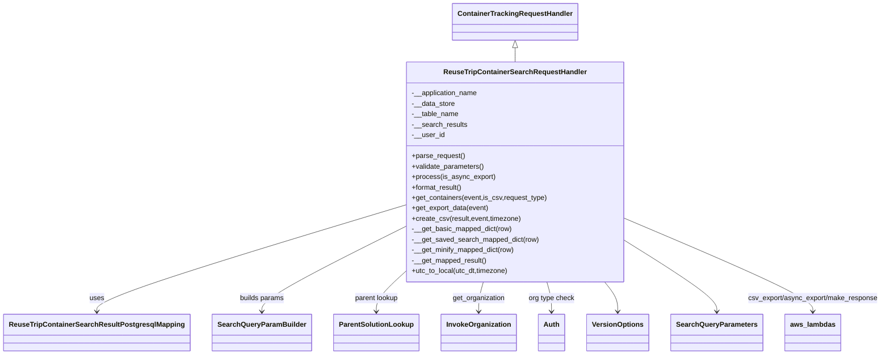
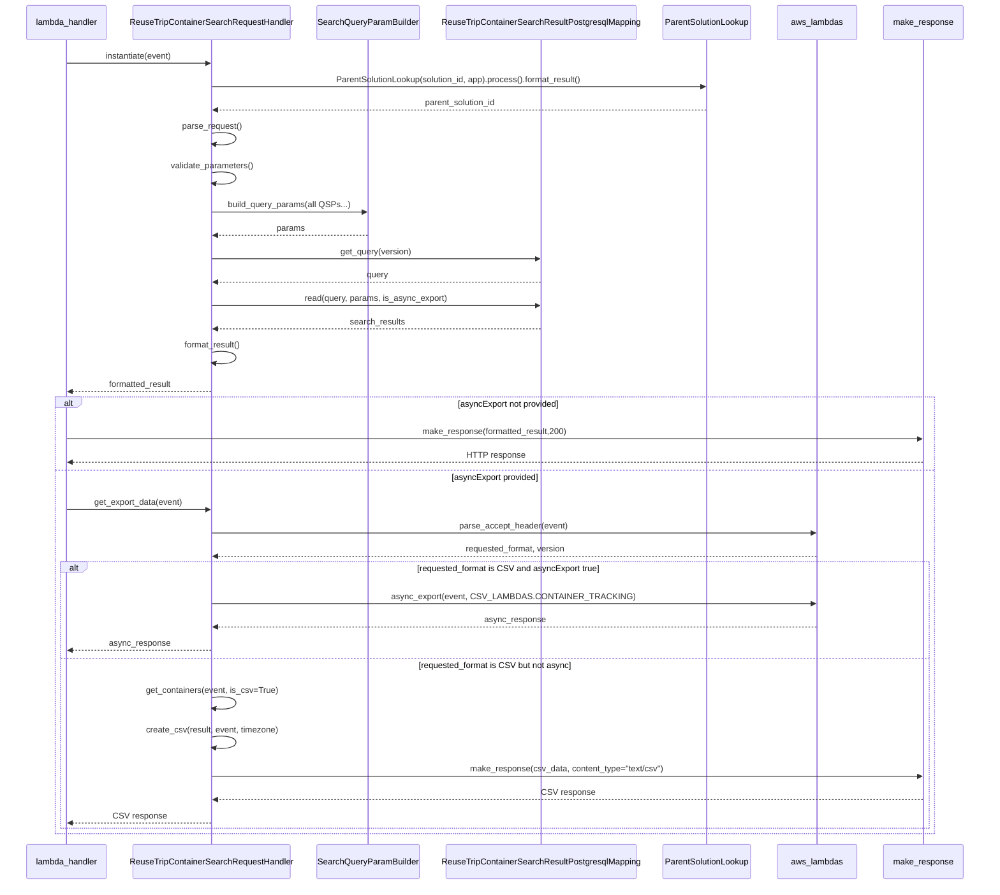

# Diagram: container_tracking_core/container_tracking_service/container_tracking_service/api/search/search_handler.py

> Auto-generated by Obscura crawlers

## Diagram 1

### SVG

<svg id="container" width="1946.6875" xmlns="http://www.w3.org/2000/svg" class="classDiagram" height="812" viewBox="0 0 1946.6875 812" role="graphics-document document" aria-roledescription="class"><g><defs><marker id="container_class-aggregationStart" class="marker aggregation class" refX="18" refY="7" markerWidth="190" markerHeight="240" orient="auto"><path d="M 18,7 L9,13 L1,7 L9,1 Z"></path></marker></defs><defs><marker id="container_class-aggregationEnd" class="marker aggregation class" refX="1" refY="7" markerWidth="20" markerHeight="28" orient="auto"><path d="M 18,7 L9,13 L1,7 L9,1 Z"></path></marker></defs><defs><marker id="container_class-extensionStart" class="marker extension class" refX="18" refY="7" markerWidth="190" markerHeight="240" orient="auto"><path d="M 1,7 L18,13 V 1 Z"></path></marker></defs><defs><marker id="container_class-extensionEnd" class="marker extension class" refX="1" refY="7" markerWidth="20" markerHeight="28" orient="auto"><path d="M 1,1 V 13 L18,7 Z"></path></marker></defs><defs><marker id="container_class-compositionStart" class="marker composition class" refX="18" refY="7" markerWidth="190" markerHeight="240" orient="auto"><path d="M 18,7 L9,13 L1,7 L9,1 Z"></path></marker></defs><defs><marker id="container_class-compositionEnd" class="marker composition class" refX="1" refY="7" markerWidth="20" markerHeight="28" orient="auto"><path d="M 18,7 L9,13 L1,7 L9,1 Z"></path></marker></defs><defs><marker id="container_class-dependencyStart" class="marker dependency class" refX="6" refY="7" markerWidth="190" markerHeight="240" orient="auto"><path d="M 5,7 L9,13 L1,7 L9,1 Z"></path></marker></defs><defs><marker id="container_class-dependencyEnd" class="marker dependency class" refX="13" refY="7" markerWidth="20" markerHeight="28" orient="auto"><path d="M 18,7 L9,13 L14,7 L9,1 Z"></path></marker></defs><defs><marker id="container_class-lollipopStart" class="marker lollipop class" refX="13" refY="7" markerWidth="190" markerHeight="240" orient="auto"><circle stroke="black" fill="transparent" cx="7" cy="7" r="6"></circle></marker></defs><defs><marker id="container_class-lollipopEnd" class="marker lollipop class" refX="1" refY="7" markerWidth="190" markerHeight="240" orient="auto"><circle stroke="black" fill="transparent" cx="7" cy="7" r="6"></circle></marker></defs><g class="root"><g class="clusters"></g><g class="edgePaths"><path d="M1129.746,109.25L1129.746,110.542C1129.746,111.833,1129.746,114.417,1129.746,119.875C1129.746,125.333,1129.746,133.667,1129.746,137.833L1129.746,142" id="id_ContainerTrackingRequestHandler_ReuseTripContainerSearchRequestHandler_1" class="edge-thickness-normal edge-pattern-solid relation" style=";;;" data-edge="true" data-et="edge" data-id="id_ContainerTrackingRequestHandler_ReuseTripContainerSearchRequestHandler_1" data-points="W3sieCI6MTEyOS43NDYwOTM3NSwieSI6OTJ9LHsieCI6MTEyOS43NDYwOTM3NSwieSI6MTE3fSx7IngiOjExMjkuNzQ2MDkzNzUsInkiOjE0Mn1d" marker-start="url(#container_class-extensionStart)"></path><path d="M884.734,471.008L772.322,506.34C659.909,541.672,435.083,612.336,322.671,652.835C210.258,693.333,210.258,703.667,210.258,708.833L210.258,714" id="id_ReuseTripContainerSearchRequestHandler_ReuseTripContainerSearchResultPostgresqlMapping_2" class="edge-thickness-normal edge-pattern-solid relation" style=";;;" data-edge="true" data-et="edge" data-id="id_ReuseTripContainerSearchRequestHandler_ReuseTripContainerSearchResultPostgresqlMapping_2" data-points="W3sieCI6ODg0LjczNDM3NSwieSI6NDcxLjAwODQ3MTA4NDAzNTM2fSx7IngiOjIxMC4yNTc4MTI1LCJ5Ijo2ODN9LHsieCI6MjEwLjI1NzgxMjUsInkiOjcyMH1d" marker-end="url(#container_class-dependencyEnd)"></path><path d="M884.734,520.605L832.355,547.671C779.977,574.737,675.219,628.868,622.84,661.101C570.461,693.333,570.461,703.667,570.461,708.833L570.461,714" id="id_ReuseTripContainerSearchRequestHandler_SearchQueryParamBuilder_3" class="edge-thickness-normal edge-pattern-solid relation" style=";;;" data-edge="true" data-et="edge" data-id="id_ReuseTripContainerSearchRequestHandler_SearchQueryParamBuilder_3" data-points="W3sieCI6ODg0LjczNDM3NSwieSI6NTIwLjYwNTE2MDA0NjY1NTZ9LHsieCI6NTcwLjQ2MDkzNzUsInkiOjY4M30seyJ4Ijo1NzAuNDYwOTM3NSwieSI6NzIwfV0=" marker-end="url(#container_class-dependencyEnd)"></path><path d="M884.734,624.116L874.285,633.93C863.836,643.744,842.938,663.372,832.488,678.353C822.039,693.333,822.039,703.667,822.039,708.833L822.039,714" id="id_ReuseTripContainerSearchRequestHandler_ParentSolutionLookup_4" class="edge-thickness-normal edge-pattern-solid relation" style=";;;" data-edge="true" data-et="edge" data-id="id_ReuseTripContainerSearchRequestHandler_ParentSolutionLookup_4" data-points="W3sieCI6ODg0LjczNDM3NSwieSI6NjI0LjExNjI0NTQxNDAzNzh9LHsieCI6ODIyLjAzOTA2MjUsInkiOjY4M30seyJ4Ijo4MjIuMDM5MDYyNSwieSI6NzIwfV0=" marker-end="url(#container_class-dependencyEnd)"></path><path d="M1059.092,646L1057.364,652.167C1055.635,658.333,1052.177,670.667,1050.448,682C1048.719,693.333,1048.719,703.667,1048.719,708.833L1048.719,714" id="id_ReuseTripContainerSearchRequestHandler_InvokeOrganization_5" class="edge-thickness-normal edge-pattern-solid relation" style=";;;" data-edge="true" data-et="edge" data-id="id_ReuseTripContainerSearchRequestHandler_InvokeOrganization_5" data-points="W3sieCI6MTA1OS4wOTI0OTI5NzE0NTMzLCJ5Ijo2NDZ9LHsieCI6MTA0OC43MTg3NSwieSI6NjgzfSx7IngiOjEwNDguNzE4NzUsInkiOjcyMH1d" marker-end="url(#container_class-dependencyEnd)"></path><path d="M1200.4,646L1202.129,652.167C1203.858,658.333,1207.316,670.667,1209.044,682C1210.773,693.333,1210.773,703.667,1210.773,708.833L1210.773,714" id="id_ReuseTripContainerSearchRequestHandler_Auth_6" class="edge-thickness-normal edge-pattern-solid relation" style=";;;" data-edge="true" data-et="edge" data-id="id_ReuseTripContainerSearchRequestHandler_Auth_6" data-points="W3sieCI6MTIwMC4zOTk2OTQ1Mjg1NDY3LCJ5Ijo2NDZ9LHsieCI6MTIxMC43NzM0Mzc1LCJ5Ijo2ODN9LHsieCI6MTIxMC43NzM0Mzc1LCJ5Ijo3MjB9XQ==" marker-end="url(#container_class-dependencyEnd)"></path><path d="M1328.675,646L1333.543,652.167C1338.411,658.333,1348.147,670.667,1353.015,682C1357.883,693.333,1357.883,703.667,1357.883,708.833L1357.883,714" id="id_ReuseTripContainerSearchRequestHandler_VersionOptions_7" class="edge-thickness-normal edge-pattern-solid relation" style=";;;" data-edge="true" data-et="edge" data-id="id_ReuseTripContainerSearchRequestHandler_VersionOptions_7" data-points="W3sieCI6MTMyOC42NzQ5OTcyOTY3MTI3LCJ5Ijo2NDZ9LHsieCI6MTM1Ny44ODI4MTI1LCJ5Ijo2ODN9LHsieCI6MTM1Ny44ODI4MTI1LCJ5Ijo3MjB9XQ==" marker-end="url(#container_class-dependencyEnd)"></path><path d="M1374.758,552.617L1408.324,574.348C1441.891,596.078,1509.023,639.539,1542.59,666.436C1576.156,693.333,1576.156,703.667,1576.156,708.833L1576.156,714" id="id_ReuseTripContainerSearchRequestHandler_SearchQueryParameters_8" class="edge-thickness-normal edge-pattern-solid relation" style=";;;" data-edge="true" data-et="edge" data-id="id_ReuseTripContainerSearchRequestHandler_SearchQueryParameters_8" data-points="W3sieCI6MTM3NC43NTc4MTI1LCJ5Ijo1NTIuNjE3MzI5MjE0ODMwMX0seyJ4IjoxNTc2LjE1NjI1LCJ5Ijo2ODN9LHsieCI6MTU3Ni4xNTYyNSwieSI6NzIwfV0=" marker-end="url(#container_class-dependencyEnd)"></path><path d="M1374.758,501.622L1443.578,531.852C1512.398,562.082,1650.039,622.541,1718.859,657.937C1787.68,693.333,1787.68,703.667,1787.68,708.833L1787.68,714" id="id_ReuseTripContainerSearchRequestHandler_aws_lambdas_9" class="edge-thickness-normal edge-pattern-solid relation" style=";;;" data-edge="true" data-et="edge" data-id="id_ReuseTripContainerSearchRequestHandler_aws_lambdas_9" data-points="W3sieCI6MTM3NC43NTc4MTI1LCJ5Ijo1MDEuNjIyMzkxMzY1MDF9LHsieCI6MTc4Ny42Nzk2ODc1LCJ5Ijo2ODN9LHsieCI6MTc4Ny42Nzk2ODc1LCJ5Ijo3MjB9XQ==" marker-end="url(#container_class-dependencyEnd)"></path></g><g class="edgeLabels"><g class="edgeLabel"><g class="label" data-id="id_ContainerTrackingRequestHandler_ReuseTripContainerSearchRequestHandler_1" transform="translate(0, 0)"><foreignObject width="0" height="0">

</foreignObject></g></g><g class="edgeLabel" transform="translate(210.2578125, 683)"><g class="label" data-id="id_ReuseTripContainerSearchRequestHandler_ReuseTripContainerSearchResultPostgresqlMapping_2" transform="translate(-16.4921875, -12)"><foreignObject width="32.984375" height="24">

uses

</foreignObject></g></g><g class="edgeLabel" transform="translate(570.4609375, 683)"><g class="label" data-id="id_ReuseTripContainerSearchRequestHandler_SearchQueryParamBuilder_3" transform="translate(-51.390625, -12)"><foreignObject width="102.78125" height="24">

builds params

</foreignObject></g></g><g class="edgeLabel" transform="translate(822.0390625, 683)"><g class="label" data-id="id_ReuseTripContainerSearchRequestHandler_ParentSolutionLookup_4" transform="translate(-51.03125, -12)"><foreignObject width="102.0625" height="24">

parent lookup

</foreignObject></g></g><g class="edgeLabel" transform="translate(1048.71875, 683)"><g class="label" data-id="id_ReuseTripContainerSearchRequestHandler_InvokeOrganization_5" transform="translate(-60.4609375, -12)"><foreignObject width="120.921875" height="24">

get_organization

</foreignObject></g></g><g class="edgeLabel" transform="translate(1210.7734375, 683)"><g class="label" data-id="id_ReuseTripContainerSearchRequestHandler_Auth_6" transform="translate(-52.734375, -12)"><foreignObject width="105.46875" height="24">

org type check

</foreignObject></g></g><g class="edgeLabel"><g class="label" data-id="id_ReuseTripContainerSearchRequestHandler_VersionOptions_7" transform="translate(0, 0)"><foreignObject width="0" height="0">

</foreignObject></g></g><g class="edgeLabel"><g class="label" data-id="id_ReuseTripContainerSearchRequestHandler_SearchQueryParameters_8" transform="translate(0, 0)"><foreignObject width="0" height="0">

</foreignObject></g></g><g class="edgeLabel" transform="translate(1787.6796875, 683)"><g class="label" data-id="id_ReuseTripContainerSearchRequestHandler_aws_lambdas_9" transform="translate(-151.0078125, -12)"><foreignObject width="302.015625" height="24">

csv_export/async_export/make_response

</foreignObject></g></g></g><g class="nodes"><g class="node default" id="classId-ReuseTripContainerSearchRequestHandler-0" transform="translate(1129.74609375, 394)"><g class="basic label-container"><path d="M-245.01171875 -252 L245.01171875 -252 L245.01171875 252 L-245.01171875 252" stroke="none" stroke-width="0" fill="#ECECFF" style=""></path><path d="M-245.01171875 -252 C-94.29222615567537 -252, 56.42726643864927 -252, 245.01171875 -252 M-245.01171875 -252 C-132.4402150690617 -252, -19.868711388123387 -252, 245.01171875 -252 M245.01171875 -252 C245.01171875 -56.56163988664704, 245.01171875 138.8767202267059, 245.01171875 252 M245.01171875 -252 C245.01171875 -95.31134209946526, 245.01171875 61.37731580106947, 245.01171875 252 M245.01171875 252 C60.40922530951926 252, -124.19326813096148 252, -245.01171875 252 M245.01171875 252 C81.76529920047824 252, -81.48112034904352 252, -245.01171875 252 M-245.01171875 252 C-245.01171875 68.39485819085624, -245.01171875 -115.21028361828752, -245.01171875 -252 M-245.01171875 252 C-245.01171875 95.55251511720473, -245.01171875 -60.89496976559053, -245.01171875 -252" stroke="#9370DB" stroke-width="1.3" fill="none" stroke-dasharray="0 0" style=""></path></g><g class="annotation-group text" transform="translate(0, -228)"></g><g class="label-group text" transform="translate(-155.7890625, -228)"><g class="label" style="font-weight: bolder" transform="translate(0,-12)"><foreignObject width="311.578125" height="24">

ReuseTripContainerSearchRequestHandler

</foreignObject></g></g><g class="members-group text" transform="translate(-233.01171875, -180)"><g class="label" style="" transform="translate(0,-12)"><foreignObject width="152.28125" height="24">

-__application_name

</foreignObject></g><g class="label" style="" transform="translate(0,12)"><foreignObject width="99.0625" height="24">

-__data_store

</foreignObject></g><g class="label" style="" transform="translate(0,36)"><foreignObject width="107.046875" height="24">

-__table_name

</foreignObject></g><g class="label" style="" transform="translate(0,60)"><foreignObject width="126.5625" height="24">

-__search_results

</foreignObject></g><g class="label" style="" transform="translate(0,84)"><foreignObject width="74.140625" height="24">

-__user_id

</foreignObject></g></g><g class="methods-group text" transform="translate(-233.01171875, -36)"><g class="label" style="" transform="translate(0,-12)"><foreignObject width="121.796875" height="24">

+parse_request()

</foreignObject></g><g class="label" style="" transform="translate(0,12)"><foreignObject width="166.546875" height="24">

+validate_parameters()

</foreignObject></g><g class="label" style="" transform="translate(0,36)"><foreignObject width="189.171875" height="24">

+process(is_async_export)

</foreignObject></g><g class="label" style="" transform="translate(0,60)"><foreignObject width="117.015625" height="24">

+format_result()

</foreignObject></g><g class="label" style="" transform="translate(0,84)"><foreignObject width="310.234375" height="24">

+get_containers(event,is_csv,request_type)

</foreignObject></g><g class="label" style="" transform="translate(0,108)"><foreignObject width="177.03125" height="24">

+get_export_data(event)

</foreignObject></g><g class="label" style="" transform="translate(0,132)"><foreignObject width="249.71875" height="24">

+create_csv(result,event,timezone)

</foreignObject></g><g class="label" style="" transform="translate(0,156)"><foreignObject width="230.609375" height="24">

-__get_basic_mapped_dict(row)

</foreignObject></g><g class="label" style="" transform="translate(0,180)"><foreignObject width="290.75" height="24">

-__get_saved_search_mapped_dict(row)

</foreignObject></g><g class="label" style="" transform="translate(0,204)"><foreignObject width="237.953125" height="24">

-__get_minify_mapped_dict(row)

</foreignObject></g><g class="label" style="" transform="translate(0,228)"><foreignObject width="172.75" height="24">

-__get_mapped_result()

</foreignObject></g><g class="label" style="" transform="translate(0,252)"><foreignObject width="222.4375" height="24">

+utc_to_local(utc_dt,timezone)

</foreignObject></g></g><g class="divider" style=""><path d="M-245.01171875 -204 C-124.93044248058747 -204, -4.849166211174946 -204, 245.01171875 -204 M-245.01171875 -204 C-84.33787907567282 -204, 76.33596059865437 -204, 245.01171875 -204" stroke="#9370DB" stroke-width="1.3" fill="none" stroke-dasharray="0 0" style=""></path></g><g class="divider" style=""><path d="M-245.01171875 -60 C-129.19988002910458 -60, -13.388041308209125 -60, 245.01171875 -60 M-245.01171875 -60 C-116.79717296929982 -60, 11.417372811400355 -60, 245.01171875 -60" stroke="#9370DB" stroke-width="1.3" fill="none" stroke-dasharray="0 0" style=""></path></g></g><g class="node default" id="classId-ContainerTrackingRequestHandler-1" transform="translate(1129.74609375, 50)"><g class="basic label-container"><path d="M-137.5859375 -42 L137.5859375 -42 L137.5859375 42 L-137.5859375 42" stroke="none" stroke-width="0" fill="#ECECFF" style=""></path><path d="M-137.5859375 -42 C-30.12527066698908 -42, 77.33539616602184 -42, 137.5859375 -42 M-137.5859375 -42 C-56.37490553369243 -42, 24.836126432615146 -42, 137.5859375 -42 M137.5859375 -42 C137.5859375 -20.05596597092653, 137.5859375 1.888068058146942, 137.5859375 42 M137.5859375 -42 C137.5859375 -19.833221636328478, 137.5859375 2.333556727343044, 137.5859375 42 M137.5859375 42 C27.556399231862997 42, -82.473139036274 42, -137.5859375 42 M137.5859375 42 C49.11600334762696 42, -39.353930804746085 42, -137.5859375 42 M-137.5859375 42 C-137.5859375 23.994081377923063, -137.5859375 5.988162755846126, -137.5859375 -42 M-137.5859375 42 C-137.5859375 21.417446125650443, -137.5859375 0.8348922513008858, -137.5859375 -42" stroke="#9370DB" stroke-width="1.3" fill="none" stroke-dasharray="0 0" style=""></path></g><g class="annotation-group text" transform="translate(0, -18)"></g><g class="label-group text" transform="translate(-125.5859375, -18)"><g class="label" style="font-weight: bolder" transform="translate(0,-12)"><foreignObject width="251.171875" height="24">

ContainerTrackingRequestHandler

</foreignObject></g></g><g class="members-group text" transform="translate(-125.5859375, 30)"></g><g class="methods-group text" transform="translate(-125.5859375, 60)"></g><g class="divider" style=""><path d="M-137.5859375 6 C-61.35020576738603 6, 14.885525965227941 6, 137.5859375 6 M-137.5859375 6 C-81.45921433218794 6, -25.332491164375895 6, 137.5859375 6" stroke="#9370DB" stroke-width="1.3" fill="none" stroke-dasharray="0 0" style=""></path></g><g class="divider" style=""><path d="M-137.5859375 24 C-71.00013597603969 24, -4.414334452079373 24, 137.5859375 24 M-137.5859375 24 C-75.42871515938941 24, -13.27149281877881 24, 137.5859375 24" stroke="#9370DB" stroke-width="1.3" fill="none" stroke-dasharray="0 0" style=""></path></g></g><g class="node default" id="classId-ReuseTripContainerSearchResultPostgresqlMapping-2" transform="translate(210.2578125, 762)"><g class="basic label-container"><path d="M-202.2578125 -42 L202.2578125 -42 L202.2578125 42 L-202.2578125 42" stroke="none" stroke-width="0" fill="#ECECFF" style=""></path><path d="M-202.2578125 -42 C-45.88286374508738 -42, 110.49208500982525 -42, 202.2578125 -42 M-202.2578125 -42 C-108.06140459854204 -42, -13.86499669708408 -42, 202.2578125 -42 M202.2578125 -42 C202.2578125 -14.572394530392092, 202.2578125 12.855210939215816, 202.2578125 42 M202.2578125 -42 C202.2578125 -24.828332483644164, 202.2578125 -7.656664967288329, 202.2578125 42 M202.2578125 42 C45.908599289192495 42, -110.44061392161501 42, -202.2578125 42 M202.2578125 42 C63.75755222106051 42, -74.74270805787899 42, -202.2578125 42 M-202.2578125 42 C-202.2578125 22.67731456948489, -202.2578125 3.354629138969777, -202.2578125 -42 M-202.2578125 42 C-202.2578125 17.718066973050227, -202.2578125 -6.563866053899545, -202.2578125 -42" stroke="#9370DB" stroke-width="1.3" fill="none" stroke-dasharray="0 0" style=""></path></g><g class="annotation-group text" transform="translate(0, -18)"></g><g class="label-group text" transform="translate(-190.2578125, -18)"><g class="label" style="font-weight: bolder" transform="translate(0,-12)"><foreignObject width="380.515625" height="24">

ReuseTripContainerSearchResultPostgresqlMapping

</foreignObject></g></g><g class="members-group text" transform="translate(-190.2578125, 30)"></g><g class="methods-group text" transform="translate(-190.2578125, 60)"></g><g class="divider" style=""><path d="M-202.2578125 6 C-59.33545236223762 6, 83.58690777552476 6, 202.2578125 6 M-202.2578125 6 C-111.96476852150597 6, -21.671724543011948 6, 202.2578125 6" stroke="#9370DB" stroke-width="1.3" fill="none" stroke-dasharray="0 0" style=""></path></g><g class="divider" style=""><path d="M-202.2578125 24 C-66.62086384727354 24, 69.01608480545292 24, 202.2578125 24 M-202.2578125 24 C-55.15708183277215 24, 91.9436488344557 24, 202.2578125 24" stroke="#9370DB" stroke-width="1.3" fill="none" stroke-dasharray="0 0" style=""></path></g></g><g class="node default" id="classId-SearchQueryParamBuilder-3" transform="translate(570.4609375, 762)"><g class="basic label-container"><path d="M-107.9453125 -42 L107.9453125 -42 L107.9453125 42 L-107.9453125 42" stroke="none" stroke-width="0" fill="#ECECFF" style=""></path><path d="M-107.9453125 -42 C-23.588845802842997 -42, 60.76762089431401 -42, 107.9453125 -42 M-107.9453125 -42 C-35.778846112204135 -42, 36.38762027559173 -42, 107.9453125 -42 M107.9453125 -42 C107.9453125 -8.732068659489507, 107.9453125 24.535862681020987, 107.9453125 42 M107.9453125 -42 C107.9453125 -24.324128631653146, 107.9453125 -6.6482572633062915, 107.9453125 42 M107.9453125 42 C41.68094637861499 42, -24.58341974277002 42, -107.9453125 42 M107.9453125 42 C51.74901835100386 42, -4.447275797992276 42, -107.9453125 42 M-107.9453125 42 C-107.9453125 20.667382882285118, -107.9453125 -0.6652342354297645, -107.9453125 -42 M-107.9453125 42 C-107.9453125 8.763086578224168, -107.9453125 -24.473826843551663, -107.9453125 -42" stroke="#9370DB" stroke-width="1.3" fill="none" stroke-dasharray="0 0" style=""></path></g><g class="annotation-group text" transform="translate(0, -18)"></g><g class="label-group text" transform="translate(-95.9453125, -18)"><g class="label" style="font-weight: bolder" transform="translate(0,-12)"><foreignObject width="191.890625" height="24">

SearchQueryParamBuilder

</foreignObject></g></g><g class="members-group text" transform="translate(-95.9453125, 30)"></g><g class="methods-group text" transform="translate(-95.9453125, 60)"></g><g class="divider" style=""><path d="M-107.9453125 6 C-60.86880839456556 6, -13.792304289131124 6, 107.9453125 6 M-107.9453125 6 C-50.100471076383485 6, 7.74437034723303 6, 107.9453125 6" stroke="#9370DB" stroke-width="1.3" fill="none" stroke-dasharray="0 0" style=""></path></g><g class="divider" style=""><path d="M-107.9453125 24 C-45.51741459499077 24, 16.910483310018463 24, 107.9453125 24 M-107.9453125 24 C-58.7776179937148 24, -9.609923487429597 24, 107.9453125 24" stroke="#9370DB" stroke-width="1.3" fill="none" stroke-dasharray="0 0" style=""></path></g></g><g class="node default" id="classId-ParentSolutionLookup-4" transform="translate(822.0390625, 762)"><g class="basic label-container"><path d="M-93.6328125 -42 L93.6328125 -42 L93.6328125 42 L-93.6328125 42" stroke="none" stroke-width="0" fill="#ECECFF" style=""></path><path d="M-93.6328125 -42 C-47.16126266338259 -42, -0.6897128267651738 -42, 93.6328125 -42 M-93.6328125 -42 C-51.99010230673137 -42, -10.347392113462746 -42, 93.6328125 -42 M93.6328125 -42 C93.6328125 -23.63926104464305, 93.6328125 -5.278522089286099, 93.6328125 42 M93.6328125 -42 C93.6328125 -23.791872981014468, 93.6328125 -5.583745962028935, 93.6328125 42 M93.6328125 42 C43.06954893364758 42, -7.493714632704837 42, -93.6328125 42 M93.6328125 42 C21.565209328230537 42, -50.502393843538925 42, -93.6328125 42 M-93.6328125 42 C-93.6328125 9.20311801172091, -93.6328125 -23.59376397655818, -93.6328125 -42 M-93.6328125 42 C-93.6328125 13.616884416942518, -93.6328125 -14.766231166114963, -93.6328125 -42" stroke="#9370DB" stroke-width="1.3" fill="none" stroke-dasharray="0 0" style=""></path></g><g class="annotation-group text" transform="translate(0, -18)"></g><g class="label-group text" transform="translate(-81.6328125, -18)"><g class="label" style="font-weight: bolder" transform="translate(0,-12)"><foreignObject width="163.265625" height="24">

ParentSolutionLookup

</foreignObject></g></g><g class="members-group text" transform="translate(-81.6328125, 30)"></g><g class="methods-group text" transform="translate(-81.6328125, 60)"></g><g class="divider" style=""><path d="M-93.6328125 6 C-20.265488525488706 6, 53.10183544902259 6, 93.6328125 6 M-93.6328125 6 C-41.78771742744304 6, 10.057377645113917 6, 93.6328125 6" stroke="#9370DB" stroke-width="1.3" fill="none" stroke-dasharray="0 0" style=""></path></g><g class="divider" style=""><path d="M-93.6328125 24 C-31.946987921271074 24, 29.738836657457853 24, 93.6328125 24 M-93.6328125 24 C-37.71081833873908 24, 18.211175822521838 24, 93.6328125 24" stroke="#9370DB" stroke-width="1.3" fill="none" stroke-dasharray="0 0" style=""></path></g></g><g class="node default" id="classId-InvokeOrganization-5" transform="translate(1048.71875, 762)"><g class="basic label-container"><path d="M-83.046875 -42 L83.046875 -42 L83.046875 42 L-83.046875 42" stroke="none" stroke-width="0" fill="#ECECFF" style=""></path><path d="M-83.046875 -42 C-31.99166743248746 -42, 19.06354013502508 -42, 83.046875 -42 M-83.046875 -42 C-27.051512427944623 -42, 28.943850144110755 -42, 83.046875 -42 M83.046875 -42 C83.046875 -23.687697193716694, 83.046875 -5.3753943874333885, 83.046875 42 M83.046875 -42 C83.046875 -18.40479653341938, 83.046875 5.190406933161242, 83.046875 42 M83.046875 42 C34.64384599788902 42, -13.759183004221967 42, -83.046875 42 M83.046875 42 C48.63691068569351 42, 14.226946371387015 42, -83.046875 42 M-83.046875 42 C-83.046875 18.02776973806578, -83.046875 -5.944460523868443, -83.046875 -42 M-83.046875 42 C-83.046875 16.821146159888947, -83.046875 -8.357707680222106, -83.046875 -42" stroke="#9370DB" stroke-width="1.3" fill="none" stroke-dasharray="0 0" style=""></path></g><g class="annotation-group text" transform="translate(0, -18)"></g><g class="label-group text" transform="translate(-71.046875, -18)"><g class="label" style="font-weight: bolder" transform="translate(0,-12)"><foreignObject width="142.09375" height="24">

InvokeOrganization

</foreignObject></g></g><g class="members-group text" transform="translate(-71.046875, 30)"></g><g class="methods-group text" transform="translate(-71.046875, 60)"></g><g class="divider" style=""><path d="M-83.046875 6 C-40.5019186044296 6, 2.0430377911408044 6, 83.046875 6 M-83.046875 6 C-48.04959596365326 6, -13.05231692730652 6, 83.046875 6" stroke="#9370DB" stroke-width="1.3" fill="none" stroke-dasharray="0 0" style=""></path></g><g class="divider" style=""><path d="M-83.046875 24 C-36.17651756475496 24, 10.69383987049008 24, 83.046875 24 M-83.046875 24 C-18.54793499634563 24, 45.95100500730874 24, 83.046875 24" stroke="#9370DB" stroke-width="1.3" fill="none" stroke-dasharray="0 0" style=""></path></g></g><g class="node default" id="classId-Auth-6" transform="translate(1210.7734375, 762)"><g class="basic label-container"><path d="M-29.0078125 -42 L29.0078125 -42 L29.0078125 42 L-29.0078125 42" stroke="none" stroke-width="0" fill="#ECECFF" style=""></path><path d="M-29.0078125 -42 C-15.713580925062052 -42, -2.4193493501241043 -42, 29.0078125 -42 M-29.0078125 -42 C-8.826307741822038 -42, 11.355197016355923 -42, 29.0078125 -42 M29.0078125 -42 C29.0078125 -20.568967242197857, 29.0078125 0.8620655156042858, 29.0078125 42 M29.0078125 -42 C29.0078125 -14.358289294382871, 29.0078125 13.283421411234258, 29.0078125 42 M29.0078125 42 C13.77718851539807 42, -1.4534354692038605 42, -29.0078125 42 M29.0078125 42 C6.6513383711541465 42, -15.705135757691707 42, -29.0078125 42 M-29.0078125 42 C-29.0078125 12.639414206680819, -29.0078125 -16.721171586638363, -29.0078125 -42 M-29.0078125 42 C-29.0078125 16.824598832808295, -29.0078125 -8.35080233438341, -29.0078125 -42" stroke="#9370DB" stroke-width="1.3" fill="none" stroke-dasharray="0 0" style=""></path></g><g class="annotation-group text" transform="translate(0, -18)"></g><g class="label-group text" transform="translate(-17.0078125, -18)"><g class="label" style="font-weight: bolder" transform="translate(0,-12)"><foreignObject width="34.015625" height="24">

Auth

</foreignObject></g></g><g class="members-group text" transform="translate(-17.0078125, 30)"></g><g class="methods-group text" transform="translate(-17.0078125, 60)"></g><g class="divider" style=""><path d="M-29.0078125 6 C-13.3807698150956 6, 2.2462728698087986 6, 29.0078125 6 M-29.0078125 6 C-13.924608378173682 6, 1.1585957436526364 6, 29.0078125 6" stroke="#9370DB" stroke-width="1.3" fill="none" stroke-dasharray="0 0" style=""></path></g><g class="divider" style=""><path d="M-29.0078125 24 C-9.99287529995776 24, 9.02206190008448 24, 29.0078125 24 M-29.0078125 24 C-8.128776593887348 24, 12.750259312225303 24, 29.0078125 24" stroke="#9370DB" stroke-width="1.3" fill="none" stroke-dasharray="0 0" style=""></path></g></g><g class="node default" id="classId-VersionOptions-7" transform="translate(1357.8828125, 762)"><g class="basic label-container"><path d="M-68.1015625 -42 L68.1015625 -42 L68.1015625 42 L-68.1015625 42" stroke="none" stroke-width="0" fill="#ECECFF" style=""></path><path d="M-68.1015625 -42 C-14.721884853054227 -42, 38.657792793891545 -42, 68.1015625 -42 M-68.1015625 -42 C-20.81990188101109 -42, 26.461758737977817 -42, 68.1015625 -42 M68.1015625 -42 C68.1015625 -8.440735838155014, 68.1015625 25.118528323689972, 68.1015625 42 M68.1015625 -42 C68.1015625 -25.02508588242053, 68.1015625 -8.05017176484106, 68.1015625 42 M68.1015625 42 C37.80537556029896 42, 7.509188620597925 42, -68.1015625 42 M68.1015625 42 C36.255973370796056 42, 4.410384241592112 42, -68.1015625 42 M-68.1015625 42 C-68.1015625 13.404301748483991, -68.1015625 -15.191396503032017, -68.1015625 -42 M-68.1015625 42 C-68.1015625 11.833563460840121, -68.1015625 -18.332873078319757, -68.1015625 -42" stroke="#9370DB" stroke-width="1.3" fill="none" stroke-dasharray="0 0" style=""></path></g><g class="annotation-group text" transform="translate(0, -18)"></g><g class="label-group text" transform="translate(-56.1015625, -18)"><g class="label" style="font-weight: bolder" transform="translate(0,-12)"><foreignObject width="112.203125" height="24">

VersionOptions

</foreignObject></g></g><g class="members-group text" transform="translate(-56.1015625, 30)"></g><g class="methods-group text" transform="translate(-56.1015625, 60)"></g><g class="divider" style=""><path d="M-68.1015625 6 C-24.37554458167233 6, 19.35047333665534 6, 68.1015625 6 M-68.1015625 6 C-29.861847550188763 6, 8.377867399622474 6, 68.1015625 6" stroke="#9370DB" stroke-width="1.3" fill="none" stroke-dasharray="0 0" style=""></path></g><g class="divider" style=""><path d="M-68.1015625 24 C-20.67541524048349 24, 26.750732019033023 24, 68.1015625 24 M-68.1015625 24 C-31.612544538214003 24, 4.876473423571994 24, 68.1015625 24" stroke="#9370DB" stroke-width="1.3" fill="none" stroke-dasharray="0 0" style=""></path></g></g><g class="node default" id="classId-SearchQueryParameters-8" transform="translate(1576.15625, 762)"><g class="basic label-container"><path d="M-100.171875 -42 L100.171875 -42 L100.171875 42 L-100.171875 42" stroke="none" stroke-width="0" fill="#ECECFF" style=""></path><path d="M-100.171875 -42 C-45.41540335806215 -42, 9.3410682838757 -42, 100.171875 -42 M-100.171875 -42 C-49.31076294875835 -42, 1.5503491024832954 -42, 100.171875 -42 M100.171875 -42 C100.171875 -11.843273436044473, 100.171875 18.313453127911053, 100.171875 42 M100.171875 -42 C100.171875 -16.4168594952736, 100.171875 9.166281009452803, 100.171875 42 M100.171875 42 C50.3078766031365 42, 0.44387820627299845 42, -100.171875 42 M100.171875 42 C53.02526458060303 42, 5.878654161206057 42, -100.171875 42 M-100.171875 42 C-100.171875 20.720992919333764, -100.171875 -0.5580141613324727, -100.171875 -42 M-100.171875 42 C-100.171875 21.009473085587093, -100.171875 0.018946171174185622, -100.171875 -42" stroke="#9370DB" stroke-width="1.3" fill="none" stroke-dasharray="0 0" style=""></path></g><g class="annotation-group text" transform="translate(0, -18)"></g><g class="label-group text" transform="translate(-88.171875, -18)"><g class="label" style="font-weight: bolder" transform="translate(0,-12)"><foreignObject width="176.34375" height="24">

SearchQueryParameters

</foreignObject></g></g><g class="members-group text" transform="translate(-88.171875, 30)"></g><g class="methods-group text" transform="translate(-88.171875, 60)"></g><g class="divider" style=""><path d="M-100.171875 6 C-28.803797350214097 6, 42.564280299571806 6, 100.171875 6 M-100.171875 6 C-41.906407734681075 6, 16.35905953063785 6, 100.171875 6" stroke="#9370DB" stroke-width="1.3" fill="none" stroke-dasharray="0 0" style=""></path></g><g class="divider" style=""><path d="M-100.171875 24 C-26.247815240222565 24, 47.67624451955487 24, 100.171875 24 M-100.171875 24 C-51.64937181194613 24, -3.126868623892264 24, 100.171875 24" stroke="#9370DB" stroke-width="1.3" fill="none" stroke-dasharray="0 0" style=""></path></g></g><g class="node default" id="classId-aws_lambdas-9" transform="translate(1787.6796875, 762)"><g class="basic label-container"><path d="M-61.3515625 -42 L61.3515625 -42 L61.3515625 42 L-61.3515625 42" stroke="none" stroke-width="0" fill="#ECECFF" style=""></path><path d="M-61.3515625 -42 C-21.594571309685016 -42, 18.16241988062997 -42, 61.3515625 -42 M-61.3515625 -42 C-30.746825914761967 -42, -0.14208932952393383 -42, 61.3515625 -42 M61.3515625 -42 C61.3515625 -21.869100762405647, 61.3515625 -1.738201524811295, 61.3515625 42 M61.3515625 -42 C61.3515625 -11.253317495050528, 61.3515625 19.493365009898945, 61.3515625 42 M61.3515625 42 C12.806956880922208 42, -35.737648738155585 42, -61.3515625 42 M61.3515625 42 C28.232498979855542 42, -4.886564540288916 42, -61.3515625 42 M-61.3515625 42 C-61.3515625 16.24951083425627, -61.3515625 -9.50097833148746, -61.3515625 -42 M-61.3515625 42 C-61.3515625 16.999674444085343, -61.3515625 -8.000651111829313, -61.3515625 -42" stroke="#9370DB" stroke-width="1.3" fill="none" stroke-dasharray="0 0" style=""></path></g><g class="annotation-group text" transform="translate(0, -18)"></g><g class="label-group text" transform="translate(-49.3515625, -18)"><g class="label" style="font-weight: bolder" transform="translate(0,-12)"><foreignObject width="98.703125" height="24">

aws_lambdas

</foreignObject></g></g><g class="members-group text" transform="translate(-49.3515625, 30)"></g><g class="methods-group text" transform="translate(-49.3515625, 60)"></g><g class="divider" style=""><path d="M-61.3515625 6 C-15.148532824642906 6, 31.054496850714187 6, 61.3515625 6 M-61.3515625 6 C-15.115231251811913 6, 31.121099996376174 6, 61.3515625 6" stroke="#9370DB" stroke-width="1.3" fill="none" stroke-dasharray="0 0" style=""></path></g><g class="divider" style=""><path d="M-61.3515625 24 C-17.23288370431319 24, 26.885795091373623 24, 61.3515625 24 M-61.3515625 24 C-33.90686883374424 24, -6.462175167488482 24, 61.3515625 24" stroke="#9370DB" stroke-width="1.3" fill="none" stroke-dasharray="0 0" style=""></path></g></g></g></g></g></svg>

## Diagram 2

### SVG

<svg id="container" width="1965" xmlns="http://www.w3.org/2000/svg" height="1769" viewBox="-50 -10 1965 1769" role="graphics-document document" aria-roledescription="sequence"><g><rect x="1715" y="1683" fill="#eaeaea" stroke="#666" width="150" height="65" name="ResponseMaker" rx="3" ry="3" class="actor actor-bottom"></rect><text x="1790" y="1715.5" dominant-baseline="central" alignment-baseline="central" class="actor actor-box" style="text-anchor: middle; font-size: 16px; font-weight: 400;"><tspan x="1790" dy="0">make_response</tspan></text></g><g><rect x="1515" y="1683" fill="#eaeaea" stroke="#666" width="150" height="65" name="AWS" rx="3" ry="3" class="actor actor-bottom"></rect><text x="1590" y="1715.5" dominant-baseline="central" alignment-baseline="central" class="actor actor-box" style="text-anchor: middle; font-size: 16px; font-weight: 400;"><tspan x="1590" dy="0">aws_lambdas</tspan></text></g><g><rect x="1284" y="1683" fill="#eaeaea" stroke="#666" width="181" height="65" name="ParentLookup" rx="3" ry="3" class="actor actor-bottom"></rect><text x="1374.5" y="1715.5" dominant-baseline="central" alignment-baseline="central" class="actor actor-box" style="text-anchor: middle; font-size: 16px; font-weight: 400;"><tspan x="1374.5" dy="0">ParentSolutionLookup</tspan></text></g><g><rect x="839" y="1683" fill="#eaeaea" stroke="#666" width="395" height="65" name="DataStore" rx="3" ry="3" class="actor actor-bottom"></rect><text x="1036.5" y="1715.5" dominant-baseline="central" alignment-baseline="central" class="actor actor-box" style="text-anchor: middle; font-size: 16px; font-weight: 400;"><tspan x="1036.5" dy="0">ReuseTripContainerSearchResultPostgresqlMapping</tspan></text></g><g><rect x="579" y="1683" fill="#eaeaea" stroke="#666" width="210" height="65" name="ParamBuilder" rx="3" ry="3" class="actor actor-bottom"></rect><text x="684" y="1715.5" dominant-baseline="central" alignment-baseline="central" class="actor actor-box" style="text-anchor: middle; font-size: 16px; font-weight: 400;"><tspan x="684" dy="0">SearchQueryParamBuilder</tspan></text></g><g><rect x="200" y="1683" fill="#eaeaea" stroke="#666" width="329" height="65" name="Req" rx="3" ry="3" class="actor actor-bottom"></rect><text x="364.5" y="1715.5" dominant-baseline="central" alignment-baseline="central" class="actor actor-box" style="text-anchor: middle; font-size: 16px; font-weight: 400;"><tspan x="364.5" dy="0">ReuseTripContainerSearchRequestHandler</tspan></text></g><g><rect x="0" y="1683" fill="#eaeaea" stroke="#666" width="150" height="65" name="Lambda" rx="3" ry="3" class="actor actor-bottom"></rect><text x="75" y="1715.5" dominant-baseline="central" alignment-baseline="central" class="actor actor-box" style="text-anchor: middle; font-size: 16px; font-weight: 400;"><tspan x="75" dy="0">lambda_handler</tspan></text></g><g><line id="actor6" x1="1790" y1="65" x2="1790" y2="1683" class="actor-line 200" stroke-width="0.5px" stroke="#999" name="ResponseMaker"></line><g id="root-6"><rect x="1715" y="0" fill="#eaeaea" stroke="#666" width="150" height="65" name="ResponseMaker" rx="3" ry="3" class="actor actor-top"></rect><text x="1790" y="32.5" dominant-baseline="central" alignment-baseline="central" class="actor actor-box" style="text-anchor: middle; font-size: 16px; font-weight: 400;"><tspan x="1790" dy="0">make_response</tspan></text></g></g><g><line id="actor5" x1="1590" y1="65" x2="1590" y2="1683" class="actor-line 200" stroke-width="0.5px" stroke="#999" name="AWS"></line><g id="root-5"><rect x="1515" y="0" fill="#eaeaea" stroke="#666" width="150" height="65" name="AWS" rx="3" ry="3" class="actor actor-top"></rect><text x="1590" y="32.5" dominant-baseline="central" alignment-baseline="central" class="actor actor-box" style="text-anchor: middle; font-size: 16px; font-weight: 400;"><tspan x="1590" dy="0">aws_lambdas</tspan></text></g></g><g><line id="actor4" x1="1374.5" y1="65" x2="1374.5" y2="1683" class="actor-line 200" stroke-width="0.5px" stroke="#999" name="ParentLookup"></line><g id="root-4"><rect x="1284" y="0" fill="#eaeaea" stroke="#666" width="181" height="65" name="ParentLookup" rx="3" ry="3" class="actor actor-top"></rect><text x="1374.5" y="32.5" dominant-baseline="central" alignment-baseline="central" class="actor actor-box" style="text-anchor: middle; font-size: 16px; font-weight: 400;"><tspan x="1374.5" dy="0">ParentSolutionLookup</tspan></text></g></g><g><line id="actor3" x1="1036.5" y1="65" x2="1036.5" y2="1683" class="actor-line 200" stroke-width="0.5px" stroke="#999" name="DataStore"></line><g id="root-3"><rect x="839" y="0" fill="#eaeaea" stroke="#666" width="395" height="65" name="DataStore" rx="3" ry="3" class="actor actor-top"></rect><text x="1036.5" y="32.5" dominant-baseline="central" alignment-baseline="central" class="actor actor-box" style="text-anchor: middle; font-size: 16px; font-weight: 400;"><tspan x="1036.5" dy="0">ReuseTripContainerSearchResultPostgresqlMapping</tspan></text></g></g><g><line id="actor2" x1="684" y1="65" x2="684" y2="1683" class="actor-line 200" stroke-width="0.5px" stroke="#999" name="ParamBuilder"></line><g id="root-2"><rect x="579" y="0" fill="#eaeaea" stroke="#666" width="210" height="65" name="ParamBuilder" rx="3" ry="3" class="actor actor-top"></rect><text x="684" y="32.5" dominant-baseline="central" alignment-baseline="central" class="actor actor-box" style="text-anchor: middle; font-size: 16px; font-weight: 400;"><tspan x="684" dy="0">SearchQueryParamBuilder</tspan></text></g></g><g><line id="actor1" x1="364.5" y1="65" x2="364.5" y2="1683" class="actor-line 200" stroke-width="0.5px" stroke="#999" name="Req"></line><g id="root-1"><rect x="200" y="0" fill="#eaeaea" stroke="#666" width="329" height="65" name="Req" rx="3" ry="3" class="actor actor-top"></rect><text x="364.5" y="32.5" dominant-baseline="central" alignment-baseline="central" class="actor actor-box" style="text-anchor: middle; font-size: 16px; font-weight: 400;"><tspan x="364.5" dy="0">ReuseTripContainerSearchRequestHandler</tspan></text></g></g><g><line id="actor0" x1="75" y1="65" x2="75" y2="1683" class="actor-line 200" stroke-width="0.5px" stroke="#999" name="Lambda"></line><g id="root-0"><rect x="0" y="0" fill="#eaeaea" stroke="#666" width="150" height="65" name="Lambda" rx="3" ry="3" class="actor actor-top"></rect><text x="75" y="32.5" dominant-baseline="central" alignment-baseline="central" class="actor actor-box" style="text-anchor: middle; font-size: 16px; font-weight: 400;"><tspan x="75" dy="0">lambda_handler</tspan></text></g></g><g></g><defs><symbol id="computer" width="24" height="24"><path transform="scale(.5)" d="M2 2v13h20v-13h-20zm18 11h-16v-9h16v9zm-10.228 6l.466-1h3.524l.467 1h-4.457zm14.228 3h-24l2-6h2.104l-1.33 4h18.45l-1.297-4h2.073l2 6zm-5-10h-14v-7h14v7z"></path></symbol></defs><defs><symbol id="database" fill-rule="evenodd" clip-rule="evenodd"><path transform="scale(.5)" d="M12.258.001l.256.004.255.005.253.008.251.01.249.012.247.015.246.016.242.019.241.02.239.023.236.024.233.027.231.028.229.031.225.032.223.034.22.036.217.038.214.04.211.041.208.043.205.045.201.046.198.048.194.05.191.051.187.053.183.054.18.056.175.057.172.059.168.06.163.061.16.063.155.064.15.066.074.033.073.033.071.034.07.034.069.035.068.035.067.035.066.035.064.036.064.036.062.036.06.036.06.037.058.037.058.037.055.038.055.038.053.038.052.038.051.039.05.039.048.039.047.039.045.04.044.04.043.04.041.04.04.041.039.041.037.041.036.041.034.041.033.042.032.042.03.042.029.042.027.042.026.043.024.043.023.043.021.043.02.043.018.044.017.043.015.044.013.044.012.044.011.045.009.044.007.045.006.045.004.045.002.045.001.045v17l-.001.045-.002.045-.004.045-.006.045-.007.045-.009.044-.011.045-.012.044-.013.044-.015.044-.017.043-.018.044-.02.043-.021.043-.023.043-.024.043-.026.043-.027.042-.029.042-.03.042-.032.042-.033.042-.034.041-.036.041-.037.041-.039.041-.04.041-.041.04-.043.04-.044.04-.045.04-.047.039-.048.039-.05.039-.051.039-.052.038-.053.038-.055.038-.055.038-.058.037-.058.037-.06.037-.06.036-.062.036-.064.036-.064.036-.066.035-.067.035-.068.035-.069.035-.07.034-.071.034-.073.033-.074.033-.15.066-.155.064-.16.063-.163.061-.168.06-.172.059-.175.057-.18.056-.183.054-.187.053-.191.051-.194.05-.198.048-.201.046-.205.045-.208.043-.211.041-.214.04-.217.038-.22.036-.223.034-.225.032-.229.031-.231.028-.233.027-.236.024-.239.023-.241.02-.242.019-.246.016-.247.015-.249.012-.251.01-.253.008-.255.005-.256.004-.258.001-.258-.001-.256-.004-.255-.005-.253-.008-.251-.01-.249-.012-.247-.015-.245-.016-.243-.019-.241-.02-.238-.023-.236-.024-.234-.027-.231-.028-.228-.031-.226-.032-.223-.034-.22-.036-.217-.038-.214-.04-.211-.041-.208-.043-.204-.045-.201-.046-.198-.048-.195-.05-.19-.051-.187-.053-.184-.054-.179-.056-.176-.057-.172-.059-.167-.06-.164-.061-.159-.063-.155-.064-.151-.066-.074-.033-.072-.033-.072-.034-.07-.034-.069-.035-.068-.035-.067-.035-.066-.035-.064-.036-.063-.036-.062-.036-.061-.036-.06-.037-.058-.037-.057-.037-.056-.038-.055-.038-.053-.038-.052-.038-.051-.039-.049-.039-.049-.039-.046-.039-.046-.04-.044-.04-.043-.04-.041-.04-.04-.041-.039-.041-.037-.041-.036-.041-.034-.041-.033-.042-.032-.042-.03-.042-.029-.042-.027-.042-.026-.043-.024-.043-.023-.043-.021-.043-.02-.043-.018-.044-.017-.043-.015-.044-.013-.044-.012-.044-.011-.045-.009-.044-.007-.045-.006-.045-.004-.045-.002-.045-.001-.045v-17l.001-.045.002-.045.004-.045.006-.045.007-.045.009-.044.011-.045.012-.044.013-.044.015-.044.017-.043.018-.044.02-.043.021-.043.023-.043.024-.043.026-.043.027-.042.029-.042.03-.042.032-.042.033-.042.034-.041.036-.041.037-.041.039-.041.04-.041.041-.04.043-.04.044-.04.046-.04.046-.039.049-.039.049-.039.051-.039.052-.038.053-.038.055-.038.056-.038.057-.037.058-.037.06-.037.061-.036.062-.036.063-.036.064-.036.066-.035.067-.035.068-.035.069-.035.07-.034.072-.034.072-.033.074-.033.151-.066.155-.064.159-.063.164-.061.167-.06.172-.059.176-.057.179-.056.184-.054.187-.053.19-.051.195-.05.198-.048.201-.046.204-.045.208-.043.211-.041.214-.04.217-.038.22-.036.223-.034.226-.032.228-.031.231-.028.234-.027.236-.024.238-.023.241-.02.243-.019.245-.016.247-.015.249-.012.251-.01.253-.008.255-.005.256-.004.258-.001.258.001zm-9.258 20.499v.01l.001.021.003.021.004.022.005.021.006.022.007.022.009.023.01.022.011.023.012.023.013.023.015.023.016.024.017.023.018.024.019.024.021.024.022.025.023.024.024.025.052.049.056.05.061.051.066.051.07.051.075.051.079.052.084.052.088.052.092.052.097.052.102.051.105.052.11.052.114.051.119.051.123.051.127.05.131.05.135.05.139.048.144.049.147.047.152.047.155.047.16.045.163.045.167.043.171.043.176.041.178.041.183.039.187.039.19.037.194.035.197.035.202.033.204.031.209.03.212.029.216.027.219.025.222.024.226.021.23.02.233.018.236.016.24.015.243.012.246.01.249.008.253.005.256.004.259.001.26-.001.257-.004.254-.005.25-.008.247-.011.244-.012.241-.014.237-.016.233-.018.231-.021.226-.021.224-.024.22-.026.216-.027.212-.028.21-.031.205-.031.202-.034.198-.034.194-.036.191-.037.187-.039.183-.04.179-.04.175-.042.172-.043.168-.044.163-.045.16-.046.155-.046.152-.047.148-.048.143-.049.139-.049.136-.05.131-.05.126-.05.123-.051.118-.052.114-.051.11-.052.106-.052.101-.052.096-.052.092-.052.088-.053.083-.051.079-.052.074-.052.07-.051.065-.051.06-.051.056-.05.051-.05.023-.024.023-.025.021-.024.02-.024.019-.024.018-.024.017-.024.015-.023.014-.024.013-.023.012-.023.01-.023.01-.022.008-.022.006-.022.006-.022.004-.022.004-.021.001-.021.001-.021v-4.127l-.077.055-.08.053-.083.054-.085.053-.087.052-.09.052-.093.051-.095.05-.097.05-.1.049-.102.049-.105.048-.106.047-.109.047-.111.046-.114.045-.115.045-.118.044-.12.043-.122.042-.124.042-.126.041-.128.04-.13.04-.132.038-.134.038-.135.037-.138.037-.139.035-.142.035-.143.034-.144.033-.147.032-.148.031-.15.03-.151.03-.153.029-.154.027-.156.027-.158.026-.159.025-.161.024-.162.023-.163.022-.165.021-.166.02-.167.019-.169.018-.169.017-.171.016-.173.015-.173.014-.175.013-.175.012-.177.011-.178.01-.179.008-.179.008-.181.006-.182.005-.182.004-.184.003-.184.002h-.37l-.184-.002-.184-.003-.182-.004-.182-.005-.181-.006-.179-.008-.179-.008-.178-.01-.176-.011-.176-.012-.175-.013-.173-.014-.172-.015-.171-.016-.17-.017-.169-.018-.167-.019-.166-.02-.165-.021-.163-.022-.162-.023-.161-.024-.159-.025-.157-.026-.156-.027-.155-.027-.153-.029-.151-.03-.15-.03-.148-.031-.146-.032-.145-.033-.143-.034-.141-.035-.14-.035-.137-.037-.136-.037-.134-.038-.132-.038-.13-.04-.128-.04-.126-.041-.124-.042-.122-.042-.12-.044-.117-.043-.116-.045-.113-.045-.112-.046-.109-.047-.106-.047-.105-.048-.102-.049-.1-.049-.097-.05-.095-.05-.093-.052-.09-.051-.087-.052-.085-.053-.083-.054-.08-.054-.077-.054v4.127zm0-5.654v.011l.001.021.003.021.004.021.005.022.006.022.007.022.009.022.01.022.011.023.012.023.013.023.015.024.016.023.017.024.018.024.019.024.021.024.022.024.023.025.024.024.052.05.056.05.061.05.066.051.07.051.075.052.079.051.084.052.088.052.092.052.097.052.102.052.105.052.11.051.114.051.119.052.123.05.127.051.131.05.135.049.139.049.144.048.147.048.152.047.155.046.16.045.163.045.167.044.171.042.176.042.178.04.183.04.187.038.19.037.194.036.197.034.202.033.204.032.209.03.212.028.216.027.219.025.222.024.226.022.23.02.233.018.236.016.24.014.243.012.246.01.249.008.253.006.256.003.259.001.26-.001.257-.003.254-.006.25-.008.247-.01.244-.012.241-.015.237-.016.233-.018.231-.02.226-.022.224-.024.22-.025.216-.027.212-.029.21-.03.205-.032.202-.033.198-.035.194-.036.191-.037.187-.039.183-.039.179-.041.175-.042.172-.043.168-.044.163-.045.16-.045.155-.047.152-.047.148-.048.143-.048.139-.05.136-.049.131-.05.126-.051.123-.051.118-.051.114-.052.11-.052.106-.052.101-.052.096-.052.092-.052.088-.052.083-.052.079-.052.074-.051.07-.052.065-.051.06-.05.056-.051.051-.049.023-.025.023-.024.021-.025.02-.024.019-.024.018-.024.017-.024.015-.023.014-.023.013-.024.012-.022.01-.023.01-.023.008-.022.006-.022.006-.022.004-.021.004-.022.001-.021.001-.021v-4.139l-.077.054-.08.054-.083.054-.085.052-.087.053-.09.051-.093.051-.095.051-.097.05-.1.049-.102.049-.105.048-.106.047-.109.047-.111.046-.114.045-.115.044-.118.044-.12.044-.122.042-.124.042-.126.041-.128.04-.13.039-.132.039-.134.038-.135.037-.138.036-.139.036-.142.035-.143.033-.144.033-.147.033-.148.031-.15.03-.151.03-.153.028-.154.028-.156.027-.158.026-.159.025-.161.024-.162.023-.163.022-.165.021-.166.02-.167.019-.169.018-.169.017-.171.016-.173.015-.173.014-.175.013-.175.012-.177.011-.178.009-.179.009-.179.007-.181.007-.182.005-.182.004-.184.003-.184.002h-.37l-.184-.002-.184-.003-.182-.004-.182-.005-.181-.007-.179-.007-.179-.009-.178-.009-.176-.011-.176-.012-.175-.013-.173-.014-.172-.015-.171-.016-.17-.017-.169-.018-.167-.019-.166-.02-.165-.021-.163-.022-.162-.023-.161-.024-.159-.025-.157-.026-.156-.027-.155-.028-.153-.028-.151-.03-.15-.03-.148-.031-.146-.033-.145-.033-.143-.033-.141-.035-.14-.036-.137-.036-.136-.037-.134-.038-.132-.039-.13-.039-.128-.04-.126-.041-.124-.042-.122-.043-.12-.043-.117-.044-.116-.044-.113-.046-.112-.046-.109-.046-.106-.047-.105-.048-.102-.049-.1-.049-.097-.05-.095-.051-.093-.051-.09-.051-.087-.053-.085-.052-.083-.054-.08-.054-.077-.054v4.139zm0-5.666v.011l.001.02.003.022.004.021.005.022.006.021.007.022.009.023.01.022.011.023.012.023.013.023.015.023.016.024.017.024.018.023.019.024.021.025.022.024.023.024.024.025.052.05.056.05.061.05.066.051.07.051.075.052.079.051.084.052.088.052.092.052.097.052.102.052.105.051.11.052.114.051.119.051.123.051.127.05.131.05.135.05.139.049.144.048.147.048.152.047.155.046.16.045.163.045.167.043.171.043.176.042.178.04.183.04.187.038.19.037.194.036.197.034.202.033.204.032.209.03.212.028.216.027.219.025.222.024.226.021.23.02.233.018.236.017.24.014.243.012.246.01.249.008.253.006.256.003.259.001.26-.001.257-.003.254-.006.25-.008.247-.01.244-.013.241-.014.237-.016.233-.018.231-.02.226-.022.224-.024.22-.025.216-.027.212-.029.21-.03.205-.032.202-.033.198-.035.194-.036.191-.037.187-.039.183-.039.179-.041.175-.042.172-.043.168-.044.163-.045.16-.045.155-.047.152-.047.148-.048.143-.049.139-.049.136-.049.131-.051.126-.05.123-.051.118-.052.114-.051.11-.052.106-.052.101-.052.096-.052.092-.052.088-.052.083-.052.079-.052.074-.052.07-.051.065-.051.06-.051.056-.05.051-.049.023-.025.023-.025.021-.024.02-.024.019-.024.018-.024.017-.024.015-.023.014-.024.013-.023.012-.023.01-.022.01-.023.008-.022.006-.022.006-.022.004-.022.004-.021.001-.021.001-.021v-4.153l-.077.054-.08.054-.083.053-.085.053-.087.053-.09.051-.093.051-.095.051-.097.05-.1.049-.102.048-.105.048-.106.048-.109.046-.111.046-.114.046-.115.044-.118.044-.12.043-.122.043-.124.042-.126.041-.128.04-.13.039-.132.039-.134.038-.135.037-.138.036-.139.036-.142.034-.143.034-.144.033-.147.032-.148.032-.15.03-.151.03-.153.028-.154.028-.156.027-.158.026-.159.024-.161.024-.162.023-.163.023-.165.021-.166.02-.167.019-.169.018-.169.017-.171.016-.173.015-.173.014-.175.013-.175.012-.177.01-.178.01-.179.009-.179.007-.181.006-.182.006-.182.004-.184.003-.184.001-.185.001-.185-.001-.184-.001-.184-.003-.182-.004-.182-.006-.181-.006-.179-.007-.179-.009-.178-.01-.176-.01-.176-.012-.175-.013-.173-.014-.172-.015-.171-.016-.17-.017-.169-.018-.167-.019-.166-.02-.165-.021-.163-.023-.162-.023-.161-.024-.159-.024-.157-.026-.156-.027-.155-.028-.153-.028-.151-.03-.15-.03-.148-.032-.146-.032-.145-.033-.143-.034-.141-.034-.14-.036-.137-.036-.136-.037-.134-.038-.132-.039-.13-.039-.128-.041-.126-.041-.124-.041-.122-.043-.12-.043-.117-.044-.116-.044-.113-.046-.112-.046-.109-.046-.106-.048-.105-.048-.102-.048-.1-.05-.097-.049-.095-.051-.093-.051-.09-.052-.087-.052-.085-.053-.083-.053-.08-.054-.077-.054v4.153zm8.74-8.179l-.257.004-.254.005-.25.008-.247.011-.244.012-.241.014-.237.016-.233.018-.231.021-.226.022-.224.023-.22.026-.216.027-.212.028-.21.031-.205.032-.202.033-.198.034-.194.036-.191.038-.187.038-.183.04-.179.041-.175.042-.172.043-.168.043-.163.045-.16.046-.155.046-.152.048-.148.048-.143.048-.139.049-.136.05-.131.05-.126.051-.123.051-.118.051-.114.052-.11.052-.106.052-.101.052-.096.052-.092.052-.088.052-.083.052-.079.052-.074.051-.07.052-.065.051-.06.05-.056.05-.051.05-.023.025-.023.024-.021.024-.02.025-.019.024-.018.024-.017.023-.015.024-.014.023-.013.023-.012.023-.01.023-.01.022-.008.022-.006.023-.006.021-.004.022-.004.021-.001.021-.001.021.001.021.001.021.004.021.004.022.006.021.006.023.008.022.01.022.01.023.012.023.013.023.014.023.015.024.017.023.018.024.019.024.02.025.021.024.023.024.023.025.051.05.056.05.06.05.065.051.07.052.074.051.079.052.083.052.088.052.092.052.096.052.101.052.106.052.11.052.114.052.118.051.123.051.126.051.131.05.136.05.139.049.143.048.148.048.152.048.155.046.16.046.163.045.168.043.172.043.175.042.179.041.183.04.187.038.191.038.194.036.198.034.202.033.205.032.21.031.212.028.216.027.22.026.224.023.226.022.231.021.233.018.237.016.241.014.244.012.247.011.25.008.254.005.257.004.26.001.26-.001.257-.004.254-.005.25-.008.247-.011.244-.012.241-.014.237-.016.233-.018.231-.021.226-.022.224-.023.22-.026.216-.027.212-.028.21-.031.205-.032.202-.033.198-.034.194-.036.191-.038.187-.038.183-.04.179-.041.175-.042.172-.043.168-.043.163-.045.16-.046.155-.046.152-.048.148-.048.143-.048.139-.049.136-.05.131-.05.126-.051.123-.051.118-.051.114-.052.11-.052.106-.052.101-.052.096-.052.092-.052.088-.052.083-.052.079-.052.074-.051.07-.052.065-.051.06-.05.056-.05.051-.05.023-.025.023-.024.021-.024.02-.025.019-.024.018-.024.017-.023.015-.024.014-.023.013-.023.012-.023.01-.023.01-.022.008-.022.006-.023.006-.021.004-.022.004-.021.001-.021.001-.021-.001-.021-.001-.021-.004-.021-.004-.022-.006-.021-.006-.023-.008-.022-.01-.022-.01-.023-.012-.023-.013-.023-.014-.023-.015-.024-.017-.023-.018-.024-.019-.024-.02-.025-.021-.024-.023-.024-.023-.025-.051-.05-.056-.05-.06-.05-.065-.051-.07-.052-.074-.051-.079-.052-.083-.052-.088-.052-.092-.052-.096-.052-.101-.052-.106-.052-.11-.052-.114-.052-.118-.051-.123-.051-.126-.051-.131-.05-.136-.05-.139-.049-.143-.048-.148-.048-.152-.048-.155-.046-.16-.046-.163-.045-.168-.043-.172-.043-.175-.042-.179-.041-.183-.04-.187-.038-.191-.038-.194-.036-.198-.034-.202-.033-.205-.032-.21-.031-.212-.028-.216-.027-.22-.026-.224-.023-.226-.022-.231-.021-.233-.018-.237-.016-.241-.014-.244-.012-.247-.011-.25-.008-.254-.005-.257-.004-.26-.001-.26.001z"></path></symbol></defs><defs><symbol id="clock" width="24" height="24"><path transform="scale(.5)" d="M12 2c5.514 0 10 4.486 10 10s-4.486 10-10 10-10-4.486-10-10 4.486-10 10-10zm0-2c-6.627 0-12 5.373-12 12s5.373 12 12 12 12-5.373 12-12-5.373-12-12-12zm5.848 12.459c.202.038.202.333.001.372-1.907.361-6.045 1.111-6.547 1.111-.719 0-1.301-.582-1.301-1.301 0-.512.77-5.447 1.125-7.445.034-.192.312-.181.343.014l.985 6.238 5.394 1.011z"></path></symbol></defs><defs><marker id="arrowhead" refX="7.9" refY="5" markerUnits="userSpaceOnUse" markerWidth="12" markerHeight="12" orient="auto-start-reverse"><path d="M -1 0 L 10 5 L 0 10 z"></path></marker></defs><defs><marker id="crosshead" markerWidth="15" markerHeight="8" orient="auto" refX="4" refY="4.5"><path fill="none" stroke="#000000" stroke-width="1pt" d="M 1,2 L 6,7 M 6,2 L 1,7" style="stroke-dasharray: 0, 0;"></path></marker></defs><defs><marker id="filled-head" refX="15.5" refY="7" markerWidth="20" markerHeight="28" orient="auto"><path d="M 18,7 L9,13 L14,7 L9,1 Z"></path></marker></defs><defs><marker id="sequencenumber" refX="15" refY="15" markerWidth="60" markerHeight="40" orient="auto"><circle cx="15" cy="15" r="6"></circle></marker></defs><g><line x1="64" y1="1119" x2="1801" y2="1119" class="loopLine"></line><line x1="1801" y1="1119" x2="1801" y2="1653" class="loopLine"></line><line x1="64" y1="1653" x2="1801" y2="1653" class="loopLine"></line><line x1="64" y1="1119" x2="64" y2="1653" class="loopLine"></line><line x1="64" y1="1313" x2="1801" y2="1313" class="loopLine" style="stroke-dasharray: 3, 3;"></line><polygon points="64,1119 114,1119 114,1132 105.6,1139 64,1139" class="labelBox"></polygon><text x="89" y="1132" text-anchor="middle" dominant-baseline="middle" alignment-baseline="middle" class="labelText" style="font-size: 16px; font-weight: 400;">alt</text><text x="957.5" y="1137" text-anchor="middle" class="loopText" style="font-size: 16px; font-weight: 400;"><tspan x="957.5">[requested_format is CSV and asyncExport true]</tspan></text><text x="932.5" y="1331" text-anchor="middle" class="loopText" style="font-size: 16px; font-weight: 400;">[requested_format is CSV but not async]</text></g><g><line x1="54" y1="789" x2="1811" y2="789" class="loopLine"></line><line x1="1811" y1="789" x2="1811" y2="1663" class="loopLine"></line><line x1="54" y1="1663" x2="1811" y2="1663" class="loopLine"></line><line x1="54" y1="789" x2="54" y2="1663" class="loopLine"></line><line x1="54" y1="935" x2="1811" y2="935" class="loopLine" style="stroke-dasharray: 3, 3;"></line><polygon points="54,789 104,789 104,802 95.6,809 54,809" class="labelBox"></polygon><text x="79" y="802" text-anchor="middle" dominant-baseline="middle" alignment-baseline="middle" class="labelText" style="font-size: 16px; font-weight: 400;">alt</text><text x="957.5" y="807" text-anchor="middle" class="loopText" style="font-size: 16px; font-weight: 400;"><tspan x="957.5">[asyncExport not provided]</tspan></text><text x="932.5" y="953" text-anchor="middle" class="loopText" style="font-size: 16px; font-weight: 400;">[asyncExport provided]</text></g><text x="218" y="80" text-anchor="middle" dominant-baseline="middle" alignment-baseline="middle" class="messageText" dy="1em" style="font-size: 16px; font-weight: 400;">instantiate(event)</text><line x1="76" y1="113" x2="360.5" y2="113" class="messageLine0" stroke-width="2" stroke="none" marker-end="url(#arrowhead)" style="fill: none;"></line><text x="868" y="128" text-anchor="middle" dominant-baseline="middle" alignment-baseline="middle" class="messageText" dy="1em" style="font-size: 16px; font-weight: 400;">ParentSolutionLookup(solution_id, app).process().format_result()</text><line x1="365.5" y1="161" x2="1370.5" y2="161" class="messageLine0" stroke-width="2" stroke="none" marker-end="url(#arrowhead)" style="fill: none;"></line><text x="871" y="176" text-anchor="middle" dominant-baseline="middle" alignment-baseline="middle" class="messageText" dy="1em" style="font-size: 16px; font-weight: 400;">parent_solution_id</text><line x1="1373.5" y1="209" x2="368.5" y2="209" class="messageLine1" stroke-width="2" stroke="none" marker-end="url(#arrowhead)" style="stroke-dasharray: 3, 3; fill: none;"></line><text x="366" y="224" text-anchor="middle" dominant-baseline="middle" alignment-baseline="middle" class="messageText" dy="1em" style="font-size: 16px; font-weight: 400;">parse_request()</text><path d="M 365.5,257 C 425.5,247 425.5,287 365.5,277" class="messageLine0" stroke-width="2" stroke="none" marker-end="url(#arrowhead)" style="fill: none;"></path><text x="366" y="302" text-anchor="middle" dominant-baseline="middle" alignment-baseline="middle" class="messageText" dy="1em" style="font-size: 16px; font-weight: 400;">validate_parameters()</text><path d="M 365.5,335 C 425.5,325 425.5,365 365.5,355" class="messageLine0" stroke-width="2" stroke="none" marker-end="url(#arrowhead)" style="fill: none;"></path><text x="523" y="380" text-anchor="middle" dominant-baseline="middle" alignment-baseline="middle" class="messageText" dy="1em" style="font-size: 16px; font-weight: 400;">build_query_params(all QSPs...)</text><line x1="365.5" y1="413" x2="680" y2="413" class="messageLine0" stroke-width="2" stroke="none" marker-end="url(#arrowhead)" style="fill: none;"></line><text x="526" y="428" text-anchor="middle" dominant-baseline="middle" alignment-baseline="middle" class="messageText" dy="1em" style="font-size: 16px; font-weight: 400;">params</text><line x1="683" y1="461" x2="368.5" y2="461" class="messageLine1" stroke-width="2" stroke="none" marker-end="url(#arrowhead)" style="stroke-dasharray: 3, 3; fill: none;"></line><text x="699" y="476" text-anchor="middle" dominant-baseline="middle" alignment-baseline="middle" class="messageText" dy="1em" style="font-size: 16px; font-weight: 400;">get_query(version)</text><line x1="365.5" y1="509" x2="1032.5" y2="509" class="messageLine0" stroke-width="2" stroke="none" marker-end="url(#arrowhead)" style="fill: none;"></line><text x="702" y="524" text-anchor="middle" dominant-baseline="middle" alignment-baseline="middle" class="messageText" dy="1em" style="font-size: 16px; font-weight: 400;">query</text><line x1="1035.5" y1="557" x2="368.5" y2="557" class="messageLine1" stroke-width="2" stroke="none" marker-end="url(#arrowhead)" style="stroke-dasharray: 3, 3; fill: none;"></line><text x="699" y="572" text-anchor="middle" dominant-baseline="middle" alignment-baseline="middle" class="messageText" dy="1em" style="font-size: 16px; font-weight: 400;">read(query, params, is_async_export)</text><line x1="365.5" y1="605" x2="1032.5" y2="605" class="messageLine0" stroke-width="2" stroke="none" marker-end="url(#arrowhead)" style="fill: none;"></line><text x="702" y="620" text-anchor="middle" dominant-baseline="middle" alignment-baseline="middle" class="messageText" dy="1em" style="font-size: 16px; font-weight: 400;">search_results</text><line x1="1035.5" y1="653" x2="368.5" y2="653" class="messageLine1" stroke-width="2" stroke="none" marker-end="url(#arrowhead)" style="stroke-dasharray: 3, 3; fill: none;"></line><text x="366" y="668" text-anchor="middle" dominant-baseline="middle" alignment-baseline="middle" class="messageText" dy="1em" style="font-size: 16px; font-weight: 400;">format_result()</text><path d="M 365.5,701 C 425.5,691 425.5,731 365.5,721" class="messageLine0" stroke-width="2" stroke="none" marker-end="url(#arrowhead)" style="fill: none;"></path><text x="221" y="746" text-anchor="middle" dominant-baseline="middle" alignment-baseline="middle" class="messageText" dy="1em" style="font-size: 16px; font-weight: 400;">formatted_result</text><line x1="363.5" y1="779" x2="79" y2="779" class="messageLine1" stroke-width="2" stroke="none" marker-end="url(#arrowhead)" style="stroke-dasharray: 3, 3; fill: none;"></line><text x="931" y="839" text-anchor="middle" dominant-baseline="middle" alignment-baseline="middle" class="messageText" dy="1em" style="font-size: 16px; font-weight: 400;">make_response(formatted_result,200)</text><line x1="76" y1="872" x2="1786" y2="872" class="messageLine0" stroke-width="2" stroke="none" marker-end="url(#arrowhead)" style="fill: none;"></line><text x="934" y="887" text-anchor="middle" dominant-baseline="middle" alignment-baseline="middle" class="messageText" dy="1em" style="font-size: 16px; font-weight: 400;">HTTP response</text><line x1="1789" y1="920" x2="79" y2="920" class="messageLine1" stroke-width="2" stroke="none" marker-end="url(#arrowhead)" style="stroke-dasharray: 3, 3; fill: none;"></line><text x="218" y="980" text-anchor="middle" dominant-baseline="middle" alignment-baseline="middle" class="messageText" dy="1em" style="font-size: 16px; font-weight: 400;">get_export_data(event)</text><line x1="76" y1="1013" x2="360.5" y2="1013" class="messageLine0" stroke-width="2" stroke="none" marker-end="url(#arrowhead)" style="fill: none;"></line><text x="976" y="1028" text-anchor="middle" dominant-baseline="middle" alignment-baseline="middle" class="messageText" dy="1em" style="font-size: 16px; font-weight: 400;">parse_accept_header(event)</text><line x1="365.5" y1="1061" x2="1586" y2="1061" class="messageLine0" stroke-width="2" stroke="none" marker-end="url(#arrowhead)" style="fill: none;"></line><text x="979" y="1076" text-anchor="middle" dominant-baseline="middle" alignment-baseline="middle" class="messageText" dy="1em" style="font-size: 16px; font-weight: 400;">requested_format, version</text><line x1="1589" y1="1109" x2="368.5" y2="1109" class="messageLine1" stroke-width="2" stroke="none" marker-end="url(#arrowhead)" style="stroke-dasharray: 3, 3; fill: none;"></line><text x="976" y="1169" text-anchor="middle" dominant-baseline="middle" alignment-baseline="middle" class="messageText" dy="1em" style="font-size: 16px; font-weight: 400;">async_export(event, CSV_LAMBDAS.CONTAINER_TRACKING)</text><line x1="365.5" y1="1202" x2="1586" y2="1202" class="messageLine0" stroke-width="2" stroke="none" marker-end="url(#arrowhead)" style="fill: none;"></line><text x="979" y="1217" text-anchor="middle" dominant-baseline="middle" alignment-baseline="middle" class="messageText" dy="1em" style="font-size: 16px; font-weight: 400;">async_response</text><line x1="1589" y1="1250" x2="368.5" y2="1250" class="messageLine1" stroke-width="2" stroke="none" marker-end="url(#arrowhead)" style="stroke-dasharray: 3, 3; fill: none;"></line><text x="221" y="1265" text-anchor="middle" dominant-baseline="middle" alignment-baseline="middle" class="messageText" dy="1em" style="font-size: 16px; font-weight: 400;">async_response</text><line x1="363.5" y1="1298" x2="79" y2="1298" class="messageLine1" stroke-width="2" stroke="none" marker-end="url(#arrowhead)" style="stroke-dasharray: 3, 3; fill: none;"></line><text x="366" y="1358" text-anchor="middle" dominant-baseline="middle" alignment-baseline="middle" class="messageText" dy="1em" style="font-size: 16px; font-weight: 400;">get_containers(event, is_csv=True)</text><path d="M 365.5,1391 C 425.5,1381 425.5,1421 365.5,1411" class="messageLine0" stroke-width="2" stroke="none" marker-end="url(#arrowhead)" style="fill: none;"></path><text x="366" y="1436" text-anchor="middle" dominant-baseline="middle" alignment-baseline="middle" class="messageText" dy="1em" style="font-size: 16px; font-weight: 400;">create_csv(result, event, timezone)</text><path d="M 365.5,1469 C 425.5,1459 425.5,1499 365.5,1489" class="messageLine0" stroke-width="2" stroke="none" marker-end="url(#arrowhead)" style="fill: none;"></path><text x="1076" y="1514" text-anchor="middle" dominant-baseline="middle" alignment-baseline="middle" class="messageText" dy="1em" style="font-size: 16px; font-weight: 400;">make_response(csv_data, content_type="text/csv")</text><line x1="365.5" y1="1547" x2="1786" y2="1547" class="messageLine0" stroke-width="2" stroke="none" marker-end="url(#arrowhead)" style="fill: none;"></line><text x="1079" y="1562" text-anchor="middle" dominant-baseline="middle" alignment-baseline="middle" class="messageText" dy="1em" style="font-size: 16px; font-weight: 400;">CSV response</text><line x1="1789" y1="1595" x2="368.5" y2="1595" class="messageLine1" stroke-width="2" stroke="none" marker-end="url(#arrowhead)" style="stroke-dasharray: 3, 3; fill: none;"></line><text x="221" y="1610" text-anchor="middle" dominant-baseline="middle" alignment-baseline="middle" class="messageText" dy="1em" style="font-size: 16px; font-weight: 400;">CSV response</text><line x1="363.5" y1="1643" x2="79" y2="1643" class="messageLine1" stroke-width="2" stroke="none" marker-end="url(#arrowhead)" style="stroke-dasharray: 3, 3; fill: none;"></line></svg>
