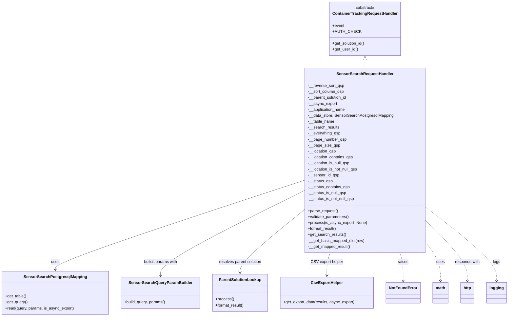

# Diagram: container_tracking_core/container_tracking_service/container_tracking_service/api/sensors/search/sensor_search.py


> Auto-generated by Obscura crawlers

## Diagram 1



> SVG rendering failed for this diagram.

## Diagram 2

```mermaid
graph TD
L1[lambda_handler(event, context, audit_refs)] --> L2[Instantiate SensorSearchRequestHandler]
L2 --> L3{No queryStringParameters OR "asyncExport" not in queryStringParameters}
L3 -- Yes --> L4[request_handler.parse_request()\n.validate_parameters()\n.process()\n.format_result()]
L4 --> L5[make_response(data, 200)]
L3 -- No --> L6[Try: create CsvExportHelper(event, CSV_LAMBDAS.SENSOR_SEARCH)]
L6 --> L7[async_export = get_query_parameter(event, CsvExport.ASYNC_EXPORT)]
L7 --> L8{async_export is falsy?}
L8 -- Yes --> L9[request_handler.parse_request()\n.process(is_async_export=True)\nresults = request_handler.get_search_results()\nmake_response(csv_export_helper.get_export_data(results, async_export), content_type="text/csv")]
L8 -- No --> L10[return csv_export_helper.get_export_data(results, async_export)]
L6 --> L11[Exception caught]
L11 --> L12[logging.warning("Exception: EXP")]
L12 --> L13[make_response({"Error": EXP}, 422)
```

> SVG rendering failed for this diagram.
