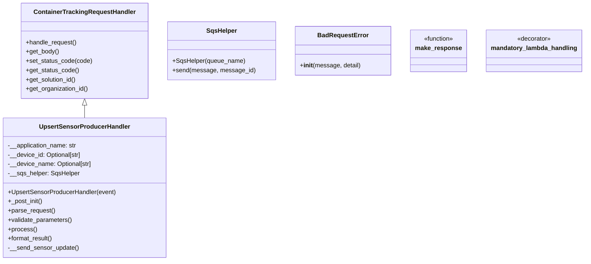
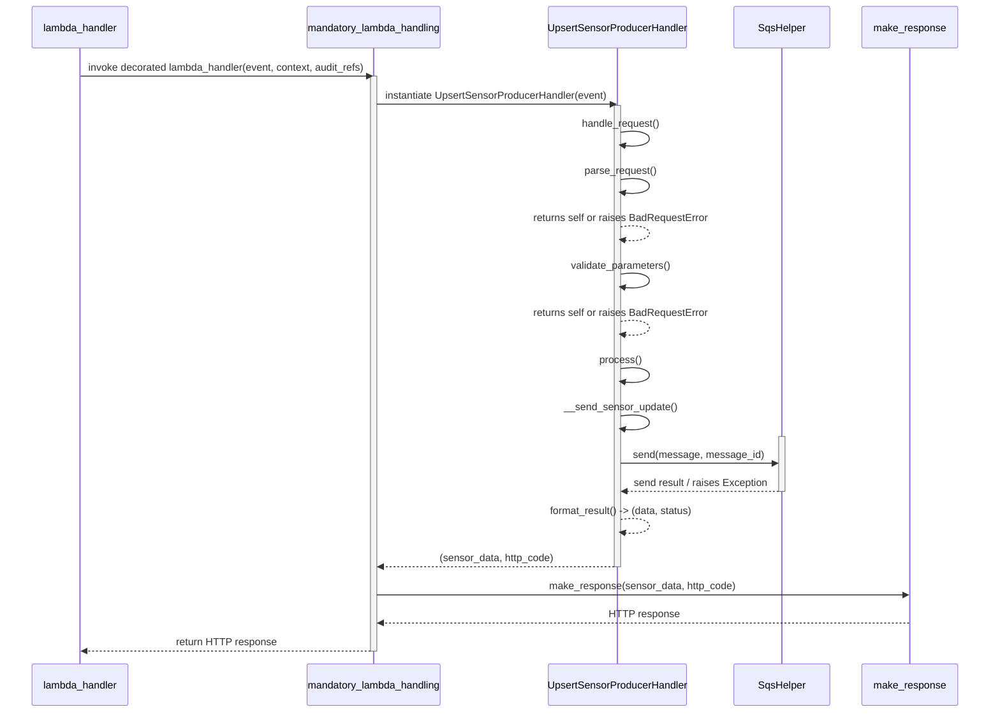

# Diagram: container_tracking_core/container_tracking_service/container_tracking_service/api/sensors/upsert_sensor/upsert_sensor_producer.py

> Auto-generated by Obscura crawlers

## Diagram 1

### SVG

<svg id="container" width="1473.09765625" xmlns="http://www.w3.org/2000/svg" class="classDiagram" height="672" viewBox="0 0 1473.09765625 672" role="graphics-document document" aria-roledescription="class"><g><defs><marker id="container_class-aggregationStart" class="marker aggregation class" refX="18" refY="7" markerWidth="190" markerHeight="240" orient="auto"><path d="M 18,7 L9,13 L1,7 L9,1 Z"></path></marker></defs><defs><marker id="container_class-aggregationEnd" class="marker aggregation class" refX="1" refY="7" markerWidth="20" markerHeight="28" orient="auto"><path d="M 18,7 L9,13 L1,7 L9,1 Z"></path></marker></defs><defs><marker id="container_class-extensionStart" class="marker extension class" refX="18" refY="7" markerWidth="190" markerHeight="240" orient="auto"><path d="M 1,7 L18,13 V 1 Z"></path></marker></defs><defs><marker id="container_class-extensionEnd" class="marker extension class" refX="1" refY="7" markerWidth="20" markerHeight="28" orient="auto"><path d="M 1,1 V 13 L18,7 Z"></path></marker></defs><defs><marker id="container_class-compositionStart" class="marker composition class" refX="18" refY="7" markerWidth="190" markerHeight="240" orient="auto"><path d="M 18,7 L9,13 L1,7 L9,1 Z"></path></marker></defs><defs><marker id="container_class-compositionEnd" class="marker composition class" refX="1" refY="7" markerWidth="20" markerHeight="28" orient="auto"><path d="M 18,7 L9,13 L1,7 L9,1 Z"></path></marker></defs><defs><marker id="container_class-dependencyStart" class="marker dependency class" refX="6" refY="7" markerWidth="190" markerHeight="240" orient="auto"><path d="M 5,7 L9,13 L1,7 L9,1 Z"></path></marker></defs><defs><marker id="container_class-dependencyEnd" class="marker dependency class" refX="13" refY="7" markerWidth="20" markerHeight="28" orient="auto"><path d="M 18,7 L9,13 L14,7 L9,1 Z"></path></marker></defs><defs><marker id="container_class-lollipopStart" class="marker lollipop class" refX="13" refY="7" markerWidth="190" markerHeight="240" orient="auto"><circle stroke="black" fill="transparent" cx="7" cy="7" r="6"></circle></marker></defs><defs><marker id="container_class-lollipopEnd" class="marker lollipop class" refX="1" refY="7" markerWidth="190" markerHeight="240" orient="auto"><circle stroke="black" fill="transparent" cx="7" cy="7" r="6"></circle></marker></defs><g class="root"><g class="clusters"></g><g class="edgePaths"><path d="M215.922,271.25L215.922,272.542C215.922,273.833,215.922,276.417,215.922,281.875C215.922,287.333,215.922,295.667,215.922,299.833L215.922,304" id="id_ContainerTrackingRequestHandler_UpsertSensorProducerHandler_1" class="edge-thickness-normal edge-pattern-solid relation" style=";;;" data-edge="true" data-et="edge" data-id="id_ContainerTrackingRequestHandler_UpsertSensorProducerHandler_1" data-points="W3sieCI6MjE1LjkyMTg3NSwieSI6MjU0fSx7IngiOjIxNS45MjE4NzUsInkiOjI3OX0seyJ4IjoyMTUuOTIxODc1LCJ5IjozMDR9XQ==" marker-start="url(#container_class-extensionStart)"></path></g><g class="edgeLabels"><g class="edgeLabel"><g class="label" data-id="id_ContainerTrackingRequestHandler_UpsertSensorProducerHandler_1" transform="translate(0, 0)"><foreignObject width="0" height="0">

</foreignObject></g></g></g><g class="nodes"><g class="node default" id="classId-ContainerTrackingRequestHandler-0" transform="translate(215.921875, 131)"><g class="basic label-container"><path d="M-160.11328125 -123 L160.11328125 -123 L160.11328125 123 L-160.11328125 123" stroke="none" stroke-width="0" fill="#ECECFF" style=""></path><path d="M-160.11328125 -123 C-71.1331943379779 -123, 17.846892574044205 -123, 160.11328125 -123 M-160.11328125 -123 C-53.36158695717779 -123, 53.390107335644416 -123, 160.11328125 -123 M160.11328125 -123 C160.11328125 -45.07332736684751, 160.11328125 32.853345266304984, 160.11328125 123 M160.11328125 -123 C160.11328125 -39.59008883777328, 160.11328125 43.81982232445344, 160.11328125 123 M160.11328125 123 C32.59797799436093 123, -94.91732526127814 123, -160.11328125 123 M160.11328125 123 C61.63834328631242 123, -36.83659467737516 123, -160.11328125 123 M-160.11328125 123 C-160.11328125 28.835717218015574, -160.11328125 -65.32856556396885, -160.11328125 -123 M-160.11328125 123 C-160.11328125 50.694311558077345, -160.11328125 -21.61137688384531, -160.11328125 -123" stroke="#9370DB" stroke-width="1.3" fill="none" stroke-dasharray="0 0" style=""></path></g><g class="annotation-group text" transform="translate(0, -99)"></g><g class="label-group text" transform="translate(-125.5859375, -99)"><g class="label" style="font-weight: bolder" transform="translate(0,-12)"><foreignObject width="251.171875" height="24">

ContainerTrackingRequestHandler

</foreignObject></g></g><g class="members-group text" transform="translate(-148.11328125, -51)"></g><g class="methods-group text" transform="translate(-148.11328125, -21)"><g class="label" style="" transform="translate(0,-12)"><foreignObject width="131.96875" height="24">

+handle_request()

</foreignObject></g><g class="label" style="" transform="translate(0,12)"><foreignObject width="85.53125" height="24">

+get_body()

</foreignObject></g><g class="label" style="" transform="translate(0,36)"><foreignObject width="170.640625" height="24">

+set_status_code(code)

</foreignObject></g><g class="label" style="" transform="translate(0,60)"><foreignObject width="136.28125" height="24">

+get_status_code()

</foreignObject></g><g class="label" style="" transform="translate(0,84)"><foreignObject width="131.46875" height="24">

+get_solution_id()

</foreignObject></g><g class="label" style="" transform="translate(0,108)"><foreignObject width="161.671875" height="24">

+get_organization_id()

</foreignObject></g></g><g class="divider" style=""><path d="M-160.11328125 -75 C-61.71441386754894 -75, 36.68445351490212 -75, 160.11328125 -75 M-160.11328125 -75 C-53.78714096620433 -75, 52.53899931759133 -75, 160.11328125 -75" stroke="#9370DB" stroke-width="1.3" fill="none" stroke-dasharray="0 0" style=""></path></g><g class="divider" style=""><path d="M-160.11328125 -51 C-79.42316459595106 -51, 1.2669520580978713 -51, 160.11328125 -51 M-160.11328125 -51 C-46.655371295039146 -51, 66.80253865992171 -51, 160.11328125 -51" stroke="#9370DB" stroke-width="1.3" fill="none" stroke-dasharray="0 0" style=""></path></g></g><g class="node default" id="classId-UpsertSensorProducerHandler-1" transform="translate(215.921875, 484)"><g class="basic label-container"><path d="M-207.921875 -180 L207.921875 -180 L207.921875 180 L-207.921875 180" stroke="none" stroke-width="0" fill="#ECECFF" style=""></path><path d="M-207.921875 -180 C-64.79460154207959 -180, 78.33267191584082 -180, 207.921875 -180 M-207.921875 -180 C-59.02757429738469 -180, 89.86672640523062 -180, 207.921875 -180 M207.921875 -180 C207.921875 -45.14135002984332, 207.921875 89.71729994031335, 207.921875 180 M207.921875 -180 C207.921875 -100.98424654038966, 207.921875 -21.968493080779325, 207.921875 180 M207.921875 180 C60.16585039320822 180, -87.59017421358357 180, -207.921875 180 M207.921875 180 C102.3603398785116 180, -3.2011952429768087 180, -207.921875 180 M-207.921875 180 C-207.921875 42.74160355662434, -207.921875 -94.51679288675132, -207.921875 -180 M-207.921875 180 C-207.921875 66.2455304567729, -207.921875 -47.508939086454205, -207.921875 -180" stroke="#9370DB" stroke-width="1.3" fill="none" stroke-dasharray="0 0" style=""></path></g><g class="annotation-group text" transform="translate(0, -156)"></g><g class="label-group text" transform="translate(-111.953125, -156)"><g class="label" style="font-weight: bolder" transform="translate(0,-12)"><foreignObject width="223.90625" height="24">

UpsertSensorProducerHandler

</foreignObject></g></g><g class="members-group text" transform="translate(-195.921875, -108)"><g class="label" style="" transform="translate(0,-12)"><foreignObject width="179.78125" height="24">

-__application_name: str

</foreignObject></g><g class="label" style="" transform="translate(0,12)"><foreignObject width="190.703125" height="24">

-__device_id: Optional[str]

</foreignObject></g><g class="label" style="" transform="translate(0,36)"><foreignObject width="217.125" height="24">

-__device_name: Optional[str]

</foreignObject></g><g class="label" style="" transform="translate(0,60)"><foreignObject width="184.046875" height="24">

-__sqs_helper: SqsHelper

</foreignObject></g></g><g class="methods-group text" transform="translate(-195.921875, 12)"><g class="label" style="" transform="translate(0,-12)"><foreignObject width="279.890625" height="24">

+UpsertSensorProducerHandler(event)

</foreignObject></g><g class="label" style="" transform="translate(0,12)"><foreignObject width="89.984375" height="24">

+_post_init()

</foreignObject></g><g class="label" style="" transform="translate(0,36)"><foreignObject width="121.796875" height="24">

+parse_request()

</foreignObject></g><g class="label" style="" transform="translate(0,60)"><foreignObject width="166.546875" height="24">

+validate_parameters()

</foreignObject></g><g class="label" style="" transform="translate(0,84)"><foreignObject width="73.734375" height="24">

+process()

</foreignObject></g><g class="label" style="" transform="translate(0,108)"><foreignObject width="117.015625" height="24">

+format_result()

</foreignObject></g><g class="label" style="" transform="translate(0,132)"><foreignObject width="182.109375" height="24">

-__send_sensor_update()

</foreignObject></g></g><g class="divider" style=""><path d="M-207.921875 -132 C-67.34299592122696 -132, 73.23588315754608 -132, 207.921875 -132 M-207.921875 -132 C-99.00426881805117 -132, 9.913337363897654 -132, 207.921875 -132" stroke="#9370DB" stroke-width="1.3" fill="none" stroke-dasharray="0 0" style=""></path></g><g class="divider" style=""><path d="M-207.921875 -12 C-107.73012989995775 -12, -7.538384799915491 -12, 207.921875 -12 M-207.921875 -12 C-119.83907491734021 -12, -31.756274834680426 -12, 207.921875 -12" stroke="#9370DB" stroke-width="1.3" fill="none" stroke-dasharray="0 0" style=""></path></g></g><g class="node default" id="classId-SqsHelper-2" transform="translate(561.05078125, 131)"><g class="basic label-container"><path d="M-135.015625 -75 L135.015625 -75 L135.015625 75 L-135.015625 75" stroke="none" stroke-width="0" fill="#ECECFF" style=""></path><path d="M-135.015625 -75 C-52.60459501395806 -75, 29.806434972083878 -75, 135.015625 -75 M-135.015625 -75 C-70.35712620827582 -75, -5.698627416551631 -75, 135.015625 -75 M135.015625 -75 C135.015625 -18.202021456429655, 135.015625 38.59595708714069, 135.015625 75 M135.015625 -75 C135.015625 -38.292802008119075, 135.015625 -1.5856040162381504, 135.015625 75 M135.015625 75 C66.21816778848245 75, -2.5792894230351067 75, -135.015625 75 M135.015625 75 C37.26827470981779 75, -60.47907558036442 75, -135.015625 75 M-135.015625 75 C-135.015625 43.32768475440795, -135.015625 11.655369508815895, -135.015625 -75 M-135.015625 75 C-135.015625 35.77869270631929, -135.015625 -3.442614587361419, -135.015625 -75" stroke="#9370DB" stroke-width="1.3" fill="none" stroke-dasharray="0 0" style=""></path></g><g class="annotation-group text" transform="translate(0, -51)"></g><g class="label-group text" transform="translate(-37.765625, -51)"><g class="label" style="font-weight: bolder" transform="translate(0,-12)"><foreignObject width="75.53125" height="24">

SqsHelper

</foreignObject></g></g><g class="members-group text" transform="translate(-123.015625, -3)"></g><g class="methods-group text" transform="translate(-123.015625, 27)"><g class="label" style="" transform="translate(0,-12)"><foreignObject width="186.3125" height="24">

+SqsHelper(queue_name)

</foreignObject></g><g class="label" style="" transform="translate(0,12)"><foreignObject width="208.265625" height="24">

+send(message, message_id)

</foreignObject></g></g><g class="divider" style=""><path d="M-135.015625 -27 C-78.26756010901636 -27, -21.519495218032716 -27, 135.015625 -27 M-135.015625 -27 C-32.87636296954342 -27, 69.26289906091316 -27, 135.015625 -27" stroke="#9370DB" stroke-width="1.3" fill="none" stroke-dasharray="0 0" style=""></path></g><g class="divider" style=""><path d="M-135.015625 -3 C-51.09463094346984 -3, 32.826363113060324 -3, 135.015625 -3 M-135.015625 -3 C-69.77996306077961 -3, -4.544301121559215 -3, 135.015625 -3" stroke="#9370DB" stroke-width="1.3" fill="none" stroke-dasharray="0 0" style=""></path></g></g><g class="node default" id="classId-BadRequestError-3" transform="translate(866.68359375, 131)"><g class="basic label-container"><path d="M-120.6171875 -63 L120.6171875 -63 L120.6171875 63 L-120.6171875 63" stroke="none" stroke-width="0" fill="#ECECFF" style=""></path><path d="M-120.6171875 -63 C-38.31877822100721 -63, 43.979631057985586 -63, 120.6171875 -63 M-120.6171875 -63 C-52.50693518587083 -63, 15.60331712825834 -63, 120.6171875 -63 M120.6171875 -63 C120.6171875 -28.286960302542745, 120.6171875 6.42607939491451, 120.6171875 63 M120.6171875 -63 C120.6171875 -13.188577738283655, 120.6171875 36.62284452343269, 120.6171875 63 M120.6171875 63 C28.11930939053798 63, -64.37856871892404 63, -120.6171875 63 M120.6171875 63 C68.43015997716614 63, 16.24313245433227 63, -120.6171875 63 M-120.6171875 63 C-120.6171875 32.3719266426892, -120.6171875 1.7438532853784139, -120.6171875 -63 M-120.6171875 63 C-120.6171875 14.70253644039196, -120.6171875 -33.59492711921608, -120.6171875 -63" stroke="#9370DB" stroke-width="1.3" fill="none" stroke-dasharray="0 0" style=""></path></g><g class="annotation-group text" transform="translate(0, -39)"></g><g class="label-group text" transform="translate(-62.28125, -39)"><g class="label" style="font-weight: bolder" transform="translate(0,-12)"><foreignObject width="124.5625" height="24">

BadRequestError

</foreignObject></g></g><g class="members-group text" transform="translate(-108.6171875, 9)"></g><g class="methods-group text" transform="translate(-108.6171875, 39)"><g class="label" style="" transform="translate(0,-12)"><foreignObject width="154.953125" height="24">

+<strong>init</strong>(message, detail)

</foreignObject></g></g><g class="divider" style=""><path d="M-120.6171875 -15 C-68.0663314356469 -15, -15.515475371293789 -15, 120.6171875 -15 M-120.6171875 -15 C-62.669977898272386 -15, -4.722768296544771 -15, 120.6171875 -15" stroke="#9370DB" stroke-width="1.3" fill="none" stroke-dasharray="0 0" style=""></path></g><g class="divider" style=""><path d="M-120.6171875 9 C-32.06052642037241 9, 56.496134659255176 9, 120.6171875 9 M-120.6171875 9 C-40.89959966338533 9, 38.81798817322934 9, 120.6171875 9" stroke="#9370DB" stroke-width="1.3" fill="none" stroke-dasharray="0 0" style=""></path></g></g><g class="node default" id="classId-make_response-4" transform="translate(1106.76953125, 131)"><g class="basic label-container"><path d="M-69.46875 -54 L69.46875 -54 L69.46875 54 L-69.46875 54" stroke="none" stroke-width="0" fill="#ECECFF" style=""></path><path d="M-69.46875 -54 C-22.286513978120887 -54, 24.895722043758227 -54, 69.46875 -54 M-69.46875 -54 C-18.039361977471856 -54, 33.39002604505629 -54, 69.46875 -54 M69.46875 -54 C69.46875 -15.648734870494025, 69.46875 22.70253025901195, 69.46875 54 M69.46875 -54 C69.46875 -22.063139621874978, 69.46875 9.873720756250044, 69.46875 54 M69.46875 54 C26.257153402162807 54, -16.954443195674386 54, -69.46875 54 M69.46875 54 C30.818381891714537 54, -7.831986216570925 54, -69.46875 54 M-69.46875 54 C-69.46875 29.34189771436703, -69.46875 4.683795428734058, -69.46875 -54 M-69.46875 54 C-69.46875 17.267142896043225, -69.46875 -19.46571420791355, -69.46875 -54" stroke="#9370DB" stroke-width="1.3" fill="none" stroke-dasharray="0 0" style=""></path></g><g class="annotation-group text" transform="translate(-39.484375, -30)"><g class="label" style="" transform="translate(0,-12)"><foreignObject width="78.96875" height="24">

«function»

</foreignObject></g></g><g class="label-group text" transform="translate(-57.46875, -6)"><g class="label" style="font-weight: bolder" transform="translate(0,-12)"><foreignObject width="114.9375" height="24">

make_response

</foreignObject></g></g><g class="members-group text" transform="translate(-57.46875, 42)"></g><g class="methods-group text" transform="translate(-57.46875, 72)"></g><g class="divider" style=""><path d="M-69.46875 18 C-17.796443206464964 18, 33.87586358707007 18, 69.46875 18 M-69.46875 18 C-15.758371093689384 18, 37.95200781262123 18, 69.46875 18" stroke="#9370DB" stroke-width="1.3" fill="none" stroke-dasharray="0 0" style=""></path></g><g class="divider" style=""><path d="M-69.46875 36 C-17.659111950873537 36, 34.150526098252925 36, 69.46875 36 M-69.46875 36 C-21.6305171260344 36, 26.207715747931204 36, 69.46875 36" stroke="#9370DB" stroke-width="1.3" fill="none" stroke-dasharray="0 0" style=""></path></g></g><g class="node default" id="classId-mandatory_lambda_handling-5" transform="translate(1345.66796875, 131)"><g class="basic label-container"><path d="M-119.4296875 -54 L119.4296875 -54 L119.4296875 54 L-119.4296875 54" stroke="none" stroke-width="0" fill="#ECECFF" style=""></path><path d="M-119.4296875 -54 C-64.89817822176192 -54, -10.366668943523862 -54, 119.4296875 -54 M-119.4296875 -54 C-33.635835538208326 -54, 52.15801642358335 -54, 119.4296875 -54 M119.4296875 -54 C119.4296875 -17.39006569991819, 119.4296875 19.219868600163622, 119.4296875 54 M119.4296875 -54 C119.4296875 -17.50922755580568, 119.4296875 18.98154488838864, 119.4296875 54 M119.4296875 54 C63.610163045025914 54, 7.790638590051827 54, -119.4296875 54 M119.4296875 54 C27.448374253350565 54, -64.53293899329887 54, -119.4296875 54 M-119.4296875 54 C-119.4296875 17.220365450055965, -119.4296875 -19.55926909988807, -119.4296875 -54 M-119.4296875 54 C-119.4296875 22.310211014860254, -119.4296875 -9.379577970279492, -119.4296875 -54" stroke="#9370DB" stroke-width="1.3" fill="none" stroke-dasharray="0 0" style=""></path></g><g class="annotation-group text" transform="translate(-44.0625, -30)"><g class="label" style="" transform="translate(0,-12)"><foreignObject width="88.125" height="24">

«decorator»

</foreignObject></g></g><g class="label-group text" transform="translate(-107.4296875, -6)"><g class="label" style="font-weight: bolder" transform="translate(0,-12)"><foreignObject width="214.859375" height="24">

mandatory_lambda_handling

</foreignObject></g></g><g class="members-group text" transform="translate(-107.4296875, 42)"></g><g class="methods-group text" transform="translate(-107.4296875, 72)"></g><g class="divider" style=""><path d="M-119.4296875 18 C-28.857299047162797 18, 61.715089405674405 18, 119.4296875 18 M-119.4296875 18 C-68.2624940995128 18, -17.095300699025586 18, 119.4296875 18" stroke="#9370DB" stroke-width="1.3" fill="none" stroke-dasharray="0 0" style=""></path></g><g class="divider" style=""><path d="M-119.4296875 36 C-53.76436442077147 36, 11.900958658457057 36, 119.4296875 36 M-119.4296875 36 C-36.514509395625836 36, 46.40066870874833 36, 119.4296875 36" stroke="#9370DB" stroke-width="1.3" fill="none" stroke-dasharray="0 0" style=""></path></g></g></g></g></g></svg>

## Diagram 2

### SVG

<svg id="container" width="1673" xmlns="http://www.w3.org/2000/svg" height="1179" viewBox="-50 -10 1673 1179" role="graphics-document document" aria-roledescription="sequence"><g><rect x="1423" y="1093" fill="#eaeaea" stroke="#666" width="150" height="65" name="Responder" rx="3" ry="3" class="actor actor-bottom"></rect><text x="1498" y="1125.5" dominant-baseline="central" alignment-baseline="central" class="actor actor-box" style="text-anchor: middle; font-size: 16px; font-weight: 400;"><tspan x="1498" dy="0">make_response</tspan></text></g><g><rect x="1223" y="1093" fill="#eaeaea" stroke="#666" width="150" height="65" name="SQS" rx="3" ry="3" class="actor actor-bottom"></rect><text x="1298" y="1125.5" dominant-baseline="central" alignment-baseline="central" class="actor actor-box" style="text-anchor: middle; font-size: 16px; font-weight: 400;"><tspan x="1298" dy="0">SqsHelper</tspan></text></g><g><rect x="892" y="1093" fill="#eaeaea" stroke="#666" width="242" height="65" name="Handler" rx="3" ry="3" class="actor actor-bottom"></rect><text x="1013" y="1125.5" dominant-baseline="central" alignment-baseline="central" class="actor actor-box" style="text-anchor: middle; font-size: 16px; font-weight: 400;"><tspan x="1013" dy="0">UpsertSensorProducerHandler</tspan></text></g><g><rect x="471" y="1093" fill="#eaeaea" stroke="#666" width="234" height="65" name="Decorator" rx="3" ry="3" class="actor actor-bottom"></rect><text x="588" y="1125.5" dominant-baseline="central" alignment-baseline="central" class="actor actor-box" style="text-anchor: middle; font-size: 16px; font-weight: 400;"><tspan x="588" dy="0">mandatory_lambda_handling</tspan></text></g><g><rect x="0" y="1093" fill="#eaeaea" stroke="#666" width="150" height="65" name="Lambda" rx="3" ry="3" class="actor actor-bottom"></rect><text x="75" y="1125.5" dominant-baseline="central" alignment-baseline="central" class="actor actor-box" style="text-anchor: middle; font-size: 16px; font-weight: 400;"><tspan x="75" dy="0">lambda_handler</tspan></text></g><g><line id="actor4" x1="1498" y1="65" x2="1498" y2="1093" class="actor-line 200" stroke-width="0.5px" stroke="#999" name="Responder"></line><g id="root-4"><rect x="1423" y="0" fill="#eaeaea" stroke="#666" width="150" height="65" name="Responder" rx="3" ry="3" class="actor actor-top"></rect><text x="1498" y="32.5" dominant-baseline="central" alignment-baseline="central" class="actor actor-box" style="text-anchor: middle; font-size: 16px; font-weight: 400;"><tspan x="1498" dy="0">make_response</tspan></text></g></g><g><line id="actor3" x1="1298" y1="65" x2="1298" y2="1093" class="actor-line 200" stroke-width="0.5px" stroke="#999" name="SQS"></line><g id="root-3"><rect x="1223" y="0" fill="#eaeaea" stroke="#666" width="150" height="65" name="SQS" rx="3" ry="3" class="actor actor-top"></rect><text x="1298" y="32.5" dominant-baseline="central" alignment-baseline="central" class="actor actor-box" style="text-anchor: middle; font-size: 16px; font-weight: 400;"><tspan x="1298" dy="0">SqsHelper</tspan></text></g></g><g><line id="actor2" x1="1013" y1="65" x2="1013" y2="1093" class="actor-line 200" stroke-width="0.5px" stroke="#999" name="Handler"></line><g id="root-2"><rect x="892" y="0" fill="#eaeaea" stroke="#666" width="242" height="65" name="Handler" rx="3" ry="3" class="actor actor-top"></rect><text x="1013" y="32.5" dominant-baseline="central" alignment-baseline="central" class="actor actor-box" style="text-anchor: middle; font-size: 16px; font-weight: 400;"><tspan x="1013" dy="0">UpsertSensorProducerHandler</tspan></text></g></g><g><line id="actor1" x1="588" y1="65" x2="588" y2="1093" class="actor-line 200" stroke-width="0.5px" stroke="#999" name="Decorator"></line><g id="root-1"><rect x="471" y="0" fill="#eaeaea" stroke="#666" width="234" height="65" name="Decorator" rx="3" ry="3" class="actor actor-top"></rect><text x="588" y="32.5" dominant-baseline="central" alignment-baseline="central" class="actor actor-box" style="text-anchor: middle; font-size: 16px; font-weight: 400;"><tspan x="588" dy="0">mandatory_lambda_handling</tspan></text></g></g><g><line id="actor0" x1="75" y1="65" x2="75" y2="1093" class="actor-line 200" stroke-width="0.5px" stroke="#999" name="Lambda"></line><g id="root-0"><rect x="0" y="0" fill="#eaeaea" stroke="#666" width="150" height="65" name="Lambda" rx="3" ry="3" class="actor actor-top"></rect><text x="75" y="32.5" dominant-baseline="central" alignment-baseline="central" class="actor actor-box" style="text-anchor: middle; font-size: 16px; font-weight: 400;"><tspan x="75" dy="0">lambda_handler</tspan></text></g></g><g></g><defs><symbol id="computer" width="24" height="24"><path transform="scale(.5)" d="M2 2v13h20v-13h-20zm18 11h-16v-9h16v9zm-10.228 6l.466-1h3.524l.467 1h-4.457zm14.228 3h-24l2-6h2.104l-1.33 4h18.45l-1.297-4h2.073l2 6zm-5-10h-14v-7h14v7z"></path></symbol></defs><defs><symbol id="database" fill-rule="evenodd" clip-rule="evenodd"><path transform="scale(.5)" d="M12.258.001l.256.004.255.005.253.008.251.01.249.012.247.015.246.016.242.019.241.02.239.023.236.024.233.027.231.028.229.031.225.032.223.034.22.036.217.038.214.04.211.041.208.043.205.045.201.046.198.048.194.05.191.051.187.053.183.054.18.056.175.057.172.059.168.06.163.061.16.063.155.064.15.066.074.033.073.033.071.034.07.034.069.035.068.035.067.035.066.035.064.036.064.036.062.036.06.036.06.037.058.037.058.037.055.038.055.038.053.038.052.038.051.039.05.039.048.039.047.039.045.04.044.04.043.04.041.04.04.041.039.041.037.041.036.041.034.041.033.042.032.042.03.042.029.042.027.042.026.043.024.043.023.043.021.043.02.043.018.044.017.043.015.044.013.044.012.044.011.045.009.044.007.045.006.045.004.045.002.045.001.045v17l-.001.045-.002.045-.004.045-.006.045-.007.045-.009.044-.011.045-.012.044-.013.044-.015.044-.017.043-.018.044-.02.043-.021.043-.023.043-.024.043-.026.043-.027.042-.029.042-.03.042-.032.042-.033.042-.034.041-.036.041-.037.041-.039.041-.04.041-.041.04-.043.04-.044.04-.045.04-.047.039-.048.039-.05.039-.051.039-.052.038-.053.038-.055.038-.055.038-.058.037-.058.037-.06.037-.06.036-.062.036-.064.036-.064.036-.066.035-.067.035-.068.035-.069.035-.07.034-.071.034-.073.033-.074.033-.15.066-.155.064-.16.063-.163.061-.168.06-.172.059-.175.057-.18.056-.183.054-.187.053-.191.051-.194.05-.198.048-.201.046-.205.045-.208.043-.211.041-.214.04-.217.038-.22.036-.223.034-.225.032-.229.031-.231.028-.233.027-.236.024-.239.023-.241.02-.242.019-.246.016-.247.015-.249.012-.251.01-.253.008-.255.005-.256.004-.258.001-.258-.001-.256-.004-.255-.005-.253-.008-.251-.01-.249-.012-.247-.015-.245-.016-.243-.019-.241-.02-.238-.023-.236-.024-.234-.027-.231-.028-.228-.031-.226-.032-.223-.034-.22-.036-.217-.038-.214-.04-.211-.041-.208-.043-.204-.045-.201-.046-.198-.048-.195-.05-.19-.051-.187-.053-.184-.054-.179-.056-.176-.057-.172-.059-.167-.06-.164-.061-.159-.063-.155-.064-.151-.066-.074-.033-.072-.033-.072-.034-.07-.034-.069-.035-.068-.035-.067-.035-.066-.035-.064-.036-.063-.036-.062-.036-.061-.036-.06-.037-.058-.037-.057-.037-.056-.038-.055-.038-.053-.038-.052-.038-.051-.039-.049-.039-.049-.039-.046-.039-.046-.04-.044-.04-.043-.04-.041-.04-.04-.041-.039-.041-.037-.041-.036-.041-.034-.041-.033-.042-.032-.042-.03-.042-.029-.042-.027-.042-.026-.043-.024-.043-.023-.043-.021-.043-.02-.043-.018-.044-.017-.043-.015-.044-.013-.044-.012-.044-.011-.045-.009-.044-.007-.045-.006-.045-.004-.045-.002-.045-.001-.045v-17l.001-.045.002-.045.004-.045.006-.045.007-.045.009-.044.011-.045.012-.044.013-.044.015-.044.017-.043.018-.044.02-.043.021-.043.023-.043.024-.043.026-.043.027-.042.029-.042.03-.042.032-.042.033-.042.034-.041.036-.041.037-.041.039-.041.04-.041.041-.04.043-.04.044-.04.046-.04.046-.039.049-.039.049-.039.051-.039.052-.038.053-.038.055-.038.056-.038.057-.037.058-.037.06-.037.061-.036.062-.036.063-.036.064-.036.066-.035.067-.035.068-.035.069-.035.07-.034.072-.034.072-.033.074-.033.151-.066.155-.064.159-.063.164-.061.167-.06.172-.059.176-.057.179-.056.184-.054.187-.053.19-.051.195-.05.198-.048.201-.046.204-.045.208-.043.211-.041.214-.04.217-.038.22-.036.223-.034.226-.032.228-.031.231-.028.234-.027.236-.024.238-.023.241-.02.243-.019.245-.016.247-.015.249-.012.251-.01.253-.008.255-.005.256-.004.258-.001.258.001zm-9.258 20.499v.01l.001.021.003.021.004.022.005.021.006.022.007.022.009.023.01.022.011.023.012.023.013.023.015.023.016.024.017.023.018.024.019.024.021.024.022.025.023.024.024.025.052.049.056.05.061.051.066.051.07.051.075.051.079.052.084.052.088.052.092.052.097.052.102.051.105.052.11.052.114.051.119.051.123.051.127.05.131.05.135.05.139.048.144.049.147.047.152.047.155.047.16.045.163.045.167.043.171.043.176.041.178.041.183.039.187.039.19.037.194.035.197.035.202.033.204.031.209.03.212.029.216.027.219.025.222.024.226.021.23.02.233.018.236.016.24.015.243.012.246.01.249.008.253.005.256.004.259.001.26-.001.257-.004.254-.005.25-.008.247-.011.244-.012.241-.014.237-.016.233-.018.231-.021.226-.021.224-.024.22-.026.216-.027.212-.028.21-.031.205-.031.202-.034.198-.034.194-.036.191-.037.187-.039.183-.04.179-.04.175-.042.172-.043.168-.044.163-.045.16-.046.155-.046.152-.047.148-.048.143-.049.139-.049.136-.05.131-.05.126-.05.123-.051.118-.052.114-.051.11-.052.106-.052.101-.052.096-.052.092-.052.088-.053.083-.051.079-.052.074-.052.07-.051.065-.051.06-.051.056-.05.051-.05.023-.024.023-.025.021-.024.02-.024.019-.024.018-.024.017-.024.015-.023.014-.024.013-.023.012-.023.01-.023.01-.022.008-.022.006-.022.006-.022.004-.022.004-.021.001-.021.001-.021v-4.127l-.077.055-.08.053-.083.054-.085.053-.087.052-.09.052-.093.051-.095.05-.097.05-.1.049-.102.049-.105.048-.106.047-.109.047-.111.046-.114.045-.115.045-.118.044-.12.043-.122.042-.124.042-.126.041-.128.04-.13.04-.132.038-.134.038-.135.037-.138.037-.139.035-.142.035-.143.034-.144.033-.147.032-.148.031-.15.03-.151.03-.153.029-.154.027-.156.027-.158.026-.159.025-.161.024-.162.023-.163.022-.165.021-.166.02-.167.019-.169.018-.169.017-.171.016-.173.015-.173.014-.175.013-.175.012-.177.011-.178.01-.179.008-.179.008-.181.006-.182.005-.182.004-.184.003-.184.002h-.37l-.184-.002-.184-.003-.182-.004-.182-.005-.181-.006-.179-.008-.179-.008-.178-.01-.176-.011-.176-.012-.175-.013-.173-.014-.172-.015-.171-.016-.17-.017-.169-.018-.167-.019-.166-.02-.165-.021-.163-.022-.162-.023-.161-.024-.159-.025-.157-.026-.156-.027-.155-.027-.153-.029-.151-.03-.15-.03-.148-.031-.146-.032-.145-.033-.143-.034-.141-.035-.14-.035-.137-.037-.136-.037-.134-.038-.132-.038-.13-.04-.128-.04-.126-.041-.124-.042-.122-.042-.12-.044-.117-.043-.116-.045-.113-.045-.112-.046-.109-.047-.106-.047-.105-.048-.102-.049-.1-.049-.097-.05-.095-.05-.093-.052-.09-.051-.087-.052-.085-.053-.083-.054-.08-.054-.077-.054v4.127zm0-5.654v.011l.001.021.003.021.004.021.005.022.006.022.007.022.009.022.01.022.011.023.012.023.013.023.015.024.016.023.017.024.018.024.019.024.021.024.022.024.023.025.024.024.052.05.056.05.061.05.066.051.07.051.075.052.079.051.084.052.088.052.092.052.097.052.102.052.105.052.11.051.114.051.119.052.123.05.127.051.131.05.135.049.139.049.144.048.147.048.152.047.155.046.16.045.163.045.167.044.171.042.176.042.178.04.183.04.187.038.19.037.194.036.197.034.202.033.204.032.209.03.212.028.216.027.219.025.222.024.226.022.23.02.233.018.236.016.24.014.243.012.246.01.249.008.253.006.256.003.259.001.26-.001.257-.003.254-.006.25-.008.247-.01.244-.012.241-.015.237-.016.233-.018.231-.02.226-.022.224-.024.22-.025.216-.027.212-.029.21-.03.205-.032.202-.033.198-.035.194-.036.191-.037.187-.039.183-.039.179-.041.175-.042.172-.043.168-.044.163-.045.16-.045.155-.047.152-.047.148-.048.143-.048.139-.05.136-.049.131-.05.126-.051.123-.051.118-.051.114-.052.11-.052.106-.052.101-.052.096-.052.092-.052.088-.052.083-.052.079-.052.074-.051.07-.052.065-.051.06-.05.056-.051.051-.049.023-.025.023-.024.021-.025.02-.024.019-.024.018-.024.017-.024.015-.023.014-.023.013-.024.012-.022.01-.023.01-.023.008-.022.006-.022.006-.022.004-.021.004-.022.001-.021.001-.021v-4.139l-.077.054-.08.054-.083.054-.085.052-.087.053-.09.051-.093.051-.095.051-.097.05-.1.049-.102.049-.105.048-.106.047-.109.047-.111.046-.114.045-.115.044-.118.044-.12.044-.122.042-.124.042-.126.041-.128.04-.13.039-.132.039-.134.038-.135.037-.138.036-.139.036-.142.035-.143.033-.144.033-.147.033-.148.031-.15.03-.151.03-.153.028-.154.028-.156.027-.158.026-.159.025-.161.024-.162.023-.163.022-.165.021-.166.02-.167.019-.169.018-.169.017-.171.016-.173.015-.173.014-.175.013-.175.012-.177.011-.178.009-.179.009-.179.007-.181.007-.182.005-.182.004-.184.003-.184.002h-.37l-.184-.002-.184-.003-.182-.004-.182-.005-.181-.007-.179-.007-.179-.009-.178-.009-.176-.011-.176-.012-.175-.013-.173-.014-.172-.015-.171-.016-.17-.017-.169-.018-.167-.019-.166-.02-.165-.021-.163-.022-.162-.023-.161-.024-.159-.025-.157-.026-.156-.027-.155-.028-.153-.028-.151-.03-.15-.03-.148-.031-.146-.033-.145-.033-.143-.033-.141-.035-.14-.036-.137-.036-.136-.037-.134-.038-.132-.039-.13-.039-.128-.04-.126-.041-.124-.042-.122-.043-.12-.043-.117-.044-.116-.044-.113-.046-.112-.046-.109-.046-.106-.047-.105-.048-.102-.049-.1-.049-.097-.05-.095-.051-.093-.051-.09-.051-.087-.053-.085-.052-.083-.054-.08-.054-.077-.054v4.139zm0-5.666v.011l.001.02.003.022.004.021.005.022.006.021.007.022.009.023.01.022.011.023.012.023.013.023.015.023.016.024.017.024.018.023.019.024.021.025.022.024.023.024.024.025.052.05.056.05.061.05.066.051.07.051.075.052.079.051.084.052.088.052.092.052.097.052.102.052.105.051.11.052.114.051.119.051.123.051.127.05.131.05.135.05.139.049.144.048.147.048.152.047.155.046.16.045.163.045.167.043.171.043.176.042.178.04.183.04.187.038.19.037.194.036.197.034.202.033.204.032.209.03.212.028.216.027.219.025.222.024.226.021.23.02.233.018.236.017.24.014.243.012.246.01.249.008.253.006.256.003.259.001.26-.001.257-.003.254-.006.25-.008.247-.01.244-.013.241-.014.237-.016.233-.018.231-.02.226-.022.224-.024.22-.025.216-.027.212-.029.21-.03.205-.032.202-.033.198-.035.194-.036.191-.037.187-.039.183-.039.179-.041.175-.042.172-.043.168-.044.163-.045.16-.045.155-.047.152-.047.148-.048.143-.049.139-.049.136-.049.131-.051.126-.05.123-.051.118-.052.114-.051.11-.052.106-.052.101-.052.096-.052.092-.052.088-.052.083-.052.079-.052.074-.052.07-.051.065-.051.06-.051.056-.05.051-.049.023-.025.023-.025.021-.024.02-.024.019-.024.018-.024.017-.024.015-.023.014-.024.013-.023.012-.023.01-.022.01-.023.008-.022.006-.022.006-.022.004-.022.004-.021.001-.021.001-.021v-4.153l-.077.054-.08.054-.083.053-.085.053-.087.053-.09.051-.093.051-.095.051-.097.05-.1.049-.102.048-.105.048-.106.048-.109.046-.111.046-.114.046-.115.044-.118.044-.12.043-.122.043-.124.042-.126.041-.128.04-.13.039-.132.039-.134.038-.135.037-.138.036-.139.036-.142.034-.143.034-.144.033-.147.032-.148.032-.15.03-.151.03-.153.028-.154.028-.156.027-.158.026-.159.024-.161.024-.162.023-.163.023-.165.021-.166.02-.167.019-.169.018-.169.017-.171.016-.173.015-.173.014-.175.013-.175.012-.177.01-.178.01-.179.009-.179.007-.181.006-.182.006-.182.004-.184.003-.184.001-.185.001-.185-.001-.184-.001-.184-.003-.182-.004-.182-.006-.181-.006-.179-.007-.179-.009-.178-.01-.176-.01-.176-.012-.175-.013-.173-.014-.172-.015-.171-.016-.17-.017-.169-.018-.167-.019-.166-.02-.165-.021-.163-.023-.162-.023-.161-.024-.159-.024-.157-.026-.156-.027-.155-.028-.153-.028-.151-.03-.15-.03-.148-.032-.146-.032-.145-.033-.143-.034-.141-.034-.14-.036-.137-.036-.136-.037-.134-.038-.132-.039-.13-.039-.128-.041-.126-.041-.124-.041-.122-.043-.12-.043-.117-.044-.116-.044-.113-.046-.112-.046-.109-.046-.106-.048-.105-.048-.102-.048-.1-.05-.097-.049-.095-.051-.093-.051-.09-.052-.087-.052-.085-.053-.083-.053-.08-.054-.077-.054v4.153zm8.74-8.179l-.257.004-.254.005-.25.008-.247.011-.244.012-.241.014-.237.016-.233.018-.231.021-.226.022-.224.023-.22.026-.216.027-.212.028-.21.031-.205.032-.202.033-.198.034-.194.036-.191.038-.187.038-.183.04-.179.041-.175.042-.172.043-.168.043-.163.045-.16.046-.155.046-.152.048-.148.048-.143.048-.139.049-.136.05-.131.05-.126.051-.123.051-.118.051-.114.052-.11.052-.106.052-.101.052-.096.052-.092.052-.088.052-.083.052-.079.052-.074.051-.07.052-.065.051-.06.05-.056.05-.051.05-.023.025-.023.024-.021.024-.02.025-.019.024-.018.024-.017.023-.015.024-.014.023-.013.023-.012.023-.01.023-.01.022-.008.022-.006.023-.006.021-.004.022-.004.021-.001.021-.001.021.001.021.001.021.004.021.004.022.006.021.006.023.008.022.01.022.01.023.012.023.013.023.014.023.015.024.017.023.018.024.019.024.02.025.021.024.023.024.023.025.051.05.056.05.06.05.065.051.07.052.074.051.079.052.083.052.088.052.092.052.096.052.101.052.106.052.11.052.114.052.118.051.123.051.126.051.131.05.136.05.139.049.143.048.148.048.152.048.155.046.16.046.163.045.168.043.172.043.175.042.179.041.183.04.187.038.191.038.194.036.198.034.202.033.205.032.21.031.212.028.216.027.22.026.224.023.226.022.231.021.233.018.237.016.241.014.244.012.247.011.25.008.254.005.257.004.26.001.26-.001.257-.004.254-.005.25-.008.247-.011.244-.012.241-.014.237-.016.233-.018.231-.021.226-.022.224-.023.22-.026.216-.027.212-.028.21-.031.205-.032.202-.033.198-.034.194-.036.191-.038.187-.038.183-.04.179-.041.175-.042.172-.043.168-.043.163-.045.16-.046.155-.046.152-.048.148-.048.143-.048.139-.049.136-.05.131-.05.126-.051.123-.051.118-.051.114-.052.11-.052.106-.052.101-.052.096-.052.092-.052.088-.052.083-.052.079-.052.074-.051.07-.052.065-.051.06-.05.056-.05.051-.05.023-.025.023-.024.021-.024.02-.025.019-.024.018-.024.017-.023.015-.024.014-.023.013-.023.012-.023.01-.023.01-.022.008-.022.006-.023.006-.021.004-.022.004-.021.001-.021.001-.021-.001-.021-.001-.021-.004-.021-.004-.022-.006-.021-.006-.023-.008-.022-.01-.022-.01-.023-.012-.023-.013-.023-.014-.023-.015-.024-.017-.023-.018-.024-.019-.024-.02-.025-.021-.024-.023-.024-.023-.025-.051-.05-.056-.05-.06-.05-.065-.051-.07-.052-.074-.051-.079-.052-.083-.052-.088-.052-.092-.052-.096-.052-.101-.052-.106-.052-.11-.052-.114-.052-.118-.051-.123-.051-.126-.051-.131-.05-.136-.05-.139-.049-.143-.048-.148-.048-.152-.048-.155-.046-.16-.046-.163-.045-.168-.043-.172-.043-.175-.042-.179-.041-.183-.04-.187-.038-.191-.038-.194-.036-.198-.034-.202-.033-.205-.032-.21-.031-.212-.028-.216-.027-.22-.026-.224-.023-.226-.022-.231-.021-.233-.018-.237-.016-.241-.014-.244-.012-.247-.011-.25-.008-.254-.005-.257-.004-.26-.001-.26.001z"></path></symbol></defs><defs><symbol id="clock" width="24" height="24"><path transform="scale(.5)" d="M12 2c5.514 0 10 4.486 10 10s-4.486 10-10 10-10-4.486-10-10 4.486-10 10-10zm0-2c-6.627 0-12 5.373-12 12s5.373 12 12 12 12-5.373 12-12-5.373-12-12-12zm5.848 12.459c.202.038.202.333.001.372-1.907.361-6.045 1.111-6.547 1.111-.719 0-1.301-.582-1.301-1.301 0-.512.77-5.447 1.125-7.445.034-.192.312-.181.343.014l.985 6.238 5.394 1.011z"></path></symbol></defs><defs><marker id="arrowhead" refX="7.9" refY="5" markerUnits="userSpaceOnUse" markerWidth="12" markerHeight="12" orient="auto-start-reverse"><path d="M -1 0 L 10 5 L 0 10 z"></path></marker></defs><defs><marker id="crosshead" markerWidth="15" markerHeight="8" orient="auto" refX="4" refY="4.5"><path fill="none" stroke="#000000" stroke-width="1pt" d="M 1,2 L 6,7 M 6,2 L 1,7" style="stroke-dasharray: 0, 0;"></path></marker></defs><defs><marker id="filled-head" refX="15.5" refY="7" markerWidth="20" markerHeight="28" orient="auto"><path d="M 18,7 L9,13 L14,7 L9,1 Z"></path></marker></defs><defs><marker id="sequencenumber" refX="15" refY="15" markerWidth="60" markerHeight="40" orient="auto"><circle cx="15" cy="15" r="6"></circle></marker></defs><g><rect x="583" y="113" fill="#EDF2AE" stroke="#666" width="10" height="960" class="activation0"></rect></g><g><rect x="1008" y="163" fill="#EDF2AE" stroke="#666" width="10" height="766" class="activation0"></rect></g><g><rect x="1293" y="709" fill="#EDF2AE" stroke="#666" width="10" height="94" class="activation0"></rect></g><text x="330" y="80" text-anchor="middle" dominant-baseline="middle" alignment-baseline="middle" class="messageText" dy="1em" style="font-size: 16px; font-weight: 400;">invoke decorated lambda_handler(event, context, audit_refs)</text><line x1="76" y1="113" x2="584" y2="113" class="messageLine0" stroke-width="2" stroke="none" marker-end="url(#arrowhead)" style="fill: none;"></line><text x="801" y="128" text-anchor="middle" dominant-baseline="middle" alignment-baseline="middle" class="messageText" dy="1em" style="font-size: 16px; font-weight: 400;">instantiate UpsertSensorProducerHandler(event)</text><line x1="593" y1="161" x2="1009" y2="161" class="messageLine0" stroke-width="2" stroke="none" marker-end="url(#arrowhead)" style="fill: none;"></line><text x="1018" y="176" text-anchor="middle" dominant-baseline="middle" alignment-baseline="middle" class="messageText" dy="1em" style="font-size: 16px; font-weight: 400;">handle_request()</text><path d="M 1018,209 C 1078,199 1078,239 1018,229" class="messageLine0" stroke-width="2" stroke="none" marker-end="url(#arrowhead)" style="fill: none;"></path><text x="1018" y="254" text-anchor="middle" dominant-baseline="middle" alignment-baseline="middle" class="messageText" dy="1em" style="font-size: 16px; font-weight: 400;">parse_request()</text><path d="M 1018,287 C 1078,277 1078,317 1018,307" class="messageLine0" stroke-width="2" stroke="none" marker-end="url(#arrowhead)" style="fill: none;"></path><text x="1018" y="332" text-anchor="middle" dominant-baseline="middle" alignment-baseline="middle" class="messageText" dy="1em" style="font-size: 16px; font-weight: 400;">returns self or raises BadRequestError</text><path d="M 1018,365 C 1078,355 1078,395 1018,385" class="messageLine1" stroke-width="2" stroke="none" marker-end="url(#arrowhead)" style="stroke-dasharray: 3, 3; fill: none;"></path><text x="1018" y="410" text-anchor="middle" dominant-baseline="middle" alignment-baseline="middle" class="messageText" dy="1em" style="font-size: 16px; font-weight: 400;">validate_parameters()</text><path d="M 1018,443 C 1078,433 1078,473 1018,463" class="messageLine0" stroke-width="2" stroke="none" marker-end="url(#arrowhead)" style="fill: none;"></path><text x="1018" y="488" text-anchor="middle" dominant-baseline="middle" alignment-baseline="middle" class="messageText" dy="1em" style="font-size: 16px; font-weight: 400;">returns self or raises BadRequestError</text><path d="M 1018,521 C 1078,511 1078,551 1018,541" class="messageLine1" stroke-width="2" stroke="none" marker-end="url(#arrowhead)" style="stroke-dasharray: 3, 3; fill: none;"></path><text x="1018" y="566" text-anchor="middle" dominant-baseline="middle" alignment-baseline="middle" class="messageText" dy="1em" style="font-size: 16px; font-weight: 400;">process()</text><path d="M 1018,599 C 1078,589 1078,629 1018,619" class="messageLine0" stroke-width="2" stroke="none" marker-end="url(#arrowhead)" style="fill: none;"></path><text x="1018" y="644" text-anchor="middle" dominant-baseline="middle" alignment-baseline="middle" class="messageText" dy="1em" style="font-size: 16px; font-weight: 400;">__send_sensor_update()</text><path d="M 1018,677 C 1078,667 1078,707 1018,697" class="messageLine0" stroke-width="2" stroke="none" marker-end="url(#arrowhead)" style="fill: none;"></path><text x="1154" y="722" text-anchor="middle" dominant-baseline="middle" alignment-baseline="middle" class="messageText" dy="1em" style="font-size: 16px; font-weight: 400;">send(message, message_id)</text><line x1="1018" y1="755" x2="1290" y2="755" class="messageLine0" stroke-width="2" stroke="none" marker-end="url(#arrowhead)" style="fill: none;"></line><text x="1157" y="770" text-anchor="middle" dominant-baseline="middle" alignment-baseline="middle" class="messageText" dy="1em" style="font-size: 16px; font-weight: 400;">send result / raises Exception</text><line x1="1293" y1="803" x2="1021" y2="803" class="messageLine1" stroke-width="2" stroke="none" marker-end="url(#arrowhead)" style="stroke-dasharray: 3, 3; fill: none;"></line><text x="1018" y="818" text-anchor="middle" dominant-baseline="middle" alignment-baseline="middle" class="messageText" dy="1em" style="font-size: 16px; font-weight: 400;">format_result() -&gt; (data, status)</text><path d="M 1018,851 C 1078,841 1078,881 1018,871" class="messageLine1" stroke-width="2" stroke="none" marker-end="url(#arrowhead)" style="stroke-dasharray: 3, 3; fill: none;"></path><text x="802" y="896" text-anchor="middle" dominant-baseline="middle" alignment-baseline="middle" class="messageText" dy="1em" style="font-size: 16px; font-weight: 400;">(sensor_data, http_code)</text><line x1="1008" y1="929" x2="596" y2="929" class="messageLine1" stroke-width="2" stroke="none" marker-end="url(#arrowhead)" style="stroke-dasharray: 3, 3; fill: none;"></line><text x="1044" y="944" text-anchor="middle" dominant-baseline="middle" alignment-baseline="middle" class="messageText" dy="1em" style="font-size: 16px; font-weight: 400;">make_response(sensor_data, http_code)</text><line x1="593" y1="977" x2="1494" y2="977" class="messageLine0" stroke-width="2" stroke="none" marker-end="url(#arrowhead)" style="fill: none;"></line><text x="1047" y="992" text-anchor="middle" dominant-baseline="middle" alignment-baseline="middle" class="messageText" dy="1em" style="font-size: 16px; font-weight: 400;">HTTP response</text><line x1="1497" y1="1025" x2="596" y2="1025" class="messageLine1" stroke-width="2" stroke="none" marker-end="url(#arrowhead)" style="stroke-dasharray: 3, 3; fill: none;"></line><text x="331" y="1040" text-anchor="middle" dominant-baseline="middle" alignment-baseline="middle" class="messageText" dy="1em" style="font-size: 16px; font-weight: 400;">return HTTP response</text><line x1="583" y1="1073" x2="79" y2="1073" class="messageLine1" stroke-width="2" stroke="none" marker-end="url(#arrowhead)" style="stroke-dasharray: 3, 3; fill: none;"></line></svg>
