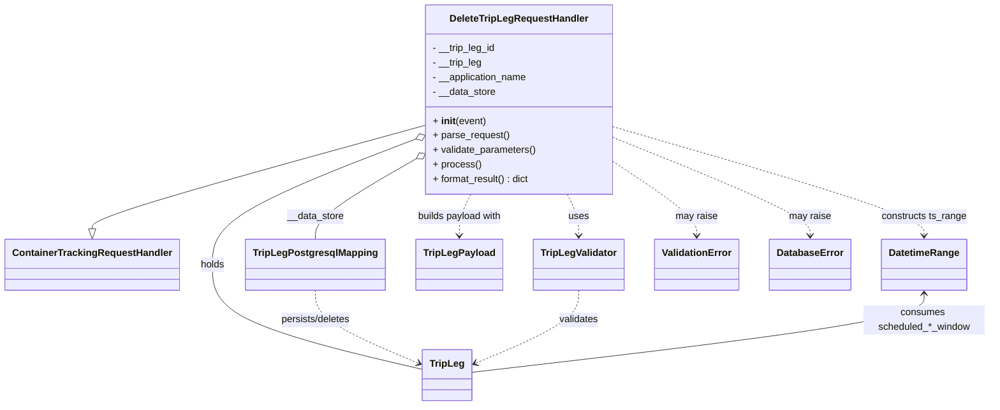

# Diagram: container_tracking_core/container_tracking_service/container_tracking_service/api/trip_leg/handlers/delete_trip_leg_handler.py


> Auto-generated by Obscura crawlers

## Diagram 1



### SVG

<svg id="container" width="1581.8046875" xmlns="http://www.w3.org/2000/svg" class="classDiagram" height="668" viewBox="0 0 1581.8046875 668" role="graphics-document document" aria-roledescription="class"><style>#container{font-family:"trebuchet ms",verdana,arial,sans-serif;font-size:16px;fill:#333;}@keyframes edge-animation-frame{from{stroke-dashoffset:0;}}@keyframes dash{to{stroke-dashoffset:0;}}#container .edge-animation-slow{stroke-dasharray:9,5!important;stroke-dashoffset:900;animation:dash 50s linear infinite;stroke-linecap:round;}#container .edge-animation-fast{stroke-dasharray:9,5!important;stroke-dashoffset:900;animation:dash 20s linear infinite;stroke-linecap:round;}#container .error-icon{fill:#552222;}#container .error-text{fill:#552222;stroke:#552222;}#container .edge-thickness-normal{stroke-width:1px;}#container .edge-thickness-thick{stroke-width:3.5px;}#container .edge-pattern-solid{stroke-dasharray:0;}#container .edge-thickness-invisible{stroke-width:0;fill:none;}#container .edge-pattern-dashed{stroke-dasharray:3;}#container .edge-pattern-dotted{stroke-dasharray:2;}#container .marker{fill:#333333;stroke:#333333;}#container .marker.cross{stroke:#333333;}#container svg{font-family:"trebuchet ms",verdana,arial,sans-serif;font-size:16px;}#container p{margin:0;}#container g.classGroup text{fill:#9370DB;stroke:none;font-family:"trebuchet ms",verdana,arial,sans-serif;font-size:10px;}#container g.classGroup text .title{font-weight:bolder;}#container .nodeLabel,#container .edgeLabel{color:#131300;}#container .edgeLabel .label rect{fill:#ECECFF;}#container .label text{fill:#131300;}#container .labelBkg{background:#ECECFF;}#container .edgeLabel .label span{background:#ECECFF;}#container .classTitle{font-weight:bolder;}#container .node rect,#container .node circle,#container .node ellipse,#container .node polygon,#container .node path{fill:#ECECFF;stroke:#9370DB;stroke-width:1px;}#container .divider{stroke:#9370DB;stroke-width:1;}#container g.clickable{cursor:pointer;}#container g.classGroup rect{fill:#ECECFF;stroke:#9370DB;}#container g.classGroup line{stroke:#9370DB;stroke-width:1;}#container .classLabel .box{stroke:none;stroke-width:0;fill:#ECECFF;opacity:0.5;}#container .classLabel .label{fill:#9370DB;font-size:10px;}#container .relation{stroke:#333333;stroke-width:1;fill:none;}#container .dashed-line{stroke-dasharray:3;}#container .dotted-line{stroke-dasharray:1 2;}#container #compositionStart,#container .composition{fill:#333333!important;stroke:#333333!important;stroke-width:1;}#container #compositionEnd,#container .composition{fill:#333333!important;stroke:#333333!important;stroke-width:1;}#container #dependencyStart,#container .dependency{fill:#333333!important;stroke:#333333!important;stroke-width:1;}#container #dependencyStart,#container .dependency{fill:#333333!important;stroke:#333333!important;stroke-width:1;}#container #extensionStart,#container .extension{fill:transparent!important;stroke:#333333!important;stroke-width:1;}#container #extensionEnd,#container .extension{fill:transparent!important;stroke:#333333!important;stroke-width:1;}#container #aggregationStart,#container .aggregation{fill:transparent!important;stroke:#333333!important;stroke-width:1;}#container #aggregationEnd,#container .aggregation{fill:transparent!important;stroke:#333333!important;stroke-width:1;}#container #lollipopStart,#container .lollipop{fill:#ECECFF!important;stroke:#333333!important;stroke-width:1;}#container #lollipopEnd,#container .lollipop{fill:#ECECFF!important;stroke:#333333!important;stroke-width:1;}#container .edgeTerminals{font-size:11px;line-height:initial;}#container .classTitleText{text-anchor:middle;font-size:18px;fill:#333;}#container .label-icon{display:inline-block;height:1em;overflow:visible;vertical-align:-0.125em;}#container .node .label-icon path{fill:currentColor;stroke:revert;stroke-width:revert;}#container :root{--mermaid-font-family:"trebuchet ms",verdana,arial,sans-serif;}</style><g><defs><marker id="container_class-aggregationStart" class="marker aggregation class" refX="18" refY="7" markerWidth="190" markerHeight="240" orient="auto"><path d="M 18,7 L9,13 L1,7 L9,1 Z"></path></marker></defs><defs><marker id="container_class-aggregationEnd" class="marker aggregation class" refX="1" refY="7" markerWidth="20" markerHeight="28" orient="auto"><path d="M 18,7 L9,13 L1,7 L9,1 Z"></path></marker></defs><defs><marker id="container_class-extensionStart" class="marker extension class" refX="18" refY="7" markerWidth="190" markerHeight="240" orient="auto"><path d="M 1,7 L18,13 V 1 Z"></path></marker></defs><defs><marker id="container_class-extensionEnd" class="marker extension class" refX="1" refY="7" markerWidth="20" markerHeight="28" orient="auto"><path d="M 1,1 V 13 L18,7 Z"></path></marker></defs><defs><marker id="container_class-compositionStart" class="marker composition class" refX="18" refY="7" markerWidth="190" markerHeight="240" orient="auto"><path d="M 18,7 L9,13 L1,7 L9,1 Z"></path></marker></defs><defs><marker id="container_class-compositionEnd" class="marker composition class" refX="1" refY="7" markerWidth="20" markerHeight="28" orient="auto"><path d="M 18,7 L9,13 L1,7 L9,1 Z"></path></marker></defs><defs><marker id="container_class-dependencyStart" class="marker dependency class" refX="6" refY="7" markerWidth="190" markerHeight="240" orient="auto"><path d="M 5,7 L9,13 L1,7 L9,1 Z"></path></marker></defs><defs><marker id="container_class-dependencyEnd" class="marker dependency class" refX="13" refY="7" markerWidth="20" markerHeight="28" orient="auto"><path d="M 18,7 L9,13 L14,7 L9,1 Z"></path></marker></defs><defs><marker id="container_class-lollipopStart" class="marker lollipop class" refX="13" refY="7" markerWidth="190" markerHeight="240" orient="auto"><circle stroke="black" fill="transparent" cx="7" cy="7" r="6"></circle></marker></defs><defs><marker id="container_class-lollipopEnd" class="marker lollipop class" refX="1" refY="7" markerWidth="190" markerHeight="240" orient="auto"><circle stroke="black" fill="transparent" cx="7" cy="7" r="6"></circle></marker></defs><g class="root"><g class="clusters"></g><g class="edgePaths"><path d="M673.098,207.261L585.179,232.217C497.26,257.174,321.423,307.087,233.505,335.335C145.586,363.583,145.586,370.167,145.586,373.458L145.586,376.75" id="id_DeleteTripLegRequestHandler_ContainerTrackingRequestHandler_1" class="edge-thickness-normal edge-pattern-solid relation" style=";;;" data-edge="true" data-et="edge" data-id="id_DeleteTripLegRequestHandler_ContainerTrackingRequestHandler_1" data-points="W3sieCI6NjczLjA5NzY1NjI1LCJ5IjoyMDcuMjYwODM4MzQxMjQyNTZ9LHsieCI6MTQ1LjU4NTkzNzUsInkiOjM1N30seyJ4IjoxNDUuNTg1OTM3NSwieSI6Mzk0fV0=" marker-end="url(#container_class-extensionEnd)"></path><path d="M657.06,230.734L603.944,251.778C550.827,272.823,444.593,314.911,391.476,349.122C338.359,383.333,338.359,409.667,338.359,438C338.359,466.333,338.359,496.667,394.09,525.414C449.82,554.161,561.281,581.322,617.012,594.903L672.742,608.483" id="id_DeleteTripLegRequestHandler_TripLeg_2" class="edge-thickness-normal edge-pattern-solid relation" style=";;;" data-edge="true" data-et="edge" data-id="id_DeleteTripLegRequestHandler_TripLeg_2" data-points="W3sieCI6NjczLjA5NzY1NjI1LCJ5IjoyMjQuMzgwMjA4MTY2Mjc2NDJ9LHsieCI6MzM4LjM1OTM3NSwieSI6MzU3fSx7IngiOjMzOC4zNTkzNzUsInkiOjQzNn0seyJ4IjozMzguMzU5Mzc1LCJ5Ijo1Mjd9LHsieCI6NjcyLjc0MjE4NzUsInkiOjYwOC40ODMwNzUzMTM4MDc1fV0=" marker-start="url(#container_class-aggregationStart)"></path><path d="M658.296,264.063L632.413,279.553C606.531,295.042,554.765,326.021,528.883,347.677C503,369.333,503,381.667,503,387.833L503,394" id="id_DeleteTripLegRequestHandler_TripLegPostgresqlMapping_3" class="edge-thickness-normal edge-pattern-solid relation" style=";;;" data-edge="true" data-et="edge" data-id="id_DeleteTripLegRequestHandler_TripLegPostgresqlMapping_3" data-points="W3sieCI6NjczLjA5NzY1NjI1LCJ5IjoyNTUuMjA1MTIzNTQ2NTExNjN9LHsieCI6NTAzLCJ5IjozNTd9LHsieCI6NTAzLCJ5IjozOTR9XQ==" marker-start="url(#container_class-aggregationStart)"></path><path d="M902.363,320L905.402,326.167C908.44,332.333,914.517,344.667,917.555,356C920.594,367.333,920.594,377.667,920.594,382.833L920.594,388" id="id_DeleteTripLegRequestHandler_TripLegValidator_4" class="edge-thickness-normal edge-pattern-dashed relation" style=";;;" data-edge="true" data-et="edge" data-id="id_DeleteTripLegRequestHandler_TripLegValidator_4" data-points="W3sieCI6OTAyLjM2MzM0MTk2ODkxMTksInkiOjMyMH0seyJ4Ijo5MjAuNTkzNzUsInkiOjM1N30seyJ4Ijo5MjAuNTkzNzUsInkiOjM5NH1d" marker-end="url(#container_class-dependencyEnd)"></path><path d="M748.637,320L745.598,326.167C742.56,332.333,736.483,344.667,733.445,356C730.406,367.333,730.406,377.667,730.406,382.833L730.406,388" id="id_DeleteTripLegRequestHandler_TripLegPayload_5" class="edge-thickness-normal edge-pattern-dashed relation" style=";;;" data-edge="true" data-et="edge" data-id="id_DeleteTripLegRequestHandler_TripLegPayload_5" data-points="W3sieCI6NzQ4LjYzNjY1ODAzMTA4ODEsInkiOjMyMH0seyJ4Ijo3MzAuNDA2MjUsInkiOjM1N30seyJ4Ijo3MzAuNDA2MjUsInkiOjM5NH1d" marker-end="url(#container_class-dependencyEnd)"></path><path d="M977.902,209.37L1060.553,233.975C1143.203,258.58,1308.504,307.79,1391.154,337.562C1473.805,367.333,1473.805,377.667,1473.805,382.833L1473.805,388" id="id_DeleteTripLegRequestHandler_DatetimeRange_6" class="edge-thickness-normal edge-pattern-dashed relation" style=";;;" data-edge="true" data-et="edge" data-id="id_DeleteTripLegRequestHandler_DatetimeRange_6" data-points="W3sieCI6OTc3LjkwMjM0Mzc1LCJ5IjoyMDkuMzcwMTA1OTI1MzA5OTl9LHsieCI6MTQ3My44MDQ2ODc1LCJ5IjozNTd9LHsieCI6MTQ3My44MDQ2ODc1LCJ5IjozOTR9XQ==" marker-end="url(#container_class-dependencyEnd)"></path><path d="M977.902,267.384L999.92,282.32C1021.938,297.256,1065.973,327.128,1087.99,347.231C1110.008,367.333,1110.008,377.667,1110.008,382.833L1110.008,388" id="id_DeleteTripLegRequestHandler_ValidationError_7" class="edge-thickness-normal edge-pattern-dashed relation" style=";;;" data-edge="true" data-et="edge" data-id="id_DeleteTripLegRequestHandler_ValidationError_7" data-points="W3sieCI6OTc3LjkwMjM0Mzc1LCJ5IjoyNjcuMzg0MzM5NzMxNDQ0MTN9LHsieCI6MTExMC4wMDc4MTI1LCJ5IjozNTd9LHsieCI6MTExMC4wMDc4MTI1LCJ5IjozOTR9XQ==" marker-end="url(#container_class-dependencyEnd)"></path><path d="M977.902,227.113L1030.176,248.761C1082.451,270.409,1186.999,313.704,1239.273,340.519C1291.547,367.333,1291.547,377.667,1291.547,382.833L1291.547,388" id="id_DeleteTripLegRequestHandler_DatabaseError_8" class="edge-thickness-normal edge-pattern-dashed relation" style=";;;" data-edge="true" data-et="edge" data-id="id_DeleteTripLegRequestHandler_DatabaseError_8" data-points="W3sieCI6OTc3LjkwMjM0Mzc1LCJ5IjoyMjcuMTEzMDc3MDc3ODE1NH0seyJ4IjoxMjkxLjU0Njg3NSwieSI6MzU3fSx7IngiOjEyOTEuNTQ2ODc1LCJ5IjozOTR9XQ==" marker-end="url(#container_class-dependencyEnd)"></path><path d="M503,478L503,486.167C503,494.333,503,510.667,530.374,530.764C557.747,550.861,612.495,574.721,639.868,586.651L667.242,598.582" id="id_TripLegPostgresqlMapping_TripLeg_9" class="edge-thickness-normal edge-pattern-dashed relation" style=";;;" data-edge="true" data-et="edge" data-id="id_TripLegPostgresqlMapping_TripLeg_9" data-points="W3sieCI6NTAzLCJ5Ijo0Nzh9LHsieCI6NTAzLCJ5Ijo1Mjd9LHsieCI6NjcyLjc0MjE4NzUsInkiOjYwMC45Nzg3ODQ3MDQwMzM1fV0=" marker-end="url(#container_class-dependencyEnd)"></path><path d="M920.594,478L920.594,486.167C920.594,494.333,920.594,510.667,893.22,530.764C865.846,550.861,811.099,574.721,783.726,586.651L756.352,598.582" id="id_TripLegValidator_TripLeg_10" class="edge-thickness-normal edge-pattern-dashed relation" style=";;;" data-edge="true" data-et="edge" data-id="id_TripLegValidator_TripLeg_10" data-points="W3sieCI6OTIwLjU5Mzc1LCJ5Ijo0Nzh9LHsieCI6OTIwLjU5Mzc1LCJ5Ijo1Mjd9LHsieCI6NzUwLjg1MTU2MjUsInkiOjYwMC45Nzg3ODQ3MDQwMzM1fV0=" marker-end="url(#container_class-dependencyEnd)"></path><path d="M1473.805,484L1473.805,491.167C1473.805,498.333,1473.805,512.667,1353.313,534.223C1232.82,555.779,991.836,584.557,871.344,598.947L750.852,613.336" id="id_DatetimeRange_TripLeg_11" class="edge-thickness-normal edge-pattern-solid relation" style=";;;" data-edge="true" data-et="edge" data-id="id_DatetimeRange_TripLeg_11" data-points="W3sieCI6MTQ3My44MDQ2ODc1LCJ5Ijo0Nzh9LHsieCI6MTQ3My44MDQ2ODc1LCJ5Ijo1Mjd9LHsieCI6NzUwLjg1MTU2MjUsInkiOjYxMy4zMzYwMzY1ODA5ODk4fV0=" marker-start="url(#container_class-dependencyStart)"></path></g><g class="edgeLabels"><g class="edgeLabel"><g class="label" data-id="id_DeleteTripLegRequestHandler_ContainerTrackingRequestHandler_1" transform="translate(0, 0)"><foreignObject width="0" height="0"><div xmlns="http://www.w3.org/1999/xhtml" class="labelBkg" style="display: table-cell; white-space: nowrap; line-height: 1.5; max-width: 200px; text-align: center;"><span class="edgeLabel"></span></div></foreignObject></g></g><g class="edgeLabel" transform="translate(338.359375, 436)"><g class="label" data-id="id_DeleteTripLegRequestHandler_TripLeg_2" transform="translate(-20.1875, -12)"><foreignObject width="40.375" height="24"><div xmlns="http://www.w3.org/1999/xhtml" class="labelBkg" style="display: table-cell; white-space: nowrap; line-height: 1.5; max-width: 200px; text-align: center;"><span class="edgeLabel"><p>holds</p></span></div></foreignObject></g></g><g class="edgeLabel" transform="translate(503, 357)"><g class="label" data-id="id_DeleteTripLegRequestHandler_TripLegPostgresqlMapping_3" transform="translate(-46.9453125, -12)"><foreignObject width="93.890625" height="24"><div xmlns="http://www.w3.org/1999/xhtml" class="labelBkg" style="display: table-cell; white-space: nowrap; line-height: 1.5; max-width: 200px; text-align: center;"><span class="edgeLabel"><p>__data_store</p></span></div></foreignObject></g></g><g class="edgeLabel" transform="translate(920.59375, 357)"><g class="label" data-id="id_DeleteTripLegRequestHandler_TripLegValidator_4" transform="translate(-16.4921875, -12)"><foreignObject width="32.984375" height="24"><div xmlns="http://www.w3.org/1999/xhtml" class="labelBkg" style="display: table-cell; white-space: nowrap; line-height: 1.5; max-width: 200px; text-align: center;"><span class="edgeLabel"><p>uses</p></span></div></foreignObject></g></g><g class="edgeLabel" transform="translate(730.40625, 357)"><g class="label" data-id="id_DeleteTripLegRequestHandler_TripLegPayload_5" transform="translate(-71.171875, -12)"><foreignObject width="142.34375" height="24"><div xmlns="http://www.w3.org/1999/xhtml" class="labelBkg" style="display: table-cell; white-space: nowrap; line-height: 1.5; max-width: 200px; text-align: center;"><span class="edgeLabel"><p>builds payload with</p></span></div></foreignObject></g></g><g class="edgeLabel" transform="translate(1473.8046875, 357)"><g class="label" data-id="id_DeleteTripLegRequestHandler_DatetimeRange_6" transform="translate(-70.828125, -12)"><foreignObject width="141.65625" height="24"><div xmlns="http://www.w3.org/1999/xhtml" class="labelBkg" style="display: table-cell; white-space: nowrap; line-height: 1.5; max-width: 200px; text-align: center;"><span class="edgeLabel"><p>constructs ts_range</p></span></div></foreignObject></g></g><g class="edgeLabel" transform="translate(1110.0078125, 357)"><g class="label" data-id="id_DeleteTripLegRequestHandler_ValidationError_7" transform="translate(-34.65625, -12)"><foreignObject width="69.3125" height="24"><div xmlns="http://www.w3.org/1999/xhtml" class="labelBkg" style="display: table-cell; white-space: nowrap; line-height: 1.5; max-width: 200px; text-align: center;"><span class="edgeLabel"><p>may raise</p></span></div></foreignObject></g></g><g class="edgeLabel" transform="translate(1291.546875, 357)"><g class="label" data-id="id_DeleteTripLegRequestHandler_DatabaseError_8" transform="translate(-34.65625, -12)"><foreignObject width="69.3125" height="24"><div xmlns="http://www.w3.org/1999/xhtml" class="labelBkg" style="display: table-cell; white-space: nowrap; line-height: 1.5; max-width: 200px; text-align: center;"><span class="edgeLabel"><p>may raise</p></span></div></foreignObject></g></g><g class="edgeLabel" transform="translate(503, 527)"><g class="label" data-id="id_TripLegPostgresqlMapping_TripLeg_9" transform="translate(-58.8671875, -12)"><foreignObject width="117.734375" height="24"><div xmlns="http://www.w3.org/1999/xhtml" class="labelBkg" style="display: table-cell; white-space: nowrap; line-height: 1.5; max-width: 200px; text-align: center;"><span class="edgeLabel"><p>persists/deletes</p></span></div></foreignObject></g></g><g class="edgeLabel" transform="translate(920.59375, 527)"><g class="label" data-id="id_TripLegValidator_TripLeg_10" transform="translate(-32.6875, -12)"><foreignObject width="65.375" height="24"><div xmlns="http://www.w3.org/1999/xhtml" class="labelBkg" style="display: table-cell; white-space: nowrap; line-height: 1.5; max-width: 200px; text-align: center;"><span class="edgeLabel"><p>validates</p></span></div></foreignObject></g></g><g class="edgeLabel" transform="translate(1473.8046875, 527)"><g class="label" data-id="id_DatetimeRange_TripLeg_11" transform="translate(-100, -24)"><foreignObject width="200" height="48"><div xmlns="http://www.w3.org/1999/xhtml" class="labelBkg" style="display: table; white-space: break-spaces; line-height: 1.5; max-width: 200px; text-align: center; width: 200px;"><span class="edgeLabel"><p>consumes scheduled_*_window</p></span></div></foreignObject></g></g></g><g class="nodes"><g class="node default" id="classId-DeleteTripLegRequestHandler-0" transform="translate(825.5, 164)"><g class="basic label-container"><path d="M-152.40234375 -156 L152.40234375 -156 L152.40234375 156 L-152.40234375 156" stroke="none" stroke-width="0" fill="#ECECFF" style=""></path><path d="M-152.40234375 -156 C-81.61433908080392 -156, -10.826334411607831 -156, 152.40234375 -156 M-152.40234375 -156 C-57.766132272981295 -156, 36.87007920403741 -156, 152.40234375 -156 M152.40234375 -156 C152.40234375 -31.34437715341906, 152.40234375 93.31124569316188, 152.40234375 156 M152.40234375 -156 C152.40234375 -41.74419214064409, 152.40234375 72.51161571871182, 152.40234375 156 M152.40234375 156 C63.151398269642144 156, -26.099547210715713 156, -152.40234375 156 M152.40234375 156 C39.87187687411503 156, -72.65859000176994 156, -152.40234375 156 M-152.40234375 156 C-152.40234375 49.12085321519102, -152.40234375 -57.75829356961796, -152.40234375 -156 M-152.40234375 156 C-152.40234375 53.90115951993691, -152.40234375 -48.19768096012618, -152.40234375 -156" stroke="#9370DB" stroke-width="1.3" fill="none" stroke-dasharray="0 0" style=""></path></g><g class="annotation-group text" transform="translate(0, -132)"></g><g class="label-group text" transform="translate(-109.8515625, -132)"><g class="label" style="font-weight: bolder" transform="translate(0,-12)"><foreignObject width="219.703125" height="24"><div xmlns="http://www.w3.org/1999/xhtml" style="display: table-cell; white-space: nowrap; line-height: 1.5; max-width: 267px; text-align: center;"><span class="nodeLabel markdown-node-label" style=""><p>DeleteTripLegRequestHandler</p></span></div></foreignObject></g></g><g class="members-group text" transform="translate(-140.40234375, -84)"><g class="label" style="" transform="translate(0,-12)"><foreignObject width="104.78125" height="24"><div xmlns="http://www.w3.org/1999/xhtml" style="display: table-cell; white-space: nowrap; line-height: 1.5; max-width: 162px; text-align: center;"><span class="nodeLabel markdown-node-label" style=""><p>- __trip_leg_id</p></span></div></foreignObject></g><g class="label" style="" transform="translate(0,12)"><foreignObject width="82.3125" height="24"><div xmlns="http://www.w3.org/1999/xhtml" style="display: table-cell; white-space: nowrap; line-height: 1.5; max-width: 140px; text-align: center;"><span class="nodeLabel markdown-node-label" style=""><p>- __trip_leg</p></span></div></foreignObject></g><g class="label" style="" transform="translate(0,36)"><foreignObject width="157.796875" height="24"><div xmlns="http://www.w3.org/1999/xhtml" style="display: table-cell; white-space: nowrap; line-height: 1.5; max-width: 215px; text-align: center;"><span class="nodeLabel markdown-node-label" style=""><p>- __application_name</p></span></div></foreignObject></g><g class="label" style="" transform="translate(0,60)"><foreignObject width="104.578125" height="24"><div xmlns="http://www.w3.org/1999/xhtml" style="display: table-cell; white-space: nowrap; line-height: 1.5; max-width: 162px; text-align: center;"><span class="nodeLabel markdown-node-label" style=""><p>- __data_store</p></span></div></foreignObject></g></g><g class="methods-group text" transform="translate(-140.40234375, 36)"><g class="label" style="" transform="translate(0,-12)"><foreignObject width="87.390625" height="24"><div xmlns="http://www.w3.org/1999/xhtml" style="display: table-cell; white-space: nowrap; line-height: 1.5; max-width: 177px; text-align: center;"><span class="nodeLabel markdown-node-label" style=""><p>+ <strong>init</strong>(event)</p></span></div></foreignObject></g><g class="label" style="" transform="translate(0,12)"><foreignObject width="126.046875" height="24"><div xmlns="http://www.w3.org/1999/xhtml" style="display: table-cell; white-space: nowrap; line-height: 1.5; max-width: 183px; text-align: center;"><span class="nodeLabel markdown-node-label" style=""><p>+ parse_request()</p></span></div></foreignObject></g><g class="label" style="" transform="translate(0,36)"><foreignObject width="170.953125" height="24"><div xmlns="http://www.w3.org/1999/xhtml" style="display: table-cell; white-space: nowrap; line-height: 1.5; max-width: 228px; text-align: center;"><span class="nodeLabel markdown-node-label" style=""><p>+ validate_parameters()</p></span></div></foreignObject></g><g class="label" style="" transform="translate(0,60)"><foreignObject width="77.96875" height="24"><div xmlns="http://www.w3.org/1999/xhtml" style="display: table-cell; white-space: nowrap; line-height: 1.5; max-width: 135px; text-align: center;"><span class="nodeLabel markdown-node-label" style=""><p>+ process()</p></span></div></foreignObject></g><g class="label" style="" transform="translate(0,84)"><foreignObject width="161.3125" height="24"><div xmlns="http://www.w3.org/1999/xhtml" style="display: table-cell; white-space: nowrap; line-height: 1.5; max-width: 219px; text-align: center;"><span class="nodeLabel markdown-node-label" style=""><p>+ format_result() : dict</p></span></div></foreignObject></g></g><g class="divider" style=""><path d="M-152.40234375 -108 C-43.56903980538587 -108, 65.26426413922826 -108, 152.40234375 -108 M-152.40234375 -108 C-81.00884575617732 -108, -9.615347762354645 -108, 152.40234375 -108" stroke="#9370DB" stroke-width="1.3" fill="none" stroke-dasharray="0 0" style=""></path></g><g class="divider" style=""><path d="M-152.40234375 12 C-90.8037697826282 12, -29.205195815256374 12, 152.40234375 12 M-152.40234375 12 C-39.87113165265767 12, 72.66008044468467 12, 152.40234375 12" stroke="#9370DB" stroke-width="1.3" fill="none" stroke-dasharray="0 0" style=""></path></g></g><g class="node default" id="classId-ContainerTrackingRequestHandler-1" transform="translate(145.5859375, 436)"><g class="basic label-container"><path d="M-137.5859375 -42 L137.5859375 -42 L137.5859375 42 L-137.5859375 42" stroke="none" stroke-width="0" fill="#ECECFF" style=""></path><path d="M-137.5859375 -42 C-44.75276758890213 -42, 48.08040232219574 -42, 137.5859375 -42 M-137.5859375 -42 C-55.143069879531524 -42, 27.299797740936953 -42, 137.5859375 -42 M137.5859375 -42 C137.5859375 -22.551645485872957, 137.5859375 -3.1032909717459134, 137.5859375 42 M137.5859375 -42 C137.5859375 -17.86615194928978, 137.5859375 6.267696101420441, 137.5859375 42 M137.5859375 42 C33.6839864261144 42, -70.2179646477712 42, -137.5859375 42 M137.5859375 42 C30.149744878671385 42, -77.28644774265723 42, -137.5859375 42 M-137.5859375 42 C-137.5859375 24.992536446809805, -137.5859375 7.985072893619609, -137.5859375 -42 M-137.5859375 42 C-137.5859375 22.685972177369404, -137.5859375 3.371944354738808, -137.5859375 -42" stroke="#9370DB" stroke-width="1.3" fill="none" stroke-dasharray="0 0" style=""></path></g><g class="annotation-group text" transform="translate(0, -18)"></g><g class="label-group text" transform="translate(-125.5859375, -18)"><g class="label" style="font-weight: bolder" transform="translate(0,-12)"><foreignObject width="251.171875" height="24"><div xmlns="http://www.w3.org/1999/xhtml" style="display: table-cell; white-space: nowrap; line-height: 1.5; max-width: 299px; text-align: center;"><span class="nodeLabel markdown-node-label" style=""><p>ContainerTrackingRequestHandler</p></span></div></foreignObject></g></g><g class="members-group text" transform="translate(-125.5859375, 30)"></g><g class="methods-group text" transform="translate(-125.5859375, 60)"></g><g class="divider" style=""><path d="M-137.5859375 6 C-59.64895836623961 6, 18.288020767520777 6, 137.5859375 6 M-137.5859375 6 C-77.65525795674837 6, -17.724578413496744 6, 137.5859375 6" stroke="#9370DB" stroke-width="1.3" fill="none" stroke-dasharray="0 0" style=""></path></g><g class="divider" style=""><path d="M-137.5859375 24 C-75.26482672717327 24, -12.943715954346558 24, 137.5859375 24 M-137.5859375 24 C-65.29243023208336 24, 7.001077035833276 24, 137.5859375 24" stroke="#9370DB" stroke-width="1.3" fill="none" stroke-dasharray="0 0" style=""></path></g></g><g class="node default" id="classId-TripLeg-2" transform="translate(711.796875, 618)"><g class="basic label-container"><path d="M-39.0546875 -42 L39.0546875 -42 L39.0546875 42 L-39.0546875 42" stroke="none" stroke-width="0" fill="#ECECFF" style=""></path><path d="M-39.0546875 -42 C-17.681306751779985 -42, 3.6920739964400298 -42, 39.0546875 -42 M-39.0546875 -42 C-18.06873360217052 -42, 2.9172202956589572 -42, 39.0546875 -42 M39.0546875 -42 C39.0546875 -22.02301865437893, 39.0546875 -2.0460373087578603, 39.0546875 42 M39.0546875 -42 C39.0546875 -17.75749311922721, 39.0546875 6.485013761545581, 39.0546875 42 M39.0546875 42 C8.323444422730052 42, -22.407798654539896 42, -39.0546875 42 M39.0546875 42 C10.132820662016645 42, -18.78904617596671 42, -39.0546875 42 M-39.0546875 42 C-39.0546875 20.777872412589435, -39.0546875 -0.4442551748211301, -39.0546875 -42 M-39.0546875 42 C-39.0546875 17.17123418818361, -39.0546875 -7.657531623632778, -39.0546875 -42" stroke="#9370DB" stroke-width="1.3" fill="none" stroke-dasharray="0 0" style=""></path></g><g class="annotation-group text" transform="translate(0, -18)"></g><g class="label-group text" transform="translate(-27.0546875, -18)"><g class="label" style="font-weight: bolder" transform="translate(0,-12)"><foreignObject width="54.109375" height="24"><div xmlns="http://www.w3.org/1999/xhtml" style="display: table-cell; white-space: nowrap; line-height: 1.5; max-width: 103px; text-align: center;"><span class="nodeLabel markdown-node-label" style=""><p>TripLeg</p></span></div></foreignObject></g></g><g class="members-group text" transform="translate(-27.0546875, 30)"></g><g class="methods-group text" transform="translate(-27.0546875, 60)"></g><g class="divider" style=""><path d="M-39.0546875 6 C-22.26421712145077 6, -5.47374674290154 6, 39.0546875 6 M-39.0546875 6 C-23.432618195819416 6, -7.8105488916388275 6, 39.0546875 6" stroke="#9370DB" stroke-width="1.3" fill="none" stroke-dasharray="0 0" style=""></path></g><g class="divider" style=""><path d="M-39.0546875 24 C-17.45793463288844 24, 4.138818234223123 24, 39.0546875 24 M-39.0546875 24 C-17.502646424908765 24, 4.049394650182471 24, 39.0546875 24" stroke="#9370DB" stroke-width="1.3" fill="none" stroke-dasharray="0 0" style=""></path></g></g><g class="node default" id="classId-TripLegPostgresqlMapping-3" transform="translate(503, 436)"><g class="basic label-container"><path d="M-109.453125 -42 L109.453125 -42 L109.453125 42 L-109.453125 42" stroke="none" stroke-width="0" fill="#ECECFF" style=""></path><path d="M-109.453125 -42 C-53.738180033210995 -42, 1.9767649335780106 -42, 109.453125 -42 M-109.453125 -42 C-22.17826359569868 -42, 65.09659780860264 -42, 109.453125 -42 M109.453125 -42 C109.453125 -12.970607857044776, 109.453125 16.05878428591045, 109.453125 42 M109.453125 -42 C109.453125 -23.787991152647795, 109.453125 -5.5759823052955895, 109.453125 42 M109.453125 42 C50.07197473509958 42, -9.30917552980084 42, -109.453125 42 M109.453125 42 C64.32558903883775 42, 19.198053077675496 42, -109.453125 42 M-109.453125 42 C-109.453125 22.373778603394616, -109.453125 2.7475572067892315, -109.453125 -42 M-109.453125 42 C-109.453125 22.24104553465508, -109.453125 2.482091069310158, -109.453125 -42" stroke="#9370DB" stroke-width="1.3" fill="none" stroke-dasharray="0 0" style=""></path></g><g class="annotation-group text" transform="translate(0, -18)"></g><g class="label-group text" transform="translate(-97.453125, -18)"><g class="label" style="font-weight: bolder" transform="translate(0,-12)"><foreignObject width="194.90625" height="24"><div xmlns="http://www.w3.org/1999/xhtml" style="display: table-cell; white-space: nowrap; line-height: 1.5; max-width: 241px; text-align: center;"><span class="nodeLabel markdown-node-label" style=""><p>TripLegPostgresqlMapping</p></span></div></foreignObject></g></g><g class="members-group text" transform="translate(-97.453125, 30)"></g><g class="methods-group text" transform="translate(-97.453125, 60)"></g><g class="divider" style=""><path d="M-109.453125 6 C-59.04983439649736 6, -8.64654379299472 6, 109.453125 6 M-109.453125 6 C-59.62752541551991 6, -9.801925831039824 6, 109.453125 6" stroke="#9370DB" stroke-width="1.3" fill="none" stroke-dasharray="0 0" style=""></path></g><g class="divider" style=""><path d="M-109.453125 24 C-36.5333779038711 24, 36.3863691922578 24, 109.453125 24 M-109.453125 24 C-61.7443316244591 24, -14.0355382489182 24, 109.453125 24" stroke="#9370DB" stroke-width="1.3" fill="none" stroke-dasharray="0 0" style=""></path></g></g><g class="node default" id="classId-TripLegValidator-4" transform="translate(920.59375, 436)"><g class="basic label-container"><path d="M-72.234375 -42 L72.234375 -42 L72.234375 42 L-72.234375 42" stroke="none" stroke-width="0" fill="#ECECFF" style=""></path><path d="M-72.234375 -42 C-34.837403331887906 -42, 2.5595683362241886 -42, 72.234375 -42 M-72.234375 -42 C-30.554864321879684 -42, 11.124646356240632 -42, 72.234375 -42 M72.234375 -42 C72.234375 -12.951963709495477, 72.234375 16.096072581009047, 72.234375 42 M72.234375 -42 C72.234375 -17.84924408553785, 72.234375 6.301511828924298, 72.234375 42 M72.234375 42 C29.50590199457936 42, -13.222571010841278 42, -72.234375 42 M72.234375 42 C39.602321365493275 42, 6.970267730986549 42, -72.234375 42 M-72.234375 42 C-72.234375 17.836292956648492, -72.234375 -6.3274140867030155, -72.234375 -42 M-72.234375 42 C-72.234375 21.58642069871706, -72.234375 1.1728413974341194, -72.234375 -42" stroke="#9370DB" stroke-width="1.3" fill="none" stroke-dasharray="0 0" style=""></path></g><g class="annotation-group text" transform="translate(0, -18)"></g><g class="label-group text" transform="translate(-60.234375, -18)"><g class="label" style="font-weight: bolder" transform="translate(0,-12)"><foreignObject width="120.46875" height="24"><div xmlns="http://www.w3.org/1999/xhtml" style="display: table-cell; white-space: nowrap; line-height: 1.5; max-width: 169px; text-align: center;"><span class="nodeLabel markdown-node-label" style=""><p>TripLegValidator</p></span></div></foreignObject></g></g><g class="members-group text" transform="translate(-60.234375, 30)"></g><g class="methods-group text" transform="translate(-60.234375, 60)"></g><g class="divider" style=""><path d="M-72.234375 6 C-35.968416635811636 6, 0.29754172837672854 6, 72.234375 6 M-72.234375 6 C-25.56214839421564 6, 21.11007821156872 6, 72.234375 6" stroke="#9370DB" stroke-width="1.3" fill="none" stroke-dasharray="0 0" style=""></path></g><g class="divider" style=""><path d="M-72.234375 24 C-20.16817015147236 24, 31.89803469705528 24, 72.234375 24 M-72.234375 24 C-29.718412942279798 24, 12.797549115440404 24, 72.234375 24" stroke="#9370DB" stroke-width="1.3" fill="none" stroke-dasharray="0 0" style=""></path></g></g><g class="node default" id="classId-TripLegPayload-5" transform="translate(730.40625, 436)"><g class="basic label-container"><path d="M-67.953125 -42 L67.953125 -42 L67.953125 42 L-67.953125 42" stroke="none" stroke-width="0" fill="#ECECFF" style=""></path><path d="M-67.953125 -42 C-37.49441881576095 -42, -7.035712631521903 -42, 67.953125 -42 M-67.953125 -42 C-38.23169667263916 -42, -8.510268345278313 -42, 67.953125 -42 M67.953125 -42 C67.953125 -19.375418600724817, 67.953125 3.2491627985503655, 67.953125 42 M67.953125 -42 C67.953125 -17.628135241327463, 67.953125 6.7437295173450735, 67.953125 42 M67.953125 42 C32.26854932993886 42, -3.4160263401222863 42, -67.953125 42 M67.953125 42 C23.38526659865783 42, -21.182591802684342 42, -67.953125 42 M-67.953125 42 C-67.953125 23.334770908408785, -67.953125 4.669541816817571, -67.953125 -42 M-67.953125 42 C-67.953125 20.392218931424114, -67.953125 -1.215562137151771, -67.953125 -42" stroke="#9370DB" stroke-width="1.3" fill="none" stroke-dasharray="0 0" style=""></path></g><g class="annotation-group text" transform="translate(0, -18)"></g><g class="label-group text" transform="translate(-55.953125, -18)"><g class="label" style="font-weight: bolder" transform="translate(0,-12)"><foreignObject width="111.90625" height="24"><div xmlns="http://www.w3.org/1999/xhtml" style="display: table-cell; white-space: nowrap; line-height: 1.5; max-width: 159px; text-align: center;"><span class="nodeLabel markdown-node-label" style=""><p>TripLegPayload</p></span></div></foreignObject></g></g><g class="members-group text" transform="translate(-55.953125, 30)"></g><g class="methods-group text" transform="translate(-55.953125, 60)"></g><g class="divider" style=""><path d="M-67.953125 6 C-29.227320665138876 6, 9.498483669722248 6, 67.953125 6 M-67.953125 6 C-37.01278729996987 6, -6.072449599939738 6, 67.953125 6" stroke="#9370DB" stroke-width="1.3" fill="none" stroke-dasharray="0 0" style=""></path></g><g class="divider" style=""><path d="M-67.953125 24 C-36.02014938169643 24, -4.0871737633928475 24, 67.953125 24 M-67.953125 24 C-13.794283275112754 24, 40.36455844977449 24, 67.953125 24" stroke="#9370DB" stroke-width="1.3" fill="none" stroke-dasharray="0 0" style=""></path></g></g><g class="node default" id="classId-DatetimeRange-6" transform="translate(1473.8046875, 436)"><g class="basic label-container"><path d="M-67.8984375 -42 L67.8984375 -42 L67.8984375 42 L-67.8984375 42" stroke="none" stroke-width="0" fill="#ECECFF" style=""></path><path d="M-67.8984375 -42 C-20.809461540284964 -42, 26.279514419430072 -42, 67.8984375 -42 M-67.8984375 -42 C-29.397589339248704 -42, 9.103258821502592 -42, 67.8984375 -42 M67.8984375 -42 C67.8984375 -12.256723213349403, 67.8984375 17.486553573301194, 67.8984375 42 M67.8984375 -42 C67.8984375 -10.83133741329852, 67.8984375 20.33732517340296, 67.8984375 42 M67.8984375 42 C19.02318761350144 42, -29.852062272997117 42, -67.8984375 42 M67.8984375 42 C28.24229137829073 42, -11.41385474341854 42, -67.8984375 42 M-67.8984375 42 C-67.8984375 21.993255657248948, -67.8984375 1.9865113144978963, -67.8984375 -42 M-67.8984375 42 C-67.8984375 22.96736451165249, -67.8984375 3.934729023304982, -67.8984375 -42" stroke="#9370DB" stroke-width="1.3" fill="none" stroke-dasharray="0 0" style=""></path></g><g class="annotation-group text" transform="translate(0, -18)"></g><g class="label-group text" transform="translate(-55.8984375, -18)"><g class="label" style="font-weight: bolder" transform="translate(0,-12)"><foreignObject width="111.796875" height="24"><div xmlns="http://www.w3.org/1999/xhtml" style="display: table-cell; white-space: nowrap; line-height: 1.5; max-width: 160px; text-align: center;"><span class="nodeLabel markdown-node-label" style=""><p>DatetimeRange</p></span></div></foreignObject></g></g><g class="members-group text" transform="translate(-55.8984375, 30)"></g><g class="methods-group text" transform="translate(-55.8984375, 60)"></g><g class="divider" style=""><path d="M-67.8984375 6 C-17.181032438113768 6, 33.536372623772465 6, 67.8984375 6 M-67.8984375 6 C-27.27333570978257 6, 13.351766080434857 6, 67.8984375 6" stroke="#9370DB" stroke-width="1.3" fill="none" stroke-dasharray="0 0" style=""></path></g><g class="divider" style=""><path d="M-67.8984375 24 C-14.549777417755578 24, 38.79888266448884 24, 67.8984375 24 M-67.8984375 24 C-36.52564781030661 24, -5.15285812061321 24, 67.8984375 24" stroke="#9370DB" stroke-width="1.3" fill="none" stroke-dasharray="0 0" style=""></path></g></g><g class="node default" id="classId-ValidationError-7" transform="translate(1110.0078125, 436)"><g class="basic label-container"><path d="M-67.1796875 -42 L67.1796875 -42 L67.1796875 42 L-67.1796875 42" stroke="none" stroke-width="0" fill="#ECECFF" style=""></path><path d="M-67.1796875 -42 C-36.98077917507398 -42, -6.781870850147946 -42, 67.1796875 -42 M-67.1796875 -42 C-20.65569675369614 -42, 25.868293992607718 -42, 67.1796875 -42 M67.1796875 -42 C67.1796875 -8.684330231234021, 67.1796875 24.631339537531957, 67.1796875 42 M67.1796875 -42 C67.1796875 -23.46518381255774, 67.1796875 -4.93036762511548, 67.1796875 42 M67.1796875 42 C24.03760339485101 42, -19.104480710297977 42, -67.1796875 42 M67.1796875 42 C31.36226409129192 42, -4.455159317416161 42, -67.1796875 42 M-67.1796875 42 C-67.1796875 13.64432152556762, -67.1796875 -14.711356948864761, -67.1796875 -42 M-67.1796875 42 C-67.1796875 18.347074436779344, -67.1796875 -5.305851126441311, -67.1796875 -42" stroke="#9370DB" stroke-width="1.3" fill="none" stroke-dasharray="0 0" style=""></path></g><g class="annotation-group text" transform="translate(0, -18)"></g><g class="label-group text" transform="translate(-55.1796875, -18)"><g class="label" style="font-weight: bolder" transform="translate(0,-12)"><foreignObject width="110.359375" height="24"><div xmlns="http://www.w3.org/1999/xhtml" style="display: table-cell; white-space: nowrap; line-height: 1.5; max-width: 160px; text-align: center;"><span class="nodeLabel markdown-node-label" style=""><p>ValidationError</p></span></div></foreignObject></g></g><g class="members-group text" transform="translate(-55.1796875, 30)"></g><g class="methods-group text" transform="translate(-55.1796875, 60)"></g><g class="divider" style=""><path d="M-67.1796875 6 C-36.51696208861752 6, -5.854236677235029 6, 67.1796875 6 M-67.1796875 6 C-26.944841871731974 6, 13.290003756536052 6, 67.1796875 6" stroke="#9370DB" stroke-width="1.3" fill="none" stroke-dasharray="0 0" style=""></path></g><g class="divider" style=""><path d="M-67.1796875 24 C-27.623781615980782 24, 11.932124268038436 24, 67.1796875 24 M-67.1796875 24 C-28.91444031088718 24, 9.35080687822564 24, 67.1796875 24" stroke="#9370DB" stroke-width="1.3" fill="none" stroke-dasharray="0 0" style=""></path></g></g><g class="node default" id="classId-DatabaseError-8" transform="translate(1291.546875, 436)"><g class="basic label-container"><path d="M-64.359375 -42 L64.359375 -42 L64.359375 42 L-64.359375 42" stroke="none" stroke-width="0" fill="#ECECFF" style=""></path><path d="M-64.359375 -42 C-25.370177052761413 -42, 13.619020894477174 -42, 64.359375 -42 M-64.359375 -42 C-14.365605214269515 -42, 35.62816457146097 -42, 64.359375 -42 M64.359375 -42 C64.359375 -8.709712108250791, 64.359375 24.580575783498418, 64.359375 42 M64.359375 -42 C64.359375 -20.252770982135576, 64.359375 1.4944580357288473, 64.359375 42 M64.359375 42 C36.49451453392796 42, 8.629654067855924 42, -64.359375 42 M64.359375 42 C32.149849410253005 42, -0.059676179493990844 42, -64.359375 42 M-64.359375 42 C-64.359375 18.255695791336542, -64.359375 -5.488608417326915, -64.359375 -42 M-64.359375 42 C-64.359375 8.659555718762448, -64.359375 -24.680888562475104, -64.359375 -42" stroke="#9370DB" stroke-width="1.3" fill="none" stroke-dasharray="0 0" style=""></path></g><g class="annotation-group text" transform="translate(0, -18)"></g><g class="label-group text" transform="translate(-52.359375, -18)"><g class="label" style="font-weight: bolder" transform="translate(0,-12)"><foreignObject width="104.71875" height="24"><div xmlns="http://www.w3.org/1999/xhtml" style="display: table-cell; white-space: nowrap; line-height: 1.5; max-width: 154px; text-align: center;"><span class="nodeLabel markdown-node-label" style=""><p>DatabaseError</p></span></div></foreignObject></g></g><g class="members-group text" transform="translate(-52.359375, 30)"></g><g class="methods-group text" transform="translate(-52.359375, 60)"></g><g class="divider" style=""><path d="M-64.359375 6 C-35.9256989187482 6, -7.492022837496407 6, 64.359375 6 M-64.359375 6 C-38.549528698281705 6, -12.739682396563417 6, 64.359375 6" stroke="#9370DB" stroke-width="1.3" fill="none" stroke-dasharray="0 0" style=""></path></g><g class="divider" style=""><path d="M-64.359375 24 C-25.22200320541272 24, 13.915368589174562 24, 64.359375 24 M-64.359375 24 C-17.366705978688543 24, 29.625963042622914 24, 64.359375 24" stroke="#9370DB" stroke-width="1.3" fill="none" stroke-dasharray="0 0" style=""></path></g></g></g></g></g></svg>

## Diagram 2

```mermaid
sequenceDiagram
participant Client
participant Handler as DeleteTripLegRequestHandler
participant Validator as TripLegValidator
participant DataStore as TripLegPostgresqlMapping
participant TripLegObj as TripLeg
participant DT as DatetimeRange

Client->>Handler: initialize with event
Handler->>Handler: __init__ sets __data_store
Handler->>Handler: parse_request() -> get_path_parameter("tripLegId") and create TripLeg(id)
Handler->>Validator: validate(tripLeg, "DELETE")
alt validation fails
Validator-->>Handler: raise ValidationError
Handler-->>Client: error response (ValidationError)
else validation passes
Validator-->>Handler: validation OK
Handler->>DataStore: delete(tripLeg)
DataStore-->>Handler: returned TripLeg (possibly mutated)
Handler->>TripLegObj: is_valid()
alt trip leg invalid
TripLegObj-->>Handler: false
Handler-->>Client: raise DatabaseError
else trip leg valid
TripLegObj-->>Handler: true
Handler->>DT: set_ts_range([lower, upper]) for scheduled windows
DT-->>Handler: ts_range
Handler-->>Client: return payload, HTTP 200
```

> SVG rendering failed for this diagram.
