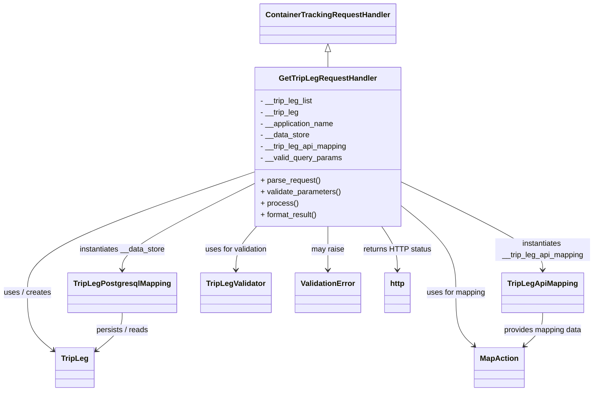

# Diagram: container_tracking_core/container_tracking_service/container_tracking_service/api/trip_leg/handlers/get_trip_leg_handler.py


> Auto-generated by Obscura crawlers

## Diagram 1



### SVG

<svg id="container" width="1234.1171875" xmlns="http://www.w3.org/2000/svg" class="classDiagram" height="826" viewBox="0 0 1234.1171875 826" role="graphics-document document" aria-roledescription="class"><style>#container{font-family:"trebuchet ms",verdana,arial,sans-serif;font-size:16px;fill:#333;}@keyframes edge-animation-frame{from{stroke-dashoffset:0;}}@keyframes dash{to{stroke-dashoffset:0;}}#container .edge-animation-slow{stroke-dasharray:9,5!important;stroke-dashoffset:900;animation:dash 50s linear infinite;stroke-linecap:round;}#container .edge-animation-fast{stroke-dasharray:9,5!important;stroke-dashoffset:900;animation:dash 20s linear infinite;stroke-linecap:round;}#container .error-icon{fill:#552222;}#container .error-text{fill:#552222;stroke:#552222;}#container .edge-thickness-normal{stroke-width:1px;}#container .edge-thickness-thick{stroke-width:3.5px;}#container .edge-pattern-solid{stroke-dasharray:0;}#container .edge-thickness-invisible{stroke-width:0;fill:none;}#container .edge-pattern-dashed{stroke-dasharray:3;}#container .edge-pattern-dotted{stroke-dasharray:2;}#container .marker{fill:#333333;stroke:#333333;}#container .marker.cross{stroke:#333333;}#container svg{font-family:"trebuchet ms",verdana,arial,sans-serif;font-size:16px;}#container p{margin:0;}#container g.classGroup text{fill:#9370DB;stroke:none;font-family:"trebuchet ms",verdana,arial,sans-serif;font-size:10px;}#container g.classGroup text .title{font-weight:bolder;}#container .nodeLabel,#container .edgeLabel{color:#131300;}#container .edgeLabel .label rect{fill:#ECECFF;}#container .label text{fill:#131300;}#container .labelBkg{background:#ECECFF;}#container .edgeLabel .label span{background:#ECECFF;}#container .classTitle{font-weight:bolder;}#container .node rect,#container .node circle,#container .node ellipse,#container .node polygon,#container .node path{fill:#ECECFF;stroke:#9370DB;stroke-width:1px;}#container .divider{stroke:#9370DB;stroke-width:1;}#container g.clickable{cursor:pointer;}#container g.classGroup rect{fill:#ECECFF;stroke:#9370DB;}#container g.classGroup line{stroke:#9370DB;stroke-width:1;}#container .classLabel .box{stroke:none;stroke-width:0;fill:#ECECFF;opacity:0.5;}#container .classLabel .label{fill:#9370DB;font-size:10px;}#container .relation{stroke:#333333;stroke-width:1;fill:none;}#container .dashed-line{stroke-dasharray:3;}#container .dotted-line{stroke-dasharray:1 2;}#container #compositionStart,#container .composition{fill:#333333!important;stroke:#333333!important;stroke-width:1;}#container #compositionEnd,#container .composition{fill:#333333!important;stroke:#333333!important;stroke-width:1;}#container #dependencyStart,#container .dependency{fill:#333333!important;stroke:#333333!important;stroke-width:1;}#container #dependencyStart,#container .dependency{fill:#333333!important;stroke:#333333!important;stroke-width:1;}#container #extensionStart,#container .extension{fill:transparent!important;stroke:#333333!important;stroke-width:1;}#container #extensionEnd,#container .extension{fill:transparent!important;stroke:#333333!important;stroke-width:1;}#container #aggregationStart,#container .aggregation{fill:transparent!important;stroke:#333333!important;stroke-width:1;}#container #aggregationEnd,#container .aggregation{fill:transparent!important;stroke:#333333!important;stroke-width:1;}#container #lollipopStart,#container .lollipop{fill:#ECECFF!important;stroke:#333333!important;stroke-width:1;}#container #lollipopEnd,#container .lollipop{fill:#ECECFF!important;stroke:#333333!important;stroke-width:1;}#container .edgeTerminals{font-size:11px;line-height:initial;}#container .classTitleText{text-anchor:middle;font-size:18px;fill:#333;}#container .label-icon{display:inline-block;height:1em;overflow:visible;vertical-align:-0.125em;}#container .node .label-icon path{fill:currentColor;stroke:revert;stroke-width:revert;}#container :root{--mermaid-font-family:"trebuchet ms",verdana,arial,sans-serif;}</style><g><defs><marker id="container_class-aggregationStart" class="marker aggregation class" refX="18" refY="7" markerWidth="190" markerHeight="240" orient="auto"><path d="M 18,7 L9,13 L1,7 L9,1 Z"></path></marker></defs><defs><marker id="container_class-aggregationEnd" class="marker aggregation class" refX="1" refY="7" markerWidth="20" markerHeight="28" orient="auto"><path d="M 18,7 L9,13 L1,7 L9,1 Z"></path></marker></defs><defs><marker id="container_class-extensionStart" class="marker extension class" refX="18" refY="7" markerWidth="190" markerHeight="240" orient="auto"><path d="M 1,7 L18,13 V 1 Z"></path></marker></defs><defs><marker id="container_class-extensionEnd" class="marker extension class" refX="1" refY="7" markerWidth="20" markerHeight="28" orient="auto"><path d="M 1,1 V 13 L18,7 Z"></path></marker></defs><defs><marker id="container_class-compositionStart" class="marker composition class" refX="18" refY="7" markerWidth="190" markerHeight="240" orient="auto"><path d="M 18,7 L9,13 L1,7 L9,1 Z"></path></marker></defs><defs><marker id="container_class-compositionEnd" class="marker composition class" refX="1" refY="7" markerWidth="20" markerHeight="28" orient="auto"><path d="M 18,7 L9,13 L1,7 L9,1 Z"></path></marker></defs><defs><marker id="container_class-dependencyStart" class="marker dependency class" refX="6" refY="7" markerWidth="190" markerHeight="240" orient="auto"><path d="M 5,7 L9,13 L1,7 L9,1 Z"></path></marker></defs><defs><marker id="container_class-dependencyEnd" class="marker dependency class" refX="13" refY="7" markerWidth="20" markerHeight="28" orient="auto"><path d="M 18,7 L9,13 L14,7 L9,1 Z"></path></marker></defs><defs><marker id="container_class-lollipopStart" class="marker lollipop class" refX="13" refY="7" markerWidth="190" markerHeight="240" orient="auto"><circle stroke="black" fill="transparent" cx="7" cy="7" r="6"></circle></marker></defs><defs><marker id="container_class-lollipopEnd" class="marker lollipop class" refX="1" refY="7" markerWidth="190" markerHeight="240" orient="auto"><circle stroke="black" fill="transparent" cx="7" cy="7" r="6"></circle></marker></defs><g class="root"><g class="clusters"></g><g class="edgePaths"><path d="M675.68,109.25L675.68,110.542C675.68,111.833,675.68,114.417,675.68,119.875C675.68,125.333,675.68,133.667,675.68,137.833L675.68,142" id="id_ContainerTrackingRequestHandler_GetTripLegRequestHandler_1" class="edge-thickness-normal edge-pattern-solid relation" style=";;;" data-edge="true" data-et="edge" data-id="id_ContainerTrackingRequestHandler_GetTripLegRequestHandler_1" data-points="W3sieCI6Njc1LjY3OTY4NzUsInkiOjkyfSx7IngiOjY3NS42Nzk2ODc1LCJ5IjoxMTd9LHsieCI6Njc1LjY3OTY4NzUsInkiOjE0Mn1d" marker-start="url(#container_class-extensionStart)"></path><path d="M521.766,364.165L444.648,391.305C367.531,418.444,213.297,472.722,136.18,515.028C59.063,557.333,59.063,587.667,59.063,616C59.063,644.333,59.063,670.667,68.069,691.111C77.075,711.556,95.087,726.112,104.093,733.39L113.099,740.668" id="id_GetTripLegRequestHandler_TripLeg_2" class="edge-thickness-normal edge-pattern-solid relation" style=";;;" data-edge="true" data-et="edge" data-id="id_GetTripLegRequestHandler_TripLeg_2" data-points="W3sieCI6NTIxLjc2NTYyNSwieSI6MzY0LjE2NTQ1NjY4NzgyNTQ0fSx7IngiOjU5LjA2MjUsInkiOjUyN30seyJ4Ijo1OS4wNjI1LCJ5Ijo2MTh9LHsieCI6NTkuMDYyNSwieSI6Njk3fSx7IngiOjExNy43NjU2MjUsInkiOjc0NC40MzkxNDMyOTA5Nzc0fV0=" marker-end="url(#container_class-dependencyEnd)"></path><path d="M521.766,389.314L477.234,412.262C432.703,435.209,343.641,481.105,299.109,511.219C254.578,541.333,254.578,555.667,254.578,562.833L254.578,570" id="id_GetTripLegRequestHandler_TripLegPostgresqlMapping_3" class="edge-thickness-normal edge-pattern-solid relation" style=";;;" data-edge="true" data-et="edge" data-id="id_GetTripLegRequestHandler_TripLegPostgresqlMapping_3" data-points="W3sieCI6NTIxLjc2NTYyNSwieSI6Mzg5LjMxNDI0Mjc3ODQyNzF9LHsieCI6MjU0LjU3ODEyNSwieSI6NTI3fSx7IngiOjI1NC41NzgxMjUsInkiOjU3Nn1d" marker-end="url(#container_class-dependencyEnd)"></path><path d="M829.594,384.149L879.014,407.957C928.435,431.766,1027.276,479.383,1076.697,510.358C1126.117,541.333,1126.117,555.667,1126.117,562.833L1126.117,570" id="id_GetTripLegRequestHandler_TripLegApiMapping_4" class="edge-thickness-normal edge-pattern-solid relation" style=";;;" data-edge="true" data-et="edge" data-id="id_GetTripLegRequestHandler_TripLegApiMapping_4" data-points="W3sieCI6ODI5LjU5Mzc1LCJ5IjozODQuMTQ4NjkyMjQzNjUyfSx7IngiOjExMjYuMTE3MTg3NSwieSI6NTI3fSx7IngiOjExMjYuMTE3MTg3NSwieSI6NTc2fV0=" marker-end="url(#container_class-dependencyEnd)"></path><path d="M529.037,478L521.908,486.167C514.78,494.333,500.523,510.667,493.394,526C486.266,541.333,486.266,555.667,486.266,562.833L486.266,570" id="id_GetTripLegRequestHandler_TripLegValidator_5" class="edge-thickness-normal edge-pattern-solid relation" style=";;;" data-edge="true" data-et="edge" data-id="id_GetTripLegRequestHandler_TripLegValidator_5" data-points="W3sieCI6NTI5LjAzNjU0MjMzODcwOTYsInkiOjQ3OH0seyJ4Ijo0ODYuMjY1NjI1LCJ5Ijo1Mjd9LHsieCI6NDg2LjI2NTYyNSwieSI6NTc2fV0=" marker-end="url(#container_class-dependencyEnd)"></path><path d="M829.594,433.598L848.979,449.165C868.365,464.732,907.135,495.866,926.521,526.6C945.906,557.333,945.906,587.667,945.906,616C945.906,644.333,945.906,670.667,952.188,689.341C958.47,708.015,971.033,719.03,977.314,724.537L983.596,730.045" id="id_GetTripLegRequestHandler_MapAction_6" class="edge-thickness-normal edge-pattern-solid relation" style=";;;" data-edge="true" data-et="edge" data-id="id_GetTripLegRequestHandler_MapAction_6" data-points="W3sieCI6ODI5LjU5Mzc1LCJ5Ijo0MzMuNTk3NTg4ODI4ODE4NH0seyJ4Ijo5NDUuOTA2MjUsInkiOjUyN30seyJ4Ijo5NDUuOTA2MjUsInkiOjYxOH0seyJ4Ijo5NDUuOTA2MjUsInkiOjY5N30seyJ4Ijo5ODguMTA3NTQ1NDkwNTA2NCwieSI6NzM0fV0=" marker-end="url(#container_class-dependencyEnd)"></path><path d="M675.68,478L675.68,486.167C675.68,494.333,675.68,510.667,675.68,526C675.68,541.333,675.68,555.667,675.68,562.833L675.68,570" id="id_GetTripLegRequestHandler_ValidationError_7" class="edge-thickness-normal edge-pattern-solid relation" style=";;;" data-edge="true" data-et="edge" data-id="id_GetTripLegRequestHandler_ValidationError_7" data-points="W3sieCI6Njc1LjY3OTY4NzUsInkiOjQ3OH0seyJ4Ijo2NzUuNjc5Njg3NSwieSI6NTI3fSx7IngiOjY3NS42Nzk2ODc1LCJ5Ijo1NzZ9XQ==" marker-end="url(#container_class-dependencyEnd)"></path><path d="M787.744,478L793.192,486.167C798.639,494.333,809.535,510.667,814.982,526C820.43,541.333,820.43,555.667,820.43,562.833L820.43,570" id="id_GetTripLegRequestHandler_http_8" class="edge-thickness-normal edge-pattern-solid relation" style=";;;" data-edge="true" data-et="edge" data-id="id_GetTripLegRequestHandler_http_8" data-points="W3sieCI6Nzg3Ljc0NDIwMzYyOTAzMjIsInkiOjQ3OH0seyJ4Ijo4MjAuNDI5Njg3NSwieSI6NTI3fSx7IngiOjgyMC40Mjk2ODc1LCJ5Ijo1NzZ9XQ==" marker-end="url(#container_class-dependencyEnd)"></path><path d="M254.578,660L254.578,666.167C254.578,672.333,254.578,684.667,245.572,698.111C236.566,711.556,218.554,726.112,209.548,733.39L200.542,740.668" id="id_TripLegPostgresqlMapping_TripLeg_9" class="edge-thickness-normal edge-pattern-solid relation" style=";;;" data-edge="true" data-et="edge" data-id="id_TripLegPostgresqlMapping_TripLeg_9" data-points="W3sieCI6MjU0LjU3ODEyNSwieSI6NjYwfSx7IngiOjI1NC41NzgxMjUsInkiOjY5N30seyJ4IjoxOTUuODc1LCJ5Ijo3NDQuNDM5MTQzMjkwOTc3NH1d" marker-end="url(#container_class-dependencyEnd)"></path><path d="M1126.117,660L1126.117,666.167C1126.117,672.333,1126.117,684.667,1119.836,696.341C1113.554,708.015,1100.991,719.03,1094.709,724.537L1088.427,730.045" id="id_TripLegApiMapping_MapAction_10" class="edge-thickness-normal edge-pattern-solid relation" style=";;;" data-edge="true" data-et="edge" data-id="id_TripLegApiMapping_MapAction_10" data-points="W3sieCI6MTEyNi4xMTcxODc1LCJ5Ijo2NjB9LHsieCI6MTEyNi4xMTcxODc1LCJ5Ijo2OTd9LHsieCI6MTA4My45MTU4OTIwMDk0OTM3LCJ5Ijo3MzR9XQ==" marker-end="url(#container_class-dependencyEnd)"></path></g><g class="edgeLabels"><g class="edgeLabel"><g class="label" data-id="id_ContainerTrackingRequestHandler_GetTripLegRequestHandler_1" transform="translate(0, 0)"><foreignObject width="0" height="0"><div xmlns="http://www.w3.org/1999/xhtml" class="labelBkg" style="display: table-cell; white-space: nowrap; line-height: 1.5; max-width: 200px; text-align: center;"><span class="edgeLabel"></span></div></foreignObject></g></g><g class="edgeLabel" transform="translate(59.0625, 618)"><g class="label" data-id="id_GetTripLegRequestHandler_TripLeg_2" transform="translate(-51.0625, -12)"><foreignObject width="102.125" height="24"><div xmlns="http://www.w3.org/1999/xhtml" class="labelBkg" style="display: table-cell; white-space: nowrap; line-height: 1.5; max-width: 200px; text-align: center;"><span class="edgeLabel"><p>uses / creates</p></span></div></foreignObject></g></g><g class="edgeLabel" transform="translate(254.578125, 527)"><g class="label" data-id="id_GetTripLegRequestHandler_TripLegPostgresqlMapping_3" transform="translate(-91.9765625, -12)"><foreignObject width="183.953125" height="24"><div xmlns="http://www.w3.org/1999/xhtml" class="labelBkg" style="display: table-cell; white-space: nowrap; line-height: 1.5; max-width: 200px; text-align: center;"><span class="edgeLabel"><p>instantiates __data_store</p></span></div></foreignObject></g></g><g class="edgeLabel" transform="translate(1126.1171875, 527)"><g class="label" data-id="id_GetTripLegRequestHandler_TripLegApiMapping_4" transform="translate(-100, -24)"><foreignObject width="200" height="48"><div xmlns="http://www.w3.org/1999/xhtml" class="labelBkg" style="display: table; white-space: break-spaces; line-height: 1.5; max-width: 200px; text-align: center; width: 200px;"><span class="edgeLabel"><p>instantiates __trip_leg_api_mapping</p></span></div></foreignObject></g></g><g class="edgeLabel" transform="translate(486.265625, 527)"><g class="label" data-id="id_GetTripLegRequestHandler_TripLegValidator_5" transform="translate(-67.4140625, -12)"><foreignObject width="134.828125" height="24"><div xmlns="http://www.w3.org/1999/xhtml" class="labelBkg" style="display: table-cell; white-space: nowrap; line-height: 1.5; max-width: 200px; text-align: center;"><span class="edgeLabel"><p>uses for validation</p></span></div></foreignObject></g></g><g class="edgeLabel" transform="translate(945.90625, 618)"><g class="label" data-id="id_GetTripLegRequestHandler_MapAction_6" transform="translate(-62.90625, -12)"><foreignObject width="125.8125" height="24"><div xmlns="http://www.w3.org/1999/xhtml" class="labelBkg" style="display: table-cell; white-space: nowrap; line-height: 1.5; max-width: 200px; text-align: center;"><span class="edgeLabel"><p>uses for mapping</p></span></div></foreignObject></g></g><g class="edgeLabel" transform="translate(675.6796875, 527)"><g class="label" data-id="id_GetTripLegRequestHandler_ValidationError_7" transform="translate(-34.65625, -12)"><foreignObject width="69.3125" height="24"><div xmlns="http://www.w3.org/1999/xhtml" class="labelBkg" style="display: table-cell; white-space: nowrap; line-height: 1.5; max-width: 200px; text-align: center;"><span class="edgeLabel"><p>may raise</p></span></div></foreignObject></g></g><g class="edgeLabel" transform="translate(820.4296875, 527)"><g class="label" data-id="id_GetTripLegRequestHandler_http_8" transform="translate(-71.0703125, -12)"><foreignObject width="142.140625" height="24"><div xmlns="http://www.w3.org/1999/xhtml" class="labelBkg" style="display: table-cell; white-space: nowrap; line-height: 1.5; max-width: 200px; text-align: center;"><span class="edgeLabel"><p>returns HTTP status</p></span></div></foreignObject></g></g><g class="edgeLabel" transform="translate(254.578125, 697)"><g class="label" data-id="id_TripLegPostgresqlMapping_TripLeg_9" transform="translate(-56.8359375, -12)"><foreignObject width="113.671875" height="24"><div xmlns="http://www.w3.org/1999/xhtml" class="labelBkg" style="display: table-cell; white-space: nowrap; line-height: 1.5; max-width: 200px; text-align: center;"><span class="edgeLabel"><p>persists / reads</p></span></div></foreignObject></g></g><g class="edgeLabel" transform="translate(1126.1171875, 697)"><g class="label" data-id="id_TripLegApiMapping_MapAction_10" transform="translate(-83.6953125, -12)"><foreignObject width="167.390625" height="24"><div xmlns="http://www.w3.org/1999/xhtml" class="labelBkg" style="display: table-cell; white-space: nowrap; line-height: 1.5; max-width: 200px; text-align: center;"><span class="edgeLabel"><p>provides mapping data</p></span></div></foreignObject></g></g></g><g class="nodes"><g class="node default" id="classId-ContainerTrackingRequestHandler-0" transform="translate(675.6796875, 50)"><g class="basic label-container"><path d="M-137.5859375 -42 L137.5859375 -42 L137.5859375 42 L-137.5859375 42" stroke="none" stroke-width="0" fill="#ECECFF" style=""></path><path d="M-137.5859375 -42 C-81.06742849059185 -42, -24.548919481183688 -42, 137.5859375 -42 M-137.5859375 -42 C-61.76623875328204 -42, 14.053459993435922 -42, 137.5859375 -42 M137.5859375 -42 C137.5859375 -12.323515513194899, 137.5859375 17.352968973610203, 137.5859375 42 M137.5859375 -42 C137.5859375 -10.646988937732033, 137.5859375 20.706022124535934, 137.5859375 42 M137.5859375 42 C75.86920458773466 42, 14.152471675469329 42, -137.5859375 42 M137.5859375 42 C75.53553778346604 42, 13.48513806693208 42, -137.5859375 42 M-137.5859375 42 C-137.5859375 10.293504973988043, -137.5859375 -21.412990052023915, -137.5859375 -42 M-137.5859375 42 C-137.5859375 18.202211129627518, -137.5859375 -5.5955777407449645, -137.5859375 -42" stroke="#9370DB" stroke-width="1.3" fill="none" stroke-dasharray="0 0" style=""></path></g><g class="annotation-group text" transform="translate(0, -18)"></g><g class="label-group text" transform="translate(-125.5859375, -18)"><g class="label" style="font-weight: bolder" transform="translate(0,-12)"><foreignObject width="251.171875" height="24"><div xmlns="http://www.w3.org/1999/xhtml" style="display: table-cell; white-space: nowrap; line-height: 1.5; max-width: 299px; text-align: center;"><span class="nodeLabel markdown-node-label" style=""><p>ContainerTrackingRequestHandler</p></span></div></foreignObject></g></g><g class="members-group text" transform="translate(-125.5859375, 30)"></g><g class="methods-group text" transform="translate(-125.5859375, 60)"></g><g class="divider" style=""><path d="M-137.5859375 6 C-77.22439011269645 6, -16.862842725392895 6, 137.5859375 6 M-137.5859375 6 C-76.2602236062051 6, -14.93450971241019 6, 137.5859375 6" stroke="#9370DB" stroke-width="1.3" fill="none" stroke-dasharray="0 0" style=""></path></g><g class="divider" style=""><path d="M-137.5859375 24 C-63.91763262293104 24, 9.750672254137925 24, 137.5859375 24 M-137.5859375 24 C-37.968750180605426 24, 61.64843713878915 24, 137.5859375 24" stroke="#9370DB" stroke-width="1.3" fill="none" stroke-dasharray="0 0" style=""></path></g></g><g class="node default" id="classId-GetTripLegRequestHandler-1" transform="translate(675.6796875, 310)"><g class="basic label-container"><path d="M-153.9140625 -168 L153.9140625 -168 L153.9140625 168 L-153.9140625 168" stroke="none" stroke-width="0" fill="#ECECFF" style=""></path><path d="M-153.9140625 -168 C-76.33850729429821 -168, 1.2370479114035788 -168, 153.9140625 -168 M-153.9140625 -168 C-36.99792462296878 -168, 79.91821325406244 -168, 153.9140625 -168 M153.9140625 -168 C153.9140625 -97.67510418343872, 153.9140625 -27.35020836687744, 153.9140625 168 M153.9140625 -168 C153.9140625 -46.02744848358077, 153.9140625 75.94510303283846, 153.9140625 168 M153.9140625 168 C59.15239008926801 168, -35.60928232146398 168, -153.9140625 168 M153.9140625 168 C49.216981221880246 168, -55.48010005623951 168, -153.9140625 168 M-153.9140625 168 C-153.9140625 69.92136437436403, -153.9140625 -28.157271251271936, -153.9140625 -168 M-153.9140625 168 C-153.9140625 70.68323893981278, -153.9140625 -26.633522120374437, -153.9140625 -168" stroke="#9370DB" stroke-width="1.3" fill="none" stroke-dasharray="0 0" style=""></path></g><g class="annotation-group text" transform="translate(0, -144)"></g><g class="label-group text" transform="translate(-98.78125, -144)"><g class="label" style="font-weight: bolder" transform="translate(0,-12)"><foreignObject width="197.5625" height="24"><div xmlns="http://www.w3.org/1999/xhtml" style="display: table-cell; white-space: nowrap; line-height: 1.5; max-width: 245px; text-align: center;"><span class="nodeLabel markdown-node-label" style=""><p>GetTripLegRequestHandler</p></span></div></foreignObject></g></g><g class="members-group text" transform="translate(-141.9140625, -96)"><g class="label" style="" transform="translate(0,-12)"><foreignObject width="112.984375" height="24"><div xmlns="http://www.w3.org/1999/xhtml" style="display: table-cell; white-space: nowrap; line-height: 1.5; max-width: 171px; text-align: center;"><span class="nodeLabel markdown-node-label" style=""><p>- __trip_leg_list</p></span></div></foreignObject></g><g class="label" style="" transform="translate(0,12)"><foreignObject width="82.3125" height="24"><div xmlns="http://www.w3.org/1999/xhtml" style="display: table-cell; white-space: nowrap; line-height: 1.5; max-width: 140px; text-align: center;"><span class="nodeLabel markdown-node-label" style=""><p>- __trip_leg</p></span></div></foreignObject></g><g class="label" style="" transform="translate(0,36)"><foreignObject width="157.796875" height="24"><div xmlns="http://www.w3.org/1999/xhtml" style="display: table-cell; white-space: nowrap; line-height: 1.5; max-width: 215px; text-align: center;"><span class="nodeLabel markdown-node-label" style=""><p>- __application_name</p></span></div></foreignObject></g><g class="label" style="" transform="translate(0,60)"><foreignObject width="104.578125" height="24"><div xmlns="http://www.w3.org/1999/xhtml" style="display: table-cell; white-space: nowrap; line-height: 1.5; max-width: 162px; text-align: center;"><span class="nodeLabel markdown-node-label" style=""><p>- __data_store</p></span></div></foreignObject></g><g class="label" style="" transform="translate(0,84)"><foreignObject width="185.046875" height="24"><div xmlns="http://www.w3.org/1999/xhtml" style="display: table-cell; white-space: nowrap; line-height: 1.5; max-width: 243px; text-align: center;"><span class="nodeLabel markdown-node-label" style=""><p>- __trip_leg_api_mapping</p></span></div></foreignObject></g><g class="label" style="" transform="translate(0,108)"><foreignObject width="172.671875" height="24"><div xmlns="http://www.w3.org/1999/xhtml" style="display: table-cell; white-space: nowrap; line-height: 1.5; max-width: 230px; text-align: center;"><span class="nodeLabel markdown-node-label" style=""><p>- __valid_query_params</p></span></div></foreignObject></g></g><g class="methods-group text" transform="translate(-141.9140625, 72)"><g class="label" style="" transform="translate(0,-12)"><foreignObject width="126.046875" height="24"><div xmlns="http://www.w3.org/1999/xhtml" style="display: table-cell; white-space: nowrap; line-height: 1.5; max-width: 183px; text-align: center;"><span class="nodeLabel markdown-node-label" style=""><p>+ parse_request()</p></span></div></foreignObject></g><g class="label" style="" transform="translate(0,12)"><foreignObject width="170.953125" height="24"><div xmlns="http://www.w3.org/1999/xhtml" style="display: table-cell; white-space: nowrap; line-height: 1.5; max-width: 228px; text-align: center;"><span class="nodeLabel markdown-node-label" style=""><p>+ validate_parameters()</p></span></div></foreignObject></g><g class="label" style="" transform="translate(0,36)"><foreignObject width="77.96875" height="24"><div xmlns="http://www.w3.org/1999/xhtml" style="display: table-cell; white-space: nowrap; line-height: 1.5; max-width: 135px; text-align: center;"><span class="nodeLabel markdown-node-label" style=""><p>+ process()</p></span></div></foreignObject></g><g class="label" style="" transform="translate(0,60)"><foreignObject width="121.5" height="24"><div xmlns="http://www.w3.org/1999/xhtml" style="display: table-cell; white-space: nowrap; line-height: 1.5; max-width: 179px; text-align: center;"><span class="nodeLabel markdown-node-label" style=""><p>+ format_result()</p></span></div></foreignObject></g></g><g class="divider" style=""><path d="M-153.9140625 -120 C-90.65312912441539 -120, -27.392195748830787 -120, 153.9140625 -120 M-153.9140625 -120 C-76.23836249872353 -120, 1.4373375025529356 -120, 153.9140625 -120" stroke="#9370DB" stroke-width="1.3" fill="none" stroke-dasharray="0 0" style=""></path></g><g class="divider" style=""><path d="M-153.9140625 48 C-68.46192069904444 48, 16.990221101911118 48, 153.9140625 48 M-153.9140625 48 C-45.95037714237856 48, 62.01330821524289 48, 153.9140625 48" stroke="#9370DB" stroke-width="1.3" fill="none" stroke-dasharray="0 0" style=""></path></g></g><g class="node default" id="classId-TripLeg-2" transform="translate(156.8203125, 776)"><g class="basic label-container"><path d="M-39.0546875 -42 L39.0546875 -42 L39.0546875 42 L-39.0546875 42" stroke="none" stroke-width="0" fill="#ECECFF" style=""></path><path d="M-39.0546875 -42 C-15.337467733066088 -42, 8.379752033867824 -42, 39.0546875 -42 M-39.0546875 -42 C-23.090205153180616 -42, -7.125722806361232 -42, 39.0546875 -42 M39.0546875 -42 C39.0546875 -10.526746380531684, 39.0546875 20.946507238936633, 39.0546875 42 M39.0546875 -42 C39.0546875 -17.703030924561915, 39.0546875 6.59393815087617, 39.0546875 42 M39.0546875 42 C13.347775813256515 42, -12.35913587348697 42, -39.0546875 42 M39.0546875 42 C18.78199588238287 42, -1.4906957352342616 42, -39.0546875 42 M-39.0546875 42 C-39.0546875 18.183014909676448, -39.0546875 -5.633970180647104, -39.0546875 -42 M-39.0546875 42 C-39.0546875 25.008835457710546, -39.0546875 8.017670915421093, -39.0546875 -42" stroke="#9370DB" stroke-width="1.3" fill="none" stroke-dasharray="0 0" style=""></path></g><g class="annotation-group text" transform="translate(0, -18)"></g><g class="label-group text" transform="translate(-27.0546875, -18)"><g class="label" style="font-weight: bolder" transform="translate(0,-12)"><foreignObject width="54.109375" height="24"><div xmlns="http://www.w3.org/1999/xhtml" style="display: table-cell; white-space: nowrap; line-height: 1.5; max-width: 103px; text-align: center;"><span class="nodeLabel markdown-node-label" style=""><p>TripLeg</p></span></div></foreignObject></g></g><g class="members-group text" transform="translate(-27.0546875, 30)"></g><g class="methods-group text" transform="translate(-27.0546875, 60)"></g><g class="divider" style=""><path d="M-39.0546875 6 C-13.035340497878085 6, 12.98400650424383 6, 39.0546875 6 M-39.0546875 6 C-18.22555930702325 6, 2.6035688859535 6, 39.0546875 6" stroke="#9370DB" stroke-width="1.3" fill="none" stroke-dasharray="0 0" style=""></path></g><g class="divider" style=""><path d="M-39.0546875 24 C-17.125371832012547 24, 4.803943835974906 24, 39.0546875 24 M-39.0546875 24 C-9.054922872064754 24, 20.944841755870492 24, 39.0546875 24" stroke="#9370DB" stroke-width="1.3" fill="none" stroke-dasharray="0 0" style=""></path></g></g><g class="node default" id="classId-TripLegPostgresqlMapping-3" transform="translate(254.578125, 618)"><g class="basic label-container"><path d="M-109.453125 -42 L109.453125 -42 L109.453125 42 L-109.453125 42" stroke="none" stroke-width="0" fill="#ECECFF" style=""></path><path d="M-109.453125 -42 C-30.14659579322084 -42, 49.15993341355832 -42, 109.453125 -42 M-109.453125 -42 C-43.23136450144416 -42, 22.990395997111676 -42, 109.453125 -42 M109.453125 -42 C109.453125 -12.059416381573492, 109.453125 17.881167236853017, 109.453125 42 M109.453125 -42 C109.453125 -17.871008346562434, 109.453125 6.257983306875133, 109.453125 42 M109.453125 42 C58.0116342843226 42, 6.570143568645193 42, -109.453125 42 M109.453125 42 C47.27255750859621 42, -14.908009982807584 42, -109.453125 42 M-109.453125 42 C-109.453125 16.199936383124406, -109.453125 -9.600127233751188, -109.453125 -42 M-109.453125 42 C-109.453125 10.791826358753418, -109.453125 -20.416347282493163, -109.453125 -42" stroke="#9370DB" stroke-width="1.3" fill="none" stroke-dasharray="0 0" style=""></path></g><g class="annotation-group text" transform="translate(0, -18)"></g><g class="label-group text" transform="translate(-97.453125, -18)"><g class="label" style="font-weight: bolder" transform="translate(0,-12)"><foreignObject width="194.90625" height="24"><div xmlns="http://www.w3.org/1999/xhtml" style="display: table-cell; white-space: nowrap; line-height: 1.5; max-width: 241px; text-align: center;"><span class="nodeLabel markdown-node-label" style=""><p>TripLegPostgresqlMapping</p></span></div></foreignObject></g></g><g class="members-group text" transform="translate(-97.453125, 30)"></g><g class="methods-group text" transform="translate(-97.453125, 60)"></g><g class="divider" style=""><path d="M-109.453125 6 C-53.90327623398756 6, 1.6465725320248765 6, 109.453125 6 M-109.453125 6 C-21.912527100579226 6, 65.62807079884155 6, 109.453125 6" stroke="#9370DB" stroke-width="1.3" fill="none" stroke-dasharray="0 0" style=""></path></g><g class="divider" style=""><path d="M-109.453125 24 C-43.20525629814959 24, 23.042612403700815 24, 109.453125 24 M-109.453125 24 C-62.35783947608119 24, -15.262553952162378 24, 109.453125 24" stroke="#9370DB" stroke-width="1.3" fill="none" stroke-dasharray="0 0" style=""></path></g></g><g class="node default" id="classId-TripLegApiMapping-4" transform="translate(1126.1171875, 618)"><g class="basic label-container"><path d="M-82.3046875 -42 L82.3046875 -42 L82.3046875 42 L-82.3046875 42" stroke="none" stroke-width="0" fill="#ECECFF" style=""></path><path d="M-82.3046875 -42 C-43.14377050630654 -42, -3.982853512613076 -42, 82.3046875 -42 M-82.3046875 -42 C-20.367528096127103 -42, 41.569631307745794 -42, 82.3046875 -42 M82.3046875 -42 C82.3046875 -20.21045719885984, 82.3046875 1.5790856022803226, 82.3046875 42 M82.3046875 -42 C82.3046875 -14.612883001504748, 82.3046875 12.774233996990503, 82.3046875 42 M82.3046875 42 C17.492793236913144 42, -47.31910102617371 42, -82.3046875 42 M82.3046875 42 C23.102904067323195 42, -36.09887936535361 42, -82.3046875 42 M-82.3046875 42 C-82.3046875 10.808442184020013, -82.3046875 -20.383115631959974, -82.3046875 -42 M-82.3046875 42 C-82.3046875 10.442852605236855, -82.3046875 -21.11429478952629, -82.3046875 -42" stroke="#9370DB" stroke-width="1.3" fill="none" stroke-dasharray="0 0" style=""></path></g><g class="annotation-group text" transform="translate(0, -18)"></g><g class="label-group text" transform="translate(-70.3046875, -18)"><g class="label" style="font-weight: bolder" transform="translate(0,-12)"><foreignObject width="140.609375" height="24"><div xmlns="http://www.w3.org/1999/xhtml" style="display: table-cell; white-space: nowrap; line-height: 1.5; max-width: 189px; text-align: center;"><span class="nodeLabel markdown-node-label" style=""><p>TripLegApiMapping</p></span></div></foreignObject></g></g><g class="members-group text" transform="translate(-70.3046875, 30)"></g><g class="methods-group text" transform="translate(-70.3046875, 60)"></g><g class="divider" style=""><path d="M-82.3046875 6 C-33.92929653826746 6, 14.446094423465084 6, 82.3046875 6 M-82.3046875 6 C-21.651517732012508 6, 39.001652035974985 6, 82.3046875 6" stroke="#9370DB" stroke-width="1.3" fill="none" stroke-dasharray="0 0" style=""></path></g><g class="divider" style=""><path d="M-82.3046875 24 C-44.72949961440376 24, -7.154311728807514 24, 82.3046875 24 M-82.3046875 24 C-21.413232743323093 24, 39.478222013353815 24, 82.3046875 24" stroke="#9370DB" stroke-width="1.3" fill="none" stroke-dasharray="0 0" style=""></path></g></g><g class="node default" id="classId-TripLegValidator-5" transform="translate(486.265625, 618)"><g class="basic label-container"><path d="M-72.234375 -42 L72.234375 -42 L72.234375 42 L-72.234375 42" stroke="none" stroke-width="0" fill="#ECECFF" style=""></path><path d="M-72.234375 -42 C-22.30582883920617 -42, 27.622717321587658 -42, 72.234375 -42 M-72.234375 -42 C-22.309110324850558 -42, 27.616154350298885 -42, 72.234375 -42 M72.234375 -42 C72.234375 -14.25476770581048, 72.234375 13.49046458837904, 72.234375 42 M72.234375 -42 C72.234375 -10.096127080049971, 72.234375 21.807745839900058, 72.234375 42 M72.234375 42 C21.884439411571037 42, -28.465496176857926 42, -72.234375 42 M72.234375 42 C19.459985333966102 42, -33.314404332067795 42, -72.234375 42 M-72.234375 42 C-72.234375 16.845993734104994, -72.234375 -8.308012531790013, -72.234375 -42 M-72.234375 42 C-72.234375 13.230036558879544, -72.234375 -15.539926882240913, -72.234375 -42" stroke="#9370DB" stroke-width="1.3" fill="none" stroke-dasharray="0 0" style=""></path></g><g class="annotation-group text" transform="translate(0, -18)"></g><g class="label-group text" transform="translate(-60.234375, -18)"><g class="label" style="font-weight: bolder" transform="translate(0,-12)"><foreignObject width="120.46875" height="24"><div xmlns="http://www.w3.org/1999/xhtml" style="display: table-cell; white-space: nowrap; line-height: 1.5; max-width: 169px; text-align: center;"><span class="nodeLabel markdown-node-label" style=""><p>TripLegValidator</p></span></div></foreignObject></g></g><g class="members-group text" transform="translate(-60.234375, 30)"></g><g class="methods-group text" transform="translate(-60.234375, 60)"></g><g class="divider" style=""><path d="M-72.234375 6 C-21.35407232677423 6, 29.52623034645154 6, 72.234375 6 M-72.234375 6 C-16.82286707711522 6, 38.58864084576956 6, 72.234375 6" stroke="#9370DB" stroke-width="1.3" fill="none" stroke-dasharray="0 0" style=""></path></g><g class="divider" style=""><path d="M-72.234375 24 C-27.04913464180929 24, 18.136105716381422 24, 72.234375 24 M-72.234375 24 C-17.64703572604074 24, 36.94030354791852 24, 72.234375 24" stroke="#9370DB" stroke-width="1.3" fill="none" stroke-dasharray="0 0" style=""></path></g></g><g class="node default" id="classId-MapAction-6" transform="translate(1036.01171875, 776)"><g class="basic label-container"><path d="M-50.6328125 -42 L50.6328125 -42 L50.6328125 42 L-50.6328125 42" stroke="none" stroke-width="0" fill="#ECECFF" style=""></path><path d="M-50.6328125 -42 C-26.522992968789037 -42, -2.413173437578074 -42, 50.6328125 -42 M-50.6328125 -42 C-15.412255150966956 -42, 19.808302198066087 -42, 50.6328125 -42 M50.6328125 -42 C50.6328125 -9.701383607028426, 50.6328125 22.59723278594315, 50.6328125 42 M50.6328125 -42 C50.6328125 -10.375348972365725, 50.6328125 21.24930205526855, 50.6328125 42 M50.6328125 42 C20.555703795389967 42, -9.521404909220067 42, -50.6328125 42 M50.6328125 42 C13.371949484852003 42, -23.888913530295994 42, -50.6328125 42 M-50.6328125 42 C-50.6328125 13.183044657328438, -50.6328125 -15.633910685343125, -50.6328125 -42 M-50.6328125 42 C-50.6328125 17.00886368354508, -50.6328125 -7.98227263290984, -50.6328125 -42" stroke="#9370DB" stroke-width="1.3" fill="none" stroke-dasharray="0 0" style=""></path></g><g class="annotation-group text" transform="translate(0, -18)"></g><g class="label-group text" transform="translate(-38.6328125, -18)"><g class="label" style="font-weight: bolder" transform="translate(0,-12)"><foreignObject width="77.265625" height="24"><div xmlns="http://www.w3.org/1999/xhtml" style="display: table-cell; white-space: nowrap; line-height: 1.5; max-width: 126px; text-align: center;"><span class="nodeLabel markdown-node-label" style=""><p>MapAction</p></span></div></foreignObject></g></g><g class="members-group text" transform="translate(-38.6328125, 30)"></g><g class="methods-group text" transform="translate(-38.6328125, 60)"></g><g class="divider" style=""><path d="M-50.6328125 6 C-18.27712931547252 6, 14.078553869054957 6, 50.6328125 6 M-50.6328125 6 C-13.556893786994124 6, 23.519024926011753 6, 50.6328125 6" stroke="#9370DB" stroke-width="1.3" fill="none" stroke-dasharray="0 0" style=""></path></g><g class="divider" style=""><path d="M-50.6328125 24 C-30.28435329543393 24, -9.935894090867862 24, 50.6328125 24 M-50.6328125 24 C-19.30352181752167 24, 12.02576886495666 24, 50.6328125 24" stroke="#9370DB" stroke-width="1.3" fill="none" stroke-dasharray="0 0" style=""></path></g></g><g class="node default" id="classId-ValidationError-7" transform="translate(675.6796875, 618)"><g class="basic label-container"><path d="M-67.1796875 -42 L67.1796875 -42 L67.1796875 42 L-67.1796875 42" stroke="none" stroke-width="0" fill="#ECECFF" style=""></path><path d="M-67.1796875 -42 C-16.83874409633394 -42, 33.50219930733212 -42, 67.1796875 -42 M-67.1796875 -42 C-34.97483491706093 -42, -2.7699823341218632 -42, 67.1796875 -42 M67.1796875 -42 C67.1796875 -14.731056223757214, 67.1796875 12.537887552485572, 67.1796875 42 M67.1796875 -42 C67.1796875 -15.639347362603115, 67.1796875 10.721305274793771, 67.1796875 42 M67.1796875 42 C25.64535812123402 42, -15.888971257531963 42, -67.1796875 42 M67.1796875 42 C32.471460243496324 42, -2.236767013007352 42, -67.1796875 42 M-67.1796875 42 C-67.1796875 14.31005792973269, -67.1796875 -13.379884140534621, -67.1796875 -42 M-67.1796875 42 C-67.1796875 20.115003677756516, -67.1796875 -1.769992644486969, -67.1796875 -42" stroke="#9370DB" stroke-width="1.3" fill="none" stroke-dasharray="0 0" style=""></path></g><g class="annotation-group text" transform="translate(0, -18)"></g><g class="label-group text" transform="translate(-55.1796875, -18)"><g class="label" style="font-weight: bolder" transform="translate(0,-12)"><foreignObject width="110.359375" height="24"><div xmlns="http://www.w3.org/1999/xhtml" style="display: table-cell; white-space: nowrap; line-height: 1.5; max-width: 160px; text-align: center;"><span class="nodeLabel markdown-node-label" style=""><p>ValidationError</p></span></div></foreignObject></g></g><g class="members-group text" transform="translate(-55.1796875, 30)"></g><g class="methods-group text" transform="translate(-55.1796875, 60)"></g><g class="divider" style=""><path d="M-67.1796875 6 C-36.945597106574574 6, -6.711506713149149 6, 67.1796875 6 M-67.1796875 6 C-22.934479958470092 6, 21.310727583059816 6, 67.1796875 6" stroke="#9370DB" stroke-width="1.3" fill="none" stroke-dasharray="0 0" style=""></path></g><g class="divider" style=""><path d="M-67.1796875 24 C-21.307616791497708 24, 24.564453917004585 24, 67.1796875 24 M-67.1796875 24 C-32.73788387244204 24, 1.703919755115919 24, 67.1796875 24" stroke="#9370DB" stroke-width="1.3" fill="none" stroke-dasharray="0 0" style=""></path></g></g><g class="node default" id="classId-http-8" transform="translate(820.4296875, 618)"><g class="basic label-container"><path d="M-27.5703125 -42 L27.5703125 -42 L27.5703125 42 L-27.5703125 42" stroke="none" stroke-width="0" fill="#ECECFF" style=""></path><path d="M-27.5703125 -42 C-12.3375268399507 -42, 2.8952588200986007 -42, 27.5703125 -42 M-27.5703125 -42 C-6.377863016831785 -42, 14.81458646633643 -42, 27.5703125 -42 M27.5703125 -42 C27.5703125 -17.831392483251424, 27.5703125 6.337215033497152, 27.5703125 42 M27.5703125 -42 C27.5703125 -21.803612760604302, 27.5703125 -1.6072255212086048, 27.5703125 42 M27.5703125 42 C11.802199292549378 42, -3.9659139149012432 42, -27.5703125 42 M27.5703125 42 C5.829678898379356 42, -15.910954703241288 42, -27.5703125 42 M-27.5703125 42 C-27.5703125 12.808900688148288, -27.5703125 -16.382198623703424, -27.5703125 -42 M-27.5703125 42 C-27.5703125 25.147428027493547, -27.5703125 8.294856054987093, -27.5703125 -42" stroke="#9370DB" stroke-width="1.3" fill="none" stroke-dasharray="0 0" style=""></path></g><g class="annotation-group text" transform="translate(0, -18)"></g><g class="label-group text" transform="translate(-15.5703125, -18)"><g class="label" style="font-weight: bolder" transform="translate(0,-12)"><foreignObject width="31.140625" height="24"><div xmlns="http://www.w3.org/1999/xhtml" style="display: table-cell; white-space: nowrap; line-height: 1.5; max-width: 80px; text-align: center;"><span class="nodeLabel markdown-node-label" style=""><p>http</p></span></div></foreignObject></g></g><g class="members-group text" transform="translate(-15.5703125, 30)"></g><g class="methods-group text" transform="translate(-15.5703125, 60)"></g><g class="divider" style=""><path d="M-27.5703125 6 C-10.215753457364372 6, 7.138805585271257 6, 27.5703125 6 M-27.5703125 6 C-14.116911717789595 6, -0.6635109355791897 6, 27.5703125 6" stroke="#9370DB" stroke-width="1.3" fill="none" stroke-dasharray="0 0" style=""></path></g><g class="divider" style=""><path d="M-27.5703125 24 C-14.400495705935965 24, -1.2306789118719301 24, 27.5703125 24 M-27.5703125 24 C-16.33650736713431 24, -5.102702234268623 24, 27.5703125 24" stroke="#9370DB" stroke-width="1.3" fill="none" stroke-dasharray="0 0" style=""></path></g></g></g></g></g></svg>

## Diagram 2

```mermaid
graph TD
    Start([Start]) --> GetType[Get request type path param]
    GetType -->|api| API_GetId[Get path parameter tripLegId]
    API_GetId --> API_CheckMissing{tripLegId is None and not valid_query_params?}
    API_CheckMissing -->|Yes| RaiseErr[Raise ValidationError: Missing path parameter]
    API_CheckMissing -->|No| API_Create[trip_leg = TripLeg(id=tripLegId) set solution_id]
    GetType -->|app| APP_Create[trip_leg = TripLeg() set solution_id]
    APP_Create --> ParentCheck{get_query_parameter('parent')?}
    ParentCheck -->|No| TypeCheck{get_query_parameter('type') == PLANNED?}
    TypeCheck -->|Yes| SetShipment[trip_leg.shipment_number = tripLegId]
    TypeCheck -->|No| SetCreator[trip_leg.creator_shipment_id = tripLegId]
    ParentCheck -->|Yes| SetParent[trip_leg.parent_creator_shipment_id = tripLegId]
    API_Create --> AfterCreate
    SetShipment --> AfterCreate
    SetCreator --> AfterCreate
    SetParent --> AfterCreate
    AfterCreate --> HasQueryParams{get_query_parameters()?}
    HasQueryParams -->|Yes| MapRequest[MapAction.map_request_to_persistable(mapping, valid_params, trip_leg, http_method)]
    HasQueryParams -->|No| NoMap[No mapping performed]
    MapRequest --> End([Return self])
    NoMap --> End
```

> SVG rendering failed for this diagram.
