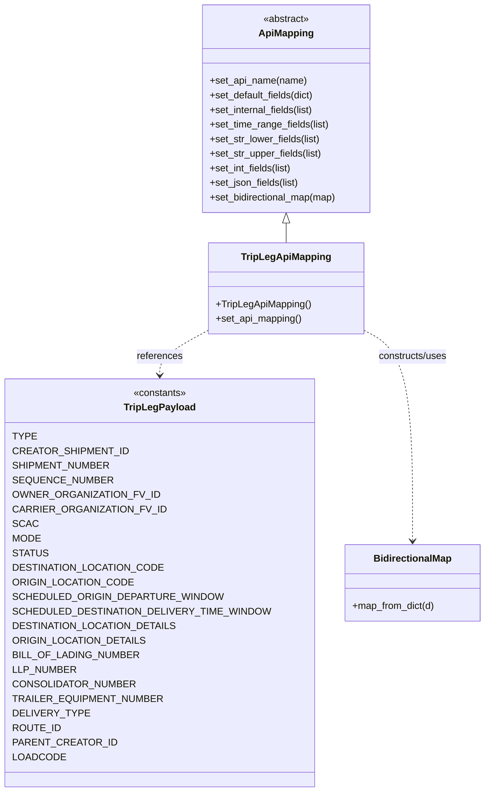

# Diagram: container_tracking_core/container_tracking_service/container_tracking_service/api/trip_leg/handlers/mapping/TripLegApiMapping.py


> Auto-generated by Obscura crawlers

## Diagram 1



### SVG

<svg id="container" width="742.6640625" xmlns="http://www.w3.org/2000/svg" class="classDiagram" height="1304" viewBox="0 0 742.6640625 1304" role="graphics-document document" aria-roledescription="class"><style>#container{font-family:"trebuchet ms",verdana,arial,sans-serif;font-size:16px;fill:#333;}@keyframes edge-animation-frame{from{stroke-dashoffset:0;}}@keyframes dash{to{stroke-dashoffset:0;}}#container .edge-animation-slow{stroke-dasharray:9,5!important;stroke-dashoffset:900;animation:dash 50s linear infinite;stroke-linecap:round;}#container .edge-animation-fast{stroke-dasharray:9,5!important;stroke-dashoffset:900;animation:dash 20s linear infinite;stroke-linecap:round;}#container .error-icon{fill:#552222;}#container .error-text{fill:#552222;stroke:#552222;}#container .edge-thickness-normal{stroke-width:1px;}#container .edge-thickness-thick{stroke-width:3.5px;}#container .edge-pattern-solid{stroke-dasharray:0;}#container .edge-thickness-invisible{stroke-width:0;fill:none;}#container .edge-pattern-dashed{stroke-dasharray:3;}#container .edge-pattern-dotted{stroke-dasharray:2;}#container .marker{fill:#333333;stroke:#333333;}#container .marker.cross{stroke:#333333;}#container svg{font-family:"trebuchet ms",verdana,arial,sans-serif;font-size:16px;}#container p{margin:0;}#container g.classGroup text{fill:#9370DB;stroke:none;font-family:"trebuchet ms",verdana,arial,sans-serif;font-size:10px;}#container g.classGroup text .title{font-weight:bolder;}#container .nodeLabel,#container .edgeLabel{color:#131300;}#container .edgeLabel .label rect{fill:#ECECFF;}#container .label text{fill:#131300;}#container .labelBkg{background:#ECECFF;}#container .edgeLabel .label span{background:#ECECFF;}#container .classTitle{font-weight:bolder;}#container .node rect,#container .node circle,#container .node ellipse,#container .node polygon,#container .node path{fill:#ECECFF;stroke:#9370DB;stroke-width:1px;}#container .divider{stroke:#9370DB;stroke-width:1;}#container g.clickable{cursor:pointer;}#container g.classGroup rect{fill:#ECECFF;stroke:#9370DB;}#container g.classGroup line{stroke:#9370DB;stroke-width:1;}#container .classLabel .box{stroke:none;stroke-width:0;fill:#ECECFF;opacity:0.5;}#container .classLabel .label{fill:#9370DB;font-size:10px;}#container .relation{stroke:#333333;stroke-width:1;fill:none;}#container .dashed-line{stroke-dasharray:3;}#container .dotted-line{stroke-dasharray:1 2;}#container #compositionStart,#container .composition{fill:#333333!important;stroke:#333333!important;stroke-width:1;}#container #compositionEnd,#container .composition{fill:#333333!important;stroke:#333333!important;stroke-width:1;}#container #dependencyStart,#container .dependency{fill:#333333!important;stroke:#333333!important;stroke-width:1;}#container #dependencyStart,#container .dependency{fill:#333333!important;stroke:#333333!important;stroke-width:1;}#container #extensionStart,#container .extension{fill:transparent!important;stroke:#333333!important;stroke-width:1;}#container #extensionEnd,#container .extension{fill:transparent!important;stroke:#333333!important;stroke-width:1;}#container #aggregationStart,#container .aggregation{fill:transparent!important;stroke:#333333!important;stroke-width:1;}#container #aggregationEnd,#container .aggregation{fill:transparent!important;stroke:#333333!important;stroke-width:1;}#container #lollipopStart,#container .lollipop{fill:#ECECFF!important;stroke:#333333!important;stroke-width:1;}#container #lollipopEnd,#container .lollipop{fill:#ECECFF!important;stroke:#333333!important;stroke-width:1;}#container .edgeTerminals{font-size:11px;line-height:initial;}#container .classTitleText{text-anchor:middle;font-size:18px;fill:#333;}#container .label-icon{display:inline-block;height:1em;overflow:visible;vertical-align:-0.125em;}#container .node .label-icon path{fill:currentColor;stroke:revert;stroke-width:revert;}#container :root{--mermaid-font-family:"trebuchet ms",verdana,arial,sans-serif;}</style><g><defs><marker id="container_class-aggregationStart" class="marker aggregation class" refX="18" refY="7" markerWidth="190" markerHeight="240" orient="auto"><path d="M 18,7 L9,13 L1,7 L9,1 Z"></path></marker></defs><defs><marker id="container_class-aggregationEnd" class="marker aggregation class" refX="1" refY="7" markerWidth="20" markerHeight="28" orient="auto"><path d="M 18,7 L9,13 L1,7 L9,1 Z"></path></marker></defs><defs><marker id="container_class-extensionStart" class="marker extension class" refX="18" refY="7" markerWidth="190" markerHeight="240" orient="auto"><path d="M 1,7 L18,13 V 1 Z"></path></marker></defs><defs><marker id="container_class-extensionEnd" class="marker extension class" refX="1" refY="7" markerWidth="20" markerHeight="28" orient="auto"><path d="M 1,1 V 13 L18,7 Z"></path></marker></defs><defs><marker id="container_class-compositionStart" class="marker composition class" refX="18" refY="7" markerWidth="190" markerHeight="240" orient="auto"><path d="M 18,7 L9,13 L1,7 L9,1 Z"></path></marker></defs><defs><marker id="container_class-compositionEnd" class="marker composition class" refX="1" refY="7" markerWidth="20" markerHeight="28" orient="auto"><path d="M 18,7 L9,13 L1,7 L9,1 Z"></path></marker></defs><defs><marker id="container_class-dependencyStart" class="marker dependency class" refX="6" refY="7" markerWidth="190" markerHeight="240" orient="auto"><path d="M 5,7 L9,13 L1,7 L9,1 Z"></path></marker></defs><defs><marker id="container_class-dependencyEnd" class="marker dependency class" refX="13" refY="7" markerWidth="20" markerHeight="28" orient="auto"><path d="M 18,7 L9,13 L14,7 L9,1 Z"></path></marker></defs><defs><marker id="container_class-lollipopStart" class="marker lollipop class" refX="13" refY="7" markerWidth="190" markerHeight="240" orient="auto"><circle stroke="black" fill="transparent" cx="7" cy="7" r="6"></circle></marker></defs><defs><marker id="container_class-lollipopEnd" class="marker lollipop class" refX="1" refY="7" markerWidth="190" markerHeight="240" orient="auto"><circle stroke="black" fill="transparent" cx="7" cy="7" r="6"></circle></marker></defs><g class="root"><g class="clusters"></g><g class="edgePaths"><path d="M428.814,367.25L428.814,368.542C428.814,369.833,428.814,372.417,428.814,377.875C428.814,383.333,428.814,391.667,428.814,395.833L428.814,400" id="id_ApiMapping_TripLegApiMapping_1" class="edge-thickness-normal edge-pattern-solid relation" style=";;;" data-edge="true" data-et="edge" data-id="id_ApiMapping_TripLegApiMapping_1" data-points="W3sieCI6NDI4LjgxNDQ1MzEyNSwieSI6MzUwfSx7IngiOjQyOC44MTQ0NTMxMjUsInkiOjM3NX0seyJ4Ijo0MjguODE0NDUzMTI1LCJ5Ijo0MDB9XQ==" marker-start="url(#container_class-extensionStart)"></path><path d="M303.811,547.105L292.284,553.755C280.757,560.404,257.702,573.702,246.175,585.518C234.648,597.333,234.648,607.667,234.648,612.833L234.648,618" id="id_TripLegApiMapping_TripLegPayload_2" class="edge-thickness-normal edge-pattern-dashed relation" style=";;;" data-edge="true" data-et="edge" data-id="id_TripLegApiMapping_TripLegPayload_2" data-points="W3sieCI6MzAzLjgxMDU0Njg3NSwieSI6NTQ3LjEwNTQ5OTI4MDc3ODJ9LHsieCI6MjM0LjY0ODQzNzUsInkiOjU4N30seyJ4IjoyMzQuNjQ4NDM3NSwieSI6NjI0fV0=" marker-end="url(#container_class-dependencyEnd)"></path><path d="M553.818,547.105L565.345,553.755C576.872,560.404,599.926,573.702,611.453,631.018C622.98,688.333,622.98,789.667,622.98,840.333L622.98,891" id="id_TripLegApiMapping_BidirectionalMap_3" class="edge-thickness-normal edge-pattern-dashed relation" style=";;;" data-edge="true" data-et="edge" data-id="id_TripLegApiMapping_BidirectionalMap_3" data-points="W3sieCI6NTUzLjgxODM1OTM3NSwieSI6NTQ3LjEwNTQ5OTI4MDc3ODJ9LHsieCI6NjIyLjk4MDQ2ODc1LCJ5Ijo1ODd9LHsieCI6NjIyLjk4MDQ2ODc1LCJ5Ijo4OTd9XQ==" marker-end="url(#container_class-dependencyEnd)"></path></g><g class="edgeLabels"><g class="edgeLabel"><g class="label" data-id="id_ApiMapping_TripLegApiMapping_1" transform="translate(0, 0)"><foreignObject width="0" height="0"><div xmlns="http://www.w3.org/1999/xhtml" class="labelBkg" style="display: table-cell; white-space: nowrap; line-height: 1.5; max-width: 200px; text-align: center;"><span class="edgeLabel"></span></div></foreignObject></g></g><g class="edgeLabel" transform="translate(234.6484375, 587)"><g class="label" data-id="id_TripLegApiMapping_TripLegPayload_2" transform="translate(-37.828125, -12)"><foreignObject width="75.65625" height="24"><div xmlns="http://www.w3.org/1999/xhtml" class="labelBkg" style="display: table-cell; white-space: nowrap; line-height: 1.5; max-width: 200px; text-align: center;"><span class="edgeLabel"><p>references</p></span></div></foreignObject></g></g><g class="edgeLabel" transform="translate(622.98046875, 587)"><g class="label" data-id="id_TripLegApiMapping_BidirectionalMap_3" transform="translate(-58.25, -12)"><foreignObject width="116.5" height="24"><div xmlns="http://www.w3.org/1999/xhtml" class="labelBkg" style="display: table-cell; white-space: nowrap; line-height: 1.5; max-width: 200px; text-align: center;"><span class="edgeLabel"><p>constructs/uses</p></span></div></foreignObject></g></g></g><g class="nodes"><g class="node default" id="classId-ApiMapping-0" transform="translate(428.814453125, 179)"><g class="basic label-container"><path d="M-140.23046875 -171 L140.23046875 -171 L140.23046875 171 L-140.23046875 171" stroke="none" stroke-width="0" fill="#ECECFF" style=""></path><path d="M-140.23046875 -171 C-51.92442242583033 -171, 36.38162389833934 -171, 140.23046875 -171 M-140.23046875 -171 C-28.38091042302817 -171, 83.46864790394366 -171, 140.23046875 -171 M140.23046875 -171 C140.23046875 -81.91227209073563, 140.23046875 7.1754558185287465, 140.23046875 171 M140.23046875 -171 C140.23046875 -61.786079267763725, 140.23046875 47.42784146447255, 140.23046875 171 M140.23046875 171 C75.98555428801049 171, 11.740639826020981 171, -140.23046875 171 M140.23046875 171 C60.549763128606955 171, -19.13094249278609 171, -140.23046875 171 M-140.23046875 171 C-140.23046875 77.57405672766393, -140.23046875 -15.85188654467214, -140.23046875 -171 M-140.23046875 171 C-140.23046875 46.009702307036804, -140.23046875 -78.98059538592639, -140.23046875 -171" stroke="#9370DB" stroke-width="1.3" fill="none" stroke-dasharray="0 0" style=""></path></g><g class="annotation-group text" transform="translate(-38.609375, -147)"><g class="label" style="" transform="translate(0,-12)"><foreignObject width="77.21875" height="24"><div xmlns="http://www.w3.org/1999/xhtml" style="display: table-cell; white-space: nowrap; line-height: 1.5; max-width: 127px; text-align: center;"><span class="nodeLabel markdown-node-label" style=""><p>«abstract»</p></span></div></foreignObject></g></g><g class="label-group text" transform="translate(-43.2578125, -123)"><g class="label" style="font-weight: bolder" transform="translate(0,-12)"><foreignObject width="86.515625" height="24"><div xmlns="http://www.w3.org/1999/xhtml" style="display: table-cell; white-space: nowrap; line-height: 1.5; max-width: 136px; text-align: center;"><span class="nodeLabel markdown-node-label" style=""><p>ApiMapping</p></span></div></foreignObject></g></g><g class="members-group text" transform="translate(-128.23046875, -75)"></g><g class="methods-group text" transform="translate(-128.23046875, -45)"><g class="label" style="" transform="translate(0,-12)"><foreignObject width="160.390625" height="24"><div xmlns="http://www.w3.org/1999/xhtml" style="display: table-cell; white-space: nowrap; line-height: 1.5; max-width: 218px; text-align: center;"><span class="nodeLabel markdown-node-label" style=""><p>+set_api_name(name)</p></span></div></foreignObject></g><g class="label" style="" transform="translate(0,12)"><foreignObject width="175.171875" height="24"><div xmlns="http://www.w3.org/1999/xhtml" style="display: table-cell; white-space: nowrap; line-height: 1.5; max-width: 233px; text-align: center;"><span class="nodeLabel markdown-node-label" style=""><p>+set_default_fields(dict)</p></span></div></foreignObject></g><g class="label" style="" transform="translate(0,36)"><foreignObject width="175.59375" height="24"><div xmlns="http://www.w3.org/1999/xhtml" style="display: table-cell; white-space: nowrap; line-height: 1.5; max-width: 233px; text-align: center;"><span class="nodeLabel markdown-node-label" style=""><p>+set_internal_fields(list)</p></span></div></foreignObject></g><g class="label" style="" transform="translate(0,60)"><foreignObject width="199.21875" height="24"><div xmlns="http://www.w3.org/1999/xhtml" style="display: table-cell; white-space: nowrap; line-height: 1.5; max-width: 257px; text-align: center;"><span class="nodeLabel markdown-node-label" style=""><p>+set_time_range_fields(list)</p></span></div></foreignObject></g><g class="label" style="" transform="translate(0,84)"><foreignObject width="184.015625" height="24"><div xmlns="http://www.w3.org/1999/xhtml" style="display: table-cell; white-space: nowrap; line-height: 1.5; max-width: 241px; text-align: center;"><span class="nodeLabel markdown-node-label" style=""><p>+set_str_lower_fields(list)</p></span></div></foreignObject></g><g class="label" style="" transform="translate(0,108)"><foreignObject width="186.75" height="24"><div xmlns="http://www.w3.org/1999/xhtml" style="display: table-cell; white-space: nowrap; line-height: 1.5; max-width: 244px; text-align: center;"><span class="nodeLabel markdown-node-label" style=""><p>+set_str_upper_fields(list)</p></span></div></foreignObject></g><g class="label" style="" transform="translate(0,132)"><foreignObject width="138.328125" height="24"><div xmlns="http://www.w3.org/1999/xhtml" style="display: table-cell; white-space: nowrap; line-height: 1.5; max-width: 196px; text-align: center;"><span class="nodeLabel markdown-node-label" style=""><p>+set_int_fields(list)</p></span></div></foreignObject></g><g class="label" style="" transform="translate(0,156)"><foreignObject width="149.90625" height="24"><div xmlns="http://www.w3.org/1999/xhtml" style="display: table-cell; white-space: nowrap; line-height: 1.5; max-width: 207px; text-align: center;"><span class="nodeLabel markdown-node-label" style=""><p>+set_json_fields(list)</p></span></div></foreignObject></g><g class="label" style="" transform="translate(0,180)"><foreignObject width="213.203125" height="24"><div xmlns="http://www.w3.org/1999/xhtml" style="display: table-cell; white-space: nowrap; line-height: 1.5; max-width: 271px; text-align: center;"><span class="nodeLabel markdown-node-label" style=""><p>+set_bidirectional_map(map)</p></span></div></foreignObject></g></g><g class="divider" style=""><path d="M-140.23046875 -99 C-76.22655379117865 -99, -12.22263883235729 -99, 140.23046875 -99 M-140.23046875 -99 C-58.190605258795074 -99, 23.849258232409852 -99, 140.23046875 -99" stroke="#9370DB" stroke-width="1.3" fill="none" stroke-dasharray="0 0" style=""></path></g><g class="divider" style=""><path d="M-140.23046875 -75 C-40.011339080412895 -75, 60.20779058917421 -75, 140.23046875 -75 M-140.23046875 -75 C-31.015847804628933 -75, 78.19877314074213 -75, 140.23046875 -75" stroke="#9370DB" stroke-width="1.3" fill="none" stroke-dasharray="0 0" style=""></path></g></g><g class="node default" id="classId-TripLegApiMapping-1" transform="translate(428.814453125, 475)"><g class="basic label-container"><path d="M-125.00390625 -75 L125.00390625 -75 L125.00390625 75 L-125.00390625 75" stroke="none" stroke-width="0" fill="#ECECFF" style=""></path><path d="M-125.00390625 -75 C-69.35679306278715 -75, -13.709679875574295 -75, 125.00390625 -75 M-125.00390625 -75 C-54.05206701704677 -75, 16.899772215906466 -75, 125.00390625 -75 M125.00390625 -75 C125.00390625 -30.429856627783913, 125.00390625 14.140286744432174, 125.00390625 75 M125.00390625 -75 C125.00390625 -27.45680970453462, 125.00390625 20.08638059093076, 125.00390625 75 M125.00390625 75 C44.87544698824671 75, -35.253012273506585 75, -125.00390625 75 M125.00390625 75 C73.62508157494874 75, 22.246256899897475 75, -125.00390625 75 M-125.00390625 75 C-125.00390625 20.043448828088003, -125.00390625 -34.913102343823994, -125.00390625 -75 M-125.00390625 75 C-125.00390625 21.483300873595766, -125.00390625 -32.03339825280847, -125.00390625 -75" stroke="#9370DB" stroke-width="1.3" fill="none" stroke-dasharray="0 0" style=""></path></g><g class="annotation-group text" transform="translate(0, -51)"></g><g class="label-group text" transform="translate(-70.3046875, -51)"><g class="label" style="font-weight: bolder" transform="translate(0,-12)"><foreignObject width="140.609375" height="24"><div xmlns="http://www.w3.org/1999/xhtml" style="display: table-cell; white-space: nowrap; line-height: 1.5; max-width: 189px; text-align: center;"><span class="nodeLabel markdown-node-label" style=""><p>TripLegApiMapping</p></span></div></foreignObject></g></g><g class="members-group text" transform="translate(-113.00390625, -3)"></g><g class="methods-group text" transform="translate(-113.00390625, 27)"><g class="label" style="" transform="translate(0,-12)"><foreignObject width="155.703125" height="24"><div xmlns="http://www.w3.org/1999/xhtml" style="display: table-cell; white-space: nowrap; line-height: 1.5; max-width: 213px; text-align: center;"><span class="nodeLabel markdown-node-label" style=""><p>+TripLegApiMapping()</p></span></div></foreignObject></g><g class="label" style="" transform="translate(0,12)"><foreignObject width="143" height="24"><div xmlns="http://www.w3.org/1999/xhtml" style="display: table-cell; white-space: nowrap; line-height: 1.5; max-width: 200px; text-align: center;"><span class="nodeLabel markdown-node-label" style=""><p>+set_api_mapping()</p></span></div></foreignObject></g></g><g class="divider" style=""><path d="M-125.00390625 -27 C-74.00371205928906 -27, -23.00351786857813 -27, 125.00390625 -27 M-125.00390625 -27 C-52.345229704218994 -27, 20.313446841562012 -27, 125.00390625 -27" stroke="#9370DB" stroke-width="1.3" fill="none" stroke-dasharray="0 0" style=""></path></g><g class="divider" style=""><path d="M-125.00390625 -3 C-60.59827829796599 -3, 3.8073496540680196 -3, 125.00390625 -3 M-125.00390625 -3 C-53.68283820340851 -3, 17.638229843182984 -3, 125.00390625 -3" stroke="#9370DB" stroke-width="1.3" fill="none" stroke-dasharray="0 0" style=""></path></g></g><g class="node default" id="classId-TripLegPayload-2" transform="translate(234.6484375, 960)"><g class="basic label-container"><path d="M-226.6484375 -336 L226.6484375 -336 L226.6484375 336 L-226.6484375 336" stroke="none" stroke-width="0" fill="#ECECFF" style=""></path><path d="M-226.6484375 -336 C-85.79061004358616 -336, 55.06721741282769 -336, 226.6484375 -336 M-226.6484375 -336 C-106.48795733022725 -336, 13.672522839545508 -336, 226.6484375 -336 M226.6484375 -336 C226.6484375 -178.2275079388066, 226.6484375 -20.45501587761322, 226.6484375 336 M226.6484375 -336 C226.6484375 -151.78160263886988, 226.6484375 32.43679472226023, 226.6484375 336 M226.6484375 336 C124.08694313103354 336, 21.52544876206707 336, -226.6484375 336 M226.6484375 336 C58.499836007729215 336, -109.64876548454157 336, -226.6484375 336 M-226.6484375 336 C-226.6484375 161.38050502314738, -226.6484375 -13.238989953705243, -226.6484375 -336 M-226.6484375 336 C-226.6484375 112.04974421187751, -226.6484375 -111.90051157624498, -226.6484375 -336" stroke="#9370DB" stroke-width="1.3" fill="none" stroke-dasharray="0 0" style=""></path></g><g class="annotation-group text" transform="translate(-44.2265625, -312)"><g class="label" style="" transform="translate(0,-12)"><foreignObject width="88.453125" height="24"><div xmlns="http://www.w3.org/1999/xhtml" style="display: table-cell; white-space: nowrap; line-height: 1.5; max-width: 138px; text-align: center;"><span class="nodeLabel markdown-node-label" style=""><p>«constants»</p></span></div></foreignObject></g></g><g class="label-group text" transform="translate(-55.953125, -288)"><g class="label" style="font-weight: bolder" transform="translate(0,-12)"><foreignObject width="111.90625" height="24"><div xmlns="http://www.w3.org/1999/xhtml" style="display: table-cell; white-space: nowrap; line-height: 1.5; max-width: 159px; text-align: center;"><span class="nodeLabel markdown-node-label" style=""><p>TripLegPayload</p></span></div></foreignObject></g></g><g class="members-group text" transform="translate(-214.6484375, -240)"><g class="label" style="" transform="translate(0,-12)"><foreignObject width="34.9375" height="24"><div xmlns="http://www.w3.org/1999/xhtml" style="display: table-cell; white-space: nowrap; line-height: 1.5; max-width: 85px; text-align: center;"><span class="nodeLabel markdown-node-label" style=""><p>TYPE</p></span></div></foreignObject></g><g class="label" style="" transform="translate(0,12)"><foreignObject width="167.921875" height="24"><div xmlns="http://www.w3.org/1999/xhtml" style="display: table-cell; white-space: nowrap; line-height: 1.5; max-width: 218px; text-align: center;"><span class="nodeLabel markdown-node-label" style=""><p>CREATOR_SHIPMENT_ID</p></span></div></foreignObject></g><g class="label" style="" transform="translate(0,36)"><foreignObject width="142.8125" height="24"><div xmlns="http://www.w3.org/1999/xhtml" style="display: table-cell; white-space: nowrap; line-height: 1.5; max-width: 193px; text-align: center;"><span class="nodeLabel markdown-node-label" style=""><p>SHIPMENT_NUMBER</p></span></div></foreignObject></g><g class="label" style="" transform="translate(0,60)"><foreignObject width="146.015625" height="24"><div xmlns="http://www.w3.org/1999/xhtml" style="display: table-cell; white-space: nowrap; line-height: 1.5; max-width: 196px; text-align: center;"><span class="nodeLabel markdown-node-label" style=""><p>SEQUENCE_NUMBER</p></span></div></foreignObject></g><g class="label" style="" transform="translate(0,84)"><foreignObject width="216" height="24"><div xmlns="http://www.w3.org/1999/xhtml" style="display: table-cell; white-space: nowrap; line-height: 1.5; max-width: 266px; text-align: center;"><span class="nodeLabel markdown-node-label" style=""><p>OWNER_ORGANIZATION_FV_ID</p></span></div></foreignObject></g><g class="label" style="" transform="translate(0,108)"><foreignObject width="222.984375" height="24"><div xmlns="http://www.w3.org/1999/xhtml" style="display: table-cell; white-space: nowrap; line-height: 1.5; max-width: 273px; text-align: center;"><span class="nodeLabel markdown-node-label" style=""><p>CARRIER_ORGANIZATION_FV_ID</p></span></div></foreignObject></g><g class="label" style="" transform="translate(0,132)"><foreignObject width="35.65625" height="24"><div xmlns="http://www.w3.org/1999/xhtml" style="display: table-cell; white-space: nowrap; line-height: 1.5; max-width: 86px; text-align: center;"><span class="nodeLabel markdown-node-label" style=""><p>SCAC</p></span></div></foreignObject></g><g class="label" style="" transform="translate(0,156)"><foreignObject width="42.234375" height="24"><div xmlns="http://www.w3.org/1999/xhtml" style="display: table-cell; white-space: nowrap; line-height: 1.5; max-width: 92px; text-align: center;"><span class="nodeLabel markdown-node-label" style=""><p>MODE</p></span></div></foreignObject></g><g class="label" style="" transform="translate(0,180)"><foreignObject width="51.6875" height="24"><div xmlns="http://www.w3.org/1999/xhtml" style="display: table-cell; white-space: nowrap; line-height: 1.5; max-width: 102px; text-align: center;"><span class="nodeLabel markdown-node-label" style=""><p>STATUS</p></span></div></foreignObject></g><g class="label" style="" transform="translate(0,204)"><foreignObject width="219.578125" height="24"><div xmlns="http://www.w3.org/1999/xhtml" style="display: table-cell; white-space: nowrap; line-height: 1.5; max-width: 270px; text-align: center;"><span class="nodeLabel markdown-node-label" style=""><p>DESTINATION_LOCATION_CODE</p></span></div></foreignObject></g><g class="label" style="" transform="translate(0,228)"><foreignObject width="176.4375" height="24"><div xmlns="http://www.w3.org/1999/xhtml" style="display: table-cell; white-space: nowrap; line-height: 1.5; max-width: 226px; text-align: center;"><span class="nodeLabel markdown-node-label" style=""><p>ORIGIN_LOCATION_CODE</p></span></div></foreignObject></g><g class="label" style="" transform="translate(0,252)"><foreignObject width="305.078125" height="24"><div xmlns="http://www.w3.org/1999/xhtml" style="display: table-cell; white-space: nowrap; line-height: 1.5; max-width: 355px; text-align: center;"><span class="nodeLabel markdown-node-label" style=""><p>SCHEDULED_ORIGIN_DEPARTURE_WINDOW</p></span></div></foreignObject></g><g class="label" style="" transform="translate(0,276)"><foreignObject width="373.34375" height="24"><div xmlns="http://www.w3.org/1999/xhtml" style="display: table-cell; white-space: nowrap; line-height: 1.5; max-width: 423px; text-align: center;"><span class="nodeLabel markdown-node-label" style=""><p>SCHEDULED_DESTINATION_DELIVERY_TIME_WINDOW</p></span></div></foreignObject></g><g class="label" style="" transform="translate(0,300)"><foreignObject width="238.3125" height="24"><div xmlns="http://www.w3.org/1999/xhtml" style="display: table-cell; white-space: nowrap; line-height: 1.5; max-width: 289px; text-align: center;"><span class="nodeLabel markdown-node-label" style=""><p>DESTINATION_LOCATION_DETAILS</p></span></div></foreignObject></g><g class="label" style="" transform="translate(0,324)"><foreignObject width="195.171875" height="24"><div xmlns="http://www.w3.org/1999/xhtml" style="display: table-cell; white-space: nowrap; line-height: 1.5; max-width: 245px; text-align: center;"><span class="nodeLabel markdown-node-label" style=""><p>ORIGIN_LOCATION_DETAILS</p></span></div></foreignObject></g><g class="label" style="" transform="translate(0,348)"><foreignObject width="187.15625" height="24"><div xmlns="http://www.w3.org/1999/xhtml" style="display: table-cell; white-space: nowrap; line-height: 1.5; max-width: 237px; text-align: center;"><span class="nodeLabel markdown-node-label" style=""><p>BILL_OF_LADING_NUMBER</p></span></div></foreignObject></g><g class="label" style="" transform="translate(0,372)"><foreignObject width="93.890625" height="24"><div xmlns="http://www.w3.org/1999/xhtml" style="display: table-cell; white-space: nowrap; line-height: 1.5; max-width: 144px; text-align: center;"><span class="nodeLabel markdown-node-label" style=""><p>LLP_NUMBER</p></span></div></foreignObject></g><g class="label" style="" transform="translate(0,396)"><foreignObject width="180.359375" height="24"><div xmlns="http://www.w3.org/1999/xhtml" style="display: table-cell; white-space: nowrap; line-height: 1.5; max-width: 231px; text-align: center;"><span class="nodeLabel markdown-node-label" style=""><p>CONSOLIDATOR_NUMBER</p></span></div></foreignObject></g><g class="label" style="" transform="translate(0,420)"><foreignObject width="219.59375" height="24"><div xmlns="http://www.w3.org/1999/xhtml" style="display: table-cell; white-space: nowrap; line-height: 1.5; max-width: 270px; text-align: center;"><span class="nodeLabel markdown-node-label" style=""><p>TRAILER_EQUIPMENT_NUMBER</p></span></div></foreignObject></g><g class="label" style="" transform="translate(0,444)"><foreignObject width="108.25" height="24"><div xmlns="http://www.w3.org/1999/xhtml" style="display: table-cell; white-space: nowrap; line-height: 1.5; max-width: 158px; text-align: center;"><span class="nodeLabel markdown-node-label" style=""><p>DELIVERY_TYPE</p></span></div></foreignObject></g><g class="label" style="" transform="translate(0,468)"><foreignObject width="71.390625" height="24"><div xmlns="http://www.w3.org/1999/xhtml" style="display: table-cell; white-space: nowrap; line-height: 1.5; max-width: 121px; text-align: center;"><span class="nodeLabel markdown-node-label" style=""><p>ROUTE_ID</p></span></div></foreignObject></g><g class="label" style="" transform="translate(0,492)"><foreignObject width="149.203125" height="24"><div xmlns="http://www.w3.org/1999/xhtml" style="display: table-cell; white-space: nowrap; line-height: 1.5; max-width: 199px; text-align: center;"><span class="nodeLabel markdown-node-label" style=""><p>PARENT_CREATOR_ID</p></span></div></foreignObject></g><g class="label" style="" transform="translate(0,516)"><foreignObject width="76.21875" height="24"><div xmlns="http://www.w3.org/1999/xhtml" style="display: table-cell; white-space: nowrap; line-height: 1.5; max-width: 126px; text-align: center;"><span class="nodeLabel markdown-node-label" style=""><p>LOADCODE</p></span></div></foreignObject></g></g><g class="methods-group text" transform="translate(-214.6484375, 336)"></g><g class="divider" style=""><path d="M-226.6484375 -264 C-74.69846744788708 -264, 77.25150260422583 -264, 226.6484375 -264 M-226.6484375 -264 C-126.24369429065618 -264, -25.83895108131236 -264, 226.6484375 -264" stroke="#9370DB" stroke-width="1.3" fill="none" stroke-dasharray="0 0" style=""></path></g><g class="divider" style=""><path d="M-226.6484375 312 C-86.07521225751145 312, 54.498012984977095 312, 226.6484375 312 M-226.6484375 312 C-96.35660152556497 312, 33.93523444887006 312, 226.6484375 312" stroke="#9370DB" stroke-width="1.3" fill="none" stroke-dasharray="0 0" style=""></path></g></g><g class="node default" id="classId-BidirectionalMap-3" transform="translate(622.98046875, 960)"><g class="basic label-container"><path d="M-111.68359375 -63 L111.68359375 -63 L111.68359375 63 L-111.68359375 63" stroke="none" stroke-width="0" fill="#ECECFF" style=""></path><path d="M-111.68359375 -63 C-28.071033659508558 -63, 55.541526430982884 -63, 111.68359375 -63 M-111.68359375 -63 C-45.256918486803116 -63, 21.16975677639377 -63, 111.68359375 -63 M111.68359375 -63 C111.68359375 -23.286992699583088, 111.68359375 16.426014600833824, 111.68359375 63 M111.68359375 -63 C111.68359375 -31.998654886561887, 111.68359375 -0.9973097731237743, 111.68359375 63 M111.68359375 63 C54.127179001720954 63, -3.429235746558092 63, -111.68359375 63 M111.68359375 63 C33.744930780583545 63, -44.19373218883291 63, -111.68359375 63 M-111.68359375 63 C-111.68359375 32.45121898539328, -111.68359375 1.9024379707865648, -111.68359375 -63 M-111.68359375 63 C-111.68359375 30.1049391325473, -111.68359375 -2.790121734905398, -111.68359375 -63" stroke="#9370DB" stroke-width="1.3" fill="none" stroke-dasharray="0 0" style=""></path></g><g class="annotation-group text" transform="translate(0, -39)"></g><g class="label-group text" transform="translate(-62.2265625, -39)"><g class="label" style="font-weight: bolder" transform="translate(0,-12)"><foreignObject width="124.453125" height="24"><div xmlns="http://www.w3.org/1999/xhtml" style="display: table-cell; white-space: nowrap; line-height: 1.5; max-width: 173px; text-align: center;"><span class="nodeLabel markdown-node-label" style=""><p>BidirectionalMap</p></span></div></foreignObject></g></g><g class="members-group text" transform="translate(-99.68359375, 9)"></g><g class="methods-group text" transform="translate(-99.68359375, 39)"><g class="label" style="" transform="translate(0,-12)"><foreignObject width="137.140625" height="24"><div xmlns="http://www.w3.org/1999/xhtml" style="display: table-cell; white-space: nowrap; line-height: 1.5; max-width: 195px; text-align: center;"><span class="nodeLabel markdown-node-label" style=""><p>+map_from_dict(d)</p></span></div></foreignObject></g></g><g class="divider" style=""><path d="M-111.68359375 -15 C-37.93203369940552 -15, 35.819526351188955 -15, 111.68359375 -15 M-111.68359375 -15 C-22.357874003962152 -15, 66.9678457420757 -15, 111.68359375 -15" stroke="#9370DB" stroke-width="1.3" fill="none" stroke-dasharray="0 0" style=""></path></g><g class="divider" style=""><path d="M-111.68359375 9 C-43.546075307718425 9, 24.59144313456315 9, 111.68359375 9 M-111.68359375 9 C-50.44999606254542 9, 10.783601624909167 9, 111.68359375 9" stroke="#9370DB" stroke-width="1.3" fill="none" stroke-dasharray="0 0" style=""></path></g></g></g></g></g></svg>

## Diagram 2

```mermaid
flowchart TD
Start([start]) --> Init[Instantiate TripLegApiMapping]
Init --> SetName[set_api_name("trip leg")]
SetName --> SetDefaults[set_default_fields({"status":"ACTIVE"})]
SetDefaults --> SetInternal[set_internal_fields(["solution_id","actor_id"])]
SetInternal --> SetTimeRange[set_time_range_fields(["scheduled_origin_pickup_window","scheduled_destination_delivery_window"])]
SetTimeRange --> SetStrLower[set_str_lower_fields(["mode","delivery_type"])]
SetStrLower --> SetStrUpper[set_str_upper_fields(["type","status"])]
SetStrUpper --> SetInt[set_int_fields(["sequence_number"])]
SetInt --> SetJson[set_json_fields(["destination_location_details","origin_location_details"])]
SetJson --> BuildMap[Create BidirectionalMap and map_from_dict]
subgraph MappingEntries["BidirectionalMap mapping dictionary"]
ME1[TripLegPayload.TYPE -> "type"]
ME2[TripLegPayload.CREATOR_SHIPMENT_ID -> "creator_shipment_id"]
ME3[TripLegPayload.SHIPMENT_NUMBER -> "shipment_number"]
ME4[TripLegPayload.SEQUENCE_NUMBER -> "sequence_number"]
ME5[TripLegPayload.OWNER_ORGANIZATION_FV_ID -> "owner_organization_fv_id"]
ME6[TripLegPayload.CARRIER_ORGANIZATION_FV_ID -> "carrier_organization_fv_id"]
ME7[TripLegPayload.SCAC -> "carrier_scac"]
ME8[TripLegPayload.MODE -> "mode"]
ME9[TripLegPayload.STATUS -> "status"]
ME10[TripLegPayload.DESTINATION_LOCATION_CODE -> "destination_location_code"]
ME11[TripLegPayload.ORIGIN_LOCATION_CODE -> "origin_location_code"]
ME12[TripLegPayload.SCHEDULED_ORIGIN_DEPARTURE_WINDOW -> "scheduled_origin_pickup_window"]
ME13[TripLegPayload.SCHEDULED_DESTINATION_DELIVERY_TIME_WINDOW -> "scheduled_destination_delivery_window"]
ME14[TripLegPayload.DESTINATION_LOCATION_DETAILS -> "destination_location_details"]
ME15[TripLegPayload.ORIGIN_LOCATION_DETAILS -> "origin_location_details"]
ME16[TripLegPayload.BILL_OF_LADING_NUMBER -> "bill_of_lading"]
ME17[TripLegPayload.LLP_NUMBER -> "llp_number"]
ME18[TripLegPayload.CONSOLIDATOR_NUMBER -> "consolidator_id"]
ME19[TripLegPayload.TRAILER_EQUIPMENT_NUMBER -> "trailer_equipment_number"]
ME20[TripLegPayload.DELIVERY_TYPE -> "delivery_type"]
ME21[TripLegPayload.ROUTE_ID -> "route_id"]
ME22[TripLegPayload.PARENT_CREATOR_ID -> "parent_creator_shipment_id"]
ME23[TripLegPayload.LOADCODE -> "load_code"]
end
BuildMap --> MappingEntries
MappingEntries --> SetBidirectional[set_bidirectional_map(mapped)]
SetBidirectional --> ReturnSelf[return self]
ReturnSelf --> End([end])
```

> SVG rendering failed for this diagram.
