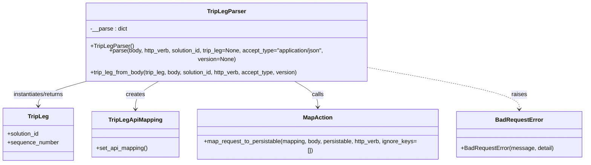
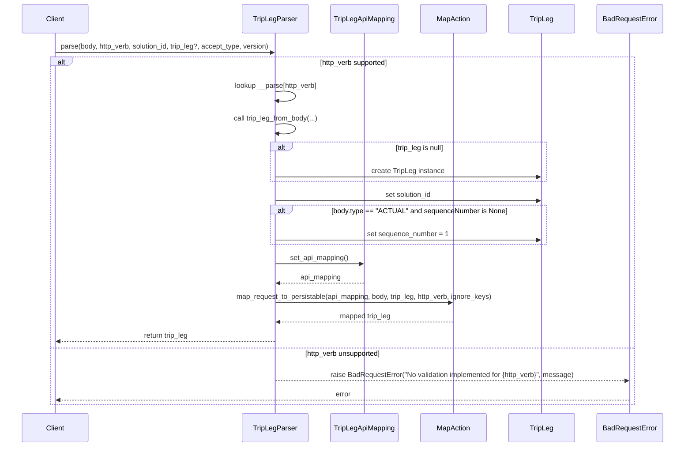

# Diagram: container_tracking_core/container_tracking_service/container_tracking_service/api/trip_leg/handlers/parse/TripParser.py

> Auto-generated by Obscura crawlers

## Diagram 1

### SVG

<svg id="container" width="1610.3203125" xmlns="http://www.w3.org/2000/svg" class="classDiagram" height="426" viewBox="0 0 1610.3203125 426" role="graphics-document document" aria-roledescription="class"><g><defs><marker id="container_class-aggregationStart" class="marker aggregation class" refX="18" refY="7" markerWidth="190" markerHeight="240" orient="auto"><path d="M 18,7 L9,13 L1,7 L9,1 Z"></path></marker></defs><defs><marker id="container_class-aggregationEnd" class="marker aggregation class" refX="1" refY="7" markerWidth="20" markerHeight="28" orient="auto"><path d="M 18,7 L9,13 L1,7 L9,1 Z"></path></marker></defs><defs><marker id="container_class-extensionStart" class="marker extension class" refX="18" refY="7" markerWidth="190" markerHeight="240" orient="auto"><path d="M 1,7 L18,13 V 1 Z"></path></marker></defs><defs><marker id="container_class-extensionEnd" class="marker extension class" refX="1" refY="7" markerWidth="20" markerHeight="28" orient="auto"><path d="M 1,1 V 13 L18,7 Z"></path></marker></defs><defs><marker id="container_class-compositionStart" class="marker composition class" refX="18" refY="7" markerWidth="190" markerHeight="240" orient="auto"><path d="M 18,7 L9,13 L1,7 L9,1 Z"></path></marker></defs><defs><marker id="container_class-compositionEnd" class="marker composition class" refX="1" refY="7" markerWidth="20" markerHeight="28" orient="auto"><path d="M 18,7 L9,13 L1,7 L9,1 Z"></path></marker></defs><defs><marker id="container_class-dependencyStart" class="marker dependency class" refX="6" refY="7" markerWidth="190" markerHeight="240" orient="auto"><path d="M 5,7 L9,13 L1,7 L9,1 Z"></path></marker></defs><defs><marker id="container_class-dependencyEnd" class="marker dependency class" refX="13" refY="7" markerWidth="20" markerHeight="28" orient="auto"><path d="M 18,7 L9,13 L14,7 L9,1 Z"></path></marker></defs><defs><marker id="container_class-lollipopStart" class="marker lollipop class" refX="13" refY="7" markerWidth="190" markerHeight="240" orient="auto"><circle stroke="black" fill="transparent" cx="7" cy="7" r="6"></circle></marker></defs><defs><marker id="container_class-lollipopEnd" class="marker lollipop class" refX="1" refY="7" markerWidth="190" markerHeight="240" orient="auto"><circle stroke="black" fill="transparent" cx="7" cy="7" r="6"></circle></marker></defs><g class="root"><g class="clusters"></g><g class="edgePaths"><path d="M248.668,200L224.646,206.167C200.623,212.333,152.579,224.667,128.557,236C104.535,247.333,104.535,257.667,104.535,262.833L104.535,268" id="id_TripLegParser_TripLeg_1" class="edge-thickness-normal edge-pattern-solid relation" style=";;;" data-edge="true" data-et="edge" data-id="id_TripLegParser_TripLeg_1" data-points="W3sieCI6MjQ4LjY2NzU4NjkzNjA5MDIzLCJ5IjoyMDB9LHsieCI6MTA0LjUzNTE1NjI1LCJ5IjoyMzd9LHsieCI6MTA0LjUzNTE1NjI1LCJ5IjoyNzR9XQ==" marker-end="url(#container_class-dependencyEnd)"></path><path d="M440.081,200L428.355,206.167C416.628,212.333,393.175,224.667,381.449,237.5C369.723,250.333,369.723,263.667,369.723,270.333L369.723,277" id="id_TripLegParser_TripLegApiMapping_2" class="edge-thickness-normal edge-pattern-solid relation" style=";;;" data-edge="true" data-et="edge" data-id="id_TripLegParser_TripLegApiMapping_2" data-points="W3sieCI6NDQwLjA4MTEyMDc3MDY3NjcsInkiOjIwMH0seyJ4IjozNjkuNzIyNjU2MjUsInkiOjIzN30seyJ4IjozNjkuNzIyNjU2MjUsInkiOjI4M31d" marker-end="url(#container_class-dependencyEnd)"></path><path d="M805.185,200L816.911,206.167C828.637,212.333,852.09,224.667,863.817,237.5C875.543,250.333,875.543,263.667,875.543,270.333L875.543,277" id="id_TripLegParser_MapAction_3" class="edge-thickness-normal edge-pattern-solid relation" style=";;;" data-edge="true" data-et="edge" data-id="id_TripLegParser_MapAction_3" data-points="W3sieCI6ODA1LjE4NDUwNDIyOTMyMzIsInkiOjIwMH0seyJ4Ijo4NzUuNTQyOTY4NzUsInkiOjIzN30seyJ4Ijo4NzUuNTQyOTY4NzUsInkiOjI4M31d" marker-end="url(#container_class-dependencyEnd)"></path><path d="M1017.359,168.823L1086.552,180.185C1155.745,191.548,1294.13,214.274,1363.323,232.304C1432.516,250.333,1432.516,263.667,1432.516,270.333L1432.516,277" id="id_TripLegParser_BadRequestError_4" class="edge-thickness-normal edge-pattern-dashed relation" style=";;;" data-edge="true" data-et="edge" data-id="id_TripLegParser_BadRequestError_4" data-points="W3sieCI6MTAxNy4zNTkzNzUsInkiOjE2OC44MjI1MDUxODQ5NzA4Mn0seyJ4IjoxNDMyLjUxNTYyNSwieSI6MjM3fSx7IngiOjE0MzIuNTE1NjI1LCJ5IjoyODN9XQ==" marker-end="url(#container_class-dependencyEnd)"></path></g><g class="edgeLabels"><g class="edgeLabel" transform="translate(104.53515625, 237)"><g class="label" data-id="id_TripLegParser_TripLeg_1" transform="translate(-73.1015625, -12)"><foreignObject width="146.203125" height="24">

instantiates/returns

</foreignObject></g></g><g class="edgeLabel" transform="translate(369.72265625, 237)"><g class="label" data-id="id_TripLegParser_TripLegApiMapping_2" transform="translate(-26.171875, -12)"><foreignObject width="52.34375" height="24">

creates

</foreignObject></g></g><g class="edgeLabel" transform="translate(875.54296875, 237)"><g class="label" data-id="id_TripLegParser_MapAction_3" transform="translate(-16.4453125, -12)"><foreignObject width="32.890625" height="24">

calls

</foreignObject></g></g><g class="edgeLabel" transform="translate(1432.515625, 237)"><g class="label" data-id="id_TripLegParser_BadRequestError_4" transform="translate(-21.25, -12)"><foreignObject width="42.5" height="24">

raises

</foreignObject></g></g></g><g class="nodes"><g class="node default" id="classId-TripLegParser-0" transform="translate(622.6328125, 104)"><g class="basic label-container"><path d="M-394.7265625 -96 L394.7265625 -96 L394.7265625 96 L-394.7265625 96" stroke="none" stroke-width="0" fill="#ECECFF" style=""></path><path d="M-394.7265625 -96 C-91.4673275249109 -96, 211.7919074501782 -96, 394.7265625 -96 M-394.7265625 -96 C-156.26513360230211 -96, 82.19629529539577 -96, 394.7265625 -96 M394.7265625 -96 C394.7265625 -41.27189086443667, 394.7265625 13.456218271126659, 394.7265625 96 M394.7265625 -96 C394.7265625 -30.082908031538523, 394.7265625 35.834183936922955, 394.7265625 96 M394.7265625 96 C171.78152454811942 96, -51.16351340376116 96, -394.7265625 96 M394.7265625 96 C206.56563698433519 96, 18.40471146867037 96, -394.7265625 96 M-394.7265625 96 C-394.7265625 34.37313120385477, -394.7265625 -27.253737592290463, -394.7265625 -96 M-394.7265625 96 C-394.7265625 28.50918965595214, -394.7265625 -38.98162068809572, -394.7265625 -96" stroke="#9370DB" stroke-width="1.3" fill="none" stroke-dasharray="0 0" style=""></path></g><g class="annotation-group text" transform="translate(0, -72)"></g><g class="label-group text" transform="translate(-50.421875, -72)"><g class="label" style="font-weight: bolder" transform="translate(0,-12)"><foreignObject width="100.84375" height="24">

TripLegParser

</foreignObject></g></g><g class="members-group text" transform="translate(-382.7265625, -24)"><g class="label" style="" transform="translate(0,-12)"><foreignObject width="101.65625" height="24">

-__parse : dict

</foreignObject></g></g><g class="methods-group text" transform="translate(-382.7265625, 24)"><g class="label" style="" transform="translate(0,-12)"><foreignObject width="115.578125" height="24">

+TripLegParser()

</foreignObject></g><g class="label" style="" transform="translate(0,12)"><foreignObject width="715.03125" height="24">

+parse(body, http_verb, solution_id, trip_leg=None, accept_type="application/json", version=None)

</foreignObject></g><g class="label" style="" transform="translate(0,36)"><foreignObject width="584.40625" height="24">

+trip_leg_from_body(trip_leg, body, solution_id, http_verb, accept_type, version)

</foreignObject></g></g><g class="divider" style=""><path d="M-394.7265625 -48 C-200.94552063654768 -48, -7.164478773095368 -48, 394.7265625 -48 M-394.7265625 -48 C-159.26891156788923 -48, 76.18873936422153 -48, 394.7265625 -48" stroke="#9370DB" stroke-width="1.3" fill="none" stroke-dasharray="0 0" style=""></path></g><g class="divider" style=""><path d="M-394.7265625 0 C-158.2134473899873 0, 78.29966772002541 0, 394.7265625 0 M-394.7265625 0 C-197.29278019991474 0, 0.1410021001705104 0, 394.7265625 0" stroke="#9370DB" stroke-width="1.3" fill="none" stroke-dasharray="0 0" style=""></path></g></g><g class="node default" id="classId-TripLeg-1" transform="translate(104.53515625, 346)"><g class="basic label-container"><path d="M-96.53515625 -72 L96.53515625 -72 L96.53515625 72 L-96.53515625 72" stroke="none" stroke-width="0" fill="#ECECFF" style=""></path><path d="M-96.53515625 -72 C-49.175871610065926 -72, -1.8165869701318513 -72, 96.53515625 -72 M-96.53515625 -72 C-51.053753451267404 -72, -5.5723506525348085 -72, 96.53515625 -72 M96.53515625 -72 C96.53515625 -40.75816318056871, 96.53515625 -9.516326361137416, 96.53515625 72 M96.53515625 -72 C96.53515625 -16.60032093113957, 96.53515625 38.79935813772086, 96.53515625 72 M96.53515625 72 C28.29384225736206 72, -39.94747173527588 72, -96.53515625 72 M96.53515625 72 C28.09729577394785 72, -40.3405647021043 72, -96.53515625 72 M-96.53515625 72 C-96.53515625 24.91477708679342, -96.53515625 -22.170445826413157, -96.53515625 -72 M-96.53515625 72 C-96.53515625 28.799630364991927, -96.53515625 -14.400739270016146, -96.53515625 -72" stroke="#9370DB" stroke-width="1.3" fill="none" stroke-dasharray="0 0" style=""></path></g><g class="annotation-group text" transform="translate(0, -48)"></g><g class="label-group text" transform="translate(-27.0546875, -48)"><g class="label" style="font-weight: bolder" transform="translate(0,-12)"><foreignObject width="54.109375" height="24">

TripLeg

</foreignObject></g></g><g class="members-group text" transform="translate(-84.53515625, 0)"><g class="label" style="" transform="translate(0,-12)"><foreignObject width="90.21875" height="24">

+solution_id

</foreignObject></g><g class="label" style="" transform="translate(0,12)"><foreignObject width="142.015625" height="24">

+sequence_number

</foreignObject></g></g><g class="methods-group text" transform="translate(-84.53515625, 72)"></g><g class="divider" style=""><path d="M-96.53515625 -24 C-30.219660462176165 -24, 36.09583532564767 -24, 96.53515625 -24 M-96.53515625 -24 C-53.87679516979357 -24, -11.218434089587134 -24, 96.53515625 -24" stroke="#9370DB" stroke-width="1.3" fill="none" stroke-dasharray="0 0" style=""></path></g><g class="divider" style=""><path d="M-96.53515625 48 C-35.37371799146432 48, 25.787720267071364 48, 96.53515625 48 M-96.53515625 48 C-35.52221360883396 48, 25.490729032332084 48, 96.53515625 48" stroke="#9370DB" stroke-width="1.3" fill="none" stroke-dasharray="0 0" style=""></path></g></g><g class="node default" id="classId-TripLegApiMapping-2" transform="translate(369.72265625, 346)"><g class="basic label-container"><path d="M-118.65234375 -63 L118.65234375 -63 L118.65234375 63 L-118.65234375 63" stroke="none" stroke-width="0" fill="#ECECFF" style=""></path><path d="M-118.65234375 -63 C-53.53408085431872 -63, 11.584182041362567 -63, 118.65234375 -63 M-118.65234375 -63 C-65.78489628742977 -63, -12.917448824859548 -63, 118.65234375 -63 M118.65234375 -63 C118.65234375 -25.268994276027023, 118.65234375 12.462011447945955, 118.65234375 63 M118.65234375 -63 C118.65234375 -18.583464827988905, 118.65234375 25.83307034402219, 118.65234375 63 M118.65234375 63 C46.96447148526312 63, -24.723400779473764 63, -118.65234375 63 M118.65234375 63 C31.39830671041817 63, -55.85573032916366 63, -118.65234375 63 M-118.65234375 63 C-118.65234375 32.857537561514036, -118.65234375 2.715075123028072, -118.65234375 -63 M-118.65234375 63 C-118.65234375 23.45974991005417, -118.65234375 -16.080500179891658, -118.65234375 -63" stroke="#9370DB" stroke-width="1.3" fill="none" stroke-dasharray="0 0" style=""></path></g><g class="annotation-group text" transform="translate(0, -39)"></g><g class="label-group text" transform="translate(-70.3046875, -39)"><g class="label" style="font-weight: bolder" transform="translate(0,-12)"><foreignObject width="140.609375" height="24">

TripLegApiMapping

</foreignObject></g></g><g class="members-group text" transform="translate(-106.65234375, 9)"></g><g class="methods-group text" transform="translate(-106.65234375, 39)"><g class="label" style="" transform="translate(0,-12)"><foreignObject width="143" height="24">

+set_api_mapping()

</foreignObject></g></g><g class="divider" style=""><path d="M-118.65234375 -15 C-49.00627165479055 -15, 20.639800440418895 -15, 118.65234375 -15 M-118.65234375 -15 C-65.1815565424026 -15, -11.710769334805192 -15, 118.65234375 -15" stroke="#9370DB" stroke-width="1.3" fill="none" stroke-dasharray="0 0" style=""></path></g><g class="divider" style=""><path d="M-118.65234375 9 C-26.81495511815777 9, 65.02243351368446 9, 118.65234375 9 M-118.65234375 9 C-63.82357221387074 9, -8.99480067774148 9, 118.65234375 9" stroke="#9370DB" stroke-width="1.3" fill="none" stroke-dasharray="0 0" style=""></path></g></g><g class="node default" id="classId-MapAction-3" transform="translate(875.54296875, 346)"><g class="basic label-container"><path d="M-337.16796875 -63 L337.16796875 -63 L337.16796875 63 L-337.16796875 63" stroke="none" stroke-width="0" fill="#ECECFF" style=""></path><path d="M-337.16796875 -63 C-133.08048808529182 -63, 71.00699257941636 -63, 337.16796875 -63 M-337.16796875 -63 C-76.26754805267478 -63, 184.63287264465043 -63, 337.16796875 -63 M337.16796875 -63 C337.16796875 -22.29942981732927, 337.16796875 18.401140365341462, 337.16796875 63 M337.16796875 -63 C337.16796875 -16.007016586930064, 337.16796875 30.985966826139872, 337.16796875 63 M337.16796875 63 C183.54083356305227 63, 29.91369837610455 63, -337.16796875 63 M337.16796875 63 C186.03637427900193 63, 34.904779808003866 63, -337.16796875 63 M-337.16796875 63 C-337.16796875 25.897607707618995, -337.16796875 -11.20478458476201, -337.16796875 -63 M-337.16796875 63 C-337.16796875 35.56292543455903, -337.16796875 8.125850869118054, -337.16796875 -63" stroke="#9370DB" stroke-width="1.3" fill="none" stroke-dasharray="0 0" style=""></path></g><g class="annotation-group text" transform="translate(0, -39)"></g><g class="label-group text" transform="translate(-38.6328125, -39)"><g class="label" style="font-weight: bolder" transform="translate(0,-12)"><foreignObject width="77.265625" height="24">

MapAction

</foreignObject></g></g><g class="members-group text" transform="translate(-325.16796875, 9)"></g><g class="methods-group text" transform="translate(-325.16796875, 39)"><g class="label" style="" transform="translate(0,-12)"><foreignObject width="611.703125" height="24">

+map_request_to_persistable(mapping, body, persistable, http_verb, ignore_keys=[])

</foreignObject></g></g><g class="divider" style=""><path d="M-337.16796875 -15 C-195.3507890982107 -15, -53.533609446421394 -15, 337.16796875 -15 M-337.16796875 -15 C-155.1197807720713 -15, 26.92840720585741 -15, 337.16796875 -15" stroke="#9370DB" stroke-width="1.3" fill="none" stroke-dasharray="0 0" style=""></path></g><g class="divider" style=""><path d="M-337.16796875 9 C-148.3301165060902 9, 40.50773573781959 9, 337.16796875 9 M-337.16796875 9 C-139.66972852788902 9, 57.82851169422196 9, 337.16796875 9" stroke="#9370DB" stroke-width="1.3" fill="none" stroke-dasharray="0 0" style=""></path></g></g><g class="node default" id="classId-BadRequestError-4" transform="translate(1432.515625, 346)"><g class="basic label-container"><path d="M-169.8046875 -63 L169.8046875 -63 L169.8046875 63 L-169.8046875 63" stroke="none" stroke-width="0" fill="#ECECFF" style=""></path><path d="M-169.8046875 -63 C-51.74097054038505 -63, 66.3227464192299 -63, 169.8046875 -63 M-169.8046875 -63 C-51.45219266955071 -63, 66.90030216089858 -63, 169.8046875 -63 M169.8046875 -63 C169.8046875 -21.643110476258407, 169.8046875 19.713779047483186, 169.8046875 63 M169.8046875 -63 C169.8046875 -15.204399890631507, 169.8046875 32.59120021873699, 169.8046875 63 M169.8046875 63 C74.88975438129094 63, -20.025178737418116 63, -169.8046875 63 M169.8046875 63 C83.87907984758937 63, -2.0465278048212667 63, -169.8046875 63 M-169.8046875 63 C-169.8046875 22.533886394208082, -169.8046875 -17.932227211583836, -169.8046875 -63 M-169.8046875 63 C-169.8046875 24.81574319587329, -169.8046875 -13.368513608253423, -169.8046875 -63" stroke="#9370DB" stroke-width="1.3" fill="none" stroke-dasharray="0 0" style=""></path></g><g class="annotation-group text" transform="translate(0, -39)"></g><g class="label-group text" transform="translate(-62.28125, -39)"><g class="label" style="font-weight: bolder" transform="translate(0,-12)"><foreignObject width="124.5625" height="24">

BadRequestError

</foreignObject></g></g><g class="members-group text" transform="translate(-157.8046875, 9)"></g><g class="methods-group text" transform="translate(-157.8046875, 39)"><g class="label" style="" transform="translate(0,-12)"><foreignObject width="253.328125" height="24">

+BadRequestError(message, detail)

</foreignObject></g></g><g class="divider" style=""><path d="M-169.8046875 -15 C-45.69514498031272 -15, 78.41439753937456 -15, 169.8046875 -15 M-169.8046875 -15 C-77.37955914713754 -15, 15.045569205724917 -15, 169.8046875 -15" stroke="#9370DB" stroke-width="1.3" fill="none" stroke-dasharray="0 0" style=""></path></g><g class="divider" style=""><path d="M-169.8046875 9 C-96.61015562220044 9, -23.415623744400875 9, 169.8046875 9 M-169.8046875 9 C-85.29153751136083 9, -0.7783875227216583 9, 169.8046875 9" stroke="#9370DB" stroke-width="1.3" fill="none" stroke-dasharray="0 0" style=""></path></g></g></g></g></g></svg>

## Diagram 2

### SVG

<svg id="container" width="1609.5" xmlns="http://www.w3.org/2000/svg" height="1065" viewBox="-50 -10 1609.5 1065" role="graphics-document document" aria-roledescription="sequence"><g><rect x="1359.5" y="979" fill="#eaeaea" stroke="#666" width="150" height="65" name="BadRequestError" rx="3" ry="3" class="actor actor-bottom"></rect><text x="1434.5" y="1011.5" dominant-baseline="central" alignment-baseline="central" class="actor actor-box" style="text-anchor: middle; font-size: 16px; font-weight: 400;"><tspan x="1434.5" dy="0">BadRequestError</tspan></text></g><g><rect x="1159.5" y="979" fill="#eaeaea" stroke="#666" width="150" height="65" name="TripLeg" rx="3" ry="3" class="actor actor-bottom"></rect><text x="1234.5" y="1011.5" dominant-baseline="central" alignment-baseline="central" class="actor actor-box" style="text-anchor: middle; font-size: 16px; font-weight: 400;"><tspan x="1234.5" dy="0">TripLeg</tspan></text></g><g><rect x="959.5" y="979" fill="#eaeaea" stroke="#666" width="150" height="65" name="MapAction" rx="3" ry="3" class="actor actor-bottom"></rect><text x="1034.5" y="1011.5" dominant-baseline="central" alignment-baseline="central" class="actor actor-box" style="text-anchor: middle; font-size: 16px; font-weight: 400;"><tspan x="1034.5" dy="0">MapAction</tspan></text></g><g><rect x="750.5" y="979" fill="#eaeaea" stroke="#666" width="159" height="65" name="TripLegApiMapping" rx="3" ry="3" class="actor actor-bottom"></rect><text x="830" y="1011.5" dominant-baseline="central" alignment-baseline="central" class="actor actor-box" style="text-anchor: middle; font-size: 16px; font-weight: 400;"><tspan x="830" dy="0">TripLegApiMapping</tspan></text></g><g><rect x="550" y="979" fill="#eaeaea" stroke="#666" width="150" height="65" name="TripLegParser" rx="3" ry="3" class="actor actor-bottom"></rect><text x="625" y="1011.5" dominant-baseline="central" alignment-baseline="central" class="actor actor-box" style="text-anchor: middle; font-size: 16px; font-weight: 400;"><tspan x="625" dy="0">TripLegParser</tspan></text></g><g><rect x="0" y="979" fill="#eaeaea" stroke="#666" width="150" height="65" name="Client" rx="3" ry="3" class="actor actor-bottom"></rect><text x="75" y="1011.5" dominant-baseline="central" alignment-baseline="central" class="actor actor-box" style="text-anchor: middle; font-size: 16px; font-weight: 400;"><tspan x="75" dy="0">Client</tspan></text></g><g><line id="actor5" x1="1434.5" y1="65" x2="1434.5" y2="979" class="actor-line 200" stroke-width="0.5px" stroke="#999" name="BadRequestError"></line><g id="root-5"><rect x="1359.5" y="0" fill="#eaeaea" stroke="#666" width="150" height="65" name="BadRequestError" rx="3" ry="3" class="actor actor-top"></rect><text x="1434.5" y="32.5" dominant-baseline="central" alignment-baseline="central" class="actor actor-box" style="text-anchor: middle; font-size: 16px; font-weight: 400;"><tspan x="1434.5" dy="0">BadRequestError</tspan></text></g></g><g><line id="actor4" x1="1234.5" y1="65" x2="1234.5" y2="979" class="actor-line 200" stroke-width="0.5px" stroke="#999" name="TripLeg"></line><g id="root-4"><rect x="1159.5" y="0" fill="#eaeaea" stroke="#666" width="150" height="65" name="TripLeg" rx="3" ry="3" class="actor actor-top"></rect><text x="1234.5" y="32.5" dominant-baseline="central" alignment-baseline="central" class="actor actor-box" style="text-anchor: middle; font-size: 16px; font-weight: 400;"><tspan x="1234.5" dy="0">TripLeg</tspan></text></g></g><g><line id="actor3" x1="1034.5" y1="65" x2="1034.5" y2="979" class="actor-line 200" stroke-width="0.5px" stroke="#999" name="MapAction"></line><g id="root-3"><rect x="959.5" y="0" fill="#eaeaea" stroke="#666" width="150" height="65" name="MapAction" rx="3" ry="3" class="actor actor-top"></rect><text x="1034.5" y="32.5" dominant-baseline="central" alignment-baseline="central" class="actor actor-box" style="text-anchor: middle; font-size: 16px; font-weight: 400;"><tspan x="1034.5" dy="0">MapAction</tspan></text></g></g><g><line id="actor2" x1="830" y1="65" x2="830" y2="979" class="actor-line 200" stroke-width="0.5px" stroke="#999" name="TripLegApiMapping"></line><g id="root-2"><rect x="750.5" y="0" fill="#eaeaea" stroke="#666" width="159" height="65" name="TripLegApiMapping" rx="3" ry="3" class="actor actor-top"></rect><text x="830" y="32.5" dominant-baseline="central" alignment-baseline="central" class="actor actor-box" style="text-anchor: middle; font-size: 16px; font-weight: 400;"><tspan x="830" dy="0">TripLegApiMapping</tspan></text></g></g><g><line id="actor1" x1="625" y1="65" x2="625" y2="979" class="actor-line 200" stroke-width="0.5px" stroke="#999" name="TripLegParser"></line><g id="root-1"><rect x="550" y="0" fill="#eaeaea" stroke="#666" width="150" height="65" name="TripLegParser" rx="3" ry="3" class="actor actor-top"></rect><text x="625" y="32.5" dominant-baseline="central" alignment-baseline="central" class="actor actor-box" style="text-anchor: middle; font-size: 16px; font-weight: 400;"><tspan x="625" dy="0">TripLegParser</tspan></text></g></g><g><line id="actor0" x1="75" y1="65" x2="75" y2="979" class="actor-line 200" stroke-width="0.5px" stroke="#999" name="Client"></line><g id="root-0"><rect x="0" y="0" fill="#eaeaea" stroke="#666" width="150" height="65" name="Client" rx="3" ry="3" class="actor actor-top"></rect><text x="75" y="32.5" dominant-baseline="central" alignment-baseline="central" class="actor actor-box" style="text-anchor: middle; font-size: 16px; font-weight: 400;"><tspan x="75" dy="0">Client</tspan></text></g></g><g></g><defs><symbol id="computer" width="24" height="24"><path transform="scale(.5)" d="M2 2v13h20v-13h-20zm18 11h-16v-9h16v9zm-10.228 6l.466-1h3.524l.467 1h-4.457zm14.228 3h-24l2-6h2.104l-1.33 4h18.45l-1.297-4h2.073l2 6zm-5-10h-14v-7h14v7z"></path></symbol></defs><defs><symbol id="database" fill-rule="evenodd" clip-rule="evenodd"><path transform="scale(.5)" d="M12.258.001l.256.004.255.005.253.008.251.01.249.012.247.015.246.016.242.019.241.02.239.023.236.024.233.027.231.028.229.031.225.032.223.034.22.036.217.038.214.04.211.041.208.043.205.045.201.046.198.048.194.05.191.051.187.053.183.054.18.056.175.057.172.059.168.06.163.061.16.063.155.064.15.066.074.033.073.033.071.034.07.034.069.035.068.035.067.035.066.035.064.036.064.036.062.036.06.036.06.037.058.037.058.037.055.038.055.038.053.038.052.038.051.039.05.039.048.039.047.039.045.04.044.04.043.04.041.04.04.041.039.041.037.041.036.041.034.041.033.042.032.042.03.042.029.042.027.042.026.043.024.043.023.043.021.043.02.043.018.044.017.043.015.044.013.044.012.044.011.045.009.044.007.045.006.045.004.045.002.045.001.045v17l-.001.045-.002.045-.004.045-.006.045-.007.045-.009.044-.011.045-.012.044-.013.044-.015.044-.017.043-.018.044-.02.043-.021.043-.023.043-.024.043-.026.043-.027.042-.029.042-.03.042-.032.042-.033.042-.034.041-.036.041-.037.041-.039.041-.04.041-.041.04-.043.04-.044.04-.045.04-.047.039-.048.039-.05.039-.051.039-.052.038-.053.038-.055.038-.055.038-.058.037-.058.037-.06.037-.06.036-.062.036-.064.036-.064.036-.066.035-.067.035-.068.035-.069.035-.07.034-.071.034-.073.033-.074.033-.15.066-.155.064-.16.063-.163.061-.168.06-.172.059-.175.057-.18.056-.183.054-.187.053-.191.051-.194.05-.198.048-.201.046-.205.045-.208.043-.211.041-.214.04-.217.038-.22.036-.223.034-.225.032-.229.031-.231.028-.233.027-.236.024-.239.023-.241.02-.242.019-.246.016-.247.015-.249.012-.251.01-.253.008-.255.005-.256.004-.258.001-.258-.001-.256-.004-.255-.005-.253-.008-.251-.01-.249-.012-.247-.015-.245-.016-.243-.019-.241-.02-.238-.023-.236-.024-.234-.027-.231-.028-.228-.031-.226-.032-.223-.034-.22-.036-.217-.038-.214-.04-.211-.041-.208-.043-.204-.045-.201-.046-.198-.048-.195-.05-.19-.051-.187-.053-.184-.054-.179-.056-.176-.057-.172-.059-.167-.06-.164-.061-.159-.063-.155-.064-.151-.066-.074-.033-.072-.033-.072-.034-.07-.034-.069-.035-.068-.035-.067-.035-.066-.035-.064-.036-.063-.036-.062-.036-.061-.036-.06-.037-.058-.037-.057-.037-.056-.038-.055-.038-.053-.038-.052-.038-.051-.039-.049-.039-.049-.039-.046-.039-.046-.04-.044-.04-.043-.04-.041-.04-.04-.041-.039-.041-.037-.041-.036-.041-.034-.041-.033-.042-.032-.042-.03-.042-.029-.042-.027-.042-.026-.043-.024-.043-.023-.043-.021-.043-.02-.043-.018-.044-.017-.043-.015-.044-.013-.044-.012-.044-.011-.045-.009-.044-.007-.045-.006-.045-.004-.045-.002-.045-.001-.045v-17l.001-.045.002-.045.004-.045.006-.045.007-.045.009-.044.011-.045.012-.044.013-.044.015-.044.017-.043.018-.044.02-.043.021-.043.023-.043.024-.043.026-.043.027-.042.029-.042.03-.042.032-.042.033-.042.034-.041.036-.041.037-.041.039-.041.04-.041.041-.04.043-.04.044-.04.046-.04.046-.039.049-.039.049-.039.051-.039.052-.038.053-.038.055-.038.056-.038.057-.037.058-.037.06-.037.061-.036.062-.036.063-.036.064-.036.066-.035.067-.035.068-.035.069-.035.07-.034.072-.034.072-.033.074-.033.151-.066.155-.064.159-.063.164-.061.167-.06.172-.059.176-.057.179-.056.184-.054.187-.053.19-.051.195-.05.198-.048.201-.046.204-.045.208-.043.211-.041.214-.04.217-.038.22-.036.223-.034.226-.032.228-.031.231-.028.234-.027.236-.024.238-.023.241-.02.243-.019.245-.016.247-.015.249-.012.251-.01.253-.008.255-.005.256-.004.258-.001.258.001zm-9.258 20.499v.01l.001.021.003.021.004.022.005.021.006.022.007.022.009.023.01.022.011.023.012.023.013.023.015.023.016.024.017.023.018.024.019.024.021.024.022.025.023.024.024.025.052.049.056.05.061.051.066.051.07.051.075.051.079.052.084.052.088.052.092.052.097.052.102.051.105.052.11.052.114.051.119.051.123.051.127.05.131.05.135.05.139.048.144.049.147.047.152.047.155.047.16.045.163.045.167.043.171.043.176.041.178.041.183.039.187.039.19.037.194.035.197.035.202.033.204.031.209.03.212.029.216.027.219.025.222.024.226.021.23.02.233.018.236.016.24.015.243.012.246.01.249.008.253.005.256.004.259.001.26-.001.257-.004.254-.005.25-.008.247-.011.244-.012.241-.014.237-.016.233-.018.231-.021.226-.021.224-.024.22-.026.216-.027.212-.028.21-.031.205-.031.202-.034.198-.034.194-.036.191-.037.187-.039.183-.04.179-.04.175-.042.172-.043.168-.044.163-.045.16-.046.155-.046.152-.047.148-.048.143-.049.139-.049.136-.05.131-.05.126-.05.123-.051.118-.052.114-.051.11-.052.106-.052.101-.052.096-.052.092-.052.088-.053.083-.051.079-.052.074-.052.07-.051.065-.051.06-.051.056-.05.051-.05.023-.024.023-.025.021-.024.02-.024.019-.024.018-.024.017-.024.015-.023.014-.024.013-.023.012-.023.01-.023.01-.022.008-.022.006-.022.006-.022.004-.022.004-.021.001-.021.001-.021v-4.127l-.077.055-.08.053-.083.054-.085.053-.087.052-.09.052-.093.051-.095.05-.097.05-.1.049-.102.049-.105.048-.106.047-.109.047-.111.046-.114.045-.115.045-.118.044-.12.043-.122.042-.124.042-.126.041-.128.04-.13.04-.132.038-.134.038-.135.037-.138.037-.139.035-.142.035-.143.034-.144.033-.147.032-.148.031-.15.03-.151.03-.153.029-.154.027-.156.027-.158.026-.159.025-.161.024-.162.023-.163.022-.165.021-.166.02-.167.019-.169.018-.169.017-.171.016-.173.015-.173.014-.175.013-.175.012-.177.011-.178.01-.179.008-.179.008-.181.006-.182.005-.182.004-.184.003-.184.002h-.37l-.184-.002-.184-.003-.182-.004-.182-.005-.181-.006-.179-.008-.179-.008-.178-.01-.176-.011-.176-.012-.175-.013-.173-.014-.172-.015-.171-.016-.17-.017-.169-.018-.167-.019-.166-.02-.165-.021-.163-.022-.162-.023-.161-.024-.159-.025-.157-.026-.156-.027-.155-.027-.153-.029-.151-.03-.15-.03-.148-.031-.146-.032-.145-.033-.143-.034-.141-.035-.14-.035-.137-.037-.136-.037-.134-.038-.132-.038-.13-.04-.128-.04-.126-.041-.124-.042-.122-.042-.12-.044-.117-.043-.116-.045-.113-.045-.112-.046-.109-.047-.106-.047-.105-.048-.102-.049-.1-.049-.097-.05-.095-.05-.093-.052-.09-.051-.087-.052-.085-.053-.083-.054-.08-.054-.077-.054v4.127zm0-5.654v.011l.001.021.003.021.004.021.005.022.006.022.007.022.009.022.01.022.011.023.012.023.013.023.015.024.016.023.017.024.018.024.019.024.021.024.022.024.023.025.024.024.052.05.056.05.061.05.066.051.07.051.075.052.079.051.084.052.088.052.092.052.097.052.102.052.105.052.11.051.114.051.119.052.123.05.127.051.131.05.135.049.139.049.144.048.147.048.152.047.155.046.16.045.163.045.167.044.171.042.176.042.178.04.183.04.187.038.19.037.194.036.197.034.202.033.204.032.209.03.212.028.216.027.219.025.222.024.226.022.23.02.233.018.236.016.24.014.243.012.246.01.249.008.253.006.256.003.259.001.26-.001.257-.003.254-.006.25-.008.247-.01.244-.012.241-.015.237-.016.233-.018.231-.02.226-.022.224-.024.22-.025.216-.027.212-.029.21-.03.205-.032.202-.033.198-.035.194-.036.191-.037.187-.039.183-.039.179-.041.175-.042.172-.043.168-.044.163-.045.16-.045.155-.047.152-.047.148-.048.143-.048.139-.05.136-.049.131-.05.126-.051.123-.051.118-.051.114-.052.11-.052.106-.052.101-.052.096-.052.092-.052.088-.052.083-.052.079-.052.074-.051.07-.052.065-.051.06-.05.056-.051.051-.049.023-.025.023-.024.021-.025.02-.024.019-.024.018-.024.017-.024.015-.023.014-.023.013-.024.012-.022.01-.023.01-.023.008-.022.006-.022.006-.022.004-.021.004-.022.001-.021.001-.021v-4.139l-.077.054-.08.054-.083.054-.085.052-.087.053-.09.051-.093.051-.095.051-.097.05-.1.049-.102.049-.105.048-.106.047-.109.047-.111.046-.114.045-.115.044-.118.044-.12.044-.122.042-.124.042-.126.041-.128.04-.13.039-.132.039-.134.038-.135.037-.138.036-.139.036-.142.035-.143.033-.144.033-.147.033-.148.031-.15.03-.151.03-.153.028-.154.028-.156.027-.158.026-.159.025-.161.024-.162.023-.163.022-.165.021-.166.02-.167.019-.169.018-.169.017-.171.016-.173.015-.173.014-.175.013-.175.012-.177.011-.178.009-.179.009-.179.007-.181.007-.182.005-.182.004-.184.003-.184.002h-.37l-.184-.002-.184-.003-.182-.004-.182-.005-.181-.007-.179-.007-.179-.009-.178-.009-.176-.011-.176-.012-.175-.013-.173-.014-.172-.015-.171-.016-.17-.017-.169-.018-.167-.019-.166-.02-.165-.021-.163-.022-.162-.023-.161-.024-.159-.025-.157-.026-.156-.027-.155-.028-.153-.028-.151-.03-.15-.03-.148-.031-.146-.033-.145-.033-.143-.033-.141-.035-.14-.036-.137-.036-.136-.037-.134-.038-.132-.039-.13-.039-.128-.04-.126-.041-.124-.042-.122-.043-.12-.043-.117-.044-.116-.044-.113-.046-.112-.046-.109-.046-.106-.047-.105-.048-.102-.049-.1-.049-.097-.05-.095-.051-.093-.051-.09-.051-.087-.053-.085-.052-.083-.054-.08-.054-.077-.054v4.139zm0-5.666v.011l.001.02.003.022.004.021.005.022.006.021.007.022.009.023.01.022.011.023.012.023.013.023.015.023.016.024.017.024.018.023.019.024.021.025.022.024.023.024.024.025.052.05.056.05.061.05.066.051.07.051.075.052.079.051.084.052.088.052.092.052.097.052.102.052.105.051.11.052.114.051.119.051.123.051.127.05.131.05.135.05.139.049.144.048.147.048.152.047.155.046.16.045.163.045.167.043.171.043.176.042.178.04.183.04.187.038.19.037.194.036.197.034.202.033.204.032.209.03.212.028.216.027.219.025.222.024.226.021.23.02.233.018.236.017.24.014.243.012.246.01.249.008.253.006.256.003.259.001.26-.001.257-.003.254-.006.25-.008.247-.01.244-.013.241-.014.237-.016.233-.018.231-.02.226-.022.224-.024.22-.025.216-.027.212-.029.21-.03.205-.032.202-.033.198-.035.194-.036.191-.037.187-.039.183-.039.179-.041.175-.042.172-.043.168-.044.163-.045.16-.045.155-.047.152-.047.148-.048.143-.049.139-.049.136-.049.131-.051.126-.05.123-.051.118-.052.114-.051.11-.052.106-.052.101-.052.096-.052.092-.052.088-.052.083-.052.079-.052.074-.052.07-.051.065-.051.06-.051.056-.05.051-.049.023-.025.023-.025.021-.024.02-.024.019-.024.018-.024.017-.024.015-.023.014-.024.013-.023.012-.023.01-.022.01-.023.008-.022.006-.022.006-.022.004-.022.004-.021.001-.021.001-.021v-4.153l-.077.054-.08.054-.083.053-.085.053-.087.053-.09.051-.093.051-.095.051-.097.05-.1.049-.102.048-.105.048-.106.048-.109.046-.111.046-.114.046-.115.044-.118.044-.12.043-.122.043-.124.042-.126.041-.128.04-.13.039-.132.039-.134.038-.135.037-.138.036-.139.036-.142.034-.143.034-.144.033-.147.032-.148.032-.15.03-.151.03-.153.028-.154.028-.156.027-.158.026-.159.024-.161.024-.162.023-.163.023-.165.021-.166.02-.167.019-.169.018-.169.017-.171.016-.173.015-.173.014-.175.013-.175.012-.177.01-.178.01-.179.009-.179.007-.181.006-.182.006-.182.004-.184.003-.184.001-.185.001-.185-.001-.184-.001-.184-.003-.182-.004-.182-.006-.181-.006-.179-.007-.179-.009-.178-.01-.176-.01-.176-.012-.175-.013-.173-.014-.172-.015-.171-.016-.17-.017-.169-.018-.167-.019-.166-.02-.165-.021-.163-.023-.162-.023-.161-.024-.159-.024-.157-.026-.156-.027-.155-.028-.153-.028-.151-.03-.15-.03-.148-.032-.146-.032-.145-.033-.143-.034-.141-.034-.14-.036-.137-.036-.136-.037-.134-.038-.132-.039-.13-.039-.128-.041-.126-.041-.124-.041-.122-.043-.12-.043-.117-.044-.116-.044-.113-.046-.112-.046-.109-.046-.106-.048-.105-.048-.102-.048-.1-.05-.097-.049-.095-.051-.093-.051-.09-.052-.087-.052-.085-.053-.083-.053-.08-.054-.077-.054v4.153zm8.74-8.179l-.257.004-.254.005-.25.008-.247.011-.244.012-.241.014-.237.016-.233.018-.231.021-.226.022-.224.023-.22.026-.216.027-.212.028-.21.031-.205.032-.202.033-.198.034-.194.036-.191.038-.187.038-.183.04-.179.041-.175.042-.172.043-.168.043-.163.045-.16.046-.155.046-.152.048-.148.048-.143.048-.139.049-.136.05-.131.05-.126.051-.123.051-.118.051-.114.052-.11.052-.106.052-.101.052-.096.052-.092.052-.088.052-.083.052-.079.052-.074.051-.07.052-.065.051-.06.05-.056.05-.051.05-.023.025-.023.024-.021.024-.02.025-.019.024-.018.024-.017.023-.015.024-.014.023-.013.023-.012.023-.01.023-.01.022-.008.022-.006.023-.006.021-.004.022-.004.021-.001.021-.001.021.001.021.001.021.004.021.004.022.006.021.006.023.008.022.01.022.01.023.012.023.013.023.014.023.015.024.017.023.018.024.019.024.02.025.021.024.023.024.023.025.051.05.056.05.06.05.065.051.07.052.074.051.079.052.083.052.088.052.092.052.096.052.101.052.106.052.11.052.114.052.118.051.123.051.126.051.131.05.136.05.139.049.143.048.148.048.152.048.155.046.16.046.163.045.168.043.172.043.175.042.179.041.183.04.187.038.191.038.194.036.198.034.202.033.205.032.21.031.212.028.216.027.22.026.224.023.226.022.231.021.233.018.237.016.241.014.244.012.247.011.25.008.254.005.257.004.26.001.26-.001.257-.004.254-.005.25-.008.247-.011.244-.012.241-.014.237-.016.233-.018.231-.021.226-.022.224-.023.22-.026.216-.027.212-.028.21-.031.205-.032.202-.033.198-.034.194-.036.191-.038.187-.038.183-.04.179-.041.175-.042.172-.043.168-.043.163-.045.16-.046.155-.046.152-.048.148-.048.143-.048.139-.049.136-.05.131-.05.126-.051.123-.051.118-.051.114-.052.11-.052.106-.052.101-.052.096-.052.092-.052.088-.052.083-.052.079-.052.074-.051.07-.052.065-.051.06-.05.056-.05.051-.05.023-.025.023-.024.021-.024.02-.025.019-.024.018-.024.017-.023.015-.024.014-.023.013-.023.012-.023.01-.023.01-.022.008-.022.006-.023.006-.021.004-.022.004-.021.001-.021.001-.021-.001-.021-.001-.021-.004-.021-.004-.022-.006-.021-.006-.023-.008-.022-.01-.022-.01-.023-.012-.023-.013-.023-.014-.023-.015-.024-.017-.023-.018-.024-.019-.024-.02-.025-.021-.024-.023-.024-.023-.025-.051-.05-.056-.05-.06-.05-.065-.051-.07-.052-.074-.051-.079-.052-.083-.052-.088-.052-.092-.052-.096-.052-.101-.052-.106-.052-.11-.052-.114-.052-.118-.051-.123-.051-.126-.051-.131-.05-.136-.05-.139-.049-.143-.048-.148-.048-.152-.048-.155-.046-.16-.046-.163-.045-.168-.043-.172-.043-.175-.042-.179-.041-.183-.04-.187-.038-.191-.038-.194-.036-.198-.034-.202-.033-.205-.032-.21-.031-.212-.028-.216-.027-.22-.026-.224-.023-.226-.022-.231-.021-.233-.018-.237-.016-.241-.014-.244-.012-.247-.011-.25-.008-.254-.005-.257-.004-.26-.001-.26.001z"></path></symbol></defs><defs><symbol id="clock" width="24" height="24"><path transform="scale(.5)" d="M12 2c5.514 0 10 4.486 10 10s-4.486 10-10 10-10-4.486-10-10 4.486-10 10-10zm0-2c-6.627 0-12 5.373-12 12s5.373 12 12 12 12-5.373 12-12-5.373-12-12-12zm5.848 12.459c.202.038.202.333.001.372-1.907.361-6.045 1.111-6.547 1.111-.719 0-1.301-.582-1.301-1.301 0-.512.77-5.447 1.125-7.445.034-.192.312-.181.343.014l.985 6.238 5.394 1.011z"></path></symbol></defs><defs><marker id="arrowhead" refX="7.9" refY="5" markerUnits="userSpaceOnUse" markerWidth="12" markerHeight="12" orient="auto-start-reverse"><path d="M -1 0 L 10 5 L 0 10 z"></path></marker></defs><defs><marker id="crosshead" markerWidth="15" markerHeight="8" orient="auto" refX="4" refY="4.5"><path fill="none" stroke="#000000" stroke-width="1pt" d="M 1,2 L 6,7 M 6,2 L 1,7" style="stroke-dasharray: 0, 0;"></path></marker></defs><defs><marker id="filled-head" refX="15.5" refY="7" markerWidth="20" markerHeight="28" orient="auto"><path d="M 18,7 L9,13 L14,7 L9,1 Z"></path></marker></defs><defs><marker id="sequencenumber" refX="15" refY="15" markerWidth="60" markerHeight="40" orient="auto"><circle cx="15" cy="15" r="6"></circle></marker></defs><g><line x1="614" y1="324" x2="1245.5" y2="324" class="loopLine"></line><line x1="1245.5" y1="324" x2="1245.5" y2="417" class="loopLine"></line><line x1="614" y1="417" x2="1245.5" y2="417" class="loopLine"></line><line x1="614" y1="324" x2="614" y2="417" class="loopLine"></line><polygon points="614,324 664,324 664,337 655.6,344 614,344" class="labelBox"></polygon><text x="639" y="337" text-anchor="middle" dominant-baseline="middle" alignment-baseline="middle" class="labelText" style="font-size: 16px; font-weight: 400;">alt</text><text x="954.75" y="342" text-anchor="middle" class="loopText" style="font-size: 16px; font-weight: 400;"><tspan x="954.75">[trip_leg is null]</tspan></text></g><g><line x1="614" y1="475" x2="1245.5" y2="475" class="loopLine"></line><line x1="1245.5" y1="475" x2="1245.5" y2="568" class="loopLine"></line><line x1="614" y1="568" x2="1245.5" y2="568" class="loopLine"></line><line x1="614" y1="475" x2="614" y2="568" class="loopLine"></line><polygon points="614,475 664,475 664,488 655.6,495 614,495" class="labelBox"></polygon><text x="639" y="488" text-anchor="middle" dominant-baseline="middle" alignment-baseline="middle" class="labelText" style="font-size: 16px; font-weight: 400;">alt</text><text x="954.75" y="493" text-anchor="middle" class="loopText" style="font-size: 16px; font-weight: 400;"><tspan x="954.75">[body.type == "ACTUAL" and sequenceNumber is None]</tspan></text></g><g><line x1="64" y1="123" x2="1445.5" y2="123" class="loopLine"></line><line x1="1445.5" y1="123" x2="1445.5" y2="959" class="loopLine"></line><line x1="64" y1="959" x2="1445.5" y2="959" class="loopLine"></line><line x1="64" y1="123" x2="64" y2="959" class="loopLine"></line><line x1="64" y1="823" x2="1445.5" y2="823" class="loopLine" style="stroke-dasharray: 3, 3;"></line><polygon points="64,123 114,123 114,136 105.6,143 64,143" class="labelBox"></polygon><text x="89" y="136" text-anchor="middle" dominant-baseline="middle" alignment-baseline="middle" class="labelText" style="font-size: 16px; font-weight: 400;">alt</text><text x="779.75" y="141" text-anchor="middle" class="loopText" style="font-size: 16px; font-weight: 400;"><tspan x="779.75">[http_verb supported]</tspan></text><text x="754.75" y="841" text-anchor="middle" class="loopText" style="font-size: 16px; font-weight: 400;">[http_verb unsupported]</text></g><text x="349" y="80" text-anchor="middle" dominant-baseline="middle" alignment-baseline="middle" class="messageText" dy="1em" style="font-size: 16px; font-weight: 400;">parse(body, http_verb, solution_id, trip_leg?, accept_type, version)</text><line x1="76" y1="113" x2="621" y2="113" class="messageLine0" stroke-width="2" stroke="none" marker-end="url(#arrowhead)" style="fill: none;"></line><text x="626" y="173" text-anchor="middle" dominant-baseline="middle" alignment-baseline="middle" class="messageText" dy="1em" style="font-size: 16px; font-weight: 400;">lookup __parse[http_verb]</text><path d="M 626,206 C 686,196 686,236 626,226" class="messageLine0" stroke-width="2" stroke="none" marker-end="url(#arrowhead)" style="fill: none;"></path><text x="626" y="251" text-anchor="middle" dominant-baseline="middle" alignment-baseline="middle" class="messageText" dy="1em" style="font-size: 16px; font-weight: 400;">call trip_leg_from_body(...)</text><path d="M 626,284 C 686,274 686,314 626,304" class="messageLine0" stroke-width="2" stroke="none" marker-end="url(#arrowhead)" style="fill: none;"></path><text x="928" y="374" text-anchor="middle" dominant-baseline="middle" alignment-baseline="middle" class="messageText" dy="1em" style="font-size: 16px; font-weight: 400;">create TripLeg instance</text><line x1="626" y1="407" x2="1230.5" y2="407" class="messageLine0" stroke-width="2" stroke="none" marker-end="url(#arrowhead)" style="fill: none;"></line><text x="928" y="432" text-anchor="middle" dominant-baseline="middle" alignment-baseline="middle" class="messageText" dy="1em" style="font-size: 16px; font-weight: 400;">set solution_id</text><line x1="626" y1="465" x2="1230.5" y2="465" class="messageLine0" stroke-width="2" stroke="none" marker-end="url(#arrowhead)" style="fill: none;"></line><text x="928" y="525" text-anchor="middle" dominant-baseline="middle" alignment-baseline="middle" class="messageText" dy="1em" style="font-size: 16px; font-weight: 400;">set sequence_number = 1</text><line x1="626" y1="558" x2="1230.5" y2="558" class="messageLine0" stroke-width="2" stroke="none" marker-end="url(#arrowhead)" style="fill: none;"></line><text x="726" y="583" text-anchor="middle" dominant-baseline="middle" alignment-baseline="middle" class="messageText" dy="1em" style="font-size: 16px; font-weight: 400;">set_api_mapping()</text><line x1="626" y1="616" x2="826" y2="616" class="messageLine0" stroke-width="2" stroke="none" marker-end="url(#arrowhead)" style="fill: none;"></line><text x="729" y="631" text-anchor="middle" dominant-baseline="middle" alignment-baseline="middle" class="messageText" dy="1em" style="font-size: 16px; font-weight: 400;">api_mapping</text><line x1="829" y1="664" x2="629" y2="664" class="messageLine1" stroke-width="2" stroke="none" marker-end="url(#arrowhead)" style="stroke-dasharray: 3, 3; fill: none;"></line><text x="828" y="679" text-anchor="middle" dominant-baseline="middle" alignment-baseline="middle" class="messageText" dy="1em" style="font-size: 16px; font-weight: 400;">map_request_to_persistable(api_mapping, body, trip_leg, http_verb, ignore_keys)</text><line x1="626" y1="712" x2="1030.5" y2="712" class="messageLine0" stroke-width="2" stroke="none" marker-end="url(#arrowhead)" style="fill: none;"></line><text x="831" y="727" text-anchor="middle" dominant-baseline="middle" alignment-baseline="middle" class="messageText" dy="1em" style="font-size: 16px; font-weight: 400;">mapped trip_leg</text><line x1="1033.5" y1="760" x2="629" y2="760" class="messageLine1" stroke-width="2" stroke="none" marker-end="url(#arrowhead)" style="stroke-dasharray: 3, 3; fill: none;"></line><text x="352" y="775" text-anchor="middle" dominant-baseline="middle" alignment-baseline="middle" class="messageText" dy="1em" style="font-size: 16px; font-weight: 400;">return trip_leg</text><line x1="624" y1="808" x2="79" y2="808" class="messageLine1" stroke-width="2" stroke="none" marker-end="url(#arrowhead)" style="stroke-dasharray: 3, 3; fill: none;"></line><text x="1028" y="868" text-anchor="middle" dominant-baseline="middle" alignment-baseline="middle" class="messageText" dy="1em" style="font-size: 16px; font-weight: 400;">raise BadRequestError("No validation implemented for {http_verb}", message)</text><line x1="626" y1="901" x2="1430.5" y2="901" class="messageLine1" stroke-width="2" stroke="none" marker-end="url(#arrowhead)" style="stroke-dasharray: 3, 3; fill: none;"></line><text x="756" y="916" text-anchor="middle" dominant-baseline="middle" alignment-baseline="middle" class="messageText" dy="1em" style="font-size: 16px; font-weight: 400;">error</text><line x1="1433.5" y1="949" x2="79" y2="949" class="messageLine1" stroke-width="2" stroke="none" marker-end="url(#arrowhead)" style="stroke-dasharray: 3, 3; fill: none;"></line></svg>
